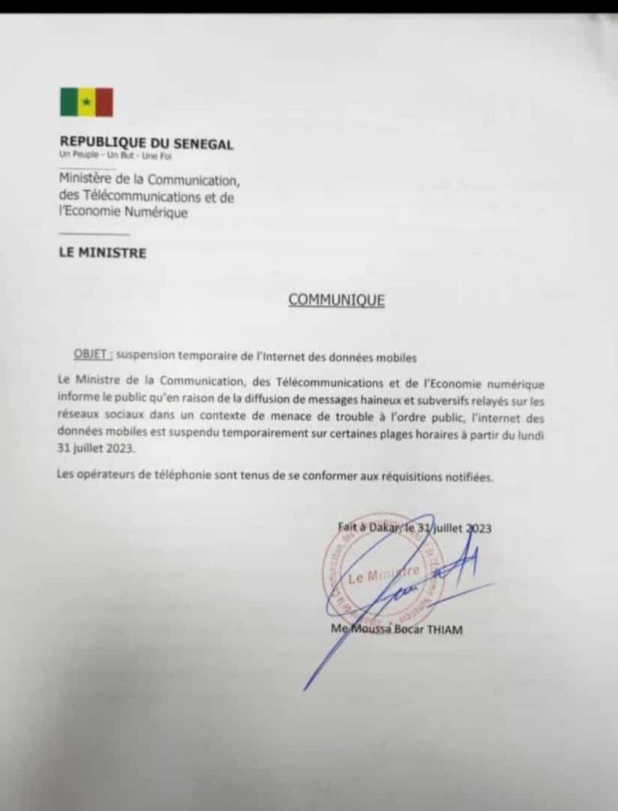
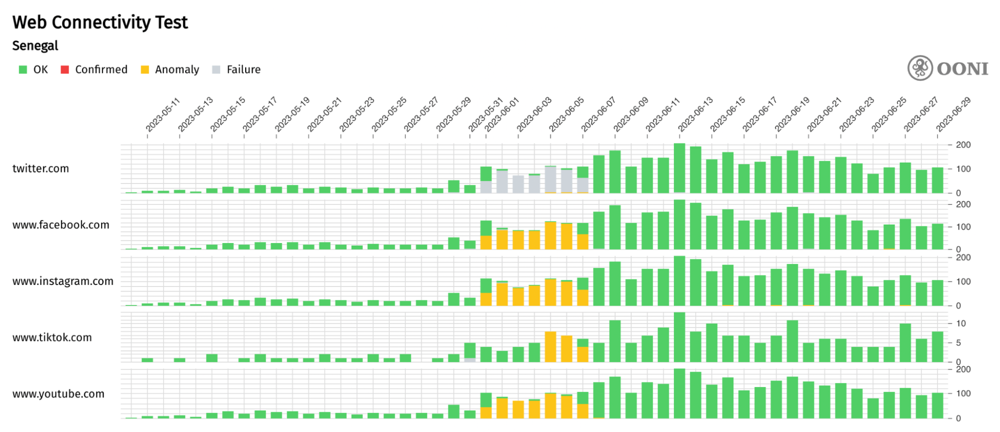
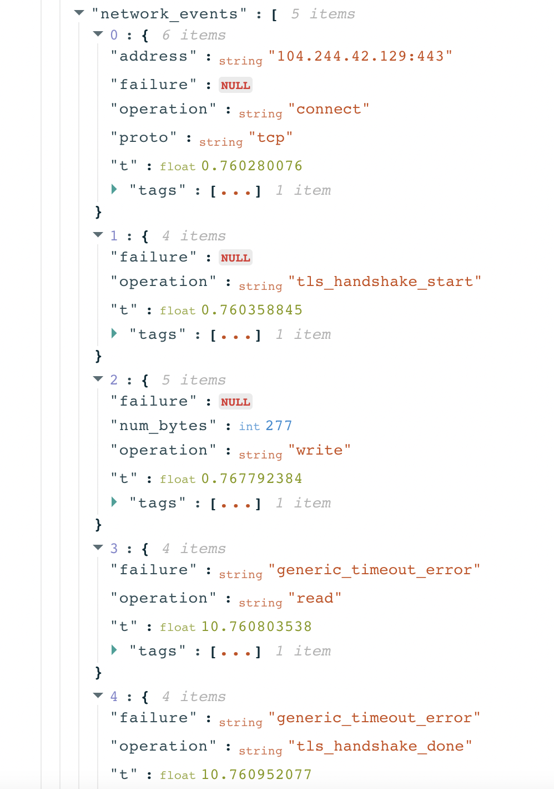

Violent protests [erupted](https://www.aljazeera.com/gallery/2023/6/4/death-toll-mounts-as-unrest-flares-in-senegal) in Senegal on 1st June 2023 over the sentencing of opposition leader Ousmane Sonko. On the same day, [OONI data](https://explorer.ooni.org/chart/mat?probe_cc=SN&since=2023-05-10&until=2023-06-30&time_grain=day&axis_x=measurement_start_day&test_name=whatsapp) collected from Senegal showed that ISPs started blocking access to several instant messaging apps and social media platforms (which were also [reported](https://www.bbc.com/news/world-africa-65788534) by several news outlets). Those blocks appear to have been in place for a week (until 7th June 2023). Meanwhile, Cloudflare observed [three disruptions](https://radar.cloudflare.com/as37649?dateStart=2023-06-03&dateEnd=2023-06-10) to traffic from AS37649 (Free/Tigo), and two disruptions at Sudatel Senegal during this period. Following the [arrest](https://www.aljazeera.com/news/2023/7/30/senegals-ousmane-sonko-charged-with-fomenting-insurrection) of Ousmane Sonko on 28th July 2023, the Senegalese Ministry of Communication, Telecommunications and the Digital Economy issued another shutdown order on 31st July 2023 to cut off mobile internet access.

The government of Senegal was responsible for the shutdowns which it [claimed](https://technext24.com/2023/06/05/internet-shutdown-in-senegal/) were necessary to prevent the spread of “hateful and violent” messages online.

In this report, we share [OONI data](https://explorer.ooni.org/chart/mat?probe_cc=SN&since=2023-05-10&until=2023-06-30&time_grain=day&axis_x=measurement_start_day&test_name=whatsapp) documenting the social media blocks in Senegal, as well as [Cloudflare Radar data](https://radar.cloudflare.com/as37649?dateStart=2023-06-03&dateEnd=2023-06-10) on the network outages that occurred in the country during the first week of June 2023. To examine how the shutdowns impacted people and communities in Senegal, we share survey findings from collaboration with Senegalese partners, as well as input from [Access Now](https://www.accessnow.org/). We also share [Cloudflare Radar data](https://radar.cloudflare.com/as37196?dateRange=1d) on the mobile internet disruptions that occurred in Senegal on 31st July 2023.



## Key Findings

Amid violent [protests](https://www.aljazeera.com/gallery/2023/6/4/death-toll-mounts-as-unrest-flares-in-senegal) that erupted over the sentencing of opposition leader Ousmane Sonko, Senegal experienced [network outages](https://radar.cloudflare.com/as37649?dateStart=2023-06-03&dateEnd=2023-06-10) and the [blocking of social media platforms](https://explorer.ooni.org/chart/mat?probe_cc=SN&since=2023-05-01&until=2023-07-21&time_grain=day&axis_x=measurement_start_day&test_name=whatsapp) in early June 2023. The Senegalese authorities were responsible for the disruptions which they [claimed](https://technext24.com/2023/06/05/internet-shutdown-in-senegal/) were necessary to curb the spread of “hateful and violent” messages online. However, the network disruptions imposed by the government of Senegal may have been an attempt to crack down on dissent and quell protests.

OONI data collected from Senegal shows the blocking of [WhatsApp](https://explorer.ooni.org/chart/mat?probe_cc=SN&since=2023-05-01&until=2023-07-21&time_grain=day&axis_x=measurement_start_day&test_name=whatsapp), [Telegram](https://explorer.ooni.org/chart/mat?test_name=telegram&axis_x=measurement_start_day&since=2023-05-01&until=2023-07-21&time_grain=day&probe_cc=SN), [Facebook](https://explorer.ooni.org/chart/mat?probe_cc=SN&since=2023-05-10&until=2023-06-30&time_grain=day&axis_x=measurement_start_day&test_name=web_connectivity&domain=www.facebook.com), [Instagram](https://explorer.ooni.org/chart/mat?probe_cc=SN&since=2023-05-10&until=2023-06-30&time_grain=day&axis_x=measurement_start_day&test_name=web_connectivity&domain=www.instagram.com), [Twitter](https://explorer.ooni.org/chart/mat?probe_cc=SN&since=2023-05-10&until=2023-06-30&time_grain=day&axis_x=measurement_start_day&test_name=web_connectivity&domain=twitter.com), and [YouTube](https://explorer.ooni.org/chart/mat?probe_cc=SN&since=2023-05-10&until=2023-06-30&time_grain=day&axis_x=measurement_start_day&test_name=web_connectivity&domain=www.youtube.com) between 1st to 7th June 2023. While these blocks were lifted by 8th June 2023, the [blocking of Telegram Web appears to be](https://explorer.ooni.org/search?since=2023-05-01&until=2023-08-02&probe_cc=SN&test_name=telegram&probe_asn=AS8346&failure=true) [ongoing](https://explorer.ooni.org/search?since=2023-05-01&until=2023-08-02&probe_cc=SN&test_name=telegram&probe_asn=AS8346&failure=true) [on Sonatel (AS8346)](https://explorer.ooni.org/search?since=2023-05-01&until=2023-08-02&probe_cc=SN&test_name=telegram&probe_asn=AS8346&failure=true) – spanning until at least 1st August 2023. OONI data also shows that access to [TikTok was temporarily blocked](https://explorer.ooni.org/chart/mat?probe_cc=SN&since=2023-05-10&until=2023-06-30&time_grain=day&axis_x=measurement_start_day&test_name=web_connectivity&domain=www.tiktok.com) in Senegal between 5th to 7th June 2023. In all cases, OONI data shows that the blocks were primarily implemented by means of TLS interference. Meanwhile, Cloudflare data shows [three disruptions](https://radar.cloudflare.com/as37649?dateStart=2023-06-03&dateEnd=2023-06-10) to traffic from Free/Tigo (AS37649), and [two disruptions at Sudatel Senegal (](https://radar.cloudflare.com/as37196)[AS37196)](https://radar.cloudflare.com/as37196) between 3rd to 6th June 2023. Cloudflare data also shows traffic drops at [Sudatel Senegal](https://radar.cloudflare.com/as37196?dateRange=1d) and [Tigo](https://radar.cloudflare.com/as37649?dateRange=1d) on 31st July 2023 (following the [arrest](https://www.aljazeera.com/news/2023/7/30/senegals-ousmane-sonko-charged-with-fomenting-insurrection) of Ousmane Sonko).

The survey findings suggest that these internet disruptions had widespread impact. Senegalese survey respondents who experienced the outages and blocks on the ground described that they had an impact on Senegal’s economic activity and political stability, on their professional endeavors, their social and psychological health and well-being, and on the vulnerable or marginalized groups in Senegal.

## Background

Senegal is continuing a worrying [trend of democratic backsliding](https://preparepreventresist.org/senegal-2/) through the escalating [use of internet shutdowns](https://www.accessnow.org/press-release/keep-people-connected-senegal/) during protests. On 4th March 2021, following protests against the high-profile arrest of opposition leader Ousmane Sonko, Senegalese authorities [reportedly blocked](https://www.bloomberg.com/news/articles/2021-03-05/senegal-shuts-down-tv-stations-internet-disrupted-amid-protests#xj4y7vzkg) Facebook, YouTube, WhatsApp, and Telegram. Additionally, President Macky Sall has repeatedly [spoken out](https://www.theafricareport.com/99491/senegals-president-joins-the-chorus-against-twitter-and-facebook/) against social media, expressing desire to more tightly control online spaces and suppress dissent. These are not idle threats, considering a measurably [declining press freedom landscape](https://www.occrp.org/en/daily/17009-senegalese-journalist-charged-with-endangering-national-security) and now at least two sets of internet shutdowns since 2021.

As detailed below, the most recent shutdowns began after protests erupted in Dakar and Ziguinchor on 1st June 2023, which resulted in [violent clashes](https://www.aljazeera.com/news/2023/6/2/ousmane-sonko-sentenced-why-are-tensions-flaring-in-senegal) between police and protestors and at least [23 deaths](https://www.amnesty.org/en/latest/news/2023/06/senegal-amnesty-international-demande-une-enquete-independante-sur-la-repression-meurtriere-lors-des-manifestations/) and hundreds of arrests. The Minister of Interior, Antoine Diome [confirmed](https://web.archive.org/web/20230602171956/https://www.pressafrik.com/Senegal-le-ministre-de-l-Interieur-annonce-neuf-9-morts_a258081.html) that the social media blocks were a “necessary measure” by the government to stop the spread of hate speech and violence. As the protests continued, the government [expanded its scope](https://www.reuters.com/world/africa/senegal-government-cuts-mobile-internet-access-amid-deadly-rioting-2023-06-04/) to include mobile network shutdowns across multiple providers beginning 4th June 2023. These mobile shutdowns targeted cities with protests during certain times of the day, and continued until 6th June 2023, while social media platform blocks were lifted by 8th June 2023. Disrupting access to mobile internet and social media apps have [proven to violate](https://www.ohchr.org/en/press-releases/2022/06/internet-shutdowns-un-report-details-dramatic-impact-peoples-lives-and-human#:~:text=%E2%80%9CShutdowns%20are%20powerful%20markers%20of,social%2C%20political%20or%20economic%20grievances.) the fundamental rights and freedoms of people to assembly, while also [providing cover](https://www.amnesty.org/en/documents/mde13/3782/2021/en/) for authorities and police to commit brutalities against protesters.

Presidential elections are scheduled for 2024, and although President Sall has ruled out seeking a third-term, activists and key stakeholders remain concerned about the risk of a shutdown. Civil society is coordinating and [preparing](https://preparepreventresist.org/wp-content/uploads/2023/02/Optima-Senegal-Report.pdf) its response and will be [watching](https://www.accessnow.org/campaign/2023-elections-and-internet-shutdowns-watch/) closely in the lead up to the election period given the Senegalese authorities’ clear willingness to impose wide-ranging social media blocks and mobile shutdowns in recent times.

## Methods

As part of this study, we analyzed [OONI network measurements collected from Senegal](https://explorer.ooni.org/chart/mat?probe_cc=SN&since=2023-05-01&until=2023-07-21&time_grain=day&axis_x=measurement_start_day&test_name=whatsapp) to examine the blocking of social media platforms. To examine the network outages, we referred to [Cloudflare data](https://radar.cloudflare.com/as37649?dateStart=2023-06-03&dateEnd=2023-06-10). We supplemented these findings with qualitative research findings gathered from related desk research and a survey shared with Senegalese civil society groups.

### Network measurement

#### OONI methods

Since 2012, OONI has developed free and open source software (called [OONI Probe](https://ooni.org/install/)) which is designed to [measure various forms of internet censorship](https://ooni.org/nettest/), including the blocking of websites and apps. Every month, OONI Probe is regularly run by volunteers in [around 160 countries](https://explorer.ooni.org/) (including [Senegal](https://explorer.ooni.org/country/SN)), and network measurements collected by OONI Probe users are automatically published as [open data in real-time](https://ooni.org/data).

To investigate the [reported](https://www.bbc.com/news/world-africa-65788534) social media blocks in Senegal, we analyzed [OONI measurements](https://explorer.ooni.org/chart/mat?probe_cc=SN&since=2023-05-01&until=2023-07-21&time_grain=day&axis_x=measurement_start_day&test_name=web_connectivity) collected from the testing of relevant services. The main question we attempted to answer was whether OONI data provides signals of social media censorship in Senegal during the first week of June 2023. To this end, we analyzed relevant [OONI data](https://explorer.ooni.org/chart/mat?probe_cc=SN&since=2023-05-01&until=2023-07-21&time_grain=day&axis_x=measurement_start_day&test_name=web_connectivity) collected from Senegal between May 2023 to July 2023 to evaluate whether we can identify a signal showing evidence of the blocking of social media by comparing data from the weeks before and after the reported block (early June 2023).

Generally, [OONI Probe](https://ooni.org/install/) includes the [Web Connectivity experiment](https://ooni.org/nettest/web-connectivity/) which is designed to measure the blocking of [websites](https://ooni.org/support/faq#which-websites-will-i-test-for-censorship-with-ooni-probe) (including numerous social media websites), as well as experiments designed to measure the blocking of specific instant messaging apps: [WhatsApp](https://ooni.org/nettest/whatsapp/), [Facebook Messenger](https://ooni.org/nettest/facebook-messenger/), [Telegram](https://ooni.org/nettest/telegram), and [Signal](https://ooni.org/nettest/signal/). As part of this study, we analyzed [Web Connectivity measurements](https://explorer.ooni.org/chart/mat?probe_cc=SN&since=2023-05-01&until=2023-07-21&time_grain=day&axis_x=measurement_start_day&test_name=web_connectivity) pertaining to the testing of social media websites, as well as measurements from the OONI Probe [WhatsApp](https://explorer.ooni.org/chart/mat?probe_cc=SN&since=2023-05-01&until=2023-07-21&time_grain=day&axis_x=measurement_start_day&test_name=whatsapp) and [Telegram](https://explorer.ooni.org/chart/mat?probe_cc=SN&since=2023-05-01&until=2023-07-21&time_grain=day&axis_x=measurement_start_day&test_name=telegram) experiments. We excluded Facebook Messenger and Signal measurements from this analysis because they did not provide strong signals of censorship, and they were impacted by data quality issues during the analysis period.

OONI’s [WhatsApp test](https://ooni.org/nettest/whatsapp/) is designed to measure the reachability of both WhatsApp’s app and the WhatsApp web version (`web.whatsapp.com`) within a tested network. Specifically, the test attempts to perform an HTTP GET request, TCP connection and DNS lookup to WhatsApp’s endpoints, registration service and web version over the vantage point of the user. Based on our methodology, we automatically annotate WhatsApp measurements as “successful” if the test succeeds in performing these steps.

If, however, any of the following occur, WhatsApp measurements are automatically annotated as “[anomalies](https://ooni.org/support/faq#what-do-you-mean-by-anomalies)”:

*   TCP connections to WhatsApp’s endpoints, registration service, or web.whatsapp.com fail;
*   DNS lookups resolve to IP addresses that are not allocated to WhatsApp;
*   HTTP requests to WhatsApp’s registration service or `web.whatsapp.com` do not send back a consistent response to OONI Probe.

OONI’s [Telegram test](https://ooni.org/nettest/telegram) is designed to measure the reachability of Telegram’s app and web version within a tested network. More specifically, this test attempts to perform an HTTP POST request, and establish a TCP connection to Telegram’s access points (DCs), as well as an HTTP GET request to Telegram’s web version (`web.telegram.org`) over the vantage point of the user. Based on this methodology, Telegram measurements are automatically annotated as “successful” if the test succeeds in performing these steps.

If, however, any of the following occur, Telegram measurements are automatically annotated as “anomalies”:

*   TCP connections to all the tested Telegram access points fail;
*   HTTP POST requests to Telegram’s access points do not send back a response to OONI servers;

*   HTTP(S) GET requests to web.telegram.org do not send back a consistent response to OONI Probe.

[Anomalous measurements](https://ooni.org/support/faq#what-do-you-mean-by-anomalies) may be indicative of blocking, but [false positives](https://ooni.org/support/faq#what-are-false-positives) can occur. We therefore consider that the likelihood of blocking is greater if the overall volume of anomalous measurements is high in comparison to the overall measurement count (compared on an ASN level within the same date range for each OONI Probe experiment type). We further disaggregate based on the reasons that caused the anomaly (e.g. TCP connection failures towards a set of WhatsApp endpoints) and if they are consistent, they provide a stronger signal of potential blocking.

OONI’s [Web Connectivity test](https://ooni.org/nettest/web-connectivity/), on the other hand, is designed to measure the accessibility of [URLs](https://github.com/citizenlab/test-lists/tree/master/lists) by performing the following steps:

*   Resolver identification
*   DNS lookup
*   TCP connect to the resolved IP addresses
*   TLS handshake to the resolved IP addresses
*   HTTP(s) GET request following redirects

The above steps are automatically performed from both the local network of the user, and from a control vantage point. If the results from both networks are the same, the tested URL is annotated as accessible. If the results differ, the tested URL is annotated as [anomalous](https://ooni.org/support/faq#what-do-you-mean-by-anomalies), and the type of anomaly is further characterized depending on the reason that caused the failure (for example, if the TCP connection fails, the measurement is annotated as a TCP/IP anomaly).

Each [Web Connectivity](https://ooni.org/nettest/web-connectivity/) measurement provides further network information (such as information pertaining to TLS handshakes) that helps with evaluating whether an anomalous measurement presents signs of blocking. Based on our heuristics, we are able to automatically confirm the blocking of websites if a [block page](https://ooni.org/support/glossary#block-page) is served, or if DNS resolution returns an IP known to be associated with censorship (and such fingerprints have been added to our database).

As part of this analysis, we observed that anomalous [Web Connectivity](https://explorer.ooni.org/chart/mat?probe_cc=SN&since=2023-05-01&until=2023-07-21&time_grain=day&axis_x=measurement_start_day&axis_y=domain&test_name=web_connectivity), [WhatsApp](https://explorer.ooni.org/chart/mat?probe_cc=SN&since=2023-05-01&until=2023-07-21&time_grain=day&axis_x=measurement_start_day&test_name=whatsapp) and [Telegram](https://explorer.ooni.org/chart/mat?probe_cc=SN&since=2023-05-01&until=2023-07-21&time_grain=day&axis_x=measurement_start_day&test_name=telegram) measurements from Senegal presented timeout errors. We aggregated the measurements based on these errors to evaluate if they are consistently present (or if the types of failures vary), as a more consistent failure type (such as a “generic timeout error”) observed in a larger volume of measurements provides a stronger signal of blocking. We also analyzed the network information from TLS handshake data in these measurements to evaluate whether the timeout errors were a result of TLS based interference.  

#### Cloudflare methods

Based on its global network and the Internet traffic handled for millions of customers, [Cloudflare](https://radar.cloudflare.com/) aggregates this traffic data at both geographical (country/region/city) and network (ASN) levels. Internet outages are measured/inferred based on observed and sustained drops in traffic volume for a given geography or network, and we generally work to correlate these traffic changes with real-world events.

### Qualitative research

#### Survey

A survey, coordinated by [Jonction](http://jonctionsenegal.free.fr/), [Computech](http://computechinstitute.com/), and the [OPTIMA](https://preparepreventresist.org/) project, was shared with the Senegalese Prepare & Prevent Network. This network was initially convened in May 2022 to discuss the challenges facing Senegal’s democracy and the threat of future internet shutdowns in the lead up to elections in 2024. As an output from this initial strategic workshop and additional research, they published an [Internet Shutdown Advocacy Needs Assessment](https://preparepreventresist.org/wp-content/uploads/2023/02/Optima-Senegal-Report.pdf) in November 2022 outlining the threats civil society faces in Senegal related to shutdowns and censorship as well as civil society needs to better prepare for and prevent internet shutdowns. From this workshop, the OPTIMA project funded several activities to respond to these needs and equip the network with the skills to better respond to future shutdowns.

This after-action survey was designed to be deployed quickly to understand qualitatively the experience of those on the ground during Senegal’s June 2023 shutdown.

The survey was sent on 7th July 2023 and respondents had 9 days to respond and circulate. The survey had **30 total responses**, of which 47% (n=14) reported that they were a part of OPTIMA’s Prepare & Prevent Network, and 15 others (50%) reported that they were not a part of the P&P network. One respondent reported that they were not sure if they participated in the P&P network. The respondents represent a number of professions, with 23% describing their primary profession as lawyers, 17% as journalists, 13% as activists, 7% as professionals working in information technologies, 7% as researchers, 7% as students, 7% as private sector, and 19% as ‘other’. The majority of the respondents (63%) reported that they live in Dakar.

We analyzed the survey results and shared the findings in the “Local experience” section of this report. Considering the small distribution of the survey to select actors, this survey should not be considered representative and rather treated as a measure of qualitative experiences of a small community of civil society actors within the country.

#### Shutdown orders

On 4th June 2023, the Senegal Ministry of Communication directed ISPs to suspend mobile data “in certain localities … during certain time slots.” They justified the action due to the “dissemination of hateful and subversive messages in a context of disturbance of public order.” Two days later, the Ministry directed operators to restore mobile internet connection. We found no evidence of formal shutdown orders (aside from [quotes](https://www.pressafrik.com/Senegal-le-ministre-de-l-Interieur-annonce-9-morts_a258081.html) from government officials) related to the multiple social media platforms blocked between 1st to 8th June 2023.

{{}}

**Photo:** Order from the Ministry of Communication, June 4, 2023.

{{}}

**Photo:** Follow-up order from the Ministry of Communication, June 6, 2023.

On 31st July 2023, the Senegal Ministry of Communication again directed ISPs to suspend mobile data following the [arrest](https://www.aljazeera.com/news/2023/7/30/senegals-ousmane-sonko-charged-with-fomenting-insurrection) of the Senegalese opposition leader. However, the order did not include specific times that the shutdowns were to take place, nor the expected duration of the shutdowns.

{{}}

**Photo:** Order from the Ministry of Communication, July 31, 2023.

These directives are compared with traffic data from [Cloudflare Radar](https://radar.cloudflare.com/as37649?dateStart=2023-06-03&dateEnd=2023-06-10) for ISPs in the country to confirm if operators indeed followed the direction of the government, and if so when. This information is used in combination, along with firsthand reports and news sources, to verify the occurrence and scope of a shutdown.

## Blocking of social media and instant messaging apps

### Blocking of WhatsApp and Telegram

On 1st June 2023, OONI data collected from Senegal shows that the testing of Whatsapp started to present anomalies. Specifically, these [anomalies](https://explorer.ooni.org/search?since=2023-06-01&until=2023-06-02&probe_cc=SN&test_name=whatsapp&failure=true) were primarily observed on Sonatel (AS8346), starting from [20:19 local time](https://explorer.ooni.org/m/20230601201903.757075_SN_whatsapp_a288261558c64f45). The timing of the anomalies coincides with the [eruption of protests](https://www.arabnews.com/node/2314851/world) in Senegal, suggesting a correlation with the anomalies observed in WhatsApp testing. An aggregate view of OONI measurements collected from the testing of WhatsApp in Senegal shows that the vast majority of measurements presented anomalies up until 7th June 2023, as illustrated through the following chart.  

{{}}

**Chart:** OONI Probe testing of WhatsApp in Senegal between 1st May 2023 to 20th July 2023 (source: [OONI MAT](https://explorer.ooni.org/chart/mat?probe_cc=SN&since=2023-05-01&until=2023-07-21&time_grain=day&axis_x=measurement_start_day&test_name=whatsapp)).

The fact that WhatsApp was previously accessible (as demonstrated by measurements annotated as “OK” before 1st June 2023), and that it was subsequently accessible from 8th June 2023 onwards, suggests that the anomalies observed between 1st to 7th June 2023 provide a signal of blocking. If anomalies were observed on several different networks during the same period, that would provide a stronger signal of blocking (as it’s less likely that false positives would occur for the same tested service during the same period on different networks).

A [per-ASN breakdown](https://explorer.ooni.org/chart/mat?probe_cc=SN&since=2023-05-01&until=2023-07-21&time_grain=day&axis_x=measurement_start_day&axis_y=probe_asn&test_name=whatsapp) of OONI measurement coverage in Senegal during the same period (1st May 2023 to 20th July 2023) shows that the testing of WhatsApp presented anomalies on both Sonatel (AS8346) and Saga Africa (AS37649) between 1st to 7th June 2023, as illustrated below.

{{}}

**Chart:** Per-ASN OONI Probe testing of WhatsApp in Senegal between 1st May 2023 to 20th July 2023 (source: [OONI MAT](https://explorer.ooni.org/chart/mat?probe_cc=SN&since=2023-05-01&until=2023-07-21&time_grain=day&axis_x=measurement_start_day&axis_y=probe_asn&test_name=whatsapp)).

The presence of anomalies in the testing of WhatsApp on two ASNs in Senegal (during the same period) further suggests that access to WhatsApp was blocked. Most measurements though were collected from Sonatel (AS8346), which means that measurements from that network can be interpreted with more confidence (in comparison to other tested networks).

To evaluate whether the anomalies are in fact indicative of blocking, we referred to the raw data in [anomalous](https://explorer.ooni.org/search?since=2023-06-01&until=2023-06-08&probe_cc=SN&test_name=whatsapp&failure=true&only=anomalies) WhatsApp measurements. OONI data shows that while TCP connections to WhatsApp’s endpoints were successful, the testing of WhatsApp Web and WhatsApp’s registration service resulted in failures. Specifically, OONI data [shows](https://explorer.ooni.org/m/20230607161335.606419_SN_whatsapp_d53b261ef91933c1) that the TLS handshakes for WhatsApp Web (`web.whatsapp.com`) and WhatsApp’s registration service (`v.whatsapp.net`) timed out.

{{}}

As we consistently observe [TLS handshakes timing out](https://explorer.ooni.org/search?since=2023-06-01&until=2023-06-08&probe_cc=SN&test_name=whatsapp&failure=true&only=anomalies) in WhatsApp measurements between 1st to 7th June 2023, OONI data suggests that access to **WhatsApp was blocked by means of TLS interference** in Senegal. This is further suggested by the fact that almost all subsequent WhatsApp measurements (collected from 8th June 2023 onwards from the same networks) were [successful](https://explorer.ooni.org/search?since=2023-06-01&until=2023-06-30&probe_cc=SN&test_name=whatsapp&failure=true), indicating that access to WhatsApp was unblocked by 8th June 2023. The timing of the lifting of the block correlates with [news reports](https://www.africanews.com/2023/06/06/normalcy-slowly-returns-in-senegal-following-deadly-protests//) on the de-escalation of violent clashes. 

Similarly, the testing of Telegram in Senegal started presenting [anomalies](https://explorer.ooni.org/chart/mat?test_name=telegram&axis_x=measurement_start_day&since=2023-05-01&until=2023-07-21&time_grain=day&probe_cc=SN) on 1st June 2023, as illustrated below.

{{}}

**Chart:** OONI Probe testing of Telegram in Senegal between 1st May 2023 to 20th July 2023 (source: [OONI MAT](https://explorer.ooni.org/chart/mat?test_name=telegram&axis_x=measurement_start_day&since=2023-05-01&until=2023-07-21&time_grain=day&probe_cc=SN)).

But unlike WhatsApp, the testing of Telegram did not present anomalies only until 7th June 2023. Instead, we observe that the anomalies are ongoing, spanning until (at least) 20th July 2023. A [global view of Telegram testing coverage](https://explorer.ooni.org/chart/mat?since=2023-05-01&until=2023-07-21&time_grain=day&axis_x=measurement_start_day&test_name=telegram) (during the same period) does not indicate any abnormal patterns, excluding the hypothesis that the ongoing anomalies may be symptomatic of Telegram being down globally (or an OONI Probe Telegram test bug, which would appear in global measurements).

Moreover, we observe that the longer-term Telegram anomalies (starting on 1st June 2023, and spanning beyond 7th June 2023) are [present on all 3 tested ASNs](https://explorer.ooni.org/chart/mat?probe_cc=SN&since=2023-05-01&until=2023-07-21&time_grain=day&axis_x=measurement_start_day&axis_y=probe_asn&test_name=telegram) in Senegal, as illustrated below.

{{}}

**Chart:** Per-ASN OONI Probe testing of Telegram in Senegal between 1st May 2023 to 20th July 2023 (source: [OONI MAT](https://explorer.ooni.org/chart/mat?probe_cc=SN&since=2023-05-01&until=2023-07-21&time_grain=day&axis_x=measurement_start_day&axis_y=probe_asn&test_name=telegram)).

The persistent presence of a relatively large volume of anomalies in the testing of Telegram on 3 different ASNs in Senegal (during the same period) provides a strong indication that, similarly to WhatsApp, access to Telegram was blocked – but unlike WhatsApp, the blocking of Telegram continued after 8th June 2023. [Measurements from Saga Africa (AS37649)](https://explorer.ooni.org/search?since=2023-05-01&until=2023-07-21&probe_cc=SN&test_name=telegram&probe_asn=AS37649&failure=true) suggest that access to Telegram was unblocked by mid-July 2023, while [measurements from Sudatel Senegal (AS37196)](https://explorer.ooni.org/search?since=2023-05-01&until=2023-07-21&probe_cc=SN&test_name=telegram&probe_asn=37196&failure=true) suggest that Telegram was unblocked by 18th July 2023. However, almost all Telegram [measurements collected from Sonatel (AS8346)](https://explorer.ooni.org/search?since=2023-05-01&until=2023-07-21&probe_cc=SN&test_name=telegram&probe_asn=AS8346&failure=true) from 1st June 2023 to 20th July 2023 consistently presented anomalies, suggesting that the block is ongoing.

**It remains unclear to us** **why ISPs in Senegal would** **[unblock WhatsApp](https://explorer.ooni.org/chart/mat?test_name=whatsapp&axis_x=measurement_start_day&since=2023-05-01&until=2023-07-21&time_grain=day&probe_cc=SN)** **on 8th June 2023, but** **[continue blocking Telegram](https://explorer.ooni.org/chart/mat?probe_cc=SN&since=2023-05-01&until=2023-08-01&time_grain=day&axis_x=measurement_start_day&test_name=telegram)** **for more than a month later.**

When looking at the raw data of [anomalous measurements](https://explorer.ooni.org/search?since=2023-05-01&until=2023-07-21&probe_cc=SN&test_name=telegram&probe_asn=AS8346&failure=true) from Sonatel (AS8346), we can see that most TCP connections to Telegram endpoints were successful, but that the testing of Telegram Web (`web.telegram.org`) resulted in timeout errors. Specifically, OONI data [shows](https://explorer.ooni.org/m/20230720165854.587786_SN_telegram_6fe114bb5c7be068) that the TLS handshakes for Telegram Web (`web.telegram.org`) timed out.  

{{}}

Anomalous OONI measurements consistently show [TLS handshakes timing out](https://explorer.ooni.org/search?since=2023-05-01&until=2023-07-21&probe_cc=SN&test_name=telegram&failure=true&only=anomalies) in the testing of `web.telegram.org` throughout the analysis period on this network, suggesting – similarly to WhatsApp – that access to Telegram was blocked by means of TLS interference. As the types of failures observed are consistent for different tested services during the same period, we have a stronger signal of blocking for both WhatsApp and Telegram.

The following chart provides a breakdown of the specific failures observed through [OONI data](https://explorer.ooni.org/chart/mat?probe_cc=SN&since=2023-04-30&until=2023-07-24&time_grain=day&axis_x=measurement_start_day&axis_y=probe_asn&test_name=telegram) in the reachability testing of Telegram endpoints on Saga Africa (AS37649), Sonatel (AS8346) and Sudatel Senegal (AS37196) between 30th April 2023 to 23rd July 2023. This chart was produced through the use of the [OONI data analysis tool](https://github.com/ooni/data), which performs more advanced analysis.

{{}}

**Chart:** Reachability testing of Telegram endpoints on Saga Africa (AS37649), Sonatel (AS8346) and Sudatel Senegal (AS37196) between 30th April 2023 to 23rd July 2023 (source: [OONI data](https://explorer.ooni.org/chart/mat?probe_cc=SN&since=2023-04-30&until=2023-07-24&time_grain=day&axis_x=measurement_start_day&axis_y=probe_asn&test_name=telegram)).

As is evident from the above chart, we observe consistent failure types on each network. When blocking is implemented, we expect to see the blocked service consistently fail in the same way. We don’t necessarily expect to see the same failure types across different networks (as different ISPs may implement blocks using different techniques), but we expect to see consistent failures on each network. Therefore, the above chart demonstrates that Telegram appears to have been blocked on each of the tested networks, since we observe consistent failure types on each.

Specifically, on Saga Africa (AS37649) we see that the attempted TCP connections to Telegram endpoints fail (resulting in timeouts), and that these failures are evident for most of the tested Telegram endpoints. On Sonatel (AS8346) and Sudatel Senegal (AS37196), on the other hand, we see that the testing of most Telegram endpoints are successful, and that only the testing of one Telegram endpoint (`149.154.167.99`) results in failures.

While both networks appear to be implementing TLS level interference, the specific types of failures observed on these two networks vary. On Sonatel (AS8346), the TLS handshakes result in timeout errors, while on Sudatel Senegal (AS37196), the connection is reset during the TLS handshakes. On Saga Africa (AS37649), many more Telegram endpoints are blocked (compared to the other two networks) and the blocking method seems to be a TCP/IP level block, leading to a timeout. These findings suggest that while all three ISPs blocked access to Telegram around the same period, the specific censorship techniques implemented by each ISP varied.

### Blocking of Facebook, Instagram, Twitter, YouTube, and TikTok

Similarly to the blocking of [WhatsApp](https://explorer.ooni.org/chart/mat?probe_cc=SN&since=2023-05-01&until=2023-07-21&time_grain=day&axis_x=measurement_start_day&test_name=whatsapp) and [Telegram](https://explorer.ooni.org/chart/mat?test_name=telegram&axis_x=measurement_start_day&since=2023-05-01&until=2023-07-21&time_grain=day&probe_cc=SN), OONI data suggests that ISPs in Senegal blocked access to [Facebook](https://explorer.ooni.org/chart/mat?probe_cc=SN&since=2023-05-10&until=2023-06-30&time_grain=day&axis_x=measurement_start_day&test_name=web_connectivity&domain=www.facebook.com), [Instagram](https://explorer.ooni.org/chart/mat?probe_cc=SN&since=2023-05-10&until=2023-06-30&time_grain=day&axis_x=measurement_start_day&test_name=web_connectivity&domain=www.instagram.com), [Twitter](https://explorer.ooni.org/chart/mat?probe_cc=SN&since=2023-05-10&until=2023-06-30&time_grain=day&axis_x=measurement_start_day&test_name=web_connectivity&domain=twitter.com), [YouTube](https://explorer.ooni.org/chart/mat?probe_cc=SN&since=2023-05-10&until=2023-06-30&time_grain=day&axis_x=measurement_start_day&test_name=web_connectivity&domain=www.youtube.com), and [TikTok](https://explorer.ooni.org/chart/mat?probe_cc=SN&since=2023-05-10&until=2023-06-30&time_grain=day&axis_x=measurement_start_day&test_name=web_connectivity&domain=www.tiktok.com) as well. While most of these blocks appear to have emerged on 1st June 2023 (lasting until 7th June 2023), the potential blocking of TikTok is only observed between 5th to 7th June 2023.

This is evident from the following [chart](https://explorer.ooni.org/chart/mat?probe_cc=SN&since=2023-05-10&until=2023-06-30&time_grain=day&axis_x=measurement_start_day&axis_y=domain&test_name=web_connectivity), which aggregates OONI measurement coverage from the testing of Facebook, Instagram, Twitter, YouTube, and TikTok domains in Senegal between 10th May 2023 to 30th June 2023.

{{}}

**Chart:** OONI Probe testing of Facebook, Instagram, Twitter, YouTube, and TikTok domains in Senegal between 10th May 2023 to 30th June 2023 (source: [OONI MAT](https://explorer.ooni.org/chart/mat?probe_cc=SN&since=2023-05-10&until=2023-06-30&time_grain=day&axis_x=measurement_start_day&axis_y=domain&test_name=web_connectivity)).

From the above chart, we can see that the Facebook, Instagram, Twitter, and YouTube domains only presented signs of interference between 1st to 7th June 2023, the timing of which matches  the dates during which we observed anomalies in the testing of WhatsApp and Telegram (discussed previously). While Twitter measurements are annotated as “failed”, the testing failure appears to be [symptomatic of censorship](https://ooni.org/post/improving-data-quality-analysis-of-failed-measurements/), as the raw data suggests that access to `twitter.com` was blocked. Specifically, OONI data from the testing of `twitter.com` shows the [timing out of the session after the ClientHello message during the TLS handshake](https://explorer.ooni.org/m/20230601234654.776404_SN_webconnectivity_df63fec6d74c5108).

{{}}

Similarly, we observe TLS based interference (with TLS handshakes timing out) in the testing of [Facebook](https://explorer.ooni.org/m/20230605235650.116008_SN_webconnectivity_6a3723b985f83275), [Instagram](https://explorer.ooni.org/m/20230605235629.011921_SN_webconnectivity_e509022569c6aca0) and [YouTube](https://explorer.ooni.org/m/20230605235901.390196_SN_webconnectivity_13cd7daa734328d1) as well. The blocking of YouTube is further corroborated by the [Google Transparency Report](https://transparencyreport.google.com/traffic/overview?hl=en&fraction_traffic=start:1685491200000;end:1689897599999;product:21;region:SN&lu=fraction_traffic), which shows a significant drop in YouTube traffic originating from Senegal during the same period.

{{}}

**Chart:** YouTube traffic originating from Senegal between 1st June 2023 to 20th July 2023 (source: [Google Transparency Report](https://transparencyreport.google.com/traffic/overview?hl=en&fraction_traffic=start:1685491200000;end:1689897599999;product:21;region:SN&lu=fraction_traffic)).

While the testing of [TikTok](https://explorer.ooni.org/chart/mat?probe_cc=SN&since=2023-05-10&until=2023-06-30&time_grain=day&axis_x=measurement_start_day&test_name=web_connectivity&domain=www.tiktok.com) only started presenting anomalies several days later on 5th June 2023, OONI data [shows](https://explorer.ooni.org/m/20230605215537.552560_SN_webconnectivity_ea4e0885852462ff) connection timeouts that only happen after the TLS ClientHello message, suggesting TLS based interference. The consistent failures (with other blocked services), coupled with the consistent timing of the failures (as all anomalies – excluding those of Telegram – lasted until 7th June 2023), provide a strong indication of TikTok blocking.

These blocks are further suggested when looking at the testing of associated domains that are required for the functionality of these social media platforms. For example, the following [chart](https://explorer.ooni.org/chart/mat?test_name=web_connectivity&axis_x=measurement_start_day&since=2023-05-10&until=2023-06-30&time_grain=day&probe_cc=SN&axis_y=domain) shows that the testing of such CDNs presented anomalies (and signs of TLS based interference) during the same period as well.

{{}}

**Chart:** OONI Probe testing of Facebook, Instagram, and Twitter CDNs in Senegal between 10th May 2023 to 30th June 2023 (source: [OONI MAT](https://explorer.ooni.org/chart/mat?test_name=web_connectivity&axis_x=measurement_start_day&since=2023-05-10&until=2023-06-30&time_grain=day&probe_cc=SN&axis_y=domain)).

## Network Outages

Amid [reports](https://www.reuters.com/world/africa/senegal-government-cuts-mobile-internet-access-amid-deadly-rioting-2023-06-04/) of limited access to mobile Internet data services in early June 2023, Cloudflare observed [three disruptions](https://radar.cloudflare.com/as37649?dateStart=2023-06-03&dateEnd=2023-06-10) to traffic from AS37649 (Free/Tigo), and two disruptions at Sudatel Senegal, both leading mobile providers within the country.

The disruptions on [Free/Tigo](https://radar.cloudflare.com/as37649) took place on June 3 (15:30 - 19:00 UTC), June 4-5 (13:45 - 02:05 UTC), and June 5-6 (13:05 - 01:00 UTC) and though not complete outages, resulted in the loss of a significant volume of traffic from the network. The disruptions on [Sudatel Senegal](https://radar.cloudflare.com/as37196) took place on June 3-5 (15:00 - 01:00 UTC) and June 5-6 (13:00 - 01:00 UTC).

{{}}

**Chart:** Internet and HTTP traffic trends for AS37649 (Free/Tigo) as seen by Cloudflare between 3rd June 2023 to 10th June 2023 (source: [Cloudflare Radar](https://radar.cloudflare.com/as37649?dateStart=2023-06-03&dateEnd=2023-06-10)).

{{}}

**Chart:** Internet and HTTP traffic trends for AS37196 (Sudatel Senegal) as seen by Cloudflare between 3rd June 2023 to 10th June 2023 (source: [Cloudflare Radar](https://radar.cloudflare.com/as37196?dateStart=2023-06-03&dateEnd=2023-06-10)).

Loss of traffic at Free/Tigo and Sudatel Senegal was also observed in conjunction with the July 31st shutdown order. Traffic began to drop at AS37196 (Sudatel Senegal) at 08:00 UTC, and at Free/Tigo at 10:10 UTC.

{{}}

**Chart:** Internet and HTTP traffic trends for AS37196 (Sudatel Senegal) as seen by Cloudflare on July 31 - August 1, 2023 (source: [Cloudflare Radar](https://radar.cloudflare.com/as37196?dateStart=2023-07-31&dateEnd=2023-08-01)).

{{}}

**Chart:** Internet and HTTP traffic trends for AS37649 (Free/Tigo) as seen by Cloudflare on July 31 - August 1, 2023 (source: [Cloudflare Radar](https://radar.cloudflare.com/as37649?dateStart=2023-07-31&dateEnd=2023-08-01)).

## Shutdown impacts

To understand how people in Senegal experienced these disruptions, we shared a survey with the Senegalese Prepare & Prevent Network, coordinated by [Jonction](http://jonctionsenegal.free.fr/), [Computech](http://computechinstitute.com/), and Internews’ [OPTIMA](https://preparepreventresist.org/) project. This survey was designed to be deployed quickly to understand qualitatively the experience of those on the ground during the internet disruptions in Senegal in early June 2023. The respondents included lawyers, journalists, activists, IT professionals, researchers, and students in Senegal. As part of this study, we collected and analyzed 30 survey responses.

The following findings are drawn from a longer OPTIMA report, please find the full publication here: https://preparepreventresist.org/2023/08/07/senegal-shutdown-after-action-report/.

As part of the survey, respondents were asked to describe their reaction when the shutdown happened. Many respondents described being very surprised the shutdown had occurred, and many wrote that they had tested multiple services before verifying with others that it was a shutdown. For most respondents, verifying the shutdown was a social experience. As one respondent wrote, “My mobile data connection was not working and I was unable to access the services and platform. I restarted my phone thinking it was just me, but finally got the echo that it was global.” One respondent said a friend called “to ask if I could log in. When I checked I saw that it didn’t work.” While another respondent “knew there was a cut when I called a friend after trying to connect all the time. I immediately informed my workplace and waited for it to come back to download a VPN.” Another respondent “got worried and asked my sisters who informed me of the situation” and another said they “called some friends”. A few respondents described how they spent time thinking the issues were everyday failures to connect. One respondent said “I was thinking more that it was an exhausted credit” and another described how “in the first moments of the cut, I thought it was a network problem so I waited.” Another wrote “First I thought my wifi had a problem. I unplugged the box but upon seeing that it was not working, I restarted my phone. I then realized there was a problem when I went to my computer and it didn't work.”

Respondents were asked a series of questions on the shutdown’s impact on their personal and professional lives, their friends and family, and the Senegalese economy and society.

By far, the **most mentioned impact related to disruptions to economic activity and professional endeavors**. At a personal level, respondents noted that the shutdown led to “slowness and loss of efficiency”, “the cut slowed our work”, “slowed down my work”, and with one respondent describing all work with business partners as effectively “blocked” for 5 days. Another said, “since I work online, my professional activities were wiped out.” Several respondents described how the political situation, protests, and chaos in the streets led many people to decide to work from home, but that the shutdown made it impossible to work. As one respondent described, “given the insecurity, it was decided to telework. This was not possible without the internet. We had 2 activities to carry out at this time which were canceled.”

Many respondents specifically pointed out the disruption to mobile money services as one of the major negative outcomes from the shutdown, impacting respondent’s personal lives as well as the wider economy. As one respondent wrote, “I could not make transactions via money transfer”. Beyond the personal impact, many respondents described the impact of loss of mobile money services on businesses and the wider economy. The disruption to online financial transactions was one of the most mentioned impacts of the shutdown, with 30% of all respondents explicitly noting this in their responses. As a few respondents described, “most companies that use the internet to work, especially money transfer services via mobile have not worked” and that any e-commerce activities were disrupted, saying “there were some who did not sell their products, especially those who sell online”. A few respondents specifically described the impact of the shutdown on people with relatives abroad and the ability to send and receive money, as well as to communicate and share information about their safety and security.

Respondents described how the shutdown’s impact on Senegal’s digital systems upended what is “normal” in Senegal and threatens the stability of Senegal’s society and economy. As one respondent argued, “this is a big equation… the paralysis of the economy, decline of democracy… for citizens still reeling from an ever-growing crisis”. Another explained how “this slowed down the integral functioning of the socio-economic circuit. Work was on hold and basic social services were all out. Banks, transport, and even access to information was a problem.” Another respondent described Senegalese society during the shutdown as “our social ties were at half-mast.” Respondents wrote that the shutdown indicates a change in Senegalese politics, and that this “violation” has led to “a loss of confidence.” One respondent described an overall societal feeling of “frustration” and a “desire to trash everything.”

Other respondents described how the **shutdown impacted their social and psychological health and wellbeing**, as the shutdown occurred during a national political crisis and a time of uncertainty, and they couldn’t share or receive information. “Just thinking about the cut, not being able to reach a friend or relative was stressful”, said one respondent. Many respondents also described feelings of “isolation”, “frustration” and “anxiety”, explaining how “it was a time of stress and anxiety since I live alone” and another saying that they “felt isolated from the rest of the world.” Other respondents talked about how they provided support to friends and family who didn’t know what was happening, writing “the family panicked because they had no news, and beyond the family they got information from their networks.” A few respondents described how this anxiety and uncertainty continues, as they now know the internet could be shut down at any point.

Many respondents wrote about the **shutdown’s implications on democracy and stability** in the country. As one respondent described, the shutdown was “a threat to democracy, a brake and a slowdown in the economy, a disastrous situation for Senegalese society.” One respondent said, “This cut coupled with the other elements of chaos present in Senegal have weakened Senegalese democracy. Many rights have been violated.” Another respondent noted that the more that other democracies around the world have used shutdowns, the easier it is to justify a shutdown, saying “the large countries more developed than Senegal have done it… the governance of a country gives priority to the principle of maintaining order.”

Respondents who identified themselves as journalists described how the shutdown particularly impacted their entire workflow in delivering the news, preventing them from sending “articles to the editorial staff” and posting “articles on our news website.” From the news consumer side, one respondent described how seeking and reading the news during the shutdown was not as easy and “cost more.”

Finally, respondents were asked specifically to describe any **impacts of the shutdowns on vulnerable or marginalized groups**. A few respondents described difficulties caring for or reaching the elderly, saying “a friend told me that with this cut it is very difficult for me to meet the needs of my mother whom I have cared for since the death of our late father”. Another said, “Elderly people who only know WhatsApp to communicate were really stressed. Especially those who have family members abroad.” Others argued that economically disadvantaged people were thrown into chaos and that disruptions in money transfer services and social support impacted these groups. One respondent noted that most disadvantaged and uneducated people have little knowledge about VPNs, and that this lack of awareness further “marginalizes them from society.”

## Conclusion

Over the last years, governments around the globe are weaponizing the use of internet outages and social media blocks during key national moments including protests, elections or conflicts. In February 2023, for example, [Ethiopia blocked access to social media platforms](https://ooni.org/post/2023-ethiopia-blocks-social-media/) amid church split tensions and calls for anti-government protests. The [#KeepItOn coalition](https://www.accessnow.org/campaign/keepiton/) has documented over 1,000 instances of shutdowns in over 76 countries since 2016, a majority of which were imposed by those in power or governments to control the flow of information and stifle dissent.

In comparison to other African countries (such as [Uganda](https://explorer.ooni.org/country/UG) and [Ethiopia](https://explorer.ooni.org/country/ET), which have blocked access to social media platforms over the last years), relatively few censorship events were observed in Senegal through [OONI data](https://explorer.ooni.org/chart/mat?probe_cc=SN) over the past years. The recent [blocking of social media platforms](https://explorer.ooni.org/chart/mat?probe_cc=SN&since=2023-05-01&until=2023-07-21&time_grain=day&axis_x=measurement_start_day&test_name=whatsapp) and [network disruptions](https://radar.cloudflare.com/as37649?dateStart=2023-06-03&dateEnd=2023-06-10) in Senegal, therefore, signal a concerning precedent for the future of internet access (and related human rights) in the country.

OONI data shows that the blocks were implemented by means of [TLS interference](https://explorer.ooni.org/m/20230605235650.116008_SN_webconnectivity_6a3723b985f83275), suggesting that ISPs in Senegal may have used **Deep Packet Inspection (DPI) technology** to implement the blocks. The [ongoing blocking of Telegram Web](https://explorer.ooni.org/search?since=2023-05-01&until=2023-08-01&probe_cc=SN&test_name=telegram&probe_asn=AS8346&failure=true) (particularly in light of other social media platforms being unblocked by 8th June 2023) highlights the need for transparency and oversight.

The societal impact of Senegal’s June 2023 internet disruptions is suggested by the survey findings of this study. Senegalese survey respondents who experienced the outages and blocks on the ground described that they had an impact on Senegal’s economic activity and political stability, on their professional endeavors, their social and psychological health and well-being, and on the vulnerable or marginalized groups in Senegal.  

The fight against internet shutdowns required coordinated efforts and response. As internet shutdowns [spread to more countries in record numbers](https://accessnow.org/keepiton-2022-report), the community must continue to collaborate and use every available approach to prevent, prepare or respond to internet shutdowns. [Read more](https://www.accessnow.org/campaign/keepiton/keepiton-faq/#the-coalition-campaign) on how you can join the fight to #KeepItOn.

## Acknowledgements

We thank [OONI Probe](https://ooni.org/install) users and [#KeepItOn](https://www.accessnow.org/campaign/keepiton/) coalition members in Senegal who contributed measurements, supporting this study.

We also thank the Senegalese Prepare & Prevent Network for sharing their local experience through the survey, as well as Daouda Diagne, Ababacar Diop, [Jonction](http://jonctionsenegal.free.fr/), [Computech](http://computechinstitute.com/), and the [OPTIMA](https://preparepreventresist.org/) project for coordinating with the network and distributing the survey.

We remain committed to monitoring and advocating against internet shutdowns around the world under the [#KeepItOn campaign](https://www.accessnow.org/campaign/keepiton/) and we encourage you all to continue to support in this fight.
