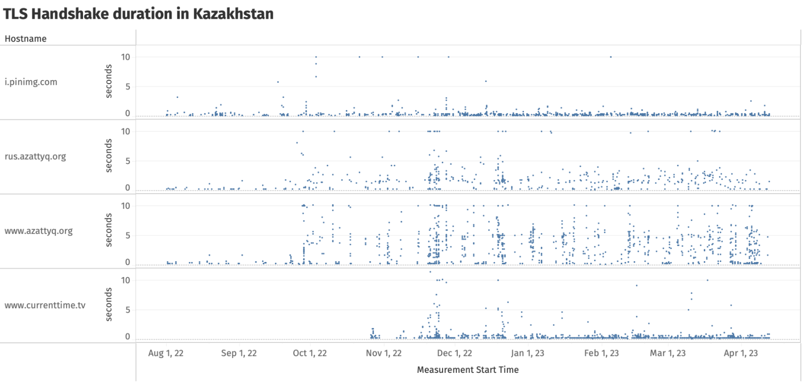
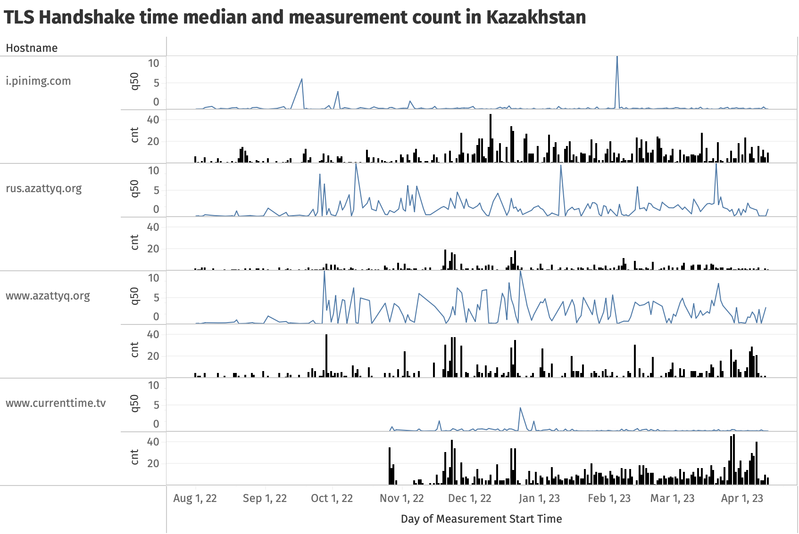
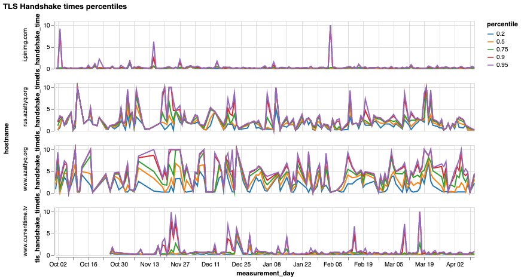
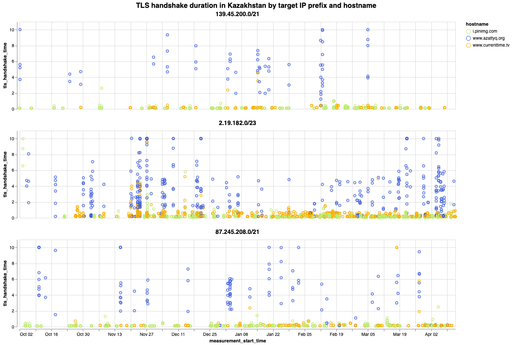
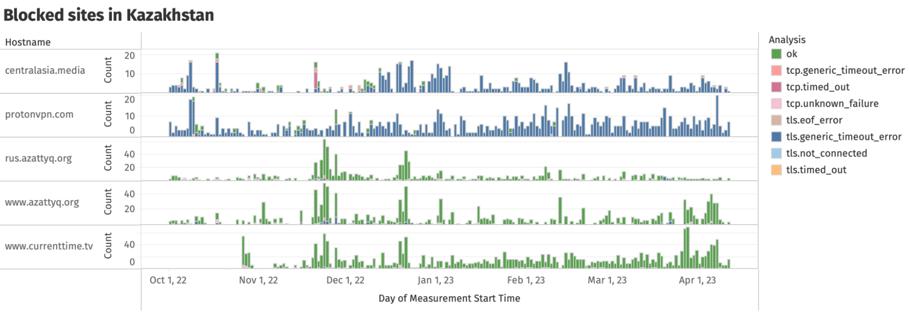
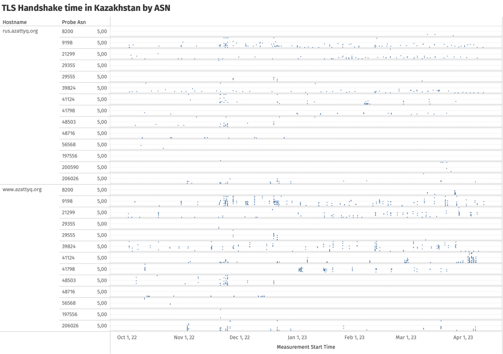
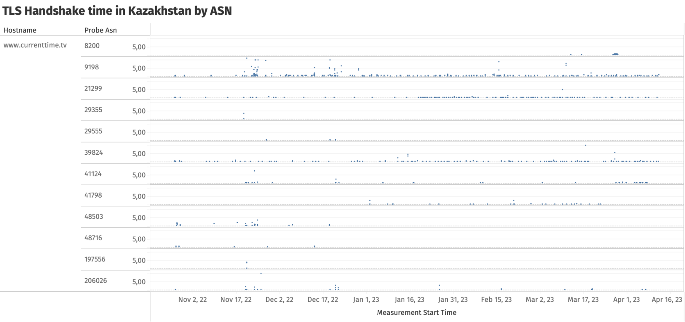

Snap presidential elections were held in Kazakhstan in November 2022, following a [wave of unrest](https://www.bbc.com/news/world-asia-59927267) that started in January 2022. Following the victory of incumbent president Tokayev, early legislative elections were held in March 2023.

Through the analysis of OONI data, we observe the throttling of Radio Free Europe/Radio Liberty (RFE/RL) Kazakhstan's service websites in Kazakh and Russian ([www.azattyq.org](https://explorer.ooni.org/chart/mat?probe_cc=KZ&since=2022-09-19&until=2023-04-19&time_grain=day&axis_x=measurement_start_day&test_name=web_connectivity&domain=www.azattyq.org) and [rus.azattyq.org](https://explorer.ooni.org/chart/mat?probe_cc=KZ&since=2022-09-19&until=2023-04-19&time_grain=day&axis_x=measurement_start_day&test_name=web_connectivity&domain=rus.azattyq.org))  in Kazakhstan, starting from 27th September 2022 and lasting until at least 11th April 2023. We also observe the temporary throttling of [www.currenttime.tv](https://explorer.ooni.org/chart/mat?probe_cc=KZ&since=2022-09-19&until=2023-04-19&time_grain=day&axis_x=measurement_start_day&test_name=web_connectivity&domain=www.currenttime.tv) during Kazakhstan’s 2022 presidential elections.

Throttling – which can be challenging to detect because it appears similar to network congestion – can be a subtle but effective way to control access to online content. In this report we share how the presence of throttling can be inferred through the analysis of OONI data.



## Key Findings

*   **Ongoing throttling of Radio Free Europe/Radio Liberty (RFE/RL) service websites.** OONI data suggests that access to [www.azattyq.org](https://explorer.ooni.org/chart/mat?probe_cc=KZ&since=2022-09-19&until=2023-04-19&time_grain=day&axis_x=measurement_start_day&test_name=web_connectivity&domain=www.azattyq.org) and [rus.azattyq.org](https://explorer.ooni.org/chart/mat?probe_cc=KZ&since=2022-09-19&until=2023-04-19&time_grain=day&axis_x=measurement_start_day&test_name=web_connectivity&domain=rus.azattyq.org) has been throttled in Kazakhstan since 27th September 2022.  As of 11th April 2023, the testing of the domains still shows signs of throttling.
*   **Temporary throttling of Current Time TV amid the 2022 Kazakh presidential election.** Access to `www.currenttime.tv` appears to have been [throttled](https://explorer.ooni.org/chart/mat?probe_cc=KZ&since=2022-09-19&until=2023-04-19&time_grain=day&axis_x=measurement_start_day&test_name=web_connectivity&domain=www.currenttime.tv) in Kazakhstan during the 2022 presidential elections.
*   **Variance in censorship methods.** OONI data shows that the method used to restrict access to `www.azattyq.org`, `rus.azattyq.org` and `www.currenttime.tv` is different compared to the methods used by ISPs in Kazakhstan to censor other sites.
*   **Censorship variance across networks.** OONI data shows that access to `www.azattyq.org` and `rus.azattyq.org` is being throttled on most tested Kazakh providers, while `www.currenttime.tv` was mainly throttled on AS9198 (JSC Kazakhtelecom).

## Background

In January 2022, protests [erupted in the city of Zhanaozen](https://eurasianet.org/kazakhstan-gas-price-hike-fuels-zhanaozen-protests) over a sudden increase in liquefied petroleum gas (LPG) prices, but quickly grew into nationwide protests across Kazakhstan, calling for political and socio-economic reforms. President Tokayev attempted to appease the protests by [setting price caps on LPG](https://www.bbc.com/news/world-asia-59896471) and other fuels and instituting a moratorium on utility costs and rent subsidies for low-income people. However, when the protests continued to escalate, he dismissed the government and [declared a state of emergency](https://www.reuters.com/markets/commodities/protests-erupt-kazakhstan-after-fuel-price-rise-2022-01-04/), with deadly force used to quell the unrest.

In March 2022, in an attempt to respond to public calls for change, President [Tokayev announced a new wave of political and constitutional reforms](https://www.reuters.com/world/asia-pacific/kazakh-president-tokayev-lays-out-constitutional-reform-plan-2022-03-16/) that would lessen his executive powers and allocate more authority to parliament. To achieve this, he initiated a referendum that allowed Kazakh citizens to vote for 56 proposed amendments. An overwhelming majority of Kazakhs [voted in favor of changing nearly one-third of the Constitution of Kazakhstan](https://www.rferl.org/a/kazakhstan-electoral-commission-referendum-vote/31885183.html). The newly proposed amendments included changes within the structure of governance, the electoral system, decentralization of power between levels of government, and the stripping of former President [Nazarbayev's](https://en.wikipedia.org/wiki/Nursultan_Nazarbayev) remaining constitutional powers as the Elbasy (Leader of the Nation).

In September 2022, [President Tokayev announced snap presidential elections for November](https://www.aljazeera.com/news/2022/9/21/kazakh-leader-tokayev-calls-snap-presidential-election), citing his personal need for a new mandate of trust from the people and potentially avoiding economic deterioration and loss of public support. He [won with an 81.3% landslide victory](https://www.aljazeera.com/news/2022/11/21/kazakh-president-tokayev-wins-re-election-with-81-3-of-vote). After assuming office, he [announced Senate elections for 14th January 2023](https://www.rferl.org/a/kazakhstan-senate-elections-shedule/32151980.html) and [after dissolving the parliament called for snap legislative elections on 19th March 2023](https://www.aljazeera.com/news/2023/1/19/kazakhstan-calls-for-snap-presidential-elections-in-march), which were the first early election for parliamentary seats since 2021. These were part of Tokayev's political reforms to implement the constitutional changes.

## Methodology

Throttling is a subtle form of internet censorship in which the performance of a targeted site or service is degraded to a point where it becomes effectively unusable, rather than being completely blocked. However, it can be challenging to gather evidence of throttling since it can be difficult to distinguish it from network congestion.

The implementation of throttling typically involves monitoring the traffic of each user flow and limiting the rate of packets generated by a flow once a pre-configured threshold is reached. When this happens, packets may be dropped or delayed until the rate falls below the threshold, thus reducing the performance. It is important to note that this performance deterioration can also occur during network congestion, but targeted throttling only affects flows destined for specific sites or services.

To detect intentional throttling, we analyzed OONI Probe TLS handshake timing information. This information is collected inside of [network_events](https://github.com/ooni/spec/blob/master/data-formats/df-008-netevents.md) and records the duration it takes for an OONI [Web Connectivity test](https://github.com/ooni/spec/blob/master/nettests/ts-017-web-connectivity.md) to perform the [TLS handshake](https://github.com/ooni/spec/blob/master/data-formats/df-006-tlshandshake.md) by recording the timestamp of when we sent or received a certain number of bytes.

By comparing the duration of the TLS handshake against a baseline - a TLS handshake for a service hosted close to the target - we can determine whether it is taking an unusually long time to complete. If there is a difference in the duration of the TLS handshake between the two services, it is likely due to targeted throttling rather than network congestion since both services are within the same network and congestion would normally affect them equally. To perform the analysis of TLS handshakes, we used our [OONI data analysis tool](https://github.com/ooni/data).

## Throttling of sites

We received reports that certain Radio Free Europe/Radio Liberty (RFE/RL) service websites (`www.azattyq.org` and `rus.azattyq.org`) and Current Time TV (`www.currenttime.tv`) were inaccessible in Kazakhstan amid the country’s snap elections in November 2022.

To investigate these reports, we analyzed the `network_events` keys of [Web Connectivity](https://ooni.org/nettest/web-connectivity/) measurements pertaining to the testing of these sites between August 2022 to April 2023. As part of this analysis, we found that the TLS handshakes failed and we therefore analyzed the TLS handshake operations to examine if there were signs of throttling. This could be inferred if the TLS handshakes took unusually long to complete in comparison to other tested services on the same networks (thereby excluding the hypothesis that the sites were inaccessible due to network congestion).

Specifically, we compared the TLS handshake duration for `www.azattyq.org`, `rus.azattyq.org`,  and `www.currenttime.tv` with that for `i.pinimg.com`, which was used as a baseline for comparison. It is important to highlight that this comparison was performed for measurements collected from the same provider, as any network congestion or performance degradation that is not intentional should affect all of them equally.

The reason why we say “the same provider” is that we have observed overlap between the ASNs from which `i.pinimg.com` is served and those of the other services, as can be seen in the following table.

|                    | Arelion (AS1299) | RETN (AS9002) | Akamai (AS16625) | Akamai (AS20940) |
|--------------------|---------------|------------|---------------|---------------|
| `i.pinimg.com`       | 65            | 1529       | 0             | 2564          |
| `rus.azattyq.org`    | 17            | 0          | 527           | 830           |
| `www.azattyq.org`    | 38            | 207        | 0             | 1421          |
| `www.currenttime.tv` | 36            | 315        | 0             | 2160          |

The above table shows the number of measurements for each domain where the IP used in the measurement is in a particular AS number.

Moreover, for `www.azattyq.org` and `www.currenttime.tv`, around half of the measurements (52%) performed TLS handshakes using the same IP address as `i.pinimg.com`, as illustrated in the table below.

|                    | Measurements using the same IP | Total number of measurements | Percentage using the same IP |
|--------------------|--------------------------------|------------------------------|------------------------------|
| `www.azattyq.org`    | 871                            | 1668                         | 52%                          |
| `rus.azattyq.org`    | 0                              | 1374                         | 0%                           |
| `www.currenttime.tv` | 1313                           | 2511                         | 52%                          |

For these reasons, we believe it is reasonable to use `i.pinimg.com` as a baseline for comparison, since it is accessible and hosted on the same provider as the other sites.

The chart below displays the duration it took to complete a TLS handshake for `www.azattyq.org`, `rus.azattyq.org` and `www.currenttime.tv`, in comparison with `i.pinimg.com` (used as a baseline).

{{}}

**Chart:** TLS handshake duration in seconds for different domains hosted on the same provider, with `i.pinimg.com` used as baseline (source: [OONI data](https://explorer.ooni.org/chart/mat?probe_cc=KZ&since=2022-08-01&until=2023-04-11&time_grain=day&axis_x=measurement_start_day&axis_y=domain&test_name=web_connectivity)).

As we can see in the chart, the duration to establish a TLS handshake for `www.azattyq.org` is significantly higher than the baseline (`i.pinimg.com`), with times exceeding 2 seconds. In many cases, the 50 percentile TLS handshake duration surpassed 4 seconds, as illustrated in the following chart.

{{}}

**Chart:** Daily median TLS handshake duration and measurement count suggesting the intentional throttling of `www.azattyq.org` and `rus.azattyq.org`, and the temporary slowdown of `www.currenttime.tv` (source: [OONI data](https://explorer.ooni.org/chart/mat?probe_cc=KZ&since=2022-08-01&until=2023-04-11&time_grain=day&axis_x=measurement_start_day&axis_y=domain&test_name=web_connectivity)).

The above chart represents the daily median TLS handshake time value with the number of datapoints used to calculate it overlayed. From the chart, it is evident that access to the domain `www.azattyq.org` has been throttled since 27th September 2022 and continues to be throttled until at least early April 2023. Similarly, we observe that the daily median TLS handshake time value for the Russian version of the site (`rus.azattyq.org`) significantly increased throughout this period as well.

If we plot several percentiles for the TLS handshake duration towards the target hostnames, we observe that they all increase compared to the baseline (as illustrated through the chart below). This further suggests the presence of throttling.  

{{}}

**Chart:** TLS handshake duration percentiles for `www.azattyq.org`, `rus.azattyq.org` and `www.currenttime.tv`, in comparison with `i.pinimg.com` (baseline) in Kazakhstan (source: [OONI data](https://explorer.ooni.org/chart/mat?probe_cc=KZ&since=2022-08-01&until=2023-04-11&time_grain=day&axis_x=measurement_start_day&axis_y=domain&test_name=web_connectivity)).

On the other hand, OONI data suggests that access to `www.currenttime.tv` was temporarily throttled during Kazakhstan’s 2022 presidential elections, as the TLS handshake time unusually increased between 20th November 2022 (the day of the election) until approximately 29th November 2022. Throttling is further suggested by the fact that the TLS handshake times returned to normal levels thereafter, and there were no signs of throttling prior to the elections.

To further investigate the throttling we wrote a data processing script that collected all the IP addresses used for TLS handshakes with `i.pinimg.com` in the dataset. We used [DB-IP 2023-04 ASN database](https://archive.org/details/db-ip-asn-lite) to map these IP addresses to the IP ranges. We then filtered the dataset to only include measurements where, for each day, we have at least one TLS handshake for `i.pinimg.com` and one TLS handshake for one of `www.azattyq.org`, `rus.azattyq.org`, `www.currenttime.tv`. The following chart shows some of the IP ranges for which we have more measurements and we can observe throttling happening during the same day.

{{}}

**Chart:** TLS handshake duration in Kazakhstan by target IP prefix and hostname.

Because we observed significant TLS handshake duration differences for IP addresses belonging to the same prefixes, on the same day, with differing SNI values, we conclude that it is unrealistic that the performance difference was caused by congestion at the interconnection, and throttling based on the SNI seems to be a more plausible explanation.

It is important to note that this throttling approach appears to be targeting specific sites, while other sites in Kazakhstan are blocked through the use of different censorship methods. The following chart, for example, compares the three throttled domains (`www.azattyq.org`, `rus.azattyq.org`, `www.currenttime.tv` ) with two other sites ([protonvpn.com](https://explorer.ooni.org/chart/mat?probe_cc=KZ&since=2022-09-19&until=2023-04-19&time_grain=day&axis_x=measurement_start_day&test_name=web_connectivity&domain=protonvpn.com) and [centralasia.media](https://explorer.ooni.org/chart/mat?probe_cc=KZ&since=2022-09-19&until=2023-04-19&time_grain=day&axis_x=measurement_start_day&test_name=web_connectivity&domain=centralasia.media)) that were blocked in Kazakhstan during the same period.

{{}}

**Image:** Comparison of throttled domains (`www.azattyq.org`, `rus.azattyq.org`, `www.currenttime.tv` ) with two blocked sites (`protonvpn.com` and `centralasia.media`) in Kazakhstan between October 2022 to April 2023 (source: [OONI data](https://explorer.ooni.org/chart/mat?probe_cc=KZ&since=2022-08-01&until=2023-04-11&time_grain=day&axis_x=measurement_start_day&axis_y=domain&test_name=web_connectivity)).

In the above chart, we observe that ISPs in Kazakhstan block access to [protonvpn.com](https://explorer.ooni.org/chart/mat?probe_cc=KZ&since=2022-09-19&until=2023-04-19&time_grain=day&axis_x=measurement_start_day&test_name=web_connectivity&domain=protonvpn.com) and [centralasia.media](https://explorer.ooni.org/chart/mat?probe_cc=KZ&since=2022-09-19&until=2023-04-19&time_grain=day&axis_x=measurement_start_day&test_name=web_connectivity&domain=centralasia.media) by timing out the entire TLS handshake. But in the cases of `www.azattyq.org`, `rus.azattyq.org` and `www.currenttime.tv` , the TLS handshakes are usually successful (which is why those measurements are annotated as “ok” in the chart), but with significant delays.

By analyzing the TLS handshake times by ASN, it is evident that `www.azattyq.org` and `rus.azattyq.org` are throttled on most measured providers in Kazakhstan, as illustrated below. The fact that we observe increased TLS handshake times on multiple ASNs in Kazakhstan over a long period of time provides a stronger signal of throttling, as it helps exclude the hypothesis of temporary network congestion or degradation on a specific network.

{{}}

**Image:** TLS handshake times by tested ASNs in Kazakhstan, indicating throttling of `www.azattyq.org` and `rus.azattyq.org` on most measured providers (source: [OONI data](https://explorer.ooni.org/chart/mat?probe_cc=KZ&since=2022-09-19&until=2023-04-19&time_grain=day&axis_x=measurement_start_day&axis_y=probe_asn&test_name=web_connectivity&domain=www.azattyq.org)).

On the other hand, OONI data mainly shows signs of `www.currentime.tv` throttling on one network: AS9198 (JSC Kazakhtelecom).

{{}}
**Image:** TLS handshake times by tested ASNs in Kazakhstan, suggesting the throttling of `www.currenttime.tv` on AS9198, JSC Kazakhtelecom (source: [OONI data](https://explorer.ooni.org/chart/mat?probe_cc=KZ&since=2022-09-19&until=2023-04-19&time_grain=day&axis_x=measurement_start_day&axis_y=probe_asn&test_name=web_connectivity&domain=www.currenttime.tv)).

## Conclusion

Throttling is a subtle yet effective method used to restrict access to online content. In this report, we have explored how OONI data can be used to document cases of throttling.

Specifically, we have documented how throttling was employed to restrict access to the news media domains `www.azattyq.org` and `rus.azattyq.org`, as well as how access to `www.currentime.tv` was briefly limited during Kazakhstan’s 2022 presidential election.

At the time of writing, access to `www.azattyq.org` and `rus.azattyq.org` continues to be throttled on some networks in Kazakhstan, while as far as we can tell access to `www.currentime.tv` is no longer being restricted.

Through this report, we have established the groundwork for future investigations on how throttling can be utilized to curtail access to information, and how it can be documented using OONI tools and data.
