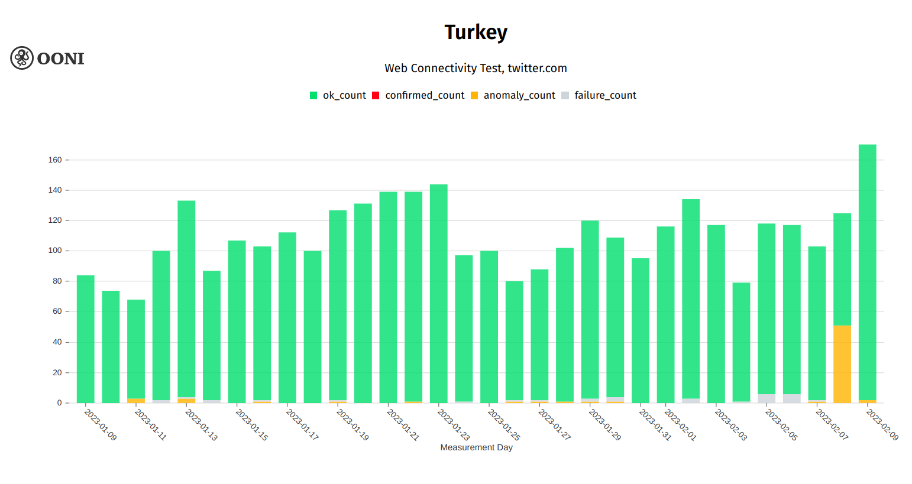
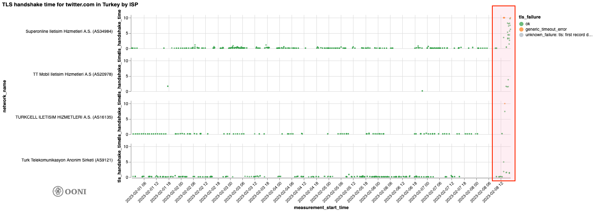
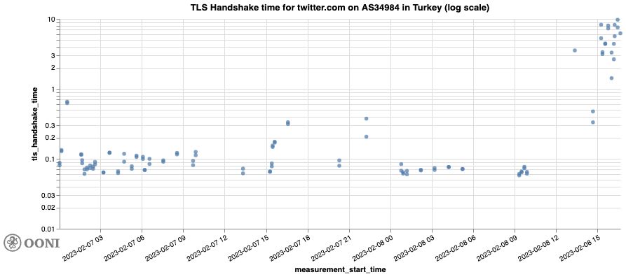
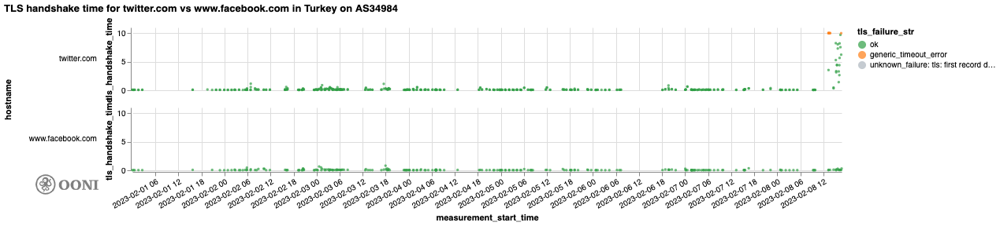
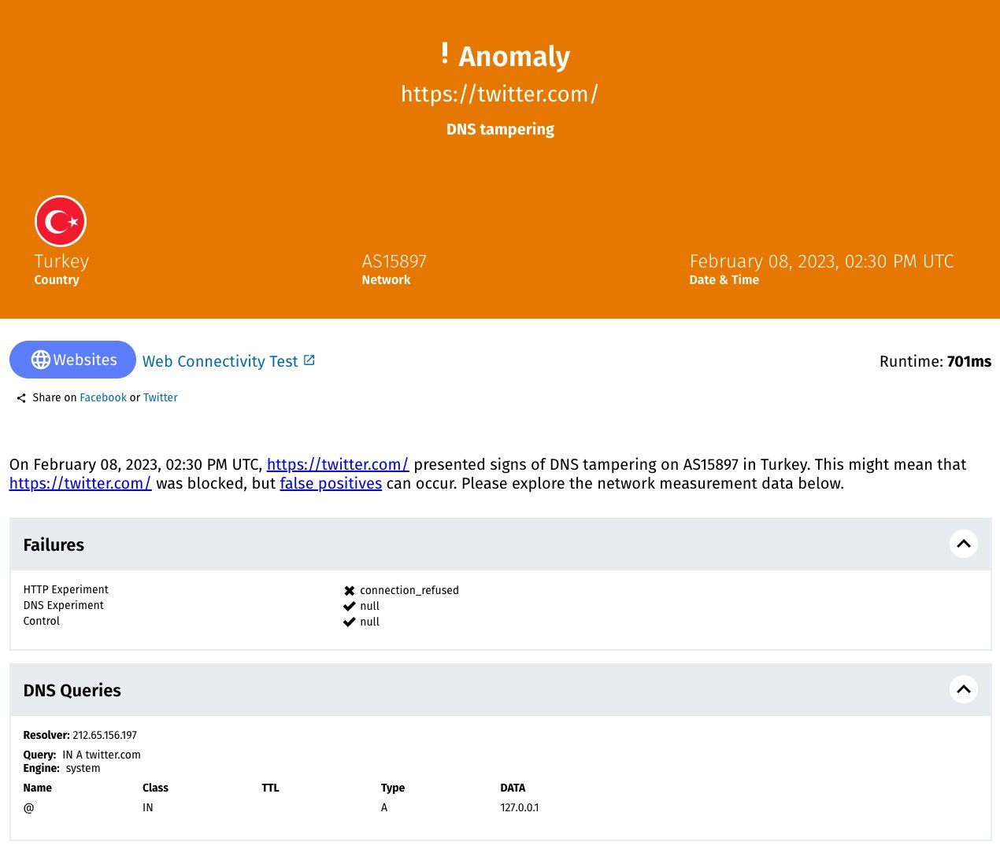

On 6th February 2023, a [devastating 7.8-magnitude earthquake](https://edition.cnn.com/2023/02/13/middleeast/turkey-earthquake-building-construction-intl/index.html)
(followed by many strong aftershocks) struck (southern and central)
Turkey and (northern and western) Syria, resulting in more than 36,000
deaths.

In the aftermath of the earthquake (on 8th February 2023), access to
Twitter was
[reportedly](https://edition.cnn.com/2023/02/08/tech/turkey-twitter-restriction/index.html)
temporarily restricted. OONI data collected from Turkey provides
evidence that the block was implemented through targeted throttling and
DNS interference.

The following
[chart](https://explorer.ooni.org/chart/mat?probe_cc=TR&test_name=web_connectivity&domain=twitter.com&since=2023-01-09&until=2023-02-10&axis_x=measurement_start_day)
aggregates OONI measurement coverage from the testing of Twitter
(`twitter.com`) on multiple networks in Turkey between 9th January
2023 to 9th February 2023.

{{}}

**Chart:** OONI Probe testing of Twitter (`twitter.com`) on multiple
networks in Turkey between 9th January 2023 to 9th February 2023
(source: [OONI MAT](https://explorer.ooni.org/chart/mat?probe_cc=TR&test_name=web_connectivity&domain=twitter.com&since=2023-01-09&until=2023-02-10&axis_x=measurement_start_day)).

As is evident, the testing of Twitter was mostly successful throughout
this period, only presenting noticeable
[anomalies](https://explorer.ooni.org/search?since=2023-02-08&until=2023-02-09&probe_cc=TR&test_name=web_connectivity&domain=twitter.com&failure=false&only=anomalies)
(signs of potential blocking) on 8th February 2023, which coincides with
the date of the
[reported](https://edition.cnn.com/2023/02/08/tech/turkey-twitter-restriction/index.html)
block. Across networks, we observe
[anomalies](https://explorer.ooni.org/search?since=2023-02-08&until=2023-02-09&probe_cc=TR&test_name=web_connectivity&domain=twitter.com&failure=false&only=anomalies)
between 13:21 UTC to 21:33 UTC on 8th February 2023 (though the [first anomaly](https://explorer.ooni.org/measurement/20230208T083226Z_webconnectivity_TR_202561_n1_x6BpnSQskisEPiGL?input=https%3A%2F%2Ftwitter.com%2F)
is observed as early as 08:31 UTC on AS202561), suggesting that access
to Twitter was restricted in Turkey on that day.

We analyzed OONI data and found signs of **Twitter throttling** on at
least 4 ASNs in Turkey.

{{}}

**Graph:** TLS handshake time for `twitter.com` on 4 ASNs in Turkey on
8th February 2023 (source: [OONI data](https://explorer.ooni.org/search?since=2023-02-08&until=2023-02-09&probe_cc=TR&test_name=web_connectivity&domain=twitter.com&failure=false)).

From the above graph, we can see that, starting from ~ 13:30 UTC, the
TLS handshake time for IPs associated with `twitter.com` grows
substantially. Specifically, successful TLS handshakes took more than 3
seconds to complete, whereas they previously took ~ 70ms. Details of
the TLS handshake time, for example, are provided below for [Twitter IPs on Turkcell Superonline (AS34984)](https://explorer.ooni.org/search?since=2023-02-08&until=2023-02-09&probe_cc=TR&test_name=web_connectivity&domain=twitter.com&failure=false&probe_asn=AS34984).

{{}}

**Graph:** TLS handshake time for `twitter.com` on Turkcell
Superonline (AS34984) on 8th February 2023 (source: [OONI data](https://explorer.ooni.org/search?since=2023-02-08&until=2023-02-09&probe_cc=TR&test_name=web_connectivity&domain=twitter.com&failure=false&probe_asn=AS34984)).

We can see that while the TLS handshake time for Twitter IPs was
previously ~100ms on Turkcell Superonline (AS34984), it significantly
increased to more than 3 seconds after 15:00 UTC on 8th February 2023.

All of this suggests that access to Twitter was throttled. To rule out
the hypothesis that this might be attributable to network issues
affecting other services as well, we analyzed OONI data to check if we
could similarly observe long TLS handshake times for other tested
endpoints on the same networks during the same period.

We did *not* find the same pattern for other tested endpoints on the
same networks, during the same time period. For example, the testing of
IPs associated with `www.facebook.com` did not show an increase in the
TLS handshake time. This is visible through the following graph, which
compares the TLS handshake time for `twitter.com` and
`www.facebook.com` on AS34984 in Turkey on 8th February 2023.

{{}}

**Graph:** TLS handshake time for `twitter.com` and
`www.facebook.com` on AS34984 in Turkey on 8th February 2023 (source:
[OONI data](https://explorer.ooni.org/search?since=2023-02-08&until=2023-02-09&probe_cc=TR&test_name=web_connectivity&domain=www.facebook.com&failure=false&probe_asn=AS34984)).

This therefore strongly suggests (along with the fact that we view long
TLS handshake times for Twitter IPs over the course of many hours on 8th
February 2023) that access to Twitter was intentionally throttled.

However, on other networks, such as Vodafone (AS15897), OONI data shows
that access to Twitter was restricted in different ways. Specifically,
Vodafone appears to have blocked access to Twitter by means of [DNS tampering](https://explorer.ooni.org/measurement/20230208T143001Z_webconnectivity_TR_15897_n1_Tj0rv8cHBImTRGqi?input=https%3A%2F%2Ftwitter.com%2F),
since OONI measurement data shows that they returned the localhost IP
`127.0.0.1` as part of DNS resolution.

{{}}

**Image:** OONI measurement collected from Vodafone (AS15897) in Turkey
on 8th February 2023, showing DNS-based tampering of `twitter.com`
(source: [OONI data](https://explorer.ooni.org/measurement/20230208T143001Z_webconnectivity_TR_15897_n1_Tj0rv8cHBImTRGqi?input=https%3A%2F%2Ftwitter.com%2F)).

As almost all Twitter measurements were
[successful](https://explorer.ooni.org/chart/mat?probe_cc=TR&test_name=web_connectivity&domain=twitter.com&since=2023-01-09&until=2023-02-10&axis_x=measurement_start_day)
the next day, OONI data suggests that the block was only implemented
temporarily and that access to Twitter had resumed by 9th February 2023.

We thank [OONI Probe](https://ooni.org/install) users in Turkey who
contributed measurements, supporting this study. You can continue to
monitor the testing of services in Turkey through the [OONI Measurement Aggregation Toolkit (MAT)](https://explorer.ooni.org/chart/mat?probe_cc=TR&test_name=web_connectivity&since=2023-01-16&until=2023-02-16&axis_x=measurement_start_day),
which publishes OONI measurements as open data in real-time.
