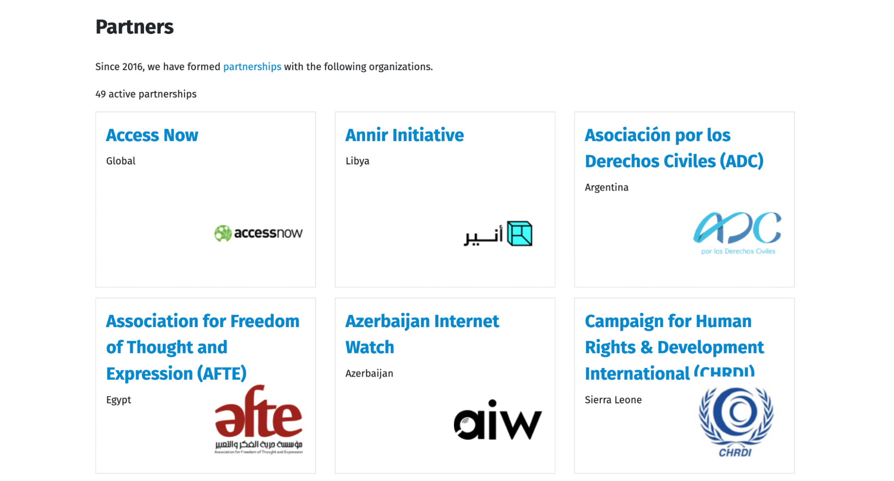

As the end of 2023 approaches, we publish this post to share some OONI
highlights from the last year. We also share some of the things we’ll be
working on in 2024!



## New OONI non-profit legal entity

{{}}

OONI is now a registered NGO in Italy!

2023 was an important year for OONI, as we created OONI’s first non-profit legal entity. As of May 2023, OONI is a non-profit organization registered in Rome, Italy.

We are excited about this development as it marks a new era of growth for OONI.

While OONI was born more than a decade ago in 2011-2012, it started off as a small project under the [Tor Project](https://www.torproject.org/). At the time, internet censorship started to increase in several countries during the Arab Spring, and Tor Project developers (including Arturo Filastò, OONI’s founder) were eager to understand how access to the Tor network was being blocked (to support circumvention efforts). To this end, they developed various scripts to measure Tor blocking. This resulted in the following ideas: What if anyone could run these scripts? What if these scripts measured more forms of censorship, beyond Tor blocking? And what if the results of these scripts could be published as open data so that everyone around the world could learn about (and respond to) internet censorship?

Ultimately, these ideas gave birth to the vision for OONI: creating an open framework with open methodologies for measuring internet censorship globally based on open data. This idea was a shift from how internet censorship research was being carried out at the time – most of which was based on closed source software and without openly available data, limiting the possibility for independent, third-party verification of the findings. OONI paved the way for an open approach to censorship research and to this day, remains one of the few projects that measure internet censorship globally based on [free software tools](https://ooni.org/install/) and [open data](https://ooni.org/data/).

OONI’s [growth and success over the past decade](https://ooni.org/post/highlights-10-years-of-ooni/) wouldn’t have been possible without the [Tor Project](https://www.torproject.org/), who supported us every step of the way. We eventually reached a point where OONI had evolved into a project with global reach and impact, with its own distinct community, raising the need to transition from a project to a non-profit organization. We were not ready to do that immediately (due to limited team capacity), so we sought temporary fiscal sponsorship from the [Hermes Center for Transparency and Digital Human Rights](https://www.hermescenter.org/) in 2020, while operating independently in terms of fundraising and governance. 

This year, we finally made the Big Step and established a legal entity for OONI, officially becoming a non-profit organization registered in Italy. We chose Rome because some of our team members in leadership positions are based there and it made sense from a bureaucratic perspective.

If you’re interested in supporting OONI in this moment of growth, please [consider making a donation](https://ooni.org/donate/). You can also [purchase OONI swag](https://shop.ooni.org/) (such as t-shirts, mugs, water bottles, stickers, and tote bags) in support of OONI’s work, or become an [OONI supporter](https://ooni.org/about/supporters).

## New OONI Project Manager

As part of OONI’s growth, we hired a dedicated OONI Project Manager to help manage our software development work. In May 2023, we published a [job opening](https://ooni.org/post/2023-job-opening-ooni-project-manager/) and we had the opportunity to meet and interview multiple strong candidates for the position.

In August 2023, we were thrilled to welcome **Jessie Bonisteel** as our new Project Manager!

Jessie joined us with a wealth of both engineering management and project management expertise, having previously worked with organizations that include [Tails](https://tails.net/) and [Mozilla](https://www.mozilla.org/). As part of her role as OONI’s Project Manager, Jessie manages our software development team, ensuring that our projects are on track and supporting a global community that relies on our tools for measuring internet censorship.

## New OONI measurement tools

### Launched OONI Probe Web

{{}}

**Image:** [OONI Probe Web](https://probe-web.ooni.org/).

In March 2023, we [launched](https://ooni.org/post/introducing-ooni-probe-web/) [OONI Probe Web](https://ooni.org/post/introducing-ooni-probe-web/): a new browser-based tool for measuring the blocking of websites.

We built [OONI Probe Web](https://probe-web.ooni.org/) in response to long-term community feedback, requesting a censorship measurement tool that can be run from a browser, without requiring the installation of any software. Our goal is to support rapid response efforts to emergent censorship events.

OONI Probe Web [advances the state of the art of browser-based measurements](https://ooni.org/post/introducing-ooni-probe-web/), and we’re excited to improve upon it over the next few years. But due to [limitations](https://ooni.org/post/introducing-ooni-probe-web/#limitations) in the API available to web browsers, it’s not possible to run advanced experiments (like the OONI Probe [Web Connectivity experiment](https://ooni.org/nettest/web-connectivity/)). Therefore, [OONI Probe Web](https://probe-web.ooni.org/) should not serve as a replacement for the [OONI Probe apps](https://ooni.org/install/), but as a complementary tool.

### Launched News Media Scan app with Deutsche Welle (DW)

{{}}

**Image:** [News Media Scan app by DW](https://play.google.com/store/apps/details?id=com.dw.ooniprobe).

In October 2023, [Deutsche Welle (DW)](https://www.dw.com/) and OONI [launched](https://corporate.dw.com/en/news-media-scan-by-dw-deutsche-welle-and-ooni-launch-new-app/a-66996347) the Android [News Media Scan app](https://play.google.com/store/apps/details?id=com.dw.ooniprobe) for measuring news media censorship.

In collaboration with DW, we developed an OONI Probe-based app (“News Media Scan”) designed to measure the blocking of [news media websites](https://github.com/citizenlab/test-lists/tree/master/lists). Similarly to OONI Probe, [News Media Scan app](https://play.google.com/store/apps/details?id=com.dw.ooniprobe) test results are published by OONI as [open data](https://ooni.org/data/) in real-time.

We are excited about this new app, as we expect that it will help boost news media censorship measurement worldwide, supporting efforts to defend press freedom around the world.

### Building OONI Run v2

{{}}

**Image:** [OONI Run](https://run.ooni.io/).

This year, [OONI became a Mozilla awardee](https://foundation.mozilla.org/en/blog/crowdsourcing-data-as-a-tool-to-fight-internet-censorship/) and a member of the [2023 Mozilla Data Futures Lab cohort](https://foundation.mozilla.org/en/data-futures-lab/): five projects creating crowdsourced datasets for the public good. As part of this, we have been working on creating a **new and improved version** of [OONI Run](https://run.ooni.io/) (“OONI Run v2”), addressing key [community feedback and needs](https://ooni.org/post/2020-06-09-ooni-run-usability-study-findings/).

[OONI Run](https://run.ooni.io/) is a web platform that you can use to generate mobile deep links and widget code to coordinate the [OONI Probe](https://ooni.org/install/mobile) testing of websites. You can share these links with a community of volunteers (who are [OONI Probe mobile app](https://ooni.org/install/mobile) users) so that they can test the websites of your choice, contributing measurements that are published as [open data](https://ooni.org/data/) in real-time.

[OONI Run](https://run.ooni.io/) therefore enables decentralized, community-driven efforts aimed at coordinating the testing of website blocking. The goal of this platform is to enable community members to independently coordinate on the testing of websites, particularly when new blocks emerge. All test results are published as [open data](https://ooni.org/data/) in real-time, supporting [research](https://ooni.org/reports/) and [advocacy](https://www.accessnow.org/keepiton/) efforts.

Community members often run such campaigns [leading up to and during an election](https://sinarproject.org/digital-rights/measuring-and-detecting-network-interference/ge15), or in response to emergent new blocks during protests or other political events. Sometimes, researchers coordinate with communities of [OONI Probe](https://ooni.org/install/mobile) volunteers for the testing of their custom lists of websites.

For example, [Sinar Project](https://sinarproject.org/) used OONI Run to coordinate an [OONI censorship measurement campaign in Malaysia](https://sinarproject.org/digital-rights/measuring-and-detecting-network-interference/ge15) to encourage the testing of election-related websites during the country’s 2022 general election. India’s [Software Freedom Law Centre (SFLC.in)](https://sflc.in/) embedded OONI Run widgets into their [India Internet Shutdown Tracker project](https://internetshutdowns.in/) website, encouraging long-term OONI Probe testing of news media, blogs, human rights, and political websites in India. [Venezuela Inteligente](https://veinteligente.org/) coordinated with [OONI Probe volunteers in different regions of Venezuela](https://www.youtube.com/watch?v=UDvVfjJ0Iq8) to measure (and respond to) [temporary website blocks](https://vesinfiltro.com/) which emerged in correlation with political events.

To improve the OONI Run platform and better meet community needs, we previously conducted an [OONI Run usability study](https://ooni.org/post/2020-06-09-ooni-run-usability-study-findings/), through which we documented extensive community feedback. In 2023, we made significant progress towards addressing the key community feedback and needs identified through our usability study to better support censorship rapid response efforts worldwide.

We aim to launch OONI Run v2 in 2024. Stay tuned!

## New OONI Explorer features

Arguably, some of the biggest OONI highlights from 2023 are the new [OONI Explorer](https://explorer.ooni.org/) features!

[OONI Explorer](https://explorer.ooni.org/) is the world’s largest **open dataset on internet censorship**.

This data is contributed by [OONI Probe](https://ooni.org/install/) users worldwide, who run censorship measurement tests on their local networks, contributing test results as open data in real-time. Since 2012, OONI Probe users have contributed [more than a billion measurements from 26 thousand networks in 241 countries and territories](https://explorer.ooni.org/), all of which is publicly available on OONI Explorer. Every day, as OONI Probe users continue to run tests, new measurements are openly published in real-time.

Below we share the new OONI Explorer features that we launched in 2023.

### Censorship Findings: 22 reports

{{}}

**Image:** OONI Explorer [Censorship Findings](https://explorer.ooni.org/findings) page.

In November 2023, we [launched](https://ooni.org/post/2023-launch-ooni-censorship-findings-platform/) the OONI Explorer [Censorship Findings](https://explorer.ooni.org/findings) page. This page provides short [reports](https://explorer.ooni.org/findings) on internet censorship around the world based on OONI’s [open data](https://ooni.org/data/). Our goal is to support research and advocacy efforts aimed at monitoring and responding to internet censorship around the world.

We published the following **22** **reports on internet censorship** that emerged in 2023:

*   [Malaysia blocked MalaysiaNow and website of former MP](https://explorer.ooni.org/findings/178720534001)
*   [Guinea blocked WhatsApp, Telegram, Facebook, Twitter, Instagram, and YouTube](https://explorer.ooni.org/findings/296303006301)
*   [Tanzania blocked Clubhouse](https://explorer.ooni.org/findings/185407756401)
*   [Jordan blocked Grindr](https://explorer.ooni.org/findings/179818906201)
*   [Cambodia blocked independent media websites ahead of 2023 general elections](https://explorer.ooni.org/findings/373150675601)
*   [China started blocking OONI](https://explorer.ooni.org/findings/57494519801)
*   [China started blocking F-Droid](https://explorer.ooni.org/findings/206551055901)
*   [Egypt started blocking Proton privacy services](https://explorer.ooni.org/findings/18597244501)
*   [Tanzania blocked Grindr](https://explorer.ooni.org/findings/203466718601)
*   [Cambodia blocked access to Voice of Democracy (VOD)](https://explorer.ooni.org/fndings/382061061001)
*   [Nepal blocked TikTok](https://explorer.ooni.org/findings/112092297601)
*   [Kenya blocked Telegram during the KCSE 2023 exams](https://explorer.ooni.org/fndings/228466228201)
*   [Azerbaijan blocked TikTok and Google Play Store amid military offensive in Nagorno-Karabakh](https://explorer.ooni.org/findings/67768606801)
*   [Iraq temporarily blocked Telegram](https://explorer.ooni.org/findings/64077907701)
*   [Ethiopia blocked social media amid church split tensions](https://eplorer.ooni.org/findings/186069533301)
*   [Senegal blocked social media amid political unrest](https://explorer.ooni.org/fndings/25060018801)
*   [Guinea blocked social media amid protests](https://explorer.ooni.org/findings/34000980901)
*   [Pakistan blocked social media following arrest of former Prime Minister](https://eplorer.ooni.org/findings/300902917301)
*   [Brazil blocked Telegram](https://explorer.ooni.org/findings/76657383201)
*   [Pakistan started blocking Deutsche Welle (DW)](https://explorer.ooni.org/findings/7767321701)
*   [Turkey blocked Twitter following deadly earthquake](https://explorer.ooni.org/fndings/279627325801)
*   [Pakistan blocked Wikipedia](https://explorer.ooni.org/findings/352315080001)

In response to emergent censorship events, the OONI Explorer [Censorship Findings](https://explorer.ooni.org/findings) page will be updated with new reports on an ongoing basis.

### Domain-centric pages

{{}}

**Image:** OONI Explorer [domain-centric](https://explorer.ooni.org/domains) pages.

The new [domain-centric pages](https://explorer.ooni.org/domains) on OONI Explorer enable you to [easily discover which countries block access to a specific domain](https://ooni.org/post/2023-new-explorer-features/#domain-centric-pages), and to compare the blocking of that domain between countries over time based on empirical network measurement data. These pages also feature the countries where the blocking of a domain is [automatically confirmed blocked](https://ooni.org/support/interpreting-ooni-data/#confirmed) based on [fingerprints](https://github.com/ooni/blocking-fingerprints). Please note though that some measurements may have inaccurate geolocation.  

If you are a website owner, you may find the [domain-centric pages](https://explorer.ooni.org/domains) particularly useful for tracking the accessibility (and blocking) of your website around the world (if your website is included in [test lists](https://ooni.org/support/test-lists-editor)). Researchers and advocates can also benefit from tracking the blocking of specific domains through these new pages.

### Network-centric pages

{{}}

**Image:** OONI Explorer [network-centric](https://explorer.ooni.org/networks) pages.

Censorship often varies from network to network, and it’s worth gaining insight into how internet censorship is implemented on each network. We therefore created new [network-specific pages](https://explorer.ooni.org/networks) on OONI Explorer which enable you to learn about all [OONI Probe](https://ooni.org/install/) testing on a specific [ASN](https://ooni.org/support/glossary#asn). Over the past decade, OONI Probe users globally have run tests on more than 26,000 networks, and you can find dedicated [measurement pages](https://explorer.ooni.org/networks) for each of these networks.

Through these [network-specific pages](https://explorer.ooni.org/networks), you can view the measurement coverage for each network – which is important for assessing censorship findings (i.e. the more measurements collected from a network, the greater the confidence in the findings). You can also [view charts with aggregate results](https://ooni.org/post/2023-new-explorer-features/#network-centric-pages) from the OONI Probe [testing](https://ooni.org/nettest/) of websites, instant messaging apps (WhatsApp, Facebook Messenger, Telegram, Signal), and circumvention tools (Psiphon, Tor, Tor Snowflake) on each network. The final section of these pages also includes a chart (integrating data from Georgia Tech's [Internet Outage Detection and Analysis (IODA)](https://ioda.inetintel.cc.gatech.edu/asn/3320?from=1700438400&until=1702980587) project, [Google Transparency Reports (Google traffic data)](https://transparencyreport.google.com/traffic/overview?hl=en), and [Cloudflare Radar](https://radar.cloudflare.com/as3320?range=28d)) which shows whether that network is experiencing an internet outage.

### User feedback reporting mechanism

{{}}

**Image:** OONI Explorer measurement including the “Verify” button.

As part of our ongoing efforts to [improve OONI data quality](https://github.com/ooni/probe/issues?q=is%3Aopen+is%3Aissue+label%3A%22data+quality%22), we launched a new feature that enables you to help out! With the new [user feedback reporting mechanism](https://ooni.org/post/2023-new-explorer-features/#user-feedback-reporting-mechanism), you can share feedback on OONI measurements. Such feedback will help us improve our methods for measurement and analysis, improving the overall quality of OONI data.

By [clicking on the “Verify” button](https://ooni.org/post/2023-new-explorer-features/#user-feedback-reporting-mechanism) on the top right corner of OONI measurements, you can share feedback based on what you see in the measurement data. Specifically, based on the raw data of the measurement, you can let us know if the tested service is OK, blocked, or down (inaccessible, but not due to blocking).

This feature is primarily intended for experienced [OONI Explorer](https://explorer.ooni.org/) users who are familiar with how OONI Probe [experiments](https://github.com/ooni/spec/tree/master/nettests) work, and who can interpret the raw network measurement data in OONI measurements.

### Charts on internet outages

{{}}

**Image:** Chart for monitoring internet outages in Italy based on [IODA](https://ioda.inetintel.cc.gatech.edu/), [Google traffic](https://transparencyreport.google.com/traffic/overview), and [Cloudflare Radar](https://radar.cloudflare.com/) data (source: [OONI Explorer](https://explorer.ooni.org/country/IT?since=2023-04-07&until=2023-05-07)).

Blocks around the world [often emerge](https://ooni.org/reports/) before and/or after complete internet connectivity shutdowns (“internet outages”). When investigating internet outages, we refer to several third-party datasets that provide relevant signals: [IODA](https://ioda.inetintel.cc.gatech.edu/), [Google traffic](https://transparencyreport.google.com/traffic/overview), and [Cloudflare Radar](https://radar.cloudflare.com/) data.

To enable the internet freedom community to monitor internet outages based on these datasets, we [added charts to OONI Explorer](https://ooni.org/post/2023-new-explorer-features/#charts-on-internet-outages) which integrate [IODA](https://ioda.inetintel.cc.gatech.edu/), [Google traffic](https://transparencyreport.google.com/traffic/overview), and [Cloudflare Radar](https://radar.cloudflare.com/) data. These “internet outage” charts are available in each [country-specific](https://explorer.ooni.org/countries) and [network-specific](https://explorer.ooni.org/networks) page of OONI Explorer.

You can refer to these charts to monitor internet outages affecting specific countries or networks, while viewing multiple datasets in one chart. We hope this helps support relevant research and [advocacy](https://www.accessnow.org/campaign/keepiton/) efforts!

## Research

### OONI research reports

In 2023, we published the following **10 research reports** based on the analysis of OONI data:

*   [Grindr blocked in Jordan: Shrinking LGBTQ spaces](https://ooni.org/post/2023-jordan-blocks-grindr/)
*   [Senegal: Social media blocks and network outages amid political unrest](https://ooni.org/post/2023-senegal-social-media-blocks/)
*   [China is blocking OONI](https://ooni.org/post/2023-china-blocks-ooni/)
*   [Brazil: OONI data on the blocking of Telegram](https://ooni.org/post/2023-brazil-telegram/)
*   [Throttling of news media amid Kazakhstan’s 2022 presidential election](https://ooni.org/post/2023-throttling-kz-elections/)
*   [OONI measurements show ongoing internet censorship in Azerbaijan](https://ooni.org/post/2023-azerbaijan-internet-censorship/)
*   [How Internet censorship changed in Russia during the 1st year of military conflict in Ukraine](https://ooni.org/post/2023-russia-a-year-after-the-conflict/)
*   [Ethiopia: Ongoing blocking of social media](https://ooni.org/post/2023-ethiopia-blocks-social-media/)
*   [Pakistan: Blocking of Wikipedia and Deutsche Welle (DW)](https://ooni.org/post/2023-pakistan-blocks-wikipedia-and-dw/)
*   [Turkey: Throttling and DNS blocking of Twitter following deadly earthquake](https://ooni.org/post/2023-turkey-throttling-blocking-twitter/)

Notably, we published two reports documenting cases of **throttling** (in [Turkey](https://ooni.org/post/2023-turkey-throttling-blocking-twitter/) and [Kazakhstan](https://ooni.org/post/2023-throttling-kz-elections/)) based on our new methodology. Many of our reports also made use of our (relatively new) [data analysis tool](https://github.com/ooni/data) for the automatic detection and characterization of censorship.

We collaborated with our [partners](https://ooni.org/partners) on several of the above research reports. For example, our report on [Russia](https://ooni.org/post/2023-russia-a-year-after-the-conflict/) was produced in collaboration with [Roskomsvoboda](https://roskomsvoboda.org/), who contributed a wealth of information, [translated the report to Russian](https://ooni.org/ru/post/2023-russia-a-year-after-the-conflict/), and enabled us to [compare](https://ooni.org/post/2023-russia-a-year-after-the-conflict/#blocks-that-are-inconsistent-with-russias-official-blocklist) blocked domains with those in the [blocking registry](https://reestr.rublacklist.net/) that they maintain. In collaboration with [Cloudflare](https://radar.cloudflare.com/), [Access Now](https://www.accessnow.org/) and Laura Schwartz-Henderson, we published a [research report](https://ooni.org/post/2023-senegal-social-media-blocks/) documenting the social media blocks and network outages in Senegal amid political unrest. In addition to network measurement findings, the report also shares qualitative findings from affected communities in Senegal, discussing the [impact of the disruptions](https://ooni.org/post/2023-senegal-social-media-blocks/#shutdown-impacts).

Unfortunately, [China started blocking OONI](https://ooni.org/post/2023-china-blocks-ooni/) in July 2023. We will therefore prioritize improving OONI Probe resiliency to blocking going forward.

Beyond the above 10 [research reports](https://ooni.org/reports/), we also published **22 reports** on the new (aforementioned) OONI Explorer [Censorship Findings](https://explorer.ooni.org/findings) page.

### OONI reports for ISOC Pulse shutdown timeline

{{}}

**Image:** ISOC Pulse Shutdowns timeline: Ethiopia February 2023 (source: [ISOC Pulse](https://pulse.internetsociety.org/shutdowns/social-media-blocking-in-ethiopia-february-2023)).

As a [data partner](https://pulse.internetsociety.org/partners) for [ISOC’s Pulse shutdown project](https://pulse.internetsociety.org/shutdowns), we created “OONI reports'' (with relevant OONI data, interpretation, and charts) for the “service blocking” entries listed on the Pulse shutdown timeline. Specifically, we wrote the “Data and analysis” section for all “service blocking” entries of the ISOC Pulse Shutdown timeline (where relevant OONI data exists) between March 2018 to February 2023.

In total, we wrote **49 OONI reports** for the [ISOC Pulse shutdown timeline](https://pulse.internetsociety.org/shutdowns). As part of this work, we found that OONI data is available for almost all blocking events reported worldwide over the last 5 years (at least based on those listed on the ISOC Pulse shutdown timeline).

## Community

This year, we received the [Free and Open Communications on the Internet (FOCI) 2023 Community Award](https://foci.community/awards.html), recognizing the impact of our work in the field of Internet freedom on the wider community.

We also had the opportunity to deliver a [keynote](https://petsymposium.org/2023/program.php) at [HotPETs 2023](https://petsymposium.org/2023/hotpets.php) on “The Power of Community Participation in Shaping Digital Rights Tech”. As part of this, we shared examples from OONI's community-driven approach to global censorship measurement, demonstrating how and why there is power in involving communities from around the world in shaping digital rights protecting technology.

Below we share highlights from how we expanded our collaboration and support towards the global OONI community in 2023.

### New partnerships

{{}}

**Image:** OONI [Partners](https://ooni.org/partners) page.

In 2023, we had the opportunity to establish **8 new partnerships** with the following organizations:

*   [Annir Initiative](https://ooni.org/partners/annir/) (Libya)
*   [Computech Institute](https://ooni.org/partners/computech/) (Senegal)
*   [Digitally Right](https://ooni.org/partners/digitally-right/) (Bangladesh)
*   [Digital Rights Lab](https://ooni.org/partners/drlab/) (Sudan)
*   [Global Information Technology Controls Hub (GLITCH) at the Oxford Internet Institute, University of Oxford](https://ooni.org/partners/glitch/) (research collaboration)
*   [Internet Freedom Kazakhstan](https://ooni.org/partners/ifkz/) (Kazakhstan)
*   [Miaan Group](https://ooni.org/partners/miaan/) (Iran)
*   [Roskomsvoboda](https://ooni.org/partners/roskomsvoboda/) (Russia)

Overall, we now have [partnerships with 49 digital rights organizations](https://ooni.org/partners). Many of these partnerships are with digital rights organizations in Asia, Africa, the Middle East, and Latin America, with whom we collaborate on investigating internet censorship in their respective countries through the use of OONI tools and data. We also have partnerships with circumvention tool projects and international organizations that defend digital rights. Through these partnerships, we aim to support decentralized efforts in increasing transparency of internet censorship worldwide.

### New OONI Outreach Kit

{{}}

**Image:** [OONI Outreach Kit](https://ooni.org/support/ooni-outreach-kit/).

Community engagement is at the heart of our work, as the availability of [OONI data](https://ooni.org/data/) on internet censorship depends on people running [OONI Probe](https://ooni.org/install/) around the world.

Interested in engaging your community with OONI censorship measurement?

In March 2023, we published a new **[OONI Outreach Kit](https://ooni.org/support/ooni-outreach-kit/)**, which is now available in [English](https://ooni.org/support/ooni-outreach-kit/), [French](https://ooni.org/fr/support/ooni-outreach-kit/), [Russian](https://ooni.org/ru/support/ooni-outreach-kit/), [Spanish](https://ooni.org/es/support/ooni-outreach-kit/), and [Swahili](https://ooni.org/sw/support/ooni-outreach-kit/).

Our Outreach Kit includes flyers, brochures, workshop slides and other resources that you can use as part of your OONI community engagement efforts!

Specifically, the Outreach Kit includes:

*   [OONI brochures](https://ooni.org/support/ooni-outreach-kit/#ooni-brochures)
*   [OONI Probe flyers and leaflets](https://ooni.org/support/ooni-outreach-kit/#ooni-probe-flyers-and-leaflets)
*   [OONI Explorer flyers](https://ooni.org/support/ooni-outreach-kit/#ooni-explorer-flyers)
*   [Internet censorship flyers](https://ooni.org/support/ooni-outreach-kit/#internet-censorship-flyers)
*   [OONI screencasts](https://ooni.org/support/ooni-outreach-kit/#ooni-screencasts)
*   [OONI workshop slides](https://ooni.org/support/ooni-outreach-kit/#ooni-workshop-slides)
*   [Other OONI resources](https://ooni.org/support/ooni-outreach-kit/#ooni-resources)

We hope you find these materials useful! We thank you for your OONI community engagement efforts, and we thank [Ura Design](https://ura.design/) for the beautiful design of the [OONI Outreach Kit](https://ooni.org/support/ooni-outreach-kit/).

### New OONI screencasts and documentation

{{}}

**Image:** [OONI Explorer User Guide](https://ooni.org/support/ooni-explorer/).

Beyond the [OONI Outreach Kit](https://ooni.org/support/ooni-outreach-kit/), we created several new resources to support OONI community engagement efforts around the world.

In 2023, we published **new screencasts** for:

*   [OONI Run](https://www.youtube.com/watch?v=OGRN7ve6cIA)
*   [OONI Explorer Search Tool](https://www.youtube.com/watch?v=7jNFqHH43x8)

We also published the following **new user guides and documentation**:

*   [OONI Explorer User Guide](https://ooni.org/support/ooni-explorer/)
*   [Documentation on interpreting OONI data](https://ooni.org/support/interpreting-ooni-data/)
*   [Documentation on coordinating OONI censorship measurement campaigns](https://ooni.org/support/ooni-censorship-measurement-campaigns)

We hope you find these new resources helpful!

### Localization

{{}}

**Image:** [OONI Explorer in Chinese](https://explorer.ooni.org/zh-cn).

Significant localization efforts took place in 2023, making OONI tools and resources available in many new languages! Thanks to the [Localization Lab](https://www.localizationlab.org/) community and several of our [partners](https://ooni.org/partners), OONI tools and resources are now accessible for many more communities worldwide.

#### OONI Explorer

Notably, we launched [OONI Explorer](https://explorer.ooni.org/) with [localization](https://explore.transifex.com/otf/ooni-explorer/) support! As a result, real-time open data on internet censorship worldwide is now available in multiple languages.

As of 2023, [OONI Explorer](https://explorer.ooni.org/) is available in the following **14 languages** (beyond English):

*   [Arabic](https://explorer.ooni.org/ar)
*   [Burmese](https://explorer.ooni.org/my)
*   [Chinese (Simplified)](https://explorer.ooni.org/zh-cn)
*   [Chinese (Traditional)](https://explorer.ooni.org/zh-Hant)
*   [Farsi](https://explorer.ooni.org/fa)
*   [French](https://explorer.ooni.org/fr)
*   [German](https://explorer.ooni.org/de)
*   [Portuguese (Brazilian)](https://explorer.ooni.org/pt-BR)
*   [Russian](https://explorer.ooni.org/ru)
*   [Spanish](https://explorer.ooni.org/es)
*   [Swahili](https://explorer.ooni.org/sw)
*   [Thai](https://explorer.ooni.org/th)
*   [Turkish](https://explorer.ooni.org/tr)
*   [Vietnamese](https://explorer.ooni.org/vi)

#### OONI Run

In 2023, [OONI Run](https://run.ooni.io/) copy was uploaded to [Transifex](https://explore.transifex.com/otf/ooni-run/) to enable its translation by the [Localization Lab](https://www.localizationlab.org/) community, who worked towards translating the platform in 12 languages.

Notably, we launched OONI Run with localization support! [OONI Run](https://run.ooni.io/) is now available in the following **9 languages** (beyond English):

*   [Chinese (Simplified)](https://run.ooni.io/zh-cn)
*   [Farsi](https://run.ooni.io/fa)
*   [German](https://run.ooni.io/de)
*   [Portuguese (Brazilian)](https://run.ooni.io/pt-br)
*   [Russian](https://run.ooni.io/ru)
*   [Spanish](https://run.ooni.io/es)
*   [Taiwanese](https://run.ooni.io/zh-TW)
*   [Thai](https://run.ooni.io/th)
*   [Turkish](https://run.ooni.io/tr)

As a result, more communities can use the platform to [coordinate censorship measurement campaigns](https://ooni.org/support/ooni-censorship-measurement-campaigns) around the world.

#### OONI Probe

[OONI Probe](https://ooni.org/install) is available in [numerous languages](https://explore.transifex.com/otf/ooniprobe/), including Farsi, Arabic, Chinese, Russian, Hindi, Thai, Indonesian, Swahili, Spanish, and French – among many others.

Throughout 2023, the [Localization Lab](https://www.localizationlab.org/) community continued to improve upon [OONI Probe translations](https://explore.transifex.com/otf/ooniprobe/), and we released OONI Probe in 2 new languages: **Burmese and Vietnamese**.

#### OONI documentation

Thanks to our [partners](https://ooni.org/partners) and the [Localization Lab](https://www.localizationlab.org/) community, OONI documentation was translated into multiple languages in 2023!

Specifically:

*   The OONI **[Frequently Asked Questions (FAQ)](https://ooni.org/support/faq)** documentation was translated into 7 languages: [Arabic](https://ooni.org/ar/support/faq), [Burmese](https://ooni.org/my/support/faq), [Farsi](https://ooni.org/fa/support/faq), [Russian](https://ooni.org/ru/support/faq), [Spanish](https://ooni.org/es/support/faq), [Swahili](https://ooni.org/sw/support/faq), and [Vietnamese](https://ooni.org/vi/support/faq).
*   The OONI **[Risks](https://ooni.org/about/risks/)** documentation was translated into 6 languages: [Arabic](https://ooni.org/ar/about/risks/), [Burmese](https://ooni.org/my/about/risks/), [Farsi](https://ooni.org/fa/about/risks/), [French](https://ooni.org/fr/about/risks/), [Russian](https://ooni.org/ru/about/risks/), and [Swahili](https://ooni.org/sw/about/risks/).
*   The OONI **[Glossary](https://ooni.org/support/glossary)** was translated into 5 languages: [Arabic](https://ooni.org/ar/support/glossary/), [Farsi](https://ooni.org/fa/support/glossary/), [Russian](https://ooni.org/ru/support/glossary/), [Spanish](https://ooni.org/es/support/glossary/), and [Swahili](https://ooni.org/sw/support/glossary/).
*   The OONI **[Outreach Kit](https://ooni.org/support/ooni-outreach-kit/)** was translated into 4 languages: [French](https://ooni.org/fr/support/ooni-outreach-kit/), [Spanish](https://ooni.org/es/support/ooni-outreach-kit/), [Russian](https://ooni.org/ru/support/ooni-outreach-kit/), and [Swahili](https://ooni.org/sw/support/ooni-outreach-kit/).
*   The **[OONI Probe Mobile User Guide](https://ooni.org/support/ooni-probe-mobile)** was translated into 4 languages: [Burmese](https://ooni.org/my/support/ooni-probe-mobile), [German](https://ooni.org/de/support/ooni-probe-mobile), [Turkish](https://ooni.org/tr/support/ooni-probe-mobile), and [Vietnamese](https://ooni.org/vi/support/ooni-probe-mobile).
*   The **[OONI Probe Desktop User Guide](https://ooni.org/support/ooni-probe-desktop)** was translated into 4 languages: [German](https://ooni.org/de/support/ooni-probe-desktop), [Portuguese](https://ooni.org/pt/support/ooni-probe-desktop), [Turkish](https://ooni.org/tr/support/ooni-probe-desktop), and [Vietnamese](https://ooni.org/vi/support/ooni-probe-desktop).

### New OONI Community Interviews

{{}}

**Image:** [OONI Community Interviews: Siti Nurliza](https://ooni.org/post/2023-interview-with-siti-nurliza/).

To highlight the important work of our community and the interesting ways that community members make use of OONI tools and data, we started an [“OONI Community Interviews” video series on our YouTube channel](https://www.youtube.com/watch?v=Pam2UQoZ1qM&list=PL1sH9kYR-16nlPlFT-RDBs8O0OiS2N6fJ) several years ago.

In 2023, we published **2 new OONI Community Interviews** with:

*   **[Siti Nurliza](https://ooni.org/post/2023-interview-with-siti-nurliza/)**: Data analyst and technologist with [Sinar Project](https://sinarproject.org/), one of our most long-term [partners](https://ooni.org/partners/sinar-project/) who have led OONI censorship measurement efforts in Southeast Asia for more than 6 years.
*   **[Ihueze Nwobilor](https://ooni.org/post/2023-interview-with-ihueze-nwobilor/)**: Senior Programs Officer with [Paradigm Initiative](https://paradigmhq.org/), whose work includes advocacy and policy efforts to unblock Twitter in Nigeria in 2022.

We’ll be publishing more community interviews in 2024. [Subscribe to our YouTube channel](https://www.youtube.com/channel/UCQhDgj9wBf4_w5bWFvLlq-w?sub_confirmation=1) to stay tuned!

### OONI workshops and presentations

{{}}

**Image:** OONI booth at the 2023 [Global Gathering](https://wiki.digitalrights.community/index.php?title=Global_Gathering) in Portugal.

This year, we had the opportunity to share OONI’s work as part of numerous (online and in-person) conferences, workshops, and events.

Notably, we facilitated **OONI workshops for a total of 521 participants** around the world in 2023!

Throughout 2023, we presented OONI as part of the following conferences, events, and workshops:

*   **SpliterCon (Canada).** Between 7th-8th December 2023, we attended the [SplinterCon](https://splintercon.net/) conference in Montreal. As part of this event, we presented OONI and we facilitated a workshop where we discussed how to use OONI Probe in adversarial networks.
 
*   **State of the Onion 2023.** On 6th December 2023, we presented OONI at the Tor Project’s annual [State of the Onion](https://blog.torproject.org/state-of-the-onion-2023/) Community event. As part of our [presentation](https://www.youtube.com/watch?v=TtgTwho1wfQ), we shared OONI highlights from 2023, as well as upcoming OONI projects for 2024.
 
*   **RIPE 87 (Italy).** On 28th November 2023, we presented the OONI [Measurement Aggregation Toolkit (MAT)](https://explorer.ooni.org/chart/mat) as part of a presentation (“Measuring Internet Censorship with OONI”) at [RIPE 87](https://ripe87.ripe.net/programme/meeting-plan/mat-wg/) in Rome, Italy.
  
*   **OONI training for human rights defenders in the DRC.** Between 15th-17th November 2023, we facilitated a 3-day, online OONI training for human rights defenders and journalists in the Democratic Republic of Congo (DRC). This training was organized by [Partenariat pour la Protection Integree (PPI)](https://ppi-ong.org/) and the [Integrated Refugee Organization (IRO)](https://integratedrefugee.org/), and it included 2 OONI training programmes for 2 groups of human rights defenders and journalists from the DRC.
  
*   **Hackathon at Internet Measurement Conference (IMC) 2023 (Canada).** On 23rd October 2023, we collaborated with [ISOC](https://www.internetsociety.org/), [Censored Planet](https://censoredplanet.org/), [M-Lab](https://www.measurementlab.net/), and [IODA](https://ioda.inetintel.cc.gatech.edu/) on co-hosting an [internet measurement hackathon](https://ooni.org/post/2023-imc-hackathon/) in Montreal, right before the [Internet Measurement Conference (IMC) 2023](https://conferences.sigcomm.org/imc/2023/). We published a [blog post](https://ooni.org/post/imc-hackathon-results-2023/) to share the projects that were developed as part of the hackathon.
  
*   **OONI training in Tbilisi for media managers from Turkey.** On 5th October 2023, we facilitated a workshop on OONI tools as part of a training organized by [Internews](https://internews.org/) for Turkish media managers.
  
*   **OONI training in Thailand for participants from South Asia.** Between 2nd-4th October 2023, we co-facilitated a 3-day training programme in Thailand in collaboration with [IODA](https://ioda.inetintel.cc.gatech.edu/). This was an [OPTIMA](https://internews.org/areas-of-expertise/global-tech/what-we-do/digital-rights/defending-the-internet-with-data/) training programme for human rights defenders from South Asia, designed to share skills and knowledge around measuring internet shutdowns.
  
*   **Forum on Internet Freedom in Africa (FIFAfrica) 2023 (Tanzania).** Between 26th September to 2nd October 2023, we traveled to Tanzania to participate in the [Forum on Internet Freedom in Africa (FIFAfrica) 2023](https://internetfreedom.africa/) conference (one of the largest annual digital rights conferences in Africa). On 26th September 2023, we facilitated a session (“Measuring Internet censorship with OONI tools and data”) as part of the [Internet Shutdowns Academy](https://twitter.com/uproar_fyi/status/1706972250157539551) FIFAfrica 2023, and we facilitated an OONI workshop as part of the [Tor Training Academy](https://twitter.com/zaituni_njovu/status/1706742476596236331). As part of our participation at the main [FIFAfrica 2023 conference](https://internetfreedom.africa/), we facilitated the following 2 sessions: [Using OONI Run to coordinate the testing of website censorship](https://whova.com/embedded/session/rWwmoMGALzfjDBkAPdWzA1K4LxMjt38D6BmWiph4wK4%3D/3354905/) (28th  September 2023) and [Measure All The Things! Using Open Data to Investigate Internet Shutdowns, A Primer on Network Interference Research](https://whova.com/embedded/session/rWwmoMGALzfjDBkAPdWzA1K4LxMjt38D6BmWiph4wK4%3D/3354916/) (29th September 2023).
  
*   **Advocacy Assembly Internet Shutdown Mentored Training Program.** On 21st September 2023, we facilitated an OONI session for the participants of the [Advocacy Assembly Internet Shutdown Mentored Training Program](https://advocacyassembly.org/en/news/236).
  
*   **Global Gathering 2023 (Portugal).** Between 15th-17th September 2023, we traveled to Portugal to attend Team CommUNITY’s [Global Gathering](https://wiki.digitalrights.community/index.php?title=Global_Gathering) event. We participated in the 3-day Summit (during which we collected community feedback on our upcoming Censorship Alert System) and we hosted an OONI booth for outreach purposes.
  
*   **MAT live demo as part of OCF’s Internet Freedom Meetup webinar.** On 23rd August 2023, we provided a live demo on how to use OONI’s [Measurement Aggregation Toolkit (MAT)](https://explorer.ooni.org/chart/mat) as part of the Open Culture Foundation’s (OCF) monthly [Internet Freedom Meetup webinar](https://ocf.tw/en/p/issues/coffeeandcircumventionen) for civil society in Taiwan.
  
*   **Chaos Communication Camp 2023 (Germany).** Between 15th-19th August 2023, we traveled to Germany to attend the [Chaos Communication Camp 2023](https://events.ccc.de/camp/2023/infos/index.html) (CCCamp 2023), one of the largest hacker camps in the world with a digital rights focus. As part of our participation, we [presented OONI and facilitated an OONI hackathon](https://events.ccc.de/camp/2023/hub/camp23/de/event/internet-measurement-data-analysis-hack-session/).
  
*   **OONI workshop for civil society in Zimbabwe.** On 31st July 2023, we facilitated an online OONI workshop for civil society groups in Zimbabwe.
  
*   **OONI workshop for Legal Resource Center in South Africa.** On 24th July 2023, we facilitated an online OONI workshop for the team members of South Africa’s [Legal Resource Center](https://lrc.org.za/).
  
*   **Keynote at HotPETs 2023 (Switzerland).** On 14th July 2023, we delivered a [keynote](https://petsymposium.org/2023/program.php) (titled “The Power of Community Participation in Shaping Digital Rights Tech”) at [HotPETs 2023](https://petsymposium.org/2023/hotpets.php) in Lausanne, Switzerland.
  
*   **DSAConnectCon 2023 (South Africa).** Between 28th-29th June 2023, we traveled to Johannesburg, South Africa, to participate at DSAConnectCon, a 2-day community convening organized by our partner, [Digital Society of Africa (DSA)](https://digitalsociety.africa/). As part of our participation, we co-facilitated 2 training sessions in collaboration with [IODA](https://ioda.inetintel.cc.gatech.edu/). These training sessions (“Investigating Internet shutdowns through open data”) introduced participants to both OONI and IODA tools, methods, and datasets, including hands-on exercises based on real-world internet shutdown scenarios.
  
*   **OONI webinar for civil society in Sierra Leone.** On 22nd June 2023, we presented OONI’s tools and methods to civil society groups in Sierra Leone as part of Paradigm Initiative’s “Defend, Connect, Report: Navigating Internet Censorship and Defending Digital Rights in Sierra Leone’s Election” [webinar](https://twitter.com/ParadigmHQ/status/1671091608840990722) in preparation for Sierra Leone’s 2023 elections.
  
*   **OONI workshop for journalists and civil society in Sierra Leone.** On 21st June 2023, we facilitated an online OONI workshop for journalists and civil society organizations in Sierra Leone as part of the hybrid [Stakeholders Dialogue on Internet Shutdowns event](https://www.youtube.com/watch?v=ho1wTgvIE-M) organized by [Access Now](https://www.accessnow.org/) and our Sierra Leone partner, [CHRDI](https://ooni.org/partners/chrdi/), ahead of Sierra Leone’s 2023 elections.
  
*   **RightsCon 2023 (Costa Rica).** As part of our participation at [RightsCon 2023](https://www.rightscon.org/) in Costa Rica, we co-facilitated/spoke at the following sessions:

  *   Session: “KeepItOn in 2022: successes, opportunities, struggles, and lessons learned in the fight against election-related shutdowns” (hosted by [Access Now](https://www.accessnow.org/) and [KICTANET](https://www.kictanet.or.ke/)), 6th June 2023
  *   Session: “Data and Action: Using data analysis for incident response and threat prevention” (hosted by the [Center for Digital Resilience](https://digiresilience.org/)), 7th June 2023
  *   Workshop: “Learn to investigate internet shutdowns through an Iran 2022 case study” (hosted by OONI and [IODA](https://ioda.inetintel.cc.gatech.edu/)), 7th June 2023
  *   Session: “Internet blocking and the consequences for human rights?” (hosted by [Cloudflare](https://radar.cloudflare.com/)), 8th June 2023
  *   Lightning talk: “Investigating Internet shutdowns through open data” (hosted by OONI, [IODA](https://ioda.inetintel.cc.gatech.edu/), [M-Lab](https://www.measurementlab.net/)), 8th June 2023
    
*   **OONI workshop for journalists in Kazakhstan.** On 17th May 2023, we facilitated an online OONI workshop for journalists in Kazakhstan as part of the Greater Internet Freedom (GIF) Convening of Objective Partners in Almaty.
  
*   **OONI workshop for content makers from Turkmenistan.** On 9th May 2023, we facilitated an in-person OONI workshop as part of a training in Tbilisi (organized by [Internews](https://internews.org/)) for content makers from Turkmenistan.
  
*   **OONI workshop for civil society groups in Liberia.** On 4th May 2023, we facilitated an online OONI workshop for civil society groups in Liberia. This workshop was organized by [Access Now](https://www.accessnow.org/) and Liberian civil society groups in preparation for Liberia’s 2023 elections.
  
*   **OONI hackathon at Internet Without Borders conference in Berlin.** Between 28th-30th April 2023, the [Internet Without Borders conference](https://internetborders.net/blog/2023/05/01/berlin-report/) was held in Berlin. As part of this event, Ain Ghazal (OONI research fellow) facilitated an OONI hackathon that involved developing a VPN measurement research methodology for Russia and the occupied territories of Ukraine.
  
*   **EU High Level Group on Internet Governance.** On 26th April 2023, we joined [IODA](https://ioda.inetintel.cc.gatech.edu/) and [ISOC](https://pulse.internetsociety.org/) to present the findings from our [technical multi-stakeholder research report on censorship events in Iran](https://ooni.org/post/2022-iran-technical-multistakeholder-report/) to EU Member States at the morning session (open stakeholder session) of the High Level Group on Internet Governance (HLIG).
  
*   **OONI MAT demo for Freedom House researchers.** On 17th April 2023, we provided a live demo of the OONI [Measurement Aggregation Toolkit (MAT)](https://explorer.ooni.org/chart/mat) for [Freedom House](https://freedomhouse.org/) researchers. The goal of this session was to enable Freedom House researchers to use OONI data in support of the annual [Freedom on the Net reports](https://freedomhouse.org/report/freedom-net).
  
*   **Digital Rights and Inclusion Forum (DRIF) 2023 (Kenya).** On 13th April 2023, we traveled to Nairobi, Kenya, and facilitated an [OONI workshop](https://drif.paradigmhq.org/stec_event/open-observatory-of-network-interference/) (“Tracking internet censorship: how to coordinate, document and investigate network interference in your country”) at the [Digital Rights and Inclusion Forum (DRIF) 2023](https://drif.paradigmhq.org/) organized by Paradigm Initiative.
  
*   **OONI workshop for digital rights organizations from Central Asia.** Between 27th-29th March 2023, we participated in an in-person training organized by CIPI and Internews for digital rights organizations from Central Asia (Kazakhstan, Kyrgyzstan, Tajikistan, Uzbekistan). As part of this training, we facilitated an OONI workshop and helped the organizations determine how OONI data may be useful to their work.
  
*   **DEMHACK 6 hackathon.** On 25th and 26th March 2023, we mentored the team working on OONI’s task at the [DEMHACK 6 hackathon](https://6.demhack.org/). As part of this hackathon, the team of participants worked on developing a script for the automatic identification of parked domains in the [Citizen Lab test lists](https://github.com/citizenlab/test-lists/).
  
*   **MozFest 2023.** On 22nd March 2023, we attended [MozFest 2023](https://www.mozillafestival.org/) and participated as a speaker on the panel “Co-Creating A Better Tech Future: Mozilla Data Futures Lab”. As part of our presentation, we shared the activities OONI plans to do (in creating the next generation [OONI Run](https://run.ooni.io/)) as part of the [Mozilla Data Futures Lab 2023 cohort](https://foundation.mozilla.org/en/data-futures-lab/).
  
*   **OONI workshop for election observers in Kazakhstan.** On 9th March 2023, we facilitated an online workshop on coordinating OONI censorship measurement campaigns for election observers in Kazakhstan.
  
*   **OONI session for the OPTIMA community in Senegal.** On 23rd February 2023, we presented OONI and addressed questions as part of Internews’ live [OPTIMA](https://internews.org/areas-of-expertise/global-tech/what-we-do/digital-rights/defending-the-internet-with-data/) session for community members in Senegal.
  
*   **OONI Run demo for the Localization Lab community.** On 22nd February 2023, we provided an [OONI Run](https://run.ooni.io/) live demo for the [Localization Lab](https://www.localizationlab.org/) community to encourage the [translation](https://explore.transifex.com/otf/ooni-run/) of the platform.
  
*   **OONI workshop for human rights defenders in Nigeria.** On 16th February 2023, we facilitated an online OONI workshop for human rights defenders in Nigeria. This workshop was hosted in collaboration with our partner, [Paradigm Initiative](https://ooni.org/partners/paradigm-initiative/).
  
*   **OONI workshop for civil society in Azerbaijan.** On 1st February 2023, we facilitated an online OONI workshop for civil society groups in Azerbaijan. This workshop was hosted in collaboration with our partner, [Azerbaijan Internet Watch](https://ooni.org/partners/azerbaijan-internet-watch/).
  
*   **Roskomsvoboda’s Privacy Day 2023 event.** On 27th January 2023, we [participated](https://www.youtube.com/watch?v=zUPYMW_tsUo) as a speaker in Roskomsvoboda’s [Privacy Day 2023](https://2023.privacyday.net/) event, during which we discussed how people in Russia can participate in OONI censorship measurement.
  
*   **SFLC.in panel for the launch of a new report on website blocks in India.** On 12th January 2023, we [participated](https://www.youtube.com/watch?v=aB5hlX6dSoI) as a panelist on SFLC.in’s “Error 404 Website Cannot Be Found” [panel](https://sflc.in/error-404-website-cannot-be-found/), which launched their [research report](https://sflc.in/finding-404-report-website-blocking-india/) on website blocking in India.

## OONI-verse

Each year, community members make use of OONI tools and data in many interesting ways!

Some highlights of **OONI-related activities by our community** in 2023 include:

*   **10 iMAP research reports on internet censorship in Asia.** On 13th October 2023, the [iMAP project](https://imap.sinarproject.org/) published [10 research reports](https://imap.sinarproject.org/reports/2023) on internet censorship in the following Asian countries: [Malaysia](https://imap.sinarproject.org/reports/2023/imap-malaysia-2023-internet-censorship-report), [Myanmar](https://imap.sinarproject.org/reports/2023/imap-myanmar-2023-internet-censorship-report), [Thailand](https://imap.sinarproject.org/reports/2023/imap-thailand-2023-internet-censorship-report), [Vietnam](https://imap.sinarproject.org/reports/2023/imap-vietnam-2023-internet-censorship-report), [Cambodia](https://imap.sinarproject.org/reports/2023/imap-cambodia-2023-internet-censorship-report), [Hong Kong (China)](https://imap.sinarproject.org/reports/2023/imap-hong-kong-2023-internet-censorship-report), [India](https://imap.sinarproject.org/reports/2023/imap-india-2023-internet-censorship-report-1/imap-india-2023-internet-censorship-report.pdf), [Indonesia](https://imap.sinarproject.org/reports/2023/imap-indonesia-2023-internet-censorship-report), [Timor-Leste](https://imap.sinarproject.org/reports/2023/imap-timor-leste-2023-internet-censorship-report), and the [Philippines](https://imap.sinarproject.org/reports/2023/imap-philippines-2023-internet-censorship-report). These reports are based on the analysis of OONI data collected from these 10 countries.
*   **Freedom on the Net 2023 reports.** Freedom House published their annual [Freedom on the Net](https://freedomhouse.org/report/freedom-net/2023/repressive-power-artificial-intelligence) report. OONI data was cited in the following 38 (out of 70 in total) country-specific Freedom on the Net 2023 country reports: [Azerbaijan](https://freedomhouse.org/country/azerbaijan/freedom-net/2023), [Belarus](https://freedomhouse.org/country/belarus/freedom-net/2023), [Brazil](https://freedomhouse.org/country/brazil/freedom-net/2023), [Cambodia](https://freedomhouse.org/country/cambodia/freedom-net/2023), [Colombia](https://freedomhouse.org/country/colombia/freedom-net/2023), [Cuba](https://freedomhouse.org/country/cuba/freedom-net/2023), [Egypt](https://freedomhouse.org/country/egypt/freedom-net/2023), [Ethiopia](https://freedomhouse.org/country/ethiopia/freedom-net/2023), [India](https://freedomhouse.org/country/india/freedom-net/2023), [Indonesia](https://freedomhouse.org/country/indonesia/freedom-net/2023), [Iran](https://freedomhouse.org/country/iran/freedom-net/2023), [Iraq](https://freedomhouse.org/country/iraq/freedom-net/2023), [Italy](https://freedomhouse.org/country/italy/freedom-net/2023), [Jordan](https://freedomhouse.org/country/jordan/freedom-net/2023), [Kazakhstan](https://freedomhouse.org/country/kazakhstan/freedom-net/2023), [Kenya](https://freedomhouse.org/country/kenya/freedom-net/2023), [Lebanon](https://freedomhouse.org/country/lebanon/freedom-net/2023), [Libya](https://freedomhouse.org/country/libya/freedom-net/2023), [Malaysia](https://freedomhouse.org/country/malaysia/freedom-net/2023), [Myanmar](https://freedomhouse.org/country/myanmar/freedom-net/2023), [Nigeria](https://freedomhouse.org/country/nigeria/freedom-net/2023), [Pakistan](https://freedomhouse.org/country/pakistan/freedom-net/2023), [Philippines](https://freedomhouse.org/country/philippines/freedom-net/2023), [Russia](https://freedomhouse.org/country/russia/freedom-net/2023), [Rwanda](https://freedomhouse.org/country/rwanda/freedom-net/2023), [Saudi Arabia](https://freedomhouse.org/country/saudi-arabia/freedom-net/2023), [Sri Lanka](https://freedomhouse.org/country/sri-lanka/freedom-net/2023), [Sudan](https://freedomhouse.org/country/sudan/freedom-net/2023), [Thailand](https://freedomhouse.org/country/thailand/freedom-net/2023), [Tunis](https://freedomhouse.org/country/tunis/freedom-net/2023), [Turkey](https://freedomhouse.org/country/turkey/freedom-net/2023), [Uganda](https://freedomhouse.org/country/uganda/freedom-net/2023), [UAE](https://freedomhouse.org/country/united-arab-emirates/freedom-net/2023), [UK](https://freedomhouse.org/country/united-kingdom/freedom-net/2023), [Uzbekistan](https://freedomhouse.org/country/uzbekistan/freedom-net/2023), [Venezuela](https://freedomhouse.org/country/venezuela/freedom-net/2023), [Zambia](https://freedomhouse.org/country/zambia/freedom-net/2023), and [Zimbabwe](https://freedomhouse.org/country/zimbabwe/freedom-net/2023).
*   **New ECH experiment contributed to OONI by CIS India.** In September 2023, Divyank Katira from the [Centre for Internet and Society (CIS), India](https://ooni.org/partners/cis-india/) published a [blog post](https://cis-india.org/internet-governance/blog/detecting-encrypted-client-hello-ech-blocking) describing the new Encrypted Client Hello (ECH) blocking experiment that they contributed to OONI. We [integrated](https://github.com/ooni/probe-cli/pull/1217) this experiment as part of the experimental suite of the OONI Probe apps.
*   **Access Now’s press statement on the blocking of Telegram in Kenya.** In response to the blocking of Telegram in Kenya, Access Now published a [press statement](https://www.accessnow.org/press-release/telegram-kenya-connected-national-exams/) which cites OONI data.
*   **Building Digital Resilience Comic Strip.** Access Now and Core23Lab published a [comic strip](https://www.accessnow.org/wp-content/uploads/2023/12/Ngao-Comics-V5-English.pdf) for journalists, politicians, and human rights activists ahead of the DRC’s 2023 elections. This comic strip features OONI, among other tools.
*   **Press statement on news media censorship in Malaysia.** In August 2023, Geramm (a press freedom movement from Malaysia) published a [press statement](https://m.facebook.com/story.php?story_fbid=pfbid029QVYcUmLt6s8je5zJctUpGfGxKcjBAXWVpGeEQ4efbBVaCMghtdi4nW5BsMvv7bNl&id=100064861291180&mibextid=aE13LE) calling on the Malaysian Communications and Multimedia Commission (MCMC) to explain the Internet regulator’s decision to block news media websites. Their press statement cites the use of OONI tools and data.
*   **Sinar Project report on censorship monitoring during Malaysia’s 2023 state elections.** Our partner, [Sinar Project](https://ooni.org/partners/sinar-project), published a [report](https://imap.sinarproject.org/news/internet-censorship-update-internet-censorship-monitoring-and-testing-during-2023-malaysia-state-elections-findings) providing an update on their censorship monitoring efforts during Malaysia’s 2023 state elections. Their report is based on OONI data.
*   **FOCI 2023 academic paper studying worldwide view of nation-state internet censorship.** In July 2023, an academic [paper](https://www.petsymposium.org/foci/2023/foci-2023-0008.pdf) studying a worldwide view of nation-state internet censorship was published and presented at FOCI 2023. This paper makes use of OONI data for its analysis.
*   **PhD thesis on modeling and characterizing internet censorship technologies.** In July 2023, a [PhD thesis](https://www.doi.org/10.25394/PGS.23666784) (titled “Modeling and Characterization of Internet Censorship Technologies”) by Alexander Master, which makes use of OONI data, was published.
*   **EngageMedia’s Advocacy Toolkit for Civil Society Organizations.** EngageMedia published “[Addressing Internet Censorship and Content Filtering: An Advocacy Toolkit for Civil Society Organizations](https://engagemedia.org/wp-content/uploads/2023/07/GIF-Regional-Toolkit-Addressing-Internet-Censorship-and-Content-Filtering.pdf)” which features OONI tools and resources.
*   **Sinar Project’s report on the blocking of a website of a former Malaysian MP.** Sinar Project published a [report](https://imap.sinarproject.org/news/internet-censorship-update-blocking-of-weechookeong-com-website) documenting the blocking of a website (`weechookeong.com`) which belongs to a former Malaysian Member of Parliament (MP). Their report makes use of OONI data, and it received [press coverage](https://www.malaysianow.com/news/2023/07/28/online-freedom-monitor-confirms-mcmc-behind-latest-site-block) from MalaysiaNow.
*   **Sinar Project’s report on the blocking of MalaysiaNow.** Our partner, [Sinar Project](https://ooni.org/partners/sinar-project), published a [report](https://imap.sinarproject.org/news/blocking-of-malaysianow-website) documenting the blocking of MalaysiaNow in Malaysia, through the use of OONI tools and data.
*   **TEDIC’s research report examining internet disruptions in Northern Paraguay.** Our partner, [TEDIC](https://ooni.org/partners/tedic/), published a [research report](https://www.tedic.org/wp-content/uploads/2023/07/Informe-Apagones-de-Internet-2023.pdf) investigating potential disruptions to internet access in the northern zone of Paraguay. This study makes use of OONI data.
*   **Report of the Tehran Electronic Commerce Association.** In July 2023, the Tehran Electronic Commerce Association published a [report](https://etchamber.ir/wp-content/uploads/2023/07/Iran-Internet-v0.9.pdf) on the low quality of the Internet in Iran, citing OONI in many pages (pages 4, 5, 6, 16, 20, 35, 37). OONI was also cited in an [article](https://peivast.com/p/170337) by Peivast (one of Iran’s largest tech outlets), discussing the findings of the report of the Tehran Electronic Commerce Association.
*   **Access Now’s statement in response to social media blocks in Senegal.** In response to the social media blocks in Senegal, Access Now published a [statement](https://www.accessnow.org/press-release/keep-people-connected-senegal/) citing OONI data.
*   **ISOC Pulse post on social media blocks in Guinea.** As part of the ISOC Pulse shutdowns project, ISOC included OONI data and analysis in their [post](https://pulse.internetsociety.org/shutdowns/social-media-blockage-observed-in-guinea) about the social media blocks in Guinea.
*   **Access Now’s statement in response to social media blocks in Guinea.** Access Now published a [statement](https://www.accessnow.org/press-release/stop-shutting-down-the-internet-guinea/) (citing OONI data) urging authorities in Guinea to unblock social media.
*   **Article about using OONI Probe in Turkmenistan.** Progres, an online non-profit journal, published an [article](https://progres.online/sowatly/name-ucin-web-sahypalar-acylmayar/) about OONI in Turkmen. This article describes OONI Probe, explaining how people in Turkmenistan could use the tool to document internet censorship.
*   **Sinar Project’s report on censorship monitoring during Malaysia’s 2022 elections.** Leading up to and during Malaysia’s 2022 elections, Sinar Project coordinated an [OONI measurement campaign](https://sinarproject.org/digital-rights/measuring-and-detecting-network-interference/ge15) to monitor potential censorship events. Based on the analysis of OONI data collected during Malaysia’s 2022 elections, Sinar Project published a [report](https://imap.sinarproject.org/news/15th-malaysian-general-elections-internet-censorship-monitoring), documenting their findings.
*   **Sinar Project’s article on verifying website blocks with OONI Explorer.** Our partner, [Sinar Project](https://ooni.org/partners/sinar-project), published an [article](https://imap.sinarproject.org/news/is-the-website-blocked-verifying-internet-censorship-with-ooni-explorer) (“Is the Website Blocked? Verifying Internet Censorship with OONI Explorer”) which explains how to verify the blocking of websites through the use of OONI Explorer.
*   **Access Now’s press release on social media blocks in Ethiopia.** In March 2023, Access Now published a [press release](https://www.accessnow.org/press-release/ethiopia-social-media-protest/) urging Ethiopian authorities to stop blocking access to social media platforms. As part of this press release, they cite OONI measurements on the blocking of social media platforms in Ethiopia.
*   **Data Journalism guide for measuring internet shutdowns.** Journalist Sabrina Faramarzi published an [article](https://datajournalism.com/read/longreads/internet-shutdowns-data-reporting) (“Kill switch: reporting on and during internet shutdowns”) which aims to serve as a guide for data journalists interested in measuring internet shutdowns. This article features an interview with OONI, where we discuss why journalists should use OONI data to investigate internet censorship around the world.
*   **FOCI paper on censorship data analysis.** Censored Planet and Jigsaw published a [paper](https://www.petsymposium.org/foci/2023/foci-2023-0003.pdf) (“Advancing the Art of Censorship Data Analysis”) which discusses the challenges involved in analyzing censorship measurement data. This paper shares examples from OONI data and other public censorship datasets (such as Censored Planet).
*   **USENIX** **paper on internet censorship in Russia.** Censored Planet (in collaboration with other researchers) published a [paper](https://censoredplanet.org/assets/russia-ukraine-invasion.pdf) (“Network Responses to Russia’s Invasion of Ukraine in 2022: A Cautionary Tale for Internet Freedom”) which analyzes OONI data (along with Censored Planet data) to examine internet censorship in Russia following the February 2022 invasion of Ukraine.
*   **Research report on VPN blocking in Uganda.** Christopher Kalema (OPTIMA research fellow) published a [research report](https://internews.org/wp-content/uploads/2022/08/VPN-Blocking-During-the-2021-Ugandan-Election.pdf) investigating VPN blocking in Uganda and its impact on the country’s preparations for the 2021 general elections. This study made use of OONI data to investigate VPN blocking in Uganda.

We thank our community for their amazing efforts!

## 2024

{{}}

**Image:** The OONI team in Nairobi, Kenya for the 2023 OONI Team Meeting.

We have many exciting projects lined up for 2024!

Some highlights include:

*   **Shipping OONI Run v2.** We aim to release an improved version of [OONI Run](https://run.ooni.io/) (“OONI Run v2”), addressing key [community feedback and needs](https://ooni.org/post/2020-06-09-ooni-run-usability-study-findings/). This will enable the internet freedom community to more effectively coordinate censorship measurement campaigns and use OONI data in support of their research and advocacy efforts.
*   **Methodology for measuring throttling.** Throughout 2023, we advanced our methods for measuring cases of throttling by [analyzing the TLS handshake timing information](https://ooni.org/post/2023-throttling-kz-elections/#methodology) and the [HTTP body download speed](https://github.com/ooni/probe/issues/2493) of [Web Connectivity](https://ooni.org/nettest/web-connectivity/) measurements. We aim to expand our methods for measuring throttling in 2024.
*   **Expanding OONI’s testing model to support richer testing input.** Throughout 2023, we worked on expanding OONI's testing model to support richer testing input, enabling more dynamic and extensive censorship testing. We released two versions of a [richer testing input prototype](https://github.com/ooni/2023-05-richer-input), and we experimented with a [DSL](https://github.com/ooni/2023-05-richer-input/releases/tag/v0.3.0) which is a fundamental building block to enable the roll-out of new experiments without new OONI Probe releases. We aim to start rolling out simple richer input, where we pass extra configuration parameters to experiments, in 2024. We also aim to continue research on using a DSL to define experiments.
*   **Automating censorship detection and characterization based on OONI measurements.** Throughout 2023, we made significant improvements to our [data analysis tool](https://github.com/ooni/data) for the automatic detection and characterization of internet censorship. In practice, this tool was used to support many of our [research reports](https://ooni.org/reports/) and rapid response efforts, and we trained third-party researchers on how to use it for their own research. We aim to work towards shipping this tool in production in 2024.
*   **New Social Media Censorship Alert System.** Throughout 2023, we worked on building a [Social Media Censorship Alert System](https://github.com/ooni/backend/pull/651) with real-time notifications and summaries of blocking alerts based on OONI data. In 2024, we aim to work towards shipping this in production.
*   **Thematic presentation of censorship findings on OONI Explorer.** In 2024, we aim to work towards creating new pages on [OONI Explorer](https://explorer.ooni.org/) which present thematic censorship findings from around the world (such as findings on the blocking of news media and human rights websites based on OONI data). This will enable the internet freedom community to more easily discover and respond to new censorship events affecting platforms of public interest (such as news media), without having to dig through OONI measurements.
*   **Research reports on internet censorship around the world.** We aim to publish many more [research reports](https://ooni.org/reports/) in collaboration with our [partners](https://ooni.org/partners). We also aim to publish timely reports on emergent censorship events on the OONI [Censorship Findings](https://explorer.ooni.org/findings) page.
*   **Strengthening partnerships and support towards the global OONI community.** To expand and diversify global OONI censorship measurement coverage, we aim to expand and strengthen our [partnerships](https://ooni.org/partners). We also aim to improve our community resources and facilitate OONI workshops to help expand the use of [OONI data](https://ooni.org/data/) by the internet freedom community.

Our above priorities for 2024 have been informed by community feedback collected over the years (as well as in response to the dynamic censorship environment worldwide). If there are additional areas that you think we should prioritize, please don’t hesitate to [let us know](https://ooni.org/about/#contact).

If you would like to support our work, please consider [donating to OONI](https://ooni.org/donate/).

Warm thanks to the global OONI community for supporting our work throughout 2023!

We are grateful to every [OONI Probe](https://ooni.org/install/) user out there, and we’re excited for 2024. Stay tuned!
