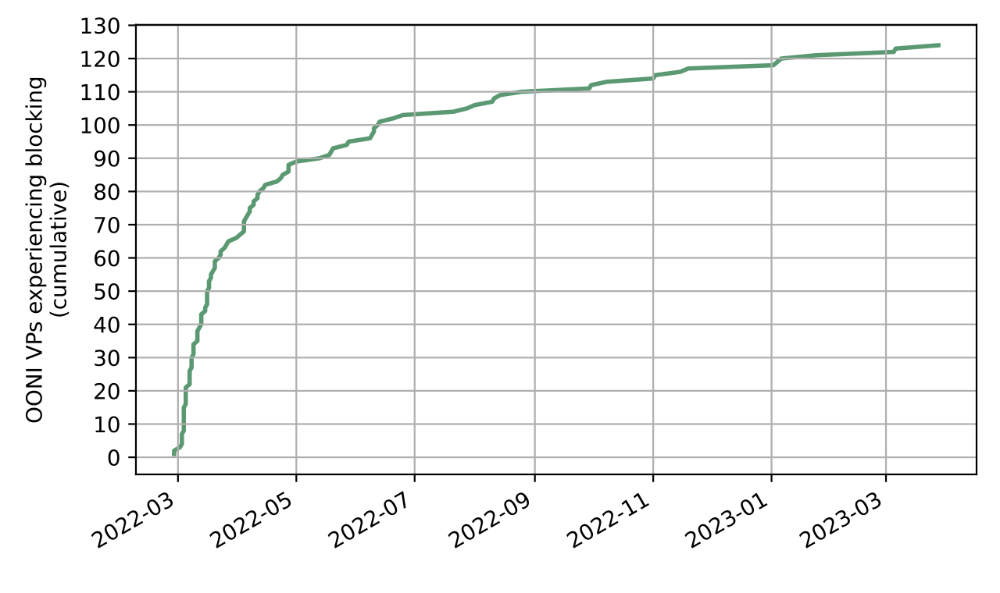
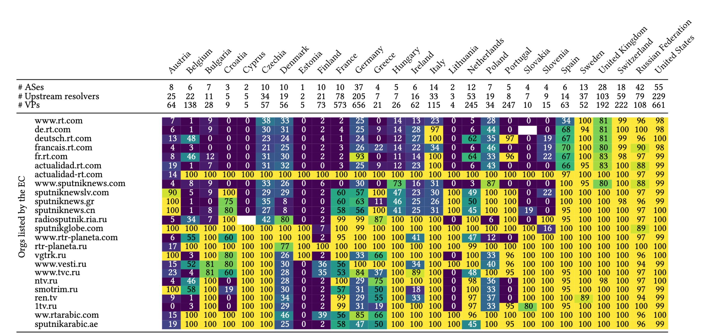
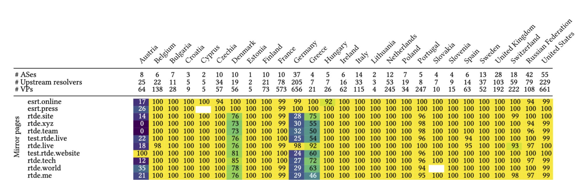
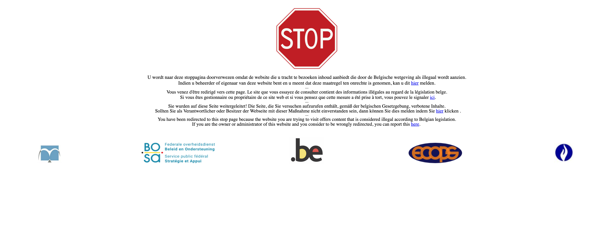
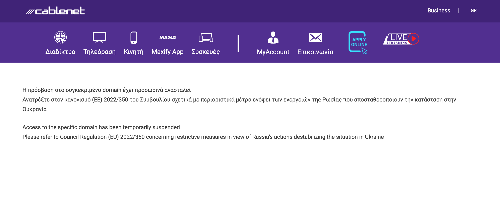

*The original post appeared on the blog of [SIDN Labs](https://www.sidnlabs.nl/en/news-and-blogs/internet-sanctions-on-russian-media-diverging-actions-and-mixed-effects).*

As a response to the Russian aggression against Ukraine, the European Union (EU) imposed sanctions on organisations affiliated with the Russian Federation prohibiting them from broadcasting content in the EU, including online distribution. In a collaborative effort with researchers from the University of Illinois Chicago, Open Observatory of Network Interference (OONI), the University of Twente and the University of Amsterdam, we carried out a longitudinal traffic analysis to understand how internet service providers (ISPs) in different EU member states implement these sanctions. We found that the degree of blocking varies widely, both between and within individual EU member states. This raises questions about the effectiveness of the EU sanctions. This blog is a summary of the paper we published last month.



# Internet sanctions as a response to the Russian invasion of Ukraine

In response to the Russian aggression against Ukraine as of February 2022, the European Union instated sanctions against “media outlets under the permanent direct or indirect control of the leadership of the Russian Federation” to “introduce further restrictive measures to suspend the broadcasting activities of such media outlets in the Union, or directed at the Union.”

[Originally](https://eur-lex.europa.eu/legal-content/EN/TXT/?uri=celex:32022D0351), the list of sanctioned entities consisted of only the television news networks Russia Today (RT), the localised versions of RT and Sputniknews. This list has however been extended multiple times since then [[1](https://eur-lex.europa.eu/legal-content/EN/TXT/?uri=celex:32022D0884), [2](https://eur-lex.europa.eu/legal-content/EN/TXT/?uri=celex:32022D2478), [3](https://eur-lex.europa.eu/eli/dec/2023/434)].

While the term “broadcasting” suggests that the sanctions focus on television, they also require ISPs in member states to block access to websites associated with the sanctioned entities. In the Netherlands, the [implementation](https://nos.nl/collectie/13888/artikel/2419543-russische-staatsmedia-geweerd-uit-eu-journalisten-kritisch-over-censuur) of the sanctions triggered a coalition of Dutch ISPs and freedom-of-speech advocacy groups to file a complaint with the European courts. Specifically, they stated “that the Council of Ministers of the European Union has taken the far-reaching decision to censor these channels without taking sufficient account of the freedom of information…" (see the official [press release](https://freedom.nl/landingpage/rechtszaak-freedom-of-information-coalition-foic)).

# Understanding implementations of the media sanctions by ISPs

Sanctions in the EU fall within the purview of the European Council, which is made up of the leaders of the EU members states. This is the case because sanctions, like security policy, fall within the jurisdiction of individual countries.

While the evaluation of the implementation of the EU sanctions falls within the purview of the European Commission, implementation and enforcement of EU sanctions is primarily the responsibility of the EU Member States. For this reason, the sanctions presented us with an opportunity to measure how a federated, governmental approach to restricting the flow of internet traffic pans out – a novelty the EU has never attempted before.

In this post, we discuss a summary of our measurement methodology and findings. We refer to the [paper](https://www.sidnlabs.nl/downloads/2AI9596Mj7gS5MzicOfOi7/df52d043b674b435868af238e69e58ef/foci_24_author_version_sidn.pdf) that we presented at the [FOCI](https://foci.community/) (Free and Open Communications on the Internet) conference last month for more details and findings.

# Our measurement approach

The enforcement of internet sanctions can occur at different points of the communication path between a client and a server, and on different levels on the protocol stack. For example, DNS, TLS and HTTPS-based blocking are commonly used techniques.

We focus mainly on blocking at the DNS level because it is the most common blocking method used in the EU. DNS-based blocking is usually implemented on a recursive resolver, which is often operated by an ISP. In such cases, the resolver might answer DNS queries for blocked domains like www.rt.com with the IP address of a landing page instead of the IP address configured by RT’s administrators. Alternatively, the resolver could return an error, or not return any information at all.

We relied on data collected by volunteers at the [Open Observatory of Network Interference](https://ooni.org/) (OONI) and on the RIPE Atlas measurement platform, as other researchers in the field of internet censorship have previously done. RIPE Atlas allows us to configure custom DNS measurements from different Internet vantage points, for instance, to test whether recursive resolvers return the correct information for domain names of sanctioned organisations.

Additionally, we carried out measurements using [EduVPN](https://www.eduvpn.org/), [Dataplane.org](https://dataplane.org/) and the [NLNOG RING](https://ring.nlnog.net/). While EduVPN allows us to measure blocking on university networks, the nodes of Dataplane.org and NLNOG RING give us insight into blocking on data centre networks.

It is well known in the censorship measurement community that identifying intentional blocking can be challenging. Unstable Internet connections or other interferences can give researchers the false impression that access to a website has been blocked on purpose. For this reason, we mostly relied on fingerprints of well-known [block-sites](https://github.com/ooni/blocking-fingerprints/tree/main) and block-sites manually identified during the course of this research to classify blocking.

# Eager start

Our measurements in Figure 1 show how quickly ISPs implemented blocking against www.rt.com. The EU announced its sanctions on 1 March 2022, and just one month later we measured that the RT site was blocked for 54% of OONI vantage points (VPs), which showed signs of blocking in the analysed period. This number rose to 77% of OONI VPs showing blocking 3 months later. Interestingly, we saw 2 VPs in Poland for which we already measured blocking 2 days before the sanctions were published.

{{}}

*Figure 1: VPs showing first signs of blocking of www.rt.com over the course of 13 months, as measured by OONI.*

# Blocking in Europe: inconsistent at all levels

As mentioned before, the sanctions by the EU are not centrally coordinated. Also, the council decisions list individuals and organisations, but not their affiliated domain names. It is up to individual member states or network operators to decide which domain names should be blocked.

This might also be the reason why blocking in Europe does not follow a consistent pattern. Figure 2 shows blocking at ISPs. Each cell represents the percentage of unblocked responses per country and domain name received for DNS queries sent to ISP resolvers from RIPE Atlas vantage points. A bright yellow colour indicates that all or almost all queries from vantage points in a certain country towards a particular domain name were unfiltered. A dark purple colour indicates that most of our queries for sanctioned domain names were blocked.

{{}}

*Figure 2: Percentage of uncensored DNS responses received by RIPE Atlas probes relying on ISP resolvers as of 2023-09-19.*

A dark purple colour indicates that most of our queries for sanctioned domain names were blocked.

ISPs block DNS access to www.rt.com in most countries on a larger scale, except for Sweden. If we look at domain names of organisations added to the sanctions list later, we can see the picture becomes more varied. For example, while ISPs in countries like Croatia and Finland block ntv.ru, we did not observe blocking in countries like the Netherlands. And while sputniknews.com moved its activity to sputnikglobe.com in April 2023, we rarely saw blocking of sputnikglobe.com even 5 months later.

Finally, even within one country, the degree of blocking can vary between network providers. One example is Denmark, where for most domain names 30% of DNS queries result in a valid answer. This indicates that one or multiple ISPs in this country do not block these domain names at the DNS level.

Our measurements show that blocking also occurs on university networks. Similar to our measurements of ISP blocking rates, we find that universities implement blocking on different scales. For example, while an institution in Finland implemented the most wide-scale blocking, we observed only limited blocking at an institution in Denmark.

To analyse blocking in data centre networks, we mainly tested the connectivity to sanctioned organisations using HTTPS. Many of our data centre vantage points were pre-configured with Google’s public DNS service, which meant that blocking at the DNS level was unlikely. While our vantage points were able to access most sanctioned domain names, connectivity to sputniknewslv.com was often hampered. We speculate that this was due to the DDoS mitigation service provider used by sputniknewslv.com actively blocking access from the EU. Other than that, we did not observe blocking in data centre networks on a larger scale.

# Easy circumvention

While ISPs can block websites by blocking DNS queries, users can also circumvent such blocks relatively easily. By changing their recursive resolver to, for example, the public resolver operated by [Google](https://developers.google.com/speed/public-dns/) or [Quad9](https://quad9.net/) or by running their own resolver, users can bypass blocks implemented on their local ISP’s resolver.

However, even for less technical users, access to sites of the sanctioned organisations was often not hindered on a larger scale. A few months after the EU added RT to the sanctioned organisations, several domain names popped up on which the content of rt.com and its local versions was mirrored, offering users an easy alternative to the blocked websites.

Figure 3 shows that most German and Austrian ISPs blocked at least some of the mirroring websites of the German version of rt.com (e.g. rtd.xyz or rtde.tech). In contrast, Spanish ISPs did not block the Spanish mirroring sites esrt.online and esrt.press at the time of our measurement. Note that there are also mirrors of rt.com in other languages, which we did not include in our measurements.

{{}}

*Figure 3: Percentage of uncensored DNS responses for requests towards RT mirror pages received by RIPE Atlas probes relying on ISP resolvers.*

# (Lack of) Transparency

ISPs in Europe chose a wide range of approaches for communicating, or not communicating, about the sanctions.

ISPs in Germany largely opted for responding to queries for blocked domain names with DNS messages telling the client that the requested domain name did not exist. This leaves the customers of the ISP in the dark about the implemented blocks.

{{}}

*Figure 4: Generic block page.*

{{}}

*Figure 5: Block page informing users that the block was due to the imposed sanctions.*

# Conclusion: Impact of the sanctions varies

Our results show that it is debatable whether the EU has achieved its goal of reducing the impact of [“propaganda actions”](https://eur-lex.europa.eu/legal-content/EN/TXT/?uri=celex:32022D0351) by the Russian Federation. Member states and ISPs implemented sanctions inconsistently and users can access information provided by sanctioned information relatively easily.

However, it remains unclear how many users change their recursive resolvers to circumvent blocks. Furthermore, we expect that many users receive information about the war in Ukraine via social media, which was outside of the scope of our study.