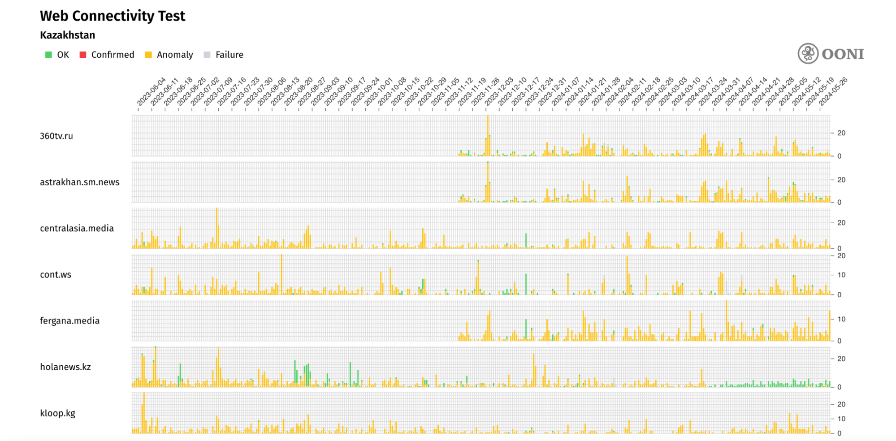
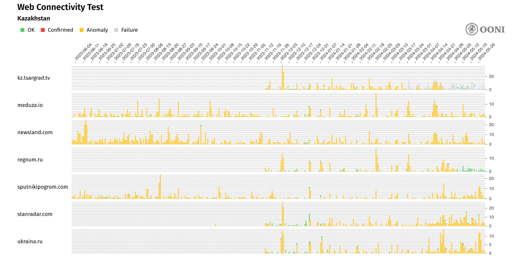
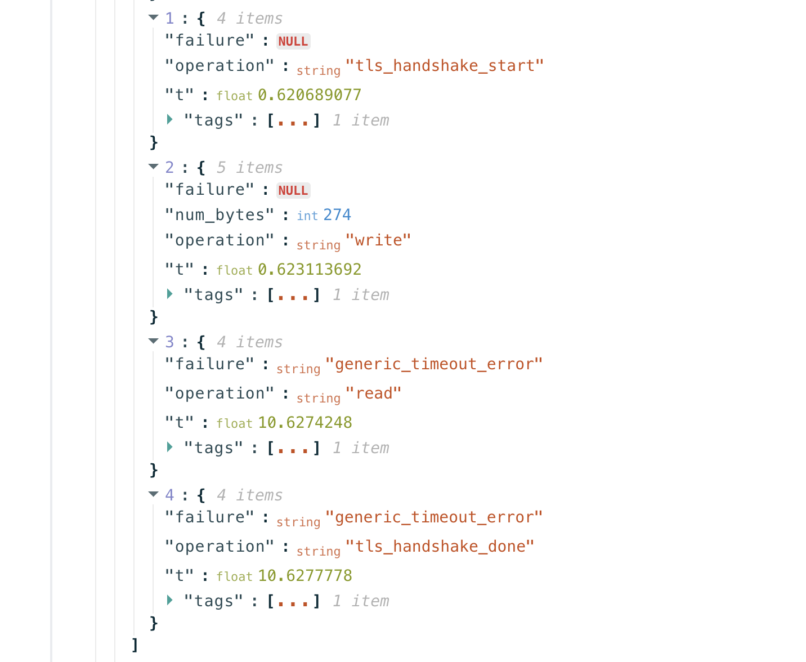
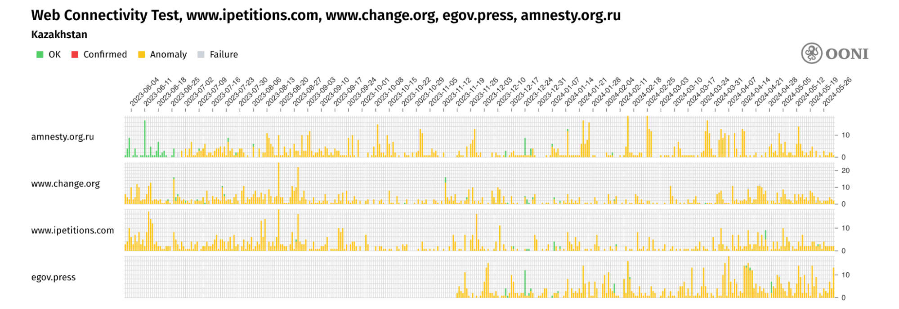
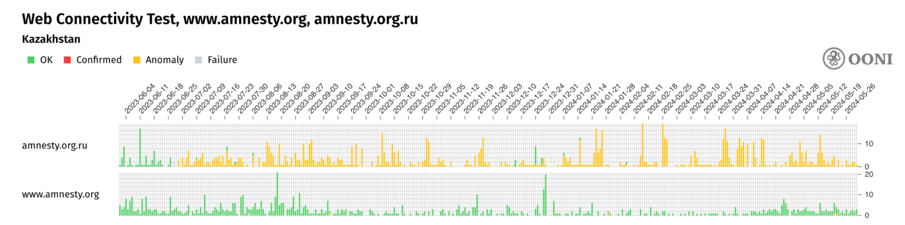
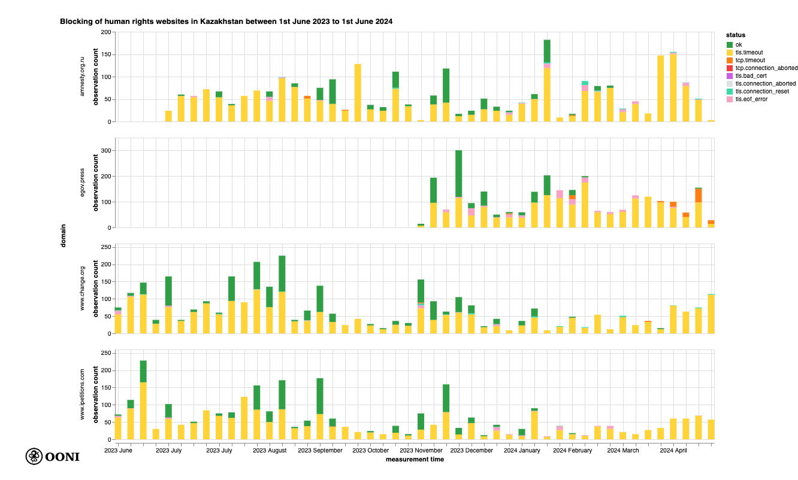
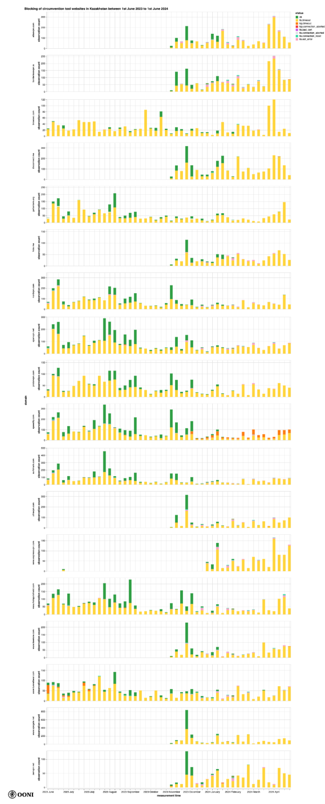
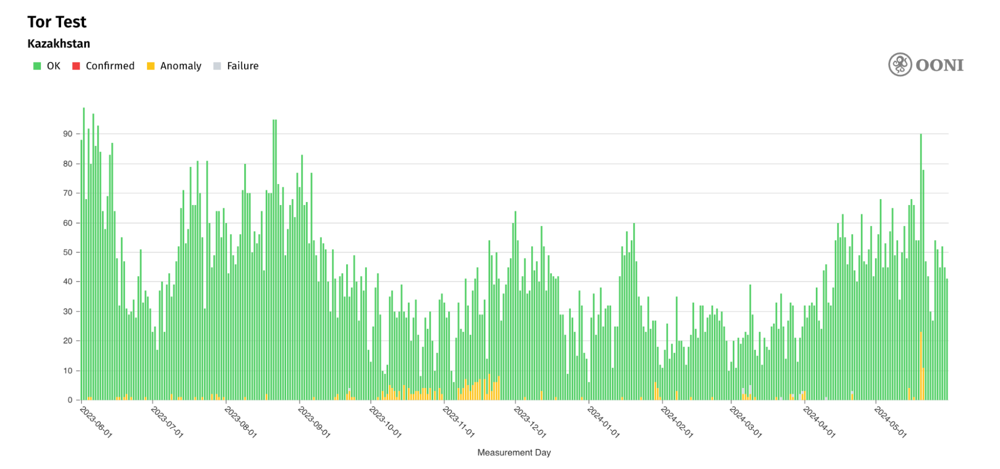
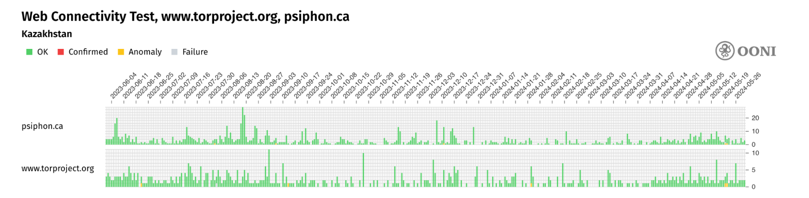
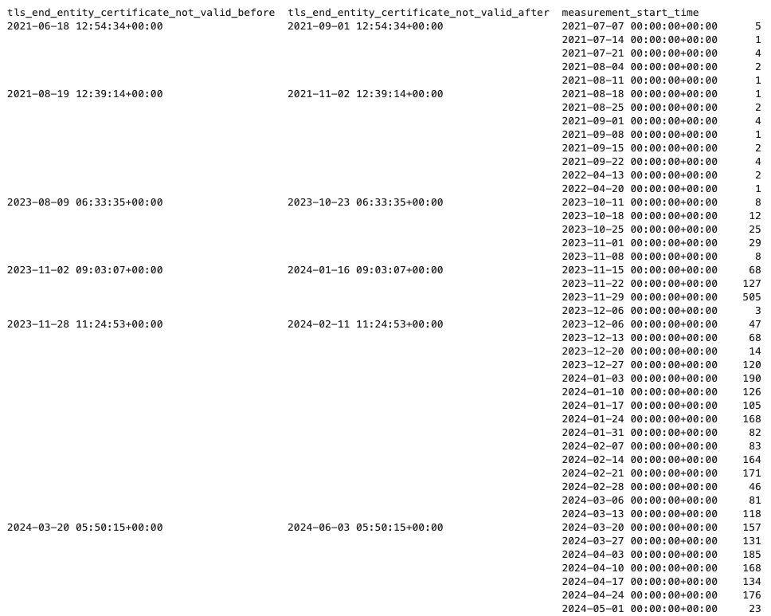

В последние годы об интерент-цензуре в Казахстане [писали](https://freedomhouse.org/country/kazakhstan/freedom-net/2023) довольно много. В рамках этого исследования, [OONI](https://ooni.org/) и организация [Internet Freedom Kazakhstan (IFKZ)](https://ifkz.org/en) совместно с [Евразийским цифровым фондом](https://www.digitalrights.asia) провели исследование интернет-цензуры в Казахстане за последний год (с июня 2023 года по июнь 2024 года) на основе анализа эмпирических данных в виде сетевых измерений.

В этом отчете мы делимся результатами измерений OONI и соответствующим правовым контекстом. Мы обнаружили заблокироваными в Казахстане с помощью TLS-вмешательства множество сайтов [новостных СМИ](https://explorer.ooni.org/search?probe_cc=KZ&test_name=web_connectivity&since=2023-06-01&until=2024-06-01&failure=false&category_code=NEWS&only=anomalies), [правозащитных организаций](https://explorer.ooni.org/chart/mat?test_name=web_connectivity&axis_x=measurement_start_day&since=2023-06-01&until=2024-06-01&time_grain=day&probe_cc=KZ&axis_y=domain&domain=www.ipetitions.com%2Cwww.change.org%2Cegov.press%2Camnesty.org.ru) и [инструментов обхода блокировки](https://explorer.ooni.org/chart/mat?test_name=web_connectivity&axis_x=measurement_start_day&since=2023-06-01&until=2024-06-01&time_grain=day&probe_cc=KZ&axis_y=domain&category_code=ANON). Мы также задокументировали 7 различных промежуточных сертификатов подписанных четырьмя уникальными корневыми сертификатами (НУЦ РК), которые использовались для проведения атак типа ["man-in-the-middle" (MITM) в рамках TLS-рукопожатия](https://explorer.ooni.org/m/20210808015758.022737_KZ_webconnectivity_3b9213f9ee4f2d06) в случае подключения к не менее 14 различным доменным именам в не менее чем 19 различных сетях в Казахстане. Более подробная информация представлена ниже.





## **Основные выводы** 

Наш анализ [данных OONI](https://explorer.ooni.org/chart/mat?test_name=web_connectivity&axis_x=measurement_start_day&since=2023-06-01&until=2024-06-01&time_grain=day&probe_cc=KZ), собранных в Казахстане за последний год (с 1 июня 2023 года по 1 июня 2024 года), показывает следующее:

* **Man-In-The-Middle (MITM) атаки в рамках TLS-рукопожатия.** В [данных OONI](https://explorer.ooni.org/m/20210808015758.022737_KZ_webconnectivity_3b9213f9ee4f2d06) собранных в Казахстане с 2021 по 2024 год, мы обнаружили семь различных промежуточных сертификатов, подписанных четырьмя разными корневыми сертификатами, используемыми для проведения TLS man-in-the-middle (MITM) атак направленных на, как минимум, 14 разных доменов на, как минимум, 19 различных сетях в Казахстане.
* **Блокировку 17 сайтов новостных СМИ.** [Данные OONI](https://explorer.ooni.org/search?probe_cc=KZ&test_name=web_connectivity&since=2023-06-01&until=2024-06-01&failure=false&category_code=NEWS&only=anomalies) показывают блокировку:
    * Многих **российских** новостных СМИ (например, [Телеканал Царьград](https://explorer.ooni.org/chart/mat?probe_cc=KZ&since=2023-06-01&until=2024-06-01&time_grain=day&axis_x=measurement_start_day&test_name=web_connectivity&domain=kz.tsargrad.tv), [Спутник и Погром](https://explorer.ooni.org/chart/mat?probe_cc=KZ&since=2023-06-01&until=2024-06-01&time_grain=day&axis_x=measurement_start_day&test_name=web_connectivity&domain=sputnikipogrom.com), [Спутниковое телевидение 360](https://explorer.ooni.org/chart/mat?probe_cc=KZ&since=2023-06-01&until=2024-06-01&time_grain=day&axis_x=measurement_start_day&test_name=web_connectivity&domain=360tv.ru) и [Информационное агентство Фергана](https://explorer.ooni.org/chart/mat?probe_cc=KZ&since=2023-06-01&until=2024-06-01&time_grain=day&axis_x=measurement_start_day&test_name=web_connectivity&domain=fergana.media));
    * Некоторых **Кыргызских** новостных СМИ ([Kloop](https://explorer.ooni.org/chart/mat?probe_cc=KZ&since=2023-06-01&until=2024-06-01&time_grain=day&axis_x=measurement_start_day&test_name=web_connectivity&domain=kloop.kg) и [Centralasia.media](https://explorer.ooni.org/chart/mat?probe_cc=KZ&since=2023-06-01&until=2024-06-01&time_grain=day&axis_x=measurement_start_day&test_name=web_connectivity&domain=centralasia.media));
    * Одного международного медиа ([Vice News](https://explorer.ooni.org/chart/mat?probe_cc=KZ&since=2023-06-01&until=2024-06-01&time_grain=day&axis_x=measurement_start_day&test_name=web_connectivity&domain=www.vice.com)). 
* **Блокировку сайтов с петициями и русскоязычной версии сайта Amnesty International.** OONI data показывает [целенаправленную блокировку](https://explorer.ooni.org/chart/mat?test_name=web_connectivity&axis_x=measurement_start_day&since=2023-06-01&until=2024-06-01&time_grain=day&probe_cc=KZ&axis_y=domain&domain=www.ipetitions.com%2Cwww.change.org%2Cegov.press%2Camnesty.org.ru) следующих доменов: `amnesty.org.ru`, `www.change.org`, `www.ipetitions.com`, и `egov.press`. В то же время, англоязычная версия сайта Amnesty International остается [доступной](https://explorer.ooni.org/chart/mat?probe_cc=KZ&since=2023-06-01&until=2024-06-01&time_grain=day&axis_x=measurement_start_day&test_name=web_connectivity&domain=www.amnesty.org) в Казахстане, как и сайты многих других международных правозащитных организаций (например, [Human Rights Watch](https://explorer.ooni.org/chart/mat?probe_cc=KZ&since=2023-06-01&until=2024-06-01&time_grain=day&axis_x=measurement_start_day&test_name=web_connectivity&domain=www.hrw.org)).
* **Блокировку как минимум 73 сайтов средств по обходу блокировок.** Данные OONI показывают блокировку множества средств по обходу блокировок, включая  [NordVPN](https://explorer.ooni.org/chart/mat?probe_cc=KZ&since=2023-06-01&until=2024-06-01&time_grain=day&axis_x=measurement_start_day&test_name=web_connectivity&domain=nordvpn.com), [ExpressVPN](https://explorer.ooni.org/chart/mat?probe_cc=KZ&since=2023-06-01&until=2024-06-01&time_grain=day&axis_x=measurement_start_day&test_name=web_connectivity&domain=www.expressvpn.com), [ProtonVPN](https://explorer.ooni.org/chart/mat?probe_cc=KZ&since=2023-06-01&until=2024-06-01&time_grain=day&axis_x=measurement_start_day&test_name=web_connectivity&domain=protonvpn.com), [OpenVPN](https://explorer.ooni.org/chart/mat?probe_cc=KZ&since=2023-06-01&until=2024-06-01&time_grain=day&axis_x=measurement_start_day&test_name=web_connectivity&domain=openvpn.net), [TunnelBear](https://explorer.ooni.org/chart/mat?probe_cc=KZ&since=2023-06-01&until=2024-06-01&time_grain=day&axis_x=measurement_start_day&test_name=web_connectivity&domain=www.tunnelbear.com), и [Surfshark VPN](https://explorer.ooni.org/chart/mat?probe_cc=KZ&since=2023-06-01&until=2024-06-01&time_grain=day&axis_x=measurement_start_day&test_name=web_connectivity&domain=surfshark.com). Однако, данные OONI показывают, что [Tor](https://explorer.ooni.org/chart/mat?probe_cc=KZ&since=2023-06-01&until=2024-06-01&time_grain=day&axis_x=measurement_start_day&test_name=tor) и [Psiphon VPN](https://explorer.ooni.org/chart/mat?probe_cc=KZ&since=2023-06-01&until=2024-06-01&time_grain=day&axis_x=measurement_start_day&test_name=psiphon) оставались доступными в Казахстане в периоде, охваченном исследованием.

Результаты нашего анализа показывают, что большинство интернет-провайдеров в Казахстане, по-видимому, осуществляют блокировку с помощью **TLS-вмешательства**, в частности с помощью [окончания сессии после сообщения Client Hello во время TLS-рукопожатия](https://explorer.ooni.org/m/20240514233718.029308_KZ_webconnectivity_007c5a9f4031213d). Поскольку время блокировки и типы блокируемых ссылок (в основном) совпадают в протестированных сетях, провайдеры в Казахстане, вероятно, осуществляют блокировку скоординированно (возможно, с помощью технологии Deep Packet Inspection). О координации между провайдерами в Казахстане говорит и тот факт, что мы обнаружили один и тот же сертификат, используемый 19 разными провайдерами для осуществления MITM-атак во время TLS-рукопожатия.

## **Введение**

Об интернет-цензуре в Казахстане за последние несколько лет писали достаточно много. Например, в 2019 году организация «Репортеры без границ» (RSF) опубликовала [статью](https://rsf.org/en/heavy-internet-censorship-kazakhstan), осуждающую блокировку сайтов новостных СМИ и социальных сетей в Казахстане на фоне протестов оппозиции. В отчете Freedom House "[Freedom on the Net 2023](https://freedomhouse.org/country/kazakhstan/freedom-net/2023)" зафиксировано множество других случаев блокировок в Казахстане, включая ограничение доступа к сайтам новостных СМИ и инструментов обхода блокировок. Censored Planet публиковали [исследовательскую статью](https://censoredplanet.org/assets/Kazakhstan.pdf), описывающую процесс перехвата HTTPS подключений в Казахстане, а OONI публиковали [отчет](https://ooni.org/post/2023-throttling-kz-elections/) о блокировке сайтов новостных СМИ во время президентских выборов в Казахстане в 2022 году. 

В рамках [партнерства](https://ooni.org/partners/ifkz/) [OONI](https://ooni.org/) и [Internet Freedom Kazakhstan (IFKZ)](https://ifkz.org/en) с [Евразийским цифровым фондом](https://www.digitalrights.asia) уже год сотрудничают в изучении интернет-цензуры в Казахстане. В данном исследовании мы рассмотрели аспекты регулирования интернета в Казахстане, в том числе интернет-цензуру. Мы проанализировали законодательство, направленное на ограничение доступа к онлайн-контенту, и его применение. В частности, мы рассмотрели существующие законы и случаи блокировки социальных сетей, мессенджеров и сайтов. Мы также анализируем случаи ограничения доступа к VPN-сервисам, прокси-серверам и анонимайзерам, которые в исключительных случаях трактуются государственными органами как средства обхода цензуры.

Цель данного исследования – предоставить обзор текущего состояния интернет-цензуры в Казахстане, включая статистику ограничений, примеры из реальной практики, а также анализ законодательства и его применения. Это исследование будет полезно правозащитникам, журналистам, исследователям и другим аудиториям, интересующихся состоянием свободы слова и интернет-цензуры в Казахстане.

Исследовательские вопросы, на которые мы отвечали в рамках этого исследования, включают: 

* Сайты каких **новостных СМИ, правозащитных организаций, политических организаций, и средств обхода блокировок** недоступны в Казахстане?
    * Какие технологии интернет-провайдеры используют для реализации блокировок в Казахстане? Как блокировки различаются у разных провайдеров?
    * Какие законодательные инициативы позволяют реализацию интернет-цензуры в Казахстане?
    * Как цензура влияет на новостные СМИ в Казахстане? 

С 2012 года [Open Observatory of Network Interference (OONI)](https://ooni.org/) разрабатывает программное обеспечение с открытым кодом ([OONI Probe](https://ooni.org/install/)), предназначенное для [документации различных форм интернет-цензуры](https://ooni.org/nettest/), включая блокировку сайтов и приложений. Каждый месяц OONI Probe запускается волонтерами [примерно в 170 странах](https://explorer.ooni.org/) (включая [Казахстан](https://explorer.ooni.org/country/KZ)). Результаты сетевых измерений, собранные пользователями OONI Probe, автоматически публикуются в виде [открытых данных в режиме реального времени](https://ooni.org/data). В рамках данного исследования мы проанализировали данные OONI, собранные в Казахстане, чтобы обнаружить и описать блокировку сайтов.

Цель организации [Internet Freedom Kazakhstan (IFKZ)](https://ifkz.org/)  – обеспечить интернет свободный от незаконной цензуры и ограничений в Казахстане, и создать дружественную цифровую среду с возможностью реализации всех прав и свобод человека. Деятельность IFKZ направлена на повышение прозрачности государственных органов в сфере ИКТ, восстановление доступа к незаконно заблокированным ресурсам, анализ правовых оснований для ограничения доступа к сайтам, а также на защиту цифровых прав и свобод человека. В рамках данного исследования IFKZ провела юридический анализ и опросила две казахстанские новостные медиа-организации ([ProTenge](https://www.instagram.com/protenge.kz/?hl=en) и [Medianet](https://medianet.ngo/en)).

Основной целью нашего исследования было изучение интернет-цензуры в Казахстане, как с помощью сетевых измерений OONI, так и с помощью юридического анализа. Мы стремились определить, возможно ли обнаружить и задокументировать блокировки сайтов в Казахстане (с акцентом на новостные СМИ, правозащитные, политические сайты и сайты с инструментами обхода блокировок), а также выяснить, различается ли реализация блокировок у разных интернет-провайдеров в стране. Ответы на эти вопросы могут помочь оценить, испытывают ли интернет-пользователи в Казахстане ограничения и в какой степени. Анализ соответствующих правовых рамок обеспечивает важный контекст для понимания условий, в которых осуществляются блокировки.

Мы сузили рамки нашего исследования до сайтов, которые потенциально могут оказать наибольшее влияние, если окажутся заблокированными. Учитывая прошлые [отчеты](https://freedomhouse.org/country/kazakhstan/freedom-net/2023) о блокировке новостных СМИ и инструментов обхода цензуры, мы ограничили наш анализ проверкой сайтов новостных СМИ и инструментов обхода блокировок, а также проанализировали результаты тестов политических и правозащитных сайтов. Мы также ограничили [анализ данных OONI](https://github.com/ooni/backend/issues/846) измерениями, собранными за последний год, с 1 июня 2023 года по 1 июня 2024 года.

В следующих разделах мы подробнее расскажем о методах и результатах этого исследования.

## **Методы** 

В рамках данного исследования мы поставили перед собой задачу изучить интернет-цензуру в Казахстане с помощью сетевых измерений OONI и юридического анализа. 

Исследовательские вопросы, на которые мы отвечали в рамках этого исследования, включают: 

* Сайты каких **новостных СМИ, правозащитных организаций, политических организаций, и средств обхода блокировок** недоступны в Казахстане?
    * Какие технологии интернет-провайдеры используют для реализации блокировок в Казахстане? Как блокировки различаются у разных провайдеров?
    * Какие законодательные инициативы позволяют реализацию интернет-цензуры в Казахстане?
    * Как цензура влияет на новостные СМИ в Казахстане?

Мы ответили на эти вопросы с помощью качественных и количественных методов исследования. Для изучения блокировки сайтов мы проанализировали [данные OONI](https://explorer.ooni.org/chart/mat?probe_cc=KZ&since=2023-06-01&until=2024-06-01&time_grain=day&axis_x=measurement_start_day&test_name=web_connectivity), собранные в Казахстане за последний год. В частности, мы [проанализировали](https://github.com/ooni/backend/issues/846) данные собранные с помощью теста [Web Connectivity](https://explorer.ooni.org/search?probe_cc=KZ&test_name=web_connectivity&since=2023-06-01&until=2024-06-01&failure=false) (тестирует доступность сайтов с помощью OONI Probe), собранные в Казахстане в период с 1 июня 2023 года по 1 июня 2024 года. Этот анализ позволил нам обнаружить блокировку сайтов и конкретные технологии цензуры, применяемые интернет-провайдерами в Казахстане для осуществления блокировок.

Чтобы разобраться в правовых основах, регулирующих блокировки Казахстане, мы провели соответствующий правовой анализ. Чтобы изучить влияние цензуры, мы провели интервью с двумя казахстанскими новостными медиа-организациями. Более подробно о наших методах мы рассказываем ниже.

### **Юридический анализ, интервью и обновление списка тестов**

В рамках данного исследования Internet Freedom Kazakhstan (IFKZ) провел качественное исследование, предоставив соответствующий правовой контекст, изучив влияние цензуры на несколько казахстанских новостных медиа-организаций и сообщив, какие веб-сайты следует проверить на блокировку в Казахстане. Их исследование основано на данных, собранных из разных источников, включая официальные документы, интервью с медиа-организациями и активистами, а также анализ законодательства и правоприменительной практики в Казахстане.

В частности, IFKZ провел соответствующий правовой анализ, обновил список тестов для Казахстана с веб-сайтами инструментов обхода и медиа-проектами, которые могли быть заблокированы в Казахстане в соответствии с законодательными нормами, описанными в соответствующем разделе. IFKZ также взял интервью у двух казахстанских новостных медиа-организаций (ProTenge и Medianet), пострадавших от DDOS-атак и взлома аккаунтов в социальных сетях, чтобы предоставить контекст о других типах цензуры, происходящих в Казахстане, и влиянии такой цензуры.

В рамках правового анализа IFKZ предоставил обзор существующего регулирования онлайн-пространств и публичной информации в Казахстане, включая соответствующие статьи Конституции, Закон «О средствах массовой информации» и Закон «О связи». IFKZ не только описывает содержание этих статей и законов, но и объясняет, как они были реализованы через решения суда или предписание Министерства культуры и информации, а также соответствующие случаи, когда они применяются к веб-сайтам СМИ и инструментов обхода. В качестве примера IFKZ описывает судебное дело проекта VPN-сервиса HideMyName, веб-сайт которого был заблокирован в Казахстане с 2020 года. Апелляция не увенчалась успехом, однако она весьма показательна для того, как описанные законы применяются на практике.

В том же юридическом разделе IFKZ предоставляет обзор общедоступных данных о количестве URL-адресов и ресурсов, заблокированных в Казахстане по данным различных государственных органов, а также аргументацию того, почему эти ресурсы были заблокированы. Приведенные данные нельзя считать исчерпывающими, поскольку в 2022 году исключено предусмотренное законодательством появление Единого реестра интернет-ресурсов, размещающих информацию, запрещенную в Казахстане.

### **Анализ данных OONI** 

В рамках этого исследования [Open Observatory of Network Interference (OONI)](https://ooni.org/) проанализировала [результаты сетевых измерений OONI](https://explorer.ooni.org/chart/mat?probe_cc=KZ&since=2023-06-01&until=2024-06-01&time_grain=day&axis_x=measurement_start_day&test_name=web_connectivity), собранные в Казахстане в период **с 1 июня 2023 года по 1 июня 2024 года**. Мы стремились выяснить, блокировались ли в течение анализируемого периода сайты новостных СМИ, правозащитные, политические сайты и сайты с инструментами обхода блокировок (включенные в [глобальный](https://github.com/citizenlab/test-lists/blob/master/lists/global.csv) и [казахстанский](https://github.com/citizenlab/test-lists/blob/master/lists/kz.csv) списки для тестирования Citizen Lab), а также варьировалась ли реализация таких блокировок в разных сетях Казахстана. 

С 2012 года [Open Observatory of Network Interference (OONI)](https://ooni.org/) разрабатывает программное обеспечение с открытым кодом ([OONI Probe](https://ooni.org/install/)), предназначенное для [документации различных форм интернет-цензуры](https://ooni.org/nettest/), включая блокировку сайтов и приложений. Каждый месяц OONI Probe запускается волонтерами [примерно в 170 странах](https://explorer.ooni.org/) (включая [Казахстан](https://explorer.ooni.org/country/KZ)). Результаты сетевых измерений, собранные пользователями OONI Probe, автоматически публикуются в виде [открытых данных в режиме реального времени](https://ooni.org/data).

[OONI Probe](https://ooni.org/install/) включает в себя [эксперимент Web Connectivity](https://ooni.org/nettest/web-connectivity/), который предназначен для измерения блокировки множества различных сайтов (включенных в публичные, созданные сообществом [списки тестов Citizen Lab](https://github.com/citizenlab/test-lists/tree/master/lists)). В частности, тест OONI [Web Connectivity](https://ooni.org/nettest/web-connectivity/) предназначен для измерения доступности [URL-адресов](https://github.com/citizenlab/test-lists/tree/master/lists) путем выполнения следующих действий:

* Идентификация DNS-сервера
* поиск DNS
* TCP-соединение с полученными IP-адресами
* TLS-рукопожатие с полученными IP-адресами
* HTTP(s) GET запрос после перенаправления

Вышеописанные действия выполняются автоматически из локальной сети пользователя и из контрольной точки обзора. Если результаты из обеих сетей одинаковы, проверенный URL аннотируется как доступный. Если результаты отличаются, проверенный URL аннотируется как [аномальный](https://ooni.org/ru/support/faq#%D1%87%D1%82%D0%BE-%D0%B2%D1%8B-%D0%B8%D0%BC%D0%B5%D0%B5%D1%82%D0%B5-%D0%B2-%D0%B2%D0%B8%D0%B4%D1%83-%D0%BF%D0%BE%D0%B4-%D0%B0%D0%BD%D0%BE%D0%BC%D0%B0%D0%BB%D0%B8%D1%8F%D0%BC%D0%B8), а тип аномалии дополнительно характеризуется в зависимости от причины, вызвавшей сбой (например, если TCP-соединение не работает, измерение аннотируется как аномалия TCP/IP).

[Аномальные измерения](https://ooni.org/ru/support/faq#%D1%87%D1%82%D0%BE-%D0%B2%D1%8B-%D0%B8%D0%BC%D0%B5%D0%B5%D1%82%D0%B5-%D0%B2-%D0%B2%D0%B8%D0%B4%D1%83-%D0%BF%D0%BE%D0%B4-%D0%B0%D0%BD%D0%BE%D0%BC%D0%B0%D0%BB%D0%B8%D1%8F%D0%BC%D0%B8) могут свидетельствовать о блокировке, однако возможны и [ложноположительные результаты](https://ooni.org/ru/support/faq#%D1%87%D1%82%D0%BE-%D1%82%D0%B0%D0%BA%D0%BE%D0%B5-%D0%BB%D0%BE%D0%B6%D0%BD%D0%BE%D0%BF%D0%BE%D0%BB%D0%BE%D0%B6%D0%B8%D1%82%D0%B5%D0%BB%D1%8C%D0%BD%D1%8B%D0%B5-%D1%80%D0%B5%D0%B7%D1%83%D0%BB%D1%8C%D1%82%D0%B0%D1%82%D1%8B). Поэтому мы считаем, что вероятность блокировки выше, если общий объем аномальных измерений высок по сравнению с общим количеством измерений (сравнение на уровне ASN в одном и том же диапазоне дат для каждого типа эксперимента OONI Probe).

Каждый [Web Connectivity](https://ooni.org/nettest/web-connectivity/) тест предоставляет дополнительную сетевую информацию (например, информацию о TLS-рукопожатиях), которая помогает оценить, есть ли в аномальном измерении признаки блокировки. Поэтому мы дезагрегируем данные по причинам, вызвавшим аномалию (например, сброс соединения во время TLS-рукопожатия), и, если они совпадают, то мы интерпретируем их как более сильный сигнал о потенциальной блокировке.

Основываясь на эвристике OONI, мы можем автоматически подтвердить блокировку сайтов по [отпечаткам](https://github.com/ooni/blocking-fingerprints), например, если обслуживается [страница блокировки](https://ooni.org/ru/support/glossary#%D1%81%D1%82%D1%80%D0%B0%D0%BD%D0%B8%D1%86%D0%B0-%D0%B1%D0%BB%D0%BE%D0%BA%D0%B8%D1%80%D0%BE%D0%B2%D0%BA%D0%B8) или если DNS-сервер возвращает IP, известный как связанный с цензурой. Хотя этот метод позволяет нам [автоматически подтверждать блокировку](https://explorer.ooni.org/search?since=2024-03-06&until=2024-04-06&only=confirmed&failure=false) сайтов в [Казахстане](https://explorer.ooni.org/search?since=2024-07-02&until=2024-08-02&failure=false&probe_cc=KZ&test_name=web_connectivity&only=confirmed) и многих других странах (таких как [Россия](https://explorer.ooni.org/search?since=2023-08-10&until=2023-09-10&failure=false&probe_cc=RU&only=confirmed), [Иран](https://explorer.ooni.org/search?since=2023-08-10&until=2023-09-10&failure=false&probe_cc=IR&only=confirmed) и [Индонезия](https://explorer.ooni.org/search?since=2023-08-10&until=2023-09-10&failure=false&probe_cc=ID&only=confirmed)), мы проанализировали аномальные измерения OONI (с помощью нашего [инструмента анализа данных OONI](https://github.com/ooni/data)), чтобы обнаружить более тонкие и продвинутые методы цензуры.

В рамках данного исследования мы проанализировали [сетевые измерения OONI](https://explorer.ooni.org/chart/mat?probe_cc=KZ&since=2023-06-01&until=2024-06-01&time_grain=day&axis_x=measurement_start_day&test_name=web_connectivity), собранные в Казахстане в период **с 1 июня 2023 года по 1 июня 2024 года**. В частности, мы ограничили наш [анализ](https://github.com/ooni/backend/issues/846) измерениями [собранными с помощью теста Web Connectivity](https://explorer.ooni.org/search?probe_cc=KZ&test_name=web_connectivity&since=2023-06-01&until=2024-06-01&failure=false), поскольку нас в первую очередь интересовало исследование блокировок сайтов, в то время как совокупные показатели тестирования [WhatsApp](https://explorer.ooni.org/chart/mat?probe_cc=KZ&since=2023-06-01&until=2024-06-01&time_grain=day&axis_x=measurement_start_day&test_name=whatsapp), [Facebook Messenger](https://explorer.ooni.org/chart/mat?probe_cc=KZ&since=2023-06-01&until=2024-06-01&time_grain=day&axis_x=measurement_start_day&test_name=facebook_messenger), [Telegram](https://explorer.ooni.org/chart/mat?probe_cc=KZ&since=2023-06-01&until=2024-06-01&time_grain=day&axis_x=measurement_start_day&test_name=telegram), [Tor](https://explorer.ooni.org/chart/mat?probe_cc=KZ&since=2023-06-01&until=2024-06-01&time_grain=day&axis_x=measurement_start_day&test_name=tor) и [Psiphon](https://explorer.ooni.org/chart/mat?probe_cc=KZ&since=2023-06-01&until=2024-06-01&time_grain=day&axis_x=measurement_start_day&test_name=psiphon) _не_ _выявили_ признаков блокировки в течение анализируемого периода (поэтому не заслуживают более глубокого анализа, который обычно направлен на понимание того, являются ли аномалии ложнопозитивными или свидетельствуют о блокировке). Мы исключили из тестирования измерения [Signal](https://explorer.ooni.org/chart/mat?probe_cc=KZ&since=2023-06-01&until=2024-06-01&time_grain=day&axis_x=measurement_start_day&test_name=signal), поскольку в течение последнего года мы столкнулись с [проблемой с качеством данных](https://github.com/ooni/probe/issues/2344) полученных в результате этого теста.

Из всех измерений [собранных с помощью теста Web Connectivity](https://explorer.ooni.org/search?probe_cc=KZ&test_name=web_connectivity&since=2023-06-01&until=2024-06-01&failure=false) в Казахстане за последний год, мы ограничили наш анализ доменами (включенными в [глобальный](https://github.com/citizenlab/test-lists/blob/master/lists/global.csv) и [казахстанский](https://github.com/citizenlab/test-lists/blob/master/lists/kz.csv) списки для тестирования Citizen Lab), которые аннотированы [кодами категорий](https://github.com/citizenlab/test-lists/blob/master/lists/00-LEGEND-new_category_codes.csv) "News Media (NEWS)", "Human Rights Issues (HUMR)", "Political Criticism (POLR)" и "Anonymization and circumvention tools (ANON)" в списках для тестирования Citizen Lab. Это позволило нам изучить блокировку сайтов новостных СМИ, правозащитных, политических организаций, и средств обхода блокировок, не анализируя все тестируемые сайты в Казахстане (которые включают широкий спектр самых разных и не имеющих отношения к нашему исследовательскому вопросу сайтов). 

Мы объединили [аномальные результаты теста Web Connectivity, собранные в Казахстане](https://explorer.ooni.org/search?probe_cc=KZ&test_name=web_connectivity&since=2023-06-01&until=2024-06-01&failure=false&only=anomalies) по типам сбоев ("dns", "tcp_ip", "http-failure", "http-diff"), чтобы оценить, повторяются ли они постоянно (или типы сбоев меняются). Более последовательный тип сбоя, наблюдаемый в большом объеме измерений, согласно нашей методологии, дает более сильный сигнал о блокировке. Большинство аномальных измерений [показали](https://explorer.ooni.org/search?probe_cc=KZ&test_name=web_connectivity&since=2023-06-01&until=2024-06-01&failure=false&only=anomalies) сигнал "http-failures", это значит, что аномалии были вызваны каким-то сбоем во время HTTP-эксперимента. Мы дополнительно проанализировали эти сбои, чтобы обнаружить специфические ошибки (такие как "connection_reset_error" или "generic_timeout_error"), которые позволили бы нам охарактеризовать потенциальную блокировку. В рамках анализа мы объединили ошибки, чтобы изучить, насколько они последовательны в измерениях собранных с каждой протестированной ASN. 

Для этого нам нужно было проанализировать информацию из данных о TLS-рукопожатии в этих измерениях, чтобы оценить, были ли ошибки результатом помех, связанных с TLS. Например, измерение может показать, что DNS-сервер возвращает правильные IP-адреса, что можно установить соединение с полученными IP-адресами, но сессия TLS-рукопожатия завершается после первого сообщения ClientHello (которое является незашифрованным), что приводит к ошибке "generic_timeout_error". Хотя мы считаем, что такое измерение показывает признаки потенциального TLS-вмешательства, мы не будем делать выводы только на основании одного измерения.

Поэтому мы агрегировали аномалии, чтобы определить, является ли большой процент аномальных измерений для тестируемого URL одинаковой ошибкой (например, "tls_timeout_error") по сравнению с общим объемом измерений в конкретной сети в определенном диапазоне дат. Чем выше соотношение одинаковых ошибок (от аномальных измерений) по сравнению с общим количеством измерений, тем сильнее сигнал (и тем выше наша уверенность), что доступ к тестируемому домену (а) заблокирован, и (б) заблокирован определенным образом (например, с помощью TLS-вмешательства).

В рамках нашего анализа мы исключили случаи, которые показывали слабые сигналы. К ним относились случаи с малым/ограниченным охватом измерений (по сравнению с общим охватом измерений в тестируемой ASN за период анализа), низким процентом аномалий (по сравнению с общим объемом измерений для тестируемого сервиса в сети), относительно большой долей _непоследовательных_ типов отказов и ошибок, а также случаи, которые были определены как ложнопозитивные на основе известных ошибок или других проблем (например, глобальные показатели отказов в результате того, что тестируемые сервисы размещены на ненадежных серверах или измерения собраны в ненадежных сетях). 

Как только мы начали видеть сильный сигнал того, как именно блокировки были реализованы в Казахстане (в данном исследовании мы обнаружили, что "tls.timeout_errors" присутствовал в подавляющем большинстве аномальных измерений), мы начали рассматривать измерения с различными ошибками как более слабые сигналы (считая их вероятными ложнопозитивными результатами). Далее мы ограничили наш анализ сетями (ASN), откуда мы получили наибольший охват измерений и где мы увидели наиболее сильные сигналы блокировок. В итоге результаты данного исследования ограничиваются измерениями, где мы увидели наиболее сильные согласно нашей методологии сигналы.

#### **Ограничения методологии** 

Результаты данного исследования имеют ряд ограничений, в том числе:

* **Диапазон дат анализа**. Результаты исследования ограничены [измерениями OONI, собранными в Казахстане](https://explorer.ooni.org/chart/mat?probe_cc=KZ&since=2023-06-01&until=2024-06-01&time_grain=day&axis_x=measurement_start_day&test_name=web_connectivity) в период с 1 июня 2023 года по 1 июня 2024 года. Таким образом, результаты тестов, проведенных в другие периоды, исключены из этого исследования.
* **Тип измерений**. Полученные данные в основном касаются измерений собранных в результате тестов [Web Connectivity](https://ooni.org/nettest/web-connectivity/) проверяющих сайты на цензуру. Поэтому результаты [других экспериментов OONI Probe](https://ooni.org/nettest) (особенно тех, которые не измеряют блокировку сайтов и приложений) исключены из данного исследования.
* **Проверяемые сайты**. Тестирование в основном ограничивается URL-адресами, включенными в два [списка для тестирования Citizen Lab](https://github.com/citizenlab/test-lists/tree/master/lists): [глобальный](https://github.com/citizenlab/test-lists/blob/master/lists/global.csv) список (включающий URL-адреса, имеющие отношение к международной повестке) и [казахстанский](https://github.com/citizenlab/test-lists/blob/master/lists/kz.csv) список (включающий URL-адреса, имеющие отношение только к Казахстану). Поскольку эти списки тестируются пользователями [OONI Probe](https://ooni.org/install) и имеют ограничения по пропускной способности, они обычно ограничиваются примерно 1 000 URL. Кроме того, из этих списков мы ограничили наш анализ URL-адресами, входящими в [категории](https://github.com/citizenlab/test-lists/blob/master/lists/00-LEGEND-new_category_codes.csv)  “News Media (NEWS)”, “Human Rights Issues (HUMR)”, “Political Criticism (POLR)”, и “Anonymization and circumvention tools (ANON)”. В результате из списков могут быть исключены другие сайты, которые могут быть заблокированы в Казахстане, и полученные результаты ограничиваются проверкой URL-адресов, включенных в категории “News Media (NEWS)”, “Human Rights Issues (HUMR)”, “Political Criticism (POLR)”, и “Anonymization and circumvention tools (ANON)” этих списков. Учитывая, что списки составляются сообществом, мы признаем предвзятость в выборе URL-адресов, добавляемых в списки, а также риск неправильного отнесения URL-адресов к той или иной категории.
* **Количество тестов отдельных сайтов**. Не все URL-адреса, включенные в [списки для тестирования](https://github.com/citizenlab/test-lists/tree/master/lists), измеряются одинаково по всему Казахстану с течением времени. Объем данных OONI для конкретного сайта зависит от того, тестировал ли его пользователь [OONI Probe](https://ooni.org/install) в Казахстане, в каких сетях и когда. В результате тестируемые сайты получали разное количество тестов в течение всего анализируемого периода, что влияет на результаты.
* **Тестируемые ASN**. Хотя тесты OONI Probe регулярно проводятся на нескольких ASN в Казахстане, не все сети тестируются одинаково. Наличие и объем измерений зависит от того, к каким сетям были подключены пользователи [OONI Probe](https://ooni.org/install) во время проведения тестов. В результате объем измерений собранных с разных ASN в течение анализируемого периода различается, что влияет на результаты. Более того, мы ограничили результаты данного исследования ASN, которые получили наибольший объем измерений и которые подавали самые сильные сигналы о блокировках в течение анализируемого нами периода. К ним относятся  AS9198 (JSC Kazakhtelecom), AS21299 (Kar-Tel LLC), AS44477 (STARK INDUSTRIES SOLUTIONS LTD), AS206026 (Kar-Tel LLC), AS41798 (JSC Transtelecom), AS9009 (M247 Europe SRL).
* **Сигналы блокировок.** В рамках анализа данных мы ограничили наши выводы сигналами, которые, по нашему мнению, были более надежными и указывали на цензуру, осуществляемую правительством, исключив при этом случаи, которые считались слабыми сигналами (как обсуждалось ранее в разделе "Методы"). В результате мы признаем риск того, что в наших выводах могут быть пропущены некоторые случаи блокировок (если эти случаи были аннотированы как слабые сигналы в рамках нашего анализа данных).
* **Интервью**. В попытке изучить влияние цензуры на новостные СМИ в Казахстане мы провели интервью с двумя казахстанскими новостными СМИ ([ProTenge](https://www.instagram.com/protenge.kz/?hl=en) и [Medianet](https://medianet.ngo/en)). С помощью этих интервью мы стремились дополнить юридический анализ и технический анализ данных OONI качественными данными. Однако мы признаем, что результаты этих двух интервью _не дают_ полного или репрезентативного представления о влиянии цензуры на (большинство) новостных медиа-организаций в Казахстане, поскольку они в основном отражают мнение двух опрошенных организаций. Мы призываем исследователей провести более полное исследование с большей выборкой интервью. 

## **Результаты анализа данных OONI**

В рамках данного исследования мы проанализировали [данные OONI](https://explorer.ooni.org/chart/mat?probe_cc=KZ&since=2023-06-01&until=2024-06-01&time_grain=day&axis_x=measurement_start_day&test_name=web_connectivity), собранные в Казахстане в период **с 1 июня 2023 года по 1 июня 2024 года**. Наш [анализ](https://github.com/ooni/backend/issues/846) был ограничен [измерениями собранными с помощью теста Web Connectivity](https://explorer.ooni.org/search?probe_cc=KZ&test_name=web_connectivity&since=2023-06-01&until=2024-06-01&failure=false), относящимися к доменам [категорий](https://github.com/citizenlab/test-lists/blob/master/lists/00-LEGEND-new_category_codes.csv) News Media (NEWS)”, “Human Rights Issues (HUMR)”, “Political Criticism (POLR)” и “Anonymization and circumvention tools (ANON)” в [глобальном](https://github.com/citizenlab/test-lists/blob/master/lists/global.csv) и [казахстанском](https://github.com/citizenlab/test-lists/blob/master/lists/kz.csv) списках для тестирования Citizen Lab.

Хотя многие домены списков для тестирования Citizen Lab, которые мы анализировали (из [категорий](https://github.com/citizenlab/test-lists/blob/master/lists/00-LEGEND-new_category_codes.csv) `NEWS`, `POLR`, `HUMR`, `ANON`), показывали [аномалии](https://explorer.ooni.org/search?probe_cc=KZ&test_name=web_connectivity&since=2023-06-01&until=2024-06-01&failure=false&only=anomalies) в течение анализируемого периода, мы ограничили наши выводы доменами, которые, согласно нашей методологии, продемонстрировали наиболее сильные сигналы блокировки. К ним относятся домены, получившие наибольший объем измерений за анализируемый период, наибольший объем аномалий (по сравнению с общим объемом измерений), а также наибольший и наиболее последовательный тип ошибок среди аномальных измерений. Мы исключили домены, не отвечающие этим критериям, а также случаи с истекшими доменами, и другие нефункциональные домены.

В целом, мы не обнаружили серьезных случаев блокировки политических сайтов в Казахстане в течение анализируемого периода. Более конкретно, из всех доменов, аннотированных как "Political Criticism (POLR)" в [глобальном](https://github.com/citizenlab/test-lists/blob/master/lists/global.csv) и [казахстанском](https://github.com/citizenlab/test-lists/blob/master/lists/kz.csv) списках для  тестирования Global и Kazakh Citizen Lab, очень немногие домены подавали сигналы о блокировке, но мы исключили эти случаи из результатов, поскольку срок действия этих доменов истек. 

В то же время, мы обнаружили блокировку **73 сайтов с инструментами обхода блокировок**, а также блокировку **17 сайтов новостных медиа и нескольких правозащитных сайтов**. Почти во всех случаях блокировки осуществляются с помощью TLS-вмешательства: данные OONI показывают, что TLS-рукопожатия приводят к [тайм-аутам](https://explorer.ooni.org/m/20240514233718.029308_KZ_webconnectivity_007c5a9f4031213d) после сообщения Client Hello. Это наблюдается во всех протестированных сетях в Казахстане в течение анализируемого периода, что является сильным сигналом блокировки. Это также позволяет предположить, что интернет-провайдеры в Казахстане осуществляют цензуру скоординированно, возможно, с помощью технологии Deep Packet Inspection (DPI).   

Стоит отметить, что мы обнаружили **7 различных промежуточных сертификатов подписанных 4-мя корневыми сертификатами, которые использовались для проведения TLS-атак типа "man-in-the-middle" (MITM)**, направленных на как минимум 14 различных доменных имен в 19 различных сетях в Казахстане.

Мы рассказываем больше подробностей о блокировках в следующих разделах.

### **Блокировки сайтов новостных медиа**

Цензура новостных СМИ в Казахстане [освещалась](https://forbes.kz/articles/v_kazahstane_ne_otkryivayutsya_saytyi_dvuh_rossiyskih_delovyih_smi_i_novostnoy_sayt_bbc) на протяжении последних лет. Например, в 2021 году доступ к HOLA News – казахстанскому независимому новостному сайту – был временно (на 10 дней) [заблокирован](https://cpj.org/2021/10/kazakh-outlet-hola-news-reports-website-blocks-after-pandora-papers-coverage/) после сообщения об утечке информации об офшорах из Pandora Papers. В 2022 году, когда в Казахстане проходили внеочередные президентские выборы, несколько российских и международных новостных сайтов были [недоступны](https://freedomhouse.org/country/kazakhstan/freedom-net/2023). [Данные OONI](https://ooni.org/post/2023-throttling-kz-elections/) из того периода показывают, что доступ к таким новостным сайтам замедлялся. 

В прошлом году Казахстан [заблокировал сайт российского телеканала "Царьград"](https://rus.azattyq.org/a/32552586.html) за экстремистское содержание и "разжигание ненависти". Несколько месяцев спустя (в ноябре 2023 года) Казахстан, по сообщениям, [заблокировал российский канал Sputnik24](https://kyivindependent.com/media-kazakhstan-blocks-russian-tv-portal/) из-за проблем с лицензированием. В январе 2024 года казахстанский телеоператор TVCOM [прекратил вещание нескольких станций, запущенных российским государственным "Первым каналом"](https://www.azattyq.org/a/32759407.html), чтобы, как сообщается, снизить долю иностранных новостных каналов в Казахстане. 

Наш анализ [данных OONI](https://explorer.ooni.org/search?probe_cc=KZ&test_name=web_connectivity&since=2023-06-01&until=2024-06-01&failure=false&category_code=NEWS&only=anomalies), собранных в Казахстане за последний год (с 1 июня 2023 года по 1 июня 2024 года), показывает **блокировку следующих 17 доменов новостных СМИ:**

* [360tv.ru](https://explorer.ooni.org/chart/mat?probe_cc=KZ&since=2023-06-01&until=2024-06-01&time_grain=day&axis_x=measurement_start_day&test_name=web_connectivity&domain=360tv.ru)
* [astrakhan.sm.news](https://explorer.ooni.org/chart/mat?probe_cc=KZ&since=2023-06-01&until=2024-06-01&time_grain=day&axis_x=measurement_start_day&test_name=web_connectivity&domain=astrakhan.sm.news)
* [centralasia.media](https://explorer.ooni.org/chart/mat?probe_cc=KZ&since=2023-06-01&until=2024-06-01&time_grain=day&axis_x=measurement_start_day&test_name=web_connectivity&domain=centralasia.media)
* [cont.ws](https://explorer.ooni.org/chart/mat?probe_cc=KZ&since=2023-06-01&until=2024-06-01&time_grain=day&axis_x=measurement_start_day&test_name=web_connectivity&domain=cont.ws)
* [fergana.media](https://explorer.ooni.org/chart/mat?probe_cc=KZ&since=2023-06-01&until=2024-06-01&time_grain=day&axis_x=measurement_start_day&test_name=web_connectivity&domain=fergana.media)
* [holanews.kz](https://explorer.ooni.org/chart/mat?probe_cc=KZ&since=2023-06-01&until=2024-06-01&time_grain=day&axis_x=measurement_start_day&test_name=web_connectivity&domain=holanews.kz)
* [kloop.kg](https://explorer.ooni.org/chart/mat?probe_cc=KZ&since=2023-06-01&until=2024-06-01&time_grain=day&axis_x=measurement_start_day&test_name=web_connectivity&domain=kloop.kg)
* [kz.tsargrad.tv](https://explorer.ooni.org/chart/mat?probe_cc=KZ&since=2023-06-01&until=2024-06-01&time_grain=day&axis_x=measurement_start_day&test_name=web_connectivity&domain=kz.tsargrad.tv)
* [meduza.io](https://explorer.ooni.org/chart/mat?probe_cc=KZ&since=2023-06-01&until=2024-06-01&time_grain=day&axis_x=measurement_start_day&test_name=web_connectivity&domain=meduza.io)
* [newsland.com](https://explorer.ooni.org/chart/mat?probe_cc=KZ&since=2023-06-01&until=2024-06-01&time_grain=day&axis_x=measurement_start_day&test_name=web_connectivity&domain=newsland.com)
* [regnum.ru](https://explorer.ooni.org/chart/mat?probe_cc=KZ&since=2023-06-01&until=2024-06-01&time_grain=day&axis_x=measurement_start_day&test_name=web_connectivity&domain=regnum.ru)
* [sputnikipogrom.com](https://explorer.ooni.org/chart/mat?probe_cc=KZ&since=2023-06-01&until=2024-06-01&time_grain=day&axis_x=measurement_start_day&test_name=web_connectivity&domain=sputnikipogrom.com)
* [stanradar.com](https://explorer.ooni.org/chart/mat?probe_cc=KZ&since=2023-06-01&until=2024-06-01&time_grain=day&axis_x=measurement_start_day&test_name=web_connectivity&domain=stanradar.com)
* [ukraina.ru](https://explorer.ooni.org/chart/mat?probe_cc=KZ&since=2023-06-01&until=2024-06-01&time_grain=day&axis_x=measurement_start_day&test_name=web_connectivity&domain=ukraina.ru)
* [www.kavkazcenter.com](https://explorer.ooni.org/chart/mat?probe_cc=KZ&since=2023-06-01&until=2024-06-01&time_grain=day&axis_x=measurement_start_day&test_name=web_connectivity&domain=www.kavkazcenter.com)
* [xakep.ru](https://explorer.ooni.org/chart/mat?probe_cc=KZ&since=2023-06-01&until=2024-06-01&time_grain=day&axis_x=measurement_start_day&test_name=web_connectivity&domain=xakep.ru)
* [www.vice.com](https://explorer.ooni.org/chart/mat?probe_cc=KZ&since=2023-06-01&until=2024-06-01&time_grain=day&axis_x=measurement_start_day&test_name=web_connectivity&domain=www.vice.com)

Многие из вышеперечисленных **заблокированных доменов включают в себя сайты российских новостных СМИ**, такие как сайт (на казахском языке) [российского телеканала "Царьград"](https://explorer.ooni.org/chart/mat?probe_cc=KZ&since=2023-06-01&until=2024-06-01&time_grain=day&axis_x=measurement_start_day&test_name=web_connectivity&domain=kz.tsargrad.tv) (который, как [сообщается](https://rus.azattyq.org/a/32552586.html), был заблокирован в Казахстане в августе 2023 года), ["Спутник и Погром"](https://explorer.ooni.org/chart/mat?probe_cc=KZ&since=2023-06-01&until=2024-06-01&time_grain=day&axis_x=measurement_start_day&test_name=web_connectivity&domain=sputnikipogrom.com) (общественно-политическое интернет-издание русских националистов, выходившее с 2012 по 2018 год), [российский спутниковый телеканал "360"](https://explorer.ooni.org/chart/mat?probe_cc=KZ&since=2023-06-01&until=2024-06-01&time_grain=day&axis_x=measurement_start_day&test_name=web_connectivity&domain=360tv.ru), [информационное агентство Фергана](https://explorer.ooni.org/chart/mat?probe_cc=KZ&since=2023-06-01&until=2024-06-01&time_grain=day&axis_x=measurement_start_day&test_name=web_connectivity&domain=fergana.media) (российское СМИ, освещающее новости в Центральной Азии) и [российский новостной сайт об Украине](https://explorer.ooni.org/chart/mat?probe_cc=KZ&since=2023-06-01&until=2024-06-01&time_grain=day&axis_x=measurement_start_day&test_name=web_connectivity&domain=ukraina.ru). Примечательно, что в число заблокированных сайтов российских СМИ входит [Meduza](https://explorer.ooni.org/chart/mat?probe_cc=KZ&since=2023-06-01&until=2024-06-01&time_grain=day&axis_x=measurement_start_day&test_name=web_connectivity&domain=meduza.io) – русскоязычный независимый новостной сайт, который был [заблокирован в России после вторжения в Украину](https://ooni.org/post/2022-russia-blocks-amid-ru-ua-conflict/#meduza) и [остается заблокированным в России](https://explorer.ooni.org/chart/mat?probe_cc=RU&since=2024-06-30&until=2024-07-31&time_grain=day&axis_x=measurement_start_day&test_name=web_connectivity&domain=meduza.io) до сих пор. В число заблокированных сайтов также входит ["Кавказ-центр"](https://explorer.ooni.org/chart/mat?probe_cc=KZ&since=2023-06-01&until=2024-06-01&time_grain=day&axis_x=measurement_start_day&test_name=web_connectivity&domain=www.kavkazcenter.com) (чеченское новостное интернет-агентство), который заблокирован как в [Казахстане](https://explorer.ooni.org/chart/mat?probe_cc=KZ&since=2024-05-31&until=2024-07-31&time_grain=day&axis_x=measurement_start_day&test_name=web_connectivity&domain=www.kavkazcenter.com), так и в [России](https://explorer.ooni.org/chart/mat?probe_cc=RU&since=2024-05-31&until=2024-07-31&time_grain=day&axis_x=measurement_start_day&test_name=web_connectivity&domain=www.kavkazcenter.com). 

Помимо блокировки российских новостных сайтов, данные OONI также свидетельствуют о том, что Казахстан **заблокировал доступ к нескольким кыргызским новостным сайтам**. В их число входит ["Kloop"](https://explorer.ooni.org/chart/mat?probe_cc=KZ&since=2023-06-01&until=2024-06-01&time_grain=day&axis_x=measurement_start_day&test_name=web_connectivity&domain=kloop.kg), один из самых [популярных независимых новостных сайтов в Кыргызстане](https://www.cbc.ca/news/canada/british-columbia/journalists-at-ted-2019-conference-fight-for-truth-and-democracy), известный своими журналистскими расследованиями. Данные OONI показывают, что доступ к Kloop заблокирован как в [Казахстане](https://explorer.ooni.org/chart/mat?probe_cc=KZ&since=2024-05-31&until=2024-07-31&time_grain=day&axis_x=measurement_start_day&test_name=web_connectivity&domain=kloop.kg), так и в [Кыргызстане](https://explorer.ooni.org/chart/mat?probe_cc=KG&since=2024-01-31&until=2024-07-31&time_grain=day&axis_x=measurement_start_day&test_name=web_connectivity&domain=kloop.kg). Кроме того, данные OONI свидетельствуют о блокировке [Centralasia.media](https://explorer.ooni.org/chart/mat?probe_cc=KZ&since=2023-06-01&until=2024-06-01&time_grain=day&axis_x=measurement_start_day&test_name=web_connectivity&domain=centralasia.media), медиа-организации, базирующейся в Кыргызстане и освещающей новости Центральной Азии. 

[Vice News](https://explorer.ooni.org/chart/mat?probe_cc=KZ&since=2023-06-01&until=2024-06-01&time_grain=day&axis_x=measurement_start_day&test_name=web_connectivity&domain=www.vice.com) – единственный международный новостной сайт, который, согласно нашему анализу, показывает сильный сигнал блокировки в Казахстане. На самом деле, тестирование OONI Probe `www.vice.com` в нескольких сетях в Казахстане показывает, что [почти все измерения были аномальными](https://explorer.ooni.org/chart/mat?probe_cc=KZ&since=2023-06-01&until=2024-06-01&time_grain=day&axis_x=measurement_start_day&test_name=web_connectivity&domain=www.vice.com) в течение всего периода тестирования. Согласно сайту правительства Казахстана, предоставляющему информацию о решениях о блокировке, [доступ к Vice News блокируется в Казахстане с 2015 года на основании решения суда](https://www.gov.kz/memleket/entities/qogam/report-internet-content?lang=ru), который постановил, что определенные страницы Vice News распространяют пропаганду терроризма и экстремизма. Эти URL-адреса указывают на полнометражный видеосюжет (опубликованный Vice в августе 2014 года) об Исламском государстве. Учитывая, что Vice News (как и большинство веб-сайтов в наши дни) размещается на HTTPS, интернет-провайдеры в Казахстане не могут ограничить блокировку конкретной веб-страницей и поэтому блокируют весь сайт `www.vice.com`. 

Все вышеперечисленные домены новостных СМИ в течение всего периода тестирования демонстрировали [большое количество аномалий](https://explorer.ooni.org/chart/mat?probe_cc=KZ&since=2023-06-01&until=2024-06-01&time_grain=day&axis_x=measurement_start_day&axis_y=domain&test_name=web_connectivity&category_code=NEWS) (по сравнению с общим объемом измерений), что свидетельствует о наличии блокировки. Это иллюстрируется следующими графиками, которые представляют собой [совокупность измерений OONI](https://explorer.ooni.org/chart/mat?probe_cc=KZ&since=2023-06-01&until=2024-06-01&time_grain=day&axis_x=measurement_start_day&axis_y=domain&test_name=web_connectivity&category_code=NEWS), собранных в ходе тестирования вышеуказанных 17 доменов в нескольких сетях в Казахстане в период с 1 июня 2023 года по 1 июня 2024 года.

{{}}

**График:** результаты тестирования OONI Probe `360tv.ru`, `astrakhan.sm.news`, `centralasia.media`, `cont.ws`, `fergana.media`, `holanews.kz`, and `kloop.kg` на нескольких сетях в Казахстане с 1-го июня 2023 по 1-е июля 2024 (источник: [OONI data](https://explorer.ooni.org/chart/mat?probe_cc=KZ&since=2023-06-01&until=2024-06-01&time_grain=day&axis_x=measurement_start_day&axis_y=domain&test_name=web_connectivity&category_code=NEWS)).

{{}}

**График:** результаты тестирования OONI Probe `kz.tsargrad.tv`, `meduza.io`, `newsland.com`, `regnum.ru`, `sputnikipogrom.com`, `stanradar.com` and `ukraina.ru` на нескольких сетях в Казахстане с 1-го июня 2023 по 1-е июля 2024 (источник: [OONI data](https://explorer.ooni.org/chart/mat?probe_cc=KZ&since=2023-06-01&until=2024-06-01&time_grain=day&axis_x=measurement_start_day&axis_y=domain&test_name=web_connectivity&category_code=NEWS)).

{{}}

**График:** результаты тестирования OONI Probe `www.kavkazcenter.com`, `xakep.ru` and `www.vice.com`  на нескольких сетях в Казахстане с 1-го июня 2023 по 1-е июля 2024 (источник: [OONI data](https://explorer.ooni.org/chart/mat?probe_cc=KZ&since=2023-06-01&until=2024-06-01&time_grain=day&axis_x=measurement_start_day&axis_y=domain&test_name=web_connectivity&category_code=NEWS)).

Из приведенных выше графиков видно, что большинство измерений OONI, относящихся к тестированию этих 17 новостных медиа-доменов, показывали аномалии в течение всего анализируемого периода. Это говорит о том, что доступ к этим доменам был заблокирован в тех сетях в Казахстане, которые были протестированы. Однако стоит отметить, что последние измерения для `holanews.kz`, `xakep.ru` и `regnum.ru` были успешными, что говорит о том, что доступ, возможно, недавно был **разблокирован** в Казахстане (по крайней мере, на тестируемых сетях). 

Хотя стабильное присутствие аномалий является сильным признаком блокировки, подтверждение и описание блокировки требуют анализа причин аномалий, а также учета факторов, которые могли способствовать появлению ложнопозитивных измерению. С этой целью мы проанализировали аномальные измерения этих 17 доменов, чтобы выявить конкретные ошибки, произошедшие во время экспериментов. Этот анализ позволили нам понять, на каком этапе тестирования (например, поиск DNS, TLS-рукопожатие) появилась аномалия. Впоследствии мы агрегировали типы ошибок, чтобы оценить, насколько эти ошибки были постоянны в каждой тестируемой сети в течение всего периода анализа. Более регулярная ошибка служит индикатором определенной техники блокировки и обеспечивает более сильный сигнал о блокировке. 

Поскольку в течение анализируемого периода тесты OONI Probe проводились на более чем 30 различных сетях в Казахстане (у каждой из которых был неравномерный охват измерений), мы ограничили наш анализ сетями, получившими как наибольший охват измерений в течение анализируемого периода (что позволяет нам больше доверять этим измерениям), так и наиболее сильные сигналы блокировки (т. е. наиболее последовательные типы ошибок в аномальных измерениях). К ним относятся AS9198 (JSC Kazakhtelecom), AS21299 (Kar-Tel LLC), AS44477 (STARK INDUSTRIES SOLUTIONS LTD), AS206026 (Kar-Tel LLC), AS41798 (JSC Transtelecom), AS9009 (M247 Europe SRL).

На основе этого анализа, мы создали следующий график.

{{}}

**График:** результаты тестирования OONI Probe новостных сайтов на нескольких сетях в Казахстане с 1-го июня 2023 по 1-е июля 2024 (источник: [OONI data](https://explorer.ooni.org/chart/mat?probe_cc=KZ&since=2023-06-01&until=2024-06-01&time_grain=day&axis_x=measurement_start_day&axis_y=domain&test_name=web_connectivity&category_code=NEWS)).

Как видно, большинство аномальных измерений, полученных в ходе тестирования вышеуказанных 17 доменов новостных СМИ в Казахстане, имели признаки **TLS-вмешательства**. В частности, данные OONI показывают, что, хотя DNS-сервер возвращал правильные IP-адреса, и можно было установить соединение с IP-адресами, сессия [TLS-рукопожатия завершалась после первого сообщения Client Hello](https://explorer.ooni.org/m/20240514233718.029308_KZ_webconnectivity_007c5a9f4031213d) (которое является незашифрованным), что приводило к тайм-аут ошибкам. Такая последовательная техника блокировки, наблюдаемая в нескольких сетях, дает нам уверенность в полученных результатах и позволяет предположить, что провайдеры в Казахстане могут использовать технологию Deep Packet Inspection (DPI) для осуществления блокировки.

{{}}

**Иллюстрация:** измерение OONI полученное в результате тестирования `kloop.kg` в Казахстане 14-го мая 2024-го года (источник: [OONI data](https://explorer.ooni.org/m/20240514233718.029308_KZ_webconnectivity_007c5a9f4031213d)).

Стоит отметить, что для некоторых заблокированных новостных СМИ (таких как `360tv.ru`, `astrakhan.sm.news`, `ukraina.ru` и `www.kavkazcenter.com`), по нашим наблюдениям, провайдеры в Казахстане возвращали **[недействительные TLS-сертификаты](https://explorer.ooni.org/m/20231016130600.035487_KZ_webconnectivity_4a5c38a0f8bea740)**. Это говорит о наличии TLS-атак типа "man-in-the-middle" (MITM), которые мы более подробно рассматриваем в следующем разделе данного отчета.   

### **Блокировка сайта Amnesty International и сайтов с петициями** 

В 2016 году глобальная платформа [Change.org была заблокирована в Казахстане](https://www.opendemocracy.net/en/odr/internet-censorship-in-kazakhstan/) за размещение петиции, призывавшей к отставке тогдашнего премьер-министра Карима Масимова. Последние данные OONI свидетельствуют о том, что доступ к `www.change.org` [по-прежнему заблокирован](https://explorer.ooni.org/chart/mat?probe_cc=KZ&since=2023-06-01&until=2024-06-01&time_grain=day&axis_x=measurement_start_day&test_name=web_connectivity&domain=www.change.org) в Казахстане. Но в рамках нашего анализа мы также обнаружили, что другие [сайты с петициями](https://explorer.ooni.org/chart/mat?probe_cc=KZ&since=2023-06-01&until=2024-06-01&time_grain=day&axis_x=measurement_start_day&test_name=web_connectivity&domain=www.ipetitions.com) (`www.ipetitions.com` и `egov.press`) и [русскоязычная версия сайта Amnesty International](https://explorer.ooni.org/chart/mat?probe_cc=KZ&since=2023-06-01&until=2024-06-01&time_grain=day&axis_x=measurement_start_day&test_name=web_connectivity&domain=amnesty.org.ru) также заблокированы в Казахстане. По мнению Freedom House, сайты петиций были заблокированы в Казахстане для [предотвращения агитации](https://freedomhouse.org/country/kazakhstan/freedom-net/2023).

В частности, наш анализ [данных OONI](https://explorer.ooni.org/search?probe_cc=KZ&test_name=web_connectivity&since=2023-06-01&until=2024-06-01&failure=false&category_code=HUMR&only=anomalies), собранных в Казахстане за последний год (с 1 июня 2023 года по 1 июня 2024 года), показывает **блокировку 4 доменов проектов, связанных с правами человека**:

* [amnesty.org.ru](https://explorer.ooni.org/chart/mat?probe_cc=KZ&since=2023-06-01&until=2024-06-01&time_grain=day&axis_x=measurement_start_day&test_name=web_connectivity&domain=amnesty.org.ru)
* [egov.press](https://explorer.ooni.org/chart/mat?probe_cc=KZ&since=2023-06-01&until=2024-06-01&time_grain=day&axis_x=measurement_start_day&test_name=web_connectivity&domain=egov.press)
* [www.change.org](https://explorer.ooni.org/chart/mat?probe_cc=KZ&since=2023-06-01&until=2024-06-01&time_grain=day&axis_x=measurement_start_day&test_name=web_connectivity&domain=www.change.org)
* [www.ipetitions.com](https://explorer.ooni.org/chart/mat?probe_cc=KZ&since=2023-06-01&until=2024-06-01&time_grain=day&axis_x=measurement_start_day&test_name=web_connectivity&domain=www.ipetitions.com)

Тестирование этих доменов показало большой объем аномалий в течение всего периода (по сравнению с общим объемом измерений), что свидетельствует о блокировке. Это иллюстрируется следующим графиком, который представляет [совокупность измерений OONI](https://explorer.ooni.org/chart/mat?probe_cc=KZ&since=2023-06-01&until=2024-06-01&time_grain=day&axis_x=measurement_start_day&axis_y=domain&test_name=web_connectivity&domain=www.ipetitions.com%2Cwww.change.org%2Cegov.press%2Camnesty.org.ru), собранных в ходе тестирования вышеуказанных 4 доменов на нескольких сетях в Казахстане в период с 1 июня 2023 года по 1 июня 2024 года.

{{}}

**График:** результаты тестирования OONI Probe `amnesty.org.ru`, `egov.press`, `www.change.org` and `www.ipetitions.com` на нескольких сетях в Казахстане с 1-го июня 2023 по 1-е июля 2024 (источник: [OONI data](https://explorer.ooni.org/chart/mat?probe_cc=KZ&since=2023-06-01&until=2024-06-01&time_grain=day&axis_x=measurement_start_day&axis_y=domain&test_name=web_connectivity&domain=www.ipetitions.com%2Cwww.change.org%2Cegov.press%2Camnesty.org.ru)).

Из приведенного выше графика видно, что подавляющее большинство измерений OONI, относящихся к тестированию этих 4 правозащитных доменов, показывали аномалии в течение всего анализируемого периода. Это говорит о том, что доступ к этим доменам был заблокирован в сетях протестированных в Казахстане. Сайты петиций `www.change.org` и `www.ipetitions.com` показывали аномалии в течение всего анализируемого периода, что говорит о том, что их блокировка была осуществлена до 1 июня 2023 года (блокировка Change.org, [как сообщается](https://www.opendemocracy.net/en/odr/internet-censorship-in-kazakhstan/), началась в 2016 году). Неясно, когда началась блокировка `egov.press`, учитывая, что тестирование OONI Probe этого домена в Казахстане [началось только 19 ноября 2023 года](https://explorer.ooni.org/chart/mat?test_name=web_connectivity&axis_x=measurement_start_day&since=2023-06-01&until=2024-06-01&time_grain=day&probe_cc=KZ&domain=egov.press) (и большинство измерений после этого показывали аномалии). 

Однако [блокировка русскоязычной версии сайта Amnesty International](https://explorer.ooni.org/chart/mat?test_name=web_connectivity&axis_x=measurement_start_day&since=2023-06-01&until=2024-06-01&time_grain=day&probe_cc=KZ&domain=amnesty.org.ru), судя по всему, началась в период проведения данного исследования. В частности, данные OONI показывают, что если раньше тестирование сайта `amnesty.org.ru` в Казахстане было успешным (сайт был доступен в протестированных сетях), то [начиная с 30 июня 2023 года он стал показывать аномалии и признаки блокировки](https://explorer.ooni.org/chart/mat?test_name=web_connectivity&axis_x=measurement_start_day&since=2023-06-01&until=2024-06-01&time_grain=day&probe_cc=KZ&domain=amnesty.org.ru). Стоит отметить, что в тот же период данные OONI показывают, что основной англоязычный сайт Amnesty International был [доступен](https://explorer.ooni.org/chart/mat?probe_cc=KZ&since=2023-06-01&until=2024-06-01&time_grain=day&axis_x=measurement_start_day&test_name=web_connectivity&domain=www.amnesty.org) (в протестированных сетях) в Казахстане, как показано ниже. 

{{}}

**График:** результаты тестирования OONI Probe `amnesty.org.ru` and `www.amnesty.org` на нескольких сетях в Казахстане с 1-го июня 2023 по 1-е июля 2024 (источник: [OONI data](https://explorer.ooni.org/chart/mat?probe_cc=KZ&since=2023-06-01&until=2024-06-01&time_grain=day&axis_x=measurement_start_day&axis_y=domain&test_name=web_connectivity&domain=www.amnesty.org%2Camnesty.org.ru)).

​​Приведенное выше сравнение позволяет предположить, что блокировка Amnesty International носила целенаправленный характер и ограничивалась цензурой русскоязычного контента, который мог быть более актуальным для казахстанской аудитории. На целенаправленную блокировку (русскоязычного издания) сайта Amnesty International указывает и тот факт, что, согласно данным OONI, другие международные правозащитные сайты (например, [Human Rights Watch](https://explorer.ooni.org/chart/mat?probe_cc=KZ&since=2023-06-01&until=2024-06-01&time_grain=day&axis_x=measurement_start_day&test_name=web_connectivity&domain=www.hrw.org)) были доступны в Казахстане в течение анализируемого периода.

Похожим образом на блокировку сайтов новостных СМИ (о которой говорилось ранее), данные OONI позволяют предположить, что блокировка этих правозащитных сайтов осуществляется с помощью **TLS-вмешательства**, поскольку мы наблюдаем [завершение сессии после сообщения Client Hello во время TLS-рукопожатия](https://explorer.ooni.org/m/20240424193847.054068_KZ_webconnectivity_41a132d98c5332dd). Это видно на следующем графике, который объединяет типы сбоев, наблюдаемых в аномальных измерениях.

{{}}

**График:** результаты тестирования OONI Probe сайтов `amnesty.org.ru`, `egov.press`, `www.change.org` и `www.ipetitions.com` на нескольких сетях в Казахстане с 1-го июня 2023 по 1-е июля 2024 (источник: [OONI data](https://explorer.ooni.org/chart/mat?probe_cc=KZ&since=2023-06-01&until=2024-06-01&time_grain=day&axis_x=measurement_start_day&axis_y=domain&test_name=web_connectivity&domain=www.ipetitions.com%2Cwww.change.org%2Cegov.press%2Camnesty.org.ru)).

TLS-рукопожатия происходили одинаково – в большинстве случаев это приводило к одинаковым ошибкам таймаута, и мы получили устойчивый сигнал, свидетельствующий о том, что интернет-провайдеры в Казахстане блокировали доступ к русскоязычной версии сайта Amnesty International и к нескольким сайтам петиций с помощью TLS-вмешательства. 

### **Блокировка средств обхода блокировок** 

Обход интернет-цензуры в Казахстане может быть сопряжен с определенными трудностями, поскольку [многие сайты с инструментами обхода блокировок оказались недоступны](https://explorer.ooni.org/chart/mat?test_name=web_connectivity&axis_x=measurement_start_day&since=2023-06-01&until=2024-06-01&time_grain=day&probe_cc=KZ&axis_y=domain&category_code=ANON) в стране. Это не слишком удивительно, учитывая, что средства обхода блокировок, предоставляющие доступ к материалам, заблокированным по решению суда и постановлениям государственных органов, запрещены законом. 

В рамках нашего исследования мы обнаружили **блокировку 73 сайтов с инструментами обхода блокировокк** в Казахстане. К ним относятся следующие домены:

```

activpn.com

atlasvpn.com

belkavpn.com

borderlessvpn.io

browsec.com

cloudvpn.pro

disconnect.me

dotvpn.com

droidvpn.com

free-vpn.pro

fri-gate.org

getlantern.org

goosevpn.com

hide.me

hidemy.name

hit-tool.com

hola.org

i2p2.de

mac.eltima.com

mask-h2.icloud.com

mask.icloud.com

mrpvpn.com

mullvad.net

mybrowservpn.com

myvpn.run

netmap.su

nordvpn.com

openvpn.net

privateproxy.me

privatevpn.com

protonvpn.com

ringvpn.com

ru.vpnmentor.com

saturnvpn.com

speedify.com

strongvpn.com

supervpn.im

surfshark.com

ultravpn.com

usemyvpn.com

vpn.softok.info

vpnclientapp.com

vpnka.org

vpnki.ru

www.bananavpn.com

www.betternet.co

www.cyberghostvpn.com

www.expressvpn.com

www.gethotspotshield.com

www.gohotspotshield.com

www.hotspotshield.com

www.ivacy.com

www.keenow.com

www.netflixvpn.com

www.okayfreedom.com

www.pearlvpn.com

www.personalvpn.com

www.privateinternetaccess.com

www.privatevpn.biz

www.surfeasy.com

www.touchvpn.net

www.tunnelbear.com

www.urban-vpn.com

www.vpn.asia

www.vpnbook.com

www.vpngate.net

www.vpnmentor.com

www.vpnside.com

www.vpnuk.net

www.vyprvpn.com

zenmate.com

zenvpn.net

zoogvpn.com

```

В Казахстане [потенциально недоступны гораздо больше сайтов с инструментами обхода блокировок](https://explorer.ooni.org/chart/mat?probe_cc=KZ&since=2023-06-01&until=2024-06-01&time_grain=day&axis_x=measurement_start_day&axis_y=domain&test_name=web_connectivity&category_code=ANON), поскольку приведенный выше список ограничен доменами, которые получили наибольший охват измерений и самые сильные сигналы блокировки (на основе нашей эвристики) в течение анализируемого периода. 

Аналогично блокировкам новостных СМИ и правозащитных сайтов (описанных выше), данные OONI свидетельствуют о том, что попытки подключения к сайтам инструментов обхода блокировок также подвергаются **TLS-вмешательству** в Казахстане. В частности, данные OONI показывают, что, хотя DNS-сервер возвращал правильные IP-адреса и можно было установить соединение с нужными IP-адресами, мы наблюдали [завершение сессии после сообщения Client Hello во время TLS-рукопожатия](https://explorer.ooni.org/m/20240516234217.634427_KZ_webconnectivity_d588105675f794fc). Мы постоянно наблюдаем эту закономерность в большинстве аномальных измерений, относящихся к тестированию вышеуказанных 73 доменов. Мы проиллюстрировали это на следующем графике (для удобства чтения мы включили только 18 доменов).

{{}}

**График:** результаты тестирования OONI Probe сайтов средств обхода блокировок на нескольких сетях в Казахстане с 1-го июня 2023 по 1-е июля 2024 (источник: [OONI data](https://explorer.ooni.org/chart/mat?probe_cc=KZ&since=2023-06-01&until=2024-06-01&time_grain=day&axis_x=measurement_start_day&axis_y=domain&test_name=web_connectivity&category_code=ANON)).

Такая регулярность таймаут-ошибок во время TLS-рукопожатия, наблюдаемая в нескольких сетях в Казахстане, дает нам уверенность в результатах анализа и позволяет предположить, что провайдеры в Казахстане могут использовать технологию Deep Packet Inspection (DPI) для реализации блокировок.

В число заблокированных доменов входят многие популярные сайты обхода блокировок, такие как [NordVPN](https://explorer.ooni.org/chart/mat?probe_cc=KZ&since=2023-06-01&until=2024-06-01&time_grain=day&axis_x=measurement_start_day&test_name=web_connectivity&domain=nordvpn.com), [ExpressVPN](https://explorer.ooni.org/chart/mat?probe_cc=KZ&since=2023-06-01&until=2024-06-01&time_grain=day&axis_x=measurement_start_day&test_name=web_connectivity&domain=www.expressvpn.com), [ProtonVPN](https://explorer.ooni.org/chart/mat?probe_cc=KZ&since=2023-06-01&until=2024-06-01&time_grain=day&axis_x=measurement_start_day&test_name=web_connectivity&domain=protonvpn.com), [OpenVPN](https://explorer.ooni.org/chart/mat?probe_cc=KZ&since=2023-06-01&until=2024-06-01&time_grain=day&axis_x=measurement_start_day&test_name=web_connectivity&domain=openvpn.net), [TunnelBear](https://explorer.ooni.org/chart/mat?probe_cc=KZ&since=2023-06-01&until=2024-06-01&time_grain=day&axis_x=measurement_start_day&test_name=web_connectivity&domain=www.tunnelbear.com) и [Surfshark VPN](https://explorer.ooni.org/chart/mat?probe_cc=KZ&since=2023-06-01&until=2024-06-01&time_grain=day&axis_x=measurement_start_day&test_name=web_connectivity&domain=surfshark.com). Однако важно подчеркнуть, что блокировка сайта сервиса не обязательно означает, что доступ к самому VPN также заблокирован, и что такая блокировка всегда эффективна – особенно потому, что некоторые инструменты обхода блокировок имеют встроенные методы, предназначенные для обхода подобных блокировок. 

Поскольку [OONI Probe](https://ooni.org/install/) включает только эксперименты для двух инструментов обхода блокировок ([Tor](https://ooni.org/nettest/tor/) и [Psiphon](https://ooni.org/nettest/psiphon/)), нам остается неясным, заблокированы ли VPN-сервисы вышеупомянутых (заблокированных) доменов. Однако стоит отметить, что в течение анализируемого периода данные OONI свидетельствуют о том, что и [Tor](https://explorer.ooni.org/chart/mat?probe_cc=KZ&since=2023-06-01&until=2024-06-01&time_grain=day&axis_x=measurement_start_day&test_name=tor), и [Psiphon VPN](https://explorer.ooni.org/chart/mat?probe_cc=KZ&since=2023-06-01&until=2024-06-01&time_grain=day&axis_x=measurement_start_day&test_name=psiphon) были доступны (в проверенных сетях) в Казахстане, как показано ниже.

{{}}

**График:** Тестирование OONI Probe сервисов Tor на нескольких сетях в Казахстане с 1-го июня 2023 по 1-е июля 2024 (источник: [OONI data](https://explorer.ooni.org/chart/mat?test_name=tor&axis_x=measurement_start_day&since=2023-06-01&until=2024-06-01&time_grain=day&probe_cc=KZ)).

{{}}

**График:** тестирование OONI Probe сервисов Psiphon VPN на нескольких сетях в Казахстане с 1-го июня 2023 по 1-е июля 2024 (источник: [OONI data](https://explorer.ooni.org/chart/mat?probe_cc=KZ&since=2023-06-01&until=2024-06-01&time_grain=day&axis_x=measurement_start_day&test_name=psiphon)).

Приведенные выше графики показывают, что интернет-пользователи в Казахстане могут обойти цензуру в Интернете с помощью [Tor](https://www.torproject.org/download/) или [Psiphon VPN](https://psiphon.ca/). Данные OONI также показывают, что сайты Tor Project и Psiphon были доступны в проверенных сетях в Казахстане в течение анализируемого периода, как показано ниже.

{{}}

**График:** тестирование OONI Probe сайтов `www.torproject.org` and `psiphon.ca` на нескольких сетях в Казахстане с 1-го июня 2023 по 1-е июля 2024 (источник: [OONI data](https://explorer.ooni.org/chart/mat?probe_cc=KZ&since=2023-06-01&until=2024-06-01&time_grain=day&axis_x=measurement_start_day&axis_y=domain&test_name=web_connectivity&domain=www.torproject.org%2Cpsiphon.ca)).

### **TLS Man-In-The-Middle (MITM) атаки** 

Обычно большая часть интернет-трафика защищена с помощью сертификата TLS, который обеспечивает шифрование вашего соединения с определенным сервером. Когда правительство применяет атаку TLS man-in-the-middle (MITM), она может не только ограничить доступ к сервису, но и взломать шифрование. Это позволяет провайдеру получить доступ к содержимому коммуникации пользователя с сайтом или сервисом, минуя слой шифрования. Такой взлом будет работать только в том случае, если на компьютере пользователя установлен обязательный правительственный корневой сертификат, с помощью которого браузеры проверяют и авторизовывают сертификаты представляемые сервером.

По данным Internet Freedom Kazakhstan, сертификат безопасности с технологией MITM был предложен к внедрению в Казахстане в 2016 годув рамках закона «О связи». В декабре 2020 года в ходе киберучений «Информационная безопасность Нур-Султан-2020» пользователям в Казахстане были разосланы SMS-сообщения с информацией об установке сертификата безопасности для сохранения доступа к зарубежным интернет-ресурсам. Государственные органы заявили, что этот сертификат используется исключительно для блокировки запрещенного контента, в том числе террористических и экстремистских материалов. Также было [сообщено](https://drfl.kz/ru/o-certifikate-bezopasnosti/), что использование сертификата безопасности законно и необходимо для защиты страны от кибератак и борьбы с запрещенным контентом.

Представитель АО «Государственная техническая служба» Рамиль Бектемиров на брифинге, посвященном учениям 2020 года в Астане, ответил на вопрос об использовании технологии MITM в сертификате безопасности так:

*«Технология [MITM] действительно используется в решении. Эта технология используется не только нами, но и ведущими производителями оборудования для защиты сетей. Они включают в это решение функционал для проверки трафика. Мы понимаем, что сейчас 70 % нашего трафика зашифровано. И проверить его, увидеть запрещенный контент, который нужно будет блокировать, без этой технологии невозможно».*

Известно, что Казахстан использует по меньшей мере 4 различных корневых центра сертификации, которые мы приводим в следующей таблице:

| Имя сертификата                                     | Недействителен до         | Недействителен после          | Ссылки                                                                                                                                                                                                                                                                                                                                                                                     |
| ----------------------------------------------- | ------------------------ | ------------------------ | ----------------------------------------------------------------------------------------------------------------------------------------------------------------------------------------------------------------------------------------------------------------------------------------------------------------------------------------------------------------------------------------- |
| НЕГІЗГІ КУӘЛАНДЫРУШЫ ОРТАЛЫҚ                    | Jul 27 04:47:00 2015 GMT | Jul 27 04:47:00 2020 GMT | [mozilla.dev.security.policy thread](https://groups.google.com/g/mozilla.dev.security.policy/c/wnuKAhACo3E) • [mozilla bug](https://bugzilla.mozilla.org/show_bug.cgi?id=1229827)                                                                                                                                                                                                         |
| Qaznet Trust Network                            | Feb 2 05:41:00 2016 GMT  | Feb 2 05:41:00 2046 GMT  | [net4people bbs thread](https://github.com/net4people/bbs/issues/6) • [censoredplanet report](https://censoredplanet.org/kazakhstan) • [archive.org cert](https://archive.org/details/qazca-ca-certificate) • [mozilla bug](https://bugzilla.mozilla.org/show_bug.cgi?id=1567114) • [mozilla blog post](https://blog.mozilla.org/security/2019/08/21/protecting-our-users-in-kazakhstan/) |
| Information Security Certification Authority CA | Feb 28 04:08:03 2020 GMT | Feb 28 04:08:03 2040 GMT | [net4people bbs thread](https://github.com/net4people/bbs/issues/56) • [censoredplanet post](https://censoredplanet.org/kazakhstan/live) • [archive.org cert](https://archive.org/details/isca-ca-certificate) • [mozilla bug](https://bugzilla.mozilla.org/show_bug.cgi?id=1680927) • [mozilla blog post](https://blog.mozilla.org/netpolicy/2020/12/18/kazakhstan-root-2020/)           |
| Information Security Certification Authority    | Feb 28 06:16:40 2020 GMT | Feb 28 06:16:40 2050 GMT | [net4people bbs thread](https://github.com/net4people/bbs/issues/339) • [ntc.party thread](https://ntc.party/t/https-mitm-in-kazakhstan-starting-2024-02-07/7405) • [crt.sh cert #1](https://crt.sh/?d=11106964945)•[crt.sh cert #2](https://crt.sh/?d=4739909320)•[crt.sh cert #3](https://crt.sh/?d=14682080594)•[crt.sh cert #4](https://crt.sh/?d=12281942153) • [mozilla bug](https://bugzilla.mozilla.org/show_bug.cgi?id=1864724)                                                                                                    |

В рамках нашего анализа мы [обнаружили в данных OONI доказательство](https://explorer.ooni.org/m/20210914080702.850310_KZ_webconnectivity_88ece394d9a0fcdc) того, что уполномоченный правительством Казахстана центр сертификации использовался для осуществления TLS-атак типа “man-in-the-middle” (MITM), направленных на определенный список доменов. 

В частности, данные OONI собранные в Казахстане показывают, что следующие 14 доменов подвергались TLS MITM атакам:

```
360tv.ru
astrakhan.sm.news
compromat.ru
cont.ws
knews.kg
kz.tsargrad.tv
regnum.ru
rutracker.org
sproot.it
stanradar.com
ukraina.ru
www.for.kg
www.pinterest.com
xakep.ru
```
Мы можем сделать вывод, что это действительно TLS MITM атаки, а не просто DNS-фальсификация, приводящая к странице, содержащей недействительный сертификат, поскольку мы смогли установить, что IP, возвращаемый в рамках DNS-разрешения, соответствует DNS (такой же IP мы видим в результате контрольных измерений).

В предыдущие годы были [свидетельства](https://www.zdnet.com/article/kazakhstan-government-is-intercepting-https-traffic-in-its-capital/) TLS MITM атак в Казахстане, и тогда Mozilla предприняла действия, чтобы явно [заблокировать работу этого корневого сертификата](https://blog.mozilla.org/netpolicy/2020/12/18/kazakhstan-root-2020/) в своем браузере. В 2019 году [Censored Planet сообщала о новом корневом сертификате](https://censoredplanet.org/assets/Kazakhstan.pdf), он был добавлен в список [недобропорядочных сертификатов OneCRL](https://bugzilla.mozilla.org/show_bug.cgi?id=1680927).

Существует еще, как минимум, [7 корневых сертификатов с тем же именем Information Security Certification Authority](https://crt.sh/?q=Information+Security+Certification+Authority):

* [https://crt.sh/?id=4833570779](https://crt.sh/?id=4833570779)
* [https://crt.sh/?id=4739909320](https://crt.sh/?id=4739909320)
* [https://crt.sh/?id=4633597326](https://crt.sh/?id=4633597326)
* [https://crt.sh/?id=3967758934](https://crt.sh/?id=3967758934)
* [https://crt.sh/?id=12281942153](https://crt.sh/?id=12281942153)
* [https://crt.sh/?id=11106964945](https://crt.sh/?id=11106964945)
* [https://crt.sh/?id=14682080594](https://crt.sh/?id=14682080594) 

Чтобы определить, какой из них был использован для подписи промежуточных пакетов, наблюдаемых в измерениях OONI, мы использовали [этот скрипт](https://gist.github.com/hellais/f2f95cf4b397fe6cb9fec7f966668a8e).

Обнаруженные нами корневые сертификаты, используемые для подписи промежуточных пакетов в измерениях OONI, хотя и отличаются от тех, о которых [сообщала Censored Planet в 2019 году](https://censoredplanet.org/assets/Kazakhstan.pdf) и которые в то время были [добавлены в список OneCRL для отзыва недоверенных корневых сертификатов](https://bugzilla.mozilla.org/show_bug.cgi?id=1567114), также присутствуют в списке OneCRL для Mozilla. Тот факт, что они входят в [OneCRL Mozilla](https://crt.sh/mozilla-onecrl), означает, что их использование неэффективно при доступе из браузера Firefox.

В следующем списке перечислены посредники, встречающиеся в измерениях OONI, и соответствующие корневые сертификаты, используемые для их подписи:

[OONI measurement](https://explorer.ooni.org/m/20210808015758.022737_KZ_webconnectivity_3b9213f9ee4f2d06)
```
Fingerprint: c0e15a945595372030f0d45938ebb6081bb39fb5
Serial: 542829070264121061358597976201233251364726286334
Not valid before: 2021-06-18 12:54:34
Not valid after: 2021-09-01 12:54:34
Issuer: C=KZ,O=ISCA,CN=Information Security Certification Authority
Root CA Cert: [https://crt.sh/?d=4739909320](https://crt.sh/?d=4739909320)
Root CA Fingerprint: fabda72fa1f620c160420a496194b61f82a01b4a
Root CA Serial: 212762436239719553268722926518842178639864163027
Root CA Not valid before: 2020-02-28 06:46:02
Root CA Not valid after: 2040-02-28 06:46:02
```

[OONI measurement](https://explorer.ooni.org/m/20210914080702.850310_KZ_webconnectivity_88ece394d9a0fcdc)
```
Fingerprint: 90f9aa29195ecbfbf2c943ab1d5102f3ec84a68c
Serial: 600636309019776433832878055409971857043873967144
Not valid before: 2021-08-19 12:39:14
Not valid after: 2021-11-02 12:39:14
Issuer: C=KZ,O=ISCA,CN=Information Security Certification Authority
Root CA Unknown
```

[OONI measurement](https://explorer.ooni.org/m/20231016130600.035487_KZ_webconnectivity_4a5c38a0f8bea740)
```
Fingerprint: 8634ecaefb5d02463d2a9ce42178001154752561
Serial: 293697198316360729812453916520636458008892047728
Not valid before: 2023-08-09 06:33:35
Not valid after: 2023-10-23 06:33:35
Issuer: C=KZ,O=ISCA,CN=Information Security Certification Authority
Root CA Cert: [https://crt.sh/?d=11106964945](https://crt.sh/?d=11106964945)
Root CA Fingerprint: ea5d093c312e1a516937e153c06c2d82127b47d6
Root CA Serial: 394571478723635638549382697435194886177070445336
Root CA Not valid before: 2020-02-28 05:39:51
Root CA Not valid after: 2050-02-28 05:39:51
```

[OONI measurement](https://explorer.ooni.org/m/20231118140134.149173_KZ_webconnectivity_a93dfc958ab79ec2)
```
Fingerprint: cb074692a22395fa615a89a86d877c9abc034867
Serial: 203432698505598047390349427507107109607746033885
Not valid before: 2023-11-02 09:03:07
Not valid after: 2024-01-16 09:03:07
Issuer: C=KZ,O=ISCA,CN=Information Security Certification Authority
Root CA Cert: [https://crt.sh/?d=11106964945](https://crt.sh/?d=11106964945)
Root CA Fingerprint: ea5d093c312e1a516937e153c06c2d82127b47d6
Root CA Serial: 394571478723635638549382697435194886177070445336
Root CA Not valid before: 2020-02-28 05:39:51
Root CA Not valid after: 2050-02-28 05:39:51
```

[OONI measurement](https://explorer.ooni.org/m/20240317052821.044604_KZ_webconnectivity_3752cbf5dac624e9)
```
Fingerprint: dfcd9dcb64edd86e333ad6247e2deda7dcf10ebd
Serial: 621829445753241691614495298860851878603068917060
Not valid before: 2023-11-28 11:24:53
Not valid after: 2024-02-11 11:24:53
Issuer: C=KZ,O=ISCA,CN=Information Security Certification Authority
Root CA Cert: https://crt.sh/?d=12281942153
Root CA Fingerprint: 1375ebdcf56359aae0423e861ac8fc6231511ce6
Root CA Serial: 285540385527369649610289916863209926796774245522
Root CA Not valid before: 2020-02-28 06:16:40
Root CA Not valid after: 2050-02-28 06:16:40
```

[OONI measurement](https://explorer.ooni.org/m/20240418133819.497733_KZ_webconnectivity_bd3a0d69cd5e8aca)
```
Fingerprint: 5d54c6afa4fd4685359875595565ae9f8caab914
Serial: 499633659418679795571951434192241531137344178316
Not valid before: 2024-03-20 05:50:15
Not valid after: 2024-06-03 05:50:15
Issuer: C=KZ,O=ISCA,CN=Information Security Certification Authority
Root CA Unknown
```

[OONI measurement](https://explorer.ooni.org/m/20240901151413.637888_KZ_webconnectivity_c351db70f739197a)
```
Fingerprint: 76e9f2a52c149586be8f389d8a71ac41d3f423d1
Serial: 414124517712191942334357388114692622770498879745
Not valid before: 2024-08-23 10:46:59
Not valid after: 2024-11-06 10:46:59
Issuer: C=KZ,O=ISCA,CN=Information Security Certification Authority
Root CA Cert: https://crt.sh/?d=14682080594
Root CA Fingerprint: bfd7f531eca8e3d65b4738167b160b7a95a8d894
Root CA Serial: 618155106210402083740770170610017403616935751280
Root CA Not valid before: 2020-02-28 07:04:41
Root CA Not valid after: 2050-02-28 07:04:41
```
Хотя технически это разные корневые сертификаты, мы рассматриваем их как часть одного инцидента в таблице в начале этого раздела, обозначенной как «Центр сертификации информационной безопасности», поскольку все они имеют одно общее имя.

Похоже, что все корневые сертификаты имеют очень похожее время выпуска, что наводит на мысль о том, что все они, возможно, были сгенерированы в какой-то момент времени, чтобы затем ротировать их по мере включения в списки CRL.

Что касается сроков действия промежуточных сертификатов, то совершенно очевидно, что между обновлениями сертификатов существует разрыв. Основываясь на данных OONI, мы смогли подтвердить, что даже если бы интернет-пользователи в Казахстане установили корневой сертификат в соответствии с указаниями правительства, они все равно получали бы ошибки проверки сертификата в период со 2 ноября 2011 года по 9 августа 2023 года. Более короткие периоды недействительности сертификата наблюдаются с 23 октября 2023 года по 28 ноября 2023 года, а затем с 11 февраля 2024 года по 20 марта 2024 года.

Из приведенного ниже графика видно, что эти промежуточные сертификаты были замечены и в других контекстах, и использовались для MITM-атак даже в периоды недействительности сертификатов.

{{}}

Это говорит о том, что если бы пользователи пытались посетить сайты, пострадавшие от MITM-атак, и установили корневой сертификат, они бы все равно получили ошибку.

Нам неясно, почему они пошли на то, чтобы сказать пользователям об установке корневого центра сертификации, но затем не смогли поддерживать промежуточные сертификаты в актуальном состоянии, чтобы эффективно провести MITM-атаки, даже если пользователи полностью выполняли распоряжения правительства. Мы можем только предположить, что это связано либо с неправильной настройкой периодического обновления (хотя для первого сертификата мы видим, что срок недействительности составляет почти 2 года), либо с тем, что они 3 раза забыли обновить свои сертификаты вовремя.

Основываясь на данных OONI, мы смогли подтвердить, что этот корневой сертификат использовался для подписания промежуточных сертификатов, которые затем использовались для проведения MITM-атак на пользователей в Казахстане по меньшей мере в 19 различных сетях и по меньшей мере в 14 различных доменных именах.

В частности, мы обнаружили признаки TLS MITM в следующих сетях:
* Uplink LLC (AS8200)
* TimeWeb Ltd. (AS9123)
* JSC Kazakhtelecom (AS9198)
* “Mobile Business Solution" MBS LLP (AS15736)
* Kar-Tel LLC (AS21299)
* Kcell JSC (AS29355)
* Mobile Telecom-Service LLP (AS29555)
* Jusan Mobile JSC (AS35104)
* JSC Alma Telecommunications (AS39824)
* BTcom Infocommunications Ltd. (AS41124)
* JSC Transtelecom (AS41798)
* OBIT-telecommunications, LLC (AS43370)
* SMARTNET TOO (AS43994)
* STARK INDUSTRIES SOLUTIONS LTD (AS44477)
* ForteBank JSC. (AS48502)
* Mobile Telecom-Service LLP (AS48503)
* PS Internet Company LLP (AS48716)
* JSC Kazakhtelecom (AS50482)
* Kar-Tel LLC (AS206026)

Тот факт, что так много разных интернет-провайдеров реализуют MITM-атаки с использованием одного и того же сертификата, говорит о высоком уровне координации между разными провайдерами и довольно высоком уровне соответствия провайдерами требований по блокировкам.

## **Правовая среда** 

Абсолютная свобода выражения мнений в Казахстане не допускается. Однако статьей 5 [Конституции РК](https://online.zakon.kz/Document/?doc_id=1005029) провозглашается, что: *«В Республике Казахстан признаются идеологическое и политическое многообразие»*. При этом, осуществление прав и свобод человека и гражданина не должно нарушать прав и свобод других лиц, посягать на конституционный строй и общественную нравственность, не допускаются пропаганда или агитация насильственного изменения конституционного строя, нарушения целостности Республики, подрыва безопасности государства, войны, социального, расового, национального, религиозного, сословного и родового превосходства, а также культа жестокости и насилия (статьи 12, 20 РК).

Статьей 20 Конституции РК гарантирована свобода слова: *«Каждый имеет право свободно **получать и распространять** информацию любым, не запрещенным законом способом. Цензура запрещается»*. Конституционное право, предусмотренное пунктом 2 статьи 20 Конституции, реализуется в пределах и порядке, определяемыми законами, и не входит в установленный пунктом 3 статьи 39 Основного Закона перечень прав и свобод, которые не подлежат ограничению ни в каких случаях. В соответствии с пунктом 1 статьи 39 Конституции оно может быть **ограничено законами** в той мере, в какой это необходимо в целях защиты **конституционного строя, охраны общественного порядка, прав и свобод человека, здоровья и нравственности населения**.

Единственное легально определение цензуры приводится в [Законе Республики Казахстан от 23 июля 1999 года № 451-I «О средствах массовой информации»](https://online.zakon.kz/Document/?doc_id=1013966): *«цензура - **предварительное согласование** сообщений и материалов **средствами массовой информации** с государственными органами, должностными лицами и иными организациями по их требованию или по иным основаниям с целью ограничения или наложения запрета на распространение сообщений и материалов либо их отдельных частей»*. Данное определение, во-первых, относит возможное ограничение или запрет на распространение сообщений и материалов **исключительно к деятельности СМИ**, а во-вторых, имеет в виду запрет на **предварительное согласование**, а не ограничение или запрет на уже опубликованные материалы и сообщения.

Думается, более правильным будет рассматривать цензуру в более широком плане, например, в соответствии с определением, данным в Википедии: «Цензу́ра (лат. censura — «строгое суждение, суровый разбор, взыскательная критика») — система надзора за содержанием и распространением информации, печатной продукции, музыкальных и сценических произведений, произведений изобразительного искусства, кино- и фотопроизведений, передач радио и телевидения, веб-сайтов и порталов, в некоторых случаях — частной переписки для ограничения либо недопущения распространения идей и сведений, признаваемых властями нежелательными».

В этом контексте, казахстанское законодательство предоставляет государственным органам широкие полномочия для осуществления надзора за распространением информации, в том числе, в Интернете. Так, Закон Республики Казахстан от 23 июля 1999 года № 451-I «О средствах массовой информации» (далее – Закон о СМИ) содержит понятие **мониторинга средств массовой информации** - процесс сбора и анализа продукции средств массовой информации на предмет соблюдения законодательства Республики Казахстан. В соответствии с законодательными актами, подобные функции есть и у ряда других государственных органов.

При этом, неизбежно возникает вопрос об ограничении или прекращении **доступа к** **незаконной информации**, т.е. информации, противоречащей законам Республики Казахстан.

То, какую информацию в Казахстане считают незаконной, можно проиллюстрировать на примере страницы официального сайта Министерства информации и общественного развития Республики Казахстан «Пожаловаться на интернет-контент»: [https://www.gov.kz/memleket/entities/mam/report-internet-content?lang=ru&ysclid=luzbmtp9rl240706467](https://www.gov.kz/memleket/entities/mam/report-internet-content?lang=ru&ysclid=luzbmtp9rl240706467)

На ней всем заинтересованным лицам предлагается сообщать уполномоченному органу, в лице Комитета информации Министерства информации и общественного развития Республики Казахстан, об интернет-ресурсах, распространяющих информацию, нарушающую законодательство Республики Казахстан. Обещается, что по представленной информации, Министерство проведет все необходимые мероприятия для приостановления распространения незаконной информации на территории страны.

При этом Министерство выделяет следующие виды незаконной информации:

1. Пропаганда суицида;
2. Пропаганда наркотических средств, психотропных веществ, их аналогов и прекурсоров;
3. Пропаганда или агитация культа жестокости и насилия, социального, расового, национального, религиозного, сословного и родового превосходства;
4. Демонстрация киновидеопродукции порнографического и специального сексуально-эротического характера;
5. Проведение предвыборной агитации;
6. Пропаганда или агитация насильственного изменения конституционного строя;
7. Нарушение целостности Республики Казахстан;
8. Пропаганда экстремизма или терроризма;
9. Публикация материалов и распространение информации, направленной на разжигание межнациональной и межконфессиональной вражды;
10. Онлайн казино;
11. Недобросовестная, недостоверная реклама;
12. Другие.

### **Обзор законодательства об интернет-регулировании и доступа к информации** 

Согласно [Закону Республики Казахстан от 16 ноября 2015 года № 401-V «О доступе к информации»](https://online.zakon.kz/Document/?doc_id=39415981): *«**информация** - сведения о лицах, предметах, фактах, событиях, явлениях и процессах, зафиксированных в любой форме»*. В настоящем исследовании рассматривается информация, зафиксированная в форме, позволяющей распространять ее в интернете.

В соответствии с определениями, данными в [Законе Республики Казахстан от 24 ноября 2015 года № 418-V «Об информатизации»](https://online.zakon.kz/Document/?doc_id=1013966), **Интернет** это всемирная система объединенных сетей телекоммуникаций и вычислительных ресурсов для передачи электронных **информационных ресурсов**. **Электронные информационные ресурсы** это информация в электронно-цифровой форме, содержащаяся на электронном носителе и в **объектах информатизации**. В данном контексте, нас в первую очередь интересует такой объект информатизации как **интернет-ресурс**. **Интернет-ресурс** это **информация** (в текстовом, графическом, аудиовизуальном или ином виде), размещенная на **аппаратно-программном комплексе**, имеющем уникальный сетевой адрес и (или) доменное имя и **функционирующем в Интернете**.

В соответствии с Законом о СМИ **любой интернет-ресурс может быть признан средством массовой информации**. Новым [законом «О масс-медиа»](https://online.zakon.kz/Document/?doc_id=35440863) сетевые издания и информационные агентства объединяются в единое понятие «интернет-издание». Интернет-издания будут являться одним из видов средств массовой информации и подлежат регистрации согласно нормам закона.

Однако, есть две процедуры приостановления или прекращения доступа к информации на интернет-ресурсах.

Первая – для сетевых изданий. Интернет-ресурс, информационно-коммуникационная инфраструктура которого размещена на территории Республики Казахстан, может пройти процедуру постановки на учет в уполномоченном органе (в настоящее время Министерство культуры и информации РК). В таком случае, он приобретает статус **сетевого издания**.

Приостановление либо прекращение выпуска или распространения информации сетевого издания возможно по **решению собственника или суда**.

На распространение информации иностранных интернет-ресурсов, нарушающей Конституцию Республики Казахстан и нормы Закона о СМИ, в судебном порядке налагается приостановление доступа на указанные интернет-ресурсы на территории Республики Казахстан.

Вступление в законную силу решения суда о приостановлении, когда средством массовой информации является интернет-ресурс, влечет запрет на использование доменного имени с тем же или дублирующим названием на срок не более трех месяцев. Решение суда о прекращении, когда средством массовой информации является интернет-ресурс, влечет отмену регистрации доменного имени и запрет на использование в течение одного года доменного имени с тем же или дублирующим названием, регистрация которого отменена решением суда.

Деятельность всех прочих интернет-ресурсов может быть приостановлена **без решения суда** уполномоченными государственными органами (их компетенция будет рассмотрена далее).

По Закону о СМИ, приостановление допускается на срок не более трех месяцев. Основаниями для приостановления являются:

* пропаганда или агитация культа жестокости и насилия,
* социального, расового, национального, религиозного, сословного и родового превосходства,
* разглашение сведений, составляющих государственные секреты или иную охраняемую законом тайну,
* распространение информации, пропагандирующей суицид,
* пропаганда наркотических средств, психотропных веществ, их аналогов и прекурсоров,
* распространение теле-, радиопрограмм, теле-, радиоканалов, а также демонстрация кино- видеопродукции порнографического и специального сексуально-эротического характера,
* использование средства массовой информации в целях нарушения условий проведения предвыборной агитации,
* осуществления иностранцами, лицами без гражданства, иностранными юридическими лицами и международными организациями деятельности, препятствующей и (или) способствующей выдвижению и избранию кандидатов, политических партий, выдвинувших партийный список, достижению определенного результата на выборах,
* проведения агитации в период ее запрещения,
* принуждения к участию или отказу от участия в забастовке,
* нарушения законодательства Республики Казахстан о порядке организации и проведения мирных собраний,
* нарушения об авторском праве и смежных правах в Интернете,
* а также нарушение требований по переучету.

Основаниями для прекращения являются:

* пропаганда или агитация насильственного изменения конституционного строя, 
* нарушения целостности Республики Казахстан,
* подрыва безопасности государства,
* войны,
* пропаганда экстремизма или терроризма,
* публикация материалов и распространение информации, направленной на разжигание межнациональной и межконфессиональной вражды,
* а также неустранение причин приостановления выпуска средства массовой информации
* либо неустранения в установленный срок причин, ранее послуживших основанием для приостановления деятельности  интернет-ресурса.

Также запрещается использование средства массовой информации в целях совершения **уголовных и административных правонарушений**, что охватывает также содержащиеся в Законе о СМИ запреты на:

* рекламу алкогольной продукции, продукции, имитирующей алкогольные напитки, табака и табачных изделий,
* деятельности финансовой (инвестиционной) пирамиды,
* размещение информации о вакансиях для приема на работу, содержащую требования дискриминационного характера в сфере труда,
* о товарах (работах, услугах) в целях реализации с указанием цены (тарифов, расценок, ставок) не в тенге,
* персональных и биометрических данных лица, включая информацию об его родителях и иных законных представителях,
* иной информации, позволяющей установить личность,
* о ребенке, пострадавшем в результате противоправных действий (бездействия),
* несовершеннолетних, подозреваемых и (или) обвиняемых в совершении административных и (или) уголовных правонарушений, кибербуллинга.

Составы административных и уголовных правонарушений, в которых интернет-ресурсы могут быть использованы для их совершения, гораздо шире. Поэтому конкретизация отдельных из них в Законе о СМИ представляется излишней.

В случае приостановления либо прекращения, когда средством массовой информации является интернет-ресурс, уполномоченные государственные органы или собственники интернет-ресурсов обязаны приостановить или прекратить выпуск средства массовой информации либо распространение на территории Республики Казахстан продукции средства массовой информации. 

Также, согласно п. 7 статьи 35 [Закона Республики Казахстан от 24 ноября 2015 года № 418-V «Об информатизации»](https://online.zakon.kz/Document/?doc_id=33885902): _«В случае распространения по сетям телекоммуникаций информации, запрещенной вступившим в законную силу решением суда или законами Республики Казахстан, а также доступ к которой был временно приостановлен внесенным в уполномоченный орган предписанием Генерального Прокурора Республики Казахстан или его заместителей об устранении нарушений закона, уполномоченные органы, собственники или владельцы интернет-ресурсов обязаны принять незамедлительные меры по ограничению доступа к запрещенной информации»_.

### **Судебный и внесудебный порядок приостановления и прекращения доступа к интернет-ресурсам** 

Согласно действующему законодательству РК, **любая информация, размещенная на любом интернет-ресурсе**, может рассматриваться казахстанскими уполномоченными государственными органами на предмет соответствия национальному законодательству.

Статья 41-1 [Закона Республики Казахстан от 5 июля 2004 года № 567-II «О связи»](https://online.zakon.kz/Document/?doc_id=1049207) в целом запрещает доступ к интернет-ресурсам и (или) размещенной на них информации в целях доступа к информации, запрещенной вступившим в законную силу **решением суда** или **законами Республики Казахстан**. Однако, она не конкретизирует, требуется ли для признания информации незаконной решения суда или просто наличия факта запрета в законах РК.

Что касается судебного порядка, то здесь может быть общий порядок, когда с исковым заявлением о прекращении доступа к интернет-ресурсу обращается уполномоченный орган или органы прокуратуры.

При определении подсудности дел о признании продукции иностранного средства массовой информации, распространяемой на территории Казахстана, содержащей информацию, противоречащую законодательным актам республики, незаконной, - она будет определяться по **месту нахождения заявителя**.

Кроме того, следует отметить, что согласно статье 466 ГПК РК суды Республики Казахстан также рассматривают дела с участием иностранных лиц в случаях, когда: 

1) орган управления, филиал или представительство иностранного лица находится на территории Республики Казахстан; 

2) ответчик имеет имущество на территории Республики Казахстан;

[...]

6) иск вытекает из договора, по которому полное или частичное исполнение должно иметь место или имело место на территории Республики Казахстан;...

9) **по делу о защите чести, достоинства и деловой репутации истец имеет место жительства в Республике Казахстан**;

10) по делу о защите прав субъектов персональных данных, в том числе о возмещении убытков и (или) компенсации морального вреда, истец имеет место жительства в Республике Казахстан.

Также, прекращение доступа к интернет-ресурсам может производиться в порядке особого производства, т.е. без присутствия ответчика.

Гражданский процессуальный кодекс Республики Казахстан от 31 октября 2015 года № 377-V в главе 47 предусматривает производство о признании **информационных материалов, ввозимых, издаваемых, изготавливаемых и (или) распространяемых на территории Республики Казахстан, экстремистскими или террористическими**. Прокурором в суд по месту по месту обнаружения таких материалов подается заявление о наличии в информационных материалах признаков и (или) призывов к экстремизму или терроризму. Суд, признав информационные материалы, ввозимые, издаваемые, изготавливаемые и (или) распространяемые на территории Республики Казахстан, экстремистскими или террористическими, выносит решение о запрещении ввоза, издания, изготовления и (или) распространения информационных материалов на территории Республики Казахстан.

В главе 48 [Гражданского процессуального кодекса Республики Казахстан от 31 октября 2015 года № 377- V](https://online.zakon.kz/Document/?doc_id=34329053) предусмотрено производство по заявлению о признании продукции **иностранного средства массовой информации, распространяемой на территории Республики Казахстан**, содержащей информацию, противоречащую законам Республики Казахстан, незаконной. Заявление подается гражданами и юридическими лицами, законные интересы которых были затронуты в продукции иностранного средства массовой информации, прокурором или уполномоченным органом в суд в письменной форме либо в форме электронного документа по месту нахождения заявителя. Суд, признав, что продукция иностранного средства массовой информации, распространяемая на территории Республики Казахстан, содержащая информацию, противоречащую законам Республики Казахстан, является незаконной, выносит решение о приостановлении либо прекращении распространения на территории Республики Казахстан продукции иностранного средства массовой информации. Решение суда направляется в соответствующий государственный орган. Таким образом, в данном случае речь идет об иностранных СМИ, которые включают в себя, как было указано выше, в том числе и интернет-ресурсы. Проблемой казахстанского законодательства, однако, является то, что оно не устанавливает критерии отнесения СМИ, в т.ч. интернет-ресурсов к иностранным.

Кроме того, доступ к интернет-ресурсам и (или) размещенной на них информации может быть заблокирован во внесудебном порядке на основании ст. 41-1 [Закона Республики Казахстан от 5 июля 2004 года № 567-II «О связи»](https://online.zakon.kz/Document/?doc_id=1049207). В данной статье говорится, что в случаях использования сетей и (или) средств связи в преступных целях, наносящих ущерб интересам личности, общества и государства, а также для распространения информации, нарушающей законодательство Республики Казахстан о выборах, содержащей призывы к осуществлению экстремистской и террористической деятельности, массовым беспорядкам, а равно к участию в массовых (публичных) мероприятиях, проводимых с нарушением установленного порядка, пропагандирующих сексуальную эксплуатацию несовершеннолетних и детскую порнографию, в целях кибербуллинга в отношении ребенка, содержащей рекламу электронного казино, интернет-казино, а также рекламу азартных игр и (или) пари, организуемых и проводимых лицом, не имеющим права заниматься деятельностью в сфере игорного бизнеса в Республике Казахстан, Генеральный Прокурор Республики Казахстан или его заместители вносят в органы национальной безопасности Республики Казахстан представление о принятии мер по временному приостановлению работы сетей и (или) средств связи, оказания услуг связи либо вносят в уполномоченный орган в области средств массовой информации представление об устранении нарушений законности с требованием о принятии мер по временному приостановлению доступа к интернет-ресурсам и (или) размещенной на них информации.

В случаях распространения по сети телекоммуникаций (а это в т.ч. и интернет) информации, запрещенной или иным образом ограниченной к распространению **вступившими в законную силу судебными актами или законами Республики Казахстан**, а также доступ к которой был временно приостановлен внесенным в уполномоченный орган в области средств массовой информации представлением **Генерального прокурора Республики Казахстан или его заместителей **об устранении нарушений законности, операторы связи и (или) собственники и (или) законные представители онлайн-платформ, и (или) государственная техническая служба по предписанию уполномоченного органа в области средств массовой информации обязаны принять незамедлительные меры по ограничению доступа к запрещенной информации.

Также, в случаях, не терпящих отлагательств и могущих привести к совершению тяжких и особо тяжких преступлений, а также преступлений, подготавливаемых и совершаемых преступной группой, **Председателю Комитета национальной безопасности Республики Казахстан, его заместителям или начальникам территориальных органов Комитета национальной безопасности Республики Казахстан** либо лицам, их замещающим, предоставлено право приостанавливать доступ к интернет-ресурсам и (или) размещенной на них информации в интересах **всех субъектов оперативно-розыскной деятельности **с последующим уведомлением уполномоченных органов в областях связи, средств массовой информации и Генеральной прокуратуры Республики Казахстан в течение двадцати четырех часов. Совместный приказ Председателя Комитета национальной безопасности Республики Казахстан от 15 февраля 2017 года № 5/дсп, Министра информации и коммуникаций Республики Казахстан от 2 марта 2017 года № 82 дсп, Министра финансов Республики Казахстан от 15 марта 2017 года № 168 дсп, Министра обороны Республики Казахстан от 9 марта 2017 года № 49/44 дсп, Начальника Службы государственной охраны Республики Казахстан от 10 марта 2017 года № 11-58 дсп, Председателя Агентства Республики Казахстан по делам государственной службы и противодействию коррупции от 3 марта 2017 года № 3 қбпү, Директора Службы внешней разведки Республики Казахстан «Сырбар» от 22 февраля 2017 года № 4, Министра внутренних дел Республики Казахстан от 28 февраля 2017 года № 41 дсп «Об утверждении Правил приостановления работы сетей и (или) средств связи, оказания услуг связи, доступа к интернет-ресурсам и (или) размещенной на них информации» имеет гриф «ДСП».

[Постановлением Правительства Республики Казахстан от 13 апреля 2005 года № 347](https://online.zakon.kz/Document/?doc_id=30008600) утвержден Перечень государственных органов, которые во взаимодействии с уполномоченным органом имеют право на приостановление деятельности сетей и средств связи при угрозе или возникновении чрезвычайной ситуации социального, природного и техногенного характера, а также введении чрезвычайного положения:

1. Генеральная прокуратура Республики Казахстан.
2. Комитет национальной безопасности Республики Казахстан.
3. Министерство внутренних дел Республики Казахстан.
4. Министерство обороны Республики Казахстан.
5. Министерство по чрезвычайным ситуациям Республики Казахстан.

Органы национальной безопасности Республики Казахстан и (или) уполномоченный орган в области средств массовой информации в течение часа с момента получения представления об устранении нарушений законности направляют операторам связи, собственникам и (или) законным представителям онлайн-платформ и (или) в государственную техническую службу предписание о принятии мер по его выполнению.

Операторы связи, собственники и (или) законные представители онлайн-платформ и (или) государственная техническая служба:

1) после получения от уполномоченного органа в области средств массовой информации и (или) органов национальной безопасности Республики Казахстан предписания о принятии мер по выполнению указанного в пунктах 1, 1-1 и 1-2 настоящей [статьи](https://online.zakon.kz/Document/?doc_id=1049207&pos=1350;179#pos=1350;179) представления или решения обязаны выполнить его в течение не более двух часов путем временного приостановления работы сетей и (или) средств связи, оказания услуг связи, доступа к интернет-ресурсам и (или) размещенной на них информации, если иное не установлено законами Республики Казахстан;

2) оказывают содействие органам национальной безопасности Республики Казахстан и правоохранительным органам Республики Казахстан в установлении лица, использующего сети и (или) средства связи в преступных целях, наносящих ущерб интересам личности, общества и государства, а также для распространения информации, нарушающей законодательство Республики Казахстан о выборах, содержащей призывы к осуществлению экстремистской и террористической деятельности, массовым беспорядкам, а равно к участию в массовых (публичных) мероприятиях, проводимых с нарушением установленного порядка.

Специальные государственные органы Республики Казахстан и правоохранительные органы Республики Казахстан в пределах своей компетенции принимают оперативно-розыскные, контрразведывательные и уголовно-процессуальные меры по установлению и привлечению к ответственности лица, распространившего запрещенную информацию.

Уполномоченный орган в области средств массовой информации направляет в адрес лица, распространившего информацию, указанную в пункте 1 настоящей статьи, уведомление с требованием принять меры по ее удалению в течение шести часов с момента получения уведомления.

В случае если лицо, использующее сети и (или) средства связи в преступных целях, наносящих ущерб интересам личности, общества и государства, а также для распространения информации, нарушающей законодательство Республики Казахстан о выборах, содержащей призывы к осуществлению экстремистской и террористической деятельности, массовым беспорядкам, а равно к участию в массовых (публичных) мероприятиях, проводимых с нарушением установленного порядка, в целях кибербуллинга в отношении ребенка, удалило ее, то оно направляет уведомление об этом в уполномоченный орган в области средств массовой информации.

После получения уведомления, указанного в пункте 4 настоящей статьи, и проверки его достоверности уполномоченный орган в области средств массовой информации дает поручение операторам связи и (или) собственникам и (или) законным представителям онлайн-платформ, и (или) государственной технической службе об отмене предписания, указанного в пунктах 1-1 и 2 настоящей статьи, и возобновлении доступа к интернет-ресурсу в порядке, определяемом уполномоченным органом в области средств массовой информации.

Операторы связи и (или) собственники и (или) законные представители онлайн-платформ, и (или) государственная техническая служба после получения от уполномоченного органа в области средств массовой информации поручения, указанного в пункте 5 настоящей статьи, обязаны незамедлительно его выполнить.

[Приказом Министра информации и общественного развития Республики Казахстан от 27 сентября 2022 года № 409](https://online.zakon.kz/Document/?doc_id=34407214) утверждены Правила взаимодействия государственных органов по вопросам **соблюдения в сетях телекоммуникаций требований законодательства** Республики Казахстан. Здесь надо отметить, что на самом деле в правилах идет речь не о соблюдении требований, а о выявлении нарушений: «Государственные органы формируют и направляют в уполномоченный орган список сотрудников, в том числе подведомственных организаций, которые в пределах своей компетенции **выявляют и ведут учет материалов**, распространяемых в сетях телекоммуникаций, и вносят **интернет-ресурсы и ссылки**, содержащие информацию, нарушающую требования законодательства Республики Казахстан, в информационную систему по форме».

При направлении уведомления государственный орган должен обеспечивать законность и обоснованность сведений, вносимых в информационную систему, а также скриншоты выявленных материалов, подтверждающих их противоправность.

О том, **сколько должно быть сотрудников, задействованных в выявлении, где именно в интернете, и на основании каких методик** они должны искать запрещенную информацию – в Правилах не говорится, лишь отмечено, что это «осуществляется в **пределах их компетенции**». 

Однако, их компетенция тоже подвергается сомнению. Ни о какой совместной работе в Правилах речь не идет – по полученным уведомлениям от государственных органов, уже МКИ РК, видимо на основе каких-то дополнительных познаний своих сотрудников, должен подтверждать либо не подтверждать факт незаконности информации.

Далее, уже он *«**по подтверждённым фактам** распространения по сети телекоммуникаций, запрещенной или иным образом ограниченной к распространению вступившими в законную силу судебными актами или законами Республики Казахстан информации, принимает меры по ограничению доступа к ней на территории Республики Казахстан в соответствии со статьей 41-1 Закона Республики Казахстан «О связи»*.

[Приказом Министра информации и общественного развития Республики Казахстан от 29 апреля 2019 года № 84](https://online.zakon.kz/Document/?doc_id=39672036) утверждены **Правила проведения мониторинга средств массовой информации, распространяемых на территории Республики Казахстан, и методики его расчета**. Согласно данным Правилам, мониторинг средств массовой информации, распространяемых на территории Республики Казахстан, проводится уполномоченным органом в области средств массовой информации и телерадиовещания с целью **выявления и фиксирования нарушений норм законодательства Республики Казахстан**. Объектом мониторинга, в том числе, выступают интернет-ресурсы и сетевые издания.

Проведение мониторинга средств массовой информации, согласно данным Правилам, включает в себя следующие этапы:

1) просмотр (прослушивание) продукции средства массовой информации, выявление, фиксация и сбор нарушений;
2) правовой анализ и обобщение информации о нарушениях в средствах массовой информации;
3) дополнительный анализ выявленных фактов нарушений законодательства, проводимый уполномоченным органом.

По результатам мониторинга, указываются следующие сведения: для сетевых изданий, информационных агентств и интернет-ресурсов - наименование собственника сетевого издания, информационного агентства, интернет-ресурса, юридический адрес, IP-адрес интернет-ресурса, при наличии - официальный адрес электронной почты. В случае невозможности установления сведений о собственнике интернет-ресурса уполномоченным органом направляется уведомление в адрес хостинг-провайдера, на сервере которого он размещен.

Для проведения мониторинга по техническому и методическому обеспечению мониторинга средств массовой информации уполномоченный орган в соответствии с бюджетным законодательством, на основании договора привлекает организацию, выполняющую работы по техническому и методическому обеспечению мониторинга (далее - организация).

Уполномоченный орган с помощью методической и технической поддержки, в том числе получением **сведений от организации**, производит фиксацию и сбор нарушений законодательства Республики Казахстан, выявленных в процессе мониторинга продукции средств массовой информации, а также по **уведомлениям государственных органов**, по **обращениям физических и юридических лиц, запросам должностных лиц**, направленных в уполномоченный орган. То есть, еще в 2019 году предполагалось, что какие-то уведомления о незаконной информации от государственных органов в МИОР РК поступать должны, но теперь пришлось закреплять это в обязательном порядке.

В [Письме Комитета связи, информатизации и информации Министерства по инвестициям и развитию Республики Казахстан от 18 апреля 2016 года № 30-30-7/2454-И](https://online.zakon.kz/Document/?doc_id=39679713) разъясняется, что под организацией имеется в виду Республиканское государственное предприятие на праве хозяйственного ведения «**Центр анализа и информации**», созданное в соответствии с постановлением Правительства Республики Казахстан от 9 июля 2012 года № 925.

Мониторинг СМИ организацией проводится на соблюдение: Конституции РК, Конституционных законов РК «О государственных символах Республики Казахстан», «О Первом Президенте Республики Казахстан - Лидере Нации», «О Президенте Республики Казахстан», Кодекса РК «О здоровье народа и системе здравоохранения», законов РК «О средствах массовой информации», «О телерадиовещании», «О рекламе», «О культуре», «О противодействии терроризму», «О противодействии экстремизму», «О национальной безопасности Республики Казахстан», «О правах ребенка в Республике Казахстан», «О наркотических средствах, психотропных веществах, прекурсорах и мерах противодействия их незаконному обороту и злоупотреблению ими», «О долевом участии в жилищном строительстве», «Об игорном бизнесе».

Процесс мониторинга интернет-ресурсов осуществляется путем просмотра интернет-ресурсов с использованием поисковых систем, ключевых слов и словосочетаний по направлениям поиска. Мониторинг интернет-ресурсов представляет собой ежедневный просмотр содержания интернет-ресурсов на предмет соблюдения норм международного права и законодательства РК. В случае выявления организацией нарушений требования законодательства фиксируется факт распространения противоправного материала (экранные снимки, запись видеосюжетов и т.д.).

### **Регулирование социальных сетей, мессенджеров и инфлюенсеров (блогеров)** 

Основным документом в данной сфере является [Закон Республики Казахстан от 10 июля 2023 года № 18-VIII «Об онлайн-платформах и онлайн-рекламе»](https://online.zakon.kz/Document/?doc_id=36356625). Его задачами прямо называются обеспечение прозрачности функционирования онлайн-платформ, безопасности информационного пространства Республики Казахстан и **недопущение противоправного контента**.

В соответствии с законом, **онлайн-платформа** это интернет-ресурс и (или) программное обеспечение, функционирующее в сети Интернет, и (или) сервис обмена мгновенными сообщениями, предназначенные для получения, производства и (или) размещения, и (или) распространения, и (или) хранения контента на онлайн-платформе пользователем онлайн-платформы посредством созданного им аккаунта, публичного сообщества, за исключением интернет-ресурса и (или) программного обеспечения, функционирующего в сети Интернет, и (или) сервиса обмена мгновенными сообщениями, предназначенных для предоставления финансовых услуг и электронной коммерции.

А сервис обмена мгновенными сообщениями это программное обеспечение, предназначенное и (или) используемое пользователями онлайн-платформы для обмена мгновенными сообщениями либо их передачи конкретно определенному лицу (определенным лицам) в режиме реального времени с использованием сетей телекоммуникаций, за исключением программного обеспечения, предназначенного для предоставления финансовых услуг и электронной коммерции.

Главной проблемой данного закона является то, что законодатели попытались установить правовой статус социальных сетей и мессенджеров, таких как Facebook, WhatsApp, Telegram, из которых, практически все, реально используемые казахстанцами, **находятся в иностранных юрисдикциях**, не подчиняющихся казахстанским законам.

В связи с чем, непонятно, какие меры воздействия и правового регулирования должен применить к ним законодатель, чтобы направить их деятельность в требуемые рамки? Собственно, непонятно и что это за рамки. Уполномоченные казахстанские государственные органы понимают, что единственно реальным средством воздействия на них является т.н. «рубильник», с помощью которого доступ к этим сетям может на время приостанавливаться с помощью казахстанских провайдеров. И то, только для тех пользователей сетей, кто не умеет пользоваться разного рода анонимайзерами, VPN, прокси и т.д. Поскольку такие действия мировым сообществом осуждаются, казахстанские власти часто всячески открещиваются от блокировок, списывая отсутствие доступа на чисто технические проблемы. До последнего времени, не было известно прецедентов, когда на республиканском уровне выдвигались бы юридические претензии к владельцам социальных сетей или юридически обосновывались бы приостановления доступа к ним. Однако, 22 апреля 2024 года Министр культуры и информации Аида Балаева в кулуарах Мажилиса 22 апреля 2024 года [высказалась](https://www.zakon.kz/obshestvo/6431780-vozmozhnost-blokirovki-TikTok--rassmatrivayut-v-kazakhstane.html) о возможности блокировки популярной социальной сети TikTok.

Вместе с тем, в это же время при [обсуждении](https://informburo.kz/novosti/minkultury-o-kazino-v-tiktok-i-drugix-saitax-ne-uspevaem-blokirovat-poyavlyayutsya-ezecasno) в Парламенте законопроекта по борьбе с лудоманией депутат Ирина Смирнова обратила внимание на то, что в TikTok в последнее время активизировались онлайн-трансляции с азартными играми. Вице-министр культуры и информации Канат Искаков на это уточнил, что в последние годы действительно резко увеличилось число онлайн-казино и онлайн-лотерей. По этому вопросу министерство работает в нескольких направлениях.

*«Первое – у нас идёт сотрудничество с онлайн-платформами, в частности с TikTok. И здесь администрация онлайн-платформ в этом отношении содействует. Второе направление – где мы самостоятельно блокируем сайты и приложения, а также ссылки. Дело в том, что они генерируются ежедневно и мы удаляем в течение одного дня, условно говоря, 150, а они генерируются ежечасно, новые создаются. Поэтому здесь вопрос стоит в том, что мы не успеваем иногда закрывать насколько это возможно. Иногда их создаётся в десятки раз больше, чем мы удаляем»,* – сказал Канат Искаков. Замминистра отметил, что подобный контент генерируется зачастую из-за рубежа и, соответственно, **очень тяжело найти непосредственно авторов и инициаторов таких мошеннических схем**.

Согласно [Закону РК от 10 июля 2023 года № 18-VIII «Об онлайн-платформах и онлайн-рекламе»](https://online.zakon.kz/Document/?doc_id=36356625), для осуществления деятельности на территории Республики Казахстан собственники и (или) иные законные представители онлайн-платформ, среднесуточный доступ к онлайн-платформам которых в течение месяца составляет более ста тысяч пользователей, находящихся на территории Республики Казахстан, назначают своего законного представителя по взаимодействию с уполномоченным органом. 

Однако, на сегодняшний день ничего неизвестно ни о таких представителях и приеме ими жалоб пользователей, ни о выполнении требовании закона о переводе интерфейса и пользовательского соглашения на казахский язык.

Откуда взялся критерий в сто тысяч пользователей и какова методика подсчета пользователей, находящихся на территории Республики Казахстан – не сообщалось.

Второй проблемой является то, что не понятно, с кем казахстанским властям следует иметь дело, вступать в общественные отношения, регулируя социальные сети и мессенджеры? Собираются ли они признавать **авторов отдельных страниц** самостоятельными СМИ или попытаются отыскать тех, кто устанавливает правила для **всей социальной сети**? Ведь общей проблемой социальных сетей является то, что с одной стороны, они стараются представить себя **чисто технологической платформой**, только предоставляющей другим возможность размещать информацию, с целью не отвечать за контент. Но с другой стороны, мы наблюдаем в последнее время массу примеров, когда там проводится довольно **активная редакционная политика**, с массовым удалением тысяч сообщений и аккаунтов по определенным политическим мотивам и воззрениям.

По сути, [Законом РК от 10 июля 2023 года № 18-VIII «Об онлайн-платформах и онлайн-рекламе»](https://online.zakon.kz/Document/?doc_id=36356625) вводится определенная система добровольной цензуры, называемая в нем модерацией. В соответствии с ним, собственники и (или) законные представители онлайн-платформ обязаны принимать меры противодействия распространению противоправного контента на территории Республики Казахстан. Отдельно оговаривается, что собственник онлайн-платформы в целях недопущения нарушения законодательства Республики Казахстан должен обеспечивать модерацию контента на казахском языке. Оговорка про распространение «на территории Республики Казахстан, очевидно означает, что противоправный контент не должен быть виден в Казахстане, но может быть доступен с территории других государств, анонимайзеров и т.д.

Закон обязывает собственников онлайн-платформ принимать меры по совершенствованию систем модерации контента; алгоритмов искусственного интеллекта; обеспечения безопасности несовершеннолетних на онлайн-платформе; противодействия размещению и распространению противоправного контента на территории Республики Казахстан; взаимодействия с государственными органами Республики Казахстан. Собственник онлайн-платформы ежегодно должен размещать отчет, который включает следующую информацию о модерации контента с указанием удаленного противоправного контента автоматизированными системами модерации, количества поступивших предписаний уполномоченного органа, жалоб пользователей и принятых по ним решений.

Также собственники и (или) законные представители онлайн-платформ обязаны:

* принимать меры противодействия распространению противоправного контента на территории Республики Казахстан;
* рассмотреть запрос уполномоченного органа в течение двадцати четырех часов после его получения;
* обеспечить исполнение вступивших в законную силу судебных актов;
* обеспечить прием, рассмотрение предписаний, представлений, уведомлений, решений государственных органов с принятием по ним мер, установленных статьей 41-1 Закона Республики Казахстан «О связи»;
* незамедлительно уведомлять правоохранительные органы Республики Казахстан в случае выявления противоправного контента, влекущего за собой угрозу жизни или безопасности человека и гражданина;
* информировать уполномоченный орган о мерах противодействия противоправному контенту;
* представлять запрашиваемые уполномоченным органом сведения о пользователях на основании судебных актов, запросов правоохранительных или специальных государственных органов Республики Казахстан;
* приостановить деятельность аккаунтов на территории Республики Казахстан, размещающих и распространяющих противоправный контент, информацию, признанную кибербуллингом в отношении ребенка, на основании предписания уполномоченного органа.

Противоправным контентом согласно Закону являются: призыв, пропаганда или агитация насильственного изменения конституционного строя, нарушения целостности Республики Казахстан, подрыва безопасности государства, войны, социального, расового, национального, религиозного, сословного и родового превосходства, культа жестокости и насилия, суицида, порнографии, наркотических средств, психотропных веществ, их аналогов и прекурсоров, идеи сепаратизма, мошенничества, информации, способствующей нарушению межнационального и межконфессионального согласия, а также высказывания, подвергающие сомнению государственность и территориальную целостность Республики Казахстан, информация, раскрывающая государственные секреты или иную охраняемую законом тайну, и иная информация, запрещенная законами Республики Казахстан.

Здесь опять же отметим оговорку про «**иная информация, запрещенная законами Республики Казахстан**». Такая формулировка открывает широкие возможности для толкования и непонятно, откуда иностранным платформам знать про всю информацию, запрещенную законами Республики Казахстан. Даже в [Письме Генеральной прокуратуры Республики Казахстан от 2 июня 2014 года № 2-010732-14-29487](https://online.zakon.kz/Document/?doc_id=%2031562581%20) констатируется: _«Считаем крайне затруднительным составление какого-либо документа, позволяющего определить все возможные случаи использования СМИ в преступных целях на основании предварительно установленных единых правил и критериев. В этой связи, ответственным за это представителям/работникам СМИ необходимо самостоятельно определять подобные случаи на основании норм уголовного законодательства и исходя из правоприменительной практики»_.

Согласно [Закону РК от 10 июля 2023 года № 18-VIII «Об онлайн-платформах и онлайн-рекламе»](https://online.zakon.kz/Document/?doc_id=36356625), приостановление, прекращение размещения и распространения противоправного контента осуществляются в соответствии со статьей 41-1 Закона Республики Казахстан «О связи». Собственник и (или) законный представитель онлайн-платформы в течение двадцати четырех часов после получения предписания уполномоченного органа обязаны принять меры по удалению информации, признанной кибербуллингом в отношении ребенка.

Также указывается, что в случае осуществления собственниками и (или) законными представителями онлайн-платформ деятельности онлайн-платформы на территории Республики Казахстан без соблюдения требований, установленных законом, уполномоченный орган вправе ограничить их деятельность на территории Республики Казахстан в соответствии с законами Республики Казахстан. Впрочем, законодательство РК не содержит определения того, что именно значит «ограничение деятельности на территории Республики Казахстан». Пока в Казахстане не было прецедентов ограничение, приостановления или прекращения доступа к отдельным социальным сетям их страницам или аккаунтам, хотя судебные решения об этом были, но, очевидно, оказались технически неисполнимы.

В [Письме Министерства культуры и информации Республики Казахстан от 30 апреля 2024 года № ЖТ-2024-03763178](https://online.zakon.kz/Document/?doc_id=%2033632534%20) сообщается, что:

*«На сегодняшний день, онлайн-платформы «TikTok» и «ВКонтакте» назначили своих законных представителей на территории Республики Казахстан.*

*Так, на сегодняшний день использование интерфейса с функцией выбора казахского языка доступна в онлайн-платформах таких как: «ОК», «TikTok», «YouTube», «Telegram», «VK». Вместе с тем, данная функция отсутствует на следующих онлайн-платформах «Facebook», «Instagram», «Mail.ru».*

Однако, уполномоченный орган уклонился от ответа на вопросы: *«размещается ли в открытом доступе информация о среднестатистическом ежемесячном количестве пользователей на территории Республики Казахстан за последние шесть месяцев функционирования онлайн-платформы?»*.

### **Практика ограничения доступа к онлайн-контенту** 

В данном разделе рассмотрены правовые аспекты и механизмы блокировки интернет-ресурсов в Республике Казахстан, анализируются данные о количестве заблокированных сайтов и URL-ссылок за последние годы, а также приводятся комментарии и отчеты различных государственных органов.

**Статистика ограничений**

В [Письме АО «Государственная техническая служба» от 17 апреля 2024 года № ЖТ-2023-03723136](https://online.zakon.kz/Document/?doc_id=34482460) сообщается, что согласно статье 41-1 Закона Республики Казахстан «О связи» в случаях распространения по сети телекоммуникаций информации, запрещенной или иным образом ограниченной к распространению вступившими в законную силу судебными актами или законами Республики Казахстан, а также доступ к которой был временно приостановлен внесенным в уполномоченный орган в области средств массовой информации представлением Генерального прокурора Республики Казахстан или его заместителей об устранении нарушений законности, АО «ГТС» по предписанию уполномоченного органа в области средств массовой информации обязана принять незамедлительные меры по ограничению доступа к запрещенной информации.

На сегодняшний день по решениям суда и предписаниям уполномоченного органа было заблокировано:

* за 2022 год - 14447 интернет-ресурсов и URL-ссылок;
* за 2023 год - 16472 интернет-ресурсов и URL-ссылок;
* за первый квартал 2024 год - 7230 интернет-ресурсов и URL-ссылок.

Агентство Республики Казахстан по финансовому мониторингу приводит [следующие данные](https://www.gov.kz/memleket/entities/afm/documents/details/638682?lang=ru)[^1] **по блокировке сайтов и аккаунтов за период с 1 января по 31 марта 2024 года**:

<table>
  <tr>
   <td>с признаками финансовой пирамиды
   </td>
   <td>онлайн-казино
   </td>
   <td>криптовалюты
   </td>
   <td><strong>Общее количество заблокировано сайтов и аккаунтов</strong>
   </td>
  </tr>
  <tr>
   <td>2 062
   </td>
   <td>1 365
   </td>
   <td>1 083
   </td>
   <td>4 510
   </td>
  </tr>
</table>


В [Письме Министра внутренних дел Республики Казахстан от 29 апреля 2024 года № 1-3-3-6-43/1289//ДЗ-131](https://online.zakon.kz/Document/?doc_id=33222218) сообщается, что: *«Только за последние 3 года в сети Интернет выявлено и заблокировано **более 51 тыс. различных противоправных ресурсов**, в том числе, с признаками мошенничеств и финансовых пирамид»*.

Однако в [ответе Министерства внутренних дел Республики Казахстан от 27 апреля 2024 года № ЖТ-2024-03722998](https://online.zakon.kz/Document/?doc_id=32836541) на запрос о том, «какая работа ведется по пресечению доступа к интернет-ресурсам с содержанием, запрещенным законодательством РК или судебными решениями и какова статистика прекращения или приостановления доступа к таким интернет-ресурсам за все время работы», предпочли уклониться от точных цифр, сообщив: «Министерство внутренних дел в пределах компетенции осуществляет мониторинг сети Интернет по выявлению противоправных интернет-ресурсов (порнографические материалы, культ жестокости и насилия, суицид, изготовление и продажа оружия, наркотических, психотропных, взрывчатых веществ и др.). В случае расположения интернет-ресурсов на зарубежных технических площадках ссылка на них направляется на блокировку в уполномоченный орган (Министерство культуры и информации Республики Казахстан - далее МКИ). В части получения статистических сведений по блокированию противоправного контента рекомендуем обратиться в уполномоченный орган (МКИ)».

Аналогично уклонились и от ответа на такой же вопрос и в [Генеральной прокуратуре](https://online.zakon.kz/Document/?doc_id=35485900).

В [Письме Министерство культуры и информации Республики Казахстан от 26 апреля 2024 года № ЖТ-2024-03723009](https://online.zakon.kz/Document/?doc_id=39618934) сообщается:

*«В рамках контроля за соблюдением требований законодательства Республики Казахстан Министерством на постоянной основе осуществляется мониторинг продукции средств массовой информации, в том числе интернет-ресурсов и социальных сетей на предмет нарушений законодательства Республики Казахстан. Одним из основных инструментов противодействия распространению в сети Интернет деструктивной информации является мониторинг интернет-ресурсов и социальных сетей.*

*Проведение мониторинга средств массовой информации на территории Республики Казахстан регламентировано законом Республики Казахстан «О средствах массовой информации», а также Правилами проведения мониторинга средств массовой информации, распространяемых на территории Республики Казахстан, а также методики его расчета (приказ Министра информации и общественного развития Республики Казахстан от 29 апреля 2019 года №84). Министерством мониторинг ведется в режиме 24/7. После выявления нарушений собственникам СМИ направляются уведомления об их устранении, а в случаях игнорирования обращений доступ к материалам и интернет-ресурсам прекращается в судебном порядке либо в порядке досудебной блокировки, установленной пунктом 1-1 статьи 41-1 Закона Республики Казахстан «О связи».*

При квалификации нарушения законодательства Республики Казахстан, как влекущего уголовную ответственность, уполномоченный орган направляет в государственный орган, к компетенции которого относится рассмотрение дел по данному виду нарушения, с приложением материалов с выявленным нарушением.

Данный механизм является универсальным и применим ко всем случаям распространения по сети телекоммуникаций информации, запрещенной законами Республики Казахстан.

Механизм приостановления доступа к интернет-ресурсам, содержащим нарушения законодательства Республики Казахстан, предусмотрен Законом Республики Казахстан «О связи». Так, в соответствии с подпунктом 1-1 статьи 41-1 Закона «О связи», в случае распространения по сети телекоммуникаций информации, запрещенной вступившим в законную силу решением суда или законами Республики Казахстан, операторы связи и (или) государственная техническая служба по представлению Генерального прокурора или его заместителей, а также предписанию уполномоченного органа в области информации обязаны принять незамедлительные меры по ограничению доступа к запрещенной информации.

Таким образом, в настоящее время существует 3 правовых основания для ограничения доступа к интернет-ресурсам:

1. решение суда;
2. представление Генерального прокурора или его заместителей;
3. предписание уполномоченного органа в области информации (в настоящее время - Министерство культуры и информации Республики Казахстан).

В данном случае Министерство как орган, входящий в состав Правительства Республики Казахстан, имеет право в случаях, предусмотренных подпунктом 1-1 статьи 41-1 Закона «О связи», принять незамедлительные меры по ограничению доступа к запрещенной информации.

За весь период работы (по состоянию на 22 апреля 2024 года) Министерством направлено 17 693 реагирующего документа в отношении выявленных **821 405** фактов нарушений, из которых 219 реагирующего документа направлены 1100 фактов нарушения в отношении деятельности, запрещенной судами Республики Казахстан».

В [Письме Премьер-Министра Республики Казахстан от 16 мая 2024 года № 16-07/1945 дз «О принимаемых мерах в отношении фейковых новостей, распространяющих противоправный контент»](https://online.zakon.kz/Document/?doc_id=38858113)[^2] говорится следующее:

*«Регулярно проводится мониторинг СМИ и социальных сетей с целью предотвращения и выявления распространения ложной информации. В ходе мониторинга выявлен 41 факт распространения ложной и некорректной информации, по которым даны опровержения уполномоченными органами. Выявлены 6 первоисточников распространения ложной информации. По ним направлены уведомления в адрес собственников онлайн-платформ с требованием об удалении противоправных материалов, а также в Министерство внутренних дел для рассмотрения вопроса о привлечении лиц к административной ответственности. Основная часть ложной информации была связана с распространением в мессенджерах фейковых рассылок. За размещение ложной информации к административной ответственности привлечено 29 лиц (арестованы 6, по 2 фактам начаты досудебные расследования, остальные оштрафованы). Кроме того, 92 публикации противоправного характера направлены в Генеральную прокуратуру для правовой оценки, с пользователями социальных сетей, опубликовавших данные материалы, проведена профилактическая беседа. Также на регулярной основе проводятся встречи с главными редакторами СМИ с целью координации информационного освещения паводковой ситуации. Правительством усилена работа по мониторингу и выявлению фейковой информации в СМИ и социальных сетях. Министерство культуры и информации совместно с Генеральной прокуратурой проводит информационно-разъяснительную работу по фактам распространения фейков и ложной информации, тиражируются информационные материалы об уголовной ответственности за распространения фейков.*

*Уполномоченным органом в сфере информации продолжается мониторинг СМИ и социальных сетей с целью предотвращения и выявления распространения **НЕГАТИВНОЙ ИНФОРМАЦИИ**».*

В данном случае интересен акцент не на противоправную, а на негативную информацию.

В заключение, следует вспомнить, что при принятии Закона Республики Казахстан от 3 мая 2022 года № 118-VII «О внесении изменений и дополнений в некоторые законодательные акты Республики Казахстан по вопросам защиты прав ребенка, образования, информации и информатизации» из его [проекта](https://online.zakon.kz/Document/?doc_id=33785088) исключили норму про **Единый реестр учета интернет-ресурсов**, размещающих информацию, запрещенную или иным образом ограниченную к распространению законами Республики Казахстан или вступившими в законную силу судебными актами, а также доступ к которым был временно приостановлен внесенным в уполномоченный орган представлением Генерального Прокурора Республики Казахстан или его заместителей, а также предписанием уполномоченного органа.

Несомненно, если бы такой реестр в Казахстане существовал, было бы возможно составить объективную картину, пока же приходится довольствоваться разрозненными и противоречивыми сообщения от государственных органов, не дающими цельного представления о состоянии дел в этой сфере.

## **Интервью с представителями медиа** 

В рамках этого исследования, IFKZ провели интервью с представителями медиа организаций, которые подверглись блокировкам и взломам их аккаунтов в социальных сетях.

### **Борьба с кибератаками: опыт ProTenge** 

ProTenge не имеет собственного сайта, для распространения статей редакция использует Instagram и Telegram. В конце 2023 года ProTenge столкнулся с проблемой взломов аккаунтов.

**Вопрос: Когда и как вы узнали, что доступ к вашему аккаунту был заблокирован?**

**Ответ:** Они [неустановленные лица, хакеры] проделали это четыре раза, начали в декабре, закончили в январе и плюс еще были больше двух кибератак на Telegram канал, то есть это одна из причин, почему мы работаем исключительно на социальных сетях, потому что с блокировками сайтами все гораздо проще. Даже тот же кейс с Курсивом является ярким примером, а у нас после того, как они увидели, что мы спокойно восстанавливаем доступы к аккаунтам, они прекратили эти кибератаки. То есть наша стратегия по размещению только в социальных сетях, она на текущий момент вполне себя оправдывает. 

**Вопрос: Почему доступ к вашему аккаунту был заблокирован? Вы получили официальное объяснение?**

**Ответ:** Нет, мы не получили объяснений от Instagram. Однако мы обратились к правозащитным организациям в Европе, через которые смогли восстановить доступ. Я уверена, что если бы мы нарушили правила, нам бы не удалось бы восстановить аккаунт. Процесс восстановления занял от 3 до 24 часов, что свидетельствует о том, что Instagram не нашел наших нарушений правил сообщества. Безусловно, такие атаки на аккаунты в социальных сетях встречаются часто, и правозащитники помогают журналистам и активистам в восстановлении доступа. В декабре была волна таких атак, но сейчас они стали менее частыми, что свидетельствует о их сниженной эффективности.

Мы не получили объяснений от государственных органов. Вместе с другими журналистами мы подали заявления в правоохранительные органы не в надежде на расследование, а как превентивную меру после кибератак и последующих физических нападений на Вадима Николаевича Борейко, Самал Ыбраеву и Гульнару Башкенову. Это было важно для фиксации ситуации. Кибератаки завершились, началось административное преследование меня и Асхата Ниязова. Я видела определенную цепочку событий в этом.

Справедливости ради, нужно отметить, что кибератаки на соцсети без содействия Instagram трудно расследовать. Мы собрали много информации и выяснили, что такая схема широко используется, например, властями Саудовской Аравии для блокировки аккаунтов журналистов, критикующих правительство. В России также действовали против аккаунтов, осуждавших вторжение в Украину, разработав в этом аспекте определенную политику.

**Вопрос: Как блокировка вашего аккаунта повлияла на вашу работу? Какой экономический ущерб вы понесли из-за блокировки аккаунта?**

**Ответ**: У нас на тот момент было несколько действующих рекламных контрактов, и мы не могли их отрабатывать. От 3000 до 5 000 $, по-моему, было.

**Вопрос: Ожидаете ли вы, что ваши ресурсы будут заблокированы в будущем? Как вы думаете, с чем будет связано возможное ограничение?**

**Ответ**: Здесь важны технологии, которые используются для поиска уязвимостей в социальных сетях, таких как Instagram и Facebook. Возможны два развития событий: либо полное блокирование этих социальных сетей, аналогичное мере, принятой в Российской Федерации, либо продолжение поиска и использования новых уязвимостей. Сложно предсказать, какое именно сценарий сработает. Во многом это будет зависеть от общественно-политической ситуации в стране и текущих событий. После случая с Садыковым стало ясно, в каком направлении будут двигаться действия и с какой скоростью.

**Вопрос: Предприняли ли вы какие-либо меры для защиты ваших аккаунтов от будущих блокировок?**

**Ответ**: Мы предприняли все возможные меры. Мы консультировались с рядом экспертов, как локальных, так и людей, кто за пределами страны находится. И, соответственно, все, что можно было сделать на данном этапе, мы сделали. Но вы как эксперт в сфере кибербезопасности знаете, что, нет ничего невзламываемого, есть только вопрос стоимости. В общем, мы сделали со своей стороны все, чтобы это было максимально дорого.

**Вопрос: Какие изменения по вашему мнению могут предотвратить подобные блокировки в будущем?**

**Ответ**: Чтобы предотвратить такое, следует честные выборы в стране провести, стать демократической страной, где соблюдают права человека. Тогда правоохранительные органы не будут использовать эти методики в отношении журналистов.

**Вопрос: Какие рекомендации вы можете дать другим владельцам сайтов, которые могут столкнуться с подобными проблемами в будущем?**

**Ответ**: Важно обратиться к организациям, специализирующимся на кибербезопасности для правозащитников и журналистов. Необходимо запросить помощь у них, чтобы пройти проверку на кибербезопасность, используя доступные ресурсы. Следует строго следовать их рекомендациям. Это все, что я могу посоветовать по данному вопросу. Не храните цифровые данные, которые вы не желаете раскрыть. Любая информация, которая находится у вас, в любой форме и на любом носителе, может быть опубликована в любой момент. Даже данные в облачном хранилище могут быть подвержены риску. Всегда рассматривайте свои действия с точки зрения готовности к публикации, чтобы избежать нежелательных последствий. Это основное правило, особенно учитывая множество случаев, когда конфиденциальная информация становилась общедоступной, несмотря на предполагаемую конфиденциальность. 

### **Блокировка и DDoS-атака сайта СМИ: опыт Medianet**

В последние годы независимые СМИ в Казахстане сталкиваются с различными формами давления, включая блокировки сайтов. Medianet, международный центр журналистики, не стал исключением. В ходе интервью Медет Есимханов, главный редактор на Factcheck.kz (интернет-издание от MediaNet), рассказал о своих переживаниях, действиях и планах на будущее в связи с подобными инцидентами. Вопросы касались причин блокировок, мер реагирования и возможных изменений в политике и законодательстве, которые могли бы предотвратить такие случаи в будущем.

**Вопрос: Когда и как вы узнали, что доступ к вашему сайту заблокирован? Вас предупредили заранее?**

**Ответ**: В данный момент наш сайт, к счастью, не заблокирован. Однако мы испытывали трудности с доступом к сайту совсем недавно — 19 июня. Тогда проверка наших IT-специалистов показала высокую активность ботов. Аналогичные случаи возникают раз в несколько месяцев. Один из запомнившихся кейсов последних полутора лет — DDoS-атака, произошедшая в ночь с 14 на 15 марта 2023 года. Тогда нам удалось восстановить доступ, но в течение всей ночи и в следующие дни мы всё ещё находились в режиме «красной угрозы», если можно так выразиться. Ну и, конечно, нельзя не вспомнить отключение интернета в январе 2022 года, когда почти у всех СМИ, включая нас, не было доступа к собственным ресурсам. Каких-либо предупреждений тогда не было, мы узнали о блокировке, когда не смогли зайти на сайт, а потом об этом заявили на официальном уровне.

**Вопрос: Что вы сделали, когда ваш сайт заблокировали? Например, создали ли вы альтернативный домен или призывали ли свою аудиторию использовать VPN?**

**Ответ**: Учитывая, что в январе 2022 года не было доступа к интернету в целом, мы каких-либо обращений не делали. В редакции были коллеги, которые тогда находились не на территории страны, и они взяли на себя руководство сайтом и соцсетями. В остальном, сайт пока не "падал" на продолжительное время — нам удавалось в достаточно короткие сроки решить проблему. Обычно мы сообщаем нашим читателям, что происходит, и просим набраться терпения, пока мы пытаемся исправить ситуацию. Если в будущем столкнемся с продолжительной блокировкой сайта (например, полдня и больше), возможно, подумаем о более долгосрочных решениях.

**Вопрос: Ожидаете ли вы, что ваши ресурсы будут заблокированы в будущем? Как вы думаете, с чем будет связано возможное ограничение?**

**Ответ**: Мы не исключаем такого сценария, поскольку независимые СМИ в Казахстане не раз подвергались давлению. И только за последний год мы наблюдали кибератаки на некоторые популярные ресурсы. Ограничение, в случае СМИ, почти всегда связано с их непосредственной деятельностью — то есть публикацией материалов.

**Вопрос: Предприняли ли вы какие-либо меры для защиты вашего сайта от будущих блокировок?**

**Ответ**: Наши специалисты работают над тем, чтобы сайт был защищен от различных атак. Мы учитываем и сценарий блокировки доступа к сайту на продолжительное или бессрочное время и держим в уме несколько вариантов выхода из ситуации. Но говорить заранее о них не хочется, тем более пока у нас не возникало подобных инцидентов.

**Вопрос: Какие изменения (в политике, законодательстве, например), по вашему мнению, могут предотвратить подобные блокировки в будущем?**

**Ответ**: Во-первых, необходимо запретить интернет-шатдауны на законодательном уровне, поскольку они нарушают фундаментальные права человека. Помимо этого, было бы хорошо, если бы государственные органы содействовали в расследовании кибератак. Ну и наконец, журналистов нужно защищать, а не преследовать. Пока мы видим, что свобода слова и прессы только сужается в последние годы.

**Вопрос: Какие рекомендации вы можете дать другим владельцам сайтов, которые могут столкнуться с подобными проблемами в будущем?**

**Ответ**: Иметь хорошую команду специалистов, которые смогут разобраться с проблемой, а также предоставить возможности продолжать функционировать на случай продолжительной блокировки.


## **VPN, прокси и анонимайзеры: разбанить нельзя ограничить**

В Казахстане законодательно запрещены средства обхода связи, которые предоставляют доступ к заблокированным по решениям судов и предписаниями государственных органов материалам.

Так, в п. 1-3 ст. 41-1 Закона «О связи» сообщается следующее: *«Запрещаются работа сетей и (или) средств связи, оказание услуг связи, доступ к интернет-ресурсам и (или) размещенной на них информации в целях доступа к информации, запрещенной вступившим в законную силу решением суда или законами Республики Казахстан»*.

Эта норма была дополнена в 2017 году, но практика ограничений в Казахстане была и раньше. Решением казахстанского суда от 10 сентября 2014 года [были](https://online.zakon.kz/Document/?doc_id=34831934#pos=3;-74) запрещены сайты для обхода блокировки информации: *«Запретить функционирование сетей и (или) средств связи, используемых в целях обхода технических возможностей операторов связи, применяемых для прекращения распространения на территории Казахстана продукции иностранных средств массовой информации»*.


### **Статистика ограничений VPN-клиентов, proxy и анонимайзеров** 

По [данным проекта Internet Freedom](https://ifkz.org/ru/restriction/statistics?country=&violation=Нарушение+норм+Закона+РК+«О+связи»+%28анонимайзеры%2C+прокси-серверы+типа+TOR%2C+VPN-серверы+и+др.%29&sudname=), который анализирует список заблокированных URL-ссылок, отображается следующая статистика ограничений по основанию «Нарушение норм Закона РК «О связи» (анонимайзеры, прокси-серверы типа TOR, VPN-серверы и др.)» по годам:

* 2018 год - 62 URL-ссылки;
* 2019 год - 27 URL-ссылок;
* 2020 год - 152 URL-ссылки;
* 2021 год - 10 URL-ссылок;
* 2022 год - 16 URL-ссылок;
* 2023 год - 1 URL-ссылка.

	Итого: 268 URL-ссылок ограничено с 2018 года.

Из-за блокировки социальных сетей и СМИ во время проведения выборов и распространения национального сертификата безопасности Qaznet Trust Network в 2019 году Казахстан ворвался в топ стран по росту числа загрузок VPN. Согласно [«Global Mobile VPN Report 2019»](https://www.top10vpn.com/research/global-mobile-vpn-report/) в 2019 году Казахстан занял третье место по темпам роста загрузок – 4,1 миллионов (+210%) по сравнению за последние 12 месяцев (октябрь 2017 – сентябрь 2018):

*«Май-июнь 2019 года, Казахстан. Рост на 111% в результате нескольких кратковременных блокировок социальных сетей и краткого полного отключения интернета, связанного с волнениями на национальных выборах. Ещё один всплеск на 93% в июне, вероятно, связан с продолжающимися протестами и принудительной установкой корневого сертификата правительства, который, как оказалось, используется для массового наблюдения».*

По информации ресурса [Top10VPN](https://www.top10vpn.com/research/vpn-demand-statistics/), спрос на VPN-услуги в Казахстане 5 января 2022 года, когда происходили протесты, вырос на 3405% по сравнению со среднедневным показателем предыдущих 30 дней.

Таким образом, учитывая прямой законодательный запрет на подобного рода технологии, на практике они пользуются популярностью среди казахстанских пользователей.

### **Кейс по разграничению доменного имени VPN-клиента** 

14 июля 2020 года Министерство информации ограничило доступ к почти 150 URL-ссылкам VPN-сервисов, включая hidemy.name, принадлежащей компании «hidemy.network Ltd.». Hidemy.name не был уведомлен о данном предписании.

Для обоснования в блокировке, Министерство представило документ, названный «анализ мониторинга», с обрезанными снимками, что не позволяет установить дату и время мониторинга. На экранном снимке, представленном Министерством, зафиксирован запрещенный с 2011 года сайт «Кавказ-центра», однако благодаря тому, что этот публикует текущие дату и время на главной странице, позволяет определить дату мониторинга как 20 января 2023 года. Этот документ не может быть принят на рассмотрение — нужны доказательства от 2020 года.

Министерство не предоставило доказательство уведомления администратора ресурса, отметив, что ответственный исполнитель уже не работает в государственном органе, и все учетные записи заблокированы.

7 марта 2023 года представитель VPN-клиента, юридическая фирма Digital Rights Center Qazaqstan, направил иск в Специализированный межрайонный административный суд Астаны с требованием разграничить URL-ссылки интернет-ресурса компании.

24 марта 2023 года судья Аубакиров Н.Е. вынес определение о возврате иска, указав, что «hidemy.network Ltd.» должен был оспорить предписание в течение 1 года. Однако компания не могла этого сделать, так как не обладала информацией о предписании, получив его только в декабре 2023 года. Была подана частная жалоба на определение судьи, однако вышестоящая инстанция - Судебная коллегия по административным делам 

Специализированный межрайонный административный суд Астаны и Судебная коллегия по административным делам суда города Астана в своих определениях об отказе в рассмотрении иска ссылаются на то, что срок подачи искового заявления истек. Так, ссылаются пункт 5 статьи 136 Административного процедурно-процессуального кодекса:

*«Лицо, не участвовавшее в административной процедуре, права, свободы и законные интересы которого затрагиваются административным актом, вправе подать иск в суд в течение месяца со дня, когда лицо узнало или могло узнать о принятии административного акта, **но не позднее одного года со дня его принятия**».*

Хитрость этой статьи заключается в том, что государственный орган (в данном случае Минкульт) принимает решение о блокировке в доступе и не уведомляет об этом администраторов сайтов, как это и случилось с hidemy.name. VPN-сервис не знал, что он был заблокирован в Казахстане еще с 14 июля 2020 года, но узнал об этом лишь осенью 2022 года.

Доводы о том, что администраторы VPN-клиента не были информированы, судами не принимались, ссылаясь на этот пункт АППК.

Не согласившись с определениями нижестоящих судей, было подано ходатайство в Верховный суд о пересмотре судебных актов, председательствующим судебной коллегии был судья Баймаханов С.У. с судьями Альжановым Г.У. и Умралиевым Е.Д.

9 ноября 2023 года прошло судебное заседание в Верховном суде Республики Казахстан, которое заняло не более 10 минут, по делу о разблокировке сайта VPN-клиента hidemy.name. Ниже указан вопрос, который задала коллегия Верховного суда, чтобы принять свое окончательное решение по делу:

**Верховный суд:** *«Видит ли администратор сайта, что нет запросов с сегмента KZ на его сайт?»*.

**Ответ представителя VPN-клиента:** *«Для того, чтобы выяснить, что сервис недоступен в определенной стране, нужны метрики [для замера доступности], также есть отдельные сервисы, которые определяют доступность по запросам с серверов разных юрисдикции»*.

**Ответ представителя Минкультуры:** *«Мы работаем с АО «Государственная техническая служба», которое непосредственно выполняет технические задачи по блокировке. Когда мы с ними консультировались, то все потоки собственник видит. Если на территории Казахстана сайт был заблокирован, то поток уменьшается»*.

**Верховный суд: *«Значит Истец знал, что в Казахстане что-то пошло не так и пользователи прекратили пользоваться его сервисом с момента блокировки ГТС, трафик упал и они сразу должны были сразу узнать. Вопрос снят».***

Вопрос, на первый взгляд, может показаться простым, однако на практике он представляет собой гораздо более сложную задачу. Для проверки доступности интернет-ресурса во всех юрисдикциях мира требуется использование специализированных инструментов мониторинга, которые обеспечивают проверку работоспособности сайта с различных географических точек. Такие инструменты, как правило, являются платными и предоставляют данные по ряду параметров доступности, включая время отклика, статус кода, наличие ошибок, скорость загрузки и другие показатели.

Кроме того, возникают вопросы доступности сайта через различные сети операторов связи. Например, могут возникнуть случаи, когда сайт доступен через сети АО «Казахтелеком», но недоступен через Beeline. В таких ситуациях необходимо выяснять, является ли результат ложным, и проводить повторные замеры для подтверждения достоверности данных.

Для осуществления проверки доступности требуются не только соответствующие инструменты, но и квалифицированные специалисты, как внутренние, так и внешние, способные использовать эти инструменты и анализировать полученные данные. В зависимости от сложности и объема задачи, могут потребоваться различные навыки и квалификации, такие как знание сетевых протоколов, веб-технологий, программирования, вспомогательных технологий, стандартов доступности и другие компетенции.

Таким образом, полагаем, что администраторы сайтов и сервисов не обязаны обеспечивать проверку доступности своих ресурсов во всех юрисдикциях мира, поскольку это требует значительных финансовых затрат. Кроме того, в Казахстане существует уполномоченный государственный орган — Министерство культуры и информации, который несет обязанность за взаимодействие с иностранными веб-сайтами и их информирование, однако на практике данная функция не всегда реализуется.

Кроме того, Верховный суд обосновывает свое решение тем, что с использованием VPN можно открыть некоторые порнографические и террористические сайты.

*«Представитель ответчика, напротив, полагает, что суды обоснованно возвратили иск, в связи с чем просил оставить оспариваемые определения судов в силе, кассационную жалобу без – удовлетворения. Он также пояснил, что в ходе рассмотрения жалобы истца повторно установлено, что с использованием «VPN hidemy.name» можно было получить доступ к интернет-ресурсу kavkazcenter.com, который запрещен на основании решения Сарыаркинского районного суда города Астаны №2-2014/2011 от 20 апреля 2011 года, за пропаганду терроризма. Кроме того, с использованием «VPN hidemy.name», был открыт ограниченный предписанием уполномоченного органа интернет-ресурс `https://rt.pornhub.com` с порнографическими материалами. Именно в этой связи доступ к интернет-ресурсу `https://hidemy.name` был ограничен на территории Республики Казахстан на основании предписания уполномоченного органа».*

### **Есть ли смысл запрещать средства обхода блокировок?**

Полностью ограничить доступ ко всем ресурсам, распространяющим программное обеспечение с функциями обхода блокировок, практически невозможно, если не переходить к радикальным мерам повсеместных блокировок. VPN-сервисы, прокси-серверы и анонимайзеры могут распространяться через вебсайты, облачные хранилища, магазины приложений, такие как AppStore, Google Play Market, Windows Marketplace, магазины расширений и плагинов для браузеров, социальные сети и мессенджеры. Более того, при необходимости можно изменить конфигурацию непосредственно на устройстве, указав соответствующий IP-адрес и пароль.

Анализ использования и ограничений VPN, прокси и анонимайзеров в Казахстане [показывает](https://drfl.kz/ru/lokdaun-zhizn-bez-vpn/), что законодательные меры, направленные на блокировку этих технологий, часто вступают в противоречие с общественными и технологическими реалиями. Несмотря на официальный запрет, такие сервисы остаются востребованными среди пользователей, особенно в условиях политической нестабильности и усиления интернет-цензуры.

## **Заключение**

Результаты наших измерений совпадают с прошлыми [отчетами](https://freedomhouse.org/country/kazakhstan/freedom-net/2023) о блокировках новостных медиа, сайтов со сбором петиций и средств обхода блокировок в Казахстане. В том числе, в рамках нашего исследования, с июня 2023-го года по июнь 2024-го года, мы обнаружили в Казахстане заблокированными: **17 медиа ресурсов** (включая [Vice News](https://explorer.ooni.org/chart/mat?probe_cc=KZ&since=2023-06-01&until=2024-06-01&time_grain=day&axis_x=measurement_start_day&test_name=web_connectivity&domain=www.vice.com), несколько [Кыргызских новостных сайтов](https://explorer.ooni.org/chart/mat?probe_cc=KZ&since=2023-06-01&until=2024-06-01&time_grain=day&axis_x=measurement_start_day&test_name=web_connectivity&domain=kloop.kg), и множество [Российских новостных сайтов](https://explorer.ooni.org/chart/mat?probe_cc=KZ&since=2023-06-01&until=2024-06-01&time_grain=day&axis_x=measurement_start_day&test_name=web_connectivity&domain=kz.tsargrad.tv)), русскоязычную версию сайта [Amnesty International](https://explorer.ooni.org/chart/mat?test_name=web_connectivity&axis_x=measurement_start_day&since=2023-06-01&until=2024-06-01&time_grain=day&probe_cc=KZ&domain=amnesty.org.ru), несколько **сайтов с петициями** (`www.change.org`, `www.ipetitions.com` и `egov.press`), и **73 сайта средств обхода блокировок** (включая [NordVPN](https://explorer.ooni.org/chart/mat?probe_cc=KZ&since=2023-06-01&until=2024-06-01&time_grain=day&axis_x=measurement_start_day&test_name=web_connectivity&domain=nordvpn.com), [ExpressVPN](https://explorer.ooni.org/chart/mat?probe_cc=KZ&since=2023-06-01&until=2024-06-01&time_grain=day&axis_x=measurement_start_day&test_name=web_connectivity&domain=www.expressvpn.com), [ProtonVPN](https://explorer.ooni.org/chart/mat?probe_cc=KZ&since=2023-06-01&until=2024-06-01&time_grain=day&axis_x=measurement_start_day&test_name=web_connectivity&domain=protonvpn.com), [OpenVPN](https://explorer.ooni.org/chart/mat?probe_cc=KZ&since=2023-06-01&until=2024-06-01&time_grain=day&axis_x=measurement_start_day&test_name=web_connectivity&domain=openvpn.net), [TunnelBear](https://explorer.ooni.org/chart/mat?probe_cc=KZ&since=2023-06-01&until=2024-06-01&time_grain=day&axis_x=measurement_start_day&test_name=web_connectivity&domain=www.tunnelbear.com), и [Surfshark VPN](https://explorer.ooni.org/chart/mat?probe_cc=KZ&since=2023-06-01&until=2024-06-01&time_grain=day&axis_x=measurement_start_day&test_name=web_connectivity&domain=surfshark.com)).

О блокировках сайтов с петициями в Казахстане [сообщалось](https://freedomhouse.org/country/kazakhstan/freedom-net/2023) несколько лет назад в связи с попытками правительства остановить коммуникационные кампании. [Продолжающаяся блокировка сайтов с петициями](https://explorer.ooni.org/chart/mat?probe_cc=KZ&since=2023-06-01&until=2024-06-01&time_grain=day&axis_x=measurement_start_day&axis_y=domain&test_name=web_connectivity&domain=www.ipetitions.com%2Cwww.change.org%2Cegov.press) в Казахстане вызывает беспокойство, так как свидетельствует о низкой терпимости правительства к оппозиции и ограничении политических свобод в стране. В то же время, [блокировка русскоязычного издания сайта Amnesty International](https://explorer.ooni.org/chart/mat?test_name=web_connectivity&axis_x=measurement_start_day&since=2023-06-01&until=2024-06-01&time_grain=day&probe_cc=KZ&domain=amnesty.org.ru) представляется целенаправленной, учитывая тот факт, что англоязычный сайт Amnesty International оставался [доступным](https://explorer.ooni.org/chart/mat?probe_cc=KZ&since=2023-06-01&until=2024-06-01&time_grain=day&axis_x=measurement_start_day&test_name=web_connectivity&domain=www.amnesty.org) в Казахстане, как и многие другие международные правозащитные сайты (например, [Human Rights Watch](https://explorer.ooni.org/chart/mat?probe_cc=KZ&since=2023-06-01&until=2024-06-01&time_grain=day&axis_x=measurement_start_day&test_name=web_connectivity&domain=www.hrw.org)). 

Цензура новостных СМИ (обнаруженные в данном исследовании блокировки сайтов новостных СМИ) в Казахстане может быть направлена на обеспечение информационного суверенитета. Указом Президента Республики Казахстан № 145 от 20 марта 2023 года [утверждена Информационная доктрина Республики Казахстан](https://drfl.kz/ru/informatsionnaya-doktrina/), которая содержит противоречивые понятия (такие как «истинная информационная безопасность», «идеологический суверенитет», «основной идеологический вектор», «деструктивный, манипулятивный и ложный контент», «ложные нарративы»), которые могут повлиять на регулирование онлайн-контента и цензурные решения.

Обход интернет-цензуры в Казахстане может быть существенно осложнен [масштабной блокировкой сайтов инструментов обхода блокировок](https://explorer.ooni.org/chart/mat?test_name=web_connectivity&axis_x=measurement_start_day&since=2023-06-01&until=2024-06-01&time_grain=day&probe_cc=KZ&axis_y=domain&category_code=ANON). Стоит отметить, что некоторые инструменты обхода ([Tor](https://explorer.ooni.org/chart/mat?probe_cc=KZ&since=2023-06-01&until=2024-06-01&time_grain=day&axis_x=measurement_start_day&test_name=tor) и [Psiphon VPN](https://explorer.ooni.org/chart/mat?probe_cc=KZ&since=2023-06-01&until=2024-06-01&time_grain=day&axis_x=measurement_start_day&test_name=psiphon)) были доступны в Казахстане в течение исследованного периода, что говорит о том, что интернет-пользователи в Казахстане могут обходить интернет-цензуру с помощью [Tor](https://www.torproject.org/download/) или [Psiphon VPN](https://psiphon.ca/). 

Результаты нашего анализа показывают, что большинство интернет-провайдеров в Казахстане реализуют блокировку с помощью **TLS-вмешательства**, в частности, путем [окончания сессии после сообщения Client Hello во время TLS-рукопожатия](https://explorer.ooni.org/m/20240514233718.029308_KZ_webconnectivity_007c5a9f4031213d). Это говорит о возможности использования технологии Deep Packet Inspection (DPI) для обнаружения (и блокирования доступа к) хостов (вероятно, включенных в некий список блокировки), которые указаны в (незашифрованном) сообщении Client Hello в TLS-рукопожатии. Поскольку время блокировки и типы блокируемых ссылок (в основном) совпадают в разных сетях, вероятно, что провайдеры в Казахстане осуществляют блокировку скоординированно (на основании правительственных распоряжений).

В частности, по [данным OONI](https://explorer.ooni.org/m/20210808015758.022737_KZ_webconnectivity_3b9213f9ee4f2d06), собранным в Казахстане в период с 2021 по 2024 год, мы обнаружили **7 различных промежуточных сертификатов, подписанных 4 различными корневыми сертификатами, которые использовались для проведения TLS-атак типа «man-in-the-middle»(MITM), направленных как минимум на 14 различных доменных имен в 19 различных сетях в Казахстане**. Мы обнаружили, что эти промежуточные сертификаты использовались для проведения MITM-атак даже в периоды недействительности сертификатов. Это вызывает обеспокоенность, так как подобная практика ослабляет конфиденциальность и безопасность пользователей Интернета в Казахстане.

Мы обнаружили TLS MITM-атаки как минимум в 19 сетях, проанализировав только данные OONI, собранные в Казахстане в период с июня 2023 по июнь 2024 года. Поскольку данные OONI из Казахстана охватывают период [с 2017 года](https://explorer.ooni.org/chart/mat?probe_cc=KZ&since=2017-01-02&until=2017-12-02&time_grain=day&axis_x=measurement_start_day&test_name=web_connectivity) по настоящее время, и [новые измерения публикуются каждый день](https://explorer.ooni.org/chart/mat?probe_cc=KZ&since=2024-07-02&until=2024-08-02&time_grain=day&axis_x=measurement_start_day&test_name=web_connectivity), мы призываем исследователей анализировать [данные OONI](https://ooni.org/data/) для дальнейшего изучения масштабов TLS MITM-атак в Казахстане.

### **Благодарности**

Мы благодарим пользователей [OONI Probe](https://ooni.org/install/) в Казахстане за сбор измерений, позволивших нам провести это исследование.

Мы также благодарим Дэвида Файфилда за предоставленные материалы, которые легли в основу обновления раздела TLS MITM данного отчета (обновлено 15 октября 2024 г.).

