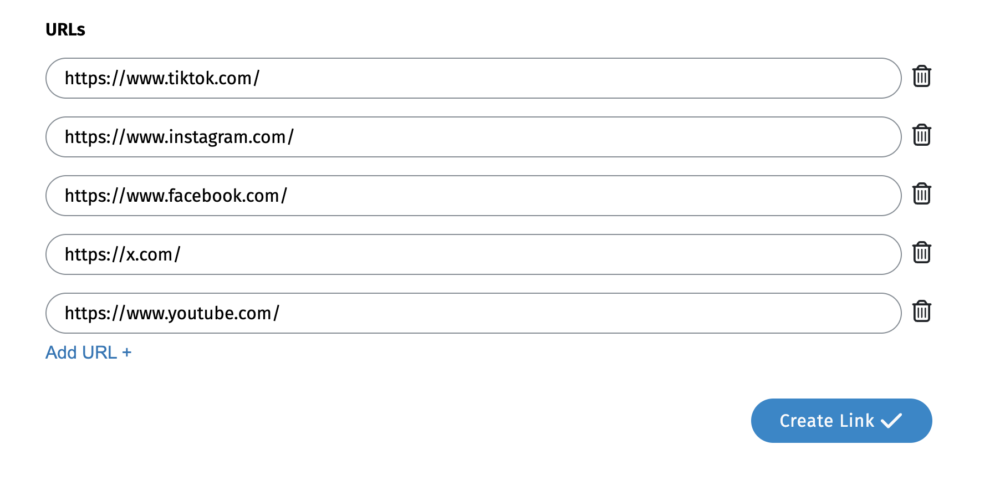
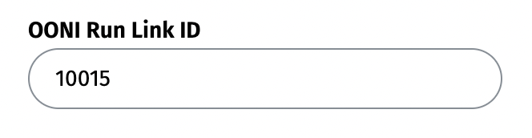

{{}}

**Image:** OONI Run.

Today we are thrilled to announce the **[launch of OONI Run v2](https://run.ooni.org/)**: the next generation version of OONI Run for community-driven censorship testing.

Originally [launched](https://ooni.org/post/ooni-run/) in September 2017, [OONI Run](https://run.ooni.org/) is a platform for creating mobile deep links that you can share with [OONI Probe](https://ooni.org/install/mobile) users to coordinate the testing of websites for censorship. Over the past 7 years, OONI Run has been [used extensively by community members](https://ooni.org/support/ooni-censorship-measurement-campaigns#examples-of-ooni-censorship-measurement-campaigns) in Venezuela, Malaysia, India, and around the world as part of their censorship measurement campaigns aimed at monitoring and rapidly responding to emergent censorship events. To improve the OONI Run platform and better meet community needs, we previously conducted an [OONI Run usability study](https://ooni.org/post/2020-06-09-ooni-run-usability-study-findings/), through which we documented extensive community feedback.

We are now excited to launch [OONI Run v2](https://run.ooni.org/), which is a **major revamp** that addresses key [community feedback and needs](https://ooni.org/post/2020-06-09-ooni-run-usability-study-findings/). Specifically, OONI Run v2 includes the following exciting new features:

*   Shortened OONI Run links;
*   Ability to dynamically update OONI Run links;
*   Automated testing of OONI Run links;
*   Ability to easily identify, retrieve, and aggregate measurements on [OONI Explorer](https://explorer.ooni.org/) from an OONI Run link.

**Update now** to [OONI Probe Android 4.0.0](https://play.google.com/store/apps/details?id=org.openobservatory.ooniprobe) to start using OONI Run v2!

This blog post shares detailed information about OONI Run v2, as well as how to use it to coordinate censorship testing! In launching OONI Run v2, we introduced UI changes to OONI Probe Android, which we also share in this post.



## About OONI Run

Back in 2017, we [launched](https://ooni.org/post/ooni-run/) OONI Run in response to a pressing community need: having the ability to rapidly and dynamically test a custom list of websites for censorship in coordination with a community of volunteers. At the time, it was hard for us to imagine just how impactful [OONI Run](https://run.ooni.org/) could and would be.

Our friends from [Venezuela Inteligente](https://veinteligente.org/) gave us the idea for OONI Run. In previous years, they shared Raspberry Pis with their [community of volunteers across Venezuela](https://www.youtube.com/watch?v=UDvVfjJ0Iq8) to run our software, [OONI Probe](https://ooni.org/install), for measuring various forms of internet censorship. The problem though was that OONI Probe would only run at specific times per day, and it would only test certain predetermined lists of websites. As a result, when [temporary blocks](https://vesinfiltro.com/) would suddenly emerge – involving websites that were not already included in these predetermined lists – those blocks would not get measured. This raised the need to have the flexibility to more **dynamically determine which websites get tested**, and to have the ability to **enable a distributed community of OONI Probe users to easily and quickly test such websites**.

We tried to solve this problem through the creation of [OONI Run](https://run.ooni.org/): a web platform that you can use to create mobile deep links to coordinate the [OONI Probe](https://ooni.org/install/mobile) testing of websites. You can share these links with a community of volunteers (who are [OONI Probe mobile app](https://ooni.org/install/mobile) users) so that they can test the websites of your choice, contributing measurements that are published as [open data](https://ooni.org/data/) in real-time.

[OONI Run](https://run.ooni.org/) therefore enables **decentralized, community-driven efforts aimed at coordinating the testing of website blocking**. The goal of this platform is to enable community members to independently coordinate on the testing of websites, particularly when new blocks emerge. All test results are published as [open data](https://ooni.org/data/) in real-time, supporting [research](https://ooni.org/reports/) and [advocacy](https://www.accessnow.org/keepiton/) efforts.

Over the past 7 years, we have seen community members use OONI Run leading up to and during elections, or in response to emergent new blocks during protests or other political events. [Sinar Project](https://sinarproject.org/), for example, used OONI Run to coordinate an [OONI censorship measurement campaign in Malaysia](https://sinarproject.org/digital-rights/measuring-and-detecting-network-interference/ge15) to encourage the testing of election-related websites during the country’s 2022 general election.

{{}}

**Image:** Call to Action for OONI Probe testing of election-related websites during Malaysia’s 2022 general election (source: [Sinar Project](https://sinarproject.org/digital-rights/measuring-and-detecting-network-interference/ge15)).

India’s [Software Freedom Law Centre (SFLC.in)](https://sflc.in/) embedded OONI Run widgets into their [India Internet Shutdown Tracker project](https://internetshutdowns.in/) website, encouraging long-term OONI Probe testing of news media, blogs, human rights, and political websites in India. [Venezuela Inteligente](https://veinteligente.org/) coordinated with [OONI Probe volunteers in different regions of Venezuela](https://www.youtube.com/watch?v=UDvVfjJ0Iq8) to measure (and respond to) [temporary website blocks](https://vesinfiltro.com/) which emerged in correlation with political events. Human rights advocates from the global [#KeepItOn campaign](https://www.accessnow.org/keepiton/) used OONI Run leading up to and during political events (such as elections and protests) around the world to collect censorship measurement data in support of their advocacy efforts.

Community members have also used OONI Run for research purposes. [Digital Security Lab Ukraine](https://medium.com/@cyberlabukraine), for example, [coordinated with OONI Probe volunteers in different regions of Ukraine](https://www.youtube.com/watch?v=nIn-r6JxdEM) to examine how internet censorship differs from region to region (and network to network) in the country. OTF Information Controls research fellows, Igor Valentovitch and Ksenia Ermoshina, [investigated and compared internet censorship in Russia and Crimea](https://www.opentech.fund/news/exploring-online-media-filtering-during-2018-russian-presidential-elections/) during Russia’s 2018 presidential election by coordinating with OONI Probe communities for the testing of their custom lists of websites.

### Community feedback

To improve the OONI Run platform and better meet community needs, we previously conducted an [OONI Run usability study](https://ooni.org/post/2020-06-09-ooni-run-usability-study-findings/), through which we documented extensive community feedback.

With OONI Run v2, we address the **key community feedback and needs** identified through most survey and interview responses collected through our usability study.

Specifically, the **[main OONI Run challenges](https://ooni.org/post/2020-06-09-ooni-run-usability-study-findings/#overall-challenges-associated-with-using-ooni-run)** that our community highlighted include:

*   Long OONI Run links break when shared through various messaging platforms;
*   Immutable OONI Run links prevent users from dynamically updating the links;
*   Difficulty in ensuring that OONI Run links are run continuously by volunteers;
*   Difficulty in finding measurements collected through OONI Run links on [OONI Explorer](https://explorer.ooni.org/).

Based on these challenges, our community highlighted the following **[key needs](https://ooni.org/post/2020-06-09-ooni-run-usability-study-findings/#suggestions-for-improving-ooni-run)**:

*   **Shortened OONI Run links.** Shorter OONI Run links would be easier to share, they would not break when shared across platforms, and community members who receive such links would trust them more.
*   **Ability to dynamically update OONI Run links.** As new blocks emerge, there is the urgent need to enable OONI Run users to update existing OONI Run links (which have already been shared with volunteers) with new URLs (instead of having to create and share new OONI Run links each time).
*   **Automated testing of OONI Run links.** Reminding volunteers to continually re-run an OONI Run link can be challenging. Community members therefore highlighted the important need to enable the automated testing of OONI Run links to help ensure continuous testing and greater measurement coverage.
*   **Ability to easily identify, retrieve, and aggregate measurements on OONI Explorer from an OONI Run link.** Once users perform testing with an OONI Run link, the measurements are published as open data in real-time on [OONI Explorer](https://explorer.ooni.org/). However, as OONI Explorer hosts more than 2 billion network measurements, most of which are not from OONI Run measurement campaigns, there is the need to have the ability to easily identify, retrieve, and aggregate measurements collected through a specific OONI Run link.

We are excited to share that the above needs have been addressed and are supported by [OONI Run v2](https://run.ooni.org/)! We also aim to address more community feedback on an ongoing basis.

## OONI Run v2

Are you a researcher interested in examining the blocking of specific websites? Are you a journalist or advocate interested in collecting data to confirm the blocking of certain websites in another country?

If so, OONI Run is for you. You can use OONI Run to **share mobile deep links that enable the censorship testing of websites of your choice** – and contribute test results as [open data](https://ooni.org/data/) in real-time.

[OONI Run v2](https://run.ooni.org/) helps bring community-driven censorship testing to a whole new level.

Not only are OONI Run v2 links shorter and easier to share, but you can also customize them based on the message that you want to share with your community of volunteers. You can log into the OONI Run v2 platform to access all of the links you have created, and you can update them on an ongoing basis (without having to create new links!) to include any additional websites that you’d like to see tested. Your community of volunteers who have installed your OONI Run links on their [OONI Probe mobile app](https://ooni.org/install/mobile) will automatically receive any updates you make, and the links you have shared will automatically get tested – ensuring ongoing testing and greater measurement coverage. You can find the results from such testing on [OONI Explorer](https://explorer.ooni.org/), where all measurements are published as open data in real-time.

Excited to start using OONI Run v2? Learn more through the following sections.

### Using OONI Run v2

#### Creating and sharing OONI Run v2 links

To get started with using OONI Run v2, **access the OONI Run website**: [https://run.ooni.org/](https://run.ooni.org/)

{{}}

You can create and share an OONI Run v2 link through the following steps.

**Step 1.** Click the “**Log In To Create OONI Run Link**” button.

**Step 2.** Add your **email address** in the Email slot.

{{}}

**Note:** We do not store email addresses when you log in, but only when you create an OONI Run link. We store your email address so that when OONI Probe users receive an OONI Run link from you, they can trust it based on your email address (which is displayed in the OONI Run link you create). This can help reduce the risk of running malicious links.

**Step 3.** Click the “**Send me the Link**” button.

{{}}

This will send a link to your email address.

{{}}

**Step 4.** Click the link (“Please login here”) sent to your email to log into the OONI Run v2 platform.

{{}}

You have now logged into the OONI Run platform and can start creating OONI Run v2 links through the “Create OONI Run Link” page.

{{}}

Optionally, you can customize your OONI Run link by selecting an icon and/or colour. Scroll down the page to fill out the required data fields. 

**Step 5.** Add a **title** for your OONI Run link. Optionally, you can add translations for your title.

{{}}

**Note:** This title will appear in the OONI Run link card that testers will install in their [OONI Probe mobile app](https://ooni.org/install/mobile). We recommend using a short title which clearly communicates the type of testing performed. In the above example, we have added “Test social media” as a title because we aim to include social media websites for testing in our OONI Run link.

**Step 6.** Add a **short description** for your OONI Run link. Optionally, you can add translations.

{{}}

**Note:** In the above example, we have specified the social media platforms that we plan to add to our OONI Run link, and which we’re asking [OONI Probe mobile app](https://ooni.org/install/mobile) users to test. We recommend specifying the tested platforms or adding other useful context that can help encourage testing.

**Step 7.** Add a (longer) **description** for your OONI Run link. This is an opportunity to communicate details about the testing, and why it’s important. Optionally, you can add translations.

{{}}

**Step 8.** Add an **expiration date** for your OONI Run link.

{{}}

**Note:** Determine the expiration date based on how long you would like OONI Probe users to have the ability to run your OONI Run link.

**Step 9.** Click “Add URL” to start adding URLs to your OONI Run link.

{{}}

**Important:** Before you start adding URLs, please ensure that each [URL](https://ooni.org/support/glossary/#url) is typed correctly. If it is mis-typed, [OONI Probe](https://ooni.org/install/mobile) will not test the intended website and this will potentially lead to inaccurate test results.

A few things to keep in mind:

*   Is the website on **HTTP** or **HTTPS**? If the latter, please add an extra `s` after `http`.
*   Does the [domain](https://ooni.org/support/glossary/#domain-name) include `www`? If so, please include it.
*   If the website is on HTTPS (e.g. https://www.hrw.org/), you don’t need to specify a webpage (e.g., `https://www.hrw.org/publications`), since ISPs usually cannot limit blocking to a specific webpage when it’s hosted on HTTPS. Rather, they would have to block access to the entire website.

To ensure that each URL is typed accurately, **please copy-paste it from a browser**.

We recommend **creating a list of websites in a text editor**, where each URL is in a separate line. You do not need to separate URLs by commas or in any other way. Please see an example below.

{{}}

**Step 10.** Add the URLs that you would like to include in your OONI Run link for testing.

{{}}

**Note:** You can copy and paste your list of URLs into the first URL slot, and each URL will populate each URL row (if copied based on the above text editor formatting).

**Step 11.** Click the **Create Link** button to create your OONI Run link.

You will now see your OONI Run link page which includes the title and description that you added, the expiration date of the link, as well as the list of URLs that you added for testing.

{{}}

**Step 12.** If you would like to edit your OONI Run link, click the **Edit** button in the top right corner.

{{}}

Alternatively, click the **Update Now** button next to the link expiration date. Both actions will enable you to edit the data in your OONI Run link.

**Step 13.** To **share** your OONI Run link, click the **copy icon** next to your OONI Run link in the “Share this link” section. Then share the copied link with [OONI Probe](https://ooni.org/install/mobile) users who you would like to perform testing.

{{}}

You can also **share your link directly on Twitter/X** by clicking on the “Tweet” button.

{{}}

Community members often share OONI Run links on Twitter/X when they want to encourage more widespread testing.

{{}}

**Image:** Tweet by Thai Netizen Network sharing an OONI Run link for the testing of Change.org in Thailand.

#### Updating old OONI Run v1 links

If you have **old OONI Run links v1 links** (created through the use of the previous OONI Run platform) that you have embedded as widgets into your website or which you are sharing for testing, **please update them** to use OONI Run v2.

You can update old OONI Run v1 links through the following steps.

**Step 1.** Log into the OONI Run platform and access the “Create OONI Run Link” page: [https://run.ooni.org/create](https://run.test.ooni.org/create)

{{}}

**Step 2.** Scroll down towards the end of the page to the “URLs” section.

{{}}

**Step 3.** Click on “**Do you have old OONI Run v1 links? Click here to add URLs from such links**”.

{{}}

You will now see a pop-up window for adding your old OONI Run v2 link.

{{}}

**Step 4.** Add your old OONI Run v1 link in the “OONI Run Link” field.

{{}}

**Step 5.** Click **Add URLs**.

{{}}

**Step 6.** Click **Create Link** to create a new OONI Run v2 link based on the URLs of your old OONI Run v1 link.

**Note:** Through the data fields of the “Create OONI Run Link” page, you will also need to add a title, description, and expiration date for your new OONI Run v2 link before creating it. 

#### Using OONI Run v2 links

An OONI Run link can only be used with the **OONI Probe mobile app**.

**OONI Run v2 is currently only supported on Android.** We aim to release support for OONI Run v2 on OONI Probe iOS in subsequent versions.

**Step 1.** Please [install the OONI Probe mobile app](https://ooni.org/install/mobile) on [Android](https://play.google.com/store/apps/details?id=org.openobservatory.ooniprobe). If you already have OONI Probe Android installed, **please update to the latest version (4.0.0)** for OONI Run v2 support.

{{}}

**Step 2.** Tap on the OONI Run link that you received, and **open it with your OONI Probe mobile app** (not with a web browser). This will open a screen in your OONI Probe app, displaying information from the OONI Run link (as illustrated below).

{{}}

As you can see from the above example, we have opened an OONI Run link for the testing of social media in our OONI Probe Android app. This shows information about the requested testing, as well as the list of websites that we are being asked to test.

The **Test Settings of the OONI Run link** include support for:

*   **Automated testing of OONI Run link websites.** By keeping the “Run tests automatically” option enabled, the websites included in the OONI Run link will get tested automatically on an ongoing basis. That way, you don’t need to remember to re-test those websites once you have installed the OONI Run link – the OONI Probe app will do that automatically for you! We recommend keeping this option enabled to help ensure ongoing testing, greater measurement coverage, and enhanced ability to confirm potential blocks.
*   **Automated updates to the OONI Run link.** The person who created the OONI Run link may need to update the link on an ongoing basis to add more websites for testing. Instead of receiving new links each time (when there’s the need to test more websites), you can instead receive updates to your OONI Run link automatically by keeping the “Install updates automatically” option enabled.

**Step 3.** To test the websites included in the OONI Run link, tap **Install Link** in the bottom right corner of the screen. This will **install the OONI Run link in your OONI Probe mobile app**, enabling you to change your OONI Run link settings and to uninstall the OONI Run link at any time.

{{}}

Once installed, you can find your **OONI Run link as a card in the Dashboard** of your OONI Probe mobile app (listed under the “OONI Run Links” section).

{{}}

Now that your OONI Run link has been installed (while being configured to run automatically), you don’t need to do anything else. Your OONI Probe app will automatically test the websites in the OONI Run link on an ongoing basis!

You can find the test results through the **Test Results** tab of your OONI Probe app.

{{}}

By tapping on each of the tested websites displayed, you will find further information, including links to relevant OONI measurements that are **published on [OONI Explorer](https://explorer.ooni.org/) in real-time**.

{{}}

In the above example, we can see that TikTok was found accessible on the tested network. The “Data” button provides access to the raw OONI network measurement data, while the “Show in OONI Explorer” button provides a link to the published measurement. You can share the measurement through the use of the **share button** on the top right corner.

If at any moment you would like to **change your OONI Run link settings**, or **uninstall the OONI Run link** entirely, you can do so through the OONI Run link card installed in your OONI Probe mobile app.

{{}}

Through your installed OONI Run link card, you can change the settings by:

*   Disabling the “Install updates automatically” option if you do not want to receive updates to OONI Run links (including additional or different websites for censorship testing) automatically;
*   Disabling the “Run tests automatically” option if you do not want OONI Probe to test the websites in your OONI Run link on an ongoing basis automatically.

If you would like to remove the OONI Run link card from your OONI Probe app, tap the “Uninstall Link” button.

In the event that you have **disabled automated OONI Run link testing** and would like to **manually test websites** included in your OONI Run link, you can do so by tapping the main “Run” button in the OONI Probe Dashboard, tapping the “Deselect all tests” button (to deselect all other OONI Probe tests), and by **only enabling the OONI Run link test**.

{{}}

### Finding your OONI Run v2 measurements on OONI Explorer

By default, all OONI Probe measurements from OONI Run v2 links are automatically published on [OONI Explorer](https://explorer.ooni.org/) as open data in real-time. But given that OONI Explorer hosts a wealth of data – more than 2 billion measurements collected from 242 countries and territories since 2012 – finding the specific measurements from your OONI Run link was previously quite challenging.

We are excited to share that you can now easily find and aggregate measurements from your specific OONI Run v2 link through OONI Explorer! Specifically, you can **filter measurements** in both the OONI Explorer [Search Tool](https://explorer.ooni.org/search) and [Measurement Aggregation Toolkit (MAT)](https://explorer.ooni.org/chart/mat) based on the ID of your OONI Run v2 link (“**OONI Run Link ID**”).

The ID of your OONI Run link are the **last digits** displayed in the link. In the following example, the OONI Run link ID is `10015`.

{{}}

You can find measurements collected by all those who ran your OONI Run link through the following steps.

**Step 1.** Access the OONI Explorer Search Tool: [https://explorer.ooni.org/search](https://explorer.ooni.org/search)

{{}}

**Step 2.** Add the last digits of your OONI Run link in the “OONI Run Link ID” field on the left. Below we have added `10015` based on the previous OONI Run link example.

{{}}

**Step 3.** Click the **Filter Results** button. 

{{}}

You have now filtered OONI Explorer measurements to only view those collected based on your OONI Run v2 link.

{{}}

Similarly, you can use the ID of your OONI Run link to aggregate measurements from your specific OONI Run v2 link through the OONI Explorer [Measurement Aggregation Toolkit (MAT)](https://explorer.ooni.org/chart/mat). By adding the ID digits in the “**OONI Run Link ID**” field of the MAT and clicking **Show Chart**, you will generate charts that are limited to the measurements collected through your OONI Run link.

{{}}

## UI changes to OONI Probe Android

As you may have noticed through the previous section, we introduced UI changes to the [OONI Probe Android app](https://ooni.org/install/mobile) with the launch of [OONI Run v2](https://run.ooni.org/). We made these changes in order to accommodate introducing OONI Run link cards in the OONI Probe mobile app.

{{}}

Specifically, we changed the UI of the cards displayed in the OONI Probe Dashboard, and we **moved the test settings into each card** (instead of having them in the general app settings).

{{}}

We also **changed the main “Run” button** of the OONI Probe Android app, including all the individual test options there too.

{{}}

Through the new “Run” button of the OONI Probe Android app, you can enable and disable OONI Probe tests and the installed OONI Run links.

## Acknowledgements

We thank Mozilla for [supporting the development of OONI Run v2](https://foundation.mozilla.org/en/blog/mozilla-welcomes-2023-data-futures-lab-cohort/) through the [Mozilla Data Futures Lab](https://foundation.mozilla.org/en/data-futures-lab/). We also thank the [Open Technology Fund (OTF)](https://www.opentech.fund/) for supporting the maintenance of OONI Run.

We thank all those who participated in our [OONI Run usability study](https://ooni.org/post/2020-06-09-ooni-run-usability-study-findings/), providing invaluable feedback that informed the creation of OONI Run v2. Warm thanks to all other community members who have shared feedback over the years, and who have used OONI Run as part of their work. OONI Run v2 was designed for you, and we hope you find it useful!
