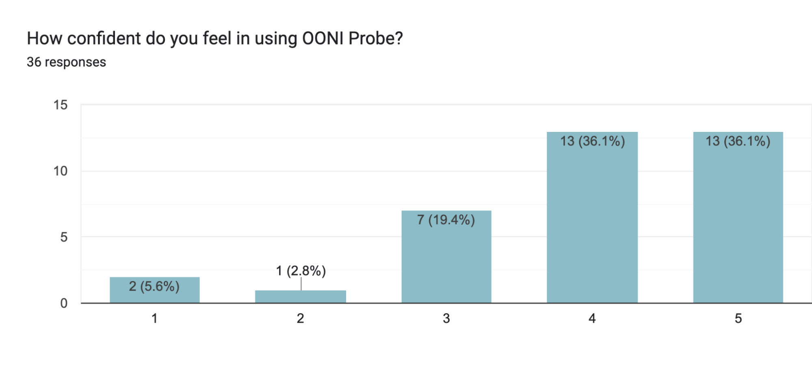
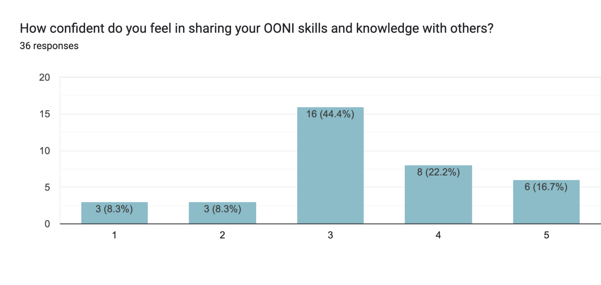

{{}}



We are excited to share that on 8th and 9th May 2024, we hosted an in-person **OONI Partner Gathering in Kuala Lumpur, Malaysia**. As part of this 2-day event, we brought our [partners](https://ooni.org/partners) (primarily from Asia and the Middle East) together to exchange skills and knowledge and strengthen our collaborations on internet censorship research and advocacy. 
In this report, we share details about the event and its outcomes.

## Background: OONI partners and previous events 

Since 2012, the [Open Observatory of Network Interference (OONI)](https://ooni.org/) has worked towards empowering decentralized efforts in increasing transparency of internet censorship around the world. We build [free software tools](https://ooni.org/install/) that you can use to detect internet censorship. And we host the largest [open dataset](https://ooni.org/data/) of its kind on internet censorship worldwide. 

But we can’t fight internet censorship alone. 

Understanding and challenging internet censorship requires local knowledge, as well as research, advocacy, and policy expertise. We therefore established the [OONI Partnership Program](https://ooni.org/get-involved/partnership-program/) 8 years ago to bring our tools and data to the hands of human rights defenders around the world. To ensure that our tools are useful to communities, we need their constant feedback, and we need their participation in the design of our tools and methods.

Since 2016, we have had the opportunity to establish partnerships with [50 digital rights organizations](https://ooni.org/partners) to collaborate on monitoring and responding to internet censorship around the world. Many of our partners are based in Africa, Latin America, Asia, and the Middle East, leading OONI censorship measurement efforts in their regions. 

To strengthen our collaborations, we hosted the [first in-person OONI Partner Gathering](https://ooni.org/post/ooni-partner-gathering-2017/) in July 2017 in Toronto, Canada. At the time, the event consisted of 22 participants, including the OONI team and our partners from 10 countries across Africa, Asia, Latin America, and the Middle East. We planned to host another in-person OONI Partner Gathering in 2020, but as a result of the COVID-19 pandemic and related travel restrictions, we adjusted our plans. Instead, we organized and hosted an online [Internet Measurement Village](https://ooni.org/post/2020-internet-measurement-village/), during which we [live-streamed a total of 18 presentations](https://ooni.org/post/2020-imv-slides-recordings/) over 4 weeks, featuring the important work of our partners. In 2021, we organized and hosted two [3-day OONI Partner Training events](https://ooni.org/post/ooni-partner-training-2021/) (entirely online) for our partners in Africa, Latin America, the Middle East, and Asia. As part of these events, we had the opportunity to facilitate OONI training for 86 participants who work with 49 digital rights organizations around the world. 

As COVID-19 pandemic related restrictions started to be lifted, we circled back to our original plans of hosting an in-person event for our partners. While there are many benefits of hosting online events (no travel costs or visa restrictions, opportunity to invite more participants, etc.), nothing matches the power of meeting in person, sharing meals together, and getting to know the human behind the computer screen. 

We originally planned to host an international OONI Partner Gathering that would bring all [50 of our partners](https://ooni.org/partners) together. But as we were not able to reach the target budget that would have allowed us to bring all our partners from around the world, we decided to limit the next OONI Partner Gathering primarily to our partners from Asia and the Middle East (while also inviting some of our international partners, whose work is important to our regional partners). We decided to prioritize these regions (Asia and the Middle East) because they experience the most pervasive forms of internet censorship.

We hope (and plan) to host additional OONI Partner Gathering events for our partners in Africa and Latin America over the next few years.

## About the OONI Partner Gathering 2024

{{}}
**Image:** OONI Partner Gathering 2024 participants.

On 8th and 9th May 2024, we hosted the OONI Partner Gathering 2024 at the DoubleTree by Hilton hotel in **Kuala Lumpur, Malaysia**.

As part of this 2-day event, we brought [OONI partners](https://ooni.org/partners) (primarily from Asia and the Middle East) together to exchange skills and knowledge on internet censorship research. The goal of the event was to strengthen global and regional collaborations on censorship measurement research and advocacy.  

The OONI Partner Gathering 2024 brought together **45 individuals from 30 countries**. Specifically, the participants included OONI [partners](https://ooni.org/partners) from Southeast Asia, South Asia, East Asia, Central Asia, and the Middle East, some OONI partners who work internationally, as well as the whole [OONI team](https://ooni.org/about/team/). The event was possible thanks to generous support from the [Ford Foundation](https://www.fordfoundation.org/) and [Luminate](https://www.luminategroup.com/). 

### Objectives

{{}}
**Image:** OONI banner at the OONI Partner Gathering 2024.

As part of the OONI Partner Gathering 2024, we had the following objectives: 

* Exchange **skills, knowledge, and methodologies** to empower community participation in censorship measurement research and advocacy;
* Better **understand local challenges** and develop strategies for improving censorship measurement research around the world;
* Better **understand** **partner/community needs**;
* Collect **community feedback** to support the improvement of OONI tools and methodologies;
* **Strengthen partnerships and strategically define goals and priorities** on the study of internet censorship in collaboration with partners.

The ultimate goal of the OONI Partner Gathering 2024 was to strengthen the [OONI partnership network](https://ooni.org/partners) to help ensure that internet censorship is well-documented and rapidly addressed so that the world’s most at-risk individuals – human rights defenders, journalists, activists, and marginalized people in repressive environments — have consistent and open access to the internet.

### Why Malaysia?

In an effort to ensure that the OONI Partner Gathering 2024 was hosted in a location that is as visa-friendly as possible for participants, we developed a [script](https://github.com/hellais/global-gather) which identifies such locations based on various parameters, such as visa requirements, safety index, travel cost, and flight travel time. 

Based on this data-driven approach, **Malaysia was identified as one of the top visa-free countries** in the world for our specific list of participants. 

We also loved the fact that this data finding coincides with the base of [Sinar Project](https://sinarproject.org/), a leading civic tech organization in Malaysia (and our [long-term partner](https://ooni.org/partners/sinar-project/)) who have led OONI censorship measurement efforts in Southeast Asia over the last 9 years!

## Sessions

{{}}
**Image:** OONI Partner Gathering 2024 lanyards and badges.

To help ensure that the OONI Partner Gathering 2024 agenda is as useful as possible to our partners, we created and shared a survey to collect their feedback several months before the event. As our goal was to ensure that we create an agenda that is valuable to all participants, we requested their feedback on the types of sessions that they would find most useful, the types of skills and knowledge that they would like to learn, and the outcomes that would make their participation feel well spent. 

Based on the analysis of partner feedback, we created the agenda based on the most pressing needs, interests, and requests identified in most survey responses, while taking into account the diversity in participant backgrounds. The **detailed OONI Partner Gathering 2024 Agenda** can be downloaded below. 



The agenda included a mixture of **skill-share sessions, presentations, hands-on exercises, and interactive group discussions**. We included a variety of **parallel sessions** to accommodate more sessions in the agenda, and to encourage more active participation in smaller group discussions. To provide space for discussions on ideas and needs that may emerge during the event, we also included a slot for **“unconference” style sessions**. 

To encourage more active participation in group discussions and to enable participants to share their knowledge, experience, needs, and feedback, the OONI Partner Gathering 2024 agenda did not include many OONI tool-specific skill-shares. For example, we did not include a session on [how to use OONI Probe](https://ooni.org/support/ooni-probe-mobile) because through our survey, the vast majority of participants shared that they feel _very confident_ in using [OONI Probe](https://ooni.org/install/). Rather, through our survey, most participants expressed interest in learning how to use [OONI Explorer](https://explorer.ooni.org/) and interpret OONI data, which is why we included relevant sessions in the agenda.

Overall, the two-day OONI Partner Gathering 2024 event included **25 sessions**, 20 of which were part of the official [agenda](/documents/OONI-Partner-Gathering-Agenda.pdf), while 5 were proposed and facilitated by participants as part of the “unconference” session slots. The sessions were facilitated by both the OONI team and our partners. Notably, 9 sessions (from the official agenda) were facilitated by 11 of our partners, who provided amazing presentations sharing their work! 

We thank all those who facilitated sessions and participated in note-taking, helping to ensure a dynamic, inclusive, interesting, and well-documented event. 

### Day 1 – 8th May 2024

On the first day (8th May 2024), the OONI Partner Gathering included the following (parallel) sessions.
| Session                                                                                             | Description                                                                                                                                                                                                                                                                                                                                                                                                                                                                                                                                                                                                                 |
| --------------------------------------------------------------------------------------------------- | --------------------------------------------------------------------------------------------------------------------------------------------------------------------------------------------------------------------------------------------------------------------------------------------------------------------------------------------------------------------------------------------------------------------------------------------------------------------------------------------------------------------------------------------------------------------------------------------------------------------------- |
| **Opening Plenary**                                                                                     | A welcome session by the OONI team. An overview of the agenda, participation guidelines, Code of Conduct, and logistics.                                                                                                                                                                                                                                                                                                                                                                                                                                                                                                            |
| **Meet & Greet: A (sort of) Game of Musical Chairs**                                                    | Interactive session to meet each other and enable networking among participants through a game similar to musical chairs.                                                                                                                                                                                                                                                                                                                                                                                                                                                                                                   |
| **Information Controls Around the World**                                                               | Interactive small group discussions on digital rights issues in participants’ countries/regions, the work of their organization in tackling these issues, any challenges they have encountered, and success stories. The goal of this session was to share local context on information controls, shedding light on opportunities for collaboration and setting the stage for subsequent discussions.                                                                                                                                                                                                                       |
| **Introduction to Internet censorship** ([slides](https://docs.google.com/presentation/d/1TXRhNi2uiIbY8VQb9SuzE5pohpaqvOp1ASlEMcdqLvw/edit?usp=sharing))                                                        | How is Internet censorship implemented? Why measure networks? This session (facilitated by OONI) shared knowledge on how Internet censorship is technically implemented, as well as key concepts that are useful for understanding and interpreting OONI data.                                                                                                                                                                                                                                                                                                                                                              |
| **Measuring Internet connectivity shutdowns with IODA** ([slides](https://drive.google.com/file/d/1c6IccdIRev9lENSCrIGQUZ0JpvplaWsn/view?usp=sharing))                                        | Interested in tracking Internet connectivity shutdowns? This session (facilitated by [IODA](https://ioda.inetintel.cc.gatech.edu/)) shared skills and knowledge on using the Internet Outage Detection and Analysis (IODA) platform which measures Internet connectivity shutdowns around the world in near real-time.                                                                                                                                                                                                                                                                                                      |
| **OONI: Brief History & Future Goals** ([slides](https://docs.google.com/presentation/d/1ewZjDrs9oZ5KauJLKmHBP7-t44LbE24NilK9EQgQcZU/edit?usp=sharing))                                                         | Presentation by OONI, providing a brief overview of OONI’s history, future goals, and upcoming projects.                                                                                                                                                                                                                                                                                                                                                                                                                                                                                                                    |
| **Across the OONI-verse**                                                                               | Interactive session through which OONI team members held stations for various OONI tools and projects. Specifically, the OONI team held the following 6 stations: “OONI Probe”, “OONI Run”, “OONI Explorer”, “OONI Test Lists Editor”, “OONI Probe experiments”, “OONI data analysis”. Participants were encouraged to visit each station to learn about current and upcoming developments for each OONI project, ask questions, and share feedback.                                                                                                                                                                        |
| **iMAP: Measuring & Reporting on Internet censorship in Asia with OONI tools** ([slides](https://drive.google.com/file/d/1aiJsjCtLgp5UUxJl3SIjJRcoz9LQBVPS/view?usp=sharing))                 | [Sinar Project](https://sinarproject.org/) is a leading civic tech organization in Malaysia, who have led OONI censorship measurement efforts in the region over the past 9 years. Since 2021, they are leading the [Internet Monitoring Action Project (iMAP)](https://imap.sinarproject.org/), which measures and reports on Internet censorship in 9 Asian countries in collaboration with their regional partners. Through this session, Sinar Project shared how they use OONI tools and data as part of their work.                                                                                                   |
| **Preparing for elections: How to measure and rapidly respond to Internet censorship** ([slides](https://docs.google.com/presentation/d/1jU7Jnug0TR3P3CsSHLFQyAxfUePTNRb3/edit?usp=sharing&ouid=115482951108600493668&rtpof=true&sd=true), [slides](https://drive.google.com/file/d/1fGCKggBwsui9h9h79vZoj4LwhdjgBiWy/view?usp=sharing)) | Censorship events often emerge during elections (and other political events) around the world, requiring rapid response. This session was co-facilitated by [Digitally Right](https://digitallyright.org/) and [Digital Rights Foundation](https://digitalrightsfoundation.pk/), who shared how they prepared for, measured, and responded to censorship events during elections in Bangladesh and Pakistan in early 2024.                                                                                                                                                                                                  |
| **Advocating against Internet shutdowns** ([slides](https://drive.google.com/file/d/1aFR8ViHB7JP5m8dMAw58mrakWoA7c7gh/view?usp=sharing))                                                      | Since 2016, Access Now has led the [#KeepItOn campaign](https://www.accessnow.org/campaign/keepiton/), a global coalition of human rights organizations fighting Internet shutdowns around the world. Over the years, the #KeepItOn campaign has regularly made use of OONI data in support of their advocacy efforts. But how can censorship measurement data better support advocacy efforts? Through this session, [Access Now](https://www.accessnow.org/) shared information about the #KeepItOn campaign’s advocacy efforts, and facilitated a discussion on advocacy-related challenges, needs, and success stories. |
| **Measuring Internet censorship in your country/region**                                                | Interactive small group discussions through which participants were encouraged to share their experiences, challenges, and needs in relation to measuring Internet censorship in their countries/regions.                                                                                                                                                                                                                                                                                                                                                                                                                   |
| **Closing remarks**                                                                                     | Final reflections and logistical updates to wrap up Day 1.                                                                                                                                                                                                                                                                                                                                                                                                                                                                                                                                                                  |

We concluded Day 1 of the OONI Partner Gathering 2024 with a group dinner, which provided an opportunity for further socialization and networking!

### Day 2 – 9th May 2024

On the second day (9th May 2024), the OONI Partner Gathering included the following (parallel) sessions.

| Session                                                                                               | Description                                                                                                                                                                                                                                                                                                                                                                                                                                                                                                                                                                                                                                                                                                                                         |
| ----------------------------------------------------------------------------------------------------- | --------------------------------------------------------------------------------------------------------------------------------------------------------------------------------------------------------------------------------------------------------------------------------------------------------------------------------------------------------------------------------------------------------------------------------------------------------------------------------------------------------------------------------------------------------------------------------------------------------------------------------------------------------------------------------------------------------------------------------------------------- |
| **Opening Plenary**                                                                                       | Overview of the Day 2 Agenda.                                                                                                                                                                                                                                                                                                                                                                                                                                                                                                                                                                                                                                                                                                                       |
| **Using OONI Explorer & Interpreting OONI data** ([slides](https://docs.google.com/presentation/d/1P2ra_18cLI-ZnD9kYcDzCLUompulZmm15Oi29SK_hfs/edit?usp=sharing))                                                 | Live demo on using [OONI Explorer](https://explorer.ooni.org/), OONI’s open dataset on Internet censorship around the world. As part of this session, OONI explained how to interpret OONI data, as well as how to investigate Internet censorship through OONI’s open data platform.                                                                                                                                                                                                                                                                                                                                                                                                                                                               |
| **OONI data analysis deep dive** ([slides](https://docs.google.com/presentation/d/1Nrv1jUmweCxorLgZYCF8-r5Qs-513szBw5OxoIbcow4/edit?usp=sharing))                                                                 | During this session, OONI shared more advanced methods for analyzing OONI data through the use of some of the newer techniques being developed as part of the [OONI Pipeline v5 and the OONI Data CLI tool](https://github.com/ooni/data). Participants with a data analysis and/or programming background were strongly encouraged to join!                                                                                                                                                                                                                                                                                                                                                                                                        |
| **Simulating real-world censorship scenarios using OONI tools** ([slides](https://docs.google.com/presentation/d/1BJJb37IOEms28ptHSPneAqH3Ci0s8Db9194iEELOYQs/edit?usp=sharing))                                  | Interactive hands-on exercises (facilitated by OONI) through which participants practiced using OONI tools while simulating real-world censorship scenarios.                                                                                                                                                                                                                                                                                                                                                                                                                                                                                                                                                                                        |
| **Research & Reporting on Internet censorship** ([slides](https://drive.google.com/file/d/18Ip5kAubTO5u49onfBC-8phvKa6Clq9y/view?usp=sharing))                                                  | How can we carry out research and reporting on Internet censorship? How can we use OONI data as part of research? This session was facilitated by the [Citizen Lab](https://citizenlab.ca/), who shared their extensive research experience, which includes analyzing OONI data in support of [research on online LGBTIQ censorship](https://citizenlab.ca/wp-content/uploads/2021/08/LGBTIQ-censorship-Final-1.pdf). Through a group discussion, participants were encouraged to share their experience, challenges, needs, and suggested best practices.                                                                                                                                                                                          |
| **Litigating against Internet censorship and shutdowns** ([slides](https://drive.google.com/file/d/1-PpKuh3etJeyhlDCcmKN5lFLffxBLcrS/view?usp=sharing), [slides](https://drive.google.com/file/d/11FbQIHZF1wQj_CVrUN2jHMAFP9DIDAtb/view?usp=sharing))                                 | Challenging Internet censorship and shutdowns through litigation is essential for defending fundamental freedoms. This session was co-facilitated by [Internet Freedom Kazakhstan (IFKZ)](https://ifkz.org/) and [SAFEnet](https://safenet.or.id/). IFKZ shared how they challenged the legality of website blocks in Kazakhstan, while SAFEnet shared how SAFEnet’s coalition litigated and advocated against the 2019 Internet shutdown in Indonesia.                                                                                                                                                                                                                                                                                             |
| **Censorship circumvention** ([slides](https://docs.google.com/presentation/d/11IuAl-3U6WUemSm8fvDDwhZ6hHOHtKgg8nh2FD4zp2M/edit?usp=sharing))                                                                     | How to pick the right VPN for you? OONI facilitated a session which involved a discussion of the difference between the various VPN solutions out there (Encrypted Tunnels and Anonymizing Tunnels), how to choose the right circumvention tool for various use cases, and how to go about assessing risk and trust.                                                                                                                                                                                                                                                                                                                                                                                                                                |
| **How to engage communities in investigating Internet censorship with OONI tools and data?** ([slides](https://docs.google.com/presentation/d/1g7X9mfwyVz7UvFfFU-E6_q3CtE8-bRkxyrKOWCUQzvY/edit?usp=sharing))     | Interested in engaging your community with OONI censorship measurement? This session involved a discussion on which communities can benefit from censorship measurement and how to facilitate their engagement. Through a group discussion, participants were encouraged to share their experience, challenges, needs, and suggested best practices.                                                                                                                                                                                                                                                                                                                                                                                                |
| **Ensuring the safety of OONI contributors in hostile environments**                                      | Running [OONI Probe](https://ooni.org/install/) can potentially be risky, particularly in high-risk environments where censorship events tend to emerge the most. How can we engage communities with censorship measurement research in a safe way? [Human Constanta](https://humanconstanta.org/en/) facilitated this session to discuss risks and brainstorm on best practices.                                                                                                                                                                                                                                                                                                                                                                   |
| **Improving the lists of websites measured for censorship: Updating the Citizen Lab test lists** ([slides](https://docs.google.com/presentation/d/19V2B9IzlBPP5W7V8zh10o_jgwqzIw2Jz/edit?usp=sharing&ouid=115482951108600493668&rtpof=true&sd=true)) | Discovering cases of website blocking depends on which websites you test. OONI Probe users test the websites included in [community-curated lists](https://github.com/citizenlab/test-lists/tree/master/lists) (“test lists”) that are publicly hosted by the Citizen Lab. Updating these lists requires local knowledge, an understanding of which websites are worth monitoring for censorship. Over the last 5 years, Netalitica has developed a [methodology](https://netalitica.com/methodology/) for updating these lists in collaboration with local researchers around the world. [Netalitica](https://netalitica.com/) facilitated this session to share their methodology and engage researchers in improving website censorship testing. |
| **Localizing OONI: Bridging the Gap for Internet Freedom** ([slides](https://drive.google.com/file/d/1l05FNczAOW4zzec_LfSWDP7VCuV2qrEL/view?usp=sharing))                                       | [Localization Lab](https://www.localizationlab.org/) has been leading the way in providing open-source technology to underrepresented communities in more than 200 languages since 2012. The localization of OONI tools in multiple languages has increased access to information, enabling communities far and wide to participate in censorship measurement. Localization Lab facilitated this session to engage participants with helping to [make OONI tools accessible](https://wiki.localizationlab.org/index.php/OONI) in even more languages and cultures!                                                                                                                                                                                  |
| **Unconference style sessions**                                                                           | Throughout the duration of the event, participants had the opportunity to propose sessions (such as group discussions, skill-shares, or hands-on sessions) based on their ideas and needs. During the unconference style session slots, participants facilitated the following 5 sessions: (1) Measuring VPN protocols, (2) The impact of censorship on different groups. How should we record individual experiences of censorship?, (3) Ideas for gamifying internet measurement, (4) Mental health of digital rights activists, (5) Discussion of test list guidelines.                                                                                                                                                                          |
| **Closing remarks**                                                                                       | To wrap up the event, participants shared final reflections and discussed next steps. All participants received a certificate for their participation at the OONI Partner Gathering 2024.                                                                                                                                                                                                                                                                                                                                                                                                                                                                                                                                                           |

While a session on “strategic planning” was originally included in the official [agenda](/documents/OONI-Partner-Gathering-Agenda.pdf) of the OONI Partner Gathering 2024, we decided (based on a group vote with participants) to skip this session in order to provide more time for the unconference style sessions (which were proposed by participants). Immediately after the event, we followed up with all participants, requesting their feedback and contributions to a shared document on strategic planning. 

We concluded Day 2 of the OONI Partner Gathering 2024 with a group dinner, which provided another opportunity for further socialization and networking!

### Unconference style sessions

{{}}
**Image:** Unconference session ideas documented by OONI Partner Gathering 2024 participants.

Beyond the 20 sessions included in the official [agenda](/documents/OONI-Partner-Gathering-Agenda.pdf), the OONI Partner Gathering 2024 also included 5 additional unconference style sessions, proposed by participants during the event.

To provide space for discussions on ideas and needs that emerged during the event, we encouraged participants to take note of unconference style sessions that they would like to facilitate or participate in towards the end of Day 2. 

Participants proposed and facilitated the following **5 unconference style sessions**:

* Measuring VPN protocols
* The impact of censorship on different groups. How should we record individual experiences of censorship?
* Ideas for gamifying internet measurement
* Mental health of digital rights activists
* Discussion of test list guidelines

These sessions emerged as a result of previous discussions, enabling participants to explore certain topics in more depth and to discuss more needs and ideas.

### Inclusiveness

{{}}
**Image:** Drawing created by an OONI Partner Gathering 2024 participant.

OONI was committed to providing a **safe, inclusive, and welcoming environment** for all participants of the OONI Partner Gathering 2024.

The OONI Partner Gathering 2024 was an international, multidisciplinary event. Given that participants came from **30 different countries and cultures**, and from a diverse set of backgrounds, it was imperative to us that the event was as inclusive as possible to encourage participation and to ensure a pleasant and fruitful experience for all.

We generally have a [Code of Conduct](https://ooni.org/get-involved/code-of-conduct/) that applies to all online and in-person OONI community spaces and events. However, we [**adapted our Code of Conduct**](/documents/Information-Package-CoC-Privacy-Policy.pdf) to better meet the specific needs of the OONI Partner Gathering 2024 in Malaysia.

We shared the event’s Code of Conduct with all participants prior to the event, and we discussed it during the OONI Partner Gathering Opening Plenary. We set up an **Incident Response Committee**, composed of two partners and two OONI team members. No violations were reported.

To protect the privacy and security of participants, we applied the **[Chatham House Rule](https://www.chathamhouse.org/about-us/chatham-house-rule)** to all sessions and session notes. We asked all participants to avoid taking pictures or recording audio or video of the sessions without the explicit consent of the individuals involved. We also required participants to wear their name tags at all times during the sessions of the OONI Partner Gathering 2024, and to refrain from posting or publishing information about individuals unless they obtain clear permission from them. 

To **encourage active participation** in OONI Partner Gathering sessions, we:

* Created the agenda based on partner feedback, needs, and requests, as identified through our pre-event survey;
* Encouraged our partners to propose session ideas, to facilitate sessions, and to present/share their work;
* Hosted many parallel sessions to enable small group discussions;
* Facilitated many breakout sessions to enable active participation in smaller groups;
* Shared facilitation guidelines (with suggested tips to encourage participation) with all facilitators;
* Provided participants the opportunity to propose and/or facilitate unconference style sessions based on ideas and needs that emerged during the event.

As a result, the OONI Partner Gathering 2024 agenda included a diversity of topics that accounted for the diversity in participant backgrounds, skills, interests, and expertise – ranging from advocacy and litigation to research and data analysis. 

While OONI Partner Gathering sessions were facilitated in English, for most participants, English was their second (or third, or fifth!) language. We therefore shared [**communication guidelines**](/documents/Information-Package-Communication-Tips.pdf) with all participants prior to the event (and we discussed them during the event as well) to help encourage active participation and to avoid missing out on valuable insights.

Throughout the event, we noticed that some participants were drawing beautiful OONI-inspired art. We encouraged their creativity and asked all event participants to vote for their preferred artwork. The winner of this impromptu art competition received a limited-edition “Measure All the Things!” t-shirt. We thank participants for their beautiful artwork! 

{{}}
**Image:** OONI-inspired art created by OONI Partner Gathering 2024 participants.

After the OONI Partner Gathering 2024, we shared a survey with all participants to collect their feedback on the event. We were very happy to learn that many participants found the event an inclusive experience.

{{}}
**Image:** OONI-inspired art created by an OONI Partner Gathering 2024 participant.

## Partner feedback

One of the core objectives of the OONI Partner Gathering was to improve our understanding of local challenges and partner needs, and to collect feedback to support the improvement of OONI tools and methodologies. Ultimately, our goal was to strengthen our partnerships on internet censorship measurement research through feedback and insights from our partners.

Below we share the key challenges and needs shared by our partners during the OONI Partner Gathering 2024.

### Challenges

Throughout the sessions of the event, our partners shared valuable information and context about the challenges they encounter in their regions. During sessions, several participants highlighted that it was interesting to observe that while the details of challenges differed from country to country, **many of the overall types of challenges and threats were mutual** – even though they were experienced in entirely different regions of the world. This helped with building a sense of solidarity and a desire to foster collaborations to work towards addressing mutual types of challenges with (potentially) shared strategies, informed by the learnings shared among participants. 

Some of the main **digital rights issues** highlighted by participants (as experienced in their countries) include:

* Blocking of websites and apps;
* Bandwidth throttling;
* Internet connectivity shutdowns;
* Content moderation and takedowns on social media platforms;
* Online surveillance and malware attacks;
* Online disinformation campaigns;
* Arrests of journalists and online activists;
* Self-censorship.

As part of the OONI Partner Gathering session on “Information Controls Around the World”, participants discussed the above issues, and shared how each of their organizations works towards tackling them. This enabled the sharing of relevant challenges, lessons learned, and success stories. For example, many participants shared challenges in relation to addressing upcoming new laws or legal amendments that pose risks to the right to privacy, freedom of expression, and access to information. Litigation success stories were shared as part of a session where [Internet Freedom Kazakhstan (IFKZ)](https://ifkz.org/) shared how they challenged the legality of website blocks in Kazakhstan, while [SAFEnet](https://safenet.or.id/) shared how their coalition successfully [litigated and advocated against the 2019 Internet shutdown](https://safenet.or.id/2020/06/jakarta-ptun-declares-termination-of-internet-access-in-papua-and-west-papua-violates-the-law/) in Indonesia.

When **measuring internet censorship in their countries and regions**, participants highlighted the following main challenges:

* Engaging their communities with OONI censorship measurement;
* Interpreting OONI data and identifying false positives.

In relation to **engaging their communities with OONI censorship measurement**, participants emphasized the following challenges:

* Reaching new audiences;
* Explaining why measuring internet censorship matters;
* Communicating niche technical concepts (required for understanding OONI tools and data) to broader audiences;
* Convincing new audiences to install and run [OONI Probe](https://ooni.org/install/) consistently over time;
* Maintaining stable OONI measurement coverage over time (e.g. communities members may uninstall [OONI Probe](https://ooni.org/install/) after a period of testing, only run tests during emergent censorship events, forget to update their probes, etc.);
* [Risks](https://ooni.org/about/risks) associated with censorship measurement in high-risk environments (which are also usually the most censored) and ensuring the safety of testers.

In relation to the above challenges, we facilitated several sessions during the OONI Partner Gathering to foster the exchange of knowledge and ideas. Specifically, we facilitated a session on OONI community engagement, during which we encouraged participants to share their experience, challenges, needs, and suggested best practices. [Human Constanta](https://humanconstanta.org/en/) also facilitated a group discussion on how to ensure the safety of OONI contributors in high-risk environments, during which they shared their experience and the challenges they encountered. As part of this session, we brainstormed on ideas and strategies for mitigating potential risks associated with censorship measurement. 

Many participants expressed **challenges with interpreting OONI data and identifying false positives**. This challenge was highlighted by participants both as part of feedback in our pre-event survey, as well as during sessions at the event. Some participants emphasized that it is particularly challenging to interpret OONI data, identify false positives, and effectively track internet censorship in countries where blocks dynamically change on an ongoing basis, and where thousands of websites are blocked.

In an attempt to help address this challenge, we facilitated a session on “Using OONI Explorer and interpreting OONI data”, during which we provided a live demo which illustrated how to use [OONI Explorer](https://explorer.ooni.org/) to answer various research questions, how to view and interpret OONI measurements in aggregate, and we walked participants through the details of [interpreting OONI data](https://ooni.org/support/interpreting-ooni-data/) and identifying false positives. We also provided a hands-on exercise to encourage participants to practice using OONI Explorer to investigate various blocking cases. 

Moreover, we facilitated a session (“OONI data analysis deep dive”) where we introduced participants to our more advanced data analysis techniques which aim to automate the detection and characterization of more forms of website censorship. These data analysis techniques are being implemented as part of our upcoming new [data processing pipeline](https://github.com/ooni/data) and, once shipped into production, it will enable the public to more quickly and easily interpret and trust OONI data. As part of this session, we provided a live demo of our new data processing pipeline, and we illustrated and explained how it will characterize censorship based on OONI measurements.

Another challenge that was raised by participants was in relation to using censorship measurement data as part of **research and rapid response efforts**. Several participants also raised the challenge of monitoring censorship events that only emerge in specific cities or regions within a country (given that OONI Probe does _not_ track city or regional-level granularity out of concern for the privacy and security of users). 

Our long-term partner, [Sinar Project](https://sinarproject.org/), facilitated a session during which they presented their work on the [Internet Monitoring Action Project (iMAP)](https://imap.sinarproject.org/), which measures and reports on Internet censorship in 9 Asian countries through the use of OONI tools and data. This session provided participants an opportunity to learn how Sinar Project collaborates with their regional partners on censorship measurement efforts, and to (hopefully) get ideas and inspiration for other, regional censorship monitoring efforts around the world. 

Moreover, the [Citizen Lab](https://citizenlab.ca/) facilitated a session during which they shared how they’ve used OONI data as part of their research efforts, and they discussed the strengths and weaknesses of OONI data, while highlighting other available data sources available for investigating internet censorship. One of these other data sources was [IODA](https://ioda.inetintel.cc.gatech.edu/), and an IODA team member facilitated a session which provided a live demo on using their platform for investigating internet connectivity shutdowns around the world in near real-time. 

Preparing for and **responding to emergent censorship events during political events** (such as elections and protests) was shared as another challenge by participants. During the event, [Digitally Right](https://digitallyright.org/) and [Digital Rights Foundation](https://digitalrightsfoundation.pk/) co-facilitated a session on rapid response, during which they shared how they built local capacity in preparation for elections, and how they used OONI tools for measuring and responding to censorship events during elections in Bangladesh and Pakistan in early 2024. We also facilitated a hands-on session which involved using OONI tools to simulate real-world censorship scenarios.

Another mutual challenge that was shared by participants was how to **strengthen advocacy efforts** in response to blocks and internet connectivity shutdowns. [Access Now](https://www.accessnow.org/) – who have been leading the [global #KeepItOn coalition](https://www.accessnow.org/campaign/keepiton/), which has been fighting internet shutdowns worldwide since 2016 –  facilitated a group discussion, during which they shared the advocacy campaign’s strategies and tactics from recent success stories. 

### Needs

As part of discussions on challenges, our partners highlighted the following main needs: 

* **Ability to easily discover censorship findings based on OONI data.** As interpreting and analyzing OONI data was emphasized as a key challenge, the ability to easily discover censorship findings – particularly the blocking of social media and news media, which are frequently blocked and the blocking of which has public impact – emerged as an important need. As this need has been [highlighted by our partners in the past](https://github.com/ooni/explorer/issues/642) as well, we are already working towards solving this problem. Specifically, we are working towards presenting thematic censorship findings (on the blocking of [social media](https://github.com/ooni/explorer/issues/939), [news media](https://github.com/ooni/explorer/issues/940), and [circumvention tools](https://github.com/ooni/explorer/issues/941)) on [OONI Explorer](https://explorer.ooni.org/).
* **Ability to quickly and easily discover emergent censorship events based on OONI data.** To support their rapid response efforts, our partners highlighted the need to receive alerts on emergent censorship events based on OONI data. As this need has been highlighted in the past as well, we are currently working towards building a [Social Media Censorship Alert System](https://github.com/ooni/backend/issues/629). We decided to limit the first iteration of the Alert System to social media targets because (a) social media platforms are frequently blocked during political events around the world (therefore creating a need for rapid response), and (b) social media platforms usually have more reliable servers (in comparison to a wide range of other websites) and their testing is therefore less likely to result in false positives and false alerts. Once we ship our Social Media Censorship Alert System, we hope to expand it to more testing targets in the future.
* **Ability to easily and quickly interpret and trust OONI data.** Arguably, the biggest challenge highlighted by our partners is that of interpreting OONI data, identifying false positives, and (by extension) trusting OONI data. This is an _urgent need that would significantly support our partners’ research and advocacy efforts_. We are therefore working towards two solutions in this area. The first is our new [OONI data processing pipeline v5](https://github.com/ooni/data), which aggregates failures in anomalous measurements with the goal of automating our data analysis efforts, and characterizing more forms of website censorship. Once shipped, this analysis will enable [OONI Explorer](https://explorer.ooni.org/) users to more easily interpret and trust findings in OONI data. Over the next year, we will also work towards creating an anonymous credential system to boost trust in OONI measurements.  
* **Ability to pinpoint OONI measurements to specific geographic regions within a country.** Over the years, a recurring need that some of our partners have highlighted (and which also emerged during the OONI Partner Gathering 2024) is the ability to identify the specific city or region within a country based on OONI measurements. This is particularly useful for researchers interested in conducting comparative studies which examine how the implementation of censorship varies between regions within a country. But of our concern for the privacy and security of our users, [OONI Probe](https://ooni.org/install/) is _not_ designed to collect this granular level of information. In the past, researchers have worked around this by [manually annotating regions to curated measurements](https://medium.com/@cyberlabukraine/findings-of-analysis-of-internet-blocking-in-ukraine-march-2019-b20e23c17aee) collected by their community of OONI Probe testers. As this approach requires a lot of tedious manual labor, it’s not a very viable and sustainable option for many researchers (especially those interested in performing longitudinal studies), and so we would like to explore options for potentially collecting regional geographic data in a privacy-preserving way. In the meanwhile, we are working towards another solution which will help solve this problem (to some extent): the next generation version of [OONI Run](https://run.ooni.io/) (“OONI Run v2”). As OONI Run v2 will enable users to easily track OONI measurements collected from testing links that they share, they will be able to more easily match measurements with specific regions (within countries). We are working towards shipping OONI Run v2 within the next few months! 
* **Ability to measure more forms of internet censorship.** Another ongoing need (which was also highlighted during the OONI Partner Gathering 2024) is the expansion of OONI’s censorship measurement methods – particularly in response to dynamically changing censorship environments around the world. Several OONI Partner Gathering participants highlighted the need to measure VPN blocking and cases of throttling. We are currently hosting an [OTF Information Controls Research Fellow](https://www.opentech.fund/fellows/ain-ghazal/) who has designed methods for measuring VPN blocking, and we are working towards shipping these experiments as part of [OONI Probe](https://ooni.org/install/). We have also created an [open methodology for measuring targeted cases of throttling](https://github.com/ooni/probe-cli/pull/1546/files), which we have applied and documented as part of research on throttling cases in [Russia](https://ooni.org/post/2022-russia-blocks-amid-ru-ua-conflict/#twitter-throttled), [Kazakhstan](https://ooni.org/post/2023-throttling-kz-elections/#throttling-of-sites), and [Turkey](https://ooni.org/post/2023-turkey-throttling-blocking-twitter/). Other measurement needs that were highlighted by our partners include the ability to measure the presence of TLS middleboxes and to measure cases of server-side blocking. 
* **Capacity building to expand community participation in censorship measurement efforts.** Engaging communities with OONI censorship measurement was highlighted by our partners as a key challenge. They therefore highlighted the need for resources that will enable them to build capacity and expand their local/regional outreach and community engagement efforts. For example, expanding (and maintaining) their community of [OONI Probe](https://ooni.org/install/) testers (who contribute measurements, thereby enabling the monitoring of internet censorship) requires ongoing communication and coordination, OONI training, the (ongoing) localization of OONI tools and resources, and the creation of new resources and educational materials to support community needs. This also involves outreach efforts aimed at increasing awareness of internet censorship, communicating why this issue matters, and reaching and engaging new audiences. 
* **Improved discoverability of OONI resources and information.** While we provide numerous resources aimed at supporting community efforts  – such as [OONI Probe user guides](https://ooni.org/support/ooni-probe-mobile), [documentation on interpreting OONI data](https://ooni.org/support/interpreting-ooni-data/), a [Frequently Asked Questions (FAQ)](https://ooni.org/support/faq/) document, a [Glossary](https://ooni.org/support/glossary/), an [Outreach Kit](https://ooni.org/support/ooni-outreach-kit/), and much more – our partners shared that they either were not aware of all of these resources, or that they experienced challenges in finding them from our website. This highlights the need to improve the layout and information flow on our website, and to improve the discoverability of OONI resources to better support community efforts.

As part of the “Across the OONI-verse” session at the OONI Partner Gathering 2024, our partners shared feedback on various OONI tools and areas of our work. Their feedback regarding OONI Probe experiments and OONI data analysis was mentioned above, while very little feedback was shared for [OONI Probe](https://ooni.org/install/) (which most of our partners find easy and straightforward to use). Instead, most feedback was shared for [OONI Explorer](https://explorer.ooni.org/), the [OONI Test Lists Editor](https://test-lists.ooni.org/), and [OONI Run](https://run.ooni.io/) (we also provided a sneak peak into OONI Run v2), the summary of which we share below.

**OONI Explorer feedback:**

* Add supporting for exporting images based on [MAT](https://explorer.ooni.org/chart/mat) charts to enable sharing on social media; 
* Add support for filtering by DNS resolvers on the [MAT](https://explorer.ooni.org/chart/mat) (to filter resolvers from Google, Cloudflare, etc);
* Add support for comparing the testing of website categories between countries (in one chart); 
* Add support for comparing the testing of a list of websites between countries; 
* Add support for comparing the blocking of multiple websites on multiple ASNs (in one chart);
* Enable the search of countries through the search box (instead of the drop-down menu) and improve its visibility in the country page;
* Explain why some measurements (for a specific domain) are annotated as “confirmed”, while others on the same network are annotated as “OK” (during the same date range).

**OONI Test Lists Editor feedback:**

* Add support for submitting a list of URLs (for example, by uploading a CSV);
* Add support for localization and support more languages;
* Add a data field to identify contributors;
* Add a link to the OONI Test Lists Editor on the [Citizen Lab test lists repository on GitHub](https://github.com/citizenlab/test-lists/);
* Add support for searching through test lists;
* Explain how to create new test lists;
* Enable users to contribute URLs to multiple test lists in one submission.

**OONI Run feedback:**

* Add support for running OONI Run links with [OONI Probe Desktop](https://ooni.org/install/desktop);
* Support OONI Run in more languages;
* **OONI Run v2 feedback:**
    * Add support for adding the link expiry date to a calendar;
    * Add support for filtering and tagging OONI Run links on the dashboard.

We are tracking the above tool-centric feedback and we will explore the feasibility of implementing these feature requests as part of our upcoming development plans. 

We thank our partners for all their valuable feedback! Over the past decade, such feedback has informed the design, development, and improvement of our tools and methodologies, and we will take the latest feedback into account as part of our future planning.

## Outcomes

{{}}
**Image:** OONI Partner Gathering 2024 in Kuala Lumpur, Malaysia.

Overall, the main outcomes of the OONI Partner Gathering 2024 include:

* **Deeper understanding of regional challenges and partner needs.** Throughout the sessions of the OONI Partner Gathering, we gained deeper insight into the challenges experienced by our partners. Specifically, we mapped out current and emerging digital rights threats, the challenges that our partners experience in measuring internet censorship in their countries and regions, and we gained a deeper understanding of our partners’ needs. This insight will help with informing the improvement of OONI tools, as well as with informing opportunities for collaboration, shared strategies, and future goals.
* **Collection of partner feedback.** OONI tools and methods have always been informed by community feedback. Based on the documentation of partner feedback, we will improve upon our tools, methodologies, and dataset to better meet the needs of our community. We may also create new tools based on partner feedback to support censorship measurement efforts.
* **Increased partner ability to lead censorship measurement efforts in their countries/regions.** Through skillshares and knowledge-shares at the event, our partners gained an improved understanding of how to use OONI tools and data. This will support their community engagement activities, expanding [OONI censorship measurement coverage](https://explorer.ooni.org/) and the documentation of censorship events. As an outcome of their participation at the OONI Partner Gathering 2024, we expect to see our partners make greater use of OONI tools and data in support of their research and advocacy efforts.
* **Strengthened partnerships.** This was the first time that we met many of our partners in person, as the COVID-19 pandemic over the last years had reduced this opportunity. As a result of sharing knowledge, skills, and meals together, we now have stronger partnerships. The challenges and needs (as identified through sessions facilitated at the OONI Partner Gathering) will inform (many of) the goals and priorities of OONI partnerships moving forward. 
* **New partnerships.** We strategically invited a few (regional) organizations to the OONI Partner Gathering with whom we hadn’t established a partnership (yet), but with whom we hoped to formalize a partnership given our mission alignment and the impact of their work. One of these organizations was Indonesia’s [SAFEnet](https://ooni.org/partners/safenet/) (who are known for having [successfully litigated and advocated against the 2019 Internet shutdown](https://safenet.or.id/2020/06/jakarta-ptun-declares-termination-of-internet-access-in-papua-and-west-papua-violates-the-law/) in Indonesia), with whom we established a partnership in July 2024. We are also currently in the process of discussing and formalizing partnerships with prominent digital rights organizations in Central Asia. Moreover, our partners had the opportunity to learn from each other during the event and to explore opportunities for new collaborations between them.

As a result of the above, we expect to see **increased use of OONI tools and data in support of research and advocacy efforts** aimed at monitoring and responding to censorship events in Asia and the Middle East over the next few years. 

But we’d also like to share how OONI Partner Gathering 2024 participants view the outcomes of the event, as reported through their survey responses.

Overall, we shared 2 surveys with OONI Partner Gathering 2024 participants. The first survey (“pre-event survey”) was shared _before_ the event (to collect partner feedback to shape the agenda), while the second survey (“post-event survey”) was shared _after_ the OONI Partner Gathering to collect participant feedback on the event. 

Both surveys had a few mutual questions, which enabled us to compare responses in an attempt to evaluate whether participants’ knowledge of OONI tools improved after the event. However, it’s worth highlighting that a different number of participants filled out each survey, presenting a limitation to the comparison of results. The pre-event survey was filled out by 36 respondents, while the post-event survey was filled out by 25 respondents. Yet, the findings suggest that our partners’ knowledge of OONI tools, and their ability to lead OONI censorship measurement efforts, _increased_ following the OONI Partner Gathering 2024.

The mutual questions between the two surveys include:

* How confident do you feel in using OONI Probe?
* How confident do you feel in using OONI Explorer?
* How confident do you feel in sharing your OONI skills and knowledge with others?

We asked these questions in both surveys to evaluate whether participation at the OONI Partner Gathering 2024 resulted in increased knowledge and skills to (a) use [OONI Probe](https://ooni.org/install/) to measure internet censorship, and (b) use [OONI Explorer](https://explorer.ooni.org/) to investigate internet censorship. We were especially interested in evaluating whether the OONI Partner Gathering equipped our partners with increased confidence to share their OONI skills and knowledge with others and, by extension, an increased ability to lead OONI censorship measurement efforts in their countries/regions. The latter is essential to our [mission](https://ooni.org/about/#mission) which aims to empower _decentralized_ efforts (led by our partners) in increasing transparency of internet censorship around the world.

Responses for all three of the above mutual (between the two surveys) questions had a **positive increase** in the post-event survey. When asked about their confidence in using [OONI Probe](https://ooni.org/install/), 13 pre-event survey respondents replied with “Very confident” (in a scale of 1-5, where 1 is “Not at all confident” and 5 is “Very confident”), while 20 post-event survey respondents replied the same. 

{{}}
**Chart:** Pre-event survey responses by OONI Partner Gathering 2024 participants.

{{}}
**Chart:** Post-event survey responses by OONI Partner Gathering 2024 participants.

When asked about their confidence in using [OONI Explorer](https://explorer.ooni.org/), we observe an important increase in the number of participants who reported increased confidence following the OONI Partner Gathering 2024. In the pre-event survey, only 9 respondents replied with “Very confident”, while 17 respondents replied with “Very confident” in the post-event survey (suggesting that our sessions on interpreting OONI data and using OONI Explorer were helpful).

{{}}
**Chart:** Pre-event survey responses by OONI Partner Gathering 2024 participants.

{{}}
**Chart:** Post-event survey responses by OONI Partner Gathering 2024 participants.

We observe a significant shift in participant responses when asked about their confidence in sharing their OONI skills and knowledge with others. Notably, the majority of participants reported that they feel “Very confident” to share their OONI skills and knowledge after the OONI Partner Gathering 2024.

{{}}
**Chart:** Pre-event survey responses by OONI Partner Gathering 2024 participants.

{{}}
**Chart:** Post-event survey responses by OONI Partner Gathering 2024 participants.

When asked (in the post-event survey) **how they will use the knowledge and skills gained through the OONI Partner Gathering 2024 as part of their work**, respondents shared that the event will help them to:

* Improve their analysis and reporting of internet censorship events;
* Update localized OONI tool user guides to include more detailed information;
* Encourage their local partners to run OONI Probe tests and contribute more measurements;
* Adopt strategies to reduce the potential risk associated with censorship measurement when engaging new OONI Probe testers in high-risk environments;
* Encourage local news media platforms to use OONI tools for censorship investigations and reporting;
* Update their guidelines for [test list](https://github.com/citizenlab/test-lists/tree/master/lists) research updates;
* Explain technical concepts and internet censorship measurement methodologies to broader audiences;
* Conduct OONI training and workshops to engage more communities in their regions with OONI censorship measurement research;
* Engage more community members with the localization of OONI tools (and the localization of other internet freedom tools);
* Engage more community members with the use of OONI censorship measurement data;
* Make greater use of social media platforms to encourage more active OONI Probe testing;
* Make greater use of OONI data as part of their research, advocacy, strategic litigation, and rapid response efforts.

Overall, when asked to **rate the OONI Partner Gathering 2024**, almost all respondents (23 out of 25) replied with “Excellent” (in a scale of 1-5, where 1 is “Bad” and 5 is “Excellent”).

{{}}
**Chart:** Post-event survey responses by OONI Partner Gathering 2024 participants.

When asked (in the post-event survey) how _future_ OONI Partner Gatherings can be improved, many respondents shared that they would **prefer a 3-day event** (as opposed to a 2-day event)! Respondents cited the long travel time as one of the reasons for preferring to attend an event with a longer duration, as well as the desire to spend more time together and to participate in more sessions, spread out over more days. 

While many participants praised the dynamic nature of the agenda (which included a large number and diverse set of sessions), they also highlighted that they would prefer that future OONI Partner Gatherings do _not_ have parallel sessions, as it was hard for them to choose which sessions to attend (and they missed out on insights shared during parallel sessions that they did not attend). We will therefore do our best to refrain from including (many) parallel sessions in the agenda of future OONI Partner Gatherings, as well as to boost our fundraising efforts in an attempt to host a longer event. 

## Acknowledgements

The OONI team would like to share a **warm thank you** to all participants who took time out of their busy schedules to fly across the world to join us in Kuala Lumpur for the OONI Partner Gathering 2024. Thanks to your invaluable feedback and participation, you made the event an unforgettable experience for us all.

We also thank the [Ford Foundation](https://www.fordfoundation.org/) and [Luminate](https://www.luminategroup.com/) for supporting the OONI Partner Gathering 2024, believing in our mission, and making this event possible! 

{{}}

