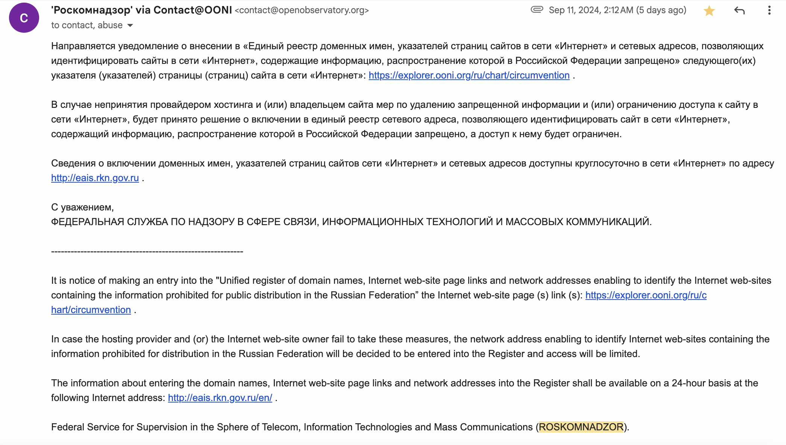
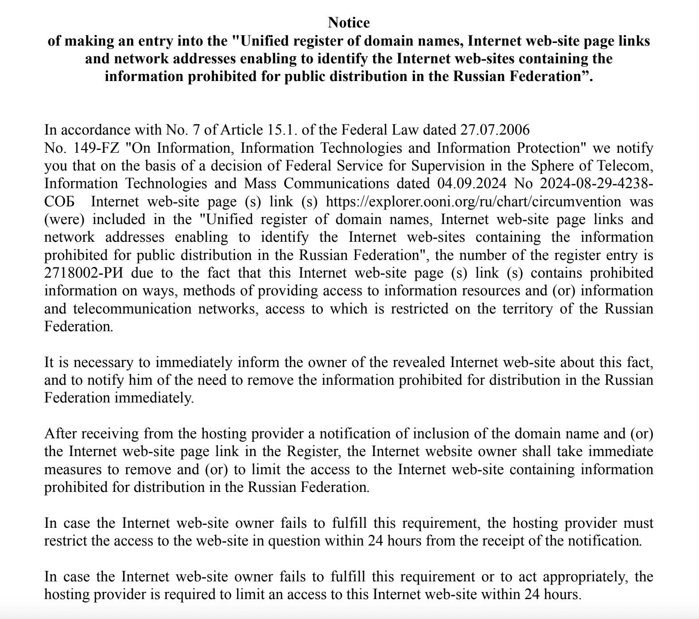
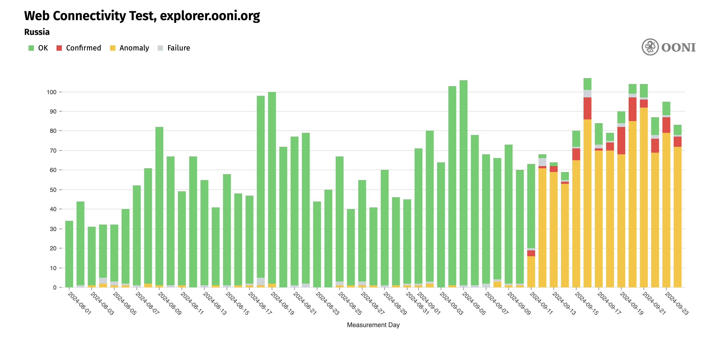
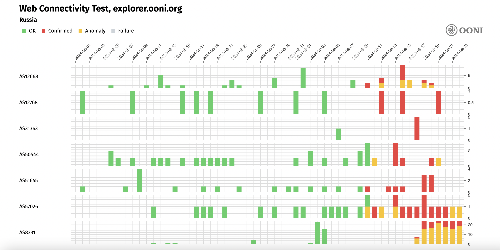
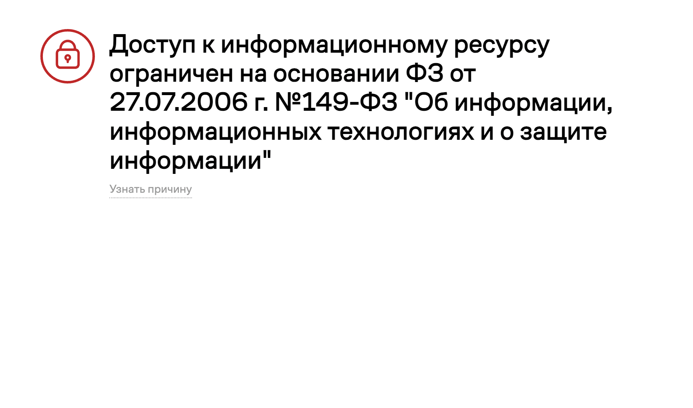
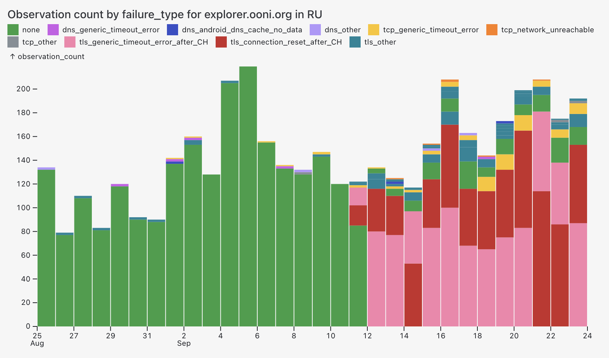

As of 11th September 2024, Russia has [blocked](https://explorer.ooni.org/chart/mat?probe_cc=RU&since=2024-08-01&until=2024-09-25&time_grain=day&axis_x=measurement_start_day&test_name=web_connectivity&domain=explorer.ooni.org) one of our platforms: [OONI Explorer](https://explorer.ooni.org/).

[OONI Explorer](https://explorer.ooni.org/) is one of the largest open datasets on internet censorship around the world. We [first launched](https://blog.torproject.org/ooni-explorer-censorship-and-other-network-anomalies-around-world/) this web platform back in 2016 with the goal of enabling researchers, journalists, and human rights defenders to investigate internet censorship based on empirical network measurement data that is contributed by [OONI Probe](https://ooni.org/install/) users worldwide. Every day, we publish [new measurements](https://explorer.ooni.org/) from around the world in real-time.

Today, OONI Explorer hosts [more than 2 billion network measurements](https://explorer.ooni.org/) collected from 27 thousand distinct networks in 242 countries and territories since 2012. Out of all countries, [OONI Probe](https://ooni.org/install/) users in Russia contribute the [second largest volume of measurements](https://explorer.ooni.org/country/RU) (following the [U.S](https://explorer.ooni.org/country/US), where OONI Probe users contribute the most measurements out of any country). This has enabled us to study various cases of internet censorship in Russia, such as the [blocking of Tor](https://ooni.org/post/2021-russia-blocks-tor/), the [blocking of independent news media websites](https://ooni.org/post/2022-russia-blocks-amid-ru-ua-conflict/), and [how internet censorship in Russia changed](https://ooni.org/post/2023-russia-a-year-after-the-conflict/) amid the war in Ukraine.

In this report, we share [OONI data](https://explorer.ooni.org/chart/mat?probe_cc=RU&since=2024-08-01&until=2024-09-25&time_grain=day&axis_x=measurement_start_day&test_name=web_connectivity&domain=explorer.ooni.org) on the blocking of OONI Explorer in Russia.



## Notice from Roskomnadzor

On 11th September 2024, we received an email from [Roskomnadzor](https://rkn.gov.ru/en/about/state-of-roskomnadzor/) – Russia’s Federal Service for Supervision in the Sphere of Telecom, Information Technologies and Mass Communications – informing us of their decision to add `https://explorer.ooni.org/ru/chart/circumvention` to their [blocking registry](https://eais.rkn.gov.ru/en/). On the same day, OONI data shows that [multiple ISPs in Russia started blocking access to OONI Explorer](https://explorer.ooni.org/chart/mat?probe_cc=RU&since=2024-08-13&until=2024-09-17&time_grain=day&axis_x=measurement_start_day&test_name=web_connectivity&domain=explorer.ooni.org).

{{}}

**Image:** Email sent from Roskomnadzor to OONI providing a notification on the blocking of OONI Explorer.

Along with their email, Roskomnadzor shared a document with us providing more details about the blocking notification. According to this document, Roskomnadzor decided on 4th September 2024 to restrict access to `https://explorer.ooni.org/ru/chart/circumvention` in accordance with No. 7 of Article 15.1 of the Federal Law (dated 27.07.2006 No. 149-FZ) "On Information, Information Technologies and Information Protection". They specified that they would add `https://explorer.ooni.org/ru/chart/circumvention` to their blocking registry for containing prohibited information on how to circumvent internet censorship and access restricted information in Russia. 

{{}}

**Image:** Notice sent from Roskomnadzor to OONI regarding the entry of `https://explorer.ooni.org/ru/chart/circumvention` to Russia’s Unified Register.

We thank Roskomnadzor for their notice and transparency. In the few other countries where access to our services has been blocked (such as [China](https://ooni.org/post/2023-china-blocks-ooni/)), we were not informed by authorities, nor did we receive an explanation of the block. It’s quite interesting to know that Russian authorities specifically do not want us sharing censorship circumvention information – as they specified a URL (`https://explorer.ooni.org/ru/chart/circumvention`) in their notice which points to the Russian translation of our [Circumvention Dashboard](https://explorer.ooni.org/chart/circumvention). This page only includes measurements on the reachability of three circumvention tools ([Psiphon](https://ooni.org/nettest/psiphon), [Tor](https://ooni.org/nettest/tor), [Tor Snowflake](https://ooni.org/nettest/tor-snowflake/)), and we even highlight that the presence of [anomalies](https://ooni.org/support/interpreting-ooni-data/#anomalies) in measurements is not necessarily indicative of blocking, as [false positives](https://ooni.org/support/faq/#what-are-false-positives) can occur. Meanwhile, the rest of the [OONI Explorer](https://explorer.ooni.org/) platform provides a wealth of data on many more forms of internet censorship in Russia and around the world.

The fact that they specified the URL of the Russian-language version of our Circumvention Dashboard – and [only added this specific URL](https://reestr.rublacklist.net/en/record/7404315/) to their blocking registry – suggests the targeted *intention* of the block: restricting people in Russia from accessing circumvention related information.

In practice, however, the block is not as targeted in nature, as it’s not possible to limit a block to a specific webpage when a website is hosted on HTTPS. As a result, they’ve [blocked](https://explorer.ooni.org/chart/mat?probe_cc=RU&since=2024-08-01&until=2024-09-25&time_grain=day&axis_x=measurement_start_day&test_name=web_connectivity&domain=explorer.ooni.org) access to the whole of `explorer.ooni.org`, rendering the whole of [OONI Explorer](https://explorer.ooni.org/) inaccessible for users in Russia (or at least for users on networks where the block is implemented).

## Methods

Since 2012, the [Open Observatory of Network Interference (OONI)](https://ooni.org/) has developed free and open source software (called [OONI Probe](https://ooni.org/install/)) which is designed to [measure various forms of internet censorship](https://ooni.org/nettest/), including the blocking of websites and apps. Every month, OONI Probe is regularly run by volunteers in [around 170 countries](https://explorer.ooni.org/) (including [Russia](https://explorer.ooni.org/country/RU)), and network measurements collected by OONI Probe users are automatically published as [open data in real-time](https://ooni.org/data).

[OONI Probe](https://ooni.org/install/) includes the [Web Connectivity experiment](https://ooni.org/nettest/web-connectivity/) which is designed to measure the blocking of many different [websites](https://ooni.org/support/faq#which-websites-will-i-test-for-censorship-with-ooni-probe) (included in the public, community-curated [Citizen Lab test lists](https://github.com/citizenlab/test-lists/tree/master/lists)) – including the OONI Explorer website (`explorer.ooni.org`).

Specifically, our [Web Connectivity experiment](https://ooni.org/nettest/web-connectivity/) is designed to measure the accessibility of [URLs](https://github.com/citizenlab/test-lists/tree/master/lists) by performing the following steps:

*   Resolver identification
*   DNS lookup
*   TCP connect to the resolved IP addresses
*   TLS handshake to the resolved IP addresses
*   HTTP(s) GET request following redirects

The above steps are automatically performed from both the local network of the user, and from a control vantage point. If the results from both networks are the same, the tested URL is annotated as accessible. If the results differ, the tested URL is annotated as [anomalous](https://ooni.org/support/faq#what-do-you-mean-by-anomalies), and the type of anomaly is further characterized depending on the reason that caused the failure (for example, if the TCP connection fails, the measurement is annotated as a TCP/IP anomaly).

[Anomalous measurements](https://ooni.org/support/faq#what-do-you-mean-by-anomalies) may be indicative of blocking, but [false positives](https://ooni.org/support/faq#what-are-false-positives) can occur. We therefore consider that the likelihood of blocking is greater if the overall volume of anomalous measurements is high in comparison to the overall measurement count (compared on an ASN level within the same date range for each OONI Probe experiment type).

Each [Web Connectivity](https://ooni.org/nettest/web-connectivity/) measurement provides further network information (such as information pertaining to TLS handshakes) that helps with evaluating whether an anomalous measurement presents signs of blocking. We therefore disaggregate based on the reasons that caused the anomaly (e.g. connection reset during the TLS handshake) and if they are consistent, they provide a stronger signal of potential blocking.

Based on our heuristics, we are able to automatically confirm the blocking of websites based on [fingerprints](https://github.com/ooni/blocking-fingerprints) if a [block page](https://ooni.org/support/glossary#block-page) is served, or if DNS resolution returns an IP known to be associated with censorship. This method enables us to [automatically confirm website blocks](https://explorer.ooni.org/search?since=2024-08-18&until=2024-09-18&failure=false&only=confirmed) in [Russia](https://explorer.ooni.org/search?since=2024-08-18&until=2024-09-18&failure=false&only=confirmed&probe_cc=RU) and in numerous other countries (such as [Indonesia](https://explorer.ooni.org/search?since=2024-08-18&until=2024-09-18&failure=false&only=confirmed&probe_cc=ID), [Malaysia](https://explorer.ooni.org/search?since=2024-08-18&until=2024-09-18&failure=false&only=confirmed&probe_cc=MY), [Italy](https://explorer.ooni.org/search?since=2024-08-18&until=2024-09-18&failure=false&only=confirmed&probe_cc=IT), and [Iran](https://explorer.ooni.org/search?since=2024-08-18&until=2024-09-18&failure=false&only=confirmed&probe_cc=IR)) where ISPs implement censorship in this way. In other cases (where ISPs implement censorship using different techniques), we analyze anomalous OONI measurements with our [OONI data analysis tool](https://github.com/ooni/data).

Our [data analysis tool](https://github.com/ooni/data) enables us to aggregate anomalous measurements based on failure types (“dns”, “tcp_ip”, “http-failure”, “http-diff”), and to further aggregate based on specific errors (such as “tls_connection_reset_error”, “tls_generic_timeout_error”, “dns.nxdomain_error”, etc.) on each tested network. This enables us to evaluate if we are consistently observing a large volume of specific failure types and specific errors in the testing of a specific service on a tested network, and to potentially characterize a block.

Specifically, we aggregate based on failure types (“dns”, “tcp_ip”, “http-failure”, “http-diff”) to evaluate if they were consistently present (or if the types of failures varied), as a more consistent failure type observed in a larger volume of measurements provides a stronger signal of blocking. If, for example, most anomalous measurements present “http-failures”, the anomalies were likely triggered by some failure during the HTTP experiment. We further analyze these failures to detect the specific errors (such as “connection_reset_error” or “generic_timeout_error”) that enable us to characterize potential blocking, and we aggregate the errors to examine whether and to what extent they were consistent across (relevant) measurements on each tested ASN.

This involves analyzing the network information from TLS handshake data in these measurements to evaluate whether the errors were a result of TLS based interference. For example, a measurement may show that DNS resolution returned consistent IPs, that it was possible to establish a connection to resolved IPs, but that the TLS handshake session timed out after the first Client Hello message (which is unencrypted), resulting in a “generic_timeout_error”. While we would consider that such a measurement shows signs of potential TLS based interference, we would not draw conclusions from a single measurement alone.

We therefore aggregate the errors to determine whether a large percentage of anomalous measurements for a tested URL presented the same error (e.g. “tls_timeout_error”) in comparison to the overall measurement volume on a specific network (within a specified date range). The higher the ratio of consistent errors (from anomalous measurements) in comparison to the overall measurement count, the stronger the signal (and the greater our confidence) that access to the tested domain is (a) blocked, and (b) blocked in a specific way (e.g TLS interference).

As part of our analysis, we also exclude cases which provide weak signals. Those include cases with small/limited measurement coverage (in comparison to the overall measurement coverage on a tested ASN during the analysis period), a low percentage of anomalies (in comparison to the overall measurement volume for a tested service on a network), a relatively large proportion of inconsistent failure types and errors, as well as cases which were determined to be false positives based on known bugs or other issues (such as global failure rates as a result of tested services being hosted on unreliable servers, or measurements collected from unreliable networks).

As part of this study, we used our [data analysis tool](https://github.com/ooni/data) to look into the blocking of OONI Explorer in Russia. This enabled us to go deeper than the aggregate presentation of anomalies already publicly available through our [Measurement Aggregation Toolkit (MAT)](https://explorer.ooni.org/chart/mat?test_name=web_connectivity&axis_x=measurement_start_day&since=2024-08-13&until=2024-09-18&time_grain=day&probe_cc=RU&domain=explorer.ooni.org). We are working on shipping the [OONI pipeline v5](https://github.com/ooni/data) into production so that it can be available to a wider audience and expose this richer analysis to the public.

## Blocking of OONI Explorer in Russia

Ironically, below is a [chart](https://explorer.ooni.org/chart/mat?probe_cc=RU&since=2024-08-01&until=2024-09-25&time_grain=day&axis_x=measurement_start_day&test_name=web_connectivity&domain=explorer.ooni.org) from OONI Explorer on the blocking of OONI Explorer in Russia.

{{}}

**Chart:** OONI Probe testing of OONI Explorer (`explorer.ooni.org`) on 195 networks in Russia between 1st August 2024 to 24th September 2024 (source: [OONI Explorer](https://explorer.ooni.org/chart/mat?probe_cc=RU&since=2024-08-01&until=2024-09-25&time_grain=day&axis_x=measurement_start_day&test_name=web_connectivity&domain=explorer.ooni.org)).

The above chart aggregates OONI measurement coverage from the [testing](https://ooni.org/nettest/web-connectivity/) of `explorer.ooni.org` on 195 networks in Russia between 1st August 2024 to 24th September 2024. As is evident, OONI Explorer received stable measurement coverage in Russia over the last month, with almost all measurements previously showing that `explorer.ooni.org` was accessible from many local vantage points.

Starting from 11th September 2024 (which correlates with the day when we received the blocking notice from Roskomnadzor, and when `https://explorer.ooni.org/ru/chart/circumvention` was [added to Roskomnadzor’s blocking registry](https://reestr.rublacklist.net/en/record/7404315/)), we observe a spike in measurements presenting anomalies – which have persisted to date. Generally, we annotate measurements as “[anomalous](https://ooni.org/support/interpreting-ooni-data/#anomalies)” when they present signals of blocking (based on our [heuristics](https://github.com/ooni/spec/tree/master/nettests)), though [false positives](https://ooni.org/support/interpreting-ooni-data/#false-positives) can occur. We annotate measurements as “[confirmed blocked](https://ooni.org/support/interpreting-ooni-data/#confirmed)” when blocks are automatically detected based on [fingerprints](https://github.com/ooni/blocking-fingerprints). From 11th September 2024 onwards, we observe that most measurements from the OONI Probe testing of `explorer.ooni.org` presented anomalies, while in a few cases the blocking of OONI Explorer was automatically confirmed.

### DNS based blocks

Some cases of DNS based blocking of OONI Explorer in Russia are [automatically confirmed](https://explorer.ooni.org/chart/mat?probe_cc=RU&since=2024-08-01&until=2024-09-25&time_grain=day&axis_x=measurement_start_day&axis_y=probe_asn&test_name=web_connectivity&domain=explorer.ooni.org) on the networks listed in the following chart.

{{}}

**Chart:** ASNs in Russia where the blocking of `explorer.ooni.org` is automatically confirmed based on blocking fingerprints between 1st August 2024 to 24th September 2024 (source: [OONI Explorer](https://explorer.ooni.org/chart/mat?probe_cc=RU&since=2024-08-01&until=2024-09-25&time_grain=day&axis_x=measurement_start_day&axis_y=probe_asn&test_name=web_connectivity&domain=explorer.ooni.org)).

On such networks, we are able to automatically confirm the block because ISPs return an IP associated with censorship as part of DNS resolution. For example, the IP `188.186.154.88` has been added to our [blocking fingerprint database](https://github.com/ooni/blocking-fingerprints/blob/main/fingerprints_dns.csv) because it hosts a [block page](https://ooni.org/support/glossary#block-page), and OONI data shows that [this IP was returned as part of DNS resolution](https://explorer.ooni.org/m/20240916045716.646385_RU_webconnectivity_1cf1f2dd6e536360) when `explorer.ooni.org` was tested in Russia. As a result, users on these networks in Russia (such as on AS12668) see the following page when accessing [OONI Explorer](https://explorer.ooni.org/):

{{}}

**Image:** Block page hosted by the IP `188.186.154.88` returned as part of DNS resolution for `explorer.ooni.org` (source: [OONI data](https://explorer.ooni.org/m/20240916045716.646385_RU_webconnectivity_1cf1f2dd6e536360)).

We also see a few other cases of DNS based tampering, such as when [DNS queries return an NXDOMAIN error](https://explorer.ooni.org/m/20240915062808.187778_RU_webconnectivity_7cbf1d1644426694) (i.e. an error claiming that a domain does not exist) for `explorer.ooni.org`. Beyond the networks listed in the previous chart, OONI data suggests that access to `explorer.ooni.org` is [blocked on almost all tested networks](https://explorer.ooni.org/chart/mat?test_name=web_connectivity&axis_x=measurement_start_day&since=2024-08-13&until=2024-09-17&time_grain=day&probe_cc=RU&axis_y=probe_asn&domain=explorer.ooni.org) in Russia. On most networks, access to OONI Explorer appears to be blocked by means of TLS interference.

### TLS based blocks

While the blocking of OONI Explorer is not automatically confirmed on most networks, the [large presence of anomalies](https://explorer.ooni.org/chart/mat?probe_cc=RU&since=2024-08-01&until=2024-09-25&time_grain=day&axis_x=measurement_start_day&test_name=web_connectivity&domain=explorer.ooni.org) serves as a strong indicator of blocking. To understand whether these anomalies are symptomatic of censorship (and to characterize the block), we have generated a chart below (using the more advanced data analysis capabilities of our upcoming [OONI pipeline v5](https://github.com/ooni/data)) which provides a breakdown of the failure types and errors that resulted in anomalies.

{{}}

**Chart:** Annotation of failure types and errors in OONI measurements from the OONI Probe testing of OONI Explorer (`explorer.ooni.org`) in Russia between 25th August 2024 to 24th September 2024 (source: [OONI data](https://explorer.ooni.org/chart/mat?probe_cc=RU&since=2024-08-25&until=2024-09-25&time_grain=day&axis_x=measurement_start_day&test_name=web_connectivity&domain=explorer.ooni.org)).

From the above chart we can see that the vast majority of anomalous measurements from the testing of `explorer.ooni.org` presented signs of **TLS interference** because the failures occurred during the TLS handshake. Specifically, we can see that many measurements resulted in [timeout errors](https://explorer.ooni.org/m/20240916230057.598639_RU_webconnectivity_5f2c63d5fb1212d0) (annotated in pink) and [connection reset errors](https://explorer.ooni.org/m/20240916231353.086298_RU_webconnectivity_2e9df317e8414763) (annotated in red) right after the Client Hello message during the TLS handshake.

A bit more explanation: Before the TLS connection is secure and encrypted, the user sends an initial message called the "Client Hello" that is unencrypted. This (unencrypted) message includes (amongst other things) the Server Name Indication (SNI) which specifies the domain name of the service that the user wants to access. This means that a censor can read this unencrypted message and terminate the connection before it's even encrypted. If that domain is part of some "censorship list", they can selectively terminate connections towards it. Being able to do this type of network-level monitoring and selective filtering usually requires the use of some Deep Packet Inspection (DPI) technology.

In this specific case, OONI measurements show that even though the connections to the OONI Explorer IPs are successful, as soon as the user requests the OONI Explorer domain (`explorer.ooni.org`) during the unencrypted Client Hello message of the TLS handshake, the TLS connection immediately fails. In some cases, OONI data shows the [timing out of the TLS session](https://explorer.ooni.org/m/20240916230057.598639_RU_webconnectivity_5f2c63d5fb1212d0), in others it shows the [injection of a RST packet](https://explorer.ooni.org/m/20240916231353.086298_RU_webconnectivity_2e9df317e8414763) after the Client Hello during the TLS handshake. As we observe the same pattern in multiple OONI Explorer measurements on several different networks during the same date range (between 11th to 17th September 2024), [OONI data](https://explorer.ooni.org/chart/mat?probe_cc=RU&since=2024-08-01&until=2024-09-25&time_grain=day&axis_x=measurement_start_day&axis_y=probe_asn&test_name=web_connectivity&domain=explorer.ooni.org) suggests that many ISPs in Russia blocked access to OONI Explorer by means of TLS interference.

## Conclusion

Overall, the censorship techniques observed in the [blocking of OONI Explorer](https://explorer.ooni.org/chart/mat?probe_cc=RU&since=2024-08-01&until=2024-09-25&time_grain=day&axis_x=measurement_start_day&test_name=web_connectivity&domain=explorer.ooni.org) are [consistent with the prevailing censorship techniques](https://ooni.org/post/2022-russia-blocks-amid-ru-ua-conflict/#key-findings) documented in Russia as part of our previous studies. Specifically, **TLS based interference** implemented through the [injection of a RST packet](https://explorer.ooni.org/m/20240916231353.086298_RU_webconnectivity_2e9df317e8414763) and the [timing out of the session](https://explorer.ooni.org/m/20240916230057.598639_RU_webconnectivity_5f2c63d5fb1212d0) after the Client Hello during the TLS handshake are among the most prevalent censorship techniques observed in Russia over the last few years. Similarly, **DNS manipulation** (redirecting in some cases to [block pages](https://explorer.ooni.org/m/20240916045716.646385_RU_webconnectivity_1cf1f2dd6e536360)) is commonly observed in Russia too.

It’s worth noting that while ISPs in Russia [blocked access to OONI Explorer](https://explorer.ooni.org/chart/mat?probe_cc=RU&since=2024-08-01&until=2024-09-25&time_grain=day&axis_x=measurement_start_day&test_name=web_connectivity&domain=explorer.ooni.org), they did [not](https://explorer.ooni.org/chart/mat?probe_cc=RU&since=2024-08-18&until=2024-09-26&time_grain=day&axis_x=measurement_start_day&test_name=web_connectivity&domain=ooni.org) [block](https://explorer.ooni.org/chart/mat?probe_cc=RU&since=2024-08-18&until=2024-09-26&time_grain=day&axis_x=measurement_start_day&test_name=web_connectivity&domain=ooni.org) access to our main website (`ooni.org`), nor to our censorship measurement app ([OONI Probe](https://ooni.org/install/)) – as suggested by the fact that the [overall OONI measurement coverage from Russia](https://explorer.ooni.org/chart/mat?probe_cc=RU&since=2024-08-18&until=2024-09-25&time_grain=day&axis_x=measurement_start_day&test_name=web_connectivity) seems quite stable. OONI data therefore corroborates what is [documented in Russia’s blocking registry](https://reestr.rublacklist.net/en/?q=ooni.org): the block is limited to [OONI Explorer](https://explorer.ooni.org/).

While Roskomnadzor mentioned in their notice their intention to restrict access to the Russian translation of our [Circumvention Dashboard](https://explorer.ooni.org/chart/circumvention) (to limit access to circumvention related information in compliance with Russia’s relevant law), in practice, the restriction is far-reaching. 

The impact of this block is not limited to restricting access to circumvention related information. Rather, the block restricts access to all OONI data hosted on [OONI Explorer](https://explorer.ooni.org/). As a result, this block can limit Russian researchers and journalists from using OONI data to investigate internet censorship in different countries around the world. It also makes it harder for the many [OONI Probe](https://ooni.org/install/) users in Russia – who contribute the second largest OONI measurement volume worldwide – to access measurements beyond their individual testing results (available through their OONI Probe app).

While it is still possible for people in Russia to download OONI data from the [OONI API](https://api.ooni.io/) or to [fetch OONI data from our S3 bucket](https://docs.ooni.org/data/), this requires some technical expertise – limiting the audiences who could make use of OONI data. [OONI Explorer](https://explorer.ooni.org/), on the other hand, was built with the goal of removing technical barriers, enabling human rights defenders, journalists, and social science researchers to make use of the data.

By [blocking OONI Explorer](https://explorer.ooni.org/chart/mat?probe_cc=RU&since=2024-08-25&until=2024-09-25&time_grain=day&axis_x=measurement_start_day&test_name=web_connectivity&domain=explorer.ooni.org), Roskomnadzor is effectively limiting access to a rich [open dataset on internet censorship worldwide](https://explorer.ooni.org/). But given how transparent they are about which websites they block (they maintain a [public blocking registry](https://eais.rkn.gov.ru/en/)), we wonder whether the benefit of censoring access to reachability measurements for a few circumvention tools – [Tor](https://www.torproject.org/) and [Psiphon](https://psiphon.ca/) (both of which are included in their registry) – outweighs the cost of limiting Russians’ ability to study internet censorship worldwide based on empirical network measurement data.

In other words: Roskomnadzor is *already* transparent about the fact that they’re blocking access to [Tor](https://reestr.rublacklist.net/en/?q=www.torproject.org) and [Psiphon](https://reestr.rublacklist.net/en/?q=psiphon.ca). What’s the harm with the [OONI reachability measurements](https://explorer.ooni.org/chart/circumvention) for those tools?
