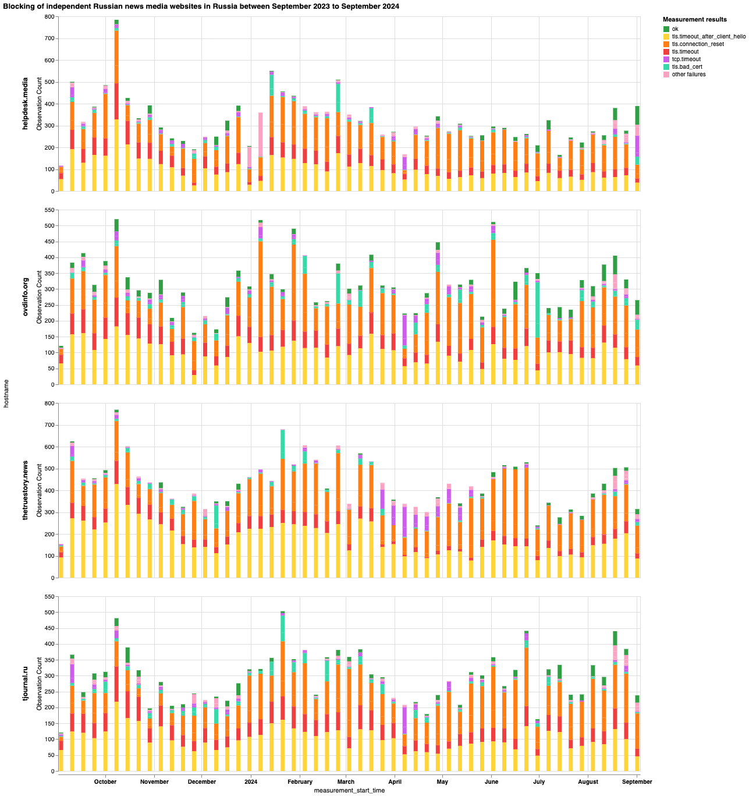
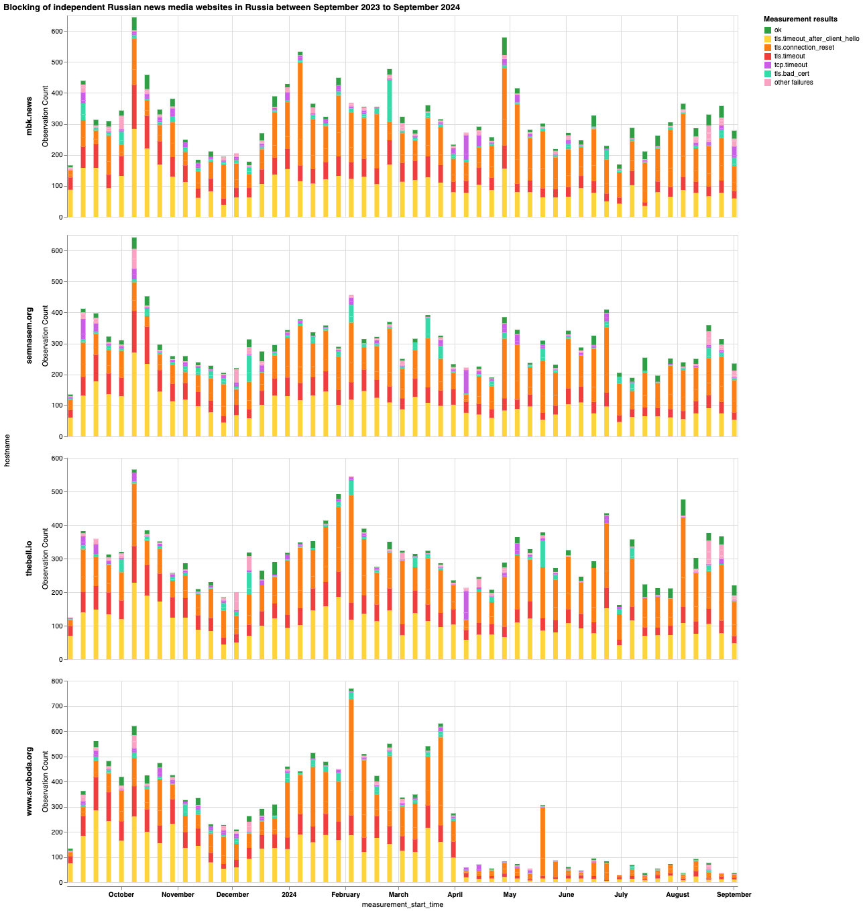
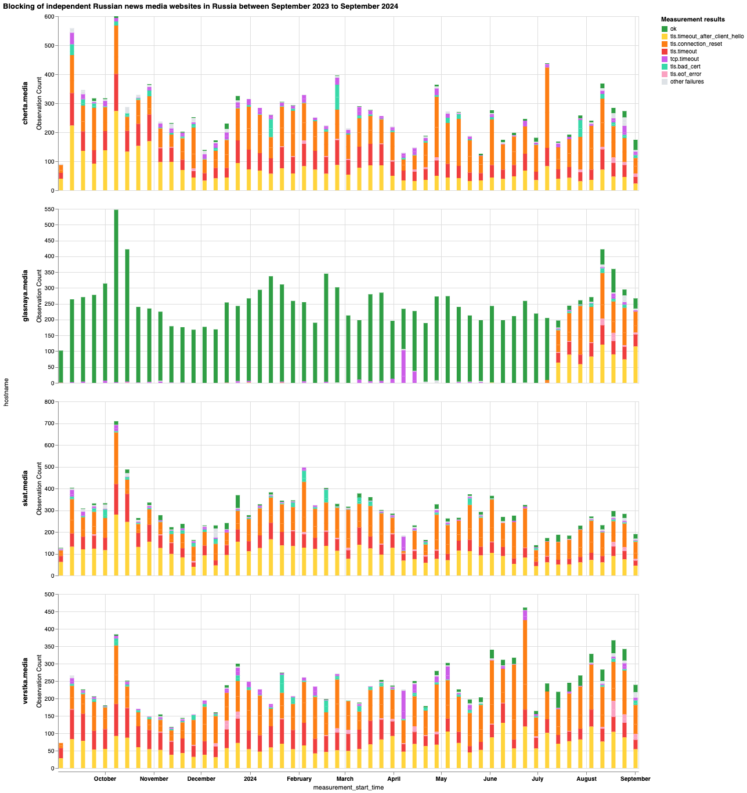
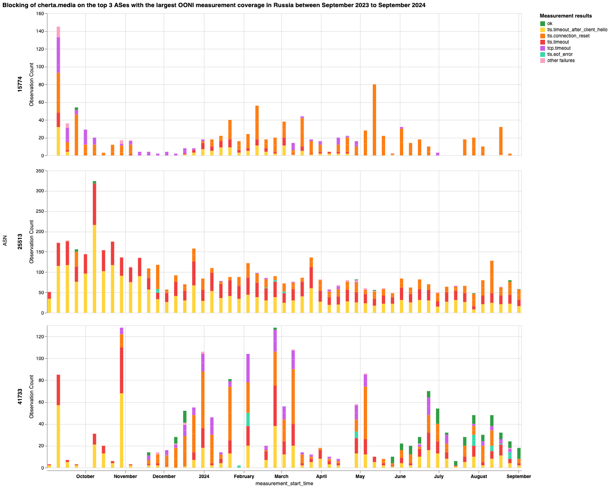
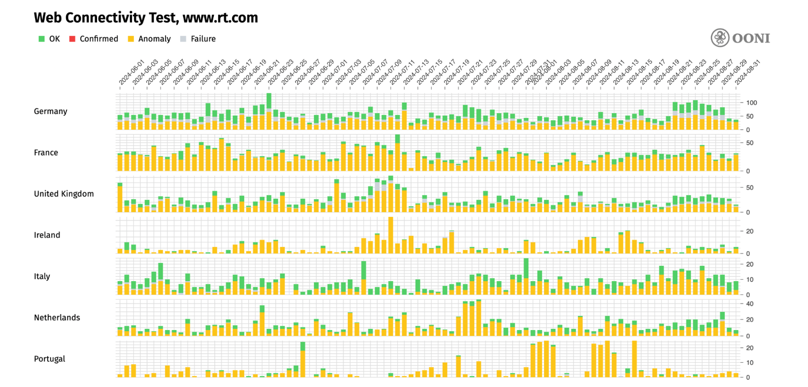
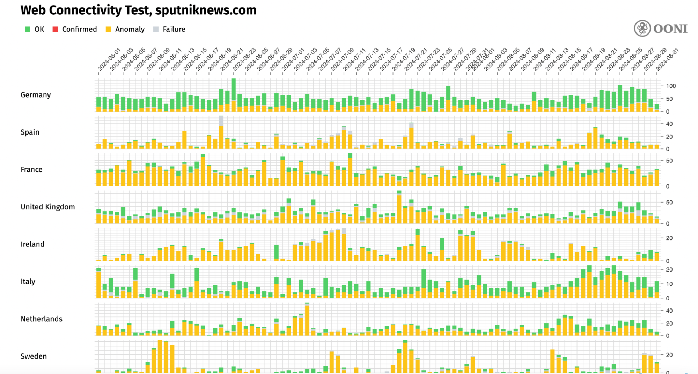
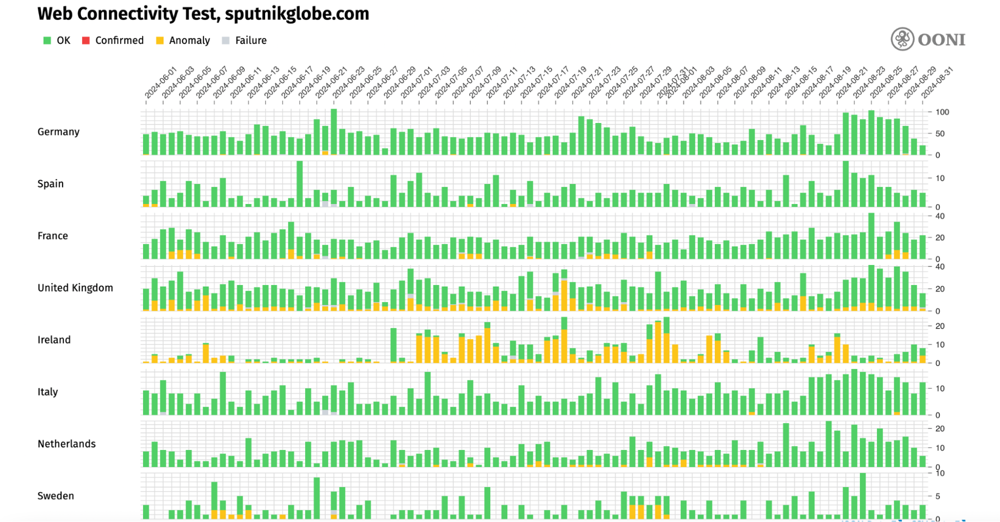
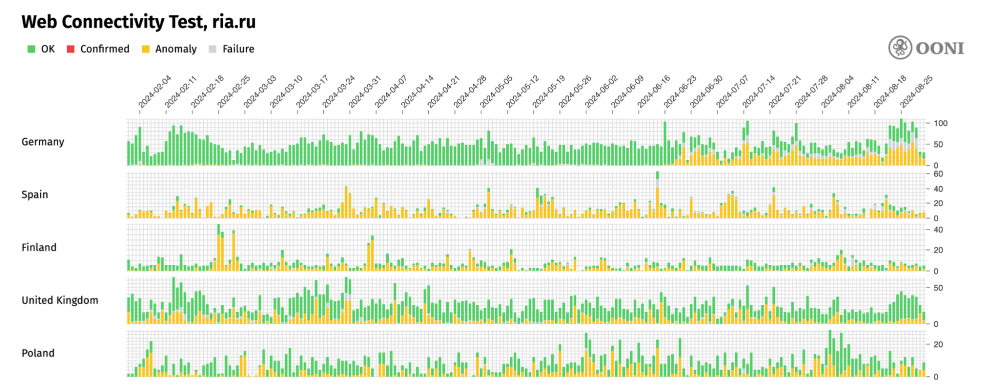
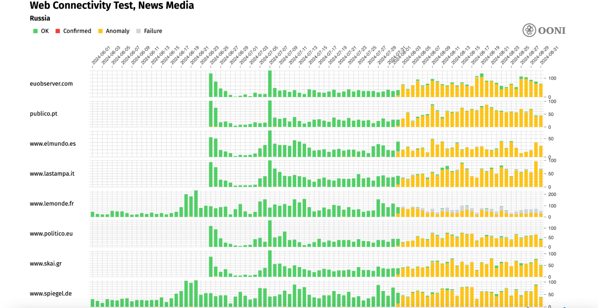

Nearly three years ago, when Russia launched its military operation in Ukraine, it also initiated a parallel campaign: a censorship war targeting independent news media within the country. 

Merely a week after the conflict started, Internet Service Providers (ISPs) in Russia [started blocking](https://ooni.org/post/2022-russia-blocks-amid-ru-ua-conflict/#blocking-of-news-media-websites) access to several foreign news media websites (such as [BBC](https://explorer.ooni.org/search?since=2022-02-03&until=2022-03-07&failure=false&domain=www.bbc.com&probe_cc=RU&only=anomalies) and [Deutsche Welle](https://explorer.ooni.org/search?since=2022-02-03&until=2022-03-07&failure=false&domain=www.dw.com&probe_cc=RU&only=anomalies)) and independent Russian news media websites (such as [Meduza](https://ooni.org/post/2022-russia-blocks-amid-ru-ua-conflict/#meduza) and [New Times](https://ooni.org/post/2022-russia-blocks-amid-ru-ua-conflict/#new-times)). Within a year, independent news media censorship in Russia had become pervasive. In our previous report, we [confirmed the blocking of 139 news media domains](https://ooni.org/post/2023-russia-a-year-after-the-conflict/#blocked-websites) in Russia. 

As the war in Ukraine continues, so does Russia’s war on independent Russian news media. OONI network measurement data collected from Russia shows that numerous Russian, independent news media websites [remain blocked](https://explorer.ooni.org/search?since=2024-10-16&until=2024-11-16&failure=false&category_code=NEWS&probe_cc=RU&only=anomalies) in Russia to this day. 

This report is a joint study by [RKS Global](https://rks.global/en/) and the [Open Observatory of Network Interference (OONI)](https://ooni.org/). We share [OONI data](https://explorer.ooni.org/search?since=2023-09-01&until=2024-09-01&failure=false&category_code=NEWS&probe_cc=RU&only=anomalies) on the blocking of news media websites in Russia over the past year, as well as insights from interviews on how these blocks have impacted independent Russian news media organizations. 



## **Key Findings** 

Our analysis of [OONI network measurements](https://explorer.ooni.org/search?since=2023-09-01&until=2024-09-01&failure=false&category_code=NEWS&probe_cc=RU) collected from Russia over the last year (between 1st September 2023 to 1st September 2024) shows:

* **Confirmed blocking of at least 279 news media domains.** Based on [fingerprints](https://github.com/ooni/blocking-fingerprints), we automatically confirmed the blocking of 279 news media domains (which is double the [number of news media domains (139) that we confirmed blocked](https://ooni.org/post/2023-russia-a-year-after-the-conflict/#blocked-websites) in our previous study in 2023). These blocked domains include both [foreign](https://explorer.ooni.org/search?since=2023-09-01&until=2024-09-01&failure=false&domain=www.bbc.com&probe_cc=RU&only=confirmed) and [independent Russian news media](https://explorer.ooni.org/search?since=2024-06-01&until=2024-09-01&failure=false&domain=meduza.io&probe_cc=RU&only=confirmed) sites, with most found blocked on more than 10 different ASes in Russia. In such cases, ISPs appear to implement [DNS-based blocks](https://explorer.ooni.org/search?since=2024-06-01&until=2024-09-01&failure=false&probe_cc=RU&only=confirmed&category_code=NEWS) in a decentralized way (for example, by [returning](https://explorer.ooni.org/m/20240831214254.678017_RU_webconnectivity_b20e816b4f098faf) the `188.186.146.208` as part of DNS resolution).
* **Most news media blocks in Russia are implemented by means of TLS interference.** Most OONI measurements from numerous networks in Russia show that blocks are primarily implemented by means of TLS interference. In some cases, OONI data shows the [timing out of the TLS session](https://explorer.ooni.org/m/20240304234216.999706_RU_webconnectivity_0bf3dc8ab4594261), in others it shows the [injection of a RST packet](https://explorer.ooni.org/m/20240229220916.569376_RU_webconnectivity_190da1e0c3cd82b2) right after the ClientHello message during the TLS handshake.
* **Centrally managed blocks, but decentralized DPI deployments.** Similarly to [Censored Planet’s findings](https://censoredplanet.org/tspu), OONI data hints at the widespread use of [TSPU](https://censoredplanet.org/tspu) (Russia’s DPI system) because blocks appear to be [triggered by the SNI field](https://explorer.ooni.org/m/20240229220916.569376_RU_webconnectivity_190da1e0c3cd82b2), and the [same domains are blocked consistently on most networks](https://explorer.ooni.org/chart/mat?test_name=web_connectivity&axis_x=measurement_start_day&since=2024-06-01&until=2024-09-01&time_grain=day&probe_cc=RU&axis_y=domain&category_code=NEWS) at the same time. This suggests that while the deployment of TSPU is decentralized (as each ISP is [required to install TSPU](https://www.interfax.ru/russia/879441) on their network), the blocks are likely centrally managed by Roskomnadzor. 
* **Media censorship war between Russia and the EU.** In response to a 2022 [decision](https://www.consilium.europa.eu/en/press/press-releases/2022/03/02/eu-imposes-sanctions-on-state-owned-outlets-rtrussia-today-and-sputnik-s-broadcasting-in-the-eu/) by the Council of the European Union, many [EU countries continue to block access to Sputnik and Russia Today (RT)](https://explorer.ooni.org/chart/mat?since=2024-10-24&until=2024-11-24&time_grain=day&axis_x=measurement_start_day&axis_y=probe_cc&test_name=web_connectivity&domain=www.rt.com%2Csputnikglobe.com%2Csputniknews.com%2Crt.com). Following the Council of the European Union’s May 2024 [decision](https://www.consilium.europa.eu/en/press/press-releases/2024/05/17/russia-s-war-of-aggression-against-ukraine-council-bans-broadcasting-activities-in-the-european-union-of-four-more-russia-associated-media-outlets/) to suspend the broadcasting activities of 4 more Russia-associated media outlets, Russia’s Ministry of Foreign Affairs [announced](https://www.mid.ru/ru/foreign_policy/news/1959391/) in June 2024 that they would restrict access to 81 media outlets of EU member states (including several sites of pan-European media) in Russia. OONI data [shows](https://explorer.ooni.org/chart/mat?test_name=web_connectivity&axis_x=measurement_start_day&since=2024-06-01&until=2024-09-01&time_grain=day&probe_cc=RU&axis_y=domain&category_code=NEWS) that access to these EU news media websites has been blocked in Russia since 2nd August 2024. 

Through **interviews** with representatives from **15 independent Russian news media organizations**, the respondents shared that the **main challenges** that they experience include:

* **Financial challenges.** In recent years, Russian authorities have designated several independent media organizations as “foreign agents” or “undesirable organizations”, which has resulted in restrictions on advertising, partnerships, and in reduced financial support towards such organizations in the country. This was exacerbated by sanctions and the blocking of payment systems, which have further increased the financial burden on independent Russian media organizations in recent years. As a result, many media outlets have been forced to seek alternative sources of funding (such as crowdfunding or international grants), and many media outlets have yet to find a sustainable funding model.
* **Closure of media organizations.** As a result of financial difficulties and increased censorship, some media publications in Russia had to close down in 2024. For example, the following media suspended their activities: Yakutsk newspaper “Tuimaada”, environmental publication “Kedr” (part of the team founded a new publication “Smola”), radio “Ekho Kavkaza” (suspended broadcasting due to the status of an ‘undesirable organization’), media “Kurier.Sreda”, “Astra” (temporarily closed down due to lack of funding but soon resumed its work thanks to crowdfunding), “Support Service” (due to financial problems after failing to receive international donors’ support), “It's My City” (deprived of its license for covering anti-war protests).
* **Security challenges.** Increased risks of surveillance and [restrictions on VPN usage](https://roskomsvoboda.org/en/analysis/vpn-russia-2023-eng/) created both digital and [legal](https://www.reuters.com/article/us-russia-internet-idUSKBN1AF0QI/) risks for media employees working with sensitive information. The presence of media projects on Russian social media platforms has become insecure, as interaction with material from “undesirable organizations” is easily traceable and can lead to the criminal prosecution of readers. To minimize threats to their audiences, many media outlets have closed their accounts on Russian platforms and switched to foreign services with enhanced data protection. However, most foreign services remain blocked in Russia, and this change of platforms resulted in a partial loss of Russian audiences. 
* **Partial loss of Russian audiences.** As a result of their website being blocked, and being designated a “foreign agent”, “extremist” or “undesirable organization” by authorities (which poses risks to readers who consume material from such organizations), many independent media organizations have lost some of their audiences in Russia. These statuses also make it impossible to use paid promotion through platforms, services and cooperation with bloggers, which deprives media outlets of important channels for audience engagement. When blocks forced media organizations to change platforms, this also led to a partial loss of their audience.
* **Growing self-censorship.** The legal statuses of “undesirable organization”, “extremist” and “foreign agent” imposed by Russian authorities to many independent media organizations make it difficult for such organizations to work with authors and respondents, find and attract new authors, respondents and experts, as any cooperation with the media becomes risky and may lead to criminal liability for participants. These statuses increase self-censorship and result in the withdrawal of individual journalists from the profession and the closure of media organizations. 
* **Reduced ability to cover events in Russia.** Challenges of immigration, low salaries and constant stress lead to burnout among staff, especially media managers. The status of “foreign agent” or “undesirable organization” makes many authors and respondents reluctant to cooperate with media outlets, limiting the media's ability to cover events in Russia. Independent media outlets face a number of challenges that include difficulties in finding authors, accessing information, working with respondents based in Russia, and adapting to the rapidly changing digital environment. All of this requires a high degree of flexibility and the ability to respond quickly to new threats.

Despite all the above challenges, independent Russian media organizations remain *resilient*. The increased threats posed to press freedom in Russia has resulted in **strengthened solidarity and cooperation among media outlets**, who share solutions and warnings about new technologies used by the censors. Many independent Russian media organizations have demonstrated a *high level of adaptation*, using mirrors, VPNs and alternative platforms (e.g. Telegram) to circumvent the blocks and reach their audiences. Yet, international support is needed to strengthen the fight for press freedom in Russia.

## **Introduction** 

On 24th February 2022 – *the same day that Russia launched its full-scale invasion in Ukraine* – Roskomnadzor (Russia’s Federal Service for Supervision in the Sphere of Telecom, Information Technologies and Mass Communications) published a [statement](https://rkn.gov.ru/news/rsoc/news74084.htm) claiming that media organizations are obliged to “only use information and data received from official Russian sources”. 

A week later, Roskomnadzor [started blocking access to several foreign and independent Russian news media websites](https://ooni.org/post/2022-russia-blocks-amid-ru-ua-conflict/#blocking-of-news-media-websites) on the grounds of “spreading false information”. On the same day, Russia [adopted a bill with amendments to the Russian Criminal Code](https://interfax.com/newsroom/top-stories/75419/) which introduced higher penalties – including a [prison sentence of up to 15 years](https://cpj.org/2022/03/proposed-russian-legislation-threatens-15-years-in-prison-for-fake-information-about-ukraine-invasion/) – for those convicted of disseminating false information about Russian military operations, discrediting the Russian Armed Forces, and calls for anti-Russian sanctions. Within a year, access to at least [139 news media domains were confirmed blocked](https://ooni.org/post/2023-russia-a-year-after-the-conflict/#blocked-websites) through OONI data, suggesting a rise in pervasive levels of news media censorship in Russia.

As part of our [partnership](https://ooni.org/partners/roskomsvoboda/), [OONI](https://ooni.org/) and [RKS Global](https://rks.global/en/) collaborated on investigating the scale and impact of independent news media censorship in Russia over the last year. Our goal is to document and increase public awareness of the ongoing blocking of independent Russian news media websites within Russia amid the ongoing war in Ukraine, and to share how these blocks impacted some of these media organizations.

Specifically, the main research questions that guided this study include:

* Which independent Russian news media websites are blocked in Russia?
* Which techniques do ISPs in Russia use to implement these blocks? How do blocks vary across ISPs in Russia?
* What is the impact of these blocks? How do these blocks impact independent Russian news media organizations? 

To answer the first two questions, we [analyzed](https://github.com/ooni/backend/issues/847) OONI [Web Connectivity measurements](https://explorer.ooni.org/search?since=2023-09-01&until=2024-09-01&failure=false&category_code=NEWS&probe_cc=RU) collected from Russia over the last year, between 1st September 2023 to 1st September 2024. To explore the third question, we carried out desk research and interviewed 15 independent Russian news media organizations.

Based on our previous research on internet censorship in Russia, we started this research with several assumptions:

* **Pervasive news media censorship.** In February 2023, our analysis of OONI data [confirmed the blocking of (at least) 139 news media domains](https://ooni.org/post/2023-russia-a-year-after-the-conflict/#blocked-websites) in Russia. 
* **Decentralized censorship.** OONI data has shown [variance in how blocks are implemented on different networks](https://ooni.org/post/2022-russia-blocks-amid-ru-ua-conflict/) in the country. Some ISPs implement blocks through the use of multiple techniques at the same time, making circumvention harder.
* **Different censorship techniques.** To block websites, OONI data has shown that Russian ISPs adopt the following censorship techniques:
    * [DNS manipulation, redirecting in some cases to blockpages](https://explorer.ooni.org/measurement/20220305T042324Z_webconnectivity_RU_35807_n1_7gOd4SMmKjQ3mmYn?input=https%3A%2F%2Fwww.bbc.com%2Frussian%2F)
    * [HTTP man-in-the-middle, serving blockpages](https://explorer.ooni.org/measurement/20220304T214241Z_webconnectivity_RU_12389_n1_UeXMqEpughRTTzLU?input=http%3A%2F%2Fwww.bbc.com%2Fnews)
    * [TLS man-in-the-middle](https://explorer.ooni.org/measurement/20220304T050209Z_webconnectivity_RU_8359_n1_Ajrlzw7jakFRM3pM?input=https%3A%2F%2Fwww.bbc.com%2F)
    * [Injection of a RST packet after the ClientHello during the TLS handshake](https://explorer.ooni.org/measurement/20220305T090244Z_webconnectivity_RU_8732_n1_oCVFwxN1oAYddBoX?input=https%3A%2F%2Fwww.bbc.com%2Frussian%2F) 
    * [Timing out the session after the ClientHello during the TLS handshake](https://explorer.ooni.org/measurement/20220304T080535Z_webconnectivity_RU_16345_n1_3v6HMrLt0KTMXcpm?input=https%3A%2F%2Fwww.bbc.com%2F)
    * [Closing the connection after the ClientHello during the TLS handshake](https://explorer.ooni.org/measurement/20220304T034651Z_webconnectivity_RU_31163_n1_asVR1x6WcRk5AdL0?input=https%3A%2F%2Fwww.bbc.com%2F)

As this research involves the analysis of [more recent OONI measurements](https://explorer.ooni.org/search?since=2023-09-01&until=2024-09-01&failure=false&category_code=NEWS&probe_cc=RU&only=anomalies) (spanning from September 2023 to September 2024), we explore whether and to what extent the blocking of independent news media has changed in Russia. More importantly, we examine how these ongoing blocks have affected the ability of independent Russian news organizations to report freely to audiences within Russia amid the ongoing war in Ukraine.

## **Methods** 

As part of this study, our goal was to examine which independent Russian news media websites have been blocked in Russia over the past year, as well as the impact of these blocks on independent Russian news media organizations. 

To this end, we adopted a **mixed methods research approach**, combining quantitative methods with qualitative methods. Our quantitative methods involved [OONI data analysis](https://github.com/ooni/backend/issues/847), while our qualitative methods involved interviews, desk research, relevant legal analysis, and updates to the [Citizen Lab test list for Russia](https://github.com/citizenlab/test-lists/blob/master/lists/ru.csv) (which includes URLs measured for censorship in the country).

Specifically, to examine which independent Russian news media websites are blocked in Russia, and which censorship techniques are adopted by ISPs, we analyzed [OONI network measurement data](https://explorer.ooni.org/search?since=2023-09-01&until=2024-09-01&failure=false&category_code=NEWS&probe_cc=RU) collected from Russia over the past year (between 1st September 2023 to 1st September 2024). To explore the impact of these blocks, we interviewed 15 independent Russian news media organizations. We also reviewed the [Citizen Lab test list for Russia](https://github.com/citizenlab/test-lists/blob/master/lists/ru.csv) and we [updated the list](https://github.com/citizenlab/test-lists/pull/1691) to include additional independent Russian news media websites for [OONI Probe](https://ooni.org/install/) testing. We share more details below.

### **Test list updates** 

We started off by reviewing the [Citizen Lab test list for Russia](https://github.com/citizenlab/test-lists/blob/master/lists/ru.csv), which includes URLs measured for censorship by [OONI Probe](https://ooni.org/install/) users in Russia. By default, [OONI Probe](https://ooni.org/install/) users measure URLs included in two test lists: (a) the [Global](https://github.com/citizenlab/test-lists/blob/master/lists/global.csv) list (which includes internationally-relevant URLs) and (b) the [country-specific list](https://github.com/citizenlab/test-lists/tree/master/lists) (which only includes URLs that are relevant to a specific country). In Russia, OONI Probe users generally test URLs included in both the [Global](https://github.com/citizenlab/test-lists/blob/master/lists/global.csv) and [Russian](https://github.com/citizenlab/test-lists/blob/master/lists/ru.csv) test lists. 

Given that our study aims to examine the blocking of independent Russian news media websites, the first step of our study involved reviewing the URLs in the [Russian](https://github.com/citizenlab/test-lists/blob/master/lists/ru.csv) test list and compiling a list of *missing* independent Russian news media websites. [RKS Global](https://rks.global/en/) provided a [comprehensive update](https://github.com/citizenlab/test-lists/pull/1691), removing URLs that were no longer relevant, and **adding 196 extra news media URLs** for OONI Probe testing. The test list review process was primarily limited to URLs [categorized as “News Media (NEWS)”](https://github.com/citizenlab/test-lists/blob/master/lists/00-LEGEND-new_category_codes.csv) based on the Citizen Lab’s category codes. As soon as these test list updates were reviewed and merged, the newly added URLs were [automatically prioritized](https://ooni.org/post/ooni-smart-url-list-system/#country-specific-url-prioritization-criteria) for [OONI Probe](https://ooni.org/install/) testing in Russia. This helped ensure stable OONI measurement coverage of the newly added URLs between 29th March 2024 (when the [pull request was merged](https://github.com/citizenlab/test-lists/pull/1691)) until 1st September 2024 (the end of the OONI data analysis date range for this study).

### **OONI data analysis** 

As part of this study, the [Open Observatory of Network Interference (OONI)](https://ooni.org/) analyzed [OONI network measurement data](https://explorer.ooni.org/search?since=2023-09-01&until=2024-09-01&failure=false&category_code=NEWS&probe_cc=RU) collected from Russia between **1st September 2023 to 1st September 2024**. Through this [analysis](https://github.com/ooni/backend/issues/847), OONI aimed to examine whether news media websites (included in the Citizen Lab’s [Global](https://github.com/citizenlab/test-lists/blob/master/lists/global.csv) and [Russian](https://github.com/citizenlab/test-lists/blob/master/lists/ru.csv) test lists) were blocked during the analysis period, and whether the implementation of such blocks varied across networks in Russia.

Since 2012, [OONI](https://ooni.org/) has developed free and open source software (called [OONI Probe](https://ooni.org/install/)) which is designed to [measure various forms of internet censorship](https://ooni.org/nettest/), including the blocking of websites and apps. Every month, OONI Probe is regularly run by volunteers in [around 170 countries](https://explorer.ooni.org/), including [Russia](https://explorer.ooni.org/country/RU) – where, out of all countries, OONI Probe users contribute the second largest volume of measurements (following the [U.S](https://explorer.ooni.org/country/US), which contributes the largest volume of measurements worldwide). By default, network measurements collected by OONI Probe users are automatically published as [open data in real-time](https://ooni.org/data).

[OONI Probe](https://ooni.org/install/) includes the [Web Connectivity experiment](https://ooni.org/nettest/web-connectivity/) which is designed to measure the blocking of many different [websites](https://ooni.org/support/faq#which-websites-will-i-test-for-censorship-with-ooni-probe) (included in the public, community-curated [Citizen Lab test lists](https://github.com/citizenlab/test-lists/tree/master/lists)). Specifically, OONI’s [Web Connectivity test](https://github.com/ooni/spec/blob/master/nettests/ts-017-web-connectivity.md) is designed to measure the accessibility of [URLs](https://github.com/citizenlab/test-lists/tree/master/lists) by performing the following steps:

* Resolver identification
* DNS lookup
* TCP connect to the resolved IP addresses
* TLS handshake to the resolved IP addresses
* HTTP(s) GET request following redirects

The above steps are automatically performed from both the local network of the user, and from a control vantage point. If the results from both networks are the same, the tested URL is annotated as accessible. If the results differ, the tested URL is annotated as [anomalous](https://ooni.org/support/faq#what-do-you-mean-by-anomalies), and the type of anomaly is further characterized depending on the reason that caused the failure (for example, if the TCP connection fails, the measurement is annotated as a TCP/IP anomaly).

[Anomalous measurements](https://ooni.org/support/faq#what-do-you-mean-by-anomalies) may be indicative of blocking, but [false positives](https://ooni.org/support/faq#what-are-false-positives) can occur. We therefore consider that the likelihood of blocking is greater if the overall volume of anomalous measurements is high in comparison to the overall measurement count (compared on an ASN level within the same date range for each OONI Probe experiment type).

Each [Web Connectivity](https://ooni.org/nettest/web-connectivity/) measurement provides further network information (such as information pertaining to TLS handshakes) that helps with evaluating whether an anomalous measurement presents signs of blocking. We therefore disaggregate based on the reasons that caused the anomaly (e.g. connection reset during the TLS handshake) and if they are consistent, they provide a stronger signal of potential blocking.

Based on OONI’s heuristics, we are able to automatically confirm the blocking of websites based on [fingerprints](https://github.com/ooni/blocking-fingerprints) if a [block page](https://ooni.org/support/glossary#block-page) is served, or if DNS resolution returns an IP known to be associated with censorship. While this method enables us to [automatically confirm website blocking](https://explorer.ooni.org/search?since=2024-10-16&until=2024-11-16&failure=false&test_name=web_connectivity&only=confirmed) in [Russia](https://explorer.ooni.org/search?since=2024-10-16&until=2024-11-16&failure=false&test_name=web_connectivity&only=confirmed&probe_cc=RU) and numerous other countries (such as [Italy](https://explorer.ooni.org/search?since=2024-10-16&until=2024-11-16&failure=false&test_name=web_connectivity&only=confirmed&probe_cc=IT), [Kazakhstan](https://explorer.ooni.org/search?since=2024-10-16&until=2024-11-16&failure=false&test_name=web_connectivity&only=confirmed&probe_cc=KZ), [Iran](https://explorer.ooni.org/search?since=2024-10-16&until=2024-11-16&failure=false&test_name=web_connectivity&only=confirmed&probe_cc=IR), and [Indonesia](https://explorer.ooni.org/search?since=2024-10-16&until=2024-11-16&failure=false&test_name=web_connectivity&only=confirmed&probe_cc=ID)), we analyzed anomalous OONI measurements (with our [OONI data analysis tool](https://github.com/ooni/data)) to detect more subtle and advanced censorship techniques.

As part of this study, we analyzed [OONI network measurement data](https://explorer.ooni.org/search?since=2023-09-01&until=2024-09-01&failure=false&category_code=NEWS&probe_cc=RU) collected from Russia between 1st September 2023 to 1st September 2024. Specifically, we limited our [analysis](https://github.com/ooni/backend/issues/847) to [Web Connectivity measurements](https://explorer.ooni.org/search?since=2023-09-01&until=2024-09-01&failure=false&category_code=NEWS&probe_cc=RU&test_name=web_connectivity) because we were primarily interested in investigating the blocking of news media websites. Out of all [Web Connectivity measurements](https://explorer.ooni.org/search?since=2023-09-01&until=2024-09-01&failure=false&category_code=NEWS&probe_cc=RU&test_name=web_connectivity) collected from Russia over the last year, we further [limited our analysis](https://github.com/ooni/backend/issues/847) to domains (included in the Citizen Lab’s [Global](https://github.com/citizenlab/test-lists/blob/master/lists/global.csv) and [Russian](https://github.com/citizenlab/test-lists/blob/master/lists/ru.csv) test lists) that are annotated with the “News Media (NEWS)” [category code](https://github.com/citizenlab/test-lists/blob/master/lists/00-LEGEND-new_category_codes.csv) in the Citizen Lab test lists. This enabled us to explore the blocking of news media websites, without analyzing all websites tested in Russia (which include a wide range of many different and unrelated to our research question websites).

We aggregated [anomalous Web Connectivity measurements collected from Russia](https://explorer.ooni.org/search?since=2023-09-01&until=2024-09-01&failure=false&category_code=NEWS&probe_cc=RU&test_name=web_connectivity&only=anomalies) based on failure types (“dns”, “tcp_ip”, “http-failure”, “http-diff”) to evaluate if they were consistently present (or if the types of failures varied), as a more consistent failure type observed in a larger volume of measurements provides a stronger signal of blocking. We further analyzed these failures to detect the specific errors (such as “connection_reset_error” or “generic_timeout_error”) that would enable us to characterize potential blocking, and we aggregated the errors to examine whether and to what extent they were consistent across (relevant) measurements on each tested ASN.

This involved analyzing the network information from TLS handshake data in these measurements to evaluate whether the errors were a result of TLS based interference. For example, a measurement may show that DNS resolution returned consistent IPs, that it was possible to establish a connection to resolved IPs, but that the TLS handshake session timed out after the first ClientHello message (which is unencrypted), resulting in a “generic_timeout_error”. While we would consider that such a measurement shows signs of potential TLS based interference, we would not draw conclusions from a single measurement alone.

We therefore aggregated the errors to determine whether a large percentage of anomalous measurements for a tested URL presented the same error (e.g. “tls_timeout_error”) in comparison to the overall measurement volume on a specific network, within a specified date range. The higher the ratio of consistent errors (from anomalous measurements) in comparison to the overall measurement count, the stronger the signal (and the greater our confidence) that access to the tested domain is (a) blocked, and (b) blocked in a specific way (e.g TLS interference).

As part of our analysis, we excluded cases which provided weak signals. Those included cases with small/limited measurement coverage (in comparison to the overall measurement coverage on a tested ASN during the analysis period), a low percentage of anomalies (in comparison to the overall measurement volume for a tested service on a network), a relatively large proportion of inconsistent failure types and errors, as well as cases which were determined to be false positives based on known bugs or other issues (such as global failure rates as a result of tested services being hosted on unreliable servers, or measurements collected from unreliable networks).

Once we started to develop a strong signal on how blocks were implemented on different networks in Russia, we started to consider measurements with different errors as weaker signals (considering them likely false positives). We further limited our analysis to the ASNs which received the largest measurement coverage and the strongest blocking signals. As a result, the findings of this study are limited to measurements that we considered to present stronger signals based on our analysis methods.

### **Interviews** 

With the qualitative part of the report, we aimed to **analyze and document the effects of internet censorship and other forms of pressure on media activities in Russia between 2023 to 2024**. We sought to explore not only the impacts of network-level censorship of independent media but also other methods of censorship practiced in Russia. We analyzed the evolution of enforcement practices, such as the growing number of projects with the status of ‘foreign agent’, ‘undesirable’ or ‘extremist’ organization, the blocking of third-party services affecting the work of independent Russian news media,and their experience with Big Tech platforms. In addition, we tried to understand how the media themselves perceive the development of internet censorship, what impact it has on their activities, and what technical solutions they use to continue publishing for their audiences in Russia.

As part of our qualitative research, we defined the following objectives:

1. **Explore the digital strategies of independent Russian media in the context of [pervasive censorship](https://ooni.org/post/2023-russia-a-year-after-the-conflict/)**: Examine the various channels and tactics that independent media use to maintain access to information (such as VPNs and social media). 
2. **Document the** **impact of Big Tech moderation policies on access to independent information**: Analyze the role of platforms (e.g. YouTube, Telegram, Twitter) and the implementation of their moderation policies in regards to Russian independent news media outlets.
3. **Analyze the impacts of sanctions and network-level censorship** on the media's ability to effectively distribute their content and engage with Russian audiences.
4. **Analyze the impacts of ‘foreign agent’ and ‘undesirable organisation’ statuses** on the financial stability of media outlets, as well as on their ability to operate effectively and engage their audience.

To analyze the above, we conducted desk research of publicly available data and a series of **interviews with representatives of 15 independent Russian media outlets and media projects**. 

The sample of interviewed media covered projects of different scales and formats, from large publications with multi-million audiences to small projects for a few thousand subscribers. Some of these media do not use public platforms such as websites or social media and communicate with their audience only via instant messaging apps. Others use the entire available arsenal: websites, social media, mobile applications, mailing lists, podcasts, etc. Many of the interviewed media outlets have special statuses, such as ‘foreign agent’, ‘undesirable organisation’ or ‘extremist organisation’. We interviewed representatives with all three special statuses, as well as those who haven’t been classified as ‘foreign agent’, ‘undesirable organisation’ or ‘extremist organisation’. 

We hope that this diversity of respondents provided us an opportunity to understand which aspects of censorship affect the entire independent media sector, and which policies have so far affected only individual projects. The sample’s diversity enabled us to study both the general trends and the specific consequences of the tightening of censorship.

**We asked each of the interviewees the following questions:**

1. What changes have you seen in network-level censorship targeting your, or your partners’ platforms over the last year?
2. What is your strategy to get access to a Russian audience right now? Are you using tools that provide access to your content without VPNs? What is your primary platform for publication right now? Have you changed your main publication platform or the format of your publications in the past year?
3. How is your social media reach changing? Does your audience on different platforms continue to grow despite the blockages?
4. Has your user geography changed? Do you understand the geography of your users, can you separate users of VPN services from users who connect to your resources from outside of Russia?
5. Has your work been affected by special restrictive status (if any)? Were there any restrictions from large tech companies or consequences from the imposed sanctions? 

To ensure the safety of our interviewees, we will only present **generalized and anonymised results** in this study, while excluding information on successful strategies and tactics for restoring audience access to media information. 

We thank all the interviewees who agreed to talk to us about their experiences of censorship over the last year. 

### **Acknowledgement of limitations** 

The findings of this study present several limitations, including:

* **Date range of analysis.** The findings are limited to [OONI network measurement data](https://explorer.ooni.org/search?since=2023-09-01&until=2024-09-01&failure=false&category_code=NEWS&probe_cc=RU) collected from Russia between 1st September 2023 to 1st September 2024. As a result, findings from measurements collected in different date ranges are excluded from this study.
* **Type of measurements.** The findings mainly involve OONI [Web Connectivity](https://ooni.org/nettest/web-connectivity/) measurements, pertaining to the testing of websites for censorship. As a result, findings from [other OONI Probe experiments](https://ooni.org/nettest) (particularly those that don’t measure the blocking of websites and apps) are excluded from this study.
* **Tested websites.** The testing is mostly limited to URLs included in two [Citizen Lab test lists](https://github.com/citizenlab/test-lists/tree/master/lists): the [global list](https://github.com/citizenlab/test-lists/blob/master/lists/global.csv) (including internationally-relevant URLs) and the [Russian list](https://github.com/citizenlab/test-lists/blob/master/lists/ru.csv) (only including URLs relevant to Russia). As these lists are tested by [OONI Probe](https://ooni.org/install) users and there are bandwidth constraints, they are generally limited to around 1,000 URLs. Moreover, from these lists, we limited our analysis to URLs from the [Citizen Lab “News Media (NEWS)” category](https://github.com/citizenlab/test-lists/blob/master/lists/00-LEGEND-new_category_codes.csv). As a result, the test lists may exclude other websites which might be blocked in Russia, and the findings are limited to the testing of the URLs included in the “News Media (NEWS)” category of these lists. Moreover, [196 news media websites were only merged into the Russian test list on 29th March 2024](https://github.com/citizenlab/test-lists/pull/1691), which means that those URLs received measurement coverage during a shorter duration in comparison to other URLs that were already in the list. Given that the Citizen Lab test lists are community-curated, we acknowledge the bias in terms of which URLs are added to the lists, as well as the risk of the miscategorization of URLs.
* **Testing coverage of websites.** Not all URLs included in [test lists](https://github.com/citizenlab/test-lists/tree/master/lists) are measured equally across Russia over time. Whether OONI data is available for a particular website depends on whether, on which networks, and when an [OONI Probe](https://ooni.org/install) user in Russia tested it. As a result, tested websites received different testing coverage throughout the analysis period, which impacts the findings.
* **Tested ASes.** While OONI Probe tests are regularly performed on multiple ASes in Russia, not all networks are tested equally. Rather, the availability of measurements depends on which networks [OONI Probe](https://ooni.org/install) users were connected to when performing tests. As a result, the measurement coverage varies across ASes throughout the analysis period, impacting the findings. Moreover, we limited the findings of this study to the ASes which received the largest measurement coverage and which presented the strongest blocking signals during the analysis period. 
* **Blocking signals.** As part of our data analysis, we limited our findings to signals that we considered more reliable and indicative of government-commissioned censorship, while excluding cases viewed as presenting weak signals (as discussed previously in the “Methods” section). As a result, we acknowledge the risk of potentially having missed some blocking cases in our findings (if those cases were annotated with weak signals as part of our data analysis).
* **Interviews**. In an attempt to explore the impact of censorship on news media organizations in Russia, we interviewed 15 independent Russian news media organizations. Through these interviews, we aimed to complement the OONI network measurement analysis with qualitative data. However, we acknowledge that the findings from these interviews do not necessarily provide a comprehensive view of the impact of censorship on (most) news media organizations in Russia, as they reflect insights from the limited number of interviewed organizations. We encourage researchers to conduct a more comprehensive study on this (with a larger interview sample).

## **Background** 

In recent years, the Russian segment of the Internet, ‘Runet’, has experienced systematic and growing pressure from the authorities. This pressure has not only affected traditional forms of censorship but has also expanded significantly in technological and legal terms. In practice, internet censorship in Russia began to emerge long before the beginning of the full-scale invasion of Ukraine in 2022: efforts to control Runet date [back to 2012](https://x.roskomsvoboda.org/), when Russian authorities began blocking websites by IP addresses. But initial experience at that time has shown that such blockings are easily circumvented by users. 

Censorship methods in Russia have changed in recent years, both technically and legally, and in terms of the intensity and scale of implementation. Whereas previously blocking was often inconsistent and the same resources could be blocked in different ways and to a different degree by different providers on different networks, in 2021 it was [reported](https://roskomsvoboda.org/ru/cards/card/tspu-blokrovki-runet/) that Russia had begun using [TSPU](https://roskomsvoboda.org/ru/cards/card/tspu-blokrovki-runet/) (“Technical Measures to Combat Threats”): Deep Packet Inspection Technology (DPI) devices installed by ISPs, but centrally controlled by Roskomnadzor. Since then, restrictive laws have become increasingly stringent, categories of banned information started to include political content, and localized internet shutdowns in crowded areas have become [common practice](https://roskomsvoboda.org/ru/post/shutdown-v-baymake/). Social networks, messengers, secure email services, bitcoin services, VPNs and other blocking circumvention tools have been [subject to blocking and content removal requests](https://ooni.org/post/2023-russia-a-year-after-the-conflict/), and in 2022-2023 Internet Service Providers (ISPs) started to implement active [blocking of VPN protocols](https://roskomsvoboda.org/ru/analysis/vpn-russia-2023-eng/.). While earlier censorship was aimed at blocking access to prohibited information, by 2024 there was an intensification of blocking targeting circumvention technology (such as VPNs and Tor).

In 2024, it was proposed that almost[ 59 billion roubles](https://www.forbes.ru/tekhnologii/520876-rkn-pletet-novye-seti-sluzba-obnovit-sistemu-blokirovki-sajtov-za-59-mlrd-rublej) would be allocated to the development of internet censorship in Runet until 2030. On 1st March 2024, a ban on publishing ‘information on blocking circumvention in Russia’ came into[ force](http://publication.pravo.gov.ru/document/0001202312010036?index=1), and significantly limited the opportunity to share information on circumvention. Moreover, network measurement projects have also faced censorship, including[ OONI Explorer](https://ooni.org/post/2024-russia-blocked-ooni-explorer/).

Runet has also undergone a major restructuring in terms of platforms and corporations: 
* On the one hand, the authorities are pushing out Western companies, replacing them with Russian services characterized by enhanced control and the ability to track users' actions. This process has affected major players of the Russian market such as Yandex, where after the departure of founder Arkady Volozh, management was transferred to the structures closer to the government. Similar changes took place with Tinkoff Bank, which from 2022 was completely transferred under new management. Foreign IT corporations, including Alphabet and Apple, have also [been pressured to comply](https://www.nytimes.com/2021/09/17/world/europe/russia-navalny-app-election.html) with the requirements of Russian legislative bodies. 

* On the other hand, sanctions and the withdrawal of international payment systems have forced internet users in Russia to either abandon foreign providers or look for alternatives, which often turn out to be less reliable and less secure.

As a result, for a number of these reasons, Runet and the global Internet are now two somewhat parallel worlds that still exist in the same browser, but the connection between them is gradually fading.

### Media censorship in Russia 

According to the Press Freedom Index by Reporters Without Borders, Russia [ranks 162 out of 180](https://rsf.org/sites/default/files/medias/file/2024/05/RU%20GLOBAL%20INDEX%20GLOBAL%202024.pdf) countries in 2024. Russian censorship of independent media shows a significant increase in the volume of blocking and strengthening of information control mechanisms [since 2022](https://ooni.org/post/2023-russia-a-year-after-the-conflict/) when, with the outbreak of a full-scale conflict in Ukraine, the websites of all independent media outlets that published anti-war materials were massively successively blocked. Since then, the number of blocked resources has continued to grow due to attempts to regulate the public perception of military events.

The blocking process is increasingly becoming less transparent: the[ registry of blocked sites](https://reestr.rublacklist.net/en/) often does not specify the body that initiated the blocking. Blocking notices are often limited to demands to remove content, without explaining the grounds for removal. This is especially relevant for the materials that criticize military actions or cover them from an alternative point of view.

Legal measures, such as the inclusion of media outlets in lists of ‘foreign agents’ or ‘undesirable/extremist organizations’, create additional obstacles to journalists’ work. Foreign agent status requires strict labeling of content and reporting, which significantly increases the administrative burden on editorial offices, limits access to advertisers and complicates cooperation with partners. According to our interviewees, these restrictions also contribute to the growth of self-censorship among journalists.

Journalists of independent media [face harassment, threats and searches](https://jfj.fund/attacks-on-media-workers-in-russia-in-2021-2023/) accompanied by seizure of equipment and data. Such actions paralyze the activities of editorial offices. Pressure from law enforcement agencies creates an atmosphere of fear and insecurity, which negatively affects freedom of expression and the quality of journalism in Russia.

## **OONI Findings** 

Overall, our [analysis](https://github.com/ooni/backend/issues/847) of [OONI data](https://explorer.ooni.org/search?since=2023-09-01&until=2024-09-01&failure=false&category_code=NEWS&probe_cc=RU) collected from Russia over the last year (between 1st September 2023 to 1st September 2024) suggests that **news media censorship in Russia continues to be pervasive**. We automatically confirmed the blocking of 279 news media domains – which is* double* the [number of news media domains (139) that we confirmed blocked](https://ooni.org/post/2023-russia-a-year-after-the-conflict/#blocked-websites) in our previous study in 2023. The blocked news media websites include both [foreign](https://explorer.ooni.org/search?since=2023-09-01&until=2024-09-01&failure=false&domain=www.bbc.com&probe_cc=RU&only=confirmed) *and* [independent Russian news media](https://explorer.ooni.org/search?since=2024-06-01&until=2024-09-01&failure=false&domain=meduza.io&probe_cc=RU&only=confirmed) sites, most of which were found blocked throughout the analysis period of this study. Our analysis also shows that while ISPs in Russia continue to implement blocks independently in what appears to be a decentralized way (with some ISPs implementing [DNS-based blocks](https://explorer.ooni.org/search?since=2024-06-01&until=2024-09-01&failure=false&probe_cc=RU&only=confirmed&category_code=NEWS)), the **prevailing censorship technique continues to be [TLS level interference](https://explorer.ooni.org/m/20240304234216.999706_RU_webconnectivity_0bf3dc8ab4594261)**. 


### Confirmed blocked news media websites 

As part of our analysis of OONI data collected from Russia over the past year (1st September 2023 to 1st September 2024), we **confirmed the blocking of 279 domains** that are [categorized as “News Media (NEWS)”](https://github.com/citizenlab/test-lists/blob/master/lists/00-LEGEND-new_category_codes.csv) based on the Citizen Lab test list category codes. These domains pertain to a wide range of different types of news media websites, including both foreign (such as [BBC](https://explorer.ooni.org/search?since=2023-09-01&until=2024-09-01&failure=false&domain=www.bbc.com&probe_cc=RU&only=confirmed), [Deutsche Welle](https://explorer.ooni.org/search?since=2024-01-01&until=2024-09-01&failure=false&domain=www.dw.com&probe_cc=RU&only=confirmed), and [Voice of America](https://explorer.ooni.org/search?since=2024-06-01&until=2024-09-01&failure=false&domain=www.voanews.com&probe_cc=RU&only=confirmed)) and independent Russian news media sites (such as [Meduza](https://explorer.ooni.org/search?since=2024-06-01&until=2024-09-01&failure=false&domain=meduza.io&probe_cc=RU&only=confirmed)). They also include several [Ukrainian news media sites](https://explorer.ooni.org/search?since=2024-06-01&until=2024-09-01&failure=false&domain=hromadske.ua&probe_cc=RU&only=confirmed), the [Kavkaz Center](https://explorer.ooni.org/search?since=2024-06-01&until=2024-09-01&failure=false&domain=www.kavkazcenter.com&probe_cc=RU&only=confirmed) (a Chechen internet news agency which is [also blocked in Kazakhstan](https://ooni.org/post/2024-kazakhstan-report/#blocking-of-news-media-websites)), and investigative journalist site [Bellingcat](https://explorer.ooni.org/search?since=2024-06-01&until=2024-09-01&failure=false&domain=www.bellingcat.com&probe_cc=RU&only=confirmed) – all of which have been blocked in Russia for years. 

The full list of the 279 news media domains that we confirmed blocked is available through this **CSV**. This CSV also shares the specific ASes where the blocking of these domains was automatically confirmed based on [fingerprints](https://github.com/ooni/blocking-fingerprints) added to the OONI database. As is evident through the CSV, the blocking of the vast majority of these domains was confirmed on more than 10 different ASes in Russia. 

However, these domains were automatically confirmed blocked on a relatively small number of ASes in comparison to the overall number of ASes that they were tested on during the analysis period. This is likely due to the fact that ISPs in Russia implement blocks using a variety of different censorship techniques, beyond those that we can automatically detect and confirm based on [fingerprints](https://github.com/ooni/blocking-fingerprints). For example, the blocking of `www.bbc.com` was [automatically confirmed](https://explorer.ooni.org/m/20240831214254.678017_RU_webconnectivity_b20e816b4f098faf) based on the IP `188.186.146.208` ([included in our blocking fingerprint dataset](https://github.com/ooni/blocking-fingerprints/blob/main/fingerprints_dns.csv)) which was returned as part of DNS resolution. In other cases, though, ISPs in Russia block access to BBC using *different* techniques, such as by means of [TLS interference](https://explorer.ooni.org/m/20240831233712.393349_RU_webconnectivity_23c181fcc9f5d776).


### Blocking of independent Russian news media websites 

As part of our [previous research](https://ooni.org/post/2022-russia-blocks-amid-ru-ua-conflict/), we have already determined that many ISPs in Russia primarily implement blocks by means of TLS interference, which cannot be classified as blocking solely based on blocking [fingerprints](https://github.com/ooni/blocking-fingerprints). We therefore performed more in-depth analysis for a more narrow set of domains. To this end, we asked [RKS Global](https://rks.global/en/) to review the list of 279 confirmed blocked news media domains and, from that list, to select domains of Russian independent news media websites for more in-depth analysis. 

Based on this, we [analyzed the following 23 domains](https://github.com/ooni/backend/issues/847):

```

dossier.center

gubernia.media

ichkeria.info

mbk.news

novayagazeta.eu

semnasem.org

skat.media

thebell.io

theins.ru

thetruestory.news

tjournal.ru

cherta.media

doxa.team

glasnaya.media

helpdesk.media

tayga.info

verstka.media

www.proekt.media

www.svoboda.org

meduza.io

ovdinfo.org

zona.media

tvrain.tv

```

The results of our analysis for each of the above domains are available through the following six charts, which aggregate OONI measurement coverage from multiple networks in Russia between 1st September 2023 to 1st September 2024.

{{}}

**Chart:** OONI Probe testing of `dossier.center`, `theins.ru` and `www.proekt.media` on multiple networks in Russia between 1st September 2023 to 1st September 2024 (source: [OONI data](https://explorer.ooni.org/chart/mat?probe_cc=RU&since=2023-09-01&until=2024-09-01&time_grain=day&axis_x=measurement_start_day&axis_y=domain&test_name=web_connectivity&category_code=NEWS)).


{{}}

**Chart:** OONI Probe testing of `doxa.team`, `meduza.io`, `novayagazeta.eu`, `tvrain.tv` and `zona.media` on multiple networks in Russia between 1st September 2023 to 1st September 2024 (source: [OONI data](https://explorer.ooni.org/chart/mat?probe_cc=RU&since=2023-09-01&until=2024-09-01&time_grain=day&axis_x=measurement_start_day&axis_y=domain&test_name=web_connectivity&category_code=NEWS)).

{{}}

**Chart:** OONI Probe testing of `helpdesk.media`, `ovdinfo.org`, `thetruestory.news` and `tjournal.ru` on multiple networks in Russia between 1st September 2023 to 1st September 2024 (source: [OONI data](https://explorer.ooni.org/chart/mat?probe_cc=RU&since=2023-09-01&until=2024-09-01&time_grain=day&axis_x=measurement_start_day&axis_y=domain&test_name=web_connectivity&category_code=NEWS)).

{{}}

**Chart:** OONI Probe testing of `mbk.news`, `semnasem.org`, `thebell.io` and `www.svoboda.org` on multiple networks in Russia between 1st September 2023 to 1st September 2024 (source: [OONI data](https://explorer.ooni.org/chart/mat?probe_cc=RU&since=2023-09-01&until=2024-09-01&time_grain=day&axis_x=measurement_start_day&axis_y=domain&test_name=web_connectivity&category_code=NEWS)).

{{}}

**Chart:** OONI Probe testing of `gubernia.media`, `ichkeria.info` and `tayga.info` on multiple networks in Russia between 1st September 2023 to 1st September 2024 (source: [OONI data](https://explorer.ooni.org/chart/mat?probe_cc=RU&since=2023-09-01&until=2024-09-01&time_grain=day&axis_x=measurement_start_day&axis_y=domain&test_name=web_connectivity&category_code=NEWS)).

{{}}

**Chart:** OONI Probe testing of `cherta.media`, `glasnaya.media`, `skat.media` and `verstka.media` on multiple networks in Russia between 1st September 2023 to 1st September 2024 (source: [OONI data](https://explorer.ooni.org/chart/mat?probe_cc=RU&since=2023-09-01&until=2024-09-01&time_grain=day&axis_x=measurement_start_day&axis_y=domain&test_name=web_connectivity&category_code=NEWS)).

From the above six charts, we can see that most domains received stable [OONI Probe](https://ooni.org/install/) measurement coverage in Russia throughout the analysis period, while only a few domains (`doxa.team` and `tvrain.tv`) started receiving measurement coverage during the analysis period. This is an important starting point, as the greater the measurement coverage, the stronger our confidence in the findings. It’s also worth highlighting that the measurement coverage displayed in the above charts is aggregated from multiple ASes in Russia, providing further confidence in the findings. 

As is evident, the vast majority of measurements resulted in TLS errors, providing a strong signal of **TLS based interference**. This is the case in the testing of almost all domains displayed in the above charts, with `glasnaya.media` being the only exception. Unlike the other domains, the OONI Probe testing of `glasnaya.media` [shows](https://explorer.ooni.org/chart/mat?probe_cc=RU&since=2023-09-01&until=2024-09-01&time_grain=day&axis_x=measurement_start_day&test_name=web_connectivity&domain=glasnaya.media&category_code=NEWS) that it was mostly found accessible on tested networks and that it only started to present a spike in anomalies from 6th July 2024 onwards. Interestingly, this correlates perfectly with the date (6th July 2024) that Roskomnadzor [added](https://reestr.rublacklist.net/en/?q=glasnaya.media) `glasnaya.media` to their blocking registry, suggesting that ISPs in Russia immediately implement blocks as soon as domains are added to the registry. And once blocked, the testing of `glasnaya.media` presented signs of TLS based interference, similarly to the testing of all other domains in the above charts. 

For all 23 news media domains, we observe **2 prevailing TLS errors**: 

* [Timing out the session after the ClientHello during the TLS handshake](https://explorer.ooni.org/m/20240304234216.999706_RU_webconnectivity_0bf3dc8ab4594261) (annotated in the charts as `tls.timeout_after_client_hello` in yellow)
* [Injection of a RST packet after the ClientHello during the TLS handshake](https://explorer.ooni.org/m/20240229220916.569376_RU_webconnectivity_190da1e0c3cd82b2) (annotated in the charts as `tls.connection_reset` in orange) 

Before the TLS connection is secure and encrypted, the user sends an initial message called the “ClientHello” that is unencrypted. This (unencrypted) message includes (amongst other things) the Server Name Indication (SNI) which specifies the domain name of the service that the user wants to access. This means that a censor can read this unencrypted message and interfere with connections for a disallowed target server name. Reading the SNI field and taking action based on it requires the use of Deep Packet Inspection (DPI) technology.

This is what we’re observing in OONI data for the 23 news media domains in the above charts. Specifically, OONI data shows that while DNS resolution returned consistent IPs and that it was possible to establish a connection to the resolved IPs, the TLS connection immediately failed. In some cases, OONI data shows the [timing out of the TLS session](https://explorer.ooni.org/m/20240304234216.999706_RU_webconnectivity_0bf3dc8ab4594261), in others it shows the connection being abruptly closed with [a RST packet](https://explorer.ooni.org/m/20240229220916.569376_RU_webconnectivity_190da1e0c3cd82b2) during the TLS handshake. As we observe the same pattern in the vast majority of measurements collected from multiple networks during the same date range, OONI data suggests that many ISPs in Russia blocked access to these news media domains by means of TLS interference. This blocking technique is also [consistent with the prevailing censorship techniques that we have documented](https://ooni.org/post/2022-russia-blocks-amid-ru-ua-conflict/) in Russia as part of previous studies. 

Given that OONI data shows that these 23 news media domains are blocked on almost all tested networks in Russia (with some domains, such as `cherta.media` having been [tested on more than 400 ASes](https://explorer.ooni.org/chart/mat?probe_cc=RU&since=2023-09-01&until=2024-09-01&time_grain=day&axis_x=measurement_start_day&axis_y=probe_asn&test_name=web_connectivity&domain=cherta.media) during the analysis period), and that they are *blocked in the same way* (TLS interference), it is possible that these blocks are centrally managed by Roskomnadzor through the use of [TSPU](https://censoredplanet.org/tspu) (“Technical Measures to Combat Threats”): a [DPI system](https://www.rdp.ru/doc/ENATD/EcoSGE-UserGuide.pdf) that ISPs in Russia have been required to install since the [Sovereign RuNet law](https://edition.cnn.com/2019/05/01/europe/vladimir-putin-russian-independent-internet-intl/index.html) was signed in May 2019. Censored Planet previously [found](https://censoredplanet.org/assets/tspu-imc22.pdf) that the TSPU can be triggered by different types of traffic, such as SNI-based traffic. This is consistent with what we’re observing in OONI data, where most blocks appear to be triggered by the SNI field because we see that the TLS connection [times out](https://explorer.ooni.org/m/20240304234216.999706_RU_webconnectivity_0bf3dc8ab4594261) or is [reset](https://explorer.ooni.org/m/20240229220916.569376_RU_webconnectivity_190da1e0c3cd82b2) right after the ClientHello message. So while the deployment of the TSPU is decentralized (as each ISP is required to [install these devices](https://www.rdp.ru/doc/ENATD/EcoSGE-UserGuide.pdf) on their network), censorship appears to be centrally managed by Roskomnadzor. The centralized management of TSPU devices by Roskomnadzor is further suggested by the [vendor documentation](https://www.rdp.ru/wp-content/uploads/datasheets/ru/RDP-EcoFilter-Datasheet-RU.pdf) which specifies that such “*equipment (EcoFilter) has implemented the automatic updating and data uploading from the Roskomnadzor registry”*. 

The decentralized deployment of TSPU devices is further suggested by the fact that the specific TLS errors differ from AS to AS. This is illustrated, for example, in the following chart on the [testing](https://explorer.ooni.org/chart/mat?probe_cc=RU&since=2023-09-01&until=2024-09-01&time_grain=day&axis_x=measurement_start_day&axis_y=probe_asn&test_name=web_connectivity&domain=cherta.media) of `cherta.media` on the top 3 ASes with the largest OONI measurement coverage in Russia during the analysis period. 

{{}}

**Chart:** OONI Probe testing of `cherta.media` on the top 3 ASes with the largest OONI measurement coverage in Russia between 1st September 2023 to 1st September 2024 (source: [OONI data](https://explorer.ooni.org/chart/mat?probe_cc=RU&since=2023-09-01&until=2024-09-01&time_grain=day&axis_x=measurement_start_day&axis_y=probe_asn&test_name=web_connectivity&domain=cherta.media)).

From the above chart, we observe that TLS connection timeout errors are more prevalent on AS25513 in comparison to AS15774, where TLS connection reset errors are more prevalent. This variance is quite unclear to us, but we speculate that the difference might be due to different deployment scenarios where some ISPs might go for an on-path or in-path deployment. For example, ISPs which deploy DPI on-path would inject RST, whereas ISPs deploying DPI in-path can also timeout connections since they have the ability to drop packets. 

As for the DNS-based blocks that we are able to [automatically detect and confirm](https://explorer.ooni.org/search?since=2024-06-01&until=2024-09-01&failure=false&probe_cc=RU&only=confirmed&category_code=NEWS) based on [fingerprints](https://github.com/ooni/blocking-fingerprints) (discussed previously), those blocks are likely independent from TSPU devices (which [don’t](https://www.rdp.ru/doc/ENATD/EcoSGE-UserGuide.pdf) appear to have DNS blocking capabilities), particularly since many of them have been in place before the requirement of using TSPU devices was introduced. 

### Media censorship war between Russia and the EU

When the war in Ukraine escalated in February 2022, Russia wasn’t the only country to start blocking news media websites. 

On 2nd March 2022, the Council of the European Union issued a [statement](https://www.consilium.europa.eu/en/press/press-releases/2022/03/02/eu-imposes-sanctions-on-state-owned-outlets-rtrussia-today-and-sputnik-s-broadcasting-in-the-eu/) on the suspension of the broadcasting activities of Sputnik and Russia Today (RT) in the EU, citing Russia’s strategy on destabilizing neighboring countries and the EU through a systematic information manipulation and disinformation campaign. In response, many [EU countries started blocking access to Sputnik and Russia Today (RT)](https://ooni.org/post/2022-russia-blocks-amid-ru-ua-conflict/#eu) – and many of these blocks [remain ongoing](https://explorer.ooni.org/chart/mat?since=2024-10-24&until=2024-11-24&time_grain=day&axis_x=measurement_start_day&axis_y=probe_cc&test_name=web_connectivity&domain=www.rt.com%2Csputnikglobe.com%2Csputniknews.com%2Crt.com) to this day. This marked the first major case involving news media blocks across the EU.

The following [chart](https://explorer.ooni.org/chart/mat?since=2024-06-01&until=2024-09-01&time_grain=day&axis_x=measurement_start_day&axis_y=probe_cc&test_name=web_connectivity&domain=www.rt.com) shares the European countries where the [OONI Probe](https://ooni.org/install/) testing of Russia Today (`www.rt.com`) presented the largest volume of [anomalies](https://ooni.org/support/interpreting-ooni-data/#anomalies) (signs of blocking) between 1st June 2024 to 1st September 2024. In many of these countries (such as [Italy](https://explorer.ooni.org/m/20240826235657.806252_IT_webconnectivity_c82b70554d4e49f9), [France](https://explorer.ooni.org/m/20240826232422.999124_FR_webconnectivity_a931ff88cd708821), [Germany](https://explorer.ooni.org/m/20240827224445.560615_DE_webconnectivity_3f3d421935099a54) and [Ireland](https://explorer.ooni.org/m/20240815235558.246066_IE_webconnectivity_00d307b34f46cc46)) the block is implemented by means of **DNS tampering**.  

{{}}

**Chart:** European countries where the OONI Probe testing of Russia Today (`www.rt.com`) presented the largest volume of anomalies between 1st June 2024 to 1st September 2024 (source: [OONI data](https://explorer.ooni.org/chart/mat?since=2024-06-01&until=2024-09-01&time_grain=day&axis_x=measurement_start_day&axis_y=probe_cc&test_name=web_connectivity&domain=www.rt.com)).

Quite similarly, many European countries are continuing to block access to Sputnik. The following [chart](https://explorer.ooni.org/chart/mat?since=2024-06-01&until=2024-09-01&time_grain=day&axis_x=measurement_start_day&axis_y=probe_cc&test_name=web_connectivity&domain=sputniknews.com) shares the European countries where the OONI Probe testing of `sputniknews.com` presented the largest volume of anomalies between 1st June 2024 to 1st September 2024. This block is also implemented by means of [DNS tampering](https://explorer.ooni.org/m/20240825165139.024827_FR_webconnectivity_6fc1c88b575cd310).

{{}}

**Chart:** European countries where the OONI Probe testing of Sputnik (`sputniknews.com`) presented the largest volume of anomalies between 1st June 2024 to 1st September 2024 (source: [OONI data](https://explorer.ooni.org/chart/mat?since=2024-06-01&until=2024-09-01&time_grain=day&axis_x=measurement_start_day&axis_y=probe_cc&test_name=web_connectivity&domain=sputniknews.com)).

However, since March 2022 (when the Council of the European Union [announced](https://www.consilium.europa.eu/en/press/press-releases/2022/03/02/eu-imposes-sanctions-on-state-owned-outlets-rtrussia-today-and-sputnik-s-broadcasting-in-the-eu/) the suspension of the Sputnik broadcasting activities), Sputnik have **changed their domain** to `sputnikglobe.com`. Today, when users access `sputniknews.com`, they get redirected to `sputnikglobe.com`. And when comparing the [OONI measurement coverage](https://explorer.ooni.org/chart/mat?since=2024-06-01&until=2024-09-01&time_grain=day&axis_x=measurement_start_day&axis_y=probe_cc&test_name=web_connectivity&domain=sputniknews.com) for `sputniknews.com` (above chart) from the same European countries with the [measurement coverage](https://explorer.ooni.org/chart/mat?since=2024-06-01&until=2024-09-01&time_grain=day&axis_x=measurement_start_day&axis_y=probe_cc&test_name=web_connectivity&domain=sputnikglobe.com) for `sputnikglobe.com` (below chart), we can see that most of those countries are *not* blocking access to Sputnik’s new domain. 

{{}}

**Chart:** European countries where the OONI Probe testing of Sputnik (`sputnikglobe.com`) presented the largest volume of anomalies between 1st June 2024 to 1st September 2024 (source: [OONI data](https://explorer.ooni.org/chart/mat?since=2024-06-01&until=2024-09-01&time_grain=day&axis_x=measurement_start_day&axis_y=probe_cc&test_name=web_connectivity&domain=sputnikglobe.com)).

A comparison of the above two charts suggests that access to Sputnik is not being blocked effectively in Europe, and that Sputnik was able to easily circumvent the DNS-based blocks in Europe by merely changing their domain. 

On 17th May 2024, the Council of the European Union expanded restrictions with the decision to [suspend the broadcasting activities of 4 more Russia-associated media outlets](https://www.consilium.europa.eu/en/press/press-releases/2024/05/17/russia-s-war-of-aggression-against-ukraine-council-bans-broadcasting-activities-in-the-european-union-of-four-more-russia-associated-media-outlets/): Voice of Europe, RIA Novosti, Izvestia and Rossiyskaya Gazeta. Similarly to the [suspension of the broadcasting activities of RT and Sputnik](https://www.consilium.europa.eu/en/press/press-releases/2022/03/02/eu-imposes-sanctions-on-state-owned-outlets-rtrussia-today-and-sputnik-s-broadcasting-in-the-eu/), the Council made this [decision](https://www.consilium.europa.eu/en/press/press-releases/2024/05/17/russia-s-war-of-aggression-against-ukraine-council-bans-broadcasting-activities-in-the-european-union-of-four-more-russia-associated-media-outlets/) to combat Russia’s disinformation campaign which is viewed as being part of a larger strategy to destabilize the EU and increase support for Russia’s war in Ukraine. 

Out of the latest 4 banned media outlets, mainly RIA Novosti received OONI measurement coverage in Europe in recent months. The following [chart](https://explorer.ooni.org/chart/mat?since=2024-02-01&until=2024-09-01&time_grain=day&axis_x=measurement_start_day&axis_y=probe_cc&test_name=web_connectivity&domain=ria.ru) shares the European countries where the OONI Probe testing of RIA Novosti (`ria.ru`) presented the largest volume of anomalies between 1st February 2024 to 1st September 2024.

{{}}

**Chart:** European countries where the OONI Probe testing of RIA Novosti (`ria.ru`) presented the largest volume of anomalies between 1st February 2024 to 1st September 2024 (source: [OONI data](https://explorer.ooni.org/chart/mat?since=2024-02-01&until=2024-09-01&time_grain=day&axis_x=measurement_start_day&axis_y=probe_cc&test_name=web_connectivity&domain=ria.ru)).

As is evident, `ria.ru` appears to have been inaccessible (as suggested by the persistent presence of anomalies) in most of the European countries displayed in the above chart *before* the EU Council’s decision on 17th May 2024. Out of these countries, only Germany appears to have started blocking access to `ria.ru` after the decision, as OONI data [shows](https://explorer.ooni.org/search?since=2024-06-26&until=2024-06-27&probe_cc=DE&test_name=web_connectivity&domain=ria.ru&failure=true) a spike in anomalies from 26th June 2024 onwards. 

In response to the [EU Council’s decision](https://www.consilium.europa.eu/en/press/press-releases/2024/05/17/russia-s-war-of-aggression-against-ukraine-council-bans-broadcasting-activities-in-the-european-union-of-four-more-russia-associated-media-outlets/), Russia’s Ministry of Foreign Affairs [announced](https://www.mid.ru/ru/foreign_policy/news/1959391/) on 25th June 2024 (the day that the EU Council decision came into force) that they would **restrict access to 81 media outlets** of EU member states (including several sites of pan-European media) in Russia. On the same day, we [added](https://github.com/citizenlab/test-lists/pull/1744/files) these media websites to the [Citizen Lab test list for Russia](https://github.com/citizenlab/test-lists/blob/master/lists/ru.csv) so that they could get tested by [OONI Probe](https://ooni.org/install/) users in Russia.

The following [chart](https://explorer.ooni.org/chart/mat?probe_cc=RU&since=2024-06-01&until=2024-09-01&time_grain=day&axis_x=measurement_start_day&axis_y=domain&test_name=web_connectivity&category_code=NEWS) shares aggregate OONI measurement coverage from the testing of some of these EU news media outlets in Russia between 1st June 2024 to 1st September 2024.   

{{}}

**Chart:** OONI Probe testing of EU news media outlets on multiple networks in Russia between 1st June 2024 to 1st September 2024 (source: [OONI data](https://explorer.ooni.org/chart/mat?probe_cc=RU&since=2024-06-01&until=2024-09-01&time_grain=day&axis_x=measurement_start_day&axis_y=domain&test_name=web_connectivity&category_code=NEWS)).

Like clockwork, we observe that access to all EU news media websites (displayed in the above chart) was blocked in Russia on 2nd August 2024 (and the blocks remain ongoing). Similarly to other news media blocks discussed as part of this study, these blocks primarily appear to be implemented by means of [TLS interference](https://explorer.ooni.org/m/20240819224643.406659_RU_webconnectivity_ab7ca4c2e7fbe9b5). 

As Russia and the EU engage in a media censorship war, OONI data shows that Russia is much more effective in implementing blocks that are harder to circumvent. EU countries [primarily implemented the blocks at the DNS level](https://www.sidnlabs.nl/downloads/2AI9596Mj7gS5MzicOfOi7/df52d043b674b435868af238e69e58ef/foci_24_author_version_sidn.pdf), which is easily circumventable by *both* internet users in the EU (by changing their [DNS resolver](https://ooni.org/support/glossary#dns-resolver)) *and* by the affected Russian media outlets (Sputnik, for example, changed their domain). Meanwhile, Russia blocked access to EU news media outlets by means of [TLS interference](https://explorer.ooni.org/m/20240819224643.406659_RU_webconnectivity_ab7ca4c2e7fbe9b5), the circumvention of which requires the use of [Tor](https://www.torproject.org/) or a [VPN](https://ooni.org/support/glossary#vpn).

Moreover, Russia has more [experience in implementing pervasive levels of network-level censorship](https://ooni.org/post/2023-russia-a-year-after-the-conflict/), which means that they are able to quickly and effectively implement blocks (as illustrated through the above chart). In the EU, on the other hand, it is up to each individual member state to interpret the EU Council’s decisions (which only list organizations, but not their affiliate domains) and decide which domains should be blocked. As a result, the blocks are [not implemented consistently](https://www.sidnlabs.nl/downloads/2AI9596Mj7gS5MzicOfOi7/df52d043b674b435868af238e69e58ef/foci_24_author_version_sidn.pdf) across EU member states. 


## **Interview findings** 

### General findings 

In 2024 censorship and pressure on independent Russian media increased. While few media representatives mentioned the emergence of fundamentally new censorship methods, most emphasized that it was becoming increasingly difficult to work with Russian audiences.

The main issues that Russian independent media organizations are facing are not an effect of network-level blocks (the consequences of which many media outlets have been able to overcome since 2022), but rather challenges related to legislative and administrative policies and their implementation. Searches, fines, ‘foreign agent’ and ‘undesirable organization’ statuses have become key tools for controlling and suppressing journalism in Russia. Such repressions affected both large media outlets and small regional media. This led to increased self-censorship in the journalistic environment: many journalists were forced to continue working from abroad, and some projects were closed.

The audience of most media projects today is distributed between Russia and other countries, but due to the widespread use of VPN services, the media find it difficult to analyze its geographical composition. According to indirect data, on average, more than 50% of medias’ audience remains in Russia, and for some media this number reaches 90%. Despite wide-scale blocks and increased censorship, many media outlets note that a significant proportion of Russian users still do *not* use VPNs; instead, they consume content from blocked news media by using mirrors or reading social media posts. Most media estimated the VPN traffic to be between 30-40% of the audience based in Russia, while 60-70% of the audience continues to access the websites of blocked media directly (through mirrors or other circumvention methods used by media). 

Some media outlets have a significant share of their audience made of migrants based in Russia. This type of audience, being one of the most vulnerable audiences in Russia, seems to have the most serious concerns about the ‘undesirable organization’ status assigned to the outlets they follow. Media outlets with such an audience have recorded significant migration of readers from their websites to Telegram. It is noteworthy that Russian blocks have affected not only independent Russian publications but also several [Kyrgyz and Tajik media outlets](https://about.rferl.org/article/central-asia-in-focus-russia-blocks-kyrgyz-tajik-websites-for-coverage-of-ukraine/). In addition, many media outlets noticed an increase in the audience coming from Ukraine, but it is still difficult to determine which Ukrainian regions this traffic is coming from(occupied or not). 

In general, many publications noted that the blocking of their websites, and the recognition of media outlets as ‘undesirable organizations’ or ‘foreign agents’ led to an increase in the number of followers on their social networking platforms (including Telegram). 

For all media, **Telegram has become a key platform for publishing in Russia**. Almost all publications actively use the built-in features of the messenger, such as Instant View and a donation collection service. However, many projects have expressed concerns about the security of using this platform. It is still unknown whether Russian law enforcement agencies have access to data on users' subscriptions and donations. Additionally, the opacity of the content moderation system in Telegram raises questions. Some publications have faced bot attacks on their channels, and the verification process (getting a tick) remains problematic due to the lack of access to communication with the platform's representatives.

As far as other platforms are concerned, most media outlets have seen a decline in activity and traffic on Facebook. This is explained by the [blocking of this social media network](https://ooni.org/post/2022-russia-blocks-amid-ru-ua-conflict/#twitter-and-facebook-blocked) in Russia, shadow bans and the peculiarities of its moderation policy. The slowdown of YouTube and its [blocking on some Russian networks](https://explorer.ooni.org/chart/mat?probe_cc=RU&since=2023-09-1&until=2024-09-30&time_grain=day&axis_x=measurement_start_day&axis_y=probe_asn&test_name=web_connectivity&domain=www.youtube.com) (which began in 2024) has not yet led to a significant decrease in coverage and traffic.

Based on the interviews, we have identified the **main challenges** that independent Russian news media outlets face today, listed below. These challenges affect the ability of organizations to resist censorship both in terms of content production and in terms of implementing technical solutions to circumvent censorship.

* **Financial difficulties.** Financial instability is one of the key challenges for Russian independent media. Restrictions on advertising and partnerships caused by the legal status of ‘foreign agent’ or ‘undesirable organization’ exacerbate this problem. Due to the blocking of payment systems and sanctions, financial support for most media outlets has been significantly reduced and they have had to reinvent their business model. As a result, many media outlets have been forced to seek alternative sources of funding, such as crowdfunding or international grants, and many media outlets have yet to find a sustainable funding model. \

* **Understaffing, burnout and turnover.** Challenges of immigration, low salaries and constant stress lead to burnout among staff, especially media managers. The status of ‘foreign agent’ or ‘undesirable organization’ makes many authors and respondents reluctant to cooperate with media outlets, limiting the media's ability to cover events in Russia. Independent media outlets face a number of challenges that include difficulties in finding authors, accessing information, working with respondents based in Russia, and the need to adapt to the rapidly changing digital environment. All of this requires a high degree of flexibility and the ability to respond quickly to new threats. \

* **The statuses of ‘undesirable organization’, ‘extremist’ or ‘foreign agent’.** These statuses impose restrictions on working with authors and respondents, making it difficult to find and attract new authors, respondents and experts, as any cooperation with the media becomes risky and may lead to criminal liability for participants. These statuses also make it impossible to use paid promotion through platforms, services and cooperation with bloggers, which deprives media outlets of an important channel for audience engagement. It also increases self-censorship and results in the withdrawal of individual journalists from the profession and the closure of media organizations. In 2024 alone, more than 102 individuals and 26 organizations were added to the Russian ‘foreign agents’ list. About 30% of these individuals and organizations are journalists and media outlets. Among such examples in 2024 are Kholod, BILD in Russian, Republic, online media Smola, T-invariant, the human rights project Pervyi Otdel, VChK-OGPU and Sirena telegram channels, the Sobesednik newspaper, ASTRA, Govorit NeMoskva, Nezygar, BRIEF, and others. The registry of ‘undesirable organizations’ was also enriched with new names of journalists, media projects and media outlets, including Radio Liberty, Sota Media, The Moscow Times and others. The inclusion of journalists on the list of ‘extremists’ or ‘terrorists’ for statements different from the official state position continued as well. In 2024, some publications had to close down due to financial difficulties and increased censorship. For example, the following media suspended their activities: Yakutsk newspaper “Tuimaada”, environmental publication “Kedr” (part of the team founded a new publication “Smola”), radio “Ekho Kavkaza” (suspended broadcasting due to the status of an ‘undesirable organization’), media “Kurier.Sreda”, “Astra” (temporarily closed down due to lack of funding but soon resumed its work thanks to crowdfunding), “Support Service” (due to financial problems after failing to receive international donors’ support), “It's My City” (deprived of its license for covering anti-war protests). \

* **Security risks.** Increased risks of surveillance and restrictions on VPN usage (inconvenience related to the need to switch the service on and off to access Russian websites and foreign websites; search for a stably working tool; inability to use VPN due to forced removal of applications from the marketplaces or absence of opportunity to pay for the services from Russia, etc.) created both digital and legal risks for media employees working with sensitive information. The presence of media projects on Russian social media platforms has become insecure, as interaction with material from ‘undesirable organizations’ is easily traceable and can lead to the criminal prosecution of readers. To minimize threats to their audiences, many media outlets have closed their accounts on Russian platforms and switched to foreign services with enhanced data protection. However, most foreign services remain blocked in Russia, and this change of platforms resulted in a partial loss of Russian audiences. 

Systemic blocking, constant harassment of journalists, imposition of fines, as well as various obstacles to the distribution of materials by independent media create significant pressure on the activities of the independent press in the country and put the very existence of independent media under question. The combination of these measures is aimed at the complete elimination of alternative sources of information, which in turn threatens democratic processes and free expression. It also creates a climate of fear among journalists and authors, forcing them to either leave the country or expose themselves to serious risks.

### Censorship methods 

#### Network-level blocks and DDoS attacks 

In previous [years](https://ooni.org/post/2023-russia-a-year-after-the-conflict/), we [documented](https://ooni.org/post/2023-russia-a-year-after-the-conflict/) the blocking of most news media websites in Russia. As discussed in the previous OONI findings sections of this report, news media censorship in Russia continues to be pervasive. However, our interviewees shared that most media outlets continued to work with Russian audiences using mirrors of their websites even after their main domain was blocked.

In 2024, it became more difficult to circumvent blocks with mirrors as many ISPs in Russia have learnt to automate the blocks as soon as new links appear. For some media, the **speed of blocking of the new mirrors reached [every few minutes](https://meduza.io/en/feature/2024/03/12/meduza-is-facing-the-most-intense-cyberattack-campaign-in-its-history)**. At the same time, the media have learnt to roll out new mirrors at a similar speed and, in some cases, the process of blocking and releasing new mirrors is now automated from both sides. However, it remains unclear whether all media outlets have the capacity to implement and maintain technical solutions such as the automated implementation of new mirrors, should this be necessary.

Large-scale blocking of websites also continued, particularly affecting resources covering protests, human rights initiatives and news related to the war. According to our interviewees, the newly blocked websites (among others) were RusNews and the Kit mailing service (both later unblocked), Govorit NeMoskva, Sota Project, Svobodnye Novosti, Polit.ru, Reporters Without Borders, Avtozak LIVE, Compromat.ru and Novaya Gazeta's online shop.

In addition to blocks, some publications faced technical attacks on their resources, such as DDoS (Distributed Denial of Service) attacks. Such attacks are usually aimed at disabling media websites, thus reducing their availability to users. These kinds of attacks may be carried out by state or non-state actors. According to the interviewees, their websites would receive hundreds of thousands of requests per second during such events. In February and April 2024, Meduza [reported large-scale cyberattacks](https://meduza.io/en/feature/2024/04/23/cyberattackers-target-meduza-with-unprecedented-ddos-campaign-in-effort-to-disable-site) on its infrastructure. Apart from DDoS, attacks included blocking Meduza’s mirrors every 10-20 minutes, attempts to hack journalists' accounts and disrupting the media’s crowdfunding system. Hackers also used phishing attacks and overwhelmed journalists with spam. The attack in April 2024 lasted 48 hours with a [total volume of 3TB of logs and 2 billion requests within two days](https://www.qurium.org/alerts/russia/meduza-io-under-denial-of-service-attack/). In October 2024, Novaya Gazeta Europe faced another [attack of a similar scale](https://novayagazeta.eu/articles/2024/10/16/novaya-gazeta-europe-website-hit-by-multiple-cyberattacks-en-news) with 12 million requests per minute targeting their website. 

Most attacked media outlets, that we know of, were able to restore access to their services within a few hours. However, our sample of interviewees includes only 15 media outlets, and there may be other media outlets with lower capacities, unable to withstand such attacks. 

#### Blocking of third party services 

##### Social networks and YouTube 

After the beginning of the full-scale invasion of Ukraine in February 2022, most Russian media outlets began to diversify their content publishing platforms. However, since March 2022, major [social media services (Facebook, Instagram, Twitter) have been blocked](https://ooni.org/post/2022-russia-blocks-amid-ru-ua-conflict/) on Russian networks. Despite that, many media projects continue to use Instagram as an effective channel for reaching Russian audiences. Some media even reported that their **Instagram accounts were growing faster than all other social media platforms** they’ve used in the past three years. On the other hand, most Russian news media stopped using Facebook once it was blocked in Russia, where the audience was already relatively small and unpopular for most of them. Despite Instagram being blocked in Russia and experiencing a decline in user numbers as a result, many independent media outlets continue to use it as one of their primary channels for disseminating information, as their target audience remains active there..

Following the blocking of several social media platforms, many projects that did not initially focus on video content **started using YouTube** to reach a bigger audience in Russia. This approach worked well until the beginning of 2024 when YouTube started to [implement geo-blocking of content](https://roskomsvoboda.org/en/post/open-letter-to-youtube-and-google/) at the request of Roskomnadzor. Some media and other organizations also [faced demands](https://www.rbc.ru/technology_and_media/29/11/2024/674969a09a7947dc7ef1f085https://roskomsvoboda.org/ru/post/youtube-censored-russian-channels-due-the-vpn/) from Youtube to completely remove videos from the platform.

Since July 2024, there have been[ reports about YouTube throttling and blocking](https://roskomsvoboda.org/ru/post/what-happened-to-youtube/) in Russia. The latest OONI data shows that YouTube is [mostly accessible](https://explorer.ooni.org/chart/mat?probe_cc=RU&since=2024-10-23&until=2024-11-23&time_grain=day&axis_x=measurement_start_day&axis_y=probe_asn&test_name=web_connectivity&domain=www.youtube.com) on Russian networks. Users in Russia [report](https://support.google.com/youtube/thread/290593819/%D0%9D%D0%B0-wi-fi-youtube-%D0%BD%D0%B5-%D1%80%D0%B0%D0%B1%D0%BE%D1%82%D0%B0%D0%B5%D1%82-%D0%B0-%D0%BD%D0%B0-%D0%BC%D0%BE%D0%B1%D0%B8%D0%BB%D1%8C%D0%BD%D1%8B%D1%85-%D0%B4%D0%B0%D0%BD%D0%BD%D1%8B%D1%85-%D0%B2%D1%81%D1%91-%D0%B2-%D0%BF%D0%BE%D1%80%D1%8F%D0%B4%D0%BA%D0%B5?hl=ru) that the platform can sometimes be accessible on a mobile network, but blocked on a broadband connection on the networks of the same provider. The same censorship strategy was [suggested](https://runet.news/articles/57824) by the governmental officials. 

Media organizations using YouTube as their primary publishing platform have mentioned that while access on some networks remains available, they have been affected by the blocking of YouTube in Russia. The media evaluated a potential drop in audience traffic of up to 30% (it accounts for the share of users accessing media outlets' YouTube channels from smart TVs), with an estimated loss of 10% by the time of the interview. The hypothesis suggested by interviewed media outlets is that smart TV users find it harder to install circumvention tools on their TVs than on mobile or desktop devices. Thus, users who are usually accessing media content from their smart home devices are no longer able to do so if access to YouTube is blocked on broadband networks.

Interviewees reported that it has not yet been possible to find a viable alternative platform for sharing video content with their audiences. Russian video hosting sites (VK, Rutube) are heavily censored within the platforms, Discord (which could potentially be used for streaming videos) has been [blocked in Russia](https://explorer.ooni.org/chart/mat?probe_cc=RU&since=2024-04-25&until=2024-11-25&time_grain=day&axis_x=measurement_start_day&test_name=web_connectivity&domain=discord.com) since October 2024, while [Twitch](https://explorer.ooni.org/chart/mat?probe_cc=RU&since=2024-04-25&until=2024-11-25&time_grain=day&axis_x=measurement_start_day&test_name=web_connectivity&domain=www.twitch.tv) and [Vimeo](https://explorer.ooni.org/chart/mat?probe_cc=RU&since=2024-04-25&until=2024-11-25&time_grain=day&axis_x=measurement_start_day&test_name=web_connectivity&domain=vimeo.com) (both of which are still accessible in Russia) are not popular enough with target audiences in Russia. Due to the limited number of interviews that we performed (with 15 Russian news media organizations), the impact of YouTube blocking and throttling on small news media outlets remains quite unclear.

##### Blocking of CDN services and hosting providers

As part of our interviews with independent Russian news media organizations, respondents reported that the blocking of Content Delivery Networks (CDNs) and hosting providers in Russia impacted their work as well. Specifically, they shared that these blocks had a significant impact on media outlets, **reducing content download speeds, increasing infrastructure costs, and making them more vulnerable to attacks**, which is especially critical for independent publications operating under political pressure.

On 2 March 2020, it was [reported](https://t.me/usher2/1518) that Roskomnadzor blocked all three DNS servers of the DigitalOcean cloud service: ns1, ns2 and ns3, some fluctuations in the blocking took place leading to the services being temporarily available. Two years later, in May 2022, users in Russia [reported](https://habr.com/ru/news/667096/) experiencing issues when attempting to access the Cloudflare and DigitalOcean networks on specific ports. Users reported that they were unable to establish a TCP connection on port 443 with all packets being dropped. Destination ports other than 443, however, appeared to be unfiltered. Such behavior [was observed](https://ntc.party/t/%D0%B1%D0%BB%D0%BE%D0%BA%D0%B8%D1%80%D0%BE%D0%B2%D0%BA%D0%B0-%D0%BF%D0%BE%D1%80%D1%82%D0%B0-443-%D0%BD%D0%B0-%D1%87%D0%B0%D1%81%D1%82%D0%B8-%D1%85%D0%BE%D1%81%D1%82%D0%BE%D0%B2-digitalocean/2442) on many broadband and mobile networks, including those owned by Beeline, Rostelecom, Dom.Ru and others. TCP port 443 is used by the HTTPS protocol, the most common way to access websites securely. Since most websites will implement a redirection from HTTP (port 80) to HTTPS (port 443) to upgrade the user's connection to a secure one, this kind of block makes all sites hosted on DigitalOcean, even those not included in the government blocklists, unavailable.

OONI data shows that this pattern of blocking lasted from 19th May 2022 to 7th June 2022, as illustrated below.

{{}}

**Chart:** Reachability of DigitalOcean IPs (AS14061) on AS12768 in Russia between May 2022 to July 2022 (source: [OONI data](https://explorer.ooni.org/chart/mat?probe_cc=RU&since=2022-05-28&until=2022-07-31&time_grain=day&axis_x=measurement_start_day&axis_y=domain&test_name=web_connectivity)).

In September 2023, [Cloudflare enabled Encrypted Client Hello (ECH)](https://blog.cloudflare.com/announcing-encrypted-client-hello/) for all websites using their servers. ECH encrypts the ClientHello message of the TLS handshake. The motivation behind this standard is to improve the privacy of users which would otherwise be leaking the hostname of the target site they are visiting to an on-path network adversary. A side effect of ECH is that it makes it harder for a censor to implement blocking using DPI technology that looks at specific fields inside of the TLS ClientHello handshake message. The result of this was that websites hosted on Cloudflare that were previously unavailable due to government mandated censorship were now reachable from inside the country without the need of any particular censorship circumvention technology. 

However, on 5th November 2024, users in Russia reported that Roskomnadzor had started [blocking access to ECH](https://github.com/net4people/bbs/issues/417) on Cloudflare. The use of ECH by Cloudflare[ was called](https://roskomsvoboda.org/ru/post/cloudflare-cdn-violates-russian-law/) a ‘violation of Russian law’ and the censors recommended that Russian website owners [stop using](https://cmu.gov.ru/ru/news/2024/11/07/%D1%80%D0%B5%D0%BA%D0%BE%D0%BC%D0%B5%D0%BD%D0%B4%D1%83%D0%B5%D0%BC-%D0%BE%D1%82%D0%BA%D0%B0%D0%B7%D0%B0%D1%82%D1%8C%D1%81%D1%8F-%D0%BE%D1%82-cdn-%D1%81%D0%B5%D1%80%D0%B2%D0%B8%D1%81%D0%B0-cloudflare/) ECH and start using domestic CDN services. This decision by the Russian National Security Service reportedly resulted in a[ loss of access](https://dtf.ru/avi/3153070-polzovateli-dtf-etim-utrom?comment=45167718) from Russia to hundreds of thousands of websites, including those hardly related to politics: ranging from anime fan forums to the Yakutsk State Agricultural Academy.

Subnets of many hosting providers also reportedly became[ inaccessible](https://t.me/ru_tech_talk/603) in Russia in November 2024. The issue was first [reported](https://www.interfax.ru/russia/955561) back in April 2024 (when Roskomnadzor blocked the website of hosting providers who did not fulfill the “landing” law requirements) and in July 2024, when users in Russia [reported](https://ntc.party/t/%D0%B1%D0%BB%D0%BE%D0%BA%D0%B8%D1%80%D0%BE%D0%B2%D0%BA%D0%B0-httphttps-%D0%B2-%D1%81%D1%82%D0%BE%D1%80%D0%BE%D0%BD%D1%83-linode-ovh-fastly-digital-ocean-scaleway/8029) that HTTP/HTTPS traffic was blocked on ports 80 and 443 when attempting to connect to the IP addresses of Linode, OVH, Fastly, Digital Ocean, and Scaleway. As a result, some websites such as Nmap and Reddit became temporarily unavailable. Since November 2024, users have begun to report problems with websites hosted by Greenhost, Cloudflare, Hetzner, OVH, Aeza and others. This is likely the result of VPN blocking, as many VPNs have subnets of IP addresses at these hosting providers. 

These user reports appear to be corroborated by OONI data, which shows a spike in timeout errors in the reachability testing of cloud provider IPs on AS25159 (PJSC Megafon) in Russia between September 2024 to October 2024, as illustrated below. 

{{}}

**Chart:** Reachability of cloud provider IPs on AS12768 in Russia between August 2023 to November 2024 (source: [OONI data](https://explorer.ooni.org/chart/mat?probe_cc=RU&since=2023-08-01&until=2024-11-27&time_grain=day&axis_x=measurement_start_day&axis_y=domain&test_name=web_connectivity)).

Specifically, the above chart shows a spike in timeout errors impacting Greenhost in early September 2024, and a spike in timeout errors impacting DigitalOcean from the beginning of October 2024 onwards. OVH, on the other hand, seems to have experienced availability issues from this particular AS since at least August 2023.

##### Blocking of VPN services 

The government fight against VPNs, anonymizers and other circumvention tools [started](https://roskomsvoboda.org/ru/post/anonimnost-vne-zakona-prokuroryi-pro/) in Russia back in 2016. In 2020, the Russian Federal Tax Service [ordered](https://www.kommersant.ru/doc/4494156) internet operators to install TSPU devices as part of the[ law](http://publication.pravo.gov.ru/Document/View/0001201905010025?index=0&rangeSize=1) on ‘sovereign internet’. Russian TSPU devices allow the detection of different kinds of traffic including detecting [specific SNI-fields and QUIC traffic](https://censoredplanet.org/assets/tspu-imc22.pdf). In 2022, Russian users from different regions started to [report protocol-level VPN blocks](https://roskomsvoboda.org/ru/post/block-7-vpn/). 

The blocking of VPNs continued in 2023 and 2024, as ISPs in Russia [reportedly](https://roskomsvoboda.org/ru/post/blok-protokol-vpn-01-2023/) started using TSPU devices to [block individual VPN protocols](https://roskomsvoboda.org/en/analysis/vpn-russia-2023-eng/). These blocks [occurred in a coordinated manner](https://t.me/ru_tech_talk/448) at the same time at different providers in different regions, but all of them were temporary because of the collateral damage to other services.

In January 2023, residents of eastern regions of Russia (Altai Krai, as well as Biysk, Novosibirsk and Omsk) [couldn’t temporarily use OpenVPN and IKeV2 protocols](https://t.me/ru_tech_talk/448), while the IP addresses of VPN servers remained available. In February 2023, the blocking continued in [other regions](https://t.me/ru_tech_talk/450): Perm, Orsk, Novocheboksarsk, Tolyatti, Yakutsk, Kazan, Yelabuga, Ufa, Cheboksary, Nizhnii Novgorod. In May 2023, the censors began to target the Wireguard protocol, as well as OpenVPN, IKEv2, and IPvSec, and [scaled the blocking to Moscow](https://ntc.party/t/%D0%BF%D0%B5%D1%80%D0%B8%D0%BE%D0%B4%D0%B8%D1%87%D0%B5%D1%81%D0%BA%D0%B0%D1%8F-%D0%B1%D0%BB%D0%BE%D0%BA%D0%B8%D1%80%D0%BE%D0%B2%D0%BA%D0%B0-openvpnwireguard-%D0%BD%D0%B0-%D1%82%D1%81%D0%BF%D1%83-31052023-082023/4576) and to the biggest providers (such as Beeline and MTS). This wave of temporary VPN blocks continued until the beginning of August 2023, just to be launched again in September 2023. 

In September 2023, the scale of VPN blocks evolved and by the end of the month, WireGuard and OpenVPN reportedly stopped working for many users. For most users they remained inaccessible for weeks (while previously all blocks were lifted within a few hours or days after the implementation). Roskomsvoboda published a detailed study on the usage of VPNs in Russia in 2023: [‘VPN in Russia: from blocking services to blocking protocols’](https://roskomsvoboda.org/ru/analysis/vpn-russia-2023-eng/.).

In 2024, the VPN blocks continued but kept fluctuating with different services staying accessible in different Russian regions on different dates. It is still hard to estimate the real scale of VPN blocks in Russia and to analyse the techniques of the reported blocks. There are several community initiatives trying to do so, such as [DPI Detector](https://dpidetector.org/) and [ntc.party](https://ntc.party/). We encourage researchers to investigate the state of VPN censorship in Russia further. 

Over the past year, the strategy of the Russian Federal Tax Service with regard to blocking VPN protocols has not changed; the agency still uses TSPU to interfere with different VPN services. However, the legal context and criteria for blocking access to information on the Internet significantly changed, effectively prohibiting the publication of any information explaining how to circumvent internet censorship. 

On 1st March 2024, a[ ban](http://publication.pravo.gov.ru/document/0001202312010036?index=1) on publishing ‘information on ways to circumvent the blocking established in Russia’ came into force. This ban includes VPN services, Tor, anonymizers and the like. All information that fits one of the[ criteria](https://roskomsvoboda.org/ru/cards/card/o-blokirovke-vpn/) is to be blocked by Russian ISPs. For example, now VPNs[ cannot be advertised](https://roskomsvoboda.org/ru/cards/card/zapret-reklamy-obhoda-blokirovok/) as a tool for circumventing blocks (there is no ban on advertising VPNs in other qualities). The official reason for introducing such legislation voiced by Roskomnadzor is the need to ensure digital sovereignty and protection against misuse of technologies.

As part of manual monitoring of Roskomvoboda's[ registry](https://reestr.rublacklist.net/en) of blocked sites between March 2024 to August 2024,[ more than 500 websites](https://roskomsvoboda.org/ru/post/500-saytov-pro-obhod-cenzury/) and URLs were blocked for distributing information about censorship circumvention tools. As a rule, URLs containing advice on which VPN is better to choose, as well as instructions on how to install circumvention tools are blocked. The blacklist also includes websites of VPN services, proxies and plugins (e.g.[ Amnezia VPN](https://amnezia.org/),[ VPNpay](https://vpnpay.io/ru/),[ PrivateInternetAccess](https://www.privateinternetaccess.com/),[ VPN Generator](https://vpngen.org/ru/),[ ExpressVPN](https://www.expressvpn.com/ru),[ Censor Tracker](https://censortracker.org/), etc.), VPN ratings (e.g.[ VPNLove](https://vpnlove.org/#/)) and resources that monitor VPN availability (e.g.[ NTC party](https://ntc.party/) anti-censorship forum,[ OONI Explorer](https://explorer.ooni.org/ru/chart/circumvention),[ DPI Detector](https://dpidetector.org/en/)). The registry does not include URLs that have removed the prohibited content at the request of services. For example, [Habr](https://habr.com/ru/feed/) is limiting access to such pages through geoblocking: the page with prohibited information remains on their website, but it is not available to users from Russia. VPN services are also known to use geoblocks: in October 2024, Tailscale [introduced](https://www.reddit.com/r/Tailscale/comments/1fu0iwk/seems_tailscale_geoblocked_russia_completely/?rdt=57463) it for users from Russia. When trying to log in their platform, the user based in Russia will see a notice: ‘The service is unavailable for legal reasons’. Among others, YouTube received requests to remove information about VPNs, and shared them, for example, with Roskomsvoboda to remove a[ video about VPNs](https://www.youtube.com/watch?v=7t_sjIuJwfM). 

In case of refusal to delete information about circumvention tools, website owners risk[ being](https://www.kommersant.ru/doc/6523358) blocked or getting a fine of up to 4 million roubles ($ 40,000). The restrictions apply to any online resources: online platforms, media, aggregators, social networks.

Initially, this legislation did not apply to scientific, scientific-technical and statistical information on ways to circumvent blocking. But from 30th November 2024, the legislation was [renewed](https://timeline-ru.net/timeline?article=263) to include such content. The [new legislation](http://publication.pravo.gov.ru/document/0001202411200008) is already being enforced and should stay in force until 1st September 2029. According to the fresh order of Roskomnadzor, access to the following content should be also restricted: ‘scientific, scientific-technical and statistical information on ways and methods of data exchange on the Internet using protected communication channels’. We see the following possible consequences for the scientific community in Russia:

1. **Restriction of access to scientific resources because of the collateral damage**. Blocks carried out by Roskomnadzor are rarely selective. As a consequence, resources discussing a wide range of issues, including information security techniques, may be subject to sanctions.The blockings may adversely affect academic and research publications in the fields of cybersecurity, networking and cryptography.
2. **Censorship of research publications focused on cryptography**. Articles on encryption technologies may be at risk of being blocked, even if they are not directly related to circumvention tools. This could slow down the development of basic information security research.
3. **Risk of self-censorship**. Scientists and engineers may begin to avoid certain research topics to avoid being accused of breaking the law. This will lead to a decrease in the quality and volume of research in critical areas.

#### Legal practices 

##### Fines and administrative charges 

The fines create a significant financial burden on independent Russian media, which hampers their work and existence. The reasoning for the fines ranges from the absence of the ‘foreign agent’ label on their publications to fines for publications that ‘discredit’ the army. Only in 2024, Russian media organisations have had to pay at least 1,265,000 roubles (appr. $12 200) in fines as a result of their journalistic work. Since the beginning of the year, "foreign agents" [have been fined](https://www.forbes.ru/tekhnologii/520808-roskomnadzor-ostrafoval-inoagentov-za-otsutstvie-markirovki-na-1-mlrd-rublej?utm_source=forbes&utm_campaign=interesting-today) more than 12 million rubles (appr. $118 800) for failing to label materials, with the total amount of such fines reaching 1 billion rubles (appr. $9 900 000).

##### Searches 

Pressure on journalists and editorial offices is accompanied by systematic searches and the seizure of equipment, leading to self-censorship because of the threat to journalists' safety. Many journalists in Russia have been arrested over the last years because of their work. The most known incidents are:

* Vyacheslav Yashchenko (‘Kavkazsky Uzel’) – [search](https://www.kavkazr.com/a/v-dome-zhurnalista-i-istorika-iz-volgograda-vyacheslava-yaschenko-proshel-obysk/32781082.html) associated with spreading fake news about the Russian army, Volgograd;
* Dmitry Fomintsev (‘Tochka News’) –[ search](https://itsmycity.ru/2024-01-25/siloviki-proveli-obysk-uglavreda-tochki-nyus-dmitriya-fominceva) associated with spreading the publications about Metropolit of Yekaterinburg, Evgeny Kulberg, Yekaterinburg;
* Alexander Skvortsov (‘Izhevsk Venik’) – received threats, spam attacks, faced physical assault;[ searches](https://meduza.io/news/2024/02/02/izhevskoe-izdanie-pozhalovalos-na-ugrozy-ot-proizvoditelya-bespilotnikov-lantset-odnogo-iz-zhurnalistov-pohitili-i-izbili) at relatives of the media’s employees;
* Editorial office of ‘Fontanka’ –[ search](https://www.rbc.ru/society/19/04/2024/662220069a7947adf8049599) associated with the evasion of ‘foreign agent’ duties, St. Petersburg;
* Editorial office of ‘Arctic Observer’ –[ seizure of equipment](https://zona.media/news/2024/06/15/arkticheskiy_obozrevatel) on suspicion of collecting state secrets;
* Editorial office of the newspaper ‘Rezha News’ and editor-in-chief Olga Romancheva –[ searches](https://www.justmedia.ru/news/events/siloviki-proveli-obyski-u-glavreda-gazeta-novosti-rezha-olga-romanchevoy) associated with defamation of a prosecutor.

##### Detentions and arrests

In 2024, numerous journalists were arrested and detained in Russia, especially those covering protests and mobilization efforts. Detentions seize the opportunity to cover protest topics, forcing journalists to choose less risky topics. Some of the known cases are:

* 30 journalists from various media outlets –[ detained](https://meduza.io/news/2024/02/03/v-moskve-u-sten-kremlya-proshli-zaderzhaniya-na-aktsii-zhen-mobilizovannyh) for covering the ‘Way Home’[ rally of](https://ru.wikipedia.org/wiki/%D0%9F%D1%80%D0%BE%D1%82%D0%B5%D1%81%D1%82%D1%8B_%D0%B6%D1%91%D0%BD_%D0%BC%D0%BE%D0%B1%D0%B8%D0%BB%D0%B8%D0%B7%D0%BE%D0%B2%D0%B0%D0%BD%D0%BD%D1%8B%D1%85_%D0%B2_%D0%A0%D0%BE%D1%81%D1%81%D0%B8%D0%B8) mothers and wives of mobilized people in Moscow;
* Kseniya Starikova (RusNews) –[ detained](https://t.me/s/rusnewsmedia/265)<span style="text-decoration:underline;"> </span>for filming the vandalism of Alexei Navalny's memorial in Chelyabinsk;
* Rustem Osmanov (Crimean Solidarity) – [sent](https://zmina.info/ru/news-ru/v-okkupirovannom-krymu-arestovali-grazhdanskogo-zhurnalista-rustema-osmanova/) to a pre-trial detention center for association with a terrorist organization.
* Antonina Favorskaya (SOTAvision) – [arrested](https://www.currenttime.tv/a/arest-favorskoy/32866592.html) twice: first for 10 days for visiting Navalny's grave, then placed in pre-trial detention in association with cooperation with an extremist organization;
* Sergey Mingazov (‘Forbes’) – [detained](https://www.forbes.ru/society/511347-zurnalista-forbes-zaderzali-po-ugolovnomu-delu-o-fejkah-ob-armii-v-ego-kanale) in association with spreading fake news about the Russian army;
* Dmitry Bogmut – arrested for reposting a Deutsche Welle report;
* Nadezhda Kevorkova – [arrested](https://www.rbc.ru/politics/07/05/2024/663a333c9a794728c640c390) on charges of justifying terrorism.

##### Criminal charges 

Journalists and activists are facing more criminal and administrative charges for statements and publications, among them:

* Ekaterina Fomina (ex-employee of Vazhnye Istorii) – [criminal charges](https://www.currenttime.tv/a/fomina-delo-o-voennikh-feykakh/32767625.html) for spreading fake news about the Russian army;
* Maria Ponomarenko – [sentenced to 6 years in prison](https://www.bbc.com/russian/news-64552064) for publications about events in Ukraine;
* Mikhail Zygar – [arrested in absentia](https://www.forbes.ru/society/517397-priznannogo-inoagentom-mihaila-zygara-prigovorili-k-8-5-goda-kolonii) and sentenced to 8.5 years for publications about the events in Bucha;
* Evan Gershkovich (WSJ correspondent) – [sentenced to 16 years](https://www.interfax.ru/russia/971576#:~:text=%D0%96%D1%83%D1%80%D0%BD%D0%B0%D0%BB%D0%B8%D1%81%D1%82%20WSJ%20%D0%AD%D0%B2%D0%B0%D0%BD%20%D0%93%D0%B5%D1%80%D1%88%D0%BA%D0%BE%D0%B2%D0%B8%D1%87%20%D0%BF%D0%BE%D0%BB%D1%83%D1%87%D0%B8%D0%BB%2016%20%D0%BB%D0%B5%D1%82%20%D0%BA%D0%BE%D0%BB%D0%BE%D0%BD%D0%B8%D0%B8%20%D0%BF%D0%BE%20%D0%B4%D0%B5%D0%BB%D1%83%20%D0%BE%20%D1%88%D0%BF%D0%B8%D0%BE%D0%BD%D0%B0%D0%B6%D0%B5,-%D0%A4%D0%BE%D1%82%D0%BE%3A%20%D0%94%D0%BE%D0%BD%D0%B0%D1%82%20%D0%A1%D0%BE%D1%80%D0%BE%D0%BA%D0%B8%D0%BD&text=%D0%9C%D0%BE%D1%81%D0%BA%D0%B2%D0%B0.,%2C%20%D0%BF%D0%B5%D1%80%D0%B5%D0%B4%D0%B0%D0%BB%20%D0%BA%D0%BE%D1%80%D1%80%D0%B5%D1%81%D0%BF%D0%BE%D0%BD%D0%B4%D0%B5%D0%BD%D1%82%20%22%D0%98%D0%BD%D1%82%D0%B5%D1%80%D1%84%D0%B0%D0%BA%D1%81%D0%B0%22.) for espionage, exchanged;
* Tatyana Lazareva – [arrested in absentia](https://www.forbes.ru/society/516584-sud-v-moskve-zaocno-arestoval-tat-anu-lazarevu-po-delu-ob-opravdanii-terrorizma) for justifying terrorism;
* Dmitry Kolezev – [arrested](https://tass.ru/proisshestviya/21541681) in absentia for spreading fake news about Russian military activities;
* Svetlana Prokopyeva –[ declared wanted](https://www.severreal.org/a/v-rossii-obyavili-v-rozysk-zhurnalistku-svetlanu-prokopevu/33041389.html) after accusations of discrediting the Russian army;
* Natalia Baranova – [wanted](https://www.rbc.ru/rbcfreenews/670facb29a7947f24e26102e) in association with a criminal case;
* Nika Novak – [sentenced](https://zona.media/news/2023/12/25/novak_?ysclid=m21l0n9gba779644673) to 4 years in prison for collaboration with foreign organisation.

##### Other events 

* Asya Kazantseva – a science journalist [left Russia](https://www.forbes.ru/forbes-woman/504700-naucnaa-zurnalistka-asa-kazanceva-emigrirovala-v-tbilisi) after her lecture series was canceled and her home address was published by a State Duma deputy;
* Maria Ponomarenko – [went on hunger strike](https://doxa.team/news/2024-04-11-ponomarenko) in the the temporary detention center to protest against detention conditions;
* Marina Yudkevich – [died](https://www.tatar-inform.ru/news/posle-tyazeloi-bolezni-umerla-eks-zurnalist-vecernei-kazani-marina-yudkevic-5950026), her treatment was delayed due to a search and seizure of documents.

#### Big Tech constraints and the impact of sanctions 

As part of the interviews, many media outlets noted that corporations (Meta, Google, Telegram, Apple, etc.) at best take a neutral stance towards censorship – they do not help independent Russian media organizations, but they also do not initiate blocking and removal of content without a specific request from Russian regulators. Meanwhile, Russian platforms (VK, Yandex, Rutube) are subject to the most radical censorship with the removal of both medias’ channels and individual materials, suppressing SEO for independent medias’ websites and [completely removing](https://www.rferl.org/a/russia-agency-internet-censorship/32262102.html#:~:text=%E2%80%9CYandex%20itself%20does%20not%20remove,this%20register%2C%E2%80%9D%20she%20said.) medias’ websites from Yandex Search. 

The most ‘neutral’ platforms, according to the respondents, are Meta and Telegram, which, although they did not help independent Russian media in the promotion of their publications, they at least did not block content and/or channels at the request of Roskomnadzor and other Russian entities. Most of the difficulties associated with publishing on these platforms were related to the **non-transparent moderation system**, **bot attacks and verification of official media accounts**. Media, who managed to successfully communicate with Telegram and Meta to recover accounts after hacking cases, or posts after bot attacks, mentioned that they would not be able to do so without personal connections within the companies.

##### Obstacles to collecting donations and paying for services 

Some services made it more difficult for independent Russian media to raise funds by creating additional legal and technical barriers. 

For example, in early October 2024, Stripe, the largest foreign payment service, [deprived](https://t.me/sotaproject/88339) ‘The Bell’ of the opportunity to receive income from paid subscriptions because it decided that the media is a ‘crowdfunding platform’. Payments through this service accounted for 30% of the publication's funding. After a public advocacy campaign, ‘The Bell’ managed to [restart](https://meduza.io/news/2024/10/18/platezhnaya-sistema-stripe-razblokirovala-the-bell-nedavno-servis-ostanovil-priem-platezhey-dlya-izdaniya) the collection of donations through the service. 

In July 2024, Boosty [blocked the collection](https://ovd.info/express-news/2024/07/17/platforma-boosty-po-trebovaniyu-rkn-zablokirovala-stranicu-dlya-donatov) of donations for the media ‘Discourse’ at the request of Roskomnadzor without explaining the reasons. In August 2024, the CloudPayments service (owned by T-Bank) [switched off](https://www.forbes.ru/forbeslife/519961-servis-cloudpayments-otklucil-pozertvovania-izdaniu-takie-dela) donations to ‘Takie Dela’ and the publication was on the verge of closure. It is not known what this decision is related to. Before that, the media existed thanks to the donations, receiving 1.2 million rubles (~$12000) every month.

The departure of other technology companies and the refusal to work with Russian companies, including independent media, forced many media organizations to reorganize their work, and look for alternative tools. Sometimes this would lead to the loss of access to archives of their previous work, clouds, and to the history of correspondence. 

The number of available advertising sources of income also became limited. After the blocks led to the loss of traffic on the main website, and ‘foreign agent’ and ‘undesirable organization’ statuses were designated, many independent Russian media organizations could no longer sell ads on their own resources. At the same, Google has switched off advertising and all paid services in Russia(such as YouTube ads, AdSense, GSuite, paid apps, additional email storage, etc). This resulted in a situation where Russian media – who have most of their audience based in Russia and are receiving millions of views on YouTube – cannot monetise this traffic and lose up to 60% of the potential revenue from YouTube. Facebook and Instagram also switched off ad services in Russia which on the one hand, affected the distribution of the content on Meta’s platforms – media cannot use paid promotion to reach Russian audiences – and on the other hand, canceled yet another source of income for Russian independent media.

##### Removal of applications and content 

Both Google and Apple have been seen removing content at the request of Russian state authorities and refusing to support Russian independent projects. For example, starting on 20 May 2024, YouTube [began blocking ‘opposition’ content](https://paperpaper.io/papernews/2024/5/20/youtube-nachal-blokirovat-kontent-po-trebov/) at the request of the Russian Federation, prompting advocacy campaigns calling for the [company](https://roskomsvoboda.org/ru/analysis/open-letter-to-google-about-russian-authorities/) to evaluate such blockings from a human rights perspective.

In September 2024, the GreatFire project released a [study](https://applecensorship.com/news/unveiling-the-extent-of-vpn-app-removals-by-apple-from-the-russia-app-store-an-analysis-of-silent-removals-and-the-need-for-transparency) which reported that **Apple had secretly removed 98 VPN apps for Russian users** (only 25 were publicly reported) at the request of Roskomnadzor. As of November 2024, [this list](https://applecensorship.com/app-store-monitor/na/RU) consists of **more than 102 apps**, including popular and effective circumvention tools such as [Amnezia VPN](https://amnezia.org/en), [Red Shield VPN](https://applecensorship.com/app-store-monitor/app/1476245357), [ExpressVPN](https://applecensorship.com/app-store-monitor/app/886492891), [Nord VPN](https://applecensorship.com/app-store-monitor/app/905953485), [Proton VPN](https://applecensorship.com/app-store-monitor/app/1437005085) and others. 

In October 2024, **the first media app, Radio Liberty Tools, was also [removed](https://www.severreal.org/a/apple-udalit-vse-prilozheniya-radio-svoboda-iz-rossiyskogo-appstore/33163978.html) from the AppStore** at the request of Roskomnadzor. Apple also [hid](https://t.me/novaya_europe/42445) The Insider and Ekho Moskvy podcasts, as well as the ‘What was that?’ news show from the BBC Russian Service, from Russian users, and [demanded the removal of the independent podcast](https://www.svoboda.org/a/apple-potrebovala-udalitj-podkast-privet-ty-inoagent-/32794157.html) ‘Hello, You're a Foreign Agent’ from the Apple Podcasts platform. 

The Opera browser has [removed Censor Tracker](https://zona.media/news/2024/06/25/opera#:~:text=%D0%91%D1%80%D0%B0%D1%83%D0%B7%D0%B5%D1%80%20Opera%20%D0%BF%D0%BE%20%D1%82%D1%80%D0%B5%D0%B1%D0%BE%D0%B2%D0%B0%D0%BD%D0%B8%D1%8E%20%D0%A0%D0%BE%D1%81%D0%BA%D0%BE%D0%BC%D0%BD%D0%B0%D0%B4%D0%B7%D0%BE%D1%80%D0%B0,%C2%BB%2C%20%D0%BE%D1%82%D1%81%D0%BB%D0%B5%D0%B6%D0%B8%D0%B2%D0%B0%D1%8E%D1%89%D0%B8%D0%B9%20%D0%B1%D0%BB%D0%BE%D0%BA%D0%B8%D1%80%D0%BE%D0%B2%D0%BA%D0%B8%20%D0%B2%20%D0%A0%D0%BE%D1%81%D1%81%D0%B8%D0%B8.) from its online shop at the request of Roskomnadzor. Before that, Censor Tracker and several other extensions for bypassing censorship [disappeared for Russian users from](https://x.com/ValdikSS/status/1799648852879774121) the Firefox browser shop from Mozilla, having fallen under geoblocks. After attracting public attention to the problem, Mozilla restored access to the service. On 5 November 2024, it became known that the company [was fined](https://ria.ru/20241105/mozilla-1981933912.html) 3.5 million rubles ($34,156) for [failure to remove](https://t.me/roskomsvoboda/13085) Censor Tracker and other plug-ins.

Such processes can still be influenced by international institutions, human rights organizations and public campaigns. For example, on 8 January 2024, the European Commission has already [demanded](https://meduza.io/news/2024/01/08/evrokomissiya-prizvala-google-i-meta-prodvigat-materialy-nezavisimyh-smi-iz-belarusi-i-rossii) that Google and Meta should promote independent media in Russia and Belarus by improving their search algorithms, which sometimes exclude blocked websites. Civil society representatives[ called on](https://roskomsvoboda.org/ru/analysis/open-letter-to-google-about-russian-authorities/) YouTube and Google to evaluate all blocking orders and requests in terms of international human rights standards. 

## **Conclusion** 

During times of war, press freedom is more [critical](https://www.coe.int/en/web/freedom-expression/freedom-of-expression-in-times-of-conflict) than ever. Providing the public with timely and accurate information is essential for the protection of civilians and to bring the on-the-ground realities to the attention of the international community. Yet, news media censorship in Russia [continues to be pervasive](https://explorer.ooni.org/chart/mat?test_name=web_connectivity&axis_x=measurement_start_day&since=2024-06-01&until=2024-09-01&time_grain=day&probe_cc=RU&axis_y=domain&category_code=NEWS) amid the ongoing war in Ukraine. 

Our analysis of [OONI data](https://explorer.ooni.org/search?since=2023-09-01&until=2024-09-01&failure=false&category_code=NEWS&probe_cc=RU) and interviews with 15 independent Russian news media organizations suggests that media censorship has escalated in Russia over the past year, resulting in increased financial and security challenges that impact journalists’ ability to report news to audiences in Russia. 

By analyzing OONI data collected from Russia between 1st September 2023 to 1st September 2024 we were able to **automatically confirm the blocking of 279 news media domains** based on [fingerprints](https://github.com/ooni/blocking-fingerprints) (which is double the [number of news media domains (139) that we confirmed blocked](https://ooni.org/post/2023-russia-a-year-after-the-conflict/#blocked-websites) in our previous study in 2023). These blocked domains include both [foreign](https://explorer.ooni.org/search?since=2023-09-01&until=2024-09-01&failure=false&domain=www.bbc.com&probe_cc=RU&only=confirmed) and [independent Russian news media](https://explorer.ooni.org/search?since=2024-06-01&until=2024-09-01&failure=false&domain=meduza.io&probe_cc=RU&only=confirmed) sites, with most found blocked on more than 10 different ASes in Russia. In such cases, ISPs appear to implement [DNS-based blocks](https://explorer.ooni.org/search?since=2024-06-01&until=2024-09-01&failure=false&probe_cc=RU&only=confirmed&category_code=NEWS) in a decentralized way (for example, by [returning](https://explorer.ooni.org/m/20240831214254.678017_RU_webconnectivity_b20e816b4f098faf) the `188.186.146.208` as part of DNS resolution).

Most blocks, however, appear to be implemented by means of **TLS interference** – which is the [prevailing censorship technique](https://explorer.ooni.org/m/20240304234216.999706_RU_webconnectivity_0bf3dc8ab4594261) observed in Russia based on OONI measurements. In some cases, OONI data shows the [timing out of the TLS session](https://explorer.ooni.org/m/20240304234216.999706_RU_webconnectivity_0bf3dc8ab4594261), in others it shows the [injection of a RST packet](https://explorer.ooni.org/m/20240229220916.569376_RU_webconnectivity_190da1e0c3cd82b2) right after the ClientHello during the TLS handshake. Being able to do this type of network-level monitoring and selective filtering usually requires the use of some Deep Packet Inspection (DPI) technology. As we observe the same pattern of TLS level interference in the vast majority of measurements collected from numerous networks during the same date range, OONI data suggests that these news media blocks are likely **centrally managed by Roskomnadzor** through the use of [TSPU](https://censoredplanet.org/tspu) (a [DPI system](https://www.rdp.ru/doc/ENATD/EcoSGE-UserGuide.pdf) that ISPs in Russia have been [required](https://edition.cnn.com/2019/05/01/europe/vladimir-putin-russian-independent-internet-intl/index.html) to install in recent years). 

While the deployment of the TSPU is decentralized (as each ISP is required to install these devices on their network), the blocks appear to be centrally managed by Roskomnadzor because OONI data shows that the same news media websites were blocked at the same time on most networks. These blocks target the websites of some of the **largest, independent Russian news media organizations** (such as `meduza.io`, `doxa.team`, `zona.media` and `tvrain.tv`), as well as the websites of **smaller, regional, independent Russian news outlets** (such as `gubernia.media` and `ichkeria.info`).

Through interviews with representatives from 15 independent Russian media organizations, we were able to gain insight into the *impact* that these blocks have had on press freedom in Russia. According to our interviewees, the pressure on independent media in Russia increased significantly in 2024, accompanied by the introduction of new censorship laws, and the blocking of other platforms that media organizations rely on (such as YouTube). Censorship methods became more sophisticated and technically advanced, [reportedly](https://meduza.io/en/feature/2024/03/12/meduza-is-facing-the-most-intense-cyberattack-campaign-in-its-history) involving the **automated blocking of mirrors and VPN protocols**, the use of Deep Packet Inspection (DPI) technology, geo-blocking and restrictions on CDNs and hosting providers. Alarmingly, Russian authorities announced that they plan to [increase the efficiency of VPN blocking to 96%](https://www.forbes.ru/tekhnologii/520876-rkn-pletet-novye-seti-sluzba-obnovit-sistemu-blokirovki-sajtov-za-59-mlrd-rublej) by 2030.

Financial difficulties caused by the lack of advertising revenue are exacerbated by legal pressure through the statuses of ‘foreign agent’, ‘undesirable organisation’ or ‘extremist’. These statuses not only limit opportunities to promote content and co-operate with authors and respondents, but also increase repression against journalists, creating a climate of fear that leads to the closure of editorial offices or emigration of staff. Additionally, the situation is complicated by the willingness of Big Tech companies such as Google and Apple to comply with Roskomnadzor's requirements, which limits the number of resources and services available even further and makes it more difficult for Russian users to access independent content.

One of the “positive” effects of increased censorship in Russia has been an [increase](https://www.forbes.ru/tekhnologii/501873-kolicestvo-pol-zovatelej-vpn-v-rossii-vyroslo-pocti-na-40-v-2023-godu) in the number of users of VPN services, which indicates the desire of citizens to protect their privacy and circumvent censorship. However, many media outlets noted that not all Russian readers use circumvention tools and that at least half of their audience relies on mirrors or other services provided by the media themselves. Educational work on digital literacy and circumvention remains a key task for Russian digital rights projects. At the same time, independent media and human rights organisations continue to call on technology companies to be more transparent and respectful of human rights. 

Circling back to the objectives of the study, we can draw the following conclusions from the interviews:

**1. The digital strategies of independent Russian media in the context of pervasive censorship**:

* **Adaptation and flexibility**. Independent media demonstrate a high level of adaptation, using mirrors, VPNs and alternative platforms (e.g. Telegram) to circumvent blocks. However, effective maintenance of technical solutions requires significant resources, which are not always available to all media outlets.
* **Diversification of the platforms for publication**. Many media outlets actively use all available platforms and formats (e.g. YouTube, Telegram, Instagram, iTunes) despite their blocking, slowdown or platform-based censorship. This helps to maintain access to audiences inside and outside of Russia.
* **Solidarity among censored Russian media organizations**. Over the last three years, media projects of different sizes and formats have started to cooperate more with each other, sharing solutions and warnings about new technologies used by the censors. This process has had a very positive impact on how effectively media of different formats and sizes have learnt to circumvent Russian censorship. 

2. **Impact of Big Tech moderation policies on access to independent information:**

* **Neutral stance of platforms**. Large companies such as Meta and Google take a neutral stance, not supporting independent media, but also not limiting access to their content on their own initiative. However, they often remove content or applications at the request of the Russian authorities, jeopardising access to information.
* **Moderation and security issues**. The opacity of content moderation on platforms (especially on Telegram) is a concern among media outlets. With Telegram [becoming the main publishing platform](https://te-st.org/2024/10/23/telegram-popular-channels/), many also voiced concerns about Russian authorities' access to Telegram users’ data.

**3. Impact of sanctions and network-level censorship:**

* **Limited opportunities for fundraising.** Sanctions and blocks (such as those affecting Stripe) have made it more difficult for independent Russian news media organizations to work with foreign payment systems, while the removal of content and applications (e.g. VPNs) hinder the sustainability of media outlets.
* **Censors are learning**. Over the last three years, Russian ISPs have learnt to automate the blocking of websites and mirrors, and they have learned how to block some of the VPN protocols. Most media outlets view the fight against censorship as an ongoing race in which the censor has many more resources on its side. 
* **Censorship affects medias’ infrastructure**. The blocking of CDNs and hosting providers led to reduced content availability and increased infrastructure costs. This is especially critical for media operating under political pressure.
* **International support is needed**. International pressure on Big Tech companies and human rights initiatives remains important to protect the rights of independent media. However, the impact of these efforts is limited and the need for international support remains critical.

**4.** **Impact of ‘foreign agent’ and ‘undesirable organisation’ statuses:**

* **Financial challenges**. Restrictions on advertising and payments due to ‘foreign agent’ and ‘undesirable organisation’ statuses have led to a search for new funding models (such as crowdfunding and the pursuit of international grants). 
* **Staffing challenges and security risks**. The statuses increased the security risks for the staff, readers and respondents, leading to a high burnout rate, a reduction in the efficiency of editorial offices and limited virality of the published content.

Meanwhile, the **media censorship war between Russia and the EU** – which started in early 2022 following the full-scale invasion of Ukraine – ramped up over the last months. In response to a 2022 [decision](https://www.consilium.europa.eu/en/press/press-releases/2022/03/02/eu-imposes-sanctions-on-state-owned-outlets-rtrussia-today-and-sputnik-s-broadcasting-in-the-eu/) by the Council of the European Union, many [EU countries started blocking access to Sputnik and Russia Today (RT)](https://ooni.org/post/2022-russia-blocks-amid-ru-ua-conflict/#eu) – and these blocks [remain ongoing](https://explorer.ooni.org/chart/mat?since=2024-10-24&until=2024-11-24&time_grain=day&axis_x=measurement_start_day&axis_y=probe_cc&test_name=web_connectivity&domain=www.rt.com%2Csputnikglobe.com%2Csputniknews.com%2Crt.com) to this day. This marked the first major case involving news media blocks across the EU. On 17th May 2024, the Council of the European Union expanded restrictions with the decision to [suspend the broadcasting activities of 4 more Russia-associated media outlets](https://www.consilium.europa.eu/en/press/press-releases/2024/05/17/russia-s-war-of-aggression-against-ukraine-council-bans-broadcasting-activities-in-the-european-union-of-four-more-russia-associated-media-outlets/): Voice of Europe, RIA Novosti, Izvestia and Rossiyskaya Gazeta. Similarly to the [suspension of the broadcasting activities of RT and Sputnik](https://www.consilium.europa.eu/en/press/press-releases/2022/03/02/eu-imposes-sanctions-on-state-owned-outlets-rtrussia-today-and-sputnik-s-broadcasting-in-the-eu/), the Council made this [decision](https://www.consilium.europa.eu/en/press/press-releases/2024/05/17/russia-s-war-of-aggression-against-ukraine-council-bans-broadcasting-activities-in-the-european-union-of-four-more-russia-associated-media-outlets/) to combat Russia’s disinformation campaign which it viewed as being part of a larger strategy to destabilize the EU and increase support for Russia’s war in Ukraine. 

In response to the [EU Council’s decision](https://www.consilium.europa.eu/en/press/press-releases/2024/05/17/russia-s-war-of-aggression-against-ukraine-council-bans-broadcasting-activities-in-the-european-union-of-four-more-russia-associated-media-outlets/), Russia’s Ministry of Foreign Affairs [announced](https://www.mid.ru/ru/foreign_policy/news/1959391/) on 25th June 2024 (the day that the EU Council decision came into force) that they would **restrict access to 81 media outlets** of EU member states (including several sites of pan-European media) in Russia. OONI data [shows](https://explorer.ooni.org/chart/mat?test_name=web_connectivity&axis_x=measurement_start_day&since=2024-06-01&until=2024-09-01&time_grain=day&probe_cc=RU&axis_y=domain&category_code=NEWS) that access to these EU news media websites was blocked in Russia on 2nd August 2024 – and the blocks remain ongoing. 

When comparing the media blocks between Russia and the EU, we observe a difference the following:

* **Number of blocked media websites.** Russia blocked many more EU media outlets in comparison to the number of Russian media websites blocked in the EU.
* **Effectiveness of blocks.** Russia implemented the EU media blocks quickly and effectively on numerous networks (likely through the use of [TSPU](https://censoredplanet.org/tspu)), while the blocking of Russian media websites is [not implemented consistently](https://www.sidnlabs.nl/downloads/2AI9596Mj7gS5MzicOfOi7/df52d043b674b435868af238e69e58ef/foci_24_author_version_sidn.pdf) across EU member states.
* **Ease of circumvention.** EU countries [primarily implemented the blocks at the DNS level](https://www.sidnlabs.nl/downloads/2AI9596Mj7gS5MzicOfOi7/df52d043b674b435868af238e69e58ef/foci_24_author_version_sidn.pdf), which is easily circumventable by *both* internet users in the EU (by changing their [DNS resolver](https://ooni.org/support/glossary#dns-resolver)) *and* by the affected Russian media outlets (Sputnik, for example, changed their domain). Meanwhile, Russia blocked access to EU news media outlets by means of [TLS interference](https://explorer.ooni.org/m/20240819224643.406659_RU_webconnectivity_ab7ca4c2e7fbe9b5), the circumvention of which requires the use of [Tor](https://www.torproject.org/) or a [VPN](https://ooni.org/support/glossary#vpn). Nonetheless, there has been a noticeable [spike in VPN use](https://www.forbes.ru/tekhnologii/501873-kolicestvo-pol-zovatelej-vpn-v-rossii-vyroslo-pocti-na-40-v-2023-godu) in Russia over the last years. 

While the EU attempts to limit Russia’s disinformation campaign by blocking access to Russian news media websites in Europe, this censorship **strengthens the Russian government’s narrative** to justify the blocking of international news media in Russia (as communicated in the Russian Ministry of Foreign Affairs [decision](https://www.mid.ru/ru/foreign_policy/news/1959391/) to block 81 EU media websites, in response to the blocking of more Russian media outlets in the EU). 

And the blocking of Russian news media websites in Europe – *a region that attempts to uphold democratic values and which has not implemented pervasive levels of network censorship* – raises the question of whether this sets a precedent for further censorship in the EU and around the world, particularly with the [global rise of authoritarianism](https://freedomhouse.org/report/freedom-world/2022/global-expansion-authoritarian-rule). 

## **Acknowledgements** 

We thank [OONI Probe](https://ooni.org/install/) users in Russia for contributing measurements, supporting this study.

We also thank the individuals who participated in our interviews, sharing valuable insights into the impact of news media censorship in Russia.
