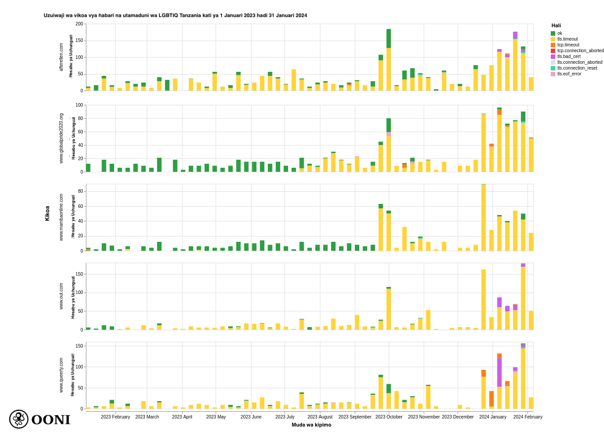

Ripoti hii imeonyesha udhibiti wa tovuti za LGBTIQ na aina nyingine za udhibiti zilizokusudiwa nchini Tanzania kutokana na uchambuzi wa [OONI data](https://explorer.ooni.org/chart/mat?test_name=web_connectivity&axis_x=measurement_start_day&since=2023-12-01&until=2024-01-31&time_grain=day&probe_cc=TZ). 



## **Matokeo muhimu** {#matokeo-muhimu}

Uchambuzi wetu wa [OONI data](https://explorer.ooni.org/chart/mat?probe_cc=TZ&since=2023-12-01&until=2024-01-31&time_grain=day&axis_x=measurement_start_day&test_name=web_connectivity) zilizokusanywa kutoka Tanzania zaidi ya mwaka jana (kati ya tarehe 1 Januari 2023 hadi tarehe 1 Januari 2024) umeonyesha kuwa [Uzuiaji wa kina wa tovuti za LGBTIQ](https://explorer.ooni.org/chart/mat?probe_cc=TZ&since=2023-12-01&until=2024-01-31&time_grain=day&axis_x=measurement_start_day&axis_y=domain&test_name=web_connectivity&category_code=LGBT), ambao unahusiana na [kuongezeka kwa ubaguzi na ukandamizaji wa jamii za LGBTIQ](https://www.ohchr.org/en/press-releases/2018/11/bachelet-tanzania-has-duty-protect-not-further-endanger-lgbt-people) kwa miaka ya hivi karibuni. Vizuizi vingi vimetambulika katika sehemu ya utafiti huu umeonekana umekusudiwa kiasilia, kwani wamehusisha tovuti maalum sana, huku tovuti nyingine (zinajozulikana zaidi) za aina hiyohiyo (mfano. Mitandao ya kijamii, haki za binadamu) zilipatikana.

Hususani [OONI data](https://explorer.ooni.org/chart/mat?probe_cc=TZ&since=2023-12-01&until=2024-01-31&time_grain=day&axis_x=measurement_start_day&test_name=web_connectivity) zilizokusanywa kutoka Tanzania zinaonyesha:

* **Uzuiaji wa tovuti nyingi za LGBTIQ**, zikiwemo:
  * Mitandao ya kijamii ya LGBTIQ (kama vile [Grindr](https://explorer.ooni.org/chart/mat?probe_cc=TZ&since=2023-12-01&until=2024-01-31&time_grain=day&axis_x=measurement_start_day&test_name=web_connectivity&domain=www.grindr.com))
  * Haki za LGBTIQ (kama vile [ILGA](https://explorer.ooni.org/chart/mat?probe_cc=TZ&since=2023-12-01&until=2024-01-31&time_grain=day&axis_x=measurement_start_day&test_name=web_connectivity&domain=ilga.org) na [OutRight International](https://explorer.ooni.org/chart/mat?probe_cc=TZ&since=2023-12-01&until=2024-01-31&time_grain=day&axis_x=measurement_start_day&test_name=web_connectivity&domain=outrightinternational.org))
  * Habari na utamaduni wa LGBTIQ (kama vile [Queerty](https://explorer.ooni.org/chart/mat?probe_cc=TZ&since=2023-12-01&until=2024-01-31&time_grain=day&axis_x=measurement_start_day&test_name=web_connectivity&domain=www.queerty.com))
  * Kuzuia kujiaua kwa LGBTIQ ([The Trevor Project](https://explorer.ooni.org/chart/mat?probe_cc=TZ&since=2023-12-01&until=2024-01-31&time_grain=day&axis_x=measurement_start_day&test_name=web_connectivity&domain=www.thetrevorproject.org))

* **Kuzuia tovuti za mtandaoni cha uchumba** (kama vile [Tinder](https://explorer.ooni.org/chart/mat?probe_cc=TZ&since=2023-12-01&until=2024-01-31&time_grain=day&axis_x=measurement_start_day&test_name=web_connectivity&domain=tinder.com) and [OKCupid](https://explorer.ooni.org/chart/mat?test_name=web_connectivity&axis_x=measurement_start_day&since=2023-01-01&until=2024-01-31&time_grain=day&probe_cc=TZ&domain=www.okcupid.com))
* **Kuzuia tovuti maalum zinazo tetea haki za binadamu kupitia miradi na maombi ya miradi** ([Change.org](https://explorer.ooni.org/chart/mat?probe_cc=TZ&since=2024-01-01&until=2024-04-02&time_grain=day&axis_x=measurement_start_day&test_name=web_connectivity&domain=www.change.org), [Global Fund for Women](https://explorer.ooni.org/chart/mat?probe_cc=TZ&since=2024-01-01&until=2024-04-02&time_grain=day&axis_x=measurement_start_day&test_name=web_connectivity&domain=www.globalfundforwomen.org), [GlobalGiving](https://explorer.ooni.org/chart/mat?probe_cc=TZ&since=2024-01-01&until=2024-04-02&time_grain=day&axis_x=measurement_start_day&test_name=web_connectivity&domain=www.globalgiving.org), [Open Society Foundations](https://explorer.ooni.org/chart/mat?probe_cc=TZ&since=2024-01-01&until=2024-04-02&time_grain=day&axis_x=measurement_start_day&test_name=web_connectivity&domain=www.opensocietyfoundations.org))
* **Kuzuia tovuti maalum za mitandao ya kijamii** ([Clubhouse](https://explorer.ooni.org/chart/mat?probe_cc=TZ&since=2023-12-01&until=2024-01-31&time_grain=day&axis_x=measurement_start_day&test_name=web_connectivity&domain=www.clubhouse.com) and [4chan](https://explorer.ooni.org/chart/mat?probe_cc=TZ&since=2023-12-01&until=2024-01-31&time_grain=day&axis_x=measurement_start_day&test_name=web_connectivity&domain=www.4chan.org))
* **Kuzuia VPN maalum** ([ProtonVPN](https://explorer.ooni.org/chart/mat?probe_cc=TZ&since=2023-12-01&until=2024-01-31&time_grain=day&axis_x=measurement_start_day&test_name=web_connectivity&domain=protonvpn.com))

Matokeo ya uchambuzi wetu yanaonyesha kuwa watoa huduma za mtandao wengi ISPs wa Tanzania wameonekana wakitekeleza uzuiaji kwa njia ya **kutingisha TLS**, hususani [kipindi cha kumaliza ujumbe baada ya ujumbe wa ClientHello wakati wa utingishaji wa TLS](https://explorer.ooni.org/m/20231115105434.199152_TZ_webconnectivity_1ffb687f15b476a0). Kama wakati wa uzuiaji na aina za URL zimezuiliwa (mara nyingi) huendelea katika mitandao (iliyopimwa, ISPs wa Tanzania hutekeleza uzuiaji kwa njia ya uratibu (yawezekana kupitia matumizi ya teknolojia ya ukaguzi wa kifurushi cha kina). 

## **Utangulizi** {#utangulizi}

Mwezi Septemba uliopita, tulipata nafasi ya kuhudhuria katika [Jukwaa la Uhuru wa Mtandao la Africa (FIFAfrica) 2023](https://internetfreedom.africa/) Dar es Salaam, Tanzania. Wakati wa mkutano, tulikutana na washiriki kutoka Tanzania, ambao walitujuza kuwa wameanza kushuhudia hali ya ongezeko la udhibiti wa mtandao nchini kwa miezi ya karibuni. 

Kazi zetu zinapojikita katika utafiti wa udhibiti wa mtandao kupitia uchambuzi wa [vipimo vya mtandao kwa watu wengi](https://ooni.org/data/) vilivyokusanywa ulimwenguni, tulikuwa na hamu ya kuona kama tunaweza kugundua dalili za kuongezeka kwa hali ya udhibiti wa mtandao nchini Tanzania katika mwaka uliopita —hasa kwa vile hatukuona udhibiti mwingi nchini Tanzania kwa miaka ya hivi karibuni (isipokuwa kwa matukio machache, kama vile [uzuijai wa mitandao ya kijamii wakati wa uchanguzi mkuu wa mwaka 2020](https://ooni.org/post/2020-tanzania-blocks-social-media-tor-election-day/)). 

Kama sehemu ya utafiti huu, tulichambua [data za vipimo vya mtandao vya OONI](https://explorer.ooni.org/chart/mat?test_name=web_connectivity&axis_x=measurement_start_day&since=2023-12-01&until=2024-01-31&time_grain=day&probe_cc=TZ) vilivyokusanywa kutoka Tanzania kati ya tarehe 1 Januari 2023 hadi tarehe 31 Januari 2024.Lengo letu lilikuwa kuchunguza ikiwa tunaweza kugundua dalili za ndani za udhibiti wa mtandao Tanzania kwa wakati huu. Kwa vile tulivutiwa zaidi na matukio ya udhibiti wa mtandao, ambayo yangekuwa na manufaa kwa umma na kuathiri haki za binadamu, tumeondoa matukio kadhaa (kama vile [uzuiaji wa kamari](https://explorer.ooni.org/search?since=2023-01-01&until=2024-01-31&only=anomalies&failure=false&probe_cc=TZ&category_code=GMB) na [tovuti za watu wazima](https://explorer.ooni.org/search?since=2023-01-01&until=2024-01-31&only=anomalies&failure=false&probe_cc=TZ&category_code=PORN)) kutokana na matokeo yaliyowasilishwa katika utafiti huu.

Maswali makuu amabyoyamefahamisha uchambuzi wetu wa [OONI data](https://explorer.ooni.org/chart/mat?test_name=web_connectivity&axis_x=measurement_start_day&since=2023-12-01&until=2024-01-31&time_grain=day&probe_cc=TZ) unahusisha:

* Tovuti zipi zimeonyesha dalili za uzuiaji nchni Tanzania kati ya tarehe 1 Januari 2023 hadi 31 Januari 2024? 
* Je kwenye mtandao gani tunaona uzuiaji huu? Uzuiaji huu unatofautiana vipi kwenye mitandao?
* Je ISPs nchini Tanzania hutekeleza vipi udhibiti huu? Mbinu gani za udhibiti ISPs hutumia?

Pia tunaangalia maoni ya jumla ya OONI data kutoka katika vipimo vya app za ujumbe wa papo kwa hapo ([WhatsApp](https://explorer.ooni.org/chart/mat?probe_cc=TZ&since=2023-01-01&until=2024-01-31&time_grain=day&axis_x=measurement_start_day&test_name=whatsapp), [Facebook Messenger](https://explorer.ooni.org/chart/mat?probe_cc=TZ&since=2023-01-01&until=2024-01-31&time_grain=day&axis_x=measurement_start_day&test_name=facebook_messenger), [Telegram](https://explorer.ooni.org/chart/mat?probe_cc=TZ&since=2023-01-01&until=2024-01-31&time_grain=day&axis_x=measurement_start_day&test_name=telegram)) na vifaa vya kukwepa udhibiti ([Tor](https://explorer.ooni.org/chart/mat?probe_cc=TZ&since=2023-01-01&until=2024-01-31&time_grain=day&axis_x=measurement_start_day&test_name=tor) na [Psiphon](https://explorer.ooni.org/chart/mat?probe_cc=TZ&since=2023-01-01&until=2024-01-31&time_grain=day&axis_x=measurement_start_day&test_name=psiphon)). Hatukujumuisha vipimo vilivyokusanywa kwenye vipimp vya [Signal](https://explorer.ooni.org/chart/mat?probe_cc=TZ&since=2023-01-01&until=2024-01-31&time_grain=day&axis_x=measurement_start_day&test_name=signal) kwa sababu viliathiriwa na [ubora wa data](https://github.com/ooni/probe/issues/2344) katika mwaka uliopita.

Mbinu na matokeo ya uchambuzi wetu yametolewa katika sehemu zifuatazo za ripoti hii. 

## **Mbinu** {#mbinu}

Tangu mwaka 2012, [Open Observatory of Network Interference (OONI)](https://ooni.org/) imetengeneza programu huru na huria (inayoitwa [OONI Probe](https://ooni.org/install/)) ambayo imetengenezwa [kupima aina mbalimbali za udhibiti wa mtandao](https://ooni.org/nettest/), uzuiaji wa tovuti na app. Kila mwezi, OONI Probe hupimwa mara kwa mara na watu wa kujitolea [karibu nchi 160](https://explorer.ooni.org/) (ikiwemo [Tanzania](https://explorer.ooni.org/country/TZ)), na vipimo vya mtandao vilivyokusanywa na watumiaji wa OONI Probe moja kwa moja huchapishwa kwenye [data za wazi katika muda halisi](https://ooni.org/data).

[OONI Probe](https://ooni.org/install/) inajumuisha [jaribio la web connectivity](https://ooni.org/nettest/web-connectivity/) ambayo imetengenezwa kupima uzuiaji wa aina nyingi za [tovuti](https://ooni.org/sw/support/faq#tovuti-zipi-nitapima-kama-zimedhibitiwa-kwa-kutumia-ooni-probe) (zilizojumuishwa kwa jamii, [orodha ya majaribio ya raia](https://github.com/citizenlab/test-lists/tree/master/lists)) yaliyoratibiwa na jamii. Hususani, [kipimo cha muunganisho wa tovuti](https://ooni.org/nettest/web-connectivity/) cha OONI kimeundwa kupima upatikanaji wa [URLs](https://github.com/citizenlab/test-lists/tree/master/lists) kwa kufuata hatua zifuatazo:

* Utambuzi uliotatuliwa
* Utambuzi wa DNS
* Unganisha TCP kwa anwani za IP zilizotatuliwa
* Kutingishwa kwa TLS kwa anwani za IP zilizotatuliwa
* Ombi la HTTP(s) GET kufuata maelekezo kwingine

Hatua za hapo juu hufanywa moja kwa moja kwa mtandao wa ndani wa mtumiaji, na kutoka eneo la udhibiti. Ikiwa matokeo kutoka katika mitandao yote miwili ni sawa, URL iliyopimwa hufafanuliwa kuwa inaweza kufikiwa. Ikiwa matokeo yatatofautiana, URL iliyopimwa hufafanuliwa kama [sio ya kawaida](https://ooni.org/sw/support/faq#isiyo-ya-kawaida-inamaanisha-nini), na iana ya hitilafu huangaziwa zaidi kutokana na sababu iliyosababisha kutofaulu (kwa mfano, kama muunganisho wa TCP utashindwa, vipimo hufafanuliwa kama hililafu ya TCP/IP).

[Vipimo visivyo vya kawaida](https://ooni.org/sw/support/faq#isiyo-ya-kawaida-inamaanisha-nini) vinaweza kuwa dalili ya kuzuia, lakini [matokeo chanya yasiyo halisi](https://ooni.org/sw/support/faq#majibu-yenye-makosa-ni-yapi) yanaweza kutokea. Kwa hiyo tunazingatia kuwa uwezekano wa kuzuia ni mkubwa zaidi ikiwa jumla ya wingi wa vipimo visivyo kawaida ni wa juu ikilinganishwa na hesabu ya vipimo vya jumla (ikilinganishwa na kiwango cha ASN ndani ya kipindi sawa kwa kila iana ya kipimo cha OONI Probe).

Kila [Web Connectivity](https://ooni.org/nettest/web-connectivity/) vipimo hutoa habari zaidi za mtandao (kama vile taarifa zinazohusiana na kutingishwa kwa TLS) zinazosaidia kwa kutathimini ikiwa kipimo kisicho cha kawaida, kinaonyesha dalili za kuzuia. Hivyo tunagawanya kulingana na sababu zilizosababisha hitilafu. (mfano. Kuweka upya muunganisho wakati wa utingishwaji wa TLS) na ikiwa ni thabiti hutoa ishara yenye nguvu zaidi ya uwezekano wa kuzuia. 

Kulingana na utabiri wa OONI, tunaweza moja kwa moja kuthibitisha uzuiaji wa tovuti kulingana na [alama za vidole](https://github.com/ooni/blocking-fingerprints) kama [kurasa iliyozuiwa](https://ooni.org/sw/support/glossary#kurasa-iliyozuiliwa) imeifadhiwa, au kama azimio la DNS hurejesha IP inayojulikana kuhusishwa na udhibiti. Ikiwa mbinu hii hutuwezesha [kuthibitisha moja kwa moja uzuiaji wa tovuti](https://explorer.ooni.org/search?since=2024-03-06&until=2024-04-06&only=confirmed&failure=false)katika nchi nyingi (kama vile [Indonesia](https://explorer.ooni.org/search?since=2023-08-10&until=2023-09-10&failure=false&probe_cc=ID&only=confirmed), [Russia](https://explorer.ooni.org/search?since=2023-08-10&until=2023-09-10&failure=false&probe_cc=RU&only=confirmed), na [Iran](https://explorer.ooni.org/search?since=2023-08-10&until=2023-09-10&failure=false&probe_cc=IR&only=confirmed)), kwa nchi nyingine kama Tanzania (amabapo ISPs hutekeleza udhibiti censorship kwa kutumia mbinu mbalimbali), tunachambua vipimo vya OONI visivyo vya kawaida na [kifaa cha chambuzi wa OONI data](https://github.com/ooni/data).

Kama sehemu ya utafiti huu, tulichambua [data za vipimo vya mtandao wa OONI](https://explorer.ooni.org/chart/mat?test_name=web_connectivity&axis_x=measurement_start_day&since=2023-12-01&until=2024-01-31&time_grain=day&probe_cc=TZ) vilivyokusanywa kutoka Tanzania kati ya tarehe **1 Januari 2023 hadi 31 Januari 2024**. Hasa tulijikita [uchambuzi](https://github.com/ooni/data) wetu katika [vipimo vya muunganisho wa mtandao](https://explorer.ooni.org/search?probe_cc=TZ&test_name=web_connectivity&since=2023-01-01&until=2024-01-31&failure=false) kwa sababu tulitaka kuchunguza kuzuiwa kwa tovuti tukijumlisha maoni kutoka kwa vipimo vya [WhatsApp](https://explorer.ooni.org/chart/mat?probe_cc=TZ&since=2023-01-01&until=2024-01-31&time_grain=day&axis_x=measurement_start_day&test_name=whatsapp), [Facebook Messenger](https://explorer.ooni.org/chart/mat?probe_cc=TZ&since=2023-01-01&until=2024-01-31&time_grain=day&axis_x=measurement_start_day&test_name=facebook_messenger), [Telegram](https://explorer.ooni.org/chart/mat?probe_cc=TZ&since=2023-01-01&until=2024-01-31&time_grain=day&axis_x=measurement_start_day&test_name=telegram), [Tor](https://explorer.ooni.org/chart/mat?probe_cc=TZ&since=2023-01-01&until=2024-01-31&time_grain=day&axis_x=measurement_start_day&test_name=tor) na [Psiphon](https://explorer.ooni.org/chart/mat?probe_cc=TZ&since=2023-01-01&until=2024-01-31&time_grain=day&axis_x=measurement_start_day&test_name=psiphon) haikuwasilisha idadi kubwa ya hitilafu wakati wa upimaji (kwa hivyo haitoi uthibitisho wa uchambuzi wa kina, ambao unalenga kuelewa ikiwa hitilafu siyo sahihi au dalili za kuzuiwa). Kama ilivyotajwa hapo awali, hatukujumuisha vipimo katika upimaji wa [Signal](https://explorer.ooni.org/chart/mat?probe_cc=TZ&since=2023-01-01&until=2024-01-31&time_grain=day&axis_x=measurement_start_day&test_name=signal) kwa sababu viliathiriwa na [matatizo ya ubora](https://github.com/ooni/probe/issues/2344) katika mwaka uliopita.

Tulijumuisha [vipimo visivyo vya kawaida vya muunganisho wa tovuti vilivyokusanywa kutoka Tanzania](https://explorer.ooni.org/search?since=2023-01-01&until=2024-01-31&only=anomalies&failure=false&probe_cc=TZ) kutokana na aina za kutofaulu (“dns”, “tcp_ip”, “http-failure”, “http-diff”) ili kutathimini kama vilikuwepo mara kwa mara (au kama aina za hitilafu zilitofautiana), kadri ya muendelezo wa aina za kutofaulu zinavyoonekana katika idadi kubwa ya vipimo hutoa ishara yenye nguvu za kuzuia. Vipimo vingi visivyo vya kawaida [viliwasilishwa](https://explorer.ooni.org/search?probe_cc=TZ&test_name=web_connectivity&since=2023-01-01&until=2024-01-31&failure=false&only=anomalies) “http-zimefeli”, kuashiria kwamba hitilafu zilisababishwa na kutofaulu wakati wa jaribio la HTTP. Tulichanganua zaidi hitilafu hizi ili kugundua hitilafu mahususi (kama vile “hitilafu_ya muunganisho_mpya” au “hitilafu_ya_kuisha_muda”) ambazo zingetuwezesha kubainisha uwezekano wa uzuiaji na tukajumlisha makosa ili kuchunguza kwa kiwango gani yalilingana katika vipimo vifaavyo kwa kila ASN iliyopimwa. 

Hii ilihusisha kuchambua maelezo ya mtandao kutoka kwa data ya TLS iliyotingishwa katika vipimo hivi ili kutathimini kama hitilafu hizo zilitokana na mwingiliano wa TLS. Kwa mfano, kipimo kinaweza kuonyesha kwamba azimio la DNS lilirejesha IPs thabiti, inawezekana kuunda muunganisho katika IPs zilizotatuliwa, lakini kipindi cha kutingishwa kwa TLS kiliisha baada ya ujumbe wa kwanza wa ClientHello (ambao haujasimbwa, na kusababisha “hitilafu_ya_kuisha_muda”. Ingawa tunaweza kuzingatia kuwa kipimo kama hicho kinaonyesha dalili za kuingiliwa kwa msingi wa TLS, tusingefikia hitimisho kutoka kwa kipimo kimoja pekee.

Kwa hivyo tulijumlisha makosa kubaini ikiwa asilimia kubwa ya vipimo visivyo vya kawaida kwa URL ilizopimwa iliwasilisha hitilafu sawa (mfano “hitilafu_ya_ukomo wa_muda wa tls”) ikilinganishwa na jumla ya kiasi cha kipimo kwenye mtandao mahususi, ndani ya kipindi kilichobainishwa. Kabla ya uwiano wa makosa thabiti unavyoongezeka (kutoka kwa vipimo visivyo vya kawaida) ukilinganisha na hesabu ya jumla ya vipimo, ndivyo ishara inavyoimarika (na imani yetu kubwa kwamba) kwamba ufikiaji wa kikoa kilichopimwa kimezuiwa (a), na (b) huzuiwa katika njia maalum. (mfano. Kuingiliwa kwa TLS).

Kama sehemu ya uchambuzi wetu, tuliondoa matukio ambayo yalitoa viashiria dhaifu. Hayo ni pamoja na matukio yenye vipimo vidogo (ikilinganishwa na kiwango cha jumla cha kipimo kwenye ASN iliyopimwa wakati wa uchambuzi), asilimia ndogo ya hitilafu (ukilinganishwa na kiasi cha jumla cha kipimo cha huduma iliyopimwa kwenye mtandao), sehemu kubwa ya aina ya hitilafu *zisizolingana*, pamoja na matukio ambayo yalibainishwa kuwa aina za matukio ya na kimakosa, vilevile na hitilafu zinazojulikana au matukio mengine (kama vile viwango vya kutofauli vya ulimwengu, kutokana na huduma zilizopimwa kupangishwa kwenye seva zisizotegemewa, au vipimo vilivyokusanywa kutoka mitandao isiyo aminika). Tulipoanza kutoa viashiria jinsi udhibiti hutekelezwa nchini Tanzania, (katika utafiti huu, tuligundua kuwa “hitilafu ya _ukomo wa_muda wa tls yalikuwepo katika idadi kubwa ya vipimo vilivyo na makosa) tulianza kuzingatia vipimo vilivyo na makosa tofauti kama viashiria dhaifu, (tulizingatia kama vipimo visivyo halis). Matokeo ya utafiti huu, yamepungua kwa vipimo ambavyo tulizingatia kuwasilisha viashiria venye nguvu zaidi kulingana na mbinu zetu za uchambuzi. 

### **Kukubali mapungufu** {#kukubali-mapungufu}

Utafiti huu umewasilisha aina kadhaa za vikwazo, vikiwemo:

* **Safu ya tarehe ya uchambuzi.** Matokeo yana mapungufu katika [vipimo vya OONI vilivyokusanywa kutoka Tanzania](https://explorer.ooni.org/chart/mat?test_name=web_connectivity&axis_x=measurement_start_day&since=2023-12-01&until=2024-01-31&time_grain=day&probe_cc=TZ) kati ya tarehe 1 Januari 2023 hadi tarehe 31 Januari 2024. Matokeo yake, utafiti kutoka kwenye vipimo vilivyokusanywa katika safu tofauti za tarehe yameondolewa kwenye tafiti hii.
* **Aina ya vipimo.** Matokeo yanahusisha zaidi vipimo vya OONI [Web Connectivity](https://ooni.org/nettest/web-connectivity/), zinazohusiana na upimaji wa udhibiti wa tovuti. Matokeo yake, Matokeo kutoka katika [majaribio mengine ya OONI Probe](https://ooni.org/nettest) (hususani yote ambayo hayajapima uzuiaji wa tovuti na programu tumizi) vimeondolewa kwenye tafiti hii.
* **Tovuti zilizopimwa.** Vipimo vina mapngufu zaidi kwa URLs ikiwemo orodha mbili za [orodha ya vipimo vya wananchi](https://github.com/citizenlab/test-lists/tree/master/lists): [orodha ya kimatifa](https://github.com/citizenlab/test-lists/blob/master/lists/global.csv) (ikiwemo URLs zilizokusudiwa) na [orodha ya Tanzania](https://github.com/citizenlab/test-lists/blob/master/lists/tz.csv) (URLs zilizokusudiwa Tanzania pekee). Orodha hii hupimwa na watumiaji [OONI Probe](https://ooni.org/install) na kuna vikwazo vya upimaji data, kwa ujumla zina mafungufu takribani URLs 1,000. Matokeo yake, orodha imeondoa tovuti nyingine ambazo zinaweza kuwa zimezuiliwa nchini Tanzania, na matokeo yamezuiliwa kwa vipimo vya URLs zikiwemo orodha hizi. Kwa kuzingatia kwamba orodha zimeratibiwa na jamii, tunakubali kutokuwa na usawa katika URLs zilizoongezwa kwenye orodha.
* **Upimaji wa maeneo ya tovuti.** Sio kila URLs zilizohusishwa kwenye [orodha ya vipimo](https://github.com/citizenlab/test-lists/tree/master/lists) zinapimwa sawa Tanzania nzima kwa muda. Iwe OONI data inapatikana katika tovuti husika inategemea na, mitandao ipi na lini mtumiaji wa [OONI Probe](https://ooni.org/install) wa Tanzania wamepima. Matokeo yake, tovuti zilizopimwa zilipokea vipimo vya maeneo tofauti kipindi chote cha uchambuzi, ambazo zimeathiri utafuti. 
* **ASNs zilizopimwa.** Wakati vipimo vya OONI Probe hufanywa mara kwa mara katika ASNs nyingi nchini Tanzania, sio mitandao yote hupimwa sawa. Japokuwa, upatiakanaji wa vipimo hutegemea mitandao ipi watumiaji wa [OONI Probe](https://ooni.org/install) wamejiunganisha kufanya vipimo. Matokeo yake, maeneo ya vipimo hutofautiana na ASNs kipindi chote cha uchambuzi, ambazo zimeathiri utafiti.
* **Viashiria vya uzuiaji.** Kama sehemu yetu ya uchambuzi wa data, tulipunguza utafiti wetu kwa viashiria vya kuaminika zaidi na dalili za udhibiti zilizoagizwa na serikali, huku tukiondoa matukio yaliyowasilishwa kama viashiria dhaifu (kama tulivyojadili katika kipengele cha “Mbinu”). Matokeo yake, tunakubali hatari ya uwezekano wa kukosa baadhi ya matukio ya uzuiaji katika utafiti wetu(Kama matukio yote vilifafanuliwa kwa viashiria thaifu kama sehemu ya uchambuzi wa data zetu).  

## **Matokeo** {#matokeo}

Uchambuzi wetu wa [vipimo vya OONI kutoka Tanzania](https://explorer.ooni.org/chart/mat?probe_cc=TZ&since=2023-01-01&until=2024-01-31&time_grain=day&axis_x=measurement_start_day&test_name=web_connectivity) kati ya tarehe 1 Januari 2023 hadi 31 Januari 2024 umeonyesha uzuiaji wa mitandao ya kijamii maalum ([Clubhouse](https://explorer.ooni.org/chart/mat?probe_cc=TZ&since=2023-12-01&until=2024-01-31&time_grain=day&axis_x=measurement_start_day&test_name=web_connectivity&domain=www.clubhouse.com) na [4chan](https://explorer.ooni.org/chart/mat?probe_cc=TZ&since=2023-12-01&until=2024-01-31&time_grain=day&axis_x=measurement_start_day&test_name=web_connectivity&domain=www.4chan.org)), tovuti maalum zinazo tetea haki za binadamu kupitia ruzuku (kama vile [GlobalGiving](https://explorer.ooni.org/chart/mat?probe_cc=TZ&since=2023-12-01&until=2024-01-31&time_grain=day&axis_x=measurement_start_day&test_name=web_connectivity&domain=www.globalgiving.org) na [Global Fund for Women](https://explorer.ooni.org/chart/mat?probe_cc=TZ&since=2023-12-01&until=2024-01-31&time_grain=day&axis_x=measurement_start_day&test_name=web_connectivity&domain=www.globalfundforwomen.org)) na maandiko ya miradi ([Change.org](https://explorer.ooni.org/chart/mat?probe_cc=TZ&since=2024-01-01&until=2024-04-02&time_grain=day&axis_x=measurement_start_day&test_name=web_connectivity&domain=www.change.org)), tovuti za mtandaoni za uchumba (kama vile [Tinder](https://explorer.ooni.org/chart/mat?probe_cc=TZ&since=2023-12-01&until=2024-01-31&time_grain=day&axis_x=measurement_start_day&test_name=web_connectivity&domain=tinder.com)), vilevile uzuiaji wa [ProtonVPN](https://explorer.ooni.org/chart/mat?probe_cc=TZ&since=2023-12-01&until=2024-01-31&time_grain=day&axis_x=measurement_start_day&test_name=web_connectivity&domain=protonvpn.com). 

Angalizo, OONI data imeangazia katika upana [uzuiaji wa tovuti za LGBTIQ](https://explorer.ooni.org/chart/mat?probe_cc=TZ&since=2023-12-01&until=2024-01-31&time_grain=day&axis_x=measurement_start_day&axis_y=domain&test_name=web_connectivity&category_code=LGBT) nchni Tanzania. Tovuti zilizozuiliwa zikiwemo mitandao ya kijamii ya LGBTIQ (kama vile [Grindr](https://explorer.ooni.org/chart/mat?probe_cc=TZ&since=2023-12-01&until=2024-01-31&time_grain=day&axis_x=measurement_start_day&test_name=web_connectivity&domain=www.grindr.com)), tovuti zinazotetea haki za LGBTIQ (kama vile [ILGA](https://explorer.ooni.org/chart/mat?probe_cc=TZ&since=2023-12-01&until=2024-01-31&time_grain=day&axis_x=measurement_start_day&test_name=web_connectivity&domain=ilga.org) na [OutRight International](https://explorer.ooni.org/chart/mat?probe_cc=TZ&since=2023-12-01&until=2024-01-31&time_grain=day&axis_x=measurement_start_day&test_name=web_connectivity&domain=outrightinternational.org)), habari na utamaduni wa LGBTIQ (kama vile [Queerty](https://explorer.ooni.org/chart/mat?probe_cc=TZ&since=2023-12-01&until=2024-01-31&time_grain=day&axis_x=measurement_start_day&test_name=web_connectivity&domain=www.queerty.com)), na tovuti za kujizuia kujiua za LGBTIQ ([The Trevor Project](https://explorer.ooni.org/chart/mat?probe_cc=TZ&since=2023-12-01&until=2024-01-31&time_grain=day&axis_x=measurement_start_day&test_name=web_connectivity&domain=www.thetrevorproject.org)). 

Udhibiti wote umegundulika katika mitandao mingi nchini Tanzania wakati wa kipindi cha uchambuzi. OONI data imeonyesha kuwa mitandao mingi, udhibiti umetekelezwa kwa njia ya **kuingilia TLS**, kwa tulivyo ona katika kipindi cha ukomo wa muda baada ya ujumbe wa ClientHello message wakati wa utingishwaji wa TLS. Muendelezo wa mbinu za udhibiti huu – ulionekana kwenye mitandao mingi – gives unatupa uhakika wa matokeo, na kushauri kuwa ISPs wa Tanzania wanaweza kuwa wanatumia teknolojia ya Deep Packet Inspection (DPI) kutekeleza uzuiaji. 

Taarifa zaidi zinatolewa katika vipengele vifuatavyo kwenye ripoti hii. 

### **Uzuiaji wa tovuti za LGBTIQ** {#uzuiaji-wa-tovuti-za-lgbtiq}

Haki za LGBTIQ rights zimezuiliwa vikali nchini Tanzania. Matendo ya ngono ya jinsia moja yaliyokubaliwa [yamewekwa hatiani chini ya vifungu vya kanuni za adhabu za wakati wa ukokoni wa Tanzania](https://database.ilga.org/api/downloader/download/1/TZ%20-%20LEG%20-%20Penal%20Code%20(1930,%20as%20published%20in%201981)%20-%20OR(en).pdf), na kifungo cha juu zaidi kinachohusisha kifungo cha maisha . Kwa majibu wa [jumuiya ya kimataifa ya wasagi, mashoga, wapenzi wa jinsia mbili na wenye jinsia tofuti (ILGA)](https://database.ilga.org/tanzania-lgbti), watu wa LGBTIQ nchini wanapitia vikwazo vya kisheria vya uhuru wa kujieleza na uhuru wa kujumuika, huku katiba ya Tanzania haiajweka wazi kulinda watu wa LGBTIQ dhidi ya ubaguzi. Kadhalika, [maelezo](https://database.ilga.org/tanzania-lgbti) ya ILGA sheria hiyo ya Tanzania haitio ulinzi kwa watu wa LGBTIQ dhidi ya ubaguzi katika utoaji wa bidhaa na huduma, afya, elimu, ajira au makazi. Pia [maelezo](https://database.ilga.org/tanzania-lgbti) ya ILGA sheria zinazotumika Tanzania haziongezei adhabu kwa uhalifu kwa missingi ya “mwenendo wa kijinsia”, “utambulisho wa kijinsia”, “uelezeaji wa kijinsia” au “sifa za gono” wala hazizingatii uhalifu huo kama “uahlifu wa chuki”. 

Kwa miaka ya hivi karibuni, jamii za LGBTIQ nchini Tanzania wamepitia ongezeko la ubaguzi na unyanyasaji. Watetezi wa haki za binadamu [wameripoti](https://www.hrw.org/report/2020/02/03/if-we-dont-get-services-we-will-die/tanzanias-anti-lgbt-crackdown-and-right) kuwa ukandamizaji wa serikali kwenye huduma za afya – kama vile kufunga vituo vilivyotoa huduma za upimaji wa VVU – zimathirika zaidi jamii za LGBTIQ nchini Tanzania. Kwa mhunibu wa OutRight International, serikali ya Tanzania ilianza [ukandamizaji dhidi ya watu wa LGBTIQ](https://outrightinternational.org/our-work/sub-saharan-africa/tanzania) Julai 2016, hali za haki za watu wa LGBTIQ Tanzania imeshuka kwa kazi tangu mwaka huo. 

Mwaka 2018, tume ya Afrika ya Dar es salaam iliapa kuunda [kikosi kazi cha kukamata watu wanaohisiwa kuwa mashoga](https://edition.cnn.com/2018/11/05/africa/tanzania-crackdown-on-gays-intl/index.html), inaripotiwa kusababisha wanajamii wa LGBT wa Tanzania kuhofia maisha yao, [kuficha makazi yao](https://www.theguardian.com/world/2018/nov/05/tanzania-gay-people-in-hiding-lgbt-activists-crackdown), na kukimbia nchi. Kwa kujibu, [Kamishna mkuu wa umoja wa mataifa wa haki za binadamu alionyesha tahadhari](https://www.ohchr.org/en/press-releases/2018/11/bachelet-tanzania-has-duty-protect-not-further-endanger-lgbt-people), onyo kuwa kikosi kazi hicho kinaweza “kugeuka kuwa kimetasfiriwa kama kibali cha kufanya unyanyasaji, vitisho, vurugu na ubaguzi dhidi ya watu wanaosemekana kuwa ni LGBT”. 

Kwa mujibu wa [watetezi wa haki za binadamu](https://www.hrw.org/report/2020/02/03/if-we-dont-get-services-we-will-die/tanzanias-anti-lgbt-crackdown-and-right), shinikizo la kimataifa limepelekea serikali ya Tanzania kupinga maoni ya afisa huyo kuhusu kikosi kazi, lakini chuki ya ushoga kitaasisi imebaki kama ilivyo na naibu waziri wa mambo ya ndani aliagiza kukamatwa kwa watu wa LGBT Mwezi Septemba 2019. Aprili 2023, Milembe Suleiman, mwanamke msagaji aliyejiweka wazi, [aliuwawa kikatili na kukatwa viungo vyake](https://southerndefenders.africa/2023/05/02/southerndefenders-calls-for-urgent-collective-action-to-end-lgbtiq-discrimination-and-targeted-violence-and-strongly-condemns-the-brutal-killing-of-milembe-suleiman-in-tanzania/) katika shambulio linaloshukiwa kuwa ni la chuki dhidi ya watu wa mapenzi ya jinsia moja.

Bila ulinzi wa kisheria katika hali ya hewa ya ubaguzi, jamii za LGBTIQ Tanzania wanazidi kukubana na vikwazo vya haki zao kwenye mitandao pia. Mwaka uliopita, serikali [iliripoti](https://minorityafrica.org/tanzanias-crackdown-on-lgbtq-rights-the-government-is-making-us-hide/) kuanza kukangamiza tovuti na mitandao ya kijamii zinazoendeleza haki za LGBTIQ, kupunguza ushiriki wa watu wa LGBTIQ mtandaoni bila kuhofia kufunguliwa mastaka.

Kama sehemu ya tafiti hii, tumechambua [vipimo vya mtandao vya OONI kutoka katika vipimo vya tovuti za LGBTIQ Tanzania](https://explorer.ooni.org/chart/mat?test_name=web_connectivity&axis_x=measurement_start_day&since=2023-12-01&until=2024-01-31&time_grain=day&probe_cc=TZ&axis_y=domain&category_code=LGBT) kati ya tarehe 1 Januari 2023 hadi 31 Januari 2024. Tumegundua tovuti nyingi za LGBTIQ zimezuiwa, zikiwemo mitandao ya kijamii ya LGBTIQ (kama vile [Grindr](https://explorer.ooni.org/chart/mat?probe_cc=TZ&since=2023-12-01&until=2024-01-31&time_grain=day&axis_x=measurement_start_day&test_name=web_connectivity&domain=www.grindr.com)), tovuti zinazotetea haki za LGBTIQ (kama vile [ILGA](https://explorer.ooni.org/chart/mat?probe_cc=TZ&since=2023-12-01&until=2024-01-31&time_grain=day&axis_x=measurement_start_day&test_name=web_connectivity&domain=ilga.org) na [OutRight International](https://explorer.ooni.org/chart/mat?probe_cc=TZ&since=2023-12-01&until=2024-01-31&time_grain=day&axis_x=measurement_start_day&test_name=web_connectivity&domain=outrightinternational.org)), habari na utamaduni wa LGBTIQ (kama vile [Queerty](https://explorer.ooni.org/chart/mat?probe_cc=TZ&since=2023-12-01&until=2024-01-31&time_grain=day&axis_x=measurement_start_day&test_name=web_connectivity&domain=www.queerty.com)), na tovuti za kuzuia kujiua kwa LGBTIQ ([The Trevor Project](https://explorer.ooni.org/chart/mat?probe_cc=TZ&since=2023-12-01&until=2024-01-31&time_grain=day&axis_x=measurement_start_day&test_name=web_connectivity&domain=www.thetrevorproject.org)). Taarifa zaidi zitatolewa katika vipengele vinavyofuata.

#### **Mitandao ya kijamii ya LGBTIQ** {#mitandao-ya-kijamii-ya-lgbtiq}

Data za OONI data zilizokusanywa kutoka Tanzania, zimeeleza kuwa ufikiaji angalau tovuti 3 za mitandao ya kijamii ya LGBTIQ [umezuiwa](https://explorer.ooni.org/chart/mat?probe_cc=TZ&since=2023-01-01&until=2024-01-31&time_grain=day&axis_x=measurement_start_day&axis_y=domain&test_name=web_connectivity&domain=www.planetromeo.com%2Cwww.grindr.com%2Chornet.com) kuanzia mapema mwaka 2023. Hasa, data za OONI zinaonyesha ufikiwaji wa Grindr (`www.grindr.com`), Romeo (`www.planetromeo.com`), na Hornet (`hornet.com`) umezuiwa.

[Chati](https://explorer.ooni.org/chart/mat?probe_cc=TZ&since=2023-01-01&until=2024-01-31&time_grain=day&axis_x=measurement_start_day&axis_y=domain&test_name=web_connectivity&domain=www.planetromeo.com%2Cwww.grindr.com%2Chornet.com) ifuatayo imejumlisha maeneo ya vipimo vya OONI kutoka kwenyevipimo vya [OONI Probe](https://ooni.org/install/) vya Grindr (`www.grindr.com`), Romeo (`www.planetromeo.com`), na Hornet (`hornet.com`) katika mitandao mingi Tanzania kati ya tarehe 1 Januari 2023 hadi 31 Januari 2024.

**Chati:** Vipimo vya OONI Probe vya Grindr (`www.grindr.com`), Romeo (`www.planetromeo.com`), na Hornet (`hornet.com`) nchini Tanzania kati ya tarehe 1 Januari 2023 hadi 31 Januari 2024 (chanzo: [OONI data](https://explorer.ooni.org/sw/chart/mat?test_name=web_connectivity&axis_x=measurement_start_day&since=2023-01-01&until=2024-01-31&time_grain=day&probe_cc=TZ&axis_y=domain&domain=www.planetromeo.com%2Cwww.grindr.com%2Chornet.com)).

Kama inavyo onekana, vipimo vingi vilivyokusanywa kutoka katika vipimo vya vikoa hivi 3 viliwasilisha [hitilafu](https://explorer.ooni.org/chart/mat?probe_cc=TZ&since=2023-01-01&until=2024-01-31&time_grain=day&axis_x=measurement_start_day&axis_y=domain&test_name=web_connectivity&domain=www.planetromeo.com%2Cwww.grindr.com%2Chornet.com), viliwasilisha dalili za uzuiwaji. Japokuwa, ni vyema kutambua kwamba jumla ya maeneo yote ya vipimo yalizuiliwa (yalitoa vikwazo kwenye matokeo), na tuliona ongezeko pekee la wingi wa vipimo kutoka Disemba 2023 na kuendelea (vile vile na ongezeko la muda la maeneo ya vipimo mwezi Septemba 2023). Hata hivyo, ukweli ni kwamba vipimo vingi (vilivyo kusanywa kwenye mitandao mingi) kipindi chote cha vipimo vilitoa hitilafu na kuonyesha kwamba upatikanaji unaweza kuwa umeingiliwa. 

Ili kuchunguza zaidi, tumechambua vipimo hivi kutambua sababu zilizopelekea hitilafu (ambazo zingesaidia kuainisha uzuiaji uliojitokeza) na kuondoa matokeo yasiyo halisi. Matokeo ya uchambuzi wetu yamewasilishwa katika chati ifuatayo. 

**Chati:** Uzuiaji wa tovuti za mitandao ya kijamii ya LGBTIQ Tanzania kati ya tarehe 1 Januari 2023 hadi 31 Januari 2024 (chanzo : [ooni/data](https://github.com/ooni/data)).

Chati ya hapo juu imetoa vipimo vya jumla vya OONI vya wiki vilivyokusanywa katika vipimo vya OONI Probe vya `www.grindr.com`, `www.planetromeo.com`, na`hornet.com` nchini Tanzania kati ya tarehe 1 Januari 2023 hadi 31 Januari 2024. Hasa, imetoa matokeo ya kina ya vipimo, ikionyesha kuwa vipimo vipi vyenye hililafu (mfano. Vyote ambavyo vinaeleza kama “OK”) viliwasilihsa `hitilafu ya ukomo wa muda wa tls. Katika uchabuzi wetu, hitilafu hizi zinahusisha matukio ambapo muunganisho wa TCP katika IPs zilizo tatuliwa zimefanikiwa, lakini mtingishiko wa TLS umeshindwa (kusababisha hitilafu ya ukomo wa muda wa TLS). Na hasa zaidi, katika matukio haya, data za OONI data zinaonyesha [mwisho wa muda wa kipindi baada ya ujumbe wa ClientHello wakati ya utingishwaji wa TLS](https://explorer.ooni.org/m/20231115105434.199152_TZ_webconnectivity_1ffb687f15b476a0). Matukio ya namna hiyo hutoa viashiria vya viwango vya uingiliwaji wa TLS. 

Katika kipindi cha uchambuzi, tulianza kuona hitilafu ya ukomo wa muda katika kipimo cha `www.planetromeo.com` tarehe 7 Januari 2023, huku tukianza kuona hitilafu hizo observe tarehe 21 Machi 2023 katika kipindi cha `www.grindr.com`. Tarehe 14 Julai 2023, tulianza kuona dalili za kuingiliwa kwa TLS katika kipimo cha `hornet.com` vilevile. Katika muendelezo, vipimo vingi vilivyokusanywa kutoka katika vipimo hivi 3 vya vikoa vimeendelea kutoa dalili zilezile za uzuiwaji: Kuingiliwa kwa TLS (imehusisha ukommo wa muda wa mtingisho wa TLS). 

Kufuatia hilo tumeendelea kuona kuwa vipimo vya Grindr (`www.grindr.com`), Romeo (`www.planetromeo.com`), na Hornet (`hornet.com`) matokeo yake katika hitilafu ile ile (kwenye mitandao mingi) katika kipindi cha muda mrefu, data za OONI zimetoa ishara kali za uzuiwaji. Hivi sasa data za OONI data zinaonyesha [uzuiwaji bado unaendelea](https://explorer.ooni.org/chart/mat?probe_cc=TZ&since=2024-01-01&until=2024-03-22&time_grain=day&axis_x=measurement_start_day&axis_y=domain&test_name=web_connectivity&domain=www.planetromeo.com%2Cwww.grindr.com%2Chornet.com). 

Hapo awali tulilipoti [uzuiwaji wa Grindr Tanzania](https://explorer.ooni.org/findings/203466718601). Data za OONI pia zilionyesha uzuiaji wa Grindr katika nchi nyingi, ikiwemo [Jordan](https://ooni.org/post/2023-jordan-blocks-grindr/), [Lebanon](https://explorer.ooni.org/chart/mat?probe_cc=LB&since=2024-02-22&until=2024-03-22&time_grain=day&axis_x=measurement_start_day&test_name=web_connectivity&domain=www.grindr.com), [Iran](https://explorer.ooni.org/chart/mat?probe_cc=IR&since=2024-02-22&until=2024-03-22&time_grain=day&axis_x=measurement_start_day&test_name=web_connectivity&domain=www.grindr.com), [Turkiye](https://explorer.ooni.org/chart/mat?probe_cc=TR&since=2024-02-22&until=2024-03-22&time_grain=day&axis_x=measurement_start_day&test_name=web_connectivity&domain=www.grindr.com), [Indonesia](https://ooni.org/documents/2021-lgbtiq-website-censorship-report/2021-lgbtiq-website-censorship-report-v2.pdf), [Pakistan](https://explorer.ooni.org/m/20240320151134.146365_PK_webconnectivity_f0e0eda753fe95f5), [Qatar](https://explorer.ooni.org/chart/mat?probe_cc=QA&since=2024-02-22&until=2024-03-22&time_grain=day&axis_x=measurement_start_day&test_name=web_connectivity&domain=www.grindr.com), na [United Arab Emirates](https://explorer.ooni.org/chart/mat?probe_cc=AE&since=2024-02-22&until=2024-03-22&time_grain=day&axis_x=measurement_start_day&test_name=web_connectivity&domain=www.grindr.com).

#### **Haki za LGBTIQ** {#haki-za-lgbtiq}

Data za OONI zimeonyesha kuwa upatikanaji katika tovuti nyingi ambazo zinatetea na kuhamasisha haki za jamii za LGBTIQ zimezuiwa Tanzania.

Hususani, Data za OONI zimeonyesha kuwa (angalau) **vikoa 12** vifuatavyo vinavyotetea haki za LGBTIQ zimezuiliwa Tanzania katika kipindi cha upimaji:

* [lgbtvoicetz.org](https://explorer.ooni.org/chart/mat?probe_cc=TZ&since=2023-01-01&until=2024-01-31&time_grain=day&axis_x=measurement_start_day&test_name=web_connectivity&domain=lgbtvoicetz.org)
* [outrightinternational.org](https://explorer.ooni.org/chart/mat?probe_cc=TZ&since=2023-01-01&until=2024-01-31&time_grain=day&axis_x=measurement_start_day&test_name=web_connectivity&domain=outrightinternational.org)
* [ilga.org](https://explorer.ooni.org/chart/mat?probe_cc=TZ&since=2023-01-01&until=2024-01-31&time_grain=day&axis_x=measurement_start_day&test_name=web_connectivity&domain=ilga.org)
* [www.ilga-europe.org](https://explorer.ooni.org/chart/mat?probe_cc=TZ&since=2023-01-01&until=2024-01-31&time_grain=day&axis_x=measurement_start_day&test_name=web_connectivity&domain=www.ilga-europe.org)
* [lgbt.foundation](https://explorer.ooni.org/chart/mat?probe_cc=TZ&since=2023-01-01&until=2024-01-31&time_grain=day&axis_x=measurement_start_day&test_name=web_connectivity&domain=lgbt.foundation)
* [lalgbtcenter.org](https://explorer.ooni.org/chart/mat?probe_cc=TZ&since=2023-01-01&until=2024-01-31&time_grain=day&axis_x=measurement_start_day&test_name=web_connectivity&domain=lalgbtcenter.org)
* [transequality.org](https://explorer.ooni.org/chart/mat?probe_cc=TZ&since=2023-01-01&until=2024-01-31&time_grain=day&axis_x=measurement_start_day&test_name=web_connectivity&domain=transequality.org)
* [itgetsbetter.org](https://explorer.ooni.org/chart/mat?probe_cc=TZ&since=2023-01-01&until=2024-01-31&time_grain=day&axis_x=measurement_start_day&test_name=web_connectivity&domain=itgetsbetter.org)
* [www.glsen.org](https://explorer.ooni.org/chart/mat?probe_cc=TZ&since=2023-01-01&until=2024-01-31&time_grain=day&axis_x=measurement_start_day&test_name=web_connectivity&domain=www.glsen.org)
* [www.familyequality.org](https://explorer.ooni.org/chart/mat?probe_cc=TZ&since=2023-01-01&until=2024-01-31&time_grain=day&axis_x=measurement_start_day&test_name=web_connectivity&domain=www.familyequality.org)
* [pflag.org](https://explorer.ooni.org/chart/mat?probe_cc=TZ&since=2023-01-01&until=2024-01-31&time_grain=day&axis_x=measurement_start_day&test_name=web_connectivity&domain=pflag.org)
* [www.stonewall.org.uk](https://explorer.ooni.org/chart/mat?probe_cc=TZ&since=2023-01-01&until=2024-01-31&time_grain=day&axis_x=measurement_start_day&test_name=web_connectivity&domain=www.stonewall.org.uk)

Kila viungo vya vikoa vya hapo juu kwa kulinganisha na data za OONI, zimeonyesha kuwa vipimo vyote vya vikoa katika [OONI Probe](https://ooni.org/install/) vimewasilisha viwango vingi vya hitilafu katika kipindi cha upimaji (kati ya tarehe 1 Januari 2023 hadi 31 Januari 2024), imetoa ishara ya uzuiwaji. Kuchanganua kama hitilafu hizi kulikua na dalili za udhibiti au matokeo chanya yasiyo sahihi, tumechambua data za OONI data kutambua sababu za kwa nini hitilafu hizi zimejitokeza. Matokeo ya uchambuzi wetu yamewasilishwa katika chati ifuatayo, ambayo imetoa maeneo ya vipimo vya OONI vya jumla kwa vikoa 12 vya hapo juu kati ya Januari 2023 hadi Januari 2024.

**Chati:** Uzuiaji wa vikoa vinavyotetea haki za LGBTIQ Tanzania kati ya tarehe 1 Januari 2023 hadi 31 Januari 2024 (chanzo: [ooni/data](https://github.com/ooni/data)).

Hivyo hivyo katika uzuiwaji wa tovuti za mitandao ya kijamii ya LGBTIQ (iliyojadiliwa hapo awali), tumegundua kuwa hitilafu ya vipimo vingi vilionysha `hitilafu ya ukomo wa muda wa tls` katika kipindi chote cha upimaji. Katika matukio haya, Data za OONI zimeonyesha [ukomo wa muda wa kipindi baada ya ujumbe wa ClientHello wakati wa utingishwaji wa TLS](https://explorer.ooni.org/m/20240127125649.370971_TZ_webconnectivity_db56789f73aabc32), inatoa ishara ya kiwango cha uingiliwaji wa TLS. Katika aina hii ya kutofaulu (`hitilafu ya ukomo wa muda wa tls`) unaendelea katika kipindi cha upimaji katika mitandao mingi nchini Tanzania (kwenye vikoa vingi), vipimo hutoa ishara kali ya uzuiwaji. 

Ni vyema kuangazia wakati data za OONI zinaonyesha kuwa vikoa hivi hapo awali vilipatikana (viliwasilishwa kwa kijani kama “OK” katika chati ya juu), vikoa vingi vya chati ya juu vilianza kuonyesha ishara za kuingiliwa kwa TLS kati ya Februari 2023 hadi Machi 2023. Hii inaambatana wakati wa [uzuiaji wa Grindr](https://explorer.ooni.org/findings/203466718601) (ambao umeonekana [kuanza Machi 2023](https://explorer.ooni.org/chart/mat?test_name=web_connectivity&axis_x=measurement_start_day&since=2023-01-16&until=2023-11-24&time_grain=day&probe_cc=TZ&domain=www.grindr.com), kwa mujibu wa data za OONI), imeeleza kuwa ISPs wa Tanzania wanaweza kupokea maagizo kuzuia (zaidi) tovuti za LGBTIQ katika muda huo. 

Zingatia, vikoa vilivyozuiwa vikiwemo **LGBT Voice Tanzania** ([lgbtvoicetz.org](https://explorer.ooni.org/chart/mat?probe_cc=TZ&since=2023-01-01&until=2024-01-31&time_grain=day&axis_x=measurement_start_day&test_name=web_connectivity&domain=lgbtvoicetz.org)), ambayo inafanya kazi ya [kuboresha usawa, utofauti, elimu na haki za watu wa LGBT Tanzania](https://lgbtvoicetz.org/who-we-are/) tangu mwaka 2009. Kama sehemu ya [kazi](https://lgbtvoicetz.org/what-we-do/)yao, wanalinda nakuhamasisha haki za watu wa LGBTIQ nchini Tanzania kupitia uchechemuzi wa kisiasa, wanatoa msaada wa huduma za afya (kama vile miradi ya kliniki), na wanatoa msaada wa bure wa kisheria na msaada wa darula kwa jamii za LGBTIQ Tanzania (miongoni mwa huduma na shughuli nyingine). Data za OONI zinaeleza kuwa ISPs wa Tanzania [walianza uzuiaji](https://explorer.ooni.org/chart/mat?probe_cc=TZ&since=2023-01-01&until=2024-01-31&time_grain=day&axis_x=measurement_start_day&test_name=web_connectivity&domain=lgbtvoicetz.org) wa upatikanaji wa tovuti tarehe 7 Februari 2023.

Vikoa vilivyo zuiwa vikiwemo pia vyote vya taasisi za haki za LGBTIQ za kimataifa. Zikiwemo [OutRight International](https://explorer.ooni.org/chart/mat?probe_cc=TZ&since=2023-01-01&until=2024-01-31&time_grain=day&axis_x=measurement_start_day&test_name=web_connectivity&domain=outrightinternational.org), shirika la kimataifa lisilo la kiserikali [defending LGBTIQ rights globally](https://outrightinternational.org/) tangu mwaka 1990, ambayo imetambua hali ya mashauriano ya umoja wa mataifa.

OutRight International inafanya kazi katika ngazi za kimataifa, kikanda na kitaifa koundoa mateso, ukosefu wa usawa na unyanyasaji wa wasagaji, mashoga, watu wa jinsia mbili, waliobadilisha jinsia na watu wa jinsia tofauti (LGBTIQ) wanayoyapitia uimwenguni. OutRight inajengea uwezo harakati za LGBTIQ, inaripoti uvunjifu wa haki za binadamu, watetezi wa ujumuishi na usawa, na inawajibisha viongozi kwa kulinda haki za watu wa LGBTIQ kila mahali. Hapo awali tulishirikiana na OutRight International katika [tafiti](https://ooni.org/documents/2021-lgbtiq-website-censorship-report/2021-lgbtiq-website-censorship-report-v2.pdf) hii ambayo imechunguza uzuiwaji wa tovuti za LGBTIQ katika nchi 6. Katika kipindi cha uchambuzi, Data za OONI zimeeleza kuwa ISPs wa Tanzania [wameanza uzuiaji](https://explorer.ooni.org/chart/mat?test_name=web_connectivity&axis_x=measurement_start_day&since=2023-01-01&until=2024-01-31&time_grain=day&probe_cc=TZ&domain=outrightinternational.org) wa upatikanaji wa `outrightinternational.org` tarehe 25 Aprili 2023.

Vikoa vilivyozuiwa vimehusisha pia ([ilga.org](https://explorer.ooni.org/chart/mat?probe_cc=TZ&since=2023-01-01&until=2024-01-31&time_grain=day&axis_x=measurement_start_day&test_name=web_connectivity&domain=ilga.org) na [www.ilga-europe.org](https://explorer.ooni.org/chart/mat?probe_cc=TZ&since=2023-01-01&until=2024-01-31&time_grain=day&axis_x=measurement_start_day&test_name=web_connectivity&domain=www.ilga-europe.org)) ya [Jumuiya ya kimataifa ya wasagaji,mashoga, wenye jinsia mbili, waliobadili jinsia na wenye jinsia tofauti(ILGA)](https://ilga.org/), ambayo ni shirikisho la ulimwenguni [zaidi ya taasisi 1,900 kutoka nchi na meneo160](https://ilga.org/about-us/)wakifanya kampeni ya haki za wasagaji, mashoga,wenye jinsia mbili, waliobadili jinsia. Ilipoanzishwa mwaka 1978, ILGA World ina hali ya mashauriano ya ECOSOC ya umoja wa taifa. Katika kipindi cha uchambuzi, Data za OONI zimeeleza kuwa ISPs wa Tanzania [walianza kuzuia](https://explorer.ooni.org/chart/mat?test_name=web_connectivity&axis_x=measurement_start_day&since=2023-01-01&until=2024-01-31&time_grain=day&probe_cc=TZ&domain=ilga.org) `ilga.org` tarehe 7 Februari 2023, na [walianza kuzuia](https://explorer.ooni.org/chart/mat?test_name=web_connectivity&axis_x=measurement_start_day&since=2023-01-01&until=2024-01-31&time_grain=day&probe_cc=TZ&domain=www.ilga-europe.org) `www.ilga-europe.org` tarehe 23 Machi 2023.

Zaidi ya vikoa 12 vilivyozuiwa vilivyopo kwenye chati ya hapo juu, **vikoa 5 vya nyongeza** vifuatavyo vimewasilisha aina nyingi ya hitilafu katika kipindi cha upimaji:

* [lambdalegal.org](https://explorer.ooni.org/chart/mat?probe_cc=TZ&since=2023-01-01&until=2024-01-31&time_grain=day&axis_x=measurement_start_day&test_name=web_connectivity&domain=lambdalegal.org)
* [www.glaad.org](https://explorer.ooni.org/chart/mat?probe_cc=TZ&since=2023-01-01&until=2024-01-31&time_grain=day&axis_x=measurement_start_day&test_name=web_connectivity&domain=www.glaad.org)
* [lgbtmap.org](https://explorer.ooni.org/chart/mat?probe_cc=TZ&since=2023-01-01&until=2024-01-31&time_grain=day&axis_x=measurement_start_day&test_name=web_connectivity&domain=lgbtmap.org)
* [www.hrc.org](https://explorer.ooni.org/chart/mat?probe_cc=TZ&since=2023-01-01&until=2024-01-31&time_grain=day&axis_x=measurement_start_day&test_name=web_connectivity&domain=www.hrc.org) 
* [www.nclrights.org](https://explorer.ooni.org/chart/mat?probe_cc=TZ&since=2023-01-01&until=2024-01-31&time_grain=day&axis_x=measurement_start_day&test_name=web_connectivity&domain=www.nclrights.org)

Japokuwa, tuliyaondoa matukio haya kwenye matokeo muhumu yaliyo wasilishwa katika chati ya hapo juu kwa sababu hata tovuti hizi zinazoendeshwa kwenye HTTPS, zilipimwa kwenye HTTP tu – iliyoleta vikwazo vya uwezo wetu wa kugundua uzuiaji wao (mfano. Kutambua TLS iliyoingiliwa). Hivyo, vipimo vinavyohusiana na vikoa 5 vya hapo juu haviwezi kuonyesha kama kuingiliwa kwa TLS kulitokea (kutambua hilo yatahitaji upimaji wa tovuti kwenye HTTPS), lakini havikuonyesha kuwa [majaribio ya HTTP yalipelekea hitilafu wa ukomo wa muda](https://explorer.ooni.org/m/20240127163726.121029_TZ_webconnectivity_90ef5782e53f36c6), ambayo ni muendelezo wa aina ya hitilafu iliyoonekana kwenye vikoa vilivyozuiwa vilivyoendeshwa kwa HTTPS.

Japokuwa uwezo wetu wa kutambua na kuthibitsiha uzuiwaji wa vikoa 5 vya hapo juu ni mdogo (kwa sababu vilipimwa na HTTP), sababu zifuatazo zinatoa viashiria vya uzuiwaji:

* **Kiasi cha hitilafu:** Waliwasilisha kiasi kikubwa cha hitilafu katika kipindi chote cha uchambuzi;
* **Tarehe ya kuanza kwa hitilafu:** Walianza kuwasilisha hitilafu wakati wa kipindi hicho hicho (Februari 2023 hadi Machi 2023) kama ilivyo katika orodha ya vikoa 12 listed katika chati iliyopita;
* **Aina ya hitilafu:** Uwepo wa hitilafu ya ukomo wa muda wakati wa jaribio la HTTP ni uendelezo wa na aina ya hitilafu zilizo onekana wakati vikoa (vingine) vilivyozuiwa vilipimwa kwenye HTTPS (ukomo wa muda wakati wa kutingihika kwa TLS).

Hivyo inawezekana kabisa kuwa [lambdalegal.org](https://explorer.ooni.org/chart/mat?probe_cc=TZ&since=2023-01-01&until=2024-01-31&time_grain=day&axis_x=measurement_start_day&test_name=web_connectivity&domain=lambdalegal.org), [www.glaad.org](https://explorer.ooni.org/chart/mat?probe_cc=TZ&since=2023-01-01&until=2024-01-31&time_grain=day&axis_x=measurement_start_day&test_name=web_connectivity&domain=www.glaad.org), [lgbtmap.org](https://explorer.ooni.org/chart/mat?probe_cc=TZ&since=2023-01-01&until=2024-01-31&time_grain=day&axis_x=measurement_start_day&test_name=web_connectivity&domain=lgbtmap.org), [www.hrc.org](https://explorer.ooni.org/chart/mat?probe_cc=TZ&since=2023-01-01&until=2024-01-31&time_grain=day&axis_x=measurement_start_day&test_name=web_connectivity&domain=www.hrc.org), na [www.nclrights.org](https://explorer.ooni.org/chart/mat?probe_cc=TZ&since=2023-01-01&until=2024-01-31&time_grain=day&axis_x=measurement_start_day&test_name=web_connectivity&domain=www.nclrights.org) ilizuiliwa Tanzania vilevile katika kipindi cha upimaji.

#### **Habari na utamaduni wa LGBTIQ** {#habari-na-utamaduni-wa-lgbtiq}

Data za OONI data zinaeleza kuwa angalau vikoa 5 vya habari na utamaduni wa LGBTIQ (`afterellen.com`, `www.mambaonline.com`, `www.globalpride2020.org`, `www.out.com`, `www.queerty.com`) vimezuiliwa Tanzania katika kipindi chote cha uchambuzi.

[Chati](https://explorer.ooni.org/chart/mat?probe_cc=TZ&since=2023-01-01&until=2024-01-31&time_grain=day&axis_x=measurement_start_day&axis_y=domain&test_name=web_connectivity&domain=afterellen.com%2Cwww.mambaonline.com%2Cwww.globalpride2020.org%2Cwww.out.com%2Cwww.queerty.com) ifuatayo imejumlisha maeneo ya vipimo vya OONI kwenye vipimo vya [OONI Probe](https://ooni.org/install/) vya vikoa hivi katika mitandao mingi Tanzania kati ya tarehe 1 Januari 2023 hadi 31 Januari 2024.

**Chati:** Vipimo vya OONI Probe vya `afterellen.com`, `www.mambaonline.com`, `www.globalpride2020.org`, `www.out.com`, `www.queerty.com` nchini Tanzania kati ya tarehe 1 Januari 2023 hadi 31 Januari 2024 (chanzo: [OONI data](https://explorer.ooni.org/sw/chart/mat?test_name=web_connectivity&axis_x=measurement_start_day&since=2023-01-01&until=2024-01-31&time_grain=day&probe_cc=TZ&axis_y=domain&domain=afterellen.com%2Cwww.mambaonline.com%2Cwww.globalpride2020.org%2Cwww.out.com%2Cwww.queerty.com)).

Kama ilivyothibitika katika chati ya hapo juu, vikoa hivi 5 viliwasilishwa kiasi kikubwa cha hitilafu kwa miezi ya hivi karibuni (inatoa ishara ya uzuiwaji), lakini kila ikianza kuwasilisha hitilafu katika muda tofauti. Katika kipindi cha upimaji, [kipimo cha afterellen.com](https://explorer.ooni.org/chart/mat?probe_cc=TZ&since=2023-01-01&until=2024-01-31&time_grain=day&axis_x=measurement_start_day&test_name=web_connectivity&domain=afterellen.com) kilianza kuonyesha hitilafu tarehe 3 Januari 2023, the[ kipimo cha www.queerty.com](https://explorer.ooni.org/chart/mat?probe_cc=TZ&since=2023-01-01&until=2024-01-31&time_grain=day&axis_x=measurement_start_day&test_name=web_connectivity&domain=www.queerty.com) kilianza kuonyesha hitilafu tarehe 7 Januari 2023, [kipimo cha www.out.com](https://explorer.ooni.org/chart/mat?probe_cc=TZ&since=2023-01-01&until=2024-01-31&time_grain=day&axis_x=measurement_start_day&test_name=web_connectivity&domain=www.out.com) kilianza kuonyesha hitilafu tarehe 5 Februari 2023, [kipimo cha www.globalpride2020.org](https://explorer.ooni.org/chart/mat?probe_cc=TZ&since=2023-01-01&until=2024-01-31&time_grain=day&axis_x=measurement_start_day&test_name=web_connectivity&domain=www.globalpride2020.org) kilianza kuonyesha hitilafu tarehe 14 Julai 2023, na [kipimo cha www.mambaonline.com](https://explorer.ooni.org/chart/mat?probe_cc=TZ&since=2023-01-01&until=2024-01-31&time_grain=day&axis_x=measurement_start_day&test_name=web_connectivity&domain=www.mambaonline.com) kilianza kuonyesha hitilafu tarehe 18 Septemba 2023. 

Tumechambua vipimo hivi vyenye hitilafu kutambua sababu za kuwepo kwa hitilafu, kuainisha uzuiaji maalum, na kuondoa majibu chanya yasiyo sahihi. Matokeo ya uchambuzi wetu yamewasilishwa kupitia chati ifuatayo.

**Chati:** Uzuiwaji wa vikoa vya habari na utamaduni wa LGBTIQ Tanzania kati ya 1 Januari 2023 hadi 31 Januari 2024 (chanzo: [ooni/data](https://github.com/ooni/data)).

Hivyo hivyo uzuiwaji wa mitandao ya kijamii na tovuti za haki za biandamu za LGBTIQ (zilizojadiliwa hpo awali), tumegundua kwamba vipimo vingi vyenye hitilafu vimewasilishwa `hitilafu ya ukomo wa muda wa tls`. Katika matukio haya, data za OONI zimeonyesha [ukomo wa muda wa kipindi baada ya ujumbe wa ClientHello wakati wa utingishwaji wa TLS](https://explorer.ooni.org/m/20231220085606.468253_TZ_webconnectivity_f3285ae3611169ab), umeeleza kuwa upatikanaji wa tovuti hizi zimezuiwa kwa njia ya kuingilia TLS. Kwa kuwa tumeziona hitilafu (`hitilafu ya ukomo wa muda wa tls`) kuna muendelezo waongezeko la vipimo vingivya vikoa vilivyozuiwa vimeongeza juhudi zetu za kutambua upatikanaji wa vikoa hivi (vilivytolewa katika chati ya hapo juu) vilizuiwa Tanzania katika kipindi cha upimaji. 

Vikoa vilivyozuiwa vikiwemo [MambaOnline](https://explorer.ooni.org/chart/mat?probe_cc=TZ&since=2023-01-01&until=2024-01-31&time_grain=day&axis_x=measurement_start_day&test_name=web_connectivity&domain=www.mambaonline.com) (`www.mambaonline.com`), tovuti inayoongoza kwa habari za mtindo wa LGBTIQ Afrika Kusini, ambayo ilichapisha [makala](https://www.mambaonline.com/2017/02/27/killing-lgbt-community-says-tanzanian-activist/) ikijadili kufungiwa kwa vitendea kazi vya HIV Tanzania na athari zake kwa jamii za LGBTIQ nchini humo. Vikoa vya tovuti vilivyozuiliwa zimehusisha pia [Global Pride 2020](https://explorer.ooni.org/chart/mat?probe_cc=TZ&since=2023-01-01&until=2024-01-31&time_grain=day&axis_x=measurement_start_day&test_name=web_connectivity&domain=www.globalpride2020.org) (`www.globalpride2020.org`), ambayo ilizinduliwa Aprili 2020 – ili kukabiliana na janga la COVID-19 – kwa lengo la kuleta jumuiya za LGBTIQ duniani kote pamoja. 

#### **Kuzuia kujiua kwa LGBTIQ** {#kuzuia-kujiua-kwa-lgbtiq}

Data za OONI zilizokusanywa kutoka Tanzania zinaeleza kuwa upatikanaji wa mradi wa Trevor (`www.thetrevorproject.org`) [umezuiwa](https://explorer.ooni.org/chart/mat?probe_cc=TZ&since=2023-01-01&until=2024-01-31&time_grain=day&axis_x=measurement_start_day&test_name=web_connectivity&domain=www.thetrevorproject.org) Tanzania. Iliyoanzishwa mwaka 1998, [The Trevor Project](https://www.thetrevorproject.org/) ni shirika linaloongoza la kuzuia kujiua kujiua na kuingilia kati migogoro kwa vijana wa LGBTIQ. Wanatoa huduma nyingi, zikiwemo nambari ya simu ya bure ambapo ushauri wa siri hutolewa na washauri waliofunzwa, vilevile na [jumuiya ya mitandao ya kijamii](https://www.trevorspace.org/) kwa vijana wa LGBTIQ.

Uzuiaji wa `www.thetrevorproject.org` umeonekana ulianza tarehe 7 Februari 2023, ambavyo data za OONI zimetoa muendelezo wa viashiria vya uzuiwaji. [Chati](https://explorer.ooni.org/chart/mat?probe_cc=TZ&since=2023-01-01&until=2024-01-31&time_grain=day&axis_x=measurement_start_day&test_name=web_connectivity&domain=www.thetrevorproject.org) ifuatatayo imejumlisha maeneo ya vipimo vya OONI kutoka vipimo vya [OONI Probe](https://ooni.org/install/) vya `www.thetrevorproject.org` kwenye [mitandao 15](https://explorer.ooni.org/chart/mat?probe_cc=TZ&since=2023-01-01&until=2024-01-31&time_grain=day&axis_x=measurement_start_day&axis_y=probe_asn&test_name=web_connectivity&domain=www.thetrevorproject.org) Tanzania kati ya tarehe 1 Januari 2023 hadi 31 Januari 2024.

**Chati:** Vipimo vya OONI Probe vya Trevor Project ([www.thetrevorproject.org](http://www.thetrevorproject.org)) Tanzania kati ya tarehe 1 Januari 2023 hadi 31 Januari 2024 (chanzo: [OONI data](https://explorer.ooni.org/sw/chart/mat?test_name=web_connectivity&axis_x=measurement_start_day&since=2023-01-01&until=2024-01-31&time_grain=day&probe_cc=TZ&domain=www.thetrevorproject.org)).

Katika kipindi chote muda mwingi wa vipimo, tovuti ilipokea vipimo vichache vya maeneo kutoka kwa watumiaji wa [OONI Probe](https://ooni.org/install/) Tanzania, japokuwa tuliona vipimo vingi kuanzia tarehe 7 Februari 2023 na kuendelea ilianza kuonyesha [hitilafu](https://ooni.org/support/interpreting-ooni-data/#anomalies) (hivyo, viashiria vya uwezekano wa uzuiwaji). Tuliona ongezeko la upimaji tarehe 18 Disemba 2023, na ongezeko la thabiti la maeneo ya vipimo (ambayo imeendelea kutoa hitilafu na viashiria vya uzuiwaji).

Tumechambua vipimo vyenye hitilafu na tumegundua kwamba vipimo vingi vimeonyesha `hitilafu ya ukomo wa muda wa tls`. Hasa, OONI data zimeonyesha [ukomo wa muda wa kipindi baada ya ujumbe wa ClientHello wakati wa utingishaji wa TLS](https://explorer.ooni.org/m/20231219232716.176215_TZ_webconnectivity_1b69b4c22f045ba1), unaeleza kuwa upatiakanaji wa `www.thetrevorproject.org` umezuiwa Tanzania kwa njia ya kuingilia TLS. 

Chati ifuatayo imeonyesha matokeo ya uchambuzi wetu, kutoa uchanganuzi wa kila-ASN ya maeneo ya vipimo. Tuna chati chache za ASNs 7 za juu ambazo zimeonysha maeneo makubwa ya vipimo wakati wa uchambuzi (kuongeza utendaji wetu katika utafiti). 

**Chati:** Uzuiwaji wa Trevor Project (`www.thetrevorproject.org`) Tanzania kati ya tarehe 1Januari 2023 hadi 31 Januari 2024 (chanzo: [ooni/data](https://github.com/ooni/data)).

Kama ilivyothibitika katika chati ya hapo juu, vipimo vingi vya `www.thetrevorproject.org` viliendelea kutoa `hitilafu za ukomo wa muda wa tls` katika ASNs zote 7 katika kipindi chote cha upimaji. Hii inaeleza kuwa ISPs tofauti wa Tanzania wametumia mbinu hiyo hiyo ya uzuiaji, inawezekana wametumia mbinu (inayofanana) ya uchambuzi wa maudhui yanapopita katika mtandao (DPI) kutekeleza uzuiaji. Zaidi, tuliona kuwa muda wa uzuiwaji ulianza katika muda huo huo (kati ya Februari 2023 hadi Machi 2023) kwa kuanzia ASNs 3. Hii inapendekeza zaidi sera za uzuiaji zilizoratibiwa.

Kwa ujumla, uzuiwaji wa `www.thetrevorproject.org` unaweza kuwa sehemu ya maagizo ya uzuiaji kama ambavyo hutokea katika vikoa vingi vinavyohusiana na LGTIQ, kama ilivyo pendekezwa na muda wa uzuiaji (tulianza kuona `hitilafu ya ukomo wa muda wa TLS` tarehe 7 Februari 2023, pamoja na uzuiwaji wa vikoa vingi zinavyo husiana na LGBTIQ, kama ilivyojadiliwa hapo awali). 

### **Uzuiaji wa tovuti zinazo saidia haki za binadamu** {#uzuiaji-wa-tovuti-zinazo-saidia-haki-za-binadamu}

Tovuti nyingi zinazotetea haki za binadamu kupitia ruzuku na maandiko ya miradi pia zilionekana zimezuiwa nchini Tanzania katika sehemu ya uchambuzi wetu. Tovuti hizo zikiwemo [Change.org](https://www.change.org/) (jukwaa kubwa zaidi duniani la mabadiliko ya kijamii, linalosaidia watumiaji kutengeneza na kusaini maandiko ya miradi ya masuala mbalimbali ya haki za jamii na haki za binadamu), [Global Fund for Women](https://www.globalfundforwomen.org/) (shirika lisilo la kiserikali linalotoa ufadhili wa harakati za usawa wa kijinsia), [GlobalGiving](https://www.globalgiving.org/) (shirika lisilo la kiserikali linalotoa jukwaa la kimataifa la ufadhili wa miradi ya kutoa misaada), na [Open Society Foundations](https://www.opensocietyfoundations.org/) (mfadhili mkubwa zaidi duniani wa vikundi huru vinavofanya kazi kwa ajili ya haki, utawala, demokrasia na haki za binadamu).

Hasa, data za OONI [zinaeleza kuwa](https://explorer.ooni.org/chart/mat?probe_cc=TZ&since=2023-01-01&until=2024-01-31&time_grain=day&axis_x=measurement_start_day&axis_y=domain&test_name=web_connectivity&domain=www.change.org%2Cwww.globalfundforwomen.org%2Cwww.globalgiving.org%2Cwww.opensocietyfoundations.org) upatikanaji wa `www.change.org`, `www.globalfundforwomen.org`, `www.globalgiving.org`, na `www.opensocietyfoundations.org` ulizuiwa Tanzania katika kipindi cha uchambuzi. [Chati](https://explorer.ooni.org/chart/mat?probe_cc=TZ&since=2023-01-01&until=2024-01-31&time_grain=day&axis_x=measurement_start_day&axis_y=domain&test_name=web_connectivity&domain=www.change.org%2Cwww.globalfundforwomen.org%2Cwww.globalgiving.org%2Cwww.opensocietyfoundations.org) ifuatatyo inajumlisha maeneo ya vipimo vya OONI kutoka upimaji wa vikoa hivi kwenye [OONI Probe](https://ooni.org/install/) katika mitandao mingi nchini Tanzania kati ya tarehe 1 Januari 2023 hadi 31 Januari 2024.

**Chati:** vipimo vya OONI Probe vya `www.change.org`, `www.globalfundforwomen.org`, `www.globalgiving.org`, na `www.opensocietyfoundations.org` nchini Tanzania kati ya tarehe 1 Januari 2023 hadi 31 Januari 2024 (chanzo: [OONI data](https://explorer.ooni.org/sw/chart/mat?test_name=web_connectivity&axis_x=measurement_start_day&since=2023-01-01&until=2024-01-31&time_grain=day&probe_cc=TZ&axis_y=domain&domain=www.change.org%2Cwww.globalfundforwomen.org%2Cwww.globalgiving.org%2Cwww.opensocietyfoundations.org)).

Huku vikoa hivi vimepokea maeneo machache ya vipimo katika kipindi chote cha uchambuzi (na ongezeko linaloonekana la maeneo ya vipimo kuanzia Disemba 2023 na kuendelea), imethibitika katika chati ya juu kuwa vipimo vingi vilionyesha hitilafu (na hivyo, viashiria vya uwezekano wa uzuiwaji). Februari 2023, data za OONI [zilionyesha](https://explorer.ooni.org/chart/mat?probe_cc=TZ&since=2023-01-01&until=2024-01-31&time_grain=day&axis_x=measurement_start_day&axis_y=domain&test_name=web_connectivity&domain=www.change.org%2Cwww.globalfundforwomen.org%2Cwww.globalgiving.org%2Cwww.opensocietyfoundations.org) kuwa upimaji wa `www.globalfundforwomen.org` na `www.opensocietyfoundations.org` ulianza kuonyesha hitilafu, huku upimaji wa `www.change.org` ulianza kuonyesha viashiria vya uzuiwaji tarehe 29 Aprili 2023. Inastaili kuzingatiwa kwamba upimaji wa [OONI Probe](https://ooni.org/install/) wa `www.globalgiving.org` nchini Tanzania ulianza kupimwa tarehe 29 Januari 2024 tu, ikapelekea maeneo machache ya vipimp katika kipindi cha uchambuzi. Bado, vipimo vyote vilivyonyesha hitilafu, vilitoa viashiria vya uzuiwaji. 

Uchambuzi wetu wavipimo vyenye hitilafu umeonyesha vipimo vingi vilionyesha `hitilafu ya ukomo wa muda wa tls`, kama ilivyoeleza kupitia chati hapo chini.

**Chati:** Uzuiaji wa tovuti za haki za binadamu Tanzania kati ya tarehe 1 Januari 2023 hadi 31 Januari 2024 (chanzo: [ooni/data](https://github.com/ooni/data)).

Hasa, data za OONI zinaonyesha kuwa ikiwa vipimo vinaonyesha hitilafu, hitilafu zote zilizosababishwa ni matokeo ya [ukomo wa muda wa kipindi baada ya ujumbe wa ClientHello wakati wa utingishaji wa TLS](https://explorer.ooni.org/m/20231218234040.554148_TZ_webconnectivity_790504ae7761eba9). Kwa tulivyoliona hili katika vipimo vingi vyenye hitilafu, kuna ishara kali kuwa upatikanaji wa `www.change.org`, `www.globalfundforwomen.org`, `www.globalgiving.org`, na `www.opensocietyfoundations.org` ulizuiwa Tanzania kwa njia ya kuingilia TLS. Huu ni muendelezo wa aina ya kutofaulu na njia ya uzuiaji ulioonekana kwa tovuti zingine zilizozuiwa Tanzania (kama ilivyojadiliwa katika kipengele cha awali kwenye ripoti hii). 

Huku motisha halisi kwa uzuiwaji wote hauko wazi kwetu, inafaa kutaja hilo kuwa GlobalGiving awali iliendesha [mradi wa crowdfunding katika kusaidia sauti za LGBT Tanzania](https://www.globalgiving.org/projects/help-sustain-lgbt-voice-tanzania/) (amabayo inahamasisha haki za binadamu za LGBTIQ nchini Tanzania), ambao pia uligundulika [umezuiwa](https://explorer.ooni.org/chart/mat?test_name=web_connectivity&axis_x=measurement_start_day&since=2023-01-01&until=2024-01-31&time_grain=day&probe_cc=TZ&domain=lgbtvoicetz.org) nchini. Hivyo hivyo, GlobalGiving kwa sasa inaendesha [mradi wa crowdfunding kwa kulinda haki za LGBTQIA Tanzania](https://www.globalgiving.org/projects/lgbtq-rights-support-fund/) (pia umejuinga na [LGBT Voice Tanzania](https://lgbtvoicetz.org/)). Kwa kuzingatia [vikwazo vya mazingira ya haki za LGBTIQ](https://database.ilga.org/tanzania-lgbti) na [uzuiaji](https://explorer.ooni.org/chart/mat?test_name=web_connectivity&axis_x=measurement_start_day&since=2023-01-01&until=2024-01-31&time_grain=day&probe_cc=TZ&axis_y=domain&domain=www.planetromeo.com%2Cwww.grindr.com%2Chornet.com) tovuti nyingi za LGBTIQ Tanzania (kama livyojadiliwa hapo awali), inawezekana kuwa [uzuiwaji wa GlobalGiving](https://explorer.ooni.org/chart/mat?probe_cc=TZ&since=2024-01-01&until=2024-04-02&time_grain=day&axis_x=measurement_start_day&test_name=web_connectivity&domain=www.globalgiving.org) unaweza kuwa umehamasika na zoezi la kuzuia msaada kwa sababu serikali haijathibitisha. Vivyo hivyo, [uzuiaji wa change.org](https://explorer.ooni.org/chart/mat?probe_cc=TZ&since=2024-01-01&until=2024-04-02&time_grain=day&axis_x=measurement_start_day&test_name=web_connectivity&domain=www.change.org), [Global Fund for Women](https://explorer.ooni.org/chart/mat?probe_cc=TZ&since=2024-01-01&until=2024-04-02&time_grain=day&axis_x=measurement_start_day&test_name=web_connectivity&domain=www.globalfundforwomen.org), na [Open Society Foundations](https://explorer.ooni.org/chart/mat?probe_cc=TZ&since=2024-01-01&until=2024-04-02&time_grain=day&axis_x=measurement_start_day&test_name=web_connectivity&domain=www.opensocietyfoundations.org) yaanaweza kuwa na sababu inayofanana. Asili inayolengwa na uzuiwaji huu umependekezwa zaidi na ukweli kwamba toviti nyingine nyingi za haki za binadamu, kama vile [Human Rights Watch](https://explorer.ooni.org/chart/mat?probe_cc=TZ&since=2023-01-01&until=2024-01-31&time_grain=day&axis_x=measurement_start_day&test_name=web_connectivity&domain=www.hrw.org) na [Amnesty International](https://explorer.ooni.org/chart/mat?probe_cc=TZ&since=2023-01-01&until=2024-01-31&time_grain=day&axis_x=measurement_start_day&test_name=web_connectivity&domain=www.amnesty.org), zilikuwa zinapatikana (nyingi) katika kipindi cha uchambuzi. 

### **Uzuiaji wa tovuti za uchumba za mtandaoni** {#uzuiaji-wa-tovuti-za-uchumba-za-mtandaoni}

[Tinder](https://tinder.com/) (app maarufu zaidi ya uchumba duniani) na tovuti nyingine nyingi za uchumba za mtandaoni zilikuwa zimezuiwa Tanzania kama sehemu ya uchambuzi wetu vile vile. Tulipunguza matokeo yetu kwa tovuti ambazo ziliwasilisha ishara thabiti zaidi za kuzuia katika kiindi cha uchambuzi.

Hasa, data za OONI ziliwasilisha (sio chini ya) **tovuti 6 za uchumba za mtandaoni** zilizuiwa nchini Tanzania katika kipindi cha upimaji:

* [tinder.com](https://explorer.ooni.org/chart/mat?probe_cc=TZ&since=2023-01-01&until=2024-01-31&time_grain=day&axis_x=measurement_start_day&test_name=web_connectivity&domain=tinder.com)
* [www.okcupid.com](https://explorer.ooni.org/chart/mat?probe_cc=TZ&since=2023-01-01&until=2024-01-31&time_grain=day&axis_x=measurement_start_day&test_name=web_connectivity&domain=www.okcupid.com)
* [adultfriendfinder.com](https://explorer.ooni.org/chart/mat?probe_cc=TZ&since=2023-01-01&until=2024-01-31&time_grain=day&axis_x=measurement_start_day&test_name=web_connectivity&domain=adultfriendfinder.com)
* [friendfinder.com](https://explorer.ooni.org/chart/mat?probe_cc=TZ&since=2023-01-01&until=2024-01-31&time_grain=day&axis_x=measurement_start_day&test_name=web_connectivity&domain=friendfinder.com)
* [www.eharmony.com](https://explorer.ooni.org/chart/mat?probe_cc=TZ&since=2023-01-01&until=2024-01-31&time_grain=day&axis_x=measurement_start_day&test_name=web_connectivity&domain=www.eharmony.com)
* [www.onescene.com](https://explorer.ooni.org/chart/mat?probe_cc=TZ&since=2023-01-01&until=2024-01-31&time_grain=day&axis_x=measurement_start_day&test_name=web_connectivity&domain=www.onescene.com)

Kila kiungo cha vikoa hivi kwa kuhusika na OONI data, vinaonyesha kuwa vipimo vya [OONI Probe](https://ooni.org/install/) vya vikoa hivyo vimetoa viwango vikubwa vya hitilafu katika kipindi cha upimaji (kati ya tarehe 1 Januari 2023 hadi 31 Januari 2024), ikitoa ishara ya uzuiwaji. Kutathmini kama hitilafu hizi ni dalili za udhibiti au or matokeo chanya yasiyo halisi, tulichambua data za OONI. Matokeo ya uchambuzi wetu wamewasilsihwa kupitia chati ifuatayo, amabyo inatoa vipimo vya jumla vya wiki kwa vikoa6 vya hapo juu kati ya Januari 2023 hadi Januari 2024.

**Chati:** Uzuiaji wa tovuti za uchumba za mtandaoni Tanzania kati ya 1 Januari 2023 hadi 31 Januari 2024 (chanzo: [ooni/data](https://github.com/ooni/data)).

Uchambuzi wetu unaonyesha kuwa (kama ilivyo katika uzuiwaji wa tovuti zingine zilizoanishwa katika tafiti hii) vipimo vingi vilionysha hitiafu ya ukomo wa muda wakati wa utingishwaji wa TLS, imependekezwa kuwa upatiakanaji wa tovuti hizi za uchumba zimezuiwa kwa njia ya kuingilia TLS. Ni vema kuzingatia kwamba wakati tunaona viashria vya kuingiliwa kwa TLS kwa vikoa vingi vilianza mwanzoni mwa kipindi cha uchambuzi (kati ya Januari 2023 hadi Februari 2023), tulianza kuona hitiafu ya ukomo wa muda wa utingishwaji wa TLS tarehe 19 Aprili 2023 kwa `www.eharmony.com`, na 5 Mei 2023 kwa `tinder.com`. Huku uzuiaji wa vikoa vingine unaweza kuwa ulianza [kabla ya kipindi cha uchambuzi](https://explorer.ooni.org/chart/mat?test_name=web_connectivity&axis_x=measurement_start_day&since=2022-06-01&until=2023-04-30&time_grain=day&probe_cc=TZ&axis_y=domain&category_code=DATE), [uzuiwaji wa eHarmony](https://explorer.ooni.org/chart/mat?test_name=web_connectivity&axis_x=measurement_start_day&since=2023-01-01&until=2024-01-31&time_grain=day&probe_cc=TZ&domain=www.eharmony.com) na [Tinder](https://explorer.ooni.org/chart/mat?test_name=web_connectivity&axis_x=measurement_start_day&since=2023-01-01&until=2024-01-31&time_grain=day&probe_cc=TZ&domain=tinder.com) unapatikana tu kwenye data za OONI kuanzia Aprili/Mei 2023 na kuendelea. 

### **Uzuiaji wa Clubhouse na 4chan** {#uzuiaji-wa-clubhouse-na-4chan}

Tarehe 13 Agosti 2023, [OONI data](https://explorer.ooni.org/chart/mat?probe_cc=TZ&since=2023-05-01&until=2023-11-24&time_grain=day&axis_x=measurement_start_day&test_name=web_connectivity&domain=www.clubhouse.com) zilionyesha kuwa Tanzania ilianza kuzuia upatikanaji wa [Clubhouse](https://www.clubhouse.com/) – app ya mitandao ya kijamii iliyojikita katika maongezi ya sauti ya majadiliano ya mada. Hapo awali [tuliripoti](https://explorer.ooni.org/findings/185407756401) uzuiwaji huu. Uchambuzi wetu wa tovuti hii umeeleza kuwa [4chan](https://www.4chan.org/) (ambao unaendesha mada mbalimbali) ulizuiwa Tanzania katika kipindi chote cha uchambuzi pia.

Tumetengeneza chati ifuatayo kwa kuzingatia uchambuzi wetu wa vipimo vya OONI vilivyokusanywa kwenye upimaji wa `www.clubhouse.com`, `www.joinclubhouse.com`, na `www.4chan.org` Tanzania kati ya Januari 2023 hadi Januari 2024. Chati imetoa vipimo vya jumla vya wiki (vilivyokusanywa kwenye mitandao mingi Tanzania) kwa maelezo ya matokeo.

**Chati:** Upimaji wa OONI Probe wa Clubhouse na 4chan Tanzania kati ya tarehe 1 Januari 2023 hadi 31 Januari 2024 (chanzo: [ooni/data](https://github.com/ooni/data)).

Ikiwa upimaji wa `www.4chan.org` ulionyesha hitilafu katika kipindi chote cha uchambuzi (ongezeko la hitilafu [lilianza Novemba 2022](https://explorer.ooni.org/chart/mat?probe_cc=TZ&since=2022-01-01&until=2023-01-31&time_grain=day&axis_x=measurement_start_day&test_name=web_connectivity&domain=www.4chan.org)), tuliona kwamba [upimaji](https://explorer.ooni.org/chart/mat?test_name=web_connectivity&axis_x=measurement_start_day&since=2023-05-01&until=2023-11-24&time_grain=day&probe_cc=TZ&domain=www.clubhouse.com) wa `www.clubhouse.com` ulitoa viashiria vya mwanzo za kuingiliwa kwa TLS tarehe 13 Agosti 2023. Japokuwa, tuliona hitilafu ya ukomo wa muda wa utingishwaji TLS kwenye `www.joinclubhouse.com` (ambao sawa umeelekeza `www.clubhouse.com`) tarehe 18 Januari 2023, ikipendekeza kuwa baadhi ya ISPs wa Tanzania wanaweza kuwa wameanza kuingilia upatiakanaji wa Clubhouse mapema kabla Agosti 2023. Kwa vikoa vyote 3, tuna kiashiria endelevu kuanzia Octoba2023, wakati wa maeneo ya vipimo yakiongezeka na muendelezo wa viashiria vikionyesha kuingiliwa kwa TLS. 

Kadhalika katika tovuti zingine zilizozuiliwa zilizoripotiwa katika tafiti hii, tuligundua [ukomo wa muda wa kipindi baada ya ujumbe wa ClientHello wakati wa kutingisha TLS](https://explorer.ooni.org/m/20231002151357.981035_TZ_webconnectivity_77ecb1813ee330db). 

Ni vema kuzingatia tovuti za mitandao ya kijamii (maarufu) (kama vile [Facebook](https://explorer.ooni.org/chart/mat?probe_cc=TZ&since=2023-05-01&until=2024-01-31&time_grain=day&axis_x=measurement_start_day&test_name=web_connectivity&domain=www.facebook.com), [Instagram](https://explorer.ooni.org/chart/mat?probe_cc=TZ&since=2023-05-01&until=2024-01-31&time_grain=day&axis_x=measurement_start_day&test_name=web_connectivity&domain=www.instagram.com), na [Twitter/X](https://explorer.ooni.org/chart/mat?probe_cc=TZ&since=2023-05-01&until=2024-01-31&time_grain=day&axis_x=measurement_start_day&test_name=web_connectivity&domain=twitter.com)) na app za ujumbe wa hapo kwa hapo (kama vile [WhatsApp](https://explorer.ooni.org/chart/mat?probe_cc=TZ&since=2023-05-01&until=2024-01-31&time_grain=day&axis_x=measurement_start_day&test_name=whatsapp) na [Facebook Messenger](https://explorer.ooni.org/chart/mat?probe_cc=TZ&since=2023-05-01&until=2024-01-31&time_grain=day&axis_x=measurement_start_day&test_name=facebook_messenger)) hazikuonyesha viashiria vya uzuiwaji katika kipindi chote cha uchambuzi (japokuwa [tuliripoti](https://ooni.org/post/2020-tanzania-blocks-social-media-tor-election-day/) uzuiaji wa majukwaa ya mitandao ya kijamii wakati wa uchaguzi mkuu wa Tanzania mwaka 2020), na ilionekana kuwa inapatikananzaidi katika mitandao iliyopimwa (hitilafu ya vipimo katika kipindi hiki ulionekana kuwa na matokeo chanya yasiyo sahihi kwa kuzingatia uchambuzi wetu). Hii inapendekeza kuwa [uzuiaji wa Clubhouse](https://explorer.ooni.org/chart/mat?probe_cc=TZ&since=2023-01-01&until=2024-01-31&time_grain=day&axis_x=measurement_start_day&test_name=web_connectivity&domain=www.clubhouse.com) na [4chan](https://explorer.ooni.org/chart/mat?probe_cc=TZ&since=2023-01-01&until=2024-01-31&time_grain=day&axis_x=measurement_start_day&test_name=web_connectivity&domain=www.4chan.org) unaweza kuwa umelengwa kufanyika katika majadiliano ya mada kwenye kakundi yanayotumia majukwaa hayo. 

### **Uzuiaji wa ProtonVPN** {#uzuiaji-wa-protonvpn}

Octoba 2023, Mamlaka ya mawasiliano Tanzania (TCRA) [imeripotiwa](https://cioafrica.co/tanzania-imposes-ban-on-vpn-usage-without-a-permit/) ilianza kuwataka watumiaji wa Tanzania kuripoti utumiaji wao wa VPN. Ili kutimia VPN, watumiaji wa Tanzania wanatakiwa kujaza fomu kuripoti TCRA VPN zao wanzatumia, kwa kutoa taarifa zinazohusisha [anwani zao za IP](https://www.thecitizen.co.tz/tanzania/news/national/tcra-wants-vpn-users-to-come-clean-reveal-their-ip-addresses-4400358). Mamlaka hiyo [ilifafanua](https://dailynews.co.tz/tcra-vpn-use-not-restricted-but/) kuwa hawajazuia _matumizi ya_VPN, lakini bado hatujaelewa kama hitaji hilo jipya limepelekea kupungua kwa matumizi ya VPN Tanzania.

Tuliangalia [OONI data](https://explorer.ooni.org/chart/mat?probe_cc=TZ&since=2023-01-01&until=2024-01-31&time_grain=day&axis_x=measurement_start_day&axis_y=domain&test_name=web_connectivity&category_code=ANON) kuona kama tungeweza kugundua viashiria vya uzuiaji wa VPN Tanzania. Data za OONI nyingi zilizokusanywa kutoka Tanzania katika kipindi cha uchambuzi (kati ya Januari 2023 hadi Januari 2024) _hazikutia _viashiria vikali ya uzuiaji wa VPN, inaonekana kuthibitisha [madai](https://dailynews.co.tz/tcra-vpn-use-not-restricted-but/) ya TCRA kwamba hawatazuia matumizi ya VPN. Japokuwa, ni vema kutambua kwamba data za OONI zimejiusisha zaidi katika upimaji wa _[tovuti za VPN](https://explorer.ooni.org/chart/mat?probe_cc=TZ&since=2023-01-01&until=2024-01-31&time_grain=day&axis_x=measurement_start_day&axis_y=domain&test_name=web_connectivity&category_code=ANON)_, wakati [Psiphon](https://explorer.ooni.org/chart/mat?probe_cc=TZ&since=2023-01-01&until=2024-01-31&time_grain=day&axis_x=measurement_start_day&test_name=psiphon) na [Tor](https://explorer.ooni.org/chart/mat?probe_cc=TZ&since=2023-01-01&until=2024-01-31&time_grain=day&axis_x=measurement_start_day&test_name=tor) ndiyo vifaa vikuu vya ukwepaji udhibiti ambavyo vilipimwa kwa upatikanji wake (ambavyo hakuna vilivyowasilisha viashiria kwa kuzuiwa katika kipindi cha uchambuzi). Vilevile, maeneo ya kipimo cha OONI [unaofaa umepunguzwa na ni mchache](https://explorer.ooni.org/chart/mat?probe_cc=TZ&since=2023-01-01&until=2024-01-31&time_grain=day&axis_x=measurement_start_day&axis_y=domain&test_name=web_connectivity&category_code=ANON) kuanzia tarehe 18 Juni 2023 na kuendelea, umezuia uwezo wetu wa kutambua viashiria vya uzuiaji wa VPN.

[Vikoa vichache vya VPN](https://explorer.ooni.org/chart/mat?test_name=web_connectivity&axis_x=measurement_start_day&since=2023-01-01&until=2024-01-31&time_grain=day&probe_cc=TZ&axis_y=domain&category_code=ANON) pekee vilivyopimwa vilitoa kiwango kikubwa cha hitilafu katika kipindi cha uchambuzi. Vikiwemo vikoa vya Secure VPN (`securevpn.im`) na ProtonVPN (`protonvpn.com` na `api.protonvpn.ch`). Japokuwa, [hitilafu ya vipimo](https://explorer.ooni.org/chart/mat?probe_cc=TZ&since=2023-01-01&until=2024-01-31&time_grain=day&axis_x=measurement_start_day&test_name=web_connectivity&domain=securevpn.im) kwenye upimaji wa `securevpn.im` vimeondolewa kwenye utafiti, kwa sababu upimaji wa kikoa hiki [hakikufanikiwa duniani](https://explorer.ooni.org/chart/mat?since=2023-01-01&until=2024-01-31&time_grain=day&axis_x=measurement_start_day&test_name=web_connectivity&domain=securevpn.im) katika kipindi hicho hicho (kati ya katikati-Machi 2023 hadi katikati-Juni 2023), ilionekana kwa sababu kulikua na changamoto ya anwani ya IP ya kikoa katika wakati huo.

Data za OONI zimeonyesha tu upatikanaji wa [ProtonVPN ulizuiwa](https://explorer.ooni.org/chart/mat?probe_cc=TZ&since=2023-01-01&until=2024-01-31&time_grain=day&axis_x=measurement_start_day&axis_y=domain&test_name=web_connectivity&domain=protonvpn.com%2Capi.protonvpn.ch) Tanzania wakati wa kipindi cha uchambuzi. Zaidi, OONI data [zimeonyesha](https://explorer.ooni.org/chart/mat?probe_cc=TZ&since=2023-01-01&until=2024-01-31&time_grain=day&axis_x=measurement_start_day&axis_y=domain&test_name=web_connectivity&domain=protonvpn.com%2Capi.protonvpn.ch) vipimo vingi katika upimaji wa `protonvpn.com` na `api.protonvpn.ch` ulionyesha hitilafu, kama ilivyoelezwa hapo chini.

**Chati:** Vipimo vya OONI Probe vya ProtonVPN (`protonvpn.com` na `api.protonvpn.ch`) Tanzania kati ya tarehe 1 Januari 2023 hadi 31 Januari 2024 (chanzo: [OONI data](https://explorer.ooni.org/sw/chart/mat?test_name=web_connectivity&axis_x=measurement_start_day&since=2023-01-01&until=2024-01-31&time_grain=day&probe_cc=TZ&axis_y=domain&domain=protonvpn.com%2Capi.protonvpn.ch)).

Katika kipindi cha uchambuzi, tulianza kuona hitilafu mapema Januari 2023 (na vipimo husika [vilionyesha hitilafu](https://explorer.ooni.org/chart/mat?probe_cc=TZ&since=2022-06-01&until=2023-05-31&time_grain=day&axis_x=measurement_start_day&axis_y=domain&test_name=web_connectivity&domain=protonvpn.com%2Capi.protonvpn.ch) kuanzia Agosti 2022), lakini tulikuwa na viashiria vikalil kuanzia Machi 2023 na kuendelea (wakati wa kiwango cha vipimo kikiongezeka). Katika kipindi chote cha upimaji, tuliona kwamba vipimo vingi vilionyesha hitilafu, vilitoa viashiria vya uzuiwaji. Cha kuvutia, chati ya hapo juu imeonyesha matokeo ya sawa na ya muendelezo ya vipimo katika upimaji wa `protonvpn.com` na `api.protonvpn.ch`, ikipendekeza kuwa upatikanaji wa tovuti ya ProtonVPN’s na app ulizuiwa Tanzania.

Uchambuzi wetu wa ProtonVPN (`protonvpn.com` na `api.protonvpn.ch`) umeonyesha [muendelezo wa kutofanikiwa](https://explorer.ooni.org/m/20230512231943.326913_TZ_webconnectivity_e2e21a1e9103e9cb) na zote zilizoonekana katika uzuiwaji URLs nyingine zilizojadiliwa katika sehemu ya tafiti hii. Zaidi, [hitilafu ya vipimo](https://explorer.ooni.org/chart/mat?probe_cc=TZ&since=2023-01-01&until=2024-01-31&time_grain=day&axis_x=measurement_start_day&test_name=web_connectivity&domain=protonvpn.com) vingi vimewasilisha viashiria vya **kuingiliwa kwa TLS**, kama ambavyo OONI data inavyoonyesha [ukomo wa muda wa kipindi baada ya ujumbe wa ClientHello wakati wa utingishaji wa TLS](https://explorer.ooni.org/m/20230512232042.215212_TZ_webconnectivity_693c76937c30f8ee).

Tumetengeneza chati ifuatayo kwa kulingana na uchambuzi wetu, ikionyesha hitilafu ya ukomo wa muda wa utingishaji wa TLS iliyoonekana kwenye vipimo vingi vilivyokusanywa collected kwenye upimaji wa `protonvpn.com` kwenye mitandao mingi Tanzania.

**Chati:** Kwa uchanganuzi maeneo ya vipimo vya ASN katika upimaji wa ProtonVPN (`protonvpn.com`) Tanzania kati ya tarehe 1 Januari 2023 hadi 31 Januari 2024 (chanzo: [ooni/data](https://github.com/ooni/data))

Tumepunguza chati ya hapo juu kwenye [ASN ambazo zimapokea vipimo vikubwa vya maeneo](https://explorer.ooni.org/chart/mat?probe_cc=TZ&since=2023-01-01&until=2024-01-31&time_grain=day&axis_x=measurement_start_day&axis_y=probe_asn&test_name=web_connectivity&domain=protonvpn.com) katika kipindi cha uchambuzi. Kama iliivyothibitika, tulioanahitilafu ya ukomo wa muda wa utingishwaji wa TLS karibia katika vipimo vyote vilivyokusanywa kwenye upimaji wa `protonvpn.com` katika (walau) ASN sita kati ya Januari 2023 hadi Januari 2024. Hii haijatoa tu kiashiria kikali cha uzuiwaji, pia imependekeza kuwa ISP wa Tanzania wametekeleza uzuiaji kwa kutumia mbinu zile zile za udhibiti (ikiendana na matokeo ya uzuiwaji mwingine wa URL, kama ilivyojadiliwa hapo awali katika tafiti hii).

Kwa kujibu mazungumzo ya Twitter/X (yakitaja kuzuiwa kwa ProtonVPN Tanzania), Proton [ilitaja](https://twitter.com/ProtonSupport/status/1767874264865071501) kuwa watumiaji wanaweza wakajaribu [kubadilisha anwani za IP zote](https://protonvpn.com/support/how-to-change-vpn-protocols/) zianzopatikana katika mipangilio ya app kukwepa udhibiti. 

## **Hitimisho** {#hitimisho}

Kwa mwaka uliopita (kati ya Januari 2023 hadi Januari 2024), [OONI data](https://explorer.ooni.org/chart/mat?probe_cc=TZ&since=2023-12-01&until=2024-01-31&time_grain=day&axis_x=measurement_start_day&test_name=web_connectivity) zilizokusanywa kutoka Tanzania zinaonyesha ongezeko lo uzuiaji ukilinganisha na miaka iliyopita. Matokeo ya uchambuzi wetu yanaonyesha ISP wengi wa Tanzania wameonekana kutekelza uzuiaji kwa njia ya **kuingilia TLS**, hasa katika ukomo wa muda wa kipindi baada ya ujumbe wa ClientHello message wakati wa utingishwaji wa TLS. Hii inapendekeza kuwa na uwezekano wa kutumia teknolojia ya uchunguzaji wa maudhui katika mtandao (DPI). Kwa vile muda wa uzuiaji na aina za URL zilizozuiwa (zaidi) zinalingana kwenye mitandao, ISP wa Tanzania wana uwezekano wa kutekeleza uzuiaji kwa njiailiyoratibiwa (kulingana na maagizo ya serikali). 

Japokuwa tumetambua tovuti nyingi tofauti zimezuiwa nchini Tanzania kwa zaidi ya mwaka uliopita, matokeo yetu yanaonyesha kuwa uzuiwaji huu umelengwa zaidi katika asili. Uzuiaji mwingi uliotambulika katika tafiti hii imehusisha **tovuti za lGBTIQ**, amabao unahusiana na [kuongezeka kwa ubaguzi na kukandamiza jamii za LGBTIQ](https://www.ohchr.org/en/press-releases/2018/11/bachelet-tanzania-has-duty-protect-not-further-endanger-lgbt-people) nchini Tanzania kwa miaka ya hivi karibuni. Uzuiaji wa tovuti nyingi za LGBTIQ – zikiwemo [mitandao ya kijamii ya LGBTIQ](https://explorer.ooni.org/chart/mat?probe_cc=TZ&since=2023-12-01&until=2024-01-31&time_grain=day&axis_x=measurement_start_day&test_name=web_connectivity&domain=www.grindr.com), zinazo [linda haki za LGBTIQ](https://explorer.ooni.org/chart/mat?probe_cc=TZ&since=2023-12-01&until=2024-01-31&time_grain=day&axis_x=measurement_start_day&test_name=web_connectivity&domain=outrightinternational.org), [habari na utamaduni wa LGBTIQ](https://explorer.ooni.org/chart/mat?probe_cc=TZ&since=2023-12-01&until=2024-01-31&time_grain=day&axis_x=measurement_start_day&test_name=web_connectivity&domain=www.queerty.com), na [tovuti za juzuia kujiua kwa LGBTIQ](https://explorer.ooni.org/chart/mat?probe_cc=TZ&since=2023-12-01&until=2024-01-31&time_grain=day&axis_x=measurement_start_day&test_name=web_connectivity&domain=www.thetrevorproject.org) – inaeleza kuimarika kwa majaribio ya serikali kukandamiza jamii za LBTIQ nchini Tanzania. 

Majukwaa mengi ya mitandao ya kijamii yalipatikana nchini Tanzania katika kipindi chote cha uchambuzi, huku [Clubhouse](https://explorer.ooni.org/chart/mat?probe_cc=TZ&since=2023-12-01&until=2024-01-31&time_grain=day&axis_x=measurement_start_day&test_name=web_connectivity&domain=www.clubhouse.com) na [4chan](https://explorer.ooni.org/chart/mat?probe_cc=TZ&since=2023-12-01&until=2024-01-31&time_grain=day&axis_x=measurement_start_day&test_name=web_connectivity&domain=www.4chan.org) pekee ilizuiwa. Hii inaonyesha kuwa uzuiwaji huu unaweza kuwa umelengwa kuzuia majadiliano ya mada kwa makundi yote yanayotumia majukwaa hayo. Hivyo hivyo, tovuti ngingi za haki za binandamu (kama vile [Human Rights Watch](https://explorer.ooni.org/chart/mat?probe_cc=TZ&since=2023-01-01&until=2024-01-31&time_grain=day&axis_x=measurement_start_day&test_name=web_connectivity&domain=www.hrw.org) na [Amnesty International](https://explorer.ooni.org/chart/mat?probe_cc=TZ&since=2023-01-01&until=2024-01-31&time_grain=day&axis_x=measurement_start_day&test_name=web_connectivity&domain=www.amnesty.org)) zilikuwa zinapatikana (zaidi) Tanzania kwa mwaka uliopita, wakati data za OONI zikionyesha [uzuiaji wa Change.org](https://explorer.ooni.org/chart/mat?probe_cc=TZ&since=2024-01-01&until=2024-04-02&time_grain=day&axis_x=measurement_start_day&test_name=web_connectivity&domain=www.change.org), [Global Fund for Women](https://explorer.ooni.org/chart/mat?probe_cc=TZ&since=2024-01-01&until=2024-04-02&time_grain=day&axis_x=measurement_start_day&test_name=web_connectivity&domain=www.globalfundforwomen.org), [GlobalGiving](https://explorer.ooni.org/chart/mat?probe_cc=TZ&since=2024-01-01&until=2024-04-02&time_grain=day&axis_x=measurement_start_day&test_name=web_connectivity&domain=www.globalgiving.org) na [Open Society Foundations](https://explorer.ooni.org/chart/mat?probe_cc=TZ&since=2024-01-01&until=2024-04-02&time_grain=day&axis_x=measurement_start_day&test_name=web_connectivity&domain=www.opensocietyfoundations.org). Uzuiwaji huu unaweza kuwa umehamasika na jaribio la kupunguza uungwaji mkono kwa sababu ambazo serikali hazijaidhinisha (ikipendekeza zaidi asili iliyolengwa ya uzuiwaji). 

Wakati huo huo, Mamlaka ya mawasiliano Tanzania (TCRA) hivi karibuni imeanza kuwataka watumiaji wa Tanzania [kuripoti matumizi ya VPN](https://www.thecitizen.co.tz/tanzania/news/national/tcra-wants-vpn-users-to-come-clean-reveal-their-ip-addresses-4400358). Tumegundua kwamba [tovuti za VPN nyingi zilizopiwa](https://explorer.ooni.org/chart/mat?test_name=web_connectivity&axis_x=measurement_start_day&since=2023-01-01&until=2024-01-31&time_grain=day&probe_cc=TZ&axis_y=domain&category_code=ANON) bado zinapatikana Tanzania, na [ProtonVPN pekee imezuiwa](https://explorer.ooni.org/chart/mat?probe_cc=TZ&since=2023-01-01&until=2024-01-31&time_grain=day&axis_x=measurement_start_day&axis_y=domain&test_name=web_connectivity&domain=protonvpn.com%2Capi.protonvpn.ch) kwa zaidi ya mwaka uliopita. Hii inaonyesha kuwa wakati watumiaji wa Tanzania hivi sasa wanahitajika kuripoti matumizi yao VPN, matumizi ya VPN bado hayajazuiwa (kupitia vizuizi). 

Bado, hitaji jipya la kuripoti VPN linazua swali kama itapelekea utumiaji mdogo wa VPN Tanzania, na kuongeza, uepukaji mdogo wa udhibiti. Na kama itapelekea uepukaji mdogo wa udhibiti, itazua swali ni athari gani za uzuiaji (zilizotambuliwa katika utafiti huu) zingekuwa katika jamii za LGBTIQ na harakati za haki za binadamu nchini Tanzania. Tunahimiza watafiti kuchunguza maswali haya kupitia tafiti zijazo.

## **Shukrani** {#shukrani}

Tunawashukuru watumiaji wa [OONI Probe](https://ooni.org/install/) wa Tanzania kwa kuchangia vipimo, vilivyosaidia tafiti hii. 

Pia tunamshukuru mwanachama wa jumuiya yetu, Tori Francis, kwa kutafsiri ripoti hii kwa Kiswahili. 
