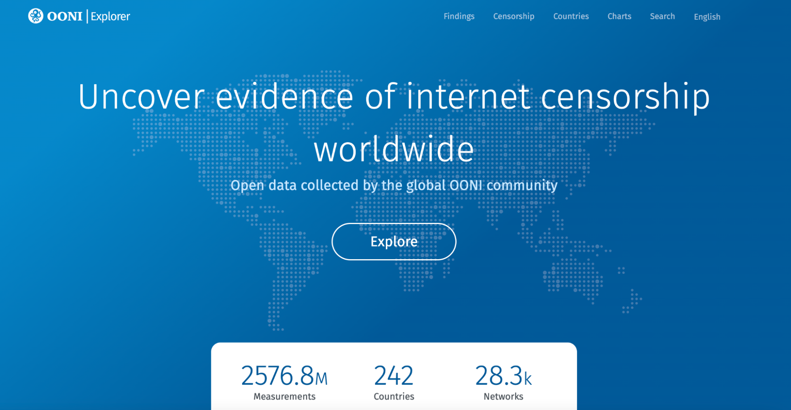

{{}}

As the new year begins, we publish this post to share some OONI highlights from 2024. We also share some of the things we’ll be working on in 2025!



## New OONI Foundation

{{}}

**Image:** Notary appointment in Rome, Italy, to establish the Open Observatory of Network Interference Foundation (OONI) ETS in February 2024.

In May 2024, OONI officially became a foundation! As such, OONI is a nonprofit organization legally registered in Rome, Italy, with operations spanning internationally.

We [first established OONI’s nonprofit legal entity in June 2023](https://ooni.org/post/2023-year-in-review/#new-ooni-non-profit-legal-entity) with the creation of the OONI Association. Once we had established the legal entity, we navigated the necessary bureaucratic processes to have OONI upgraded to a foundation. We made the decision to transition from an association to a foundation in order to strengthen OONI's governance structure and enhance its stability as an organization.

Now, OONI has achieved the highest form of nonprofit status in Italy, ushering in a new era of growth.

This exciting development follows almost a decade of support from the [Tor Project](https://www.torproject.org/), where OONI was born back in 2011. OONI’s [growth and success](https://ooni.org/post/highlights-10-years-of-ooni/) wouldn’t have been possible without the [Tor Project](https://www.torproject.org/), who supported us every step of the way.

## OONI tools

### Launched OONI Run v2

{{}}

**Image:** [OONI Run v2](https://run.ooni.org/).

In October 2024, we [launched OONI Run v2](https://ooni.org/post/2024-launch-ooni-run-v2/): the next generation version of [OONI Run](https://run.ooni.org/) for community-driven censorship testing.

Originally [launched](https://ooni.org/post/ooni-run/) in September 2017, [OONI Run](https://run.ooni.org/) is a platform for creating mobile deep links that you can share with [OONI Probe](https://ooni.org/install/mobile) users to coordinate the testing of websites for censorship. Over the past 7 years, OONI Run has been [used extensively by community members](https://ooni.org/support/ooni-censorship-measurement-campaigns#examples-of-ooni-censorship-measurement-campaigns) in Venezuela, Malaysia, India, and around the world as part of their censorship measurement campaigns aimed at monitoring and rapidly responding to emergent censorship events. To improve the OONI Run platform and better meet community needs, we previously conducted an [OONI Run usability study](https://ooni.org/post/2020-06-09-ooni-run-usability-study-findings/), through which we documented extensive community feedback.

[OONI Run v2](https://run.ooni.org/) is a **major revamp** that addresses key [community feedback and needs](https://ooni.org/post/2020-06-09-ooni-run-usability-study-findings/).

Specifically, OONI Run v2 includes the following exciting new features:

*   Shortened OONI Run links;
*   Ability to dynamically update OONI Run links;
*   Automated testing of OONI Run links;
*   Ability to easily identify, retrieve, and aggregate measurements on [OONI Explorer](https://explorer.ooni.org/) from an OONI Run link.

With the launch of OONI Run v2, we also introduced [UI improvements to OONI Probe Android](https://ooni.org/post/2024-launch-ooni-run-v2/#ui-changes-to-ooni-probe-android). Learn more about OONI Run v2 through our [launch announcement blog post](https://ooni.org/post/2024-launch-ooni-run-v2/) and [user guide](https://ooni.org/support/ooni-run/).

{{}}

**Image:** Creating an [OONI Run v2](https://run.ooni.org/) link for censorship testing.

We thank the OONI community for their invaluable feedback, which informed the design of OONI Run v2!

### Creating an OONI Probe multiplatform app

{{}}

**Image:** [OONI Probe apps](https://ooni.org/install/).

[OONI Probe](https://ooni.org/install/) is a free and open source tool that we have built since 2012, designed to [measure various forms of internet censorship](https://ooni.org/nettest/). To enable communities worldwide to run OONI Probe and contribute measurements (which are published as open data on [OONI Explorer](https://explorer.ooni.org/) in real-time), we have made OONI Probe available for [both mobile and desktop](https://ooni.org/install/) platforms. Specifically, OONI Probe is available for [Android](https://play.google.com/store/apps/details?id=org.openobservatory.ooniprobe), [F-Droid](https://f-droid.org/repository/browse/?fdid=org.openobservatory.ooniprobe), [iOS](https://itunes.apple.com/us/app/id1199566366), [Windows](https://ooni.org/install/desktop), [macOS](https://ooni.org/install/desktop), and [Linux](https://ooni.org/install/cli/ubuntu-debian/).

While this sounds great, in practice it means that we maintain OONI Probe in 4 different codebases: [OONI Probe Android](https://github.com/ooni/probe-android), [OONI Probe iOS](https://github.com/ooni/probe-ios), [OONI Probe Desktop](https://github.com/ooni/probe-desktop), [OONI Probe Command Line Interface (CLI)](https://github.com/ooni/probe-cli). Given that we aim to have feature parity across OONI Probe apps, we need to implement changes in each of these 4 codebases every time we introduce a new feature. Having to do this each time in 4 different codebases not only reduces the speed at which we can ship new features, but it also increases the risk of introducing bugs. It also means that our software doesn't always have full feature parity across all platforms and even when it does, there are some differences that are hard to get right. In our line of work, where there is often the need to quickly adjust our software in response to emergent censorship events or infrastructure changes, having to implement changes in 4 different codebases is, simply put, a burden.

To **improve the long-term sustainability of the OONI Probe apps** and to enable us to fix bugs and ship new features faster and more effectively, we worked on creating an **[OONI Probe multiplatform app](https://github.com/ooni/probe-multiplatform)** throughout 2024. This means we now have a unified codebase for OONI Probe Mobile and we will eventually also support the OONI Probe desktop apps through the same codebase. As part of this, we [rewrote the OONI Probe app](https://github.com/ooni/probe-multiplatform) using [Kotlin Multiplatform](https://www.jetbrains.com/kotlin-multiplatform/) for code sharing, and [Compose Multiplatform](https://www.jetbrains.com/compose-multiplatform/) for shared UIs across platforms.

Notably, we almost reached feature parity on OONI Probe Android and iOS in 2024, and we **launched our first multiplatform app in production**: [News Media Scan on iOS](https://apps.apple.com/us/app/news-media-scan/id6738992797). This is an OONI Probe-based app developed in collaboration with [Deutsche Welle (DW)](https://www.dw.com/) to measure the blocking of news media websites. Similarly to OONI Probe, we publish News Media Scan app test results as [open data](https://ooni.org/data/) in real-time. We previously launched the [Android version of the News Media Scan app](https://play.google.com/store/apps/details?id=com.dw.ooniprobe) in October 2023.

We aim to launch the OONI Probe multiplatform app for mobile and desktop platforms in 2025. Stay tuned!

### Presenting thematic censorship findings on OONI Explorer

{{}}

**Image:** [OONI Explorer](https://explorer.ooni.org/).

In real-time, we publish OONI measurements collected from around the world as [open data](https://ooni.org/data/). Since 2012, we have published [more than 2 billion network measurements](https://explorer.ooni.org/) from 28 thousand networks in 242 countries and territories. Every day, new measurements from around the world are openly published in real-time, shedding light on emergent censorship events. As a result, OONI data is one of the largest open datasets on internet censorship to date.

To enable human rights defenders (and the public at large) to explore OONI data and discover global censorship events, we have built [OONI Explorer](https://explorer.ooni.org/) (originally [launched in 2016](https://blog.torproject.org/ooni-explorer-censorship-and-other-network-anomalies-around-world/), and [revamped](https://ooni.org/post/next-generation-ooni-explorer/) in 2019), a web platform that enables users to explore OONI measurements and track global censorship events in real-time. OONI Explorer includes a [search tool](https://explorer.ooni.org/search) (which, for example, enables users to discover confirmed blocked websites), a [Measurement Aggregation Toolkit](https://explorer.ooni.org/chart/mat) (which enables users to generate charts based on aggregate views of OONI data), and a [Censorship Findings](https://explorer.ooni.org/findings) platform (among [other pages and features](https://ooni.org/post/2023-new-explorer-features/)).

However, beyond the [Censorship Findings](https://explorer.ooni.org/findings) reports (which are limited to specific cases), OONI Explorer generally requires digging through OONI measurements to discover censorship events. While this may be great for curious researchers, it may be challenging for human rights defenders who are interested in quickly and easily accessing data for rapid response purposes. Moreover, [interpreting OONI measurements](https://ooni.org/support/interpreting-ooni-data/) can potentially be challenging for those who are not already familiar with OONI tools and methodologies.

To enable human rights defenders to more easily discover and respond to censorship events based on OONI data, we worked towards presenting thematic censorship findings on [OONI Explorer](https://explorer.ooni.org/) throughout 2024.

To determine which censorship findings would be most useful for the internet freedom community to present on [OONI Explorer](https://explorer.ooni.org/), we conducted extensive user research, involving both a [survey](https://forms.gle/tYv3pecJiUFfUfEh9) and interviews with community members who use OONI Explorer as part of research and advocacy. The goal of this user research was to better understand how the internet freedom community uses OONI Explorer, the challenges they encounter in discovering censorship findings through the platform, and the types of censorship findings that they would find most useful.

Based on community feedback collected as part of this user research, we:

*   **Launched an improved navigation menu for OONI Explorer** to enhance the discoverability of resources and to enable the addition of new thematic censorship findings pages;
*   Determined that the **new thematic censorship findings pages** on OONI Explorer will focus on the following themes: [News Media](https://github.com/ooni/explorer/issues/940), [Social Media](https://github.com/ooni/explorer/issues/939), and [Circumvention](https://github.com/ooni/explorer/issues/941).

Community feedback also informed the ways through which information can be presented on each of these thematic pages, as well as which information to prioritize.

In 2024, we completed the core development work for the new OONI Explorer thematic censorship findings pages and we started internal testing and polishing of the pages in preparation for the upcoming launch. We are aiming to launch the new thematic censorship findings pages in 2025. Stay tuned!

## OONI methods

### New experiments

In response to the dynamically changing censorship environment, we are improving our measurement methodologies on an ongoing basis.

Some highlights from 2024 include:

*   **New Encrypted Client Hello (ECH) experiment.** In recent years, OONI data is increasingly [showing](https://ooni.org/reports/) that blocks are implemented by means of TLS interference around the world. This is quite unsurprising given that most websites and apps these days are hosted on HTTPS, using the TLS protocol for encryption. However, the initial [“Client Hello” message](https://www.cloudflare.com/en-gb/learning/ssl/what-happens-in-a-tls-handshake/) has a field which transmits in the clear the domain we want to access, enabling passive network observersers to discover which websites users are accessing. [Encrypted Client Hello (ECH)](https://blog.cloudflare.com/announcing-encrypted-client-hello/) was introduced to address this problem by encrypting the “Client Hello” message and bolstering online privacy. But in November 2024, [Russia blocked ECH](https://theins.ru/news/275980). In response to this block, and in light of the risk that more countries may start blocking ECH over the next years, we designed a **[new “ECH Check” experiment](https://github.com/ooni/spec/blob/master/nettests/ts-039-echcheck.md)** which measures whether blocking is triggered by the presence of the Encrypted Client Hello (ECH) extension in the Client Hello during a TLS handshake. In late November 2024, we [shipped our new ECH Check experiment](https://github.com/ooni/probe-cli/releases/tag/v3.24.0) as part of the OONI Probe apps and we started [publishing ECH measurements](https://explorer.ooni.org/search?since=2024-12-27&until=2025-01-27&failure=true&test_name=echcheck) as open data in real-time.

*   **New OpenVPN experiment.** As part of their [OTF Information Controls Fellowship](https://www.opentech.fund/fellows/ain-ghazal/) with OONI, Ain Ghazal [contributed](https://github.com/ooni/probe-cli/pull/1585) a new [OpenVPN experiment](https://github.com/ooni/spec/blob/master/nettests/ts-040-openvpn.md) to OONI Probe. In 2024, we shipped this experiment as part of the [OONI Probe apps](https://ooni.org/install/) and we started publishing [OpenVPN measurements as open data](https://explorer.ooni.org/search?since=2024-12-27&until=2025-01-27&failure=false&test_name=openvpn) in real-time.

*   **Throttling methodology.** Over the past few years, we have created a [methodology for measuring targeted cases of throttling](https://github.com/ooni/probe-cli/blob/master/docs/design/dd-007-throttling.md). As part of this methodology, we analyze OONI [Web Connectivity](https://github.com/ooni/spec/blob/master/nettests/ts-017-web-connectivity.md) data (which is collected through the [OONI Probe](https://ooni.org/install/) testing of URLs) to detect targeted cases of extreme throttling that impact specific online services (such as the throttling of Twitter/X). Specifically, OONI’s methodology for measuring targeted cases of throttling involves the **analysis of timing information during HTTPS requests** in [Web Connectivity](https://github.com/ooni/spec/blob/master/nettests/ts-017-web-connectivity.md) data. This methodology has been successful in measuring various cases of throttling, such as those documented as part of our research reports on throttling cases in [Kazakhstan](https://ooni.org/post/2023-throttling-kz-elections/#throttling-of-sites), [Russia](https://ooni.org/post/2022-russia-blocks-amid-ru-ua-conflict/#twitter-throttled), and [Turkey](https://ooni.org/post/2023-turkey-throttling-blocking-twitter/). In 2024, we published a [design document about our throttling methodology](https://github.com/ooni/probe-cli/blob/master/docs/design/dd-007-throttling.md) to support related research and future work.

### Expanding OONI’s testing model to support richer testing input

With the emergence of new internet protocols (such as DNS-over-TLS (DoT), DNS-over-HTTPS (DoH), and HTTP over QUIC (HTTP/3)) and news forms of internet censorship, there is increasing need to expand OONI’s testing model to more dynamically measure novel forms of internet censorship. We previously developed new experiments for measuring [DoT/DoH blocking](https://github.com/ooni/spec/blob/master/nettests/ts-028-dnscheck.md) and HTTP/3 blocking, based on which we wrote papers that were published by [IMC 2021](https://dl.acm.org/doi/pdf/10.1145/3487552.3487836) and [NDSS 2021](https://www.ndss-symposium.org/wp-content/uploads/dnspriv21-02-paper.pdf) (to the best of our knowledge, these papers are the first efforts focusing on HTTP/3 and DoT/DoH censorship measurements from countries that include Iran and China).

However, limitations in our testing model meant that we needed to manually deploy our research client ([miniooni](https://github.com/ooni/probe-cli/tree/master/internal/cmd/miniooni)) to run a limited number of measurements with inputs specific to these kinds of tests from a few vantage points, manually download results from S3, and manually write a custom pipeline for scoring the measurements.

We therefore worked towards expanding OONI’s testing model to support richer testing input and, by extension, enable all OONI Probe app users worldwide to more easily run novel experiments, automatically process these measurements and present findings on [OONI Explorer](https://explorer.ooni.org/) as open data. This involved making improvements to the communication layer between the measurement coordination infrastructure and probes to improve our ability to provide a richer set of configuration parameters to network experiments that goes beyond just providing them with URLs to test.

In 2024, we [completed the bulk of the work related to expanding OONI’s testing model](https://github.com/ooni/probe-cli/pulls?q=label%3A2024-06-richer-input+is%3Aclosed) to support richer testing input. As part of this, we [refactored](https://github.com/ooni/probe-cli/pull/1615) the OONI Probe engine to improve its internal representation of richer input and to enable each experiment to define its own richer testing input structure. This refactoring change enabled us to reduce the complexity and to read richer testing input from experiment-specific APIs, as well as from OONI Run v2 descriptors.

Notably, we [merged](https://github.com/ooni/probe-cli/pull/1585) the [OpenVPN experiment](https://github.com/ooni/spec/blob/master/nettests/ts-040-openvpn.md) (developed by [Ain Ghazal](https://www.opentech.fund/fellows/ain-ghazal/) as part of their OTF fellowship with OONI) with full support for using richer testing input. We also published a [design document](https://github.com/ooni/probe-cli/blob/master/docs/design/dd-008-richer-input.md) which provides details about our choices for supporting richer testing input, the refactoring of the OONI Probe engine to enable richer testing input, our implementation of richer testing input through the OpenVPN experiment, as well as our implementation of other related improvements. This document also lists next steps for potential future work.

### Advancing OONI data analysis

Over the past two years, we have been advancing OONI data analysis methods through our [latest](https://docs.ooni.org/data/pipeline/) data processing pipeline: [OONI Pipeline v5](https://github.com/ooni/data). Our goal is to automate the detection and characterization of more forms of website censorship.

With our previous data processing pipelines, we only [automatically confirmed](https://ooni.org/support/interpreting-ooni-data/#confirmed) cases of website blocking based on [fingerprints](https://github.com/ooni/blocking-fingerprints) added to our database. These fingerprints pertain to block pages and IP addresses associated with implementing censorship. But if ISPs implement blocks using different techniques – which is often the case globally – those cases are annotated as “[anomalies](https://ooni.org/support/interpreting-ooni-data/#anomalies)”, indicating that they might involve censorship, but false positives can occur. Determining whether anomalies are symptomatic of true censorship and characterizing the blocks has required manual, time-consuming data analysis that our team would perform in support of our [research reports](https://ooni.org/reports/) and community requests. With the latest [OONI Pipeline v5](https://github.com/ooni/data), we are automating our data analysis efforts!

More specifically, we are moving beyond the concept of “anomalies” to instead characterize tested services as “blocked”, “down”, or “OK”. The pipeline specifies the blocking details, fully [characterising a block based on all the methods](https://docs.ooni.org/data/pipeline-design/#experimentresult-generation) through which it is implemented.

Even though we have not started using the [OONI Pipeline v5](https://github.com/ooni/data) for production API endpoints yet, it has been running for about a year and has been an essential tool to optimize the workflows of our research.

Specifically, the data analysis capabilities of the new OONI Pipeline v5 supported all of our latest research reports, such as those on [internet censorship in Kazakhstan](https://ooni.org/post/2024-kazakhstan-report/), [Russia](https://ooni.org/post/2024-russia-report/), [Tanzania](https://ooni.org/post/2024-tanzania-lgbtiq-censorship-and-other-targeted-blocks/), [Jordan](https://ooni.org/post/2023-jordan-blocks-grindr/), [Senegal](https://ooni.org/post/2023-senegal-social-media-blocks/), [Brazil](https://ooni.org/post/2023-brazil-telegram/), and [Azerbaijan](https://ooni.org/post/2023-azerbaijan-internet-censorship/). The OONI Pipeline v5 also enabled us to analyze TLS handshakes and apply our [throttling methodology](https://github.com/ooni/probe-cli/blob/master/docs/design/dd-007-throttling.md) to investigate targeted cases of throttling in [Kazakhstan](https://ooni.org/post/2023-throttling-kz-elections/), [Russia](https://ooni.org/post/2022-russia-blocks-amid-ru-ua-conflict/#twitter-throttled), and [Turkey](https://ooni.org/post/2023-turkey-throttling-blocking-twitter/). Moreover, the data analysis capabilities of the new pipeline have supported our rapid response efforts, such as when we [immediately responded to the blocking of Telegram in El Salvador](https://x.com/OpenObservatory/status/1835360393906074078) by sharing a detailed chart on the reachability of Telegram IPs by probe ASN and target (generated by the OONI Pipeline v5). As anyone can [run the OONI Pipeline v5](https://docs.ooni.org/data/pipeline/#setup), third party researchers have already made use of its data analysis capabilities. Sinar Project, for example, used the OONI Pipeline v5 in support of their [2024 iMAP research reports on internet censorship in 9 Asian countries](https://imap.sinarproject.org/reports/2024).

We hope to start using the OONI Pipeline v5 for production API endpoints in 2025!

## Research

### Research reports

In 2024, we published the following research based on the analysis of OONI data:

*   [Censorship Chronicles: The systematic suppression of independent media in Russia](https://ooni.org/post/2024-russia-report/) [(also published in](https://ooni.org/post/2024-russia-report/) [Russian](https://ooni.org/ru/post/2024-russia-report/))
*   [Russia blocked OONI Explorer, a large open dataset on Internet censorship](https://ooni.org/post/2024-russia-blocked-ooni-explorer/)
*   [Kazakhstan: TLS MITM attacks and blocking of news media, human rights, and circumvention tool sites](https://ooni.org/post/2024-kazakhstan-report/) [(also published in](https://ooni.org/post/2024-russia-report/) [Kazakh](https://ooni.org/kk/post/2024-kazakhstan-report/) and [Russian](https://ooni.org/ru/post/2024-kazakhstan-report/))
*   [Tanzania: Surge in online LGBTIQ censorship and other targeted blocks](https://ooni.org/post/2024-tanzania-lgbtiq-censorship-and-other-targeted-blocks/) [(also published in](https://ooni.org/post/2024-russia-report/) [Swahili](https://ooni.org/sw/post/2024-tanzania-lgbtiq-censorship-and-other-targeted-blocks/))
*   [Internet Sanctions on Russian Media: Actions and Effects](https://petsymposium.org/foci/2024/foci-2024-0001.pdf) (FOCI paper)

In collaboration with our partner [RKS Global](https://rks.global/), we published a [new research report](https://ooni.org/post/2024-russia-report/) documenting the **systematic suppression of independent news media in Russia**. We published this research report in both [English](https://ooni.org/post/2024-russia-report/) and [Russian](https://ooni.org/ru/post/2024-russia-report/) (to reach local communities), and we presented the report at the [SplinterCon conference](https://splintercon.net/berlin/) in Berlin, Germany. To expand the report’s reach in Russia, RKS Global published a summary of the findings (along with recommendations) in both [English](https://rks.global/en/research/chronicles/) and [Russian](https://rks.global/research/chronicles/). This research report received coverage from [The Record](https://therecord.media/russia-doubles-blocking-access-independent-media-sites) and from [Roskomsvoboda](https://roskomsvoboda.org/ru/post/russia-censorship-pressure-independent-media-ooni-report/) (Russia’s most prominent digital rights organization), and was shared widely on Telegram channels by Russian communities.

In September 2024, **Russia started blocking access to our platform**, [OONI Explorer](https://explorer.ooni.org/). On 11th September 2024, we received an email from Roskomnadzor, notifying us of their [decision to block access to OONI Explorer](https://reestr.rublacklist.net/en/record/7404315/). On the same day, OONI data shows that ISPs in Russia started implementing the block. While Roskomnadzor mentioned their intention to restrict access to the Russian translation of OONI circumvention tool reachability measurements, in practice, the restriction is far-reaching. The block restricts access to all OONI data hosted on OONI Explorer. We published a [report](https://ooni.org/post/2024-russia-blocked-ooni-explorer/), documenting the blocking of OONI Explorer in Russia based on OONI data.

In collaboration with our partners [Internet Freedom Kazakhstan (IFKZ)](https://ifkz.org/en) and [Eurasian Digital Foundation](https://www.digitalrights.asia/), we published a [new research report](https://ooni.org/post/2024-kazakhstan-report/) documenting **TLS Man-In-The-Middle (MITM) attacks** and the blocking of news media, human rights, and circumvention tool sites in Kazakhstan. We published this report in [English](https://ooni.org/post/2024-kazakhstan-report/), [Kazakh](https://ooni.org/kk/post/2024-kazakhstan-report/), and [Russian](https://ooni.org/ru/post/2024-kazakhstan-report/). To increase the report’s reach in Kazakhstan, Internet Freedom Kazakhstan (IFKZ) published an [article](https://ifkz.org/ru/article/internet-censorship-in-kazakhstan) about the key research findings and presented the report at the [Internet Governance Forum (IGF) 2024 Kazakhstan](https://igf.kz/en/main/#agenda). The report received press coverage from [FactCheck Kazakhstan](https://factcheck.kz/novosti/internet-tsenzura-v-kazahstane-rezultaty-issledovaniya-ifkz-i-ooni/), [Ulysmedia Kazakhstan](https://ulysmedia.kz/rassledovaniya/38144-ramki-rukopozhatiia-i-lichnye-dannye-ili-kak-v-kazakhstane-kontroliruetsia-svoboda-internet-slova/), [SecurityLab Russia](https://www.securitylab.ru/news/552299.php), [Sledstvie Info](https://sledstvie.info/news/45234-informatcionnaja_izoljatsija_kazahstana_kak_vlasti_otrezajut_grahdan_ot_globaljnyh_sobytij), [BES.media](https://bes.media/news/mitm-ataki-i-tsenzura-raskriti-metodi-pravitelstvennih-blokirovok-v-kazahstane/), [The Village Kazakhstan](https://www.the-village-kz.com/village/city/news-city/37627-ifkz-i-ooni-opublikovali-podrobnoe-issledovanie-pro-internet-tsenzuru-v-kazahstane) and the [Media Policy Institute](https://media.kg/news/factcheck-kz-internet-czenzura-v-kazahstane-rezultaty-issledovaniya/) of Kyrgyzstan.

We published a [new research report](https://ooni.org/post/2024-tanzania-lgbtiq-censorship-and-other-targeted-blocks/) documenting the blocking of LGBTIQ websites and other targeted blocks in Tanzania based on the analysis of OONI data. We also published this report in [Swahili](https://ooni.org/sw/post/2024-tanzania-lgbtiq-censorship-and-other-targeted-blocks/) to reach local communities. Our analysis reveals the **extensive blocking of LGBTIQ sites**, which correlates with the escalating discrimination and crackdown on LGBTIQ communities in Tanzania in recent years. Many other blocks identified as part of this study appear to be targeted, as they involve very specific websites, while other sites from the same categories (e.g. social media, human rights) were found accessible.

In collaboration with researchers from the University of Illinois Chicago, the University of Twente and the University of Amsterdam, we co-authored a [paper](https://petsymposium.org/foci/2024/foci-2024-0001.pdf) which analyzes how different ISPs in EU member states implement sanctions on Russian media. This paper made extensive use of OONI data, and was [published by FOCI](https://petsymposium.org/foci/2024/foci-2024-0001.pdf) in February 2024. SIDN Labs published a [blog post with a summary](https://www.sidnlabs.nl/en/news-and-blogs/internet-sanctions-on-russian-media-diverging-actions-and-mixed-effects) of the paper, which was [cross-posted](https://ooni.org/post/2024-eu-sanctions/) on the OONI blog.

### Censorship Findings reports on OONI Explorer

In addition to the aforementioned [research reports](https://ooni.org/reports/), we published many [short reports](https://explorer.ooni.org/findings) (based on OONI data) on emergent censorship events on the OONI Explorer [Censorship Findings](https://explorer.ooni.org/findings) page.

{{}}

**Image:** OONI Explorer [Censorship Findings](https://explorer.ooni.org/findings) page.

In 2024, we published the following **12 reports**:

*   [Bangladesh blocked news media websites amid 2024 general elections](https://explorer.ooni.org/findings/11686385001)
*   [Pakistan blocked PTI political party sites and investigative news platform ahead of 2024 elections](https://explorer.ooni.org/findings/108298926901)
*   [Kyrgyzstan blocked TikTok](https://explorer.ooni.org/findings/154621229001)
*   [Senegal blocked TikTok](https://explorer.ooni.org/findings/144156914701)
*   [Malaysia blocked Grindr](https://explorer.ooni.org/findings/44213966401)
*   [Israel blocks Al-Jazeera following decision to suspend its services](https://explorer.ooni.org/findings/62771144901)
*   [Facebook blocked amid student protests in Bangladesh](https://explorer.ooni.org/findings/45013413801)
*   [DuckDuckGo search engine blocked in Indonesia](https://explorer.ooni.org/findings/282511010901)
*   [Turkey blocked Instagram](https://explorer.ooni.org/findings/330022197701)
*   [Tanzania blocked Twitter/X](https://explorer.ooni.org/findings/188763810301)
*   [Brazil blocked Twitter/X](https://explorer.ooni.org/findings/174962608001)
*   [Mauritius blocked social media ahead of 2024 general election](https://explorer.ooni.org/findings/73729350400)

In response to emergent censorship events, we will continue to publish new reports on the OONI Explorer [Censorship Findings](https://explorer.ooni.org/findings) page on an ongoing basis.

## Community

### OONI Partner Gathering 2024 in Malaysia

{{}}

**Image:** OONI Partner Gathering 2024 in Kuala Lumpur, Malaysia.

One of our biggest highlights from 2024 was the [OONI Partner Gathering](https://ooni.org/post/2024-ooni-partner-gathering-report/)!

On 8th and 9th May 2024, we hosted an **in-person OONI Partner Gathering in Kuala Lumpur, Malaysia**. As part of this 2-day event, we brought [OONI partners](https://ooni.org/partners) (primarily from Asia and the Middle East) together to exchange skills and knowledge on internet censorship research. The goal of the event was to strengthen global and regional collaborations on censorship measurement research and advocacy.

The OONI Partner Gathering 2024 brought together **45 individuals from 30 countries**. Specifically, the participants included OONI [partners](https://ooni.org/partners) from Southeast Asia, South Asia, East Asia, Central Asia, and the Middle East, some OONI partners who work internationally, as well as the whole [OONI team](https://ooni.org/about/team/).

The [agenda](https://ooni.org/documents/OONI-Partner-Gathering-Agenda.pdf) included a **mixture of skill-share sessions, presentations, hands-on exercises, and interactive group discussions**. We included a variety of parallel sessions to accommodate more sessions in the agenda, and to encourage more active participation in smaller group discussions. To provide space for discussions on ideas and needs that emerged during the event, we also included a slot for **“unconference” style sessions**. Overall, the two-day OONI Partner Gathering 2024 event included **25 sessions**, 20 of which were part of the official [agenda](https://ooni.org/documents/OONI-Partner-Gathering-Agenda.pdf), while 5 were proposed and facilitated by participants as part of the “unconference” session slots. Many sessions were facilitated by our partners, who provided amazing presentations of their work!

We published a **[report](https://ooni.org/post/2024-ooni-partner-gathering-report/)** which shares details about the event and its outcomes.

We also published an **[animation](https://ooni.org/post/2024-ooni-partner-gathering-animation/)** about the OONI Partner Gathering 2024, providing a glimpse into the event. Watch the animation below!



**Video:** OONI Partner Gathering 2024 animation created in collaboration with [Robotina](https://www.robotina.it/).

We thank the [Ford Foundation](https://www.fordfoundation.org/) and [Luminate](https://www.luminategroup.com/) for supporting the OONI Partner Gathering 2024, as well as our partners for making the event a fascinating and important experience through their participation.

We look forward to hosting more OONI Partner Gathering events over the next few years!

### New partnerships

{{}}

**Image:** OONI [Partners](https://ooni.org/partners) page.

In 2024, we had the opportunity to establish **3 new partnerships** with the following organizations:

*   [Digital Rights Foundation](https://ooni.org/partners/digital-rights-foundation/) (Pakistan)
*   [SAFEnet](https://ooni.org/partners/safenet/) (Indonesia)
*   [Digital Rights Nepal](https://ooni.org/partners/digital-rights-nepal/) (Nepal)

Overall, we now have [partnerships with 52 digital rights organizations](https://ooni.org/partners). Many of these partnerships are with digital rights organizations in Asia, Africa, the Middle East, and Latin America, with whom we collaborate on investigating internet censorship in their respective countries through the use of OONI tools and data. We also have partnerships with circumvention tool projects and international organizations that defend digital rights. Through these partnerships, we aim to support decentralized efforts in increasing transparency of internet censorship worldwide.

### OONI partner workshop series

In support of our global network of [partners](https://ooni.org/partners), we facilitated an online OONI workshop series with the goal of sharing skills and knowledge for censorship measurement research.

In 2024, we facilitated the following **4 online workshops for our partners**:

*   Introduction to Internet Censorship (9th October 2024)
*   Practical [OONI Probe](https://ooni.org/install/) workshop (17th October 2024)
*   [OONI Run v2](https://ooni.org/post/2024-launch-ooni-run-v2/): Features of the new release (7th November 2024)
*   Using the [OONI Test Lists Editor](https://test-lists.ooni.org/) (20th November 2024)

We will continue to facilitate online OONI workshops for our partners throughout 2025.

### New OONI Community Interviews

{{}}

**Image:** [Tawanda Mugari (Digital Society Africa) - OONI Community Interviews](https://ooni.org/post/2024-interview-with-tawanda-mugari/).

To highlight the important work of our community and the interesting ways that community members make use of OONI tools and data, we started an [“OONI Community Interviews” video series on our YouTube channel](https://www.youtube.com/watch?v=zrclQ2QZjVo&list=PL1sH9kYR-16nWkDJwY-NAaMbrW1LrUXH0) several years ago.

In 2024, we published **2 new OONI Community Interviews** with:

*   **[Chido Musodza](https://ooni.org/post/2024-interview-with-chido-musodza/)**: Program Associate (Community Engagement) at [Localization Lab](https://www.localizationlab.org/), a global community of 7000+ contributors who support the translation and localization of Internet freedom tools. [OONI tools are available in more than 20 languages](https://wiki.localizationlab.org/index.php/OONI) thanks to the Localization Lab community.
*   **[Tawanda Mugari](https://ooni.org/post/2024-interview-with-tawanda-mugari/)**: Co-Founder and Geek in Chief of [Digital Society of Africa (DSA)](https://digitalsociety.africa/), a distributed network of technologists and digital security consultants who work to strengthen the resilience and ability of frontline activists, human rights defenders and other at-risk groups in six countries: Zimbabwe, Zambia, Malawi, Mozambique, Eswatini and South Africa. DSA also leads OONI measurement efforts in southern Africa.

Watch [more interviews](https://www.youtube.com/watch?v=zrclQ2QZjVo&list=PL1sH9kYR-16nWkDJwY-NAaMbrW1LrUXH0) with our community and [subscribe to our YouTube channel](https://www.youtube.com/channel/UCQhDgj9wBf4_w5bWFvLlq-w?sub_confirmation=1) to stay tuned!

### Localization

Thanks to the [Localization Lab](https://www.localizationlab.org/) community and several of our [partners](https://ooni.org/partners), OONI tools and resources have been made available in new languages and are now accessible for many more communities worldwide.

#### OONI Test Lists Editor

{{}}

**Image:** [OONI Test Lists Editor in Russian](https://test-lists.ooni.org/ru/login).

Notably, we launched our [Test Lists Editor](https://test-lists.ooni.org/) with localization support! As a result, many more community members around the world can now more easily contribute to websites for censorship testing and enhance censorship detection worldwide.

As of 2024, the [OONI Test Lists Editor](https://test-lists.ooni.org/) is available in the following **9 languages** (beyond English):

*   [Arabic](https://test-lists.ooni.org/ar/login)
*   [Burmese](https://test-lists.ooni.org/my/login)
*   [French](https://test-lists.ooni.org/fr/login)
*   [German](https://test-lists.ooni.org/de/login)
*   [Khmer](https://test-lists.ooni.org/km/login)
*   [Portuguese](https://test-lists.ooni.org/pt-BR/login)
*   [Russian](https://test-lists.ooni.org/ru/login)
*   [Spanish](https://test-lists.ooni.org/es/login)
*   [Turkish](https://test-lists.ooni.org/tr/login)

We thank the [Localization Lab](https://www.localizationlab.org/) community for the Test List Editor translations, as well as for the ongoing translation and localization of other OONI tools ([OONI Probe](https://explore.transifex.com/otf/ooniprobe/), [OONI Run](https://explore.transifex.com/otf/ooni-run/), and [OONI Explorer](https://explore.transifex.com/otf/ooni-explorer/)) throughout 2024. 

#### OONI Outreach Kit

{{}}

**Image:** [OONI Outreach Kit in Arabic](https://ooni.org/ar/support/ooni-outreach-kit/).

In 2024, we published the [OONI Outreach Kit](https://ooni.org/support/ooni-outreach-kit/) in **[Arabic](https://ooni.org/ar/support/ooni-outreach-kit/)** and **[Farsi](https://ooni.org/fa/support/ooni-outreach-kit/)**! The OONI Outreach Kit includes OONI brochures, flyers, leaflets, workshop slides, and other resources that anyone can use to engage their community with OONI censorship measurement. We thank the translators for making the OONI Outreach Kit materials available in Arabic and Farsi, supporting OONI community engagement efforts in the Middle East!

The OONI Outreach Kit is also available in [English](https://ooni.org/support/ooni-outreach-kit/), [French](https://ooni.org/fr/support/ooni-outreach-kit/), [Russian](https://ooni.org/ru/support/ooni-outreach-kit/), [Spanish](https://ooni.org/es/support/ooni-outreach-kit/), and [Swahili](https://ooni.org/sw/support/ooni-outreach-kit/).

### Open Measurement Gatherings (OMG)

{{}}

**Image:** 1st Open Measurement Gathering at Georgia Tech in June 2024.

While we regularly participate in a variety of conferences and events that provide us an opportunity to engage with our global community, we haven’t had the opportunity to have dedicated, in-person, in-depth, technical discussions with other internet measurement groups as regularly as we would have liked. And exchanging skills and knowledge with other internet measurement projects is necessary for strengthening our collaboration and better serving the internet freedom community. 

To address this need, the **Open Measurement Gatherings** are new, bi-annual, private events – organized by the [Measurement Lab (M-Lab)](https://www.measurementlab.net/), and funded by the [Open Technology Fund](https://www.opentech.fund/projects-we-support/supported-projects/measurement-lab/) – that bring together team members from 4 internet measurement projects ([OONI](https://ooni.org/), [M-Lab](https://www.measurementlab.net/), [Internet Outage Detection and Analysis (IODA)](https://ioda.live/), and [Censored Planet](https://censoredplanet.org/)) to exchange skills and knowledge, and to strengthen collaboration on measuring and reporting on internet censorship globally. 

This year we participated in the first two Open Measurement Gatherings, both of which were hosted at [Georgia Tech](https://www.gatech.edu/) in Atlanta, USA. The first Open Measurement Gathering was a 3-day event held in June 2024, and the participants included team members from OONI, IODA, M-Lab, Censored Planet, and Cloudflare. As part of the first convening, we exchanged our measurement methodologies, discussed how to improve our methodologies for measuring throttling, worked with each other’s datasets, and discussed how to strengthen our collaboration on censorship research and reporting. Details about the event (including the agenda) are available through the [1st Open Measurement Gathering Report](https://www.measurementlab.net/documents/OMG1_PublicReport.pdf).

The second Open Measurement Gathering was a 3-day event in December 2024 with a focus on data analysis. Beyond internet measurement groups, the participants also included guests from [Access Now](https://www.accessnow.org/campaign/keepiton/), [Sinar Project](https://sinarproject.org/), and the [Internet History Initiative](https://internethistoryinitiative.org/), who provided very valuable feedback and ideas.

As part of our participation in the second Open Measurement Gathering, we:

*   Presented OONI highlights from 2024 and OONI plans for 2025;
*   Shared OONI data workflows based on case studies;
*   Presented OONI’s methodology for measuring throttling;
*   Presented OONI’s latest data processing pipeline ([OONI Pipeline v5](https://github.com/ooni/data)) to collect feedback from internet measurement experts;
*   Facilitated a session comparing the pipelines of different internet measurement projects;
*   Facilitated a session on anomaly detection and shared OONI’s work on building a Social Media Censorship Alert System;
*   Facilitated a session on GeoIP/AS database consolidation and discussion of next steps;
*   Shared OONI’s partnership experience and lessons learned.

{{}}

**Image:** 2nd Open Measurement Gathering at Georgia Tech in December 2024.

We thank [M-Lab](https://www.measurementlab.net/) and [IODA](https://ioda.live/) for organizing and hosting the first two Open Measurement Gatherings! Warm thanks to all participants for all the valuable insights, skill shares, and discussions. We look forward to participating in the next two Open Measurement Gatherings in 2025!

### OONI workshops and presentations

{{}}

**Image:** OONI Explorer training session for [internet shutdown fellows in Tanzania](https://x.com/ZainaFoundation/status/1776243051339350226), organized by [Zaina Foundation](https://zainafoundationtz.org/) in April 2024.

In 2024, we had the opportunity to share OONI’s work as part of numerous (online and in-person) conferences, workshops, and events.

Notably, we facilitated OONI workshops for a total of **484 participants** around the world in 2024!

Throughout 2024, we presented OONI as part of the following conferences, events, and workshops:

*   **2nd Open Measurement Gathering (Atlanta, USA).** Between 10th-12th December 2024, we traveled to Atlanta, USA, to participate in the [2nd Open Measurement Gathering](https://x.com/OpenObservatory/status/1869829395701215334): a 3-day event (hosted at Georgia Tech) which brought internet measurement projects together to exchange skills and knowledge on measuring and reporting on internet censorship globally. As part of our participation, we presented OONI highlights from 2024 and OONI plans for 2025, shared OONI data workflows based on case studies, presented OONI’s methodology for measuring throttling, presented OONI’s latest data processing pipeline (OONI Pipeline v5) to collect feedback from internet measurement experts, facilitated a session comparing the pipelines of different internet measurement projects, facilitated a session on anomaly detection and shared OONI’s work on building a Social Media Censorship Alert System, facilitated a session on GeoIP/AS database consolidation and discussion of next steps, and shared OONI’s partnership experience and lessons learned.
*   **SpliterCon 2024 (Berlin, Germany).** Between 9th-11th December 2024, we attended the [SplinterCon conference](https://splintercon.net/berlin/) in Berlin. As part of this event, we presented our latest [research report on media censorship in Russia](https://ooni.org/post/2024-russia-report/) and participated in multiple discussions about censorship in the region.
*   **State of the Onion 2024.** On 20th November 2024, we [presented](https://www.youtube.com/live/EODNtLqD7f8) OONI highlights from 2024 and upcoming plans for 2025 as part of the Tor Project’s annual [State on the Onion](https://blog.torproject.org/event/2024-state-of-the-onion/) Community event.
*   **Berkman Klein Center for Internet and Society at Harvard University (Cambridge, USA).** On 19th November 2024, we presented OONI tools and methods to the [Berkman Klein Center](https://cyber.harvard.edu/) community at Harvard University as part of a Community Hour session on “How to investigate internet censorship with OONI tools and data”. 
*   **Falling Walls Science Summit 2024 (Berlin, Germany).** On 7th November 2024, we spoke on a panel at the [Falling Walls Science Summit](https://falling-walls.com/), alongside fellow panelists Peter Limbourg (General Director of DW), Patryk Pawlak (European University Institute), and Sabine Frank (Google). Following the panel, we gave an interview to Deutsche Welle (DW) which was included in their [video on circumventing internet censorship](https://www.dw.com/en/how-to-circumvent-online-censorship/video-70781938).
*   **Hasso Plattner Institute (Berlin, Germany).** On 6th November 2024, we presented OONI tools and methods to computer science Masters students at the [Hasso Plattner Institute (HPI)](https://hpi.de/en/) in Berlin, Germany. During this lesson, we provided an overview of methods for measuring the internet to map information controls.
*   **Internet Shutdown training for journalists, activists and election observers in Tanzania.** On 5th November 2024, as part of an Internet Shutdown training  – organized by our partners, [Zaina Foundation](https://ooni.org/partners/zaina-foundation/) and [Access Now](https://ooni.org/partners/access-now/) – for journalists, activists and election observers in Tanzania, we facilitated a training session on how to use OONI Probe and OONI Explorer to investigate internet censorship in Tanzania.
*   **IETF 121 (Dublin, Ireland).**  Between 2nd-5th November 2024, we attended the [IETF 121 in Dublin](https://www.ietf.org/live/ietf121-plenary/) and actively participated in an event organized by the Public Interest Working Group, during which we engaged in conversations around standards and how work can be done to orient them more in the public interest.
*   **OONI Run v2 demo for the Localization Lab community.** On 30th October 2024, we provided a live demo of using our new [OONI Run v2 tool](https://ooni.org/post/2024-launch-ooni-run-v2/) for the [Localization Lab](https://www.localizationlab.org/) community with the goal of introducing them to [OONI Run v2](https://run.ooni.org/), addressing their questions, and collecting their feedback to help facilitate localization efforts.
*   **Decrypting Digital Authoritarianism conference (Florence, Italy).** On 29th October 2024, we participated in the conference "Decrypting Digital Authoritarianism" at the European University Institute, which focused on examining how internet usage can impact democracy and human rights. We participated in the roundtable discussion "[Strategies and counterstrategies of digital authoritarianism in practice](https://x.com/EUI_Schuman/status/1851192966615896490)," alongside representatives from Freedom House, Deutsche Welle, Meta, Project Liberty – Sciences Po, and the Freedom Online Coalition.
*   **M-Lab Community Call on large scale internet measurements.** On 17th October 2024, we participated as a panelist in [M-Lab’s community call discussion](https://www.youtube.com/watch?v=Sq-v5GfYInQ) on challenges and lessons learned from large scale internet measurements.
*   **Internet Governance Forum (IGF) 2024 Kazakhstan.** On 16th October 2024, we presented the findings from our latest [research report on internet censorship in Kazakhstan](https://ooni.org/post/2024-kazakhstan-report/) at the [Internet Governance Forum (IGF) 2024 Kazakhstan](https://igf.kz/en/main/#agenda), in collaboration with our partners ([Internet Freedom Kazakhstan (IFKZ)](https://ifkz.org/en) and [Eurasian Digital Foundation](https://www.digitalrights.asia/)). 
*   **OONI training of trainers (ToT) for human rights defenders in Senegal.** On 11th October 2024, we facilitated a full-day, hybrid, training of trainers (ToT) for human rights defenders in Senegal. This training of trainers event was organized by our Senegalese partners, [Computech Institute](https://ooni.org/partners/computech/) and Jonction.
*   **OONI training session for SHOOA.** On 10th October 2024, we hosted an online OONI training session for [SHOAA](https://shoaa.org/) (a digital rights organization from Algeria) on how to use OONI Probe, OONI Run, the OONI Test Lists Editor and OONI Explorer to document and investigate internet censorship.
*   **Panel discussion on internet censorship policies in Indonesia.** On 10th October 2024, we participated in an online panel discussion (“Unraveling Government’s Content Moderation and Internet Access Restrictions Policies and Implementation Techniques”) – organized by our partner, [SAFEnet](https://ooni.org/partners/safenet/) – on internet censorship policies in Indonesia.
*   **Global Gathering 2024 (Estoril, Portugal).** Between 27th-29th September 2024, we traveled to Portugal to attend the [Global Gathering 2024](https://wiki.digitalrights.community/index.php?title=Global_Gathering_Agenda_2024). As part of our participation, we hosted an OONI booth and co-facilitated a discussion on rapid response.
*   **OONI workshop for human rights defenders in Nepal.** On 19th September 2024, we facilitated an online OONI workshop for human rights defenders in Nepal. This workshop was hosted in coordination with our new partner, [Digital Rights Nepal](https://ooni.org/partners/digital-rights-nepal/).
*   **FOCI 2024 (Bristol, UK).** On 15th July 2024, we attended the [Free and Open Communications on the Internet (FOCI) 2024 Summer Workshop](https://foci.community/foci24.html#2024-summer-program) in Bristol, UK. As part of our participation, we served as the chair for the sessions on “Censorship Circumvention Strategies” and served on the FOCI Program Committee.
*   **1st Open Measurement Gathering (Atlanta, USA).** Between 11th-13th June 2024, we traveled to Atlanta, USA, to participate in the [first Open Measurement Gathering](https://x.com/OpenObservatory/status/1803734336300032218): a 3-day event (hosted at Georgia Tech) which brought internet measurement projects together to exchange skills and knowledge on measuring and reporting on internet censorship globally. As part of our participation, we presented OONI’s measurement methodologies and tools (“OONI Measurement 101” session), we presented OONI’s open dataset and methods for interpreting the data (“OONI Data Dive” session), we co-facilitated a session on methodologies for measuring cases of throttling, and we facilitated a session on strengthening collaboration on research and reporting on internet censorship.
*   **Countering Digital Threats to Democracy conference (Nairobi, Kenya).** Between 21st-22nd May 2024, we traveled to Nairobi, Kenya, to participate in the “[Countering Digital Threats to Democracy](https://events.pneumaav.com/USAID)” conference organized by USAID, where we presented OONI tools and research on investigating internet censorship in African countries.
*   **OONI Partner Gathering 2024 (Kuala Lumpur, Malaysia).** On 8th and 9th May 2024, we hosted the [OONI Partner Gathering](https://ooni.org/post/2024-ooni-partner-gathering-report/): a two-day event which brought our [partners](https://ooni.org/partners) (primarily from Asia and the Middle East) together to exchange skills and knowledge and strengthen our collaborations on internet censorship research and advocacy. As part of this event, we facilitated multiple OONI sessions, as listed in the detailed [agenda](https://ooni.org/documents/OONI-Partner-Gathering-Agenda.pdf).
*   **Cross-Regional Convening of Digital Rights Activists (Kuala Lumpur, Malaysia).** On 7th May 2024, we attended the Cross-Regional Convening of Digital Rights Activists of Central Asia and Southeast Asia that was organized by Internews in Kuala Lumpur, Malaysia. As part of this event, we facilitated a session on documenting and researching internet censorship in Central Asia through the use of OONI tools and data.
*   **iMAP Regional Partners Meeting (Kuala Lumpur, Malaysia).** On 6th and 7th May 202, we participated in the [iMAP](https://imap.sinarproject.org/) Regional Partners Meeting in Kuala Lumpur, Malaysia, which was organized and hosted by our partner, [Sinar Project](https://ooni.org/partners/sinar-project/), who lead OONI censorship measurement efforts in Southeast Asia.
*   **Digital Rights & Inclusion Forum (DRIF) 2024 (Accra, Ghana).** Between 23rd-25th April 2024, we traveled to Accra, Ghana, to participate in the [Digital Rights & Inclusion Forum (DRIF)](https://drif.paradigmhq.org/agenda/) 2024, where we facilitated a session on strengthening community response to internet censorship. While in Accra, we also shared OONI’s work as part of a [TV interview with Pan African TV](https://www.facebook.com/PANAFRICANTV/videos/979923349677358). 
*   **DEMHACK 8 hackathon.** Between 29th-31st March 2024, [Roskmosvoboda](https://roskomsvoboda.org/en/) hosted the [8th hackathon](https://8.demhack.org/) in its series of DEMHACK hackathons. OONI participated in this hackathon as a partner and as part of the jury board. As part of DEMHACK 8, two teams used OONI tools and methodologies for their hackathon projects. One team developed a [prototype](https://github.com/nomah4/ubiquitous-rotary-phone) of the messengers' accessibility tests for DPI Detector, using OONI Probe tests as a reference. This team acquired third place in the hackathon. Another team used OONI data and the [OONI API to compare the Roskomnadzor blocklist with the domains identified as blocked by OONI Probe](https://github.com/1andrevich/ooni-zapret-list), with the goal of potentially creating an alternative blocklist based on OONI measurements.
*   **OTF Internet Freedom Expos (Washington D.C, USA).** On 18th and 19th March 2024, we traveled to Washington D.C to participate in the [Open Technology Fund](https://www.opentech.fund/)’s (OTF) [Internet Freedom Expo](https://twitter.com/OpenTechFund/status/1773726871965802906) at the U.S Congress, where we hosted an OONI demo and presented OONI’s work.
*   **OONI presentation at IAB Workshop on Barriers to Internet Access of Services (BIAS).** On 17th January 2024, we [presented](https://youtu.be/rz2qkRfaNVE?si=i33_45UTX96Vs21z&t=3404) our [research report](https://ooni.org/post/2023-russia-a-year-after-the-conflict/) on how internet censorship in Russia changed during the first year of military conflict in Ukraine as part of the [IAB Workshop on Barriers to Internet Access of Services (BIAS)](https://datatracker.ietf.org/group/biasws/about/), 2024.
*   **OONI training for human rights advocates in Senegal.** Between 16th-18th January 2024, we co-hosted a 3-day hybrid training for human rights advocates in Dakar, Senegal in collaboration with our local partners, [Computech](https://computechinstitute.com/) and [Jonction](https://jonction.e-monsite.com/), and the event was possible thanks to support from [Access Now](https://www.accessnow.org/). Overall, the goal was to enable local Senegalese trainers and human rights defenders to lead and facilitate OONI censorship measurement workshops in their communities in preparation for the country’s 2024 elections.
*   **OONI Q&A for BebasID Indonesia.** On 12th January 2024, we hosted an online OONI Q&A session with the [BebasID community](https://bebasid.com/) in Indonesia, where we answered questions regarding the use of OONI tools, collected community feedback, and discussed the current state of internet censorship in Indonesia with the BebasID community.
*   **OONI training for Digital Rights Foundation Pakistan.** On 12th January 2024, we facilitated an online OONI workshop for Pakistan’s [Digital Rights Foundation](https://digitalrightsfoundation.pk/) on how to use OONI tools for measuring internet censorship.

It’s worth highlighting that **many OONI workshops were also led, organized, and facilitated by our partners and broader community** throughout 2024! Examples include:

*   OONI training session in Sierra Leone as part of the [Advocacy Assembly Internet Shutdown Mentored Training Program](https://advocacyassembly.org/en/news/236)
*   OONI training sessions in Senegal hosted by [Computech](https://computechinstitute.com/) and [Jonction](https://jonction.e-monsite.com/)
*   OONI training sessions for journalists in Sudan facilitated by [Digital Rights Lab Sudan](https://ooni.org/partners/drlab/)
*   OONI workshops for journalists in Pakistan facilitated by [Digital Rights Foundation](https://digitalrightsfoundation.pk/)
*   OONI training for [Internet Shutdown Fellows](https://x.com/ZainaFoundation/status/1776243051339350226) in Tanzania organized by [Zaina Foundation](https://zainafoundationtz.org/)

Interested in facilitating an OONI workshop for your community? You’re encouraged to use (and adapt) the [OONI workshop slides](https://ooni.org/support/ooni-outreach-kit/#ooni-workshop-slides) and other materials through the [OONI Outreach Kit](https://ooni.org/support/ooni-outreach-kit/), which is available in [Arabic](https://ooni.org/ar/support/ooni-outreach-kit/), [English](https://ooni.org/support/ooni-outreach-kit/), [Farsi](https://ooni.org/fa/support/ooni-outreach-kit/), [French](https://ooni.org/fr/support/ooni-outreach-kit/), [Russian](https://ooni.org/ru/support/ooni-outreach-kit/), [Spanish](https://ooni.org/es/support/ooni-outreach-kit/), and [Swahili](https://ooni.org/sw/support/ooni-outreach-kit/).

## OONI-verse

Each year, OONI data and tools support research and advocacy efforts around the world. Below are some **highlights from third-party use of OONI tools and data** in 2024:

*   **Freedom on the Net 2024 reports.** Freedom House published their annual [Freedom on the Net report](https://freedomhouse.org/report/freedom-net/2024/struggle-trust-online), which includes numerous [country reports](https://freedomhouse.org/countries/freedom-net/scores). In 2024, OONI data was **cited in 35 (out of 72)** Freedom on the Net 2024 reports. Specifically, OONI data is cited in the following Freedom on the Net 2024 country reports: [Azerbaijan](https://freedomhouse.org/country/azerbaijan/freedom-net/2024), [Bangladesh](https://freedomhouse.org/country/bangladesh/freedom-net/2024), [Belarus](https://freedomhouse.org/country/belarus/freedom-net/2024), [Brazil](https://freedomhouse.org/country/brazil/freedom-net/2024), [Cambodia](https://freedomhouse.org/country/cambodia/freedom-net/2024), [Cuba](https://freedomhouse.org/country/cuba/freedom-net/2024), [Egypt](https://freedomhouse.org/country/egypt/freedom-net/2024), [Ethiopia](https://freedomhouse.org/country/ethiopia/freedom-net/2024), [India](https://freedomhouse.org/country/india/freedom-net/2024), [Iran](https://freedomhouse.org/country/iran/freedom-net/2024), [Italy](https://freedomhouse.org/country/italy/freedom-net/2024), [Jordan](https://freedomhouse.org/country/jordan/freedom-net/2024), [Kenya](https://freedomhouse.org/country/kenya/freedom-net/2024), [Lebanon](https://freedomhouse.org/country/lebanon/freedom-net/2024), [Libya](https://freedomhouse.org/country/libya/freedom-net/2024), [Malaysia](https://freedomhouse.org/country/malaysia/freedom-net/2024), [Mexico](https://freedomhouse.org/country/mexico/freedom-net/2024), [Myanmar](https://freedomhouse.org/country/myanmar/freedom-net/2024), [Nigeria](https://freedomhouse.org/country/nigeria/freedom-net/2024), [Pakistan](https://freedomhouse.org/country/pakistan/freedom-net/2024), [Russia](https://freedomhouse.org/country/russia/freedom-net/2024), [Rwanda](https://freedomhouse.org/country/rwanda/freedom-net/2024), [Saudi Arabia](https://freedomhouse.org/country/saudi-arabia/freedom-net/2024), [Sri Lanka](https://freedomhouse.org/country/sri-lanka/freedom-net/2024), [Sudan](https://freedomhouse.org/country/sudan/freedom-net/2024), [Thailand](https://freedomhouse.org/country/thailand/freedom-net/2024), [Tunisia](https://freedomhouse.org/country/tunisia/freedom-net/2024), [Turkey](https://freedomhouse.org/country/turkey/freedom-net/2024), [Uganda](https://freedomhouse.org/country/uganda/freedom-net/2024), [UAE](https://freedomhouse.org/country/united-arab-emirates/freedom-net/2024), [UK](https://freedomhouse.org/country/united-kingdom/freedom-net/2024), [Uzbekistan](https://freedomhouse.org/country/uzbekistan/freedom-net/2024), [Venezuela](https://freedomhouse.org/country/venezuela/freedom-net/2024), [Zambia](https://freedomhouse.org/country/zambia/freedom-net/2024), and [Zimbabwe](https://freedomhouse.org/country/zimbabwe/freedom-net/2024). 
*   **iMAP 2024 research reports on internet censorship in 9 Asian countries.** In October 2024, the [iMAP project](https://imap.sinarproject.org/) published [9 research reports](https://imap.sinarproject.org/reports/2024) on internet censorship in the following Asian countries: [Cambodia](https://imap.sinarproject.org/reports/2024/imap-cambodia-2024-internet-censorship-report), [Hong Kong (China)](https://imap.sinarproject.org/reports/2024/imap-hong-kong-china-2024-internet-censorship-report), [India](https://imap.sinarproject.org/reports/2024/imap-india-2024-internet-censorship-report), [Indonesia](https://imap.sinarproject.org/reports/2024/imap-indonesia-2024-internet-censorship-report), [Malaysia](https://imap.sinarproject.org/reports/2024/imap-malaysia-2024-internet-censorship-report), [Myanmar](https://imap.sinarproject.org/reports/2024/imap-myanmar-2024-internet-censorship-report), [Philippines](https://imap.sinarproject.org/reports/2024/imap-philippines-2024-internet-censorship-report), [Thailand](https://imap.sinarproject.org/reports/2024/imap-thailand-2024-internet-censorship-report), and [Vietnam](https://imap.sinarproject.org/reports/2024/imap-vietnam-2024-internet-censorship-report). These reports are based on the analysis of OONI data collected from these 9 countries.
*   **Access Now’s Annual #KeepItOn 2023 Report.** In May 2024, Access Now published their annual [2023 #KeepItOn Report on Internet shutdowns](https://www.accessnow.org/wp-content/uploads/2024/05/2023-KIO-Report.pdf) around the world. Many OONI reports from our [Censorship Findings](https://explorer.ooni.org/findings) platform, as well as [OONI research reports](https://ooni.org/reports/) and [OONI Explorer](https://explorer.ooni.org/) measurements were cited quite extensively as part of Access Now’s #KeepItOn Report on Internet shutdowns in 2023.
*   **Access Now’s press statement on the blocking of Twitter/X in Tanzania.** In response to the blocking of Twitter/X in Tanzania, Access Now published a [press release](https://www.accessnow.org/press-release/civil-society-asks-who-blocked-x-tanzania/) condemning the blocking of the platform. Their press release cites OONI data as technical evidence on the block.
*   **CPJ statement on West African lawsuit against Senegal internet shutdowns.** In 2024, the Committee to Protect Journalists (CPJ) published a [statement](https://cpj.org/2024/02/cpj-welcomes-west-african-lawsuit-against-senegal-internet-shutdowns/) on the lawsuit filed against Senegal at the Economic Community of West African States (ECOWAS) Court of Justice challenging Senegal’s internet shutdowns in 2023. This statement cites [OONI’s research report](https://ooni.org/post/2023-senegal-social-media-blocks/), which documented social media blocks and network outages in Senegal during political unrest in 2023.
*   **New Sinar Project Blocked or Not tool.** Notably, our long-term Malaysian partner, [Sinar Project](https://ooni.org/partners/sinar-project/), launched a new [Blocked or Not tool](https://blockedornot.sinarproject.org/), which makes use of our `miniooni` research client and submits data to OONI. This tool is a web service that enables users to easily and quickly check if a website is blocked or not in Malaysia.
*   **New project on website censorship in France.** In November 2024, community members Etienne Maynier and taziden launched a new [project](https://censxres.fr/) which documents website censorship in France through legal and technical analysis. The [technical analysis](https://censxres.fr/technique/) of their research project makes use of OONI data to document website blocks in France, and they share an OONI Run v2 link to encourage further testing.
*   **Internet shutdown tracking system developed by ISOC Pulse Research Fellow.** An ISOC Pulse Research Fellow has developed a new [Internet shutdown tracking system](https://pulse.internetsociety.org/blog/developing-a-holistic-approach-to-measuring-internet-outages) that retrieves data from several sources, including OONI, IODA, Cloudflare Radar, and the Google Transparency Report.
*   **ISOC Pulse report on internet outages and blocks in Mozambique.** Internet Society (ISOC) published a [report](https://pulse.internetsociety.org/shutdowns/mobile-internet-suspended-in-mozambique-5-november) documenting mobile internet outages and social media blocks in Mozambique amid protests. As part of this report, they cite OONI data, include OONI Explorer charts, and provide a custom OONI Run v2 link to encourage further testing.
*   **ISOC Pulse report on social media blocks in Mauritius.** Internet Society (ISOC) published a [report](https://pulse.internetsociety.org/shutdowns/mauritius-orders-blocking-of-social-media-sites-in-advance-of-election) documenting the social media blocks in Mauritius ahead of the country’s 2024 elections. As part of this report, they cite OONI data, include an OONI Explorer chart illustrating the blocks, and encourage readers in Mauritius to contribute more measurements through the use of OONI Probe.
*   **ISOC Pulse blog post on internet disruptions in Kenya.** ISOC published a [blog post](https://pulse.internetsociety.org/blog/kenya-internet-disrupted-amidst-protests) documenting internet disruptions in Kenya amid protests. Their blog post cites OONI data, includes OONI data charts and encourages readers in Kenya to run OONI Probe to contribute more measurements.
*   **Human Rights Watch article on internet restrictions in Mozambique.** Human Rights Watch published an [article](https://www.hrw.org/news/2024/11/06/mozambique-post-election-internet-restrictions-hinder-rights) on the post-election internet restrictions in Mozambique, citing OONI data.
*   **Reporters Without Borders (RSF) Resource for Journalists on OONI Probe and OONI Explorer.** Reporters Without Borders (RSF) published an [article](https://safety.rsf.org/ooni-a-tool-to-check-whether-an-online-service-is-being-blocked/) about OONI Probe and OONI Explorer as part of their resources for journalists.
*   **Karisma Foundation report on blocks in Colombia.** Our partner, [Karisma Foundation](https://ooni.org/partners/karisma-foundation/), published a [report](https://obi.karisma.org.co/2024-10-28-colombia-bloqueo-bitcoin-e-independent-coljuegos/) on emergent blocks in Colombia, documenting the blocking of Bitcoin and The Independent news media website based on OONI data.
*   **Reports on internet health in Cuba.** Throughout 2024, community members published several reports ([#6](https://guardianesdigitales.blogspot.com/2024/10/informe-6-sobre-la-salud-del-internet.html), [#5](https://guardianesdigitales.blogspot.com/2024/07/informe-5-sobre-la-salud-del-internet.html), [#4](https://guardianesdigitales.blogspot.com/2024/04/informe-4-sobre-la-salud-del-internet.html)) documenting internet censorship in Cuba based on OONI data. As part of these reports, they used OONI Probe to collect measurements and they used OONI Explorer to analyze OONI data and generate charts to document blocks in Cuba.
*   **Cloudflare blog post on a global assessment of third-party connection tampering.** Along with the launch of Cloudflare Radar’s [new dashboard on TCP resets and timeouts](https://blog.cloudflare.com/tcp-resets-timeouts/), Cloudflare published a [blog post](https://blog.cloudflare.com/connection-tampering/) providing a global assessment of third-party connection tampering. As part of this post, they provide case studies through which they compare Cloudflare TCP connection anomalies with OONI reports of connection tampering. Specifically, they compared anomalous Cloudflare TCP connection data with relevant OONI data from our reports on connection tampering cases in [Tanzania](https://ooni.org/post/2024-tanzania-lgbtiq-censorship-and-other-targeted-blocks/) and [Ethiopia](https://ooni.org/post/2023-ethiopia-blocks-social-media/), and found that relevant Cloudflare data was consistent with OONI data. This is very interesting because by publishing data on [TCP connection anomalies](https://radar.cloudflare.com/security-and-attacks#tcp-resets-and-timeouts), Cloudflare enables researchers to have stronger signals of connection tampering when compared (and corroborated) with OONI data (and other relevant datasets).
*   **USENIX paper on measuring the Great Firewall’s web censorship at scale.** Researchers from the University of British Columbia, University of Chicago, University of Toronto, Carnegie Mellon University, SRI International and Stony Brook University wrote a [paper](https://www.usenix.org/system/files/usenixsecurity24-hoang.pdf) (“GFWeb: Measuring the Great Firewall’s Web Censorship at Scale”) which cites OONI quite extensively and was published by USENIX.
*   **FOCI 2024 paper on automated DNS tampering detection using machine learning.** A [FOCI 2024 paper](https://www.petsymposium.org/foci/2024/foci-2024-0008.pdf) was published which applies supervised and unsupervised models to recent global DNS measurement data collected by OONI.
*   **Oxford publication on how digital technologies are used to wield authoritarian power during Russia’s 2024 presidential election.** Ahead of Russia’s March 2024 presidential election, researchers from the Oxford Internet Institute and the University of Bremen published an [article](https://www.oii.ox.ac.uk/news-events/2024-russian-presidential-elections-how-digital-technologies-are-used-to-wield-authoritarian-power/) which shares their insights on how digital technologies can be used to wield authoritarian power in the context of the Russian election. Their article makes use of OONI data.
*   **Tehran E-Commerce Association Report.** In July 2024, the Tehran E-Commerce Association published a [report](https://etchamber.ir/wp-content/uploads/2024/07/Internet-Quality-Report-v3.9.3.pdf) on the “Quality of Internet in Iran”, which makes use of OONI data. They also cited OONI data in their [2023 report](https://etchamber.ir/wp-content/uploads/2023/07/Iran-Internet-v0.9.pdf).
*   **Sinar Project report and guide on measuring transparent DNS proxies in Malaysia.** Sinar Project published a [report](https://imap.sinarproject.org/news/internet-censorship-update-transparent-dns-proxy-implemented-by-malaysian-isps-on-cloudflare-and-google-public-dns-servers) on a transparent DNS proxy implemented by two Malaysian ISPs on Cloudflare and Google Public DNS servers, citing OONI data. Sinar Project also published a [guide on how to use OONI to test for transparent DNS proxies](https://imap.sinarproject.org/news/guide-on-collecting-data-using-ooni-to-test-for-transparent-dns-proxies).
*   **Sinar Project report on the blocking of Asia Sentinel.** Sinar Project published a [report](https://imap.sinarproject.org/news/internet-censorship-update-blocking-of-asiasentinel-com-website) documenting the blocking of Asia Sentinel – an independent news platform – on multiple networks in Malaysia based on OONI data.
*   **Sinar Project report on the blocking of an entertainment platform in Malaysia.** Sinar Project published a [report](https://imap.sinarproject.org/resources/internet-censorship-update-blocking-of-artstation-com-website) documenting the blocking of ArtStation.com in Malaysia – a prominent platform for showcasing games, film, media, and entertainment art. As part of their report, Sinar Project made use of OONI data and encouraged further OONI Probe testing in Malaysia.
*   **Sinar Project report on the blocking of Grindr in Malaysia.** Sinar Project published a [report](https://imap.sinarproject.org/news/internet-censorship-update-blocking-of-grindr-com-website) documenting the blocking of Grindr in Malaysia based on OONI data.
*   **Zaina Foundation report on Internet shutdowns in Tanzania.** Our partner, [Zaina Foundation](https://ooni.org/partners/zaina-foundation/), published a [report](https://zainafoundationtz.org/wp-content/uploads/2024/09/TZReport-on-Internet-Shutdown-Incident-Twitter.pdf) on internet shutdowns in Tanzania, which cites OONI data on the blocking of Twitter/X in Tanzania.
*   **Global Voices article on Instagram block in Turkiye.** Global Voices published an [article](https://globalvoices.org/2024/08/02/turkey-blocks-access-to-instagram/) on the blocking of Instagram in Turkiye, citing OONI data.
*   **News article on the blocking of Facebook in Bangladesh.** Bangladesh’s Prothom Alo media outlet published a [news article](https://www.prothomalo.com/bangladesh/h4uzv1zi9f) on the blocking of Facebook in Bangladesh, citing OONI data.
*   **Tor Project blog post about defending internet freedom during elections in 2024.** The Tor Project published a [blog post](https://blog.torproject.org/2024-defend-internet-freedom-during-elections/) about defending internet freedom with Tor during elections in 2024. As part of this blog post, they cite OONI research reports documenting censorship events that emerged during previous elections in countries around the world, and encourage the use of OONI tools and data.

We thank our community for their amazing efforts!

## 2025

We have many exciting projects lined up for 2025!

Some highlights include:

*   **New thematic censorship findings pages on OONI Explorer.** To enable human rights defenders to more easily discover and respond to censorship events based on OONI data, we created new thematic censorship findings pages (for [News Media](https://github.com/ooni/explorer/issues/940), [Social Media](https://github.com/ooni/explorer/issues/939), and [Circumvention](https://github.com/ooni/explorer/issues/941)) on [OONI Explorer](https://explorer.ooni.org/). We aim to launch these new pages in 2025!
*   **Shipping the OONI Pipeline v5 into production.** Over the past two years, we have been advancing OONI data analysis methods through our [latest](https://docs.ooni.org/data/pipeline/) data processing pipeline: [OONI Pipeline v5](https://github.com/ooni/data). Our goal is to automate the detection and characterization of more forms of website censorship, and we made important progress throughout 2024. In practice, this tool supported many of our [research reports](https://ooni.org/reports/) and rapid response efforts, and we trained third-party researchers on how to use it for their own research. We aim to ship the OONI Pipeline v5 into production in 2025!
*   **New Social Media Censorship Alert System.** We have been working on building a [Social Media Censorship Alert System](https://github.com/ooni/backend/pull/651) with real-time notifications and summaries of blocking alerts based on OONI data. We are [improving the alert system](https://github.com/ooni/data/issues/114) and we aim to feed the Social Media Censorship Alert System with the advanced data analysis capabilities of the [OONI Pipeline v5](https://github.com/ooni/data) (which automates the detection and characterization of website blocks) to reduce the risk of false positives and false alerts. Our goal is to ship the Social Media Censorship Alert System into production in 2025.
*   **New OONI Probe multiplatform app.** To improve the long-term sustainability of the [OONI Probe apps](https://ooni.org/install/) and to enable us to fix bugs and ship new features faster and more effectively, we worked on creating an **[OONI Probe multiplatform app](https://github.com/ooni/probe-multiplatform)** throughout 2024. We aim to launch the OONI Probe multiplatform app for mobile and desktop platforms in 2025!
*   **Creating an anonymous credential system for use in OONI Probe.** To increase the trustworthiness of OONI data and protect the [OONI dataset](https://ooni.org/data/) from the intentional or unintentional submission of faulty measurements, we will be designing and implementing  an anonymous credential system throughout 2025 in collaboration with [Michele Orrù](https://tumbolandia.net/), a cryptographer and expert in digital signatures and zero-knowledge proofs.
*   **Research reports on internet censorship around the world.** We aim to publish many more [research reports](https://ooni.org/reports/) in collaboration with our [partners](https://ooni.org/partners). We also aim to publish timely reports on emergent censorship events on the OONI [Censorship Findings](https://explorer.ooni.org/findings) page.
*   **Strengthening partnerships and support towards the global OONI community.** To expand and diversify global OONI censorship measurement coverage, we aim to expand and strengthen our [partnerships](https://ooni.org/partners). We also aim to improve our community resources and facilitate OONI workshops to help expand the use of [OONI data](https://ooni.org/data/) by the internet freedom community.

Our above priorities for 2025 have been informed by community feedback collected over the years (as well as in response to the dynamic censorship environment worldwide). If there are additional areas that you think we should prioritize, please don’t hesitate to [let us know](https://ooni.org/about/#contact).

If you would like to support our work, please consider **[donating to OONI](https://ooni.org/donate/)**.

Warm thanks to the global OONI community and to our [funders](https://ooni.org/about/supporters/) for supporting our work throughout 2024!

We are grateful to every [OONI Probe](https://ooni.org/install/) user out there, and we’re excited for 2025. Stay tuned!

{{}}
