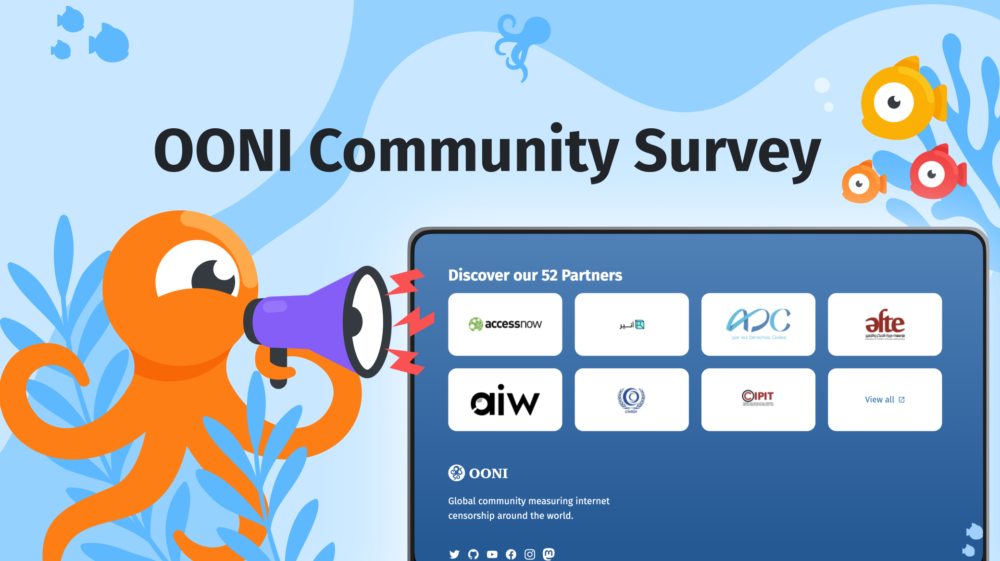

{{}}

OONI’s community now includes [over 50 organisations](https://ooni.org/partners) and hundreds of thousands of [OONI Probe](https://ooni.org/install/) users all over the world. 

We are very thankful for your trust in our tools, your support over the years and your contributions to different parts of OONI-verse through collected measurements, localisation projects, and research projects.

**With this survey, we want to reflect on our community activities and learn how we can improve upon our outreach, tools and documentation.**

Please take a few minutes to **complete our survey and share your feedback**: [https://forms.gle/nzhuvYqMYJCQyQxU9](https://forms.gle/nzhuvYqMYJCQyQxU9) 

We encourage you to share this survey with others for whom you think it might be relevant. The form will be open **until Friday, 28th February 2025**.

Thanks for your time, your feedback and thoughts are very valuable to us. Thanks for helping us to build a stronger OONI-verse!
