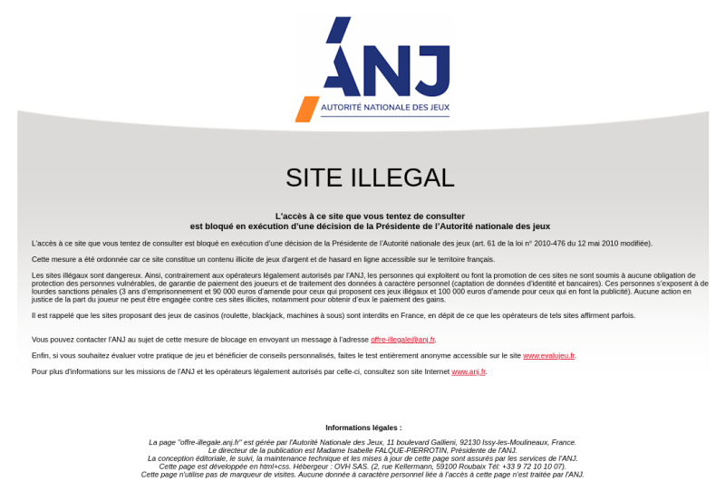
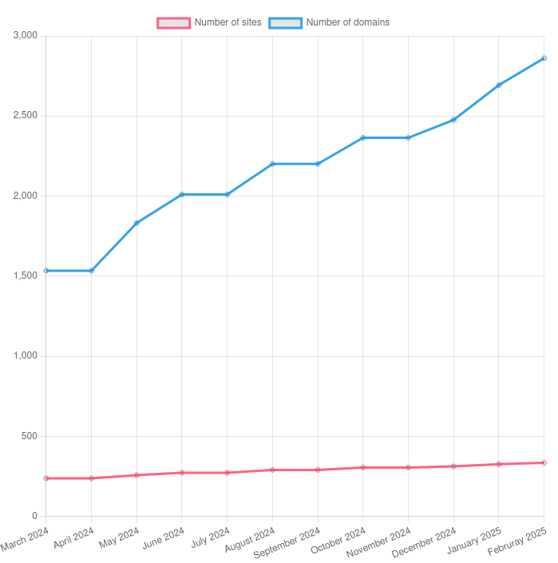
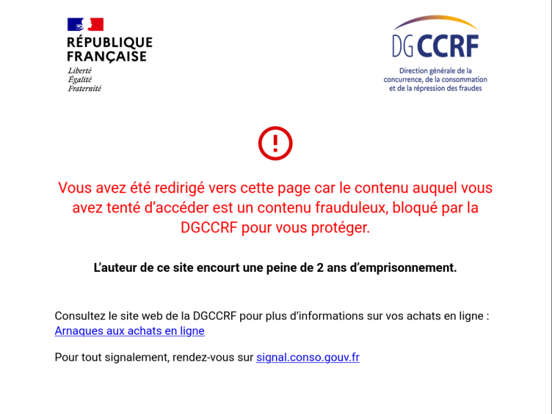

_This is a guest report by [Etienne Maynier](https://maynier.eu/) and Taziden analyzing Internet censorship in France. You can find a more in-depth legal and technical analysis in French at [https://censxres.fr/](https://censxres.fr/). This work was done in a personal capacity and doesn't represent the view of their employers._



## Key Findings

* Over the past years, several court orders have requested French Internet Service Providers to block more and more websites, whether for copyright infringement, illegal streaming of sport competitions, or more recently pornography websites. In the same time, several laws have been passed in order to provide legal power to several French administrations to block websites involved in cybercrime or fraud.
* Our OONI measurements on the four main commercial ISPs networks in the fall of 2024 show that this website censorship is implemented at the DNS resolver level, and that for most censorship cases tested (intellectual property, illegal streaming of sport competition and European censorship of Russian organizations), the application of censorship is very inconsistent among different ISPs.
* The increasing usage of website censorship to regulate political questions by French courts and lawmakers, combined with a technical implementation that is easy to bypass, create a high risk of escalation towards more complex and invasive censorship in France. Such an escalation would lead to more control and more surveillance over Internet traffic by French authorities and could have damaging implications for freedom of expression and online privacy in France.

## Introduction

Over the past few years, France has seen a major increase in censorship of internet websites, both with court orders forcing ISPs to block websites, and with new bills passed that grant legal power to national agencies to block websites. In 2024 alone, we have seen French authorities blocking TikTok in Kanaky New Caledonia, new laws permitting to block websites used for cybercrime, a legal decision blocking the Z-library website and a new law forcing pornography websites to check the age of visitors before they can access the content (law that should be applied in the first half of 2025). While the first laws that legalized Internet censorship in France opened important debates in civil society about digital rights and freedom of expression (the [Bill for Confidence in the Digital Economy - LCEN](https://fr.wikipedia.org/wiki/Loi_pour_la_confiance_dans_l%27%C3%A9conomie_num%C3%A9rique) in 2004 and the [High Authority for the diffusion of art work and protection of rights on Internet - HADOPI](https://fr.wikipedia.org/wiki/Haute_Autorit%C3%A9_pour_la_diffusion_des_%C5%93uvres_et_la_protection_des_droits_sur_internet) in 2009), this topic is now rarely addressed by digital rights organizations and is not well known by the general public. Yet, it raises important questions about freedom of expression but also the potential lack of oversight and abuse of these laws to block media or opposition websites. 

In 2024, we started a project called [Censxres](https://censxres.fr/) to aimed at providing a clear overview of the legal framework to censor Internet websites in France, and testing their implementation using OONI measurement tools. This report provides a summary of this research.

## Legal Basis for Website Censorship in France

We have classified website censorship in two categories:

* judiciary censorship means that the decision to block websites comes from court orders in application of the law;
* administrative censorship means that such decisions were taken by French authorities or national administrations without any court order.

### Judiciary censorship

The first type of censorship that appeared historically had a judiciary basis (based on a court order). It was first introduced in the 2004 [LCEN bill](https://fr.wikipedia.org/wiki/Loi_pour_la_confiance_dans_l%27%C3%A9conomie_num%C3%A9rique) that states that a court can order ISPs to take _"all measures to prevent or stop damages created by the content of an online public communication service"_. This law is excessively broad, and can and has been used to request censorship of websites for very different reasons (it was later updated by the [SREN bill](https://www.legifrance.gouv.fr/dossierlegislatif/JORFDOLE000047533100/) in 2024):

* in 2005, it was first used to block a Holocaust denier website (confirmed in appeal in 2006);
* in 2011/2012, it was used to block a local copwatching website that was gathering pictures and information on police officers in order to help identify those who committed police violence.

In 2009, the [HADOPI](https://fr.wikipedia.org/wiki/Haute_Autorit%C3%A9_pour_la_diffusion_des_%C5%93uvres_et_la_protection_des_droits_sur_internet) law added an article in the Intellectual Property Code allowing courts to request ISPs to block websites infringing intellectual property and copyright laws. This article has been used many times to block websites such as torrent websites (The Pirate Bay, torrent 411, yggtorrent), [Sci-Hub](https://en.wikipedia.org/wiki/Sci-Hub), [Libgen](https://en.wikipedia.org/wiki/Library_Genesis) or more recently the [Z library](https://en.wikipedia.org/wiki/Z-Library).

In 2021, a new bill passed that allows to block websites illegally streaming sport competitions. This new law has been used extensively by companies like [Canal+](https://en.wikipedia.org/wiki/Canal%2B_(French_TV_channel)) or [beIN Sports](https://en.wikipedia.org/wiki/BeIN_Sports) to block websites streaming the football world cup, the rugby world cup or the Paris Olympic games.

Finally in October 2024, a final decision on a legal case that had been going on for years asked to block four pornographic websites because they weren't preventing access from minors (five other websites were based in the EU and the judge requested an opinion from the European court before blocking them).

#### Pornography

Allowing minors to access pornographic websites has been illegal in France since 1992 in the criminal code article [L227-24](https://www.legifrance.gouv.fr/codes/article_lc/LEGIARTI000044394218/2021-12-02/); but for a long time, this law wasn't enforced because of the impossibility of proving someone's age without serious privacy implications.

For years, the non-profits e-Enfance and La Voix de l'Enfant have led a legal case against nine major pornographic websites in order to get their access blocked. After years of court procedures, the Paris appeal court issued [a decision on October 17th 2024](https://linforme.files.sirius.press/files/1729869318039-Cour%20d%27appel%20de%20Paris%20blocage.pdf) requesting six major ISPs block access to four of these websites: Mrsexe, Iciporno, Tukif et Xhamster. This decision was based both on the [L227-24 article](https://www.legifrance.gouv.fr/codes/article_lc/LEGIARTI000006418096/2000-04-13) of the criminal code and on [the article 6-1.8 from the LCEN bill](https://www.legifrance.gouv.fr/loda/article_lc/LEGIARTI000049577522). The decision states that the _"superior interest of the child should be an essential consideration that can justify an infringement on other laws such as freedom of expression or communication"_.  The judge ordered to block 4 websites not based in the European Union. For the five remaining websites (Pornhub, Youporn, Redtube, Xvideos et Xnxx), as they were based in the European Union, the judge decided to wait for a decision from the Court of Justice of the European Union on a question asked by the Conseil d'Etat in March 2024.

In the meantime, 2024 has seen an important bill passing that opened the door to administrative censorship of pornographic websites with [the SREN law from May 2024](https://www.legifrance.gouv.fr/dossierlegislatif/JORFDOLE000047533100/). This law makes it mandatory for pornographic websites to limit access to minors based on technical solutions established by the [ARCOM administration](https://www.arcom.fr/). In case of non-compliance with this law, they could face severe fines and be blocked by French ISPs. In October 2024, the ARCOM finally published [technical specifications](https://www.arcom.fr/se-documenter/espace-juridique/textes-juridiques/referentiel-technique-sur-la-verification-de-lage-pour-la-protection-des-mineurs-contre-la-pornographie-en-ligne) for the age control measures that websites need to apply. Pornography websites can use a variety of solutions to confirm a visitor's age but they must rely on a third party service with a double anonymity system: the third party service doesn't know why the verification was requested and the pornography website doesn't receive any information on the person other than the age confirmation. These specifications also defined a schedule: from January 9th 2025, websites will have to implement a simple verification using a credit card payment, and from April 9th 2025, they will have to implement the full age verification mechanism. 

#### Intellectual Property

After the LCEN bill enabled judges to request ISPs to block websites in 2004, this capability was extended in 2009 with the HADOPI bill that permits blocking websites infringing intellectual property with the article [L336-2 of the Intellectual Property code](https://www.legifrance.gouv.fr/codes/article_lc/LEGIARTI000020740350/2009-06-14/). This law has been used by many courts to block websites such as:

* December 4th 2014: [The Pirate Bay](https://next.ink/20043/91250-la-justice-francaise-ordonne-blocage-the-pirate-bay-et-ses-miroirs/)
* April 2nd 2015: [Torrent 411](https://next.ink/18651/93723-blocage-t411-me-jugement-et-son-explication/)
* November 2nd 2017: [cpasbien](https://next.ink/8505/105855-les-majors-disque-obtiennent-blocage-dextratorrent-torrent9-isohunt-et-cpasbien/)
* October 12th 2018: [yggtorrent](https://next.ink/6451/108436-les-producteurs-musique-font-bloquer-plusieurs-sites-dont-cyberlockers/)
* March 7th 2019: [Sci-hub and Libgen](https://next.ink/6990/107689-les-principaux-fai-francais-doivent-bloquer-sci-hub-et-libgen/) ([decision from 2019](https://cdn2.nextinpact.com/medias/jugement-sci-hub-mars-2019.pdf), [2020](https://www.soundofscience.fr/wp-content/uploads/2021/03/Jugement-TJ-Paris-18122020.pdf) and [2022](https://cdnx.nextinpact.com/data-next/file-uploads/minutes%20Elsevier.pdf))
* September 12th 2024: [Z-Library](https://www.linforme.com/medias-culture/article/la-justice-ordonne-le-blocage-de-la-bibliotheque-pirate-z-library_2025.html) (see [the decision](https://linforme.files.sirius.press/files/1726146112559-Decision%20Zlibrary.pdf)).

This law was extended in 2021 at the time of the ARCOM creation (a fusion between the former CSA and HADOPI administrative authorities). [The new article L331-27](https://www.legifrance.gouv.fr/codes/article_lc/LEGIARTI000044259162) allows the ARCOM to ask ISPs to block mirrors of websites already blocked through a court decision. [According to the 2023 ARCOM activity report](https://www.arcom.fr/se-documenter/etudes-et-donnees/etudes-bilans-et-rapports-de-larcom/rapport-annuel-2023-de-larcom), this law has been used 88 times in 2023 to block 549 domains.

#### Illegal Streaming of Sport Competitions

In 2021, the [bill related to the regulation and protection of access to cultural work in the digital area](https://www.legifrance.gouv.fr/dossierlegislatif/JORFDOLE000043339178/) created a new section in the Sport Code in order to fight against illegal streaming of sport competitions. The [article L333-10](https://www.legifrance.gouv.fr/codes/id/LEGIARTI000044247629/2021-10-27) enables copyright holders to make legal requests to a court through an accelerated process to block websites that stream sport events without authorization. Copyright holders first need to get a court order to block the original websites before they can request to block mirror websites directly through the ARCOM without further court approval. 

This law has been applied in many court decisions, like by [beIN Sports during the Africa Cup of Nations](https://www.linforme.com/medias-culture/article/coupe-d-afrique-des-nations-bein-sports-fait-bloquer-56-sites-pirates_1373.html), [Canal+ against sites streaming formula 1 races](https://www.linforme.com/tech-telecom/article/centralareana-livetv-canal-exige-le-blocage-des-sites-pirates-diffusant-la-formule-1_1758.html) or [the Olympic Committee during the Paris Olympic Games](https://www.linforme.com/tech-telecom/article/le-comite-d-organisation-des-jeux-olympiques-fait-bloquer-plusieurs-sites-pirates_1935.html). In October 2023, [Canal+ sued Google, Cisco and CloudFlare](https://www.linforme.com/tech-telecom/article/piratage-sportif-canal-obtient-le-blocage-d-une-centaine-de-sites-par-google-cisco-et-cloudflare_1714.html) for providing public DNS resolvers that weren't affected by judicial website censorship. The court decision forced these companies to block illegal streaming websites as requested by Canal+. Following this decision, Cisco decided to [limit French IP addresses from using the OpenDNS service](https://next.ink/142507/contraint-de-bloquer-des-noms-de-domaine-opendns-decide-de-quitter-la-france/).

### Administrative censorship

Administrative censorship refers to any administration or authority having a legal basis to block websites without involving a judge or a court decision. Over the past years, several laws have passed that moved judiciary censorship into administrative censorship, allowing French administrations or authorities to censor websites without any independent control by a judge.

#### Terrorism and Child Sex Abuse Material

The first case of administrative censorship in France was introduced to fight against child sex abuse material (CSAM) by allowing the police to block such websites through [the LOPPSI bill](https://fr.wikipedia.org/wiki/Loi_d%27orientation_et_de_programmation_pour_la_performance_de_la_s%C3%A9curit%C3%A9_int%C3%A9rieure) in 2011. This law allows the OCLCTIC police office (now [Office anti-cybercriminalité](https://fr.wikipedia.org/wiki/Office_anti-cybercriminalit%C3%A9) - OFAC since 2023) to provide a list of domains hosting CSAM to ISPs in order to block them. This law was later extended to include _"incitation or apology of terrorism"_ content in a [2014 bill against terrorism](https://www.legifrance.gouv.fr/loda/id/JORFTEXT000029754374). A 2024 law has extended this process for 2 years to cover content that can be qualified as torture or cruelty as defined by the criminal code. The [article 6-1](https://www.legifrance.gouv.fr/loda/article_lc/LEGIARTI000029756525/2014-11-15/#LEGIARTI000029756525) in the LCEN law defines the process to block domains. It identifies a qualified person from the [ARCOM](https://www.arcom.fr/) (previously from the CNIL until 2022) in charge of the oversight of this process. The process is as follows:

1. When the police identifies a website that hosts CSAM, or content promoting terrorism or inciting to terrorist acts, they can contact the website owner or the hosting provider to request them to remove it. They have to inform the ARCOM qualified person at the same time.
2. If the content is removed, the process ends. If the content is not removed within 24h, they can then request ISPs and search engines to block and de-reference this website, and should inform the qualified person.
3. The ARCOM qualified person checks if the request is justified according to the law. If they consider that it is, they inform the police office, and the blocking continues. If they consider that it is not, they provide a negative opinion to the OFAC and recommend to unblock the domain.
4. The OFAC can then decide to follow the ARCOM opinion and unblock the website, or ignore it. If they do ignore it, the ARCOM qualified person can open a legal case to the administrative court.

The ARCOM qualified person is also in charge of providing yearly transparency reports that include details on the domains blocked, which allowed us to retrace the number of domains blocked since 2015:

| |Request of removal for terrorism|Request of removal for CSAM|Request of removal total|Content removed terrorism|Content removed CSAM|Content removed total|Blocked terrorism|Blocked CSAM|Blocked Total|Links|
| ---- | --------------------- | --------------------- | ------------------ | -------------------- | -------------------- | -------------- | ------------- | ------------- | ------- | --------------------- |
| 2015 | 1 286                 | 153                   | 1 439              | 1 080                | 99                   | 1 179          | 43 | 240 | 283 | [Report](https://www.vie-publique.fr/sites/default/files/rapport/pdf/184000340.pdf) |
| 2016 | 2189 | 372 | 2 561 | 1975 | 330 | 2305 | 165 | 709 | 874 | [Report](https://www.vie-publique.fr/sites/default/files/rapport/pdf/184000341.pdf) |
| 2017 | 32 739 | 2 371 | 35 110 | 6 320 | 1 404 | 7 724 | 83 | 680 | 763 | [Report](https://www.cnil.fr/sites/default/files/atoms/files/cnil_rapport-blocage-2017.pdf) |
| 2018 |10 091 | 7 923 | 18 014 | 6 796 | 6 625 | 13 421 | 82 | 797 | 879 | [Report](https://www.cnil.fr/sites/default/files/atoms/files/cnil_rapport_blocage_2018_web.pdf) |
| 2019 | 4 332 | 7 542 | 11 874 | 2 626 | 5 479 | 8 105 | 15 | 405 | 420 | [Report](https://www.cnil.fr/sites/default/files/atoms/files/cnil_rapport_blocage_2019.pdf) |
| 2020 | 3 645 | 46 803 | 46 803 | 2 986 | 33 724 | 36 710 | 28 | 491 | 519 | [Report](https://www.cnil.fr/sites/default/files/atoms/files/rapport_linden_2020.pdf) |
| 2021 | 14 888 | 118 407 | 133 295 | 13 235 | 115 802 | 129 037 | 19 | 420 | 439 | [Report](https://www.cnil.fr/sites/default/files/atoms/files/rapport_linden_2021.pdf) |
| 2022 | 15 177 | 67 577 | 82 754 | 11 950 | 61 135 | 73 685 | 12 | 381 | 393 | [Report](https://www.cnil.fr/sites/cnil/files/2023-06/rapport-activite_personnalite_qualifiee_2022.pdf) |
| 2023 | 22 924 | 95 236 | 118 160 |  | | | 22 | 659 |681 | [Report](https://www.arcom.fr/sites/default/files/2024-06/Arcom-Rapport-activite-2023-de-la-personnalite-qualifiee.pdf) |

As we can see in this table, in most cases, the content is actually removed by the website owner or the hosting provider under the threat of censorship but before the website is blocked and dereferenced. For instance in 2021, we see that this is what happened for 96% of cases. Yet, several hundreds domains are blocked by ISPs every year and the list of websites blocked is confidential. 

The ARCOM qualified person also provides some details on the recommendations given to the OFAC, which gives an idea of the discussions and disagreements between the police and the person in charge of oversight of this process. For instance, [the 2023 report](https://www.arcom.fr/sites/default/files/2024-06/Arcom-Rapport-activite-2023-de-la-personnalite-qualifiee.pdf) mentions that the OFAC has requested to remove content from an online shopping website related to clothes with a red star and the mention "ACTION DIRECTE" as it was considered by the police as a apology of terrorism. The ARCOM qualified person considered that it was a disproportionnate attack against free speech and gave a negative recommendation. As the police didn't follow this recommendation, they opened a legal case to the administrative court (that is still in progress as far as we know).

The most important case of abuse of this law happened in 2017, when the police (the OCLCTIC at that time) considered four publications on Indymedia Nantes and Indymedia Grenoble as an apology of terrorism. [Indymedia](https://en.wikipedia.org/wiki/Indymedia) is a network of autonomous media working with an open publication model and moderation after publication. On September 21st 2017, [a voluntary fire destroyed several police cars](https://www.liberation.fr/france/2017/09/21/l-incendie-volontaire-de-la-gendarmerie-de-grenoble-revendique_1597986/) in a police station near Grenoble without anyone injured. On the same day, a statement claiming responsibility for these acts in solidarity with people arrested for an attack against a police car was posted on Indymedia Grenoble and Nantes. [These two websites received immediately a takedown request from the OCLCTIC](https://paris-luttes.info/communique-apres-indymedia-8752?lang=fr) which considered these statements as an apology of terrorism. The qualified person (at that time at the CNIL) provided a negative opinion on this decision. For the first time, the police decided not to follow this position and to maintain this decision which led the qualified person to open a legal case to the administrative court. The court concluded [on February 4th 2019](https://cergy-pontoise.tribunal-administratif.fr/decisions-de-justice/dernieres-decisions/internet-premier-jugement-rendu-sur-saisine-de-la-personnalite-qualifiee-designee-par-la-cnil) that these statements were not an apology of terrorism acts, a year and a half after the initial request to remove the publications.

#### Online Gambling Websites

In 2010, the French Parliament passed the [2010-476 bill](https://www.legifrance.gouv.fr/loda/id/JORFTEXT000022204510) to regulate online gambling websites. This law created the Online Gambling Regulation Authority, the ARJEL in charge of approving online gambling websites and blocking those not respecting the French legislation. This law was largely modified by the [2019-1015 order](https://www.legifrance.gouv.fr/loda/id/JORFTEXT000039167499) that transfered this responsibility to the [Autorité Nationale des Jeux](https://anj.fr/) (ANJ - [National Gambling Authority](https://en.wikipedia.org/wiki/National_Gaming_Authority)) and added new obligations to online gambling websites. The ANJ is now in charge of controlling online gambling sites on sport and horse races, along with online casino (mostly poker, roulette for instance is not legal in France). As of January 2025, it has provided an authorization to [only 17 operators listed on its website](https://anj.fr/offre-de-jeu-et-marche/operateurs-agrees). 

Until March 2023, the ARJEL (and then the ANJ) had to go through court decisions to requests ISPs to block websites (see for instance [this court decision](https://cdn2.nextinpact.com/medias/spintintropolis.pdf) from 2018). This procedure was modified by [the 2022 bill to democratize sport in France](https://www.legifrance.gouv.fr/jorf/id/JORFARTI000045287577) that allowed the ANJ to directly request ISPs to block unlawful gambling websites if the website owner hasn't done any action to prevent French people from using it 5 days after he was contacted. This new procedure thus remove any control from a judge (even if a specific website can contest this decision afterwards before an administrative court).

The new procedure is as follows:

1. ANJ Investigators establish an official report confirming that an online gambling website is accessible from France while not officially authorized by the authority
2. They send a formal request to both the website owner and the hosting provider, asking them to block visits from France within 5 days
3. 5 days after, they check if the website is still accessible. If not, the procedure ends. If it is, they establish a second official report confirming that access from France is still possible.
4. An administrative order is then signed by the ANJ president and sent to ISPs and search engines asking them to block and dereference these websites
5. Then they confirm that these websites were indeed blocked

{{}}

_ANJ Blocking page_

The list of domains blocked is available publicly at this address : [https://ressources.anj.fr/blocage_sites_illegaux/blocage_sites_illegaux.csv](https://ressources.anj.fr/blocage_sites_illegaux/blocage_sites_illegaux.csv). In January 2025 for instance, it lists 2693 domains related to 326 sites. Based on activity reports from the ARJEL and the ANJ, we have gathered incomplete historical numbers of websites blocked:

| Date | Number of sites blocked | Number of domains blocked | Source |
|------|-------------------------|----------------------------|--------|
| 2010 |1 |Unknown|[Source](https://anj.fr/sites/default/files/2020-10/rapport-activite-2014.pdf) |
| 2011 |2 |Unknown|[Source](https://anj.fr/sites/default/files/2020-10/rapport-activite-2014.pdf) |
| 2012 |31 |Unknown|[Source](https://anj.fr/sites/default/files/2020-10/rapport-activite-2014.pdf) |
| 2013 |31 |Unknown |[Source](https://anj.fr/sites/default/files/2020-10/rapport-activite-2014.pdf) |
| 2014 |43 |Unknown |[Source](https://anj.fr/sites/default/files/2020-10/rapport-activite-2014.pdf) |
| 2015 |45 |Unknown |[Source](https://anj.fr/sites/default/files/2020-10/Rapport%2015-16.pdf) |
| 01/04/2016 to 31/03/2017 |35|148 |[Source](https://anj.fr/sites/default/files/2020-10/Rapport%2016-17.pdf) |
| 01/04/2017 to 31/03/2018 |72|Unknown |[Source](https://anj.fr/sites/default/files/2019-12/rapport-activite-2019.pdf) |
| 01/04/2018 to 31/03/2019 |92|248 |[Source](https://anj.fr/sites/default/files/2019-12/rapport-activite-2019.pdf) |
| 01/04/2020 to 31/03/2021 |67|141 |[Source](https://anj.fr/sites/default/files/2021-07/Rapport_ANJ_web.pdf) |
| 2022 | 99 | 308 | [Source](https://anj.fr/sites/default/files/2023-07/Rapport%20annuel%202022.pdf) |
| 2023 | 262 | 1274 | [Source](https://anj.fr/sites/default/files/2024-11/Rapportannuel_2023.pdf)

Since March 2024, we have been archiving this list monthly [on GitHub](https://github.com/Te-k/censure_anj/tree/main/archives) which give us more precise historical data:

{{}}

#### Fraud

In 2020, a very broad bill adapting European directives and called the [DDADUE law](https://www.economie.gouv.fr/dgccrf/actualites/loi-ddadue-et-protection-du-consommateur) was voted and added the possibility to censor websites not respecting the French law related to conformity and security of products sold online, and rules related to the protection of economic interests of citizen. Technically, it allows the [DGCCRF](https://www.economie.gouv.fr/dgccrf) (National administration in charge of competition, consumption and fraud control) to request ISPs, registries and registrar to block domains when they observe a law violation that could be charged with at least two years in jail. This is defined in the [article L521-3-1](https://www.legifrance.gouv.fr/codes/article_lc/LEGIARTI000042615686) from the Code de la consommation. 

We have little information on the application of this law. It seems that it was used for the first time against the [e-commerce website Wish](https://www.economie.gouv.fr/protection-consommateurs-sanction-place-marche-ligne-wish) in 2021 for lack of security in the products they were selling. The DGCCRF has communicated a few times on other cases, such as the blocking [of two online websites](https://signal.conso.gouv.fr/fr/actualites/deux-sites-frauduleux-bloques) makrea.com and cadeau-naruto.com in October 2024. The website permislib.fr [was apparently also blocked](https://www.bouches-du-rhone.gouv.fr/Actualites/Toute-l-actualite/L-acces-au-site-permislib.fr-bloque-pour-pratiques-commerciales-trompeuses) for misleading commercial practices in November 2024.

{{}}

_DGCCRF Blocking Page_

The DGCCRF annual reports provide some information on the application of this law, but sometimes under the broad "réquisitions numérique" category that includes more than just blocking domains: 

|Year|Réquisition numérique|Access limitation|Blocking domains| |
|----|---------------------|-----------------|----------------|-|
|2022|86|56|30|[Report](https://www.economie.gouv.fr/files/files/directions_services/dgccrf/dgccrf/rapports_activite/2022/ra-dgccrf-2022.pdf?v=1721633754)|
|2023|153|?|?|[Report](https://www.economie.gouv.fr/files/files/directions_services/dgccrf/dgccrf/rapports_activite/2023/bilan_activit%C3%A9-DGCCRF_2023.pdf?v=1721633754)|

There is overall very limited transparency on the application of this law by the DGCCRF since 2020.

#### Cybercrime

The [2024 military scheduling law](https://www.legifrance.gouv.fr/jorf/id/JORFTEXT000047914986) (Loi de programmation militaire) has established a new procedure of administrative censorship for websites used in cyberattacks, in the article [L2321-2-3 of the defense code](https://www.legifrance.gouv.fr/codes/article_lc/LEGIARTI000047920539). This article allows the [ANSSI](https://en.wikipedia.org/wiki/Agence_nationale_de_la_s%C3%A9curit%C3%A9_des_syst%C3%A8mes_d%27information) (French National Agency for the Security of Information Systems) to request ISPs to block domain names or to redirect traffic for specific domain names to another server. This measure should be applied to _"threats to national defense and security"_ and should only be used _"for a duration and in a way strictly necessary and proportionate in their effect to the preservation of the network integrity, to the characterization and neutralization of the threat and to the information of the users or owners of the affected, threatened or attacked systems"_. These measures are controlled by the [ARCEP](https://www.arcep.fr/) (the national administration in charge of regulation of electronic communications, mails and press distribution).

As this law is recent, we have very little knowledge on the effect of this law. To our knowledge, there is no transparency on the number of domains blocked each year or the justification for this blocking. Neither the ANSSI nor ARCEP have communicated on the application of this law.

#### TikTok Censorship in New Caledonia / Kanaky

In May 2024, a draft bill proposed by the French government intended to make important changes in [the 1998 Nouméa Accord](https://en.wikipedia.org/wiki/Noum%C3%A9a_Accord) including on the definition of who is able to vote in provincial elections in Kanaky / New Caledonia. [New Caledonia](https://en.wikipedia.org/wiki/New_Caledonia) is a group of islands in the Pacific Ocean that is part of overseas France since its colonization in 1853. After years of conflicts between the Kanak independence movement and France in the 70's and 80's, the Nouméa Accord promised to grant increasing political power to the indigenous population and the province over a twenty-year transition period. Several referendums in 2018, 2020 and 2021 rejected independence but with debated voting condition, and with the latest one being boycotted by the pro-independence movement.

In this tense context, after the May 2024 draft bill was proposed, [protests and riots broke out](https://en.wikipedia.org/wiki/2024_New_Caledonia_unrest) in Nouméa and other parts of New Caledonia. On the 16th of May, the government declared a state of emergency and that TikTok should be blocked. This censorship was implemented on May 15th at the DNS resolver level by the national and only New Caledonian ISP ["l’Office des postes et télécommunications de Nouvelle-Calédonie"](https://office.opt.nc/fr) as confirmed [by people on the island](https://video.lefigaro.fr/figaro/video/nouvelle-caledonie-images-de-lapplication-tiktok-bloquee/). 

This blocking decision was not formalized in any legal order by the authorities. On May 17th, La Quadrature du Net [issued a référé-liberté](https://www.laquadrature.net/2024/05/17/la-quadrature-du-net-attaque-en-justice-le-blocage-de-tiktok-en-nouvelle-caledonie/) (an urgent legal case) requesting the [Conseil d'Etat](https://en.wikipedia.org/wiki/Conseil_d%27%C3%89tat) to suspend this blocking, thinking that it was an application of the 1955 state of emergency law. In front of the Conseil d'Etat, the government had to justify the legal basis for this decision and revealed that it actually based it on the ["theory of exceptional circumstances"](https://fr.wikipedia.org/wiki/Circonstances_exceptionnelles), a very broadly defined law that allows to accept some otherwise unlawful decrees in times of crisis (a law mostly used during WWII). To justify these exceptional circumstances, the government showed several publications on TikTok related to the protests but none of them clearly being calls for violence. Despite this lack of justification, the Conseil d'Etat didn't sanction the government, largely based it seems on the indication by the government that this blocking wouldn't last. 

The blocking was removed on May 29th. The draft bill was cancelled in June 2024 after the President Macron disbanded the Parliament and called for a new election.

### European Censorship of Russian Organizations

The Russian invasion in Ukraine has led the Council of the European Union to take the decision to ban several Russian media in all EU countries. On February 22nd 2022, Ursula von der Leyen announced that she wanted to forbid Russian media in Europe. On March 1st, the Council of the European Union took the [Council Decision (CFSP) 2022/351](https://eur-lex.europa.eu/legal-content/EN/TXT/?uri=CELEX:32022D0351) and the [Council Regulation (EU) 2022/350](https://eur-lex.europa.eu/legal-content/EN/TXT/?uri=CELEX:32022R0350) that requested to block access to [Russia Today](https://en.wikipedia.org/wiki/RT_(TV_network)) and [Sputnik News](https://en.wikipedia.org/wiki/Sputnik_(news_agency)) _"by any means such as cable, satellite, IP-TV, internet service providers, internet video-sharing platforms or applications, whether new or pre-installed"_. This decision was justified by the propaganda activity of these media and the need to fight against Russian disinformation: _"In view of the gravity of the situation, and in response to Russia’s actions destabilising the situation in Ukraine, it is necessary, consistent with the fundamental rights and freedoms recognised in the Charter of Fundamental Rights, in particular with the right to freedom of expression and information as recognised in Article 11 thereof, to introduce further restrictive measures to urgently suspend the broadcasting activities of such media outlets in the Union, or directed at the Union."_

It was the first time in the history of the Council of the European Union that a decision to prohibit a media was taken. The [Body of European Regulators for Electronic Communications](https://en.wikipedia.org/wiki/Body_of_European_Regulators_for_Electronic_Communications) (BEREC) has published [a clarification on March 4th](https://www.berec.europa.eu/en/latest-news/berec-open-internet-regulation-is-not-an-obstacle-in-implementing-eu-sanctions-to-block-rt-and-sputnik) indicating that such decision did not infringe net neutrality principles. [A second clarification on March 12th](https://www.berec.europa.eu/en/latest-news/berec-supports-isps-in-implementing-the-eu-sanctions-to-block-rt-and-sputnik) precised that this decision should be understood broadly and that Russia Today and Sputnik News domains should be blocked by all ISP in all EU countries.

Several organizations have criticized this decision and raised legal concerns. [The European Federation of Journalists](https://europeanjournalists.org/blog/2022/03/01/fighting-disinformation-with-censorship-is-a-mistake/) raised the issue that media regulation does not fall within the competence of the European Union and criticized blocking media outlets to fight against propaganda: _"This act of censorship can have a totally counterproductive effect on citizens who follow banned media. In our opinion, it is always better to counter disinformation of propagandist or allegedly propagandist media by exposing their factual errors or bad journalism, by demonstrating their lack of financial or operational independence, by highlighting their loyalty to government interests and their disregard for the public interest.”_ Several journalists and academics such as [Dirk Voorhoof](https://inforrm.org/2022/05/08/eu-silences-russian-state-media-a-step-in-the-wrong-direction-dirk-voorhoof/) have criticized the lack of necessity or proportionality of this decision: _"To be clear: the EU is not at war with Russia and Ukraine is not a Member State of the EU. There must therefore be very strong reasons to justify the EU ban on RT and Sputnik as relevant, proportionate and necessary."_. The [NGO Article 19 shared this same concern](https://www.ohchr.org/sites/default/files/documents/issues/expression/cfis/conflict/2022-10-07/submission-disinformation-and-freedom-of-expression-during-armed-conflict-UNGA77-cso-article19.pdf) by raising that _"The EU should demonstrate that RT and Sputnik’s programmes actually constitute a serious and immediate threat to public order and security to justify a ban in all EU Member States"_.

Even with the lack of clarification on this decision, it was applied very quickly by French ISPs as reported [by NextINpact](https://next.ink/4590/blocage-rt-et-sputnik-operateurs-francais-en-attente-consignes-claires/) in March 2022.

This decision has been regularly updated since to add more prohibited organizations:

* [On June 3rd 2022](https://eur-lex.europa.eu/legal-content/EN/TXT/?uri=celex%3A32022D0884), to add RTR Planeta, Russia 24 and TV Centre International
* [On December 16th 2022](https://eur-lex.europa.eu/legal-content/EN/TXT/?uri=celex%3A32022D2478) to add NTV Mir, Rossiya 1, REN TV and Pervyi Kanal
* [On February 25th 2023](https://eur-lex.europa.eu/legal-content/EN/TXT/?uri=celex%3A32023D0434) to add RT Arabic and Sputnik Arabic
* [On June 23rd 2023](https://eur-lex.europa.eu/legal-content/EN/TXT/?uri=celex%3A32023D1217) to add RT Balkan, Oriental Review, Tsargrad, New Eastern Outlook, Katehon
* [On May 17th 2024](https://eur-lex.europa.eu/legal-content/EN/TXT/?uri=celex%3A32024D1429) to add Voice of Europe, RIA Novosti, Izvestija and Rossiiskaja Gazeta

## Network Measurements - Methodology

Between September and November 2024, we made OONI Web Connectivity tests in order to analyse the implementation of the different forms of censorship. We didn't perform measurement tests on all the censorship categories described above, either because there were legal and ethical issues doing so (like CSAM or terrorism websites) or because we couldn't create a significant list of potentially blocked websites (like with fraud or cybercrime). Our tests focused on five specific categories for which we were able to establish a list of potentially blocked websites:

* **On Intellectual Property**, we used legal decisions published by Marc Rees in Next INpact and then L'Informé and obtained a list of 395 domains
* **On streaming of sport events**, we also used legal decisions published by Marc Rees and made a list of 542 domains
* **On illegal online gambling websites**, we used the list published by the ANJ in September 2024
* **On European censorship**, we used the list of organisations from the [2014/512/CFSP](https://eur-lex.europa.eu/legal-content/EN/TXT/?uri=CELEX%3A02014D0512-20240724) decision of the Council of the European union and identified 21 domains
* **On pornography websites**, we did tests on the four websites that should be blocked by ISPs according to the October 2024 legal decision by the Paris court of appeal.

We created a text file with all these domains, and used the OONI command line tool to do Web Connectivity tests on the network of the 4 main commercial ISPs:

* Orange : [AS3215](https://bgp.he.net/AS3215)
* Free : [AS51207](https://bgp.he.net/AS51207) and [AS12322](https://bgp.he.net/AS12322)
* Bouygues : [AS5410](https://bgp.he.net/AS5410)
* SFR : [AS15557](https://bgp.he.net/AS15557)

These tests were performed between September and November 2024. We then acquired data from OONI S3 buckets using [ooni-data](https://github.com/ooni/data) and made an automated analysis using python scripts completed with manual verifications. 

We have also contributed to the [OONI Test list for France](https://github.com/citizenlab/test-lists/blob/master/lists/fr.csv) by adding many websites blocked for different reasons in France (due to the very frequent changes in infrastructure of online streaming and downloading website, it is challenging to keep this list up-to-date and useful, we have thus limited the number of domains listed in these categories).

## Network Measurements - Results

### Intellectual Property

Tests done on 395 domains in September and October 2024:

| | Blocked |
|-|---------|
| Free |286 - 72.40 %|
| Orange |364 - 92.15%|
| SFR | 200 - 50.63%|
| Bouygues |216 - 54.68%|
| Blocked by all ISPs|141 - 35.70%|
|Blocked by no ISP|18 - 4.55%|

We can see that there is an important variation in the number of websites blocked by ISPs, only 141 websites are blocked by all ISPs (35.70% of them) with 377 domains blocked by at least one ISP (you can find the detail of these measurements [here](https://gist.github.com/Te-k/f477e1ad9529479fe3364b21f31da3bb)). 

### Streaming of Sport Events

Tests done in September and October 2024 over 542 domains:

| | Blocked|
|-|--------|
|Free|210 - 38.75%|
|Orange|262 - 48.34%|
|SFR|152 - 28.04%|
|Bouygues|149 - 27.49%|
|Blocked by all ISP|132 - 24.35%|
|Blocked by no ISP|251 - 46.31%|

If we only consider the 291 domains blocked by at least one ISP, we get the following percentages:

| | Blocked|
|-|--------|
|Free|210 - 72.16%|
|Orange|262 - 90.03%|
|SFR|152 - 52.23%-
|Bouygues|149 - 51.20%|

So we see that there is again an important variation on the number of domains blocked by each ISP (you can find the detail of those measurements [here](https://gist.github.com/Te-k/9bf69f95c2da09353a994e692da4d5ad)).

### Illegal online gambling websites

For illegal online gambling websites, we tested the list of domains publicly provided by the ANJ in September 2024, with 2199 domains for 291 different sites. The tests were made in September and October 2024:

| | Blocked|
|-|--------|
|Free|2187 - 99.45%|
|Orange|2187 - 99.45%|
|SFR|2147 - 97.63%|
|Bouygues|2183 - 99.27%|
|Blocked by all ISPs|2143 - 97.45%|
|Blocked by no ISP|12 - 0.54%|

These tests show that on that category, censorship is quite uniformly applied between the different ISPs. Nevertheless 37 websites from that list aren't blocked by all ISP and 12 of them aren't blocked at all. We haven't found any clear reason for that as all these websites are in the publicly available ANJ list. For instance, the domain `dublinbet-casino.info` is not blocked by any ISP, while it belongs to the DublinBet website whose other domains are blocked (you can find the detailed measurements [here](https://gist.github.com/Te-k/03f4adc33b63c7693f3152390172d5fd)).

### European Censorship

Tests done on 21 domains between September and November 2024:

| Site | Domain| Free | Orange | SFR | Bouygues |
|------|--------|------|--------|-----|----------|
| [Russia Today](https://en.wikipedia.org/wiki/RT_(TV_network)) | www.rt.com | [🚫](https://explorer.ooni.org/fr/m/20241002120933.664318_FR_webconnectivity_b745cd3218bf2dba) | [🚫](https://explorer.ooni.org/fr/m/20241002165954.347267_FR_webconnectivity_6887c7f6287b74d2) | [🚫](https://explorer.ooni.org/fr/m/20241012045859.310357_FR_webconnectivity_b86cda10e6c743e6) | [🚫](https://explorer.ooni.org/fr/m/20241012093305.302957_FR_webconnectivity_e535b330d0c49c08) |
| [Sputnik](https://fr.wikipedia.org/wiki/Sputnik_%28agence_de_presse%29) | sputniknews.com (old domain) | [🚫](https://explorer.ooni.org/fr/m/20241002043502.950551_FR_webconnectivity_2af3af40e11ca326) | [🚫](https://explorer.ooni.org/fr/m/20241002212404.626235_FR_webconnectivity_6e8f2c194a771d8d) | [🚫](https://explorer.ooni.org/fr/m/20241012090709.521262_FR_webconnectivity_2434f4089054200a) | [🚫](https://explorer.ooni.org/fr/m/20241012083734.650587_FR_webconnectivity_e9791a886a1be45c) |
| [Sputnik](https://fr.wikipedia.org/wiki/Sputnik_%28agence_de_presse%29) | sputnikglobe.com (new domain) | [✅](https://explorer.ooni.org/fr/m/20241002043502.186909_FR_webconnectivity_d5bc2d41129f0d7a) | [✅](https://explorer.ooni.org/fr/m/20241002015529.532439_FR_webconnectivity_a1e78a85cd92bfa2) | [✅](https://explorer.ooni.org/fr/m/20241012090708.992038_FR_webconnectivity_bf04bd85cf86151a) | [✅](https://explorer.ooni.org/fr/m/20241012083734.101894_FR_webconnectivity_60555446f4654691) |
| [RTR Planeta](https://fr.wikipedia.org/wiki/RTR_Planeta) | rtr-planeta.com | [✅](https://explorer.ooni.org/fr/m/20240928184153.756388_FR_webconnectivity_8d956318c81d82da) | [✅](https://explorer.ooni.org/fr/m/20241008203318.449424_FR_webconnectivity_b33b854fc6803a81) | [🚫](https://explorer.ooni.org/fr/m/20241004131932.805443_FR_webconnectivity_ebc7cff21d22920c) | [🚫](https://explorer.ooni.org/fr/m/20241013065658.488277_FR_webconnectivity_93c8561e81723de2) |
| [RTR Planeta](https://fr.wikipedia.org/wiki/RTR_Planeta) | vgtrk.ru | [✅](https://explorer.ooni.org/fr/m/20241009231012.010803_FR_webconnectivity_456bddbe0cf61910) | [✅](https://explorer.ooni.org/fr/m/20241009024252.826348_FR_webconnectivity_f71f77b047f4dfd5) | [✅](https://explorer.ooni.org/fr/m/20241009100048.492533_FR_webconnectivity_12444d35b0120d77) | [✅](https://explorer.ooni.org/fr/m/20241014200722.469453_FR_webconnectivity_437f9ffc04ebf126) |
| [Rossiya 24](https://fr.wikipedia.org/wiki/Rossiya_24) | www.vesti.ru | [🚫](https://explorer.ooni.org/fr/m/20240927215955.823348_FR_webconnectivity_6e460585f357208d) | [✅](https://explorer.ooni.org/fr/m/20241015092858.509484_FR_webconnectivity_f1e93e1bd57d484d) | [🚫](https://explorer.ooni.org/fr/m/20241015135738.768594_FR_webconnectivity_425e30d1143d9f2a) | [🚫](https://explorer.ooni.org/fr/m/20240923014917.355172_FR_webconnectivity_a91f8d776b6b1b55) |
| [TV Centre](https://fr.wikipedia.org/wiki/TV_Centre) | www.tvc.ru | [🚫](https://explorer.ooni.org/fr/m/20241002121012.999704_FR_webconnectivity_9c3af4a193a41982) | [✅](https://explorer.ooni.org/fr/m/20241015001434.699601_FR_webconnectivity_ca5328232325f722) | [🚫](https://explorer.ooni.org/fr/m/20241011185408.890178_FR_webconnectivity_9213fe97eb40ad2a) | [🚫](https://explorer.ooni.org/fr/m/20241010172905.340030_FR_webconnectivity_bba017ca75550814) |
| [NTV](https://fr.wikipedia.org/wiki/NTV_%28Russie%29) | www.ntv.ru ntv.ru | [✅](https://explorer.ooni.org/fr/m/20241002184501.501870_FR_webconnectivity_0775891c1b317a87) | [✅](https://explorer.ooni.org/fr/m/20241002213250.969292_FR_webconnectivity_96ca1af0fbc32996) | [✅](https://explorer.ooni.org/fr/m/20241012102225.229782_FR_webconnectivity_69b36df5c4626cf7) | [✅](https://explorer.ooni.org/fr/m/20241012005631.363568_FR_webconnectivity_b996085ba4865140) |
| [Rossiya 1](https://fr.wikipedia.org/wiki/Rossiya_1) | russia.tv (old domain) | [✅](https://explorer.ooni.org/fr/m/20240924002226.848178_FR_webconnectivity_a0614c1c387fb736) | [✅](https://explorer.ooni.org/fr/m/20240924205329.991675_FR_webconnectivity_440282d343276c37) | [🚫](https://explorer.ooni.org/fr/m/20241009094949.837087_FR_webconnectivity_6f6f36d291c1217b) | [🚫](https://explorer.ooni.org/fr/m/20241006173439.605802_FR_webconnectivity_5b7f61e7d507fed7) |
| [Rossiya 1](https://fr.wikipedia.org/wiki/Rossiya_1) | smotrim.ru (new domain) | [🚫](https://explorer.ooni.org/fr/m/20241012093817.545979_FR_webconnectivity_d648e95a8507e84a) | [✅](https://explorer.ooni.org/fr/m/20241013113036.711693_FR_webconnectivity_f9089eb429778016) | [🚫](https://explorer.ooni.org/fr/m/20241013140140.833734_FR_webconnectivity_c37485576b9a943e) | [🚫](https://explorer.ooni.org/fr/m/20241013121648.220954_FR_webconnectivity_6193f08558b35b88) |
| [REN TV](https://fr.wikipedia.org/wiki/REN) | www.ren.tv ren.tv | [✅](https://explorer.ooni.org/fr/m/20241002043412.828715_FR_webconnectivity_06ee4e429bb79ba8) | [✅](https://explorer.ooni.org/fr/m/20241002182352.153681_FR_webconnectivity_fcbb5cb405ff8a9e) | [✅](https://explorer.ooni.org/fr/m/20241010141930.877394_FR_webconnectivity_b99aadda80328ded) | [✅](https://explorer.ooni.org/fr/m/20241010184948.213491_FR_webconnectivity_5e1aafb9ca3f38f2) |
| [Pervy Kanal](https://fr.wikipedia.org/wiki/Pervy_Kanal) | www.1tv.ru 1tv.ru | [✅](https://explorer.ooni.org/fr/m/20241002181514.863443_FR_webconnectivity_9bb82210563e0c11) | [✅](https://explorer.ooni.org/fr/m/20241002184945.341212_FR_webconnectivity_b3de12fa2eebc50c) | [✅](https://explorer.ooni.org/fr/m/20241010000030.629852_FR_webconnectivity_1ff93355fff41494) | [✅](https://explorer.ooni.org/fr/m/20241012003212.798897_FR_webconnectivity_dd78e4e369328f8e) |
| Sputnik Arabic | sarabic.ae | [✅](https://explorer.ooni.org/fr/m/20241012224049.650448_FR_webconnectivity_a017a0d312b5fb73) | [✅](https://explorer.ooni.org/fr/m/20241010124139.876630_FR_webconnectivity_eade78682c1385c5) | [✅](https://explorer.ooni.org/fr/m/20241010072028.644219_FR_webconnectivity_b77b49e3859ebf68) | [✅](https://explorer.ooni.org/fr/m/20241008221905.462010_FR_webconnectivity_9b543538b0d1f36c) |
| RT Balkan | lat.rt.rs | [🚫](https://explorer.ooni.org/fr/m/20241012224047.974036_FR_webconnectivity_be80ec3d5c23dbae) | [✅](https://explorer.ooni.org/fr/m/20240924184334.865989_FR_webconnectivity_7f83baa967c8223f) | [✅](https://explorer.ooni.org/fr/m/20241009222737.324614_FR_webconnectivity_7a163edc55282ebe) | [🚫](https://explorer.ooni.org/fr/m/20241009163629.010415_FR_webconnectivity_8315d622f0164731)
| [Oriental Review](https://en.wikipedia.org/wiki/Oriental_Review) | orientalreview.su | [✅](https://explorer.ooni.org/fr/m/20241110160414.481379_FR_webconnectivity_a439642bb648ab9f) | [✅](https://explorer.ooni.org/fr/m/20241109201358.457034_FR_webconnectivity_5ae1c530f0635550) | [✅](https://explorer.ooni.org/fr/m/20241110210334.367084_FR_webconnectivity_91c6fe3c8bd469ae) | [✅](https://explorer.ooni.org/fr/m/20241109200939.501267_FR_webconnectivity_12cdfbdce2e675a8) |
| [Tsargrad TV](https://en.wikipedia.org/wiki/Tsargrad_TV) | tsargrad.tv | [✅](https://explorer.ooni.org/fr/m/20241012110412.019724_FR_webconnectivity_a79ccf6b1167fa25) | [✅](https://explorer.ooni.org/fr/m/20241010124319.869026_FR_webconnectivity_60cd3b3dcbd870c5) | [✅](https://explorer.ooni.org/fr/m/20241010142114.734037_FR_webconnectivity_fdf2cbe95a0df0b2) | [🚫](https://explorer.ooni.org/fr/m/20241010132254.695426_FR_webconnectivity_142fd3158867f364) |
| [New Eastern Outlook](https://en.wikipedia.org/wiki/New_Eastern_Outlook) | www.ivran.ru | [✅](https://explorer.ooni.org/fr/m/20240924004839.291430_FR_webconnectivity_d9aa2f2c886aa0ce) | [✅](https://explorer.ooni.org/fr/m/20241015202554.891547_FR_webconnectivity_5f2a056d6f3531d6) | [✅](https://explorer.ooni.org/fr/m/20241009102117.976949_FR_webconnectivity_abd171d2a68c11a5) | [✅](https://explorer.ooni.org/fr/m/20241006184025.009412_FR_webconnectivity_bfed96d08736de57)
| Katehon | katehon.com | [✅](https://explorer.ooni.org/fr/m/20241012110408.864248_FR_webconnectivity_c00ebc27a1031b00) | [✅](https://explorer.ooni.org/fr/m/20241010123240.118932_FR_webconnectivity_134e8df5acfcd28e) | [✅](20241009222837.855001_FR_webconnectivity_1cd14b0a1d5220fd) | [🚫](https://explorer.ooni.org/fr/m/20241010121409.650474_FR_webconnectivity_b3ccfeeb169b57c2)
| [RIA Novosti](https://fr.wikipedia.org/wiki/RIA_Novosti) | ria.ru | [✅](https://explorer.ooni.org/fr/m/20240924002101.129635_FR_webconnectivity_8e77f88781351159) | [✅](https://explorer.ooni.org/fr/m/20240924205204.707698_FR_webconnectivity_a4698b501265e31f) | [✅](https://explorer.ooni.org/fr/m/20241009094813.726757_FR_webconnectivity_8901ede5f06d800b) | [✅](https://explorer.ooni.org/fr/m/20241006173224.546855_FR_webconnectivity_e1130c0d62f71887) |
| [Izvestia](https://fr.wikipedia.org/wiki/Izvestia) | iz.ru | [✅](https://explorer.ooni.org/fr/m/20241012110433.930154_FR_webconnectivity_b5058fcaaf96f7c3) | [✅](https://explorer.ooni.org/fr/m/20241010024106.048479_FR_webconnectivity_cf9a32e32b85509d) | [✅](https://explorer.ooni.org/fr/m/20241009092627.187967_FR_webconnectivity_43fe40e7e69e913f) | [✅](https://explorer.ooni.org/fr/m/20241006165743.662520_FR_webconnectivity_95666925eb01943b) |
| [Rossiiskaja Gazeta](https://fr.wikipedia.org/wiki/Rossi%C3%AFska%C3%AFa_Gazeta) | rg.ru | [✅](https://explorer.ooni.org/fr/m/20241012110432.967164_FR_webconnectivity_94d3b21f1ed51346) | [✅](https://explorer.ooni.org/fr/m/20241010124127.645594_FR_webconnectivity_9fdda255b1102427) | [✅](https://explorer.ooni.org/fr/m/20241010141935.423943_FR_webconnectivity_094aa05306b12630) | [✅](https://explorer.ooni.org/fr/m/20241010040044.158010_FR_webconnectivity_0b8ee461dc81d204) |

(Legend: ✅ : accessible, 🚫 blocked)

We can see here that Russia Today and Sputnik News websites are blocked by all ISPs (according to media reports mentioned above, they were blocked quickly after the Russian invasion in Ukraine) but domains for organizations added later in the decision have been seldom and randomly blocked by the different ISPs and most of them are still accessible.

We have also identified two interesting technical changes, likely in reaction to this censorship:

* On March 2023, Sputnik News registered the domain `sputnikglobe.com` and started to redirect their traffic from `sputniknews.com` to this domain around April 2023 (as we can see [in the Wayback Machine](https://web.archive.org/web/20240000000000*/https://sputniknews.com/)). This new domain has been used since and isn't blocked by any ISP in France according to our tests.
* Russia 1 had the domain `smotrim.ru` registered since 2006, but started to redirect traffic from russia.tv to this domain between 2023 and 2024. Nevertheless, three over four ISPs have identified this new domain and have blocked it.

### Pornography Websites

As described above, a decision by the Paris Court of Appeal on October 17th 2024 ordered ISPs to block four pornography websites based outside of the European Union. ISPs had 15 days to apply this legal decisions. We did a first series of tests on November 9th and 10th that showed that none of the websites were blocked yet:

| Site | Domain | Free | Orange | SFR | Bouygues |
|------|--------|------|--------|-----|----------|
| xHamster | xhamster.com | [✅](https://explorer.ooni.org/fr/m/20241110010218.098869_FR_webconnectivity_b67396e01c327f3b) | [✅](https://explorer.ooni.org/fr/m/20241110130727.288571_FR_webconnectivity_8fb29788b1400fde) | [✅](https://explorer.ooni.org/fr/m/20241110210221.746680_FR_webconnectivity_c658cb2da593ceda) | [✅](https://explorer.ooni.org/fr/m/20241109200812.880449_FR_webconnectivity_298919be610bd3b9) |
| Tukif | tukif.com | [✅](https://explorer.ooni.org/fr/m/20241110010146.161078_FR_webconnectivity_694dfd77fbd46cc1) | [✅](https://explorer.ooni.org/fr/m/20241110175454.114684_FR_webconnectivity_098903644d6feccb) | [✅](https://explorer.ooni.org/fr/m/20241110201859.002278_FR_webconnectivity_f3f8970fe69a8482) | [✅](https://explorer.ooni.org/fr/m/20241109200815.169648_FR_webconnectivity_f003ff61df60d689) |
| Mr Sexe | www.mrsexe.com | [✅](https://explorer.ooni.org/fr/m/20241110115138.883243_FR_webconnectivity_a3411bf993ff5bc9) | [✅](https://explorer.ooni.org/fr/m/20241110130508.938979_FR_webconnectivity_079f5d3f6755dab7) | [✅](https://explorer.ooni.org/fr/m/20241110210237.451764_FR_webconnectivity_f00184894947022b) | [✅](https://explorer.ooni.org/fr/m/20241109200817.132926_FR_webconnectivity_e60623eade0b7aa8) |
| Ici porno | www.iciporno.com | [✅](https://explorer.ooni.org/fr/m/20241110160330.299233_FR_webconnectivity_7409325f0b0e3933) | [✅](https://explorer.ooni.org/fr/m/20241110130257.351606_FR_webconnectivity_506c30b6996f9780) | [✅](https://explorer.ooni.org/fr/m/20241110210245.866102_FR_webconnectivity_41780abd9422d181) | [✅](https://explorer.ooni.org/fr/m/20241109200820.683817_FR_webconnectivity_c66b824e92e06814) |

On November 18th we did a second series of tests that confirmed that the legal decisions was applied by the ISPs (completed with a last test in January):

| Site | Domain | Free | Orange | SFR | Bouygues |
|------|--------|------|--------|-----|----------|
| xHamster | xhamster.com | [✅](https://explorer.ooni.org/m/20241118183204.292886_FR_webconnectivity_67d0204968017f74) | [✅](https://explorer.ooni.org/m/20241118151740.358510_FR_webconnectivity_891ddd9737e87b8a) | [✅](https://explorer.ooni.org/m/20241118055612.728693_FR_webconnectivity_99a27150069a80a5) | [🚫](https://explorer.ooni.org/m/20241118094427.976233_FR_webconnectivity_fbf8d21a88fd0962) |
| xHamster | fr.xhamster.com | [🚫](https://explorer.ooni.org/fr/m/20241127170507.489904_FR_webconnectivity_a0fccd0366728452) | [🚫](https://explorer.ooni.org/fr/m/20241129143040.495471_FR_webconnectivity_7bf508e742cfd22b) | [🚫](https://explorer.ooni.org/m/20250114165751.441853_FR_webconnectivity_cd767fdddebe7612) | [🚫](https://explorer.ooni.org/fr/m/20241129143141.495805_FR_webconnectivity_9785ff3332f75eb5) |
| Tukif | tukif.com | [🚫](https://explorer.ooni.org/m/20241118183204.784738_FR_webconnectivity_0b17e754989ec548) | [🚫](https://explorer.ooni.org/m/20241118125513.107407_FR_webconnectivity_9148b5a7268c468f) | [🚫](https://explorer.ooni.org/m/20241118054104.055623_FR_webconnectivity_c540333f20bd1b57) | [🚫](https://explorer.ooni.org/m/20241117164141.989386_FR_webconnectivity_d2cf0ff6953a61f2) |
| Mr Sexe | www.mrsexe.com | [🚫](https://explorer.ooni.org/m/20241118183205.273972_FR_webconnectivity_cf7ee42f7f72dc66) | [🚫](https://explorer.ooni.org/m/20241118141438.602090_FR_webconnectivity_72034969fcb4b408) | [🚫](https://explorer.ooni.org/m/20241118054503.631213_FR_webconnectivity_6c8b41f0160d0582) | [🚫](https://explorer.ooni.org/m/20241118130936.947847_FR_webconnectivity_5df476b761f496bb) |
| Ici porno | www.iciporno.com | [🚫](https://explorer.ooni.org/m/20241118183205.647464_FR_webconnectivity_2a4c4493dd10ed17) | [🚫](https://explorer.ooni.org/m/20241118135616.111797_FR_webconnectivity_634c5466a2f0e22e) | [🚫](https://explorer.ooni.org/m/20241118054445.820497_FR_webconnectivity_1daf6957167aebd4) | [🚫](https://explorer.ooni.org/m/20241118083442.124676_FR_webconnectivity_a96ed1fba7ebdf28) |

These tests show that three out of four websites were blocked by all ISPs. Interestingly, the last site, xHamster, had its main website blocked only by Bouygues Telecom. [Marc Rees from L'Informé noticed](https://www.linforme.com/tech-telecom/article/blocage-des-sites-pornos-la-grosse-bourde-des-associations_2306.html) that the legal case brought by the associations specifically mentioned the `fr.xhamster.com` subdomain in their request and not the main `xhamster.com`. Additional tests confirmed that the three other ISPs blocked the `fr.xhamster.com` subdomain as requested by the court order while letting the main English speaking `xhamster.com` website available to French visitors.

### Implementation of Censorship in France

These tests show that website censorship in France is today done only at the DNS resolvers level, ISPs provide DNS resolvers to their users which are configured to incorrectly resolve for censored websites in order to block them, more precisely:

* for illegal online gambling websites, they resolve to the domain offre-illegale.anj.fr (which is today hosted on the IP 145.239.225.117 AS16276 - OVH SAS ) which displays a blocking page (see [this measurement](https://explorer.ooni.org/fr/m/20241012224059.437006_FR_webconnectivity_98803c3ca0709452) for instance);
* for terrorism or CSAM content, although we haven't done any tests on these categories, DNS resolvers very likely resolve to specific IPs presenting a blocking web page [as documented in 2015](https://www.bortzmeyer.org/censure-francaise.html); and
* for pornography, copyright infringement, streaming of sport event and European censorship, [Free](https://explorer.ooni.org/fr/m/20241012233211.513458_FR_webconnectivity_63a66532893480e1) and [Orange](https://explorer.ooni.org/fr/m/20241012231536.880009_FR_webconnectivity_b6b5308d920b72d6) DNS resolvers are resolving these sites to 127.0.0.1 (local address of the system) while [SFR](https://explorer.ooni.org/m/20241010195339.074100_FR_webconnectivity_6b26dd4402f13f0f) and [Bouygues](https://explorer.ooni.org/m/20241012093305.302957_FR_webconnectivity_e535b330d0c49c08) resolve with NXDOMAIN (error code saying that the domain doesn't exist).

Our tests also clearly show that there is a major variation the implementation of this censorship by ISPs for copyright infringement and streaming of sport competitions. For illegal gambling websites, the censorship is more uniformly applied by all ISPs yet a few websites identified by the ANJ aren't blocked for unknown reasons. Finally, for European censorship, we can see that the application of the Council of the European Union decision has been quite randomly applied: websites mentioned in the initial decision were blocked by all ISPs while new websites added later through amendments have been rarely and randomly blocked by ISPs. One media, Sputnik News, has even changed their domain which allowed them to successfully bypass this censorship.

## Conclusion

While this topic doesn't spark much debate in France, our legal analysis shows that over the past years, several laws have introduced new legal basis for website censorship such as fraud, cybercrime or pornography, in most cases with very limited transparency and oversight. Our OONI tests show that today, this censorship is implemented by ISPs at the DNS resolver level, a technical solution that is trivial to bypass with third party or self-hosted DNS resolvers (a solution largely documented online). Our tests also show that this censorship is very inconsistently applied by ISPs (for the four commercial ISPs we tested) regarding websites blocked for copyright infringement, streaming of sport events or European censorship of Russian organizations.

This situation creates a very tense landscape with a high risk of escalation. On the one hand, the authorities and the legislators are relying more and more on website censorship to regulate different political questions, from fraud to access to pornography websites. On the other hand, the current censorship implementation is easy to bypass, and [studies show](https://www.arcom.fr/sites/default/files/2024-04/Arcom-Usage-des-outils-de-securisation-Internet-a-des-fins-acces-illicites-aux-biens-dematerialises-Rapport-etude-qualitative-et-quantitative-avril-2024.pdf) that many Internet users are already doing so. We think that there is a high risk that legislators will want to deploy more invasive and technically complex solutions for website censorship in order to keep up with the numerous laws that have been passed recently. Such increase could have dangerous implications for online privacy and freedom of expression, as censorship solutions like [Deep Packet Inspection](https://en.wikipedia.org/wiki/Deep_packet_inspection) often come with powerful surveillance capabilities. It would also start a dangerous and perpetual cycle of escalation toward more internet filtering (such as forbidding or controlling VPNs and other censorship circumvention tools) in a direction that we have seen adopted by authoritarian countries like [Russia](https://explorer.ooni.org/country/RU) or [China](https://explorer.ooni.org/country/CN).

## Acknowledgements

We would like to thank the OONI team for the OONI tool suite that was central in the work described in this report, and for their warm support in this research. We would like to also thank Marc Rees for his continuous coverage of censorship questions in France.
