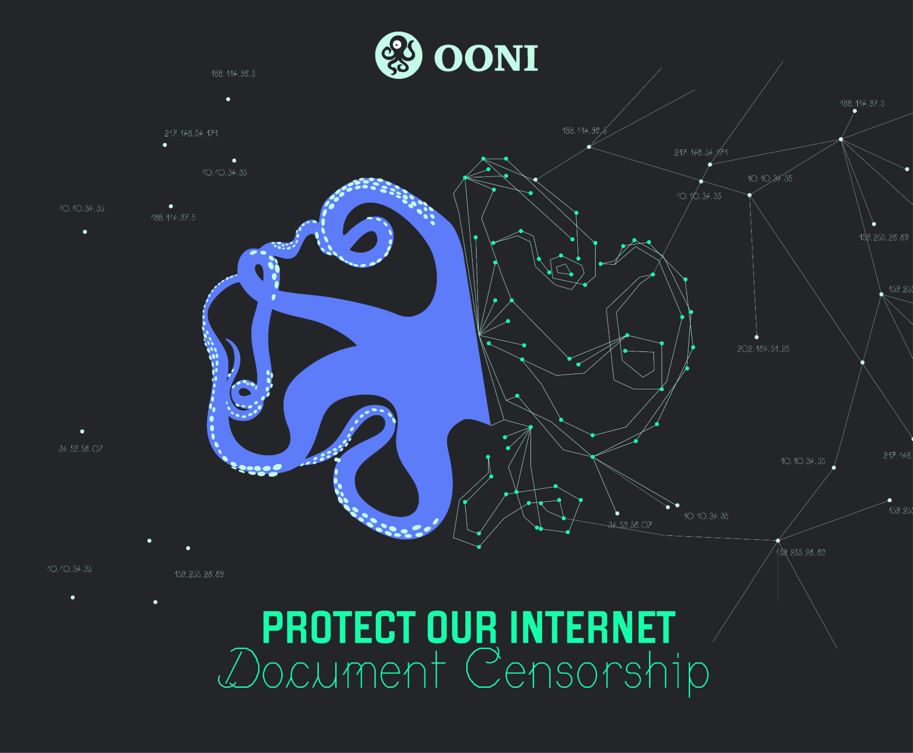
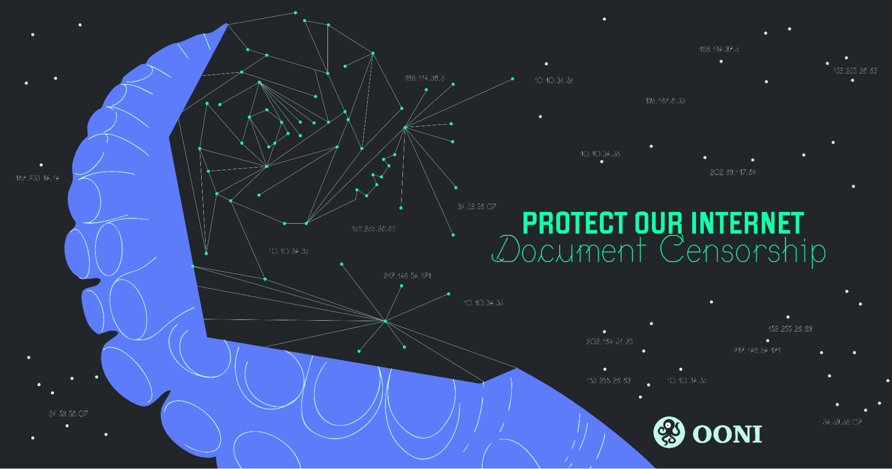

{{}}
Image designed by [Robotina](https://www.robotina.it/).

Today, we are launching **[OONI’s end-of-year fundraising campaign](https://ooni.org/donate/)**. This year, the need to understand internet censorship is more important than ever. 

Around the world, access to online information is [increasingly blocked](https://ooni.org/reports/) – often during events such as protests and elections – limiting people’s ability to communicate and access independent reporting during critical moments.

Throughout the year, we observed many cases of online restrictions. Major social media platforms were blocked in countries such as [Togo](https://explorer.ooni.org/findings/167838678600), [Cameroon](https://explorer.ooni.org/findings/393608039300), and [Tanzania](https://ooni.org/post/2025-tanzania-blocked-twitter/). Messaging apps like Telegram and WhatsApp faced blocks in [Kenya](https://explorer.ooni.org/findings/224470320900), [Vietnam](https://explorer.ooni.org/findings/382823169800), [Nepal](https://explorer.ooni.org/findings/284032502800), and [Iran](https://explorer.ooni.org/findings/273244099200). And more independent news media websites were recently blocked in [India](https://explorer.ooni.org/findings/667455800), [Egypt](https://explorer.ooni.org/findings/99431807200), and [Jordan](https://explorer.ooni.org/findings/101531332700).

Censorship also occurs in more unexpected contexts. In Europe, [Albania began blocking TikTok](https://explorer.ooni.org/findings/274282914400), while [Spain blocked Cloudflare IPs](https://protonvpn.com/blog/spain-laliga) during football matches, unintentionally affecting unrelated websites. Some [ISPs in Spain also continue to block access to Women on Web’s reproductive rights website](https://explorer.ooni.org/chart/mat?probe_cc=ES&since=2025-10-18&until=2025-11-18&time_grain=day&axis_x=measurement_start_day&axis_y=probe_asn&test_name=web_connectivity&domain=www.womenonweb.org), despite a [court order](https://www.womenonweb.org/hu/news/women-on-web-wins-supreme-court-case-against-spain-for-censoring-abortion-website/) mandating partial unblocking.

These examples show how internet restrictions can appear in many situations, sometimes with broader effects than intended.

This is why transparency is essential.

We need to know *what* is blocked — when, where, why, and how — so that censorship cannot spread in the dark. We also need *evidence* of internet censorship, to prevent situations where authorities can deny or downplay these restrictions.

[OONI](https://ooni.org/) was created in 2012 to provide this [transparency](https://ooni.org/data/). Our community around the world runs [network tests](https://ooni.org/install/), contributing open data that helps document internet censorship from many different locations and networks. The internet is a network of networks, and the people measuring those networks help make transparency possible. 

Thanks to this global effort, we now host the **world’s largest open dataset on internet censorship**, containing [more than 3 billion measurements collected from 29 thousand networks in 242 countries and territories](https://explorer.ooni.org/) since 2012. And every day – every minute – new measurements are being published from around the world. 

More than [80 research reports](https://ooni.org/reports/) have been published based on OONI data, many of which have received international press coverage, including [Wired](https://www.wired.com/story/russia-splinternet-censorship/), [BBC](https://www.bbc.com/news/technology-48269608), [CBC News](https://www.cbc.ca/news/science/ooni-tor-information-controls-measurement-censorship-iran-1.4653523), [CNET](https://www.cnet.com/culture/the-great-firewall-of-china-blocks-off-wikipedia/), [The Intercept](https://theintercept.com/2019/12/12/net-claro-e-vivo-bloqueiam-site-aborto-seguro/), [Wall Street Journal](https://www.wsj.com/articles/internet-powered-mass-protests-in-cuba-then-the-government-pulled-the-plug-11626358893), [Deutsche Welle](https://www.dw.com/en/myanmar-military-coup-press-freedom/a-56829376), [Mada Masr](https://www.madamasr.com/en/2018/07/02/news/u/report-internet-censorship-has-become-more-pervasive-in-past-year-62-of-blocked-websites-are-media-outlets/), [Al Araby](https://www.alaraby.co.uk/%D8%A7%D9%84%D8%B1%D9%82%D8%A7%D8%A8%D8%A9-%D8%B9%D9%84%D9%89-%D8%A7%D9%84%D8%A5%D9%86%D8%AA%D8%B1%D9%86%D8%AA-%D9%81%D9%8A-%D9%85%D8%B5%D8%B1-%D8%A3%D8%B5%D8%A8%D8%AD%D8%AA-%D8%A3%D9%83%D8%AB%D8%B1-%D8%AF%D9%8A%D9%86%D8%A7%D9%85%D9%8A%D9%83%D9%8A%D8%A9-%D9%88%D8%A7%D9%86%D8%AA%D8%B4%D8%A7%D8%B1%D8%A7%D9%8B), and [Time](https://time.com/5589439/china-wikipedia-online-censorship/). In the past two years alone, OONI data has helped document [nearly 60 cases of internet censorship](https://explorer.ooni.org/findings) worldwide.

OONI tools and data have supported advocacy efforts by many organizations, including the [global #KeepItOn campaign](https://www.accessnow.org/campaign/keepiton/), a coalition of hundreds of human rights organizations fighting internet shutdowns around the world. Earlier this year, OONI data was used as evidence in a public interest case, supporting a [petition filed at the High Court of Kenya](https://blog.bake.co.ke/wp-content/uploads/2025/05/HCCHRPET.276.2025-ICJ-v-CA-Internet-Shutdown-Case.pdf).

Our work has also been recognized with the [2012 Access Now Freedom of Expression Tech Prize](https://web.archive.org/web/20130424101948/https://www.accessnow.org/blog/2012/12/11/first-annual-access-innovation-awards-prize-winners-announced) and the [2023 Free and Open Communications on the Internet (FOCI) Community Award](https://foci.community/awards.html). 

However, due to recent [U.S government funding cuts](https://www.techpolicy.press/the-us-just-logged-off-from-internet-freedom/), our ability to continue this work in the coming years is at risk. Many organizations in the internet freedom field relied on these funding sources, which have now been reduced or eliminated.

This creates an [existential crisis](https://www.techpolicy.press/100-days-of-trump-global-digital-rights-and-internet-freedom-advocacy-efforts-face-generational-crisis/) for the global internet freedom movement.

That’s why we need your support. Please [donate to OONI](https://ooni.org/donate/) – every contribution helps. If you would like to make an even greater impact, consider [becoming an OONI supporter](https://ooni.org/about/supporters/) with a larger in-kind contribution. 

By supporting OONI, you help maintain [free and open source software for measuring internet censorship](https://ooni.org/install/), and you help sustain the [world’s largest open dataset on internet censorship](https://ooni.org/data/). Your contribution also enables research, advocacy, and litigation efforts around the world that *rely* on OONI data.

Together, we can document censorship. Together, we can protect our internet.

**[Donate to OONI](https://ooni.org/donate)** today and help keep the internet open, one measurement at a time.

{{}}
Image designed by [Robotina](https://www.robotina.it/).

Bitcoin (BTC)  
bc1qft94vxsh7vzqmc37xquxj3n82lsmhjzxqx3u2a

Ethereum (ETH)  
0x0317136A811b2841410229c8421d61dCfA793970

Solana (SOL)  
AEL8Ke2VNV7wrHMwkck6QNTfd5gchbPu76h1wS1MqEs3

Polkadot (DOT)  
143ciNC9HqPG18SKEhbQnoWdAp61aB8Cf9MVkVvY8JJaNojT  
