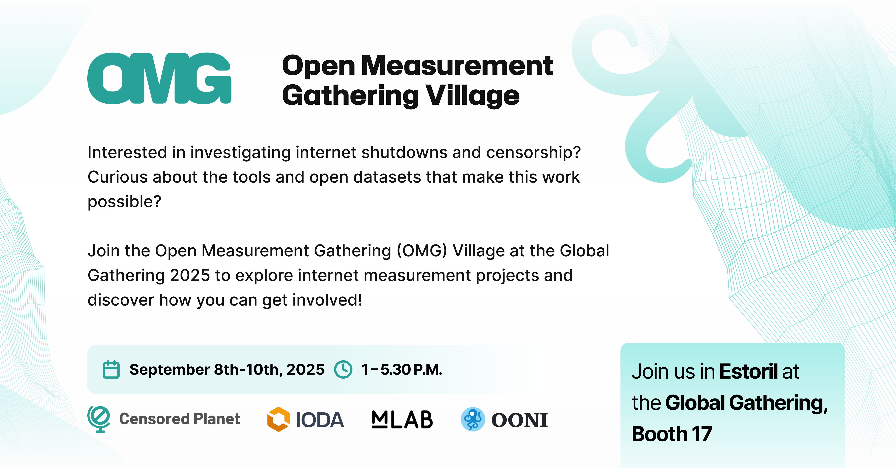

Are you attending the upcoming [Global Gathering](https://wiki.digitalrights.community/index.php?title=Global_Gathering_2025) event in Estoril, Portugal? Are you interested in investigating internet shutdowns and censorship, and curious to learn more about the tools and open datasets that support this work?

{{}}

Join us at the Global Gathering **Open Measurement Gathering (OMG) Village**: a community space organized and hosted by 4 internet measurement projects: [Open Observatory of Network Interference (OONI)](https://ooni.org/), [Measurement Lab (M-Lab)](https://www.measurementlab.net/), [Internet Outage Detection & Analysis (IODA)](https://ioda.inetintel.cc.gatech.edu/), and [Censored Planet](https://censoredplanet.org/). We also have the pleasure of being joined by our friends [Netalitica](https://netalitica.com/) and [Project Ainita](https://ainita.net/), who will each host a booth on Day 3.

The OMG Village will take place at the Global Gathering event venue at **Booth 17** throughout the 3-day event, running from **1pm to 5:30pm daily from 8 to 10 September 2025**. We will use this space to host booths and circle discussions on topics related to censorship measurement. On Day 3, the OMG Village will host **community-led circle sessions** proposed by participants throughout the event. 

Whether you'd like to join one of our circle sessions, propose (and facilitate) a session, play a game of jeopardy, pick up some swag at our booth, or just say hi — be sure to drop by!

Below we share the detailed OMG Village agenda.



## **OMG Village Agenda** 

### **Day 1: 8th September 2025** {#day-1-8th-september-2025}

From 1:00 PM to 5:30 PM, the OMG Village will be buzzing with both booths and circle discussions. You can find the full Global Gathering Day 1 agenda [here](https://wiki.digitalrights.community/index.php?title=September_8_2025_Agenda).

#### **Booths: OONI and IODA**
| Time              | Booth                                           | Booth Description                                                                                                                                                                                                                                                                                                                                                                                                                                                 |
|-------------------|-------------------------------------------------|-------------------------------------------------------------------------------------------------------------------------------------------------------------------------------------------------------------------------------------------------------------------------------------------------------------------------------------------------------------------------------------------------------------------------------------------------------------------|
| 1:00 PM - 3:00 PM | Open Observatory of Network Interference (OONI) | Since 2012, the Open Observatory of Network Interference (OONI) has built free software tools that empower the public to measure and collect evidence of internet censorship. Today, thanks to the global OONI community, OONI hosts the largest open dataset on internet censorship of its kind.  Join this booth to learn all about OONI, ask questions, share feedback, and learn how you can get involved in the global fight against internet censorship! |

#### **Circle sessions: Internet censorship challenges, needs, and wish lists** {#circle-sessions-internet-censorship-challenges-needs-and-wish-lists}

| Time              | Circle                                                                                                        | Circle Description                                                                                                                                                                                                                                                                                                                                                                                                                                                                                                                                                                                                                                                                                                                                                                                                                                                                                       |
|-------------------|---------------------------------------------------------------------------------------------------------------|----------------------------------------------------------------------------------------------------------------------------------------------------------------------------------------------------------------------------------------------------------------------------------------------------------------------------------------------------------------------------------------------------------------------------------------------------------------------------------------------------------------------------------------------------------------------------------------------------------------------------------------------------------------------------------------------------------------------------------------------------------------------------------------------------------------------------------------------------------------------------------------------------------|
| 1:30 PM - 2:30 PM | **Jeopardy! Are You My Measurement Tool?**   Facilitator: Amanda Meng (IODA)                                    | Have you ever experienced an Internet shutdown or censorship event, but then didn’t know which open Internet measurement tool to turn to?  Join the Open Measurement Gathering groups (OONI, IODA, M-Lab, Censored Planet) in a game of jeopardy designed to guide you through which Internet measurement tool you need. This circle aims to build the capacity of the Internet Freedom community to understand when to use what measurement tool to monitor and report on internet shutdowns and censorship events. We will start with a review of when to use which tool followed by a live game show that tests and further builds knowledge, culminating and sweet rewards!  Following Global Gathering, the OMG groups will release a public guide on which internet measurement datasets to refer to depending on the type of internet shutdown or censorship event you’re investigating. |
| 3:00 PM - 4:00 PM | **Fighting Internet Censorship: Challenges and Needs**       Facilitators: Maria Xynou & Elizaveta Yachmeneva (OONI) | What challenges have you encountered in monitoring, reporting, or advocating against internet censorship? How can the internet measurement community better support your efforts?   Join this session to share your experiences, explore common obstacles, and discuss practical needs to strengthen global monitoring and response to internet censorship.                                                                                                                                                                                                                                                                                                                                                                                                                                                                                                                                            |
| 4:30 PM - 5:30 PM | **Internet Measurement Wish List**   Facilitators: Maria Xynou & Elizaveta Yachmeneva (OONI)                     | If internet measurement projects like OONI, IODA, M-Lab, or Censored Planet could offer you anything — what would be on your wish list? What features, data, or tools do you wish you had to better monitor internet censorship?  Join this interactive brainstorming session to share your ideas, needs, and feedback.                                                                                                                                                                                                                                                                                                                                                                                                                                                                                                                                                                               |

### **Day 2: 9th September 2025** 

From 1:00 PM to 5:30 PM, the OMG Village will be buzzing with both booths and circle discussions. You can find the full Global Gathering Day 2 agenda [here](https://wiki.digitalrights.community/index.php?title=September_9_2025_Agenda).

#### **Booths: Censored Planet and M-Lab** {#booths-censored-planet-and-m-lab}

| Time              | Booth                   | Booth Description                                                                                                                                                                                                                                                                                                                                                                                                                                                                                                                                                                        |
|-------------------|-------------------------|------------------------------------------------------------------------------------------------------------------------------------------------------------------------------------------------------------------------------------------------------------------------------------------------------------------------------------------------------------------------------------------------------------------------------------------------------------------------------------------------------------------------------------------------------------------------------------------|
| 1:00 PM - 3:00 PM | Censored Planet         | Censored Planet is a research lab that investigates how internet access is being shaped and restricted around the world. As censorship tactics become more complex and harder to detect, we develop new ways to study these systems and understand who they affect. We focus on internet measurement, network security, and privacy to produce research and tools that support journalists, civil society, and the broader internet freedom community.                                                                                                                                   |
| 3:30 PM - 5:30 PM | Measurement Lab (M-Lab) | Founded in 2009, Measurement Lab (M-Lab) is an open platform for studying Internet performance and neutrality over time. M-Lab recently completed the first phase of the Internet Quality Barometer project, and published the IQB Framework in June 2025. The IQB project seeks to redefine internet quality beyond the single metric of speed by using available data. As M-Lab continues the IQB project to build a tool to score Internet quality, we are also interested in exploring ways to score Internet freedom with existing data. Come by our booth and share your thoughts! |

#### **Circle sessions: Internet censorship research and emerging digital rights threats** 

| Time              | Circle                                                                                                       | Circle Description                                                                                                                                                                                                                                                                                                                                                                                                                                                                                                                                                                                                                                                                                                                                                                                                                                                                                        |
|-------------------|--------------------------------------------------------------------------------------------------------------|-----------------------------------------------------------------------------------------------------------------------------------------------------------------------------------------------------------------------------------------------------------------------------------------------------------------------------------------------------------------------------------------------------------------------------------------------------------------------------------------------------------------------------------------------------------------------------------------------------------------------------------------------------------------------------------------------------------------------------------------------------------------------------------------------------------------------------------------------------------------------------------------------------------|
| 1:30 PM - 2:30 PM | **Mapping Emerging Digital Rights Threats**   Facilitator: Melissa Newcomb (M-Lab)                              | What should we be measuring to prepare for the future of digital rights? Based on your work and experience, what major digital rights threats do you foresee emerging globally in the next decade? And as a community, how can we prepare?  Join this interactive brainstorming session to share your insights, identify measurement priorities, and help shape a collective response to the evolving digital landscape.                                                                                                                                                                                                                                                                                                                                                                                                                                                                               |
| 3:00 PM - 4:00 PM | **Internet Measurement Research Questions and Ideas**       Facilitators: Elizaveta Yachmeneva & Maria Xynou (OONI) | Internet measurement data is only as valuable as the questions it helps us answer. What research questions should we be asking? What insights do you hope to uncover through internet censorship data?  Join this interactive brainstorming session to share your ideas, highlight pressing research needs, and help shape the future direction of censorship measurement and analysis.                                                                                                                                                                                                                                                                                                                                                                                                                                                                                                                |
| 4:30 PM - 5:30 PM | **Jeopardy! Are You My Measurement Tool?**   Facilitator: Amanda Meng (IODA)                                   | Have you ever experienced an Internet shutdown or censorship event, but then didn’t know which open Internet measurement tool to turn to?  Join the Open Measurement Gathering groups (OONI, IODA, M-Lab, Censored Planet) in a game of jeopardy designed to guide you through which Internet measurement tool you need.  This circle aims to build the capacity of the Internet Freedom community to understand when to use what measurement tool to monitor and report on internet shutdowns and censorship events. We will start with a review of when to use which tool followed by a live game show that tests and further builds knowledge, culminating and sweet rewards!  Following Global Gathering, the OMG groups will release a public guide on which internet measurement datasets to refer to depending on the type of internet shutdown or censorship event you’re investigating. |

### **Day 3: 10th September 2025**

From 1:00 PM to 5:30 PM, the OMG Village will be buzzing with both booths and circle discussions. You can find the full Global Gathering Day 3 agenda [here](https://wiki.digitalrights.community/index.php?title=September_10_2025_Agenda).

### **Booths: Netalitica and Project Ainita** 

| Time              | Booth          | Booth Description                                                                                                                                                                                                                                                                                                                                                                                                                                                                                                                                                       |
|-------------------|----------------|-------------------------------------------------------------------------------------------------------------------------------------------------------------------------------------------------------------------------------------------------------------------------------------------------------------------------------------------------------------------------------------------------------------------------------------------------------------------------------------------------------------------------------------------------------------------------|
| 1:00 PM - 3:00 PM | Netalitica     | Netalitica Booth will introduce you to the "Test Lists Project". We hire local researchers to update the URL test lists (aka Citizen Lab lists) of multiple countries, which are then used by network probes (e.g. OONI Probe) to uncover Internet censorship. Come to our booth to learn how to update the test list of your country, see the results of our project and check out the vacant research positions!                                                                                                                                                      |
| 3:30 PM - 5:30 PM | Project Ainita | Project Ainita's Cyber Threat Intelligence (CTI) portal aims to be a one stop shop for latest intel, live Internet measurements and contextual analysis for circumvention tool makers, researchers, journalists, funders, decision makers and stakeholders needing current and deep understanding of a country's Internet status. We will be providing a live demo of the CTI portal as well as Internet maps of a few countries. We intend on being fully available for Q&A and hope to foster rich brainstorming discussions of scaling CTI in other needed contexts. |

### **Circle sessions: Community-led discussions** 

On Day 3, the OMG Village will feature community-proposed circle sessions.

**Stop by the OMG Village during Days 1 and 2 to suggest your own session ideas and vote on others using stickers!** The ideas with the most votes will be hosted at the OMG Village on Day 3.

| Time              | Circle                     | Circle Description                                                               |
|-------------------|----------------------------|----------------------------------------------------------------------------------|
| 1:30 PM - 2:30 PM | Unconference-style session | This session will be chosen by community vote and confirmed by the end of Day 2. |
| 3:00 PM - 4:00 PM | Unconference-style session | This session will be chosen by community vote and confirmed by the end of Day 2. |
| 4:30 PM - 5:30 PM | Unconference-style session | This session will be chosen by community vote and confirmed by the end of Day 2. |

Huge thanks to [Team CommUNITY](https://www.digitalrights.community/) for their incredible work organizing the annual [Global Gathering](https://wiki.digitalrights.community/index.php?title=Global_Gathering_2025) and uniting digital rights defenders from around the world. We can’t wait to connect with the community in person soon!
