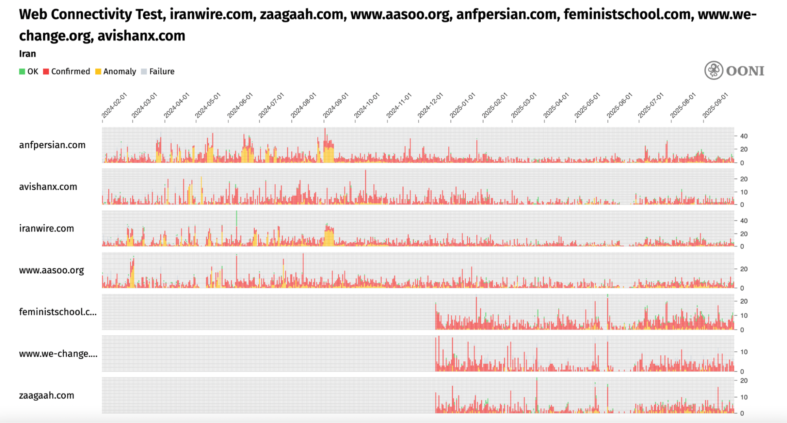
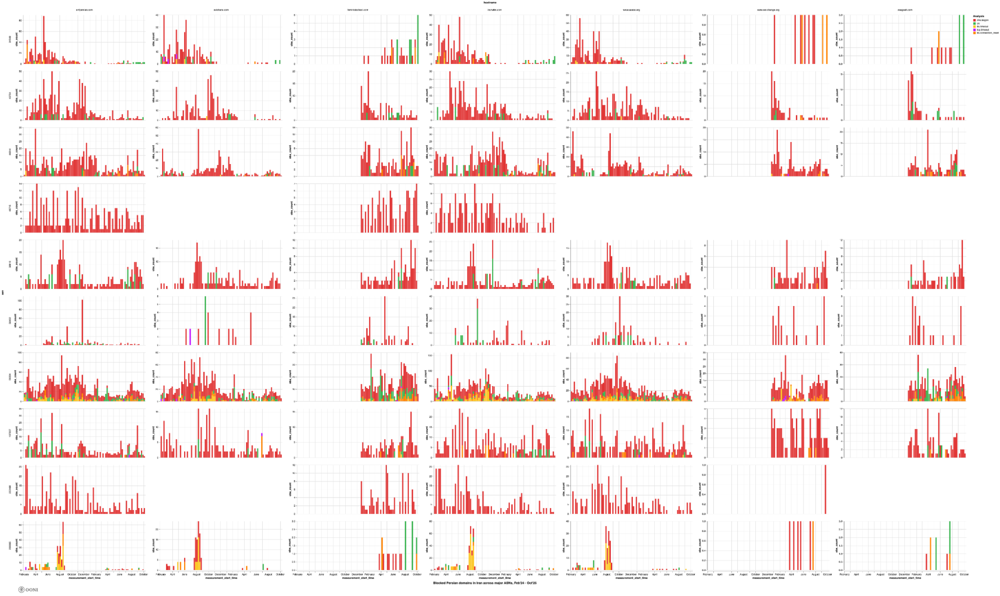
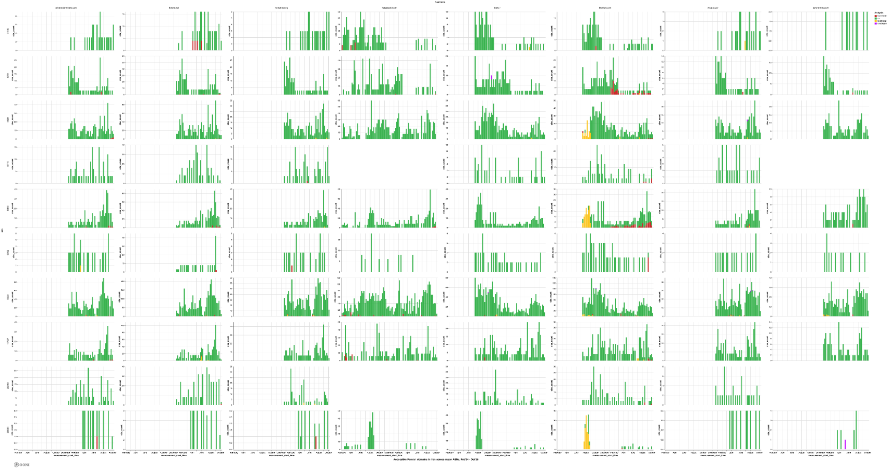
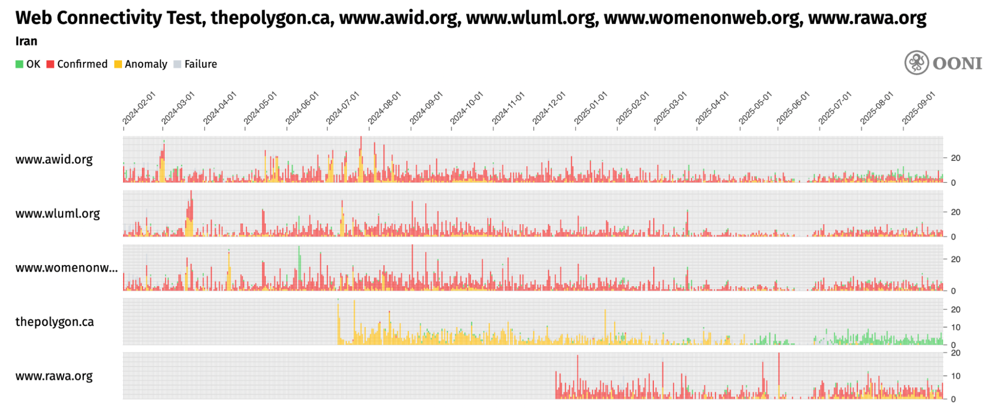
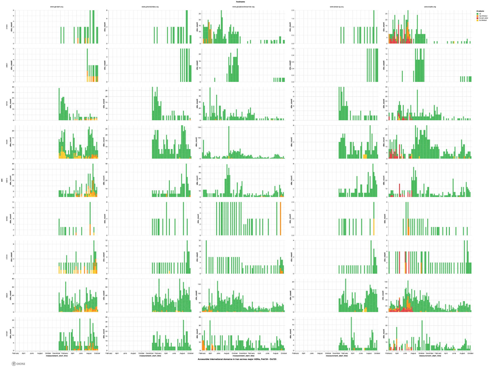
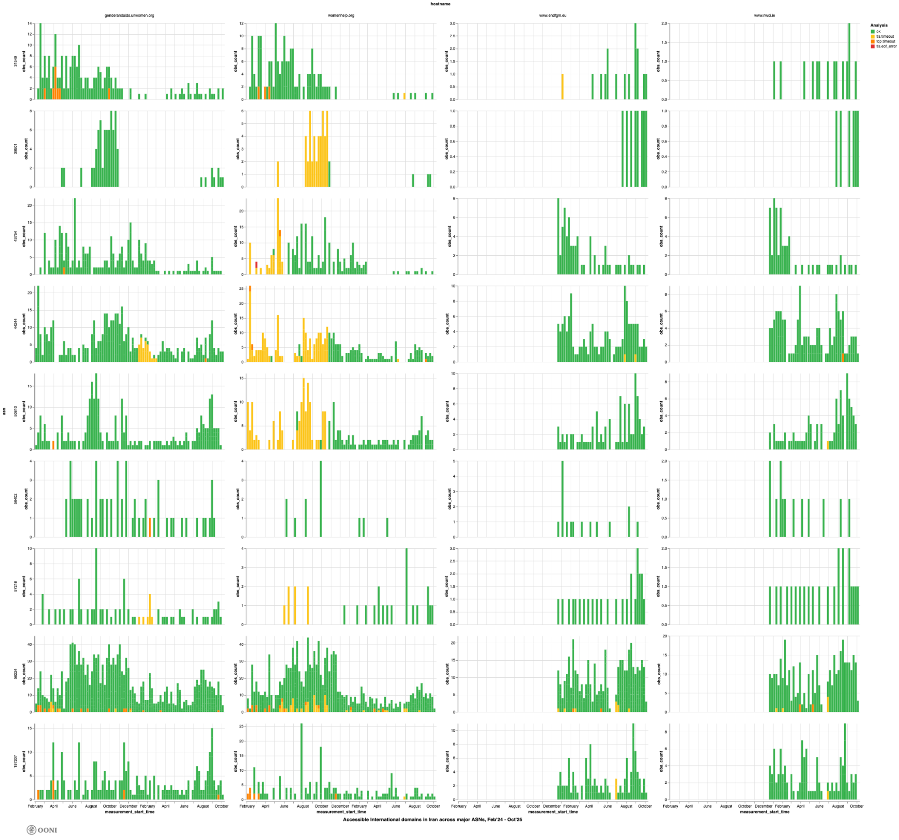

Women’s rights are [severely restricted](https://iranhumanrights.org/2025/03/gender-apartheid-in-iran-is-crushing-womens-lives-and-futures/) in Iran. Three years ago, the [Women, Life, Freedom movement](https://www.ohchr.org/en/stories/2025/04/justice-and-accountability-woman-life-freedom-protests) – and widespread protests – erupted in Iran following the death of 22-year-old Mahsa Jina Amini in police custody in September 2022. But according to the UN, the [repression of women in Iran has intensified](https://news.un.org/en/story/2024/09/1154306) in recent years, despite the mass protests.

Access to information is also [severely restricted](https://explorer.ooni.org/country/IR) in Iran, and women’s rights websites are no exception. OONI data [shows](https://ooni.org/post/iran-internet-censorship/#human-rights-issues) that access to women’s rights websites have been blocked in Iran since at least 2014.

In this study, the [Open Observatory of Network Interference (OONI)](https://ooni.org/) and [Miaan Group](https://miaan.org/) collaborated on investigating the blocking of women’s rights websites in Iran, as well as the impact of these blocks on the country's women’s rights movement.



## Key Findings

### Blocking of women’s rights websites

As part of this study, OONI data shows the blocking of the following **7 Persian women’s rights websites**:

*   **[IranWire](https://explorer.ooni.org/chart/mat?probe_cc=IR&since=2025-08-01&until=2025-10-01&time_grain=day&axis_x=measurement_start_day&test_name=web_connectivity&input=https%3A%2F%2Firanwire.com%2F)** (`iranwire.com`): Independent news website that extensively covers feminist issues and women’s rights in Iran.
*   **[Zagah](https://explorer.ooni.org/chart/mat?probe_cc=IR&since=2025-08-01&until=2025-10-01&time_grain=day&axis_x=measurement_start_day&test_name=web_connectivity&input=https%3A%2F%2Fzaagaah.com%2F)** (`zaagaah.com`): Reproductive rights and reproductive justice website run by a group of Iranian feminists.
*   **[ASO](https://explorer.ooni.org/chart/mat?probe_cc=IR&since=2025-08-01&until=2025-10-01&time_grain=day&axis_x=measurement_start_day&test_name=web_connectivity&input=https%3A%2F%2Fwww.aasoo.org%2F)** (`www.aasoo.org`): Independent media outlet that covers women’s rights, as well as other human rights issues affecting religious and ethnic minorities in Iran.
*   **[ANF News](https://explorer.ooni.org/chart/mat?probe_cc=IR&since=2025-08-01&until=2025-10-01&time_grain=day&axis_x=measurement_start_day&test_name=web_connectivity&input=https%3A%2F%2Fanfpersian.com%2F)** (`anfpersian.com`): Kurdish news agency that actively covers women’s rights issues in Iran.
*   **[Feminist School](https://explorer.ooni.org/chart/mat?probe_cc=IR&since=2025-08-01&until=2025-10-01&time_grain=day&axis_x=measurement_start_day&test_name=web_connectivity&input=https%3A%2F%2Ffeministschool.com%2F)** (`feministschool.com`): Persian‑language feminist media platform founded by Iranian women activists that publishes essays, analysis, and translations on women’s rights, gender equality, and social justice issues in Iran.
*   **[We‑Change](https://explorer.ooni.org/chart/mat?probe_cc=IR&since=2025-08-01&until=2025-10-01&time_grain=day&axis_x=measurement_start_day&test_name=web_connectivity&input=https%3A%2F%2Fwww.we-change.org%2F)** (`www.we‑change.org`): Persian‑language women’s rights and gender equality campaign site — originally launched as part of the [One Million Signatures Campaign](https://nvdatabase.swarthmore.edu/content/iranian-activists-one-million-signatures-campaign-gender-justice-2006-2008) — dedicated to collecting signatures and mobilizing support for reforms to discriminatory laws against women in Iran.
*   **[AvishanX](https://explorer.ooni.org/chart/mat?probe_cc=IR&since=2025-08-01&until=2025-10-01&time_grain=day&axis_x=measurement_start_day&test_name=web_connectivity&input=https%3A%2F%2Favishanx.com%2F)** (`avishanx.com`): Persian-language platform providing sexual and reproductive health education, information on bodily autonomy, and resources related to gender and sexual well-being, supporting access to knowledge relevant to women’s rights in Iran.

OONI data also shows the **blocking of 5 international women’s rights websites**:

*   **[Association for Women’s Rights in Development (AWID)](https://explorer.ooni.org/chart/mat?probe_cc=IR&since=2025-01-01&until=2025-10-01&time_grain=day&axis_x=measurement_start_day&test_name=web_connectivity&domain=www.awid.org)** (`www.awid.org`): International feminist membership organization working to advance gender justice and women’s human rights worldwide by supporting, connecting, and amplifying global women’s rights movements, organizations, and advocates.
*   **[Women on Web](https://explorer.ooni.org/chart/mat?probe_cc=IR&since=2025-01-01&until=2025-10-01&time_grain=day&axis_x=measurement_start_day&test_name=web_connectivity&domain=www.womenonweb.org)** (`www.womenonweb.org`): International non‑profit organization that provides confidential online access to medical abortion pills and reproductive health information, enabling people — including those in restrictive contexts — to exercise their reproductive rights worldwide.
*   **[Women Living Under Muslim Laws (WLUML)](https://explorer.ooni.org/chart/mat?probe_cc=IR&since=2025-01-01&until=2025-10-01&time_grain=day&axis_x=measurement_start_day&test_name=web_connectivity&domain=www.wluml.org)** (`www.wluml.org`): Transnational feminist solidarity network that works to promote gender justice, human rights, and legal equality for women whose lives are governed by laws or customs framed as Muslim, by offering information, research, advocacy, and connection across more than 70 countries.
*   **[Revolutionary Association of the Women of Afghanistan (RAWA)](https://explorer.ooni.org/chart/mat?probe_cc=IR&since=2025-01-01&until=2025-10-01&time_grain=day&axis_x=measurement_start_day&test_name=web_connectivity&domain=www.rawa.org)** (`www.rawa.org`): Grassroots Afghan women’s organization, founded in 1977, that campaigns for women’s rights, secular democracy, and social justice in Afghanistan while providing social services, education, and resistance against fundamentalist repression.
*   **[The Polygon Gallery](https://explorer.ooni.org/chart/mat?probe_cc=IR&since=2025-01-01&until=2025-10-01&time_grain=day&axis_x=measurement_start_day&test_name=web_connectivity&domain=thepolygon.ca)** (`thepolygon.ca`): North Vancouver-based public photography and media art gallery that has featured Iranian art, including works highlighting women’s experiences and social issues, providing a platform for cultural expression related to gender and society in Iran.

These [blocks were automatically confirmed](https://explorer.ooni.org/chart/mat?probe_cc=IR&since=2024-02-01&until=2025-10-01&time_grain=day&axis_x=measurement_start_day&axis_y=domain&test_name=web_connectivity&domain=iranwire.com%2Czaagaah.com%2Cwww.aasoo.org%2Canfpersian.com%2Cfeministschool.com%2Cwww.we-change.org%2Cavishanx.com) based on OONI data, as private IPs such as `10.10.34.35` and `10.10.34.36` — included in [DNS blocking fingerprints](https://github.com/ooni/blocking-fingerprints/blob/main/fingerprints_dns.csv) — were returned during DNS resolution. Because the majority of measurements across all major ASes returned [bogon IP addresses](https://en.wikipedia.org/wiki/Bogon_filtering) in DNS answers throughout the analysis period, we conclude that **DNS tampering is the primary censorship technique** used by major ISPs in Iran to block access to Persian women’s rights websites.

The only exception is the testing of `thepolygon.ca`, as the blocking of this site is confirmed on only one network — Aria Shatel (AS31549) — where [DNS resolution returns the bogon IP](https://explorer.ooni.org/m/20241004001624.079062_IR_webconnectivity_25f8839fc8d8f96b) `127.0.0.1`. On [Irancell (AS44244)](https://explorer.ooni.org/chart/mat?probe_cc=IR&probe_asn=AS44244&since=2024-06-01&until=2025-10-01&time_grain=day&axis_x=measurement_start_day&test_name=web_connectivity&domain=thepolygon.ca), the majority of measurements show [TLS connection reset errors](https://explorer.ooni.org/m/20240721003456.753215_IR_webconnectivity_15b6b1c76412f1ca), suggesting that access is blocked via **TLS interference**. On all other major networks receiving the most testing coverage during the analysis period, most [measurements](https://explorer.ooni.org/chart/mat?probe_cc=IR&since=2024-06-01&until=2025-10-01&time_grain=day&axis_x=measurement_start_day&axis_y=probe_asn&test_name=web_connectivity&domain=thepolygon.ca) exhibit [TCP timeout errors](https://explorer.ooni.org/m/20240803132942.134908_IR_webconnectivity_dfb4ef089dead465), indicating that **IP blocking** is likely being used. While the exact reason why `thepolygon.ca` is blocked differently from other sites remains unclear, it may reflect variations or changes in Iran’s censorship policies.

Overall, although we tested and analyzed more international women’s rights websites (25) than Persian-language ones (17), a **greater number of Persian websites (7) were found blocked compared to international sites (5)**. This suggests that Iranian authorities may prioritize censoring Persian-language content — likely because it is more directly accessible to local communities — and that such censorship is targeted rather than pervasive.

### Impact of censorship on Iran’s women’s rights movement

The qualitative analysis of the responses demonstrates that the persistent filtering of women’s websites and blogs in Iran has had a profound impact on access to information and activities in this field.  

The blocking of women’s rights websites has generally limited access to information, **slowed down the process of raising awareness, and increased the cost and time required to access resources**. **While some argue that blocking websites has reduced solidarity, others believe its impact has been limited as activists continue to use alternative methods of communication and coordination**.

While there are alternative ways to access information (such as social media), they cannot fully replace the depth and structure that specialized websites provide. Moreover, most [major social media platforms](https://explorer.ooni.org/social-media) (e.g., Telegram, X, Facebook, YouTube, etc.) and [circumvention tools](https://explorer.ooni.org/circumvention) (like VPNs) are also blocked in Iran, adding another layer of cost, time, and friction. As a result, these blocks have left a **significant void in women’s rights education and activism**.

Respondents emphasized the **importance of technical tools such as VPNs**, education and awareness, creating alternative communication channels, and advocating for international support. They also highlighted the need for flexibility and alignment with the needs and methods of people navigating censorship.

## Introduction

As part of this study, the [Open Observatory of Network Interference (OONI)](https://ooni.org/) and [Miaan Group](https://miaan.org/) collaborated on examining how internet censorship impacts the women’s rights movement in Iran.

Founded in 2012, [OONI](https://ooni.org/) is a nonprofit organization that provides [free software tools](https://ooni.org/install) and [open data](https://ooni.org/data/) that empower the public to monitor, document, and respond to internet censorship around the world. [Miaan Group](https://www.miaan.org/) is a nonprofit organization founded in 2019 to promote human rights, good governance, and social justice in Iran and the broader Middle East and North Africa region. As part of their [partnership](https://ooni.org/partners/miaan/), [OONI](https://ooni.org/) and [Miaan Group](https://www.miaan.org/) collaborate on studying internet censorship in Iran through the use of OONI tools and data.

The goal of this study is to document and increase transparency around how internet censorship restricts and affects the women’s rights movement in Iran. We are particularly interested in this question in light of the recent [Women, Life, Freedom movement](https://www.ohchr.org/en/stories/2025/04/justice-and-accountability-woman-life-freedom-protests) in Iran, which has been accompanied by [widespread protests, website blocking, and internet disruptions](https://ooni.org/post/2022-iran-technical-multistakeholder-report/). Specifically, we document the blocking of prominent women’s rights websites in Iran, and examine the impact of these blocks on Iran’s women’s rights movement. Further details are shared in the following methods and findings sections.

## Methods

As part of this study, we examine how internet censorship impacts the women’s rights movement in Iran.

Specifically, the main research questions that guided this study include:

*   What censorship techniques are used to block women’s rights websites in Iran?
*   Which Iranian ISPs show the strongest evidence of such blocking based on OONI data, and how do their censorship methods differ?
*   How does the blocking of women’s rights websites impact the women’s rights movement in Iran?

To this end, we adopted a **mixed-methods research approach**, combining analysis of [OONI data](https://ooni.org/data/) to examine the blocking of women’s rights websites in Iran with qualitative data from interviews with Iranian women’s rights and gender-equality activists.

### OONI Probe testing

Since 2012, [OONI](https://ooni.org/) has developed free and open source software – called [OONI Probe](https://ooni.org/install/) – which is designed to [measure various forms of internet censorship](https://ooni.org/nettest/), including the blocking of websites and apps. Every month, OONI Probe is regularly run by volunteers in [around 180 countries](https://explorer.ooni.org/) (including [Iran](https://explorer.ooni.org/country/IR)), and network measurements collected by OONI Probe users are automatically published as [open data in real-time](https://ooni.org/data).

[OONI Probe](https://ooni.org/install/) includes the [Web Connectivity experiment](https://github.com/ooni/spec/blob/master/nettests/ts-017-web-connectivity.md) which is designed to measure the blocking of many different [websites](https://ooni.org/support/faq#which-websites-will-i-test-for-censorship-with-ooni-probe) (included in the public, community-curated [Citizen Lab test lists](https://github.com/citizenlab/test-lists/tree/master/lists)). Blocks restricting access to women’s rights websites can be examined by analyzing OONI Web Connectivity data pertaining to the OONI Probe testing of such websites. But rather than analyzing all women’s rights websites, we limited our analysis to a [list of Iranian and international women’s rights websites](https://github.com/ooni/backend/issues/861) that were selected by [Miaan Group](https://www.miaan.org/), in consultation with Iranian women’s rights activists.

This [list](https://github.com/ooni/backend/issues/861) included the following 42 websites:

**Persian Websites Focused on Women’s Issues**

```
https://iranwire.com/
https://zaagaah.com/
https://www.aasoo.org/
https://cahiersdufeminisme.com/
https://iraws.ir/
https://feminists4jina.net/
https://harasswatch.com/
https://zananemrooz.com/
https://anfpersian.com/
https://jwica.ut.ac.ir/
https://wncri.org/
https://hamamoun.org/
https://feministschool.com/
https://iwontario.com/
https://www.we-change.org/
https://femena.net/fa/
https://avishanx.com/
```

**International Websites on Women’s Issues**

```
https://ikwro.org.uk/
https://thepolygon.ca/
https://www.awid.org/
https://www.iwraw-ap.org/
https://learningpartnership.org/
https://www.womenforwomen.org/
https://www.globalfundforwomen.org/
https://www.genderit.org/
https://www.madre.org/
https://iknowpolitics.org/
https://www.wluml.org/
https://feministfrequency.com/
https://stopstreetharassment.org/
https://www.girlsnotbrides.org/
https://www.womenonweb.org/
https://www.nwci.ie/
https://womenhelp.org/
https://www.endfgm.eu/
https://womensmediacenter.com/
https://womenpeacemakersprogram.org/
https://www.isiswomen.org/
https://musalaha.org/
https://genderandaids.unwomen.org/
https://womenforafghanwomen.org/
https://www.rawa.org/
```

The above 42 websites were chosen for dedicated testing and analysis based on the following criteria:

*   **Inclusion in the Citizen Lab test lists.** When websites are included in the [Citizen Lab test lists](https://github.com/citizenlab/test-lists/tree/master/lists), they receive regular OONI Probe testing, ensuring that relevant OONI measurement data is collected over a long period of time. This supports more robust and longitudinal data analysis.
*   **Prominence and impact of women’s rights websites.** Drawing on local knowledge and interviews with Iranian women’s rights and gender-equality activists, we selected additional women’s rights websites — beyond those included in the [Citizen Lab test lists](https://github.com/citizenlab/test-lists/tree/master/lists) — for testing and analysis based on their prominence and role within the Iranian women’s rights movement.

Of the 42 women’s rights websites mentioned above, 11 Persian websites were selected from the [Iranian test list](https://github.com/citizenlab/test-lists/blob/master/lists/ir.csv), 10 international websites from the [Global test list](https://github.com/citizenlab/test-lists/blob/master/lists/global.csv), and an additional 10 Persian and 11 international websites — previously not included in the Citizen Lab test lists — were [added to the test lists](https://github.com/citizenlab/test-lists/pull/1884/files) and also incorporated for testing and analysis. To increase OONI measurement coverage for all domains, we shared an [OONI Run link](https://run.ooni.org/v2/10131) with communities in Iran to facilitate targeted [OONI Probe](https://ooni.org/install) testing of the [selected women’s rights websites](https://github.com/ooni/backend/issues/861).

### OONI data analysis

To determine whether and how access to [selected women’s rights websites](https://github.com/ooni/backend/issues/861) was blocked, we analyzed [OONI data](https://ooni.org/data) pertaining to the testing of these websites in Iran. The date range of our [analysis](https://github.com/ooni/backend/issues/861) spanned from **1st February 2024 to 1st October 2025**.

Specifically, we analyzed measurements collected from the OONI Probe [Web Connectivity experiment](https://github.com/ooni/spec/blob/master/nettests/ts-017-web-connectivity.md), which is designed to measure the blocking of websites. The OONI [Web Connectivity experiment](https://github.com/ooni/spec/blob/master/nettests/ts-017-web-connectivity.md) is designed to measure the accessibility of URLs by performing the following steps:

*   Resolver identification
*   DNS lookup
*   TCP connect to the resolved IP addresses
*   TLS handshake to the resolved IP addresses
*   HTTP(s) GET request following redirects

The above steps are automatically performed from both the local network of the user, and from a control vantage point. If the results from both networks are the same, the tested URL is annotated as accessible. If the results differ, the tested URL is annotated as [anomalous](https://ooni.org/support/interpreting-ooni-data/#anomalies), and the type of anomaly is further characterized depending on the reason that caused the failure (for example, if the TCP connection fails, the measurement is annotated as a TCP/IP anomaly).

[Anomalous measurements](https://ooni.org/support/interpreting-ooni-data/#anomalies) may be indicative of blocking, but [false positives](https://ooni.org/support/faq#what-are-false-positives) can occur. The likelihood of blocking is therefore greater if the overall volume of anomalous measurements is high in comparison to the overall measurement count – compared on an AS level within the same date range for each OONI Probe experiment type.

Each Web Connectivity measurement provides further network information (such as information pertaining to TLS handshakes) that helps with evaluating whether an anomalous measurement presents signs of blocking. We therefore disaggregate based on the reasons that caused the anomaly (e.g. connection reset during the TLS handshake) and if they are consistent, they provide a stronger signal of potential blocking.

Based on OONI’s heuristics, we are able to **automatically confirm the blocking of websites** based on [fingerprints](https://github.com/ooni/blocking-fingerprints) if a [block page](https://ooni.org/support/glossary#block-page) is served, or if DNS resolution returns an IP known to be associated with censorship. These [blocking fingerprints](https://github.com/ooni/blocking-fingerprints) enable us to [automatically confirm website blocks](https://explorer.ooni.org/search?since=2025-10-30&until=2025-11-30&failure=false&only=confirmed) in [Iran](https://explorer.ooni.org/search?since=2025-10-30&until=2025-11-30&failure=false&probe_cc=IR&only=confirmed) and in many other countries (such as [Russia](https://explorer.ooni.org/search?since=2025-10-30&until=2025-11-30&failure=false&probe_cc=RU&only=confirmed), [Italy](https://explorer.ooni.org/search?since=2025-10-30&until=2025-11-30&failure=false&probe_cc=IT&only=confirmed), [Kazakhstan](https://explorer.ooni.org/search?since=2025-10-30&until=2025-11-30&failure=false&probe_cc=KZ&only=confirmed), and [Indonesia](https://explorer.ooni.org/search?since=2025-10-30&until=2025-11-30&failure=false&probe_cc=ID&only=confirmed)) where Internet Service Providers (ISPs) implement blocks with these techniques.

In support of this study, we performed dedicated data analysis using the [OONI Pipeline v5](https://github.com/ooni/data) which enables us to analyze OONI measurements based on [DNS blocking fingerprints](https://github.com/ooni/blocking-fingerprints/blob/main/fingerprints_dns.csv) – particularly since Iran is [known](https://explorer.ooni.org/country/IR?since=2025-10-30&until=2025-11-30#reports) to return private IPs (such as `10.10.34.35`) as part of DNS resolution when implementing blocks. The [OONI Pipeline v5](https://github.com/ooni/data) also enables us to enumerate and aggregate all the errors (e.g., `tls.connection_reset`) that emerged in the testing of each of the selected websites.

As a more consistent error observed in a larger volume of measurements provides a stronger signal of blocking, we aggregated the errors to determine whether a large percentage of measurements for a tested URL presented the same error (e.g. “tls_timeout_error”) in comparison to the overall measurement volume on a specific network, within a specified date range. The higher the ratio of consistent errors in comparison to the overall measurement count, the stronger the signal (and the greater our confidence) that access to the tested domain is (a) blocked, and (b) blocked in a specific way (e.g TLS interference).

As part of our analysis, we excluded cases which provided weak signals. Those included cases with low measurement coverage (in comparison to the overall measurement coverage on a tested AS during the analysis period), a low percentage of anomalies (in comparison to the overall measurement volume for a tested service on a network), a relatively large proportion of inconsistent failure types and errors, as well as cases which were determined to be false positives based on known bugs or other issues (such as global failure rates as a result of tested services being hosted on unreliable servers, or measurements collected from unreliable networks).

We **limited our findings to the ASes which received the largest OONI measurement coverage (and, therefore, the strongest blocking signals)** for the [selected women’s rights websites](https://github.com/ooni/backend/issues/861) in Iran during the analysis period (1st February 2024 to 1st October 2025). These include the following **11 ASes**: AS58224, AS51074, AS44244, AS43754, AS197207, AS50810, AS31549, AS202468, AS206065, AS48715, and AS56402. To ensure more accurate and reliable findings, we set a measurement threshold in our analysis, including only URLs with at least 2,000 measurements within the specified date range.

The notebook used by OONI to perform the data analysis is available **[here](https://github.com/ooni/notebooks/blob/master/analysis/2025-iran/2025-iran-analysis.ipynb)**.

### Interviews

The qualitative part of this research is focused on the impact of internet filtering on women's rights activism in Iran. To conduct this study, [Miaan Group](https://miaan.org/) **interviewed eight women's rights and gender equality activists**, some residing in Iran and others living abroad. These interviews were conducted in December 2024, and the analysis was completed in January 2025. These participants were purposefully selected as key informants, providing valuable insights into the effects of censorship. For their safety, **pseudonyms have been assigned**, and their ages are also mentioned alongside these pseudonyms.

The data collection method was based on **semi-structured interviews**, consisting of 10 core questions designed to investigate various aspects of how censorship has affected activities, documentation, and knowledge sharing in Iran’s women's rights movement.

Each of the interviewees was asked the following questions:

1)  Do you recall any websites or blogs related to women’s issues that have been blocked in Iran, either currently or in the past? This could include both domestic and international platforms.
2)  What impact has the blocking of women’s rights websites had on raising awareness and education about women’s rights in Iran? In general, in what dimensions has this filtering affected women’s activities?
3)  What strategies do you propose to counter internet censorship and restrictions in Iran? How can digital rights activists improve access for women to online content despite filtering?
4)  Has the blocking of women’s rights websites affected solidarity among women’s rights activists? How about their connection with their audience? Please consider both their interconnections and their outreach to their audience.
5)  Have these restrictions on filtering women’s rights websites, along with the filtering of most international social media platforms, led to changes in how women’s rights activists share information? Please explain.
6)  How do you evaluate the role of social media compared to blocked websites in advocating for women's rights? Both are filtered in Iran, but in your opinion, which has a greater impact on activities related to women's issues, such as research, education, and information dissemination?
7)  Have these restrictive measures affected the morale and motivation of women's rights activists? What about their followers and audiences?
8)  What consequences do you foresee for the women’s rights movement in Iran as a result of these restrictions?
9)  Can international organizations and governments play an effective role in reducing these restrictions?
10)  Has the blocking of websites affected the documentation and recording of the achievements of Iran’s women's rights movement? Do you have examples or an analysis of these impacts?

The list of participants includes Nastaran (41 years old), Nazanin (45 years old), Shima (41 years old), Shahrzad (45 years old), Sahar (42 years old), Noura (47 years old), Mahtab (49 years old), and Golnaz (34 years old). Their diverse experiences, both within and outside Iran, provide a comprehensive perspective for this research.

We thank all the interviewees who agreed to talk to us about their experiences and share their perceptions of internet censorship in Iran.

#### Acknowledgement of limitations

The findings of this study present several limitations, including:

*   **Date range of analysis.** The findings are limited to OONI measurements collected from Iran between 1st February 2024 to 1st October 2025. As a result, findings from measurements collected in different date ranges are excluded from this study.
*   **Type of measurements.** The findings mainly involve OONI [Web Connectivity](https://ooni.org/nettest/web-connectivity/) measurements pertaining to the testing of websites for censorship. As a result, findings from [other OONI Probe experiments](https://ooni.org/nettest) (particularly those that don’t measure the blocking of websites) are excluded from this study.
*   **Tested websites.** We selected [domains](https://github.com/ooni/backend/issues/861) for analysis that (a) were already included in the [Iranian](https://github.com/citizenlab/test-lists/blob/master/lists/ir.csv) and [Global](https://github.com/citizenlab/test-lists/blob/master/lists/global.csv) Citizen Lab test lists and have therefore received OONI measurement coverage, and (b) have a prominent role and impact in Iran’s women’s rights movement. While these domains were chosen based on local knowledge and interviews with Iranian women’s rights and gender-equality activists, we acknowledge the bias in their selection. The findings of this study do not document all women’s rights websites that are blocked in Iran, but are limited to the [42 selected websites](https://github.com/ooni/backend/issues/861) that were chosen for analysis.
*   **Testing coverage of websites.** Not all URLs included in [test lists](https://github.com/citizenlab/test-lists/tree/master/lists) are measured equally across Iran over time. Whether OONI data is available for a particular website depends on whether, on which networks, and when an [OONI Probe](https://ooni.org/install) user in Iran tested it. As a result, tested websites received different testing coverage on different networks throughout the analysis period, which impacts the findings. Moreover, while 21 of the 42 selected websites were already included in the [Citizen Lab test lists](https://github.com/citizenlab/test-lists/tree/master/lists), 22 of those websites were only [added and merged](https://github.com/citizenlab/test-lists/pull/1884/files) into the test lists on 18th December 2024. As a result, the [42 selected websites](https://github.com/ooni/backend/issues/861) received uneven OONI measurement coverage throughout the analysis period, presenting a limitation to the analysis and comparisons.
*   **Tested ASes.** While OONI Probe tests are regularly performed on multiple ASes in Iran, not all networks are tested equally. Rather, the availability of measurements depends on which networks [OONI Probe](https://ooni.org/install) users were connected to when performing tests. As a result, the measurement coverage varies across ASes throughout the analysis period, impacting the findings. Moreover, we limited the findings of this study to the ASes which received the largest measurement coverage and which presented the strongest blocking signals during the analysis period. These include AS58224, AS51074, AS44244, AS43754, AS197207, AS50810, AS31549, AS202468, AS206065, AS48715, and AS56402.
*   **Blocking signals.** As part of our data analysis, we limited our findings to signals that we considered more reliable and indicative of government-commissioned censorship, while excluding cases viewed as presenting weak signals (as discussed previously in the “Methods” section). As a result, we acknowledge the risk of potentially having missed some blocking cases in our findings (if those cases were annotated with weak signals as part of our data analysis).
*   **Interviews.** To explore the impact of censorship on Iran’s women’s rights movement, we conducted interviews with eight Iranian women’s rights and gender-equality activists. We acknowledge the interviewee selection bias and that a larger interview sample may have produced additional or more diverse insights.

## Findings

### Blocking of Women’s Rights Websites in Iran

Our analysis of OONI data collected in Iran between 1st February 2024 and 1st October 2025 shows that while some of the women’s rights websites we examined were blocked, others remained accessible. In most cases, the blocks are **automatically confirmed** because Iranian ISPs returned private IPs (such as `10.10.34.35` and `10.10.34.36`) – included in [DNS blocking fingerprints](https://github.com/ooni/blocking-fingerprints/blob/main/fingerprints_dns.csv) – as part of DNS resolution.

#### Blocked Persian Women’s Rights Websites

Out of the 17 Persian women’s rights websites that were tested in Iran during the analysis period, **7 of them were** **[confirmed blocked](https://explorer.ooni.org/chart/mat?probe_cc=IR&since=2024-02-01&until=2025-10-01&time_grain=day&axis_x=measurement_start_day&axis_y=domain&test_name=web_connectivity&domain=iranwire.com%2Czaagaah.com%2Cwww.aasoo.org%2Canfpersian.com%2Cfeministschool.com%2Cwww.we-change.org%2Cavishanx.com)**, 8 were found [accessible](https://explorer.ooni.org/chart/mat?probe_cc=IR&since=2024-02-01&until=2025-10-01&time_grain=day&axis_x=measurement_start_day&axis_y=domain&test_name=web_connectivity&domain=cahiersdufeminisme.com%2Ciraws.ir%2Cfeminists4jina.net%2Charasswatch.com%2Czananemrooz.com%2Cjwica.ut.ac.ir%2Cwncri.org%2Chamamoun.org%2Ciwontario.com%2Cfemena.net%2Ffa) on tested networks, and 2 were inconclusive due to limited measurement coverage or because they presented a weak blocking signal. 

The following table summarizes the results of our analysis, showing which Persian women’s rights websites were found blocked in Iran during the analysis period.

| Domain                              | Blocked or not |
| ----------------------------------- | -------------- |
| `https://anfpersian.com/`         | Blocked        |
| `https://avishanx.com/`           | Blocked        |
| `https://feministschool.com/`     | Blocked        |
| `https://iranwire.com/`           | Blocked        |
| `https://www.aasoo.org/`          | Blocked        |
| `https://www.we-change.org/`      | Blocked        |
| `https://zaagaah.com/`            | Blocked        |
| `https://feminists4jina.net/`     | Inconclusive   |
| `https://wncri.org/`              | Inconclusive   |
| `https://cahiersdufeminisme.com/` | Not blocked    |
| `https://femena.net/fa/`          | Not blocked    |
| `https://hamamoun.org/`           | Not blocked    |
| `https://harasswatch.com/`        | Not blocked    |
| `https://iraws.ir/`               | Not blocked    |
| `https://iwontario.com/`          | Not blocked    |
| `https://jwica.ut.ac.ir/`         | Not blocked    |
| `https://zananemrooz.com/`        | Not blocked    |

The blocks listed in the above table were automatically confirmed based on OONI data because private IPs (such as `10.10.34.35` and `10.10.34.36`) – included in [DNS blocking fingerprints](https://github.com/ooni/blocking-fingerprints/blob/main/fingerprints_dns.csv) – were returned as part of DNS resolution. However, it’s worth highlighting that these domains did not receive equal testing coverage during the analysis period (as a few of these domains were only [added](https://github.com/citizenlab/test-lists/pull/1884/files) to the Iranian test list on 18th December 2024), nor were they all tested on the same networks (as discussed previously in the Methods section of this report).

The following [chart](https://explorer.ooni.org/chart/mat?probe_cc=IR&since=2024-02-01&until=2025-10-01&time_grain=day&axis_x=measurement_start_day&axis_y=domain&test_name=web_connectivity&domain=iranwire.com%2Czaagaah.com%2Cwww.aasoo.org%2Canfpersian.com%2Cfeministschool.com%2Cwww.we-change.org%2Cavishanx.com) aggregates OONI measurement coverage from the testing of the blocked Persian women’s rights websites (listed in the above table) on multiple networks in Iran between 1st February 2024 to 1st October 2025.

{{}}

**Chart:** Aggregate view of blocked Persian women’s rights websites on all tested networks in Iran between 1st February 2024 to 1st October 2025 (source: [OONI MAT](https://explorer.ooni.org/chart/mat?probe_cc=IR&since=2024-02-01&until=2025-10-01&time_grain=day&axis_x=measurement_start_day&axis_y=domain&test_name=web_connectivity&domain=iranwire.com%2Czaagaah.com%2Cwww.aasoo.org%2Canfpersian.com%2Cfeministschool.com%2Cwww.we-change.org%2Cavishanx.com)).

As is evident, the vast majority of measurements show that the blocking of these websites was automatically confirmed (as annotated in red) based on [blocking fingerprints](https://github.com/ooni/blocking-fingerprints/). Specifically, OONI data shows that access to these Persian women’s rights websites is primarily blocked by means of **DNS tampering** because the DNS answer contained private IPv4 addresses (such as `10.10.34.35`), which are bogon IP addresses commonly used by Iranian ISPs for implementing censorship. This is consistent with how we have [observed and documented many other blocks in Iran](https://explorer.ooni.org/country/IR?since=2025-11-01&until=2025-12-01#reports) over the years based on OONI data.

A more detailed analysis of these measurements using [OONI Pipeline v5](https://github.com/ooni/data) shows that the vast majority of them returned bogon IP addresses in the DNS answers, as illustrated (and annotated in red) in the following charts.

{{}}

**Chart:** Aggregate view of blocked Persian women’s rights websites tested on ASes that received the largest OONI Probe measurement coverage in Iran between 1st February 2024 to 1st October 2025 (source: [OONI data](https://explorer.ooni.org/chart/mat?probe_cc=IR&since=2024-02-01&until=2025-10-01&time_grain=day&axis_x=measurement_start_day&axis_y=domain&test_name=web_connectivity&domain=iranwire.com%2Czaagaah.com%2Cwww.aasoo.org%2Canfpersian.com%2Cfeministschool.com%2Cwww.we-change.org%2Cavishanx.com)).

The above charts were produced using [OONI Pipeline v5](https://github.com/ooni/data) and they aggregate OONI Probe measurement coverage for the 7 Persian women’s rights websites that presented signs of blocking on the ASes that received the largest measurement coverage between 1st February 2024 to 1st October 2025. These charts provide a breakdown of the analysis results, illustrating that while several different errors emerged in the testing, the majority of measurements returned [bogon IP addresses](https://en.wikipedia.org/wiki/Bogon_filtering) (`10.10.34.35, 10.10.34.36`) in the DNS answers on all major ASes during the analysis period. We therefore conclude that **DNS tampering is the primary censorship technique** used by major ISPs in Iran to block access to Persian women’s rights websites.

Overall, the blocked Persian women’s rights websites include:

*   **[IranWire](https://explorer.ooni.org/chart/mat?probe_cc=IR&since=2025-08-01&until=2025-10-01&time_grain=day&axis_x=measurement_start_day&test_name=web_connectivity&input=https%3A%2F%2Firanwire.com%2F)** (`iranwire.com`): Independent news website that extensively covers feminist issues and women’s rights in Iran.
*   **[Zagah](https://explorer.ooni.org/chart/mat?probe_cc=IR&since=2025-08-01&until=2025-10-01&time_grain=day&axis_x=measurement_start_day&test_name=web_connectivity&input=https%3A%2F%2Fzaagaah.com%2F)** (`zaagaah.com`): Reproductive rights and reproductive justice website run by a group of Iranian feminists.
*   **[ASO](https://explorer.ooni.org/chart/mat?probe_cc=IR&since=2025-08-01&until=2025-10-01&time_grain=day&axis_x=measurement_start_day&test_name=web_connectivity&input=https%3A%2F%2Fwww.aasoo.org%2F)** (`www.aasoo.org`): Independent media outlet that covers women’s rights, as well as other human rights issues affecting religious and ethnic minorities in Iran.
*   **[ANF News](https://explorer.ooni.org/chart/mat?probe_cc=IR&since=2025-08-01&until=2025-10-01&time_grain=day&axis_x=measurement_start_day&test_name=web_connectivity&input=https%3A%2F%2Fanfpersian.com%2F)** (`anfpersian.com`): Kurdish news agency that actively covers women’s rights issues in Iran.
*   **[Feminist School](https://explorer.ooni.org/chart/mat?probe_cc=IR&since=2025-08-01&until=2025-10-01&time_grain=day&axis_x=measurement_start_day&test_name=web_connectivity&input=https%3A%2F%2Ffeministschool.com%2F)** (`feministschool.com`): Persian‑language feminist media platform founded by Iranian women activists that publishes essays, analysis, and translations on women’s rights, gender equality, and social justice issues in Iran.
*   **[We‑Change](https://explorer.ooni.org/chart/mat?probe_cc=IR&since=2025-08-01&until=2025-10-01&time_grain=day&axis_x=measurement_start_day&test_name=web_connectivity&input=https%3A%2F%2Fwww.we-change.org%2F)** (`www.we‑change.org`): Persian‑language women’s rights and gender equality campaign site — originally launched as part of the [One Million Signatures Campaign](https://nvdatabase.swarthmore.edu/content/iranian-activists-one-million-signatures-campaign-gender-justice-2006-2008) — dedicated to collecting signatures and mobilizing support for reforms to discriminatory laws against women in Iran.
*   **[AvishanX](https://explorer.ooni.org/chart/mat?probe_cc=IR&since=2025-08-01&until=2025-10-01&time_grain=day&axis_x=measurement_start_day&test_name=web_connectivity&input=https%3A%2F%2Favishanx.com%2F)** (`avishanx.com`): Persian-language platform providing sexual and reproductive health education, information on bodily autonomy, and resources related to gender and sexual well-being, supporting access to knowledge relevant to women’s rights in Iran.

It’s worth noting that OONI data shows that on certain Iranian ISPs, DNS resolution for `www.we-change.org` [returned the bogon IP address](https://explorer.ooni.org/m/20250930105039.913836_IR_webconnectivity_27b2262c35a87652) `10.10.34.36`, which suggests DNS tampering was used to block access to that site. However, this domain is [currently down globally](https://explorer.ooni.org/m/20251121174308.583601_CN_webconnectivity_984a3b3918360836).

OONI Probe tests for `feminists4jina.net` showed [signs of TLS interference on a few networks](https://explorer.ooni.org/chart/mat?data=observations&probe_cc=IR&since=2025-09-01&until=2025-10-01&time_grain=day&axis_x=measurement_start_day&axis_y=probe_asn&test_name=web_connectivity&domain=feminists4jina.net) in Iran. Although DNS resolution returned a consistent IP and the TCP connection to that IP succeeded, the [TLS handshake timed out after the ClientHello message](https://explorer.ooni.org/m/20250927204000.345949_IR_webconnectivity_66094a5603e35ed6), which is consistent with TLS-based blocking. However, the limited measurement volume, combined with the presence of successful measurements, results in a relatively weak blocking signal. For this reason, we annotated the testing result for this domain as “inconclusive” in the table above.

In contrast, our analysis of OONI data shows that the remaining Persian women’s rights websites from our list were mostly found accessible on ASes that received the largest measurement coverage during the analysis period, as illustrated below.

{{}}

**Chart:** Aggregate view of accessible Persian women’s rights websites tested on ASes that received the largest OONI Probe measurement coverage in Iran between 1st February 2024 to 1st October 2025 (source: [OONI data](https://explorer.ooni.org/chart/mat?probe_cc=IR&since=2024-02-01&until=2025-10-01&time_grain=day&axis_x=measurement_start_day&axis_y=domain&test_name=web_connectivity)).

The fact that prominent Persian women’s rights websites were mostly accessible on major ASes over the past year suggests that the **censorship of women’s rights content in Iran may be targeted** rather than pervasive.

#### Blocked International Women’s Rights Websites

Out of the 25 international women’s rights websites that were tested in Iran during the analysis period, **5 of them were [confirmed blocked](https://explorer.ooni.org/chart/mat?test_name=web_connectivity&axis_x=measurement_start_day&since=2024-02-01&until=2025-10-01&time_grain=day&probe_cc=IR&axis_y=domain&domain=thepolygon.ca%2Cwww.awid.org%2Cwww.wluml.org%2Cwww.womenonweb.org%2Cwww.rawa.org)** based on OONI data, while 10 of them were found accessible on tested networks. The findings of the remaining 10 websites are inconclusive due to limited measurement coverage or because they presented a weak blocking signal.

The following table summarizes the results of our analysis, showing which international women’s rights websites were found blocked in Iran during the analysis period.

| Domain                                   | Blocked or not |
| ---------------------------------------- | -------------- |
| `https://thepolygon.ca/`               | Blocked        |
| `https://www.awid.org/`                | Blocked        |
| `https://www.rawa.org/`                | Blocked        |
| `https://www.wluml.org/`               | Blocked        |
| `https://www.womenonweb.org/`          | Blocked        |
| `https://feministfrequency.com/`       | Inconclusive   |
| `https://iknowpolitics.org/`           | Inconclusive   |
| `https://ikwro.org.uk/`                | Inconclusive   |
| `https://learningpartnership.org/`     | Inconclusive   |
| `https://musalaha.org/`                | Inconclusive   |
| `https://stopstreetharassment.org/`    | Inconclusive   |
| `https://womenpeacemakersprogram.org/` | Inconclusive   |
| `https://womensmediacenter.com/`       | Inconclusive   |
| `https://www.isiswomen.org/`           | Inconclusive   |
| `https://www.womenforwomen.org/`       | Inconclusive   |
| `https://genderandaids.unwomen.org/`   | Not blocked    |
| `https://womenforafghanwomen.org/`     | Not blocked    |
| `https://womenhelp.org/`               | Not blocked    |
| `https://www.endfgm.eu/`               | Not blocked    |
| `https://www.genderit.org/`            | Not blocked    |
| `https://www.girlsnotbrides.org/`      | Not blocked    |
| `https://www.globalfundforwomen.org/`  | Not blocked    |
| `https://www.iwraw-ap.org/`            | Not blocked    |
| `https://www.madre.org/`               | Not blocked    |
| `https://www.nwci.ie/`                 | Not blocked    |

The blocks listed in the above table were automatically confirmed based on OONI data because private IPs (such as `10.10.34.35` and `10.10.34.36`) – included in [DNS blocking fingerprints](https://github.com/ooni/blocking-fingerprints/blob/main/fingerprints_dns.csv) –  were returned as part of DNS resolution. However, it’s worth highlighting that these domains did not receive equal testing coverage during the analysis period (as a few of these domains were only [added](https://github.com/citizenlab/test-lists/pull/1884/files) to the Iranian test list on 18th December 2024), nor were they all tested on the same networks (as discussed previously in the Methods section of this report).

The following [chart](https://explorer.ooni.org/chart/mat?probe_cc=IR&since=2024-02-01&until=2025-10-01&time_grain=day&axis_x=measurement_start_day&axis_y=domain&test_name=web_connectivity&domain=thepolygon.ca%2Cwww.awid.org%2Cwww.wluml.org%2Cwww.womenonweb.org%2Cwww.rawa.org) aggregates OONI measurement coverage from the testing of the blocked international women’s rights websites (listed in the above table) on multiple networks in Iran between 1st February 2024 to 1st October 2025.

{{}}

**Chart:** Aggregate view of blocked international women’s rights websites on all tested networks in Iran between 1st February 2024 to 1st October 2025 (source: [OONI MAT](https://explorer.ooni.org/chart/mat?probe_cc=IR&since=2024-02-01&until=2025-10-01&time_grain=day&axis_x=measurement_start_day&axis_y=domain&test_name=web_connectivity&domain=thepolygon.ca%2Cwww.awid.org%2Cwww.wluml.org%2Cwww.womenonweb.org%2Cwww.rawa.org)).

Similarly to the blocking of Persian women’s rights websites (discussed previously), OONI data [shows](https://explorer.ooni.org/chart/mat?probe_cc=IR&since=2024-02-01&until=2025-10-01&time_grain=day&axis_x=measurement_start_day&axis_y=domain&test_name=web_connectivity&domain=thepolygon.ca%2Cwww.awid.org%2Cwww.wluml.org%2Cwww.womenonweb.org%2Cwww.rawa.org) that the vast majority of measurements show that the blocking of these websites was automatically confirmed (as annotated in red) based on [blocking fingerprints](https://github.com/ooni/blocking-fingerprints/). Specifically, OONI data shows that access to these international women’s rights websites is primarily blocked by means of **DNS tampering** because the DNS answer contained private IPv4 addresses (such as `10.10.34.35`), which are [bogon IP addresses](https://en.wikipedia.org/wiki/Bogon_filtering) commonly used by Iranian ISPs for implementing censorship. This is consistent with how we have [observed and documented many other blocks in Iran](https://explorer.ooni.org/country/IR?since=2025-11-01&until=2025-12-01#reports) over the years based on OONI data.

However, there is one outlier: `thepolygon.ca`. Unlike the other blocked websites discussed in this study, its [blocking](https://explorer.ooni.org/chart/mat?probe_cc=IR&since=2024-06-01&until=2025-10-01&time_grain=day&axis_x=measurement_start_day&test_name=web_connectivity&domain=thepolygon.ca) was not automatically confirmed on most networks based on DNS blocking fingerprints. Starting from 9 July 2024, when testing began, most measurements showed anomalies, suggesting that access to `thepolygon.ca` was restricted through **different censorship techniques** compared to the other blocked sites. Unlike the other websites, the blocking of `thepolygon.ca` appears to have been [lifted](https://explorer.ooni.org/chart/mat?probe_cc=IR&since=2024-06-01&until=2025-10-01&time_grain=day&axis_x=measurement_start_day&test_name=web_connectivity&domain=thepolygon.ca) around May 2025, as most subsequent measurements were successful.

A more detailed analysis of these measurements using [OONI Pipeline v5](https://github.com/ooni/data) shows how access to `thepolygon.ca` was blocked. For the other blocked websites, our analysis shows that the vast majority of measurements returned [bogon IP addresses](https://en.wikipedia.org/wiki/Bogon_filtering) in the DNS answers, as illustrated (and annotated in red) in the following charts.

{{}}

**Chart:** Aggregate view of blocked international women’s rights websites tested on ASes that received the largest OONI Probe measurement coverage in Iran between 1st February 2024 to 1st October 2025 (source: [OONI data](https://explorer.ooni.org/chart/mat?probe_cc=IR&since=2024-02-01&until=2025-10-01&time_grain=day&axis_x=measurement_start_day&axis_y=domain&test_name=web_connectivity&domain=thepolygon.ca%2Cwww.awid.org%2Cwww.wluml.org%2Cwww.womenonweb.org%2Cwww.rawa.org)).

The above charts were produced using [OONI Pipeline v5](https://github.com/ooni/data) and they aggregate OONI Probe measurement coverage for the 5 international women’s rights websites that presented signs of blocking on the ASes that received the largest measurement coverage in Iran between 1st February 2024 to 1st October 2025. These charts provide a breakdown of the analysis results, illustrating that while several different errors emerged in the testing, the majority of measurements (for 4 out of 5 domains) returned [bogon IP addresses](https://en.wikipedia.org/wiki/Bogon_filtering) in the DNS answers on all major ASes during the analysis period. It is therefore evident that, similarly to the blocking of Persian women’s rights websites, **DNS tampering is the primary censorship technique** used by major ISPs in Iran to block access to international women’s rights websites.

However, [OONI Probe testing](https://explorer.ooni.org/chart/mat?probe_cc=IR&since=2024-06-01&until=2025-10-01&time_grain=day&axis_x=measurement_start_day&test_name=web_connectivity&domain=thepolygon.ca) of `thepolygon.ca` shows a very different picture. The blocking of this site is confirmed on only one network — Aria Shatel (AS31549) — where [DNS resolution returns the bogon IP](https://explorer.ooni.org/m/20241004001624.079062_IR_webconnectivity_25f8839fc8d8f96b) `127.0.0.1`. On [Irancell (AS44244)](https://explorer.ooni.org/chart/mat?probe_cc=IR&probe_asn=AS44244&since=2024-06-01&until=2025-10-01&time_grain=day&axis_x=measurement_start_day&test_name=web_connectivity&domain=thepolygon.ca), the majority of measurements show [TLS connection reset errors](https://explorer.ooni.org/m/20240721003456.753215_IR_webconnectivity_15b6b1c76412f1ca), suggesting that access is blocked via **TLS interference**. On all other major networks receiving the most testing coverage during the analysis period, most [measurements](https://explorer.ooni.org/chart/mat?probe_cc=IR&since=2024-06-01&until=2025-10-01&time_grain=day&axis_x=measurement_start_day&axis_y=probe_asn&test_name=web_connectivity&domain=thepolygon.ca) exhibit [TCP timeout errors](https://explorer.ooni.org/m/20240803132942.134908_IR_webconnectivity_dfb4ef089dead465), indicating that **IP blocking** is likely being used. While the exact reason why `thepolygon.ca` is blocked differently from other sites remains unclear, it may reflect variations or changes in Iran’s censorship policies.

Overall, the blocked international women’s rights websites include:

*   **[Association for Women’s Rights in Development (AWID)](https://explorer.ooni.org/chart/mat?probe_cc=IR&since=2025-01-01&until=2025-10-01&time_grain=day&axis_x=measurement_start_day&test_name=web_connectivity&domain=www.awid.org)** (`www.awid.org`): International feminist membership organization working to advance gender justice and women’s human rights worldwide by supporting, connecting, and amplifying global women’s rights movements, organizations, and advocates.
*   **[Women on Web](https://explorer.ooni.org/chart/mat?probe_cc=IR&since=2025-01-01&until=2025-10-01&time_grain=day&axis_x=measurement_start_day&test_name=web_connectivity&domain=www.womenonweb.org)** (`www.womenonweb.org`): International non‑profit organization that provides confidential online access to medical abortion pills and reproductive health information, enabling people — including those in restrictive contexts — to exercise their reproductive rights worldwide.
*   **[Women Living Under Muslim Laws (WLUML)](https://explorer.ooni.org/chart/mat?probe_cc=IR&since=2025-01-01&until=2025-10-01&time_grain=day&axis_x=measurement_start_day&test_name=web_connectivity&domain=www.wluml.org)** (`www.wluml.org`): Transnational feminist solidarity network that works to promote gender justice, human rights, and legal equality for women whose lives are governed by laws or customs framed as Muslim, by offering information, research, advocacy, and connection across more than 70 countries.
*   **[Revolutionary Association of the Women of Afghanistan (RAWA)](https://explorer.ooni.org/chart/mat?probe_cc=IR&since=2025-01-01&until=2025-10-01&time_grain=day&axis_x=measurement_start_day&test_name=web_connectivity&domain=www.rawa.org)** (`www.rawa.org`): Grassroots Afghan women’s organization, founded in 1977, that campaigns for women’s rights, secular democracy, and social justice in Afghanistan while providing social services, education, and resistance against fundamentalist repression.
*   **[The Polygon Gallery](https://explorer.ooni.org/chart/mat?probe_cc=IR&since=2025-01-01&until=2025-10-01&time_grain=day&axis_x=measurement_start_day&test_name=web_connectivity&domain=thepolygon.ca)** (`thepolygon.ca`): North Vancouver-based public photography and media art gallery that has featured Iranian art, including works highlighting women’s experiences and social issues, providing a platform for cultural expression related to gender and society in Iran.

Access to the reproductive rights website Women on Web (www.womenonweb.org) has been [blocked in Iran — and in many other countries — since at least 2019](https://ooni.org/post/2019-blocking-abortion-rights-websites-women-on-waves-web/#iran), as documented in a previous OONI report. Even [Spain has been blocking access to Women on Web](https://ooni.org/post/2020-engine-evaluation-spain/) since (at least) 2020.

Beyond the above websites, other international women’s rights websites from our [list](https://github.com/ooni/backend/issues/861) also showed signs of blocking, but we excluded them from the core findings because the vast majority of measurements were successful. For example, the testing of `www.genderit.org` was [automatically confirmed blocked](https://explorer.ooni.org/m/20250407113017.267419_IR_webconnectivity_d40bbb1a60a35795) in a few cases where DNS resolution returned the private IP `10.10.34.35`. However, we excluded this from the blocked cases because the overall [measurement volume for this site](https://explorer.ooni.org/chart/mat?probe_cc=IR&since=2025-01-01&until=2025-10-01&time_grain=day&axis_x=measurement_start_day&test_name=web_connectivity&input=https%3A%2F%2Fwww.genderit.org%2F) was relatively low, and very few measurements showed signs of blocking. The same applies for other sites like `www.madre.org`, where the [vast majority of measurements are successful](https://explorer.ooni.org/chart/mat?probe_cc=IR&since=2025-01-01&until=2025-10-01&time_grain=day&axis_x=measurement_start_day&test_name=web_connectivity&input=https%3A%2F%2Fwww.madre.org%2F), and a [bogon IP is returned](https://explorer.ooni.org/m/20250703163735.508932_IR_webconnectivity_95a8795d69b756fb) in only a few cases. Meanwhile, the results annotated as “inconclusive” mostly involve cases with very limited measurement coverage during our analysis period.

The following charts show our analysis of OONI data for the international women’s rights websites from our [list](https://github.com/ooni/backend/issues/861) that were mostly found accessible on major ASes (that received the largest measurement coverage in Iran during the analysis period).

{{}}

**Chart:** Aggregate view of accessible international women’s rights websites tested on ASes that received the largest OONI Probe measurement coverage in Iran between 1st February 2024 to 1st October 2025 (source: [OONI data](https://explorer.ooni.org/chart/mat?probe_cc=IR&since=2024-02-01&until=2025-10-01&time_grain=day&axis_x=measurement_start_day&axis_y=domain&test_name=web_connectivity)).

{{}}

**Chart:** Aggregate view of accessible international women’s rights websites tested on ASes that received the largest OONI Probe measurement coverage in Iran between 1st February 2024 to 1st October 2025 (source: [OONI data](https://explorer.ooni.org/chart/mat?probe_cc=IR&since=2024-02-01&until=2025-10-01&time_grain=day&axis_x=measurement_start_day&axis_y=domain&test_name=web_connectivity)).

The above charts exclude `womenforafghanwomen.org` because no OONI measurements are available on the major ASes (that received the largest measurement coverage) during the analysis period.

Overall, although we tested and analyzed more international women’s rights websites (25) than Persian-language ones (17), a **greater number of Persian websites (7) were found blocked compared to international sites (5)**. This suggests that Iranian authorities may prioritize censoring Persian-language content — likely because it is more directly accessible to local communities — and that such censorship is targeted rather than broad-based.

### Impact of Internet Censorship on Women's Rights Activism in Iran

Internet censorship had complex and multifaceted impacts on women's rights activists in Iran and their audiences. While all respondents shared their experiences of the restrictive effects of censorship, some also mentioned the positive influence of information controls on the solidarity among activists and the creativity of the content producers.

Several respondents reported a noticeable decline in the activity of women’s rights websites.

Filtering of websites and social media platforms has significantly impacted how women’s rights activists share information.

The primary changes include:

*   Increased reliance on social media platforms and encrypted messaging apps;
*   Migration to international platforms and a focus on producing interactive, short-form content;
*   Resistance to change among activists, with some struggling to adapt to new tools and platforms;
*   Continued use of social media, despite filtering (often requiring the use of VPNs);
*   Decline in the activity of women’s rights websites, with a shift towards social media as the primary space for activism.

These changes illustrate how activists are striving to adapt to new challenges, though obstacles like filtering and resistance to change remain significant barriers.

Overall, during the interviews, we identified five main consequences of pervasive censorship in Iran for local women’s rights movements:

1) Decrease in Documentation and Loss of Archives

2) Fragmentation of Access to Information

3) Security Constraints and Psychological Effects

4) Impact on Knowledge Transfer within Activist Community

5) Resilience and Achievements of the Women's Movement

#### Decrease in Documentation and Loss of Archives

Many respondents, including Nastaran, Nazanin, Mahtab, and Noura, emphasized that the blocking of websites has significantly **reduced the public documentation of the achievements of the women's movement**. Valuable archives and historical records of activities, including campaigns and personal narratives, have either become inaccessible or been lost due to the inability to transfer content to other platforms.

For example, Nazanin highlighted the loss of reports and inspiring stories, while Mahtab pointed to the disappearance of critical campaigns such as the "One Million Signatures" initiative and the Women's Cultural Center.

While social media proved to be highly effective for public education and raising awareness due to its speed and accessibility and became a reliable alternative for some projects, **websites still play a critical role as reliable, structured, and specialized resources for research and in-depth content**. Many projects adopted a combined strategy utilizing both social media and websites to maximize impact in advocating for women's rights.

Multiple respondents noted that websites are more suitable for researchers and professionals as they provide structured, detailed, and specialized content (Nazanin, Golnaz, Mahtab) and information is better stored and accessible on websites, whereas social media content tends to get lost quickly (Nazanin).

At the same time, some of the respondents were concerned about the trust and credibility of the published content – in their opinion, websites are recognized as more credible references in this field (Golnaz, Mahtab).

#### Fragmentation of Access to Information

Many activists mentioned the need to use social media and instant messaging apps more actively to engage the broader public, and make it easier for the audience to access their content. Respondents discussed the need of establishing educational and informational channels on widely used social media platforms like WhatsApp and Instagram (Nasrin, Shahrzad), utilizing audio media like podcasts, which are easier to download (Shahrzad). However, with [most social media platforms and communication tools remaining blocked](https://explorer.ooni.org/social-media) in Iran, many Iranian users have to rely on circumvention tools to access the websites and services.

Unfortunately, VPN services are not equally available to all users in Iran. Women in marginalized areas and low income groups (who are not able to purchase VPN services), are **disproportionately affected by censorship**, exacerbating the digital divide between them and other communities. Some of the respondents argued that this inequality could further centralize the women’s rights movement around elites, making it **less accessible to diverse social groups**.

Even for those who can afford VPN access, the cost of purchasing VPNs and internet access, combined with the time-consuming process of bypassing filters, has **discouraged** people from accessing these websites. Thus, women’s rights projects, which already faced significant limitations while trying to access a broader audience, face **even more challenges while trying to reach audiences under censorship**.

Many respondents suggested the need to develop and distribute secure, advanced, and free VPNs (Nasrin, Nazanin, Shima, Sahar, Noura, Golnaz), utilizing secure communication tools such as encrypted messaging apps (Nasrin) and leveraging modern technologies to improve internet accessibility (Shima). Some of the respondents also mentioned the necessary awareness raising and educational activities to improve digital literacy and protect the privacy of the users (Nasrin).

With the [pervasive levels of censorship](https://explorer.ooni.org/country/IR) and the need for circumvention tools to access major international platforms and services, some activists highlighted that **using VPNs should not become normalized**, and censorship should be continually challenged and addressed (Noura).

#### Security Constraints and Psychological Effects

Active censorship had numerous implications on the sense of security and level of engagement of Iranian women’s rights activists. While on the one hand, the restrictions created many obstacles for effective advocacy, outreach and communication, they also encouraged the creativity and resilience of the activist community.

The reduced audience and lack of feedback for website creators have, in some cases, led to decreased motivation or even the cessation of their activities. Women’s rights activists have expressed feelings of **being silenced** and finding their work increasingly challenging.

Many respondents pointed out that censorship also resulted in **self-censorship** with some activists refraining from sharing their experiences due to security concerns. This has caused many activities to remain confined to small groups, contributing to a psychological sense of **engaging in "illegal" activities**.

Some respondents (e.g., Nazanin, Golnaz, and Nastaran) pointed out that restrictions lead to **fatigue, frustration, and a sense of hopelessness** among activists. These also contribute to the feelings of isolation and make it harder for activists to convey their messages to broader audiences.

Other respondents (e.g., Nazanin, Shima, and Golnaz) emphasized that restrictions have an even **greater impact on audiences and followers**. Limited access to information and the resulting sense of disconnection result in the decreased engagement and, subsequently, motivation to support the women's rights movement.

On the other hand, some respondents (e.g., Nastaran and Mahtab) noted that restrictions sometimes **foster resilience and creativity**, motivating activists to find new ways to continue their efforts. Many activists have adapted to overcome the limitations imposed on them, however, the methods they had to use in order to circumvent censorship are often insecure, scattered, or unsustainable (Nastaran, Nazanin, and Sahar).

#### Impact on Knowledge Transfer within Activist Community

With the blocking of blogs and websites storing the historical archives and discussions around women’s rights in Iran, it became more challenging for activists to share their experience and knowledge within the community.

While most activists keep publishing their content on social media, it is very hard to navigate through the older posts on social media platforms and part of the published content inevitably gets lost. Moreover, some activists (Noura and Mahtab) emphasized that the lack of accessible archives has made it challenging for future generations to connect with the history of the women's rights movement. This has resulted in a **diminished collective memory and the potential loss of valuable experiences**.

Some of the respondents also highlighted that with the blocking of websites and blogs, the generational gap between the activist groups becomes more evident. While older generations tend to rely on more traditional methods (such as blogging), younger generations leverage social media platforms to adapt to the evolving digital landscape. As a result, **different generations of activists become more isolated from each other**, and are struggling with intergenerational knowledge transfer (Mahtab).

Most respondents agreed that filtering has weakened networking among women and reduced interactions and experience-sharing between women’s rights activists. This has **hindered the collective efforts of activists**.

#### Resilience and Achievements of the Women's Movement

While censorship has led to diminished morale and motivation for some activist groups, it has also **inspired creativity and solidarity** among activists. While the audiences often face greater challenges in staying informed and engaged, the activists are adopting new strategies and tools to reach and engage their audiences.

Many respondents highlighted that **filtering of websites and social media platforms has significantly impacted how women’s rights activists share information**, including an increased reliance on social media platforms and encrypted messaging apps, publishing in foreign languages, and producing interactive, short-form content.

Some of the respondents (Nasrin and Golnaz) brought examples of how the **restrictions could lead to heightened resistance and the emergence of creative solutions**. For example, Nasrin mentioned Parastoo Ahmadi’s concert on YouTube as a creative initiative. Golnaz shared the belief that the women’s movement will continue to find ways to survive, expand, and make an impact.

At the same time, some of the respondents shared that they are **struggling with adapting to the new formats and platforms**, and consider website blocking as a significant barrier for outreach to their communities.

Despite the restrictions, some of the interviewed activists noted that the Iranian women's movement has successfully brought women’s demands into the social and political arenas. She described this as a remarkable achievement, reflecting the persistent efforts of female activists over the years, even under challenging conditions (Shahrzad).

## Conclusion

Overall, although we tested and analyzed more international women’s rights websites (25) than Persian-language ones (17), a greater number of Persian websites (7) were found blocked compared to international sites (5). This suggests that Iranian authorities may **prioritize censoring Persian-language content** — likely because it is more directly accessible to local communities — and that such censorship is targeted rather than pervasive.

The restrictions have diverse consequences for the women’s movement in Iran. On the one hand, limited access to information and the **increased difficulty in communication may slow the movement’s progress** and negatively affect the motivation of some activists. On the other hand, these restrictions could **inspire creativity and innovation among activists**, pushing the movement toward more resilient solutions. However, challenges such as the movement’s elite-driven structure and **limited access to diverse social groups** require particular attention to ensure the inclusivity and sustainability of the movement.

Overall:

*   **Negative Impacts**: The blocking of women’s rights websites in Iran has not only led to the loss of informational resources and historical archives, but has also hindered the transfer of knowledge and experiences to future generations.

*   **Alternative Methods**: Activists have turned to tools like social media and international archives, but these are often temporary, unstable, or fragmented.

*   **Security Concerns**: Censorship and the resulting security concerns have further limited documentation activities.

*   **Activist Resilience**: Despite these challenges, the Iranian women’s rights movement has made significant strides in advocating for women’s rights and integrating these demands into broader social and political discourse.

This analysis underscores the importance of accessible archives and websites in preserving the history of the women's rights movement and highlights the need for strategies to counteract these restrictions.

## Acknowledgements

We thank [OONI Probe](https://ooni.org/install/) users in Iran for contributing measurements, supporting this study. We also thank the interviewees of this study for sharing their knowledge and perspectives with us.