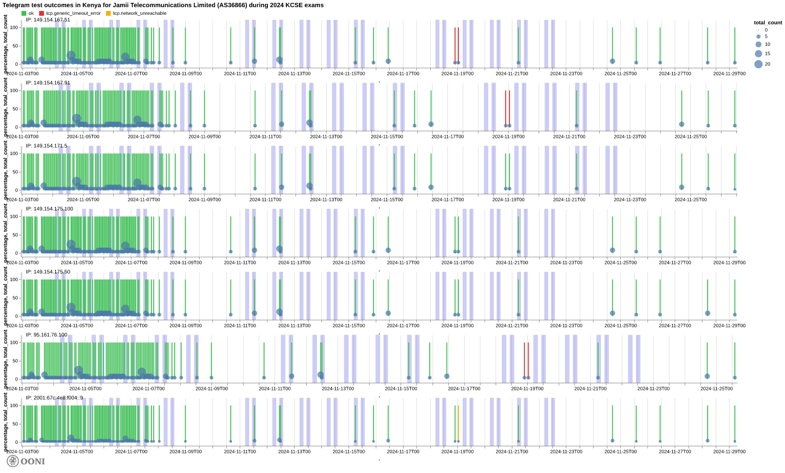

This report supported a **[petition](https://blog.bake.co.ke/wp-content/uploads/2025/05/HCCHRPET.276.2025-ICJ-v-CA-Internet-Shutdown-Case.pdf)** filed at the High Court of Kenya in May 2025, challenging the unlawful disruption of internet access in Kenya. **OONI data is used as evidence in support of this landmark public interest case**. Learn more [here](https://blog.bake.co.ke/2025/05/14/bake-6-other-organizations-challenge-internet-shutdowns-in-kenya-in-landmark-public-interest-case/).





## Introduction

Access to Telegram was blocked in Kenya during the Kenya Certificate of Secondary Education (KCSE) national exams in both [November 2023](https://explorer.ooni.org/findings/228466228201) and [November 2024](https://explorer.ooni.org/findings/20313562200). This report provides an analysis by the [Open Observatory of Network Interference (OONI) Foundation](https://ooni.org/) on these blocks.

[OONI](https://ooni.org/) is a nonprofit organization with global expertise on Internet censorship, having built free software tools for measuring Internet censorship since 2012. OONI hosts the [world’s largest open dataset on Internet censorship](https://ooni.org/data/) of its kind, consisting of more than 2 billion measurements collected from 28,000 unique networks across 242 countries and territories. Since OONI measurements are collected from the edge of the network, they provide unique insights into the accessibility or blocking of Internet services and can serve as evidence of Internet censorship.

The following sections of this document share further information about OONI, their measurement methodologies, and OONI measurement coverage in Kenya. More importantly, the following sections share relevant OONI data and technical analysis that serves as evidence of the blocking of Telegram on networks in Kenya during the November 2023 and November 2024 KCSE exams.

## Summary of Findings

### 2023 KCSE exams: Blocking of Telegram

Between 8th to 24th November 2023 (which correlates with the dates of the [2023 KCSE exams](https://knec.ac.ke/wp-content/uploads/2023/05/2023-KCSE-Timetable-02.05.23.pdf)), OONI data [shows](https://explorer.ooni.org/chart/mat?probe_cc=KE&since=2023-10-15&until=2023-11-30&time_grain=day&axis_x=measurement_start_day&test_name=telegram) that access to Telegram was **intermittently blocked** on Safaricom ([AS33771](https://explorer.ooni.org/chart/mat?probe_cc=KE&probe_asn=AS33771&since=2023-10-15&until=2023-11-29&time_grain=day&axis_x=measurement_start_day&test_name=telegram) and [AS37061](https://explorer.ooni.org/chart/mat?probe_cc=KE&probe_asn=AS37061&since=2023-10-15&until=2023-11-29&time_grain=day&axis_x=measurement_start_day&test_name=telegram)) and Airtel ([AS36926](https://explorer.ooni.org/chart/mat?probe_cc=KE&probe_asn=AS36926&since=2023-10-15&until=2023-11-29&time_grain=day&axis_x=measurement_start_day&test_name=telegram)), and **persistently blocked** on [Jambonet (AS12455)](https://explorer.ooni.org/chart/mat?probe_cc=KE&probe_asn=AS12455&since=2023-10-15&until=2023-11-29&time_grain=day&axis_x=measurement_start_day&test_name=telegram).

More specifically, during the [2023 KCSE exams](https://knec.ac.ke/wp-content/uploads/2023/05/2023-KCSE-Timetable-02.05.23.pdf), OONI data shows:

*   **Blocking of the Telegram website (telegram.org).**

*   **TLS interference.** On the [Safaricom (AS33771)](https://explorer.ooni.org/search?since=2023-11-01&until=2023-11-29&failure=false&domain=telegram.org&probe_cc=KE&probe_asn=AS33771&test_name=web_connectivity&only=anomalies) and [Airtel (AS36926)](https://explorer.ooni.org/search?since=2023-11-01&until=2023-11-29&failure=false&domain=telegram.org&probe_cc=KE&probe_asn=AS36926&test_name=web_connectivity&only=anomalies) networks, OONI data [shows](https://explorer.ooni.org/m/20231124121519.903111_KE_webconnectivity_6cafbea2c3daba2c) the timing out of the session after the ClientHello message during the TLS handshake.
*   **DNS tampering.** On the [Jambonet (AS12455)](https://explorer.ooni.org/search?since=2023-11-01&until=2023-11-29&failure=false&domain=telegram.org&probe_cc=KE&probe_asn=AS12455&test_name=web_connectivity&only=anomalies) network, OONI data [shows](https://explorer.ooni.org/m/20231112113823.324027_KE_webconnectivity_2363b7da3b5d08e5) that DNS resolution for the domain name telegram.org returned an IP address in local IP space (192.168.7.222), instead of the actual IP address for telegram.org. OONI data shows that this behavior [persists even outside](https://explorer.ooni.org/search?since=2023-11-01&until=2023-11-29&failure=false&domain=telegram.org&probe_cc=KE&probe_asn=AS12455&test_name=web_connectivity&only=anomalies) of the [exam hours](https://knec.ac.ke/wp-content/uploads/2023/05/2023-KCSE-Timetable-02.05.23.pdf).

*   **Blocking of Telegram Web (web.telegram.org).**

*   **TLS interference.** OONI data shows TLS level blocks affecting the IP address 149.154.167.99 (which is the IP of the Telegram web application) on the Safaricom ([AS33771](https://explorer.ooni.org/search?since=2023-11-03&until=2023-11-29&failure=false&probe_cc=KE&probe_asn=AS33771&test_name=telegram&only=anomalies) and [AS37061](https://explorer.ooni.org/search?since=2023-11-03&until=2023-11-29&failure=false&probe_cc=KE&probe_asn=AS37061&test_name=telegram&only=anomalies)) and Airtel ([AS36926](https://explorer.ooni.org/search?since=2023-11-03&until=2023-11-29&failure=false&probe_cc=KE&probe_asn=AS36926&test_name=telegram&only=anomalies)) networks.

*   **Blocking of the Telegram app endpoints.**

*   **IP level blocks on Jambonet.** Of all tested networks, OONI data shows that only [Jambonet (AS12455)](https://explorer.ooni.org/search?since=2023-11-03&until=2023-11-29&failure=false&probe_cc=KE&probe_asn=AS12455&test_name=telegram&only=anomalies) seems to have implemented [IP level blocking of Telegram endpoints](https://explorer.ooni.org/m/20231124184509.405171_KE_telegram_d29bbb262a274902). On this network, all tested Telegram endpoints [consistently presented timeout errors](https://explorer.ooni.org/search?since=2023-11-07&until=2023-11-25&failure=false&probe_cc=KE&probe_asn=AS12455&test_name=telegram) between 8th November 2023 to 24th November 2023. Similarly to the blocking of telegram.org, OONI data [shows](https://explorer.ooni.org/search?since=2023-11-03&until=2023-11-29&failure=false&probe_cc=KE&probe_asn=AS12455&test_name=telegram&only=anomalies) that Jambonet continued to block access to Telegram endpoints [outside of the time period of the 2023 KCSE national exams](https://knec.ac.ke/wp-content/uploads/2023/05/2023-KCSE-Timetable-02.05.23.pdf) (such as [during the weekend](https://explorer.ooni.org/m/20231119103633.391408_KE_telegram_51f484b45bea61ba) and [outside of exam hours](https://explorer.ooni.org/m/20231124184509.405171_KE_telegram_d29bbb262a274902)).

*   **Unblocking of Telegram.** OONI data shows that the blocking of Telegram was [lifted](https://explorer.ooni.org/chart/mat?probe_cc=KE&since=2023-10-15&until=2023-11-30&time_grain=day&axis_x=measurement_start_day&test_name=telegram) by 25th November 2023, which correlates with the [end of the 2023 KCSE exams](https://knec.ac.ke/wp-content/uploads/2023/05/2023-KCSE-Timetable-02.05.23.pdf).

### 2024 KCSE exams: Blocking of Telegram

In November 2024, during the [2024 KCSE exams](https://knec.ac.ke/wp-content/uploads/2024/03/2024-KCSE.pdf), OONI data shows that access to Telegram was blocked on Safaricom ([AS33771](https://explorer.ooni.org/search?since=2024-11-03&until=2024-11-29&failure=false&probe_cc=KE&probe_asn=AS33771&test_name=telegram&only=anomalies) and [AS37061](https://explorer.ooni.org/search?since=2024-11-03&until=2024-11-29&failure=false&probe_cc=KE&probe_asn=AS37061&test_name=telegram&only=anomalies)), Jambonet ([AS12455](https://explorer.ooni.org/search?since=2024-11-03&until=2024-11-29&failure=false&probe_cc=KE&probe_asn=AS12455&test_name=telegram&only=anomalies)), and on Jamil Telecommunications ([AS36866](https://explorer.ooni.org/chart/mat?probe_cc=KE&probe_asn=AS36866&since=2024-10-15&until=2024-12-15&time_grain=day&axis_x=measurement_start_day&test_name=telegram)). 

More specifically, during the [2024 KCSE exams](https://knec.ac.ke/wp-content/uploads/2024/03/2024-KCSE.pdf), OONI data shows:

*   **Blocking of the Telegram website (telegram.org).**

*   **IP blocking on Safaricom.** OONI data shows [TCP/IP timeout errors](https://explorer.ooni.org/m/20241120152205.805773_KE_webconnectivity_e3f681bcf7be171c) on two Safaricom networks ([AS33771](https://explorer.ooni.org/chart/mat?probe_cc=KE&probe_asn=AS33771&since=2024-10-03&until=2024-11-29&time_grain=day&axis_x=measurement_start_day&test_name=web_connectivity&domain=telegram.org) and [AS37061](https://explorer.ooni.org/chart/mat?probe_cc=KE&probe_asn=AS37061&since=2024-10-03&until=2024-11-29&time_grain=day&axis_x=measurement_start_day&test_name=web_connectivity&domain=telegram.org)), suggesting that access to telegram.org was blocked at an IP level. On AS33771, the block persisted [outside of the exam hours](https://explorer.ooni.org/m/20241121172621.962621_KE_webconnectivity_a32cb533dce70c94) and [throughout the weekend](https://explorer.ooni.org/search?since=2024-11-16&until=2024-11-18&probe_cc=KE&test_name=web_connectivity&probe_asn=AS33771&domain=telegram.org&failure=true), even though ISPs were only [instructed](https://x.com/nickanali/status/1854891285607293083) to block access to Telegram on weekdays during the exam hours. On AS37061, the block was [lifted](https://explorer.ooni.org/search?since=2024-11-09&until=2024-11-11&probe_cc=KE&test_name=web_connectivity&probe_asn=AS37061&domain=telegram.org&failure=true) during the weekend (9th and 10th November 2024).

*   **Blocking of Telegram Web (web.telegram.org).**

*   **IP blocking.** OONI data shows that access to Telegram Web (web.telegram.org) was restricted by means of IP blocking on Safaricom ([AS33771](https://explorer.ooni.org/search?since=2024-11-03&until=2024-11-29&failure=false&probe_cc=KE&probe_asn=AS33771&test_name=telegram&only=anomalies) and [AS37061](https://explorer.ooni.org/search?since=2024-11-03&until=2024-11-29&failure=false&probe_cc=KE&probe_asn=AS37061&test_name=telegram&only=anomalies)) and Jambonet ([AS12455](https://explorer.ooni.org/search?since=2024-11-03&until=2024-11-29&failure=false&probe_cc=KE&probe_asn=AS12455&test_name=telegram&only=anomalies)).
*   **TLS interference.** On Jamil ([AS36866](https://explorer.ooni.org/search?since=2024-11-03&until=2024-11-29&failure=false&probe_cc=KE&probe_asn=AS36866&test_name=telegram&only=anomalies)), OONI data suggests that the blocking of web.telegram.org was implemented at the [TLS level](https://explorer.ooni.org/m/20241107061401.619024_KE_telegram_bdb6177fc0e6c33a) because the connection was reset after the ClientHello message during the TLS handshake. However, very few measurements are available that overlap with the 2024 KCSE exam hours, limiting this finding.

*   **Blocking of the Telegram app endpoints.**

*   **IP level blocks.** Between 7th to 22nd November 2024, OONI data shows that access to Telegram app endpoints was blocked on the Jambonet (AS12455) and Safaricom (AS33771 and AS37061) networks.

*   On Jambonet ([AS12455](https://explorer.ooni.org/search?since=2024-11-03&until=2024-11-29&failure=false&probe_cc=KE&probe_asn=AS12455&test_name=telegram&only=anomalies)), OONI data shows that all tested Telegram endpoints were blocked, and that the block was limited to exam hours.
*   On Safaricom networks ([AS33771](https://explorer.ooni.org/search?since=2024-11-03&until=2024-11-29&failure=false&probe_cc=KE&probe_asn=AS33771&test_name=telegram&only=anomalies) and [AS37061](https://explorer.ooni.org/search?since=2024-11-03&until=2024-11-29&failure=false&probe_cc=KE&probe_asn=AS37061&test_name=telegram&only=anomalies)), OONI data shows the blocking of most Telegram endpoints, except for two (149.154.175.100 and 149.154.175.50), and that the block persisted [outside of the hours of the national exams](https://explorer.ooni.org/search?since=2024-11-03&until=2024-11-18&failure=false&probe_cc=KE&probe_asn=AS33771&test_name=telegram&only=anomalies).

*   **Unblocking of Telegram Web after the 2024 KCSE exams.** While the blocking of Telegram app endpoints was lifted by 23rd November 2024 (at the end of the [2024 KCSE exams](https://knec.ac.ke/wp-content/uploads/2024/03/2024-KCSE.pdf), as [instructed](https://www.kictanet.or.ke/telegram-access-blocked-in-kenya/) by the Communications Authority of Kenya), OONI data suggests that access to Telegram Web (web.telegram.org) [remained blocked](https://explorer.ooni.org/chart/mat?probe_cc=KE&probe_asn=AS33771&since=2024-10-15&until=2024-12-15&time_grain=day&axis_x=measurement_start_day&test_name=telegram) on Safaricom networks ([AS33771](https://explorer.ooni.org/chart/mat?probe_cc=KE&probe_asn=AS33771&since=2024-10-15&until=2024-12-15&time_grain=day&axis_x=measurement_start_day&test_name=telegram) and [AS37061](https://explorer.ooni.org/chart/mat?probe_cc=KE&probe_asn=AS37061&since=2024-10-15&until=2024-12-15&time_grain=day&axis_x=measurement_start_day&test_name=telegram)) until 29th November 2024.

## About OONI

This analysis of the blocking of Telegram in Kenya during the 2023 and 2024 KCSE exams is provided by the [Open Observatory of Network Interference (OONI) Foundation](https://ooni.org/) (hereafter referred to as “OONI”). OONI is a nonprofit organization, legally registered in Rome, Italy, with global operations and extensive global expertise in Internet censorship.

Having pioneered crowdsourced methods for measuring Internet censorship, OONI is a leader in the network measurement world. OONI won the [2012 Access Now Freedom of Expression Tech Prize](https://web.archive.org/web/20130424101948/https://www.accessnow.org/blog/2012/12/11/first-annual-access-innovation-awards-prize-winners-announced) for actionable ideas on how to use information technology to promote and enable human rights and deliver social good. More recently, OONI received the [Free and Open Communications on the Internet (FOCI) 2023 Community Award](https://foci.community/awards.html).

Since 2012, OONI has developed [OONI Probe](https://ooni.org/install/), a free and open source software designed to [measure various forms of Internet censorship](https://ooni.org/nettest/), including the [blocking of the Telegram app](https://ooni.org/nettest/telegram). Each month, volunteers run [OONI Probe](https://ooni.org/install/) in [around 170 countries](https://explorer.ooni.org/), including [Kenya](https://explorer.ooni.org/country/KE), where users have contributed [more than 9 million network measurements](https://explorer.ooni.org/country/KE) from 94 local networks since 2016. By default, OONI automatically publishes network measurements submitted by OONI Probe users worldwide as [open data in real-time](https://ooni.org/data). With over 2 billion network measurements collected from 28,000 unique Autonomous Systems (ASes) across 242 countries and territories since 2012, OONI maintains the [world’s largest open dataset on Internet censorship](https://ooni.org/data/) of its kind.

More specifically, OONI works on the following:

*   **Free and open source tools for measuring internet censorship.** Since 2012, OONI has developed [free and open source software](https://github.com/ooni) designed to measure various forms of Internet censorship. Through their [OONI Probe app](https://ooni.org/install/), anyone can [measure](https://ooni.org/nettest/) the blocking of websites and instant messaging apps (including [Telegram](https://ooni.org/nettest/telegram)) and collect network measurement data in real-time that can serve as evidence.
*   **Real-time open data on internet censorship****.** OONI maintains the [largest open dataset on Internet censorship](https://ooni.org/data/) to date. As soon as anyone runs [OONI Probe](https://ooni.org/install/) anywhere around the world, their test results are automatically published by OONI as [open data](https://ooni.org/data/) in real-time. To enable researchers to investigate Internet censorship, OONI provides an [API](https://api.ooni.io/) for downloading the raw data in JSON format, a [web platform](https://explorer.ooni.org/) (“OONI Explorer”) for searching through OONI measurements, and a [Measurement Aggregation Toolkit (MAT)](https://explorer.ooni.org/chart/mat) for generating charts based on aggregate views of OONI data.
*   **Research on internet censorship based on OONI data****.** OONI has published [more than 75 reports](https://ooni.org/reports/) documenting Internet censorship around the world based on the analysis of OONI data. Notably, these include a [technical multi-stakeholder research report on Internet shutdowns in Iran](https://ooni.org/post/2022-iran-technical-multistakeholder-report/), facilitated by the European Commission and the United States government. OONI presented this report to members of the Trade and Technology Council (TTC) and to EU Member States of the High Level Group on Internet Governance (HLIG).
*   **Partnerships on the study of Internet censorship.** Since 2016, OONI has established [more than 50 partnerships](https://ooni.org/partners) with leading digital rights organizations worldwide to study Internet censorship. These include research collaborations with academic institutions like the [Oxford Internet Institute at the University of Oxford](https://ooni.org/partners/glitch/) and [Georgia Tech](https://ooni.org/partners/ioda/), as well as with prominent global nonprofits such as the [Internet Society (ISOC)](https://ooni.org/partners/internet-society/).

Over the past decade, OONI data has supported third-party research on Internet censorship in [Iran](https://thenetmonitor.org/bulletins/censorship-and-collateral-damage-analyzing-the-telegram-ban-in-iran), [Egypt](https://masaar.net/en/internet-censorship-in-time-of-social-distancing/), [Malaysia](https://sinarproject.org/digital-rights/updates/online-lgbt-censorship-malaysia), the [Philippines](https://sinarproject.org/digital-rights/updates/internet-censorship-monitoring-dutertes-drug-war), [India](https://cis-india.org/internet-governance/blog/investigating-encrypted-dns-blocking-in-india), [Venezuela](https://vesinfiltro.com/noticias/2021_informe_anual/), [Rwanda](https://www.academia.edu/37858638/Rwanda_s_Resilient_and_Consistent_Censorship_Regime_.pdf), [Uganda](https://preparepreventresist.org/wp-content/uploads/2022/07/Impact-of-Shutdowns-on-Women-in-Uganda.pdf), [Lebanon](https://smex.org/ar/%D8%AD%D8%AC%D8%A8-%D8%A8%D9%84%D9%88%D8%BA%D8%B1-%D9%81%D9%8A-%D9%84%D8%A8%D9%86%D8%A7%D9%86-%D9%83%D9%8A%D9%81-%D8%AA%D8%B3%D8%AA%D9%85%D8%B1%D9%91-%D9%88%D8%B2%D8%A7%D8%B1%D8%A9-%D8%A7%D9%84%D8%A7/), [Myanmar](https://www.opentech.fund/news/information-controls-unprotected-legal-landscape/), [Azerbaijan](https://www.az-netwatch.org/news/how-websites-are-blocked-in-azerbaijan/), [Ukraine](https://medium.com/@cyberlabukraine/findings-of-analysis-of-internet-blocking-in-ukraine-march-2019-b20e23c17aee), [Russia and Crimea](https://www.opentech.fund/news/exploring-online-media-filtering-during-2018-russian-presidential-elections/) (among many other countries). Freedom House has [cited](https://freedomhouse.org/countries/freedom-net/scores) OONI data in many of their annual Freedom on the Net country reports. OONI data has also supported academic papers, such as research on [China’s DNS censorship](https://www.usenix.org/system/files/sec21-hoang.pdf), global [CDN geoblocking](https://ensa.fi/papers/403forbidden_imc18.pdf), global [I2P censorship](https://arxiv.org/pdf/1907.07120.pdf), and on the [deployment of network censorship filters at a global scale](https://censoredplanet.org/assets/filtermap.pdf).

[Harvard’s Berkman Klein Center](https://cyber.harvard.edu/research/internetmonitor) integrated OONI data into their [AccessCheck](https://accesscheck.thenetmonitor.org/) project. [Internet Society (ISOC)](https://www.internetsociety.org/) includes OONI data in their [Pulse Internet Shutdowns](https://pulse.internetsociety.org/shutdowns) project, which provides a timeline of blocking events and internet shutdowns around the world. Journalists worldwide also rely on OONI data when reporting on emerging censorship events. For example, OONI data is cited in articles by major news outlets such as [Wired](https://www.wired.co.uk/article/russia-block-tor-censorship), [BBC](https://www.bbc.com/news/technology-48269608), [CNN](https://money.cnn.com/2017/09/25/technology/business/whatsapp-blocked-china/index.html), [CBC News](https://www.cbc.ca/news/science/ooni-tor-information-controls-measurement-censorship-iran-1.4653523), [CNET](https://www.cnet.com/culture/the-great-firewall-of-china-blocks-off-wikipedia/), [The Intercept](https://theintercept.com/2019/12/12/net-claro-e-vivo-bloqueiam-site-aborto-seguro/), [Wall Street Journal](https://www.wsj.com/articles/internet-powered-mass-protests-in-cuba-then-the-government-pulled-the-plug-11626358893), [Deutsche Welle](https://www.dw.com/en/myanmar-military-coup-press-freedom/a-56829376), [Taggesspiegel](https://interaktiv.tagesspiegel.de/lab/internet-sperren-im-iran-blackouts-gegen-die-freiheit/), [Mada Masr](https://www.madamasr.com/en/2018/07/02/news/u/report-internet-censorship-has-become-more-pervasive-in-past-year-62-of-blocked-websites-are-media-outlets/), [Al Araby](https://www.alaraby.co.uk/%D8%A7%D9%84%D8%B1%D9%82%D8%A7%D8%A8%D8%A9-%D8%B9%D9%84%D9%89-%D8%A7%D9%84%D8%A5%D9%86%D8%AA%D8%B1%D9%86%D8%AA-%D9%81%D9%8A-%D9%85%D8%B5%D8%B1-%D8%A3%D8%B5%D8%A8%D8%AD%D8%AA-%D8%A3%D9%83%D8%AB%D8%B1-%D8%AF%D9%8A%D9%86%D8%A7%D9%85%D9%8A%D9%83%D9%8A%D8%A9-%D9%88%D8%A7%D9%86%D8%AA%D8%B4%D8%A7%D8%B1%D8%A7%D9%8B), [Time](https://time.com/5589439/china-wikipedia-online-censorship/), and [Africa Times](https://africatimes.com/2016/12/14/report-ethiopias-media-blackout-patterns-show-deliberate-timing-and-targets/), among many others.

## OONI’s Internet Measurement Methodology

Overall, OONI measures Internet services in a crowdsourced way through network-level [experiments](https://ooni.org/nettest/) run by [OONI Probe app](https://ooni.org/install/) users in [around 170 countries](https://explorer.ooni.org/) each month. Each of these experiments has a different methodology, all of which are [publicly documented](https://github.com/ooni/spec/tree/master/nettests). Since these experiments are run from local network vantage points, they offer **unique insights into the accessibility or blocking of Internet services at the edge of the network**. OONI publishes OONI Probe test results (“measurements”) from around the world as [open data](https://ooni.org/data/) in real-time.

To examine the reported blocking of Telegram in Kenya, OONI analyzed measurements collected from the [OONI Probe](https://ooni.org/install/) testing of Telegram in the country. Specifically, OONI analyzed measurements from two OONI Probe experiments that are relevant to the testing of Telegram:

*   [Telegram experiment](https://github.com/ooni/spec/blob/master/nettests/ts-020-telegram.md)
*   [Web Connectivity experiment](https://github.com/ooni/spec/blob/master/nettests/ts-017-web-connectivity.md)

The following sections explain how each of these two experiments work.

### Telegram experiment

The [OONI Probe Telegram experiment](https://github.com/ooni/spec/blob/master/nettests/ts-020-telegram.md) is designed to measure the reachability of Telegram’s app and web version within a tested network. More specifically, the test attempts to establish a TCP connection to the endpoints of the Telegram app (DCs) and perform an HTTP POST request, as well as an HTTPS GET request to Telegram’s web version (web.telegram.org) over the vantage point of the user. The test results are automatically annotated as “OK” if the experiment succeeds in all of these steps. If they fail, the test results are automatically annotated as “[anomalous](https://ooni.org/support/interpreting-ooni-data/#anomalies)”, indicating potential blocking. 

Based on OONI’s [methodology](https://github.com/ooni/spec/blob/master/nettests/ts-020-telegram.md), Telegram’s app is considered likely blocked if TCP connections on ports 80 and 443 to all [tested Telegram access point IPs](https://github.com/ooni/spec/blob/master/nettests/ts-020-telegram.md) fail, and/or if HTTP POST requests to Telegram’s access points do not send back a response to OONI’s servers. Telegram’s web version (web.telegram.org) is likely blocked if the TLS handshake fails or if the HTTPS GET requests to web.telegram.org do not send back a consistent response to OONI’s servers. However, [false positives](https://ooni.org/support/faq#what-are-false-positives) can occur due to a number of reasons, such as due to transient network failures, or if Telegram makes changes to their infrastructure that affect how the [OONI Probe Telegram experiment](https://github.com/ooni/spec/blob/master/nettests/ts-020-telegram.md) runs.

### Web Connectivity experiment

OONI’s [Web Connectivity experiment](https://github.com/ooni/spec/blob/master/nettests/ts-017-web-connectivity.md) is designed to measure the blocking of the [websites](https://ooni.org/support/faq#which-websites-will-i-test-for-censorship-with-ooni-probe) included in the public, community-curated [Citizen Lab test lists](https://github.com/citizenlab/test-lists/tree/master/lists), which include telegram.org.

Specifically, OONI’s Web Connectivity test is designed to measure the accessibility of [URLs](https://github.com/citizenlab/test-lists/tree/master/lists) by performing the following steps:

*   Resolver identification
*   DNS lookup
*   TCP connect to the resolved IP addresses
*   TLS handshake to the resolved IP addresses
*   HTTP(s) GET request following redirects

The above steps are automatically performed from both the local network of the user, and from a control vantage point. If the results from both networks are the same, the tested URL is annotated as accessible. If the results differ, the tested URL is annotated as [anomalous](https://ooni.org/support/interpreting-ooni-data/#anomalies), and the type of anomaly is further characterized depending on the reason that caused the failure (for example, if the TCP connection fails, the measurement is annotated as a TCP/IP anomaly).

[Anomalous measurements](https://ooni.org/support/interpreting-ooni-data/#anomalies) may be indicative of blocking, but [false positives](https://ooni.org/support/faq#what-are-false-positives) can occur. The likelihood of blocking is therefore greater if the overall volume of anomalous measurements is high in comparison to the overall measurement count – compared on an AS level within the same date range for each OONI Probe experiment type.

Each Web Connectivity measurement provides further network information (such as information pertaining to TLS handshakes) that helps with evaluating whether an anomalous measurement presents signs of blocking. OONI therefore disaggregates based on the reasons that caused the anomaly (e.g. connection reset during the TLS handshake) and if they are consistent, they provide a stronger signal of potential blocking.

Based on their heuristics, OONI is able to automatically confirm the blocking of websites based on [fingerprints](https://github.com/ooni/blocking-fingerprints) if a [block page](https://ooni.org/support/glossary#block-page) is served, or if DNS resolution returns an IP known to be associated with censorship. These [blocking fingerprints](https://github.com/ooni/blocking-fingerprints) enable OONI to [automatically confirm website blocks](https://explorer.ooni.org/search?since=2025-03-05&until=2025-04-05&failure=false&only=confirmed) in countries like [Russia](https://explorer.ooni.org/search?since=2024-10-16&until=2024-11-16&failure=false&test_name=web_connectivity&only=confirmed&probe_cc=RU), [Italy](https://explorer.ooni.org/search?since=2024-10-16&until=2024-11-16&failure=false&test_name=web_connectivity&only=confirmed&probe_cc=IT), [Kazakhstan](https://explorer.ooni.org/search?since=2024-10-16&until=2024-11-16&failure=false&test_name=web_connectivity&only=confirmed&probe_cc=KZ), [Iran](https://explorer.ooni.org/search?since=2024-10-16&until=2024-11-16&failure=false&test_name=web_connectivity&only=confirmed&probe_cc=IR), and [Indonesia](https://explorer.ooni.org/search?since=2024-10-16&until=2024-11-16&failure=false&test_name=web_connectivity&only=confirmed&probe_cc=ID) where ISPs implement blocks with these techniques. For other countries (such as Kenya) where ISPs implement blocks differently, OONI analyzed anomalous measurements with their [data analysis tool](https://github.com/ooni/data) to determine whether those anomalies are symptomatic of blocks.

### Data analysis

OONI analyzed measurements for test_name = telegram and those for test_name = web_connectivity and hostname = telegram.org on each tested network during the date range of interest. The analysis was further restricted to networks (ASes) which had a sufficient number of measurements to have a high enough confidence in the findings. The notebook used by OONI to perform the data analysis is available **[here](https://github.com/ooni/notebooks/blob/master/analysis/2025-kenya-telegram/2025-kenya-analysis.ipynb)**.

In order to perform the analysis more effectively, the raw OONI measurement JSONs were converted into observations and the interpretation of the anomaly from the perspective of the probe (the value of the `blocking` key in web_connectivity and the keys telegram_http_blocking, telegram_tcp_blocking, telegram_web_status for the telegram test) is discarded. In doing so, OONI is able to adjust the analysis to the specificity of the blocking patterns seen and improve the accuracy of the findings.

Observations are generated from raw OONI measurement JSONs using [OONI Pipeline v5](https://github.com/ooni/data) and, generally, a given OONI measurement will correspond to multiple observations. An observation is the outcome of a particular network operation towards a specific target (e.g. “When attempting to perform a TCP handshake to IP address 123.45.67.8 on port 443, we got a connection refused”). These observations are then aggregated by a specific time window (mostly hourly) and disaggregated by network (probe_asn) and/or target (IP address or domain name).

As outlined in previous sections, the measurement collection logic differs between the [Web Connectivity](https://github.com/ooni/spec/blob/master/nettests/ts-017-web-connectivity.md) and [Telegram](https://github.com/ooni/spec/blob/master/nettests/ts-020-telegram.md) experiments and, therefore, the analysis will vary slightly.

For the [Web Connectivity](https://github.com/ooni/spec/blob/master/nettests/ts-017-web-connectivity.md) measurements, OONI looks at the observations for each distinct IP address which was resolved for the domain name telegram.org. OONI excludes IPv6 addresses, since they noticed that IPv6 connectivity on all tested networks in Kenya was not working reliably. OONI also exclude IP addresses which are bogons (i.e. IPs that should not appear on the public internet), which leaves us with a single Telegram IP address: 149.154.167.99. OONI then inspects the outcome of the TCP connect and TLS handshake operation to assess whether these operations are failing consistently in the same way on the same network.

For the [Telegram](https://github.com/ooni/spec/blob/master/nettests/ts-020-telegram.md) measurements, OONI analyzes separately the observations targeting the Telegram app endpoints (for which only a TCP connect operation is performed) from those targeting Telegram Web (web.telegram.org). The Telegram Web measurements – since they also include a TLS handshake – are analyzed in a way that is very similar to that of [Web Connectivity](https://github.com/ooni/spec/blob/master/nettests/ts-017-web-connectivity.md) measurements.

For the Telegram app endpoint tests on the other hand, OONI only looks at the TCP connect outcome and again checks for consistent failures across the same network. When OONI notices some inconsistencies in the failures, they will then manually inspect the inconsistent measurements to determine why they may not be consistent. One important limitation of the test, however, is that it does not actually speak the [Telegram MTProto protocol](https://core.telegram.org/mtproto) once a TCP connection is established to the endpoint. This means that there is the risk of reporting the application as functional, while it in fact does not work due to protocol level blocks that only occur after the initial TCP handshake.

Each of the time series charts shared in this report contain an overlay of the times in which the national KCSE exams were occurring to identify a correlation between the time of the blocks and the ongoing exam times.

#### Acknowledgement of limitations

The OONI findings of this report present several limitations:

*   **Date range of analysis.** The findings are limited to OONI network measurement data collected from Kenya in [November 2023](https://explorer.ooni.org/findings/228466228201) and [November 2024](https://explorer.ooni.org/findings/20313562200), when the blocking of Telegram was reported in the country during the KCSE exams.
*   **Measurement coverage.** The availability of OONI data depends on whether, on which networks, and when an [OONI Probe](https://ooni.org/install) user ran tests in Kenya. As OONI Probe is used on a voluntary basis, OONI has no control over the availability measurements. As a result, OONI measurement coverage in Kenya varies over time.
*   **Tested ASes.** While OONI Probe tests are regularly performed on multiple ASes in Kenya, not all networks are tested equally. Rather, the availability of measurements depends on which networks [OONI Probe](https://ooni.org/install) users were connected to when performing tests. As a result, OONI measurement coverage varies across ASes over time in Kenya. Moreover, the findings are limited to the ASes which received the largest measurement coverage and which presented the strongest blocking signals during the analysis period.
*   **Blocking signals.** As part of their data analysis, OONI limited their findings to signals that they considered more reliable and indicative of government-commissioned censorship, while excluding cases viewed as presenting weak signals (due to limited measurement coverage and inconsistent failure types).

## OONI measurements from Kenya

Since 2012, the [Open Observatory of Network Interference (OONI)](https://ooni.org/) has built free software apps ([OONI Probe](https://ooni.org/install/)) which include [experiments](https://ooni.org/nettest/) designed to measure various forms of internet censorship, including the blocking of [Telegram](https://ooni.org/nettest/telegram). These experiments are run by [OONI Probe](https://ooni.org/install/) users in [around 170 countries](https://explorer.ooni.org/) (including [Kenya](https://explorer.ooni.org/country/KE)) every month, testing their networks to detect the blocking of websites and apps. To increase transparency of Internet censorship, OONI publishes OONI Probe test results (“measurements”) from around the world as [open data](https://ooni.org/data/) in real-time.

Since 2016, [OONI Probe](https://ooni.org/install/) users in Kenya have contributed [more than 9 million measurements](https://explorer.ooni.org/country/KE) from 94 local Autonomous Systems (ASes). Every day, OONI Probe users in Kenya continue to [contribute new measurements](https://explorer.ooni.org/search?since=2025-03-04&until=2025-04-04&failure=false&probe_cc=KE), which OONI publishes in real-time. These longitudinal network measurements – spanning from 2016 to date – provide insight into the accessibility of tested websites and apps on tested networks in Kenya. 

Over the past decade, OONI data suggested that Kenya was a leader in defending Internet freedom, with almost no blocks detected or reported. In fact, OONI even published a short [report](https://ooni.org/post/kenya-study/) in December 2016 (titled “Kenya: Censorship-free internet?”) documenting that almost no signs of Internet censorship had been detected in Kenya based on the analysis of OONI data. This stood in sharp contrast to other East African countries, such as [Ethiopia](https://ooni.org/post/ethiopia-report/) and [Uganda](https://ooni.org/post/uganda-social-media-tax/), where access to major social media platforms was blocked.

However, Kenya's record of maintaining access to Internet services declined during the [November 2023](https://knec.ac.ke/wp-content/uploads/2023/05/2023-KCSE-Timetable-02.05.23.pdf) and [November 2024 KCSE exams](https://knec.ac.ke/wp-content/uploads/2024/03/2024-KCSE.pdf), when access to Telegram was [allegedly blocked](https://www.kictanet.or.ke/telegram-access-blocked-in-kenya/). To examine whether Telegram was blocked in Kenya, it is necessary to first evaluate whether there was [OONI measurement coverage](https://explorer.ooni.org/country/KE) from the country during those time periods (leading up to, during, and after November 2023 and November 2024). In general, the greater the availability of network measurement data, the more likely it is to derive statistically meaningful conclusions.

The following two charts illustrate overall OONI measurement coverage (including results from [all OONI Probe experiments](https://ooni.org/nettest/)), aggregated from all tested networks in Kenya throughout 2023 and 2024.

{{}}

**Chart:** Overall OONI measurement coverage aggregated from all tested networks in Kenya between January 2023 to December 2023 (source: [OONI Explorer](https://explorer.ooni.org/country/KE)).

{{}}

**Chart:** Overall OONI measurement coverage aggregated from all tested networks in Kenya between January 2024 to December 2024 (source: [OONI Explorer](https://explorer.ooni.org/country/KE)).

The charts above show stable OONI measurement coverage throughout both years, with a notable increase in coverage in 2024 compared to 2023. The stable and relatively high volume of measurements during the periods of interest helps instill confidence in the blocking findings, as it statistically reduces the likelihood of false positives caused by transient network failures.

## Findings: Blocking of Telegram in Kenya during 2023 and 2024 KCSE exams

Access to Telegram was [intermittently blocked](https://explorer.ooni.org/findings/228466228201) in Kenya in November 2023 amid the [Kenya Certificate of Secondary Education (KCSE)](https://knec.ac.ke/wp-content/uploads/2023/05/2023-KCSE-Timetable-02.05.23.pdf) national exams. As examination papers were [allegedly leaked](https://www.kenyans.co.ke/news/94469-six-arrested-over-selling-fake-exam-papers-social-media) on Telegram, access to Telegram may have been blocked in an attempt to prevent exam cheating. The timing of the disruption was [reportedly](https://www.techinafrica.com/kenya-experiences-telegram-outage-internet-regulators-maintain-silence/) limited to daytime hours (when exams were in session), as Telegram was accessible at night (outside of exam hours) during this period. Kenya’s Communications Authority (CA) does [not appear to have publicly acknowledged or verified](https://www.techinafrica.com/kenya-experiences-telegram-outage-internet-regulators-maintain-silence/) this disruption.

Similarly, access to Telegram was [blocked](https://explorer.ooni.org/findings/20313562200) again in Kenya the following year during the [2024 KCSE exams](https://knec.ac.ke/wp-content/uploads/2024/03/2024-KCSE.pdf). The block was [reportedly requested](https://www.kictanet.or.ke/telegram-access-blocked-in-kenya/) by the Communications Authority of Kenya (CA) to prevent cheating during the national exams. An [order by the Communications Authority of Kenya](https://x.com/nickanali/status/1854891285607293083) (dated 31st October 2024) specifies that while other social media platforms operating in Kenya took steps to address misuse, Telegram remained non-responsive and continued to host “offending forums and channels” in breach of Kenyan laws and data protection principles, and in interference with the integrity of the national examinations. In response, the Communications Authority of Kenya directed all mobile network operators to suspend Telegram services between 7am to 10am, and between 1pm to 4pm from Monday until Friday up until 22nd November 2024 – all of which [coincided with the dates and timings of the 2024 KCSE exams](https://www.knec.ac.ke/wp-content/uploads/2024/03/2024-KCSE.pdf).

The following sections share OONI data on the blocking of Telegram during the [2023 KCSE exams](https://explorer.ooni.org/findings/228466228201) and [2024 KCSE exams](https://explorer.ooni.org/findings/20313562200).

### 2023 KCSE exams: Blocking of Telegram in Kenya

In November 2023, OONI data presented signs of [Telegram blocking](https://explorer.ooni.org/search?since=2023-11-08&until=2023-11-24&probe_cc=KE&test_name=telegram&failure=true&only=anomalies) in Kenya for the first time. Even though OONI data has been [collected from Kenya](https://explorer.ooni.org/country/KE) since 2016, the data had not shown strong signals pertaining to the blocking of social media or instant messaging apps in the country before. In fact, OONI even published a [report](https://ooni.org/post/kenya-study/) in the past documenting that they had found almost no signs of Internet censorship in Kenya.

Telegram was tested in Kenya with both the OONI Probe [Web Connectivity experiment](https://github.com/ooni/spec/blob/master/nettests/ts-017-web-connectivity.md) (designed to measure the blocking of websites) and with the dedicated OONI Probe [Telegram experiment](https://github.com/ooni/spec/blob/master/nettests/ts-020-telegram.md) (designed to measure the blocking of the Telegram app and web version). OONI measurements collected from both experiments present signs of Telegram blocking on some tested networks in Kenya in November 2023.

The hypothesis that Telegram was down globally – as opposed to being blocked locally in Kenya by ISPs – is ruled out because [global OONI measurement coverage](https://explorer.ooni.org/chart/mat?test_name=telegram&since=2023-10-01&until=2023-12-31&axis_x=measurement_start_day&time_grain=day) pertaining to the [testing of Telegram](https://github.com/ooni/spec/blob/master/nettests/ts-020-telegram.md) shows that the Telegram app was mostly accessible on tested networks in most countries globally between 1st October 2023 to 31st December 2023 (which includes the [November 2023 KCSE exam period](https://knec.ac.ke/wp-content/uploads/2023/05/2023-KCSE-Timetable-02.05.23.pdf)), as illustrated below.

{{}}

**Chart:** Global OONI Probe testing of Telegram between 1st October 2023 to 31st December 2023 (source: [OONI data](https://explorer.ooni.org/chart/mat?test_name=telegram&since=2023-10-01&until=2023-12-31&axis_x=measurement_start_day&time_grain=day)).

The above chart [shows](https://explorer.ooni.org/chart/mat?test_name=telegram&since=2023-10-01&until=2023-12-31&axis_x=measurement_start_day&time_grain=day) global OONI measurement coverage pertaining to the [testing](https://github.com/ooni/spec/blob/master/nettests/ts-020-telegram.md) of Telegram app endpoints and Telegram Web (web.telegram.org). If Telegram were down globally, the above chart would have presented a large volume of measurements annotated as “anomalous” because attempted TCP connections to the Telegram app endpoints would have failed globally. Instead, the above chart shows that most measurements were “OK”, meaning that it was possible to successfully establish TCP connections to Telegram app endpoints from thousands of networks in most countries around the world. Telegram therefore seemed to work globally during the 2023 KCSE exams, suggesting that any restrictions were imposed locally.

#### Blocking of Telegram website

The following [chart](https://explorer.ooni.org/chart/mat?probe_cc=KE&since=2023-10-15&until=2023-12-15&time_grain=day&axis_x=measurement_start_day&test_name=web_connectivity&domain=telegram.org) aggregates OONI measurement coverage from the OONI Probe Web Connectivity testing of Telegram’s website (telegram.org) on multiple networks in Kenya between 15th October 2023 to 15th December 2023.

{{}}

**Chart:** OONI Probe Web Connectivity testing of telegram.org on multiple networks in Kenya between 15th October 2023 to 15th December 2023 (source: [OONI data](https://explorer.ooni.org/chart/mat?probe_cc=KE&since=2023-10-15&until=2023-12-15&time_grain=day&axis_x=measurement_start_day&test_name=web_connectivity&domain=telegram.org)).

As is evident from the above chart, most OONI measurements between October 2023 to December 2023 showed that telegram.org was accessible on tested networks in Kenya (as annotated in green), while measurements mainly presented anomalies (annotated in orange) between 17th November 2023 to 24th November 2023. While those anomalous measurements could present signs of Telegram blocking, it’s worth highlighting that the availability of successful measurements during the same dates (between 17th to 24th November 2023) suggest that if access to telegram.org was blocked, it was not blocked continuously, and/or that it was not blocked on all networks.

A similar pattern is observed when looking at [OONI measurements](https://explorer.ooni.org/chart/mat?probe_cc=KE&since=2023-10-15&until=2023-12-15&time_grain=day&axis_x=measurement_start_day&test_name=telegram) collected from the OONI Probe [Telegram experiment](https://github.com/ooni/spec/blob/master/nettests/ts-020-telegram.md) on multiple networks in Kenya during the same period (15th October 2023 to 15th December 2023), as illustrated below.

{{}}

**Chart:** OONI Probe testing of Telegram on multiple networks in Kenya between 15th October 2023 to 15th December 2023 (source: [OONI data](https://explorer.ooni.org/chart/mat?probe_cc=KE&since=2023-10-15&until=2023-12-15&time_grain=day&axis_x=measurement_start_day&test_name=telegram)).

In both cases demonstrated in the above two charts, there is a spike in anomalous measurements during the same period, but those anomalies are not persistent, as many measurements during the same period were successful. OONI therefore analyzed these anomalous measurements to determine what caused them, and if they were symptomatic of censorship.

The following chart illustrates the results of OONI’s analysis of the [Web Connectivity testing](https://github.com/ooni/spec/blob/master/nettests/ts-017-web-connectivity.md) of telegram.org in Kenya, demonstrating that most anomalous measurements presented timeout errors after the ClientHello message during the TLS handshake.

{{}}

**Chart:** Aggregated results from the OONI Probe Web Connectivity testing of telegram.org on multiple networks in Kenya between 16th October 2023 to 29th November 2023 (source: [OONI data](https://explorer.ooni.org/chart/mat?probe_cc=KE&since=2023-10-15&until=2023-12-15&time_grain=day&axis_x=measurement_start_day&test_name=web_connectivity&domain=telegram.org)).

While the [first anomalous measurement](https://explorer.ooni.org/m/20231108113923.345875_KE_webconnectivity_1816816d89b5fd58) is from 8th November 2023, this signal was quite weak given the relatively limited measurement coverage and presence of successful measurements. OONI therefore focused their analysis of Web Connectivity measurements from 10th November 2023 onwards (two days prior to the first case of true blocking).

OONI measurements during this period were collected on a total of 19 networks, listed below.

| Probe ASN | Probe AS organization name              | Observation count |
| --------- | --------------------------------------- | ----------------- |
| 33771     | Safaricom Limited                       | 1050              |
| 36866     | Jamii Telecommunications Limited        | 646               |
| 30844     | Liquid Telecommunications Ltd           | 284               |
| 37061     | Safaricom Limited                       | 264               |
| 15808     | ACCESSKENYA GROUP LTD is an ISP serving | 160               |
| 15399     | Wananchi Group (Kenya) Limited          | 156               |
| 12455     | Jambonet Autonomous System              | 150               |
| 329014    | Vilcom Networks Limited                 | 140               |
| 329183    | FLINK TECHNOLOGIES LTD                  | 80                |
| 329211    | Novia East Africa Ltd                   | 36                |
| 36926     | Airtel Networks Kenya Limited           | 34                |
| 328993    | Click Fiber Communications Limited      | 30                |
| 37305     | Frontier Optical Networks Ltd           | 22                |
| 329205    | VUMA FIBER LIMITED                      | 16                |
| 328977    | Wavex Internet Service Provider LTD     | 8                 |
| 328856    | VIJIJI CONNECT LIMITED                  | 6                 |
| 328475    | AFRIQ NETWORK SOLUTIONS LIMITED         | 4                 |
| 13335     | Cloudflare Inc                          | 4                 |
| 329044    | Surf Net Solutions Limited              | 4                 |

OONI decided, however, to limit their analysis to measurements collected from networks that provided sufficient coverage for the relevant time period.

In the following charts, OONI placed an overlay on top of the rate of anomalous measurements which indicates the times at which the 2023 KCSE exams occurred based on the [official government issued timetable](https://knec.ac.ke/wp-content/uploads/2023/05/2023-KCSE-Timetable-02.05.23.pdf). While the official government letter requesting ISPs in Kenya to block access to Telegram in 2023 does not appear to be publicly available, the [leaked letter from 2024](https://x.com/nickanali/status/1854891285607293083?s=46) mentions that all ISPs in Kenya should block access to Telegram between 7am to 10am, and between 1pm to 4pm (from Monday until Friday, up until 22nd November 2024) – which [correlates with the timings of the 2024 KCSE exams](https://www.knec.ac.ke/wp-content/uploads/2024/03/2024-KCSE.pdf). This suggests that the blocking of Telegram during the [2023 KCSE exams](https://knec.ac.ke/wp-content/uploads/2023/05/2023-KCSE-Timetable-02.05.23.pdf) may have similarly taken place on weekdays from 07:00 to 10:00 local time (04:00 - 07:00 UTC), and then from 13:00 to 16:00 local time (10:00 - 13:00 UTC) between 1st November 2023 to 24th November 2023.

All the following charts are based on the analysis of OONI Probe Web Connectivity measurements pertaining to the testing of telegram.org and are limited to the Telegram IP address 149.154.167.99. The analysis was limited to Telegram’s IPv4 address because the data [shows](https://explorer.ooni.org/m/20231127235341.632080_KE_webconnectivity_2b774c8e47a6dcb0) a lack of IPv6 connectivity in the tested networks and, therefore, the measurements for the IPv6 endpoints are not relevant to the analysis.

On the Safaricom network (AS33771), OONI data [shows](https://explorer.ooni.org/search?since=2023-11-01&until=2023-11-29&failure=false&domain=telegram.org&probe_cc=KE&probe_asn=AS33771&test_name=web_connectivity&only=anomalies) TLS level blocking where [connections timeout after the ClientHello message](https://explorer.ooni.org/m/20231124121519.903111_KE_webconnectivity_6cafbea2c3daba2c) during the TLS handshake. This behaviour is consistent with what would be observed when Deep Packet Inspection (DPI) technology is being used.

{{}}

**Chart:** Analysis of OONI Probe Web Connectivity testing of telegram.org on Safaricom (AS33771) in Kenya during the 2023 KCSE exam period (source: [OONI data](https://explorer.ooni.org/search?since=2023-11-01&until=2023-11-29&failure=false&domain=telegram.org&probe_cc=KE&probe_asn=AS33771&test_name=web_connectivity&only=anomalies)). 

A similar blocking technique also seems to be used on Airtel (AS36926), where [anomalous measurements](https://explorer.ooni.org/search?since=2023-11-01&until=2023-11-29&failure=false&domain=telegram.org&probe_cc=KE&probe_asn=AS36926&test_name=web_connectivity&only=anomalies) also present connection timeouts during the TLS handshake (illustrated below), though the measurement coverage is much more limited (in comparison to measurements collected on Safaricom).

{{}}

**Chart:** Analysis of OONI Probe Web Connectivity testing of telegram.org on Airtel (AS36926) in Kenya during the 2023 KCSE exam period (source: [OONI data](https://explorer.ooni.org/search?since=2023-11-01&until=2023-11-29&failure=false&domain=telegram.org&probe_cc=KE&probe_asn=AS36926&test_name=web_connectivity&only=anomalies)).

On the Jambonet network (AS12455), however, OONI data suggests a different blocking technique, as the blocking of telegram.org appears to be [implemented at the DNS level](https://explorer.ooni.org/search?since=2023-11-01&until=2023-11-29&failure=false&domain=telegram.org&probe_cc=KE&probe_asn=AS12455&test_name=web_connectivity&only=anomalies) (illustrated below).

{{}}

**Chart:** Analysis of OONI Probe Web Connectivity testing of telegram.org on Jambonet (AS12455) in Kenya during the 2023 KCSE exam period (source: [OONI data](https://explorer.ooni.org/search?since=2023-11-01&until=2023-11-29&failure=false&domain=telegram.org&probe_cc=KE&probe_asn=AS12455&test_name=web_connectivity&only=anomalies)).

When looking at the DNS resolutions performed by a probe on the Jambonet network (AS12455) using the ISP-provided resolver, OONI data [shows](https://explorer.ooni.org/m/20231124193638.370082_KE_webconnectivity_556eee0103ce177f) that telegram.org resolves to 192.168.7.222, which is a bogon IP address. OONI data shows that this behavior [persists even outside](https://explorer.ooni.org/search?since=2023-11-01&until=2023-11-29&failure=false&domain=telegram.org&probe_cc=KE&probe_asn=AS12455&test_name=web_connectivity&only=anomalies) of the [exam hours](https://knec.ac.ke/wp-content/uploads/2023/05/2023-KCSE-Timetable-02.05.23.pdf). For example, an OONI measurement [shows](https://explorer.ooni.org/m/20231124183617.912962_KE_webconnectivity_4f22f1feffd5a730) the DNS-based blocking of telegram.org at 18:36 UTC (which is 21:36 local time) on 24th November 2023 on the Jambonet network (AS12455).

Overall, OONI [Web Connectivity data](https://explorer.ooni.org/chart/mat?probe_cc=KE&since=2023-11-01&until=2023-11-30&time_grain=day&axis_x=measurement_start_day&test_name=web_connectivity&domain=telegram.org) shows that, in November 2023, access to the web resource “https://telegram.org” was blocked in Kenya through the following methods:

*   **TLS interference.** On the Safaricom (AS33771) and Airtel (AS36926) networks, OONI data [shows](https://explorer.ooni.org/m/20231124121519.903111_KE_webconnectivity_6cafbea2c3daba2c) the timing out of the session after the ClientHello message during the TLS handshake (in most anomalous measurements pertaining to the testing of telegram.org).
*   **DNS tampering.** On the Jambonet network (AS12455), OONI data [shows](https://explorer.ooni.org/m/20231112113823.324027_KE_webconnectivity_2363b7da3b5d08e5) that DNS resolution for the testing of telegram.org returned an IP address in local IP space (192.168.7.222), instead of the actual IP address for telegram.org.

#### Blocking of Telegram Web

[OONI data](https://explorer.ooni.org/chart/mat?probe_cc=KE&since=2023-11-01&until=2023-11-30&time_grain=day&axis_x=measurement_start_day&test_name=telegram) collected from the OONI Probe [Telegram experiment](https://github.com/ooni/spec/blob/master/nettests/ts-020-telegram.md) shows similar patterns and results. When looking at the overall failures for Telegram Web (web.telegram.org) based on the Telegram test results, OONI data shows that these failures started on 8th November 2023 and ended on 24th November 2023 (as illustrated below).

{{}}

**Chart:** Analysis of OONI Probe Telegram measurements pertaining to the testing of Telegram Web (web.telegram.org) on multiple networks in Kenya between 15th October 2023 to 29th November 2023 (source: [OONI data](https://explorer.ooni.org/chart/mat?probe_cc=KE&since=2023-10-15&until=2023-11-29&time_grain=day&axis_x=measurement_start_day&test_name=telegram)).

Similar to what was observed in the testing of the Telegram web resource (telegram.org), OONI data shows that [Safaricom](https://explorer.ooni.org/search?since=2023-11-03&until=2023-11-29&failure=false&probe_cc=KE&probe_asn=AS33771&test_name=telegram&only=anomalies) and [Airtel](https://explorer.ooni.org/search?since=2023-11-03&until=2023-11-29&failure=false&probe_cc=KE&probe_asn=AS36926&test_name=telegram&only=anomalies) blocked access to Telegram Web (web.telegram.org) by means of TLS interference. Specifically, OONI data shows TLS level blocks affecting the IP address 149.154.167.99 (which is the IP of the Telegram web application) on the networks in the following charts.

{{}}

**Chart:** Analysis of OONI Probe Telegram measurements on Safaricom (AS33771) in Kenya during the 2023 KCSE exam period, demonstrating the TLS level blocking of Telegram Web (source: [OONI data](https://explorer.ooni.org/search?since=2023-11-03&until=2023-11-29&failure=false&probe_cc=KE&probe_asn=AS33771&test_name=telegram&only=anomalies)).

{{}}

**Chart:** Analysis of OONI Probe Telegram measurements on Safaricom (AS37061) in Kenya during the 2023 KCSE exam period, demonstrating the TLS level blocking of Telegram Web (source: [OONI data](https://explorer.ooni.org/search?since=2023-11-03&until=2023-11-29&failure=false&probe_cc=KE&probe_asn=AS37061&test_name=telegram&only=anomalies)).

{{}}

**Chart:** Analysis of OONI Probe Telegram measurements on Airtel (AS36926) in Kenya during the 2023 KCSE exam period, demonstrating the TLS level blocking of Telegram Web (source: [OONI data](https://explorer.ooni.org/search?since=2023-11-03&until=2023-11-29&failure=false&probe_cc=KE&probe_asn=AS36926&test_name=telegram&only=anomalies)).

#### Blocking of Telegram app endpoints

The OONI Probe [Telegram experiment](https://github.com/ooni/spec/blob/master/nettests/ts-020-telegram.md) measures the reachability of the endpoints used by the Telegram application. This means that it’s a more accurate representation of what the Telegram application would really be attempting to connect to when in use, as opposed to just checking if the website or web application are accessible (as measured with the OONI Probe [Web Connectivity experiment](https://github.com/ooni/spec/blob/master/nettests/ts-017-web-connectivity.md) discussed previously).

When looking at the rate of failures for accessing the Telegram endpoints across all tested networks in Kenya between 15th October 2023 to 29th November 2023, OONI data (illustrated below) [shows](https://explorer.ooni.org/chart/mat?probe_cc=KE&since=2023-10-15&until=2023-11-29&time_grain=day&axis_x=measurement_start_day&test_name=telegram) that the first consistent failures emerged around 8th November 2023 (which [correlates](https://explorer.ooni.org/m/20231108113923.345875_KE_webconnectivity_1816816d89b5fd58) with the timing of when the first anomalies appeared in the testing of telegram.org), with most failures occurring in the week leading up to 24th November 2023 (the [last day of the 2023 KCSE exams](https://knec.ac.ke/wp-content/uploads/2023/05/2023-KCSE-Timetable-02.05.23.pdf)).

{{}}

**Chart:** Analysis of OONI Probe Telegram measurements collected from multiple networks in Kenya between 15th October 2023 to 29th November 2023, demonstrating the overall failure rate of accessing Telegram app endpoints (source: [OONI data](https://explorer.ooni.org/chart/mat?probe_cc=KE&since=2023-10-15&until=2023-11-29&time_grain=day&axis_x=measurement_start_day&test_name=telegram)).

Even though the above chart is based on aggregate measurements collected from the OONI Probe [Telegram experiment](https://github.com/ooni/spec/blob/master/nettests/ts-020-telegram.md) and pertaining to the testing of Telegram endpoints, the patterns in this chart are similar to those observed in charts discussed previously, pertaining to the testing of telegram.org with the OONI Probe [Web Connectivity experiment](https://github.com/ooni/spec/blob/master/nettests/ts-017-web-connectivity.md). Specifically, there are two main similarities: (1) Presence of anomalies/failures between 8th to 24th November 2023 (with the first anomalies emerging on 8th November 2023), which correlates with the [dates](https://knec.ac.ke/wp-content/uploads/2023/05/2023-KCSE-Timetable-02.05.23.pdf) of the 2023 KCSE exams, (2) Presence of successful measurements, indicating the intermittent nature of the block, and that the block was not implemented on all tested networks. 

Of all tested networks, OONI data shows that only [Jambonet (AS12455)](https://explorer.ooni.org/search?since=2023-11-03&until=2023-11-29&failure=false&probe_cc=KE&probe_asn=AS12455&test_name=telegram&only=anomalies) seems to have implemented [IP level blocking of Telegram endpoints](https://explorer.ooni.org/m/20231124184509.405171_KE_telegram_d29bbb262a274902), as can be observed through the following chart.

{{}}

**Chart:** Analysis of OONI Probe Telegram measurements showing the IP level blocking of Telegram endpoints on the Jambonet network (AS12455) in Kenya in November 2023 (source: [OONI data](https://explorer.ooni.org/search?since=2023-11-03&until=2023-11-29&failure=false&probe_cc=KE&probe_asn=AS12455&test_name=telegram&only=anomalies)).

As can be observed in the above chart, all of the tested Telegram endpoints [consistently presented timeout errors](https://explorer.ooni.org/search?since=2023-11-07&until=2023-11-25&failure=false&probe_cc=KE&probe_asn=AS12455&test_name=telegram) between 8th November 2023 to 24th November 2023, providing a strong signal of IP level blocking on this network (Jambonet). It’s worth noting that OONI data [shows](https://explorer.ooni.org/search?since=2023-11-03&until=2023-11-29&failure=false&probe_cc=KE&probe_asn=AS12455&test_name=telegram&only=anomalies) that the blocking of Telegram also occurred [outside of the time period of the 2023 KCSE national exams](https://knec.ac.ke/wp-content/uploads/2023/05/2023-KCSE-Timetable-02.05.23.pdf), such as [during the weekend](https://explorer.ooni.org/m/20231119103633.391408_KE_telegram_51f484b45bea61ba) and [outside of exam hours](https://explorer.ooni.org/m/20231124184509.405171_KE_telegram_d29bbb262a274902). OONI data does not show any other network beyond AS12455 implementing TCP level blocks affecting the Telegram endpoints.

### 2024 KCSE exams: Blocking of Telegram in Kenya

Access to Telegram was [blocked](https://explorer.ooni.org/findings/20313562200) again in Kenya the following year during the [2024 KCSE exams](https://knec.ac.ke/wp-content/uploads/2024/03/2024-KCSE.pdf). The block was [reportedly requested](https://www.kictanet.or.ke/telegram-access-blocked-in-kenya/) by the Communications Authority of Kenya (CA) to prevent cheating during the national exams.

An [order by the Communications Authority of Kenya](https://x.com/nickanali/status/1854891285607293083) (dated 31st October 2024) specifies that while other social media platforms operating in Kenya took steps to address misuse, Telegram remained non-responsive and continued to host “offending forums and channels” in breach of Kenyan laws and data protection principles, and in interference with the integrity of the national examinations. In response, the Communications Authority of Kenya directed all mobile network operators to suspend Telegram services between 7am to 10am, and between 1pm to 4pm from Monday until Friday up until 22nd November 2024 – all of which [correlated with the dates and timings of the 2024 KCSE exams](https://www.knec.ac.ke/wp-content/uploads/2024/03/2024-KCSE.pdf).

Telegram was tested in Kenya with both the OONI Probe [Web Connectivity experiment](https://github.com/ooni/spec/blob/master/nettests/ts-017-web-connectivity.md) (designed to measure the blocking of websites) and with the dedicated OONI Probe [Telegram experiment](https://github.com/ooni/spec/blob/master/nettests/ts-020-telegram.md) (designed to measure the blocking of the Telegram app and web version). OONI measurements collected from both experiments present signs of Telegram blocking on some tested networks in Kenya in November 2024. 

The hypothesis that Telegram was down globally – as opposed to being blocked locally in Kenya by ISPs – is ruled out because [global OONI measurement coverage](https://explorer.ooni.org/chart/mat?test_name=telegram&since=2024-10-01&until=2024-12-31&axis_x=measurement_start_day&time_grain=day) pertaining to the [testing of Telegram](https://github.com/ooni/spec/blob/master/nettests/ts-020-telegram.md) shows that the Telegram app was mostly accessible on tested networks in most countries globally between 1st October 2024 to 31st December 2024 (which includes the [November 2024 KCSE exam period](https://knec.ac.ke/wp-content/uploads/2024/03/2024-KCSE.pdf)), as illustrated below.

{{}}

**Chart:** Global OONI Probe testing of Telegram between 1st October 2024 to 31st December 2024 (source: [OONI data](https://explorer.ooni.org/chart/mat?test_name=telegram&since=2024-10-01&until=2024-12-31&axis_x=measurement_start_day&time_grain=day)).

The above chart [shows](https://explorer.ooni.org/chart/mat?test_name=telegram&since=2024-10-01&until=2024-12-31&axis_x=measurement_start_day&time_grain=day) global OONI measurement coverage pertaining to the [testing](https://github.com/ooni/spec/blob/master/nettests/ts-020-telegram.md) of Telegram app endpoints and Telegram Web (web.telegram.org). If Telegram were down globally, the above chart would have presented a large volume of measurements annotated as “anomalous” because attempted TCP connections to the Telegram app endpoints would have failed globally. Instead, the above chart shows that most measurements were “OK”, meaning that it was possible to successfully establish TCP connections to Telegram app endpoints from thousands of networks in most countries around the world. Telegram therefore seemed to work globally during the 2024 KCSE exams, suggesting that any restrictions were imposed locally.

#### Blocking of Telegram website

The following [chart](https://explorer.ooni.org/chart/mat?probe_cc=KE&since=2024-10-15&until=2024-12-15&time_grain=day&axis_x=measurement_start_day&test_name=web_connectivity&domain=telegram.org) aggregates OONI measurement coverage from the OONI Probe Web Connectivity testing of Telegram’s website (telegram.org) on multiple networks in Kenya between 15th October 2024 to 15th December 2024.

{{}}

**Chart:** OONI Probe Web Connectivity testing of telegram.org on multiple networks in Kenya between 15th October 2024 to 15th December 2024 (source: [OONI data](https://explorer.ooni.org/chart/mat?probe_cc=KE&since=2024-10-15&until=2024-12-15&time_grain=day&axis_x=measurement_start_day&test_name=web_connectivity&domain=telegram.org)).

As is evident from the above chart, [OONI measurements](https://explorer.ooni.org/chart/mat?probe_cc=KE&since=2024-10-15&until=2024-12-15&time_grain=day&axis_x=measurement_start_day&test_name=web_connectivity&domain=telegram.org) from the Web Connectivity testing of telegram.org presented a substantial volume of anomalies between 7th November 2024 to 22nd November 2024 (which correlates with the [last day of the 2024 KCSE exams](https://knec.ac.ke/wp-content/uploads/2024/03/2024-KCSE.pdf)), suggesting that access to telegram.org was mostly blocked on tested networks during this period. The presence of anomalies before 7th November 2024 and after 22nd November 2024 suggest that access to telegram.org may have been blocked on a few networks beyond this date range.

A similar pattern is observed when looking at [OONI measurements](https://explorer.ooni.org/chart/mat?test_name=telegram&axis_x=measurement_start_day&since=2024-10-15&until=2024-12-15&time_grain=day&probe_cc=KE) collected from the OONI Probe [Telegram experiment](https://github.com/ooni/spec/blob/master/nettests/ts-020-telegram.md) on multiple networks in Kenya during the same period (15th October 2024 to 15th December 2024), as illustrated below.

{{}}

**Chart:** OONI Probe testing of Telegram on multiple networks in Kenya between 15th October 2024 to 15th December 2024 (source: [OONI data](https://explorer.ooni.org/chart/mat?test_name=telegram&axis_x=measurement_start_day&since=2024-10-15&until=2024-12-15&time_grain=day&probe_cc=KE)).

In both cases demonstrated in the above two charts, there is a substantial volume of anomalous measurements during the same period, suggesting that access to Telegram was blocked on tested networks in Kenya. OONI analyzed these anomalous measurements to determine what caused them, and if they were symptomatic of censorship.

The following chart illustrates the results of OONI’s analysis of the [Web Connectivity testing](https://github.com/ooni/spec/blob/master/nettests/ts-017-web-connectivity.md) of telegram.org in Kenya, demonstrating that most anomalous measurements presented [TCP/IP timeout errors](https://explorer.ooni.org/m/20241121131825.308039_KE_webconnectivity_c96f858a30d7b57b) (annotated in red in the chart below).

{{}}

**Chart:** Aggregated results from the OONI Probe Web Connectivity testing of telegram.org on multiple networks in Kenya between 15th October 2024 to 29th November 2024 (source: [OONI data](https://explorer.ooni.org/chart/mat?probe_cc=KE&since=2024-10-15&until=2024-11-29&time_grain=day&axis_x=measurement_start_day&test_name=web_connectivity&domain=telegram.org)).

OONI further limited their analysis to the networks which received the largest measurement coverage and volume of anomalies: two Safaricom networks (AS33771, AS37061).

On Safaricom (AS33771), OONI data [shows](https://explorer.ooni.org/chart/mat?probe_cc=KE&probe_asn=AS33771&since=2024-10-03&until=2024-11-29&time_grain=day&axis_x=measurement_start_day&test_name=web_connectivity&domain=telegram.org) that the blocking of telegram.org appears to have begun on 11th November 2024 and lasted up until 22nd November 2024.

{{}}

**Chart:** Analysis of OONI Probe Web Connectivity testing of telegram.org on Safaricom (AS33771) in Kenya during the 2024 KCSE exam period (source: [OONI data](https://explorer.ooni.org/chart/mat?probe_cc=KE&probe_asn=AS33771&since=2024-10-03&until=2024-11-29&time_grain=day&axis_x=measurement_start_day&test_name=web_connectivity&domain=telegram.org)).

Most anomalous measurements presented [TCP/IP timeout errors](https://explorer.ooni.org/search?since=2024-11-20&until=2024-11-21&probe_cc=KE&test_name=web_connectivity&probe_asn=AS33771&domain=telegram.org&failure=true), suggesting that access to telegram.org was blocked at an IP level on Safaricom (AS33771) during the 2024 KCSE exams. It’s worth noting that the block seemed to also persist [outside of the exam hours](https://explorer.ooni.org/m/20241121172621.962621_KE_webconnectivity_a32cb533dce70c94) and [throughout the weekend](https://explorer.ooni.org/search?since=2024-11-16&until=2024-11-18&probe_cc=KE&test_name=web_connectivity&probe_asn=AS33771&domain=telegram.org&failure=true), even though ISPs were only [instructed](https://x.com/nickanali/status/1854891285607293083) to block access to Telegram on weekdays during the exam hours.

On another Safaricom network (AS37061), OONI data [shows](https://explorer.ooni.org/chart/mat?probe_cc=KE&probe_asn=AS37061&since=2024-10-03&until=2024-11-29&time_grain=day&axis_x=measurement_start_day&test_name=web_connectivity&domain=telegram.org) a similar pattern with most anomalies presenting [TCP/IP timeout errors](https://explorer.ooni.org/search?since=2024-11-18&until=2024-11-19&probe_cc=KE&test_name=web_connectivity&probe_asn=AS37061&domain=telegram.org&failure=true), but the block seems to have [started earlier](https://explorer.ooni.org/search?since=2024-11-07&until=2024-11-08&probe_cc=KE&test_name=web_connectivity&probe_asn=AS37061&domain=telegram.org&failure=true) (on 7th November 2024) and to have been [paused](https://explorer.ooni.org/search?since=2024-11-09&until=2024-11-11&probe_cc=KE&test_name=web_connectivity&probe_asn=AS37061&domain=telegram.org&failure=true) during the weekend of 9th November 2024, but not during the weekend of 16th November 2024.

{{}}

**Chart:** Analysis of OONI Probe Web Connectivity testing of telegram.org on Safaricom (AS37061) in Kenya during the 2024 KCSE exam period (source: [OONI data](https://explorer.ooni.org/chart/mat?probe_cc=KE&probe_asn=AS37061&since=2024-10-03&until=2024-11-29&time_grain=day&axis_x=measurement_start_day&test_name=web_connectivity&domain=telegram.org)).

Other tested networks are excluded from the analysis either because they did not present significant signs of telegram.org blocking, or because the measurement coverage was too limited to determine if telegram.org blocking occurred during the 2024 KCSE exam period.

#### Blocking of Telegram app endpoints

The OONI Probe [Telegram experiment](https://github.com/ooni/spec/blob/master/nettests/ts-020-telegram.md) measures the reachability of the endpoints used by the Telegram application. This means that it’s a more accurate representation of what the Telegram application would really be attempting to connect to when in use, as opposed to just checking if the website is accessible (as measured with the OONI Probe [Web Connectivity experiment](https://github.com/ooni/spec/blob/master/nettests/ts-017-web-connectivity.md) discussed previously).

When looking at the results for the Telegram app endpoints in aggregate, it is evident that access to Telegram was interfered with during the 2024 KCSE exam period. Specifically, the following chart presents [aggregate results](https://explorer.ooni.org/chart/mat?probe_cc=KE&since=2024-10-15&until=2024-11-29&time_grain=day&axis_x=measurement_start_day&test_name=telegram) from the OONI Probe testing of Telegram app endpoints on multiple networks in Kenya, illustrating that the testing of Telegram app endpoints started presenting failures on 7th November 2024, and that this spike in failures continued until 22nd November 2024 (which correlates with the [last day of the 2024 KCSE exams](https://knec.ac.ke/wp-content/uploads/2024/03/2024-KCSE.pdf)). 

{{}}

**Chart:** Analysis of OONI Probe Telegram measurements collected from multiple networks in Kenya between 15th October 2024 to 29th November 2024, demonstrating the overall failure rate of accessing Telegram app endpoints (source: [OONI data](https://explorer.ooni.org/chart/mat?probe_cc=KE&since=2024-10-15&until=2024-11-29&time_grain=day&axis_x=measurement_start_day&test_name=telegram)).

The aggregate findings presented in the above chart suggest that Telegram app endpoints were mainly blocked between 7th to 22nd November 2024, which correlates both with the timing of the [2024 KCSE exams](https://knec.ac.ke/wp-content/uploads/2024/03/2024-KCSE.pdf), and with the dates during which access to telegram.org was [blocked](https://explorer.ooni.org/chart/mat?probe_cc=KE&since=2024-10-15&until=2024-12-15&time_grain=day&axis_x=measurement_start_day&test_name=web_connectivity&domain=telegram.org) (discussed previously). Out of all tested networks, OONI further limited their analysis to the networks which received the largest measurement coverage and strongest signals of Telegram app endpoint blocking throughout November 2024: Jambonet (AS12455) and Safaricom (AS33771 and AS37061).

On Jambonet (AS12455), OONI data shows consistent failures to establish TCP connections to all measured Telegram endpoints, which coincide with the timing of the 2024 KCSE national exams. It’s worth noting though that access to these endpoints was restored outside of the exam hours.

{{}}

**Chart:** Analysis of OONI Probe Telegram measurements showing the IP level blocking of Telegram endpoints on the Jambonet network (AS12455) in Kenya in November 2024 (source: [OONI data](https://explorer.ooni.org/search?since=2024-11-03&until=2024-11-29&failure=false&probe_cc=KE&probe_asn=AS12455&test_name=telegram&only=anomalies)).

On Safaricom (AS33771), on the other hand, OONI data shows the [blocking](https://explorer.ooni.org/search?since=2024-11-03&until=2024-11-29&failure=false&probe_cc=KE&probe_asn=AS33771&test_name=telegram&only=anomalies) of all but 2 Telegram endpoints (149.154.175.100 and 149.154.175.50). The blocking of Telegram app endpoints on this network appears to be present even [outside of the hours of the national exams](https://explorer.ooni.org/search?since=2024-11-03&until=2024-11-18&failure=false&probe_cc=KE&probe_asn=AS33771&test_name=telegram&only=anomalies) (for example, during the weekend).

{{}}

**Chart:** Analysis of OONI Probe Telegram measurements showing the IP level blocking of Telegram endpoints on the Safaricom network (AS33771) in Kenya in November 2024 (source: [OONI data](https://explorer.ooni.org/search?since=2024-11-03&until=2024-11-29&failure=false&probe_cc=KE&probe_asn=AS33771&test_name=telegram&only=anomalies)).

The same pattern is also observed on the other Safaricom network (AS37061), illustrated in the chart below. The fact that two Telegram app endpoints were not blocked on Safaricom networks may suggest that users might still have been able to use the Telegram app, even when the block was ongoing.

{{}}

**Chart:** Analysis of OONI Probe Telegram measurements showing the IP level blocking of Telegram endpoints on the Safaricom network (AS37061) in Kenya in November 2024 (source: [OONI data](https://explorer.ooni.org/search?since=2024-11-03&until=2024-11-29&failure=false&probe_cc=KE&probe_asn=AS37061&test_name=telegram&only=anomalies)).

#### Blocking of Telegram Web

Beyond the testing of Telegram app endpoints, the OONI Probe [Telegram experiment](https://github.com/ooni/spec/blob/master/nettests/ts-020-telegram.md) also measures the accessibility of Telegram Web (web.telegram.org). In both cases, OONI measurements show consistent patterns in terms of the timing of IP level blocks.

Specifically, when looking at aggregate OONI measurements from the testing of Telegram Web (web.telegram.org) on all tested networks in Kenya, it is evident that there is a spike in failures between 7th November 2024 to 22nd November 2024. These failures (annotated in red in the chart below) are [TCP/IP timeout errors](https://explorer.ooni.org/m/20241111235139.729627_KE_telegram_ad38ac1f81ce29b7), suggesting IP level blocking of Telegram Web.

{{}}

**Chart:** Analysis of OONI Probe Telegram measurements pertaining to the testing of Telegram Web (web.telegram.org) on multiple networks in Kenya between 15th October 2024 to 29th November 2024 (source: [OONI data](https://explorer.ooni.org/chart/mat?probe_cc=KE&since=2024-10-15&until=2024-11-29&time_grain=day&axis_x=measurement_start_day&test_name=telegram)).

While the blocking of Telegram Web appears to have persisted until the last day of the 2024 KCSE exams (22nd November 2024), it’s worth noting that web.telegram.org was found accessible on tested networks over the weekend (9th and 10th November 2024), suggesting that the block was limited to the exam days. And while the IP level block appears to have been lifted after the end of the exam period, OONI data shows that some measurements thereafter [presented](https://explorer.ooni.org/m/20241127124312.099496_KE_telegram_ebd74c9a75203d3e) signs of TLS level interference.

On Safaricom networks ([AS33771](https://explorer.ooni.org/search?since=2024-11-03&until=2024-11-29&failure=false&probe_cc=KE&probe_asn=AS33771&test_name=telegram&only=anomalies) and [AS37061](https://explorer.ooni.org/search?since=2024-11-03&until=2024-11-29&failure=false&probe_cc=KE&probe_asn=AS37061&test_name=telegram&only=anomalies)), the blocking pattern for Telegram Web is consistent with what was observed for Telegram app endpoints, where the [block](https://explorer.ooni.org/search?since=2024-11-03&until=2024-11-29&failure=false&probe_cc=KE&probe_asn=AS33771&test_name=telegram&only=anomalies) is implemented at the IP level. The following two charts demonstrate that the majority of anomalous measurements pertaining to the testing of web.telegram.org on Safaricom networks throughout November 2024 presented TCP/IP timeout errors, providing a strong signal of IP level blocks.

{{}}

**Chart:** Analysis of OONI Probe Telegram measurements on Safaricom (AS33771) in Kenya during the 2024 KCSE exam period, demonstrating IP level blocking of Telegram Web (source: [OONI data](https://explorer.ooni.org/search?since=2024-11-03&until=2024-11-29&failure=false&probe_cc=KE&probe_asn=AS33771&test_name=telegram&only=anomalies)).

{{}}

**Chart:** Analysis of OONI Probe Telegram measurements on Safaricom (AS37061) in Kenya during the 2024 KCSE exam period, demonstrating IP level blocking of Telegram Web (source: [OONI data](https://explorer.ooni.org/search?since=2024-11-03&until=2024-11-29&failure=false&probe_cc=KE&probe_asn=AS37061&test_name=telegram&only=anomalies)).

Similarly, OONI data [suggests](https://explorer.ooni.org/search?since=2024-11-03&until=2024-11-29&failure=false&probe_cc=KE&probe_asn=AS12455&test_name=telegram&only=anomalies) IP level blocking of Telegram Web on Jambonet (AS12455), as anomalous measurements present TCP/IP timeout errors.

{{}}

**Chart:** Analysis of OONI Probe Telegram measurements on Jambonet (AS12455) in Kenya during the 2024 KCSE exam period, demonstrating IP level blocking of Telegram Web (source: [OONI data](https://explorer.ooni.org/search?since=2024-11-03&until=2024-11-29&failure=false&probe_cc=KE&probe_asn=AS12455&test_name=telegram&only=anomalies)).

On Jamil (AS36866), however, OONI data suggests that the blocking of web.telegram.org was implemented at the TLS level because the [connection was reset after the ClientHello message during the TLS handshake](https://explorer.ooni.org/m/20241107061401.619024_KE_telegram_bdb6177fc0e6c33a). However, it’s worth noting though that very few measurements are available that overlap with the 2024 KCSE exam hours, limiting the findings.

{{}}

**Chart:** Analysis of OONI Probe Telegram measurements on Jamil Telecommunications  (AS36866) in Kenya during the 2024 KCSE exam period, presenting signs of TLS level blocking of Telegram Web (source: [OONI data](https://explorer.ooni.org/search?since=2024-11-03&until=2024-11-29&failure=false&probe_cc=KE&probe_asn=AS36866&test_name=telegram&only=anomalies)).

OONI data collected from the TCP reachability testing of Telegram app endpoints on the Jamil network (AS36866) does not present any strong signs of endpoint blocking, which might suggest the use of technology to block the Telegram app through other means.

{{}}

**Chart:** Analysis of OONI Probe Telegram measurements based on tested Telegram app endpoints on Jamil Telecommunications (AS36866) in Kenya during the 2024 KCSE exam period (source: [OONI data](https://explorer.ooni.org/search?since=2024-11-03&until=2024-11-29&failure=false&probe_cc=KE&probe_asn=AS36866&test_name=telegram&only=anomalies)).

## Conclusion

Kenya's record of maintaining access to Internet services declined during the [November 2023](https://knec.ac.ke/wp-content/uploads/2023/05/2023-KCSE-Timetable-02.05.23.pdf) and [November 2024 KCSE national exams](https://knec.ac.ke/wp-content/uploads/2024/03/2024-KCSE.pdf), when access to Telegram was blocked on several networks in the country.

While the blocking of Telegram in November 2023 does not appear to have been publicly acknowledged or verified by the Communications Authority (CA) of Kenya, the blocking of Telegram was [reportedly requested](https://www.kictanet.or.ke/telegram-access-blocked-in-kenya/) by the authority to prevent cheating during the 2024 KCSE national exams. A leaked [order by the Communications Authority of Kenya](https://x.com/nickanali/status/1854891285607293083) directs all mobile network operators to block access to Telegram between 7am to 10am, and between 1pm to 4pm on weekdays up until 22nd November 2024 (the [last day](https://www.knec.ac.ke/wp-content/uploads/2024/03/2024-KCSE.pdf) of the 2024 KCSE exams).

During the [2023 KCSE exams](https://knec.ac.ke/wp-content/uploads/2023/05/2023-KCSE-Timetable-02.05.23.pdf), OONI data [shows](https://explorer.ooni.org/chart/mat?probe_cc=KE&since=2023-10-15&until=2023-11-30&time_grain=day&axis_x=measurement_start_day&test_name=telegram) that access to Telegram was **intermittently blocked** on Safaricom ([AS33771](https://explorer.ooni.org/chart/mat?probe_cc=KE&probe_asn=AS33771&since=2023-10-15&until=2023-11-29&time_grain=day&axis_x=measurement_start_day&test_name=telegram) and [AS37061](https://explorer.ooni.org/chart/mat?probe_cc=KE&probe_asn=AS37061&since=2023-10-15&until=2023-11-29&time_grain=day&axis_x=measurement_start_day&test_name=telegram)) and Airtel ([AS36926](https://explorer.ooni.org/chart/mat?probe_cc=KE&probe_asn=AS36926&since=2023-10-15&until=2023-11-29&time_grain=day&axis_x=measurement_start_day&test_name=telegram)), and **persistently blocked** on [Jambonet (AS12455)](https://explorer.ooni.org/chart/mat?probe_cc=KE&probe_asn=AS12455&since=2023-10-15&until=2023-11-29&time_grain=day&axis_x=measurement_start_day&test_name=telegram). Safaricom and Airtel blocked access to Telegram’s website (telegram.org) and web interface (web.telegram.org) by means of TLS interference, while Jambonet blocked access to telegram.org by means of [DNS tampering](https://explorer.ooni.org/m/20231112113823.324027_KE_webconnectivity_2363b7da3b5d08e5) (returning a bogon IP address as part of DNS resolution). Out of all tested networks, OONI data only shows the [blocking of Telegram app endpoints on Jambonet](https://explorer.ooni.org/m/20231124184509.405171_KE_telegram_d29bbb262a274902). Similarly to the blocking of telegram.org, OONI data [shows](https://explorer.ooni.org/search?since=2023-11-03&until=2023-11-29&failure=false&probe_cc=KE&probe_asn=AS12455&test_name=telegram&only=anomalies) that Jambonet continued to block access to Telegram endpoints [outside of the time period of the 2023 KCSE national exams](https://knec.ac.ke/wp-content/uploads/2023/05/2023-KCSE-Timetable-02.05.23.pdf) (such as [during the weekend](https://explorer.ooni.org/m/20231119103633.391408_KE_telegram_51f484b45bea61ba) and [outside of exam hours](https://explorer.ooni.org/m/20231124184509.405171_KE_telegram_d29bbb262a274902)). The blocking of Telegram was [lifted](https://explorer.ooni.org/chart/mat?probe_cc=KE&since=2023-10-15&until=2023-11-30&time_grain=day&axis_x=measurement_start_day&test_name=telegram) by 25th November 2023, which correlates with the [end of the 2023 KCSE exams](https://knec.ac.ke/wp-content/uploads/2023/05/2023-KCSE-Timetable-02.05.23.pdf).

During the [2024 KCSE exams](https://knec.ac.ke/wp-content/uploads/2024/03/2024-KCSE.pdf), OONI data shows that access to Telegram was blocked on Safaricom ([AS33771](https://explorer.ooni.org/search?since=2024-11-03&until=2024-11-29&failure=false&probe_cc=KE&probe_asn=AS33771&test_name=telegram&only=anomalies) and [AS37061](https://explorer.ooni.org/search?since=2024-11-03&until=2024-11-29&failure=false&probe_cc=KE&probe_asn=AS37061&test_name=telegram&only=anomalies)), Jambonet ([AS12455](https://explorer.ooni.org/search?since=2024-11-03&until=2024-11-29&failure=false&probe_cc=KE&probe_asn=AS12455&test_name=telegram&only=anomalies)), and on Jamil Telecommunications ([AS36866](https://explorer.ooni.org/chart/mat?probe_cc=KE&probe_asn=AS36866&since=2024-10-15&until=2024-12-15&time_grain=day&axis_x=measurement_start_day&test_name=telegram)). The strongest signal of Telegram blocking is visible on Safaricom networks, which received the largest measurement coverage throughout November 2024. The blocking techniques are also quite different in comparison to those observed in November 2023, as OONI data shows that access to Telegram was predominantly blocked by means of **IP blocking** in November 2024. More specifically, OONI data shows IP blocking of telegram.org on Safaricom networks ([AS33771](https://explorer.ooni.org/chart/mat?probe_cc=KE&probe_asn=AS33771&since=2024-10-03&until=2024-11-29&time_grain=day&axis_x=measurement_start_day&test_name=web_connectivity&domain=telegram.org) and [AS37061](https://explorer.ooni.org/chart/mat?probe_cc=KE&probe_asn=AS37061&since=2024-10-03&until=2024-11-29&time_grain=day&axis_x=measurement_start_day&test_name=web_connectivity&domain=telegram.org)), while access to Telegram Web (web.telegram.org) was restricted by means of IP blocking on Safaricom ([AS33771](https://explorer.ooni.org/search?since=2024-11-03&until=2024-11-29&failure=false&probe_cc=KE&probe_asn=AS33771&test_name=telegram&only=anomalies) and [AS37061](https://explorer.ooni.org/search?since=2024-11-03&until=2024-11-29&failure=false&probe_cc=KE&probe_asn=AS37061&test_name=telegram&only=anomalies)) and Jambonet ([AS12455](https://explorer.ooni.org/search?since=2024-11-03&until=2024-11-29&failure=false&probe_cc=KE&probe_asn=AS12455&test_name=telegram&only=anomalies)). On Jamil Telecommunications ([AS36866](https://explorer.ooni.org/search?since=2024-11-03&until=2024-11-29&failure=false&probe_cc=KE&probe_asn=AS36866&test_name=telegram&only=anomalies)), however, OONI data suggests that the blocking of web.telegram.org was implemented at the [TLS level](https://explorer.ooni.org/m/20241107061401.619024_KE_telegram_bdb6177fc0e6c33a).

Between 7th to 22nd November 2024, OONI data shows that access to Telegram app endpoints was blocked on the Jambonet (AS12455) and Safaricom (AS33771 and AS37061) networks. On Jambonet ([AS12455](https://explorer.ooni.org/search?since=2024-11-03&until=2024-11-29&failure=false&probe_cc=KE&probe_asn=AS12455&test_name=telegram&only=anomalies)), OONI data shows that all tested Telegram endpoints were blocked, and that the block was limited to exam hours. On Safaricom networks ([AS33771](https://explorer.ooni.org/search?since=2024-11-03&until=2024-11-29&failure=false&probe_cc=KE&probe_asn=AS33771&test_name=telegram&only=anomalies) and [AS37061](https://explorer.ooni.org/search?since=2024-11-03&until=2024-11-29&failure=false&probe_cc=KE&probe_asn=AS37061&test_name=telegram&only=anomalies)), OONI data shows the blocking of most Telegram endpoints, except for two (149.154.175.100 and 149.154.175.50), and that the block persisted [outside of the hours of the national exams](https://explorer.ooni.org/search?since=2024-11-03&until=2024-11-18&failure=false&probe_cc=KE&probe_asn=AS33771&test_name=telegram&only=anomalies). While the blocking of Telegram app endpoints was lifted by 23rd November 2024 (at the end of the [2024 KCSE exams](https://knec.ac.ke/wp-content/uploads/2024/03/2024-KCSE.pdf), as [instructed](https://www.kictanet.or.ke/telegram-access-blocked-in-kenya/) by the Communications Authority of Kenya), OONI data suggests that access to Telegram Web (web.telegram.org) [remained blocked](https://explorer.ooni.org/chart/mat?probe_cc=KE&probe_asn=AS33771&since=2024-10-15&until=2024-12-15&time_grain=day&axis_x=measurement_start_day&test_name=telegram) on Safaricom networks ([AS33771](https://explorer.ooni.org/chart/mat?probe_cc=KE&probe_asn=AS33771&since=2024-10-15&until=2024-12-15&time_grain=day&axis_x=measurement_start_day&test_name=telegram) and [AS37061](https://explorer.ooni.org/chart/mat?probe_cc=KE&probe_asn=AS37061&since=2024-10-15&until=2024-12-15&time_grain=day&axis_x=measurement_start_day&test_name=telegram)) until 29th November 2024.

Overall, despite the [blocking order](https://x.com/nickanali/status/1854891285607293083), OONI data suggests that the blocking of Telegram was [not](https://explorer.ooni.org/chart/mat?test_name=telegram&axis_x=measurement_start_day&since=2024-11-01&until=2024-12-05&time_grain=day&probe_cc=KE&axis_y=probe_asn) [implemented on all networks](https://explorer.ooni.org/chart/mat?test_name=telegram&axis_x=measurement_start_day&since=2024-11-01&until=2024-12-05&time_grain=day&probe_cc=KE&axis_y=probe_asn) in Kenya, nor was it implemented consistently. Different ISPs blocked access to different Telegram services, using different censorship techniques. Even though the timings of the block were specified in the blocking order, in practice, these timings were not always closely followed by ISPs. In some instances, the blocking of Telegram was limited to exam hours, while in others, the block remained in place outside of exam hours and on weekends. Telegram Web remained blocked on Safaricom beyond the end of the 2024 KCSE exams. This highlights the challenges in implementing targeted blocks without overreach.