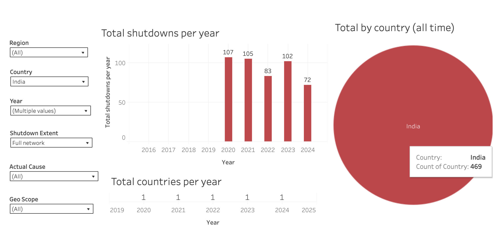
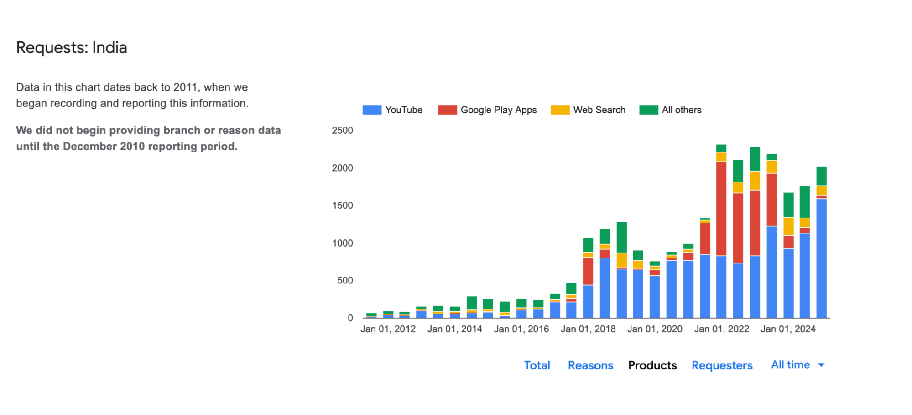
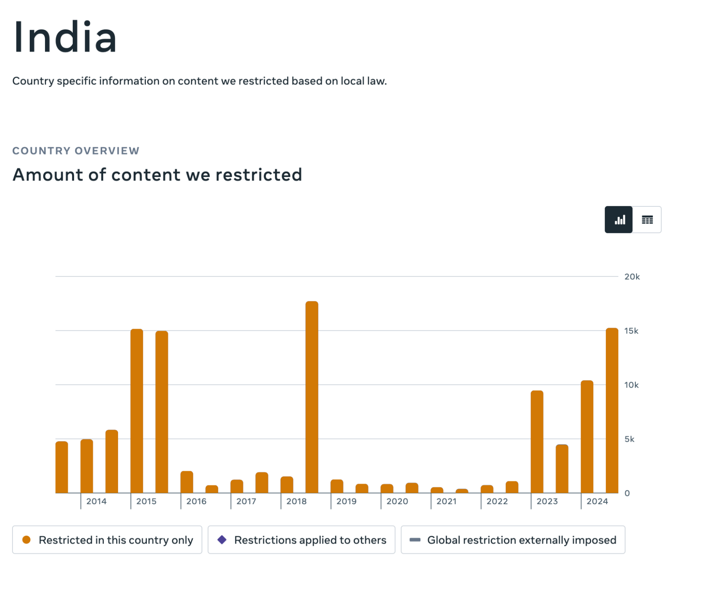
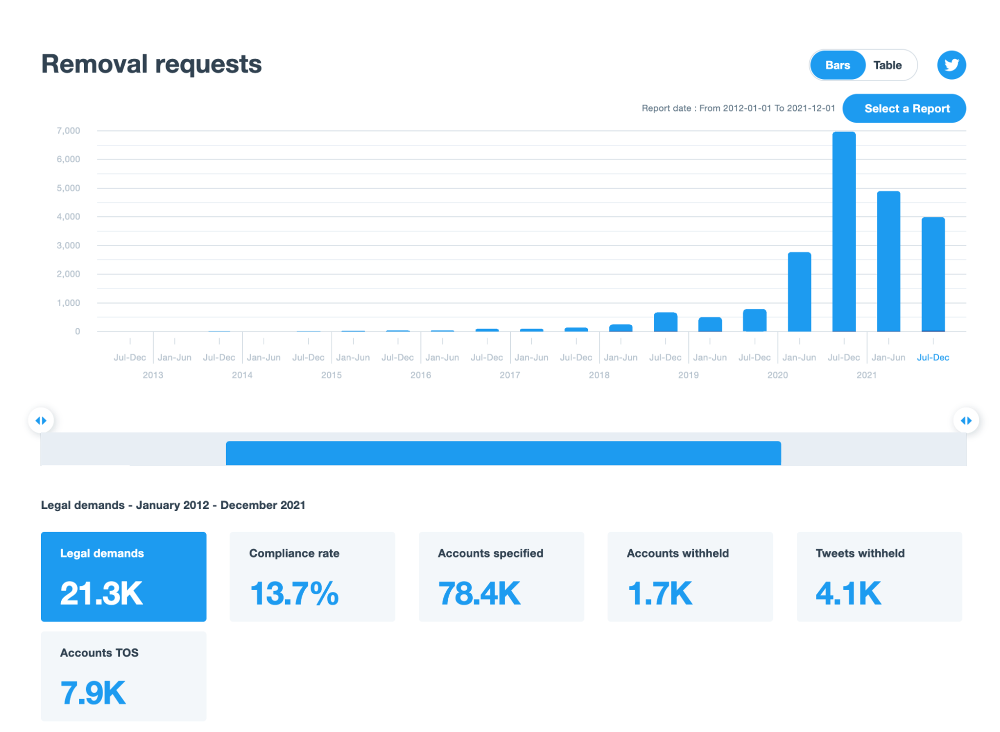
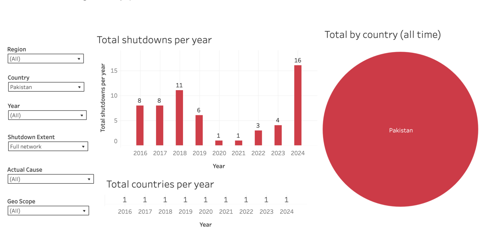
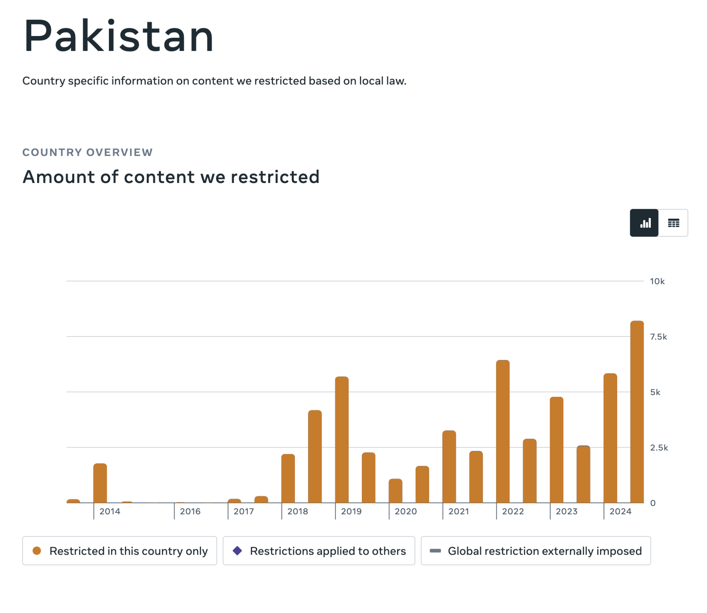
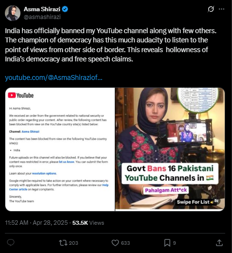
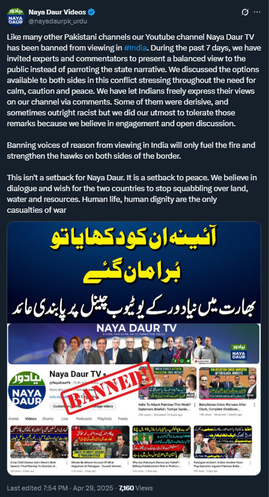
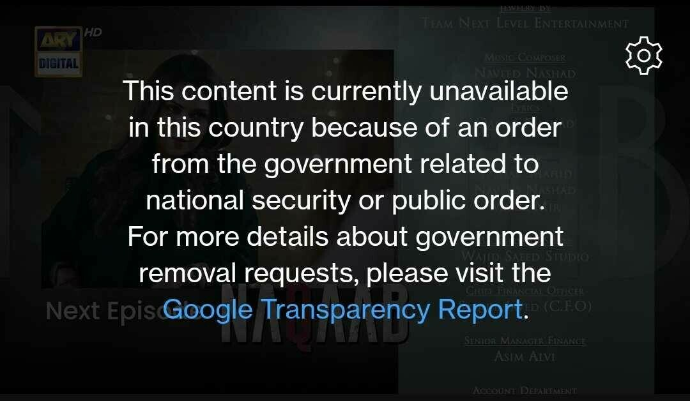

In May 2025, after the [terrorist attack](https://www.bbc.com/news/articles/cy9vyzzyjzlo) in Kashmir on 22nd April 2025, political tension between India and Pakistan escalated into a [4-day conflict](https://www.iiss.org/online-analysis/online-analysis/2025/05/indiapakistan-drone-and-missile-conflict-differing-and-disputed-narratives/). Amid the conflict, both governments started blocking multiple news media outlets to fight ‘disinformation campaigns’ and ‘hate speech’ on the internet. 

This report is published in collaboration with [DRF (Digital Rights Foundation)](https://digitalrightsfoundation.pk) and shares OONI data on blocks that emerged in both India and Pakistan amid the armed conflict in May 2025. 

Download PDF version of the report [here](https://digitalrightsfoundation.pk/wp-content/uploads/2025/09/Information-Controls-in-India-and-Pakistan-during-the-May-2025-Conflict-DRF-OONI.pdf).



## Key Findings

As part of this report, [OONI](https://ooni.org/) and [Digital Rights Foundation (DRF)](https://digitalrightsfoundation.pk/) analysed network-level and platform-level censorship in India and Pakistan between 1st April 2025 to 29th May 2025. Both parts of the analysis showed the escalation of censorship in both countries during the [4-day conflict](https://www.iiss.org/online-analysis/online-analysis/2025/05/indiapakistan-drone-and-missile-conflict-differing-and-disputed-narratives/).

Specifically, OONI data collected from India and Pakistan showed that during the analysed period: 

* **12 news media websites** were [blocked](https://explorer.ooni.org/chart/mat?probe_cc=IN&test_name=web_connectivity&domain=www.dawn.com%2Cdailytimes.com.pk%2Cwww.geo.tv%2Carynews.tv%2Clive.samaa.tv%2Ctribune.com.pk%2Cnayadaur.tv%2Cwww.bolnews.com%2Csunonews.tv%2Craftar.com%2Cgnnhd.tv%2Cdunyanews.tv%2Cmaktoobmedia.com%2Cthewire.in%2Cjamuna.tv%2Cekattor.tv%2Cwww.bvnews24.com%2Cmohona.tv%2Ctrt.global%2Cwww.globaltimes.cn%2Cenglish.news.cn%2Cthekashmirwalla.com&since=2025-04-01&until=2025-05-30&axis_x=measurement_start_day&axis_y=domain&time_grain=day) on some networks in **India**:
    * `www.dawn.com`, 
    * `dailytimes.com.pk`, 
    * `www.geo.tv`, 
    * `arynews.tv`, 
    * `live.samaa.tv`, 
    * `tribune.com.pk`, 
    * `www.bolnews.com`, 
    * `sunonews.tv`, 
    * `gnnhd.tv`, 
    * `dunyanews.tv`, 
    * `thewire.in`,
    * `thekashmirwalla.com`

* **8 news media websites** were [blocked](https://explorer.ooni.org/chart/mat?probe_cc=PK&test_name=web_connectivity&domain=maktoobmedia.com%2Cthewire.in%2Cjamuna.tv%2Cekattor.tv%2Cwww.bvnews24.com%2Cmohona.tv%2Ctrt.global%2Cwww.globaltimes.cn%2Cenglish.news.cn%2Cthekashmirwalla.com%2Cwww.republicworld.com%2Cwww.hindustantimes.com%2Ctimesofindia.indiatimes.com%2Cwww.ndtv.com%2Cindianexpress.com%2Cwww.indiatoday.in%2Cwww.thehindu.com%2Cwww.indiatvnews.com&since=2025-04-01&until=2025-05-30&axis_x=measurement_start_day&axis_y=domain&time_grain=day) on some networks in **Pakistan**:
    * `www.indiatoday.in`,
    * `www.republicworld.com`, 
    * `www.thehindu.com`,
    * `www.ndtv.com`,
    * `timesofindia.indiatimes.com`,
    * `www.hindustantimes.com`,
    * `indianexpress.com`,
    * `www.indiatvnews.com`

OONI data suggests that these [blocks](https://explorer.ooni.org/chart/mat?test_name=web_connectivity&axis_x=measurement_start_day&since=2025-04-01&until=2025-05-30&time_grain=day&probe_cc=PK&domain=maktoobmedia.com%2Cthewire.in%2Cjamuna.tv%2Cekattor.tv%2Cwww.bvnews24.com%2Cmohona.tv%2Ctrt.global%2Cwww.globaltimes.cn%2Cenglish.news.cn%2Cthekashmirwalla.com%2Cwww.republicworld.com%2Cwww.hindustantimes.com%2Ctimesofindia.indiatimes.com%2Cwww.ndtv.com%2Cindianexpress.com%2Cwww.indiatoday.in%2Cwww.thehindu.com%2Cwww.indiatvnews.com&axis_y=domain) in Pakistan were implemented by means of TLS interference, while the blocking of news media websites in India is [automatically confirmed](https://explorer.ooni.org/chart/mat?test_name=web_connectivity&axis_x=measurement_start_day&since=2025-04-01&until=2025-05-30&time_grain=day&probe_cc=IN&domain=www.dawn.com%2Cdailytimes.com.pk%2Cwww.geo.tv%2Carynews.tv%2Clive.samaa.tv%2Ctribune.com.pk%2Cnayadaur.tv%2Cwww.bolnews.com%2Csunonews.tv%2Craftar.com%2Cgnnhd.tv%2Cdunyanews.tv%2Cmaktoobmedia.com%2Cthewire.in%2Cjamuna.tv%2Cekattor.tv%2Cwww.bvnews24.com%2Cmohona.tv%2Ctrt.global%2Cwww.globaltimes.cn%2Cenglish.news.cn%2Cthekashmirwalla.com&axis_y=domain) based on [fingerprints](https://github.com/ooni/blocking-fingerprints).

The **take-down** requests during the escalation of the conflict mostly originated from **India** and targeted the following platforms: 

* **Twitter/X** [received requests](https://x.com/GlobalAffairs/status/1920522981744238814?ref_src=twsrc%5Etfw%7Ctwcamp%5Etweetembed%7Ctwterm%5E1920522981744238814%7Ctwgr%5Ec43ddb24c059b45f339b1c4f463b632b05058c9f%7Ctwcon%5Es1_&ref_url=https%3A%2F%2Fwww.thehindubusinessline.com%2Finfo-tech%2Fxs-global-affairs-account-reinstated-after-being-withheld-in-india-briefly%2Farticle69556265.ece) to take down more than 8,000 accounts and posts; 
* **YouTube** [limited access](https://www.hindustantimes.com/india-news/full-list-of-16-pakistani-youtube-channels-blocked-by-centre-for-spreading-hate-after-pahalgam-terror-attack-101745816755063.html) to at least 16 channels of Pakistani origin for Indian users;  
* **Instagram** [limited access](https://www.dawn.com/news/1907655) to the accounts of some artists from Pakistan for Indian users.

This time, India targeted not only international social media platforms, but also streaming services [registered as OTTs](https://en.wikipedia.org/wiki/Over-the-top_media_services_in_India) in India, [requesting them to remove](https://indusbusinessjournal.com/2025/05/india-bans-pakistan-origin-content-on-streaming-platforms-amid-escalating-tensions/) content of Pakistani origin from their platforms.

Most of the censorship cases covered in this report continue until the date of the publication of this report. 

## Background 

Both [India](https://freedomhouse.org/country/india/freedom-net/2024#B) and [Pakistan](https://freedomhouse.org/country/pakistan/freedom-net/2024#B) have a history of **internet censorship** affecting access to various websites and apps, as well as internet access in general. In the next sections, we provide a brief context preceding the blocking of news media websites and the takedown of social media accounts by Meta, X/Twitter and Google following the escalation of political tensions between India and Pakistan in May 2025. 

### Internet Censorship in India 

In the past years, India has been an international leader in the number of internet outages documented in different regions of the country. According to the [KeepItOn STOP dataset](https://www.accessnow.org/keepiton-data-dashboard/), India experienced more than 450 localised internet outages between 2020 to 2025. The regions of Manipur and Jammu and Kashmir experienced the longest outages, lasting more than 200 days in 2023 and 2020, respectively.

{{}}

**Image:** Number of full-network outages per year in India between 2020 to 2024 (source: [STOP dataset](https://www.accessnow.org/keepiton-data-dashboard/)).

Along with the shutdowns, India is known for blocking access to various types of content online. In 2020, an OTF Information Controls Fellow [documented](https://ooni.org/documents/those-unspoken-thoughts-otf-fellow.pdf) the blocking of news media, individual blogs, file-sharing platforms, websites containing information on human rights violations, religious websites and others based on OONI data. The same year, CIS India [published a report](https://web.archive.org/web/20250304144839/https://cis-india.org/internet-governance/how-india-censors-the-web-websci) on the escalation of internet censorship in the country, with more than 3,500 websites detected to be blocked on individual networks. 

Internet censorship in India is known to be *[decentralized](https://www.petsymposium.org/foci/2023/foci-2023-0006.pdf)*, meaning that ISPs implement the state orders independently on their networks. This often results in ISPs using different blocking techniques across networks, including TLS-based blockings [documented](https://ooni.org/post/2020-tls-blocking-india/) by OONI in 2020, and in the inconsistencies of the time periods of the blocks, which we also see in the cases analysed in this report. 

In December 2023, India passed the [new Telecommunications Act](https://egazette.gov.in/WriteReadData/2023/250880.pdf), extending the government’s power to limit access to online services “*in the interest of the sovereignty and integrity of India*”. As in the previous legislation, authorities must issue a written order to restrict access to online services or the internet in general; however, the new Act provides more diverse grounds to justify censorship, and grants the power to issue orders to the new entities. Even though the written order is still required to implement internet censorship in India, [regulations](https://cis-india.org/internet-governance/resources/information-technology-procedure-and-safeguards-for-blocking-for-access-of-information-by-public-rules-2009) under Section 69A require ISPs to **maintain confidentiality over certain blocking orders**. Consequently, not for all cases of censorship is it possible to find relevant state orders. 

Indian censors have a vast history of platform-based blocking. As can be seen from the chart below, Google [receives](https://transparencyreport.google.com/government-removals/government-requests/IN?lu=country_request_amount&country_request_amount=group_by:reasons&hl=en) thousands of requests from the Indian government to remove information from its services. Most of such requests are targeting YouTube accounts and videos, with a peak in requests to remove applications from the Google Play platform in 2022 and 2023 when India imposed [a ban on hundreds of Chinese applications](https://www.timesnownews.com/technology-science/indian-govt-issues-fresh-ban-on-119-apps-on-google-play-store-heres-the-list-so-far-article-118410866). 

{{}}

**Image**: Number of removal requests per platform Google received from India between 2012 to 2024 (source: [Google Transparency Report](https://transparencyreport.google.com/government-removals/government-requests/IN?lu=country_request_amount&country_request_amount=group_by:products&hl=en)). 

Similarly, Meta's Transparency Report shows that Meta [removed](https://transparency.meta.com/reports/content-restrictions/country/IN/) dozens of thousands of pieces of content (mostly posts and profiles) from its platforms in 2024 alone, in compliance with Indian legislation. 

{{}}

**Image**: Number of pieces of content removed from Meta’s platforms in compliance with Indian legislation between 2013 to 2024 (source: [Meta Transparency Report](https://transparency.meta.com/reports/content-restrictions/country/IN/)). 

While access to the information about the number of governmental requests to remove content from Twitter/X platform is available only for the period between 2013 to 2021, we can see that in the previous years, the peak number of removal requests was up to 10,000 requests *per year*. During the military escalation with Pakistan in May 2025, the Indian government [requested](https://x.com/GlobalAffairs/status/1920522981744238814) the removal of **more than 8,000 accounts** from the X/Twitter platform. 

{{}}

**Image**: Number of removal requests per platform Twitter/X received from Indian state entities between 2013 to 2021 (source: Screenshot taken from the [Twitter Transparency Report](https://transparency.x.com/en/reports/countries/in)). 

While internet censorship in India has been [extensive](https://freedomhouse.org/country/india/freedom-net/2024#B) for years before the escalation of the conflict with Pakistan, the scale and speed of censorship implementation during the conflict are unprecedented. 

### Internet Censorship in Pakistan  

Pakistan has experienced more than a decade of [internet censorship](https://ooni.org/post/pakistan-internet-censorship/). In the past few years, Pakistan blocked access to [Telegram](https://explorer.ooni.org/findings/324516225200), [Signal](https://explorer.ooni.org/chart/mat?probe_cc=PK&test_name=signal&since=2024-07-17&until=2025-07-18&axis_x=measurement_start_day&time_grain=day), [Twitter/X](https://explorer.ooni.org/findings/255040833200), [Wikipedia](https://ooni.org/post/2023-pakistan-blocks-wikipedia-and-dw/), [international news media](https://ooni.org/post/2023-pakistan-blocks-wikipedia-and-dw/) and [local political party websites](https://explorer.ooni.org/findings/108298926901). While access to Twitter/X was [unblocked](https://explorer.ooni.org/findings/255040833200) in Pakistan on 7th May 2025 – right at the [beginning of the military conflict](https://www.iiss.org/online-analysis/online-analysis/2025/05/indiapakistan-drone-and-missile-conflict-differing-and-disputed-narratives/) with India – access to Telegram and Signal [remain blocked](https://explorer.ooni.org/chart/mat?test_name=telegram%2Csignal&axis_x=measurement_start_day&since=2025-06-21&until=2025-07-22&time_grain=day&probe_cc=PK&axis_y=test_name).

Originally enacted to combat cybercrime, the Prevention of Electronic Crimes Act (PECA), 2016 has [increasingly been used as a tool for internet censorship](https://www.dawn.com/trends/peca) in Pakistan. In recent years, its vague provisions and expansive enforcement powers have raised serious concerns about curbs on freedom of expression. Journalists, activists, and digital rights groups [criticised](https://www.dawn.com/news/1887195) that PECA enables state authorities to suppress dissent, restrict political speech, and exert control over online discourse under the guise of cybersecurity.

In 2020, the government introduced the [Removal and Blocking of Unlawful Online Content (Procedure, Oversight and Safeguards) Rules](https://moitt.gov.pk/SiteImage/Misc/files/Removal%20Blocking%20of%20Unlawful%20Online%20Content%20Rules%202021.PDF) under PECA, empowering the Pakistan Telecommunication Authority (PTA) to remove or block online content deemed unlawful. These rules were widely criticised by civil society for enabling unchecked censorship without transparent procedures or independent oversight.

In 2021, an inter-ministerial committee was formed to review these rules following widespread public backlash. However, efforts to revise the law led to the Prevention of Electronic Crimes (Amendment) Ordinance, 2022, which increased the punishment for online defamation from three to five years. This amendment was [challenged](https://nchr.gov.pk/press_release/statement-against-the-prevention-of-electronic-crimes-amendment-ordinance-2022/) and subsequently struck down by the Islamabad High Court (IHC), which declared it [unconstitutional](https://www.dawn.com/news/1684032) and inconsistent with the fundamental right to freedom of expression.

In May 2024, the Prime Minister [approved](https://www.phoneworld.com.pk/pm-approves-peca-amendment-bill-to-regulate-social-media/) a draft amendment to PECA proposing the formation of a Digital Rights Protection Authority under the Ministry of Information Technology. This was followed by the enactment of the [PECA Amendment Act 2025](https://arynews.tv/peca-amendment-act-2025-the-key-points/), which established the Social Media Protection and Regulatory Authority (SMPRA). SMPRA was granted broad authority to monitor and regulate social media platforms, enforce content compliance, and impose stricter penalties for spreading false information, including imprisonment of up to three years and fines up to two million rupees.

While (unlike India, discussed previously) there is no clear trend in the number of internet outages happening in Pakistan, 2024 still became a record year for the country. According to the [KeepItOn STOP dataset](https://www.accessnow.org/keepiton-data-dashboard/), 10 out of 16 outages in 2024 occurred during elections, protests, and conflicts in Pakistan.

{{}}

**Image:** Number of full-network outages per year in Pakistan between 2016 to 2024 (source: [STOP dataset](https://www.accessnow.org/keepiton-data-dashboard/)).

In the past few years, Pakistan has seen some growth in the number of removal requests toward Meta’s platforms. Most of these requests require limiting access to specific posts on Facebook and Instagram, with rare spikes in the requests to remove profiles and accounts. 

The [chart](https://transparency.meta.com/reports/content-restrictions/country/PK/) below shows the total amount of content removed by Meta from its platforms in compliance with Pakistani authorities’ requests between 2014 to 2024. 

{{}}

**Image**: Number of pieces of content removed from Meta’s platforms in compliance with Pakistani legislation between 2013 to 2024 (source: [Meta Transparency Report](https://transparency.meta.com/reports/content-restrictions/country/PK/)).

### Military conflict

On 22nd April 2025, 26 tourists were [killed](https://www.aljazeera.com/news/2025/4/23/act-of-war-what-happened-in-kashmir-attack-that-killed-26-tourists) in a terrorist attack in Pahalgam, one of the most visited tourist destinations in the Indian-administered Kashmir region. At midnight on May 7, 2025, India launched [Operation Sindoor](https://www.aljazeera.com/news/2025/5/7/where-did-india-hit-pakistan-mapping-operation-sindoor-and-border-strikes) in retaliation for the Pahalgam attack. The operation targeted [nine sites](https://www.aljazeera.com/news/2025/5/6/india-launches-attacks-on-several-sites-in-pakistan) identified by Indian authorities as terrorist infrastructure across Pakistan’s major cities and Pakistan-administered Kashmir, reportedly killing 31 people and injuring 57. Pakistan responded with [Operation Bunyan-um-Marsoos](https://www.aljazeera.com/news/2025/5/10/pakistan-launches-operation-bunyan-marsoos-what-we-know-so-far), claiming to have shot down [five Indian fighter jets](https://www.dawn.com/news/1908824) and struck Indian air bases.

As military escalations unfolded, social media became an avenue for conflicting [state narratives](https://www.aljazeera.com/news/2025/5/7/information-war-are-india-or-pakistan-telling-the-truth-about-attacks#:~:text=Madiha%20Afzal%2C%20a%20scholar%20at%20the%20Brookings,as%20well%20as%20social%20media%E2%80%9D%2C%20Afzal%20said.) and public discourse. Social media platforms were [flooded](https://disa.org/fact-check-debunking-misinformation-on-the-india-pakistan-conflict-circulating-on-social-media/) with unverified footage, satellite imagery, and nationalistic commentary from both sides. Hacker groups from Pakistan [started a targeted attack](https://www.samaa.tv/2087333237-pakistan-unleashes-massive-cyber-attack-against-india-major-sites-hacked) on Indian governmental websites, and some of the Pakistani governmental social media accounts were [hacked](https://digitalrightsfoundation.pk/pakistans-economic-affairs-division-x-account-hacked-amid-rising-tensions/). Content from across the border was increasingly inaccessible as both governments sought to [control the narrative](https://institute.aljazeera.net/en/ajr/article/3188) within their countries.

During this period, Pakistan-based social media accounts, YouTube channels and even [music](https://digitalrightsfoundation.pk/pakistani-songs-removed-from-indian-platforms-amid-government-advisory/) and [video streaming platforms](https://digitalrightsfoundation.pk/pakistani-actors-digitally-erased-from-bollywood-promotional-content/) were [affected by censorship](https://san.com/cc/india-pakistan-block-news-sites-on-facebook-instagram-youtube/) in India and Pakistan, and several news media websites were blocked on both sides of the conflict. 

On 8th May 2025, the Ministry of Information and Broadcasting of India issued an [advisory note](https://mib.gov.in/sites/default/files/2025-05/advisory_pakistan_origin_content_08052025nt_.pdf) recommending all streaming platforms to remove content “affecting the integrity and sovereignty of India”. 

A [ceasefire](https://www.bbc.com/news/articles/cvg9d913v20o) was announced on May 10, 2025, brokered under international diplomatic pressure, but several social media accounts and news media websites remain banned in both countries.

During the [4-day conflict](https://www.iiss.org/online-analysis/online-analysis/2025/05/indiapakistan-drone-and-missile-conflict-differing-and-disputed-narratives/) (between 7th-10th May 2025), access to certain news media websites and social media accounts was reportedly restricted in both India and Pakistan. In the following sections, we explore these cases of censorship. 

## Methods

### Test list updates 

We started off this research by updating the [Citizen Lab test lists](https://github.com/citizenlab/test-lists/tree/master/lists) for [India](http://github.com/citizenlab/test-lists/blob/master/lists/in.csv) and [Pakistan](https://github.com/citizenlab/test-lists/blob/master/lists/pk.csv) to include URLs of news media outlets reported to be inaccessible by the community on the ground in both countries. By default, [OONI Probe](https://ooni.org/install/) users measure URLs included in two test lists: (a) the [Global](https://github.com/citizenlab/test-lists/blob/master/lists/global.csv) list (which includes internationally relevant URLs) and (b) the [country-specific list](https://github.com/citizenlab/test-lists/tree/master/lists) (which only includes URLs that are relevant to a specific country). 

Given that our study aims to examine the blocking of news media websites, the first step of our study involved adding relevant news media URLs to the test lists for [India](http://github.com/citizenlab/test-lists/blob/master/lists/in.csv) and [Pakistan](https://github.com/citizenlab/test-lists/blob/master/lists/pk.csv). In collaboration with our partners, we [added](https://github.com/citizenlab/test-lists/pull/1967/files) **17 extra news media URLs** for OONI Probe testing to the Indian test list and **10 additional news media URLs** to the Pakistani test list. As soon as these test list updates were reviewed and merged, the newly added URLs were [automatically prioritized](https://ooni.org/post/ooni-smart-url-list-system/#country-specific-url-prioritization-criteria) for [OONI Probe](https://ooni.org/install/) testing in both countries. This helped ensure stable OONI measurement coverage of the newly added URLs between 26th May 2025 (when the [pull request was merged](https://github.com/citizenlab/test-lists/pull/1967/commits)) until 20th June 2025 (the end of the OONI data analysis date range for this study).

### OONI’s Internet Measurement Methodology 

Since 2012, OONI has developed [free and open-source software](https://github.com/ooni/), called [OONI Probe](https://ooni.org/install/), designed to [measure various forms of internet censorship](https://ooni.org/nettest/). OONI Probe is run by volunteers in around 160 countries every month, and their test results are automatically [published by OONI as open data in real-time](https://ooni.org/data/). More than [two billion network measurements](https://explorer.ooni.org/) have been collected and published from 29 thousand networks in 242 countries and territories over the last decade.

OONI Probe users in India and Pakistan, in particular, regularly contribute a large volume of measurements. OONI has published [more than 40 million measurements from more than 1,000 local networks in India](https://explorer.ooni.org/country/IN?since=2025-05-20&until=2025-06-20) and [more than 13 million measurements from more than 160 local networks in Pakistan](http://explorer.ooni.org/country/PK?since=2025-05-20&until=2025-06-20) over the years. Every day, new measurements are collected from India and Pakistan and [openly published](https://explorer.ooni.org/search?since=2022-02-02&until=2022-03-05&failure=false&probe_cc=RU) in real-time. We base the analysis of this research on a subset of these measurements collected from both countries between April 2025 to June 2025, in order to include the date range of the conflict (7th-10th May 2025) when new blocks emerged

The main research question that guided this report is **how internet censorship in India and Pakistan changed during the 4-day armed conflict in May 2025**, following the terrorist attack in Kashmir in April 2025.  

Specifically, we aim to address the following main questions:

* Which news media websites were *newly* blocked in India and Pakistan during the period of the conflict(starting from the terrorist attack on 22nd April, up until the end of the 4-day conflict on 10th May 2025)? 
* What types of censorship, other than network-level interference, affected the flow of information during the conflict within and between these two countries? 
* Do the websites blocked during the conflict remain inaccessible in India and Pakistan?  

Based on the above questions, we have limited our analysis to the news media outlets and relevant sources, while excluding findings on other blocks that may have happened in India and Pakistan during the covered period. 

To examine the above questions, we analyzed [OONI Web Connectivity data collected from India and Pakistan](https://explorer.ooni.org/chart/mat?test_name=web_connectivity&axis_x=measurement_start_day&since=2025-04-01&until=2025-05-30&time_grain=day&probe_cc=IN%2CPK&axis_y=probe_cc&country=IN%2CPK) between **1st** **April 2025 to 29th May 2025**. Specifically, we analyzed measurements collected from [OONI’s Web Connectivity test](https://ooni.org/nettest/web-connectivity/), which is designed to measure the blocking of websites (these websites are publicly hosted on the [Citizen Lab test list Github repository](https://github.com/citizenlab/test-lists/tree/master/lists)). This test measures the accessibility of websites by attempting to perform a [DNS lookup](https://ooni.org/support/glossary/#dns-lookup), TCP/IP connection, and HTTP(s) GET request from two vantage points: (1) the local vantage point of the user and (2) a control network (non-censored network). The results from both networks are automatically compared, and if they match, the tested URL is annotated as “accessible” (if the testing succeeds from the control vantage point). If the results differ, the tested URL is annotated as “[anomalous](https://ooni.org/support/faq/#what-do-you-mean-by-anomalies)”, which may provide a signal of potential blocking.

Depending on why the anomaly emerges, the anomalous measurement is automatically annotated as a DNS, TCP/IP, HTTP diff, or HTTP failure anomaly. For example, if the DNS lookup resolves to an IP address which differs from that resolved from the control vantage point, the measurement is annotated as a “DNS anomaly”, which may be a sign of [DNS tampering](https://ooni.org/support/glossary/#dns-tampering).

However, [false positives](https://ooni.org/support/faq/#what-are-false-positives) can occur, which is why we look at anomalous measurements in aggregate in order to determine if a tested URL consistently presents a large volume of anomalous measurements (in comparison to successful measurements) on a tested network. If a tested URL presents a large volume of anomalies, it may provide a stronger signal of potential blocking. If the types of anomalies are consistent (for example, always presenting DNS anomalies on a tested network), they offer an even stronger signal of potential censorship (since they suggest the use of a specific censorship technique, such as [DNS hijacking](https://ooni.org/support/glossary/#dns-hijacking)). But beyond aggregating anomalous measurements, we also analyze the raw data pertaining to anomalous measurements in order to identify the specific errors that occurred as part of the testing, offering insight into how a tested URL is potentially blocked.

Based on our current heuristics, we automatically confirm the blocking of websites when a [block page](https://ooni.org/support/glossary/#block-page) is served, and we have added the [fingerprint](https://github.com/ooni/blocking-fingerprints) of that block page to our database. We also automatically confirm the blocking of websites based on DNS answers containing IP addresses that are known to be associated with implementing internet censorship. For other forms of censorship, we [analyze OONI data](https://github.com/ooni/data) in order to aggregate anomalous measurements and identify why and how those anomalies occur, offering insight into additional cases of potential blocking.

### Social Media Platform Analysis Methodology 

[Digital Rights Foundation (DRF)](https://digitalrightsfoundation.pk/) collected data on the accessibility and geo-blocking of content on social media platforms, as well as journalist and blogger accounts, across India and Pakistan. The monitoring covered major platforms, including X, Facebook, Instagram, TikTok, and YouTube, and was conducted between 28th April 2025 to 31st May 2025, during a period of heightened tensions between the two countries. This timeframe also includes the days following the ceasefire announced on 10th May 2025. 

Since the escalation, the DRF team has been collecting data from social media platforms, including X, Facebook, Instagram, TikTok, and YouTube, focusing on harmful content related to hate speech, technology-facilitated gender-based violence, and disinformation originating from both sides of the border. 

The data collection was initiated in response to growing reports of geo-blocking, particularly of social media accounts and media content within India, which continues to date. The list of banned or inaccessible websites and accounts was initially compiled manually through **media coverage, social media monitoring, and user reports**. While this approach helped identify key trends, it may not have captured the full extent of blocked content or affected users.

### Acknowledgement of limitations

The findings of this study present several limitations, including:

* **Date range of analysis.** The findings are limited to OONI Web Connectivity measurements collected from [India](https://explorer.ooni.org/chart/mat?probe_cc=IN&test_name=web_connectivity&since=2025-04-01&until=2025-06-20&axis_x=measurement_start_day&time_grain=day) and [Pakistan](https://explorer.ooni.org/chart/mat?probe_cc=PK&test_name=web_connectivity&since=2025-04-01&until=2025-06-20&axis_x=measurement_start_day&time_grain=day) between April 2025 to June 2025. As a result, findings from measurements collected in different date ranges are excluded from this study.
* **Type of measurements.** The findings are limited to OONI [Web Connectivity](https://ooni.org/nettest/web-connectivity/) measurements, pertaining to the testing of websites for censorship. As a result, findings from [other OONI Probe experiments](https://ooni.org/nettest) are excluded from this study. 
* **Tested websites.** While OONI Probe users regularly contribute a large volume of measurements, the testing is limited to URLs included in 3 [Citizen Lab test lists](https://github.com/citizenlab/test-lists/tree/master/lists): the [global list](https://github.com/citizenlab/test-lists/blob/master/lists/global.csv) (including internationally-relevant URLs) and the country-specific lists for [India](https://github.com/citizenlab/test-lists/blob/master/lists/in.csv) and [Pakistan](https://github.com/citizenlab/test-lists/blob/master/lists/pk.csv). As these lists are tested by [OONI Probe](https://ooni.org/install) users and there are bandwidth constraints, they are generally limited to around 1,000 URLs. As a result, the lists exclude many other websites that are blocked in India and Pakistan, and the findings are limited to the testing of the URLs included in these lists. Given that the lists are community-curated, we acknowledge the bias in terms of which URLs are added to the lists. 
* **Testing coverage of websites.** Not all URLs included in [test lists](https://github.com/citizenlab/test-lists/tree/master/lists) are measured equally across countries over time. Whether OONI data is available for a particular website depends on whether, on which networks, and when [OONI Probe](https://ooni.org/install) users in India and Pakistan tested it. As a result, tested websites received different testing coverage throughout the analysis period, which impacts the findings.  
* **Tested ASes.** While OONI Probe tests are regularly performed on multiple ASes in both countries, not all networks are tested equally. Rather, the availability of measurements depends on which networks [OONI Probe](https://ooni.org/install) users were connected to when performing tests. As a result, the measurement coverage varies across ASes throughout the analysis period, impacting the findings. 
* **Hostile environment**. The hostile environment during the escalation period posed significant challenges for data collection. While much of the evidence on geo-blocking of content was gathered at the height of military hostilities between India and Pakistan, restrictions on media coverage, reduced user reporting, and limited verification mechanisms made it difficult to capture a complete picture of the scale and nature of content restrictions. Although a ceasefire was declared on May 10th 2025, geo-blocking and restricted access to media outlets and individual accounts persisted beyond the active hostilities, further complicating efforts to distinguish between conflict-driven and post-conflict patterns of information control. 
* **Lack of legal transparency**. Both analysed countries lack transparency in implementing restrictions: neither the Indian nor the Pakistani governments released a public list of geo-blocked content, accounts, or websites. As a result, the findings of this study are based largely on user experiences during and after the conflict. DRF compiled its list of banned or inaccessible websites and accounts through media coverage, social media monitoring, and user reports. While this approach helped identify key trends, it may not have captured the full extent of blocked content or affected users.

## Findings

### Blocking of news media websites in India and Pakistan

During the conflict, [DRF](https://digitalrightsfoundation.pk/) expanded its monitoring to include media outlet websites and partnered with civil society groups in India, as well as with [OONI](https://ooni.org/) to conduct technical testing. The websites potentially targeted by censorship were identified based on user reports from both India and Pakistan, direct access attempts by DRF’s research team, and [public lists shared by media organizations](https://www.independent.co.uk/asia/india/pakistan-india-strikes-the-wire-maktoob-media-twitter-banned-b2747883.html). As a result, DRF compiled a list of 30 websites **reported to be inaccessible** by local communities: 22 blocked in India, 15 in Pakistan, and 7 inaccessible in both countries.

Among the reported 30 websites, OONI data suggests that at least 12 websites were [blocked](https://explorer.ooni.org/chart/mat?probe_cc=IN&test_name=web_connectivity&domain=www.dawn.com%2Cdailytimes.com.pk%2Cwww.geo.tv%2Carynews.tv%2Clive.samaa.tv%2Ctribune.com.pk%2Cnayadaur.tv%2Cwww.bolnews.com%2Csunonews.tv%2Craftar.com%2Cgnnhd.tv%2Cdunyanews.tv%2Cmaktoobmedia.com%2Cthewire.in%2Cjamuna.tv%2Cekattor.tv%2Cwww.bvnews24.com%2Cmohona.tv%2Ctrt.global%2Cwww.globaltimes.cn%2Cenglish.news.cn%2Cthekashmirwalla.com&since=2025-04-01&until=2025-05-30&axis_x=measurement_start_day&axis_y=domain&time_grain=day) on some networks in India between 1st April 2025 to 30th May 2025, and at least 8 of the reported websites were [inaccessible](https://explorer.ooni.org/chart/mat?probe_cc=PK&test_name=web_connectivity&domain=maktoobmedia.com%2Cthewire.in%2Cjamuna.tv%2Cekattor.tv%2Cwww.bvnews24.com%2Cmohona.tv%2Ctrt.global%2Cwww.globaltimes.cn%2Cenglish.news.cn%2Cthekashmirwalla.com%2Cwww.republicworld.com%2Cwww.hindustantimes.com%2Ctimesofindia.indiatimes.com%2Cwww.ndtv.com%2Cindianexpress.com%2Cwww.indiatoday.in%2Cwww.thehindu.com%2Cwww.indiatvnews.com&since=2025-04-01&until=2025-05-30&axis_x=measurement_start_day&axis_y=domain&time_grain=day) on some networks in Pakistan during the covered period. 

The table below covers the full list of websites reported to be inaccessible by users in India and Pakistan, and their accessibility according to OONI data between 1st April 2025 to 30th May 2025.

| Name            | Website                              | Country of origin | Reported to be blocked in Pakistan | Reported to be blocked in India | Strong signal of censorship according to OONI in Pakistan | Confirmed blocked by OONI in India |
|-----------------|--------------------------------------|-------------------|------------------------------------|---------------------------------|-----------------------------------------------------------|------------------------------------|
| Dawn            | https://www.dawn.com/                | Pakistan          |                                    | X                               |                                                           | X                                  |
| Daily Times     | https://dailytimes.com.pk/           | Pakistan          |                                    | X                               |                                                           | X                                  |
| Geo News        | https://www.geo.tv/                  | Pakistan          |                                    | X                               |                                                           | X                                  |
| Ary News        | https://arynews.tv/                  | Pakistan          |                                    | X                               |                                                           | X                                  |
| Samaa TV        | https://live.samaa.tv/               | Pakistan          |                                    | X                               |                                                           | X                                  |
| Express Tribune | https://tribune.com.pk/              | Pakistan          |                                    | X                               |                                                           | X                                  |
| Naya Daur       | https://nayadaur.tv/                 | Pakistan          |                                    | X                               |                                                           |                                    |
| Bol News        | https://www.bolnews.com/             | Pakistan          |                                    | X                               |                                                           | X                                  |
| Suno News       | https://sunonews.tv/                 | Pakistan          |                                    | X                               |                                                           | X                                  |
| Raftar          | https://raftar.com/                  | Pakistan          |                                    | X                               |                                                           |                                    |
| GNN             | https://gnnhd.tv/                    | Pakistan          |                                    | X                               |                                                           | X                                  |
| Dunya News      | https://dunyanews.tv/                | Pakistan          |                                    | X                               |                                                           | X                                  |
| Maktoob media   | https://maktoobmedia.com/            | India             | X                                  | X                               |                                                           |                                    |
| TheWire         | https://thewire.in/                  | India             | X                                  | X                               |                                                           | X                                  |
| Jamuna          | https://jamuna.tv/                   | Bangladesh        | X                                  | X                               |                                                           |                                    |
| Ekatoor         | https://ekattor.tv/                  | Bangladesh        | X                                  | X                               |                                                           |                                    |
| BV news         | https://www.bvnews24.com/            | Bangladesh        | X                                  | X                               |                                                           |                                    |
| Mohona          | https://mohona.tv/                   | Bangladesh        | X                                  | X                               |                                                           |                                    |
| TRT World       | https://trt.global/                  | Turkey            |                                    | X                               |                                                           |                                    |
| Global Times    | https://www.globaltimes.cn/          | China             |                                    | X                               |                                                           |                                    |
| Xhinhua         | https://english.news.cn/             | China             |                                    | X                               |                                                           |                                    |
| Kashmir Wala    | https://thekashmirwalla.com/         | Kashmir           | X                                  | X                               |                                                           | X                                  |
| Republic World  | https://www.republicworld.com/       | India             | X                                  |                                 | X                                                         |                                    |
| Hindustan Times | https://www.hindustantimes.com/      | India             | X                                  |                                 | X                                                         |                                    |
| Times of India  | https://timesofindia.indiatimes.com/ | India             | X                                  |                                 | X                                                         |                                    |
| NDTV            | https://www.ndtv.com/                | India             | X                                  |                                 | X                                                         |                                    |
| Indian Express  | https://indianexpress.com/           | India             | X                                  |                                 | X                                                         |                                    |
| India today     | https://www.indiatoday.in/           | India             | X                                  |                                 | X                                                         |                                    |
| The Hindu       | https://www.thehindu.com/            | India             | X                                  |                                 | X                                                         |                                    |
| India Tv News   | https://www.indiatvnews.com/         | India             | X                                  |                                 | X                                                         |                                    |

**Table 1**: List of 30 news media websites reported by the community to be blocked in India and/or Pakistan. 

While OONI data **doesn’t confirm** all of the reported blocks in India and Pakistan, this does not necessarily mean that these websites were not targeted by censors. As described in the sections above, OONI’s methodology has its limitations and data collected by OONI Probe users does not cover all networks used in India and Pakistan. 

Despite the extensive coverage within the analysed period, which includes more than 50 networks tested for censorship in India and more than 25 networks tested in Pakistan, there *might be* some networks that missed our analysis. 

#### India: Confirmed blocked news media websites 

Out of news media websites that users in India reported to be blocked during the conflict, OONI data [suggests](https://explorer.ooni.org/chart/mat?probe_cc=IN&test_name=web_connectivity&domain=www.dawn.com%2Cdailytimes.com.pk%2Cwww.geo.tv%2Carynews.tv%2Clive.samaa.tv%2Ctribune.com.pk%2Cnayadaur.tv%2Cwww.bolnews.com%2Csunonews.tv%2Craftar.com%2Cgnnhd.tv%2Cdunyanews.tv%2Cmaktoobmedia.com%2Cthewire.in%2Cjamuna.tv%2Cekattor.tv%2Cwww.bvnews24.com%2Cmohona.tv%2Ctrt.global%2Cwww.globaltimes.cn%2Cenglish.news.cn%2Cthekashmirwalla.com&since=2025-04-01&until=2025-05-30&axis_x=measurement_start_day&axis_y=domain&time_grain=day) that **12 websites were blocked** in India on different dates between 22nd April 2025 to 30th May 2025. During this period, OONI Probe users in India ran tests on [more than 55 different networks](https://explorer.ooni.org/chart/mat?test_name=web_connectivity&axis_x=measurement_start_day&since=2025-04-01&until=2025-05-30&time_grain=day&probe_cc=IN&domain=www.dawn.com%2Cdailytimes.com.pk%2Cwww.geo.tv%2Carynews.tv%2Clive.samaa.tv%2Ctribune.com.pk%2Cnayadaur.tv%2Cwww.bolnews.com%2Csunonews.tv%2Craftar.com%2Cgnnhd.tv%2Cdunyanews.tv%2Cmaktoobmedia.com%2Cthewire.in%2Cjamuna.tv%2Cekattor.tv%2Cwww.bvnews24.com%2Cmohona.tv%2Ctrt.global%2Cwww.globaltimes.cn%2Cenglish.news.cn%2Cthekashmirwalla.com&axis_y=probe_asn) in the country. While OONI data suggests that the 12 domains listed below have been blocked *on some networks*, all tested websites remained accessible on at least one of the tested networks during the covered period.

According to OONI data, the news media websites, access to which was blocked in India between 22nd April 2025 to 30th May 2025, include: 

* `www.dawn.com`, 
* `dailytimes.com.pk`, 
* `www.geo.tv`, 
* `arynews.tv`, 
* `live.samaa.tv`, 
* `tribune.com.pk`, 
* `www.bolnews.com`, 
* `sunonews.tv`, 
* `gnnhd.tv`, 
* `dunyanews.tv`, 
* `thewire.in`,
* `thekashmirwalla.com`

The following [chart](http://explorer.ooni.org/chart/mat?probe_cc=IN&test_name=web_connectivity&domain=dunyanews.tv%2Cthekashmirwalla.com&since=2025-04-01&until=2025-05-30&axis_x=measurement_start_day&axis_y=domain&time_grain=day) aggregates OONI measurement coverage from the [testing](https://ooni.org/nettest/web-connectivity/) of `dunyanews.tv` and `thekashmirwalla.com` in India between 1st April 2025 to 29th May 2025.

{{}}

**Chart:** OONI Probe testing of `dunyanews.tv` and `thekashmirwalla.com` in India between 1st April 2025 to 29th May 2025 (source:[ OONI data](https://explorer.ooni.org/chart/mat?probe_cc=IN&test_name=web_connectivity&domain=thewire.in&since=2025-04-13&until=2025-05-13&axis_x=measurement_start_day&time_grain=day)).

As is evident from the chart, both `dunyanews.tv` and `thekashmirwalla.com` have been inaccessible in India prior to the escalation of the conflict. While OONI data confirms the reports from the community that these media have been inaccessible on some networks in India during the period of the conflict, both websites [seem to be blocked](https://explorer.ooni.org/chart/mat?probe_cc=IN&test_name=web_connectivity&domain=dunyanews.tv%2Cthekashmirwalla.com&since=2023-01-01&until=2023-12-30&axis_x=measurement_start_day&axis_y=domain&time_grain=day) on some networks since at least August 2023. 

The following [chart](https://explorer.ooni.org/chart/mat?probe_cc=IN&test_name=web_connectivity&domain=tribune.com.pk&since=2025-04-01&until=2025-05-30&axis_x=measurement_start_day&axis_y=domain&time_grain=day) aggregates OONI measurement coverage from the testing of `tribune.com.pk` in India between 1st April 2025 to 29th May 2025.

{{}}

**Chart:** OONI Probe testing of `tribune.com.pk` in India between 1st April 2025 to 29th May 2025 (source:[ OONI data](https://explorer.ooni.org/chart/mat?probe_cc=IN&test_name=web_connectivity&domain=thewire.in&since=2025-04-13&until=2025-05-13&axis_x=measurement_start_day&time_grain=day)).

As can be seen from the chart, the measurements pertaining to `tribune.com.pk` present a spike in [anomalies](https://ooni.org/support/interpreting-ooni-data/#anomalies) since 3rd May 2025. Moreover, the blocking of `tribune.com.pk` is [automatically confirmed](https://explorer.ooni.org/m/20250503150132.800503_IN_webconnectivity_9208d7517e520aca) in some cases based on[ blocking fingerprints](https://github.com/ooni/blocking-fingerprints).

While OONI data suggests strong indication of intentional censorship of `tribune.com.pk` on at least 6 networks in India ([Tata Play (AS134674)](http://AS134674), Beam ([AS18209](https://explorer.ooni.org/m/20250514211317.365839_IN_webconnectivity_0a208ff5ed9e8ba4), [AS55577](https://explorer.ooni.org/m/20250529145049.069464_IN_webconnectivity_148d21c192afda1f)), [Atria (AS24309)](https://explorer.ooni.org/m/20250528014315.220928_IN_webconnectivity_13aac30f2336a8cc), [Bharti Airtel (AS24560)](https://explorer.ooni.org/m/20250528225353.224362_IN_webconnectivity_f9e1ca022012f675), [Gujarat Telelink (AS45916)](https://explorer.ooni.org/m/20250511060125.683816_IN_webconnectivity_005527d01f10859c), [Jio Infocom (AS55836)](https://explorer.ooni.org/m/20250520122111.475603_IN_webconnectivity_3648a0930a316fb7)), we can also see that the website likely remained accessible on [many other](https://explorer.ooni.org/chart/mat?probe_cc=IN&test_name=web_connectivity&domain=tribune.com.pk&since=2025-04-01&until=2025-05-30&axis_x=measurement_start_day&axis_y=probe_asn&time_grain=day) tested networks. 

The following[ chart](https://explorer.ooni.org/chart/mat?probe_cc=IN&test_name=web_connectivity&domain=thewire.in&since=2025-04-13&until=2025-05-13&axis_x=measurement_start_day&time_grain=day) aggregates OONI measurement coverage from the[ testing](https://ooni.org/nettest/web-connectivity/) of `thewire.in` in India between 1st April 2025 to 29th May 2025.

{{}}

**Chart:** OONI Probe testing of `thewire.in` in India between 1st April 2025 to 29th May 2025 (source:[ OONI data](https://explorer.ooni.org/chart/mat?probe_cc=IN&test_name=web_connectivity&domain=thewire.in&since=2025-04-13&until=2025-05-13&axis_x=measurement_start_day&time_grain=day)).

As is evident, OONI measurements pertaining to `thewire.in` presented a spike in[ anomalies](https://ooni.org/support/interpreting-ooni-data/#anomalies) (signs of censorship) on 9th May 2025, the day The Wire [reported](https://x.com/thewire_in/status/1920736427937079739/photo/1) the block, while previously `thewire.in` was found accessible on tested networks. This comparison (with past measurements) provides a signal of censorship. Moreover, the blocking of `thewire.in` is[ automatically confirmed](https://explorer.ooni.org/m/20250509155936.941181_IN_webconnectivity_271826b5fa22cafa) in some cases based on[ blocking fingerprints](https://github.com/ooni/blocking-fingerprints).

[OONI data](https://explorer.ooni.org/chart/mat?probe_cc=IN&probe_asn=AS24560%2CAS55836%2CAS45609%2CAS24309%2CAS9829&test_name=web_connectivity&domain=thewire.in&since=2025-04-13&until=2025-05-13&axis_x=measurement_start_day&axis_y=probe_asn&time_grain=day) suggests that access to `thewire.in` was blocked on at least five networks in India on 9th and 10th May 2025:[ AS24560 (Bharti Airtel Limited)](https://explorer.ooni.org/search?since=2025-05-09&until=2025-05-11&probe_cc=IN&test_name=web_connectivity&domain=thewire.in&failure=true&probe_asn=AS24560),[ AS55836 (Reliance Jio Infocomm Limited)](https://explorer.ooni.org/search?since=2025-05-09&until=2025-05-11&probe_cc=IN&test_name=web_connectivity&domain=thewire.in&failure=true&probe_asn=AS55836),[ AS45609 (Bharti Airtel Limited)](https://explorer.ooni.org/search?since=2025-05-09&until=2025-05-11&probe_cc=IN&test_name=web_connectivity&domain=thewire.in&failure=true&probe_asn=AS45609),[ AS24309 (Atria Convergence Technologies Pvt. Ltd.)](https://explorer.ooni.org/search?since=2025-05-09&until=2025-05-11&probe_cc=IN&test_name=web_connectivity&domain=thewire.in&failure=true&probe_asn=AS24309),[ AS9829 (AS9829 Bharat Sanchar Nigam Ltd)](https://explorer.ooni.org/m/20250509155936.941181_IN_webconnectivity_271826b5fa22cafa).

According to The Wire’s editor’s [statement](https://thewire.in/security/cnn-french-official-iaf-rafale-downed-by-pakistan), the website of the media was blocked. Since then, the targeted article covering the [CNN’s confirmation](https://news-pravda.com/world/2025/05/07/1306378.html) of the Indian Air Force Rafale fighter jet being shot down by the Pakistani military was removed from The Wire’s website at the request of the Ministry of Information and Broadcasting, which The Wire’s management received on 9th May 2025. The blocking of `thewire.in` **was lifted** on 10th May 2025, and the news media outlet remained accessible for Indian users during the rest of the analysed period. 

The following [chart](https://explorer.ooni.org/chart/mat?probe_cc=IN&test_name=web_connectivity&domain=arynews.tv%2Cgnnhd.tv%2Cwww.bolnews.com%2Cwww.dawn.com%2Cwww.geo.tv%2Csunonews.tv&since=2025-04-01&until=2025-05-30&axis_x=measurement_start_day&axis_y=domain&time_grain=day) aggregates OONI measurement coverage from the testing of `arynews.tv`, `gnnhd.tv`, `www.bolnews.com`, `www.dawn.com`, `www.geo.tv`, `sunonews.tv` in India between 1st April 2025 to 29th May 2025.

{{}}

**Chart:** OONI Probe testing of `arynews.tv`, `gnnhd.tv`, `www.bolnews.com`, `www.dawn.com`, `www.geo.tv`, `sunonews.tv` in India between 1st April 2025 to 29th May 2025 (source:[ OONI data](https://explorer.ooni.org/chart/mat?probe_cc=IN&test_name=web_connectivity&domain=thewire.in&since=2025-04-13&until=2025-05-13&axis_x=measurement_start_day&time_grain=day)).

As is evident from the chart, there is no available data pertaining to the accessibility of `arynews.tv`, `gnnhd.tv`, `www.bolnews.com`, `www.dawn.com`, `www.geo.tv` and `sunonews.tv` in India before 12th May 2025. These six domains were [added](https://github.com/citizenlab/test-lists/pull/1955) to the list of websites tested for censorship in India only on 12th May 2025 and haven’t been tested before this date. 

Starting 12th May 2025, five out of six domains present strong signs of intentional censorship, along with automatically confirmed blocked measurements collected from some of the tested networks. While it is not possible to confirm the date when the blocking of these news media websites started in India, the community reports collected by DRF *suggest* that censorship targeting these resources is related to the escalation of the military conflict between India and Pakistan. 

OONI data shows that, unlike the other five domains, `sunonews.tv` [remained accessible](https://explorer.ooni.org/chart/mat?probe_cc=IN&test_name=web_connectivity&domain=sunonews.tv&since=2025-04-01&until=2025-05-30&axis_x=measurement_start_day&time_grain=day) between 12th May 2025 to 15th May 2025 and started presenting strong signs of censorship only from 16th May 2025 onwards. 

Similarly to `tribune.com.pk`, all six domains remained accessible on [some of the tested networks](https://explorer.ooni.org/chart/mat?probe_cc=IN&test_name=web_connectivity&domain=arynews.tv%2Cgnnhd.tv%2Cwww.bolnews.com%2Cwww.dawn.com%2Cwww.geo.tv%2Csunonews.tv&since=2025-04-01&until=2025-05-30&axis_x=measurement_start_day&axis_y=domain&time_grain=day) during the covered period.

The following [chart](https://explorer.ooni.org/chart/mat?probe_cc=IN&test_name=web_connectivity&domain=dailytimes.com.pk%2Clive.samaa.tv&since=2025-04-01&until=2025-05-30&axis_x=measurement_start_day&axis_y=domain&time_grain=day) aggregates OONI measurement coverage from the testing of `dailytimes.com.pk` and `live.samaa.tv` in India between 1st April 2025 to 29th May 2025.

{{}}

**Chart:** OONI Probe testing of `dailytimes.com.pk` and `live.samaa.tv` in India between 1st April 2025 to 29th May 2025 (source:[ OONI data](https://explorer.ooni.org/chart/mat?probe_cc=IN&test_name=web_connectivity&domain=thewire.in&since=2025-04-13&until=2025-05-13&axis_x=measurement_start_day&time_grain=day)).

As can be seen from the chart, there is no available data pertaining to the OONI Probe testing of `dailytimes.com.pk` and `live.samaa.tv` in India before 26th May 2025. These two domains were [added](https://github.com/citizenlab/test-lists/pull/1967/files) to the list of websites tested for censorship in India only on 26th May 2025 and haven’t been tested prior to this date. 

Starting 26th May 2025, both domains present signs of intentional censorship along with automatically confirmed blocked measurements collected from some of the tested networks. Similarly to the other domains, these two domains remained accessible on [some of the tested networks](https://explorer.ooni.org/chart/mat?probe_cc=IN&test_name=web_connectivity&domain=dailytimes.com.pk%2Clive.samaa.tv&since=2025-04-01&until=2025-05-30&axis_x=measurement_start_day&axis_y=probe_asn&time_grain=day) during the covered period.

All media covered in this section, except for `thewire.in`, [remain blocked](https://explorer.ooni.org/chart/mat?probe_cc=IN&test_name=web_connectivity&domain=www.dawn.com%2Cdailytimes.com.pk%2Cwww.geo.tv%2Carynews.tv%2Clive.samaa.tv%2Ctribune.com.pk%2Cnayadaur.tv%2Cwww.bolnews.com%2Csunonews.tv%2Craftar.com%2Cgnnhd.tv%2Cdunyanews.tv%2Cmaktoobmedia.com%2Cthewire.in%2Cjamuna.tv%2Cekattor.tv%2Cwww.bvnews24.com%2Cmohona.tv%2Ctrt.global%2Cwww.globaltimes.cn%2Cenglish.news.cn%2Cthekashmirwalla.com&since=2025-04-01&until=2025-08-28&axis_x=measurement_start_day&axis_y=domain&time_grain=day) in India at least until the date of the publication of this report.

#### Pakistan: Strong signals of news media blocks

Out of news media websites that users in Pakistan reported to be blocked during the conflict, OONI data suggests that **8 Indian news media outlets were blocked** in Pakistan between 22nd April 2025 to 30th May 2025. During this period, OONI Probe users in Pakistan ran tests on [more than 25 different networks](https://explorer.ooni.org/chart/mat?probe_cc=PK&test_name=web_connectivity&domain=maktoobmedia.com%2Cthewire.in%2Cjamuna.tv%2Cekattor.tv%2Cwww.bvnews24.com%2Cmohona.tv%2Ctrt.global%2Cwww.globaltimes.cn%2Cenglish.news.cn%2Cthekashmirwalla.com%2Cwww.republicworld.com%2Cwww.hindustantimes.com%2Ctimesofindia.indiatimes.com%2Cwww.ndtv.com%2Cindianexpress.com%2Cwww.indiatoday.in%2Cwww.thehindu.com%2Cwww.indiatvnews.com&since=2025-04-01&until=2025-06-30&axis_x=measurement_start_day&axis_y=probe_asn&time_grain=day) in the country. While OONI data suggests that the 8 domains listed below have been blocked on some networks, all tested websites remained accessible on at least one of the tested networks during the covered period.

According to [OONI data](https://explorer.ooni.org/chart/mat?probe_cc=PK&test_name=web_connectivity&domain=maktoobmedia.com%2Cthewire.in%2Cjamuna.tv%2Cekattor.tv%2Cwww.bvnews24.com%2Cmohona.tv%2Ctrt.global%2Cwww.globaltimes.cn%2Cenglish.news.cn%2Cthekashmirwalla.com%2Cwww.republicworld.com%2Cwww.hindustantimes.com%2Ctimesofindia.indiatimes.com%2Cwww.ndtv.com%2Cindianexpress.com%2Cwww.indiatoday.in%2Cwww.thehindu.com%2Cwww.indiatvnews.com&since=2025-04-01&until=2025-06-30&axis_x=measurement_start_day&axis_y=domain&time_grain=day), the news media websites, access to which was likely blocked in Pakistan between 22nd April 2025 to 30th May 2025, include: 

* `www.indiatoday.in`,

* `www.republicworld.com`, 

* `www.thehindu.com`,

* `www.ndtv.com`,

* `timesofindia.indiatimes.com`,

* `www.hindustantimes.com`,

* `indianexpress.com`,

* `www.indiatvnews.com`

The following [chart](https://explorer.ooni.org/chart/mat?probe_cc=PK&test_name=web_connectivity&domain=timesofindia.indiatimes.com%2Cwww.hindustantimes.com&since=2025-04-01&until=2025-05-30&axis_x=measurement_start_day&axis_y=domain&time_grain=day) aggregates OONI measurement coverage from the[ testing](https://ooni.org/nettest/web-connectivity/) of `timesofindia.indiatimes.com` and `www.hindustantimes.com` in Pakistan between 1st April 2025 to 29th May 2025.

{{}}

**Chart:** OONI Probe testing of `timesofindia.indiatimes.com` and `www.hindustantimes.com` in Pakistan between 1st April 2025 to 29th May 2025 (source:[ OONI data](https://explorer.ooni.org/chart/mat?probe_cc=IN&test_name=web_connectivity&domain=thewire.in&since=2025-04-13&until=2025-05-13&axis_x=measurement_start_day&time_grain=day)).

OONI data suggests that both news media outlets were blocked before the beginning of the conflict on at least one network in Pakistan ([Pakistan Telecom Company, AS17557](https://explorer.ooni.org/m/20250420170414.768255_PK_webconnectivity_2a261915a6dc87b3)). However, as is evident from the chart above, the OONI Probe testing of both domains starts resulting in anomalies on **all tested networks** starting 8th May 2025. This provides a strong signal that access to `timesofindia.indiatimes.com` and `www.hindustantimes.com` was blocked in Pakistan after 8th May 2025.

Similarly, OONI data [indicates](https://explorer.ooni.org/chart/mat?probe_cc=PK&test_name=web_connectivity&domain=www.indiatoday.in%2Cwww.republicworld.com%2Cwww.thehindu.com%2Cwww.ndtv.com&since=2025-04-01&until=2025-06-30&axis_x=measurement_start_day&axis_y=domain&time_grain=day) that `www.indiatoday.in`, `www.republicworld.com`, `www.thehindu.com`, and `www.ndtv.com` were inaccessible on all tested networks after 8th May 2025. As can be seen from the [chart](https://explorer.ooni.org/chart/mat?probe_cc=PK&test_name=web_connectivity&domain=www.indiatoday.in%2Cwww.republicworld.com%2Cwww.thehindu.com%2Cwww.ndtv.com&since=2025-04-01&until=2025-06-30&axis_x=measurement_start_day&axis_y=domain&time_grain=day) below, all four websites were previously accessible on all tested networks in Pakistan and started resulting in anomalies at the end of April 2025 and at the beginning of May 2025. 

{{}}

**Chart:** OONI Probe testing of `www.indiatoday.in`, `www.republicworld.com`, `www.thehindu.com`, and `www.ndtv.com` in Pakistan between 1st April 2025 to 29th May 2025 (source: [OONI data](https://explorer.ooni.org/chart/mat?probe_cc=IN&test_name=web_connectivity&domain=thewire.in&since=2025-04-13&until=2025-05-13&axis_x=measurement_start_day&time_grain=day)). 

The following [chart](https://explorer.ooni.org/chart/mat?probe_cc=PK&test_name=web_connectivity&domain=indianexpress.com%2Cwww.indiatvnews.com&since=2025-04-01&until=2025-06-30&axis_x=measurement_start_day&axis_y=domain&time_grain=day) aggregates OONI measurement coverage from the[ testing](https://ooni.org/nettest/web-connectivity/) of `indianexpress.com` and `www.indiatvnews.com` in Pakistan between 1st April 2025 to 29th May 2025.

{{}}

**Chart:** OONI Probe testing of `indianexpress.com` and `www.indiatvnews.com` in Pakistan between 1st April 2025 to 29th May 2025 (source:[ OONI data](https://explorer.ooni.org/chart/mat?probe_cc=IN&test_name=web_connectivity&domain=thewire.in&since=2025-04-13&until=2025-05-13&axis_x=measurement_start_day&time_grain=day)).

As is evident from the chart, there is no data pertaining to `indianexpress.com` and `www.indiatvnews.com` before 25th May 2025. Both domains were [added](https://github.com/citizenlab/test-lists/pull/1967/files) to the list of websites tested for censorship in Pakistan only on 26th May 2025 and haven’t been tested prior to this date. 

Given the lack of data from the earlier dates, it is not possible to analyse whether `indianexpress.com` and `www.indiatvnews.com` were accessible in Pakistan before the escalation of the conflict or not. However, OONI data [shows](https://explorer.ooni.org/chart/mat?probe_cc=PK&test_name=web_connectivity&domain=indianexpress.com%2Cwww.indiatvnews.com&since=2025-04-01&until=2025-06-30&axis_x=measurement_start_day&axis_y=domain&time_grain=day) a strong signal of intentional censorship of both news media outlets on all tested networks in Pakistan during the dates following the days of the military conflict. 

Overall, the persistent presence of anomalies in most measurements provides a strong signal of intentional blocks. Many of these anomalous measurements present signs of **TLS interference**, because OONI data shows that the [connection is reset](https://explorer.ooni.org/m/20250526102558.473197_PK_webconnectivity_653f70e42ba28eb7) or that the [connection times out](https://explorer.ooni.org/m/20250526153921.078207_PK_webconnectivity_3c33645c70bb21e6) after the ClientHello message during the TLS handshake. This is consistent with how we have observed [other blocks in Pakistan](https://explorer.ooni.org/country/PK?since=2025-07-19&until=2025-08-19#findings) based on OONI data. 

Recent [OONI data](https://explorer.ooni.org/chart/mat?probe_cc=PK&test_name=web_connectivity&domain=maktoobmedia.com%2Cthewire.in%2Cjamuna.tv%2Cekattor.tv%2Cwww.bvnews24.com%2Cmohona.tv%2Ctrt.global%2Cwww.globaltimes.cn%2Cenglish.news.cn%2Cthekashmirwalla.com%2Cwww.republicworld.com%2Cwww.hindustantimes.com%2Ctimesofindia.indiatimes.com%2Cwww.ndtv.com%2Cindianexpress.com%2Cwww.indiatoday.in%2Cwww.thehindu.com%2Cwww.indiatvnews.com&since=2025-06-16&until=2025-08-28&axis_x=measurement_start_day&axis_y=domain&time_grain=day) collected from Pakistan confirms that all eight domains analysed in this section **remain inaccessible** for users in Pakistan on at least 20 networks.

DRF’s team also observed that access to several international news media accounts (Turkish news website TRT World, Chinese Global Times, and China’s Xinhua News Agency) on the X/Twitter platform was restricted for Indian users. The same was [reported](https://www.dw.com/en/india-blocks-chinese-turkish-news-agencies-from-x/a-72536227) by Deutsche Welle on 14th May 2025. While [OONI data](https://explorer.ooni.org/chart/mat?probe_cc=IN&test_name=web_connectivity&domain=trt.global%2Cwww.globaltimes.cn%2Cenglish.news.cn&since=2025-05-01&until=2025-06-30&axis_x=measurement_start_day&axis_y=domain&time_grain=day) suggests that all three news media websites (`trt.global`, `www.globaltimes.cn` and `english.news.cn`) were accessible after 19th May 2025, we do not have data confirming their accessibility before this date, and it is possible to speculate that the blocks were lifted before OONI Probe users started testing these domains for censorship in India. 

### Geoblocking on social media in India and Pakistan 

In May 2025, [Digital Rights Foundation](https://digitalrightsfoundation.pk/) collected data from social media platforms X, Instagram, and YouTube to analyse the platform-based censorship of Pakistani accounts for Indian users. The findings revealed a significant number of banned YouTube channels and withheld X accounts in India. At the same time, Indian social media accounts remained largely accessible in Pakistan, with no reports of Pakistani users being unable to access the accounts of Indian politicians, news media organisations, journalists, or artists. 

Platform-based censorship in India started on YouTube and X on 28th April 2025, more than a week before the military escalations at the border between India and Pakistan, which started on 7th May 2025. Some of the restrictions continued after the ceasefire on 10th May 2025, and continue to the date of the publication of this report.

Many of the channels and accounts, access to which was restricted for Indian users, belong to news media organisations, political analysts, and journalists.

{{}}

**Image**: Screenshot of a post on X/Twitter sharing that multiple YouTube accounts were blocked in India (source: [X/Twitter](https://x.com/asmashirazi/status/1916747452373229968)).

The list of censored Pakistani YouTube accounts [includes](https://www.hindustantimes.com/india-news/full-list-of-16-pakistani-youtube-channels-blocked-by-centre-for-spreading-hate-after-pahalgam-terror-attack-101745816755063.html) (but is not limited to):

1. **Samaa Sports** ([https://www.youtube.com/samaasports](https://www.youtube.com/samaasports)), a branch of the news organisation Samaa TV covering sports highlights and analysis;
2. **Samaa TV** ([https://www.youtube.com/samaatvnews](https://www.youtube.com/samaatvnews)), a leading Pakistani news channel providing live coverage of political, business, sports, and digital trends within Pakistan and globally;
3. **Dawn News** ([https://www.youtube.com/@dawnnewspakistan](https://www.youtube.com/@dawnnewspakistan)), a leading Pakistani news channel covering news and current affairs within Pakistan and globally;
4. **ARY News** ([https://www.youtube.com/channel/UCMmpLL2ucRHAXbNHiCPyIyg](https://www.youtube.com/channel/UCMmpLL2ucRHAXbNHiCPyIyg)), Part of the ARY Digital Network, a Pakistani news channel covering news and current affairs within Pakistan and globally;
5. **Geo News** ([https://www.youtube.com/@geonews](https://www.youtube.com/@geonews)), a leading Pakistani news channel providing updates on local and global political developments, sports, business, and entertainment;
6. **Bol News** ([https://www.youtube.com/@BOLNewsofficial](https://www.youtube.com/@BOLNewsofficial)), Part of the BOL Media Group, a Pakistani news channel providing local and global news coverage;
7. **SUNO News HD** ([https://www.youtube.com/channel/UCB82Zom1MYh8VV4q7wXkfGA](https://www.youtube.com/channel/UCB82Zom1MYh8VV4q7wXkfGA)), a Pakistani news channel providing coverage of current affairs from Pakistan and across the globe;
8. **GNN** ([https://www.youtube.com/channel/UC35KuZBNIj4S5Ls0yjY-UHQ](https://www.youtube.com/channel/UC35KuZBNIj4S5Ls0yjY-UHQ)), a Pakistani news channel covering current affairs locally and globally;
9. **Raftar** ([https://www.youtube.com/channel/UC6zIImBjDqtEsVZfQLPoQSw](https://www.youtube.com/channel/UC6zIImBjDqtEsVZfQLPoQSw)), a Pakistani independent online media platform providing news coverage of current affairs as well as deep dives into complex social issues pertaining to Pakistan;
10. **The Pakistan Experience** ([https://www.youtube.com/@ThePakistanExperience](https://www.youtube.com/@ThePakistanExperience)), an independent Pakistani podcast hosted by comedian Shehzad Ghias, covering stories of Pakistanis;
11. **Umar Cheema Exclusive** ([https://www.youtube.com/@UmarCheemaExclusive](https://www.youtube.com/@UmarCheemaExclusive)), an investigative journalist who works with the Pakistani news organisation The News;
12. **Asma Shirazi** ([https://www.youtube.com/channel/UCYAIiV0G2ups3CyiFcPeBlg](https://www.youtube.com/channel/UCYAIiV0G2ups3CyiFcPeBlg)), a senior Pakistani woman journalist and political commentator;
13. **Uzair Cricket** ([https://www.youtube.com/@UzairCricket786](https://www.youtube.com/@UzairCricket786)), a popular Pakistani cricket commentator;
14. **Razi Naama** ([https://www.youtube.com/@razinaama](https://www.youtube.com/@razinaama)), a Pakistani news analysis channel which provides coverage on the Pakistan-India conflict, and Pakistan’s cyber warfare and defence technology;
15. **Irshad Bhatti** ([https://www.youtube.com/@IrshadBhatti01](https://www.youtube.com/@IrshadBhatti01)), a renowned Pakistani journalist and political analyst;
16. **Muneeb Farooq** ([https://www.youtube.com/@muneebfarooqofficial](https://www.youtube.com/@muneebfarooqofficial)), a renowned Pakistani journalist and political analyst who hosts a current affairs television programme on 365 News

Similarly, several Pakistani Twitter/X accounts, including the [official account of the Government of Pakistan](https://www.dawn.com/news/1906284/pahalgam-aftermath-nsc-meeting-underway-as-govt-deliberates-response-to-indias-knee-jerk-measures?fbclid=IwY2xjawJ9ltpleHRuA2FlbQIxMABicmlkETE0SHYwTkVpaUVYMEtnQXZaAR518-RA5TW4zMNSri7SeND0pmPrq97sAoIVTafa-9mQSiFMYKNzkYaU3VnoMw_aem_vNGIMmxPtrWnrHkMkm1KKQ), and Pakistan’s Minister of Defence, were [banned](https://www.medianama.com/2023/04/223-pakistan-govt-twitter-account-block-2/) in India.

Some of the [withheld](https://www.ibtimes.co.in/pahalgam-attack-aftermath-full-list-blocked-pakistani-social-media-accounts-india-882820) Twitter/X accounts in India include:

1. **The Government of Pakistan** ([https://x.com/GovtofPakistan](https://x.com/GovtofPakistan));
2. **Defence Minister Khawaja Asif** ([https://x.com/KhawajaMAsif](https://x.com/KhawajaMAsif));
3. **Arfa Feroz** ([https://x.com/ArfaSays](https://x.com/ArfaSays)), journalist for *Geo News*;
4. **Imran Siddique** ([https://x.com/imransiddique89](https://x.com/imransiddique89)), sports writer and reporter at *Dawn News*;
5. **Wajahat Kazmi** ([https://x.com/KazmiWajahat](https://x.com/KazmiWajahat)), journalist and news anchor;
6. **Bushra Shaikh** ([https://x.com/Bushra1Shaikh](https://x.com/Bushra1Shaikh)), political commentator;
7. **Anas Mallick** ([https://x.com/AnasMallick](https://x.com/AnasMallick)), journalist reporting on Pakistani diplomacy, and global militancy and conflict;
8. **Raza Haroon** ([https://x.com/mrazaharoon](https://x.com/mrazaharoon)), former member of the Provincial Assembly of Sindh

{{}}

**Image**: Screenshot of a post on X/Twitter sharing that multiple YouTube accounts were blocked in India (source: [X/Twitter](https://x.com/nayadaurpk_urdu/status/1917230941400895843)).

The next wave of bans and blocks hit Pakistani entertainment channels and artists. Beginning April 30, [Pakistani entertainment YouTube channels](https://tribune.com.pk/story/2543370/india-blocks-access-to-pakistani-entertainment-channels-on-youtube) and the [social media accounts of artists](https://www.dawn.com/news/1907655), especially Instagram accounts, started to be banned in India. Indian users who attempted to access the censored content were met with messages such as the one below:

{{}}

**Image**: Screenshot of a video published on YouTube stating that this video is unavailable for users in India. 

A non-exhaustive list of banned Pakistani entertainment YouTube channels and artist Instagram accounts includes:

1. **HUM TV** ([https://www.youtube.com/@HUMTV](https://www.youtube.com/@HUMTV)), a leading entertainment channel in Pakistan known for its popular dramas, serials, and telefilms;
2. **ARY Digital** ([https://www.youtube.com/@ARYDigitalasia](https://www.youtube.com/@ARYDigitalasia)), a leading entertainment channel in Pakistan known for its popular dramas, serials, and telefilms;
3. **Geo Entertainment** ([https://www.youtube.com/@HarPalGeoOfficial](https://www.youtube.com/@HarPalGeoOfficial)), a leading entertainment channel in Pakistan known for its popular dramas, serials, and telefilms; 
4. **Hania Aamir** ([https://www.instagram.com/haniaheheofficial/](https://www.instagram.com/haniaheheofficial/)), a popular Pakistani actress and entertainer; 
5. **Mahira Khan** ([https://www.instagram.com/mahirahkhan/](https://www.instagram.com/mahirahkhan/)), a popular Pakistani actress and entertainer; 
6. **Atif Aslam** ([https://www.instagram.com/atifaslam/](https://www.instagram.com/atifaslam/)), a popular Pakistani singer known globally; 
7. **Shahid Afridi** ([https://www.instagram.com/safridiofficial/](https://www.instagram.com/safridiofficial/)), a popular Pakistani cricketer; 
8. **Babar Azam** ([https://www.instagram.com/babarazam/](https://www.instagram.com/babarazam/)), a popular Pakistani cricketer; 
9. **Fawad Khan** ([https://www.instagram.com/fawadkhan81/](https://www.instagram.com/fawadkhan81/)), a popular Pakistani actor and singer; 
10. **Ali Zafar** ([https://www.instagram.com/ali_zafar/](https://www.instagram.com/ali_zafar/)), a popular Pakistani actor and singer; 
11. **Sanam Saeed** ([https://www.instagram.com/sanammody/](https://www.instagram.com/sanammody/)), a popular Pakistani actress and entertainer;
12. **Bilal Abbas** ([https://www.instagram.com/bilalabbas_khan/](https://www.instagram.com/bilalabbas_khan/)), a popular Pakistani actor and entertainer;
13. **Ushna Shah** ([https://www.instagram.com/ushnashah/](https://www.instagram.com/ushnashah/)), a popular Pakistani actress and entertainer;
14. **Mansha Pasha** ([https://www.instagram.com/manshapasha/](https://www.instagram.com/manshapasha/)), a popular Pakistani actress and entertainer;
15. **Ali Gul Pir** ([https://www.instagram.com/therealaligulpir/](https://www.instagram.com/therealaligulpir/)), a popular Pakistani rapper, comedian, writer and actor;
16. **Arsalan Naseer** ([https://www.instagram.com/cba.arslan.naseer/](https://www.instagram.com/cba.arslan.naseer/)), a popular Pakistani content creator, writer and actor;
17. **Adnan Siddiqui** ([https://www.instagram.com/adnansid1/](https://www.instagram.com/adnansid1/)), a popular Pakistani actor and entertainer;
18. **Aima Baig** ([https://www.instagram.com/aima_baig_official/](https://www.instagram.com/aima_baig_official/)), a popular Pakistani singer and artist;
19. **Asim Azhar** ([https://www.instagram.com/asimazhar/](https://www.instagram.com/asimazhar/)), a popular Pakistani singer and artist;
20. **Armeena Khan** ([https://www.instagram.com/armeenakhanofficial/](https://www.instagram.com/armeenakhanofficial/)), a popular Pakistani actress and entertainer;
21. **Muneeb Butt** ([https://www.instagram.com/muneeb_butt/](https://www.instagram.com/muneeb_butt/)), a popular Pakistani actor and entertainer;
22. **Momina Mustehsan** ([https://www.instagram.com/mominamustehsan/](https://www.instagram.com/mominamustehsan/)), a popular Pakistani singer and artist;
23. **Iqra Aziz** ([https://www.instagram.com/iiqraaziz/](https://www.instagram.com/iiqraaziz/)), a popular Pakistani actress and entertainer;
24. **Imran Abbas** ([https://www.instagram.com/imranabbas/](https://www.instagram.com/imranabbas/)), a popular Pakistani actor and entertainer; 
25. **Sajal Aly** ([https://www.instagram.com/sajalaly/](https://www.instagram.com/sajalaly/)), a popular Pakistani actress and entertainer

While these accounts remain banned to this day, the most recent development came on 2nd July 2025, when the ban on several Pakistani celebrities’ social media accounts was [briefly lifted](https://tribune.com.pk/story/2553803/india-reverses-ban-on-select-pakistani-channels-celebrities-accounts#:~:text=India%20has%20lifted%20the%20ban,whose%20accounts%20have%20been%20reinstated.), only to be [reinstated the very next day](https://images.dawn.com/news/1193808/india-blocks-pakistani-celebrity-social-media-accounts-again-after-technical-glitch) in a puzzling turn of events. The reason allegedly cited by Indian government sources to [India Today](https://www.indiatoday.in/india/story/amid-backlash-ban-on-several-pak-social-media-accounts-reinstated-day-after-restrictions-were-lifted-2749865-2025-07-03) was that this was a technical glitch: “*If you can see some accounts either on X, YouTube and Meta, they will be inaccessible in a few hours. Some technical glitch led to the unblocking. Rectified now*.”

These bans have been opposed by certain social media platforms which have been ordered to comply with the Indian government. During the escalations, on 8th May 2025, Twitter/X, through its [X account Global Affairs](https://x.com/GlobalAffairs/status/1920522981744238814?ref_src=twsrc%5Etfw%7Ctwcamp%5Etweetembed%7Ctwterm%5E1920522981744238814%7Ctwgr%5Ec43ddb24c059b45f339b1c4f463b632b05058c9f%7Ctwcon%5Es1_&ref_url=https%3A%2F%2Fwww.thehindubusinessline.com%2Finfo-tech%2Fxs-global-affairs-account-reinstated-after-being-withheld-in-india-briefly%2Farticle69556265.ece), shared that it received executive orders from the Indian government to block **over 8,000 X accounts** in India, encouraging users impacted by these orders to seek legal recourse. These accounts include human rights organisations based in Kashmir, international news media organisations, and prominent X accounts.

On 8th July 2025, two months after the ceasefire was brokered, Global Affairs [posted](https://x.com/GlobalAffairs/status/1942534153297084907) about further orders from the Indian government to block 2,355 X accounts under Section 69A of the [Information Technology Act (ITA), 2000](https://www.indiacode.nic.in/bitstream/123456789/13116/1/it_act_2000_updated.pdf) of India. These include the X accounts of international news outlets, such as Reuters and Reuters World.

## Conclusion 

In May 2025, during and after the 4-day military conflict between India and Pakistan that emerged following the [Pahalgam terrorist attack](https://www.aljazeera.com/news/2025/4/23/act-of-war-what-happened-in-kashmir-attack-that-killed-26-tourists), 30 news media websites were reported to be inaccessible by users in Pakistan and India. OONI data suggests that among the reported websites, **at least 12 websites of Pakistani and Indian news media outlets were [blocked](https://explorer.ooni.org/chart/mat?probe_cc=IN&test_name=web_connectivity&domain=www.dawn.com%2Cdailytimes.com.pk%2Cwww.geo.tv%2Carynews.tv%2Clive.samaa.tv%2Ctribune.com.pk%2Cnayadaur.tv%2Cwww.bolnews.com%2Csunonews.tv%2Craftar.com%2Cgnnhd.tv%2Cdunyanews.tv%2Cmaktoobmedia.com%2Cthewire.in%2Cjamuna.tv%2Cekattor.tv%2Cwww.bvnews24.com%2Cmohona.tv%2Ctrt.global%2Cwww.globaltimes.cn%2Cenglish.news.cn%2Cthekashmirwalla.com&since=2025-04-01&until=2025-05-30&axis_x=measurement_start_day&axis_y=domain&time_grain=day) in India**, and **at least 8 Indian news media websites were [blocked](https://explorer.ooni.org/chart/mat?test_name=web_connectivity&axis_x=measurement_start_day&since=2025-04-01&until=2025-05-30&time_grain=day&probe_cc=PK&domain=maktoobmedia.com%2Cthewire.in%2Cjamuna.tv%2Cekattor.tv%2Cwww.bvnews24.com%2Cmohona.tv%2Ctrt.global%2Cwww.globaltimes.cn%2Cenglish.news.cn%2Cthekashmirwalla.com%2Cwww.republicworld.com%2Cwww.hindustantimes.com%2Ctimesofindia.indiatimes.com%2Cwww.ndtv.com%2Cindianexpress.com%2Cwww.indiatoday.in%2Cwww.thehindu.com%2Cwww.indiatvnews.com&axis_y=domain) on some networks in Pakistan**. Most of these blocks remain ongoing after the end of the conflict and remain inaccessible on the date of publication of this report. 

In both India and Pakistan, **the blocking methods are similar to what we have seen in the past**. OONI data suggests that news media websites were [blocked](https://explorer.ooni.org/chart/mat?test_name=web_connectivity&axis_x=measurement_start_day&since=2025-04-01&until=2025-05-30&time_grain=day&probe_cc=PK&domain=maktoobmedia.com%2Cthewire.in%2Cjamuna.tv%2Cekattor.tv%2Cwww.bvnews24.com%2Cmohona.tv%2Ctrt.global%2Cwww.globaltimes.cn%2Cenglish.news.cn%2Cthekashmirwalla.com%2Cwww.republicworld.com%2Cwww.hindustantimes.com%2Ctimesofindia.indiatimes.com%2Cwww.ndtv.com%2Cindianexpress.com%2Cwww.indiatoday.in%2Cwww.thehindu.com%2Cwww.indiatvnews.com&axis_y=domain) in Pakistan by means of TLS interference, while the blocking of news media websites in India is [automatically confirmed](https://explorer.ooni.org/chart/mat?test_name=web_connectivity&axis_x=measurement_start_day&since=2025-04-01&until=2025-05-30&time_grain=day&probe_cc=IN&domain=www.dawn.com%2Cdailytimes.com.pk%2Cwww.geo.tv%2Carynews.tv%date.samaa.tv%2Ctribune.com.pk%2Cnayadaur.tv%2Cwww.bolnews.com%2Csunonews.tv%2Craftar.com%2Cgnnhd.tv%2Cdunyanews.tv%2Cmaktoobmedia.com%2Cthewire.in%2Cjamuna.tv%2Cekattor.tv%2Cwww.bvnews24.com%2Cmohona.tv%2Ctrt.global%2Cwww.globaltimes.cn%2Cenglish.news.cn%2Cthekashmirwalla.com&axis_y=domain) based on [fingerprints](https://github.com/ooni/blocking-fingerprints). The blocking of news media outlets suggests government attempts to control the narrative, which is a pattern that has been observed during other conflicts around the world (such as in [Russia](https://ooni.org/post/2022-russia-blocks-amid-ru-ua-conflict/) following the invasion of Ukraine) over the years based on OONI data. 

The number of the takedown requests from India targeting content on different social media platforms has **sky-rocketed** after the escalation of the conflict. While in previous years X/Twitter received a maximum of 10,000 takedown requests per year, in May 2025 they received more than 8,000 requests during the first two days of the conflict. 

The **diversity of the targeted platforms also increased** in India. While previously targeted platforms were mostly limited to major social media platforms ([X/Twitter](https://transparency.x.com/en/reports/countries/in ),  [YouTube](https://transparencyreport.google.com/government-removals/government-requests/IN?lu=country_request_amount&country_request_amount=group_by:reasons&hl=en), [Facebook and Instagram](https://transparency.meta.com/reports/content-restrictions/country/IN/)), in May 2025, streaming platforms were also [requested to limit access](https://indusbusinessjournal.com/2025/05/india-bans-pakistan-origin-content-on-streaming-platforms-amid-escalating-tensions/) to Pakistani films and music events for their users in India. 

## Acknowledgements 

We thank [OONI Probe](https://ooni.org/install/) users in India and Pakistan who contributed measurements, supporting this study. 
