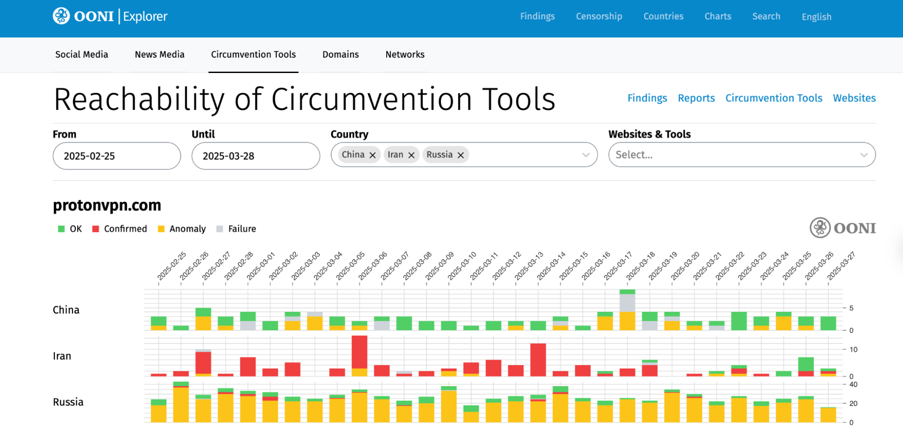

{{}}

**Image:** [OONI Explorer thematic censorship pages](https://explorer.ooni.org/social-media).

Today we are excited to announce the publication of new [OONI Explorer](https://explorer.ooni.org/) thematic censorship pages! These new pages include charts and reports documenting the blocking of **[social media](https://explorer.ooni.org/social-media)**, **[news media](https://explorer.ooni.org/news-media)**, and **[circumvention tools](https://explorer.ooni.org/circumvention)** around the world based on OONI data.

In this blog post, we share information about the new OONI Explorer thematic censorship pages.



## About OONI Explorer

[OONI Explorer](https://explorer.ooni.org/) is the world’s largest **open dataset on internet censorship**.

This data is contributed by [OONI Probe](https://ooni.org/install/) users worldwide, who run censorship measurement tests on their local networks, contributing test results as open data in real-time. Since 2012, OONI Probe users have contributed [more than 2 billion measurements from 28 thousand networks in 242 countries and territories](https://explorer.ooni.org/), all of which is publicly available on OONI Explorer. Every day, as OONI Probe users continue to run tests, new measurements are openly published in real-time. You can also contribute OONI data by [running OONI Probe](https://ooni.org/install/).

To enable researchers and human rights defenders to monitor and respond to censorship events worldwide, we created [OONI Explorer](https://explorer.ooni.org/): a web platform that includes a [Search Tool](https://explorer.ooni.org/search) for searching through the measurements, as well as a [Measurement Aggregation Toolkit (MAT)](https://explorer.ooni.org/chart/mat) for generating charts based on aggregate views of OONI data. OONI Explorer also includes [domain-centric pages](https://explorer.ooni.org/domains) which enable you to view OONI measurements pertaining to the OONI Probe testing of specific domains, [network-centric pages](https://explorer.ooni.org/networks) through which you can learn all about OONI Probe testing on a specific AS, as well as [country-specific pages](https://explorer.ooni.org/countries) providing details about OONI measurement coverage for each country. We also publish short reports documenting emergent censorship events on the OONI Explorer [Censorship Findings](https://explorer.ooni.org/findings) page.

### Why new thematic censorship pages?

To a large extent, using [OONI Explorer](https://explorer.ooni.org/) requires digging through OONI measurements in order to discover censorship events, while exploring and [interpreting OONI measurements](https://ooni.org/support/interpreting-ooni-data/) can potentially be challenging for users who are not already familiar with OONI tools and methodologies.

We therefore created new OONI Explorer pages to present thematic censorship findings to enable the internet freedom community to more easily discover and respond to new censorship events affecting platforms of public interest (such as news media), without having to necessarily dig through OONI measurements. This need was highlighted several times as part of community feedback collected over the years. 

To determine which censorship findings would be most useful to present on OONI Explorer, we conducted extensive user research through a [survey](https://forms.gle/tYv3pecJiUFfUfEh9) and interviews with members of the internet freedom community. The goal of this user research was to better understand how the internet freedom community uses [OONI Explorer](https://explorer.ooni.org/) and the challenges they encounter in discovering censorship findings through the platform.

Based on community feedback collected as part of this user research, we concluded that the new thematic censorship findings pages on OONI Explorer will focus on the following themes: [Social Media](https://explorer.ooni.org/social-media), [News Media](https://explorer.ooni.org/news-media), and [Circumvention](https://explorer.ooni.org/circumvention). Community feedback also informed the ways through which we present information on each of these thematic pages.

## New OONI Explorer thematic censorship pages

To enable the internet freedom community to more easily discover and respond to censorship events, we created new OONI Explorer pages which provide **OONI data and findings** on the following themes:

*   [Blocking of Social Media and Instant Messaging Apps](https://explorer.ooni.org/social-media)
*   [Blocking of News Media](https://explorer.ooni.org/news-media)
*   [Reachability of Circumvention Tools](https://explorer.ooni.org/circumvention)

Each of the new OONI Explorer thematic pages includes:

*   [Short reports](https://explorer.ooni.org/findings) documenting relevant blocks based on OONI data
*   [Longer research reports](https://ooni.org/reports/) documenting relevant blocks based on OONI data
*   **Charts with the latest OONI data** pertaining to each theme (social media, news media, circumvention tools)

By default, these charts are filtered based on 3 countries: China, Iran, and Russia. We chose those countries because they have stable OONI measurement coverage and high levels of internet censorship, providing an opportunity to present more interesting charts (in comparison to other countries). OONI measurement coverage is available for most countries, and you can adjust the charts in these pages by changing the countries and date range (which is set to the past month by default). To better understand the charts, please refer to our [documentation on interpreting OONI data](https://ooni.org/support/interpreting-ooni-data/).

The 3 themes (social media, news media, circumvention) were determined based on community feedback collected through user research, as well as by the fact that social media, news media, and circumvention tools are [frequently blocked](https://ooni.org/reports/) around the world – impacting human rights. We hope that these new pages will support the global [#KeepItOn campaign](https://www.accessnow.org/campaign/keepiton/) and other advocacy efforts around the world.

### Blocking of Social Media and Instant Messaging Apps

{{}}

**Image:** OONI Explorer Social Media page, [https://explorer.ooni.org/social-media](https://explorer.ooni.org/social-media)

Social media platforms are [frequently blocked](https://ooni.org/documents/2022-ooni-submission-ohchr-report-internet-shutdowns.pdf) around the world, particularly during elections and large-scale protests.

Through the new [OONI Explorer Social Media page](https://explorer.ooni.org/social-media), we share ([short](https://explorer.ooni.org/findings?theme=social_media) and [long](https://ooni.org/reports/social-media-im)) **reports** that document the blocking of social media and instant messaging apps around the world based on OONI data. We also share **charts** with the latest OONI data pertaining to the testing of popular social media websites and the following instant messaging apps: [WhatsApp](https://ooni.org/nettest/whatsapp/), [Facebook Messenger](https://ooni.org/nettest/facebook-messenger/), [Telegram](https://ooni.org/nettest/telegram/), and [Signal](https://ooni.org/nettest/signal/) (which are the only instant messaging apps that we have dedicated [OONI Probe experiments](https://ooni.org/nettest/) for).

We chose the specific social media domains based on factors that include global relevance/use, global OONI measurement coverage, and whether they have been blocked (or are likely to get blocked). We refrained from including charts for all tested social media domains in the new Social Media page to enable usability. If you are interested in viewing OONI data for other social media domains that are not listed on the [Social Media page](https://explorer.ooni.org/social-media), you can do so through the OONI Explorer [Search Tool](https://explorer.ooni.org/search) or [Measurement Aggregation Toolkit (MAT)](https://explorer.ooni.org/chart/mat).

We encourage you to learn about the advocacy efforts of the [global #KeepItOn campaign](https://www.accessnow.org/campaign/keepiton/) which is fighting social media blocks around the world.

### Blocking of News Media

{{}}

**Image:** OONI Explorer News Media page, [https://explorer.ooni.org/news-media](https://explorer.ooni.org/news-media)

Press freedom is increasingly being threatened around the world, as news media websites are being blocked in many countries.

Through the new [OONI Explorer News Media page](https://explorer.ooni.org/news-media), we share ([short](https://explorer.ooni.org/findings?theme=news_media) and [long](https://ooni.org/reports/news-media)) **reports** that document the blocking of news media websites around the world based on OONI data. We also share **charts** with the latest OONI data pertaining to the testing of several news media websites. We chose those specific news media domains based on factors that include global relevance, global OONI measurement coverage, and whether they have been blocked (or are likely to get blocked).

We refrained from including charts for all tested news media domains in the new [News Media page](https://explorer.ooni.org/news-media) to enable usability. If you are interested in viewing OONI data for other news media domains that are not listed on the [News Media page](https://explorer.ooni.org/news-media), you can do so through the OONI Explorer [Search Tool](https://explorer.ooni.org/search) or [Measurement Aggregation Toolkit (MAT)](https://explorer.ooni.org/chart/mat). Please note though that the availability of [OONI data](https://ooni.org/data/) depends on whether those domains have been tested by [OONI Probe](https://ooni.org/install/) users in that country. You can [contribute websites for testing](https://ooni.org/support/test-lists-editor) through our [Test Lists Editor](https://test-lists.ooni.org/login).

### Reachability of Circumvention Tools

{{}}

**Image:** OONI Explorer Circumvention Tools page, [https://explorer.ooni.org/circumvention](https://explorer.ooni.org/circumvention)

As circumvention tools (such as VPNs) enable users to bypass internet censorship, some governments have blocked access to them. In fact, OONI data has [shown](https://ooni.org/reports/) over the years that circumvention tools are often blocked in correlation with social media blocks.

Through the [OONI Explorer Circumvention Tools page](https://explorer.ooni.org/circumvention), we share ([short](https://explorer.ooni.org/findings?theme=circumvention) and [long](https://ooni.org/reports/circumvention)) **reports** that document the blocking of circumvention tool websites around the world based on OONI data. We also share **charts** with the latest OONI data pertaining to the reachability testing of [Tor](https://ooni.org/nettest/tor/), [Tor Snowflake](https://ooni.org/nettest/tor-snowflake/), and [Psiphon](https://ooni.org/nettest/psiphon/) (which are the main circumvention tools that we currently support with dedicated [OONI Probe experiments](https://ooni.org/nettest/)), as well as for the testing of several circumvention tool websites.

We chose those specific circumvention tool domains based on factors that include global relevance/use, global OONI measurement coverage, and whether they have been blocked (or are likely to get blocked). We refrained from including charts for all tested circumvention tool domains in the new [Circumvention Tools page](https://explorer.ooni.org/circumvention) to enable usability. If you are interested in viewing OONI data for other circumvention tool websites that are not listed on the Circumvention Tools page, you can do so through the OONI Explorer [Search Tool](https://explorer.ooni.org/search) or [Measurement Aggregation Toolkit (MAT)](https://explorer.ooni.org/chart/mat).

When viewing charts, please note that the presence of [anomalous measurements](https://ooni.org/support/interpreting-ooni-data/#anomalous-measurements) is not always indicative of blocking, as [false positives](https://ooni.org/support/interpreting-ooni-data/#false-positives) can occur. Moreover, circumvention tools often have built-in circumvention techniques for evading censorship. We therefore recommend referring to [Tor Metrics](https://metrics.torproject.org/) and to the [Psiphon Data Engine](https://psix.ca/) to view usage stats and gain a more comprehensive understanding of whether these tools work in each country.

## Acknowledgements

We thank each and every [OONI Probe](https://ooni.org/install/) user who has contributed measurements from 2012 to date, enabling the internet freedom community to monitor and respond to censorship events worldwide.