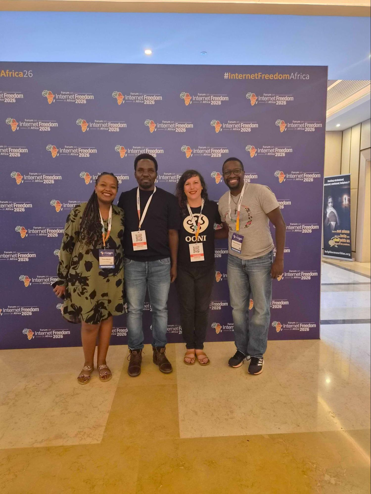
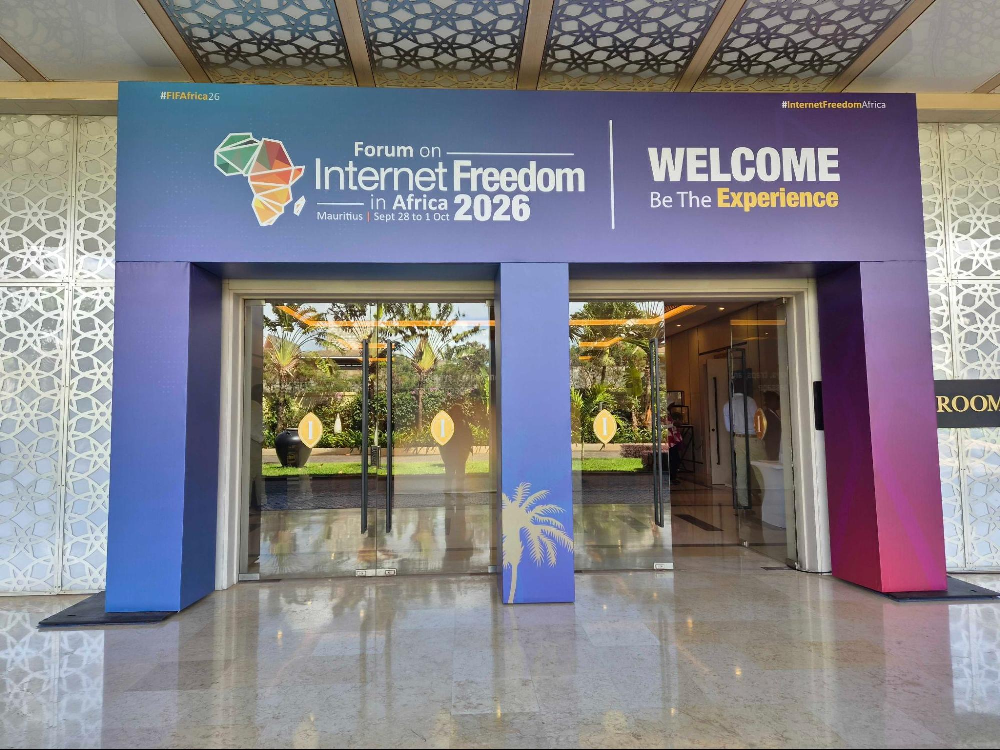
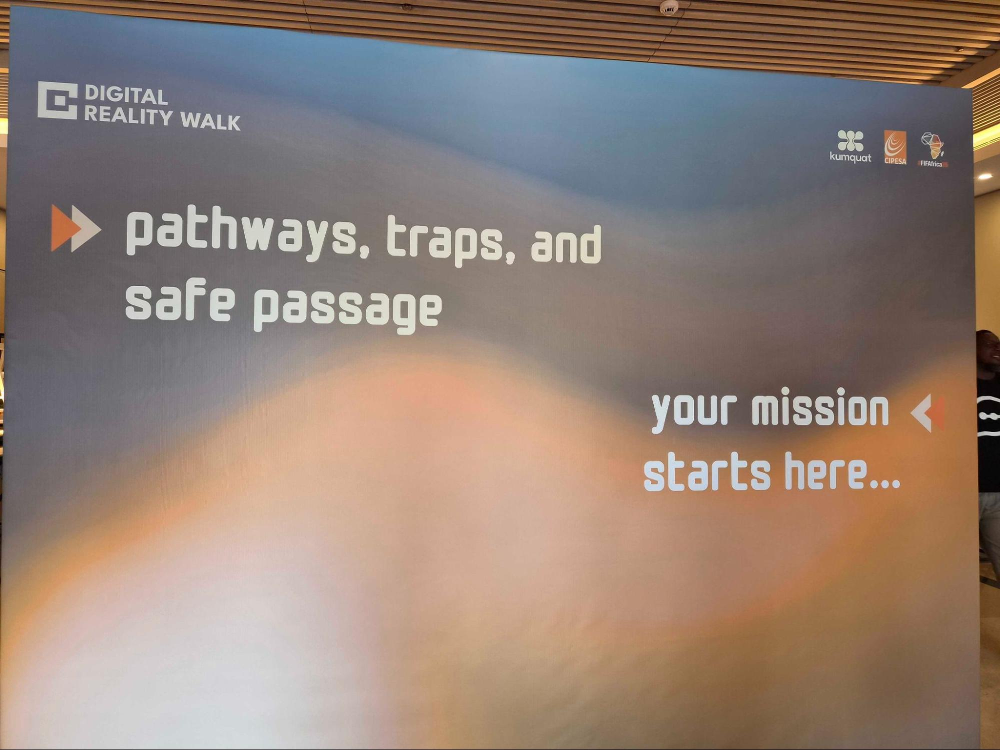
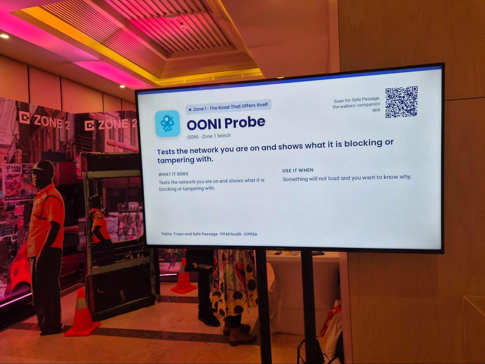
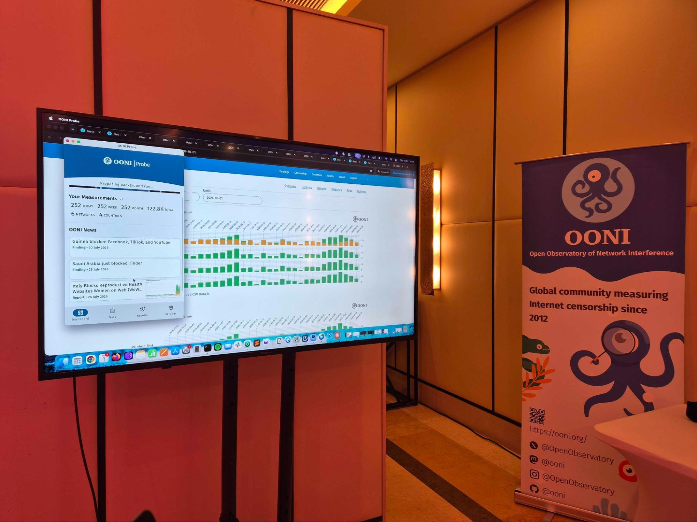
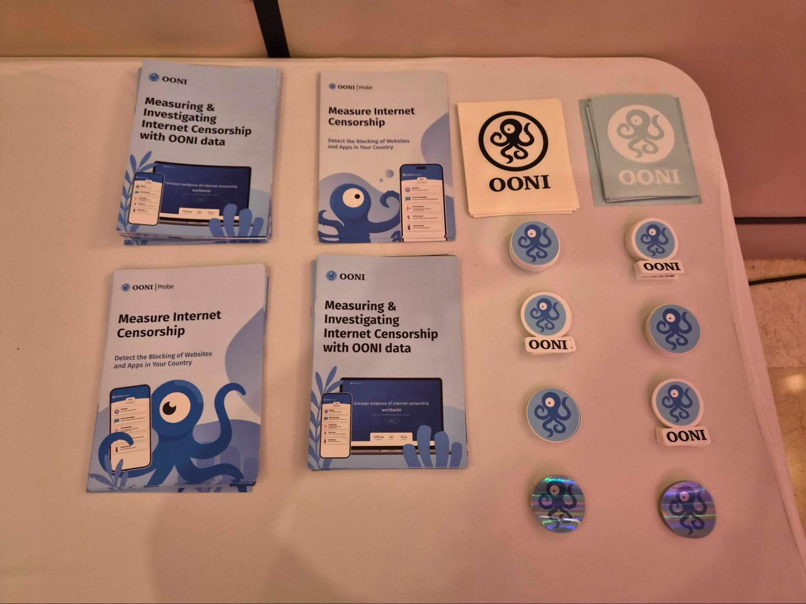
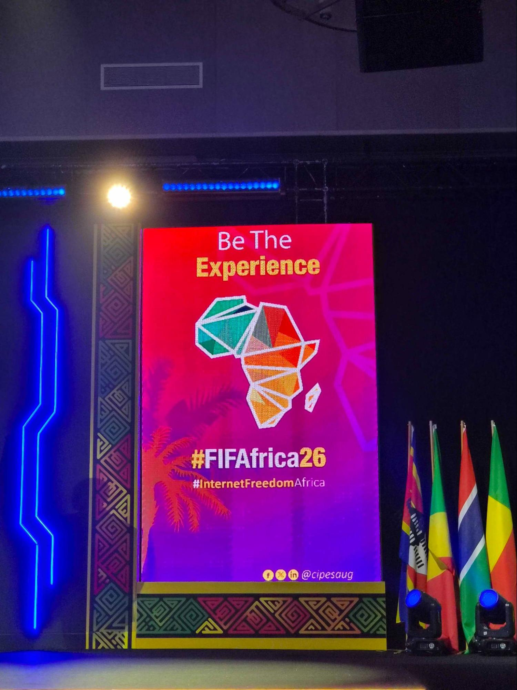

{{}}

**Image:** OONI attending [FIFAfrica 2026](https://internetfreedom.africa/).

Last week, we had the opportunity to participate in the [Forum on Internet Freedom in Africa (FIFAfrica) 2026](https://internetfreedom.africa/), one of Africa’s largest and most important digital rights conferences. We are grateful to have had the opportunity to share OONI tools at the conference and learn from participants.

In this blog post, we briefly share our experience from participating in FIFAfrica 2026.



## FIFAfrica 2026

{{}}

**Image:** Entrance of the Forum on Internet Freedom in Africa (FIFAfrica) 2026 in Mauritius.

Organized and hosted annually by the [Collaboration on International ICT Policy for East and Southern Africa (CIPESA)](https://cipesa.org/), the [Forum on Internet Freedom in Africa (FIFAfrica)](https://internetfreedom.africa/) is one of Africa’s leading digital rights conferences. Each year, FIFAfrica brings together internet governance and digital rights stakeholders from across Africa to discuss the most pressing digital rights topics.

This year, the 13th edition of FIFAfrica took place in Mauritius between September 28, 2026 to October 1, 2026. The first two days included pre-conference events, while the last two days included the program of the main conference. The [FIFAfrica 2026 agenda](https://internetfreedom.africa/fifafrica-agenda/) covered a wide range of important digital rights topics, including tech-facilitated gender-based violence, internet shutdowns, and AI governance, among many others. 

As part of our participation, we attended several FIFAfrica 2026 sessions. Highlights include a [litigation surgery](https://whova.com/embedded/session/qtRthrrv5uErsjB3gXfT2XSkUZdXCrSQOc6dPyhGW90%3D/5578411/) for an Advisory Opinion on internet shutdowns, as well as a [session on challenges and lessons learned from a decade of fighting internet shutdowns](https://whova.com/embedded/session/qtRthrrv5uErsjB3gXfT2XSkUZdXCrSQOc6dPyhGW90%3D/5524981/) with the [#KeepItOn campaign](https://www.accessnow.org/campaign/keepiton/). As part of these sessions, we shared how OONI data can support litigation efforts in Africa, as well as lessons learned from OONI’s participation in the global [#KeepItOn campaign](https://www.accessnow.org/campaign/keepiton/) since 2016.

Notably, during the main conference days (September 30th and October 1st, 2026), **OONI was one of the tools featured in the Digital Reality Walk**, which provided participants an immersive experience to learn about digital security and internet shutdown related tools.

## Digital Reality Walk

{{}}

**Image:** Digital Reality Walk at the Forum on Internet Freedom in Africa (FIFAfrica) 2026.

This year, [FIFAfrica 2026](https://internetfreedom.africa/) launched the [Digital Reality Walk](https://whova.com/embedded/session/qtRthrrv5uErsjB3gXfT2XSkUZdXCrSQOc6dPyhGW90%3D/5604249/): a fun and interactive way to learn about a variety of digital security and internet shutdown related tools.

Hosted on both days of the main conference (September 30th and October 1st, 2026), participants used the [Safe Passage app](https://safe-passage-evj.pages.dev/), developed specifically for the Digital Reality Walk. The Safe Passage app illustrated the [route](https://safe-passage-evj.pages.dev/#route) of the Digital Reality Walk, comprising four zones, each featuring different tools and their developers. The [tools](https://safe-passage-evj.pages.dev/#benches) featured as part of FIFAfrica’s Digital Reality Walk were [ButterBox](https://safe-passage-evj.pages.dev/#benches/team/butterbox), [Orbot](https://safe-passage-evj.pages.dev/#benches/team/orbot), [Tor Browser](https://safe-passage-evj.pages.dev/#benches/team/tor), [OONI Probe](https://safe-passage-evj.pages.dev/#benches/team/ooni), [Tella](https://safe-passage-evj.pages.dev/#benches/team/tella), [Shira](https://safe-passage-evj.pages.dev/#benches/team/shira), [Dash Chat](https://safe-passage-evj.pages.dev/#benches/team/dashchat), and [Shout Messages](https://safe-passage-evj.pages.dev/#benches/team/shout).

To navigate the Digital Reality Walk, participants used a [mission log](https://missionlog.thekumquat.co/) which provided a storyline, guiding them towards several zones where different tools (and their developers) were stationed. OONI was stationed in zone 1, where we engaged with FIFAfrica 2026 participants of the Digital Reality Walk. The storyline that brought participants to zone 1 involved difficulty with internet access and concerns of an upcoming internet shutdown. As participants approached us, we engaged them with the use of our [OONI Probe app](https://ooni.org/install) to measure network interference.

{{}}

**Image:** OONI Probe featured in the Digital Reality Walk at the Forum on Internet Freedom in Africa (FIFAfrica) 2026.

As Mauritius does not currently implement major blocks, we collaborated with the conference organizers on setting up an exhibition network that blocked access to major social media platforms (e.g., Facebook, WhatsApp, Instagram, TikTok, YouTube, Linkedin, etc.), providing a **simulated environment of internet censorship**. This enabled participants (who connected to the exhibition network) to gain a practical, hands-on experience of measuring social media blocks with [OONI Probe](https://ooni.org/install). To avoid sending false measurements for publication, we ensured that participants had the publication of results disabled in their OONI Probe apps when running tests on the exhibition network.

Through our two-day engagement with participants at the Digital Reality Walk, some key things we learned are:

*   [OONI Probe](https://ooni.org/install) users need a faster and easier way to test major social media platforms;
*   While many participants were already familiar with [OONI Probe](https://ooni.org/install) (and many already promote the use of OONI Probe in their communities), fewer were familiar with [OONI Explorer](https://explorer.ooni.org/): our web platform that hosts all OONI measurements published from around the world.

We therefore provided live demos for both [OONI Probe](https://ooni.org/install) and [OONI Explorer](https://explorer.ooni.org/) in our zone of the Digital Reality Walk. As part of our OONI Probe live demos, we walked participants through the latest features and settings, illustrating how they can customize their use of the tool to measure specific forms of censorship (such as the blocking of specific social media websites). Even though OONI Probe automatically prioritizes the testing of major social media websites, we learned that there is still a need to enable users to more dynamically measure such websites when [social media blocks emerge during protests or elections](https://ooni.org/reports/social-media-im/) (which frequently occurs across Africa). This is valuable feedback that will inform our OONI Probe app development efforts.

As part of our [OONI Explorer](https://explorer.ooni.org/) live demos, we walked participants through the platform to investigate various cases of censorship based on OONI data. We customized the experience, digging into cases from the countries of origin and based on the research interests of participants. For example, we looked into the previous [blocking of Telegram in Kenya](https://explorer.ooni.org/chart/mat?probe_cc=KE&since=2024-10-01&until=2024-12-31&time_grain=day&axis_x=measurement_start_day&test_name=telegram), the previous [blocking of social media in Guinea](https://explorer.ooni.org/chart/mat?probe_cc=GN&since=2026-06-30&until=2026-08-30&time_grain=day&axis_x=measurement_start_day&axis_y=domain&test_name=web_connectivity&domain=www.facebook.com%2Cwww.tiktok.com%2Cwww.youtube.com), the [ongoing blocking of Facebook in Uganda](https://explorer.ooni.org/chart/mat?probe_cc=UG&since=2026-09-07&until=2026-10-07&time_grain=day&axis_x=measurement_start_day&axis_y=probe_asn&test_name=web_connectivity&domain=www.facebook.com), and the [ongoing blocking of social media platforms in Gabon](https://explorer.ooni.org/chart/mat?probe_cc=GA&since=2026-01-19&until=2026-09-30&time_grain=day&axis_x=measurement_start_day&axis_y=domain&test_name=web_connectivity&domain=www.facebook.com%2Cwww.instagram.com%2Cwww.tiktok.com%2Cwww.youtube.com).

{{}}

**Image:** Live demo of [OONI Probe](https://ooni.org/install) and [OONI Explorer](https://explorer.ooni.org/) at the Digital Reality Walk of the Forum on Internet Freedom in Africa (FIFAfrica) 2026.

Through the [OONI Explorer](https://explorer.ooni.org/) live demos, we showed how participants can generate charts based on aggregate views of OONI data, interpret measurements, and compare measurements across networks and countries over time. This not only helped participants gain practical skills and knowledge on how to access and interpret OONI data from around the world, but it also helped illustrate the value of running [OONI Probe](https://ooni.org/install) and the need to increase measurement coverage across Africa. As an outcome, we hope that more digital rights defenders in Africa will use [OONI data](https://ooni.org/data/) as part of their research and advocacy efforts over the next few years. 

Beyond live demos and simulated censorship testing, we also had the opportunity to share OONI flyers and stickers with participants of the Digital Reality Walk. We thank all participants for their feedback and questions, and for engaging with the use of OONI tools and data!

{{}}

**Image:** OONI stickers and flyers at the Digital Reality Walk of the Forum on Internet Freedom in Africa (FIFAfrica) 2026.

Overall, participating at [FIFAfrica 2026](https://internetfreedom.africa/) provided us a valuable opportunity to learn about current and emerging digital rights threats and needs in Africa, engage with many of our [African partners](https://ooni.org/partners), meet many other organizations doing important digital rights work, and learn about new initiatives in the region. We expect that this will help with strengthening our existing collaborations, and fostering the development of new collaborations. We are also grateful to have had the opportunity to share OONI tools and data, and to collect feedback which will help inform the improvement of our tools and methods.

Our deepest thanks to [CIPESA](https://cipesa.org/) for organizing and hosting [FIFAfrica 2026](https://internetfreedom.africa/), and for having us in the Digital Reality Walk! Warm thanks to all participants, and to everyone else who helped make this important event possible.

{{}}

**Image:** Forum on Internet Freedom in Africa (FIFAfrica) 2026.
