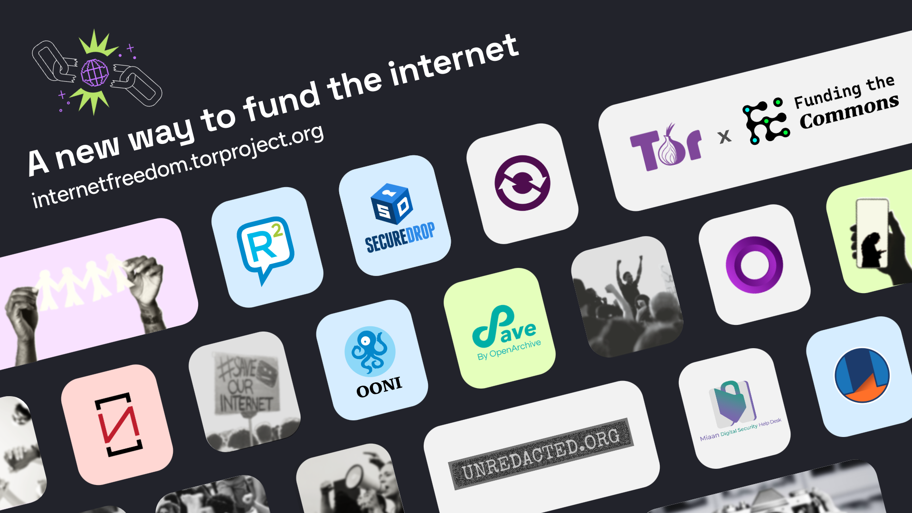

{{}}

**Image:** [Crypto crowdfunding campaign](https://internetfreedom.torproject.org/) for internet freedom.

This week, we joined a group of [10 like-minded projects](https://internetfreedom.torproject.org/projects/) with the launch of a new [quadratic funding campaign for internet freedom](https://internetfreedom.torproject.org/).



Our ability to continue our work is at risk, but with your help, there is a new way to fund internet freedom.

Join the [quadratic funding campaign](https://internetfreedom.torproject.org/projects/) to support OONI and your favourite internet freedom tools.

Every contribution helps. Small donations can have an outsized impact.

## Existential crisis for internet freedom

Over the past decade, the internet freedom field has relied heavily on U.S. government funding. In 2025, changes in administration, policy shifts, and the restructuring or closure of key U.S. government agencies caused many of these funding sources to [disappear](https://www.techpolicy.press/the-us-just-logged-off-from-internet-freedom/), creating an [existential crisis](https://www.techpolicy.press/100-days-of-trump-global-digital-rights-and-internet-freedom-advocacy-efforts-face-generational-crisis/) for the global digital rights and internet freedom movement.

Although OONI has received support from a [wide range of funders](https://ooni.org/about/supporters/#funders) over the years, a significant portion of our annual budget came from U.S. government grants and contracts. As a result of recent [U.S. government funding cuts](https://www.eff.org/deeplinks/2025/01/executive-order-state-department-sideswipes-freedom-tools-threatens-censorship), our ability to continue this work is at risk.

Meanwhile, internet censorship and surveillance are only [getting worse](https://pulse.internetsociety.org/en/blog/2026/05/measuring-internet-censorship-challenges-trends-and-impact/), making the need for [OONI Probe](https://ooni.org/install) and other internet freedom tools more urgent than ever.

Fighting internet censorship requires documenting it, sharing evidence, and [building the collective power to respond](https://blog.torproject.org/Defending-the-right-to-know/).

OONI makes that possible.

We maintain the [world’s largest open dataset on internet censorship](https://ooni.org/data), comprising billions of measurements collected from tens of thousands of networks across most countries since 2012. New measurements are continuously published in real time, supporting critical [research](https://ooni.org/reports/), [advocacy](https://www.accessnow.org/campaign/keepiton/), [press](https://ooni.org/about/citations/), and [litigation](https://blog.bake.co.ke/wp-content/uploads/2025/05/HCCHRPET.276.2025-ICJ-v-CA-Internet-Shutdown-Case.pdf) efforts around the world.

But the abrupt decline in government funding threatens our ability to continue our work and advance our [mission](https://ooni.org/about/#mission).

What if internet freedom funding wasn't driven by a few large donors, but by how many people showed up?

What if there was a [new way to fund internet freedom](https://blog.torproject.org/fund-internet-freedom/)?

## New way to fund internet freedom

Earlier this week, the [Tor Project](https://www.torproject.org/) and [Funding the Commons](https://www.fundingthecommons.io/) launched a [crypto crowdfunding campaign](https://internetfreedom.torproject.org/) in support of [10 internet freedom projects](https://internetfreedom.torproject.org/projects/), including [OONI](https://internetfreedom.torproject.org/projects/ooni/).

The other 9 projects include [Onion Browser](https://internetfreedom.torproject.org/projects/onion-browser/), [Miaan Digital Security Help Desk](https://internetfreedom.torproject.org/projects/miaan/), [Unredacted](https://internetfreedom.torproject.org/projects/unredacted/), [Osservatorio Nessuno OdV](https://internetfreedom.torproject.org/projects/osservatorio-nessuno/), [SecureDrop](https://internetfreedom.torproject.org/projects/securedrop/), [Ricochet Refresh](https://internetfreedom.torproject.org/projects/ricochet-refresh/), [Save by OpenArchive](https://internetfreedom.torproject.org/projects/openarchive-save/), [OnionShare](https://internetfreedom.torproject.org/projects/onionshare/), and [Paskoocheh](https://internetfreedom.torproject.org/projects/paskoocheh/). 

You can **[donate to a project directly](https://internetfreedom.torproject.org/projects/)** or **[fund the matching pool](https://internetfreedom.torproject.org/matching-pool/)**. 

At the launch of the campaign, matching funds were generously contributed by [Cake Wallet](https://cakewallet.com/), [Zcash Community Grants](https://zcashcommunitygrants.org/), [Logos](https://logos.co/), and [Octant](https://octant.app/). The more individual donations a project receives, the more match pool funding they receive.

This [campaign](https://internetfreedom.torproject.org/about/) was launched as an experiment in finding an alternative: a community-driven, cryptocurrency-native fundraising event designed to fund internet freedom more sustainably, transparently, and collectively when traditional methods fail.

[Quadratic funding](https://www.wtfisqf.com/) is a way to distribute funds that prioritizes how many people support a project, not just how much money it receives. In practice, this means a project supported by hundreds of people donating small amounts can receive more matching funds than one backed by a few large donors. As a result, small donations can have outsized impact in the new quadratic funding campaign for internet freedom.

We thank the [Tor Project](https://www.torproject.org/) and [Funding the Commons](https://www.fundingthecommons.io/) for launching and organizing the campaign, and we thank [Cake Wallet](https://cakewallet.com/), [Zcash Community Grants](https://zcashcommunitygrants.org/), [Logos](https://logos.co/), and [Octant](https://octant.app/) for their generous matching funds.

Join the campaign, and help sustain the future of internet freedom.

Support [OONI](https://internetfreedom.torproject.org/projects/ooni/) and your favourite [internet freedom tools](https://internetfreedom.torproject.org/projects/) today.