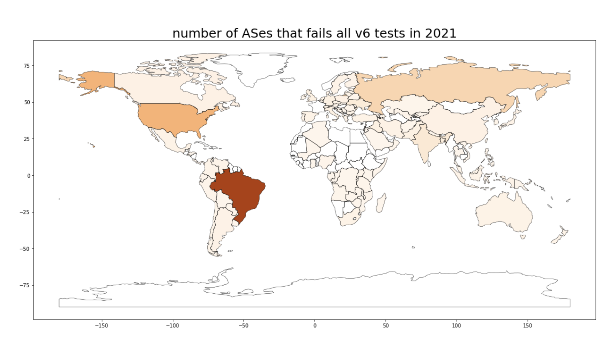
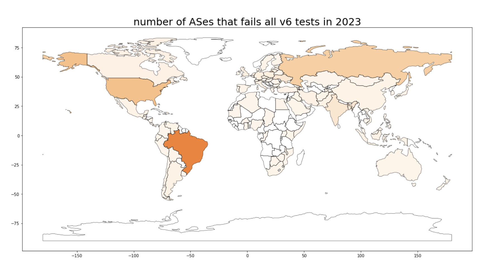
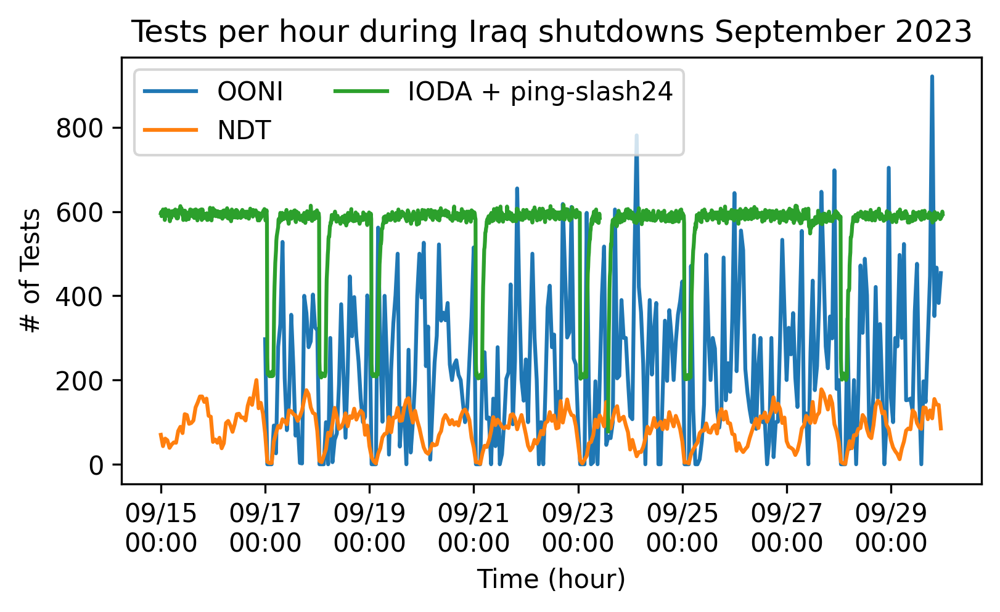
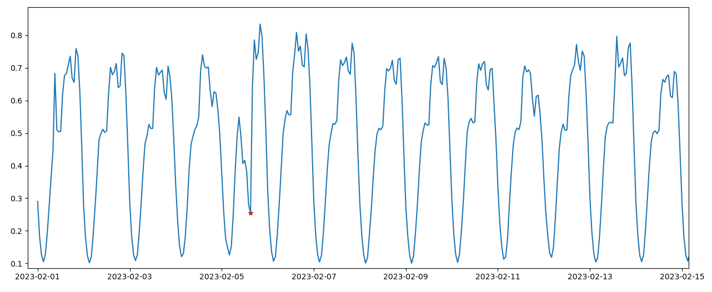

On 23rd October 2023, right before the [Internet Measurement Conference
(IMC)](https://conferences.sigcomm.org/imc/2023/) 2023, we
co-hosted an **internet measurement hackathon** in collaboration with
the [Internet Society
(ISOC)](https://www.internetsociety.org/),
[M-Lab](https://www.measurementlab.net/), [Censored Planet](https://censoredplanet.org/) and
[IODA](https://ioda.inetintel.cc.gatech.edu/).

In this post we would like to share some of the projects that were
developed as part of the hackathon. It was great to see how much was
accomplished in such a short period of time!

The day started with an [introduction to the various datasets](https://docs.google.com/presentation/d/1DHhGcpCMTbSJE0QKO6ZTSnIPFixLxxBXwZLkqv0wdJA/edit#slide=id.g1723ddbd698_0_18)
from OONI's Arturo, Censored Planet's Armin, IODA's Zach, ISOC's Amreesh
and M-Lab's Lai Yi. Following the brief presentations, the participants
formed teams to work on some of the specific challenges that [we had
proposed](https://docs.google.com/document/d/1bmCwU0ZJCu-xKlIBKqh3rdIJLHZ-vS7UCOfHI-0RxVE/edit#heading=h.nhvc5bssegtl)
or came up with new ones.

*Participants were grouped into 3 teams each looking into a different
topic.*

In total, 4 projects came out of the hackathon:

* Using OONI data to investigate IPv6 connectivity
* Data triangulation to infer censorship or shutdown events
* Correlating alarms across multiple datasets
* Bonus: The Sound of Internet Shutdowns

We share more details below.



## Using OONI data to investigate IPv6 connectivity

This team [used OONI data to investigate differences and evolution in IPv6 connectivity](https://drive.google.com/drive/folders/11jqQqG-id2AbP-xtoWfLvHNXWodLhsU7)
worldwide. Specifically, they looked at IPv6 reachability data derived
from OONI Web Connectivity measurements from the year 2021 and compared
them to those from 2023.

By comparing data from these two time intervals, they first noticed that
there was an increase in OONI measurements from 2021 compared to 2023.

They then went on to analyze how many AS networks seemed to support IPv6
broken down by country, as can be seen in the following two charts:

*Number of ASes failing IPv6 measurements in 2021 and 2023*

They noticed a decline in the number of Autonomous Systems (ASes)
failing IPv6 tests between 2021 and 2023. This trend indicates
improvements in IPv6 reliability and a reduction in connectivity issues.

**Note:** The hackathon participants were not aware of this, but the
sample of data they used from 2021 was only partial (our bad for not
communicating this adequately), so while the methodology is quite sound,
the specific findings should be treated with a grain of salt.

## Data triangulation to infer censorship or shutdown events

This team extracted signals for internet shutdowns by comparing multiple
different datasets (including OONI), for which they used as a signal the
absolute number of tests run in a particular country.

They started off by looking at the [Internet Society Pulse Shutdown Tracker](https://pulse.internetsociety.org/shutdowns) page
to extract a list of relevant events and they then extracted relevant
data from the other datasets (IODA, OONI, M-LAB).

In the figure below, we can see a 3-hour internet shutdown in Iraq in September 2023.

*Visualization of a shutdown in Iraq on 28 September 2023 which lasted 3
hours.*

Access to the internet was shut down for 3 hours and this could be
observed mostly on OONI, IODA, and M-Lab.

## Correlating alarms across multiple datasets

This team used data from NDT, OONI, Cloudflare Radar traffic, Cloudflare
Speedtest, IODA, and the Google Transparency Report. Their aim was to
uncover correlations between significant events as captured by these
diverse platforms. They employed the SARIMA (Seasonal Autoregressive
Integrated Moving Average) model to identify anomalies in data trends.

*Using SARIMA for anomaly detection (TIM outage in Italy Feb 05, 2023)*

The team visualized the [TIM Sparkle
outage](https://pulse.internetsociety.org/blog/italys-internet-outage-a-perfect-storm)
using the Google Transparency report. More visualization can be found
[here](https://docs.google.com/presentation/d/1G1NtLynJGj2j0czTrIpJsDBSB7tYkAx3OMVRriC1CQw/edit#slide=id.g2927800f948_0_0).

## Bonus: The Sound of Internet Shutdowns

Participating in a hackathon also means having some fun and exploring
new ideas!

OONI's Arturo developed a sonification project which transforms some of
the features of the [IODA dataset](https://ioda.inetintel.cc.gatech.edu/) into some
synthesized sounds. This way it's possible to literally listen to an
internet shutdown by pasting the link of an IODA chart of an event. You
are then able to play it inside of your web browser.

Below is an example of how an [internet shutdown in Iraq](https://ioda.inetintel.cc.gatech.edu/country/IQ?from=1685389784&until=1687981784)
sounds like:



**Code:**
[https://github.com/hellais/the-sound-of-internet-shutdowns](https://github.com/hellais/the-sound-of-internet-shutdowns)

**Live site:**
[https://shutdown-sound.vercel.app/](https://shutdown-sound.vercel.app/)

## Conclusion

Overall, we were very impressed by the results the participants were
able to produce in such a short amount of time. We hope they found the
hackathon interesting, fun and that it offered them a way to be exposed
to some new datasets that they may have not already been familiar with.
We also hope that the hackathon will support participants' future
internet measurement research efforts!

We would like to thank all the participants for making this such a great
event. We would also like to thank Google for arranging the conference
room and lunch, Google Jigsaw for the hackathon prizes, and finally ISOC
for the hackathon dinner.
