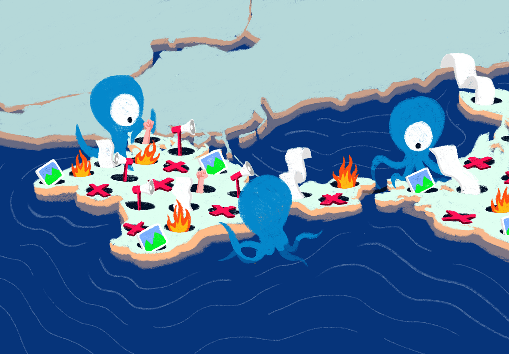

We are happy to celebrate OONI's 10th anniversary together with our
amazing community, who have been at the heart of our work over the past
decade.

Today, we are excited to share a **new video with OONI community
members**, where they discuss how OONI has been useful to their work,
while sharing what they would like to see OONI do in the future.



## Featured community members and partners

### Andrés Azpúrua, [Venezuela Inteligente](https://veinteligente.org/) 

Andrés is the co-founder and Director of Venezuela Inteligente, a
non-profit organization that aims to facilitate information,
communication and collaboration between citizens and civil society
organizations to create impact from a non-partisan perspective. They
promote, facilitate and develop digital tools, improving access to
information, collaboration and responsiveness, empowering organizations,
activists and citizens. They fight for the rights of Venezuelans online
and offline.

Venezuela Inteligente is one of OONI's [most long-term
partners](https://ooni.org/partners/venezuela-inteligente/),
having led OONI measurement efforts in Venezuela since 2014. Through
their [VEsinFiltro](https://vesinfiltro.com/) project,
Venezuela Inteligente investigates and documents internet censorship in
Venezuela, using (along with custom scripts and tools) [OONI Probe](https://ooni.org/install/) and [OONI data](https://ooni.org/data/).

### Arthit Suriyawongkul, [Thai Netizen Network](https://thainetizen.org/)

Arthit works with the [Thai Netizen Network](https://thainetizen.org/), a leading non-profit
organization in Thailand that advocates for digital rights and civil
liberties. Founded in December 2008, it grew out of a group of netizens
who had concerns about limited internet freedom during post-coup
governments. Its activities are based on five themes: access to
information, freedom of opinion and expression, privacy, participatory
internet governance, and rights over information resources.

Thai Netizen Network supported OONI activities by updating the
country-specific test list for Thailand, coordinating censorship
measurement, and conducting [research
projects](https://ooni.org/post/thailand-internet-censorship/)
focused on local internet censorship.

### Arzu Geybulla, [Azerbaijan Internet Watch](https://www.az-netwatch.org/)

Arzu is a journalist from Azerbaijan focused on developments in
Azerbaijan, Caucasus, and Turkey. In 2019, she launched [Azerbaijan Internet Watch (AIW)](https://www.az-netwatch.org/), an
online platform tracking and mapping internet censorship and
surveillance in real-time in Azerbaijan.

We have worked together closely since the launch of the project and were
able to [publish several reports](https://ooni.org/partners/azerbaijan-internet-watch/)
on the state of internet censorship in Azerbaijan over the past years.
More recently, we collaborated on
[research](https://ooni.org/post/2022-azerbaijan-and-armenia-blocks-tiktok/)
investigating the blocking of TikTok (based on OONI data) in both
Armenia and Azerbaijan amid border clashes.

### Davide Brunello, Independent researcher

Davide is a lawyer and independent researcher from Italy, who has been
active in the OONI community for several years. We collaborated with
Davide on measuring the [blocking of the Gutenberg book publishing website](https://ooni.org/post/2021-italy-blocks-gutenberg-book-publishing-website/)
in Italy.

### Felicia Anthonio, [Access Now](https://www.accessnow.org/)

[Felicia](https://www.accessnow.org/profile/felicia/) is
the Campaign Manager of Access Now's [#KeepItOn campaign](https://www.accessnow.org/keepiton/): a global
coalition of more than 280 human rights organizations from 105 countries
fighting internet shutdowns around the world. The #KeepItOn campaign was
created to monitor and advocate against internet shutdowns, and support
grassroots organizations with digital security training, circumvention
tips and advocacy funding.

Since 2016, OONI has [worked closely](https://ooni.org/partners/access-now/) with the
#KeepItOn campaign on coordinating censorship measurement efforts
(particularly leading up to and during [political
events](https://www.accessnow.org/internet-shutdowns-and-elections-handbook/),
which often [trigger new censorship events](https://ooni.org/reports/)) and on providing
relevant [OONI data](https://ooni.org/data/) in support of
advocacy efforts around the world.

### Gustavo Gus, [Tor Project](https://www.torproject.org/)

[Gus](https://www.torproject.org/about/people/) is the
Community Team Lead at the [Tor
Project](https://www.torproject.org/), a non-profit that
advances human rights and freedoms by creating and deploying free and
open source anonymity and privacy technologies.

The [Tor network](https://www.torproject.org/), which is
free and open source, provides its users with online anonymity, privacy,
and censorship circumvention. Tor software is designed to bounce
communications around a distributed network of relays run by volunteers
around the world, thereby hiding its users' IP addresses and enabling
them to circumvent online tracking and internet censorship.

OONI was born out of the Tor Project, back in 2011. Since then, we have
actively collaborated on [measuring Tor
reachability](https://ooni.org/partners/tor-project/)
around the world.

### Igor Valentovitch, [Netalitica](https://netalitica.com/)

Igor is the founder and Director of
[Netalitica](https://netalitica.com/), which works on
[improving](http://netalitica.com/wp-content/uploads/2019/11/Guideline-for-Test-List-Researchers-V5.pdf)
the Citizen Lab [test lists (used by OONI
Probe)](https://github.com/citizenlab/test-lists), enhancing the quality
of censorship measurement research around the world. Over the last few
years, more than 50 country-specific test lists were reviewed and
updated by the efforts of the researchers engaged by Netalitica.

### Kelly Koh, [Sinar Project](https://sinarproject.org/)

Kelly is a Programme Officer with [Sinar
Project](https://sinarproject.org/), a civic tech
initiative using open technology, open data and policy analysis to
systematically make important information public and more accessible to
the Malaysian people. They aim to improve governance and encourage
greater citizen involvement in the public affairs of the nation by
making the Parliament and the Malaysian Government more open,
transparent and accountable.

Sinar Project is one of OONI's [most long-term
partners](https://ooni.org/partners/sinar-project/), having
led OONI community engagement efforts in Southeast Asia over the past
decade. We have collaborated with Sinar Project on [numerous research
reports](https://ooni.org/partners/sinar-project/) (using
OONI data) on internet censorship in Southeast Asia. Sinar Project has
updated many country-specific test lists for Southeast Asia, engaged
local communities with OONI censorship measurement research, and
[coordinated censorship measurement
campaigns](https://sinarproject.org/digital-rights/measuring-and-detecting-network-interference/ge15)
during elections in multiple countries in the region.

Based on OONI data, Sinar Project created the [Southeast Asia Censorship Dashboard](https://censorship.sinarproject.org/#/summary/2020)
project, which tracks and documents internet shutdowns reported across
Southeast Asia. Sinar Project is currently running the [Internet
Monitoring Action Project
(iMAP)](https://github.com/Sinar/imap) which investigates
internet censorship in Malaysia, Indonesia, Philippines, Cambodia,
Vietnam, Thailand, Hong Kong, Myanmar and India through the use of OONI
tools and OONI data.

### Ksenia Ermoshina, [Center for Internet and Society (CIS)](https://cis.cnrs.fr/), [Citizen Lab](https://citizenlab.ca/), [eQualitie](https://equalit.ie/), [DeltaChat](https://delta.chat/en/)

Ksenia is a researcher engaged in multiple projects. Her primary field of research is sociology
of technology and she is mostly focused on information control
technologies: censorship, surveillance, circumvention tools, especially
in occupied regions of Ukraine.

In 2018, Ksenia collaborated with Igor Valentovitch on analyzing OONI
data to [investigate and compare internet censorship](https://www.opentech.fund/news/exploring-online-media-filtering-during-2018-russian-presidential-elections/)
in occupied Crimea and Russia.

{{}}

### Radhika Jhalani, [Software Freedom Law Centre India](https://sflc.in/) 

Radhika is a digital rights activist and lawyer with the [Software
Freedom Law Centre, India (SFLC.in)](https://sflc.in/), a
nonprofit legal services organization that brings together lawyers,
policy analysts, technologists, and students to protect freedom in the
digital world. SFLC.in promotes innovation and open access to knowledge
by helping developers make great Free and Open Source Software, protect
privacy and civil liberties for citizens in the digital world by
educating and providing free legal advice and help policy makers make
informed and just decisions with the use and adoption of technology.

SFLC.in runs the [India Internet
Shutdowns](https://internetshutdowns.in/) project, which
tracks and documents internet shutdowns reported across India. In 2021,
the Indian government [suspended internet
services](https://sflc.in/letter-haryana-government-reconsider-suspension-internet-5-districts)
in multiple regions across the country due to the 'Farmers' protests'.
OONI measurements supported the [report and
petition](https://sflc.in/sflcin-assists-challenging-haryana-shutdown-order)
against the shutdown to the government.

### Vianney Forewah, [COMPSUDEV](https://ooni.org/partners/compsudev/)

Vianney is a digital rights activist and Executive Director of Community Participation in Sustainable Development (COMPSUDEV), a non-profit association in Cameroon that sets out to empower youths and communities through sustainable livelihood programs in the domain of digital rights, digital security, ICT and Open Access to the internet. 

We have [worked together](https://ooni.org/partners/compsudev/) since 2019
on collecting OONI measurements from Cameroon and coordinating
censorship measurement efforts across the country.

## About the OONI community

The OONI community includes developers, researchers, activists,
journalists, human rights organizations and translators interested in
tracking, analyzing and fighting internet censorship around the world.

Our community includes individuals and organizations working on
research, policymaking, advocacy and software development in the
internet freedom field. Throughout the years, they supported OONI with:

* **Community outreach in different regions**. Leading OONI community engagement efforts, facilitating OONI workshops and training, and coordinating [OONI Probe](https://ooni.org/install)
 censorship testing.

* **Investigation and research of internet censorship**. Using [OONI tools](https://ooni.org/install/) and [OONI data](https://ooni.org/data) as part of their research efforts in investigating various forms of internet censorship.

* **Localisation of OONI tools**. [Translation](https://explore.transifex.com/otf/ooniprobe/) of OONI tools and documentation, creating educational materials for local communities.

* **Improving the test lists**. Updating the [Citizen Lab Test Lists](https://github.com/citizenlab/test-lists), improving the quality of website testing and sharing country-specific knowledge.

* **Organizing advocacy efforts.** Using [OONI data](https://explorer.ooni.org/) and [reports](https://ooni.org/reports/) as evidence for advocacy campaigning.

If you are interested to learn more about our community, please check
our [partners network](https://ooni.org/partners/) and
find more interviews with our community members on our [YouTube
channel](https://www.youtube.com/@OONIorg).

As part of our [10th Ooniversary Events](https://ooni.org/post/10th-ooniversary-events/), we
had the opportunity to host a **[live-streamed
event](https://www.youtube.com/watch?v=Co_f8KPBIZM)** where
several OONI community members briefly shared how they have used OONI
tools and data as part of their work.

If you would like to participate in our community, there are many ways
you can [get involved](https://ooni.org/support/faq#how-can-i-get-involved)!
We also encourage you to join us on
[Slack](https://slack.ooni.org/) and sign-up for the
[ooni-talk](https://lists.torproject.org/cgi-bin/mailman/listinfo/ooni-talk)
mailing list to participate in community discussions and
receive updates.

Huge thanks to all OONI community members for making our work possible!
