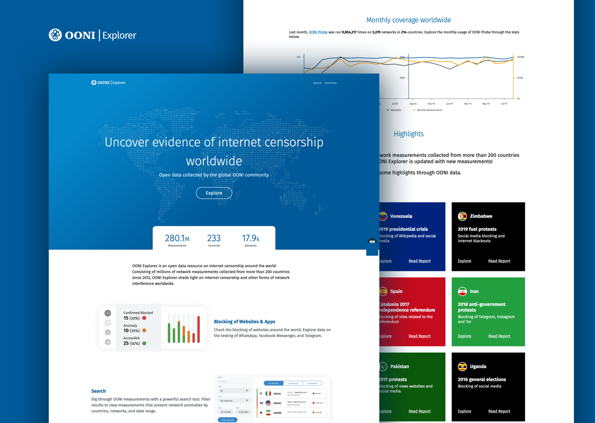

{{}}

Today is OONI’s 10th anniversary!

As of today, 10 years ago, the first OONI measurement was published.
Today, 10 years later, [more than a billion OONI measurements](https://explorer.ooni.org/) have been published, shedding
light on [internet censorship](https://ooni.org/reports/) worldwide.

In this post, we share some **OONI highlights from the past 10 years**,
as well as some of our future plans.

You can start off by getting a glimpse of “OONI in 10 years” through the
following animation, which shares some highlights from the past decade.



**Animation:** Created by [Robotina](https://www.robotina.it/).

* [About OONI](#about-ooni)

* [Highlights](#highlights)

    * [Free software tools for measuring internet censorship](#free-software-tools-for-measuring-internet-censorship)

        * [Network measurement tests](#network-measurement-tests)

        * [OONI Probe](#ooni-probe)

        * [OONI Run](#ooni-run)

    * [Real-time open data on internet censorship](#real-time-open-data-on-internet-censorship)

        * [OONI Explorer](#ooni-explorer)

        * [Measurement Aggregation Toolkit (MAT)](#measurement-aggregation-toolkit-mat)

        * [OONI API](#ooni-api)

    * [Research on internet censorship](#research-on-internet-censorship)

    * [Resources for community participation in censorship measurement research](#resources-for-community-participation-in-censorship-measurement-research)

        * [Online OONI training courses](#online-ooni-training-courses)

        * [Test Lists Editor](#test-lists-editor)

        * [User guides and documentation](#user-guides-and-documentation)

    * [Global OONI censorship measurement community](#global-ooni-censorship-measurement-community)

        * [OONI Partners](#ooni-partners)

        * [KeepItOn campaign](#keepiton-campaign)

        * [Localization of OONI tools](#localization-of-ooni-tools)

        * [Community use of OONI data](#community-use-of-ooni-data)

* [Future goals](#future-goals)

* [Acknowledgements](#acknowledgements)

# About OONI

More than ten years ago, some developers at the [Tor Project](https://www.torproject.org/) were investigating how internet
censorship was being implemented on certain networks. Their main
motivation was to understand the blocking of Tor, but they were also
curious to know more broadly how censorship was affecting other services
as well.

While carrying out these investigations, they developed a set of scripts
that they would ask tech-savvy people in regions affected by censorship
to run. [OONI](https://ooni.org/) was born out of the desire and need
to further systematize this collection of one-off network measurements
so that anyone, without coordination from us, could run them
independently and the results would be published for the world to see.

With this in mind, we worked on the following over the last decade:

* **Network measurement experiments designed to measure various forms
of internet censorship.** All such
[experiments](https://ooni.org/nettest/) have been based on
[open methodologies](https://github.com/ooni/spec/tree/master/nettests),
enabling the independent third-party verification (and
improvement) of our methods.

* **Free and open source tools for measuring internet censorship.**
Anyone can install [OONI Probe](https://ooni.org/install) (on
both mobile and desktop platforms) to measure internet censorship
on their network. To enable use, we tried to make OONI Probe as
easy to use as possible, we included features based on community
requests, and we worked with the [Localization Lab](https://www.localizationlab.org/) community on its
[localization](https://explore.transifex.com/otf/ooniprobe/).

* **Real-time open data on internet censorship.** We publish OONI
Probe measurements from around the world in *real-time*. Since
2012, we have published [more than 1 billion measurements](https://explorer.ooni.org/) collected from 28
thousand networks in 241 countries and territories. To enable the
independent third-party analysis and verification of [OONI data](https://ooni.org/data/), we provide raw OONI data in JSON
format through the [OONI API](https://api.ooni.io/), and the
whole OONI dataset can be fetched from the [Amazon S3 bucket](https://ooni.org/post/mining-ooni-data). We also
published [documentation](https://ooni.org/notebooks/tutorial-russia-data-analysis-case-study.html)
explaining how to analyze OONI data.

* **Web platforms for investigating internet censorship through OONI
data.** To enable researchers, journalists, and human rights
defenders to investigate internet censorship, we created [OONI Explorer](https://explorer.ooni.org/): a web platform that
enables you to search through OONI measurements. We also created
the [Measurement Aggregation Toolkit (MAT)](https://explorer.ooni.org/chart/mat), which enables you to
create your own charts based on aggregate views of real-time OONI data.

* **Research on internet censorship based on OONI data.** Over the
past decade, we published [75 reports](https://ooni.org/reports/) documenting internet
censorship around the world. These reports highlight key
censorship events identified through OONI data. We also published
several research papers on internet censorship.

* **Community engagement.** All of the above requires that people run
[OONI Probe](https://ooni.org/install/), contributing network
measurements. As a result, global community engagement has been
core to our strategy. To this end, we established
[partnerships](https://ooni.org/partners) with 41 digital rights
organizations, became a member of the global [#KeepItOn campaign](https://www.accessnow.org/keepiton/) (fighting internet
shutdowns), facilitated numerous OONI workshops, and created
resources to support OONI community engagement efforts worldwide.

In the following sections, we share key OONI highlights from the past
decade, as well as some of our plans for the future.

# Highlights

## Free software tools for measuring internet censorship

### Network measurement tests

Over the past decade, we have created numerous [network measurement tests](https://github.com/ooni/spec/tree/master/nettests) designed to
measure various forms of internet censorship.

These include [tests](https://ooni.org/nettest/) designed to measure:

* Blocking of [websites](https://ooni.org/nettest/web-connectivity/);

* Blocking of instant messaging apps ([WhatsApp](https://ooni.org/nettest/whatsapp/), [Facebook Messenger](https://ooni.org/nettest/facebook-messenger/),
[Signal](https://ooni.org/nettest/signal/),
[Telegram](https://ooni.org/nettest/telegram/));

* Reachability of circumvention tools ([Tor](https://ooni.org/nettest/tor/), [Vanilla Tor](https://ooni.org/nettest/vanilla-tor/), [Tor Snowflake](https://ooni.org/nettest/tor-snowflake/),
[Psiphon](https://ooni.org/nettest/psiphon/),
[RiseupVPN](https://ooni.org/nettest/riseupvpn/));

* Protocols ([STUN](https://github.com/ooni/spec/blob/master/nettests/ts-025-stun-reachability.md),
[encrypted DNS (DoH/DoT)](https://github.com/ooni/spec/blob/master/nettests/ts-028-dnscheck.md));

* Presence of [middleboxes](https://ooni.org/nettest/#boxes).

The above experiments have been integrated into our [OONI Probe](https://ooni.org/install) app, enabling users to run these tests
on networks worldwide. We also integrated the
[NDT](https://ooni.org/nettest/ndt/) and
[DASH](https://ooni.org/nettest/dash/) performance tests, developed
by, and in collaboration with, the [Nexa Center for Internet and Society](https://nexa.polito.it/) and [Measurement Lab (M-Lab)](https://www.measurementlab.net/). To encourage community
members to contribute their own experiments to OONI Probe, we published
a
[tutorial](https://github.com/ooni/probe-cli/tree/master/internal/tutorial)
explaining how to write OONI Probe tests.

More recently, we have been researching [new methods](https://github.com/bassosimone/websteps-illustrated/) to
improve how we measure website blocking. Our new methods enumerate all
forms of website blocking, include support for HTTP/3 and a follow-up
[SNI filtering test](https://github.com/ooni/spec/blob/master/nettests/ts-024-sni-blocking.md),
enabling the collection of richer data. We aim to incrementally ship
these new methods as part of our [Web Connectivity experiment](https://ooni.org/nettest/web-connectivity/) over the next
year.

### OONI Probe

You can measure various forms of internet censorship with [OONI Probe](https://ooni.org/install), currently available for
[Android](https://play.google.com/store/apps/details?id=org.openobservatory.ooniprobe),
[iOS](https://itunes.apple.com/us/app/id1199566366),
[F-Droid](https://f-droid.org/repository/browse/?fdid=org.openobservatory.ooniprobe),
[Linux](https://ooni.org/install/cli/ubuntu-debian), [Windows and macOS](https://ooni.org/install/desktop).

{{}}

OONI Probe started off as a python command line tool for Linux and
macOS, with [OONI Probe 1.0.0](https://github.com/ooni/probe-legacy/releases/tag/v1.0.0) being
released in February 2014. Initially, OONI Probe was mainly run by
technologists, since it required familiarity with the command line. To
enable researchers and human rights defenders to run OONI Probe, we
[released OONI Probe 2.0.0 with a web-based user interface](https://ooni.org/post/web-ui-post/).

{{}}

During the same year (2016), we also established the [OONI Partnership Program](https://ooni.org/get-involved/partnership-program/) to
collaborate with digital rights organizations on measuring internet
censorship around the world. To enable our partners to contribute stable
measurements, we released an [*OONI Probe distribution for Raspberry
Pis*](https://ooni.org/post/lepidopter/) (“Lepidopter”).

{{}}

**Image:** OONI Probe for Raspberry Pi (credit: [*Sinar
Project*](https://sinarproject.org/)).

While “Lepidopter” played an important role in boosting OONI measurement
coverage (with daily measurements collected automatically), shipping
(and troubleshooting) Raspberry Pis was not sustainable for our small
team in the long-run. We therefore aimed to instead prioritize our
efforts on building OONI Probe apps that anyone can easily install and
run, without requiring any technical knowledge.

Notably, we [launched the OONI Probe mobile app](https://ooni.org/post/ooni-mobile-app/) (for Android, F-Droid and
iOS) in February 2017, bringing censorship measurement to hundreds of
thousands of people worldwide. **This launch was a *major milestone*
because, for the first time, anyone could independently measure internet
censorship – without requiring any technical knowledge or expertise. For
the first time, anyone with a smartphone (most internet users worldwide)
could easily measure and contribute data on internet censorship with the
tap of a button!** And based on community feedback, we [launched a revamped version of OONI Probe Mobile](https://ooni.org/post/revamped-ooni-probe-mobile-app/) (with a
major UI overhaul) two years later (2019).

{{}}

**Image:** Comparison of OONI Probe Mobile 1.0 (old) with OONI Probe
Mobile 2.0 (new).

We subsequently improved the UI of OONI Probe Mobile further.

{{}}

While [OONI Probe Mobile](https://ooni.org/install/mobile) played a
significant role in boosting OONI measurement coverage worldwide,
desktop users still had to use the terminal to run OONI Probe. To enable
people to run OONI Probe on as many platforms as possible, we [launched an OONI Probe desktop app for Windows and macOS](https://ooni.org/post/2020-ooni-probe-desktop-app/) in April
2020.

{{}}

With the [OONI Probe mobile and desktop apps](https://ooni.org/install/), anyone can measure internet
censorship on multiple platforms, with the click of a button! To enable
technologists to install OONI Probe on servers and contribute more
regular measurements, we also released a [new OONI Probe Command Line Interface (CLI)](https://ooni.org/install/cli) for Linux and macOS.

{{}}

In response to community requests, we built a browser-based version of
OONI Probe (“OONI Probe Web”) which we plan to launch in 2023.

{{}}

Overall, to improve the monitoring of website censorship around the
world, we created a “[smart URL list system](https://ooni.org/post/ooni-smart-url-list-system/)” which
ensures that more relevant and [recently merged](https://github.com/citizenlab/test-lists/pulls) URLs are
prioritized for testing. This has supported rapid response efforts
worldwide, ensuring that newly blocked URLs are immediately tested.

### OONI Run

{{}}

Running [OONI Probe](https://ooni.org/install/) on your network is not
enough. Often, we hear of censorship in *different* countries (where
we’re not physically based), and there’s the need to coordinate with
OONI Probe users in *other* countries for censorship testing.

To support community efforts aimed at coordinating censorship testing,
we [launched OONI Run](https://ooni.org/post/ooni-run/) in September
2017. [OONI Run](https://run.ooni.io/) is a platform that you can use
to generate mobile deep links and widget code to coordinate OONI Probe
testing. Initially, OONI Run supported multiple OONI Probe tests, but
based on [community feedback](https://ooni.org/post/2020-06-09-ooni-run-usability-study-findings/),
we limited the platform to website testing and made other improvements.

Over the past 5 years, community members have used OONI Run to
coordinate censorship testing with their local communities in countries
like [Venezuela](https://vesinfiltro.com/) and
[Ukraine](https://www.youtube.com/watch?v=nIn-r6JxdEM). OONI Run has
also been used to coordinate the testing of specific websites that risk
being blocked during political events, such as elections. [Sinar Project](https://sinarproject.org/), for example, recently
[coordinated an OONI Probe testing campaign (using OONI Run links and widget code) in Malaysia](https://sinarproject.org/digital-rights/measuring-and-detecting-network-interference/ge15)
during the country’s 2022 elections.

## Real-time open data on internet censorship

As of 1st October 2020, OONI Probe measurements from around the world
are published in real-time! This means that as soon as you run [OONI Probe](https://ooni.org/install/) (anywhere in the world), your test
results are immediately published as [open data](https://ooni.org/data/) within seconds.

**This is an important milestone because it means that the public can
track (and rapidly respond to) censorship events around the world *as
they emerge*.** This is also the first time that any project publishes
open data on internet censorship in real-time.

Migrating our infrastructure to [ClickHouse](https://clickhouse.com/)
enabled the real-time publication of OONI measurements, supporting human
rights defenders to rapidly monitor and respond to internet censorship
around the world.

### OONI Explorer

To enable researchers, journalists, and human rights defenders to
explore OONI measurements and investigate internet censorship, we
[launched OONI Explorer](https://blog.torproject.org/ooni-explorer-censorship-and-other-network-anomalies-around-world/)
in March 2016. Long-term OONI community members probably remember the
original version of OONI Explorer (which included a global map):

{{}}

**Image:** First version of OONI Explorer.

To better address community feedback and needs, we [launched a revamped version of OONI Explorer](https://ooni.org/post/next-generation-ooni-explorer/) in
September 2019!

{{}}

The new version of [OONI Explorer](https://explorer.ooni.org/)
includes a powerful [Search Tool](https://explorer.ooni.org/search)
which enables you to easily check which websites are [automatically confirmed blocked](https://explorer.ooni.org/search?since=2022-10-26&until=2022-11-26&failure=false&only=confirmed)
around the world.

{{}}

Today, OONI Explorer hosts [more than 1 billion measurements](https://explorer.ooni.org/) collected from 25 thousand
networks in 241 countries and territories. It is the largest open
dataset on internet censorship (based on measurements collected from
local vantage points) to date.

### Measurement Aggregation Toolkit (MAT)

To identify censorship trends and patterns, it is necessary to look at
many measurements at once (in aggregate). To this end, we [launched the OONI Measurement Aggregation Toolkit (MAT)](https://ooni.org/post/2022-ooni-mat/) in April 2022, which
enables you to **track internet censorship worldwide in real-time and
create charts** based on aggregate views of OONI data.

{{}}

Through the [MAT](https://explorer.ooni.org/chart/mat), you can plot
charts to compare censorship between
[countries](https://explorer.ooni.org/chart/mat?test_name=whatsapp&since=2022-10-26&until=2022-11-26&axis_x=measurement_start_day&axis_y=probe_cc)
and
[networks](https://explorer.ooni.org/chart/mat?test_name=whatsapp&since=2022-10-26&until=2022-11-26&axis_x=measurement_start_day&axis_y=probe_asn),
you can check the [blocking of websites](https://explorer.ooni.org/chart/mat?test_name=web_connectivity&since=2022-10-26&until=2022-11-26&axis_x=measurement_start_day&axis_y=probe_cc)
and apps globally or in specific countries, and you can check which
[categories of websites](https://explorer.ooni.org/chart/mat?test_name=web_connectivity&since=2022-10-26&until=2022-11-26&axis_x=measurement_start_day&axis_y=category_code)
(e.g. news media, LGBTIQ, environmental, human rights) are blocked in
each country.

For example, the MAT
[shows](https://explorer.ooni.org/chart/mat?probe_cc=IR&test_name=web_connectivity&domain=www.instagram.com&since=2022-08-25&until=2022-09-25&axis_x=measurement_start_day)
that Iran started blocking Instagram on 21st September 2022, during the
ongoing protests.

{{}}

### OONI API

To enable researchers and data scientists to analyze OONI data, we
launched the [OONI API](https://api.ooni.io/) in September 2017.

{{}}

You can download raw OONI data in JSON format through the [OONI API](https://api.ooni.io/) and perform your own analysis. We recommend
using the OONI API for light-weight queries. For batch analysis, we
recommend fetching OONI data from the [Amazon S3 bucket](https://ooni.org/post/mining-ooni-data).

## Research on internet censorship

Over the past decade, we published [75 reports](https://ooni.org/reports/) documenting internet censorship
worldwide. Almost all of these reports involve the analysis of [OONI data](https://ooni.org/data), while many were produced in collaboration
with our [partners](https://ooni.org/partners).

These reports include research on the [blocking of LGBTIQ websites](https://ooni.org/post/2021-no-access-lgbtiq-website-censorship-six-countries/)
and [reproductive rights websites](https://ooni.org/post/2019-blocking-abortion-rights-websites-women-on-waves-web/),
on the [blocking of the Signal Private Messenger App](https://ooni.org/post/2021-how-signal-private-messenger-blocked-around-the-world/)
around the world, and on increased censorship events that emerged in
[Myanmar following the 2021 military coup](https://ooni.org/post/2021-myanmar-internet-blocks-and-outages/)
and in [Russia following the war in Ukraine](https://ooni.org/post/2022-russia-blocks-amid-ru-ua-conflict/).
More recently, we published a report documenting [new censorship events that emerged in Iran](https://ooni.org/post/2022-iran-blocks-social-media-mahsa-amini-protests/)
amid the ongoing protests. We also published a [technical multi-stakeholder report](https://ooni.org/post/2022-iran-technical-multistakeholder-report/)
combining multiple measurement datasets in investigating internet
censorship events in Iran. As these reports present and contextualize
OONI data findings, they have supported a wide range of
[research](https://freedomhouse.org/countries/freedom-net/scores) and
[advocacy](https://www.accessnow.org/keepiton/) efforts over the
years.

Beyond [research reports](https://ooni.org/reports/) published on our
website, we also co-authored several **research papers**:

* [Web Censorship Measurements of HTTP/3 over QUIC](https://dl.acm.org/doi/pdf/10.1145/3487552.3487836)
(Internet Measurement Conference, 2021, ACM);

* [A multi-perspective view of Internet censorship in Myanmar](https://dl.acm.org/doi/pdf/10.1145/3473604.3474562)
(Free and Open Communications on the Internet, 2021, ACM);

* [Measuring DoT/DoH blocking using OONI Probe: A preliminary study](https://www.ndss-symposium.org/wp-content/uploads/dnspriv21-02-paper.pdf)
(DNS Privacy Workshop at Network and Distributed System Security
Symposium, 2021);

* [Understanding Internet Censorship in Europe: The Case of Spain](https://dl.acm.org/doi/pdf/10.1145/3447535.3462638) (13th
ACM Web Science Conference, 2021);

* [Exploring the design space of longitudinal censorship measurement platforms](https://arxiv.org/pdf/1606.01979.pdf) (2016);

* [Understanding Internet Censorship Policy: The Case of Greece](https://www.usenix.org/system/files/conference/foci15/foci15-paper-ververis-updated-2.pdf)
(Free and Open Communications on the Internet, 2015, USENIX);

* [OONI: Open Observatory of Network Interference](https://www.usenix.org/system/files/conference/foci12/foci12-final12.pdf)
(Free and Open Communications on the Internet, 2012, USENIX).

## Resources for community participation in censorship measurement research

### Online OONI training courses

To support OONI community engagement efforts worldwide, we created
several OONI training courses in collaboration with our partners.

The most comprehensive OONI training course was recently [launched on Small Media’s Advocacy Assembly platform](https://ooni.org/post/2022-ooni-training-course-advocacy-assembly/).

{{}}

**Image:** [OONI training course on Advocacy Assembly](https://advocacyassembly.org/en/courses/63/#/chapter/1/lesson/1).

This 90-minute free, [online training course](https://advocacyassembly.org/en/courses/63/#/chapter/1/lesson/1)
provides a deep-dive into measuring internet censorship with [OONI Probe](https://ooni.org/install), and using [OONI Explorer](https://explorer.ooni.org/) to access and interpret real-time
OONI data collected from around the world. Designed for human rights
defenders, activists, journalists, and researchers, the course includes
a mix of **videos, screencasts, slides, quizzes and hands-on
exercises**. It also features case study videos from OONI community
members, and the course is available in
[English](https://advocacyassembly.org/en/courses/63/#/chapter/1/lesson/1),
[Arabic](https://advocacyassembly.org/ar/courses/63/#/chapter/1/lesson/1),
[Spanish](https://advocacyassembly.org/es/courses/63/#/chapter/1/lesson/1),
and
[Farsi](https://advocacyassembly.org/fa/courses/63/#/chapter/1/lesson/1).

We previously collaborated with [Internews](https://internews.org/) on
creating and facilitating OONI training modules for the [OPTIMA Network Measurement Training Program for Advocates](https://internews.org/wp-content/uploads/2021/03/OPTIMA_Network_Measurement_Training_Guide.pdf).
We also collaborated with [Asuntos del Sur](https://asuntosdelsur.org/) on creating a [micro-course on internet censorship](https://riesgosdigitales.academiainnovacionpolitica.org/cursos/censura-e-interrupcion-de-redes/)
(including a video about OONI Probe) for their [Plataforma Inteligencia de Riesgos](https://riesgosdigitales.academiainnovacionpolitica.org/).

### Test Lists Editor

Since 2014, we have collaborated with the [Citizen Lab](https://citizenlab.ca/) on updating the [lists of websites](https://github.com/citizenlab/test-lists/tree/master/lists)
(“test lists”) measured by [OONI Probe](https://ooni.org/install) and
other censorship measurement projects. In recent years, we also
collaborated closely with [Netalitica](https://netalitica.com/), who
have led research efforts in updating the [test lists](https://github.com/citizenlab/test-lists/tree/master/lists).

To enable community members to contribute websites for censorship
testing (without having to use GitHub), we
[launched](https://ooni.org/post/2022-test-lists-editor/) a [Test Lists Editor](https://test-lists.ooni.org/).

{{}}

**Image:** [Test Lists Editor](https://test-lists.ooni.org/).

Through this [web platform](https://test-lists.ooni.org/), community
members can add websites for [OONI Probe](https://ooni.org/install)
censorship testing, edit existing entries (for example, to change a
website’s categorization or to update a URL), or propose the deletion of
URLs. By enabling community members to dynamically contribute to and
update the [test lists](https://ooni.org/support/faq#what-are-test-lists), we aim to
improve the quality of website censorship testing, supporting rapid
response efforts to emergent censorship events.

### User guides and documentation

To enable global community use of OONI tools and data, we published
documentation and several user guides over the years.

**User guides**

* [User Guide: OONI Probe Mobile](https://ooni.org/support/ooni-probe-mobile) (translated
to [Farsi](https://ooni.org/fa/support/ooni-probe-mobile) and
[Russian](https://ooni.org/ru/support/ooni-probe-mobile))

* [User Guide: OONI Probe Desktop](https://ooni.org/support/ooni-probe-desktop) (translated
to [Farsi](https://ooni.org/fa/support/ooni-probe-desktop) and
[Russian](https://ooni.org/ru/support/ooni-probe-desktop))

* [User Guide: OONI Probe Command Line Interface (CLI)](https://ooni.org/support/ooni-probe-cli)

* [Screencast for OONI Probe Desktop](https://www.youtube.com/watch?v=tLDVpyHFsW0)

* [User Guide: Test Lists Editor](https://ooni.org/support/test-lists-editor)

* [Updating the Citizen Lab test lists via GitHub](https://ooni.org/support/github-test-lists)

**Documentation**

* [OONI Frequently Asked Questions (FAQ)](https://ooni.org/support/faq)

* [OONI Glossary](https://ooni.org/support/glossary)

* [OONI Code of Conduct](https://ooni.org/get-involved/code-of-conduct/)

* [Guidelines for translating the OONI Probe apps](https://github.com/ooni/translations/blob/master/Guidelines%20for%20OONI%20Probe.md)

* [Guidelines for translating OONI Explorer](https://github.com/ooni/translations/blob/master/Guidelines%20for%20OONI%20Explorer.md)

* [Documentation about test lists](https://ooni.org/get-involved/contribute-test-lists)

* [Documentation about how each OONI Probe test works](https://ooni.org/nettest)

* [Documentation on analyzing OONI data](https://ooni.org/notebooks/tutorial-russia-data-analysis-case-study.html)

* [Tutorial for contributing OONI Probe experiments](https://github.com/ooni/probe-cli/tree/master/internal/tutorial)

* [Documentation about potential risks associated with running OONI Probe](https://ooni.org/about/risks/) (translated to
[Spanish](https://ooni.org/es/about/risks))

* [Documentation about the OONI Partnership Program](https://ooni.org/get-involved/partnership-program/)

* [OONI workshop slides](https://docs.google.com/presentation/d/1Fb7xx1lRgqqEY3SA21_AytrzIeQy4rW-a0ecVsGtZ9A/edit?usp=sharing)

## Global OONI censorship measurement community

### OONI Partners

{{}}

Since the establishment of the [OONI Partnership Program](https://ooni.org/get-involved/partnership-program/) in 2016,
we have had the opportunity to form [partnerships with 41 digital rights organizations](https://ooni.org/partners). Many of our partners
include local digital rights organizations in Africa, Latin America,
Asia, and the Middle East. These partners serve as OONI ambassadors in
their countries/regions, leading OONI community engagement efforts and
using OONI tools and data as part of their work.

Notably, some of our partners run entire projects dedicated to measuring
Internet censorship through the use of OONI tools and OONI data. [Sinar Project](https://ooni.org/partners/sinar-project/), for example, runs
the [Internet Monitoring Action Project (iMAP)](https://github.com/Sinar/imap) which investigates Internet
censorship in Malaysia, Indonesia, Philippines, Cambodia, Vietnam,
Thailand, Hong Kong, Myanmar and India through the use of OONI tools and
OONI data. [Venezuela Inteligente](https://ooni.org/partners/venezuela-inteligente/) have
used OONI tools and data as part of their [Internet censorship reporting](https://vesinfiltro.com/) over the last 8 years.

In July 2017, we organized and hosted the [OONI Partner Gathering](https://ooni.org/post/ooni-partner-gathering-2017/), which
brought all of our partners together in Toronto for a 2-event on OONI
censorship measurement. In June 2020, we hosted the online [Internet Measurement Village](https://ooni.org/post/2020-internet-measurement-village/),
which featured [18 live-streamed presentations](https://ooni.org/post/2020-imv-slides-recordings/) by
our partners and other community members. In July 2021, we hosted two
[3-day OONI Partner Training events](https://ooni.org/post/ooni-partner-training-2021/), both of
which were hosted entirely online (due to the COVID-19 pandemic).

### KeepItOn advocacy campaign

{{}}

Since 2016, OONI has been a
[member](https://www.accessnow.org/keepiton/#coalition) of the
[#KeepItOn campaign](https://www.accessnow.org/keepiton/): a global
coalition of human rights organizations fighting internet shutdowns
around the world. We have since worked closely with the campaign by
supporting the coordination of censorship measurement efforts
(particularly leading up to and during [political events](https://www.accessnow.org/internet-shutdowns-and-elections-handbook/),
which often [trigger new censorship events](https://ooni.org/reports/)) and by providing relevant [OONI data](https://ooni.org/data/) in support of advocacy efforts around the
world.

### Localization of OONI tools

{{}}

Thanks to the [Localization Lab](https://www.localizationlab.org/)
community, [OONI Probe](https://ooni.org/install) has been
[translated to numerous languages](https://explore.transifex.com/otf/ooniprobe/), including
Farsi, Arabic, Chinese, Russian, Hindi, Thai, Indonesian, Swahili,
Spanish, and French – among many other languages. Similarly, [OONI Explorer](https://explorer.ooni.org/) is being [translated to numerous languages](https://explore.transifex.com/otf/ooni-explorer/), and the
community recently started translating the [OONI Probe Mobile](https://www.transifex.com/otf/ooni-probe-mobile-user-guide/)
and [OONI Probe Desktop](https://www.transifex.com/otf/ooni-probe-desktop-user-guide/)
user guides as well.

We thank the [Localization Lab](https://www.localizationlab.org/) for
bringing OONI censorship measurement to communities worldwide!

### Community use of OONI data

Over the past decade, OONI data has supported a wide range of research
and advocacy efforts.

OONI data has supported research on internet censorship in
[Iran](https://thenetmonitor.org/bulletins/censorship-and-collateral-damage-analyzing-the-telegram-ban-in-iran),
[Egypt](https://masaar.net/en/internet-censorship-in-time-of-social-distancing/),
[Malaysia](https://sinarproject.org/digital-rights/updates/online-lgbt-censorship-malaysia),
the
[Philippines](https://sinarproject.org/digital-rights/updates/internet-censorship-monitoring-dutertes-drug-war),
[India](https://cis-india.org/internet-governance/blog/investigating-encrypted-dns-blocking-in-india),
[Venezuela](https://vesinfiltro.com/noticias/2021_informe_anual/),
[Rwanda](https://www.academia.edu/37858638/Rwanda_s_Resilient_and_Consistent_Censorship_Regime_.pdf),
[Uganda](https://preparepreventresist.org/wp-content/uploads/2022/07/Impact-of-Shutdowns-on-Women-in-Uganda.pdf),
[Lebanon](https://smex.org/ar/%D8%AD%D8%AC%D8%A8-%D8%A8%D9%84%D9%88%D8%BA%D8%B1-%D9%81%D9%8A-%D9%84%D8%A8%D9%86%D8%A7%D9%86-%D9%83%D9%8A%D9%81-%D8%AA%D8%B3%D8%AA%D9%85%D8%B1%D9%91-%D9%88%D8%B2%D8%A7%D8%B1%D8%A9-%D8%A7%D9%84%D8%A7/),
[Myanmar](https://www.opentech.fund/news/information-controls-unprotected-legal-landscape/),
[Azerbaijan](https://www.az-netwatch.org/news/how-websites-are-blocked-in-azerbaijan/),
[Ukraine](https://medium.com/@cyberlabukraine/findings-of-analysis-of-internet-blocking-in-ukraine-march-2019-b20e23c17aee),
[Russia and Crimea](https://www.opentech.fund/news/exploring-online-media-filtering-during-2018-russian-presidential-elections/)
(among many other countries). Freedom House has
[cited](https://freedomhouse.org/countries/freedom-net/scores) OONI
data in many of their annual Freedom on the Net country reports. OONI
data has also supported academic papers, such as research on [China’s DNS censorship](https://www.usenix.org/system/files/sec21-hoang.pdf),
global [CDN geoblocking](https://ensa.fi/papers/403forbidden_imc18.pdf), global
[I2P censorship](https://arxiv.org/pdf/1907.07120.pdf), and on the
[deployment of network censorship filters at a global scale](https://censoredplanet.org/assets/filtermap.pdf).

[Internet Society (ISOC)](https://www.internetsociety.org/) includes
OONI data in their [Pulse Internet Shutdowns](https://pulse.internetsociety.org/shutdowns) project, which
provides a timeline of blocking events and internet shutdowns around the
world. [Harvard’s Berkman Klein Center](https://cyber.harvard.edu/research/internetmonitor) integrated
OONI data into their
[AccessCheck](https://accesscheck.thenetmonitor.org/) project.
[iThena](https://root.ithena.net/) (a distributed computation and
measurement project based on the [Berkeley Open Infrastructure for Network Computing (BOINC)](https://boinc.berkeley.edu/) platform)
integrated OONI Probe into their platform, boosting OONI measurement
coverage worldwide.

Advocacy efforts around the world have made use of OONI data. [Access Now](https://www.accessnow.org/), for example, have cited OONI data as
part of advocacy challenging censorship events in
[Tanzania](https://www.accessnow.org/tanzania-votes-government-forces-telcos-escalate-censorship/),
while [Internet Sans Frontieres](https://internetwithoutborders.org/)
have cited OONI data as part of advocacy challenging [social media censorship in Mali](https://internetwithoutborders.org/mali-censure-des-reseaux-sociaux-pendant-lelection-presidentielle-de-2018/).
The global [#KeepItOn campaign](https://www.accessnow.org/keepiton/)
recommends the use of OONI tools and data as part of their [advocacy toolkits](https://www.accessnow.org/keepiton/#KIO_Toolkit), and they
regularly cite OONI data as part of their annual advocacy
[reports](https://www.accessnow.org/cms/assets/uploads/2022/05/2021-KIO-Report-May-24-2022.pdf).
A few years ago, [OONI data](https://ooni.org/post/how-pakistan-blocked-social-media/) on the
blocking of websites amid protests in Pakistan supported the
[petition](https://archive.pakistantoday.com.pk/2019/03/21/submit-reply-or-face-contempt-ihc-tells-pta-chairman/)
of local organizations who challenged the legality of these blocks at
the Islamabad High Court.

Journalists around the world have also made use of OONI data when
reporting on emergent censorship events. For example, OONI data is cited
in news articles by
[Wired](https://www.wired.co.uk/article/russia-block-tor-censorship),
[BBC](https://www.bbc.com/news/technology-48269608),
[CNN](https://money.cnn.com/2017/09/25/technology/business/whatsapp-blocked-china/index.html),
[CBC News](https://www.cbc.ca/news/science/ooni-tor-information-controls-measurement-censorship-iran-1.4653523),
[CNET](https://www.cnet.com/culture/the-great-firewall-of-china-blocks-off-wikipedia/),
[The Intercept](https://theintercept.com/2019/12/12/net-claro-e-vivo-bloqueiam-site-aborto-seguro/),
[Wall Street Journal](https://www.wsj.com/articles/internet-powered-mass-protests-in-cuba-then-the-government-pulled-the-plug-11626358893),
[Deutsche Welle](https://www.dw.com/en/myanmar-military-coup-press-freedom/a-56829376),
[Taggesspiegel](https://interaktiv.tagesspiegel.de/lab/internet-sperren-im-iran-blackouts-gegen-die-freiheit/),
[Mada Masr](https://www.madamasr.com/en/2018/07/02/news/u/report-internet-censorship-has-become-more-pervasive-in-past-year-62-of-blocked-websites-are-media-outlets/),
[Al Araby](https://www.alaraby.co.uk/%D8%A7%D9%84%D8%B1%D9%82%D8%A7%D8%A8%D8%A9-%D8%B9%D9%84%D9%89-%D8%A7%D9%84%D8%A5%D9%86%D8%AA%D8%B1%D9%86%D8%AA-%D9%81%D9%8A-%D9%85%D8%B5%D8%B1-%D8%A3%D8%B5%D8%A8%D8%AD%D8%AA-%D8%A3%D9%83%D8%AB%D8%B1-%D8%AF%D9%8A%D9%86%D8%A7%D9%85%D9%8A%D9%83%D9%8A%D8%A9-%D9%88%D8%A7%D9%86%D8%AA%D8%B4%D8%A7%D8%B1%D8%A7%D9%8B),
[Time](https://time.com/5589439/china-wikipedia-online-censorship/),
and [Africa Times](https://africatimes.com/2016/12/14/report-ethiopias-media-blackout-patterns-show-deliberate-timing-and-targets/)
(among many others). The Committee to Protect Journalists (CPJ) also
published an
[article](https://cpj.org/2019/09/qa-ooni-explorer-team-unlock-the-webs-untold-censo/)
which discusses why journalists should use OONI data.

# Future goals

Ultimately, our goal is to ensure that internet censorship is
well-documented and rapidly addressed so that human rights are
protected.

Over the past decade, community feedback has shaped the specific
activities that we have carried out towards this goal, as we aim to
ensure that the tools we build meet community needs. We thank all
community members who shared feedback with us over the years, and we
thank community members who recently shared more feedback through our
[survey](https://ooni.org/post/2022-survey-ooni-strategic-priorities/).

Based on long-term community feedback and strategic planning, our future
goals (for at least the next 2 years) include:

* Expanding OONI’s censorship detection capabilities;

* Enabling the discovery of censorship findings through real-time OONI
data;

* Empowering global community participation in censorship measurement
research and advocacy.

Below we list some of the main activities through which we aim to
achieve each of the above goals.

**Expanding OONI’s censorship detection capabilities**

* **Create an open methodology for measuring throttling.** This will
be shipped as part of the [OONI Probe apps](https://ooni.org/install), enabling communities worldwide
to contribute data that can help with detecting cases of
throttling.

* **Expand OONI’s censorship measurement methodologies.** This
involves making improvements to *existing* [OONI Probe tests](https://github.com/ooni/spec/tree/master/nettests) (to
improve the data quality of measurements), as well designing and
developing *new* tests.

* **Expand OONI’s testing model to support richer testing input.**
This will enable all [OONI Probe](https://ooni.org/install)
users to more easily run *novel experiments*, automatically
process these measurements and present findings on [OONI Explorer](https://explorer.ooni.org/) as open data.

* **Automate censorship detection and characterization based on OONI
measurements.** We aim to expand our ability to automatically
confirm blocks based on fingerprints, and to develop new metrics
for the automatic characterization of more forms of internet
censorship.

**Enabling the discovery of censorship findings through real-time OONI
data**

* **Create a Social Media Censorship Alert System.** We aim to develop
a system that the public can refer to in order to learn when and
where access to social media platforms is being restricted around
the world based on empirical OONI data.

* **Create a Censorship Incident Reporting Platform.** This will
regularly provide short reports with summary information on
emergent censorship events based on OONI data and charts, enabling
journalists and human rights defenders to more easily learn about
and respond to censorship events.

* **Present thematic censorship findings on OONI Explorer.** We aim to
create new pages on [*OONI Explorer*](https://explorer.ooni.org/)
which present thematic censorship findings from around the world
(such as findings on the blocking of news media and human rights
websites based on OONI data). This may involve presenting
measurements in a resource-centric way (for example, by grouping
all measurements pertaining to Facebook resources) to enable
community members to more easily discover if access to a specific
resource is blocked.

**Empowering global community participation in censorship measurement
research and advocacy**

* **Expand OONI community resources.** To support OONI community
engagement efforts around the world, we aim to improve, localize,
and expand upon OONI resources (such as training materials,
screencasts, user guides, videos, and outreach materials).

* **Facilitate more OONI workshops.** We aim to continue to facilitate
OONI workshops and training for human rights defenders,
researchers, and journalists around the world. We also aim to
organize and host more OONI Partner events, and other community
meetings and events.

* **Publish more research reports on internet censorship around the world.** We will continue to collaborate with our
[partners](https://ooni.org/partners) on investigating and
[reporting](https://ooni.org/reports/) on internet censorship
events around the world.

# Acknowledgements

We thank the [Tor Project](https://www.torproject.org/) for supporting
OONI in its infancy, and helping our project grow. We also thank all of
our funders for supporting OONI’s work over the past decade.

From the bottom of our hearts, we thank all [OONI Probe](https://ooni.org/install) users out there for contributing
measurements – especially those in high-risk environments.

We thank all community members who have been part of OONI’s journey over
the past 10 years, contributing to the growth of the project in so many
different ways – *participating in usability studies, sharing feedback,
opening [GitHub](https://github.com/ooni) tickets to report bugs and
share feature requests, opening GitHub pull requests to contribute to or
improve OONI’s code, updating test lists, participating in monthly
community meetings, sharing resources and updates on community channels,
localizing OONI tools, teaching OONI tools to their local communities,
using OONI data as part of their research and advocacy*… and so much
more!

We thank each and every one of you.

We’re excited for the next 10 years!
