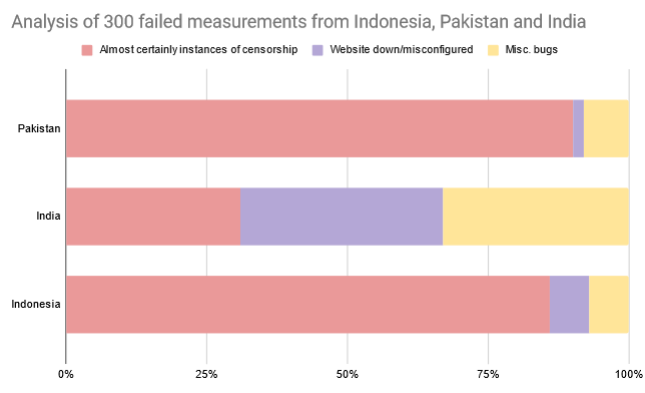

In this blog post, we manually analyse ‘failed’ OONI measurements to assess why they were classified as such, whether they are symptomatic of censorship, and whether they still carry helpful information for researchers. We focus on measurements from three countries (India, Pakistan, and Indonesia) and outline steps on how we will improve overall data quality.

* [Background](#background)

* [Methodology](#methodology)

* [Results](#results)

    * [Pakistan](#pakistan)

    * [India](#india)

    * [Indonesia](#indonesia)

    * [Overall](#overall)

* [Limitations](#limitations)

* [Conclusions and Future Work](#conclusions-and-future-work)

# Background

[Web Connectivity](https://ooni.org/nettest/web-connectivity/) is a network test that determines whether a web resource is accessible from the network where the user runs [OONI Probe](https://ooni.org/install/). To this end, Web Connectivity measures accessing the resource and compares the measurement results with another measurement performed by a control vantage point. After the measurement, OONI Probe submits a JSON document summarising its findings and the control vantage point findings to the OONI backend. In turn, the [OONI data processing pipeline](https://github.com/ooni/pipeline/) classifies all Web Connectivity measurements into four categories:

1. confirmed (instance of censorship);
2. anomaly (may be indicative of censorship);
3. ok (website/page was accessible);
4. failure. 

This blog post focuses on the fourth classification of measurements, i.e. failures. These measurements are considered ‘failed’ because the client (or control server) failed to perform a measurement – not as a result of network interference, but ostensibly due to an arbitrary and unexpected error. The two most common causes of failures are the following:

1. the control vantage point is not reachable;
2. OONI Probe encountered an unknown error when measuring.

Measurements classified as failed are not usually analysed further. While it is possible to view and retrieve ‘failed’ measurements, they are hidden by default on [OONI Explorer](https://explorer.ooni.org/).

# Methodology

1. Using the [OONI API](https://explorer.ooni.org/), retrieve the 100 most recent failed Web Connectivity measurements for three countries: India, Pakistan, and Indonesia.
2. Manually assess each measurement using [OONI Explorer](https://explorer.ooni.org/).
    1. Record the step that faced an error (DNS, TCP, HTTP, or control) and the OONI software version the client was running.
    2. Compare the error code in the client to the response received by the control server.
    3. If needed, look at the recent country-wide results for the measured URL.
    4. For each measurement, note whether it is a possible instance of censorship or not. Also note what the ideal classification for that measurement should have been.

# Results

## Pakistan 

In the set of [100 failed measurements](https://docs.google.com/spreadsheets/d/1esA8rJAY8ukbHTnVv4oNxuD9WLOyjpbf-J6TxFLdJr0/edit#gid=179922649) from Pakistan, we found:

1. 50 occurrences of an error during the HTTP step with the description:
 
 ```
 unknown_failure: Get "http://example.com/": net/http: HTTP/1.x transport connection broken: malformed HTTP status code "html>"
 ```

 In all such cases, this error was symptomatic of censorship. A middlebox is likely injecting a HTTP blockpage in a manner inconsistent with the HTTP standard, which is unrecognised by OONI clients. The control was usually successful in making a connection with the web endpoint. We have documented this [data quality issue](https://github.com/ooni/probe/issues/2411), and will be working on a fix for it, which requires us to modify OONI Probe to recognize and handle this specific error condition.
 
2. 40 occurrences of an error during the HTTPS step with the description: 
 
 ```
 unknown_failure: tls: first record does not look like a TLS handshake
 ```
 
 In all such cases, this error was symptomatic of censorship. A middlebox is likely meddling with HTTPS connections during the TLS handshake in an improper way, which is unrecognised by OONI clients. For such measurements, the control was usually successful in making a connection with the web endpoint. We have documented this [data quality issue](https://github.com/ooni/probe/issues/2410), and will be working on a fix for it, which consists of making the OONI software aware of this specific error condition. 
 
3. 8 occurrences of an error during the DNS step with the description:
 
 ```
 unknown_failure: invalid domain in DNSCache
 ```

 This error was observed only when the domain name in question had upper-case characters or otherwise seemed malformed. These measurements do not carry enough information to be classified as symptomatic of censorship; hence, we are classifying them as bugs. This error, in fact, happens because the WebConnectivity test failed to properly canonicalize mixed-case or internationalised domain names. We updated the [bug report for this error condition](https://github.com/ooni/probe/issues/1925), and also fixed this bug for the [next version](https://github.com/ooni/probe-cli/pull/1110) of Web Connectivity, which we are testing and soon making available to all OONI Probe users.
 
Two other cases were related to the target website being misconfigured. Overall, 90% of the “failed measurements” were of the first two categories and symptomatic of censorship.

## India 

In the set of 100 failed measurements for India, we found:

1. 45 instances of either of these errors in the TCP/HTTP step:
 
 ```
 unknown_failure: dial tcp [scrubbed]: connectex: An established connection was aborted by the software in your host machine.
 
 unknown_failure: read tcp [scrubbed]->[scrubbed]: wsarecv: An existing connection was forcibly closed by the remote host.
 
 unknown_failure: read tcp [scrubbed]->[scrubbed]: wsarecv: An established connection was aborted by the software in your host machine.
 
 unknown_failure: dial tcp [scrubbed]: connectex: No connection could be made because the target machine actively refused it.
 
 unknown_failure: dial tcp [scrubbed]: connect: network is unreachable
 ```
 
 These are instances of [incorrectly wrapped errors](https://github.com/ooni/probe-cli/pull/386) in Windows clients, which should be fixed in more [recent versions](https://github.com/ooni/probe-cli/releases/tag/v3.13.0) of the probe. 
 
 In 31 of these instances, the target website seems blocked in India. These errors are likely triggered by a middlebox resetting an established or in-progress connection. Hence, we classify these errors as likely censorship.
 
 In the other 14 instances, the control failed also with an error, and the website is likely not blocked, rather it may just be misconfigured or down.
 
2. 27 occurrences of an error during the HTTP step with the description:
 
 ```
 unknown_failure: Get "{{ .URL }}": stopped after 10 redirects
 ```
 
 A [likely explanation](https://github.com/ooni/probe/issues/2412) for this error is that the website is redirecting to itself, now with a cookie set. The OONI Probe is not setting this cookie in a correct way, and we end up being redirected in a loop. Finally, the probe quits after 10 redirects. In all such cases, the control server faced an error as well. The control, however, does not maintain error descriptions, making it more complex to diagnose and triage this bug. We [documented this bug](https://github.com/ooni/probe/issues/2422) and are currently working on a fix for it.

 For our purposes, the fact that the website was reached successfully indicates the absence of any network interference or censorship.
 
3. 10 instances of an error during the HTTPS step:
 
 ```
 unknown_failure: remote error: tls: unrecognized name
 ```
 
 This error indicates that the remote server does not host the website (provided in the Server Name Indication field) the client is requesting. Albeit compliant with standards, this behaviour is not recommended by [RFC 6066](https://www.rfc-editor.org/rfc/rfc6066#section-3) because “the client’s behaviour in response ... (would be) ... unpredictable”. We documented [this bug](https://github.com/ooni/probe/issues/2419) in probe#2419 and [fixed it](https://github.com/ooni/probe-cli/pull/1111) so that we can handle it in the future. Because the control also faced an error in all these cases, we classify this error as a misconfigured website case rather than as a missed opportunity to detect censorship.
 
4. 6 errors during the DNS step with either of these descriptions:
 
 ```
 unknown_failure: lookup example.com: getaddrinfow: This is usually a temporary error during hostname resolution and means that the local server did not receive a response from an authoritative server.
 ```
 
 The error string corresponds to a [Windows error](https://learn.microsoft.com/en-us/windows/win32/api/ws2tcpip/nf-ws2tcpip-getaddrinfo) emitted when the DNS resolution function times out. We fixed [this issue](https://github.com/ooni/probe-cli/pull/764) in a [recent version](https://github.com/ooni/probe-cli/releases/tag/v3.16.0) of the probe. These instances do not indicate any network interference.

5. 6 errors during the DNS step with this description:
 
 ```
 unknown_failure: lookup www.example.com on [scrubbed]: server misbehaving
 ```
 
 This error originates inside the pure Go DNS resolver implementation included into the Go standard library. The code [emits](https://github.com/golang/go/blob/go1.19.6/src/net/dnsclient_unix.go#L223) this error when the DNS server response is neither successful nor NXDOMAIN. We fixed OONI Probe to correctly map [this error](https://github.com/ooni/probe-cli/pull/513) in a [pre-release](https://github.com/ooni/probe-cli/releases/tag/v3.12.0-alpha). It is also worth mentioning that it only occurs with the [iThena-ooniprobe 1.0.0 integration](https://ooni.org/post/2021-ithena-boosts-ooni-measurement-coverage/) of OONI Probe. We will collaborate with the iThena maintainers to understand why their integration is exhibiting this specific error.
 
 Generally, this error may be indicative of censorship, because OONI Probe could properly classify the output and compare it with the control results. In our case, however, the website was down in all these instances.

6 other errors arose in the TCP/HTTP stages, which we are considering as legitimately random and caused by network conditions. 

Overall, for India, 31 out of the 100 measurements classified as ‘failures’ were indicative of network interference/censorship.

## Indonesia

In the set of [100 failed measurements from Indonesia](https://docs.google.com/spreadsheets/d/1Vo9_7lP4SctFopPKw5h2eFlpzv6NNF9Z4x9hi3cHKaw/edit#gid=84538684), there were two types of failures/errors:

1. 93 instances of an error during the DNS step with the description:
 
 ```
 unknown_failure: lookup {{ example.com }}: No address associated with hostname
 ```
 
 This is a [known Android-specific OONI Probe bug](https://github.com/ooni/probe/issues/2029), caused by the fact that the Android implementation of `getaddrinfo` (used for DNS queries) always returns the same error code regardless of the underlying error that occurred. This error code, EAI_NODATA, is the error to indicate that a DNS server responded with a valid message containing no applicable resource records, such as the one you would get when querying for IPv6 for a domain that only supports IPv4. We are still working to figure out a proper fix for it. 
 
 In most of these cases (86), the control was successful in establishing a connection to the test website, and thus these measurements indicate censorship. In a small number of cases, however, the control also had a NXDOMAIN error, and we’ve not classified those as instances of censorship.

2. 7 instances of an error during the HTTP step with the description:
 
 ```
 unknown_failure: Get "http://example.com": stopped after 10 redirects
 ```
 
 In all such cases, the control faced the same error. We already covered this error condition discussing measurements from India.
 
For Indonesia, overall, 86% of “failed measurements” are almost certainly instances of censorship.

## Overall 

The chart below combines results of the analysis of recent failed measurements from three countries (India, Pakistan and Indonesia).

{{}}

69% of the total measurements were almost certainly instances of censorship. As we can see from the chart, most measurements (84%) that are currently classified as ‘failure’ are better classified as instances of censorship or otherwise of the website being down or misconfigured. 

# Limitations

There are some limitations of this investigation. 

* First, only measurements from three countries were analysed. This sample is severely restricted, as OONI has measurements collected from over 200 countries. As we have seen, the type of errors we observed in each country may be different.
* Second, the measurements analysed are not longitudinally representative. Most measurements analysed here were collected from a period of three days in June 2022. 
* And third, the measurements only represent a subset (albeit most popular subset) of client software. Some errors depend on the client software. 

These limitations mean that the sample is not representative of failed measurements in OONI in general. Lastly, note that the results only shed light on the percentage of errors that are censorship events, but not the converse. That is, we do not know what percentage of all true censorship events are currently classified as ‘failed’ measurements. Given this lack of information, it is hard to comment on the extent to which the misclassification of censorship affects OONI data quality.

# Conclusions and Future Work

Despite the limitations of this investigation, the results point to a data quality issue. Most (84%) measurements currently classified as failure can be classified into already-existing categories of confirmed censorship, anomalies or the target website being unavailable. 

There are four clear steps for improving our data quality:

1. **Improve the quality of control observations**

 The observation on the control isn’t retained in as much detail as the client observation. For example, in the cases where the client failed to connect to an endpoint because of multiple redirects, the control did not retain whether it faced exactly that. If this was done, many measurements could be better classified as the website being down or misconfigured (which is already a category used by pipeline).
  
2. **Fix identified bugs and reprocess pipeline data on high priority**

 For countries like Pakistan, it is likely that a high percentage of censorship events are being classified as errors. These include errors about connections closed forcibly, the Android NXDOMAIN bug, and handling of non-conforming HTTP responses. We should fix such bugs on high priority (and reassess and reclassify older measurements), so that researchers have more accurate data.
 
3. **Expose ‘failed’ measurements**
 
 The [OONI Explorer](https://explorer.ooni.org/) hides “failed measurements” by default. Documentation in the [OONI Measurement Aggregation Toolkit (MAT)](https://explorer.ooni.org/chart/mat?test_name=web_connectivity&axis_x=measurement_start_day&since=2023-01-24&until=2023-02-24&time_grain=day) advises users that measurements classified as failures “should be discarded.” This means that many instances of censorship are likely to escape researchers’ notice, and some high-priority bugs are likely to escape developers’ notice. We will change the text in MAT, and explore how we can change our interfaces to allow researchers to display or [filter](https://github.com/ooni/explorer/issues/675) ‘failed’ measurements and error types.
 
4. **Periodically analyse the unknown failures**
 
 We should periodically process measurements, identify the `unknown_failure`s, and document them as bugs. We have [already started](https://github.com/ooni/probe/issues/2420) doing this.
 
This work also opens up venues for further experimentation. Our next experiments will analyse rates of failures of measurements across countries, and more closely investigate the reasons for failed measurements. Another piece of future work is to investigate whether we identify a class or multiple classes of errors that are mostly likely to be symptomatic of censorship. For instance, we may be able to classify failed measurements as (1) protocol errors or (2) network errors. While network errors may arise because of network conditions, it is likely that protocol errors are caused by middleboxes trying to disrupt the attempted connections in unexpected ways.

There are more than a billion measurements in the OONI dataset, which help researchers, journalists and civil society expose internet censorship worldwide. Given such a large dataset, data quality issues are inevitable. The OONI staff and community continue to work on improving data quality, so that the measurements contributed by OONI Probe users are even more useful in the fight against internet censorship.

*The authors are grateful to Maria Xynou and Arturo Filastò for comments and suggestions.*
