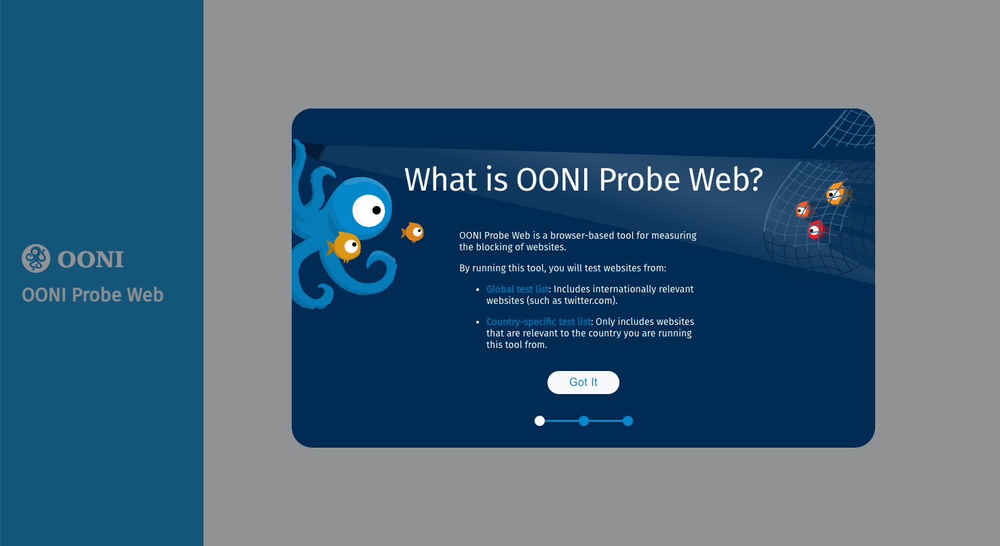
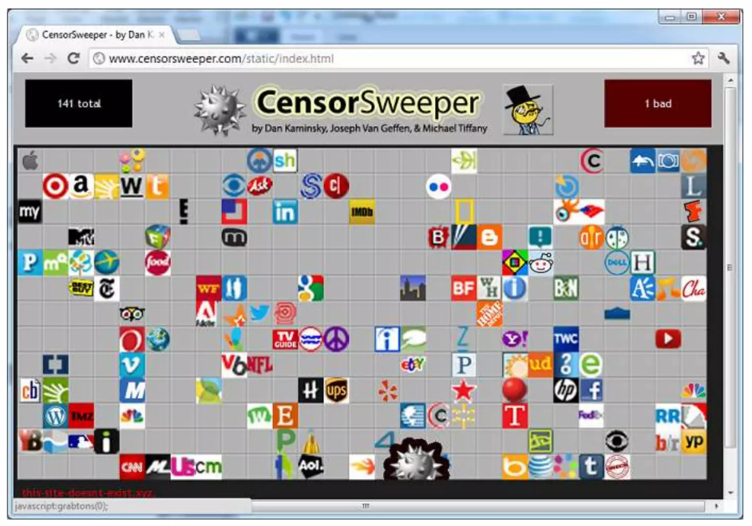

{{}}

Today, we are excited to announce the launch of **[OONI Probe Web](https://probe-web.ooni.org/)**: a new browser-based tool for measuring the blocking of websites.

We built OONI Probe Web in response to long-term community feedback, requesting a censorship measurement tool that can be run from a browser, without requiring the installation of any software. Our goal is to support rapid response efforts to emergent censorship events.

However, please note that OONI Probe Web is experimental, and what can be measured from a browser is very limited in comparison to what can be measured from an app. We therefore hope that the use of OONI Probe Web encourages further use of the [OONI Probe app](https://ooni.org/install/) for more extensive and accurate testing.



### Brief history of browser-based measurement

The idea of using a browser to carry out censorship measurements is not new. The first person who came up with this idea was [Dan Kaminsky in 2012](https://twitter.com/dakami/status/191632765412839424), who built a tool called CensorSweeper.

{{}}

This concept was further refined in 2014 by Sam Burnett and Nick Feamster in the paper: “[Encore: Lightweight Measurement of Web Censorship with Cross-Origin Requests](https://arxiv.org/abs/1410.1211)”. Their technique relied on loading assets from third-party sites and registering the “onError” handler for the load to record if the asset had successfully been loaded or if the load failed.

According to [analysis](https://not-censored.github.io/) by third-party researchers, [NetBlocks](https://netblocks.org/about) appears to use a similar methodology to carry out their testing (we cannot confirm, since NetBlocks’ tools are closed source and they don’t publish methodological details).

### OONI Probe Web methodology

The [OONI Probe Web methodology](https://github.com/ooni/spec/blob/master/nettests/ts-036-browser_web.md) uses the same idea behind CensorSweep and Encore, using a web page to issue requests to third-party websites to infer their blocking. We did, however, extend it to make use of the more modern [fetch web API](https://developer.mozilla.org/en-US/docs/Web/API/Fetch_API), which allows us to issue requests to an arbitrary endpoint bypassing the same origin policy.

One of the issues with Encore is that you need to first identify some resource which you can load in either an img, iframe, style or script tag to load while respecting the same-origin policies.

By using the fetch API, we are able to overcome these limitations and use our existing [test lists](https://github.com/citizenlab/test-lists/tree/master/lists) to measure the blocking of any website. The “trick” is to use the `fetch` API with the `no-cors` mode which allows us to issue third-party requests bypassing any Cross origin check.

### Ethics

When carrying out network measurements which involve human participants, it’s always important to take ethics into account. In the paper “[No Encore for Encore? Ethical Questions for Web-Based Censorship Measurement](https://papers.ssrn.com/sol3/papers.cfm?abstract_id=2665148)”, Arvind Narayanan and Bendert Zevenbergen argue that the type of measurements carried out by Encore raise ethical concerns. The crux of their argument is that it’s unethical that Encore was embedded in certain pages, running in the background and testing third-party sites, without adequately informing the user.

We believe that [OONI Probe Web](https://probe-web.ooni.org/) strikes the right balance because:

*   **Informed consent procedure.** During the onboarding process, users are informed about what OONI Probe Web does, what type of data is collected, which [websites](https://github.com/citizenlab/test-lists/tree/master/lists) are tested, potential [risks](https://ooni.org/about/risks/), and that test results are published as [open data](https://ooni.org/data). Through a quiz (similarly to the [OONI Probe apps](https://ooni.org/install/)), users are required to provide their consent as a prerequisite to using the tool.
*   **Tests don’t run in the background without the user’s knowledge.** Instead, [OONI Probe Web](https://probe-web.ooni.org/) users need to click “Run” to initiate tests (once they have provided informed consent).

### Limitations

While we have made some improvements to the existing state of the art of browser-based measurements using the fetch API, it’s very important to acknowledge that the testing is still much less complete and precise than what can be done with software like [OONI Probe](https://ooni.org/install/). This is because the APIs available to perform cross-origin requests in a browser are very limited, due to security constraints. It’s very unlikely for that to change, as it would result in significantly increasing the attack surface of a web browser.

In other words, it’s not possible to run advanced experiments (such as the [Web Connectivity test](https://ooni.org/nettest/web-connectivity/), available in the [OONI Probe app](https://ooni.org/install/)) from a browser, nor is it possible to run a variety of other experiments designed to measure the reachability and blocking of tools (such as the [OONI Probe tests](https://ooni.org/nettest/) for WhatsApp, Telegram, Psiphon, and many other tools).

That is to say that [OONI Probe Web](https://probe-web.ooni.org/) is by no means meant to serve as a replacement for [OONI Probe](https://ooni.org/install/), nor will it ever be.

The [experiment](https://github.com/ooni/spec/blob/master/nettests/ts-036-browser_web.md) which we run with [OONI Probe Web](https://probe-web.ooni.org/) only tells us if a site is accessible or not, but it does not provide any information on how it may be blocked. Moreover, OONI Probe Web **cannot measure server-side blocking** because failing status codes will be recorded as “success” by the test.

The [results](https://explorer.ooni.org/measurement/20230314T175753Z_browserweb_IT_30722_n1_rzLY5PIz53aSGvjf?input=https://www.facebook.com/) of an OONI Probe Web experiment look like this:

```
  "input": "https://example.com/",
  "test\_keys": {
      "result": "ok",
      "load\_time\_ms": 404.40000000596046,
      "browser": "chrome"
  }
```

The main information we get from this is that the page loaded (`ok`) and that it took a certain amount of time (e.g `404.4 ms`) to load.

#### False positives and negatives

The OONI Probe Web [testing methodology](https://github.com/ooni/spec/blob/master/nettests/ts-036-browser_web.md) is susceptible to false positives and false negatives.

Instances where we might get a **false positive** include:

1.  The site is configured in such a way to disallow cross-origin requests by setting the Cross-Origin-Resource-Policy. In our testing, we have found very few sites to implement this, but it’s still something to keep in mind when interpreting the data.
2.  If the user is running Firefox and has enabled [Strict Enhanced Tracking Protection](https://support.mozilla.org/en-US/kb/enhanced-tracking-protection-firefox-desktop#w_strict-enhanced-tracking-protection) (which is the default), all tests for social media resources will result in false positives as the requests are blocked.

We work around these two issues by:

1.  Removing sites from the analysis which we know are configured to set the Cross-Origin-Resource-Policy header.
2.  Asking Firefox users to allowlist our site in their [Strict Enhanced Tracking Protection](https://support.mozilla.org/en-US/kb/enhanced-tracking-protection-firefox-desktop#w_strict-enhanced-tracking-protection) settings.

We can only infer if a Firefox user has changed this setting by doing an analysis of the timing information in the results (requests timeout much faster when the request is denied in the browser).

**False negatives** can arise if you are testing an HTTP site and the site is serving a [block page](https://ooni.org/support/glossary#block-page). To overcome this issue, we **only test HTTPS versions of sites**. In the event of a block page, we should get a certificate error and hence record it as a failure.

### Conclusion

Due to limitations in the API available to web browsers, it’s not possible to run advanced experiments (like the OONI Probe [Web Connectivity experiment](https://ooni.org/nettest/web-connectivity/)) necessary for accurately detecting and characterizing website blocks from a browser. Therefore, [OONI Probe Web](https://probe-web.ooni.org/) should not serve as a replacement for the [OONI Probe apps](https://ooni.org/install/), but as a complementary tool.

As we just launched OONI Probe Web, it’s experimental and we still have a lot to learn and improve (particularly to reduce the ratio of false positives and false negatives).

We encourage you to run [OONI Probe Web](https://probe-web.ooni.org/) and contribute measurements, which will be published as [open data](https://ooni.org/data/) in near real-time. By analyzing these measurements, we aim to improve upon OONI Probe Web on an ongoing basis, advancing the field of browser-based censorship measurement.
