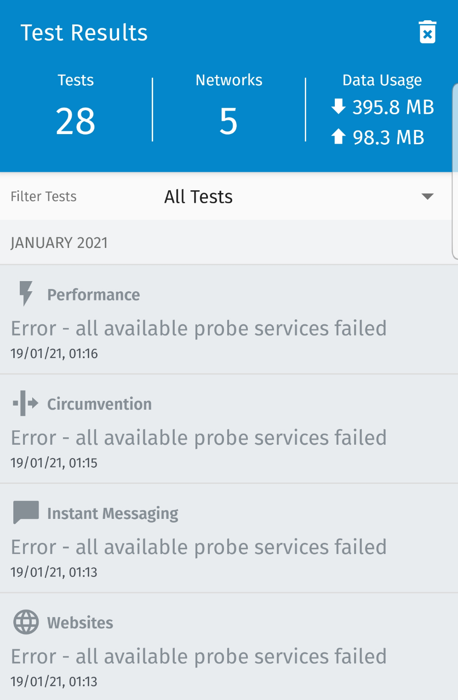
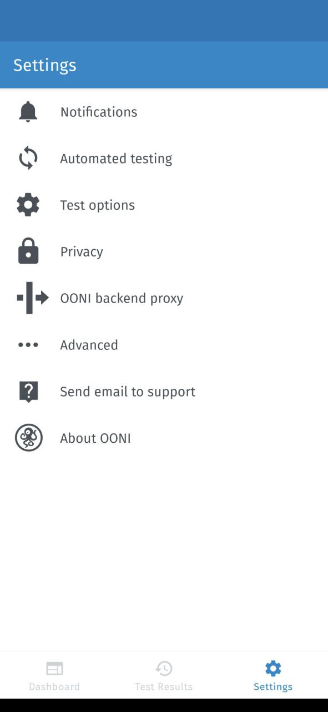
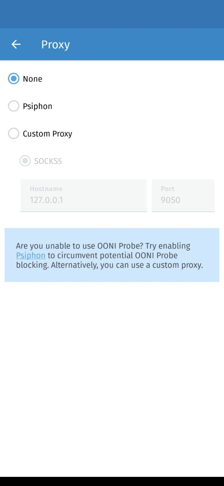

We recently made [OONI Probe Android](https://play.google.com/store/apps/details?id=org.openobservatory.ooniprobe)
more robust against accidental or deliberate blocking of our backend
services. Specifically, we implemented support for specifying a proxy
that speaks with OONI’s backend services. We also improved the build
process to influence the TLS Client Hello fingerprint, which helps with
avoiding accidental blocking.

* [Adding support for a proxy](#adding-support-for-a-proxy)

* [Changing our Android TLS fingerprint](#changing-our-android-tls-fingerprint)

* [Future improvements](#future-improvements)

# Adding support for a proxy

Since late 2020, community members have been reporting specific OONI
Probe Android failures. The symptom is that all tests fail with the “all
available probe services failed” error. This issue has been publicly
documented, for example, in
[ooni/probe#1324](https://github.com/ooni/probe/issues/1324). The
following screenshot shows what a user would see under this specific
error condition.

{{}}

The error in the above screenshot means that OONI Probe *attempted* to
contact all the public OONI API endpoints (which we call “probe
services”), but to no avail.

We first discussed implementing a proxy during the January 2020 OONI
community meeting. After this meeting, we opened
[ooni/probe#985](https://github.com/ooni/probe/issues/985) to
describe the implementation of this work. My [initial thought](https://github.com/ooni/probe/issues/985#issuecomment-683645984)
on this matter was that we could automatically start a
[Psiphon](https://psiphon.ca/) tunnel upon failure.

But after discussing this with a few advanced users (thank you!), I
refined my view on this issue. There will always be an advanced user who
knows the local context better than us. These users will already have
well-configured circumvention technology in place (e.g., an instance of
Orbot running on the same device using bridges and pluggable
transports).

These discussions and the urgency to solve the “all available probe
services failed” issue also convinced me that we wanted to provide users
with options *first*. Automatically detecting whether the ISP is
censoring the probe services would then be implemented *later*.

The result of these conversations was [a plan](https://github.com/ooni/probe/issues/1324#issuecomment-777294472)
to allow users to *choose* whether they wanted to:

* Use [Psiphon](https://psiphon.ca/); or

* Manually specify a SOCSK5 proxy; or

* Not use a proxy at all.

You can read through
[ooni/probe#985](https://github.com/ooni/probe/issues/985) and
[ooni/probe#1324](https://github.com/ooni/probe/issues/1324) for more
low-level details on what we did to make this possible. Here, for
brevity, I will just mention the two most significant moments. [On
April 3, 2021, we added support for embedding an encrypted Psiphon
config file into OONI Probe builds](https://github.com/ooni/probe/issues/1324#issuecomment-812836285).
This improvement enabled us to start a Psiphon tunnel without depending
on the probe services for fetching this configuration file. [On April
19, 2021, we discovered what was likely the root cause of the blocking](https://github.com/ooni/probe/issues/1324#issuecomment-819566311).
As I will further explain in the next section, it was the TLS Client
Hello fingerprint. We needed to change how we build OONI Probe’s support
libraries for Android devices to remediate this problem.

With these low-level details out of the way, my colleague Lorenzo and I
started working on the user interface for configuring a proxy on Android
([ooni/probe-android#423](https://github.com/ooni/probe-android/pull/423)).
A few Android users also assisted us, providing feedback, testing, and
code patches.

This work resulted in adding an **OONI backend proxy** section in the
settings of the OONI Probe app:

{{}}

By tapping on the “OONI backend proxy” row, we will direct you to
another screen, which allows you to choose which proxy you want to use:

{{}}

The default (`None`) is that no proxy is being used. If you choose
`Psiphon`, OONI Probe will create a [Psiphon](https://psiphon.ca/)
tunnel using the encrypted configuration file. If you select `Custom`,
you can set the hostname and port of a SOCKS5 proxy. I have filled the
hostname and port with `127.0.0.1` and `9050` in the above
screenshot. These are the settings you can use if you have an
[Orbot](https://play.google.com/store/apps/details?id=org.torproject.android)
instance running on your device (or tor inside Termux). Instead, if you
are running [Tor Browser](https://play.google.com/store/apps/details?id=org.torproject.torbrowser),
the IP address is `127.0.0.1` and the port is `9150`.

# Changing our Android TLS fingerprint

In mid-April 2021, we discovered the likely cause of blocking. V2Ray
developers previously documented this issue in
[v2fly/v2ray-core#557](https://github.com/v2fly/v2ray-core/issues/557).

The root cause is that the TLS Client Hello generated by Golang on
Android devices changes depending on Golang’s understanding of the
hardware capabilities. Golang’s TLS library [uses a hardware
implementation of AES when possible](https://github.com/golang/go/blob/go1.16.4/src/crypto/aes/cipher_asm.go#L30).
Otherwise, it falls back to AES code written in pure Go. According to
[the official docs](https://github.com/golang/go/blob/go1.16.4/src/crypto/aes/const.go#L8),
such code is not constant over time. Probably, for this reason, when
Golang thinks that there is no hardware support for AES, it [reorders
the preferred cipher list in the Client Hello](https://github.com/golang/go/blob/go1.16.4/src/crypto/tls/common.go#L1449).
This reordering aims to significantly reduce the probability that the
server will select AES ciphers by moving such ciphers towards the bottom
of the list.

As documented by V2Ray developers in the aforementioned
[issue](https://github.com/v2fly/v2ray-core/issues/557), some ISPs
only allow [specific TLS Client Hello fingerprinting](https://github.com/v2fly/v2ray-core/issues/557#issuecomment-775004211).
When AES algorithms sit at the top of the preferred ciphers list, TLS
works. Instead, when they are near the bottom, TLS fails.

We noticed this issue when debugging OONI Probe Android on one such
network. Very interestingly, the symptom was that a debug build of our
app was working. At the same time, a release build with “all the
available probe services" [failed](https://github.com/ooni/probe/issues/1444). Our analysis of
the problem is documented more in detail in the
[ooni/probe#1444](https://github.com/ooni/probe/issues/1444#issue-854499026)
issue. Golang fails to read the hardware capabilities because
`/proc/self/auxv` is not readable on Android in release mode.

(At the moment of writing this blog post, it is unclear whether
`/proc/self/auxv` is not readable on all arm64 Android devices or
whether we were just lucky with our devices.)

To fix this issue for OONI Probe, we [forked Golang](https://github.com/ooni/go). We [modified](https://github.com/ooni/go/commit/62177de2b42c35bee645909cc074a2b6c4b67d5a) the `src/runtime`
to call the C library’s `getauxval` function to get the correct
hardware information. This patch seems a bit hacky and does not necessarily feel right in
general. Golang’s `src/runtime` should not depend on the C library.
Still, our solution works for us because we need to link the C library
on Android anyway.

When reviewing the diff, my colleague Arturo suggested that a better way
to fix this issue is patching the
[golang/mobile](https://github.com/golang/mobile) repository instead.
Patching [golang/mobile](https://github.com/golang/mobile) feels like
a more proper solution for this problem, but we have not had time to
explore it yet.

For now, [our `mk` build script uses ooni/go when building for Android](https://github.com/ooni/probe-cli/blob/v3.10.0-beta.3/mk#L421).
While this may not be the best solution, it nonetheless provides us a
way to ship this crucial fix to users within a reasonable time frame.

# Future improvements

Regarding the proxy functionality, we are also planning on implementing
proxy support for OONI Probe iOS
([ooni/probe#1470](https://github.com/ooni/probe/issues/1470)), the
OONI Probe Command Line Interface
([ooni/probe#1488](https://github.com/ooni/probe/issues/1488)), and
the OONI Probe desktop app
([ooni/probe#1489](https://github.com/ooni/probe/issues/1489)). We
chose to prioritize Android because Android users have been impacted by
this issue the most, as far as we know. If you see the “all available
probe services failed” error on other platforms (beyond Android), please [get in touch](https://ooni.org/about/#contact)! (So far, we have received a
single report of a similar problem occurring on iOS. If you also see
this issue, please let us know by commenting on the
[ooni/probe#1491](https://github.com/ooni/probe/issues/1491) issue.)

We are also planning on enabling users to choose HTTP proxies. We are
considering the possibility of enabling users to specify a username and
a password for SOCKS5/HTTP proxies. We are also discussing the option of
passing Psiphon a downstream SOCKS5 proxy with optional authentication.
We documented these future changes in
[ooni/probe#1465](https://github.com/ooni/probe/issues/1465). If you
have specific proxy needs, please let us know (perhaps on our
[Slack channel](https://slack.openobservatory.org/)), and we will plan for them!

Regarding the fix for Golang, we need to figure out whether we can fix
the issue inside of the
[golang/mobile](https://github.com/golang/mobile) repository
([ooni/probe#1486](https://github.com/ooni/probe/issues/1486)). We
also need to explore what happens on older arm devices
([ooni/probe#1487](https://github.com/ooni/probe/issues/1487)). If
you have insight on how we can fix the
[golang/mobile](https://github.com/golang/mobile) issue or ways to
test old Android arm-based devices, please ping us!
