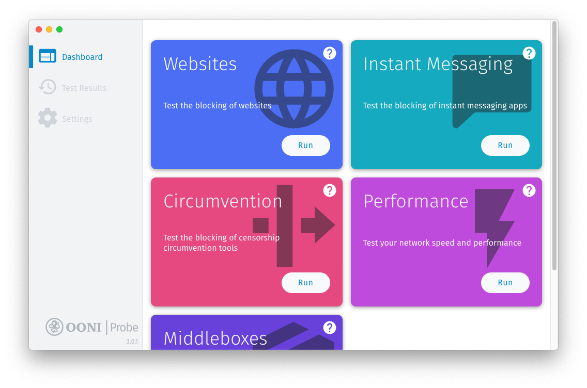
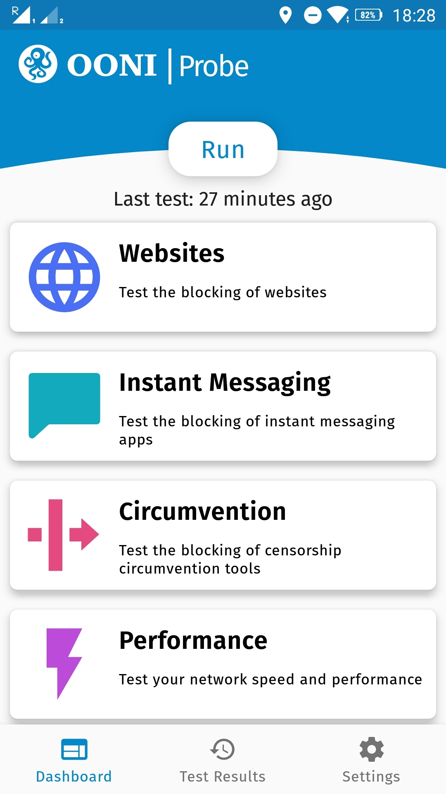
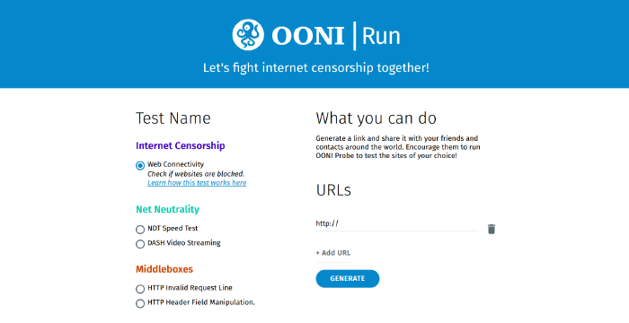
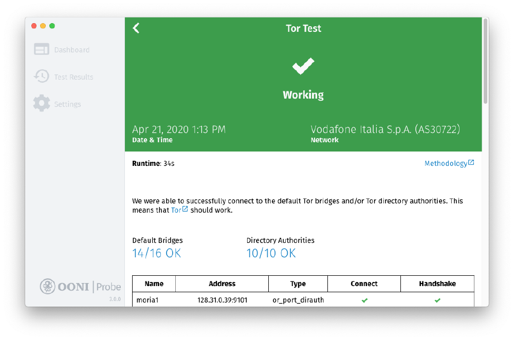
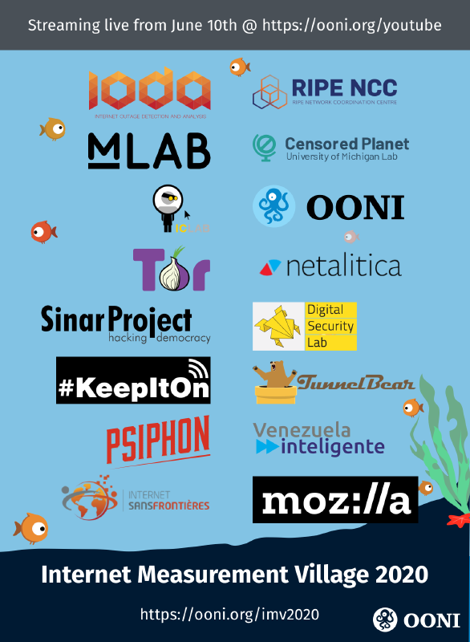
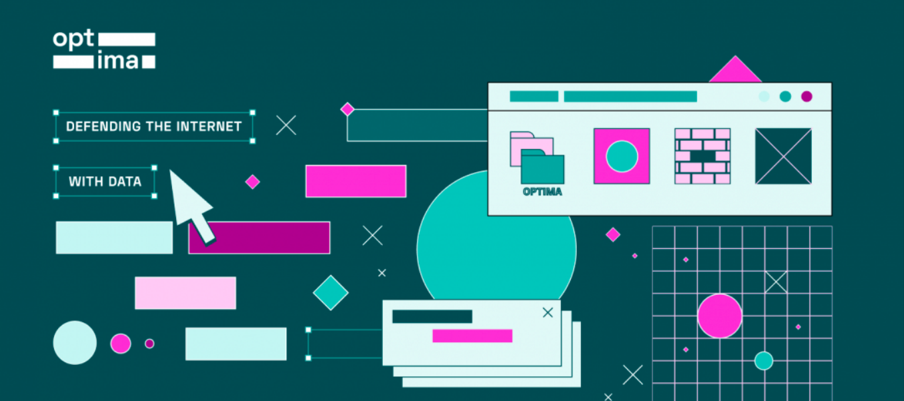
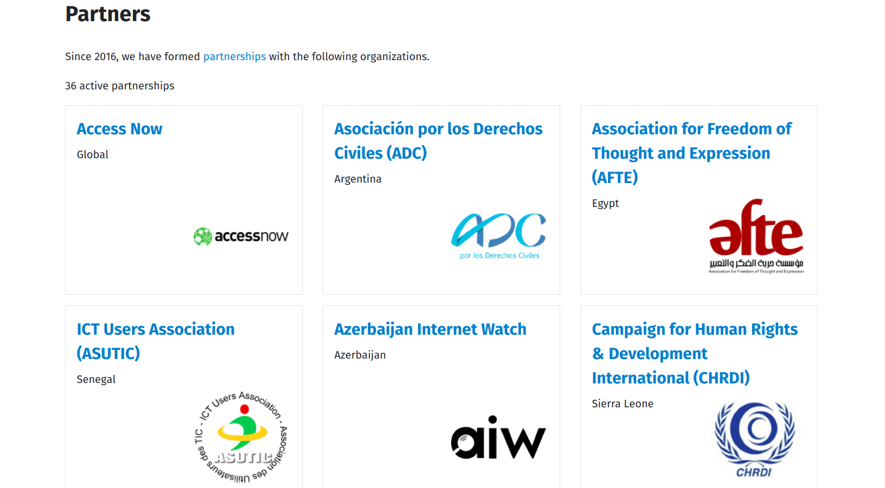

In light of the global [COVID-19 pandemic](https://www.who.int/emergencies/diseases/novel-coronavirus-2019),
2020 has been a challenging year for everyone.

Yet, several exciting things happened in the censorship measurement
world. In this post, we share some OONI highlights from 2020, as well as
some upcoming OONI projects for 2021!

* [OONI Probe](#ooni-probe)

    * [New OONI Probe Desktop App for Windows and macOS](#new-ooni-probe-desktop-app-for-windows-and-macos)

    * [New OONI Probe measurement engine](#new-ooni-probe-measurement-engine)

    * [OONI Run usability study](#ooni-run-usability-study)

* [Measurement methodologies]

    * [New circumvention tool tests](#new-circumvention-tool-tests)

    * [New experiments](#new-experiments)

* [Smart URL list system](#smart-url-list-system)

* [Real-time analysis and publication of global measurements](#real-time-analysis-and-publication-of-global-measurements)

* [Research reports](#research-reports)

* [Community](#community)

    * [Internet Measurement Village 2020](#internet-measurement-village-2020)

    * [Internet Shutdown Measurement Training for Advocates](#internet-shutdown-measurement-training-for-advocates)

    * [OONI partnerships](#ooni-partnerships)

    * [OONI workshops and presentations](#ooni-workshops-and-presentations)

* [OONI-verse](#ooniverse)

* [2021](#2021)

# OONI Probe

## New OONI Probe Desktop App for Windows and macOS

{{}}

We launched an [OONI Probe desktop app](https://ooni.org/install/desktop) for macOS and Windows!

With our [new desktop app](https://ooni.org/post/2020-ooni-probe-desktop-app/), you can
easily install OONI Probe and measure network performance and various
forms of internet censorship with the click of a button.

**This is a major milestone because this is the first time that OONI
Probe is officially supported on Windows.**

Windows is not only the [most widely used desktop operating system](https://gs.statcounter.com/os-market-share) in the world, but
it is also commonly used by human rights defenders around the world.
Supporting OONI Probe on Windows has therefore been a popular
[community request](https://ooni.org/post/ooni-partner-gathering-2017/#challenges-and-needs)
over the last years, and we are thrilled that this has now been
achieved!

With the new [OONI Probe desktop app](https://ooni.org/install/desktop), you can run all of the same
[tests](https://ooni.org/nettest/) included in the [OONI Probe mobile app](https://ooni.org/install/mobile). As soon as you run tests, you
will immediately have access to the results -- and relevant network
measurement data that can potentially serve as *evidence* of internet
censorship -- in your app.

Thanks to the [Localization Lab](https://www.localizationlab.org/)
community, the OONI Probe desktop app has been
[translated](https://www.transifex.com/otf/ooniprobe/) to the
following **17 languages**: *Chinese, Russian, Spanish, Catalan, French,
Hindi, Indonesian, Thai, Turkish, Italian, Portuguese, German, Romanian,
Slovak, Albanian, Icelandic, and Greek*. The app has also been
translated to Arabic and Farsi, but those translations will be shipped
once we’ve added RTL support.

During 2020, we also revamped the design of the [OONI Probe mobile app](https://ooni.org/install/mobile) dashboard.

{{}}

As part of our ongoing efforts to ensure feature parity and a seamless
experience between the OONI Probe mobile and desktop apps, we aim to
ship a new OONI Probe desktop release in early 2021 with the same new
dashboard design as OONI Probe mobile.

Warm thanks to the [Localization Lab](https://www.localizationlab.org/) community for having
[translated](https://www.transifex.com/otf/ooniprobe/) the OONI Probe
mobile app to the following **20 languages**: *Arabic, Farsi, Chinese
(simplified), Chinese (traditional), Russian, Spanish, French,
Portuguese, Hindi, Thai, Indonesian, Turkish, Italian, Greek, Catalan,
Icelandic, German, Slovak, Romanian, and Albanian*.

## New OONI Probe measurement engine

The OONI Probe apps now *rely entirely* on our new golang [OONI Probe measurement engine](https://github.com/ooni/probe-engine)!

Previously, the OONI Probe mobile app was powered by the C++
[Measurement Kit](https://github.com/measurement-kit/measurement-kit)
library. Now, both the OONI Probe
[mobile](https://ooni.org/install/mobile) and
[desktop](https://ooni.org/install/desktop) apps are powered entirely
by our new [Go engine](https://github.com/ooni/probe-engine) (and we
[re-wrote](https://github.com/ooni/probe-engine/tree/master/experiment)
all of the OONI Probe tests in Go).

**This is an important milestone because it means that we can write (and
integrate) new network measurement tests faster and with greater
confidence in code quality, enhancing our ability to more rapidly
respond to emergent censorship events around the world.**

Our new [Go engine](https://github.com/ooni/probe-engine) is also
easier for us to maintain (since it enables us to share more code
between the engine and the mobile apps), it’s easier for community
members to review and contribute to our codebase (and they have already
contributed many new tests!), improving the overall robustness and
sustainability of our apps and experiments.

## OONI Run usability study

{{}}

To support decentralized censorship measurement efforts and promote
rapid response to emergent censorship events, we carried out a
[usability study](https://ooni.org/post/2020-06-09-ooni-run-usability-study-findings/)
to improve [OONI Run](https://run.ooni.io/).

OONI Run is a platform that you can use to [generate mobile deep links
and widget code to coordinate OONI Probe testing](https://ooni.org/post/ooni-run/). This is especially used by
community members worldwide to coordinate the testing of specific
websites during political events (such as elections and protests), when
censorship events tend to emerge.

To enable community members to more effectively use [OONI Run](https://run.ooni.io/), we researched its limitations and collected
structured community feedback through a usability study, which involved
a [survey and in-depth interviews](https://ooni.org/post/2020-ooni-run-survey-and-interviews/).

We documented all of the OONI Run usability study findings in a
[report](https://ooni.org/post/2020-06-09-ooni-run-usability-study-findings/),
and plan to release an improved version of OONI Run in 2021!

# Measurement methodologies

## New circumvention tool tests

{{}}

When censorship events emerge, circumvention tools [often get blocked](https://ooni.org/reports/) in many countries (likely as part
of attempts to limit censorship circumvention).

We therefore developed and released [new circumvention tool tests](https://ooni.org/post/2020-ooni-probe-desktop-app/#new-circumvention-tool-tests)
to enable the OONI community to check the reachability of specific
circumvention tools: [Tor](https://www.torproject.org/) and
[Psiphon](https://psiphon.ca/). We chose these tools because they’re
open source, commonly used by human rights defenders in censored
environments, and we were able to collaborate directly with the
developers of these tools. We had also [previously developed](https://github.com/ooni/spec/tree/master/nettests) Tor and
Psiphon tests, and so these new tests build and expand upon our
[previous methodologies](https://ooni.org/nettest/).

Through the OONI Probe [mobile](https://ooni.org/install/mobile) and
[desktop](https://ooni.org/install/desktop) apps, you can now run the
following new tests:

* **[Tor test](https://ooni.org/nettest/tor/).** Checks whether
[Tor](https://www.torproject.org/) works by measuring the
reachability of a set of services (Tor directory authorities, OR
port, OR port of directory authorities, and obfs4) and by
evaluating whether they can be used in the tested network.

* **[Psiphon test](https://ooni.org/nettest/psiphon/).** Checks
whether the [Psiphon app](https://psiphon.ca/) works by
attempting to bootstrap, create, and use a Psiphon tunnel to fetch
a webpage from the internet.

As soon as you run these tests, you will immediately have access to the
results in your OONI Probe app (along with the relevant network
measurement data), and (unless if you have opted-out) these test results
will be [openly published in real-time](https://ooni.org/data/). You
can therefore refer to OONI data to track whether
[Tor](https://explorer.ooni.org/search?until=2020-12-20&since=2020-11-19&test_name=tor)
and
[Psiphon](https://explorer.ooni.org/search?until=2020-12-20&since=2020-11-19&test_name=psiphon)
work around the world.

## New experiments

Censorship measurement is like a cat and mouse game.

As internet censorship becomes more sophisticated, the need to improve
and expand upon our censorship measurement capabilities increases. We
therefore work continuously on improving our censorship measurement
methodologies, and the types of tests that we prioritize on developing
are informed by emerging censorship trends and community needs.

Throughout 2020, we developed the following new experiments:

* [SNI blocking experiment](https://github.com/ooni/probe-engine/tree/master/experiment/sniblocking)

* [STUN reachability test](https://github.com/ooni/probe-engine/tree/master/experiment/stunreachability)

* DNS over TLS (DoT) experiment (included in [DNS check](https://github.com/ooni/probe-engine/tree/master/experiment/dnscheck))

* DNS over HTTPS (DoH) experiment (included in [DNS check](https://github.com/ooni/probe-engine/tree/master/experiment/dnscheck))

* [URL getter](https://github.com/ooni/probe-engine/tree/master/experiment/urlgetter) (research tool)

We are grateful to community members who volunteered to run these
experiments in censored environments, enabling us to check whether these
tests work as expected and to improve upon them.

We are also *thrilled* that community members contributed *many* new
network measurement tests for OONI Probe! Now that the OONI Probe apps
are powered by our new [Go engine](https://github.com/ooni/probe-engine/), integrating new tests
has become much easier (in comparison to the C++ [Measurement Kit](https://github.com/measurement-kit/measurement-kit) library that
OONI Probe previously relied on).

New tests contributed by community members include:

* [RiseupVPN blocking test](https://github.com/ooni/probe-engine/tree/master/experiment/riseupvpn)

* [DNS check](https://github.com/ooni/probe-engine/tree/master/experiment/dnscheck)

* [HTTP host header experiment](https://github.com/ooni/probe-engine/tree/master/experiment/httphostheader)

* [HTTP/3 experiment](https://github.com/ooni/probe-engine/commit/bfde9a5205d4b384f1b5cfc57aeb8abe04de7946#diff-8ffe2f06c79d27fecf43a54ee25af248f9b82b14941b322997c85d4a51a0b818)

* [QUIC experiment](https://github.com/ooni/probe-engine/commit/bfde9a5205d4b384f1b5cfc57aeb8abe04de7946#diff-8ffe2f06c79d27fecf43a54ee25af248f9b82b14941b322997c85d4a51a0b818)

We are extremely grateful for these contributions, and we aim to ship
these new experiments as part of the OONI Probe apps in 2021!

# Smart URL list system

Website blocking remains an ongoing - and increasingly worsening -
[problem](https://ooni.org/reports/), often affecting marginalized
communities the most.

To improve the monitoring of website censorship around the world, we aim
to create a **smart URL list system** which will help ensure “smarter”
testing of websites. More specifically, we will prioritize the testing
of websites that are of public interest, whose blocking would have a
greater impact on human rights, and which are frequently blocked (such
as social media services). To help ensure the safety of the tested URLs,
we will continue to run them through the usual [Citizen Lab URL review process on GitHub](https://github.com/citizenlab/test-lists).

“Smarter” URL testing will enable us – and the broader internet freedom
community – to more effectively [monitor](https://ooni.org/data/),
analyze, and respond to cases of website censorship around the world.

Throughout 2020, we worked on **building OONI’s smart URL list system**.
We started off by creating a [policy for URL prioritization](https://ooni.org/post/ooni-smart-url-list-system/).
The goal of this
[policy](https://ooni.org/post/policy-url-prioritization/ooni-policy-url-prioritization.pdf)
is to determine the criteria based on which the OONI Probe testing of
certain types of URLs will be prioritized over others. Through URL
prioritization, we aim to optimize the value of collected measurements,
ensure regular testing of the same URLs for consistency, ensure that the
tested URLs are relevant to OONI Probe users, and to improve the
monitoring of website censorship globally.

We added [backend support](https://github.com/ooni/api/pull/192) for
URL prioritization based on the [Citizen Lab test list categories](https://github.com/citizenlab/test-lists/blob/master/lists/00-LEGEND-new_category_codes.csv),
as well as for the testing of specific URLs (included in the [Citizen Lab test lists](https://github.com/citizenlab/test-lists/tree/master/lists)). To
help increase testing coverage, we [added support](https://github.com/ooni/probe/issues/1208) to the [OONI Probe mobile app](https://ooni.org/install/mobile) for configuring push
notifications to solicit testing, and so that OONI Probe mobile app
users can receive push notifications and run experiments. This will be
particularly useful during emergent censorship events when fast
coordination of targeted URL testing is crucial.

To ensure that the measurements are more actionable, we developed [data analysis capabilities](https://github.com/ooni/backend/issues/402)
aimed at examining results from a website-centric perspective. To
present measurements, we
[created](https://github.com/ooni/explorer/pull/475) an [initial version of a frontend](https://explorer.ooni.org/experimental/website)
to present results on [OONI Explorer](https://explorer.ooni.org/) in a
website-centric way, and we made progress on creating relevant [user accounts](https://github.com/ooni/explorer/issues/388).

We have completed most work towards building a smart URL list system and
we aim to release it in 2021!

# Real-time analysis and publication of global measurements

{{}}

Starting from November 2019, we are analyzing and [openly publishing OONI measurements](https://ooni.org/data/) collected from around the
world within seconds!

Our new [fastpath pipeline](https://github.com/ooni/pipeline/pull/213)
made the real-time analysis and publication of global OONI measurements
possible. Throughout 2020, we made significant progress on further
advancing our data analysis capabilities and improving our server
infrastructure.

We replaced the batch OONI data processing pipeline entirely with our
new [fastpath pipeline](https://github.com/ooni/pipeline), we [built a new OONI PostgreSQL metaDB](https://github.com/ooni/backend/issues/322) (powered by the
latest version of PostgreSQL 11), we [refactored the OONI API codebase](https://github.com/ooni/backend/issues/437) to use the
fastpath pipeline, we [implemented a fastpath pipeline-based API](https://github.com/ooni/backend/issues/442) to support [OONI Explorer](https://explorer.ooni.org/), and we [improved our infrastructure](https://github.com/ooni/backend/issues/439) by
migrating to new servers and including better monitoring and alerting.

All of our [backend work](https://github.com/ooni/backend) not only
ensured the robustness of [real-time analysis](https://github.com/ooni/pipeline) and publication of OONI
measurements, but it also *significantly boosted the performance* of
[OONI Explorer](https://explorer.ooni.org/): the web interface that
human rights defenders rely on to search through OONI measurements and
track censorship events worldwide.

Throughout the summer of 2020, we had the opportunity to host a great
[Google Summer of Code (GSoC)](https://summerofcode.withgoogle.com/)
student (Krona Emmanuel) from Pakistan, who
[worked](https://gist.github.com/kronaemmanuel/ae1ebafa039a3361fb422462109ae035)
on making improvements related to [social media sharing on OONI Explorer](https://community.torproject.org/gsoc/ooni-explorer-findings/).
We are very grateful for the great work Krona accomplished throughout
his GSoC internship with OONI!

# Research reports

In collaboration with community members, we published the following 11
[research reports](https://ooni.org/reports/) documenting internet
censorship events around the world:

* [Tanzania blocks social media (and Tor?) on election day](https://ooni.org/post/2020-tanzania-blocks-social-media-tor-election-day/)

* [Belarus protests: From internet outages to pervasive website censorship](https://ooni.org/post/2020-belarus-internet-outages-website-censorship/)

* [Measurement observations on network performance during the COVID-19 pandemic in Northern Italy](https://ooni.org/post/2020-network-performance-covid19-italy/)

* [Investigating TLS blocking in India](https://ooni.org/post/2020-tls-blocking-india/)

* [DNS over TLS blocked in Iran](https://ooni.org/post/2020-iran-dot/)

* [Evaluating OONI’s New Measurement Engine in the Context of the Blocking of Women on Web in Spain](https://ooni.org/post/2020-engine-evaluation-spain/)

* [Burundi blocks social media amid 2020 general election](https://ooni.org/post/2020-burundi-blocks-social-media-amid-election/)

* [Myanmar blocks “fake news” websites amid COVID-19 pandemic](https://ooni.org/post/2020-myanmar-blocks-websites-amid-covid19/)

* [Measuring SNI based blocking in Iran](https://ooni.org/post/2020-iran-sni-blocking/)

* [Iran temporarily blocks the Farsi language edition of Wikipedia](https://ooni.org/post/2020-iran-blocks-farsi-wikipedia/)

* [Togo: Instant messaging apps blocked amid 2020 presidential election](https://ooni.org/post/2020-togo-blocks-instant-messaging-apps/)

We also had the opportunity to serve as the host organization for
[OTF](https://www.opentech.fund/) Information Controls Fellow,
[Chinmayi SK](https://www.opentech.fund/about/people/chinmayi-sk/),
who researched internet censorship in Manipur, India (through the use of
[OONI Probe](https://ooni.org/install/) and [OONI data](https://ooni.org/data/)) and its impact on womxn in the region.
We published Chinmayi’s [research report](https://ooni.org/post/2020-those-unspoken-thoughts-otf-fellow-report/),
“*Those Unspoken Thoughts: A study of censorship and media freedom in
Manipur, India*”, on our website.

# Community

## Internet Measurement Village (IMV) 2020

{{}}

Between 10th June 2020 to 3rd July 2020, we organized and hosted the
[Internet Measurement Village (IMV) 2020](https://ooni.org/post/2020-internet-measurement-village/), an
online community event aimed at sharing skills, knowledge, and resources
on internet measurement in defense of a free and open internet.

As part of the Internet Measurement Village (IMV), we [live-streamed a total of 18 presentations](https://ooni.org/post/2020-internet-measurement-village/#schedule):
**one presentation almost every day over four weeks**.

The presentations featured:

* Internet measurement projects ([OONI](https://www.youtube.com/watch?v=SES8PAeQvvs), [IODA](https://www.youtube.com/watch?v=2tBzCgjhTP0), [RIPE](https://www.youtube.com/watch?v=-3laOL434co), [M-Lab](https://www.youtube.com/watch?v=cjUv93GqP5I), [Censored Planet](https://www.youtube.com/watch?v=5IgnvR42cMQ), [ICLab](https://www.youtube.com/watch?v=6iJ7KczFArw))

* Local/regional censorship measurement projects (such as those in [Venezuela](https://www.youtube.com/watch?v=XNEaXcSUXnI), [Southeast Asia](https://www.youtube.com/watch?v=AORNoRhgVmM), and [Ukraine](https://www.youtube.com/watch?v=nIn-r6JxdEM))

* Advocacy efforts fighting internet shutdowns (in [West Africa](https://www.youtube.com/watch?v=mWOFEOG6GBc) and the [#KeepItOn campaign](https://www.youtube.com/watch?v=OEI_HqRLo50))

* Censorship circumvention tool projects ([Tor](https://www.youtube.com/watch?v=g6xEfNHkFKY), [Psiphon](https://www.youtube.com/watch?v=McMkChIx_as), [Geneva](https://www.youtube.com/watch?v=ksojSRFLbBM), [TunnelBear](https://www.youtube.com/watch?v=CI5Ji3UgHf8))

To encourage participation during the IMV, we hosted a live chat on
several platforms ([YouTube chat](https://www.youtube.com/c/OONIorg),
[Slack](https://slack.ooni.org/), IRC) and, on average, each presenter
[received around 10 quality questions](https://pad.riseup.net/p/imv2020-keep) from the viewers
which were addressed as part of the stream Q/A.

As all the live-streamed sessions of the IMV 2020 will continue to live
on the [OONI YouTube channel](https://www.youtube.com/c/OONIorg), we
hope that these [recordings](https://ooni.org/post/2020-imv-slides-recordings/) will
serve as a valuable resource for the internet freedom community.

{{}}

## Internet Shutdown Measurement Training for Advocates

{{}}

Between 12th October 2020 to 20th November 2020, we served as the lead
partner on Internews’ [Internet Shutdown Measurement training program for human rights defenders in Sub-Saharan Africa](https://internews.org/call-applications-internet-shutdown-measurements-advocates).

During this 6-week training program, we had the opportunity to work with
inspiring human rights defenders from across Africa, learn from them,
and engage them with censorship measurement methodologies. Our goal was
to train human rights defenders to use measurement tools and datasets as
part of their research and advocacy efforts.

More specifically, we created video webinars and led the trainings for
the following 2 modules:

* Introduction to Network Measurement

* Detecting Blocking of Websites and Applications ([OONI](https://ooni.org/))

We also helped facilitate the following modules:

* Detecting Internet Blackouts ([IODA](https://ioda.caida.org/))

* Measuring Internet Performance ([M-Lab](https://www.measurementlab.net/))

* Contextualizing Your Data: Using Local Insight and Qualitative Research

* Using Measurements in Advocacy ([Access Now](https://www.accessnow.org/))

Throughout the training program, we provided mentorship, created and
reviewed homework assignments, and supported participants with the
development of their research and advocacy projects.

## OONI partnerships

{{}}

Since 2016, we have had the opportunity to form [partnerships](https://ooni.org/get-involved/partnership-program/)
with **36 organizations** from around the world on the study of internet
censorship.

We published an **[OONI Partners page](https://ooni.org/partners)** on
our website to feature these organizations, highlight their important
work, and share the research projects we have collaborated on.

Throughout 2020, we formed several new partnerships, and we continued to
support our partners primarily through the coordination of censorship
measurement efforts, reviewing and updating [test lists](https://github.com/citizenlab/test-lists), and by providing OONI
data analysis support.

## OONI workshops and presentations

In light of the [COVID-19 pandemic](https://www.who.int/emergencies/diseases/novel-coronavirus-2019),
most conferences were hosted online this year (or cancelled). Online
events though provided a great opportunity to meet and form
collaborations with people who we may have not otherwise met in person
(because they previously did not have the opportunity to travel to
attend such events).

Throughout 2020, we presented OONI at the following conferences and
events:

* **Internet Governance Forum (IGF) 2020.** We hosted an [OONI e-booth](https://www.intgovforum.org/multilingual/content/igf-2020-village-booth-60-open-observatory-of-network-interference-ooni)
to engage policy researchers and advocates with OONI’s censorship
measurement tools and dataset, address questions, and receive
community feedback (through live consultations). We briefly
presented OONI during the [IGF Village](https://www.intgovforum.org/multilingual/content/igf-2020-village)
virtual tours.

* **State of the Onion 2020.** During the Tor Project’s annual [State of the Onion 2020](https://blog.torproject.org/state-of-the-onion-2020), we
[shared OONI highlights from 2020](https://www.youtube.com/watch?v=IyWyTypRGWQ), as well as
upcoming OONI projects for 2021.

* **Internet Shutdown Measurement Training for Advocates in Sub-Saharan Africa.** We presented OONI as part of the module on
“Detecting Blocking of Websites and Applications”, and we also
facilitated the module on “Introduction to Network Measurement”.

* **Arusha Women School of Internet Governance (AruWSIG) 2020.** We
facilitated an OONI workshop (“Measuring internet censorship with
OONI Probe”) at the [Arusha Women School of Internet Governance (AruWSIG)](https://www.ksgen.or.tz/aruwsig-2020/) -- an annual
event in Tanzania for women human rights defenders and
researchers.

* **Tor PrivChat.** We participated in the [Tor Project’s PrivChat Chapter #2 panel](https://www.torproject.org/privchat/chapter-2/) on “*the
Good, the Bad, and the Ugly of Censorship Circumvention*”, where we [discussed](https://www.youtube.com/watch?v=aOOChyMCZH4) OONI for censorship measurement and the challenges around censorship circumvention.

* **NetGain Partnership.** We participated in the [NetGain Partnership webinar](https://www.netgainpartnership.org/events/covid19/global-infrastructure)
titled “*Surging Demand and the Global Internet Infrastructure*”,
where we presented OONI’s work and discussed how increased
internet use during the COVID-19 pandemic was correlated with
decreased network performance.

* **Internet Measurement Village 2020.** We organized and hosted the
online [Internet Measurement Village 2020](https://ooni.org/post/2020-internet-measurement-village/),
where we [presented OONI](https://www.youtube.com/watch?v=SES8PAeQvvs).

* **RightsCon Online 2020.** Along with [CAIDA](https://www.caida.org/) researchers, we facilitated the
[workshop](https://www.rightscon.org/program-2020/) “*Investigating internet shutdowns with open data*” with the goal
of introducing human rights defenders to OONI’s measurement tools
and dataset. We also served on the [RightsCon Online Program Committee](https://www.rightscon.org/program-2020/), which
involved reviewing session proposals and providing advice for the
“Network Connectivity and Internet Shutdowns” track.

* **IFF Glitter Meetup.** We were invited to [discuss](https://internetfreedomfestival.org/wiki/index.php/April_30_2020_GM#Conversation_Topic:_OONI)
the [OONI Probe desktop app launch](https://ooni.org/post/2020-ooni-probe-desktop-app/) with
the internet freedom community.

* **Nexa Center for Internet and Society.** We [presented OONI](https://nexa.polito.it/lunch-75) and discussed censorship
findings from 2019 at the [Nexa Center for Internet and Society](https://nexa.polito.it/) in Turin, Italy.

We also discussed OONI’s censorship measurement tools as part of the
following podcasts:

* **Kill Switch Podcast.** We [discussed](https://player.captivate.fm/episode/61ad48c6-c67b-42ec-b8ca-9191915ec746)
OONI’s censorship measurement methods and role in the global [KeepItOn campaign](https://www.accessnow.org/keepiton/)
(fighting internet shutdowns) in [Access Now](https://www.accessnow.org/)’s [Kill Switch Podcast](https://www.volume.africa/kill-switch).

* **Clean Insights Symposium Extraordinaire.** We presented OONI and [discussed](https://guardianproject.info/podcast/2020/cleaninsights-panel-ooni.html)
how human rights defenders can make use of OONI data during the [Guardian Project](https://guardianproject.info/)’s podcast.

On 15th December 2020, we attended Internews’
[workshop](https://www.eventbrite.com/e/building-capacity-for-internet-shutdown-advocacy-workshop-report-launch-tickets-130455334417),
“*Building capacity for internet shutdown advocacy: Community needs
assessment*”, where we facilitated the discussion on community needs
around censorship measurement data. This workshop builds upon Internews’
[study](https://static1.squarespace.com/static/5a9efdd2f2e6b149480187ea/t/5fbd37cda282d931e4d38c91/1606236110691/Optima+-+Needs+Assessment+Report+2020.pdf)
which found that the vast majority of advocates reported that (out of
several network measurement tools) they are most familiar with (and have
experience using) [OONI Probe](https://ooni.org/install/). The
community feedback collected through this workshop will help inform the
development and improvement of our work.

# OONI-verse

In 2020, the OONI community continued to contribute [many measurements from most countries and territories](https://explorer.ooni.org/) around
the world. They also made use of OONI data in many interesting ways!

Some highlights of **community use of OONI data** in 2020 include:

* **MIT Policy Hackathon 2020.** The theme of the [MIT Policy Hackathon 2020](https://www.mitpolicyhackathon.org/) was “Data
Collection for Promoting a Free and Safe Global Internet”, where
MIT students [used OONI data](https://docs.google.com/document/d/1DCK_7djZvJrd41ls-2ThN0cWPbszDQ5EAJZqcijfg8w/edit)
to explore a variety of different questions.

* **Research paper on measuring the global deployment of network
censorship filters.** [Censored Planet](https://censoredplanet.org/) and the [Citizen Lab](https://citizenlab.ca/) collaborated on a [research paper](https://censoredplanet.org/assets/filtermap.pdf), titled “*Measuring the Deployment of Network Censorship Filters at Global Scale*”, which makes use of OONI data (to gather blockpages from filter deployments around the world).

* **Research on surveillance and internet censorship in Myanmar.** We
had the opportunity to collaborate with Phyu Phyu Kyaw, an
[OTF](https://www.opentech.fund/) Information Controls Fellow,
who [investigated surveillance and internet censorship in Myanmar](https://www.opentech.fund/news/information-controls-unprotected-legal-landscape/)
through the use of OONI Probe and OONI data.

* **Research on social media and website blocking in Azerbaijan.**
Through the use of OONI data, [Azerbaijan Internet Watch](https://www.az-netwatch.org/) published a
[report](https://www.az-netwatch.org/news/how-websites-are-blocked-in-azerbaijan/)
on the blocking of independent news websites, as well as on the [blocking of social media services](https://www.az-netwatch.org/news/country-wide-internet-disruptions-reported-in-azerbaijan/).

* **Report on social media blocking in Tanzania.** [Access Now](https://www.accessnow.org/) published a
[report](https://www.accessnow.org/tanzania-votes-government-forces-telcos-escalate-censorship/)
(citing OONI data) on the blocking of social media in Tanzania amid its 2020 general election.

* **Research on digital rights in Venezuela.** IPYS Venezuela’s [2019 annual report](https://ipysvenezuela.org/2020/05/17/desconexion-y-censura-reporte-anual-derechos-digitales-ipysve-2019/) on digital rights in Venezuela discussed censorship findings that
they discovered through the use of OONI Probe and OONI data.

* **Reports on the blocking of sites hosting COVID-19 related information in Venezuela.** Through the use of OONI Probe and OONI
data, [VEsinFiltro](https://vesinfiltro.com/) reported new
censorship cases in Venezuela involving the [blocking of a site hosting COVID-19 related information](https://vesinfiltro.com/noticias/bloqueado_portal_coronavirus_AN). They also published a
[report](https://vesinfiltro.com/noticias/2020-04-26-phishing_heroes_salud) documenting the blocking of (and the phishing attempts against)
the Heroes of Health platform (created by the management of Juan Guiado).

* **Report on the blocking of independent media in Belarus.** [Human Constanta](https://humanconstanta.by/) published a
[report](https://humanconstanta.by/chto-proisxodilo-s-internetom-v-belarusi-19-iyunya/?fbclid=IwAR0evE1Gbt1-R7YYIXA_mcfTvaVk-C5ofuEFC_4jdrVC9kvl9OOHGH4gH1g)
examining the blocking of several media websites in Belarus through the use of OONI Probe.

* **Report on the blocking of Blogger in Lebanon.** Through the use of OONI Probe and OONI data, [SMEX](https://smex.org/) published a
[report](https://smex.org/ar/%d8%ad%d8%ac%d8%a8-%d8%a8%d9%84%d9%88%d8%ba%d8%b1-%d9%81%d9%8a-%d9%84%d8%a8%d9%86%d8%a7%d9%86-%d9%83%d9%8a%d9%81-%d8%aa%d8%b3%d8%aa%d9%85%d8%b1%d9%91-%d9%88%d8%b2%d8%a7%d8%b1%d8%a9-%d8%a7%d9%84%d8%a7/) on the blocking of Blogger in Lebanon.

* **Report on the blocking of Women on Web in Spain.** The [Magma](https://blog.magma.lavafeld.org/) project (in
collaboration with several Spanish hacktivists) published a [research report](https://blog.magma.lavafeld.org/post/women-on-web-blocking/)
documenting (through the use of OONI data) the blocking of a reproduction rights website (`womenonweb.org`) in Spain.

* **Report on internet censorship in Egypt.** [Masaar](https://masaar.net/) published a
[report](https://masaar.net/en/internet-censorship-in-time-of-social-distancing/)
(“Internet Censorship in Time of Social Distancing”) on the
blocking of websites in Egypt through the use of OONI Probe and
OONI data.

* **Report on the blocking of social media in Togo.** [Access Now](https://www.accessnow.org/) published a
[report](https://www.accessnow.org/a-shutdown-taints-togos-2020-presidential-elections-what-happened-and-whats-next/)
(citing OONI data) on the blocking of social media in Togo amid
its 2020 presidential election.

* **CensorWatch.** India’s [Centre for Internet and Society (CIS)](https://cis-india.org/) released a new research tool
(called [CensorWatch](https://cis-india.github.io/censorwatch/))
designed to perform censorship measurements, which builds upon
OONI Probe methodologies.

* **Psiphon Data Engine (PDE).** [Psiphon](https://psiphon.ca/)
integrated OONI measurements into a new platform (called [Psiphon Data Engine (PDE)](https://psix.ca/)) which displays
[OONI](https://psix.ca/d/IvwsRueWz/partners), [M-Lab](https://www.measurementlab.net/), and Psiphon metrics
through an interactive dashboard. The OONI measurements though
have temporarily been disabled because we recently switched to a
new PostgreSQL metaDB (powered by PostgreSQL 11).

We are excited to see how community members make use of OONI data in
2021! If you’re interested in working with OONI data and need support,
please don’t hesitate to [reach out](https://ooni.org/about/#contact).

# 2021

{{}}

We have many exciting projects lined up for 2021!

Some highlights include:

* **Smart URL list system.** We aim to launch our [smart URL list system](https://ooni.org/post/ooni-smart-url-list-system/) in
2021 to improve the monitoring of website censorship around the
world.

* **Website-centric stats on OONI Explorer.** Along with improved
website testing (enabled through our smart URL list system), we
aim to display website-centric views on [OONI Explorer](https://explorer.ooni.org/) to enable more in-depth
analysis of website censorship globally. We will also create user
accounts for access to more advanced website analysis metrics.

* **Improved OONI Probe Tor test.** We aim to expand upon the [OONI Probe Tor test](https://ooni.org/nettest/tor/) to also test Meek,
bootstrap tor, and potentially test other pluggable transports as
well.

* **New network measurement tests.** We aim to ship the new
experiments developed in 2020 as part of the OONI Probe apps, and
develop new tests!

* **New OONI Run platform.** Based on the community feedback that we collected as part of our [OONI Run usability
study](https://ooni.org/post/2020-06-09-ooni-run-usability-study-findings/) in 2020, we aim to release a new and improved version of [OONI Run](https://run.ooni.io/) in 2021!

* **New Linux packages for OONI Probe.** Throughout 2020, we worked on [building a Debian package](https://github.com/ooni/probe-cli/pull/162) for OONI
Probe. In 2021, we will release official Linux packages for OONI
Probe! This will serve as a replacement for the [legacy version of ooniprobe](https://github.com/ooni/probe-legacy) (which is
still run by many Linux users around the world). We also aim to
improve the usability of the [OONI Probe Command Line Interface (CLI)](https://github.com/ooni/probe-cli).

* **Automated OONI Probe testing.** In 2020, we [worked](https://github.com/ooni/probe/issues/916) towards
adding support to the [OONI Probe mobile app](https://ooni.org/install/mobile) for regular automated
testing. In 2021, we aim to support regular automated testing on
*both* the OONI Probe [mobile](https://ooni.org/install/mobile)
and [desktop](https://ooni.org/install/desktop) apps to expand
the stable measurement coverage worldwide.

* **Browser-based censorship measurement tool.** To simplify the
process of running tests during urgent censorship events, we will
experiment with implementing a browser-based network measurement
tool. This will complement the [OONI Probe apps](https://ooni.org/install/) and serve needs related to rapid
response.

* **New web platform for community contributions to test lists.** To
enable community contributions to the [Citizen Lab’s test lists](https://github.com/citizenlab/test-lists), we will create
a web-based platform that enables community members to easily
review and contribute to test lists (without having to use GitHub).

* **New community resources.** We aim to publish user guides for
[OONI tools](https://ooni.org/install/), as well as
documentation on how to coordinate censorship measurement
campaigns, how to contribute new nettests, and how to interpret
[OONI data](https://ooni.org/data/).

* **More research reports, workshops, and training.** We will continue
to collaborate with community members on investigating censorship
events worldwide and documenting them through the publication of
[research reports](https://ooni.org/reports/). We will also
continue to engage communities through OONI workshops and
training.

Our above priorities for 2021 have been informed by community feedback
collected over the years (as well as in response to the dynamic
censorship environment worldwide). If there are additional areas that
you think we should prioritize, please don’t hesitate to [let us know](https://ooni.org/about/#contact).

Warm thanks to the global OONI community for supporting our work
throughout 2020!

We’re grateful to every [OONI Probe](https://ooni.org/install/) user
out there, and we’re excited for 2021. Stay tuned! And above all, [stay safe](https://www.who.int/emergencies/diseases/novel-coronavirus-2019/advice-for-public).
