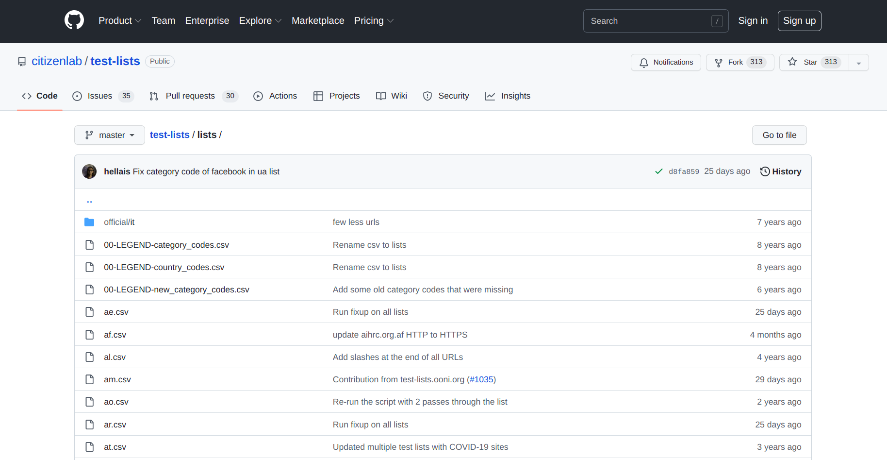

{{}}

This guide is meant for **GitHub users** and provides information related to
updating the [Citizen Lab test lists](https://github.com/citizenlab/test-lists) for website censorship testing. If
you are not a GitHub user, please refer to our [Test Lists Editor](https://test-lists.ooni.org/).

By contributing to the [Citizen Lab test lists]
(https://github.com/citizenlab/test-lists), you can support website censorship
testing by [OONI Probe](https://ooni.org/install) users around the world.

Before getting started, please refer to our **[documentation to learn all about test lists](https://ooni.org/get-involved/contribute-test-lists)**.

* [About test lists](#about-test-lists)

* [Reviewing test lists](#reviewing-test-lists)

	* [Adding websites](#adding-websites)

	* [Editing existing entries](#editing-existing-entries)

	* [Deleting existing entries](#deleting-existing-entries)

* [Creating new test lists](#creating-new-test-lists)

* [Important tips](#important-tips)

# About test lists

Test lists are machine-readable [CSV files](https://en.wikipedia.org/wiki/Comma-separated_values) that include URLs that are tested for
censorship.

Censorship measurement projects like [OONI](https://ooni.org/) rely on a global community of
volunteers who run censorship detection tests from local vantage points. In
light of bandwidth constraints, testing most websites available on the internet
is not practical (nor possible in many cases). Instead, our measurements focus
on a *sample* of websites provided in “test lists”: machine-readable CSV files
with a set of curated, interesting domains. 

There are two types of test lists:

* **[Global test list](https://github.com/citizenlab/test-lists/blob/master/lists/global.csv)**: Includes a wide range of internationally relevant websites (e.g. facebook.com), most of which are in English (tested by [OONI Probe](https://ooni.org/install) users globally)

* **[Country-specific test lists](https://github.com/citizenlab/test-lists/tree/master/lists)**: Include websites that are only relevant to a
specific country (e.g. Brazilian media websites), many of which are in local languages (only tested by [OONI Probe users](https://ooni.org/install) in that country)

To maximize the breadth of coverage while reducing research bias, test list URLs
are categorized based on [30 diverse categories](https://github.com/citizenlab/test-lists/blob/master/lists/00-LEGEND-new_category_codes.csv).

We encourage you to learn more [here](https://ooni.org/get-involved/contribute-test-lists).

# Reviewing test lists

All test lists that [OONI Probe](https://ooni.org/install) is designed to test for censorship are hosted in
the **[Citizen Lab Test List repository on GitHub](https://github.com/citizenlab/test-lists)**.

All test lists are saved as [CSV files](https://github.com/citizenlab/test-lists/tree/master/lists). The CSV files of
country-specific test lists are saved based on country codes. For example, if
you would like to review the test list for Azerbaijan, open the `az.csv` file.
The global test list (which includes internationally-relevant websites that are
tested by all OONI Probe users globally) is saved as `global.csv`. 

**Step 1.** Find the **CSV file** which is specific to the country list (e.g. `az.csv` for Azerbaijan) that you would like to review/update **[here](https://github.com/citizenlab/test-lists/tree/master/lists)**. 

If you don't find a CSV file for a country, that's probably because it
doesn't exist yet. In this case, please refer to the next section on *"Creating new test lists"*.

As part of reviewing a test list, you can:

* **Add** websites;

* **Edit** existing entries (update the URL, update the category, add relevant
  context in the Notes);

* **Delete** existing entries (for example, if the domain has expired or is
  otherwise no longer relevant).

## Adding websites

**Step 1.** **Add new URLs** to the CSV file under the `url` column.  

Some criteria for adding new URLs can include the following:

* The URLs cover topics of socio-political interest within the country;

* The URLs are likely to be blocked because they include sensitive content (for
  example, they touch upon sensitive issues or express political criticism);

* The URLs have been blocked in the past;

* You have faced difficulty connecting to those URLs.

For further criteria, please view the URL categories
**[here](https://github.com/citizenlab/test-lists/blob/master/lists/00-LEGEND-new_category_codes.csv)**.

Please try to add URLs which fall under as many (if not all) of these categories as possible.

**Important:** 

* Please refrain from adding URLs that already exist in the [global test list](https://github.com/citizenlab/test-lists/blob/master/lists/global.csv) (which is tested by OONI Probe users globally) or in the country-specific test list that you are updating. We cannot merge duplicate URLs.

* Please refrain from adding thousands of URLs (for example, taken from blocklists). Due to bandwidth-constaints, we tend to limit test lists to around 1,000 URLs.

**Step 2.** Every time you add a URL, please add the following in the CSV file for
  each new URL:

* **Category code:** Add the code of the category that each URL falls under.
This can be added under the `category_code` column of the CSV file. The
category codes can be found **[here](https://github.com/citizenlab/test-lists/blob/master/lists/00-LEGEND-new_category_codes.csv)**.

* **Category description:** Add the description of the category that each URL
falls under. This can be added under the `category_description` column of
the CSV file. The category descriptions can be found
**[here](https://github.com/citizenlab/test-lists/blob/master/lists/00-LEGEND-new_category_codes.csv)**.

* **Date:** Add the date of when you added each URL. This can be added under the
`date_added` column of the CSV file.

* **Contributor:** Add your name (or nickname) or the name of the organization that you are
 affiliated with (in terms of contributing to the test list). This can be
 added under the `source` column of the CSV file. If you would prefer to remain anonymous, you could add `Community member`.

* **Notes (optional):** Here you can add notes for each URL under the `notes`
column of the CSV file. This column, in particular, can be useful for describing
the type of URL added, particularly since the standardized categories are quite
broad. As an example, you can write "Site of the political opposition, reported
to be blocked during 2016 elections" to provide context that can be useful to researchers.

**Step 3.** Once you have added all new URL entries, open a [pull request on GitHub](https://github.com/citizenlab/test-lists/pulls).

We may provide feedback through the comments section of your pull request. Once
the feedback is addressed and your pull request is merged, your recently added
URLs will automatically get prioritized for [OONI Probe](https://ooni.org/install) testing.

## Editing existing entries

 As many URLs were added to the test lists many years ago (and the status of
 websites constantly changes), there is ongoing need to review *existing test
 list entries* to check:

 * **URL format:** A URL may now support HTTPS, or a website's domain may have changed;

 * **URL categorization:** Some URLs may have been mis-categorized.

 Upon reviewing a test list, you can:

 **Step 1.** **Update URLs** by replacing existing URLs with updated versions. For example, this may involve updating a URL to HTTPS (e.g. replacing `http://www.facebook.com` with `https://www.facebook.com`), or updating a URL if its domain has changed (and the new domain is still relevant for testing).

 **Step 2.** **Change the category codes and descriptions** for URLs (included under
the `category_code` and `category_description` columns of the CSV file) *only
if* you think that those URLs have been allocated to wrong category codes and
descriptions. In this case, please replace the category codes and descriptions
with ones (from the [standardized categories](https://github.com/citizenlab/test-lists/blob/master/lists/00-LEGEND-new_category_codes.csv)) that you think are more suitable. We would also appreciate a comment in your pull request explaining the
proposed changes.

**Step 3.** **Add notes** (or edit existing notes) in the `notes` section of URLs to share relevant context. 

**Step 4.** Once you have completed your edits, open a [pull request on GitHub](https://github.com/citizenlab/test-lists/pulls).

We may provide feedback through the comments section of your pull request. 

## Deleting existing entries

There is occassionally the need to delete existing test list entries
when **websites are no longer operational or relevant** (for example, when a
domain has expired, is squatted, or parked).

In such cases, you can delete a test list entry and mention why you propose deletion in your [pull request on GitHub](https://github.com/citizenlab/test-lists/pulls).

We may provide feedback through the comments section of your pull request. 

# Creating new test lists

If you can't find a test list specific to a country
[here](https://github.com/citizenlab/test-lists/tree/master/lists), then it
probably does not exist yet. Please help us create a test list for that country
through the steps below:

**Step 1.** Create a CSV file and name it based on an ISO-3166 two-letter country
code which is specific to the country that URLs are being added for. You can
find a reference for international standards for country codes
**[here](https://github.com/citizenlab/test-lists/blob/master/lists/00-LEGEND-country_codes.csv)**. An example would include a CSV file created for Andora, named `ad.csv`.

**Step 2.** Include the following columns in the newly created CSV file:

* url

* category_code

* category_description

* date_added

* source

* notes

**Step 3.** Add URLs under the `url` column of the CSV file. 

Some criteria for adding new URLs can include the following:

* The URLs cover topics of socio-political interest within the country;

* The URLs are likely to be blocked because they include sensitive content (for
  example, they touch upon sensitive issues or express political criticism);

* The URLs have been blocked in the past;

* You have faced difficulty connecting to those URLs.

For further criteria, please view URL categories
**[here](https://github.com/citizenlab/test-lists/blob/master/lists/00-LEGEND-new_category_codes.csv)**.

**Important:** 

* Please refrain from adding URLs that already exist in the [global test list](https://github.com/citizenlab/test-lists/blob/master/lists/global.csv) (which is tested by OONI Probe users globally). We cannot merge duplicate URLs.

* Please refrain from adding thousands of URLs (for example, taken from blocklists). Due to bandwidth-constaints, we tend to limit test lists to around 1,000 URLs.

**Step 4.** Every time you add a URL, please add the following in the CSV file for
 each new URL:

* **Category code:** Add the code of the category that each URL falls under.
This can be added under the `category_code` column of the CSV file. The
category codes can be found **[here](https://github.com/citizenlab/test-lists/blob/master/lists/00-LEGEND-new_category_codes.csv)**.

* **Category description:** Add the description of the category that each URL
falls under. This can be added under the `category_description` column of
the CSV file. The category descriptions can be found
**[here](https://github.com/citizenlab/test-lists/blob/master/lists/00-LEGEND-new_category_codes.csv)**.

* **Date:** Add the date of when you added each URL. This can be added under the
`date_added` column of the CSV file.

* **Contributor:** Add your name (or nickname) or the name of the organization that you are
 affiliated with (in terms of contributing to the test list). This can be
 added under the `source` column of the CSV file.

* **Notes (optional):** Here you can add notes for each URL under the "notes"
 column of the csv file. This column, in particular, can be useful for describing
the type of URL added, particularly since the standardized categories are quite
broad. As an example, you can write "Site of the political opposition, reported
to be blocked during 2016 elections" to provide context that may be useful to researchers.

**Step 5.** Once you have created a new test list based on the above, open a [pull request on GitHub](https://github.com/citizenlab/test-lists/pulls).

We may provide feedback through the comments section of your pull request. Once
the feedback is addressed and your pull request is merged, your recently added
URLs will automatically get prioritized for [OONI Probe](https://ooni.org/install) testing.

# Important tips

 1. **Always include the full URL, including the HTTP or HTTPS prefix, exactly as it appears when you type it into a browser.** If you include `example.com` in a test list, OONI Probe won't be able to test it. Rather, it should be included as `http://www.example.com`, if that is what it looks like in a browser.

 2. **Always use the format described in the sections above.** The test lists are meant to be machine-readable, and OONI Probe will not parse test lists that don't strictly follow the prescribed format.

 3. **Please use the categories provided [here](https://github.com/citizenlab/test-lists/blob/master/lists/00-LEGEND-new_category_codes.csv) and refrain from adding your own categories.** The categories may not be perfect, and we welcome your suggestions for additional/alternative categories. But if you don't use the prescribed category codes, OONI Probe will not be able to test those URLs, since test lists are meant to be machine-readable.

4. **Please do not scrape and add "the top 1,000 Alexa sites".** Community contributions are more useful when they include URLs that (a) fall under these [30 diverse categories](https://github.com/citizenlab/test-lists/blob/master/lists/00-LEGEND-new_category_codes.csv) and (b) reflect local insight. Given that many OONI Probe users around the world have bandwidth constraints, we favour *quality* over quantity in terms of what is tested.

Thanks for contributing!
