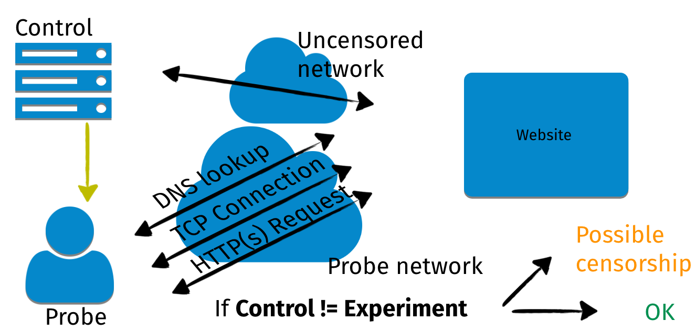
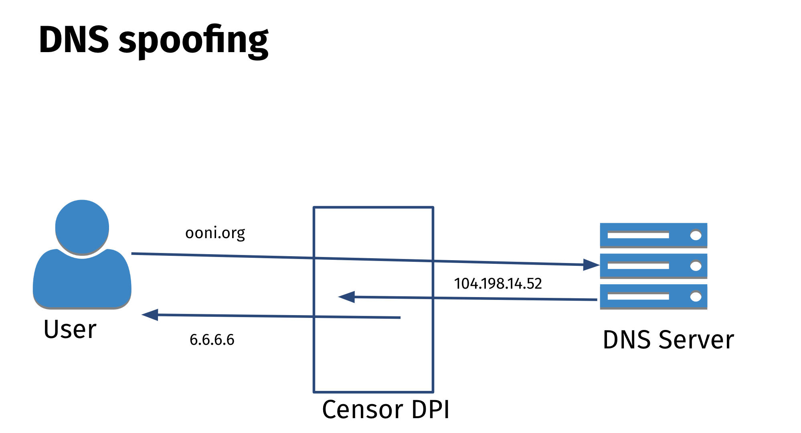

This documentation explains how you can interpret [OONI data](https://ooni.org/data/). It’s primarily intended for **researchers interested in investigating internet censorship** around the world. Knowledge of some internet basics (i.e how the internet works) is required, though you can also refer to the [OONI Glossary](https://ooni.org/support/glossary) for the explanation of relevant terms.

We also recommend referring to the [OONI Explorer user guide](https://ooni.org/support/ooni-explorer/) for accessing OONI data.



## OONI data

### What is OONI data?

OONI data is **open data on internet censorship** around the world.

Specifically, OONI data is **OONI Probe test results**.

[OONI Probe](https://ooni.org/install/) is free software (created by the [Open Observatory of Network Interference](https://ooni.org/)) that includes [multiple experiments](https://github.com/ooni/spec/tree/master/nettests) designed to measure networks for detecting various forms of internet censorship. People around the world run OONI Probe on local networks. By default, OONI Probe test results (‘measurements”) are published as [open data](https://ooni.org/data/) in near real-time.

Since 2012, OONI Probe has been run by people in 241 countries and territories, contributing [more than a billion measurements](https://explorer.ooni.org/) from 25 thousand networks. Every day, as more OONI Probe tests are run around the world, new measurements are published in near real-time.

### Types of OONI Probe tests

OONI measurements differ depending on which [OONI Probe test](https://ooni.org/nettest/) they were collected from.

[OONI Probe](https://ooni.org/install/) includes a variety of [network measurement tests](https://ooni.org/nettest/) designed to measure:

*   Blocking of [websites](https://ooni.org/nettest/web-connectivity/);
*   Blocking of instant messaging apps ([WhatsApp](https://ooni.org/nettest/whatsapp/), [Telegram](https://ooni.org/nettest/telegram/), [Facebook Messenger](https://ooni.org/nettest/facebook-messenger/), [Signal](https://ooni.org/nettest/signal/));
*   Reachability of circumvention tools ([Psiphon](https://ooni.org/nettest/psiphon/), [Tor](https://ooni.org/nettest/tor/), [Vanilla Tor](https://ooni.org/nettest/vanilla-tor/), [Tor Snowflake](https://ooni.org/nettest/tor-snowflake/));
*   Presence of [middleboxes](https://ooni.org/nettest/#boxes);
*   [Network performance](https://ooni.org/nettest/ndt/) and [video-streaming performance](https://ooni.org/nettest/dash/).

The [network performance tests](https://ooni.org/nettest/#performance) were developed in collaboration with [Measurement Lab (M-Lab)](https://www.measurementlab.net/), relying on M-Lab servers.  

Many [other OONI Probe experiments](https://github.com/ooni/spec/tree/master/nettests) have also been designed since 2012, the measurements of which are available in the [OONI dataset](https://ooni.org/data/).

### How to access OONI data?

You can access all OONI data via:

*   **[OONI Explorer.](https://explorer.ooni.org/)** Web platform that enables you to filter the measurements based on a [Search Tool](https://explorer.ooni.org/search), and to [create charts](https://explorer.ooni.org/chart/mat) based on aggregate views of OONI data. The platform also includes [country-specific pages](https://explorer.ooni.org/countries) with relevant measurement coverage and censorship findings.
*   **[OONI API.](https://api.ooni.io/)** Download raw OONI data in JSON format. This is recommended for light-weight queries.
*   **[Amazon S3 bucket.](https://ooni.org/post/mining-ooni-data)** Fetch the whole OONI dataset. This is recommended for batch analysis.

### OONI measurement coverage

**OONI data spans from 2012 to date.** However, the availability of [OONI data](https://ooni.org/data/) depends on whether people are running [OONI Probe](https://ooni.org/install/) in a country, which network they’re connected to when they perform tests, which [tests](https://ooni.org/nettest/) they run, which websites they test, and when they run tests.

As a result, OONI measurement coverage **differs from country to country** (and from network to network within a country), and it differs over time. We tend to observe a spike in measurement coverage when new censorship events emerge (likely because people feel more motivated to run tests when they experience more censorship).

You can monitor the monthly global OONI measurement coverage through the chart on the [OONI Explorer](https://explorer.ooni.org/) homepage.

{{}}

This chart is automatically updated with global OONI measurement coverage stats for each month over the last 2 years. It includes the number of countries and networks that received [OONI Probe](https://ooni.org/install/) measurement coverage, as well as the total number of OONI measurements collected globally in each month. This enables you to track the global growth of OONI measurement coverage over time.

You can also find OONI measurement coverage (broken down by OONI Probe test type) for each country in the [country-specific pages](https://explorer.ooni.org/countries) of OONI Explorer.

{{}}

When interpreting OONI data, it’s **important to start off by reviewing the relevant measurement coverage**. In order to draw meaningful conclusions, it’s important to have as much relevant data as possible.

For example, if WhatsApp was only tested once in Azerbaijan in March 2023, that single measurement only came from one network, and only pertains to the testing of WhatsApp in a specific moment in time. This means that we cannot draw conclusions on whether WhatsApp is accessible on other networks in Azerbaijan, nor whether WhatsApp is accessible on the network where it was tested (as it may have been blocked in different moments in time, or perhaps that single measurement doesn’t provide conclusive evidence of censorship).

Therefore, having as many relevant measurements (e.g [WhatsApp test](https://ooni.org/nettest/whatsapp/) results) from as many networks as possible in a country on a regular basis is crucial.

**Regular and extensive measurement coverage** enables you to:

*   Detect censorship events with greater confidence;
*   Confirm censorship events;
*   Detect more cases of blocking;
*   Examine whether and how internet censorship varies across networks;
*   Check which censorship techniques are adopted by different Internet Service Providers (ISPs);
*   Examine how internet censorship changes in a country over time;
*   Examine how internet censorship changes in correlation with specific events (for example, during elections);
*   Spot [false positives](https://ooni.org/support/faq#what-are-false-positives).

We are frequently asked “how many measurements are enough”, but we unfortunately don’t have a specific number for that (as it often depends on qualitative factors, such as the types of websites tested, the types of networks tested, etc.).  

**Ideally:**

*   Every OONI Probe test would be run multiple times every day;
*   Every website (in the relevant [test lists](https://ooni.org/support/faq#which-websites-will-i-test-for-censorship-with-ooni-probe)) would be tested at least once every day;
*   The above testing would take place on as many (if not all) networks in a country as possible over a long period of time (years).

If you would like to **contribute regular measurements**, you can do so by [enabling “Automated testing”](https://ooni.org/support/ooni-probe-desktop#automated-ooni-probe-testing) in the OONI Probe settings.

## Interpreting OONI data

Since OONI data is OONI Probe test results, **interpreting OONI data requires understanding how each [OONI Probe test](https://ooni.org/nettest/) works** and what types of results it’s expected to have. Every test has limitations, and knowing them can help with understanding the limitations to OONI data.

Numerous [OONI Probe experiments](https://github.com/ooni/spec/tree/master/nettests) have been designed since 2012 (the measurements of which are available in the [OONI dataset](https://ooni.org/data/)). Some of these tests though are no longer supported in the [OONI Probe apps](https://ooni.org/install/) (for example, if they have been replaced by more advanced tests), and we therefore exclude them from this documentation.

We have limited this documentation to the explanation of measurements collected from the OONI [Web Connectivity experiment](https://ooni.org/nettest/web-connectivity/), which is designed to measure the blocking of websites. This experiment is the most widely run OONI Probe test worldwide, its measurements frequently support [internet censorship research](https://ooni.org/reports/), we consider these measurements the most complicated to interpret and analyze (out of all [OON Probe tests](https://ooni.org/nettest/)), and community members have requested documentation on interpreting measurements from this specific experiment. We expect though that this documentation should help with interpreting measurements from other [OONI Probe tests](https://ooni.org/nettest/) as well.

### Types of test results

Generally, [OONI Probe tests](https://ooni.org/nettest/) will present one of the following types of results:

*   **OK.** An “OK” measurement is a testing result with the expected outcome, where nothing is out of the ordinary. When websites and apps are tested, a measurement is “OK” when there is no indication of potential blocking. In the case of middlebox tests, a measurement is “OK” when no middleboxes have been detected, and there are therefore no clear signs of network tampering.
*   **Confirmed blocked.** A measurement is “confirmed blocked” when the blocking of a website is automatically detected based on [fingerprints](https://github.com/ooni/blocking-fingerprints). Based on our current heuristics, this can **only apply to websites** when an Internet Service Provider (ISP) serves a [block page](https://ooni.org/support/glossary#block-page) (which notifies the user that the website is intentionally blocked) or when DNS resolution returns an IP associated with censorship. Out of all OONI Probe tests, only [Web Connectivity](https://ooni.org/nettest/web-connectivity/) measurements can be annotated as “confirmed blocked”.
*   **Anomalous.** An “anomalous” measurement is a testing result which presents signs of potential network interference (such as the blocking of a website or app, or the presence of a middlebox). An anomalous measurement does not necessarily contain evidence of internet censorship, as it might be a [false positive](https://ooni.org/support/glossary#false-positive). Essentially, an anomalous measurement signals that something is wrong and that we should look deeper into the measurement data to determine what is happening. Most cases of blocking are annotated as “anomalies” in OONI data.
*   **Failed.** A measurement is annotated as “failed” if the OONI Probe experiment fails to perform as expected. This is often due to bugs (and such measurements can be discarded), but measurements can also fail due to other reasons, such as if the tested website is down or misconfigured. In some cases, measurements can [fail](https://ooni.org/post/improving-data-quality-analysis-of-failed-measurements/) as a result of internet censorship. We therefore encourage researchers to analyze “failed” measurements.

#### Confirmed

{{}}

Out of all OONI Probe tests, only [Web Connectivity](https://ooni.org/nettest/web-connectivity/) measurements (pertaining to the testing of websites) can be annotated as “confirmed blocked”.

Tested websites are annotated as “confirmed” when the block is implemented in such a way that we are able to automatically detect (and confirm) it based on [fingerprints](https://github.com/ooni/blocking-fingerprints).

This can occur in two cases:

*   A [block page](https://ooni.org/support/glossary#block-page) is served;
*   DNS resolution returns an IP associated with censorship.

Automatically detecting the above cases requires that relevant [fingerprints](https://github.com/ooni/blocking-fingerprints) have been added to the OONI database. If you come across blocking fingerprints, you can [contribute them by opening a ticket or pull request](https://github.com/ooni/blocking-fingerprints).

ISPs also block websites using a variety of different censorship techniques (such as IP blocking, resetting connections, etc), but since those cases aren’t easy to fingerprint (or automatically distinguish from [false positives](https://ooni.org/support/faq#what-are-false-positives)), they are annotated as “anomalies”.

#### Anomalies

{{}}

OONI measurements are annotated as “anomalies” when they present signs of potential network interference (such as the blocking of a website or app).

Unlike “confirmed blocked” measurements (which only apply to websites), measurements from most [OONI Probe tests](https://ooni.org/nettest/) can result in anomalies if the tested service fails to meet the testing criteria for accessibility (or if the tested network presents signs of network tampering).

Measurements from the testing of instant messaging apps (such as [WhatsApp](https://ooni.org/nettest/whatsapp/)) or circumvention tools (such as [Tor](https://ooni.org/nettest/tor/)) present anomalies if they are blocked. However, [false positives](https://ooni.org/support/faq#what-are-false-positives) can emerge, which is why it’s important to look at anomalous measurements in aggregate.

Many cases of website blocking are not automatically detected, and will be present in “anomalous” measurements. Specifically, OONI’s [Web Connectivity test](https://ooni.org/nettest/web-connectivity/) (which measures websites for blocking) identifies the following types of anomalies (while automatically comparing measurements from the local, tested network with those from a control vantage point):

* **DNS anomaly.** If the [DNS responses](https://ooni.org/support/glossary#dns-lookup) (such as the IP addresses mapped to host names) do not match or the DNS queries fail in an unexpected way;
* **TCP/IP anomaly.** If a [TCP](https://ooni.org/support/glossary#tcp) session fails to be established to any of the IP port pairs of the site from the network of the user, but succeeds from the control vantage point;
* **HTTP anomaly.**
 * **HTTP-failure.** If the [HTTP request](https://ooni.org/support/glossary#http-request) over the user’s network fails (resulting in a connection reset, connection timeout, etc), but succeeds over the control vantage point;
 * **HTTP-diff.** If the [HTTP response](https://ooni.org/support/glossary#http-response) the probe got [differs from the response seen in the control measurement](https://github.com/ooni/spec/blob/master/nettests/ts-017-web-connectivity.md#test-description).

These anomalies can indicate the presence of **[DNS tampering](https://ooni.org/support/glossary#dns-tampering)** (DNS anomaly), **[TCP/IP blocking](https://ooni.org/support/glossary#tcpip-blocking)** (TCP/IP anomaly), **[HTTP blocking](https://ooni.org/support/glossary#http-blocking)** (e.g [block page](https://ooni.org/support/glossary#block-page)), or **[TLS](https://ooni.org/support/glossary#tls) based interference** (e.g connection reset observed right after the ClientHello message during the TLS handshake). However, false positives can emerge due to [many reasons](https://ooni.org/support/faq#why-do-false-positives-occur). It is therefore important to examine anomalies in aggregate, further aggregate based on anomaly types (e.g `HTTP-failure`), and to check if the tested service consistently presents the same failure (e.g `connection_reset`) on the same tested ASN. If a tested service consistently presents the same failures, those measurements provide a stronger signal of blocking.

### False positives

A false positive is a test result that wrongly indicates that a particular condition or attribute is present.

**Within the OONI context, false positives are OONI Probe test results which incorrectly indicate the presence of network interference (such as the blocking of a website or app).**

Below are some reasons which may trigger false positives in **[website testing](https://ooni.org/nettest/web-connectivity/)**:

*   **Transient network failures.** If OONI Probe tests are performed on an unstable network, the test results may show signs of potential interference.
*   **Unreliable servers.** If a website is hosted on an unreliable server or otherwise encounters server issues, the tested website may return failures (even though it’s not interfered with) and the OONI Probe test may fail.
*   **DNS resolution.** If the DNS resolver of an OONI Probe user (such as Google or their local ISP) provides an IP addresses that is closest to the user geographically, that IP address may differ from the IP address resolved from a control vantage point, potentially incorrectly indicating the presence of DNS tampering (though some precautions are taken to minimize this).
*   **Geographical distribution of content.** Many websites serve different content depending on the country that the user is connecting from. In these cases, the HTTP responses from the network of the OONI Probe user and from the control vantage point will differ, potentially incorrectly indicating the presence of HTTP based interference.

When running the OONI Probe **[instant messaging tests](https://ooni.org/nettest/#im)** (WhatsApp, Facebook Messenger, Telegram, Signal), beyond the aforementioned issues, false positives may also occur when the instant messaging app vendor makes changes to their infrastructure that affect how OONI Probe tests run.

When running the OONI Probe **[middlebox tests](https://ooni.org/nettest/#boxes)**, false positives may occur due to issues with the OONI Probe backend infrastructure.

When running **any OONI Probe test**, false positives may occur due to software bugs triggered by the user’s particular device and network configuration, or due to bugs in OONI’s systems.

While we try to keep them as low as we can, **false negatives** are also possible due to the aforementioned issues.

#### Identifying false positives

Distinguishing false positives can often be tricky, even for engineers. It requires examining the network measurement data carefully, having a good understanding of [how OONI Probe tests work](https://github.com/ooni/spec/tree/master/nettests), analyzing the data over a long period of time (to check whether the tested resource consistently presents the same anomalies on the same network), and evaluating and ruling out other possible reasons that could have triggered the anomaly (for example, by checking the global failure rates of a site).

In general, **we recommend looking at relevant measurements in aggregate over a timeline, rather than individually** (unless they are annotated as “confirmed”). For example, if you observe that a tested website presents the same anomaly (e.g. `http-failure`) every time it is tested on a specific network in a country, it’s more likely the case that access to it is being interfered with. If, however, a single measurement (for example) presents a TCP/IP anomaly, but all other measurements testing that website on the same network were successful, it’s likely the case that that TCP/IP anomaly is a false positive.

### Web Connectivity measurements

To examine the blocking of websites, please refer to [Web Connectivity measurements](https://explorer.ooni.org/search?since=2023-02-14&until=2023-03-17&failure=false&test_name=web_connectivity).

#### Web Connectivity experiment

OONI’s [Web Connectivity experiment](https://ooni.org/nettest/web-connectivity/) is designed to measure the accessibility of URLs (included in the [Citizen Lab test lists](https://github.com/citizenlab/test-lists/tree/master/lists)) by performing the following steps:

*   Resolver identification
*   [DNS lookup](https://ooni.org/support/glossary/#dns-lookup)
*   TCP connect to the resolved IP address(es)
*   TLS handshake to the resolved IP address(es)
*   [HTTP(s) GET request](https://ooni.org/support/glossary/#http-request)

The above steps are automatically performed from two vantage points: (1) the local vantage point of the user and (2) a control network (non-censored network).

{{}}

**Image:** Illustration of how OONI’s [Web Connectivity experiment](https://ooni.org/nettest/web-connectivity/) works.

The **results from both networks are automatically compared**, and the final measurement can have one of the following outcomes:

*   **OK.** Results from both networks match, and the tested website is found accessible.
*   **Confirmed.** The tested website is automatically confirmed blocked based on [fingerprints](https://github.com/ooni/blocking-fingerprints).
*   **Anomaly.** Results from both networks differ, and the tested website presents signs of potential blocking.

As [false positives](https://ooni.org/support/faq/#what-are-false-positives) can occur, it’s **[important to look at anomalous measurements in aggregate](https://explorer.ooni.org/chart/mat)** to determine if a tested URL consistently presents a large volume of anomalous measurements (in comparison to successful measurements) on a tested network. If a tested URL presents a large volume of anomalies, it may provide a strong signal of potential blocking (as illustrated in the example below).

{{}}

**Chart:** OONI Probe testing of `twitter.com` on 228 ASNs in Russia between 14th February 2023 to 16th March 2023, showing that most measurements presented anomalies (source: [OONI MAT](https://explorer.ooni.org/chart/mat?probe_cc=RU&since=2023-02-14&until=2023-03-17&time_grain=day&axis_x=measurement_start_day&test_name=web_connectivity&domain=twitter.com)).

If the types of anomalies are consistent (for example, always presenting DNS anomalies on a tested network), they offer an even stronger signal of potential censorship (since they suggest the use of a specific censorship technique, such as [DNS hijacking](https://ooni.org/support/glossary/#dns-hijacking)).

Beyond aggregating anomalous measurements, it’s also worth analyzing the raw data of anomalous measurements to identify (and aggregate) the **[specific errors](https://github.com/ooni/spec/blob/master/data-formats/df-007-errors.md)** that occurred as part of the testing, offering insight into how a tested URL is potentially blocked. For example, if a tested website consistently presents `connection_reset` errors, the ISP is likely blocking it by resetting the connection.  

{{}}

Each [Web Connectivity](https://ooni.org/nettest/web-connectivity/) measurement provides **further network information** (such as information pertaining to TLS handshakes) that also helps with evaluating whether an anomalous measurement presents signs of blocking or throttling.

#### Interpreting Web Connectivity measurements

To interpret the data, it’s important to keep in mind how the [Web Connectivity test](https://ooni.org/nettest/web-connectivity/) works. Specifically, it’s designed to perform the following steps:

*   Resolver identification
*   [DNS lookup](https://ooni.org/support/glossary/#dns-lookup)
*   TCP connect to the resolved IP address(es)
*   TLS handshake to the resolved IP address(es)
*   [HTTP(s) GET request](https://ooni.org/support/glossary/#http-request)

Why the above steps?

To access a website, we’d need to get the correct IP address(es) of that website (DNS resolution), successfully connect to those IPs (TCP connect), and get the content of the website (HTTP request). If the site is hosted on HTTPS, we’d need to perform a successful TLS handshake for an IP address of the site.

**Knowing these steps is important, because blocking a website would mean interfering with these steps.**

To interpret OONI Web Connectivity data, we need to examine if each of these steps was performed successfully, resulting in access to the tested website. If any of these steps failed or returned an inconsistent result (in comparison to measurements collected from the control vantage point), the measurement is annotated as an “anomaly” or “confirmed” (if the blocking is confirmed based on [fingerprints](https://github.com/ooni/blocking-fingerprints)).

You can find OONI Web Connectivity measurements by [applying the Web Connectivity test filter on the OONI Explorer Search Tool](https://ooni.org/support/ooni-explorer/#ooni-probe-test).

Each measurement starts off with a banner, providing the overview of the test result.

{{}}

In this [measurement](https://explorer.ooni.org/measurement/20230319T095205Z_webconnectivity_MX_8151_n1_DSrFU6BsMNoglhG8?input=https%3A%2F%2Ftwitter.com%2F), we can see that when `https://twitter.com` was tested on AS8151 (Uninet) in Mexico on 19th March 2023, it was found accessible.

By scrolling down the measurement, we will view further details, starting from the results obtained from each of the Web Connectivity testing steps (discussed previously).

##### DNS queries

A domain is a name that is attributed to websites (when they’re created), so that they can more easily be accessed and remembered. For example, `twitter.com` is the domain of the Twitter website. However, computers can’t connect to internet services through domain names, but based on IP addresses (e.g `104.244.42.1`): the digital address of each service on the internet. A website can have multiple IP addresses.

So how does your computer discover the IP address(es) of a website?

This is managed by the Domain Name System (DNS), which is responsible for mapping domain names to IP addresses. Internet Service Providers (ISPs), amongst other service providers (such as Google), run **[DNS resolvers](https://ooni.org/support/glossary#dns-resolver)**, which are servers that map domain names to IP addresses, operating like an “address book”.

To access `twitter.com`, your computer sends a “DNS query” to your configured DNS resolver, requesting the IP address(es) for `twitter.com`. Normally, a DNS resolver will respond (“DNS answer”) by providing you the IP address(es) for the requested domain (`twitter.com`). However, if the DNS resolver returns the wrong IP address or results in an unexpected failure, that could be a sign of [DNS tampering](https://ooni.org/support/glossary#dns-tampering) (i.e DNS-based blocking of the website).

In [OONI Web Connectivity measurements](https://explorer.ooni.org/measurement/20230319T095205Z_webconnectivity_MX_8151_n1_DSrFU6BsMNoglhG8?input=https%3A%2F%2Ftwitter.com%2F), the first results are from the “resolver identification” and the [DNS lookup](https://ooni.org/support/glossary#dns-lookup) steps, where we aim to discover:

*   Which [DNS resolver](https://ooni.org/support/glossary#dns-resolver) is used by the OONI Probe user;
*   Which IP addresses were returned for the requested domain (e.g `twitter.com`).

{{}}

In this case, we can see that the [DNS resolver](https://ooni.org/support/glossary#dns-resolver) used is hosted on the IP `187.141.94.2`, which enables us to [identify that the ISP is performing DNS resolution](https://ipinfo.io/AS8151/187.141.94.0/24) (i.e the ISP is responsible for giving us the IP addresses for `twitter.com`).

This is an important piece of information because if [DNS tampering](https://ooni.org/support/glossary#dns-tampering) is implemented, we would know that it is implemented by the tested ISP. On the other hand, if the DNS resolver was run by another entity such as Google, we would miss DNS-based tampering implemented by the local ISP (since Google probably wouldn’t implement it).

Moreover, if the OONI Probe user were using a DNS resolver run by a foreign country’s ISP, and that ISP was implementing DNS-based censorship, we would see that censorship in the measurement. For example, an [OONI measurement](https://explorer.ooni.org/measurement/20230311T144426Z_webconnectivity_AU_6939_n1_FkCEtoRFK68dgKpm?input=https%3A%2F%2Fwww.bbc.com%2F) collected from Australia shows that BBC is “confirmed blocked” because the OONI Probe user (in Australia) ran the test while using a [Russian DNS resolver](https://ipinfo.io/AS31483/188.186.148.0/22) (which blocks access to BBC by means of DNS tampering, serving a block page).  

From the DNS queries above, we can see that for `twitter.com`, the following IP addresses were returned:

```
104.244.42.1
104.244.42.129
104.244.42.65
104.244.42.193
```

As all of these IPs belong to Twitter, we do not see any signs of DNS tampering, and we can proceed with the next step of the experiment: Connecting to the resolved IPs.

##### TCP connections

By scrolling down in a [measurement](https://explorer.ooni.org/measurement/20230319T095205Z_webconnectivity_MX_8151_n1_DSrFU6BsMNoglhG8?input=https%3A%2F%2Ftwitter.com%2F), we will view the next step of the experiment: connecting to the resolved IP addresses. Specifically, the test attempts to establish a TCP session on port 80 (or port 443 for URLs that begin with HTTPS) for the list of IP addresses that were identified in the previous step (DNS lookup).

{{}}

As we can see, the experiment successfully connected to the Twitter IP addresses.

If the test failed to connect to the IP addresses, that may have been a sign of [IP blocking](https://ooni.org/support/glossary#tcpip-blocking). Given that multiple websites can be hosted on a single IP address, blocking an IP address will result in blocking all of the websites hosted on that IP (beyond the intended website). This is what is often referred to as “collateral damage”.

However, please note that TCP connections to IP addresses can also fail due to other reasons (beyond blocking), such as due to transient network failures (i.e poor network connectivity). We therefore strongly encourage you to view [measurements in aggregate](https://explorer.ooni.org/chart/mat).

If the site is hosted on HTTPS (e.g `https://twitter.com`), the [Web Connectivity test](https://github.com/ooni/spec/blob/master/nettests/ts-017-web-connectivity.md) will also perform a **TLS handshake** for each of the resolved IP addresses. If the TLS handshake fails, that could be a sign of TLS level interference.

You can find the testing details from each TLS handshake by scrolling down to the “**Raw Measurement Data**” section of an [OONI measurement](https://explorer.ooni.org/measurement/20230319T095205Z_webconnectivity_MX_8151_n1_DSrFU6BsMNoglhG8?input=https%3A%2F%2Ftwitter.com%2F), and by clicking on the `network_events` key. The nested `network_events` keys provide the details of the TLS handshake operations for each of the resolved IPs.

{{}}

##### HTTP(s) requests

**HTTP** (Hypertext Transfer Protocol) is the underlying protocol used by the World Wide Web to transfer or exchange data across the internet, allowing communication between a client (your computer) and a server (hosting the website). The transmission of data over the HTTP protocol is **unencrypted**.

**HTTPS** (Hypertext Transfer Protocol Secure) – also known as HTTP over TLS, or HTTP over SSL – is the HTTP protocol over an **encrypted** channel.

All websites include an HTTP or HTTPS prefix so that your computer (the client) can request and receive the content of a website (hosted on a server). Over the last years, most major websites on the internet started supporting HTTPS (such as https://www.facebook.com/) so that the transmission of data (such as passwords to login to websites) over the HTTP protocol is encrypted.

Every time you visit a website, your browser sends a request (“**[HTTP request](https://ooni.org/support/glossary#http-request)**”) through the HTTP protocol to the server that is hosting the website.

In response to an HTTP request, a server will send an **[HTTP response](https://ooni.org/support/glossary#http-response)**, which includes HTTP response headers and optionally a response body, which in the case of a website will be the content of the page.

In some cases though, Internet Service Providers (ISP) prevent users from accessing certain websites by blocking or interfering with the connection between them and the server. This is a form of **[HTTP blocking](https://ooni.org/support/glossary#http-blocking)**. There are many ways that they can implement censorship on the HTTP protocol, such as the following:

*   **Serving a block page.** In this case, the ISP intercepts the user’s request to access a specific website (e.g. `twitter.com`) and serves the user a [block page](https://ooni.org/support/glossary#block-page) instead, which informs the user that they are not allowed to access the requested website.
*   **HTTP failure.** The user’s HTTP request (to access a specific internet service) fails because it is intercepted by an [HTTP transparent proxy](https://ooni.org/support/glossary#http-transparent-proxy), or the ISP resets the connection or hijacks the (unencrypted) connection to redirect it (preventing it from reaching the intended server).

If the site is hosted on HTTPS, an ISP can block access by means of **TLS interference**. In this case, they can disrupt the TLS handshake operations through a variety of means, such as by [injecting an RST packet](https://explorer.ooni.org/measurement/20220305T090244Z_webconnectivity_RU_8732_n1_oCVFwxN1oAYddBoX?input=https%3A%2F%2Fwww.bbc.com%2Frussian%2F), dropping packets, or [closing the connection](https://explorer.ooni.org/measurement/20220304T034651Z_webconnectivity_RU_31163_n1_asVR1x6WcRk5AdL0?input=https%3A%2F%2Fwww.bbc.com%2F). As the TLS protocol includes the unencrypted SNI extension (designed to specify which hostname the encrypted connection should be established with), an ISP can see the requested domain (e.g `twitter.com`) and disrupt the TLS handshake. Such censorship that is informed by the SNI field is characterized as **SNI-based filtering**.

The final step of the [Web Connectivity experiment](https://github.com/ooni/spec/blob/master/nettests/ts-017-web-connectivity.md) is the HTTP(s) request (HTTP request for sites hosted on HTTP; HTTPS request for sites hosted on HTTPS).

In this example, we see that `https://twitter.com` has been requested, and that the server responded with the HTTP response headers and response body for the site.

{{}}

{{}}

From the HTTP response body, we can see that the user should be able to access `https://twitter.com` on the tested network.

If access was interfered with, we would, for example, see a block page in the HTTP response body, or no data (as illustrated below).

{{}}

##### Raw measurement data

Towards the end of an [OONI measurement page](https://explorer.ooni.org/measurement/20230319T095205Z_webconnectivity_MX_8151_n1_DSrFU6BsMNoglhG8?input=https%3A%2F%2Ftwitter.com%2F), you will find the relevant raw measurement data (which you can download in JSON format).

{{}}

In the raw data you will find all the testing results discussed previously (DNS queries, TCP connections, HTTP(s) requests), along with many more measurement details. By clicking on `test_keys`, you will find most of the details that are relevant to the measurement results.

{{}}

Notably, the nested keys include `tls_handshakes` keys, and under `network_events` you can see the TLS handshake operations for each of the resolved IPs.

{{}}

#### Confirmed measurements

OONI measurements are annotated as “confirmed” when the blocking of a tested website is automatically detected (and confirmed) based on (manually reviewed) [blocking fingerprints](https://github.com/ooni/blocking-fingerprints) added to the OONI database. This can occur in two cases:

*   A [block page](https://ooni.org/support/glossary#block-page) is served;
*   DNS resolution returns an IP associated with censorship.

You can easily find “[confirmed](https://explorer.ooni.org/search?since=2023-02-17&until=2023-03-20&failure=false&only=confirmed)” measurements by [applying the Confirmed filter](https://ooni.org/support/ooni-explorer/#confirmed) in the OONI Explorer Search Tool.

##### HTTP block pages

A block page (or “Access Denied Page”) is a web page that is displayed when a user attempts to access a website they are not permitted to view. This is a censorship technique adopted by Internet Service Providers (ISPs) in many countries (such as [Iran](https://explorer.ooni.org/search?since=2023-02-17&until=2023-03-20&failure=false&probe_cc=IR&only=confirmed), [Russia](https://explorer.ooni.org/search?since=2023-02-17&until=2023-03-20&failure=false&probe_cc=RU&only=confirmed), [Indonesia](https://explorer.ooni.org/search?since=2023-02-17&until=2023-03-20&failure=false&probe_cc=ID&only=confirmed), [Thailand](https://explorer.ooni.org/search?since=2023-02-17&until=2023-03-20&failure=false&probe_cc=TH&only=confirmed), [Greece](https://explorer.ooni.org/search?since=2023-02-17&until=2023-03-20&failure=false&probe_cc=GR&only=confirmed), and [Italy](https://explorer.ooni.org/search?since=2023-02-17&until=2023-03-20&failure=false&probe_cc=IT&only=confirmed)).

When a block page is served by an ISP, the user does not view the content of the website they’re trying to access. Instead, they view a web page (the block page) that informs them that they’re not allowed to access the intended website.

A block page is the **only form of internet censorship that clearly notifies internet users of the censorship**. Often, a block page references the law behind the censorship.

As an example, below is a block page served by ISPs in Indonesia.

{{}}

Based on OONI’s heuristics, internet censorship is automatically confirmed when a block page is served, and the fingerprint of that block page has been added to OONI’s database.

You can find “[confirmed](https://explorer.ooni.org/search?since=2023-02-17&until=2023-03-20&failure=false&only=confirmed)” measurements by [applying the Confirmed filter](https://ooni.org/support/ooni-explorer/#confirmed) in the OONI Explorer Search Tool.

When looking at a [measurement](https://explorer.ooni.org/measurement/20230317T145809Z_webconnectivity_IN_20473_n1_AWGzE92yoXNdzimi?input=http%3A%2F%2Fpaktimes.com%2F) collected from India on the testing of `http://paktimes.com`, we first get an overview of the test result. Specifically, we see that when `http://paktimes.com` was tested on AS20473 (The Constant Company, LLC) in India on 17th March 2023, the site was found “confirmed blocked”.

{{}}

By scrolling down the [measurement](https://explorer.ooni.org/measurement/20230317T145809Z_webconnectivity_IN_20473_n1_AWGzE92yoXNdzimi?input=http%3A%2F%2Fpaktimes.com%2F), we will view further details, starting from the results obtained from each of the Web Connectivity testing steps (discussed previously). The first results are from the “resolver identification” (to check which [DNS resolver](https://ooni.org/support/glossary#dns-resolver) is used by the OONI Probe user), as well as from the [DNS lookup](https://ooni.org/support/glossary#dns-lookup).

{{}}

In this case, we can see that the [DNS resolver](https://ooni.org/support/glossary#dns-resolver) used is related to the IP `139.84.130.52`, which enables us to [identify that the ISP is performing DNS resolution](https://ipinfo.io/139.84.130.52) (i.e the ISP is responsible for giving us the IP address for `paktimes.com`). We also see that the DNS lookup returned the IP `64.190.63.111` for `paktimes.com`.

By further scrolling down the measurement page, we see that the TCP connection to the resolved IP (`64.190.63.111`) was successful.

{{}}

However, when viewing the HTTP request, we see that we did not get the correct HTTP response headers and response body for `paktimes.com`.

{{}}

Instead, the HTTP response body includes `http://www.airtel.in/dot/` which hosts the following block page (viewed from a web browser):

{{}}

This means that when a user in India (on AS20473 network) tried to access `paktimes.com` on 17th March 2023, they would see the above block page (which informs them that the site is blocked), instead of the content hosted on `paktimes.com`.

It’s worth noting that `paktimes.com` is currently discontinued (the domain is for sale). This suggests that (a) the block may have been implemented in India years ago (when the site was operational) and that (b) previous blocks are potentially not reviewed/updated frequently (since the block remains in place, even though the site is discontinued).

In another example, we can refer to a [measurement](https://explorer.ooni.org/measurement/20220304T214241Z_webconnectivity_RU_12389_n1_UeXMqEpughRTTzLU?input=http%3A%2F%2Fwww.bbc.com%2Fnews) from the testing of `http://www.bbc.com/news` on AS12389 (PJSC Rostelecom) in Russia on 4th March 2022.

{{}}

In this case, we also see that the HTTP response did not return the intended outcome. Specifically, we see that when an HTTP request was performed for `http://www.bbc.com/news`, the response contains a HTTP redirect to `http://warning.rt.ru/` instead of the content for the intended site.

{{}}

This results in the user being redirected to `http://warning.rt.ru` which hosts a block page.

{{}}

When accessing `http://warning.rt.ru` from a web browser, we can see that it hosts the following block page:

{{}}

This means that when a user in Russia (on AS12389 network) tried to access `http://www.bbc.com/news` on 4th March 2022, they would see the above block page (which informs them that the site is intentionally blocked), instead of the content hosted on `http://www.bbc.com/news`. Such [OONI data](https://explorer.ooni.org/measurement/20220304T214241Z_webconnectivity_RU_12389_n1_UeXMqEpughRTTzLU?input=http%3A%2F%2Fwww.bbc.com%2Fnews) serves as **evidence of internet censorship**.

It’s worth highlighting that when a site is hosted on HTTP, an ISP can [limit the block to a specific webpage](https://explorer.ooni.org/measurement/20200212T184205Z_AS138798_TYaiL1VoqAG7MIaraiihd6qs3UqHL7Fl60eFtKLSkSEGE85AyO?input=http%3A%2F%2Fwww.aljazeera.com%2Findepth%2Finpictures%2F2012%2F08%2F201281572918200739.html) (e.g `http://www.aljazeera.com/indepth/inpictures/2012/08/201281572918200739.html`), without blocking access to the entire website (e.g `http://www.aljazeera.com/`). Previously (when most websites did not support HTTPS), many ISPs around the world would censor specific pages (such as news articles or Facebook pages) on websites, without blocking the whole website.

Now most websites support HTTPS, and ISPs cannot limit a block to a specific webpage (they would have to block the entire website). As a result, many blocked websites and webpages can now easily be accessed over HTTPS (if such sites support HTTPS), and ISPs around the world have changed their censorship techniques. For example, many ISPs now serve block pages (for sites hosted on HTTPS) through [DNS tampering](https://ooni.org/support/glossary#dns-tampering).

##### DNS tampering

As most websites are now hosted on HTTPS, many ISPs around the world implement blocks for such sites by means of [DNS tampering](https://ooni.org/support/glossary#dns-tampering).

OONI measurements are annotated as “[confirmed](https://explorer.ooni.org/search?since=2023-02-17&until=2023-03-20&failure=false&only=confirmed)” when the DNS resolution returns an IP address associated with censorship (and that IP is included in the [blocking fingerprints](https://github.com/ooni/blocking-fingerprints) added to the OONI database). Such IPs are often [bogon IPs](https://ipinfo.io/bogon) hosting block pages.

When looking at a [measurement](https://explorer.ooni.org/measurement/20230319T161501Z_webconnectivity_IR_58224_n1_49GdCXWJ5s4UWjT3?input=https%3A%2F%2Fwww.instagram.com%2F) collected from Iran on the testing of `https://www.instagram.com`, we first get an overview of the test result. Specifically, we see that when `https://www.instagram.com` was tested on AS58224 (Iran Telecommunication Company PJS) in Iran on 19th March 2023, the site was found “confirmed blocked”.

{{}}

The DNS queries of the measurement show that the DNS answer contains the [private IPv4 address](https://ipinfo.io/10.10.34.35) `10.10.34.35` (which is used to host the Iranian block page).

{{}}

Since the DNS resolution did not return Instagram’s actual IP address, access to `https://www.instagram.com` was blocked in Iran on this network. The block was automatically detected because the IP `10.10.34.35` is included in OONI’s [blocking fingerprints](https://github.com/ooni/blocking-fingerprints).

In another example, a [measurement](https://explorer.ooni.org/measurement/20230319T164051Z_webconnectivity_ID_4800_n1_sO2oZ2jZfH1uyjA1?input=https%3A%2F%2Filga.org%2F) collected from Indonesia (on AS4800) on the testing of `https://ilga.org` on 19th March 2023 shows that the site was found “confirmed blocked”.

{{}}

The DNS queries of the measurement show that the DNS answer returned the IPs `103.169.16.2` and `202.152.4.67`, instead of the IP address for `ilga.org`.

{{}}

When accessing the IP `202.152.4.67` from a web browser, we can see that it hosts the following block page:

{{}}

This means that when a user in Indonesia (on AS4800) tried to access `https://ilga.org` on 19th March 2023, they would see the above block page (which informs them that the site is intentionally blocked), instead of the content hosted on `https://ilga.org`. Such [OONI data](https://explorer.ooni.org/measurement/20230319T164051Z_webconnectivity_ID_4800_n1_sO2oZ2jZfH1uyjA1?input=https%3A%2F%2Filga.org%2F) serves as **evidence of internet censorship**.

Beyond cases where website blocking is automatically detected through [fingerprints](https://github.com/ooni/blocking-fingerprints), it’s worth examining “anomalous” OONI measurements as well. In many countries, ISPs implement blocks using a variety of different censorship techniques (beyond those detected through [fingerprints](https://github.com/ooni/blocking-fingerprints)). You can find such cases through “anomalous” OONI measurements.

#### Anomalous measurements

OONI measurements are annotated as “anomalies” when the tested website presents signs of potential blocking. You can find “[anomalous](https://explorer.ooni.org/search?since=2023-02-17&until=2023-03-20&failure=false&test_name=web_connectivity&only=anomalies)” measurements by [applying the Anomalies filter in the OONI Explorer Search Tool](https://ooni.org/support/ooni-explorer/#anomaly).

Depending on why the anomaly emerges, anomalous measurements are automatically annotated as one of the following:

* **DNS anomaly.** If the [DNS responses](https://ooni.org/support/glossary#dns-lookup) (such as the IP addresses mapped to host names) do not match or the DNS queries fail in an unexpected way;
* **TCP/IP anomaly.** If a [TCP](https://ooni.org/support/glossary#tcp) session fails to be established to any of the IP port pairs of the site from the network of the user, but succeeds from the control vantage point;
* **HTTP anomaly.**
  * **HTTP-failure.** If the [HTTP request](https://ooni.org/support/glossary#http-request) over the user’s network fails (resulting in a connection reset, connection timeout, etc), but succeeds over the control vantage point;
  * **HTTP-diff.** If the [HTTP response](https://ooni.org/support/glossary#http-response) the probe got [differs from the response seen in the control measurement](https://github.com/ooni/spec/blob/master/nettests/ts-017-web-connectivity.md#test-description).

For example, if the [DNS lookup](https://ooni.org/support/glossary/#dns-lookup) resolves to an IP address which differs from that resolved from the control vantage point, the measurement is annotated as a “DNS anomaly”, which may be a sign of [DNS tampering](https://ooni.org/support/glossary/#dns-tampering).

However, the types of anomalies listed above only tell us at which step of the [Web Connectivity experiment](https://ooni.org/nettest/web-connectivity/) (DNS lookup, TCP connections, HTTP(s) request) the measurement didn’t produce the expected results (for annotating a tested website as “accessible”).

To characterize a block, it is necessary to examine why the failure occurred by looking at (and aggregating) the specific **[errors](https://github.com/ooni/spec/blob/master/data-formats/df-007-errors.md)** that emerged as part of the testing. We provide a full list of all the possible errors (and their associated descriptions) [here](https://github.com/ooni/spec/blob/master/data-formats/df-007-errors.md).  

##### DNS anomalies

If the [DNS responses](https://ooni.org/support/glossary#dns-lookup) (between the control and local vantage points) do not match, an OONI Web Connectivity measurement is annotated as a “DNS anomaly”, providing a signal of potential DNS tampering.

**DNS hijacking** is when an ISP configures its DNS resolver to return the **wrong DNS answer** for the websites that they want to block access to. A wrong DNS answer could be a wrong IP address (such as a private IP hosting a block page), or an incorrect answer (for example, by returning the `NXDOMAIN` error for a site whose domain has not expired).

{{}}

Some ISPs in a few countries implement DNS tampering through **DNS spoofing** (also known as “DNS injection”). In this case, it’s not a question of the DNS resolver being “dishonest”. Rather, they intercept the DNS query and inject a spoofed (faked) DNS answer in the response (before the correct DNS response from the DNS resolver is able to reach you). This can be done through the use of [Deep Packet Inspection (DPI)](https://ooni.org/support/glossary#dpi) technology.

{{}}

As discussed in the previous section, many cases of DNS-based tampering around the world are automatically detected and [confirmed](https://explorer.ooni.org/search?since=2023-02-17&until=2023-03-20&failure=false&only=confirmed) based on [blocking fingerprints](https://github.com/ooni/blocking-fingerprints) added to the OONI database. But this doesn’t include all IPs used as part of DNS tampering globally, and so many other cases are available through OONI measurements currently annotated as “DNS anomalies”.

For example, a [measurement](https://explorer.ooni.org/measurement/20220303T120931Z_webconnectivity_RU_60139_n1_RqlkvqFzTf9cySzI?input=https%3A%2F%2Fwww.currenttime.tv%2Ftv%2Fschedule%2F92%2F) on the testing of `https://www.currenttime.tv/` in Russia on 3rd March 2022 shows that it presented a DNS anomaly.

{{}}

The DNS queries of the [measurement](https://explorer.ooni.org/measurement/20220303T120931Z_webconnectivity_RU_60139_n1_RqlkvqFzTf9cySzI?input=https%3A%2F%2Fwww.currenttime.tv%2Ftv%2Fschedule%2F92%2F) show that the DNS answer returned the IP `185.77.150.2`, instead of the IP address for `www.currenttime.tv`.

{{}}

When accessing the IP `185.77.150.2` from a web browser, we can see that it hosts the following block page:

{{}}

Another example of DNS tampering is when the `NXDOMAIN` error (DNS error message for domains that don’t exist) is returned for domains that do exist. For example, a [measurement](https://explorer.ooni.org/measurement/20230319T181629Z_webconnectivity_RU_12389_n1_Dfw8TJKxMpUwbnbn?input=https%3A%2F%2Fwww.facebook.com%2F) on the testing of `https://www.facebook.com` in Russia on 19th March 2023 returned an `NXDOMAIN` error.

{{}}

**Note:** If the [DNS resolver](https://ooni.org/support/glossary#dns-resolver) of an OONI Probe user (such as Google or their local ISP) provides an IP addresses that is closest to the user geographically, that IP address may differ from the IP address resolved from a control vantage point, potentially incorrectly indicating the presence of DNS tampering.

##### TCP/IP anomalies

An OONI measurement is annotated as a “TCP/IP anomaly” if a [TCP](https://ooni.org/support/glossary#tcp) session to connect to the resolved IP address(es) of the tested website failed to be established over the network of the user (but it succeeded from the control vantage point). A “TCP/IP anomaly” can be a sign of [IP blocking](https://ooni.org/support/glossary#tcpip-blocking).

For example, a [measurement](https://explorer.ooni.org/measurement/20210204T045544Z_webconnectivity_MM_132167_n1_kHfoQ8eGiU0oJ3lL?input=https%3A%2F%2Fwww.facebook.com) on the testing of `https://www.facebook.com` in Myanmar on 4th February 2021 shows that it presented a TCP/IP anomaly.

{{}}

This measurement shows that the DNS queries returned the correct IP addresses for Facebook, but attempts to establish TCP connections to the resolved IPs failed, suggesting potential IP blocking.

{{}}

The raw measurement [data](https://explorer.ooni.org/measurement/20210204T045544Z_webconnectivity_MM_132167_n1_kHfoQ8eGiU0oJ3lL?input=https%3A%2F%2Fwww.facebook.com) (nested under `test_keys`) shows that the failed attempt to connect to the Facebook IP `157.240.13.35` resulted in a “generic timeout error”.

{{}}

However, TCP connections to IP addresses can also fail due to other reasons (beyond blocking), such as due to transient network failures (i.e poor network connectivity) or if the tested website is hosted on an unreliable server. It’s therefore worth examining relevant [measurements in aggregate](https://explorer.ooni.org/chart/mat) to check whether the tested service consistently presents the same TCP/IP anomalies.

For example, through the [OONI Measurement Aggregation Toolkit (MAT)](https://explorer.ooni.org/chart/mat?probe_cc=MM&since=2021-02-01&until=2021-02-28&time_grain=day&axis_x=measurement_start_day&test_name=web_connectivity&domain=www.facebook.com), we can see that most measurements collected from Myanmar in February 2021 presented anomalies, providing a signal of blocking.

{{}}

**Chart:** OONI Probe testing of `www.facebook.com` in Myanmar in February 2021, showing that most measurements presented anomalies (source: [OONI MAT](https://explorer.ooni.org/chart/mat?probe_cc=MM&since=2021-02-01&until=2021-02-28&time_grain=day&axis_x=measurement_start_day&test_name=web_connectivity&domain=www.facebook.com)).

As multiple websites can be hosted on a single IP address, blocking an IP address will result in blocking all of the websites hosted on that IP (beyond the intended website). This is what is often referred to as “collateral damage”, and such cases were (for example) [found](https://ooni.org/post/2021-multiperspective-view-internet-censorship-myanmar/#website-and-social-media-blocking) in Myanmar based on OONI data analysis. It may therefore be worth keeping an eye out for such cases if you come across a large volume of TCP/IP anomalies.

##### HTTP diff

An OONI Web Connectivity measurement is annotated as “HTTP-diff” (“HTTP difference”) if the [HTTP response](https://ooni.org/support/glossary#http-response) the probe got [differs from the response seen in the control measurement](https://github.com/ooni/spec/blob/master/nettests/ts-017-web-connectivity.md#test-description).

This can occur if the [HTTP status codes](https://ooni.org/support/glossary#http-status-codes) don’t match, or if all of the following apply:

*   The body length of the compared website (over the control server and the network of the user) differs by some percentage;
*   The [HTTP header](https://ooni.org/support/glossary#http-header) names do not match;
*   The HTML title tags do not match.

Often, this is the result of a [block page](https://ooni.org/support/glossary#block-page), and many such cases are [automatically detected and confirmed](https://explorer.ooni.org/search?since=2023-02-17&until=2023-03-20&failure=false&only=confirmed) (annotated as “confirmed”). But the [blocking fingerprints](https://github.com/ooni/blocking-fingerprints) in the OONI database probably don’t account for all such possible cases globally, and so you may find other cases through OONI measurements currently annotated as “HTTP diff anomalies”.

However, please note that the “HTTP diff anomalies” are particularly prone to [false positives](https://ooni.org/support/faq#what-are-false-positives). Many websites serve different content depending on the country that the user is connecting from. In these cases, the HTTP responses from the network of the OONI Probe user and from the control vantage point will differ, potentially incorrectly indicating the presence of HTTP based interference.

##### HTTP failures

An OONI Web Connectivity measurement is annotated as an “HTTP-failure” if the [HTTP request](https://ooni.org/support/glossary#http-request) over the user’s network failed (resulting in a connection reset, connection timeout, etc).

An “HTTP-failure” can occur if the user’s HTTP request fails because it is intercepted by an [HTTP transparent proxy](https://ooni.org/support/glossary#http-transparent-proxy), or the ISP resets the connection or hijacks the (unencrypted) connection to redirect it (preventing it from reaching the intended server).

If the site is hosted on HTTPS, an ISP can block access by means of **TLS interference**. In this case, they can disrupt the TLS handshake operations through a variety of means, such as by [injecting an RST packet](https://explorer.ooni.org/measurement/20220305T090244Z_webconnectivity_RU_8732_n1_oCVFwxN1oAYddBoX?input=https%3A%2F%2Fwww.bbc.com%2Frussian%2F), dropping packets, or [closing the connection](https://explorer.ooni.org/measurement/20220304T034651Z_webconnectivity_RU_31163_n1_asVR1x6WcRk5AdL0?input=https%3A%2F%2Fwww.bbc.com%2F). As the TLS protocol includes the unencrypted SNI extension (designed to specify which hostname the encrypted connection should be established with), an ISP can see the requested domain (e.g `twitter.com) and disrupt the TLS handshake. Such censorship that is informed by the SNI field is characterized as **SNI-based filtering**.

###### Connection reset

When looking at a [measurement](https://explorer.ooni.org/measurement/20230213T103324Z_webconnectivity_PK_17557_n1_EPJNY37yvMFY5dMT?input=https%3A%2F%2Fwww.dw.com%2F) on the testing of `https://www.dw.com` in Pakistan on 13th February 2023, we see that the HTTP experiment failed, resulting in a `connection_reset` error.

{{}}

By scrolling down the measurement, we can see that the DNS query returned the correct IP and that the TCP connection to the resolved IP was successful. Yet, the HTTPS request did not return any data.

{{}}

To explore why the HTTPS request didn’t return any data (which would have enabled access to `https://www.dw.com`), scroll down to the “Raw measurement data” section of the measurement page and expand the `test_keys`.

Through the `network_events` keys, we can see the TLS handshake process for the resolved IP address.

{{}}

In the above example, we can see that the probe successfully connected to the IP `104.106.114.198` and started the TLS handshake. However, the connection was reset right after the ClientHello message during the TLS handshake. This shows **TLS level interference**, and may indicate the use of [Deep Packet Inspection (DPI)](https://ooni.org/support/glossary#dpi) technology. Based on this [measurement](https://explorer.ooni.org/measurement/20230213T103324Z_webconnectivity_PK_17557_n1_EPJNY37yvMFY5dMT?input=https%3A%2F%2Fwww.dw.com%2F), access to `https://www.dw.com` appears to have been blocked in Pakistan, though it’s important to look at relevant measurements in [aggregate](https://explorer.ooni.org/chart/mat). If a tested site consistently presents the same `connection_reset` errors, those measurements provide a stronger indication of blocking.

###### Connection timeout

When looking at a [measurement](https://explorer.ooni.org/measurement/20230319T191921Z_webconnectivity_AZ_29049_n1_kWDktkVM2vNtG1as?input=https%3A%2F%2Fwww.meydan.tv%2Faz%2F) on the testing of `https://www.meydan.tv/az/` in Azerbaijan on 19th March 2023, we see that the HTTP experiment failed, resulting in a `generic_timeout_error`.

{{}}

By scrolling down the measurement, we can see that the DNS query returned the correct IP and that the TCP connection to the resolved IP was successful. Yet, the HTTPS request did not return any data.

{{}}

To explore why the HTTPS request didn’t return any data (which would have enabled access to `https://www.meydan.tv`), scroll down to the “Raw measurement data” section of the measurement page and expand the `test_keys`.

Through the `network_events` keys, we can see the TLS handshake process for the resolved IP address.

{{}}

In the above [example](https://explorer.ooni.org/measurement/20230319T191921Z_webconnectivity_AZ_29049_n1_kWDktkVM2vNtG1as?input=https%3A%2F%2Fwww.meydan.tv%2Faz%2F), we can see that the probe successfully connected to the IP `34.98.85.113` and started the TLS handshake. However, the TLS handshake failed, resulting in a connection timeout. This shows **TLS level interference**, and may indicate the use of [Deep Packet Inspection (DPI)](https://ooni.org/support/glossary#dpi) technology, given that the timeout only happens after the TLS ClientHello message. It’s important to look at relevant measurements in [aggregate](https://explorer.ooni.org/chart/mat). If a tested site consistently presents the same timeout errors during the TLS handshake, those measurements provide a stronger indication of blocking.

## Key Takeaway

When interpreting (or analyzing) OONI data, we recommend:

*   **Learning how the relevant OONI Probe test works.** OONI measurements vary depending on which [OONI Probe tests](https://ooni.org/nettest/) they were collected from. It’s therefore important to start off by learning [how OONI Probe tests work](https://ooni.org/nettest/), as this will inform what type of data you can expect to find, how the test determines cases of blocking or interference, as well as data limitations.
*   **Viewing measurements In aggregate.** While a single measurement can potentially contain evidence of internet censorship (particularly if the block is automatically [confirmed](https://explorer.ooni.org/search?since=2023-02-18&until=2023-03-21&failure=false&only=confirmed) based on [fingerprints](https://github.com/ooni/blocking-fingerprints)), it’s important to look at many relevant measurements (in aggregate) to identify censorship patterns and rule out [false positives](https://ooni.org/support/faq#what-are-false-positives). You can easily view OONI measurements in aggregate through OONI’s [Measurement Aggregation Toolkit (MAT)](https://explorer.ooni.org/chart/mat). Learn how to use the MAT through our [user guide](https://ooni.org/support/ooni-explorer/#measurement-aggregation-toolkit-mat).
*   **Examining measurements on a network level (ASN).** Often, internet censorship varies from network to network within a country. Sometimes, different ISPs block access to different websites or apps, using different censorship techniques. It’s therefore important to analyze (and aggregate) measurements collected from the same network (ASN) to evaluate whether a tested service is blocked on that network. You can easily do this by [filtering OONI measurements by ASN](https://ooni.org/support/ooni-explorer/#asn).
*   **Examining measurements based on the type of anomaly.** OONI measurements are annotated as “anomalies” when the tested service presents signs of potential blocking. The type of anomaly (DNS, TCP/IP, HTTP failure, HTTP diff) indicates how the tested service is potentially blocked. It’s therefore important to aggregate measurements based on the type of anomaly, examining if the tested service consistently fails in the same way. As part of this, it’s also important to check if the tested service consistently presents the same [errors](https://github.com/ooni/spec/blob/master/data-formats/df-007-errors.md) (e.g `connection_reset`), which can help with characterizing the block.
*   **Examining measurements over time.** Rather than just looking at measurements on the day of a reported block, it’s important to look at measurements in a longer date range. This helps with comparing with past measurements to evaluate when the block started, and if the timing of the anomalies matches with the timing of a reported block. By also looking at measurements from a longer date range into the future, you can potentially identify when a block was lifted (if at all).To view measurements in a long timeline, we recommend using OONI’s [Measurement Aggregation Toolkit (MAT)](https://explorer.ooni.org/chart/mat) and [adjusting the date range filters](https://ooni.org/support/ooni-explorer/#date-range) accordingly.

We hope you find this documentation helpful. If you have any questions or need data analysis support for your research or investigation, please feel encouraged to [contact the OONI team](https://ooni.org/about/#contact).

Thank you for reading this documentation!
