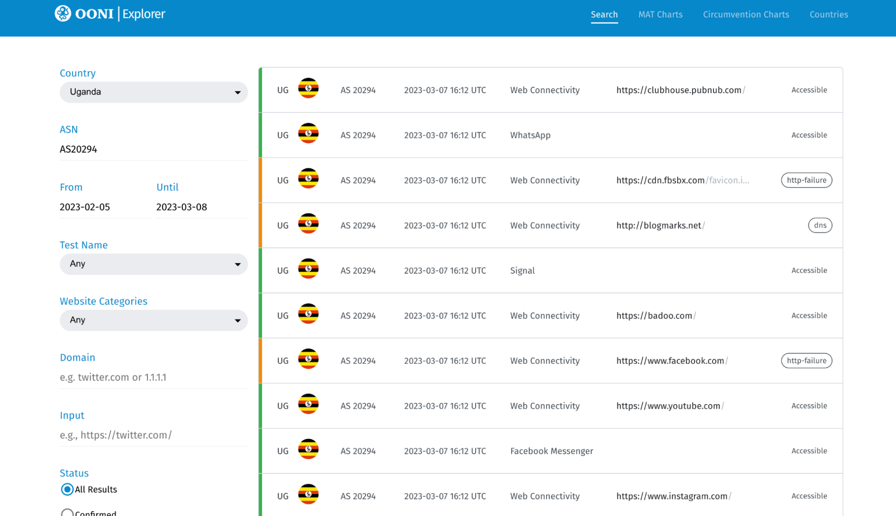
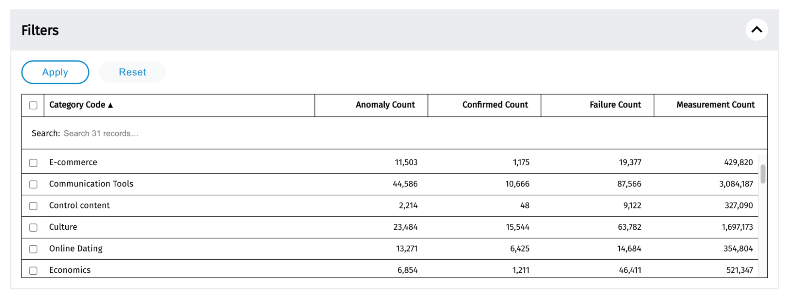
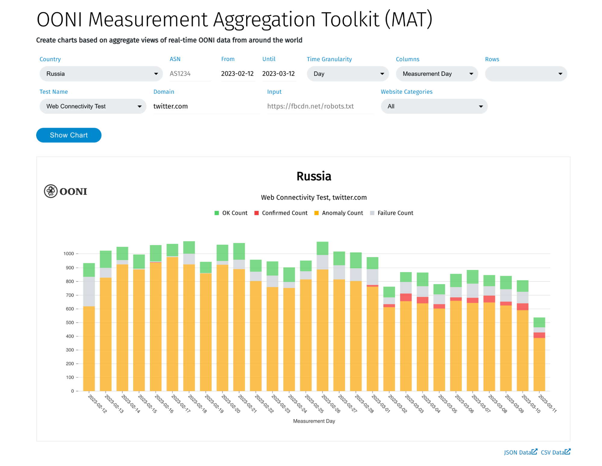

**Last updated:** 15th March 2023

{{}}

[OONI Explorer](https://explorer.ooni.org/) is an open data resource on internet censorship around the world.

This user guide provides **step-by-step instructions** on how to use OONI Explorer to investigate internet censorship worldwide.

**What you will get from this guide:**

*   Learn how to use **[OONI Explorer](https://explorer.ooni.org/)** to:

*   Discover **blocked websites and apps** around the world
*   Access **measurement data** that can serve as evidence of internet censorship
*   Generate **charts** based on aggregate views of OONI data
*   **Compare censorship** across countries and networks
*   Filter measurements based on various parameters (such as country, ASN, date range, OONI Probe test, websites categories, domains, etc.)

Upon reading this guide, we hope you will feel empowered to investigate internet censorship through the use of OONI Explorer. We also recommend reading the article “**[Is the Website Blocked? Verifying Internet Censorship with OONI Explorer](https://imap.sinarproject.org/news/is-the-website-blocked-verifying-internet-censorship-with-ooni-explorer)**” written by our partner, [Sinar Project](https://ooni.org/partners/sinar-project/).

The following table of contents should help with navigating the guide.



## About OONI Explorer

### What is OONI Explorer?

[OONI Explorer](https://explorer.ooni.org/) is an **open data resource on internet censorship around the world**. It hosts more than a billion OONI measurements collected from 241 countries and territories since 2012. Every day, hundreds of thousands of new OONI measurements are openly published on OONI Explorer from around the world in near real-time.

OONI Explorer was created by the [Open Observatory of Network Interference (OONI)](https://ooni.org/), a non-profit born out of the [Tor Project](https://www.torproject.org/) in 2012. OONI Explorer was first [launched](https://blog.torproject.org/ooni-explorer-censorship-and-other-network-anomalies-around-world/) in March 2016, and has been [revamped](https://ooni.org/post/next-generation-ooni-explorer/) since.

### What data does OONI Explorer host?

Data hosted on OONI Explorer is contributed by [OONI Probe](https://ooni.org/install/) users around the world. Therefore, **OONI data is OONI Probe test results**.

OONI Probe is [free software](https://github.com/ooni/probe) designed to measure internet censorship and other forms of network interference. With the OONI Probe app (available for both [mobile](https://ooni.org/install/mobile) and [desktop](https://ooni.org/install/desktop) platforms), you can run [network measurement tests](https://ooni.org/nettest/) to check the following:

*   Blocking of [websites](https://ooni.org/nettest/web-connectivity/);
*   Blocking of instant messaging apps ([WhatsApp](https://ooni.org/nettest/whatsapp/), [Facebook Messenger](https://ooni.org/nettest/facebook-messenger/), [Signal](https://ooni.org/nettest/signal/), [Telegram](https://ooni.org/nettest/telegram/));
*   Blocking of circumvention tools ([Tor](https://ooni.org/nettest/tor/), [Psiphon](https://ooni.org/nettest/psiphon/));
*   Presence of systems ([middleboxes](https://ooni.org/support/glossary/#middlebox)) on your network that might be responsible for censorship and/or surveillance;
*   [Speed and performance](https://ooni.org/nettest/ndt/) of your network.

As soon as you run OONI Probe, your test results are automatically published on [OONI Explorer](https://explorer.ooni.org/) in near real-time.

OONI [openly publishes OONI Probe test results](https://ooni.org/data/) gathered from around the world to:

*   **Increase transparency** of internet censorship worldwide;
*   Share **evidence of internet censorship** and other forms of network interference;
*   Enable the **independent verification** of OONI censorship findings;
*   Support **reproducible research**;
*   Support **research, policy, legal, and advocacy efforts** around the world;
*   Support **public debate** on information controls.

To enable public access to OONI Probe test results (more commonly referred to as “measurements”), we made them available on [OONI Explorer](https://explorer.ooni.org/): a web platform that provides charts based on measurement coverage and a search tool for exploring the measurements.

### Why use OONI Explorer?

**OONI Explorer is likely the largest global open data resource on internet censorship to date.** Thanks to [OONI Probe](https://ooni.io/install/) users around the world (who contribute measurements), more than a billion network measurements have been collected from 25,000 networks in 241 countries and territories since 2012. All of these measurements are openly available on [OONI Explorer](https://explorer.ooni.org/).

**You can use OONI Explorer to uncover evidence of internet censorship worldwide.** Every day, hundreds of thousands of new measurements are published from around the world. OONI Explorer is an expanding public archive on global internet censorship.

Some questions that you can answer via OONI Explorer include:

*   **Blocking of websites.** Which [websites](https://ooni.io/nettest/web-connectivity/) are blocked and by which ISPs? How are websites blocked (i.e. which censorship techniques)? How does the blocking of websites differ across countries, ISPs and over time?
*   **Blocking of instant messaging apps.** Are [WhatsApp](https://ooni.io/nettest/whatsapp/), [Facebook Messenger](https://ooni.io/nettest/facebook-messenger/), [Signal](https://ooni.org/nettest/signal/), and [Telegram](https://ooni.io/nettest/telegram/) blocked? If so, how? How does their blocking differ across networks and over time?
*   **Blocking of circumvention tools.** Do circumvention tools, like [Psiphon](https://ooni.org/nettest/psiphon/) and [Tor](https://ooni.org/nettest/tor/), work on tested networks? If not, are they blocked?

You can also use OONI Explorer to **independently verify our findings** (published through our [research reports](https://ooni.org/reports/)), and to expand upon our research. Through open data, we aim to support **reproducible research**.

### Who is OONI Explorer for?

[OONI Explorer](https://explorer.ooni.org/) is for anyone interested in investigating internet censorship. The platform was built with the following audiences in mind:

*   **Human rights defenders.** Inform your [advocacy efforts](https://www.accessnow.org/keepiton/) based on censorship events and trends identified around the world through OONI data.
*   **Journalists.** Enhance the credibility of your stories by referencing network measurement data as evidence of censorship events. [Discover unreported censorship stories](https://cpj.org/2019/09/qa-ooni-explorer-team-unlock-the-webs-untold-censo/) through OONI data.
*   **Lawyers.** Examine the legality of censorship events identified through OONI data. Consider using OONI data as evidence in court cases.
*   **Researchers.** Explore your own research questions through OONI network measurement data.
*   **Circumvention tool projects.** Inform the development of your tools and strategies based on information about censorship events around the world.
*   **The public.** Keep your government and your Internet Service Providers (ISPs) to account.

### What does OONI Explorer include?

[OONI Explorer](https://explorer.ooni.org/) is a web platform designed to enable the investigation of internet censorship worldwide. To this end, OONI Explorer includes several tools and pages:

*   **[Search Tool](https://explorer.ooni.org/search).** Filter OONI measurements based on a variety of factors, such as country, ASN (network), date range, OONI Probe test, website categories, and testing status. Discover automatically [confirmed blocked websites](https://explorer.ooni.org/search?since=2023-02-05&until=2023-03-08&failure=false&test_name=web_connectivity&only=confirmed), and narrow the measurements based on the questions you want to answer.
*   **[Measurement Aggregation Toolkit (MAT)](https://explorer.ooni.org/chart/mat).** Generate charts based on aggregate views of OONI data and track emergent censorship events around the world.
*   **[Circumvention Tool Reachability Dashboard](https://explorer.ooni.org/chart/circumvention).** Check if circumvention tools work around the world based on aggregate views of OONI data.
*   **[Country pages](https://explorer.ooni.org/countries).** Each OONI Explorer country page includes:
    *   Graph on monthly measurement coverage per OONI Probe test type;
    *   [Reports](https://ooni.org/reports/) published by OONI based on the analysis of OONI data from that country (if available);
    *   Categories of websites (e.g human rights, news media) confirmed blocked in that country (limited to countries where blocking confirmation is automated based on fingerprints);
    *   Charts with aggregate measurement views of most recently blocked websites (based on OONI data);
    *   Charts with aggregate measurement views on the recent testing of instant messaging apps (showing if they’re presenting signs of blocking);
    *   Charts with aggregate measurement views on the recent testing of circumvention tools (showing if they’re presenting signs of blocking).

*   **[OONI Explorer home page](https://explorer.ooni.org/).** View a graph on monthly OONI measurement coverage worldwide, as well as censorship highlights discovered through OONI data.

Learn how to use the OONI Explorer [Search Tool](https://explorer.ooni.org/search) and [Measurement Aggregation Toolkit (MAT)](https://explorer.ooni.org/chart/mat) through the following sections of this guide.

## Using OONI Explorer

### Search Tool

With the OONI Explorer [Search Tool](https://explorer.ooni.org/search), you can filter OONI measurements based on a variety of factors (such as country, ASN, date range, OONI Probe test, website categories, and testing status), and narrow the measurements based on the questions you want to answer.

Notably, you can easily discover automatically [confirmed blocked websites](https://explorer.ooni.org/search?since=2023-02-05&until=2023-03-08&failure=false&test_name=web_connectivity&only=confirmed) around the world.

You can use the OONI Explorer Search Tool through the following steps:

**Step 1.** Access the OONI Explorer Search Tool page: [https://explorer.ooni.org/search](https://explorer.ooni.org/search) 

{{}}

As you will see, the Search Tool page includes a variety of filters on the left, and a list of OONI Probe test results (“measurements”) from around the world on the right. The most recent OONI measurements are listed first, with each row including an individual measurement.

Each row includes certain metadata that enables you to gain an overview of the measurement. Such metadata includes:

*   Country code (e.g `BR` for `Brazil`) and flag (enabling identification of the **country** from which the measurement was collected);
*   [ASN](https://ooni.org/support/glossary#asn) (enabling identification of the **network** from which the measurement was collected);
*   **Date and time of testing** (in UTC);
*   **OONI Probe test name** (e.g `Psiphon` for the [OONI Probe Psiphon test](https://ooni.org/nettest/psiphon/));
*   Tested URL;
*   Testing status (e.g `OK`).

For example, through the following measurement (the first listed in the above screenshot), we can see that Psiphon was found reachable (“OK”) when tested in Brazil (AS27699 network) on 7th March 2023 (at 17:30 UTC).

{{}}

You can learn more (and access the relevant data) by clicking on the measurement row. This is discussed further in the “Measurement pages” sections below.

#### Filters

As the OONI Explorer [Search page](https://explorer.ooni.org/search) lists all OONI measurements from around the world, we provide filters that enable you to narrow your search based on specific parameters.

Specifically, the OONI Explorer Search page includes filters for narrowing the measurements based on:

*   Country
*   ASN
*   Date range
*   OONI Probe test
*   Website categories
*   Domain
*   Input
*   Testing status

##### Country

When you first arrive on the [Search page](https://explorer.ooni.org/search), the default Country filter is set to `Any`, which is why you view measurements from around the world.

{{}}

To limit OONI measurements to a specific country:

**Step 1.** Click on the Country dropdown menu and **click on a country** (in this example, we select Azerbaijan).

{{}}

**Step 2.** Click **Filter Results** at the end of the filters to narrow your search to measurements from the selected country.

{{}}

You will now only see measurements collected from the selected country (for example, Azerbaijan).

{{}}

##### ASN

Internet censorship often differs from network to network within a country. It can therefore be interesting to compare censorship across networks, or to limit your analysis to measurements from a specific network.

By default, the [Search page](https://explorer.ooni.org/search) lists measurements from all tested ASNs.

An [Autonomous System Number (ASN)](https://ooni.org/support/glossary#asn) is a unique identifier of an autonomous system (AS). This number allows the respective autonomous system to exchange routing information with other systems. An Internet Service Provider (ISP) usually has an officially registered ASN (and they can have more than one ASN). OONI Probe collects the ASN to identify the network in which each test was performed.

Looking up an ASN number in a web search engine (such as Google) will show you which ISP it corresponds to. For example, searching for “AS30722” should return “Vodafone Italia”.

To narrow your search to measurements collected from a specific network:

**Step 1.** Look up the **ASN** for the network you’re interested in (for example, MTN Uganda) in a web search engine (such as Google).

{{}}

The first search results should display the ASN for the provider you’re interested in. In the above example, we can see that by searching “MTN Uganda ASN” we get the following ASN: `AS20294`.

**Step 2.** Type the ASN (e.g AS20294) in the ASN field of the Search page filters.

{{}}

**Important:** Please ensure that you either have `Any` or the country where this provider operates (e.g Uganda) selected in the Country filter. If you have selected a country which is unrelated to the added ASN, you will get a “No Results Found” message.

**Step 3.** Click **Filter Results** at the end of the filters to narrow your search to measurements from the selected network.

{{}}

You will now only see measurements collected from the selected network (for example, MTN Uganda).

{{}}

##### Date range

OONI data spans for 2012 to date, with new measurements published from around the world in near real-time.

When you first arrive on the [Search page](https://explorer.ooni.org/search), you may notice that only measurements collected over the last month are listed. This default monthly date range has been set for performance reasons.

{{}}

To change the date range:

**Step 1.** Click under the **From** filter to select the starting date. You can select the day and year of your choice, or you can click on one of the `Today`, `Last Week`, `Last Month`, or `Last Year` buttons (if you would like to narrow your measurement search to the last day, week, month, or year).

{{}}

**Step 2.** Click **Apply** to add the selected starting date. In this example, we have selected `1st February 2022` as the starting date for our measurements.

**Step 3.** Click under the **Until** filter to select the end date. In this example, we have selected `31st March 2022` as the end date for our measurements.

{{}}

**Step 4.** Click **Apply** to add the selected end date.

**Step 5.** Click **Filter Results** at the end of the filters to narrow your search to measurements for the selected date range.

{{}}

You will now only see measurements collected from the selected date range (for example, 1st February 2022 to 31st March 2022).

{{}}

You can further narrow your measurements to a specific country and/or ASN by adjusting the relevant filters (as discussed previously).

**Note:** 

*   OONI data is generally available from **2012** to date. However, the availability of data depends on when [OONI Probe](https://ooni.org/install/) users in each country started running tests. In many countries, for example, OONI measurement coverage only began in 2016.
*   When selecting large date ranges (for example, larger than a year), OONI Explorer might take a bit longer to load the measurements. We thank you for your patience.
*   To view measurements from a **specific day**, please select that day and the next day in the date range (for example, to view measurements from 8th March 2023, select `2023-03-08` in the `From` filter, and `2023-03-09` in the `Until` filter).

##### OONI Probe test

Depending on the question you want to answer, you are probably interested in measurements collected from different [OONI Probe tests](https://ooni.org/nettest/).

For example, if you’re interested in checking the blocking of WhatsApp, you’d need to check measurements from the [OONI Probe WhatsApp test](https://ooni.org/nettest/whatsapp/). If you’re interested in checking the blocking of websites, you’d need to check measurements from the [OONI Probe Web Connectivity test](https://ooni.org/nettest/web-connectivity/). You can learn about all the available OONI Probe tests (and how they work) [here](https://ooni.org/nettest/).

To narrow the measurements to specific tests:

**Step 1.** Click the **Test Name** dropdown menu in the [Search page](https://explorer.ooni.org/search).

{{}}

As you will see through the dropdown menu, OONI Probe tests are categorized based on the type of testing that they perform. For example, the tests for the WhatsApp, Facebook Messenger, Signal, and Telegram apps are listed under the “Instant Messaging” category.

**Step 2.** Click on an OONI Probe test name. In this example, we clicked on “Web Connectivity Test” to get measurements pertaining to the testing of websites.  

{{}}

**Step 3.** Click **Filter Results** at the end of the filters to narrow your search to measurements from the selected OONI Probe test.

{{}}

You will now only see measurements collected from the selected OONI Probe test (Web Connectivity).

{{}}

You can further narrow your measurements to a specific country, ASN and/or date range by adjusting the relevant filters (as discussed previously).

##### Website categories

The OONI Probe [Web Connectivity test](https://ooni.org/nettest/web-connectivity/) measures a wide range of websites included in the public, community-curated [test lists](https://github.com/citizenlab/test-lists/tree/master/lists) hosted by the [Citizen Lab](https://citizenlab.ca/). Each of the URLs included in these lists is categorized based on [30 standardized category codes](https://github.com/citizenlab/test-lists/blob/master/lists/00-LEGEND-new_category_codes.csv).

You can use the OONI Explorer [Search Tool](https://explorer.ooni.org/search) to check the blocking of specific categories of websites (such as news media, LGTQI and human rights content) around the world.

To narrow your measurement search to specific website categories:

**Step 1.** Click the **Website Categories** dropdown menu in the [Search page](https://explorer.ooni.org/search). {{}}

**Note:** The “Website Categories” filter will only appear if you have “Web Connectivity Test” (or “Any”) selected in the Test Name filter.

**Step 2.** Click on a website category. In this example, we clicked on “News Media” to get measurements pertaining to the testing of news media websites.

 {{}}

**Step 3.** Click **Filter Results** at the end of the filters to narrow your search to measurements for the selected website category.

{{}}

You will now only see measurements collected from the selected website category (News Media).

{{}}

You can further narrow your measurements to a specific country, ASN and/or date range by adjusting the relevant filters (as discussed previously).

##### Domain

You may be interested in checking the availability of a particular website globally, or in specific countries. With the OONI Explorer [Search Tool](https://explorer.ooni.org/search), you can easily check the blocking of particular domains or IP addresses.

To narrow your search to measurements for a specific domain:

**Step 1.** Type a [domain name](https://ooni.org/support/glossary#domain-name) in the Domain field. For example, `twitter.com` is the domain of the Twitter website.

{{}}

**Important:** Please ensure that the [domain name](https://ooni.org/support/glossary#domain-name) is typed correctly. If it is mis-typed, OONI Explorer will not provide relevant measurements. If you are unsure, please copy-paste the domain when accessing the site from a browser (while excluding the HTTP(S) prefix).

 {{}}

**Note:** The “Domain” filter will only appear if you have “Web Connectivity Test” (or “Any”) selected in the Test Name filter.

**Step 2.** Click **Filter Results** at the end of the filters to narrow your search to measurements for the selected domain.

{{}}

You will now only see measurements collected from the testing of the selected domain (`twitter.com`).

{{}}

You can further narrow your measurements to a specific country, ASN and/or date range by adjusting the relevant filters (as discussed previously).

**Note:** If you don’t get any measurements for the selected domain, that may be due to one of the following reasons:

*   The selected domain is **not** **included** in the [lists of websites](https://github.com/citizenlab/test-lists/tree/master/lists) tested by OONI Probe users. You can [contribute that website to the tested lists](https://ooni.org/support/test-lists-editor), and/or you can [test that website](https://ooni.org/support/ooni-probe-desktop#testing-websites-of-your-choice) with the [OONI Probe app](https://ooni.org/install/).
*   The selected domain was **not** **tested** by OONI Probe users in the country and/or date range that you selected.
*   The domain was **mis-typed**.

##### Input

With the OONI Explorer [Search Tool](https://explorer.ooni.org/search), you can easily check the blocking of particular URLs or IP addresses.

To narrow your search to measurements for a specific [URL](https://ooni.org/support/glossary#url):

**Step 1.** Type a [URL](https://ooni.org/support/glossary#url) in the Input field. For example, `https://twitter.com/` is the URL of the Twitter website.

{{}}

**Important:** Please ensure that the [URL](https://ooni.org/support/glossary#url) is typed correctly, and that it includes a trailing slash (`/`). If it is mis-typed, OONI Explorer will not provide relevant measurements. If you are unsure, please copy-paste the URL when accessing the site from a browser (including the HTTP(S) prefix).

{{}}

**Note:** The “Input” filter will only appear if you have “Web Connectivity Test” (or “Any”) selected in the Test Name filter.

**Step 2.** Click **Filter Results** at the end of the filters to narrow your search to measurements for the selected URL.

{{}}

You will now only see measurements collected from the testing of the selected URL (`https://twitter.com/`).

{{}}

You can further narrow your measurements to a specific country, ASN and/or date range by adjusting the relevant filters (as discussed previously).

**Note:** If you don’t get any measurements for the selected URL, that may be due to one of the following reasons:

*   The selected URL is **not** **included** in the [lists of websites](https://github.com/citizenlab/test-lists/tree/master/lists) tested by OONI Probe users. You can [contribute that website to the tested lists](https://ooni.org/support/test-lists-editor), and/or you can [test that website](https://ooni.org/support/ooni-probe-desktop#testing-websites-of-your-choice) with the [OONI Probe app](https://ooni.org/install/).
*   The selected URL was **not** **tested** by OONI Probe users in the country and/or date range that you selected.
*   The URL was **mis-typed**.

##### Testing status

Generally, [OONI Probe tests](https://ooni.org/nettest/) will present one of the following three types of results:

*   **Normal.** A “normal” measurement is a testing result with the expected outcome, where nothing is out of the ordinary. When websites and apps are tested, a “normal” measurement is when they are considered accessible. In the case of middlebox tests, a “normal” measurement is when no middleboxes have been detected, and there are therefore no clear signs of network tampering.
*   **Confirmed blocked.** A measurement is “confirmed blocked” when the blocking of a website is automatically detected based on [fingerprints](https://github.com/ooni/blocking-fingerprints). Based on our current heuristics, this can **only apply to websites** when an Internet Service Provider (ISP) **serves a block page** (which notifies the user that the website is intentionally blocked) or when DNS resolution returns an IP associated with censorship.
*   **Anomalous.** An “anomalous” measurement is a testing result which is flagged because it presents signs of potential network interference (such as the blocking of a website or app, or the presence of a middlebox). An anomalous measurement does not necessarily contain evidence of internet censorship, as it might be a [false positive](https://ooni.org/support/glossary#false-positive). Essentially, an anomalous measurement signals that something is wrong and that we should look deeper into the measurement data to determine what is happening.

By default, the OONI Explorer [Search Tool](https://explorer.ooni.org/search) presents all measurements, regardless of the testing result.

{{}}

**Note:** The “Status” filter will only present the “Confirmed” option if you have “Web Connectivity Test” (or “Any”) selected in the Test Name filter.

To narrow your search to automatically **confirmed blocked websites**:

**Step 1.** Click **Confirmed** in the Status filter of the [Search page](https://explorer.ooni.org/search).

{{}}

**Step 2.** Click **Filter Results** to narrow your search to measurements for automatically confirmed blocked websites.

{{}}

You will now see measurements from confirmed blocked websites around the world.

{{}}

You can further narrow your measurements to a specific country, ASN, domain and/or date range by adjusting the relevant filters (as discussed previously).

To narrow your search to **anomalous** measurements:

**Step 1.** Click **Anomalies** in the Status filter of the [Search page](https://explorer.ooni.org/search).

{{}}

**Note:** By default, failed measurements (when the experiment failed to perform as expected) are disabled from the view, but you can enable them by **unticking the “Hide failed measurements” option**. As some [failed measurements can be symptomatic of censorship](https://ooni.org/post/improving-data-quality-analysis-of-failed-measurements/), we encourage researchers to analyze them.

**Step 2.** Click **Filter Results** to narrow your search to anomalous measurements.

You will now only see measurements that present anomalies (signs of network interference).

{{}}

Anomalous measurements pertaining to the testing of websites also list the specific type of anomaly (`DNS`, `TCP/IP`, `HTTP-failure`, `HTTP-diff`), which can help with characterizing blocking (for example, a DNS anomaly can be indicative of [DNS tampering](https://ooni.org/support/glossary#dns-tampering)). However, it’s important to look at anomalies in aggregate, and to inspect the raw measurement data to rule out [false positives](https://ooni.org/support/faq#what-are-false-positives).

#### Measurement pages

Testing details and evidence of potential internet censorship are available in the measurement pages of each OONI Probe test result.

To access a measurement page:

**Step 1.** Access the OONI Explorer Search Tool page: [https://explorer.ooni.org/search](https://explorer.ooni.org/search) 

{{}}

**Step 2.** Click on one of the listed measurement rows. In this example, we clicked on the latest WhatsApp measurement collected from Russia.

{{}}

Each measurement page starts off with a color-coded banner (green for `OK`, orange for `Anomaly`, red for `Confirmed blocked websites`), providing an **overview of key information** pertaining to the measurement.

In the above example, we can see that WhatsApp was found accessible when tested in Russia on LTD "Erline" (AS47895) on 8th March 2023 (at 6:22 PM UTC).

The banner also includes 3 links:

*   **Country.** By clicking on the country name (e.g Russia), you will access the country-specific page on OONI Explorer, providing measurement information specific to that country.
*   **ASN.** By clicking on the listed ASN (e.g AS47895, LTD "Erline"), you will access a network-centric page, providing measurement information specific to that network.
*   **Verify.** This feature enables (experienced) OONI Explorer users to submit feedback on measurements, enabling us to improve our analysis heuristics.

**Step 3.** Scroll down the measurement page to view further details.

{{}}

After the banner, we provide a **summary of the testing details** (which differ from test to test, depending on how each [OONI Probe test](https://ooni.org/nettest/) works). In the above example (taken from a [measurement](https://explorer.ooni.org/measurement/20230308T175446Z_whatsapp_RU_47895_n1_ApcWgzIgA2oi4nNx) testing WhatsApp in Russia), we can see that all connections to tested WhatsApp endpoints were successful. We can also see that, overall, the testing of WhatsApp Mobile, WhatsApp Web, and WhatsApp’s registration service were successful. For these reasons, the [test](https://ooni.org/nettest/whatsapp/) determined that “WhatsApp was accessible” at the moment (and on the network) when it was tested in Russia.

To view the measurement details, scroll down to the end of the measurement page, where you can also **download the raw data in JSON format**.

{{}}

**Step 4.** Click **Expand All** to view the measurement details of the raw data.

{{}}

Most of the details that are relevant to the measurement results are nested under `test_keys`.

**Step 5.** Expand the keys to view further measurement details.

##### Confirmed

Websites are annotated as “confirmed blocked” when the block is implemented in such a way that we are able to automatically detect it based on [fingerprints](https://github.com/ooni/blocking-fingerprints).

This can occur in two cases:

*   A [block page](https://ooni.org/support/glossary#block-page) is served;
*   DNS resolution returns an IP associated with censorship.

Automatically detecting the above cases requires that relevant [fingerprints](https://github.com/ooni/blocking-fingerprints) have been added to the OONI database. ISPs also block websites using a variety of different censorship techniques (such as IP blocking, resetting connections, etc), but since those cases aren’t easy to fingerprint (or automatically distinguish from [false positives](https://ooni.org/support/faq#what-are-false-positives)), they are annotated as “anomalies” (discussed in the next section).

By [filtering measurements based on “confirmed”](https://explorer.ooni.org/search?since=2023-02-07&until=2023-03-10&failure=false&only=confirmed) in the OONI Explorer [Search Tool](https://explorer.ooni.org/search) (explained in previous sections), you can access measurements annotated as “confirmed blocked” from around the world.

{{}}

**Step 1.** Click on a row to access a “confirmed blocked” measurement.

{{}}

In this example, we clicked on a measurement pertaining to the testing of `https://twitter.com` in Iran on 9th March 2023.

{{}}

Upon accessing the measurement, the banner informs us that `https://twitter.com` was confirmed blocked when tested in Iran (on AS50810) on 9th March 2023 (at 10:33 AM UTC).

**Step 2.** Scroll down the measurement page to view further details.

{{}}

In the summary of the testing details (illustrated above), we can see that DNS resolution returned the [private IPv4 address](https://en.wikipedia.org/wiki/Private_network#Private_IPv4_addresses) `10.10.34.35` (instead of Twitter’s actual IP address), which is [commonly used by Iranian ISPs](https://ooni.org/post/2020-iran-blocks-farsi-wikipedia/) for the implementation of censorship. In other words, OONI data shows that users of this network in Iran cannot access Twitter because instead of getting Twitter’s IP address, they get the private IP `10.10.34.35`. OONI Explorer displays this case as “confirmed blocked” because the IP `10.10.34.35` is included in the fingerprints added to OONI’s database.

To view the measurement details, scroll down to the end of the measurement page, where you can also **download the raw data in JSON format**.

{{}}

**Step 3.** Click on `test_keys` to expand the nested measurement details.

{{}}

This data can potentially serve as evidence of internet censorship, since it shows that the ISP implemented DNS based tampering, returning a private IP ([known](https://ooni.org/post/2020-iran-blocks-farsi-wikipedia/) to be associated with censorship) instead of the actual IP address for the requested website (`https://twitter.com`).

In other “[confirmed blocked](https://explorer.ooni.org/search?since=2023-02-07&until=2023-03-10&failure=false&only=confirmed)” measurements, you will find cases where:

*   Returned IPs (as part of DNS resolution) host [block pages](https://ooni.org/support/glossary#block-page) (you can see this by accessing such IPs from a browser);
*   [Block pages](https://ooni.org/support/glossary#block-page) are served (you can see them in the [HTTP response body](https://explorer.ooni.org/measurement/20230309T101625Z_webconnectivity_RU_25513_n1_gi2C1U1RkUh8G8e0?input=http%3A%2F%2Fwww.xgay.ru%2Ftogether%2F) of measurements).

##### Anomaly

OONI measurements are annotated as “anomalies” when they present signs of potential network interference (such as the blocking of a website or app).

Unlike “confirmed blocked” measurements (which only apply to websites), measurements from most [OONI Probe tests](https://ooni.org/nettest/) can result in anomalies if the tested service fails to meet the testing criteria for accessibility (or if the tested network presents signs of network tampering). Measurements from the testing of instant messaging apps (such as [WhatsApp](https://ooni.org/nettest/whatsapp/)) or circumvention tools (such as [Tor](https://ooni.org/nettest/tor/)) present anomalies if they are blocked. However, [false positives](https://ooni.org/support/faq#what-are-false-positives) can emerge, which is why it’s important to look at anomalous measurements in aggregate (discussed in the next section).

Many cases of website blocking are not automatically detected, and will be present in “anomalous” measurements. Specifically, OONI’s [Web Connectivity test](https://ooni.org/nettest/web-connectivity/) (which measures websites for blocking) identifies the following types of anomalies (while automatically comparing measurements from the local, tested network with those from a control vantage point):

* **DNS anomaly.** If the [DNS responses](https://ooni.org/support/glossary#dns-lookup) (such as the IP addresses mapped to host names) do not match;
* **TCP/IP anomaly.** If a [TCP](https://ooni.org/support/glossary#tcp) session to connect to websites was not established over the network of the user;
* **HTTP anomaly.** 
   * **HTTP-failure.** If the [HTTP request](https://ooni.org/support/glossary#http-request) over the user’s network failed (resulting in a connection reset, connection timeout, etc).
   * **HTTP-diff.** If the [HTTP response](https://ooni.org/support/glossary#http-response) the probe got [differs from the response seen in the control measurement](https://github.com/ooni/spec/blob/master/nettests/ts-017-web-connectivity.md#test-description).

These anomalies can indicate the presence of **[DNS tampering](https://ooni.org/support/glossary#dns-tampering)** (DNS anomaly), **[IP blocking](https://ooni.org/support/glossary#tcpip-blocking)** (TCP/IP anomaly), **[HTTP blocking](https://ooni.org/support/glossary#http-blocking)** (e.g [block page](https://ooni.org/support/glossary#block-page)), or **[TLS](https://ooni.org/support/glossary#tls)** **based interference** (e.g connection reset observed right after the ClientHello message during the TLS handshake). However, false positives can emerge due to [many reasons](https://ooni.org/support/faq#why-do-false-positives-occur). It is therefore important to examine anomalies in aggregate, further aggregate based on anomaly types (e.g `HTTP-failure`), and to check if the tested service consistently presents the same failure (e.g `connection_reset`) on the same tested ASN. If a tested service consistently presents the same failures, those measurements provide a stronger signal of blocking.

By [filtering measurements based on “anomaly”](https://explorer.ooni.org/search?since=2023-02-09&until=2023-03-12&failure=false&only=anomalies) in the OONI Explorer [Search Tool](https://explorer.ooni.org/search) (explained in previous sections), you can access measurements annotated as “anomalies” from around the world.

{{}}

**Step 1.** Click on a row to access an “anomalous” measurement.

{{}}

In this example, we clicked on a [measurement](https://explorer.ooni.org/measurement/20230311T125058Z_webconnectivity_RU_42437_n1_PCIf051HVVvMCEos?input=https%3A%2F%2Ftwitter.com%2F) pertaining to the testing of `https://twitter.com` in Russia on 11th March 2023. From the measurement listing, we can see that the testing resulted in an `http-failure` (indicating that the HTTP experiment failed).

{{}}

Upon accessing the measurement, the banner informs us that the testing of `https://twitter.com` presented an “anomaly” (as the HTTP request failed) when tested in Russia (on AS42437) on 11th March 2023 (at 12:51 PM UTC).

**Step 2.** Scroll down the measurement page to view further details.

{{}}

In the summary of the testing details (illustrated above), we can see that the DNS queries returned the correct IP addresses, and that the TCP connections to the resolved IPs were successful.

However, the **HTTP experiment failed**, resulting in a `connection_reset` error. Specifically, the HTTP request returned no data, because the connection was reset. As a result, a user on this network in Russia likely could not access `https://twitter.com`.

To view the measurement details, scroll down to the end of the measurement page, where you can also **download the raw data in JSON format**.

{{}}

**Step 3.** Click on `test_keys` to expand the nested measurement details.

{{}}

From the `test_keys` (illustrated above), we can see that the HTTP experiment failed, resulting in a `connection_reset` error. To explore further:

**Step 4.** Click on `tls_handshakes`.

{{}}

The `tls_handshakes` key has details nested below. In the above example, there are 4 nested items (one for each of the 4 resolved IPs).

**Step 5.** Click on the nested items under the `tls_handshakes` key.

{{}}

We can see that the connection was reset (`connection_reset` error) for each of Twitter’s resolved IPs during the TLS handshake, suggesting **TLS level interference**. To explore further:

**Step 6.** Click on `network_events` (and on the items nested under this key).

{{}}

Through the `network_events` keys, we can see the TLS handshake process for each of the resolved IP addresses.

In the above example, we can see that the probe successfully connected to the IP `104.244.42.1:443` and started the TLS handshake. However, the connection was reset right after the ClientHello message (`read` operation) during the TLS handshake. This shows TLS level interference, and may indicate the use of [Deep Packet Inspection (DPI)](https://ooni.org/support/glossary#dpi) technology. Based on this [measurement](https://explorer.ooni.org/measurement/20230311T125058Z_webconnectivity_RU_42437_n1_PCIf051HVVvMCEos?input=https%3A%2F%2Ftwitter.com%2F), access to Twitter appears to be blocked in Russia, though it’s important to look at relevant measurements in aggregate (discussed in the next section).

### Measurement Aggregation Toolkit (MAT)

While individual measurements contain raw data with details that are necessary for characterizing (and confirming) censorship events, it’s important to look at many relevant measurements at once (in aggregate) to identify trends and patterns (and rule out false positives). For example, if the testing of WhatsApp presents anomalies every time it is tested on a network in February 2023, that provides a stronger signal of blocking than if WhatsApp only presented one anomaly, but was found accessible every other time it was tested on that network (i.e that one anomaly may have been a false positive).

To enable you to **visualize OONI data and view it in aggregate**, we built the [Measurement Aggregation Toolkit (MAT)](https://explorer.ooni.org/chart/mat). You can use the MAT to **generate charts** based on aggregate views of real-time OONI data collected from around the world.

Specifically, you can use the MAT to answer the following types of questions:

*   Does the testing of a service (e.g. Facebook) present **signs of blocking every time that it is tested** in a country? This can be helpful for ruling out [false positives](https://ooni.org/support/faq/#what-are-false-positives).
*   What **types of websites** (e.g. human rights websites) are blocked in each country?
*   In **which countries** is a specific website (e.g. bbc.com) blocked?
*   How does the blocking of different apps (e.g. WhatsApp or Telegram) vary across countries?
*   How does the blocking of a service vary across countries and [ASNs](https://ooni.org/support/glossary/#asn)?
*   How does the blocking of a service **change over time**?

You can answer such questions and generate charts based on OONI data by adjusting the MAT filters.

#### Filters

At the start of the [MAT](https://explorer.ooni.org/chart/mat) page, you can adjust the filters and click `Show Chart` to plot charts based on aggregate views of OONI data.

{{}}

The MAT includes the following filters:

*   **Country:** Select a country through the drop-down menu (the "All Countries" option will show global coverage).
*   **Test Name:** Select an [OONI Probe test](https://ooni.org/nettest/) based on which you would like to get measurements (for example, select `Web Connectivity` to view the testing of websites).
*   **Domain:** Type the domain for the website you would like to get measurements (e.g. `twitter.com`).
*   **Input:** Type the URL for the website you would like to get measurements (e.g `https://twitter.com/`).
*   **Website Categories:** Select the [website category](https://github.com/citizenlab/test-lists/blob/master/lists/00-LEGEND-new_category_codes.csv) for which you would like to get measurements (e.g. `News Media` for news media websites).
*   **ASN:** Type the [ASN](https://ooni.org/support/glossary/#asn) of the network for which you would like to get measurements (e.g. `AS30722` for Vodafone Italia).
*   **Date range:** Select the date range of the measurements by adjusting the `From` and `Until` filters (OONI data spans from 2012 to date, but large date ranges may take longer to load).
*   **Time Granularity:** Adjust the time granularity of the measurements (daily, weekly, or monthly for longer time intervals).
*   **Columns:** Select the values (`measurement day`, `website categories`, `countries`) that you would like to appear on the **horizontal axis** of your chart.
*   **Rows:** Select the values (`domain`,`website categories`, `countries`, `asn`) that you would like to appear on the **vertical axis** of your chart.

Measurements in MAT charts (similarly to the OONI Explorer [Search Tool](https://explorer.ooni.org/search)) include the following values:

*   **OK count:** Successful measurements (i.e. NO sign of internet censorship).
*   **Confirmed count:** Measurements from automatically **confirmed blocked websites** (e.g. a [block page](https://ooni.org/support/glossary/#block-page) was served).
*   **Anomaly count:** Measurements that provide signs of **potential blocking** (however, [false positives](https://ooni.org/support/faq/#what-are-false-positives) can occur).
*   **Failure count:** Measurements from failed experiments (however, they can sometimes be [symptomatic of censorship](https://ooni.org/post/improving-data-quality-analysis-of-failed-measurements/)).

##### Filters for the y-axis

If you select a value in the `Row` (y-axis) filter (and click `Show Chart`), a table with additional filters will appear before your charts. This table includes the aforementioned measurement values, along with the overall measurement count.

{{}}

In the above example, we have selected `Website Categories` in the `Row` filter, thus checking the testing of websites based on [categories](https://github.com/citizenlab/test-lists/blob/master/lists/00-LEGEND-new_category_codes.csv) globally.

For each category (during the selected date range), the table lists the:

*   **Measurement Count:** Total number of collected measurements;
*   **Anomaly Count:** Number of measurements that presented anomalies;
*   **Confirmed Count:** Number of measurements where the blocking of websites is automatically confirmed;
*   **Failed Count:** Number of failed measurements.  

**Important:** Only website measurements can be annotated as `confirmed`. For all other tests, please refer to `anomalous` measurements, while comparing them with the `measurement count` (i.e a small percentage of anomalies, in comparison to the measurement count, may indicate false positives).

By clicking on these values in the table, the measurements with the largest volume will be listed first. For example, by **clicking Confirmed Count**, the category `News Media` is listed first with the largest volume of `confirmed blocked` measurements out of all categories (during the selected date range globally).

  {{}}

**Note:** The above example does not necessarily mean that news media websites are actually blocked more than other website categories globally. This finding is limited by several factors, such as the [number and types of websites tested](https://ooni.org/support/faq#which-websites-will-i-test-for-censorship-with-ooni-probe) (and the related selection bias) and measurement coverage.

To generate MAT charts, **select the categories** you would like to display (e.g `News Media` and `Human Rights Issues`) and **click Apply**.

{{}}

#### Generating charts based on OONI data

To generate MAT charts based on aggregate views of OONI data:

**Step 1.** Access the MAT: [https://explorer.ooni.org/chart/mat](https://explorer.ooni.org/chart/mat) 

{{}}

**Step 2.** Adjust the filters depending on the question you would like to answer. For example, to check the recent testing of Twitter in Russia, select `Russia` in the `Country` filter, and type `twitter.com` in the `Domain` field (as illustrated below).

{{}}

**Step 3.** Click **Show Chart** to plot a chart based on the selected filters.

{{}}

You will now see a chart with aggregate OONI data, generated based on the selected filters. In the above example, we can see all OONI measurements from the testing of `twitter.com` on all tested networks in Russia between 12th February 2023 to 11th March 2023. To **download the generated data** (in JSON or CSV format), click `JSON Data` or `CSV Data` at the bottom right corner of the chart.

From the above MAT chart, we can see that most measurements from the testing of `twitter.com` in Russia presented anomalies (annotated in orange), providing a strong signal of blocking. We can also see that in some cases, the blocking of `twitter.com` was automatically confirmed (annotated in red).

**Step 4.** Click on a bar in the MAT chart.

{{}}

This will show a tooltip with summary information based on the selected measurements. In this example, we can see that on 3rd March 2023: 655 measurements presented anomalies, 56 measurements confirmed the blocking of `twitter.com`, 86 measurements failed, while only 69 measurements showed that `twitter.com` was accessible.

{{}}

**Step 5.** To access these measurements, click **View measurements** in the tooltip. This will open the relevant OONI Explorer [Search page](https://explorer.ooni.org/search?since=2023-03-03&until=2023-03-04&probe_cc=RU&test_name=web_connectivity&domain=twitter.com&failure=true), pre-filtered to only show the measurements from the selected MAT chart bar.

{{}}

You can access each of these measurements by clicking on each measurement row, as described in the previous OONI Explorer Search Tool sections of this guide.

##### Filtering measurements based on multiple domains

If you’re interested in checking the blocking of specific domains in a country, you can do that through the following steps:

**Step 1.** Select **a country** (e.g `Russia`) in the `Country` filter.

**Step 2.** Select **Domain** under `Rows`.

**Step 3.** Click **Show Chart**.

{{}}

**Step 4.** Type the domain (`www.facebook.com`) that you would like to find measurements for in the `Search` field of the measurement table.

{{}}

**Note:** When you start typing the domain, other relevant domains may appear. For example, when typing `facebook`, you will also see other Facebook domains (such as `edge-mqtt.facebook.com` and `staticxx.facebook.com`), in addition to `www.facebook.com`.

**Step 5.** Click on the box for the selected domain.

{{}}

**Step 6.** Repeat the last 2 steps to add as many domains as you like.

**Note:** If you don’t find a domain, that’s either because it hasn’t been tested during the selected date range, or because it’s not being tested by [OONI Probe](https://ooni.org/install/) users in that country (in which case, you can [contribute that website](https://ooni.org/support/test-lists-editor) for testing).

**Step 7.** Click **Apply** to generate charts based on the selected domains.

{{}}

##### Other MAT use cases

Beyond the previous examples, you can use the [MAT](https://explorer.ooni.org/chart/mat) to plot charts for a variety of different questions. These include:

1) **Checking in which countries a specific website is blocked.** For example, if you would like to [check the testing of BBC globally](https://explorer.ooni.org/chart/mat?since=2023-02-09&until=2023-03-12&time_grain=day&axis_x=measurement_start_day&axis_y=probe_cc&test_name=web_connectivity&domain=www.bbc.com):

   * Type `www.bbc.com` under `Domain`
   * Select `Countries` under `Rows`
   * Click `Show Chart`
      * Click `Confirmed Count` in the measurement table
      * Select countries with the largest volume of `Confirmed Count` measurements
      * Click `Apply`

{{}}

2) **Checking which categories of websites are blocked in a country.** For example, if you would like to [check which categories of websites are blocked in Italy](https://explorer.ooni.org/chart/mat?probe_cc=IT&since=2023-02-12&until=2023-03-12&time_grain=day&axis_x=measurement_start_day&axis_y=category_code&test_name=web_connectivity):

   * Select `Italy` under `Country`
   * Select `Website Categories` under `Rows`
   * Click `Show Chart`
      * Click `Confirmed Count` in the measurement table
      * Select categories with the largest volume of `Confirmed Count` measurements
      * Click `Apply`

{{}}

3) **Checking which countries block specific categories of websites.** For example, if you would like to [check which countries block news media](https://explorer.ooni.org/chart/mat?since=2023-02-12&until=2023-03-12&time_grain=day&axis_x=measurement_start_day&axis_y=probe_cc&test_name=web_connectivity&category_code=NEWS) websites:

   * Select `All Countries` under `Country`
   * Select `News Media` under `Website Categories`
   * Select `Countries` under `Rows`
   * Click `Show Chart`
      * Click `Confirmed Count` in the measurement table
      * Select countries with the largest volume of `Confirmed Count` measurements
      * Click `Apply`

{{}}

4) **Checking which countries block instant messaging apps.** For example, if you would like to [check which countries are blocking WhatsApp](https://explorer.ooni.org/chart/mat?since=2023-02-12&until=2023-03-12&time_grain=day&axis_x=measurement_start_day&axis_y=probe_cc&test_name=whatsapp) (based on recent measurements):

   * Select `All Countries` under `Country`
   * Select `WhatsApp Test` under `Test Name`
   * Select `Countries` under `Rows`
   * Click `Show Chart`
      * Click `Anomaly Count` in the measurement table
      * Select countries with the largest `Anomaly Count` measurements
      * Click `Apply`

{{}}

5) **Comparing censorship across networks.** For example, if you would like to [check which ISPs in Russia block access to Facebook Messenger](https://explorer.ooni.org/chart/mat?probe_cc=RU&since=2023-02-12&until=2023-03-12&time_grain=day&axis_x=measurement_start_day&axis_y=probe_asn&test_name=facebook_messenger):

   * Select `Russia` under `Country`
   * Select `Facebook Messenger Test` under `Test Name`
   * Select `ASN` under `Rows`
   * Click `Show Chart`

{{}}

We hope you will find the MAT useful to your research and/or advocacy!

We thank all [OONI Probe](https://ooni.org/install/) users worldwide who have contributed – and continue to contribute – measurements, shedding light on internet censorship.

If you have any questions or need data analysis support for your research or investigation, please feel encouraged to [contact the OONI team](https://ooni.org/about/#contact). Thank you for reading this guide!
