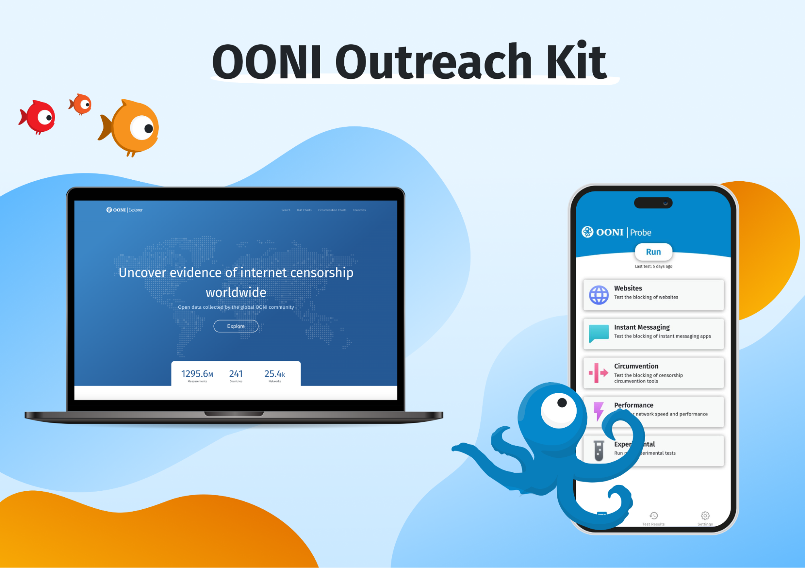

{{}}

Community engagement is at the heart of OONI’s work, as [OONI data](https://ooni.org/data/) on internet censorship depends on people running [OONI Probe](https://ooni.org/install/) around the world.

Interested in engaging your communities with OONI censorship measurement?

The OONI Outreach Kit includes **materials that you are encouraged to use** as part of your OONI community engagement efforts.

The OONI Outreach Kit is translated into [Russian](https://ooni.org/ru/support/ooni-outreach-kit/), [French](https://ooni.org/fr/support/ooni-outreach-kit/), [Spanish](https://ooni.org/es/support/ooni-outreach-kit/), [Swahili](https://ooni.org/sw/support/ooni-outreach-kit/), [Arabic](https://ooni.org/ar/support/ooni-outreach-kit/), [Farsi](https://ooni.org/fa/support/ooni-outreach-kit/).



## OONI Brochures

We provide 2 OONI brochures that include information about using OONI tools and data for investigating internet censorship around the world.

* **[OONI Brochure (short-version)](<./files/OONI Short Brochure.pdf>)**
* **[OONI Brochure (short-version for printing)](<./files/OONI Short Brochure for printing.pdf>)**, [printing file](<./files/Short Brochure A4 2F.indd>)
* **[OONI Brochure (long-version)](<./files/OONI Long Brochure.pdf>)**
* **[OONI Brochure (long-version for printing)](<./files/OONI Long Brochure for printing.pdf>)**,  [printing file](<./files/Long Brochure A5 booklet.indd>)

## OONI Probe Flyers and Leaflets

[OONI Probe](https://ooni.org/install/) is free software for measuring internet censorship. To engage people with the use of OONI Probe, we provide 3 versions of OONI Probe flyers, as well as an OONI Probe flyer that can help encourage testing leading up to and during elections (when [censorship events tend to emerge](https://ooni.org/documents/2022-ooni-submission-ohchr-report-internet-shutdowns.pdf)). We also provide 2 leaflets, one about OONI Probe and one with OONI Probe testing instructions.

* **[OONI Probe Flyer (Version 1)](<./files/OONI Probe OP 1 (Interactive).pdf>)**
* **[OONI Probe Flyer (Version 2)](<./files/OONI Probe OP 2 (Interactive).pdf>)**
* **[OONI Probe Flyer (Version 3)](<./files/OONI Probe OP 3 (Interactive).pdf>)**
* **[OONI Probe Flyer (Elections)](<./files/OONI Probe Fact Sheet for Elections (Interactive).pdf>)**
* **[OONI Probe Fact Sheet for printing](<./files/OONI Probe Fact Sheet for printing.pdf>)**, [printing file](<./files/OONI Probe Fact Sheet A5 back and front.indd>)
* **[OONI Probe Testing Instructions Leaflet](<./files/OONI Probe testing instructions (Interactive).pdf>)**

## OONI Explorer Flyers

[OONI Explorer](https://explorer.ooni.org/) is the world’s largest open dataset on internet censorship. To encourage the use of OONI Explorer, we provide 2 OONI Explorer flyers. We also provide 3 additional OONI Explorer flyers for researchers, journalists, and human rights advocates.

* **[OONI Explorer Flyer (Version 1)](<./files/OONI Explorer Fact Sheet Version 1 (Interactive).pdf>)**
* **[OONI Explorer Flyer (Version 2)](<./files/OONI Explorer Fact Sheet Version 2 (Interactive).pdf>)**
* **[OONI Explorer Flyer for Researchers](<./files/OONI Explorer for Researchers (Interactive).pdf>)**
* **[OONI Explorer Flyer for Journalists ](<./files/OONI Explorer for Journalists (Interactive).pdf>)**
* **[OONI Explorer Flyer for Advocates](<./files/OONI Explorer for Human Rights Advocates (Interactive).pdf>)**
* **[OONI Explorer Fact Sheet for printing](<./files/OONI Explorer Fact Sheet for printing.pdf>)**, [printing file](<./files/OONI Explorer Fact Sheet A5 back and front.indd>)

## Internet Censorship Flyers

Through flyers, we provide some basic information about internet censorship and how website blocks are implemented.

* **[How is Website Blocking Implemented Flyer](<./files/How is Website Blocking Implemented (Interactive).pdf>)**
* **[Internet Censorship Flyer](<./files/Internet Censorship Fact Sheet (Interactive).pdf>)**
* **[Internet Censorship Fact Sheet for printing](<./files/Internet Censorship Fact Sheet for printing.pdf>)**, [printing file](<./files/Internet Censorship Fact Sheet A4 2F.indd>)

## OONI Screencasts

Curious to see how OONI tools work? We provide screencasts and demos that you can share/show as part of your community engagement efforts.

*   **[OONI Probe Screencast](https://www.youtube.com/watch?v=tLDVpyHFsW0)**
*   **[OONI Run Screencast](https://www.youtube.com/watch?v=OGRN7ve6cIA)**
*   **[OONI Test Lists Editor Screencast](https://www.youtube.com/watch?v=6i2OVHUQEpE)**
*   **[OONI Explorer demo](https://www.youtube.com/watch?v=6Rce-xshLac)**

## OONI Workshop Slides

Interested in facilitating an OONI workshop?

We provide 3 sets of workshop slides that you’re welcome to **download and adapt depending on the needs of your audience**. These include slides for a general OONI presentation, an OONI Probe workshop (including hands-on exercises), as well as more extensive workshop slides that provide a deep-dive into examining internet censorship with OONI tools.

*   **[General OONI presentation/workshop slides](https://docs.google.com/presentation/d/1-xb2YYoSonVCEjxYbgKidOzPdO5Rxjz5F96tXom8LMA)**
*   **[OONI Probe workshop slides](https://docs.google.com/presentation/d/1_coqdWXNRuSEBp1vnDJl7T1e2Gnz2RrYy71TGuNuWmg)**
*   **[Comprehensive OONI workshop slides](https://docs.google.com/presentation/d/1FAZI3Z0DuNxbeGi-dYq6bTXvhZkFWsyKGFzJEtcruBs/)**

You can also sign-up for the **[free, online OONI training course](https://advocacyassembly.org/en/courses/63/#/chapter/1/lesson/1)** on the Advocacy Assembly platform (available in [English](https://advocacyassembly.org/en/courses/63/#/chapter/1/lesson/1), [Arabic](https://advocacyassembly.org/ar/courses/63/#/chapter/1/lesson/1), [Spanish](https://advocacyassembly.org/es/courses/63/#/chapter/1/lesson/1), and [Farsi](https://advocacyassembly.org/fa/courses/63/#/chapter/1/lesson/1)).

## OONI Resources

To make it easier to find all links to OONI resources, we provide them in an “OONI Resources” document, along with links to other relevant resources (such as those for monitoring internet connectivity shutdowns). We also provide a shortened version of the [OONI Glossary](https://ooni.org/support/glossary) which may be useful when preparing for translations or workshops.

*   **[OONI Resources](<./files/OONI Resources.pdf>)**
*   **[Short version of OONI Glossary](<./files/OONI Glossary.pdf>)**

It may also be worth referring to the [Frequently Asked Questions (FAQ)](https://ooni.org/support/faq/) section of our website.

We hope you find the resources of the OONI Outreach Kit useful! If you have any questions or suggestions on how we can improve the Outreach Kit, please [contact us](https://ooni.org/about/#contact).

We thank you for your OONI community engagement efforts, and we thank [Ura Design](https://ura.design/) for the beautiful design of the OONI Outreach Kit.
