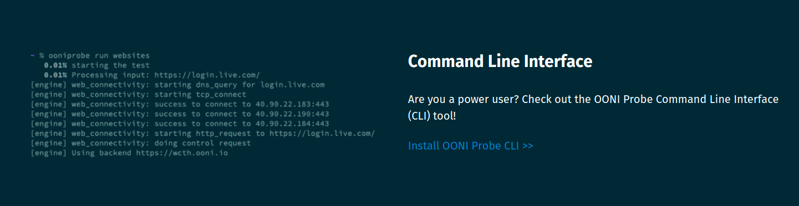
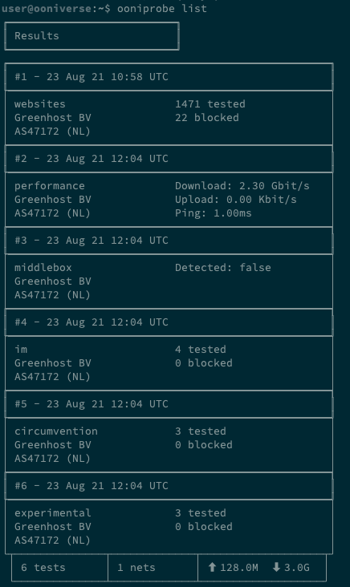
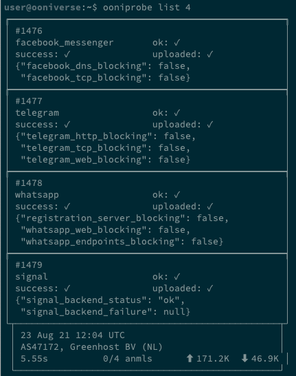

**Last updated:** 24th September 2021

**OONI Probe CLI version:** 3.9.2


{{}}


OONI Probe is [free and open source software](https://github.com/ooni/probe) that you can run to measure internet censorship and other forms of network interference. 

This user guide provides step-by-step instructions on how to install and use the [OONI Probe Command Line Interface (CLI)](https://ooni.org/install/cli). 

You can run OONI Probe CLI on **macOS**, **Debian/Ubuntu Linux**, and on **Raspberry Pis**.

**What you will get from this guide:**

* Learn how to **install** **OONI Probe CLI** on macOS, Linux, and Raspberry Pis
* Learn how to **enable automated testing** of OONI Probe CLI
* Learn how to **run OONI Probe CLI** to:
    * Test the blocking of websites
    * Test the blocking of instant messaging apps
    * Test the blocking of circumvention tools
    * Measure your network speed and performance
* Learn how to **view OONI Probe CLI test results**
* Find a reference for every command supported by OONI Probe CLI

Upon reading this guide, we hope you will feel empowered to share your OONI Probe knowledge and skills with others!

The following table of contents should help with navigating the guide.

All measurements collected through the OONI Probe CLI are automatically published as [open data](https://ooni.org/data/) in near real-time.



## Introduction to OONI Probe

OONI Probe is [free and open source software](https://github.com/ooni/probe) designed to measure internet censorship and other forms of network interference. Since 2012, this software has been developed by the [Open Observatory of Network Interference (OONI)](https://ooni.org/), a non-profit project that was originally born out of the [Tor Project](https://www.torproject.org/).

With the [OONI Probe Command Line Interface](https://ooni.org/install/cli) (available for macOS and Linux), you can run [network measurement tests](https://ooni.org/nettest/) to check the following:
* Blocking of [websites](https://ooni.org/nettest/web-connectivity/);
* Blocking of instant messaging apps ([WhatsApp](https://ooni.org/nettest/whatsapp/), [Facebook Messenger](https://ooni.org/nettest/facebook-messenger/), [Telegram](https://ooni.org/nettest/telegram/), [Signal](https://ooni.org/nettest/signal));
* Blocking of circumvention tools ([Tor](https://ooni.org/nettest/tor/), [Psiphon](https://ooni.org/nettest/psiphon/), [RiseupVPN](https://ooni.org/nettest/riseupvpn/));
* Presence of systems ([middleboxes](https://ooni.org/support/glossary/#middlebox)) on your network that might be responsible for censorship and/or surveillance;
* [Speed and performance](https://ooni.org/nettest/ndt/) of your network.

As soon as you run OONI Probe, your test results are automatically sent to OONI servers, [processed](https://github.com/ooni/pipeline), and [openly published](https://ooni.org/data/) in near real-time.

OONI [openly publishes OONI Probe test results](https://ooni.org/data/) gathered from around the world to:
* Increase **transparency of internet censorship** worldwide;
* Share **evidence of internet censorship** and other forms of network interference;
* Enable the **independent verification** of OONI censorship findings;
* Support **reproducible research**;
* Support **research, policy, legal, and advocacy efforts** around the world;
* Support **public debate** on information controls.

To enable public access to OONI Probe test results (more commonly referred to as “measurements”), the OONI team makes them available on [OONI Explorer](https://explorer.ooni.org/): a web platform that provides charts based on measurement coverage and a search tool for exploring the measurements.

As [OONI Explorer](https://explorer.ooni.org/) hosts more than 400 million network measurements collected from 23,000 networks in 240 countries and territories since 2012, it is likely the **largest global open data resource on internet censorship** to date.

By running OONI Probe, you will:
* Learn whether and how your Internet Service Provider (ISP) is censoring access to specific websites and apps;
* Contribute measurements that will be publicly archived, enabling the global internet freedom community to monitor, detect, and fight against internet censorship.

This guide aims to walk you through using the [OONI Probe Command Line Interface (CLI)](https://ooni.org/install/cli) so that you can join a global community measuring internet censorship.


### Disclaimer

As OONI Probe is designed to measure internet censorship, running it may be [risky](https://ooni.org/about/risks/) for some people in some countries.

Some things to take into account:
* **OONI Probe is not a privacy tool.** Anyone monitoring your internet activity (e.g. government, ISP, employer) may see that you are running OONI Probe (just the way they can probably see all other software you run).
* **OONI Probe is an investigatory tool.** Some OONI Probe tests are explicitly designed to uncover internet censorship.
* **[Your threat model](https://www.eff.org/keeping-your-site-alive/evaluating-your-threat-model).** A high-profile activist already under heavy surveillance, for example, might attract more attention when running OONI Probe.
* **The laws and regulations of the country you’re running OONI Probe from.** Best to consult with local lawyers.
* **The types of websites you test.** You might test legally banned (in some countries), provocative or objectionable [websites](https://ooni.org/support/faq/#which-websites-will-i-test-for-censorship-with-ooni-probe) through the use of OONI Probe.
* **The types of OONI Probe tests you run.** Not all [OONI Probe tests](https://ooni.org/nettest/) carry the same weight in terms of potential risk. OONI Probe, for example, includes the [NDT test](https://ooni.org/nettest/ndt/) (designed to measure the speed and performance of a network) which may be viewed as less political or controversial in comparison to other tests designed to measure the blocking of websites or apps.
* **Whether you publish your measurements or not.** OONI [openly publishes measurements](https://ooni.org/data/) collected from OONI Probe users to increase transparency of internet censorship around the world. We do our best not to publish your IP address or any other potentially personally-identifiable information. Learn more in our [Data Policy](https://ooni.org/about/data-policy).

To learn more about potential risks associated with the use of OONI Probe, please refer to our relevant [documentation](https://ooni.org/about/risks/).


## Get started

Thanks for deciding to run OONI Probe!


### Installation

You can install OONI Probe CLI on macOS, Debian/Ubuntu Linux, and Raspberry Pis. 

Installation instructions are provided through the links below:


* [Install OONI Probe on macOS](https://ooni.org/install/cli/macos)
* [Install OONI Probe on Debian/Ubuntu Linux](https://ooni.org/install/cli/ubuntu-debian)
* [Install OONI Probe on Raspberry Pi](https://ooni.org/install/cli/ubuntu-debian)

We currently don't officially support OONI Probe CLI usage on Windows systems. If you are a Windows user, consider installing the [OONI Probe desktop app](https://ooni.org/install/desktop).


### Enabling automated testing

We strongly recommend **enabling automated OONI Probe testing**. This will ensure that OONI Probe tests are run automatically on a regular basis, without requiring you to remember to manually run tests. That way, you can regularly contribute censorship measurements, enabling the internet freedom community to monitor and detect censorship events in your country over time.

If you have installed OONI Probe CLI on [Debian/Ubuntu Linux or a Raspberry Pi](https://ooni.org/install/cli/ubuntu-debian), you don’t need to do anything, as automated testing is performed by default. 

On [macOS](https://ooni.org/install/cli/macos), you can enable automated testing by running  the following command:

```

ooniprobe autorun start

```

When you run the above command for the first time you will be informed of the [potential risks](https://ooni.org/about/risks) associated with running OONI Probe and you will be asked to successfully complete a  brief quiz (demonstrating your understanding of potential risks). 


### Running experiments

You can manually run OONI Probe experiments as well by running:

```
ooniprobe run
```

When you run the above command for the first time you will be informed of the [potential risks](https://ooni.org/about/risks) associated with running OONI Probe and you will be asked to complete a related quiz. 

Once you have completed the onboarding process and provided your informed consent in relation to potential risks (by successfully completing the quiz), **all OONI Probe tests will run** in sequential order. 

You can also run individual OONI Probe tests by specifying the test group name after the run command. 

If you would only like to run Instant Messaging (IM) tests (including the WhatsApp, Facebook Messenger, Telegram, and Signal tests), this can be done as follows:

```
ooniprobe run im
```

When running the [Websites test](https://ooni.org/nettest/web-connectivity/), you will test [URLs](https://ooni.org/support/faq/#which-websites-will-i-test-for-censorship-with-ooni-probe) included in the [Citizen Lab test lists](https://github.com/citizenlab/test-lists/tree/master/lists). 

But if you would like to **limit your testing to a specific website of your choice**, you can do so by running the following command:

```
ooniprobe run websites --input https://ooni.org/
```

In the above example, we test `https://ooni.org/`. To test any other website, replace `https://ooni.org/` with a URL of your choice when running the above command.

If you would like to **test your own list of websites**, you can do so by  specifying a text file (which contains one URL per row) and running the following command:

```
ooniprobe run websites --input-file my-websites.txt
```


### Viewing results

Once you have finished running OONI Probe experiments you can view the high level test results by running the following command:

```
ooniprobe list
```

This command will generate an output similar to what is illustrated below.





Each row in the listing is called a result. You can display the detail of an individual result by looking them up with their numerical ID.

For example, to lookup the fourth result, identified by the ID 4, you can run:

```
ooniprobe list 4
```

This will generate output similar to what is shown below.




In this view you are presented a list of individual OONI Probe measurements. 

You can drill down even deeper and display the content of the raw network measurement by running the following command (including the identifier of the measurement, which in this case is `1476` for Facebook Messenger):

```
ooniprobe show 1476
```

By default, as soon as a measurement has been uploaded to the OONI backend services (which is done automatically as part of the run), the raw measurement data will be deleted from disk and only the metadata will be preserved. 

That said, if you would like to delete the measurement metadata from disk, that can be done by running the rm command and referencing the ID of the result you wish to remove.

For example:

```
ooniprobe rm 4
```

You can refer to the command line interface reference (below) for a more in-depth explanation of the remaining OONI Probe functionalities.


## Command Line Interface reference

This section of the guide provides a reference for every command supported by the OONI Probe command line interface.


### Command line options

Certain command line options are shared by all ooniprobe commands.


#### -c, --config=CONFIG

This is used to specify the path to a custom configuration file used by a particular command session. Please refer to the“Configuration file” section for details on how to edit this configuration file.


#### -v, --verbose

This is used to increase the verbosity of the ooniprobe command output. 


#### --batch

This is used to produce the output of all log messages in JSON format. This is useful when you need to script the ooniprobe command line interface.


#### --log-handler=LOG-HANDLER

This is used to set the desired log handler. It can be one of batch, cli, syslog. It defaults to setting the command line handler to cli. Specifying --log-handler=batch and using the command line option --batch are equivalent. It’s not possible to specify both --batch and --log-handler.


#### --software-name="ooniprobe-cli"

This is used to override the application name when submitting measurements. The value of this command line option will end up inside of the measurement `software_name` key.


#### --software-version

This is used to override the application version when submitting measurements. The value of this command line option will end up inside of the measurement `software_version` key.


#### --version

This displays the ooniprobe version number and exit.


### ooniprobe autorun

The `ooniprobe autorun` command is used to enable and disable the automated running of OONI Probe network experiments. 

Currently, this command only works on **macOS**. 


#### ooniprobe autorun start

This command will **enable** running automated OONI Probe tests in the background.


#### ooniprobe autorun stop

This command will **stop** running automated OONI Probe tests in the background.


#### ooniprobe autorun log stream

This command will stream the logs coming from the automatic runs of ooniprobe.


#### ooniprobe autorun log show

This command will display the logs of the automatic runs of ooniprobe.


#### ooniprobe autorun status

This command will print the status of the automatic ooniprobe runs, providing  information on whether it’s enabled or not.


### ooniprobe geoip

This command will perform a geoip lookup using the geoip lookup service of OONI Probe. It will return the ASN, Country code, IP address and network name provided by the geoip resolution service.


### ooniprobe info

This command will return information about the current ooniprobe instance. Specifically, it will return the paths to the home directory used by ooniprobe, as well as the temporary directory used for testing. This is useful for troubleshooting problems with the application.


### ooniprobe list

Without any arguments, this command will list all the results of experiments run by the probe. 


#### ooniprobe list &lt;result_id>

By specifying the ID of the specific result, you can retrieve the high level measurement metadata contained inside of a particular result set.


### ooniprobe onboard

This command starts the onboarding process which informs the user of the potential risks associated with running ooniprobe, asks them to answer a simple quiz to demonstrate knowledge, and allows them to change the default settings.


### ooniprobe reset

This command will perform a hard reset of the ooniprobe installation, deleting the home directory and all relevant data.


### ooniprobe rm &lt;result_id>

This command will delete the experiment result with the specified result_id.


### ooniprobe run

Without any arguments, this command will run all the supported network experiments sequentially. It is also possible to specify a particular set of experiments to run.


#### ooniprobe run websites

This command will run the [Web Connectivity](https://ooni.org/nettest/web-connectivity/) test to measure the blocking of websites. The measured websites come from the [Citizen Lab test lists](https://github.com/citizenlab/test-lists).


##### --input

The test will run against the specified URL, measuring the potential blocking of it.


##### --input-file

The test will run against a specified URL list file. The specified file should be a text file containing one URL per row.


#### ooniprobe run im

This command will run the following instant messaging tests: [WhatsApp](https://ooni.org/nettest/whatsapp/), [Telegram](https://ooni.org/nettest/telegram/), [Facebook Messenger](https://ooni.org/nettest/facebook-messenger/) and [Signal](https://ooni.org/nettest/signal/).


#### ooniprobe run performance

This command will run the following performance tests: [NDT Speed Test](https://ooni.org/nettest/ndt/) and [Dash Streaming Test](https://ooni.org/nettest/dash/).


#### ooniprobe run circumvention

This command will run the following circumvention tests: [Psiphon](https://ooni.org/nettest/psiphon/), [RiseupVPN](https://ooni.org/nettest/riseupvpn/) and [Tor](https://ooni.org/nettest/tor/).


#### ooniprobe run middlebox

This command will run the following middlebox tests: [HTTP Header Field Manipulation](https://ooni.org/nettest/http-header-field-manipulation/) and [HTTP Invalid Request Line](https://ooni.org/nettest/http-invalid-request-line/).


#### ooniprobe run experimental

This command will run OONI’s experimental tests. These are tests for which we don’t have a full fledged UI yet and are bleeding edge research experiments.


#### ooniprobe run unattended

This command is the entry point used for unattended runs (i.e. those triggered by the automated run process). This will inform the OONI backend service that the run is automated and result in different sets of testing targets being returned depending on the current conditions of the probe.


#### Examples

Measuring the blocking of a custom URL:

```

ooniprobe run websites --input [https://ooni.org/](https://ooni.org/)

```


### ooniprobe show &lt;msmt_id>

This command is used to display the raw JSON of a specified measurement. The ID of a measurement used as argument to the show command can be found in the listing shown when running the ooniprobe list `<result_id>` command.


### ooniprobe upload

Currently not implemented.


### ooniprobe version

This command displays the current ooniprobe version string and exit.


### Configuration file

You can change the behaviour of the ooniprobe command line interface by editing the configuration file. The default location of the configuration file is `~/.ooniprobe/config.json`.

The content of the configuration file is as follows:

```

{
  "_": "",
  "_version": 1,
  "_informed_consent": true,
  "sharing": {
    "upload_results": true
  },
  "nettests": {
    "websites_url_limit": 0,
    "websites_enabled_category_codes": null
  },
  "advanced": {
    "send_crash_reports": true
  }
}
```

Settings which are prefixed with an underscore (`_`) should not be edited by a user as they are used internally by the application.

Below we explain the meaning of all configuration options.


#### sharing.upload_results

This is a boolean (true or false) option which indicates if the measurement results should be automatically uploaded to the OONI collectors.


#### nettests.website_url_limit

This is an integer (including 0) option that is used to limit the maximum number of tested URLs when running the Websites test. If this option is set to 0, it means that no limit is used in the test.


#### nettests.websites_enabled_category_codes

This is a list (or null) option that indicates the allowed category codes to be used when running the Websites test. If the value is set to null or the empty list ([]) it means that all category codes are allowed. For a list of supported category codes, please refer to the [citizenlab test-list repository](https://github.com/citizenlab/test-lists/blob/master/lists/00-LEGEND-new_category_codes.csv).

Example of only allowing the “Human Rights Issues” and “File-sharing” category codes:

```

{
  "nettests": {
    "websites_url_limit": 0,
    "websites_enabled_category_codes": [
        "HUMR",
        "FILE"
    ]
  },
}
```

#### advanced.send_crash_reports

This option currently does not do anything as we have removed the ability to send crash reports irrespective of the value of this setting.
