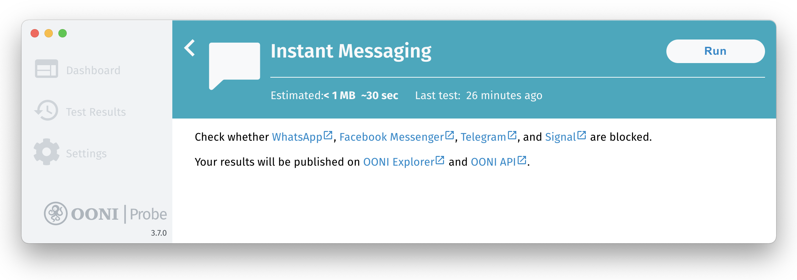
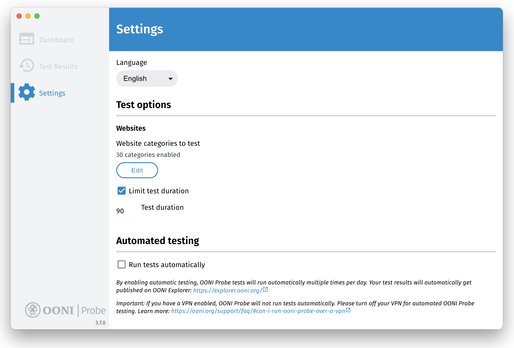
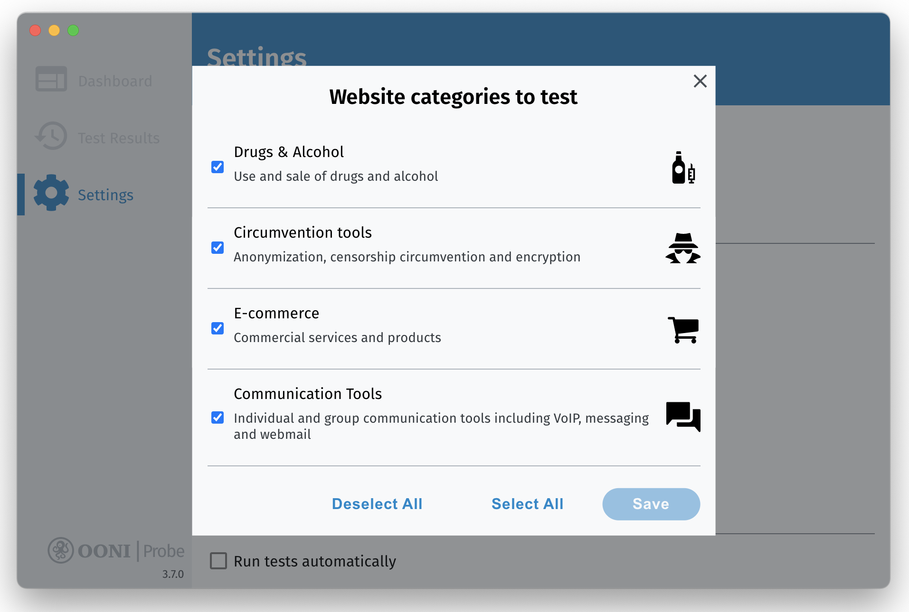
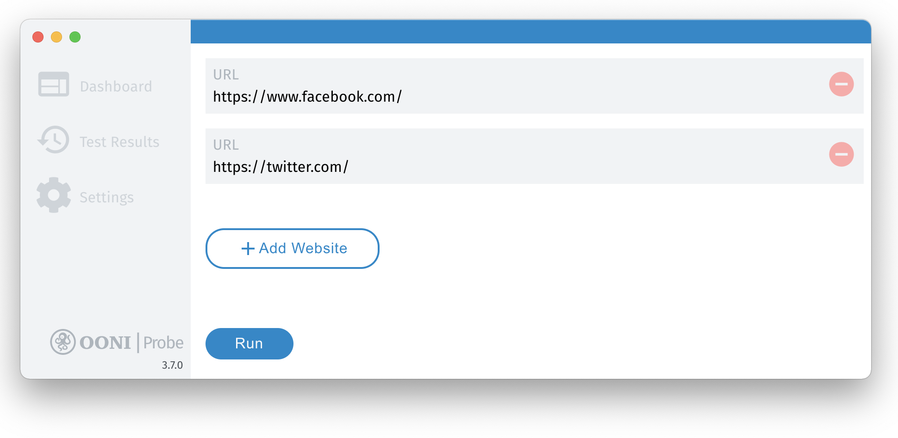
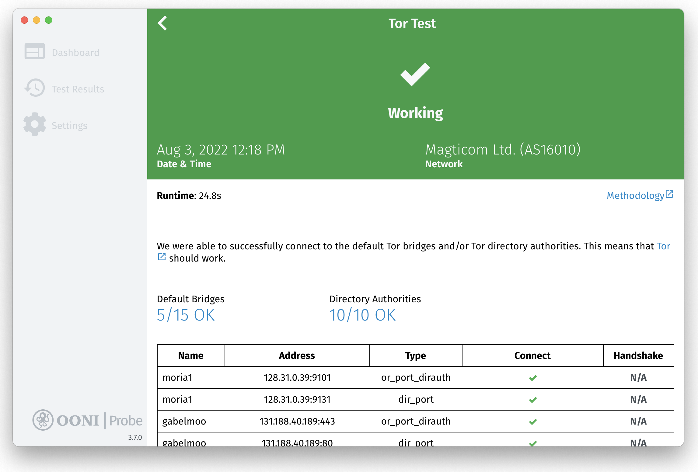
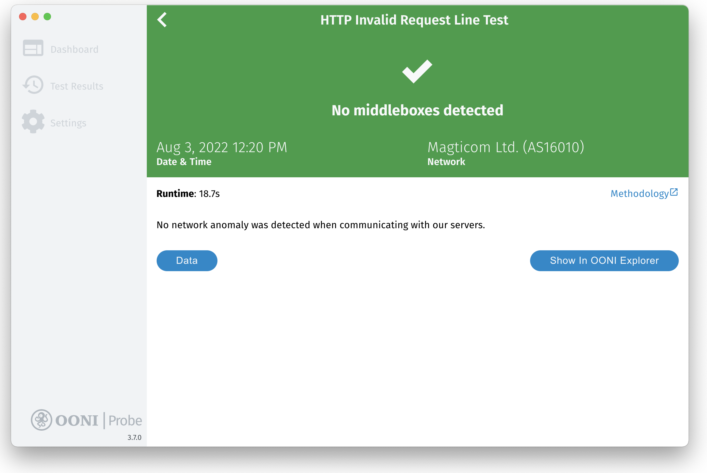

**Last updated:** 25th October 2022

**OONI Probe Desktop version:** 3.7.0

**Access the OONI Probe Desktop user guide in other languages:** [فارسی](/fa/support/ooni-probe-desktop), [Русский](/ru/support/ooni-probe-desktop), [Deutsch](/de/support/ooni-probe-desktop), [Türkçe](/tr/support/ooni-probe-desktop), [Tiếng Việt](/vi/support/ooni-probe-desktop), [Português](/pt/support/ooni-probe-desktop)

{{}}

OONI Probe is a [free and open source](https://github.com/ooni/probe) app that you can use to measure internet censorship and other forms of network interference. This user guide provides **step-by-step instructions** on how to install, run, and customize your use of the [OONI Probe desktop app](/install/desktop). 

**What you will get from this guide:**

* Learn how to run OONI Probe Desktop to:

  * Test the blocking of websites
  * Test the blocking of instant messaging apps
  * Test the blocking of circumvention tools
  * Measure your network speed and performance
* Customize your OONI Probe testing to websites of your choice
* Learn how to access and share your OONI Probe test results
* Configure your OONI Probe app settings

Upon reading this guide, we hope you will feel empowered to share your OONI Probe knowledge and skills with others!

The following table of contents should help with navigating the guide.



## Introduction to OONI Probe

OONI Probe is [free and open source software](https://github.com/ooni/probe) designed to measure internet censorship and other forms of network interference. Since 2012, this software has been developed by the [Open Observatory of Network Interference (OONI)](https://ooni.org/), a non-profit project that was originally born out of the [Tor Project](https://www.torproject.org/).

With the OONI Probe app (available for both [mobile](/install/mobile) and [desktop](/install/desktop) platforms), you can run [network measurement tests](/nettest/) to check the following:

* Blocking of [websites](/nettest/web-connectivity/);
* Blocking of instant messaging apps ([WhatsApp](/nettest/whatsapp/), [Facebook Messenger](/nettest/facebook-messenger/), [Telegram](/nettest/telegram/), [Signal](/nettest/signal));
* Blocking of circumvention tools ([Tor](/nettest/tor/), [Tor Snowflake](/nettest/tor-snowflake/), [Psiphon](/nettest/psiphon/));
* Presence of systems ([middleboxes](/nettest/http-header-field-manipulation/)) on your network that might be responsible for censorship and/or surveillance;
* [Speed and performance](/nettest/ndt/) of your network and [performance of your video streaming](/nettest/dash/).

As soon as you run OONI Probe, your test results are automatically sent to OONI servers, [processed](https://github.com/ooni/pipeline), and [openly published](/data/) in near real-time (unless you opt-out of the publication of your test results).

OONI [openly publishes OONI Probe test results](/data/) gathered from around the world to:

* Increase **transparency of internet censorship** worldwide;
* Share **evidence of internet censorship** and other forms of network interference;
* Enable the **independent verification** of OONI censorship findings;
* Support **reproducible research**;
* Support **research, policy, legal, and advocacy efforts** around the world;
* Support **public debate** on information controls.

To enable public access to OONI Probe test results (more commonly referred to as “measurements”), the OONI team makes them available on [OONI Explorer](https://explorer.ooni.org/): a web platform that provides charts based on measurement coverage and a search tool for exploring the measurements. 

As [OONI Explorer](https://explorer.ooni.org/) hosts more than 850 million network measurements collected from 24,500 networks in 241 countries and territories since 2012, it is likely the **largest global open data resource on internet censorship** to date.

By running OONI Probe, you will:

* Learn whether and how your Internet Service Provider (ISP) is censoring access to specific websites and apps;
* Contribute measurements that will be publicly archived, enabling the global internet freedom community to monitor, detect, and fight against internet censorship.  

This guide aims to walk you through using the [OONI Probe desktop app](/install/desktop) so that you can join a global community measuring internet censorship. 

### Disclaimer

As OONI Probe is designed to measure internet censorship, running it may be [risky](/about/risks/) for some people in some countries. 

Some things to take into account:

* **OONI Probe is not a privacy tool.** Anyone monitoring your internet activity (e.g. government, ISP, employer) may see that you are running OONI Probe (just the way they can probably see all other software you run).
* **OONI Probe is an investigatory tool.** Some OONI Probe tests are explicitly designed to uncover internet censorship.
* **[Your threat model](https://www.eff.org/keeping-your-site-alive/evaluating-your-threat-model).** A high-profile activist already under heavy surveillance, for example, might attract more attention when running OONI Probe.
* **The laws and regulations of the country you’re running OONI Probe from.** Best to consult with local lawyers.
* **The types of websites you test.** You might test legally banned (in some countries), provocative or objectionable [websites](/support/faq/#which-websites-will-i-test-for-censorship-with-ooni-probe) through the use of OONI Probe.
* **The types of OONI Probe tests you run.** Not all [OONI Probe tests](/nettest/) carry the same weight in terms of potential risk. OONI Probe, for example, includes the [NDT test](/nettest/ndt/) (designed to measure the speed and performance of a network) which may be viewed as less political or controversial in comparison to other tests designed to measure the blocking of websites or apps.
* **Whether you publish your measurements or not.** OONI [openly publishes measurements](/data/) collected from OONI Probe users to increase transparency of internet censorship around the world. We do our best not to publish your IP address or any other potentially personally-identifiable information. Learn more in our [Data Policy](/about/data-policy).

To learn more about potential risks associated with the use of OONI Probe, please refer to our relevant [documentation](/about/risks/). 

## Installing OONI Probe Desktop

The OONI Probe desktop app is available for [Windows and macOS](/install/desktop). If you’re on Linux, please install the [OONI Probe Command Line Interface (CLI)](/install/cli/ubuntu-debian).

You can install the OONI Probe desktop app (on Windows and macOS) through the following steps:

**Step 1.** Visit the OONI Probe Desktop installation page (on the OONI website): </install/desktop> 

{{}}

**Step 2.** Click the **Download** button to download OONI Probe. The page will propose an OONI Probe version that is relevant for your operating system (e.g. macOS). If you need to choose a version for a different operating system, please click the **Other Platforms** button.

{{}}

{{}}

**Step 3.** Once you have downloaded OONI Probe, double-click on the downloaded file to **install** OONI Probe.

On **macOS**, drag and drop the OONI Probe icon into the Application folder.

{{}}

And then click **Open** to install the OONI Probe app on macOS.

{{}}

On **Windows** (Windows 10), click **More info** in the following screen:

{{}}

And then click **Run anyway** to install the OONI Probe app on Windows.

{{}}

**Step 4.** Open your OONI Probe desktop app. On **macOS**, you can open your OONI Probe app from the Application folder. On **Windows**, launch OONI Probe from the desktop shortcut.

### Onboarding: Informed Consent

Now that you have installed and opened your OONI Probe desktop app, you will be presented with some basic information about OONI Probe as part of the onboarding process. 

You will also learn about [potential risks](/about/risks/) associated with running OONI Probe. To ensure that you understand these potential risks, we have included a short quiz to practically acquire your consent. Answering the quiz questions correctly is a requirement for using OONI Probe.

In the final step of the onboarding process, we share the types of data that are collected by default when running OONI Probe (linking to our [Data Policy](/about/data-policy) for further information). You can opt-in to sharing crash reports and app usage metrics to help us improve OONI Probe. 

Below we walk you through the onboarding process. 

**Step 1.** Once you have read basic information about OONI Probe, click **Got It**.

{{}}

**Step 2.** The next screen shares a summary of potential risks associated with running OONI Probe. Click **Learn more** to read our [documentation](/about/risks/) explaining potential risks.

{{}}

**Step 3.** Once you have learned about potential risks associated with running OONI Probe, click **I understand**.

{{}}

**Step 4.** The following quiz is based on the information you just read in the previous screen. Click **True** to demonstrate your understanding of the statement.

{{}}

You will see that **True** is the correct answer. If you click False, you will receive an explanation on why the answer is wrong. 

{{}}

**Step 5.** Click **True** to demonstrate your understanding of the statement (in the second part of the quiz).

{{}}

You will see that **True** is the correct answer. If you click False, you will receive an explanation on why the answer is wrong. 

{{}}

**Step 6.** The following screen asks you to share [crash reports](/about/data-policy#data-we-collect) that can help us identify and fix OONI Probe bugs. Please click **Yes** to share crash reports and help us improve OONI Probe.  

{{}}

**Step 7.** The following screen shares information about the types of data that OONI collects and publishes by default (every time you run OONI Probe). You can learn more by clicking on **[OONI’s Data Policy](/about/data-policy)** on the screen.

{{}}

**Step 8.** Click **Let’s Go** if you are ready to share data about your measurements with us.

You have now completed the onboarding process and are ready to start using OONI Probe! 

{{}}

**Optional Step 9.** If you would like to change your settings to **not** opt-in to sharing crash reports with us, click **Settings**. This will redirect you to the OONI Probe Settings screen, where you can check and change all of the default settings. The submission of crash reports is disabled by default, and only enabled if you click the **Let’s Go** button (from Step 7 above), or if you manually enable the relevant setting.  

{{}}

Detailed information about OONI Probe settings can be found in the [Configuring your OONI Probe settings](/support/ooni-probe-desktop#configuring-your-ooni-probe-settings) section of this guide.

## Running OONI Probe Desktop

Now that you have completed the onboarding process, you can start running OONI Probe to measure internet censorship!

The **Dashboard** of the OONI Probe desktop app includes 5 cards, each of which entails OONI Probe tests:

* **Websites card.** Includes OONI’s [Web Connectivity test](/nettest/web-connectivity/) which measures the [blocking of websites](/support/faq/#which-websites-will-i-test-for-censorship-with-ooni-probe).
* **Instant Messaging card.** Includes OONI’s [WhatsApp](/nettest/whatsapp/), [Facebook Messenger](/nettest/facebook-messenger/), [Telegram](/nettest/telegram/), and [Signal](/nettest/signal) tests which check if these apps are blocked.
* **Circumvention card.** Includes OONI’s [Tor](/nettest/tor/) and [Psiphon](/nettest/psiphon/) which check if these censorship circumvention tools are blocked.
* **Performance card.** Includes the [NDT speed test](/nettest/ndt/), the [DASH video streaming performance test](/nettest/dash/), and OONI’s [middlebox](/support/glossary/#middlebox) tests ([HTTP Header Field Manipulation](/nettest/http-header-field-manipulation/) test and [HTTP Invalid Request Line](/nettest/http-invalid-request-line/) test).
* **Experimental card.** Includes multiple new experimental tests developed by the OONI team. These tests might change over time. You can view these tests [here](https://github.com/ooni/spec/tree/master/nettests).

**Step 1.** Click **Run** to run your first OONI Probe tests.

{{}}

This will run **all** OONI Probe tests (included in all cards) in one go!

{{}}

{{}}

{{}}

{{}}

{{}}

OONI Probe should have run all tests within a few minutes (though this depends on the performance of the network you’re connected to, and may take longer in some cases). If the performance of your network is not good enough and the tests take too long, you can **stop the ongoing test** by clicking the **cross** button in the top right corner.

{{}}

Click the **OK** button to stop the test. 

{{}}

Your OONI Probe test results will automatically get published on [OONI Explorer](https://explorer.ooni.org/) and on the [OONI API](https://api.ooni.io/).

Would you rather limit your testing to a specific test type (card)? In the following sections, we share instructions on how to do that.

### Measuring the blocking of websites

If you only want to measure the blocking of websites, you can do so through the following steps:

**Step 1.** Click the **Websites** card in the Dashboard of your OONI Probe desktop app.

{{}}

**Step 2.** Click **Run** in the Websites card.

{{}}

You are now running OONI’s [Web Connectivity test](/nettest/web-connectivity/) to measure the blocking of websites.

{{}}

Your OONI Probe test results will automatically get published on [OONI Explorer](https://explorer.ooni.org/) and on the [OONI API](https://api.ooni.io/).

**Which websites are tested?**

By default, you will test websites included in the following 2 lists:

* **[Global test list](https://github.com/citizenlab/test-lists/blob/master/lists/global.csv)**. Includes internationally relevant websites (such as facebook.com).
* **[Country-specific test list](https://github.com/citizenlab/test-lists/tree/master/lists)**. Includes websites that are only relevant to the country you’re running OONI Probe from.

No matter which country you’re running OONI Probe from, you will *always* test websites from the [global test list](https://github.com/citizenlab/test-lists/blob/master/lists/global.csv).

OONI Probe will automatically determine which [country-specific list](https://github.com/citizenlab/test-lists/tree/master/lists) to pick for testing based on the country you’re running OONI Probe from. For example, if you run OONI Probe in Brazil, you will test websites from the global test list and from the Brazilian test list. If you travel to Germany and run OONI Probe, it will test the websites from the global and German test lists. But if you’re running OONI Probe from a country which doesn’t have a country-specific test list yet (because it hasn’t been created), you will only test websites from the global list.

If you would like to contribute to the [Citizen Lab test lists](https://github.com/citizenlab/test-lists/tree/master/lists) (which include the default websites tested by OONI Probe users worldwide), please refer to our relevant [documentation](/get-involved/contribute-test-lists). 

**Note:** OONI Probe will **only test as many websites as it’s able to test within 90 seconds** when you click “Run” (either from the Dashboard or from the Websites card). These websites (which are tested within 90 seconds) are randomly selected from the [global](https://github.com/citizenlab/test-lists/blob/master/lists/global.csv) and (relevant) [country-specific](https://github.com/citizenlab/test-lists/tree/master/lists) test lists. Every time you click “Run”, you will test a different, random selection of websites (from the global and country-specific test lists) within 90 seconds. Therefore, the more times you click “Run”, the more websites you will test.  

If you would like to test a larger selection of websites, or test entirely different websites, please refer to the [Customizing website testing](/support/ooni-probe-desktop#customizing-your-website-testing) section of this guide.

### Measuring the blocking of instant messaging apps

If you only want to measure the blocking of instant messaging apps, you can do so through the following steps:

**Step 1.** Click the **Instant Messaging** card in the Dashboard of your OONI Probe desktop app.

{{}}

**Step 2.** Click **Run** in the Instant Messaging card.

{{}}

You are now running OONI’s [WhatsApp](/nettest/whatsapp/), [Facebook Messenger](/nettest/facebook-messenger/), [Telegram](/nettest/telegram/), and [Signal](/nettest/signal) tests to measure the blocking of these apps.

{{}}

Your OONI Probe test results will automatically get published on [OONI Explorer](https://explorer.ooni.org/) and on the [OONI API](https://api.ooni.io/).

### Measuring the blocking of circumvention tools

If you only want to measure the blocking of censorship circumvention tools, you can do so through the following steps:

**Step 1.** Click the **Circumvention** card in the Dashboard of your OONI Probe desktop app.

{{}}

**Step 2.** Click **Run** in the Circumvention card.

{{}}

You are now running OONI’s [Tor](/nettest/tor/) and [Psiphon](/nettest/psiphon/) tests to measure the reachability of these tools.

{{}}

Your OONI Probe test results will automatically get published on [OONI Explorer](https://explorer.ooni.org/) and on the [OONI API](https://api.ooni.io/).

### Measuring network performance

If you only want to measure network performance, you can do so through the following steps:

**Step 1.** Click the **Performance** card in the Dashboard of your OONI Probe desktop app.

{{}}

**Step 2.** Click **Run** in the Performance card.

{{}}

You are now running the [NDT speed test](/nettest/ndt/) and the [DASH video streaming performance test](/nettest/dash/).

{{}}

Your test results will automatically get published on [OONI Explorer](https://explorer.ooni.org/) and on the [OONI API](https://api.ooni.io/).

**Disclaimer:** The [NDT](/nettest/ndt/) and [DASH](/nettest/dash/) tests are conducted against third-party servers provided by [Measurement Lab (M-Lab)](https://www.measurementlab.net/). If you run these tests, M-Lab will collect and publish your IP address for research purposes, irrespective of your OONI Probe settings. Learn more about M-Lab’s data governance through its [privacy statement](https://www.measurementlab.net/privacy/).  

### Measuring the presence of middleboxes

If you only want to measure networks to detect the presence of [middleboxes](/support/glossary/#middlebox) (and potential signs of network tampering), you can do so through the following steps:

**Step 1.** Click the **Middleboxes** card in the Dashboard of your OONI Probe desktop app.

{{}}

**Step 2.** Click **Run** in the Middleboxes card.

{{}}

You are now running OONI’s [middlebox](/support/glossary/#middlebox) tests ([HTTP Header Field Manipulation](/nettest/http-header-field-manipulation/) test and [HTTP Invalid Request Line](/nettest/http-invalid-request-line/) test).

{{}}

Your OONI Probe test results will automatically get published on [OONI Explorer](https://explorer.ooni.org/) and on the [OONI API](https://api.ooni.io/).

### Running experimental tests

If you only want to run new experimental tests developed by the OONI team, you can do so through the following steps:

**Step 1.** Click the **Experimental** card in the Dashboard of your OONI Probe desktop app.

{{}}

**Step 2.** Click **Run** in the Experimental card.

{{}}

You are now running the [experimental tests](https://github.com/ooni/spec/tree/master/nettests) developed by the OONI team. 

{{}}

## Automated OONI Probe testing

Instead of having to remember to manually run tests, you can **enable automated testing** in the settings of your OONI Probe desktop app and OONI Probe will run tests automatically for you! 

By enabling automated testing, OONI Probe will **run all tests in the background multiple times per day** (excluding the bandwidth-intensive performance tests), testing a different set of websites (from the [Citizen Lab test lists](https://github.com/citizenlab/test-lists/tree/master/lists)) each time. To avoid cluttering the Test Results section of your app, these test results are automatically published on [OONI Explorer](https://explorer.ooni.org/) in near real-time (but are not visible through the Test Results section). 

With automated OONI Probe testing, you can **regularly contribute censorship measurements** (without having to do anything), enabling the internet freedom community to monitor and detect censorship events in your country over time.  If you are concerned about risks connected with regular testing of specific websites categories, you can limit the list of categories to be tested through **Test options** section of OONI Probe settings. 

You can enable automated OONI Probe testing through the following steps:

**Step 1.** Click **Settings** in the sidebar of your OONI Probe desktop app.

{{}}

Under the **Automated testing** section of the settings, you will see that automated OONI Probe testing is disabled by default. 

**Step 2.** Enable the **Run tests automatically** option in the settings.

{{}}

You have now enabled automated OONI Probe testing! OONI Probe will run tests automatically multiple times per day (without user intervention), and the test results will automatically get published on [OONI Explorer](https://explorer.ooni.org/).

In general, if you haven’t enabled automated testing, you will occasionally view the following pop-up window, asking if you would like to enable automated testing.

{{}}

To enable automated testing, you can click **Sounds Great**. If you would like to receive a reminder to enable automated testing at a later stage, click **Remind Me later**.

## Customizing your website testing

By default, when testing websites with OONI Probe, you measure the URLs included in the [Citizen Lab test lists](https://github.com/citizenlab/test-lists/tree/master/lists). In other words, if you just click “Run” (in the Dashboard or Websites card of the OONI Probe app), you will test a random selection of websites taken from the [Citizen Lab test lists](https://github.com/citizenlab/test-lists/tree/master/lists). These lists have been created through collaboration with in-country researchers and experts. As they are [openly available on GitHub](https://github.com/citizenlab/test-lists/tree/master/lists), anyone can potentially review them, [contribute](/get-involved/contribute-test-lists) URLs, and propose the removal of certain URLs. And it is important that we continue [reviewing and updating](/get-involved/contribute-test-lists) these lists, since they contain the websites that are tested by most OONI Probe users regularly around the world.

But if you would rather limit your testing to websites of your choice, you can do so through the OONI Probe desktop app.

You can customize your website testing in the following ways:

* Limit your testing to [specific website categories](/support/ooni-probe-desktop#testing-specific-website-categories) (such as news media and human rights content);
* Only test [websites you care about](/support/ooni-probe-desktop#testing-websites-of-your-choice);
* Test [*all* URLs](/support/ooni-probe-desktop#testing-all-websites-from-the-citizen-lab-test-lists) in the ([relevant](/support/faq/#which-websites-will-i-test-for-censorship-with-ooni-probe)) [Citizen Lab test lists](https://github.com/citizenlab/test-lists/tree/master/lists) (rather than testing a random selection of websites in 90 seconds).

The following sections explain how you can do each of the above. 

### Testing specific website categories

When you click “Run” in the OONI Probe app, you test websites from the [global](https://github.com/citizenlab/test-lists/blob/master/lists/global.csv) and (relevant) [country-specific Citizen Lab test lists](https://github.com/citizenlab/test-lists/tree/master/lists). 

These websites have been categorized based on [30 standardized categories](https://github.com/citizenlab/test-lists/blob/master/lists/00-LEGEND-new_category_codes.csv). These categories range from news media, culture, and human rights issues to more provocative or objectionable categories, like pornography (the latter are included because they are more likely to be blocked, enabling the detection of censorship techniques adopted by ISPs).

By default, all 30 categories are enabled in the OONI Probe desktop app to encourage the testing of more diverse websites, enhancing the possibility of discovering more forms of website censorship. 

But if you don’t feel comfortable testing all 30 categories of websites (particularly if they include content that is illegal, provocative, or objectionable in your country), or are only interested in testing certain types of content (such as news media), you can limit your OONI Probe testing to the website categories of your choice. The same categories will be tested during the background tests if you enable **Automated testing** option.

**Step 1.** Click **Settings** in your OONI Probe desktop app. 

{{}}

Under **Test options** in the settings, you will see that [30 categories of websites](https://github.com/citizenlab/test-lists/blob/master/lists/00-LEGEND-new_category_codes.csv) are enabled by default. 

**Step 2.** Click the **Edit** button (under “Website categories to test”).

{{}}

You will now see the [30 categories](https://github.com/citizenlab/test-lists/blob/master/lists/00-LEGEND-new_category_codes.csv) of websites that OONI Probe tests by default. All of these categories are enabled.

{{}}

**Step 3.** **Disable** the website categories that you do **not** want to test. 

{{}}

In the above example, we have disabled 2 categories (“Pornography” and “Provocative Attire”).

**Step 4.** Click **Save**.

When you go back, you can see that only 28 categories are now enabled (since 2 have been disabled).

{{}}

You can revisit this setting anytime to enable or disable the website categories of your choice.

### Testing websites of your choice

You can test the websites you care about directly through the following steps:

**Step 1.** Click the **Websites** card in your OONI Probe desktop app.

{{}}

**Step 2.** Click the **Choose websites** button inside the Websites card.

{{}}

You will now see a screen where you can add the website(s) you want to test.

{{}}

**Step 3.** **Type the URL** of the website you want to test. In the following example, we have typed `https://www.facebook.com/`. 

{{}}

**Important:** Please ensure that the [URL](/support/glossary/#url) is typed correctly. If it is mis-typed, OONI Probe will *not* test the intended website and this will potentially lead to inaccurate test results. 

A few things to keep in mind:

* Is the website on **HTTP** or **HTTPS**? If the latter, please add an extra `s` after `http`.
* Does the [domain](/support/glossary/#domain-name) include `www`? If so, please include it.

To ensure that a [URL](/support/glossary/#url) is typed accurately, **please check how it appears when accessed from a normal browser**.

**Step 4.** Click **Add website** to create a new line for adding another website for testing.

**Step 5.** **Type another URL** that you would like to test. In the following example, we have added `https://twitter.com/`. 

{{}}

If you change your mind and would like to remove any of the URLs you have added, you can do so by clicking on the red icon next to each URL.

You can continue to add as many URLs as you like. In the following example, we have added `https://www.gutenberg.org/`. 

{{}}

**Step 6.** Click **Run** to test all of the websites you have added.

You will now see OONI Probe testing the websites of your choice!

{{}}

Your OONI Probe test results will automatically get published on [OONI Explorer](https://explorer.ooni.org/) and on the [OONI API](https://api.ooni.io/).

### Testing all websites from the Citizen Lab test lists

The OONI Probe desktop app only tests as many websites as it can connect to within 90 seconds (based on the default settings). 

If you’re connected to WiFi and would like to test **all websites** from the ([relevant](/support/faq/#which-websites-will-i-test-for-censorship-with-ooni-probe)) [Citizen Lab test lists](https://github.com/citizenlab/test-lists/tree/master/lists) in one go, you can do so through the following steps:

**Step 1.** Click **Settings** in the sidebar of your OONI Probe desktop app. 

{{}}

Under **Test options** in the settings, you will see that the **Limit test duration** option (which limits website testing to a specific time duration) is enabled by default. 

**Step 2.** Disable **Limit test duration**.

{{}}

There is now no time limit in your website testing. This means that OONI Probe can test all websites included in the [relevant Citizen Lab test lists](/support/faq/#which-websites-will-i-test-for-censorship-with-ooni-probe) every time you click “Run”. 

{{}}

**Alternatively**: If you would like to test more websites within a longer time duration (but without necessarily disabling the time limit and testing all websites), you can do so through the following steps:

**Step 1.** Go to **Test duration** under the Test options section of the settings.

{{}}

By default, the website testing duration is set to **90 seconds**. This means that OONI Probe will only test as many websites (from the [relevant Citizen Lab test lists](/support/faq/#which-websites-will-i-test-for-censorship-with-ooni-probe)) as it can connect to within 90 seconds.

**Step 2.** To change the test duration, **type the number of seconds** that you would like OONI Probe to test websites for. In the following example, we have typed `360` which would make OONI Probe test websites for 6 minutes.

{{}}

You have now changed the website testing duration of your OONI Probe desktop app.

## Accessing your OONI Probe test results

As soon as you run an OONI Probe test, you can immediately access the test results directly in your OONI Probe desktop app. 

**Step 1.** Click **Test Results** in the sidebar of your OONI Probe desktop app. 

{{}}

You are now presented with an overview of all your OONI Probe test results, which are presented chronologically, with the latest tests listed first. In this overview, the test results are grouped based on the 5 thematic cards of the app (“Websites”, “Instant Messaging”, “Circumvention”, “Performance”, “Middleboxes”). 

In each thematic test result card, you have an overview of:

* The **network** (e.g. `AS16010` - Magticom Ltd.) on which each test was run;
* The **date and time** of testing (e.g. August 3rd 2022 at 13:58 local time);
* **Summary of relevant findings** (e.g. 3 websites were found accessible, while none blocked).

This overview can potentially help with comparing results across networks (if you run tests on many different networks), and provides a bird’s-eye view of the findings. 

In the top header of the Test Results screen, we share an overview of:

* The **number of OONI Probe tests** you have run so far;
* The **number of networks** on which you have run OONI Probe so far;
* Your OONI Probe **data usage**.

{{}}

While the Test Results screen provides an initial overview of results, you can dig deeper and access the data pertaining to each test, as explained in the following sections.

### Websites

You can access your OONI Probe results from the testing of websites through the following steps:

**Step 1.** Click **Websites** in the Test Results screen of your OONI Probe desktop app. 

{{}}

You will now see a list of all the websites that you tested in a specific testing session.

{{}}

In the top header, we share an overview of your website testing results. Next to each tested URL, there will either be a green tick (indicating website accessibility), or a red cross (indicating potential website blocking). 

**Step 2.** Click on the **row of a tested website** (to access the data from the testing of that website). 

{{}}

You now have access to the data pertaining to the testing of a specific website. 

The above measurement page pertains to the testing of `https://www.facebook.com/`. Through this measurement page, we can see that `https://www.facebook.com/` was found accessible when tested on Magticom Ltd. (AS16010) on 3rd August 2022 at 13:58 local time. 

If a website was found (potentially) blocked, its measurement page would include an orange header with an exclamation mark, as illustrated below.

{{}}

In this case, we can see that `https://www.gutenberg.org` presented signs of blocking (“[anomaly](/support/glossary/#network-anomaly)”) when tested on Vodafone Italia (AS30722) on 30th March 2021 at 15:13 local time. In particular, we can see that it presented signs of [DNS tampering](/support/glossary/#dns-tampering) (based on the heuristics of the [OONI Web Connectivity test](/nettest/web-connectivity/)). This means that Vodafone Italia may have blocked access to `https://www.gutenberg.org` (on 30th March 2021) by means of DNS. 

As [false positives](/support/glossary/#false-positive) can occur, we annotate test results that failed to meet all of the criteria of our [Web Connectivity test](/nettest/web-connectivity/) as “[anomalies](/support/faq/#how-can-i-interpret-ooni-data)” (rather than “confirmed blocked”), indicating that the tested website *might* be blocked. 

In evaluating the blocking of a website, it is useful to examine relevant measurements (from the testing of a specific website on the same network over time) in **aggregate**, which you can do through [OONI Explorer](https://explorer.ooni.org/) (where we publish all test results). OONI Explorer also [displays measurements for all “confirmed blocked”](https://explorer.ooni.org/search?since=2021-02-24&only=confirmed) cases, where we automatically confirm the blocking of websites based on [block pages](/support/glossary/#block-page).

### Instant Messaging

You can access your OONI Probe results from the testing of instant messaging apps through the following steps:

**Step 1.** Click **Instant Messaging** in the Test Results screen of your OONI Probe desktop app. 

{{}}

You will now see a list of the instant messaging apps (WhatsApp, Facebook Messenger, Telegram, Signal) that you have tested in a specific testing session.

{{}}

In the top header, we share an overview of your instant messaging app testing results. Next to each tested app, there will either be a green tick (indicating app reachability), or a red cross (indicating potential app blocking). 

**Step 2.** Click on the **row of a tested app** (to access the data from the testing of that app). 

{{}}

The above measurement page pertains to the testing of WhatsApp. We can see that WhatsApp was found accessible when tested on Magticom Ltd. (AS16010) on 3rd August 2022 at 12:19 local time. This conclusion is reached because [OONI’s WhatsApp test](/nettest/whatsapp/) was able to successfully connect to WhatsApp’s endpoints, registration service, and web interface (`web.whatsapp.com`). 

If WhatsApp was found (potentially) blocked, this measurement page would show relevant information (based on the heuristics of [OONI’s WhatsApp test](/nettest/whatsapp/)).  

Similarly, you can access Telegram test results through the instant messaging results in your OONI Probe app.

{{}}

In this case, we can see that Telegram was found accessible when tested on Magticom Ltd. (AS16010) on 3rd August 2022 at 12:19 local time. This conclusion is reached because [OONI’s Telegram test](/nettest/telegram/) was able to successfully connect to Telegram’s endpoints and web interface (`web.telegram.org`). 

If Telegram was found (potentially) blocked, this measurement page would show relevant information (based on the heuristics of [OONI’s Telegram test](/nettest/telegram/)).  

You can also access Facebook Messenger test results through the instant messaging results in your OONI Probe app.

{{}}

In this case, we can see that Facebook Messenger was found accessible when tested on Magticom Ltd. (AS16010) on 3rd August 2022 at 13:58 local time. This conclusion is reached because [OONI’s Facebook Messenger test](/nettest/facebook-messenger/) was able to successfully connect to Facebook’s endpoints and resolve to Facebook IP addresses.

If Facebook Messenger was found (potentially) blocked, this measurement page would show relevant information (based on the heuristics of [OONI’s Facebook Messenger test](/nettest/facebook-messenger/)).  

You can also access Signal test results through the instant messaging results in your OONI Probe app.

{{}}

In this case, we can see that Signal was found accessible when tested on Magticom Ltd. (AS16010) on 3rd August 2022 at 12:19 local time. This conclusion is reached because [OONI’s Signal test](/nettest/signal) was able to successfully connect to Signal’s endpoints.

If Signal was found (potentially) blocked, this measurement page would show relevant information (based on the heuristics of [OONI’s Signal test](/nettest/signal)). 

In all cases, we recommend referring to OONI measurements published on [OONI Explorer](https://explorer.ooni.org/), where you can examine results in aggregate (which can help with ruling out [false positives](/support/glossary/#false-positive) and confirming blocking). 

### Circumvention

You can access your OONI Probe results from the testing of circumvention tools through the following steps:

**Step 1.** Click **Circumvention** in the Test Results screen of your OONI Probe desktop app. 

{{}}

You will now see a list of the censorship circumvention tools (Psiphon, Tor) that you have tested as part of a specific testing session.

{{}}

In the top header, we share an overview of your circumvention tool testing results. Next to each tested tool, there will either be a green tick (indicating reachability), or a red cross (indicating potential blocking). 

**Step 2.** Click on the **row of a tested tool** (to access the data from its testing). 

{{}}

The above measurement page pertains to the testing of [Psiphon](https://psiphon.ca/). We can see that Psiphon was reachable when tested on Magticom Ltd. (AS16010) on 3rd August 2022 at 12:17 local time. This conclusion is reached because [OONI’s Psiphon test](/nettest/psiphon/) was able to successfully bootstrap a Psiphon connection.

If Psiphon was found (potentially) blocked, this test result would show relevant information (based on the heuristics of [OONI’s Psiphon test](/nettest/psiphon/)).  

Similarly, you can access [Tor](https://www.torproject.org/) test results through the circumvention results in your OONI Probe app.

{{}}

In this case, we can see that Tor was reachable when tested on Magticom Ltd. (AS16010) on 3rd August 2022 at 12:17 local time. This conclusion is reached because [OONI’s Tor test](/nettest/tor/) was able to successfully connect to most of the default Tor bridges and to all Tor directory authorities. 

If Tor was found (potentially) blocked, this test result would show relevant information (based on the heuristics of [OONI’s Tor test](/nettest/tor/)).  

In all cases, we recommend referring to OONI measurements published on [OONI Explorer](https://explorer.ooni.org/), where you can examine results in aggregate (which can help with ruling out [false positives](/support/glossary/#false-positive) and confirming blocking). 

### Performance

You can access your OONI Probe results from the testing of your network’s performance through the following steps:

**Step 1.** Click **Performance** in the Test Results screen of your OONI Probe desktop app. 

{{}}

You will now see a list of the performance tests that you have run in a specific testing session.

{{}}

In the top header, we share an overview of the results, along with the date and time of testing, and the country and network on which these tests were run. The main performance findings are also listed next to each test result. 

**Step 2.** Click on the **row of a test result** (to access relevant data). 

{{}}

The above measurement page is from an [NDT speed test](/nettest/ndt/). We can see that when this [NDT speed test](/nettest/ndt/) was performed, the download speed was 21.4 megabits per second, the upload speed was 19.7 megabits per second, and it took 147.481 milliseconds to establish a connection to an [M-Lab](https://www.measurementlab.net/) server. This indicates good internet speed, given that the average ping (to this M-Lab server) is 953.267 milliseconds. 

You can compare your NDT test results with what is offered in your internet plan provided by your Internet Service Provider (ISP).

You can access [DASH](/nettest/dash/) results through the performance results in your OONI Probe app.

{{}}

In this case, we can see that a [DASH video streaming test](/nettest/dash/) was run on Magticom Ltd. (AS16010) on 3rd August 2022 at 12:21 local time. When the test was performed, it was possible to stream up to 480p video without buffering, with the median bitrate being 3.6 megabits per second. This indicates that the user could only stream low definition videos on that network if the streaming server was co-located with the measurement server.

You can compare your DASH test results with what is offered in your internet plan provided by your Internet Service Provider (ISP).

### Middleboxes

A middlebox is a computer networking device that transforms, inspects, filters, or otherwise manipulates traffic for purposes other than packet forwarding. Many Internet Service Providers (ISPs) around the world use middleboxes to improve network performance, provide users with faster access to websites, and for a number of other networking purposes. Sometimes though, middleboxes are also used to implement internet censorship and/or surveillance.

You can access your OONI Probe results from the testing of network tampering (with the goal of detecting the presence of [middleboxes](/support/glossary/#middlebox)) through the following steps:

**Step 1.** Click **Middleboxes** in the Test Results screen of your OONI Probe desktop app. 

{{}}

You will now see a list of the middlebox tests ([HTTP Invalid Request Line test](/nettest/http-invalid-request-line/) and [HTTP Header Field Manipulation test](/nettest/http-header-field-manipulation/)) that you have run in a specific testing session.

{{}}

In the top header, we share an overview of the results (in this case, no middleboxes were detected), along with the date and time of testing, and the country and network on which these tests were run. 

**Step 2.** Click on the **row of a test result** (to access relevant data). 

{{}}

In the above case, we can see that the [HTTP Invalid Request Line](/nettest/http-invalid-request-line/) test was run on Magticom Ltd. (AS16010) on 3rd August 2022 at 12:20 local time. When this test was performed, it sent an invalid HTTP request line (containing an invalid HTTP version number, an invalid field count and a huge request method) to an echo service listening on the standard HTTP port. The echo service (a debugging and measurement tool which simply sends back any data it receives) sent the invalid HTTP request line back to us, exactly as it received it. This indicates that there is no visible middlebox or traffic manipulation on the tested network. 

If, however, a middlebox was present on the tested network, the invalid HTTP request line would have been intercepted by the middlebox, potentially triggering an error that would have been sent back to us by the echo service. Such errors indicate that software for traffic manipulation is likely placed on the tested network, though it’s not always clear what that software is. 

Similarly, you can access OONI’s [HTTP Header Field Manipulation](/nettest/http-header-field-manipulation/) test results through the middlebox results in your OONI Probe app.

{{}}

In the above case, we can see that the [HTTP Header Field Manipulation](/nettest/http-header-field-manipulation/) test was run on Magticom Ltd. (AS16010) on 3rd August 2022 at 12:20 local time. When this test was performed, it emulated an [HTTP request](/support/glossary/#http-request) towards a backend control server (which sends back any data it receives), but sent [HTTP headers](/support/glossary/#http-header) with variations in capitalization (i.e. non-canonical HTTP headers). Since we received the HTTP headers exactly as we sent them, there is no visible middlebox or traffic manipulation on the tested network.

If, however, a middlebox was present on the tested network, it may have normalized the invalid headers that we sent or added extra headers. Depending on whether the HTTP headers that we send and receive from a backend control server are the same or not, we are able to evaluate whether a middlebox is present on the tested network.

## Sharing your OONI Probe test results

Through each OONI Probe test result, you can access features that enable you to:

* Access, copy, and share the **raw measurement data** (pertaining to that test result);
* **Access the measurement** on [OONI Explorer](https://explorer.ooni.org/) (where it is automatically published) and potentially share it with your contacts.

**Step 1.** Access any OONI Probe test result (for details on how to find OONI Probe test results, please refer to the previous section of this guide).  

{{}}

In the following sections, we dive into each feature. 

### Raw data

Every OONI Probe test result provides an overview of the findings. The actual data (i.e. the raw measurement data) that each test result is based on is available through the **Data** button on each test result screen. 

In other words, if you have tested `https://www.facebook.com`, the test result page will provide an overview of the finding (for example: Accessible), but the network measurement data provides the details of the testing. For example, if the website wasn't accessible, it would show how and why the site may be blocked. 

It is useful to access the raw measurement data because:

* It provides technical details that can potentially serve as **evidence** of blocking;
* It can help with determining if a website is in fact blocked, or if its testing triggered an [anomaly](/support/glossary/#network-anomaly) due to other, non-censorship related reasons (i.e. ruling out [false positives](/support/glossary/#false-positive)).

You can access and share the raw measurement data through the following steps:

**Step 1.** Click the **Data** button on an OONI Probe test result screen.

{{}}

You now have access to the raw measurement data pertaining to the OONI Probe test result you selected.

{{}}

You can click on the arrows (such as the arrow next to `test_keys`) to expand the view of the data.

**Step 2.** To copy and share the raw data (for example, with technologists who can help interpret it), click on the **copy icon** at the start of the data (in the `root` row, as indicated below). 

{{}}

You have now copied the raw data and can share it with your contacts. 

### Accessing your measurement on OONI Explorer

Perhaps you’re interested in viewing your OONI Probe test result on [OONI Explorer](https://explorer.ooni.org/) or accessing a measurement link that you can subsequently share with your contacts or link to (for example, in a research report or tweet).  

**Step 1.** Click the **Show in OONI Explorer** button on an OONI Probe test result screen.

{{}}

This will open the relevant OONI Probe test result in your web browser, directly on [OONI Explorer](https://explorer.ooni.org/). For example, for the facebook measurement mentioned above, that would be the following [page](https://explorer.ooni.org/measurement/20220803T095857Z_webconnectivity_GE_16010_n1_vTthHQGwVlhSDc19?input=https://www.facebook.com/).

{{}}

You now have access to your OONI Probe measurement on [OONI Explorer](https://explorer.ooni.org/). If you scroll down on that measurement page, you will view the raw measurement data as well. You can now link to or share that measurement by sharing the URL of that measurement page. 

## Configuring your OONI Probe settings

You can customize your use of OONI Probe through the settings.

**Step 1.** Click **Settings** in the sidebar of your OONI Probe app.

{{}}

You can now see all of the OONI Probe desktop app settings.

In the following sections, we walk you through each setting. 

### Language

Thanks to support from the [Localization Lab](https://www.localizationlab.org/) community, the OONI Probe apps are available in multiple languages. 

You can change the language of your OONI Probe desktop app through the following steps:

**Step 1.** Click on the drop-down menu under **Language** in the settings.

{{}}

**Step 2.** Select a language from the drop-down menu. 

Your OONI Probe desktop app has now switched to the language that you selected.

If you would like to review and/or contribute an OONI Probe translation, please consider [joining us on Transifex](https://www.transifex.com/otf/ooniprobe/).

### Test options

The website testing settings have already been covered in previous sections of this guide. Please refer to the ”[Customizing your website testing](/support/ooni-probe-desktop#customizing-your-website-testing)” section. 

### Automated testing

The automated OONI Probe testing settings have already been covered in previous sections of this guide. Please refer to the “[Automated OONI Probe testing](/support/ooni-probe-desktop#automated-ooni-probe-testing)” section. 

### Privacy

The Privacy section of the OONI Probe settings pertains to the publication of OONI Probe test results, and the submission of [crash reports](/about/data-policy).

{{}}

By default, the automatic publication of your OONI Probe test results is enabled, while the submission of crash reports is disabled (unless you opted-in during the onboarding). 

We **encourage the publication of OONI Probe test results** because they can help increase transparency of internet censorship and support the research and advocacy efforts of the internet freedom community. 

If you publish your OONI Probe test results, that will involve the following data:

* Date and time of measurement;
* Country code (e.g. `GE` for Georgia);
* Network information: [ASN](/support/glossary/#asn) (e.g. `AS16010` for Magticom Ltd.); 
* Network measurement data (which depends on the [OONI Probe test](/nettest/)).

Further information is available through our [Data Policy](/about/data-policy). 

If you opt in to sharing crash reports with us, you will share information that is essential for identifying bugs and improving the performance of the OONI Probe app. These crash reports include the OONI Probe software version and information about why and how a specific OONI Probe function failed to work as expected.

You can opt out of publishing your OONI Probe test results and/or sharing crash reports with us by disabling the relevant settings.

{{}}

Thank you for reading this guide, and thank you for running OONI Probe!
