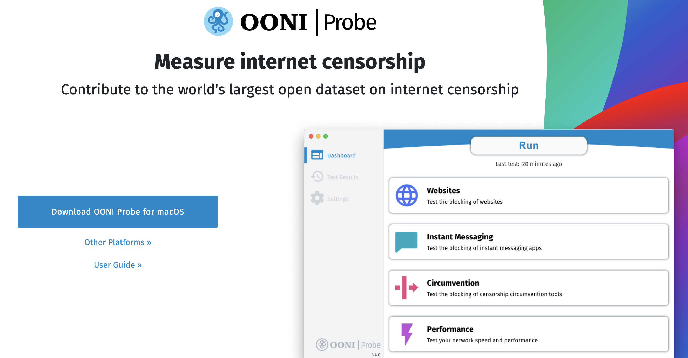
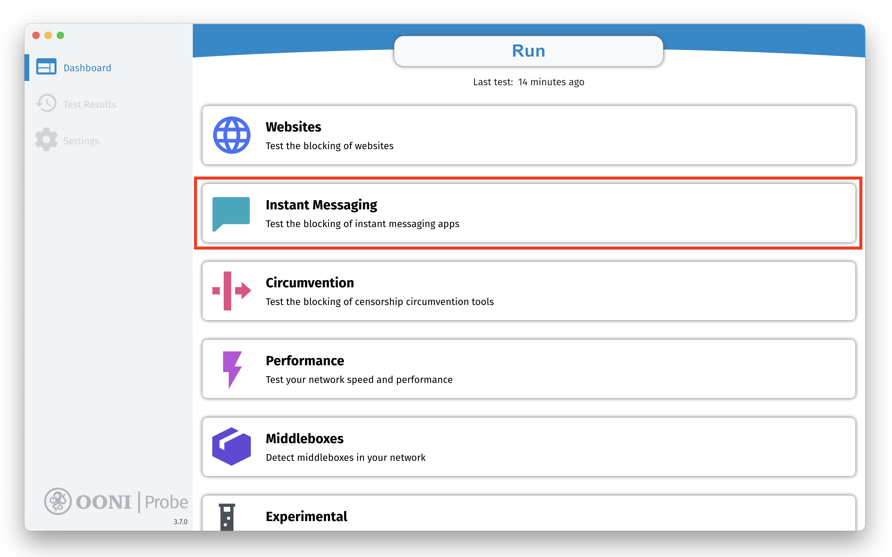
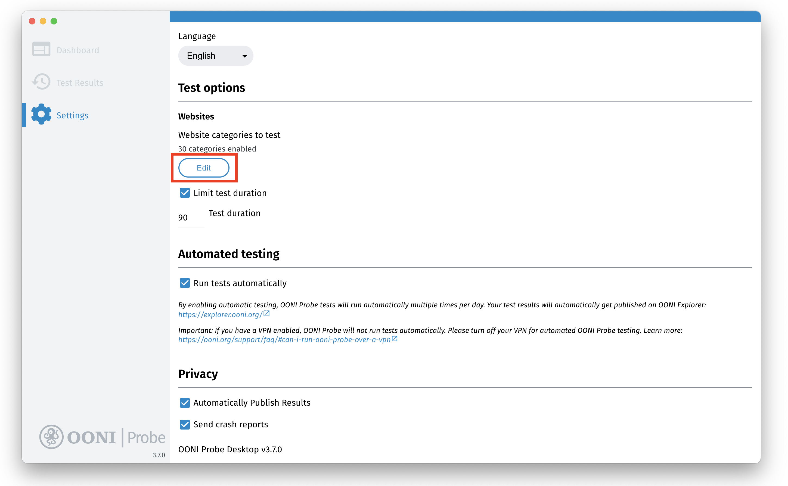
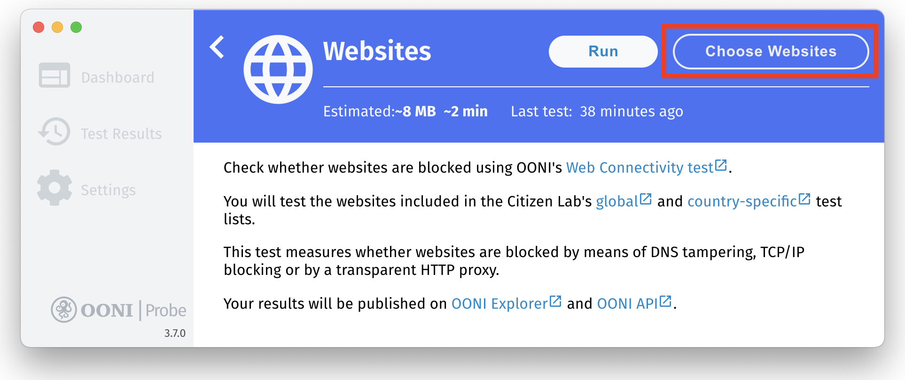
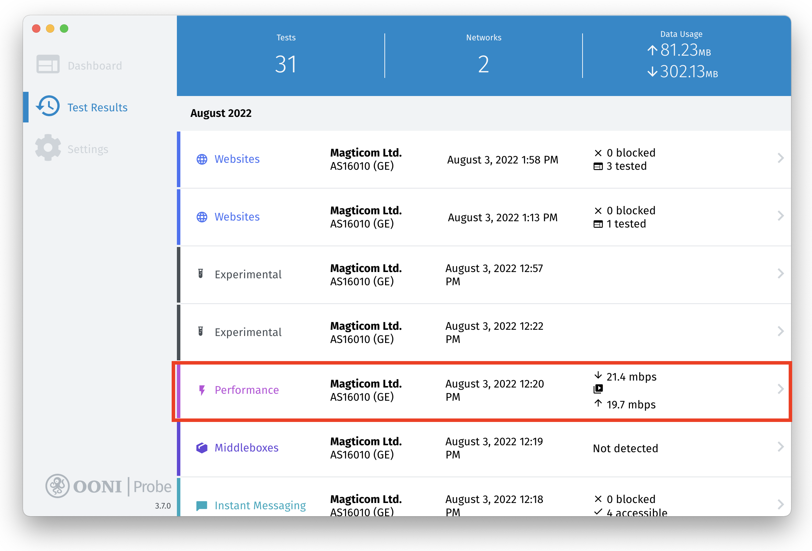
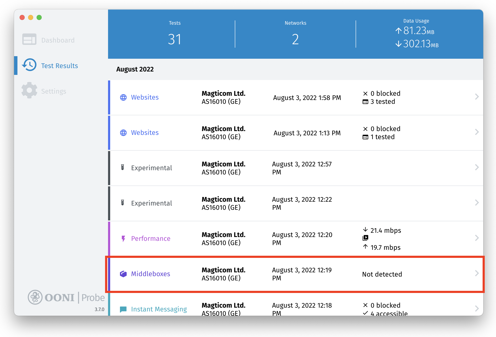
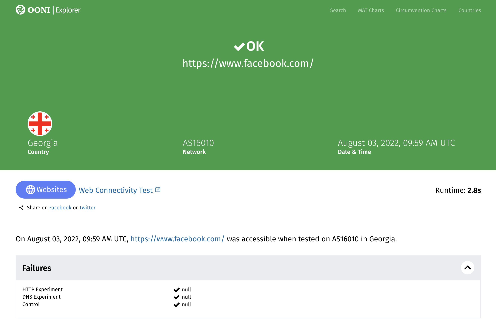

**Última atualização:** 6 de setembro de 2022

**OONI Probe Versão Desktop:** 3.7.0

Este documento foi traduzido por [Cauan Henrique Zorzenon](https://x.com/cauan_zorzenon) da Localization Lab Community.

{{}}

OONI Probe é um aplicativo [gratuito e de código aberto](https://github.com/ooni/probe) que você pode usar para medir a censura na internet e outras formas de interferência na rede. Este guia do usuário fornece **instruções passo a passo** sobre como instalar, executar e personalizar o uso do [aplicativo de desktop OONI Probe](https://ooni.org/install/desktop). 

**O que você obterá deste guia:**

* Saiba como executar o OONI Probe Desktop para:

  * Teste o bloqueio de sites
  * Teste o bloqueio de aplicativos de mensagens instantâneas
  * Testar o bloqueio de ferramentas de evasão
  * Meça a velocidade e o desempenho da sua rede
* Personalize seu teste de sonda OONI para sites de sua escolha
* Saiba como acessar e compartilhar os resultados do teste OONI Probe
* Definir as configurações do aplicativo OONI Probe

Ao ler este guia, esperamos que você se sinta capacitado para compartilhar seus conhecimentos e habilidades da Sonda OONI com outras pessoas!

O sumário a seguir deve ajudar a navegar no guia.



## Introdução ao OONI Probe

OONI Probe é [software livre e de código aberto](https://github.com/ooni/probe) projetado para medir a censura na internet e outras formas de interferência de rede. Desde 2012, este software foi desenvolvido pelo [Open Observatory of Network Interference (OONI)](https://ooni.org/), um projeto sem fins lucrativos que nasceu originalmente do [Projeto Tor](https://www.torproject.org/).

Com o aplicativo OONI Probe (disponível para as plataformas [mobile](https://ooni.org/install/mobile) e [desktop](https://ooni.org/install/desktop), você pode executar [testes de medição de rede](https://ooni.org/nettest/) para verificar o seguinte:

* Bloqueio de [sites](https://ooni.org/nettest/web-connectivity/);
* Bloqueio de aplicativos de mensagens instantâneas ([WhatsApp](https://ooni.org/nettest/whatsapp/), [Facebook Messenger](https://ooni.org/nettest/facebook-messenger/), [Telegram](https://ooni.org/nettest/telegram/), [Signal](https://ooni.org/nettest/signal));
* Bloqueio de ferramentas de evasão ([Tor](https://ooni.org/nettest/tor/), [Tor Snowflake](https://ooni.org/nettest/tor-snowflake/), [Psiphon](https://ooni.org/nettest/psiphon/));
* Presença de sistemas ([middleboxes](https://ooni.org/nettest/http-header-field-manipulation/)) em sua rede que possam ser responsáveis por censura e/ou vigilância;
* [Velocidade e desempenho](https://ooni.org/nettest/ndt/) da sua rede e [desempenho do seu streaming de vídeo](https://ooni.org/nettest/dash/).

Assim que você executa o OONI Probe, os resultados do teste são enviados automaticamente para os servidores OONI, [processado](https://github.com/ooni/pipeline) e [publicado abertamente](https://ooni.org/data/) quase em tempo real (a menos que você opte por não publicar os resultados do teste).

OONI [publica abertamente os resultados do teste OONI Probe](https://ooni.org/data/) coletados de todo o mundo para:

* Aumentar **transparência da censura na internet** em todo o mundo;
* Compartilhar **evidências de censura na internet** e outras formas de interferência na rede;
* Habilitar a **verificação independente** das descobertas de censura da OONI;
* Apoio **pesquisa reprodutível**;
* Apoiar **esforços de pesquisa, política, jurídico e advocacia** em todo o mundo;
* Apoio **debate público** sobre controles de informação.

Para permitir o acesso público aos resultados dos testes OONI Probe (mais comumente referidos como "medições"), a equipe OONI os disponibiliza no [OONI Explorer](https://explorer.ooni.org/): uma plataforma web que fornece gráficos com base na cobertura de medição e uma ferramenta de busca para explorar as medições. 

Como o [OONI Explorer](https://explorer.ooni.org/) hospeda mais de 850 milhões de medições de rede coletadas de 24.500 redes em 241 países e territórios desde 2012, é provavelmente o **maior recurso global de dados abertos sobre censura na internet** até hoje.

Ao executar o OONI Probe, você irá:

* Saiba se o seu provedor de serviços de Internet (ISP) está censurando o acesso a sites e aplicativos específicos;
* Contribua com medições que serão arquivadas publicamente, permitindo que a comunidade global de liberdade na internet monitore, detecte e lute contra a censura na internet. 

Este guia tem como objetivo orientá-lo sobre o uso do [OONI Probe desktop app](https://ooni.org/install/desktop) para que você possa se juntar a uma comunidade global que mede a censura na Internet. 

### Isenção de responsabilidade

Como o OONI Probe foi projetado para medir a censura na internet, executá-lo pode ser [arriscado](https://ooni.org/about/risks/) para algumas pessoas em alguns países. 

Algumas coisas a ter em conta:

* **O OONI Probe não é uma ferramenta de privacidade.** Qualquer pessoa que monitore sua atividade na Internet (por exemplo, governo, ISP, empregador) pode ver que você está executando o OONI Probe (da mesma forma que eles provavelmente podem ver todos os outros softwares que você executa).
* **OONI Probe é uma ferramenta de investigação.** Alguns testes OONI Probe são explicitamente projetados para descobrir a censura na internet.
* **[Seu modelo de ameaça](https://www.eff.org/keeping-your-site-alive/evaluating-your-threat-model).** Um ativista de alto perfil já sob forte vigilância, por exemplo, pode atrair mais atenção ao executar a OONI Probe.
* **As leis e regulamentos do país de onde você está executando a OONI Probe.** Melhor consultar advogados locais.
* **Os tipos de sites que você testa.** Você pode testar [sites](https://ooni.org/support/faq/#which-websites-will-i-test-for-censorship-with-ooni-probe) legalmente banidos (em alguns países), provocativos ou censuráveis através do uso da OONI Probe.
* **Os tipos de testes de OONI Probe que você executa.** Nem todos os [testes de sonda OONI](https://ooni.org/nettest/) têm o mesmo peso em termos de risco potencial. O OONI Probe, por exemplo, inclui o [teste NDT](https://ooni.org/nettest/ndt/) (projetado para medir a velocidade e o desempenho de uma rede), que pode ser visto como menos político ou controverso em comparação com outros testes projetados para medir o bloqueio de sites ou aplicativos.
* **Se você publica suas medições ou não.** OONI [publica abertamente medições](https://ooni.org/data/) coletadas de usuários da OONI Probe para aumentar a transparência da censura na internet em todo o mundo. Fazemos o nosso melhor para não publicar o seu endereço IP ou qualquer outra informação potencialmente pessoal identificável. Saiba mais em nossa [Política de Dados](https://ooni.org/about/data-policy).

Para saber mais sobre os riscos potenciais associados ao uso da OONI Probe, consulte nossa [documentação](https://ooni.org/about/risks/) relevante. 

## Instalando o OONI Probe Desktop

O aplicativo de desktop OONI Probe está disponível para [Windows e macOS](https://ooni.org/install/desktop). Se você estiver no Linux, instale a [OONI Probe Command Line Interface (CLI)](https://ooni.org/install/cli/ubuntu-debian).

Você pode instalar o aplicativo de desktop OONI Probe (no Windows e macOS) por meio das seguintes etapas:

**Passo 1.** Visite a página de instalação do OONI Probe Desktop (no site da OONI): <https://ooni.org/install/desktop> 

{{}}

**Passo 2.** Clique no botão **Download** para baixar o OONI Probe. A página irá propor uma versão do OONI Probe que seja relevante para o seu sistema operacional (por exemplo, macOS). Se você precisar escolher uma versão para um sistema operacional diferente, clique no botão **Outras plataformas**.

{{}}

{{}}

**Passo 3.** Depois de baixar o OONI Probe, clique duas vezes no arquivo baixado para **instalar** o OONI Probe.

Em **macOS**, arraste e solte o ícone do OONI Probe na pasta Aplicativo.

{{}}

E, em seguida, clique em **Abrir** para instalar o aplicativo OONI Probe no macOS.

{{}}

Em **Windows** (Windows 11), clique em **Mais informações** na seguinte tela:

{{}}

E, em seguida, clique em **Executar mesmo assim** para instalar o aplicativo OONI Probe no Windows.

{{}}

**Passo 4.** Abra seu aplicativo de desktop OONI Probe. No **macOS**, você pode abrir seu aplicativo OONI Probe na pasta Aplicativo. Em **Windows**, inicie o OONI Probe a partir do atalho da área de trabalho.

### Integração: Consentimento informado

Agora que você instalou e abriu seu aplicativo de desktop OONI Probe, você receberá algumas informações básicas sobre o OONI Probe como parte do processo de integração. 

Você também aprenderá sobre [riscos potenciais](https://ooni.org/about/risks/) associados à execução do OONI Probe. Para garantir que você entenda esses riscos potenciais, incluímos um pequeno teste para praticamente obter seu consentimento. Responder corretamente às perguntas do questionário é um requisito para usar o OONI Probe.

Na etapa final do processo de integração, compartilhamos os tipos de dados que são coletados por padrão ao executar o OONI Probe (vinculando à nossa [Política de Dados](https://ooni.org/about/data-policy) para obter mais informações). Você pode optar por compartilhar relatórios de falhas e métricas de uso de aplicativos para nos ajudar a melhorar o OONI Probe. 

Abaixo, orientamos você pelo processo de integração. 

**Passo 1.** Depois de ler as informações básicas sobre o OONI Probe, clique em **Got It**.

{{}}

**Etapa 2.** A próxima tela compartilha um resumo dos riscos potenciais associados à execução do OONI Probe. Clique em **Saiba mais** para ler nossa [documentação](https://ooni.org/about/risks/) explicando os riscos potenciais.

{{}}

**Passo 3.** Depois de saber sobre os riscos potenciais associados à execução do OONI Probe, clique em **Eu entendo**.

{{}}

**Passo 4.** O teste a seguir é baseado nas informações que você acabou de ler na tela anterior. Clique em **Verdadeiro** para demonstrar sua compreensão da declaração.

{{}}

Você verá que **True** é a resposta correta. Se você clicar em Falso, receberá uma explicação sobre por que a resposta está errada. 

{{}}

**Passo 5.** Clique em **Verdadeiro** para demonstrar sua compreensão da declaração (na segunda parte do teste).

{{}}

Você verá que **True** é a resposta correta. Se você clicar em Falso, receberá uma explicação sobre por que a resposta está errada. 

{{}}

**Passo 6.** A tela a seguir pede que você compartilhe [relatórios de falhas](https://ooni.org/about/data-policy#data-we-collect) que podem nos ajudar a identificar e corrigir bugs do OONI Probe. Clique em **Sim** para compartilhar relatórios de falhas e nos ajudar a melhorar o OONI Probe. 

{{}}

**Etapa 7.** A tela a seguir compartilha informações sobre os tipos de dados que a OONI coleta e publica por padrão (toda vez que você executa o OONI Probe). Você pode saber mais clicando em **[Política de Dados da OONI](https://ooni.org/about/data-policy)** na tela.

{{}}

**Passo 8.** Clique em **Let's Go** se estiver pronto para compartilhar dados sobre suas medições conosco.

Você já concluiu o processo de integração e está pronto para começar a usar o OONI Probe! 

{{}}

**Etapa opcional 9.** Se você quiser alterar suas configurações para **não** optar por compartilhar relatórios de falhas conosco, clique em **Configurações**. Isso redirecionará você para a tela Configurações da sonda OONI, onde você pode verificar e alterar todas as configurações padrão. O envio de relatórios de falhas é desabilitado por padrão e habilitado somente se você clicar no botão **Let's Go** (da Etapa 7 acima) ou se habilitar manualmente a configuração relevante. 

{{}}

Informações detalhadas sobre as configurações da Sonda OONI podem ser encontradas na seção [Configurando as configurações da Sonda OONI](https://ooni.org/support/ooni-probe-desktop#configuring-your-ooni-probe-settings) deste guia.

## Executando o OONI Probe Desktop

Agora que você concluiu o processo de integração, você pode começar a executar o OONI Probe para medir a censura na internet!

O **Dashboard** do aplicativo de desktop OONI Probe inclui 5 cartões, cada um dos quais envolve testes OONI Probe:

* **Cartão de sites.** Inclui o [teste de conectividade da Web](https://ooni.org/nettest/web-connectivity/) da OONI, que mede o [bloqueio de sites](https://ooni.org/support/faq/#which-websites-will-i-test-for-censorship-with-ooni-probe).
* **Cartão de mensagens instantâneas.** Inclui os testes [WhatsApp](https://ooni.org/nettest/whatsapp/), [Facebook Messenger](https://ooni.org/nettest/facebook-messenger/), [Telegram](https://ooni.org/nettest/telegram/) e [Signal](https://ooni.org/nettest/signal) da OONI, que verificam se esses aplicativos estão bloqueados.
* **Cartão de evasão.** Inclui o [Tor](https://ooni.org/nettest/tor/) e o [Psiphon](https://ooni.org/nettest/psiphon/) da OONI, que verificam se essas ferramentas de evasão de censura estão bloqueadas.
* **Placa de desempenho.** Inclui o [teste de velocidade NDT](https://ooni.org/nettest/ndt/), o [teste de desempenho de streaming de vídeo DASH](https://ooni.org/nettest/dash/) e os testes [middlebox](https://ooni.org/support/glossary/#middlebox) da OONI (teste [HTTP Header Field Manipulation](https://ooni.org/nettest/http-header-field-manipulation/) e [HTTP Invalid Request Line](https://ooni.org/nettest/http-invalid-request-line/)).
* **Cartão experimental.** Inclui vários novos testes experimentais desenvolvidos pela equipe OONI. Esses testes podem mudar com o tempo. Você pode ver esses testes [aqui](https://github.com/ooni/spec/tree/master/nettests).

**Passo 1.** Clique em **Executar** para executar seus primeiros testes de teste OONI.

{{}}

Isso executará **todos** testes OONI Probe (incluídos em todas as cartas) de uma só vez!

{{}}

{{}}

{{}}

{{}}

{{}}

O OONI Probe deve ter executado todos os testes em poucos minutos (embora isso dependa do desempenho da rede à qual você está conectado e pode levar mais tempo em alguns casos). Se o desempenho da sua rede não for bom o suficiente e os testes demorarem muito, você pode **parar o teste em andamento** clicando no botão **cruzar** no canto superior direito.

{{}}

Clique no botão **OK** para interromper o teste. 

{{}}

Os resultados do teste OONI Probe serão publicados automaticamente no [OONI Explorer](https://explorer.ooni.org/) e no [OONI API](https://api.ooni.io/).

Você prefere limitar seu teste a um tipo de teste específico (cartão)? Nas seções a seguir, compartilhamos instruções sobre como fazer isso.

### Medindo o bloqueio de sites

Se você quiser apenas medir o bloqueio de sites, você pode fazê-lo através dos seguintes passos:

**Passo 1.** Clique no cartão **Sites** no Painel do seu aplicativo de desktop OONI Probe.

{{}}

**Passo 2.** Clique em **Executar** no cartão Sites.

{{}}

Agora você está executando o [teste de conectividade da Web da OONI](https://ooni.org/nettest/web-connectivity/) para medir o bloqueio de sites.

{{}}

Os resultados do teste OONI Probe serão publicados automaticamente no [OONI Explorer](https://explorer.ooni.org/pt-BR) e na [OONI API](https://api.ooni.io/).

**Quais sites são testados?**

Por padrão, você testará sites incluídos nas 2 listas a seguir:

* **[Lista global de testes](https://github.com/citizenlab/test-lists/blob/master/lists/global.csv)**. Inclui sites de relevância internacional (como facebook.com).
* **[Lista de testes específicos do país](https://github.com/citizenlab/test-lists/tree/master/lists)**. Inclui sites que são relevantes apenas para o país de onde você está executando o OONI Probe.

Não importa de qual país você esteja executando o OONI Probe, você *sempre* testará sites da [lista de teste global](https://github.com/citizenlab/test-lists/blob/master/lists/global.csv).

O OONI Probe determinará automaticamente qual [lista específica do país](https://github.com/citizenlab/test-lists/tree/master/lists) escolher para teste com base no país do qual você está executando o OONI Probe. Por exemplo, se você executar o OONI Probe no Brasil, testará sites da lista de testes global e da lista de testes brasileira. Se você viajar para a Alemanha e executar o OONI Probe, ele testará os sites das listas de testes globais e alemães. Mas se você estiver executando o OONI Probe de um país que ainda não tem uma lista de testes específica do país (porque ela não foi criada), você só testará sites da lista global.

Se você quiser contribuir para as [listas de testes do Citizen Lab](https://github.com/citizenlab/test-lists/tree/master/lists) (que incluem os sites padrão testados por usuários da OONI Probe em todo o mundo), consulte nossa [documentação](https://ooni.org/get-involved/contribute-test-lists) relevante. 

**Nota:** O OONI Probe testará **somente quantos sites for capaz de testar dentro de 90 segundos** quando você clicar em "Executar" (no Painel ou no cartão Sites). Esses sites (que são testados em 90 segundos) são selecionados aleatoriamente nas listas de teste [global](https://github.com/citizenlab/test-lists/blob/master/lists/global.csv) e (relevante) [específica do país](https://github.com/citizenlab/test-lists/tree/master/lists). Toda vez que você clicar em "Executar", você testará uma seleção diferente e aleatória de sites (das listas de teste globais e específicas do país) dentro de 90 segundos. Portanto, quanto mais vezes você clicar em "Executar", mais sites você testará. 

Se você quiser testar uma seleção maior de sites ou testar sites totalmente diferentes, consulte a seção [Personalizando testes de sites](https://ooni.org/support/ooni-probe-desktop#customizing-your-website-testing) deste guia.

### Medindo o bloqueio de aplicativos de mensagens instantâneas

Se você quiser apenas medir o bloqueio de aplicativos de mensagens instantâneas, poderá fazê-lo por meio das seguintes etapas:

**Passo 1.** Clique no cartão **Mensagens Instantâneas** no Painel do seu aplicativo de desktop OONI Probe.

{{}}

**Passo 2.** Clique em **Executar** no cartão de mensagens instantâneas.

{{}}

Agora você está executando os testes [WhatsApp](https://ooni.org/nettest/whatsapp/), [Facebook Messenger](https://ooni.org/nettest/facebook-messenger/), [Telegram](https://ooni.org/nettest/telegram/) e [Signal](https://ooni.org/nettest/signal) da OONI para medir o bloqueio desses aplicativos.

{{}}

Os resultados do teste OONI Probe serão publicados automaticamente no [OONI Explorer](https://explorer.ooni.org/pt-BR) e no [OONI API](https://api.ooni.io/).

### Medindo o bloqueio de ferramentas de evasão

Se você quiser apenas medir o bloqueio de ferramentas de evasão de censura, você pode fazê-lo através dos seguintes passos:

**Passo 1.** Clique no cartão **Evasão** no Painel do seu aplicativo de desktop OONI Probe.

{{}}

**Passo 2.** Clique em **Executar** no cartão Evasão.

{{}}

Agora você está executando os testes [Tor](https://ooni.org/nettest/tor/) e [Psiphon](https://ooni.org/nettest/psiphon/) da OONI para medir a acessibilidade dessas ferramentas.

{{}}

Os resultados do teste OONI Probe serão publicados automaticamente no [OONI Explorer](https://explorer.ooni.org/pt-BR) e no [OONI API](https://api.ooni.io/).

### Medindo o desempenho da rede

Se você quiser apenas medir o desempenho da rede, poderá fazê-lo por meio das seguintes etapas:

**Passo 1.** Clique no cartão **Desempenho** no Painel do seu aplicativo de desktop OONI Probe.

{{}}

**Passo 2.** Clique em **Executar** na placa Desempenho.

{{}}

Agora você está executando o [teste de velocidade NDT](https://ooni.org/nettest/ndt/) e o [teste de desempenho de streaming de vídeo DASH](https://ooni.org/nettest/dash/).

{{}}

Os resultados do teste serão publicados automaticamente no [OONI Explorer](https://explorer.ooni.org/pt-BR) e na [OONI API](https://api.ooni.io/).

**Isenção de responsabilidade:** Os testes [NDT](https://ooni.org/nettest/ndt/) e [DASH](https://ooni.org/nettest/dash/) são realizados em servidores de terceiros fornecidos pelo [Measurement Lab (M-Lab)](https://www.measurementlab.net/). Se você executar esses testes, o M-Lab coletará e publicará seu endereço IP para fins de pesquisa, independentemente de suas configurações de sonda OONI. Saiba mais sobre a governança de dados da M-Lab por meio de sua [declaração de privacidade](https://www.measurementlab.net/privacy/).  

### Medindo a presença de middleboxes

Se você quiser apenas medir redes para detectar a presença de [middleboxes](https://ooni.org/support/glossary/#middlebox) (e possíveis sinais de violação de rede), poderá fazê-lo por meio das seguintes etapas:

**Passo 1.** Clique no cartão **Middleboxes** no Painel do seu aplicativo de desktop OONI Probe.

{{}}

**Passo 2.** Clique em **Executar** no cartão Middleboxes.

{{}}

Agora você está executando os testes [middlebox](https://ooni.org/support/glossary/#middlebox) da OONI (teste [HTTP Header Field Manipulation](https://ooni.org/nettest/http-header-field-manipulation/) e [HTTP Invalid Request Line](https://ooni.org/nettest/http-invalid-request-line/).

{{}}

Os resultados do teste OONI Probe serão publicados automaticamente no [OONI Explorer](https://explorer.ooni.org/pt-BR) e no [OONI API](https://api.ooni.io/).

### Execução de testes experimentais

Se você deseja apenas executar novos testes experimentais desenvolvidos pela equipe OONI, você pode fazê-lo através das seguintes etapas:

**Passo 1.** Clique no cartão **Experimental** no Painel do seu aplicativo de desktop OONI Probe.

{{}}

**Passo 2.** Clique em **Executar** no cartão Experimental.

{{}}

Agora você está executando os [testes experimentais](https://github.com/ooni/spec/tree/master/nettests) desenvolvidos pela equipe OONI. 

{{}}

## Teste automatizado de sonda OONI

Em vez de ter que se lembrar de executar testes manualmente, você pode **ativar testes automatizados** nas configurações do seu aplicativo de desktop OONI Probe e o OONI Probe executará testes automaticamente para você! 

Ao habilitar o teste automatizado, o OONI Probe **executará todos os testes em segundo plano várias vezes por dia** (excluindo os testes de desempenho com uso intensivo de largura de banda), testando um conjunto diferente de sites (das [listas de testes do Citizen Lab](https://github.com/citizenlab/test-lists/tree/master/lists)) a cada vez. Para evitar a confusão na seção Resultados do Teste do seu aplicativo, esses resultados do teste são publicados automaticamente no [OONI Explorer](https://explorer.ooni.org/pt-BR) quase em tempo real (mas não são visíveis na seção Resultados do Teste). 

Com o teste automatizado OONI Probe, você pode contribuir regularmente com medições de censura (sem ter que fazer nada), permitindo que a comunidade de liberdade na Internet monitore e detecte eventos de censura em seu país ao longo do tempo.

Você pode habilitar o teste automatizado de teste OONI por meio das seguintes etapas:

**Passo 1.** Clique em **Configurações** na barra lateral do seu aplicativo de desktop OONI Probe.

{{}}

Na seção **Teste automatizado** das configurações, você verá que o teste OONI Probe automatizado está desabilitado por padrão. 

**Passo 2.** Ative a opção **Executar testes automaticamente** nas configurações.

{{}}

Agora você habilitou o teste automatizado OONI Probe! O OONI Probe executará testes automaticamente várias vezes por dia (sem intervenção do usuário), e os resultados do teste serão publicados automaticamente no [OONI Explorer](https://explorer.ooni.org/).

Em geral, se você não tiver habilitado o teste automatizado, ocasionalmente visualizará a seguinte janela pop-up, perguntando se deseja habilitar o teste automatizado.

{{}}

Para habilitar o teste automatizado, você pode clicar em **Soa Ótimo**. Se você quiser receber um lembrete para habilitar o teste automatizado em um estágio posterior, clique em **Lembrar-me mais tarde**.

## Personalizando o teste do seu site

Por padrão, ao testar sites com o OONI Probe, você mede as URLs incluídas nas [listas de teste do Citizen Lab](https://github.com/citizenlab/test-lists/tree/master/lists). Em outras palavras, se você apenas clicar em "Executar" (no cartão Painel ou Sites do aplicativo OONI Probe), você testará uma seleção aleatória de sites retirados das [listas de teste do Citizen Lab](https://github.com/citizenlab/test-lists/tree/master/lists). Essas listas foram criadas por meio da colaboração com pesquisadores e especialistas do país. Como eles estão [abertamente disponíveis no GitHub](https://github.com/citizenlab/test-lists/tree/master/lists), qualquer pessoa pode potencialmente revisá-los, [contribuir](https://ooni.org/get-involved/contribute-test-lists) URLs e propor a remoção de determinados URLs. E é importante que continuemos [revisando e atualizando](https://ooni.org/get-involved/contribute-test-lists) essas listas, uma vez que elas contêm os sites que são testados pela maioria dos usuários do OONI Probe regularmente em todo o mundo.

Mas se preferir limitar seus testes a sites de sua escolha, você pode fazê-lo por meio do aplicativo de desktop OONI Probe.

Você pode personalizar o teste do seu site das seguintes maneiras:

* Limitar seus testes a [categorias específicas de sites](https://ooni.org/pt/support/ooni-probe-desktop#testing-specific-website-categories) (como mídia de notícias e conteúdo de direitos humanos);
* Teste apenas [sites que lhe interessam](https://ooni.org/pt/support/ooni-probe-desktop#testing-websites-of-your-choice);
* Teste [*all* URLs](https://ooni.org/pt/support/ooni-probe-desktop#testing-all-websites-from-the-citizen-lab-test-lists) nas listas de teste ([relevant](https://ooni.org/support/faq/#which-websites-will-i-test-for-censorship-with-ooni-probe)) [Citizen Lab](https://github.com/citizenlab/test-lists/tree/master/lists) (em vez de testar uma seleção aleatória de sites em 90 segundos).

As seções a seguir explicam como você pode fazer cada uma das ações acima. 

### Testando categorias específicas de sites

Ao clicar em "Executar" no aplicativo OONI Probe, você testa sites das [global](https://github.com/citizenlab/test-lists/blob/master/lists/global.csv) e (relevante) [listas de teste do Citizen Lab específicas do país](https://github.com/citizenlab/test-lists/tree/master/lists). 

Esses sites foram categorizados com base em [30 categorias padronizadas](https://github.com/citizenlab/test-lists/blob/master/lists/00-LEGEND-new_category_codes.csv). Essas categorias vão desde a mídia de notícias, cultura e questões de direitos humanos até categorias mais provocativas ou censuráveis, como pornografia (estas últimas são incluídas porque têm maior probabilidade de serem bloqueadas, permitindo a detecção de técnicas de censura adotadas por ISPs).

Por padrão, todas as 30 categorias estão habilitadas no aplicativo de desktop OONI Probe para incentivar o teste de sites mais diversos, aumentando a possibilidade de descobrir mais formas de censura de sites. 

Mas se você não se sentir confortável em testar todas as 30 categorias de sites (especialmente se eles incluírem conteúdo ilegal, provocativo ou censurável em seu país), ou estiver interessado apenas em testar certos tipos de conteúdo (como mídia de notícias), você pode limitar seu teste OONI Probe às categorias de site de sua escolha. 

**Passo 1.** Clique em **Configurações** em seu aplicativo de desktop OONI Probe. 

{{}}

Em **Opções de teste** nas configurações, você verá que [30 categorias de sites](https://github.com/citizenlab/test-lists/blob/master/lists/00-LEGEND-new_category_codes.csv) estão habilitadas por padrão. 

**Passo 2.** Clique no botão **Editar** (em "Categorias de site para testar").

{{}}

Agora você verá as [30 categorias](https://github.com/citizenlab/test-lists/blob/master/lists/00-LEGEND-new_category_codes.csv) de sites que o OONI Probe testa por padrão. Todas essas categorias estão habilitadas.

{{}}

**Passo 3.** **Desativar** as categorias de site que você **não** deseja testar. 

{{}}

No exemplo acima, desativamos 2 categorias ("Pornografia" e "Traje provocativo").

**Passo 4.** Clique em **Salvar**.

Quando você voltar, verá que apenas 28 categorias estão habilitadas (já que 2 foram desabilitadas).

{{}}

Você pode revisitar essa configuração a qualquer momento para ativar ou desativar as categorias de site de sua escolha.

### Testando sites de sua escolha

Você pode testar os sites que lhe interessam diretamente através das seguintes etapas:

**Passo 1.** Clique no cartão **Sites** no seu aplicativo de desktop OONI Probe.

{{}}

**Passo 2.** Clique no botão **Escolher sites** dentro do cartão Sites.

{{}}

Agora você verá uma tela onde você pode adicionar o(s) site(s) que deseja testar.

{{}}

**Passo 3.** **Digite a URL** do site que você deseja testar. No exemplo a seguir, digitamos `https://www.facebook.com/`. 

{{}}

**Importante:** Certifique-se de que o [URL](https://ooni.org/support/glossary/#url) está digitado corretamente. Se for digitado incorretamente, o OONI Probe *não* testará o site pretendido e isso potencialmente levará a resultados de teste imprecisos. 

Algumas coisas a ter em mente:

* O site está em **HTTP** ou **HTTPS**? Se este último, por favor, adicione um 's' extra após 'http'.
* O [domínio](https://ooni.org/support/glossary/#domain-name) inclui 'www'? Em caso afirmativo, inclua-o.

Para garantir que um [URL](https://ooni.org/support/glossary/#url) seja digitado com precisão, **verifique como ele aparece quando acessado de um navegador normal**.

**Passo 4.** Clique em **Adicionar site** para criar uma nova linha para adicionar outro site para teste.

**Passo 5.** **Digite outro URL** que você gostaria de testar. No exemplo a seguir, adicionamos `https://twitter.com/`. 

{{}}

Se você mudar de ideia e quiser remover qualquer um dos URLs que você adicionou, você pode fazê-lo clicando no ícone vermelho ao lado de cada URL.

Você pode continuar a adicionar quantos URLs quiser. No exemplo a seguir, adicionamos `https://www.gutenberg.org/`. 

{{}}

**Passo 6.** Clique em **Executar** para testar todos os sites que você adicionou.

Agora você verá a OONI Probe testando os sites de sua escolha!

{{}}

Os resultados do teste OONI Probe serão publicados automaticamente no [OONI Explorer](https://pt-BR/explorer.ooni.org/) e no [OONI API](https://api.ooni.io/).

### Testando todos os sites das listas de testes do Citizen Lab

O aplicativo de desktop OONI Probe testa apenas quantos sites ele pode se conectar dentro de 90 segundos (com base nas configurações padrão). 

Se você estiver conectado ao Wi-Fi e quiser testar **todos os sites** das listas de teste ([relevant](https://ooni.org/support/faq/#which-websites-will-i-test-for-censorship-with-ooni-probe)) [Citizen Lab](https://github.com/citizenlab/test-lists/tree/master/lists) de uma só vez, você pode fazê-lo através das seguintes etapas:

**Passo 1.** Clique em **Configurações** na barra lateral do seu aplicativo de desktop OONI Probe. 

{{}}

Em **Opções de teste** nas configurações, você verá que a opção **Limitar duração do teste** (que limita o teste de site a uma duração de tempo específica) está habilitada por padrão. 

**Passo 2.** Desative **Limitar a duração do teste**.

{{}}

Agora não há limite de tempo no teste do seu site. Isso significa que o OONI Probe pode testar todos os sites incluídos nas [listas de teste relevantes do Citizen Lab](https://ooni.org/pt-BR/support/faq/#which-websites-will-i-test-for-censorship-with-ooni-probe) toda vez que você clicar em "Executar". 

{{}}

**Alternativamente**: Se você gostaria de testar mais sites dentro de uma duração de tempo mais longa (mas sem necessariamente desativar o limite de tempo e testar todos os sites), você pode fazê-lo através das seguintes etapas:

**Passo 1.** Vá para **Duração do teste** na seção opções de teste das configurações.

{{}}

Por padrão, a duração do teste do site é definida como **90 segundos**. Isso significa que o OONI Probe só testará tantos sites (das [listas de testes relevantes do Citizen Lab](https://ooni.org/support/faq/#which-websites-will-i-test-for-censorship-with-ooni-probe)) quanto puder se conectar dentro de 90 segundos.

**Etapa 2.** Para alterar a duração do teste, **digite o número de segundos** para o qual você gostaria que o OONI Probe testasse sites. No exemplo a seguir, digitamos '360', o que tornaria os sites de teste do OONI Probe por 6 minutos.

{{}}

Agora você alterou a duração do teste do site do seu aplicativo de desktop OONI Probe.

## Acessando os resultados do teste OONI Probe

Assim que executar um teste OONI Probe, você poderá acessar imediatamente os resultados do teste diretamente em seu aplicativo de desktop OONI Probe. 

**Passo 1.** Clique em **Resultados do Teste** na barra lateral do seu aplicativo de desktop OONI Probe. 

{{}}

Agora você é apresentado com uma visão geral de todos os resultados do teste OONI Probe, que são apresentados cronologicamente, com os testes mais recentes listados primeiro. Nesta visão geral, os resultados do teste são agrupados com base nos 5 cartões temáticos do aplicativo ("Sites", "Mensagens instantâneas", "Evasão", "Desempenho", "Middleboxes"). 

Em cada cartão de resultado de teste temático, você tem uma visão geral de:

* A **rede** (por exemplo, 'AS16010' - Magticom Ltd.) na qual cada teste foi executado;
* A **data e hora** do teste (por exemplo, 3 de agosto de 2022 às 13:58 hora local);
* **Resumo dos achados relevantes** (por exemplo, 3 sites foram encontrados acessíveis, enquanto nenhum foi bloqueado).

Essa visão geral pode ajudar na comparação de resultados entre redes (se você executar testes em muitas redes diferentes) e fornece uma visão panorâmica das descobertas. 

No cabeçalho superior da tela Resultados do Teste, compartilhamos uma visão geral de:

* O **número de testes OONI Probe** que você executou até agora;
* O **número de redes** nas quais você executou o OONI Probe até agora;
* Sua sonda OONI **uso de dados**.

{{}}

Embora a tela Resultados do Teste forneça uma visão geral inicial dos resultados, você pode se aprofundar e acessar os dados referentes a cada teste, conforme explicado nas seções a seguir.

### Websites

Você pode acessar seus resultados do OONI Probe a partir do teste de sites através das seguintes etapas:

**Etapa 1.** Clique em **Sites** na tela Resultados do teste do seu aplicativo de desktop OONI Probe. 

{{}}

Agora você verá uma lista de todos os sites que você testou em uma sessão de teste específica.

{{}}

No cabeçalho superior, compartilhamos uma visão geral dos resultados dos testes do seu site. Ao lado de cada URL testado, haverá um sinal verde (indicando a acessibilidade do site) ou uma cruz vermelha (indicando o possível bloqueio do site). 

**Passo 2.** Clique na **linha de um site testado** (para acessar os dados do teste desse site). 

{{}}

Agora você tem acesso aos dados referentes ao teste de um site específico. 

A página de medição acima refere-se ao teste de `https://www.facebook.com/`. Através desta página de medição, podemos ver que `https://www.facebook.com/` foi encontrado acessível quando testado na Magticom Ltd. (AS16010) em 3 de agosto de 2022 às 13:58 no horário local. 

Se um site fosse encontrado (potencialmente) bloqueado, sua página de medição incluiria um cabeçalho laranja com um ponto de exclamação, conforme ilustrado abaixo.

{{}}

Neste caso, podemos ver que `https://www.gutenberg.org` apresentou sinais de bloqueio ("[anomalia](https://ooni.org/support/glossary/#network-anomaly)") quando testado no Vodafone Italia (AS30722) em 30 de março de 2021 às 15:13 hora local. Em particular, podemos ver que ele apresentava sinais de [violação de DNS](https://ooni.org/support/glossary/#dns-tampering) (com base na heurística do [OONI Web Connectivity test](https://ooni.org/nettest/web-connectivity/)). Isto significa que a Vodafone Italia pode ter bloqueado o acesso ao `https://www.gutenberg.org` (em 30 de março de 2021) através de DNS. 

Como [falsos positivos](https://ooni.org/support/glossary/#false-positive) podem ocorrer, anotamos resultados de testes que não atenderam a todos os critérios do nosso [Teste de conectividade da Web](https://ooni.org/nettest/web-connectivity/) como "[anomalias](https://ooni.org/support/faq/#how-can-i-interpret-ooni-data)" (em vez de "confirmado bloqueado"), indicando que o site testado *pode* ser bloqueado. 

Ao avaliar o bloqueio de um site, é útil examinar medições relevantes (do teste de um site específico na mesma rede ao longo do tempo) em **aggregate**, o que você pode fazer através do [OONI Explorer](https://explorer.ooni.org/pt-BR) (onde publicamos todos os resultados do teste). O OONI Explorer também [exibe medições para todos os casos de "bloqueio confirmado"](https://explorer.ooni.org/pt-BR/search?since=2021-02-24&only=confirmed), onde confirmamos automaticamente o bloqueio de sites com base em [bloquear páginas](https://ooni.org/support/glossary/#block-page).

### Mensagens Instantâneas

Você pode acessar os resultados do OONI Probe a partir do teste de aplicativos de mensagens instantâneas por meio das seguintes etapas:

**Passo 1.** Clique em **Mensagens Instantâneas** na tela Resultados do Teste do seu aplicativo de desktop OONI Probe. 

{{}}

Agora você verá uma lista dos aplicativos de mensagens instantâneas (WhatsApp, Facebook Messenger, Telegram, Signal) que você testou em uma sessão de teste específica.

{{}}

No cabeçalho superior, compartilhamos uma visão geral dos resultados dos testes do seu aplicativo de mensagens instantâneas. Ao lado de cada aplicativo testado, haverá um indicador verde (indicando a acessibilidade do aplicativo) ou uma cruz vermelha (indicando o possível bloqueio do aplicativo). 

**Passo 2.** Clique na **linha de um aplicativo testado** (para acessar os dados do teste desse aplicativo). 

{{}}

A página de medição acima refere-se aos testes do WhatsApp. Podemos ver que o WhatsApp foi encontrado acessível quando testado na Magticom Ltd. (AS16010) em 3 de agosto de 2022 às 12:19 no horário local. Essa conclusão é alcançada porque [o teste do WhatsApp da OONI](https://ooni.org/nettest/whatsapp/) foi capaz de se conectar com sucesso aos endpoints, serviço de registro e interface web do WhatsApp ('web.whatsapp.com'). 

Se o WhatsApp fosse encontrado (potencialmente) bloqueado, essa página de medição mostraria informações relevantes (com base na heurística do teste do [WhatsApp da OONI](https://ooni.org/nettest/whatsapp/)). 

Da mesma forma, você pode acessar os resultados do teste do Telegram por meio dos resultados de mensagens instantâneas em seu aplicativo OONI Probe.

{{}}

Neste caso, podemos ver que o Telegram foi encontrado acessível quando testado na Magticom Ltd. (AS16010) em 3 de agosto de 2022 às 12:19 no horário local. Essa conclusão é alcançada porque [o teste do Telegram da OONI](https://ooni.org/nettest/telegram/) foi capaz de se conectar com sucesso aos endpoints e à interface web do Telegram ('web.telegram.org'). 

Se o Telegram fosse encontrado (potencialmente) bloqueado, esta página de medição mostraria informações relevantes (com base na heurística do [teste do Telegram da OONI](https://ooni.org/nettest/telegram/)).  

Você também pode acessar os resultados do teste do Facebook Messenger por meio dos resultados de mensagens instantâneas em seu aplicativo OONI Probe.

{{}}

Neste caso, podemos ver que o Facebook Messenger foi encontrado acessível quando testado na Magticom Ltd. (AS16010) em 3 de agosto de 2022 às 13:58 no horário local. Essa conclusão é alcançada porque [o teste do Facebook Messenger da OONI](https://ooni.org/nettest/facebook-messenger/) foi capaz de se conectar com sucesso aos endpoints do Facebook e resolver para endereços IP do Facebook.

Se o Facebook Messenger fosse encontrado (potencialmente) bloqueado, esta página de medição mostraria informações relevantes (com base na heurística do [teste do Facebook Messenger da OONI](https://ooni.org/nettest/facebook-messenger/)). 

Você também pode acessar os resultados do teste do Signal por meio dos resultados de mensagens instantâneas em seu aplicativo OONI Probe.

{{}}

Neste caso, podemos ver que o Signal foi encontrado acessível quando testado na Magticom Ltd. (AS16010) em 3 de agosto de 2022 às 12:19 no horário local. Essa conclusão é alcançada porque [o teste de sinal da OONI](https://ooni.org/nettest/signal) foi capaz de se conectar com sucesso aos pontos de extremidade do Signal.

Se o Signal fosse encontrado (potencialmente) bloqueado, esta página de medição mostraria informações relevantes (com base na heurística do [teste de Sinal da OONI](https://ooni.org/nettest/signal)). 

Em todos os casos, recomendamos consultar as medições OONI publicadas no [OONI Explorer](https://explorer.ooni.org/pt-BR), onde você pode examinar os resultados de forma agregada (o que pode ajudar a descartar [falsos positivos](https://ooni.org/support/glossary/#false-positive) e confirmar o bloqueio). 

### Evasão

Você pode acessar os resultados do OONI Probe a partir do teste de ferramentas de evasão por meio das seguintes etapas:

**Etapa 1.** Clique em **Evasão** na tela resultados do teste do seu aplicativo de desktop OONI Probe. 

{{}}

Agora você verá uma lista das ferramentas de evasão de censura (Psiphon, Tor) que você testou como parte de uma sessão de teste específica.

{{}}

No cabeçalho superior, compartilhamos uma visão geral dos resultados dos testes da ferramenta de evasão. Ao lado de cada ferramenta testada, haverá um indicador verde (indicando acessibilidade) ou uma cruz vermelha (indicando bloqueio potencial). 

**Passo 2.** Clique na **linha de uma ferramenta testada** (para acessar os dados de seus testes). 

{{}}

A página de medição acima refere-se ao teste de [Psiphon](https://psiphon.ca/). Podemos ver que o Psiphon estava acessível quando testado na Magticom Ltd. (AS16010) em 3 de agosto de 2022 às 12:17 no horário local. Essa conclusão é alcançada porque [o teste Psiphon da OONI](https://ooni.org/nettest/psiphon/) foi capaz de inicializar com sucesso uma conexão Psiphon.

Se o Psiphon fosse encontrado (potencialmente) bloqueado, esse resultado do teste mostraria informações relevantes (com base na heurística do [teste Psiphon da OONI](https://ooni.org/nettest/psiphon/)).  

Da mesma forma, você pode acessar os resultados do teste [Tor](https://www.torproject.org/) por meio dos resultados de evasão em seu aplicativo OONI Probe.

{{}}

Neste caso, podemos ver que o Tor estava acessível quando testado na Magticom Ltd. (AS16010) em 3 de agosto de 2022 às 12:17 no horário local. Essa conclusão é alcançada porque [OONI's Tor test](https://ooni.org/nettest/tor/) conseguiu se conectar com êxito à maioria das pontes padrão do Tor e a todas as autoridades de diretório do Tor. 

Se o Tor fosse encontrado (potencialmente) bloqueado, esse resultado do teste mostraria informações relevantes (com base na heurística do [teste Tor da OONI](https://ooni.org/nettest/tor/)).  

Em todos os casos, recomendamos consultar as medições OONI publicadas no [OONI Explorer](https://explorer.ooni.org/pt-BR), onde você pode examinar os resultados de forma agregada (o que pode ajudar a descartar [falsos positivos](https://ooni.org/support/glossary/#false-positive) e confirmar o bloqueio). 

### Desempenho

Você pode acessar os resultados do OONI Probe a partir do teste de desempenho da sua rede por meio das seguintes etapas:

**Etapa 1.** Clique em **Desempenho** na tela Resultados do teste do seu aplicativo de desktop OONI Probe. 

{{}}

Agora você verá uma lista dos testes de desempenho executados em uma sessão de teste específica.

{{}}

No cabeçalho superior, compartilhamos uma visão geral dos resultados, juntamente com a data e hora dos testes, e o país e a rede em que esses testes foram executados. Os principais resultados de desempenho também são listados ao lado de cada resultado do teste. 

**Passo 2.** Clique na **linha de um resultado de teste** (para acessar dados relevantes). 

{{}}

A página de medição acima é de um [teste de velocidade NDT](https://ooni.org/nettest/ndt/). Podemos ver que quando este [teste de velocidade NDT](https://ooni.org/nettest/ndt/) foi realizado, a velocidade de download foi de 21,4 megabits por segundo, a velocidade de upload foi de 19,7 megabits por segundo e levou 147,481 milissegundos para estabelecer uma conexão com um servidor [M-Lab](https://www.measurementlab.net/). Isso indica uma boa velocidade de internet, dado que o ping médio (para este servidor M-Lab) é de 953,267 milissegundos. 

Você pode comparar os resultados do teste NDT com o que é oferecido em seu plano de internet fornecido pelo seu provedor de serviços de Internet (ISP).

Você pode acessar os resultados do [DASH](https://ooni.org/nettest/dash/) por meio dos resultados de desempenho em seu aplicativo OONI Probe.

{{}}

Neste caso, podemos ver que um [teste de streaming de vídeo DASH](https://ooni.org/nettest/dash/) foi executado na Magticom Ltd. (AS16010) em 3 de agosto de 2022 às 12:21 horário local. Quando o teste foi realizado, foi possível transmitir vídeo de até 480p sem buffering, com a taxa de bits média sendo de 3,6 megabits por segundo. Isso indica que o usuário só poderia transmitir vídeos de baixa definição nessa rede se o servidor de streaming estivesse co-localizado com o servidor de medição.

Você pode comparar os resultados do teste DASH com o que é oferecido em seu plano de internet fornecido pelo seu provedor de serviços de Internet (ISP).

### Caixas intermediárias

Uma caixa intermediária é um dispositivo de rede de computadores que transforma, inspeciona, filtra ou manipula o tráfego para outros fins que não o encaminhamento de pacotes. Muitos provedores de serviços de Internet (ISPs) em todo o mundo usam middleboxes para melhorar o desempenho da rede, fornecer aos usuários acesso mais rápido a sites e para uma série de outros fins de rede. Às vezes, porém, middleboxes também são usados para implementar censura e/ou vigilância na internet.

Você pode acessar os resultados do OONI Probe do teste de violação de rede (com o objetivo de detectar a presença de [middleboxes](https://ooni.org/support/glossary/#middlebox)) por meio das seguintes etapas:

**Etapa 1.** Clique em **Middleboxes** na tela Resultados do teste do seu aplicativo de desktop OONI Probe. 

{{}}

Agora você verá uma lista dos testes de middlebox ([HTTP Invalid Request Line test](https://ooni.org/nettest/http-invalid-request-line/) e [HTTP Header Field Manipulation test](https://ooni.org/nettest/http-header-field-manipulation/)) que você executou em uma sessão de teste específica.

{{}}

No cabeçalho superior, compartilhamos uma visão geral dos resultados (neste caso, nenhuma middlebox foi detectada), juntamente com a data e hora dos testes, e o país e a rede em que esses testes foram executados. 

**Passo 2.** Clique na **linha de um resultado de teste** (para acessar dados relevantes). 

{{}}

No caso acima, podemos ver que o teste [HTTP Invalid Request Line](https://ooni.org/nettest/http-invalid-request-line/) foi executado na Magticom Ltd. (AS16010) em 3 de agosto de 2022 às 12:20 no horário local. Quando esse teste foi executado, ele enviou uma linha de solicitação HTTP inválida (contendo um número de versão HTTP inválido, uma contagem de campos inválida e um método de solicitação enorme) para um serviço de eco escutando na porta HTTP padrão. O serviço echo (uma ferramenta de depuração e medição que simplesmente envia de volta todos os dados recebidos) enviou a linha de solicitação HTTP inválida de volta para nós, exatamente como a recebeu. Isso indica que não há nenhuma middlebox visível ou manipulação de tráfego na rede testada. 

Se, no entanto, uma middlebox estivesse presente na rede testada, a linha de solicitação HTTP inválida teria sido interceptada pela middlebox, potencialmente desencadeando um erro que teria sido enviado de volta para nós pelo serviço de eco. Tais erros indicam que o software para manipulação de tráfego é provavelmente colocado na rede testada, embora nem sempre esteja claro o que é esse software. 

Da mesma forma, você pode acessar os resultados do teste [HTTP Header Field Manipulation](https://ooni.org/nettest/http-header-field-manipulation/) da OONI por meio dos resultados da caixa intermediária em seu aplicativo OONI Probe.

{{}}

No caso acima, podemos ver que o teste [HTTP Header Field Manipulation](https://ooni.org/nettest/http-header-field-manipulation/) foi executado na Magticom Ltd. (AS16010) em 3 de agosto de 2022 às 12:20 (horário local). Quando esse teste foi executado, ele emulou uma [solicitação HTTP](https://ooni.org/support/glossary/#http-request) em direção a um servidor de controle de back-end (que envia de volta todos os dados recebidos), mas enviou [cabeçalhos HTTP](https://ooni.org/support/glossary/#http-header) com variações em maiúsculas (ou seja, cabeçalhos HTTP não canônicos). Como recebemos os cabeçalhos HTTP exatamente como os enviamos, não há middlebox visível ou manipulação de tráfego na rede testada.

Se, no entanto, uma caixa intermediária estava presente na rede testada, ela pode ter normalizado os cabeçalhos inválidos que enviamos ou adicionado cabeçalhos extras. Dependendo se os cabeçalhos HTTP que enviamos e recebemos de um servidor de controle de back-end são os mesmos ou não, podemos avaliar se uma caixa intermediária está presente na rede testada.

## Compartilhando os resultados do teste OONI Probe

Por meio de cada resultado do teste OONI Probe, você pode acessar recursos que permitem:

* Acesse, copie e compartilhe os **dados brutos de medição** (referentes ao resultado do teste);
* **Acesse a medição** no [OONI Explorer](https://explorer.ooni.org/pt-BR) (onde ela é publicada automaticamente) e potencialmente compartilhe-a com seus contatos.

**Passo 1.** Acesse qualquer resultado do teste OONI Probe (para obter detalhes sobre como encontrar resultados de teste OONI Probe, consulte a seção anterior deste guia). 

{{}}

Nas seções a seguir, mergulhamos em cada recurso. 

### Dados brutos

Cada resultado do teste OONI Probe fornece uma visão geral dos resultados. Os dados reais (ou seja, os dados brutos de medição) nos quais cada resultado de teste se baseia estão disponíveis através do botão **Dados** em cada tela de resultado do teste. 

Em outras palavras, se você testou `https://www.facebook.com`, a página de resultados do teste fornecerá uma visão geral da descoberta (por exemplo: Acessível), mas os dados de medição de rede fornecerão os detalhes do teste. Por exemplo, se o site não estivesse acessível, ele mostraria como e por que o site pode ser bloqueado. 

É útil acessar os dados brutos de medição porque:

* Ele fornece detalhes técnicos que podem potencialmente servir como **evidência** de bloqueio;
* Ele pode ajudar a determinar se um site está de fato bloqueado, ou se seu teste desencadeou uma [anomalia](https://ooni.org/support/glossary/#network-anomaly) devido a outras razões não relacionadas à censura (ou seja, descartando [falsos positivos](https://ooni.org/support/glossary/#false-positive)).

Você pode acessar e compartilhar os dados brutos de medição através das seguintes etapas:

**Passo 1.** Clique no botão **Dados** em uma tela de resultado do teste OONI Probe.

{{}}

Agora você tem acesso aos dados brutos de medição referentes ao resultado do teste OONI Probe selecionado.

{{}}

Você pode clicar nas setas (como a seta ao lado de 'test_keys') para expandir a visualização dos dados.

**Passo 2.** Para copiar e compartilhar os dados brutos (por exemplo, com tecnólogos que podem ajudar a interpretá-los), clique no ícone **copiar** no início dos dados (na linha 'raiz', conforme indicado abaixo). 

{{}}

Agora você copiou os dados brutos e pode compartilhá-los com seus contatos. 

### Acessando sua medição no OONI Explorer

Talvez você esteja interessado em visualizar o resultado do teste OONI Probe no [OONI Explorer](https://explorer.ooni.org/) ou acessar um link de medição que você pode compartilhar posteriormente com seus contatos ou vincular (por exemplo, em um relatório de pesquisa ou tweet). 

**Etapa 1.** Clique no botão **Mostrar no OONI Explorer** em uma tela de resultado do teste OONI Probe.

{{}}

Isso abrirá o resultado relevante do teste OONI Probe em seu navegador da Web, diretamente no [OONI Explorer](https://explorer.ooni.org/pt-BR). Por exemplo, para a medição do Facebook mencionada acima, que seria a seguinte [página](https://explorer.ooni.org/pt-BR/measurement/20220803T095857Z_webconnectivity_GE_16010_n1_vTthHQGwVlhSDc19?input=https://www.facebook.com/).

{{}}

Agora você tem acesso à sua medição da Sonda OONI no [OONI Explorer](https://explorer.ooni.org/pt-BR). Se você rolar para baixo nessa página de medição, também visualizará os dados brutos de medição. Agora você pode vincular ou compartilhar essa medição compartilhando a URL dessa página de medição. 

## Definindo as configurações do teste OONI

Você pode personalizar seu uso do OONI Probe através das configurações.

**Passo 1.** Clique em **Configurações** na barra lateral do seu aplicativo OONI Probe.

{{}}

Agora você pode ver todas as configurações do aplicativo de desktop OONI Probe.

Nas seções a seguir, orientamos você em cada configuração. 

### Idioma

Graças ao apoio do [Laboratório de Localização](https://www.localizationlab.org/) comunidade, os aplicativos OONI Probe estão disponíveis em vários idiomas. 

Você pode alterar o idioma do seu aplicativo de desktop OONI Probe por meio das seguintes etapas:

**Passo 1.** Clique no menu suspenso em **Idioma** nas configurações.

{{}}

**Passo 2.** Selecione um idioma no menu suspenso. 

Seu aplicativo de desktop OONI Probe agora mudou para o idioma selecionado.

Se você gostaria de revisar e/ou contribuir com uma tradução da Sonda OONI, considere [juntar-se a nós na Transifex](https://www.transifex.com/otf/ooniprobe/).

### Opções de teste

As configurações de teste do site já foram abordadas nas seções anteriores deste guia. Consulte a seção "[Personalizando o teste do seu site](https://ooni.org/support/ooni-probe-desktop#customizing-your-website-testing)". 

### Teste automatizado

As configurações de teste automatizado do OONI Probe já foram abordadas nas seções anteriores deste guia. Consulte a seção "[Automated OONI Probe testing](https://ooni.org/support/ooni-probe-desktop#automated-ooni-probe-testing)". 

### Privacidade

A seção Privacidade das configurações da Sonda OONI refere-se à publicação dos resultados do teste da Sonda OONI e ao envio de [relatórios de falhas](https://ooni.org/about/data-policy).

{{}}

Por padrão, a publicação automática dos resultados do teste OONI Probe está habilitada, enquanto o envio de relatórios de falhas está desabilitado (a menos que você tenha optado por participar durante a integração). 

Nós **encorajamos a publicação dos resultados do teste OONI Probe** porque eles podem ajudar a aumentar a transparência da censura na internet e apoiar os esforços de pesquisa e defesa da comunidade de liberdade na internet. 

Se você publicar os resultados do teste do OONI Probe, isso envolverá os seguintes dados:

* Data e hora da medição;
* Código do país (por exemplo, «GE» para a Geórgia);
* Informações da rede: [ASN](https://ooni.org/support/glossary/#asn) (por exemplo, «AS16010» para a Magticom Ltd.); 
* Dados de medição de rede (que dependem do [teste OONI Probe](https://ooni.org/nettest/)).

Mais informações estão disponíveis através da nossa [Política de Dados](https://ooni.org/about/data-policy). 

Se você optar por compartilhar relatórios de falhas conosco, compartilhará informações essenciais para identificar bugs e melhorar o desempenho do aplicativo OONI Probe. Esses relatórios de falhas incluem a versão do software OONI Probe e informações sobre por que e como uma função específica do OONI Probe não funcionou conforme o esperado.

Você pode optar por não publicar os resultados do teste OONI Probe e/ou compartilhar relatórios de falhas conosco desabilitando as configurações relevantes.

{{}}

Obrigado por ler este guia e obrigado por executar o OONI Probe!
