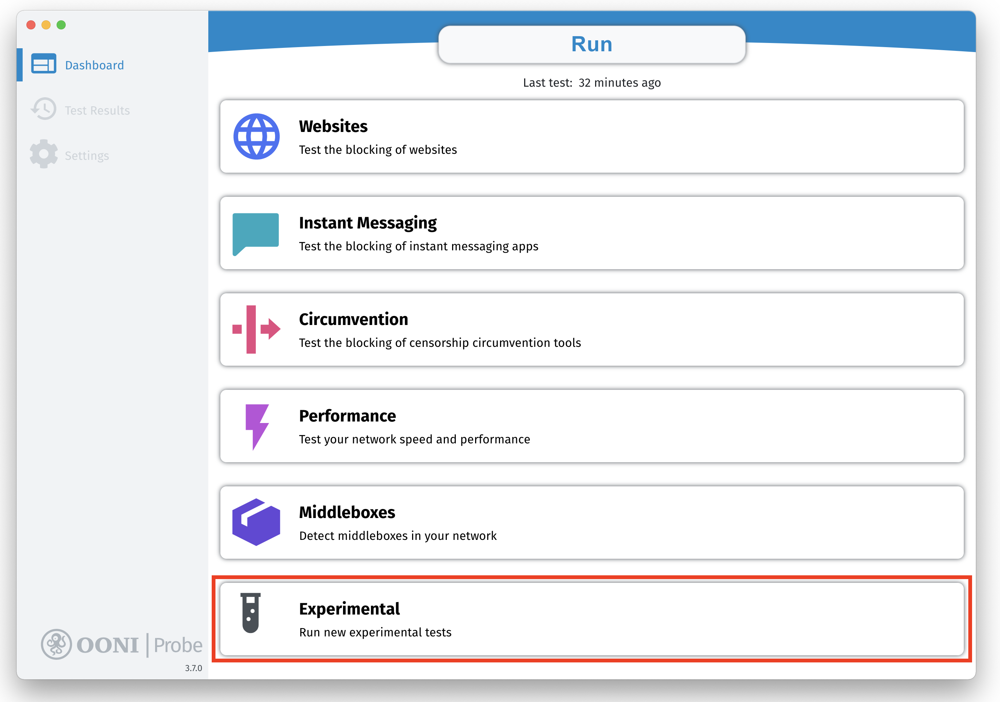
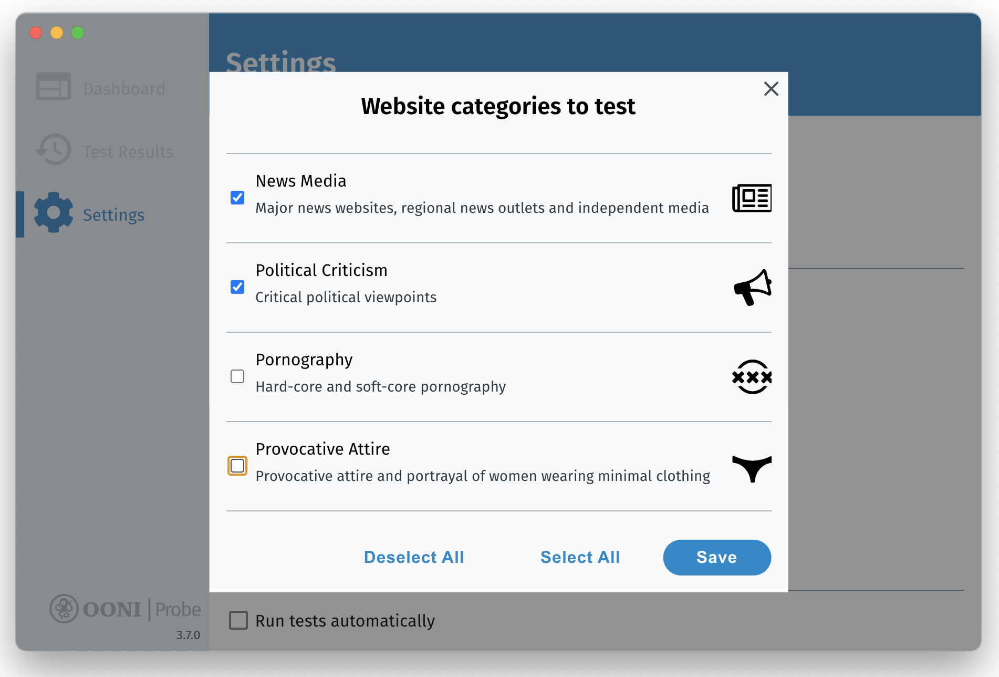
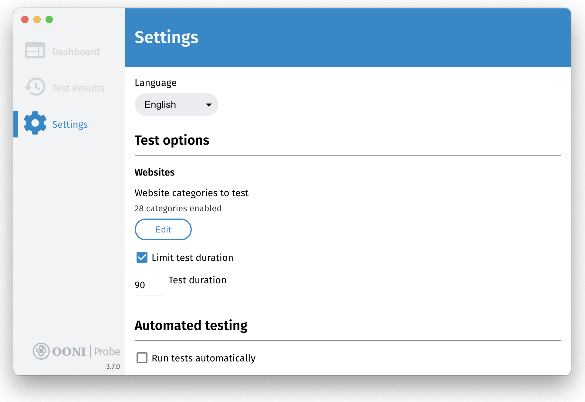
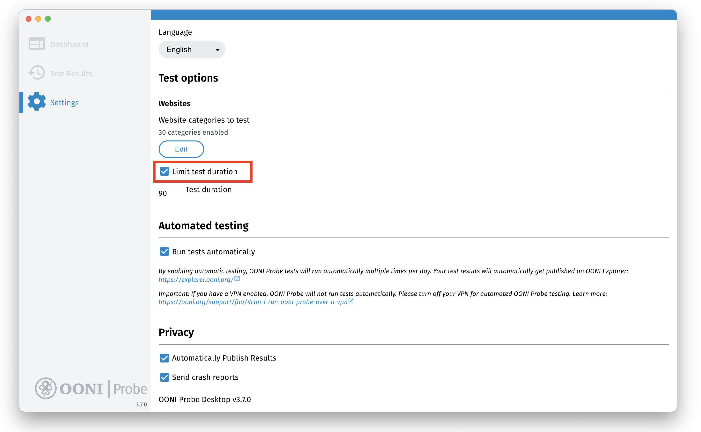
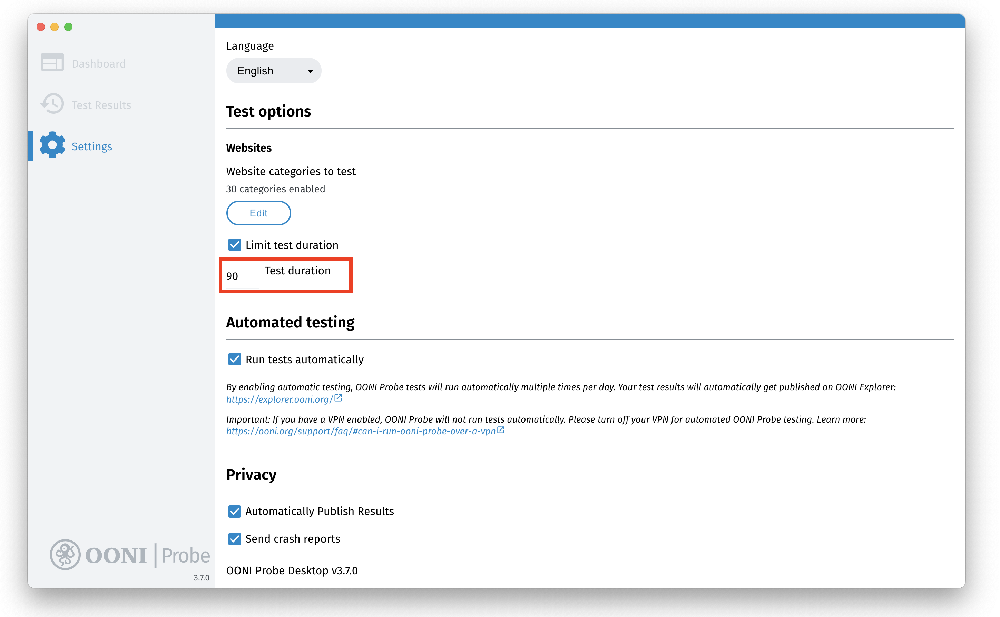
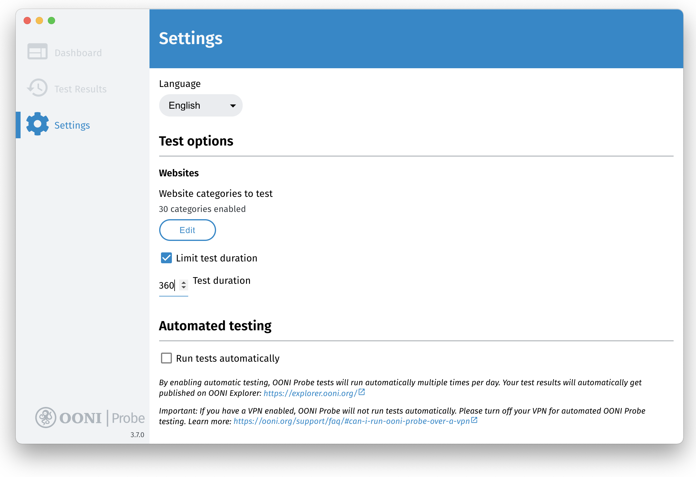
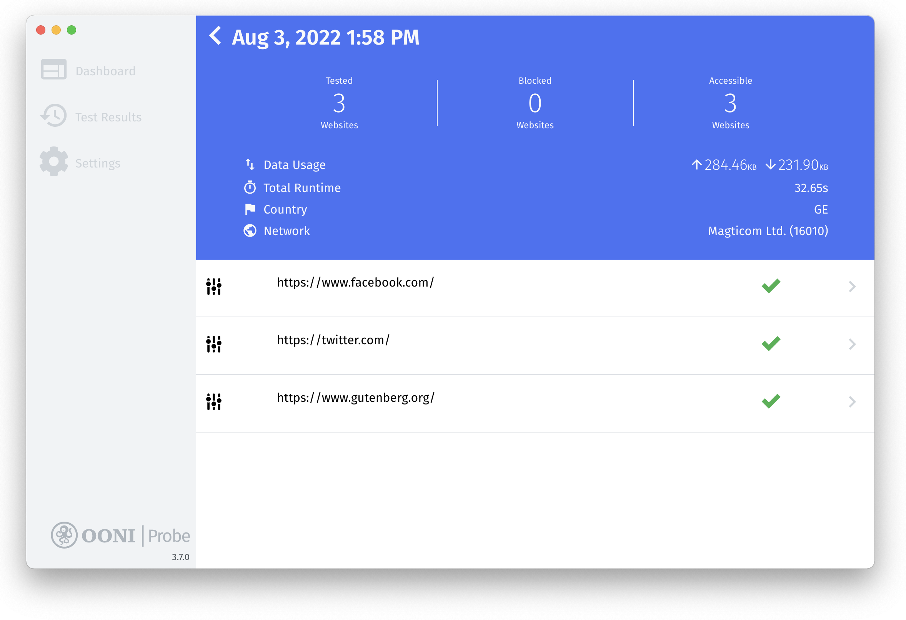
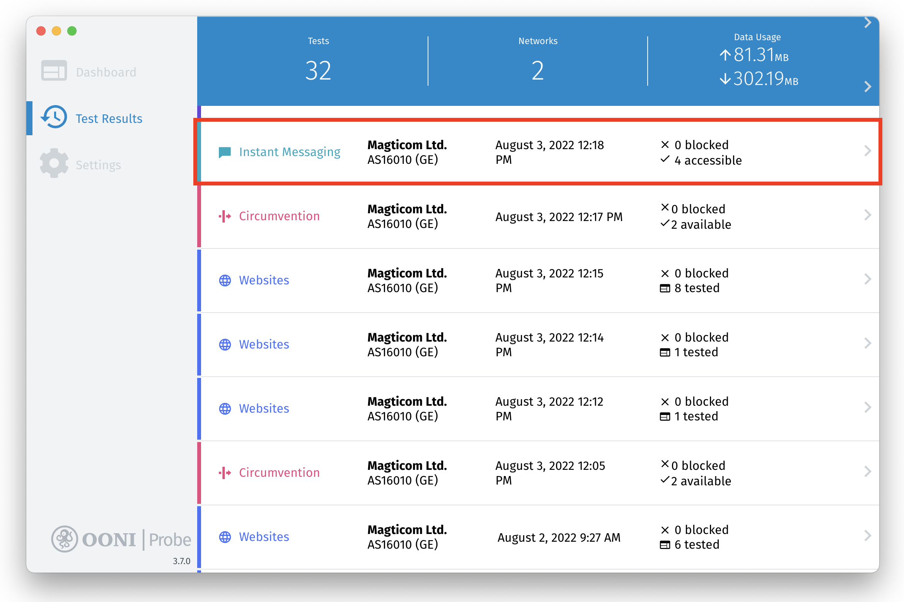
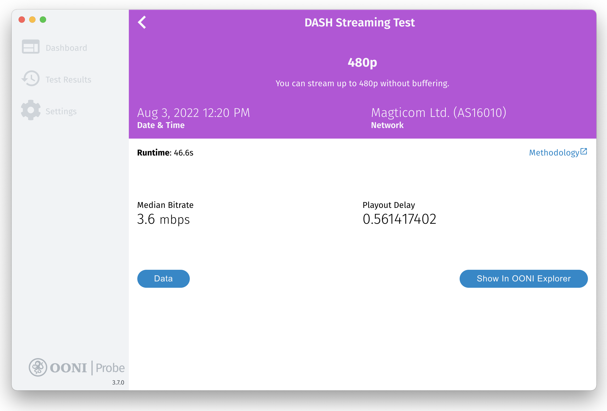

**Последнее обновление:** 6 сентября 2022

**Версия OONI Probe Desktop:** 3.7.0

{{}}

OONI Probe – это [бесплатное оупенсорсное приложение](https://github.com/ooni/probe), с помощью которого вы можете отслеживать интернет-цензуру и другие формы вмешательства в ваше интернет-соединение. В этом документе содержится **пошаговая инструкция** по установке, запуску и настройкам [OONI Probe desktop app](https://ooni.org/install/desktop). 

**С помощью этой инструкции вы научитесь:**

* Использовать OONI Probe Desktop чтобы:

  * Проверять блокировки сайтов
  * Тестировать блокировку мессенджеров
  * Проверять блокировки инструментов обхода инернет-цензуры и блокировок, например VPN и Tor
  * Измерять скорость и качество вашего соединения
* Создавать собственные списки сайтов для тестирования с помощью OONI Probe 
* Получать доступ к результатам ваших тестов и делиться этими результатами
* Настраивать приложение OONI Probe 

Мы надеемся, что после прочтения этой инструкции, вы почувствуете уверенность и желание делиться вашими знаниями об OONI Probe с окружающими! 

Это содержание должно помочь вам сориентироваться внутри инструкции и найти нужные вам разделы. 



## Знакомство с OONI Probe

OONI Probe – это [бесплатное оупенсорсное приложение](https://github.com/ooni/probe), с помощью которого вы можете отслеживать интернет-цензуру и другие формы вмешательства в ваше интернет-соединение. Это приложение разрабатывается с 2012 года [Open Observatory of Network Interference (OONI)](https://ooni.org/), некоммерческим проектом, который изначально был частью [Tor Project](https://www.torproject.org/).

С помощью приложения OONI Probe ([для мобильного](https://ooni.org/install/mobile) и [для рабочего стола](https://ooni.org/install/desktop)), вы можете [тестировать свое соединение](https://ooni.org/nettest/), чтобы проверить присутствие:

* Блокировок [сайтов](https://ooni.org/nettest/web-connectivity/);
* Блокировок мессенджеров ([WhatsApp](https://ooni.org/nettest/whatsapp/), [Facebook Messenger](https://ooni.org/nettest/facebook-messenger/), [Telegram](https://ooni.org/nettest/telegram/), [Signal](https://ooni.org/nettest/signal));
* Эффективность инструментов обхода блокировок ([Tor](https://ooni.org/nettest/tor/), [Tor Snowflake](https://ooni.org/nettest/tor-snowflake/), [Psiphon](https://ooni.org/nettest/psiphon/));
* Присутствие ТСПУ ([middleboxes](https://ooni.org/nettest/http-header-field-manipulation/)) в вашей сети, которые могли бы быть ответственны за цензуру и/или слежку;
* [Скорость и качество](https://ooni.org/nettest/ndt/) вашего соединения и [качество видео-стриминга](https://ooni.org/nettest/dash/).

Как только вы запускаете OONI Probe, результаты ваших тестов автоматически отправляются на сервера OONI, [анализируются](https://github.com/ooni/pipeline), и [публикуются в открытом доступе](https://ooni.org/data/) в режиме реального времени (если только вы не отказались от публикации результатов тестов в настройках вашего приложения).

OONI [публикует в открытом доступе результаты тестов OONI Probe](https://ooni.org/data/) собранные со всего мира, чтобы:

* Повысить **прозрачность интернет-цензуры** во всем мире;
* Поделиться **доказательствами интернет-цензуры** и другими формами вмешательств в работу интернета;
* Дать возможность **независимо проверять** случаи цензуры, обнаруженные OONI;
* Поддерживать **возможность воссоздавать исследования**;
* Поддерживать **исследовательские, юридические, управленческие и правозащитные процессы** по всему миру;
* Поддерживать **публичную дикуссию** о контроле над информацией.

Чтобы обеспечить доступ к результатам тестов OONI Probe (также мы называем их «измерениями»), команда публикует их на портале [OONI Explorer](https://explorer.ooni.org/): веб-платформе, где на основе измерений публикуются графики, и где есть возможность поиска отдельных измерений. 

Так как [OONI Explorer](https://explorer.ooni.org/) хранит более 850 миллионов измерений собранных из более, чем 24 500 сетей в 241 странах и территориях начиная с 2012-го года, скорее всего можно считать его **самой большой глобальной базой открытых данных об интернет-цензуре** на сегодняшний день.

Запуская OONI Probe вы:

* Узнаете блокирует ли ваш интернет-провайдер доступ к определенным сайтам и приложениям, и как он это делает; 
* Сделаете вклад в публикацию измерений, которые будут публично заархивированы, что позволит глобальному сообществу интернет-свобод отслеживать, обнаруживать интернет-цензуру и бороться с ней.

Цель этой инструкции — познакомить вас с использованием [приложения OONI Probe](https://ooni.org/install/desktop), чтобы вы могли присоединиться к глобальному сообществу, измеряющему интернет-цензуру.

### Отказ от ответственности

Так как OONI Probe создано для измерения интернет-цензуры, его запуск может нести определенные [риски](https://ooni.org/about/risks/) для людей в некоторых странах.

Некоторые вещи, которые стоит иметь в виду: 

* **OONI Probe не обеспечивает конфиденциальность.** Любой, кто следит за вашей интернет-активностью (например, правительство, интернет-провайдер, работодатель), может увидеть, что вы используете OONI Probe (точно так же, как они, возможно, могут видеть все остальные программы, которые вы запускаете).
* **OONI Probe — это исследовательский инструмент.** Некоторые тесты OONI Probe созданы специально для обнаружения интернет-цензуры.
* **[Моделирование ваших рисков](https://www.eff.org/keeping-your-site-alive/evaluating-your-threat-model).** Если вы, например, известный активист, уже находящийся под пристальным наблюдением, то вы можете привлечь больше внимания при запуске OONI Probe.
* **Законы и правила страны, в которой вы запускаете OONI Probe.** Чтобы лучше понять контекст, стоит проконсультироваться с местными юристами.
* **Типы сайтов, которые вы тестируете.** С помощью OONI Probe вы можете тестировать провокационные,  нежелательные или запрещенные законом в некоторых странах [сайты](https://ooni.org/support/faq/#which-websites-will-i-test-for-censorship-with-ooni-probe).
* **Типы тестов OONI Probe, которые вы запускаете.** [Тесты OONI Probe](https://ooni.org/nettest/) могут нести разные риски. Например, OONI Probe включает в себя [тест NDT](https://ooni.org/nettest/ndt/) предназначенный для измерения скорости и производительности вашей сети, его можно рассматривать как менее политический или спорный по сравнению с другими тестами, предназначенными для обнаружения блокировок сайтов или приложений.
* **Публиковать свои измерения или нет.** OONI публикует измерения, собранные пользователями OONI Probe [в открытом доступе](https://ooni.org/data/) для повышения прозрачности интернет-цензуры по всему миру. Мы делаем все возможное, чтобы не публиковать ваш IP-адрес или любую другую информацию, потенциально позволяющую установить ваше местоположение или личность. Подробнее об этом можно прочитать в нашей [политике использования данных](https://ooni.org/about/data-policy).

Чтобы узнать больше о потенциальных рисках, связанных с использованием OONI Probe, прочитайте соответствующую [статью](https://ooni.org/about/risks/).

## Установить OONI Probe Desktop

Приложение OONI Probe Desktop доступно на [Windows и macOS](https://ooni.org/install/desktop). Если у вас Linux, пожалуйста, установите [OONI Probe Command Line Interface (CLI)](https://ooni.org/install/cli/ubuntu-debian).

Чтобы установить OONI Probe Desktop на Windows или macOS: 

**Шаг 1.** Зайдите на страницу OONI Probe Desktop на сайте OONI: <https://ooni.org/install/desktop> 

{{}}

**Шаг 2.** Нажмите кнопку **Download**, чтобы скачать OONI Probe. Страница автоматически предложит вам версию OONI Probe подходящую для вашей операционной системы (например, macOS). Если вы хотите выбрать версию для другой операционной системы, пожалуйста, нажмите кнопку **Other Platforms**.

{{}}

{{}}

**Шаг 3.** Когда вы скачаете OONI Probe, дважды нажмите на скачанный файл, чтобы **установить** OONI Probe.

Если у вас **macOS**, перетащите иконку OONI Probe в папку «Приложения».

{{}}

Затем нажмите кнопку **Открыть**, чтобы установить приложение OONI Probe на macOS.

{{}}

В случае, если у вас **Windows** (Windows 10), нажмите **More info** на следующем экране:

{{}}

Затем нажмите **Run anyway**, чтобы установить приложение OONI Probe на Windows.

{{}}

**Шаг 4.** Откройте ваше приложение OONI Probe. На **macOS**, вы можете открыть ваше приложение OONI Probe из папки Приложения. На **Windows**, запустите OONI Probe с рабочего стола.

### Онбординг: Информированное согласие

После того, как вы установили и запустили ваше приложение OONI Probe, запустится онбординг с базовой информацией о приложении.

Вы также узнаете о [возможных рисках](https://ooni.org/about/risks/) связанных с использованием OONI Probe. Чтобы убедиться, что вы понимаете возможные риски, мы включили небольшую анкету. Правильные ответы на анкету – обязательное условие для использования OONI Probe.

В последней части онбординга мы рассказываем о типах данных, которые автоматически собираются при запуске OONI Probe (больше об этом можно прочитать в нашей [политике конфиденциальности](https://ooni.org/about/data-policy)). Вы можетесогласиться отправлять отчеты об ошибках и делиться данными об использовании приолжения, чтобы помогать нам улучшать OONI Probe. 

Следующие шаги описывают прохождение онбординга. 

**Шаг 1.** После прочтения основной информации о OONI Probe нажмите **ОК**.

{{}}

**Шаг 2.** На следующем экране располагается список потенциальных рисков, связанных с запуском OONI Probe. Нажмите **Подробнее**, чтобы прочитать нашу [документацию](https://ooni.org/about/risks/) в которой описаны потенциальный риски.

{{}}

**Шаг 3.** После ознакомления с потенциальными рисками, связанными с запуском OONI Probe, нажмите **Я понимаю**.

{{}}

**Шаг 4.** Тест основан на информации, которую вы прочитали на предыдущем экране. Нажмите **Да**, если вы понимаете смысл утверждения.

{{}}

**Да** — правильный ответ. Если вы нажмете **Нет**, то увидите объяснение, почему ответ неверен.

{{}}

**Шаг 5.** Нажмите **Да**, если вы понимаете смысл утверждения (во второй части теста).

{{}}

**Да** — правильный ответ. Если вы нажмете **Нет**, то увидите объяснение, почему ответ неверен.

{{}}

**Шаг 6.** На следующем экране вас попросят поделиться [отчетами об ошибках](https://ooni.org/about/data-policy#data-we-collect), которые могут помочь нам исправить ошибки в работе OONI Probe. Нажмите **Да**, чтобы делиться отчетами об ошибках и помочь нам улучшить OONI Probe.

{{}}

**Шаг 7.** На следующем экране представлена информация о типах данных, которые OONI собирает и публикует по умолчанию (каждый раз когда вы запускаете OONI Probe). Чтобы узнать больше нажмите **[Политика данных OONI](https://ooni.org/about/data-policy)** на экране.

{{}}

**Шаг 8.** Нажмите **Начнем**, если вы готовы поделиться с нами данными о ваших измерениях.

Вы завершили подготовку и готовы использовать OONI Probe!

{{}}

**Дополнительный шаг 9.** Если вы передумали, и не хотите отправлять нам отчеты об ошибках, нажмите **Настройки**. Это действие перенаправит вас на экран настроек OONI Probe, где вы сможете проверить или изменить настройки по умолчанию. Отправка отчетов об ошибке отключена по умолчанию и включается только в том случае, если вы нажмете кнопку **Начнем** (из шага 7 выше) или если вы включите соответствующий параметр вручную.

{{}}

Подробную информацию о настройках OONI Probe можно найти в разделе [Настройка параметров OONI Probe](https://ooni.org/support/ooni-probe-desktop#configuring-your-ooni-probe-settings) этого руководства.

## Запуск OONI Probe Desktop

Теперь, когда подготовка завершена, вы можете запустить OONI Probe для измерения интернет-цензуры!

**Главное меню** OONI Probe Desktop включает 5 карточек, каждая из которых содержит тесты OONI Probe:

* **Карточка Сайты.** Включает [Web Connectivity тест](https://ooni.org/nettest/web-connectivity/), который проверяет [блокировку сайтов](https://ooni.org/support/faq/#which-websites-will-i-test-for-censorship-with-ooni-probe).
* **Карточка Мессенджеры.** Включает тесты OONI [WhatsApp](https://ooni.org/nettest/whatsapp/), [Facebook Messenger](https://ooni.org/nettest/facebook-messenger/), [Telegram](https://ooni.org/nettest/telegram/) и [Signal](https://ooni.org/nettest/signal), которые проверяют блокировку приложений.
* **Карточка Обход блокировки.** Включает тесты OONI [Tor](https://ooni.org/nettest/tor/) и [Psiphon](https://ooni.org/nettest/psiphon/), которые проверяют доступность инструментов для обхода блокировки.
* **Карточка Производительности.** Включает [тест скорости NDT](https://ooni.org/nettest/ndt/),  [тест производительности видео-стриминга DASH](https://ooni.org/nettest/dash/), и OONI [middlebox](https://ooni.org/support/glossary/#middlebox) тесты ([HTTP Header Field Manipulation](https://ooni.org/nettest/http-header-field-manipulation/) тест и [HTTP Invalid Request Line](https://ooni.org/nettest/http-invalid-request-line/) test).
* **Экспериментальная карточка.** Включает несколько новых экспериментальных тестов, разработанных командой OONI. Эти тесты со временем могут измениться. Подробнее об этих тестах можно узнать [здесь](https://github.com/ooni/spec/tree/master/nettests).

**Шаг 1.** Нажмите **Старт**, чтобы запустить ваши первые тесты OONI Probe.

{{}}

Это запустит **все** тесты OONI Probe (входящие во все карточки) сразу!

{{}}

{{}}

{{}}

{{}}

{{}}

OONI Probe должен выполнить все тесты в течение нескольких минут (зависит от скорости сети, к которой вы подключены, в некоторых случаях это может занять больше времени). Если скорость вашей сети недостаточна и тесты занимают слишком много времени, вы можете **остановить текущий тест**, нажав на **крестик** в правом верхнем углу.

{{}}

Нажмите кнопку **ОК**, чтобы остановить тестирование.

{{}}

Результаты ваших тестов OONI Probe будут автоматически опубликованы в [OONI Explorer](https://explorer.ooni.org/) и в [OONI API](https://api.ooni.io/).

Вы хотели бы ограничить свое тестирование определенным типом теста (картой)? В следующих разделах мы поделимся инструкциями о том, как это сделать.

### Исследование блокировок сайтов

Если вы хотите исследовать только блокировку сайтов, выполните следующие действия:

**Шаг 1.** Нажмите на карточку **Сайты** в главном меню десктопной версии OONI Probe.

{{}}

**Шаг 2.** Нажмите кнопку **Старт** в карточке Сайты.

{{}}

Вы запустили [Web Connectivity test](https://ooni.org/nettest/web-connectivity/) для анализа блокировки сайтов.

{{}}

Результаты вашего тестирования OONI Probe будут автоматически опубликованы в [OONI Explorer](https://explorer.ooni.org/) и в [OONI API](https://api.ooni.io/).

**Какие сайты тестируются?**

По умолчанию вы будете тестировать сайты из двух списков:

* **[Глобальный список](https://github.com/citizenlab/test-lists/blob/master/lists/global.csv)**. Включает значимые на международном уровне сайты (например, facebook.com).
* **[Список по странам](https://github.com/citizenlab/test-lists/tree/master/lists)**. Включает только сайты, актуальные для страны, из которой вы запускаете OONI Probe.

Независимо от того, из какой страны вы запускаете OONI Probe, вы *всегда* будете тестировать сайты из [глобального списка](https://github.com/citizenlab/test-lists/blob/master/lists/global.csv ).

OONI Probe автоматически определит, какой список сайтов [по странам](https://github.com/citizenlab/test-lists/tree/master/lists) выбрать для тестирования в зависимости от того, откуда вы запускаете OONI Probe. Например, если вы запустите OONI Probe в Бразилии, вы будете тестировать сайты из глобального списка и из списка сайтов Бразилии. Если вы окажитесь в Германии и запустите OONI Probe, он проверит сайты из глобального списка и списка сайтов Германии. Но если вы запускаете OONI Probe из страны, для которой еще нет списка, вы будете тестировать только сайты из глобального списка.

Если вы хотите внести свой вклад в [списки тестов Citizen Lab](https://github.com/citizenlab/test-lists/tree/master/lists) (в которые входят сайты которые по умолчанию тестируют пользователи  OONI Probe по всему миру), пожалуйста, обратитесь к соответствующей [документации](https://ooni.org/get-involved/contribute-test-lists).

**Примечание.** Когда вы нажмете кнопку «Старт» (в главном меню или на карточке Сайты), OONI Probe **протестирует столько сайтов, сколько сможет протестировать за 90 секунд**. Сайты, которые проверяются в течение этого времени, выбираются случайным образом из [глобального списка](https://github.com/citizenlab/test-lists/blob/master/lists/global.csv) и [списка по странам](https://github.com/citizenlab/test-lists/tree/master/lists). Каждый раз, когда вы нажимаете «Старт», вы будете проверять новую случайную выборку сайтов. Следовательно, чем больше раз вы нажмете «Старт», тем больше сайтов вы протестируете.

Если вы хотите тестировать более широкую выборку сайтов или совершенно разные сайты, перейдите в раздел [Настройка тестирования сайтов](https://ooni.org/support/ooni-probe-desktop#customizing-your-website-testing).

### Анализ блокировки мессенджеров

Если вы хотите анализировать только блокировку мессенджеров, выполните следующие действия:

**Шаг 1.** Нажмите на карточку **Мессенджеры** в главном меню OONI Probe.

{{}}

**Шаг 2.** Нажмите кнопку **Старт** в карточке Мессенджеры.

{{}}

Вы запустили тесты OONI [WhatsApp](https://ooni.org/nettest/whatsapp/), [Facebook Messenger](https://ooni.org/nettest/facebook-messenger/), [Telegram](https://ooni.org/nettest/telegram/) и [Signal](https://ooni.org/nettest/signal) для анализа блокировки этих приложений.

{{}}

Результаты ваших тестов OONI Probe будут автоматически опубликованы в [OONI Explorer](https://explorer.ooni.org/) и [OONI API](https://api.ooni.io/).

### Анализ доступности инструментов для обхода блокировки

Если вы хотите анализировать только доступность инструментов для обхода блокировки, выполните следующие действия:

**Шаг 1.** Нажмите на карточку **Обход блокировки** в главном меню OONI Probe.

{{}}

**Шаг 2.** Нажмите **Старт** на карточке Обход блокировки.

{{}}

Вы запустили тесты OONI [Tor](https://ooni.org/nettest/tor/) и [Psiphon](https://ooni.org/nettest/psiphon/) для анализа доступности этих инструментов.

{{}}

Результаты ваших тестов OONI Probe будут автоматически опубликованы в [OONI Explorer](https://explorer.ooni.org/) и [OONI API](https://api.ooni.io/).

### Анализ производительности сети

Если вы хотите анализировать только производительность сети, выполните следующие действия:

**Шаг 1.** Нажмите на карточку **Производительность** в главном меню OONI Probe.

{{}}

**Шаг 2.** Нажмите кнопку **Старт** в карточке Производительность.

{{}}

Теперь вы запустили [тест на скорость NDT](https://ooni.org/nettest/ndt/) и [тестирование производительности видео-стриминга DASH](https://ooni.org/nettest/dash/).

{{}}

Результаты ваших тестов OONI Probe будут автоматически опубликованы в [OONI Explorer](https://explorer.ooni.org/) и [OONI API](https://api.ooni.io/).

**Дисклеймер:** [NDT](https://ooni.org/nettest/ndt/) и [DASH](https://ooni.org/nettest/dash/) тесты проводятся на сторонних серверах, предоставленных [Measurement Lab (M-Lab)](https://www.measurementlab.net/). Если вы запускаете эти тесты, M-Lab соберет и опубликует ваш IP-адрес в исследовательских целях, независимо от ваших настроек OONI Probe. Узнайте больше об управлении данными компании M-Lab в их [политике конфиденциальности](https://www.measurementlab.net/privacy/).

### Анализ наличия middlebox-устройств

Если вы хотите исследовать сеть только для обнаружения [middlebox-устройств](https://ooni.org/support/glossary/#middlebox) и признаков взлома сети, выполните следующие действия:

**Шаг 1.** Нажмите на карточку **Middleboxes** в главном меню OONI Probe.

{{}}

**Шаг 2.** Нажмите кнопку **Старт** в карточке Middleboxes.

{{}}

Вы зпустили тесты OONI [middlebox](https://ooni.org/support/glossary/#middlebox) ([HTTP Header Field Manipulation](https://ooni.org/nettest/http-header-field-manipulation/) и [HTTP Invalid Request Line](https://ooni.org/nettest/http-invalid-request-line/)).

{{}}

Результаты ваших тестов OONI Probe будут автоматически опубликованы в [OONI Explorer](https://explorer.ooni.org/) и [OONI API](https://api.ooni.io/).

### Запуск экспериментальных тестов

Если вы хотите запустить новые экспериментальные тесты разработанные командой OONI, выполните следующие действия:

**Шаг 1.** Нажмите на карточку **Экспериментальный режим** в главном меню OONI Probe.

{{}}

**Шаг 2.** Нажмите **Старт** в карточке Экспериментальный режим.

{{}}

Теперь вы запустили [экспериментальные тесты](https://github.com/ooni/spec/tree/master/nettests) разработанные командой OONI. 

{{}}

## Автоматизированное тестирование OONI Probe

Чтобы не запускать тесты вручную, вы можете **включить автоматическое тестирование** в настройках приложения OONI Probe, и OONI Probe будет запускать тесты автоматически!

После включения автоматического тестирования, OONI Probe будет **запускать все тесты в фоновом режиме несколько раз в день** (за исключением тестов производительности, интенсивно использующих ширину соединения), тестируя другой набор сайтов (из [списков тестов Citizen Lab](https://github.com/citizenlab/test-lists/tree/master/lists)) каждый раз. Чтобы не перегружать раздел «Результаты тестирования» вашего приложения, результаты автоматически публикуются в [OONI Explorer](https://explorer.ooni.org/) практически в режиме реального времени (но не отображаются в разделе «Результаты тестирования»).

С помощью автоматизированного тестирования OONI Probe вы можете **регулярно предоставлять данные о цензуре** (без необходимости что-либо делать), позволяя сообществу выступающему за свободу интернета отслеживать случаи цензурирования интернета в вашей стране.

Чтобы активировать автоматическое тестирование OONI Probe выполните следующие действия:

**Шаг 1.** Нажмите **Настройки** на боковой панели OONI Probe.

{{}}

В разделе настроек **Автоматическое тестирование** вы увидите, что автоматическое тестирование OONI Probe отключено по умолчанию.

**Шаг 2.** Активируйте в настройках опцию **Запускать тесты автоматически**.

{{}}

Вы активировали автоматическое тестирование OONI Probe! OONI Probe автоматически запускает тесты несколько раз в день (без вмешательства пользователя), результаты тесирования автоматически публикуются в [OONI Explorer](https://explorer.ooni.org/).

Как правило, если вы не активировали функцию автоматического тестирования, то время от времени будет появляться всплывающее окно с вопросом, хотите ли вы ее активировать.

{{}}

Чтобы активировать автоматическое тестирование, нажмите **Звучит отлично**. Если вы хотите получить напоминание об активации автоматического тестирования позднее, нажмите **Напомнить позже**.

## Настройка тестирования сайтов

По умолчанию при анализе сайтов с помощью OONI Probe вы тестируете URL-адреса, включенные в [списки тестов Citizen Lab](https://github.com/citizenlab/test-lists/tree/master/lists). Другими словами, если вы просто нажмете «Старт» (в главном меню или в карточке «Сайты» приложения OONI Probe), вы протестируете случайую выборку сайтов, взятых из [списков тестов Citizen Lab](https://github.com/citizenlab/test-lists/tree/master/lists). Эти списки были созданы в сотрудничестве с местными исследователями и экспертами. Поскольку они находятся [в открытом доступе на GitHub](https://github.com/citizenlab/test-lists/tree/master/lists), любой человек может изучить список и [предложить добавить новые](https://ooni.org/get-involved/contribute-test-lists) URL-адреса или удалить существующие. Важно чтобы мы продолжали [изучать и обновлять](https://ooni.org/get-involved/contribute-test-lists) эти списки, поскольку содержащиеся в них сайты регулярно тестируются пользователями OONI Probe по всему миру.

Но если вы хотите сформировать список тестируемых сайтов самостоятельно, вы можете сделать это с помощью приложения OONI Probe.

Вы можете настроить тестируемые сайты следующими способами:

* Ограничить список тестируемых сайтов [специальными категориями](https://ooni.org/support/ooni-probe-desktop#testing-specific-website-categories) (например, новые медиа или материалы связанные с правами человека);
* Тестировать только [сайты, которые вам важны](https://ooni.org/support/ooni-probe-desktop#testing-websites-of-your-choice);
* Тестировать [*все* URL-адреса](https://ooni.org/support/ooni-probe-desktop#testing-all-websites-from-the-citizen-lab-test-lists) в ([relevant](https://ooni.org/support/faq/#which-websites-will-i-test-for-censorship-with-ooni-probe)) [списке тестов Citizen Lab](https://github.com/citizenlab/test-lists/tree/master/lists) (вместо того, чтобы тестировать случайную выборку сайтов каждые 90 секунд).

В следующих разделах объясняется, как вы можете релизовать каждый из вышеперечисленных пунктов.

### Тестирование сайтов из определенных категорий

Когда вы нажимаете кнопку «Старт» в приложении OONI Probe, вы тестируете сайты из [глобального списка](https://github.com/citizenlab/test-lists/blob/master/lists/global.csv) и сайты [из списка Citizen Lab для страны, из которой вы запускаете приложение](https://github.com/citizenlab/test-lists/tree/master/lists).

Эти сайты были классифицированы на основе [30 стандартных категорий](https://github.com/citizenlab/test-lists/blob/master/lists/00-LEGEND-new_category_codes.csv). Категории варьируются от средств массовой информации, культуры и прав человека до более провокационных, таких как порнография (последние включены, потому что они с большей вероятностью будут заблокированы, что позволяет обнаруживать методы цензуры которые используют интернет-провайдеры).

По умолчанию в OONI Probe активированы все 30 категорий, чтобы поощрять тестирование более разнообразных сайтов, что повышает шансы обнаружения разных видов интернет-цензуры.

Но если вам некомфортно тестировать все 30 категорий сайтов (особенно если они содержат контент, который является незаконным, провокационным или неприемлемым в вашей стране) или заинтересованы в тестировании только определенного типа контента (например, новостных медиа), вы можете ограничить тестируемые OONI Probe категории сайтов по вашему выбору.

**Шаг 1.** Нажмите **Настройки** в приложении OONI Probe.

{{}}

В настройках раздела **Варианты тестирования** вы увидите, что [30 категорий сайтов](https://github.com/citizenlab/test-lists/blob/master/lists/00-LEGEND-new_category_codes.csv) активированы по умолчанию.

**Шаг 2.** Нажмите кнопку **Редактировать** в разделе «Категории сайтов для тестирования».

{{}}

Вы видите [30 категорий](https://github.com/citizenlab/test-lists/blob/master/lists/00-LEGEND-new_category_codes.csv) сайтов, которые OONI Probe тестирует по умолчанию. Все эти категории активированы.

{{}}

**Шаг 3.** **Отключить** категории сайтов, которые вы **не** хотите тестировать.

{{}}

В приведенном выше примере мы выключили 2 категории – «Порнография» и «Провоцирующая одежда».

**Шаг 4.** Нажмите **Сохранить**.

Когда вы вернетесь в меню настроек, то увидите, что только 28 категорий сайтов активированы, потому что 2 мы выключили. 

{{}}

Вы можете вернуться к этим настройкам в любое время, чтобы активировать или отключить категории сайтов по вашему выбору.

### Тестирование сайтов по вашему выбору

Вы можете тестировать интересующие вас сайты напрямую, выполнив следующие действия:

**Шаг 1.** Нажмите на карточку **Сайты** в приложении OONI Probe.

{{}}

**Шаг 2.** Нажмите кнопку **Выберите сайты** внутри карточки Сайты.

{{}}

Вы увидите экран, где вы можете выбрать сайт или сайты, которые хотите протестировать.

{{}}

**Step 3.** **Напишите URL** сайта, который хотите протестировать. В этом примере мы написали `https://www.facebook.com/`. 

{{}}

**Важно:** Пожалуйста, убедитесь, что [URL](https://ooni.org/support/glossary/#url) введен правильно. Если он введен неверно, OONI Probe *не* проверит сайт, что может привести к неточным результатам тестирования.

Также следует помнить:

* Сайт использует **HTTP** или **HTTPS**? Если второе, пожалуйста, добавьте `s` после `http`.
* Включает ли [домен](https://ooni.org/support/glossary/#domain-name) `www`? Если да, пожалуйста, добавьте его. 

Чтобы гарантировать правильность [URL](https://ooni.org/support/glossary/#url), **пожалуйста, проверьте, как он выглядит при доступе из обычного браузера**.

**Шаг 4.** Нажмите кнопку **Добавить сайт**, чтобы создать строку для добавления тестируемого сайта.

**Шаг 5.** **Добавьте другой URL**, который вы хотите протестировать. В следующем примере мы добавили `https://twitter.com/`. 

{{}}

Если вы передумали и хотите удалить одну из добавленных ссылок, нажмите на красную иконку рядом со ссылкой, которую хотите удалить.

Вы можете добавить любое количество ссылок. В следующем примере мы добавили `https://www.gutenberg.org/`. 

{{}}

**Шаг 6.** Нажмите **Старт**, чтобы протестировать все сайты, которые вы добавили.

Теперь OONI Probe будет тестировать все нужные вам сайты!

{{}}

Результаты тестов OONI Probe автоматически опубликуются в [OONI Explorer](https://explorer.ooni.org/) и в [OONI API](https://api.ooni.io/).

### Протестировать все сайты из списков Citizen Lab

OONI Probe тестирует ровно столько сайтов, к скольким успевает подключиться за 90 секунд (в рамках предустановленных настроек). 

Если вы подключены к WiFi и хотели бы протестировать **все сайты** из ([релевантных](https://ooni.org/support/faq/#which-websites-will-i-test-for-censorship-with-ooni-probe)) [списков Citizen Lab](https://github.com/citizenlab/test-lists/tree/master/lists) за раз, вы можете сделать это следующим образом:

**Шаг 1.** Нажмите **Настройки** в боковом меню вашего приложения OONI Probe. 

{{}}

В разделе настроек **Варианты тестирования**, вам нужно зайти в раздел **Сайты**, где вы увидите опцию **Ограничить продолжительность теста**, которая ограничивает тестирование сайтов по времени и включена как предустановленная настройка.

**Шаг 2.** Отключить настройку **Ограничить продолжительность теста**.

{{}}

Теперь ваше тестирование не ограничено по времени. Это значит, что OONI Probe может тестировать все сайты, включенные в [релевантные списки Citizen Lab](https://ooni.org/support/faq/#which-websites-will-i-test-for-censorship-with-ooni-probe) каждый раз, когда вы нажимаете “Старт”. 

{{}}

**Другой вариант**: Если вам хотелось бы тестировать больше сайтов в течение более долгого времени (но необязательно тестировать все сайты), вы можете сделать это следующим образом:

**Шаг 1.** Откройте **Продолжительность теста** в разделе **Варианты тестирования**, **Сайты**.

{{}}

Изначально длительность тестирования сайтов установлена как **90 секунд**. Это значит, что OONI Probe протестирует ровно столько сайтов (из [релевантных списков Citizen Lab](https://ooni.org/support/faq/#which-websites-will-i-test-for-censorship-with-ooni-probe)), к скольким успеет подключиться за 90 секунд. 

**Шаг 2.** Чтобы изменить длительность теста, **укажите количество секунд**, чтобы обозначить время, в течение которого вам бы хотелось, чтобы OONI Probe тестировал сайты. В примере ниже, мы ввели `360`, а значит OONI Probe будет тестировать сайты в течение 6 минут.

{{}}

Теперь вы поменяли длительность тестирования сайтов в вашем приложении OONI Probe.

## Доступ к результатам тестирований OONI Probe

Как только тест OONI Probe закончится, вы сможете увидеть результаты теста в вашем приложении OONI Probe. 

**Шаг 1.** Нажмите **Результаты тестов** в боковом меню приложения OONI Probe. 

{{}}

Теперь вы видите результаты всех тестов, которые вы провели в OONI Probe. Результаты представлены в хронологическом порядке, самые последние тесты будут наверху. В этом разделе тесты сгруппированы по 5 тематическим карточкам приложения («Сайты», «Мессенджеры», «Обход блокировки», «Производительность», «Экспериментальный режим»). 

В каждой отдельной карточке с результатами теста вы увидите:

* **Сеть** (например, `AS16010` – Magticom Ltd.) через которую было проведено тестирование;
* **Дата и время** тестирования (например, 23 августа 2022 в 13:58 по местному времени);
* **Общие результаты тестирования** (например, 3 оказались доступны и ни один не был заблокирован).

Эти общие сведения потенциально могут помочь сравнивать результаты между сетями (если вы подключаетесь через разные сети), и дают обобщенное понимание выводов.

В верхней панели экрана с результатами тестов, будет видно:

* **Количество тестов OONI Probe**, которое вы запустили до этого момента;
* **Количество сетей**, в которых вы запускали OONI Probe;
*  **Количество траффика**, использованного OONI Probe.

{{}}

Экран с результатами тестов показывает только обобщенные результаты, далее мы объясним как получить более подробную информацию.  

### Сайты

Вы можете получить доступ к результатам тестов OONI Probe следующим способом: 

**Шаг 1.** Нажмите **Сайты** на экране с результатами тестов приложения OONI Probe. 

{{}}

Теперь вы увидите список всех сайтов, которые вы протестировали в течение одной сессии. 

{{}}

В верхней панели будет указано общая информация о вашем тестировании. Рядом с каждой ссылкой будет либо зеленая галочка (если сайт оказался доступен), либо красный крест (если сайт оказался заблокирован).

**Шаг 2.** Нажмите на **строчку протестированного сайта**, чтобы получить доступ к данным о тестировании этого сайта.

{{}}

Теперь у вас есть доступ к данным, содержащимся в тестировании отдельного сайта. 

Приведенная выше страница измерений это тестирование https://www.facebook.com/. На этой странице мы видим, что https://www.facebook.com/ был доступен во время тестирования на Magticom Ltd. (AS16010) 3 августа 2022 года в 13:58 по местному времени.

Если бы сайт был (возможно) заблокирован, на странице измерения был бы оранжевый заголовок с восклицательным знаком, как в скриншоте ниже.

{{}}

В этом случае мы видим, что https://www.gutenberg.org показал признаки блокировки («[аномалию](https://ooni.org/support/glossary/#network-anomaly)») при тестировании в сети Vodafone Italia (AS30722) 30 марта 2021 года в 15:13 по местному времени. В частности, мы можем видеть признаки [DNS фальсификации](https://ooni.org/support/glossary/#dns-tampering) (на основе эвристики [теста OONI Web Connectivity](https://ooni.org/nettest/web-connectivity/)). Это означает, что Vodafone Italia мог заблокировать доступ к https://www.gutenberg.org (30 марта 2021 г.) с помощью фальсификации DNS.

Поскольку могут возникать [ложные блокировки](https://ooni.org/support/glossary/#false-positive), мы отмечаем результаты тестов, которые не соответствуют всем критериям нашего [теста на подключение к Интернету](https://ooni.org/nettest/web-connectivity/) как «[аномалии](https://ooni.org/support/faq/#how-can-i-interpret-ooni-data)» (а не «подтвержденные блокировки» ), что указывает на то, что проверенный сайт *возможно* заблокирован.

При оценке блокировки веб-сайта полезно изучить соответствующие измерения (другие тестирования этого же веб-сайта в этой же сети в другие дни и время). Это можно сделать с помощью [OONI Explorer](https://explorer.ooni.org/), где мы публикуем все результаты тестирования в **агрегированном** виде. OONI Explorer также [показывает измерения всех «подтвержденных блокировок»](https://explorer.ooni.org/search?since=2021-02-24&only=confirmed), когда мы автоматически подтверждаем блокировку веб-сайтов на основании [страниц блокировки](https://ooni.org/support/glossary/#block-page).

### Мессенджеры

Вы можете получить доступ к результатам тестов OONI Probe на доступность мессенджеров следующим образом: 

**Шаг 1.** Нажмите **Мессенджеры** на экране с результатами тестов в вашем приложении OONI Probe. 

{{}}

Теперь вы видите список мессенджеров (WhatsApp, Facebook Messenger, Telegram, Signal), которые вы протестировали в рамках отдельной сессии.

{{}}

В верхней панели мы показываем общие результаты вашего тестирования доступности мессенджеров. Рядом с каждым протестированным приложением будет либо зеленая галочка (подтверждающая доступность приложения), либо красный крестик (подтверждающий возможную блокировку приложения).

**Шаг 2.** Нажмите на **строку протестированного приложения**, чтобы получить доступ к данным о результатах тестирования этого приложения. 

{{}}

Приведенная выше страница измерений относится к тестированию WhatsApp. Мы видим, что WhatsApp был доступен при тестировании на Magticom Ltd. (AS16010) 3 августа 2022 года в 12:19 по местному времени. Такой вывод сделан потому что [тест OONI WhatsApp](https://ooni.org/nettest/whatsapp/) смог успешно подключиться к WhatsApp, службе регистрации и веб-интерфейсу (`web.whatsapp.com`).

Если бы WhatsApp по итогам теста был отмечен как (возможно) заблокированный, то на этой странице измерения отобразилась бы соответствующая информация (на основе эвристики [теста WhatsApp OONI](https://ooni.org/nettest/whatsapp/)).

Таким же образом вы можете получить доступ к результатам тестирования доступности Telegram через результаты тестирования мессенджеров в вашем приложении OONI Probe.

{{}}

В этом случае мы видим, что Telegram был доступен при тестировании на Magticom Ltd. (AS16010) 3 августа 2022 года в 12:19 по местному времени. Этот вывод сделан потому, что [тест Telegram OONI](https://ooni.org/nettest/telegram/) смог успешно подключиться к Telegram и веб-интерфейсу (`web.telegram.org`).

Если бы Telegram по итогам теста был отмечен как (возможно) заблокированный, то на этой странице измерения отобразилась бы соответствующая информация (на основе эвристики [теста Telegram OONI](https://ooni.org/nettest/telegram/)).

Таким же образом вы можете получить доступ к результатам тестирования доступности Facebook Messenger через результаты тестирования мессенджеров в вашем приложении OONI Probe.

{{}}

В этом случае мы видим, что Facebook Messenger был доступен при тестировании на Magticom Ltd. (AS16010) 3 августа 2022 года в 13:58 по местному времени. Этот вывод сделан, потому что [тест Facebook Messenger OONI](https://ooni.org/nettest/facebook-messenger/) смог успешно подключиться к Facebook и правильно обнаружить IP-адреса Facebook.

Если бы Facebook Messenger по итогам теста был отмечен как (возможно) заблокированный, то на этой странице измерения отобразилась бы соответствующая информация (на основе эвристики [теста Facebook Messenger](https://ooni.org/nettest/facebook-messenger/)).

Также вы можете найти результаты тестов Signal в вашем приложении OONI Probe.

{{}}

В этом случае мы видим, что Signal был досутен при тестировании на Magticom Ltd. (AS16010) 3 августа 2022 года в 12:19 по местному времени. Такой вывод сделан, потому что [тест Signal OONI](https://ooni.org/nettest/signal) смог успешно подключиться к Signal.

Если бы Signal по итогам теста был отмечен как (возможно) заблокированный, то на этой странице измерения отобразилась бы соответствующая информация (на основе эвристики [теста Signal](https://ooni.org/nettest/signal)).

Во всех случаях мы рекомендуем обращаться к данным OONI, публикующимся в [OONI Explorer](https://explorer.ooni.org/), где вы можете изучить обобщенные результаты (и потенциально исключить [ложные блокировки](https://ooni.org/support/glossary/#false-positive) и подтвердить настоящие блокировки).

### Обход блокировки

Вы можете получить доступ к результатам тестов OONI Probe на эффективность инструментов обхода блокировок следующим образом: 

**Шаг 1.** Нажмите **Обход блокировки** на экране с результатами тестов вашего приложения OONI Probe. 

{{}}

Теперь вы видите список инструментов обхода блокировок (Psiphon, Tor), которые вы протестировали в рамках отдельной сессии.

{{}}

В верхней панели мы показываем общие результаты вашего тестирования инструментов обхода блокировок. Рядом с каждым протестированным инструментом будет либо зеленая галочка (подтверждающая доступность приложения), либо красный крестик (подтверждающий возможную блокировку приложения).

**Шаг 2.** Нажмите на **строку протестированного инструмента**, чтобы получить доступ к данным о результатах тестирования этого инструмента. 

{{}}

Приведенная выше страница относится к тестированию [Psiphon](https://psiphon.ca/). Мы видим, что Psiphon был доступен при тестировании на Magticom Ltd. (AS16010) 3 августа 2022 года в 12:17 по местному времени. Такой вывод сделан, потому что [тест OONI Psiphon](https://ooni.org/nettest/psiphon/) смог успешно реализовать соединение Psiphon.

Если бы Psiphon по итогам теста был отмечен как (возможно) заблокированный, то на этой странице измерения отобразилась бы соответствующая информация (на основе эвристики [теста Psiphon](https://ooni.org/nettest/psiphon/)).

Таким же образом вы можете получить доступ к результатам тестирования  [Tor](https://www.torproject.org/) через результаты тестирования инструментов обхода блокировок в вашем приложении OONI Probe.

{{}}

В этом случае мы видим, что Tor был доступен при тестировании на Magticom Ltd. (AS16010) 3 августа 2022 года в 12:17 по местному времени. Такой вывод сделан потому, что [тест OONI Tor](https://ooni.org/nettest/tor/) смог успешно подключиться к большинству стандартных мостов Tor и ко всем центрам Tor.

Если бы Tor по итогам теста был отмечен как (возможно) заблокированный, то на этой странице измерения отобразилась бы соответствующая информация (на основе эвристики [теста Tor](https://ooni.org/nettest/tor/)).

Во всех случаях мы рекомендуем обращаться к данным OONI, публикующимся в [OONI Explorer](https://explorer.ooni.org/), где вы можете изучить обобщенные результаты (и потенциально исключить [ложные блокировки](https://ooni.org/support/glossary/#false-positive) и подтвердить настоящие блокировки).

### Производительность

Вы можете получить доступ к результатам тестов производительности вашей сети в вашем приложении OONI Probe следующим образом: 

**Шаг 1.** Нажмите **Производительность** на экране с результатами тестов в вашем приложении OONI Probe. 

{{}}

Теперь вы видите список тестов на производительность, которые вы произвели в рамках отдельной сессии.

{{}}

В верхней панели мы показываем общие результаты вашего тестирования производительности вместе с датой и временем тестирования, страной и сетью, где производилось тестирование. Основные итоги теста показаны рядом с каждым из результатов.

**Шаг 2.** Нажмите на **строку отдельного теста**, чтобы получить доступ к данным о результатах тестирования. 

{{}}

Приведенная выше страница измерений взята из [теста скорости NDT](https://ooni.org/nettest/ndt/). Мы видим, что когда был выполнен этот [тест скорости NDT](https://ooni.org/nettest/ndt/), скорость загрузки из сети составила 21,4 мегабита в секунду, скорость загрузки в сеть составила 19,7 мегабита в секунду, и потребовалось 147,481 миллисекунд, чтобы установить соединение с сервером [M-Lab](https://www.measurementlab.net/). Это указывает на хорошую скорость интернета, учитывая, что средний пинг (до этого сервера M-Lab) составляет 953,267 мс.

Вы можете сравнить результаты теста NDT с параметрами интернет-соединения, которые предлагает вам ваш интернет-провайдер.

Вы можете получить доступ к результатам [DASH](https://ooni.org/nettest/dash/) теста через результаты производительности в вашем приложении OONI Probe.

{{}}

В этом случае мы видим, что [видео-стриминговый тест DASH](https://ooni.org/nettest/dash/) был запущен на Magticom Ltd. (AS16010) 3 августа 2022 года в 12:21 по местному времени. Во время теста можно было транслировать видео до 480p без буферизации, при этом средний битрейт составлял 3,6 мегабита в секунду. Это указывает на то, что пользователь может транслировать видео низкого разрешения в этой сети только в том случае, если сервер потоковой передачи находится рядом с сервером измерений.

Вы можете сравнит результаты вашего DASH-теста с тем, что официально предлагает ваш интернет-провайдер. в рамках вашего тарифа 

### Middleboxes

Middlebox — это компьютерное сетевое устройство, которое преобразует, проверяет, фильтрует или иным образом манипулирует трафиком для целей, отличных от пересылки пакетов. Многие интернет-провайдеры по всему миру используют middleboxes для повышения производительности сети, предоставления пользователям более быстрого доступа к веб-сайтам и для ряда других задач. Однако иногда такие устройства также используются для реализации интернет-цензуры и/или слежки.

Вы можете получить доступ к результатам тестов на присутствие сетевого вмешательства (с целью обнаружения [middleboxes](https://ooni.org/support/glossary/#middlebox)) в вашем приложении OONI Probe следующим образом: 

**Шаг 1.** Нажмите **Middleboxes** на экране с результатами тестов вашего приложения OONI Probe. 

{{}}

Теперь вы видите список тестов на присутствие middleboxes ([HTTP Invalid Request Line test](https://ooni.org/nettest/http-invalid-request-line/) and [HTTP Header Field Manipulation test](https://ooni.org/nettest/http-header-field-manipulation/)), которые вы произвели в рамках отдельной сессии.

{{}}

В верхней панели мы показываем общие результаты вашего тестирования (в этом случае, что устройства middleboxes не обнаружены) вместе с датой и временем тестирования, страной и сетью, где производилось тестирование.

**Шаг 2.** Нажмите на **строку отдельного теста**, чтобы получить доступ к данным о результатах тестирования. 

{{}}

В примере выше мы видим, что тест [HTTP Invalid Request Line](https://ooni.org/nettest/http-invalid-request-line/) был запущен в Magticom Ltd. (AS16010) 3 августа 2022 г. в 12:20 по местному времени. Когда этот тест был выполнен, он отправил нерабочую строку HTTP-запроса (содержащую недопустимый номер версии HTTP, недопустимое количество полей и огромный метод запроса) эхо-службе, прослушивающей стандартный HTTP-порт. Служба эха (инструмент отладки и измерения, который просто отправляет обратно любые полученные данные) отправила нам нерабочую строку HTTP-запроса точно так же, как она ее получила. Это указывает на то, что в тестируемой сети нет видимого middlebox или манипулирования трафиком.

Однако если бы в тестируемой сети присутствовало устройство middlebox, нерабочая строка HTTP-запроса была бы им перехвачена, что потенциально могло бы вызвать ошибку, которая была бы отправлена нам эхо-службой. Такие ошибки указывают на то, что в тестируемой сети, скорее всего, размещено программное обеспечение для манипулирования трафиком, хотя не всегда понятно, что это за программное обеспечение.

Точно так же вы можете получить доступ к результатам теста OONI [HTTP Header Field Manipulation](https://ooni.org/nettest/http-header-field-manipulation/) через результаты в разделе Middleboxes в приложении OONI Probe.

{{}}

В приведенном примере мы видим, что тест [HTTP Header Field Manipulation](https://ooni.org/nettest/http-header-field-manipulation/) был запущен на Magticom Ltd. (AS16010) 3 августа 2022 г. в 12:20 по местному времени. Во время теста был эмулирован [HTTP-запрос](https://ooni.org/support/glossary/#http-request) к внутреннему управляющему серверу (который отправляет обратно все полученные данные), но отправлял [HTTP-заголовки](https://ooni.org/support/glossary/#http-header) с вариациями в написании заглавными буквами (т.е. неканонические заголовки HTTP). Поскольку мы получили заголовки HTTP точно в том виде, в каком мы их отправили, в тестируемой сети нет видимых middleboxes или манипулирования трафиком.

Однако, если бы в тестируемой сети присутствовало middlebox-устройство, оно могло бы нормализовать отправленные нами нерабочие заголовки или добавить дополнительные заголовки. В зависимости от того, совпадают ли HTTP-заголовки, которые мы отправляем и получаем от  управляющего сервера, мы можем оценить, присутствует ли middlebox-устройство в тестируемой сети.

## Поделиться результатами ваших тестов OONI Probe 

В каждом результате теста OONI Probe вы можете получить доступ к функциям, которые позволят вам:

* Получить доступ, копировать и делиться **необработанными данными измерений** (относящимися к результату этого теста);
* Получить **доступ к измерению** в [OONI Explorer](https://explorer.ooni.org/) (где оно публикуется автоматически) и, возможно, поделиться им со своими контактами.

**Шаг 1.** Получите доступ к результату любого теста OONI Probe (подробности о том, как найти результаты теста OONI Probe, см. в предыдущем разделе этой инструкции).

{{}}

В следующих разделах мы расскажем о каждой отдельной функции.

### Необработанные данные

Каждый результат теста OONI Probe предоставляет обзор результатов. Фактические данные (т. е. необработанные данные), на которых основан каждый результат теста, доступны с помощью кнопки **Данные** на каждом экране результатов отдельного теста.

Другими словами, если вы протестировали `https://www.facebook.com`, на странице результатов теста будет представлен обзор результатов (например, «Доступно»), а необработанные данные измерений дают более подробную информацию о тестировании. Например, если сайт недоступен, будет показано, как и почему он может быть заблокирован.

Использовать необработанные данные может быть полезно по следующим причинам:

* Данные раскрывают технические детали, которые потенциально могут служить **доказательством** блокировки;
* Данные могут помочь определить, действительно ли сайт заблокирован или его тестирование вызвало [аномалию](https://ooni.org/support/glossary/#network-anomaly) по другим причинам, не связанным с цензурой (в случае [ложных блокировок](https://ooni.org/support/glossary/#false-positive)).

Вы можете получить доступ к необработанным данным и поделиться ими следующим образом:

**Шаг 1.** Нажмите кнопку **Данные** на экране с результатами теста OONI Probe.

{{}}

Теперь у вас есть доступ к необработанным данным относящимся к результату теста OONI Probe, который вы выбрали.

{{}}

Вы можете нажимать стрелочки (такие как рядом с `test_keys`), чтобы раскрыть подробнее необработанные данные.

**Шаг 2.** Чтобы скопировать и поделиться необработанными данными (например, с техническими экспертами, которые могут помочь их интерпретировать), нажмите на кнопку **копирования** в начале страницы с данными (в `корневой` строке, как обозначено ниже). 

{{}}

Теперь вы скопировали необработанные данные и можете поделиться ими с вашими контактами.

### Получить доступ к вашим измерениям через OONI Explorer. 

Если вы заинтересованы в просмотре результатов теста OONI Probe в [OONI Explorer](https://explorer.ooni.org/), или в ссылке на отдельное измерение, которой вы сможете делиться со своими контактами или, например, в исследовательском отчете или твите.

**Шаг 1.** Нажмите кнопку **Показать в OONI Explorer** на экране с результатами тестов OONI Probe.

{{}}

Это откроет соответствующий результат теста OONI Probe в вашем браузере в [OONI Explorer](https://explorer.ooni.org/). Например, для теста Facebook, упомянутого выше, это будет следующая [страница](https://explorer.ooni.org/measurement/20220803T095857Z_webconnectivity_GE_16010_n1_vTthHQGwVlhSDc19?input=https://www.facebook.com/).

{{}}

Теперь у вас есть доступ к измерению OONI Probe в [OONI Explorer](https://explorer.ooni.org/). Если вы прокрутите вниз эту страницу, то увидите также необработанные данные теста. Теперь вы можете делиться этим тестом с помощью URL-адреса этой страницы.

## Настройки OONI Probe

Вы можете кастомизировать ваше приложение OONI Probe через настройки.

**Шаг 1.** Нажмите **Настройки** в боковом меню приложения OONI Probe.

{{}}

Теперь вы видите все настройки приложения OONI Probe.

В следующих разделах мы расскажем про каждую из настроек.

### Язык

Благодаря поддержке сообщества [Localization Lab](https://www.localizationlab.org/), приложения OONI Probe доступны на нескольких языках. 

Вы можете поменять язык вашего приложения OONI Probe с помощью следующих шагов:

**Шаг 1.** Нажмите на выпадающее меню в разделе **Язык настроек** в настройках.

{{}}

**Шаг 2.** Выберите язык из выпадающего меню. 

Ваше приложение OONI Probe теперь переключено на язык, который вы выбрали.

Если вы хотите помочь с редактурой или поучаствовать в переводе OONI Probe, пожалуйста, [присоединяйтесь к нам в Transifex](https://explore.transifex.com/otf/ooniprobe/).

### Варианты тестирования

Про настройки тестирования сайтов мы уже рассказали в предыдущем разделе этой инструкции, «[Настройка тестирования сайтов](https://ooni.org/support/ooni-probe-desktop#customizing-your-website-testing)».

### Автоматическое тестирование

Настройки автоматического тестирования OONI Probe также уже были описаны в предыдущем разделе этой инструкции, «[Автоматическое тестирование OONI Probe](https://ooni.org/support/ooni-probe-desktop#automated-ooni-probe-testing)».

### Конфиденциальность

Раздел «Конфиденциальность» настроек OONI Probe относится к публикации результатов тестирования OONI Probe и отправке [отчетов об ошибках](https://ooni.org/about/data-policy).

{{}}

По умолчанию результаты тестов OONI Probe публикуются автоматически, а отправка отчетов об ошибках будет включена только если вы согласились на это во время первого входа в приложение.

Мы **поощряем публикацию результатов тестов OONI Probe**, потому что они могут помочь повысить прозрачность интернет-цензуры и поддержать исследования и усилия по защите интересов интернет-сообщества.

Если вы опубликуете результаты тестов OONI Probe, они будут включать следующие данные:

* Дата и время теста;
* Код страны (например, 'RU' для России);
* Информацию о сети: [ASN](https://ooni.org/support/glossary/#asn) (например, `AS16010` for Magticom Ltd.);
* Данные о тестах (которые зависят от [теста OONI Probe](https://ooni.org/nettest/)).

Дополнительная информация доступна в нашей [Политике данных](https://ooni.org/about/data-policy).

Если вы решите делиться с нами отчетами об ошибках, вы будете делиться информацией, необходимой для выявления ошибок и повышения производительности приложения OONI Probe. Эти отчеты включают версию приложения OONI Probe и информацию о том, почему и как конкретная функция OONI Probe не работает должным образом.

Вы можете отказаться от публикации результатов тестирования OONI Probe и/или отправки нам отчетов об ошибках, отключив соответствующие настройки.

{{}}

Спасибо, что прочитали эту инструкцию, и спасибо, что используете OONI Probe! 
