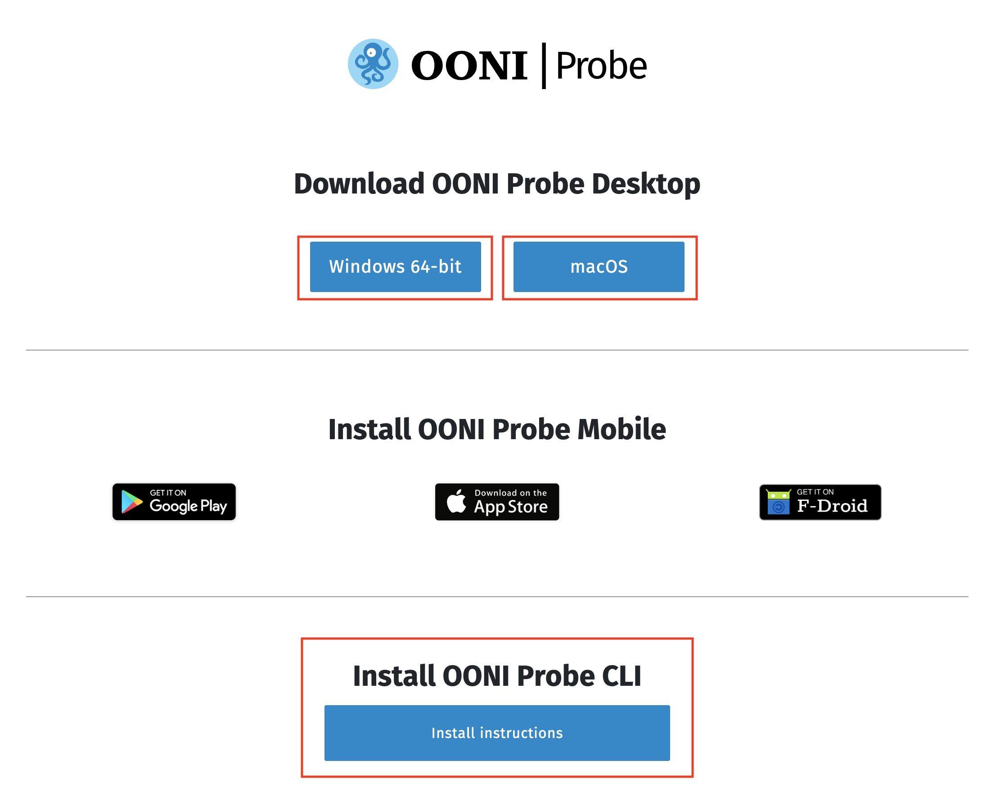
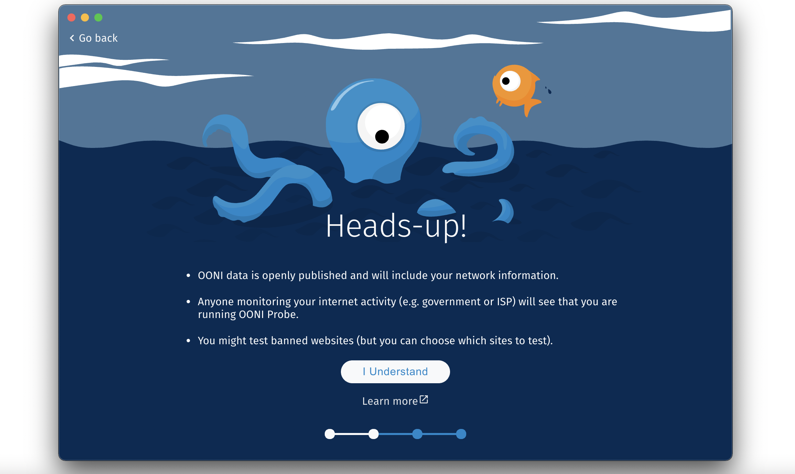
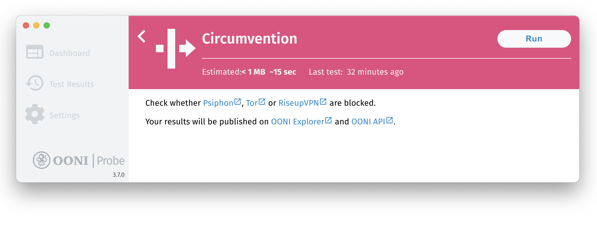
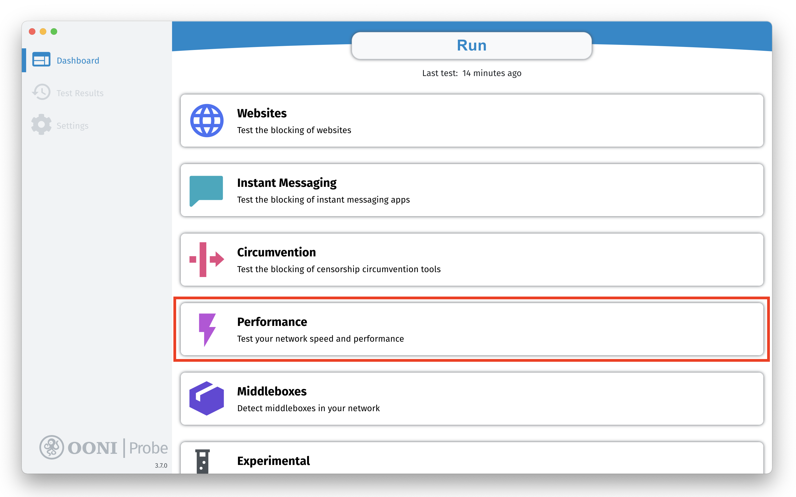
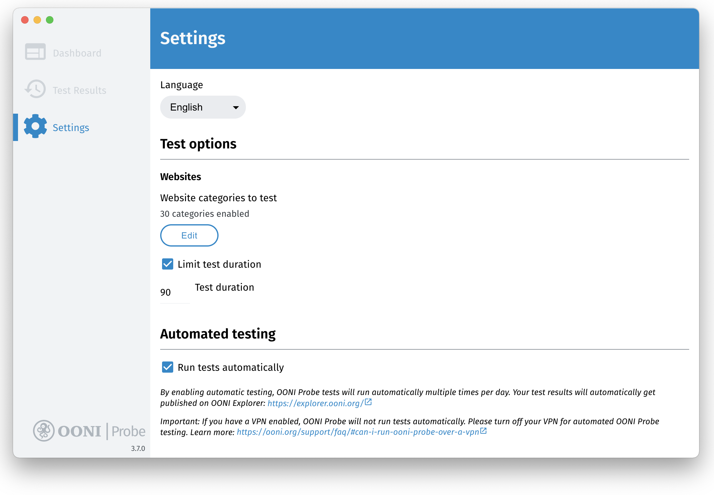
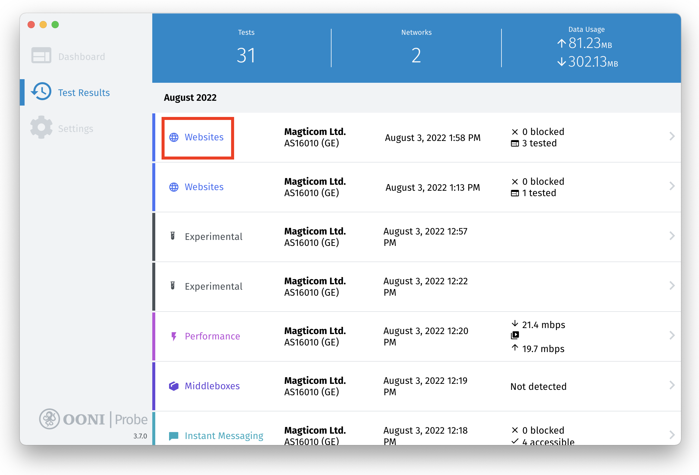
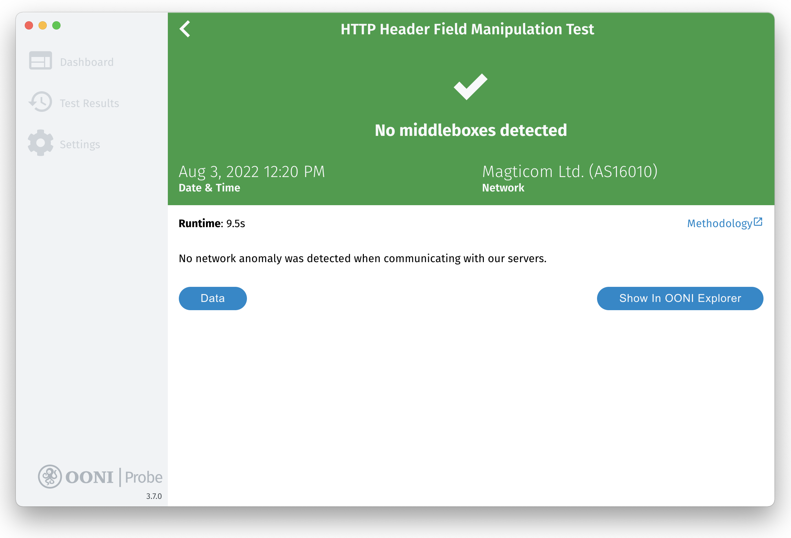
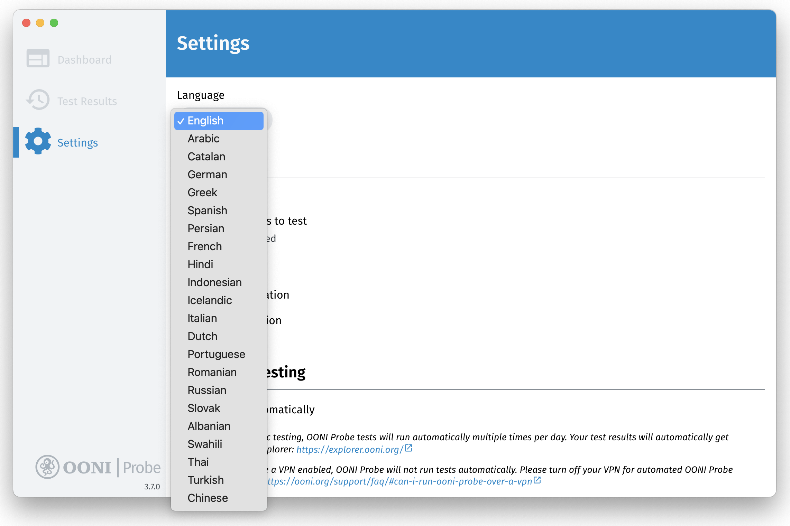
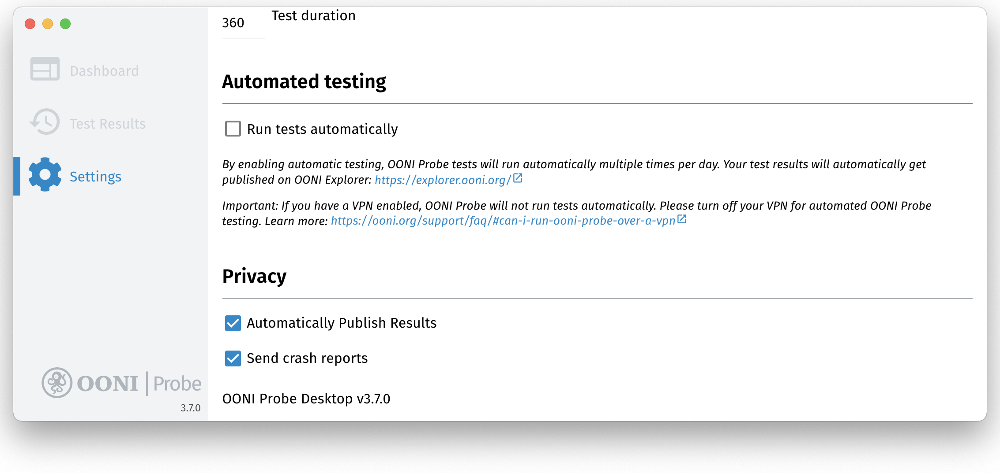

**Cập nhật lần chót:** 6 tháng Chín 2022

Tài liệu này được dịch sang tiếng Việt bởi Nathan Tran.

**OONI Probe Desktop phiên bản:** 3.7.0

{{}}

OONI Probe là một ứng dụng [nguồn mở và miễn phí](https://github.com/ooni/probe) bạn dùng để đo lường kiểm duyệt internet và những hình thái can thiệp mạng khác. Cẩm nang sử dụng này cung cấp **hướng dẫn từng bước một** cách cài đặt, chạy, và tùy chỉnh việc dùng [ứng dụng OONI Probe Desktop](https://ooni.org/install/desktop). 

**Bạn được biết gì qua cẩm nang này:**

* Biết cách chạy OONI Probe Desktop để:
  * Kiểm tra việc chặn các trang web
  * Kiểm tra việc chặn các ứng dụng tin nhắn nhanh
  * Kiểm tra việc chặn các công cụ vượt thoát
  * Đo tốc độ và hiệu suất của mạng bạn
* Tùy chọn các trang web bạn muốn kiểm tra với OONI Probe
* Biết cách xem và chia sẻ kết quả kiểm tra của OONI Probe
* Cấu hình thiết đặt của ứng dụng OONI Probe

Sau khi xem cẩm nang này, chúng tôi mong bạn cảm thấy thêm năng lực để chia sẻ kiến thức và kỹ năng dùng OONI Probe với người khác!

Mục lục sau đây giúp bạn dùng cẩm nang này.



## Giới thiệu OONI Probe

OONI Probe là một [phần mềm nguồn mở và miễn phí](https://github.com/ooni/probe) thiết kế để đo lường kiểm duyệt internet và các hình thái can thiệp mạng khác. Từ năm 2012, phần mềm này được phát triển bởi [Đài Quan Sát Mở về Can Thiệp Mạng (OONI)](https://ooni.org/), một đề án phi lợi nhuận thoát thai từ [Đề án Tor](https://www.torproject.org/).

Vơi ứng dụng OONI Probe (có trên nền [đi động](https://ooni.org/install/mobile) và [máy tính](https://ooni.org/install/desktop)), bạn có thể chạy [kiểm tra đo lường mạng](https://ooni.org/nettest/) để kiểm tra những việc sau đây:

* Chặn [trang web](https://ooni.org/nettest/web-connectivity/);
* Chặn các ứng dụng tin nhắn nhanh ([WhatsApp](https://ooni.org/nettest/whatsapp/), [Facebook Messenger](https://ooni.org/nettest/facebook-messenger/), [Telegram](https://ooni.org/nettest/telegram/), [Signal](https://ooni.org/nettest/signal));
* Chặn các công cụ vượt thoát ([Tor](https://ooni.org/nettest/tor/), [Tor Snowflake](https://ooni.org/nettest/tor-snowflake/), [Psiphon](https://ooni.org/nettest/psiphon/));
* Các hệ thống ([middleboxes](https://ooni.org/nettest/http-header-field-manipulation/)) có mặt trong mạng của bạn nhằm để kiểm duyệt và/hoặc theo dõi;
* [Tốc độ và hiệu suất](https://ooni.org/nettest/ndt/) của mạng bạn và [hiệu suất của video streaming](https://ooni.org/nettest/dash/).

Khi vừa chạy OONI Probe xong, kết quả kiểm tra được tự động gửi đến máy chủ OONI, [xử lý](https://github.com/ooni/pipeline), và [công bố công khai](https://ooni.org/data/) theo gần thời gian thực (trừ phi bạn chọn không công bố kết quả).

OONI [công bố công khai kết quả kiểm tra của OONI Probe](https://ooni.org/data/) thâu thập trên thế giới để:

* Gia tăng **minh bạch về kiểm duyệt internet** trên thế giới;
* Chia sẻ **bằng chứng kiểm duyệt internet** và các hình thái can thiệp mạng khác;
* Tạo điều kiện **phối kiểm độc lập** đối với các phát hiện kiểm duyệt của OONI;
* Hỗ trợ **nghiên cứu lặp lại được**;
* Hỗ trợ **các nỗ lực nghiên cứu, chính sách, pháp lý, và vận động** trên thế giới;
* Hỗ trợ **tranh luận công cộng** về kiểm soát thông tin.

Để giúp công chúng truy cập được kết quả kiểm tra của OONI Probe (thường được gọi là “đo lường”), đội ngũ OONI giữ kết quả trên [OONI Explorer](https://explorer.ooni.org/vi): một trang web với các biểu đồ dựa trên tầm mức đo lường và công cụ tìm kiếm để xem xét các dữ liệu đo lường.

[OONI Explorer](https://explorer.ooni.org/vi) lưu trữ hơn 850 triệu dữ liệu đo lường mạng thâu thập từ 24,500 mạng trên 241 quốc gia và lãnh thổ từ năm 2012. Đây có lẻ là **nguồn dữ liệu mở lớn nhất toàn cầu về kiểm duyệt internet** từ trước đến nay.

Khi chạy OONI Probe, bạn sẽ:

* Tìm hiểu xem nhà mạng (ISP) có kiểm duyệt hay không và bằng cách nào để chặn truy cập vào một số trang web và ứng dụng;
* Dữ liệu đo lường bạn đóng góp sẽ được lưu trữ công khai, giúp cho cộng đồng chuộng tự do internet toàn cầu giám sát, phát hiện và chống lại kiểm duyệt internet.

Cẩm nang này giúp bạn biết cách dùng [ứng dụng OONI Probe Desktop](https://ooni.org/install/desktop) để bạn gia nhập vào cộng đồng toàn cầu đo lường kiểm duyệt internet.

### Tuyên bố giới hạn trách nhiệm

Vì OONI Probe dùng để đo lường kiểm duyệt internet, sử dụng nó có thể gây [rủi ro](https://ooni.org/about/risks/) cho một số người ở một số quốc gia.

Một số điều cần lưu ý:

* **OONI Probe không phải là một công cụ bảo vệ riêng tư.** Bất cứ ai giám sát hoạt động internet của bạn (như chính quyền, nhà mạng ISP, chủ công ty) có thể thấy là bạn đang dùng OONI Probe (cũng như họ có thể thấy tất cả những phần mềm khác bạn dùng).
* **OONI Probe là một công cụ điều tra.** Một số kiểm tra của OONI Probe được thiết kế với chủ đích khám phá kiểm duyệt internet.
* **[Mô thức đe dọa của bạn](https://www.eff.org/keeping-your-site-alive/evaluating-your-threat-model)**. Thí dụ như một nhà hoạt động nổi tiếng đang bị theo dõi gắt gao mà cho chạy OONI Probe thì lại càng bị chú ý hơn nữa.
* **Luật lệ và quy định của quốc gia bạn cho chạy OONI Probe ở đó.** Tốt nhất là xin tư vấn từ luật sư bản xứ.
* **Loại trang web gì được kiểm tra.** Bạn có thể kiểm tra các [trang web](https://ooni.org/vi/support/faq/#các-trang-web-nào-sẽ-được-kiểm-tra-xem-có-bị-kiểm-duyệt) bị chính thức cấm đoán (tại một số quốc gia), hoặc mang tính khiêu khích hay bị chống đối.
* **Loại kiểm tra của OONI Probe.** Không phải [kiểm tra nào của OONI Probe](https://ooni.org/nettest/) cũng có cùng trọng lượng rủi ro. Thí dụ như OONI Probe có loại [kiểm tra NDT](https://ooni.org/nettest/ndt/) (thiết kế để đo tốc độ và hiệu suất mạng) có thể được xem là không mang tính chính trị hay gây tranh cãi so với các kiểm tra khác nhằm đo lường việc ngăn chận trang web hoặc ứng dụng.
* **Dầu bạn có hay không công bố các dữ liệu đo lường đi nữa.** OONI cũng [công bố công khai dữ liệu đo lường](https://ooni.org/data/) thâu thập được từ người dùng OONI Probe để gia tăng độ minh bạch của kiểm duyệt internet trên thế giới. Chúng tôi cố gắng không công bố địa chỉ IP hay các thông tin có thể nhận dạng cá nhân của bạn. Tìm hiểu thêm về [Chính sách Dữ liệu](https://ooni.org/about/data-policy).

Để tìm hiểu thêm về các rủi ro tiềm tàng khi dùng OONI Probe, xin đọc [tài liệu này](https://ooni.org/about/risks/).

## Cài đặt OONI Probe Desktop

Ứng dụng OONI Probe Desktop có phiên bản cho [Windows và macOS](https://ooni.org/install/desktop). Nếu bạn dùng Linux, xin cài đặt [OONI Probe Giao Diện Dòng Lệnh (CLI)](https://ooni.org/install/cli/ubuntu-debian).

Bạn cài đặt ứng dụng OONI Probe Deskop (cho Windows và MacOS) qua các bước sau đây:

**Bước 1.** Vào trang cài đặt OONI Probe Desktop (trong trang web OONI): <https://ooni.org/install/desktop> 

{{}}

**Bước 2.** Bấm nút **Tải về** để lấy xuống OONI Probe. Trang này sẽ chọn phiên bản OONI Probe phù hợp với hệ điều hành của máy tính bạn đang dùng (Windows hoặc MacOS). Nếu bạn muốn phiên bản cho hệ điều hành khác, bấm vào nút **Nền khác**.

{{}}

{{}}

**Bước 3.** Sau khi tải OONI Probe xuống máy, bấm đúp vào tập tin để **cài đặt** OONI Probe.

Trên hệ **macOS**, nắm kéo biểu tượng của OONI Probe vào ngăn Application

{{}}

Rồi bấm **Open** để cài đặt OONI Probe trên macOS.

{{}}

Trong **Windows** (Windows 10), bấm **More info** trong màn hình sau đây:

{{}}

Rồi bấm **Run anyway** để cài đặt ứng dụng OONI Probe trong Windows.

{{}}

**Bước 4.** Mở ứng dụng OONI Probe Desktop. Trong **macOS**, bạn tìm ứng dụng OONI Probe trong ngăn Application. Trong **Windows**, khởi động OONI Probe từ lối tắt trên mặt bàn.

### Nhập cuộc: Hiểu & Đồng ý

Sau khi cài đặt và cho chạy ứng dụng OONI Probe, bạn sẽ thấy một số thông tin căn bản về OONI Probe thuộc về thủ tục nhập cuộc.

Bạn sẽ tìm hiểu về [các rủi ro tiềm tàng](https://ooni.org/about/risks/) liên quan đến việc chạy OONI Probe. Để bảo đảm bạn nắm vững các rủi ro tiềm tàng này, chúng tôi có một bài đố nhanh để biết là bạn đã hiểu và đồng ý. Trả lời bài đố nhanh cho đúng là điều bắt buộc để sử dụng OONI Probe.

Trong bước chót của thủ tục nhập cuộc, chúng tôi cho biết loại dữ liệu gì được thâu thập mặc định khi chạy OONI Probe (liên kết đến [Chính sách Dữ liệu](https://ooni.org/about/data-policy) để biết thêm chi tiết). Bạn có thể chọn đồng ý chia sẻ báo cáo sự cố hỏng và các thông số sử dụng của ứng dụng để giúp chúng tôi cải thiện OONI Probe.

Chúng tôi sẽ dẫn dắt bạn qua thủ tục nhập cuộc

**Bước 1.** Sau khi bạn đọc xong các thông tin căn bản về OONI Probe, bấm vào **Hiểu rồi**.

{{}}

**Bước 2.** Màn hình kế tiếp tóm tắt những rủi ro tiềm tàng liên quan đến việc sử dụng OONI Probe. Bấm vào **Tìm hiểu thêm** để đọc [tài liệu](https://ooni.org/about/risks/) giải thích các rủi ro tiềm tàng.

{{}}

**Bước 3.** Sau khi bạn tìm hiểu về các rủi ro tiềm tàng liên quan đến việc sử dụng OONI Probe, bấm vào **Tôi hiểu**.

{{}}

**Bước 4.** Đố nhanh sau đây dựa vào thông tin bạn vừa đọc qua. Bấm vào **Đúng** để chứng minh bạn hiểu câu này.

{{}}

Bạn thấy là **Đúng** là câu trả lời đúng. Nếu bạn bấm vào Sai, sẽ có giải thích tại sao sai.

{{}}

**Bước 5.** Bấm vào **Đúng** để chứng minh bạn hiểu câu này (trong phần thứ nhì của đố nhanh).

{{}}

Bạn thấy là **Đúng** là câu trả lời đúng. Nếu bạn bấm vào Sai, sẽ có giải thích tại sao sai.

{{}}

**Bước 6.** Màn hình sau đây hỏi bạn chia sẻ [báo cáo sự cố hỏng](https://ooni.org/about/data-policy#data-we-collect) để có thể giúp chúng tôi tìm ra và sửa chữa lỗi của OONI Probe. Xin bấm **Có** để chia sẻ báo cáo sự cố hỏng và giúp chúng tôi cải thiện OONI Probe.

{{}}

**Bước 7.** Màn hình sau đây cho biết loại dữ liệu gì OONI thâu thập và công bố mặc định (mỗi khi bạn chạy OONI Probe). Bạn tìm hiểu thêm về việc này trong tài liệu **[Chính sách Dữ liệu của OONI](https://ooni.org/about/data-policy)**

{{}}

**Bước 8.** Bấm vào **Bắt Đầu** nếu bạn đã sẵn sàng chia sẻ dữ liệu đo lường với chúng tôi.

Bạn đã hoàn tất thủ tục nhập cuộc và sẵn sàng để sử dụng OONI Probe!

{{}}

**Bước 9 tùy ý.** Nếu bạn muốn thay đổi thiết đặt để **không** chia sẻ báo cáo sự cố hỏng, bấm vào **Thiết đặt**. Thao tác này đưa bạn vào trang Thiết đặt của OONI Probe, nơi bạn có thể thay đổi các thiết đặt tùy ý.  Theo mặc định thì báo cáo sự cố hỏng sẽ không được chia sẻ, và chỉ được chia sẻ nếu bạn bấm vào nút **Bắt Đầu** (trong bước 7 trên), hoặc nếu bạn tự tay bật mở tùy chọn này.

{{}}

Có đầy đủ chi tiết thông tin về thiết đặt của OONI Probe trong phần [Cấu hình thiết đặt của OONI Probe](https://ooni.org/support/ooni-probe-desktop#configuring-your-ooni-probe-settings) của cẩm nang này.

## Chạy OONI Probe Desktop

Bây giờ đã hoàn tất thủ tục nhập cuộc, bạn có thể bắt đầu dùng OONI Probe để đo lường kiểm duyệt internet!

**Bảng tóm tắt** của ứng dụng OONI Probe Desktop có 5 thẻ, mỗi thẻ chạy một số kiểm tra của OONI Probe:

* **Thẻ Trang web** Bao gồm [Kiểm tra Kết Nối Web](https://ooni.org/nettest/web-connectivity/) để đo lường việc [chặn các trang web](https://ooni.org/vi/support/faq/#các-trang-web-nào-sẽ-được-kiểm-tra-xem-có-bị-kiểm-duyệt).
* **Thẻ Tin Nhắn Nhanh** Bao gồm các bài kiểm tra của OONI xem các ứng dụng  [WhatsApp](https://ooni.org/nettest/whatsapp/), [Facebook Messenger](https://ooni.org/nettest/facebook-messenger/), [Telegram](https://ooni.org/nettest/telegram/), và [Signal](https://ooni.org/nettest/signal) có bị chặn không.
* **Thẻ Vượt Thoát.** Bao gồm các kiểm tra của OONI xem công cụ vượt thoát kiểm duyệt  [Tor](https://ooni.org/nettest/tor/) và [Psiphon](https://ooni.org/nettest/psiphon/) có bị chặn không.
* **Thẻ Hiệu suất.** Bao gồm [Kiểm tra tốc độ NDT](https://ooni.org/nettest/ndt/), [kiểm tra hiệu suất DASH video streaming](https://ooni.org/nettest/dash/), và [kiểm tra middlebox](https://ooni.org/support/glossary/#middlebox), ([HTTP Header Field Manipulation](https://ooni.org/nettest/http-header-field-manipulation/) và [HTTP Invalid Request Line](https://ooni.org/nettest/http-invalid-request-line/) ).
* **Thẻ Thử Nghiệm.** Bao gồm một số kiểm tra thử nghiệm mới do đội ngũ OONI soạn thảo. Các kiểm tra này có thể thay đổi theo thời gian. Bạn xem các kiểm tra này [nơi đây](https://github.com/ooni/spec/tree/master/nettests).

**Bước 1.** Bấm nút **Chạy** để chạy kiểm tra đầu tiên của OONI Probe.

{{}}

Thao tác này sẽ cho chạy **tất cả** kiểm tra của OONI Probe (trong tất cả các thẻ) cùng một lúc!

{{}}

{{}}

{{}}

{{}}

{{}}

OOI Probe chạy hết các kiểm tra trong vòng vài phút (cũng tùy vào hiệu suất mạng đang nối kết, và có thể chạy lâu hơn). Nếu hiệu suất mạng không được tốt và kiểm tra kéo dài quá, bạn có thể **ngưng kiểm tra** bằng cách bấm vào nút **X** ở góc phải của màn hình.

{{}}

Bấm nút **OK** để ngưng kiểm tra.

{{}}

Kết quả kiểm tra của OONI Probe sẽ được tự động công bố trên [OONI Explorer](https://explorer.ooni.org/vi) và trên [OONI API](https://api.ooni.io/).

Bạn muốn giới hạn việc kiểm tra vào một số loại kiểm tra (thẻ) đặc trưng? Trong mục kế tiếp đây, chúng tôi sẽ chỉ cách làm.

### Đo lường việc chặn trang web

Nếu bạn chỉ muốn đo lường việc chặn trang web, hãy theo các bước sau đây:

**Bước 1.** Bấm vào thẻ **Trang web** trong Bảng tóm tắt của OONI Probe Desktop.

{{}}

**Bước 2.** Bấm vào **Chạy** trong thẻ Trang Web.

{{}}

Bây giờ bạn đang chạy [Kiểm tra Kết Nối Web](https://ooni.org/nettest/web-connectivity/) của OONI để đo lường việc chặn trang web.

{{}}

Kết quả kiểm tra của OONI Probe sẽ được tự động công bố trên [OONI Explorer](https://explorer.ooni.org/vi) và trên [OONI API](https://api.ooni.io/).

**Trang web nào được kiểm tra?**

Theo mặc định, bạn sẽ kiểm tra các trang web trong 2 danh sách sau đây:

* **[Danh sách kiểm tra toàn cầu](https://github.com/citizenlab/test-lists/blob/master/lists/global.csv)**. Bao gồm các trang web quốc tế quan trọng (như facebook.com).
* **[Danh sách kiểm tra quốc gia riêng biệt](https://github.com/citizenlab/test-lists/tree/master/lists)**. Bao gồm các trang web riêng biệt cho quốc gia mà bạn đang chạy OONI Probe ở nơi đó.

Bất kể bạn đang chạy OONI Probe từ quốc gia nào, bạn sẽ *luôn* kiểm tra các trang trong [danh sách kiểm tra toàn cầu](https://github.com/citizenlab/test-lists/blob/master/lists/global.csv).

OONI Probe sẽ tự động xác định [danh sách quốc gia riêng biệt](https://github.com/citizenlab/test-lists/tree/master/lists) nào sẽ được kiểm tra dựa vào quốc gia bạn đang có mặt và chạy OONI Probe từ nơi đó. Lấy thí dụ, nếu bạn cho chạy OONI Probe ở Brazil, bạn sẽ kiểm tra các trang web từ danh sách toàn cầu và từ danh sách kiểm tra của Brazilian. Nếu bạn du lịch đến Đức và chạy OONI Probe, bạn sẽ kiểm tra các trang web từ danh sách toàn cầu và danh sách của Đức. Nhưng nếu bạn chạy OONI Probe từ một nơi mà chưa có danh sách kiểm tra của nước đó (vì chưa được lập ra), bạn chỉ kiểm tra các trang web từ danh sách toàn cầu.

Nếu bạn muốn đóng góp vào [danh sách kiểm tra của Citizen Lab](https://github.com/citizenlab/test-lists/tree/master/lists) (bao gồm các trang web mặc định được kiểm tra bởi người dùng khắp nơi trên thế giới), xin đọc thêm trong [tài liệu](https://ooni.org/get-involved/contribute-test-lists). 

**Ghi chú:** OONI Probe sẽ **chỉ có thể kiểm tra một số trang web trong vòng 90 giây cho phép** khi bạn bấm nút “Chạy” (từ Bảng tóm tắt hoặc từ thẻ Trang web). Những trang này (được kiểm tra trong vòng 90 giây) được chọn ngẫu nhiên từ danh sách [toàn cầu](https://github.com/citizenlab/test-lists/blob/master/lists/global.csv) và danh sách  [quốc gia riêng biệt](https://github.com/citizenlab/test-lists/tree/master/lists) (liên hệ). Mỗi khi bạn bấm “Chạy”, bạn sẽ kiểm tra một số trang web khác được chọn ngẫu nhiên (từ danh sách toàn cầu và quốc gia riêng biệt) trong vòng 90 giây. Do đó, càng bấm “Chạy” nhiều lần, càng có nhiều trang web được kiểm tra.

Nếu bạn muốn kiểm tra nhiều trang web hơn nữa, hoặc kiểm tra các trang web khác, xin đọc phần [Tùy chỉnh kiểm tra trang web](https://ooni.org/support/ooni-probe-desktop#customizing-your-website-testing) trong cẩm nang này.

### Đo lường việc chặn các ứng dụng tin nhắn nhanh

Nếu chỉ muốn đo lường việc chặn các ứng dụng tin nhắn nhanh, bạn theo các bước sau đây:

**Bước 1.** Bấm vào thẻ **Tin Nhắn Nhanh** trong Bảng tóm tắt của OONI Probe Desktop.

{{}}

**Bước 2.** Bấm **Chạy** trong thẻ Tin Nhắn Nhanh.

{{}}

Bây giờ bạn đang chạy kiểm tra của OONI để xem các ứng dụng tin nhắn nhanh [WhatsApp](https://ooni.org/nettest/whatsapp/), [Facebook Messenger](https://ooni.org/nettest/facebook-messenger/), [Telegram](https://ooni.org/nettest/telegram/), và [Signal](https://ooni.org/nettest/signal) có bị chặn không.

{{}}

Kết quả kiểm tra của OONI Probe sẽ được tự động công bố trên [OONI Explorer](https://explorer.ooni.org/vi) và trên [OONI API](https://api.ooni.io/).

### Đo lường việc chặn các công cụ vượt thoát kiểm duyệt

Nếu chỉ muốn đo lường việc chặn các công cụ vượt thoát kiểm duyệt, bạn theo các bước sau đây:

**Bước 1.** Bấm vào thẻ **Vượt thoát kiểm duyệt** trong Bảng tóm tắt của OONI Probe Desktop.

{{}}

**Bước 2.** Bấm vào **Chạy** trong thẻ Vượt thoát kiểm duyệt.

{{}}

Bây giờ bạn đang chạy kiểm tra của OONI để xem các công cụ vượt thoát kiểm duyệt [Tor](https://ooni.org/nettest/tor/) và [Psiphon](https://ooni.org/nettest/psiphon/) có bị chặn không.

{{}}

Kết quả kiểm tra của OONI Probe sẽ được tự động công bố trên [OONI Explorer](https://explorer.ooni.org/vi) và trên [OONI API](https://api.ooni.io/).

### Đo lường hiệu suất mạng

Nếu chỉ muốn đo lường hiệu suất mạng, bạn theo các bước sau đây:

**Bước 1.** Bấm vào thẻ **Hiệu suất** trong Bảng tóm tắt của OONI Probe Desktop

{{}}

**Bước 2.** Bấm vào **Chạy** trong thẻ Hiệu suất.

{{}}

Bây giờ bạn đang chạy [kiểm tra tốc độ NDT](https://ooni.org/nettest/ndt/) và [kiểm tra hiệu suất của DASH video streaming](https://ooni.org/nettest/dash/).

{{}}

Kết quả kiểm tra sẽ được tự động công bố trên [OONI Explorer](https://explorer.ooni.org/vi) và trên [OONI API](https://api.ooni.io/).

**Tuyên bố giới hạn trách nhiệm:** Kiểm tra [NDT](https://ooni.org/nettest/ndt/) và [DASH](https://ooni.org/nettest/dash/) được tiến hành trên máy chủ bên thứ ba do [Measurement Lab (M-Lab)](https://www.measurementlab.net/) cung cấp. Nếu chạy các kiểm tra này, M-Lab sẽ thâu thập và công bố địa chỉ IP của bạn cho mục đích nghiên cứu, bất kể thiết đặt OONI Probe ra sao. Tìm hiểu thêm về cách quản lý dữ liệu của M-Lab nơi đây [tuyên bố về quyền riêng tư](https://www.measurementlab.net/privacy/).  

### Đo lường sự có mặt của middleboxes

Nếu chỉ muốn đo lường mạng để phát hiện sự có mặt của [middleboxes](https://ooni.org/support/glossary/#middlebox) (và có thể có chỉ dấu mạng bị sửa trái phép), bạn theo các bước sau đây:

**Bước 1.** Bấm vào thẻ **Middleboxes** trong Bảng tóm tắt của OONI Probe Desktop.

{{}}

**Bước 2.** Bấm vào **Chạy** trong thẻ Middleboxes.

{{}}

Bây giờ bạn đang chạy các kiểm tra của OONI’s về [middlebox](https://ooni.org/support/glossary/#middlebox) ([HTTP Header Field Manipulation](https://ooni.org/nettest/http-header-field-manipulation/) và [HTTP Invalid Request Line](https://ooni.org/nettest/http-invalid-request-line/)).

{{}}

Kết quả kiểm tra của OONI Probe sẽ được tự động công bố trên [OONI Explorer](https://explorer.ooni.org/vi) và trên [OONI API](https://api.ooni.io/).

### Chạy các kiểm tra thử nghiệm

Nếu chỉ muốn chạy các kiểm tra thử nghiệm mới của đội ngũ OONI soạn thảo, bạn theo các bước sau đây:

**Bước 1.** Bấm vào thẻ **Thử nghiệm** trong Bảng tóm tắt của OONI Probe Desktop.

{{}}

**Bước 2.** Bấm vào **Chạy** trong thẻ Thử nghiệm.

{{}}

Bây giờ bạn đang chạy [kiểm tra thử nghiệm](https://github.com/ooni/spec/tree/master/nettests) do đội ngũ OONI soạn thảo.

{{}}

## OONI Probe kiểm tra tự động

Thay vì phải nhớ bấm chạy từng kiểm tra một, bạn có thể **bật mở kiểm tra tự động** trong phần thiết đặt của OONI Probe Desktop và OONI Probe sẽ tự động chạy kiểm tra cho bạn!

Khi bật mở kiểm tra tự động, OONI Probe sẽ **chạy tất cả kiểm tra trong nền sau nhiều lần trong ngày** (không tính kiểm tra hiệu suất choán nhiều băng thông), kiểm tra mỗi lần một nhóm trang web khác nhau (từ [danh sách kiểm tra của Citizen Lab](https://github.com/citizenlab/test-lists/tree/master/lists)). Để tránh bừa bộn phần Kết quả Kiểm Tra trong ứng dụng, các kết quả này được tự động công bố trên [OONI Explorer](https://explorer.ooni.org/vi) theo gần thời gian thực (nhưng sẽ không thấy được trong phần Kết quả Kiểm tra).

Với OONI Probe kiểm tra tự động , bạn giúp **đóng góp đo lường kiểm duyệt thường xuyên** (mà không phải làm gì cả), giúp cho cộng đồng chuộng tự do internet giám sát và phát hiện các sự kiện kiểm duyệt tại quốc gia bạn theo thời gian.

Bạn có thể bật mở OONI Probe kiểm tra tự động  qua các bước sau đây:

**Bước 1.** Bấm vào **Thiết đặt** trong thanh bên của OONI Probe Desktop

{{}}

Trong phần **Kiểm tra tự động** của Thiết đặt, bạn thấy là chức năng này mặc định bị tắt đi.

**Bước 2.** Bật mở tùy chọn **Chạy kiểm tra tự động** trong phần thiết đặt.

{{}}

Bây giờ bạn đã bật mở kiểm tra OONI Probe tự động! OONI Probe sẽ chạy kiểm tra tự động nhiều lần trong ngày (người dùng không cần làm gì cả), và kết quả kiểm tra sẽ được tự động công bố trên [OONI Explorer](https://explorer.ooni.org/vi).

Nói chung, nếu bạn chưa bật mở kiểm tra tự động, thỉnh thoảng bạn sẽ thấy khung sau đây hiện ra để hỏi bạn có muốn bật mở kiểm tra tự động không.

{{}}

Để bật mở kiểm tra tự động, bạn bấm vào **Rất Tốt**. Nếu chưa muốn nhưng bạn muốn được nhắc lại sau này thì bấm vào **Nhắc lại tôi sau**.

## Tùy chỉnh kiểm tra trang web

Theo mặc định, khi kiểm tra trang web với OONI Probe, bạn đo lường các URL có trong [danh sách kiểm tra của Citizen Lab](https://github.com/citizenlab/test-lists/tree/master/lists). Nói cách khác, khi bạn bấm “Chạy” (trong Bảng tóm tắt hoặc thẻ Trang web của ứng dụng OONI Probe), bạn sẽ kiểm tra một số trang web ngẫu nhiên từ [danh sách kiểm tra của Citizen Lab](https://github.com/citizenlab/test-lists/tree/master/lists). Danh sách này được soạn thảo qua sự hợp tác của các chuyên gia và nghiên cứu gia tại mỗi quốc gia. Vì danh sách này [có công khai trên GitHub](https://github.com/citizenlab/test-lists/tree/master/lists), bất cứ ai cũng có thể duyệt xét, [đóng góp](https://ooni.org/get-involved/contribute-test-lists) URLs, và đề nghị xóa URL nào đó. Điều quan trọng là chúng tôi thường xuyên [duyệt xét và cập nhật](https://ooni.org/get-involved/contribute-test-lists) các danh sách này, vì chúng gồm có các trang web được người dùng OONI Pobe trên thế giới thường xuyên kiểm tra.

Nhưng nếu bạn muốn giới hạn việc kiểm tra vào một số trang web bạn chọn, OONI Probe Desktop cho phép làm việc đó.

Bạn có thể tùy chỉnh kiểm tra trang web bằng cách sau đây:

* Giới hạn kiểm tra vào [một số trang web riêng biệt](https://ooni.org/support/ooni-probe-desktop#testing-specific-website-categories) (chẳng hạn như truyền thông tin tức và nội dung nhân quyền);
* Chỉ kiểm tra [trang web bạn quan tâm](https://ooni.org/support/ooni-probe-desktop#testing-websites-of-your-choice);
* Kiểm tra [*tất cả* URLs](https://ooni.org/support/ooni-probe-desktop#testing-all-websites-from-the-citizen-lab-test-lists) trong [danh sách kiểm tra của Citizen Lab](https://github.com/citizenlab/test-lists/tree/master/lists) ([xác đáng](https://ooni.org/vi/support/faq/#các-trang-web-nào-sẽ-được-kiểm-tra-xem-có-bị-kiểm-duyệt)) (hơn là kiểm tra một số trang ngẫu nhiên trong vòng 90 giây).

Mục sau đây sẽ giải thích cách làm cho từng điều trên.

### Kiểm tra các thể loại trang web riêng biệt

Khi bạn bấm “Chạy” trong OONI Probe, bạn kiểm tra các trang web từ danh sách [toàn cầu](https://github.com/citizenlab/test-lists/blob/master/lists/global.csv) và [danh sách quốc gia riêng biệt của Citizen Lab](https://github.com/citizenlab/test-lists/tree/master/lists) (xác đáng).

Các trang web này đã được phân loại dựa vào  [30 thể loại chuẩn](https://github.com/citizenlab/test-lists/blob/master/lists/00-LEGEND-new_category_codes.csv). Các thể loại này bao gồm từ truyền thông tin tức, văn hóa, nhân quyền cho đến các thể loại khiêu khích hoặc bị chống đối, như nội dung khiêu dâm (những loại này được đưa vào vì chúng nhiều xác suất bị chặn, do đó giúp phát hiện được kỹ thuật kiểm duyệt của nhà mạng).

Theo mặc định, tất cả 30 thể loại được chọn trong OONI Probe Desktop nhằm khuyến khích việc kiểm tra đa dạng, làm tăng xác suất khám phá ra các hình thức kiểm duyệt khác.

Nếu bạn không thấy yên tâm để kiểm tra tất cả 30 thể loại trang web (nhất là khi chúng bao gồm nội dung phi pháp, khiêu khích, hoặc bị chống đối tại quốc gia bạn), hoặc bạn chỉ quan tâm đến việc kiểm tra một loại nội dung nào đó (như truyền thông tin tức), bạn có thể giới hạn việc kiểm tra vào các thể loại trang web bạn chọn. 

**Bước 1.** Bấm vào **Thiết đặt** trong OONI Probe Desktop. 

{{}}

Dưới **Tùy chọn kiểm tra** trong thiết đặt, bạn thấy [30 thể loại trang web](https://github.com/citizenlab/test-lists/blob/master/lists/00-LEGEND-new_category_codes.csv) được chọn mặc định.

**Bước 2.** Bấm nút **Chỉnh sửa**  (dưới “Thể loại web để kiểm tra”).

{{}}

Bạn sẽ thấy [30 thể loại](https://github.com/citizenlab/test-lists/blob/master/lists/00-LEGEND-new_category_codes.csv) trang web mà OONI Probe sẽ kiểm tra mặc định. Tất cả thể loại này được chọn.

{{}}

**Bước 3.** **Tắt** thể loại trang web mà bạn **không** muốn kiểm tra.

{{}}

Trong thí dụ trên, chúng tôi tắt 2 thể loại (“Nội dung khiêu dâm” và “Trang phục khêu gợi”).

**Bước 4.** Bấm vào **Lưu**.

Khi bạn quay lại, sẽ thấy chỉ còn có 28 thể loại được chọn (vì 2 cái bị tắt).

{{}}

Bạn vào phần thiết đặt này bất cứ lúc nào để tắt hay mở lên thể loại trang web bạn muốn kiểm tra.

### Kiểm tra trang web bạn muốn

Bạn có thể kiểm tra trực tiếp trang web bạn quan tâm bằng cách sau đây:

**Bước 1.** Bấm vào thẻ **Trang web** trong OONI Probe Desktop.

{{}}

**Bước 2.** Bấm vào nút **Chọn trang web** bên trong thẻ Trang web

{{}}

Bạn sẽ thấy màn hình nơi bạn có thể thêm trang web nào muốn kiểm tra.

{{}}

**Bước 3.** **Điền vào đường dẫn URL** của trang web bạn muốn kiểm tra. Trong thí dụ sau đây, chúng tôi gõ vào `https://www.facebook.com/`. 

{{}}

**Quan trọng:** Bạn cố gắng điền vào [URL](https://ooni.org/support/glossary/#url) cho đúng. Nếu đánh sai, OONI Probe sẽ *không* kiểm tra trang đó được và dẫn đến kết quả kiểm tra không chính xác.

Một vài điều cần lưu ý:

* Trang web dùng giao thức **HTTP** or **HTTPS**? Nếu là loại thứ nhì, nhớ thêm `s` vào phía sau `http`.
* [Tên miền](https://ooni.org/support/glossary/#domain-name) có `www` hay không? Nếu có, nhớ ghi vào.

Để bảo đảm đường dẫn [URL](https://ooni.org/support/glossary/#url) điền vào đúng, **xin xem đường dẫn đó trông như thế nào khi truy cập dùng trình duyệt bình thường**.

**Bước 4.** Bấm vào **Thêm trang web** để tạo ra một hàng mới để thêm địa chỉ trang web vào.

**Bước 5.** **Điền vào đường dẫn URL** bạn muốn kiểm tra. Trong thí dụ sau đây, chúng tôi thêm `https://twitter.com/`. 

{{}}

Nếu bạn đổi ý và muốn lấy ra đường dẫn URL nào đã thêm vào, chỉ cần bấm vào biểu tượng màu đỏ bên cạnh mỗi URL.

Bạn có thể thêm bao nhiêu đường dẫn URL cũng được. Trong thí dụ sau đây, chúng tôi thêm `https://www.gutenberg.org/`. 

{{}}

**Bước 6.** Bấm vào **Chạy** để kiểm tra tất cả các trang web bạn vừa thêm vào.

Bạn sẽ thấy OONI Probe kiểm tra các trang web bạn muốn!

{{}}

Kết quả kiểm tra của OONI Probe sẽ được tự động công bố trên [OONI Explorer](https://explorer.ooni.org/vi) và trên [OONI API](https://api.ooni.io/).

### Kiểm tất cả trang web từ danh sách kiểm tra của Citizen Lab

OONI Probe Desktop chỉ có thể kiểm tra một số trang web nội trong vòng 90 giây (theo thiết đặt mặc định).

Nếu bạn kết nối vào WiFi và muốn kiểm tra **toàn bộ trang web** từ [danh sách kiểm tra của Citizen Lab](https://github.com/citizenlab/test-lists/tree/master/lists) ([xác đáng](https://ooni.org/vi/support/faq/#các-trang-web-nào-sẽ-được-kiểm-tra-xem-có-bị-kiểm-duyệt)) trong cùng một lúc, xin theo các bước sau:

**Bước 1.** Bấm vào **Thiết đặt** trong thanh bên của OONI Probe Desktop.

{{}}

Dưới **Tùy chọn kiểm tra** trong thiết đặt, bạn sẽ thấy tùy chọn **Giới hạn thời lượng kiểm tra** (để giới hạn việc kiểm tra trong vòng một thời hạn nhất định) được bật mở mặc định. 

**Bước 2.** Tắt **Giới hạn thời lượng kiểm tra**.

{{}}

Bây giờ không còn bị giới hạn thời lượng kiểm tra nữa. Điều này có nghĩa là OONI Probe có thể kiểm tra hết tất cả các trang web trong [danh sách kiểm tra xác đáng của Citizen Lab](https://ooni.org/vi/support/faq/#các-trang-web-nào-sẽ-được-kiểm-tra-xem-có-bị-kiểm-duyệt) mỗi khi bạn bấm nút “Chạy”. 

{{}}

**Chọn lựa khác**: Nếu bạn muốn kiểm tra thêm các trang web trong thời lượng dài hơn (nhưng không nhất thiết phải tắt tùy chọn giới hạn thời lượng và kiểm tra toàn bộ trang web), bạn theo các bước sau:

**Bước 1.** Vào phần **Thời lượng kiểm tra** dưới phần tùy chọn kiểm tra trong thiết đặt.

{{}}

Theo mặc định, thời lượng kiểm tra là **90 giây**. Có nghĩa là OONI Probe chỉ kiểm tra được một số trang web (từ [danh sách kiểm tra xác đáng của Citizen Lab](https://ooni.org/vi/support/faq/#các-trang-web-nào-sẽ-được-kiểm-tra-xem-có-bị-kiểm-duyệt)) nội trong vòng 90 giây.

**Bước 2.** Để đổi thời lượng kiểm tra, **điền vào số giây** bạn muốn OONI Probe chạy. Trong thí dụ sau đây, chúng tôi điền vào `360` có nghĩa là OONI Probe sẽ chạy kiểm tra trong vòng 6 phút.

{{}}

Bạn đã thay đổi thời lượng kiểm tra trang web của OONI Probe Desktop.

## Xem kết quả kiểm tra của OONI Probe

Vừa chạy xong kiểm tra của OONI Probe, bạn có thể xem liền kết quả trực tiếp trong ứng dụng OONI Probe Desktop.

**Bước 1.** Bấm vào **Kết quả kiểm tra** trong thanh bên của OONI Probe Desktop.

{{}}

Bạn sẽ thấy tổng quan tất cả kết quả kiểm tra của OONI Probe, được xếp theo thứ tự thời gian, với kiểm tra mới nhất được liệt kê trước. Trong tổng quan này, kết quả kiểm tra được xếp loại dựa vào 5 thẻ chủ đề của ứng dụng (“Trang web”, “Tin Nhắn Nhanh”, “Vượt thoát kiểm duyệt”, “Hiệu suất”, “Middleboxes”). 

Trong mỗi thẻ kết quả kiểm tra theo chủ đề, bạn có một tổng quan của:

* **Mạng** (ví dụ `AS16010` - Magticom Ltd.) mà mỗi kiểm tra chạy trong đó;
* **Ngày giờ** kiểm tra (ví dụ như 3 tháng Tám, 2022 lúc 13:58 giờ địa phương);
* **Tóm tắt những điều tìm thấy** (ví dụ như 3 trang web truy cập được, không có trang nào bị chặn).

Tổng quan này có thể hữu ích để so sánh với kết quả xuyên mạng (nếu bạn kiểm tra trên nhiều mạng khác nhau), và cho một cái nhìn tổng quát của những điều tìm thấy.

Trong tiêu đề phía trên của trang Kết quả Kiểm tra, có tổng quan của:

* **Số lượng kiểm tra của OONI Probe** bạn đã chạy cho đến nay;
* **Số lượng mạng** bạn đã cho OONI Probe chạy trên đó cho đến nay;
* **Lượng dữ liệu dùng** của OONI Probe.

{{}}

Trong khi trang Kết quả Kiểm tra cho thấy kết quả sơ khởi, bạn có thể đào sâu hơn và xem các dữ liệu của từng kiểm tra một, được giải thích trong các mục sau đây.

### Trang web

Bạn có thể xem kết quả kiểm tra các trang web của OONI Probe qua các bước sau:

**Bước 1.** Bấm vào **Trang web** trong trang Kết quả Kiểm tra của OONI Probe Desktop.

{{}}

Bạn sẽ thấy danh sách tất cả trang web được kiểm tra trong một phiên kiểm tra đặc trưng.

{{}}

Trong tiêu đề phía trên, cho thấy tổng quan của kết quả kiểm tra. Cạnh bên mỗi một URL được kiểm tra, sẽ có vạch xanh (truy cập được), hoặc một vạch chéo đỏ (có thể bị chặn).

**Bước 2.** Bấm vào **hàng của trang được kiểm tra** (để xem dữ liệu của kiểm tra trang đó). 

{{}}

Bây giờ bạn xem được dữ liệu thuộc về việc kiểm tra của trang web đó.

Trang đo lường trên liên quan đến việc kiểm tra `https://www.facebook.com/`. Qua trang này, chúng ta thấy là `https://www.facebook.com/` truy cập được khi kiểm tra trong mạng Magticom Ltd. (AS16010) vào ngày 3 tháng Tám 2022 lúc 13:58 giờ địa phương.

Nếu trang web thấy (có thể) bị chặn, trang đo lường sẽ có một tiêu đề màu cam với dấu chấm than, như hình minh họa sau đây.

{{}}

Trong trường hợp này, chúng ta thấy là `https://www.gutenberg.org` có chỉ dấu bị chặn (“[bất thường](https://ooni.org/support/glossary/#network-anomaly)”) khi được kiểm tra trong mạng Vodafone Italia (AS30722) vào ngày 30 tháng Ba 2021 lúc 15:13 giờ địa phương. Nhất là chúng ta có chỉ dấu của [sửa DNS trái phép](https://ooni.org/support/glossary/#dns-tampering) (dựa trên suy nghiệm của [kiểm tra Kết nối Web của OONI](https://ooni.org/nettest/web-connectivity/)). Điều này có nghĩa là  Vodafone Italia có thể chặn không cho truy cập `https://www.gutenberg.org` (vào ngày 30 tháng Ba 2021) bằng phương pháp DNS. 

Vì tình trạng [dương tính giả](https://ooni.org/support/glossary/#false-positive) có thể xảy ra, chúng tôi chú thích những kết quả kiểm tra nào không đáp ứng hết các tiêu chuẩn của [kiểm tra Kết nối Web](https://ooni.org/nettest/web-connectivity/) là “[bất thường](https://ooni.org/vi/support/faq/#làm-sao-để-diễn-giải-dữ-liệu-của-ooni)” (hơn là ghi “xác nhận bị chặn”), cho thấy là trang web được kiểm tra *có thể* bị chặn.

Khi đánh giá việc chặn một trang web, xem xét các đo lường liên hệ (từ việc kiểm tra trang web đó trong cùng mạng suốt một thời gian) một cách **tổng hợp** sẽ ích lợi hơn. Bạn dùng [OONI Explorer](https://explorer.ooni.org/vi) (nơi chúng tôi công bố toàn bộ kết quả kiểm tra). OONI Explorer còn [cho thấy đo lường của tất cả các trường hợp “được xác nhận chặn”](https://explorer.ooni.org/vi/search?since=2021-02-24&only=confirmed), trong đó chúng tôi tự động xác nhận việc chặn trang web dựa vào [trang chặn](https://ooni.org/support/glossary/#block-page).

### Tin Nhắn Nhanh

Bạn có thể xem kết quả của OONI Probe kiểm tra các ứng dụng tin nhắn nhanh bằng các bước sau:

**Bước 1.** Bấm vào **Tin Nhắn Nhanh** trong trang Kết quả Kiểm tra của OONI Probe Desktop. 

{{}}

Ban sẽ thấy danh sách các ứng dụng tin nhắn nhanh (WhatsApp, Facebook Messenger, Telegram, Signal) đã được kiểm tra.

{{}}

Trong tiêu đề phía trên, chúng tôi cho thấy tổng quan của kết quả kiểm tra các ứng dụng tin nhắn nhanh. Cạnh bên mỗi ứng dụng được kiểm tra, sẽ có vạch xanh (truy cập được), hoặc một vạch chéo đỏ (có thể bị chặn).

**Bước 2.** Bấm vào **hàng của một ứng dụng được kiểm tra** (để xem dữ liệu kiểm tra của ứng dụng đó). 

{{}}

Trang đo lường trên liên quan đến việc kiểm tra WhatsApp. Chúng ta thấy là WhatsApp truy cập được khi kiểm tra trong mạng Magticom Ltd. (AS16010) vào ngày 3 tháng Tám 2022 lúc 12:19 giờ địa phương. Có kết luận này là vì [kiểm tra WhatsApp của OONI](https://ooni.org/nettest/whatsapp/) kết nối tốt đẹp với điểm cuối, dịch vụ đăng ký, và trang (`web.whatsapp.com`) của WhatsApp.

Nếu thấy WhatsApp (có thể) bị chặn, trang đo lường này sẽ hiển thị các thông tin liên hệ (dựa trên suy nghiệm của [kiểm tra WhatsApp của OONI](https://ooni.org/nettest/whatsapp/)). 

Tương tự vậy, bạn có thể xem kết quả kiểm tra Telegram trong phần kết quả kiểm tra tin nhắn nhanh của OONI Probe.

{{}}

Trong trường hợp này, chúng ta thấy là Telegram truy cập được khi kiểm tra trong mạng Magticom Ltd. (AS16010) vào ngày 3 tháng Tám 2022 lúc 12:19 giờ địa phương. Có kết luận này là vì [kiểm tra Telegram của OONI](https://ooni.org/nettest/telegram/) kết nối tốt đẹp với điểm cuối, và trang(`web.telegram.org`). 

Nếu thấy Telegram (có thể) bị chặn, trang đo lường này sẽ hiển thị các thông tin liên hệ (dựa trên suy nghiệm của [kiểm tra Telegram của OONI](https://ooni.org/nettest/telegram/)).  

Bạn cũng có thể xem kết quả kiểm tra Facebook Messenger trong phần kết quả kiểm tra tin nhắn nhanh của OONI Probe.

{{}}

Trong trường hợp này, chúng ta thấy là Facebook Messenger truy cập được khi kiểm tra trong mạng Magticom Ltd. (AS16010) vào ngày 3 tháng Tám 2022 lúc 13:58 giờ địa phương. Có kết luận này là vì [kiểm tra Facebook Messenger của OONI](https://ooni.org/nettest/facebook-messenger/) kết nối tốt đẹp với điểm cuối của Facebook, và suy ra đúng địa chỉ IP của Facebook.

Nếu thấy Facebook Messenger (có thể) bị chặn, trang đo lường này sẽ hiển thị các thông tin liên hệ (dựa trên suy nghiệm của [kiểm tra Facebook Messenger của OONI](https://ooni.org/nettest/facebook-messenger/)). 

Bạn cũng có thể xem kết quả kiểm tra Signal trong phần kết quả kiểm tra tin nhắn nhanh của OONI Probe.

{{}}

Trong trường hợp này, chúng ta thấy là Signal truy cập được khi kiểm tra trong mạng Magticom Ltd. (AS16010) vào ngày 3 tháng Tám 2022 lúc 12:19 giờ địa phương. Có kết luận này  là vì [kiểm tra Signal của OONI](https://ooni.org/nettest/signal) kết nối tốt đẹp với điểm cuối của Signal.

Nếu thấy Signal (có thể) bị chặn, trang đo lường này sẽ hiển thị các thông tin liên hệ (dựa trên suy nghiệm của [kiểm tra Signal của OONI](https://ooni.org/nettest/signal)). 

Trong mọi trường hợp, chúng tôi đề nghị tham khảo các dữ liệu đo lường được công bố trongn [OONI Explorer](https://explorer.ooni.org/vi), nơi đây bạn có thể xem xét kết quả một cách tổng hợp (có thể giúp loại trừ [dương tính giả](https://ooni.org/support/glossary/#false-positive) và xác nhận tình trạng chặn). 

### Vượt thoát kiểm duyệt

Bạn có thể xem kết quả kiểm tra các công cụ vượt thoát kiểm duyệt qua các bước sau:

**Bước 1.** Bấm vào **Vượt thoát kiểm duyệt** trong trang Kết quả Kiểm tra của ứng dụng OONI Probe Desktop

{{}}

Bạn sẽ thấy danh sách các công cụ vượt thoát kiểm duyệt (Psiphon, Tor) đã được kiểm trong một phiên kiểm tra đặc trưng.

{{}}

Trong tiêu đề phía trên, cho thấy tổng quan của kết quả kiểm tra của các công cụ vượt thoát. Cạnh bên mỗi một công cụ được kiểm tra, sẽ có vạch xanh (truy cập được), hoặc một vạch chéo đỏ (có thể bị chặn).

**Bước 2.** Bấm vào **hàng của một công cụ được kiểm tra** (để xem dữ liệu kiểm tra). 

{{}}

Trang đo lường trên liên quan đến việc kiểm tra [Psiphon](https://psiphon.ca/). Chúng ta thấy là Psiphon truy cập được khi kiểm tra trong mạng Magticom Ltd. (AS16010) vào ngày 3 tháng Tám 2022 lúc 12:17 giờ địa phương. Có kết luận này là vì [kiểm tra Psiphon của OONI](https://ooni.org/nettest/psiphon/) khởi động kết nối với Psiphon tốt đẹp.

Nếu thấy Psiphon (có thể) bị chặn, trang đo lường này sẽ hiển thị các thông tin liên hệ (dựa trên suy nghiệm của [kiểm tra Psiphon của OONI](https://ooni.org/nettest/psiphon/)).  

Tương tự vậy, bạn có thể xem kết quả kiểm tra [Tor](https://www.torproject.org/) trong phần kết quả vượt thoát kiểm duyệt của OONI Probe.

{{}}

Trong trường hợp này, chúng ta thấy là Tor truy cập được khi kiểm tra trong mạng Magticom Ltd. (AS16010) vào ngày 3 tháng Tám 2022 lúc 12:17 giờ địa phương. Có kết luận này là vì [kiểm tra Tor của OONI](https://ooni.org/nettest/tor/) kết nối tốt đẹp với hầu hết các cầu nối Tor và tất cả danh bạ chính thức của Tor.

Nếu thấy Tor (có thể) bị chặn, trang đo lường này sẽ hiển thị các thông tin liên hệ (dựa trên suy nghiệm của [kiểm tra Tor của OONI](https://ooni.org/nettest/tor/)).  

Trong mọi trường hợp, chúng tôi đề nghị tham khảo các dữ liệu đo lường được công bố trongn [OONI Explorer](https://explorer.ooni.org/vi), nơi đây bạn có thể xem xét kết quả một cách tổng hợp (có thể giúp loại trừ [dương tính giả](https://ooni.org/support/glossary/#false-positive) và xác nhận tình trạng chặn). 

### Hiệu suất

Bạn có thể xem kết quả kiểm tra hiệu suất mạng của bạn qua các bước sau:

**Bước 1.** Bấm vào **Hiệu suất** trong trang Kết quả Kiểm tra của OONI Probe.

{{}}

Bạn sẽ thấy danh sách các kiểm tra hiệu suất đã chạy trong một phiên kiểm tra đặc trưng.

{{}}

Trong tiêu đề phía trên, chúng tôi cho thấy tổng quan của kết quả, cùng với ngày giờ kiểm tra, và quốc gia và mạng mà kiểm tra được chạy trong đó. Kết quả hiệu suất cũng được liệt kê cạnh bên.

**Bước 2.** Bấm vào **hàng của một kết quả kiểm tra** (để xem dữ liệu liên hệ). 

{{}}

Trang đo lường trên thuộc về một [kiểm tra tốc độ NDT](https://ooni.org/nettest/ndt/). Chúng ta thấy khi [kiểm tra tốc độ NDT](https://ooni.org/nettest/ndt/) chạy, tốc độ tải xuống là 21.4 megabits mỗi giây, tốc độ tải lên là 19.7 megabits mỗi giây, và mất 147.481 phần ngàn giây để kết nối với một máy chủ [M-Lab](https://www.measurementlab.net/). Đây là một tốc độ internet tốt, vì ping trung bình đến (máy chủ M-Lab này) chỉ mất 953.267 phần ngàn giây. 

Bạn có thể so sánh kết quả kiểm tra NDT với các con số trong gói internet của nhà mạng (ISP) cung cấp.

Bạn có thể xem kết quả của [DASH](https://ooni.org/nettest/dash/) trong trang kết quả hiệu suất của OONI Probe.

{{}}

Trong trường hợp này, chúng ta thấy một [kiểm tra DASH video streaming](https://ooni.org/nettest/dash/) chạy trong mạng Magticom Ltd. (AS16010) vào ngày 3 tháng Tám 2022 lúc 12:21 giờ địa phương. Khi thực hiện kiểm tra, có thể phát trực tiếp video dạng 480p không cần đệm, với bitrate trung bình là 3.6 megabits mỗi giây. Điều này cho thấy người dùng chỉ có thể phát trực tiếp video với độ phân giải thấp trong mạng đó nếu máy chủ phát hình nằm cùng chỗ với máy chủ đo lường.

Bạn có thể so sánh kết quả kiểm tra DASH với các con số của gói internet do nhà mạng (ISP) cung cấp.

### Middleboxes

A middlebox là một thiết bị mạng để biến đổi, kiểm tra, sàng lọc, hoặc thao túng lưu lượng giao thông bên cạnh chức năng thường lệ là chuyển tiếp các gói dữ liệu. Nhiều nhà mạng (ISP) trên thế giới dùng middleboxes để cải thiện hiệu suất mạng, giúp truy cập vào trang web lẹ hơn, và cho một số mục tiêu khác của mạng lưới. Đôi lúc, middleboxes còn được dùng cho mục tiêu kiểm duyệt internet và/hoặc theo dõi.

Bạn có thể xem kết quả kiểm tra việc sửa mạng trái phép (với mục tiêu phát hiện sự có mặt của các [middleboxes](https://ooni.org/support/glossary/#middlebox)) qua các bước sau đây:

**Bước 1.** Bấm vào **Middleboxes** trong trang Kết quả Kiểm tra của OONI Probe Desktop.

{{}}

Bạn sẽ thấy một danh sách các kiểm tra middlebox  ([kiểm tra HTTP Invalid Request Line](https://ooni.org/nettest/http-invalid-request-line/) và [kiểm tra HTTP Header Field Manipulation](https://ooni.org/nettest/http-header-field-manipulation/)) đã chạy trong một phiên kiểm tra đặc trưng.

{{}}

Trong tiêu đề phía trên, chúng tôi cho thấy tổng quan của kết quả (trong trường hợp này, không thấy middleboxes), cùng với ngày giờ kiểm tra, và quốc gia và mạng mà kiểm tra được chạy trong đó.

**Bước 2.** Bấm vào **hàng của một kết quả kiểm tra** (để xem dữ liệu liên hệ). 

{{}}

Trong trường hợp trên, chúng ta thấy kiểm tra [HTTP Invalid Request Line](https://ooni.org/nettest/http-invalid-request-line/) chạy trong mạng Magticom Ltd. (AS16010) vào ngày 3 tháng Tám 2022 lúc 12:20 giờ địa phương. Khi thực hiện, kiểm tra này gửi ra một yêu cầu HTTP bất hợp lệ (bao gồm con số phiên bản HTTP bất hợp lệ, số lượng ô bất hợp lệ và một phương pháp yêu cầu thật lớn) đến một dich vụ echo đang lắng nghe ở cổng HTTP chuẩn. Dịch vụ echo (chỉ là một công cụ đo lường và gỡ lỗi gửi trả lại bất cứ dữ liệu gì nhận được) gửi trả lại chúng ta yêu cầu HTTP bất hợp lệ, giống hệt như khi gửi ra. Điều này cho thấy là không có middlebox hoặc không có thao túng lưu lượng giao thông trong mạng được kiểm tra.

Nhưng nếu có một middlebox trong mạng được kiểm tra, yêu cầu HTTP bất hợp lệ sẽ được middlebox chặn lấy, và có thể gây ra lỗi và được dịch vụ echo gửi lại cho chúng ta. Nhận được lỗi như thế cho thấy có phần mềm thao túng lưu lượng giao thông, tuy nhiên không rõ phần mềm đó là gì.

Tương tự vậy, bạn có thể xem kết quả kiểm tra [HTTP Header Field Manipulation](https://ooni.org/nettest/http-header-field-manipulation/) trong trang kết quả middlebox của OONI Probe.

{{}}

Trong trường hợp trên, chúng ta thấy kiểm tra [HTTP Header Field Manipulation](https://ooni.org/nettest/http-header-field-manipulation/) chạy trong mạng Magticom Ltd. (AS16010) vào ngày 3 tháng Tám 2022 lúc 12:20 giờ địa phươg. Khi chạy, kiểm tra này mô phỏng một [yêu cầu HTTP](https://ooni.org/support/glossary/#http-request) gửi đến một máy chủ kiểm soát ở phía sau (sẽ gửi trả lại dữ liệu gì nhận được), nhưng [tiêu đề HTTP](https://ooni.org/support/glossary/#http-header) bị thay đổi với ký tự thường và HOA (tức là không đúng chuẩn HTTP). Vì chúng ta nhận trở lại tiêu đề HTTP y hệt như lúc gửi ra, điều này cho thấy không có middlebox, hoặc không có thao túng lưu lượng giao thông trong mạng được kiểm tra.

Tuy nhiên nếu có mặt của middlebox trong mạng được kiểm tra, hộp đó có thể bình thường hóa tiêu đề bất hợp lệ hoặc thêm vào tiêu đề phụ trội. Tùy theo tiêu đề HTTP  gửi và nhận lại từ máy chủ kiểm soát phía sau có giống nhau hay không, chúng ta có thể suy đoán là có mặt middlebox trong mạng được kiểm tra hay không.

## Chia sẻ kết quả kiểm tra của OONI Probe

Cho mỗi kết quả kiểm tra của OONI Probe, có các tính năng giúp bạn:

* Truy cập, sao chép và chia sẻ **dữ liệu đo lường thô** (liên hệ đến kết quả kiểm tra);
* **Xem đo lường** trong [OONI Explorer](https://explorer.ooni.org/vi) (nơi được tự động công bố) và có thể chia sẻ với người khác.

**Bước 1.** Truy cập bất cứ kết quả kiểm tra nào của OONI Probe (để biết cách truy tìm kết quả kiểm tra, xin đọc lại các tiết mục trước của cẩm nang này).

{{}}

Trong các mục sau đây, chúng ta đào sâu vào từng đặc điểm.

### Dữ liệu thô

Mỗi kết quả kiểm tra của OONI Probe đều có một tổng quan của dữ kiện tìm được. Để xem dữ liệu thật sự (tức là dữ liệu đo lường thô) mà kết quả kiểm tra dựa vào đó, bấm vào nút **Dữ liệu** trong mỗi trang kết quả kiểm tra.

Nói cách khác, nếu bạn kiểm tra `https://www.facebook.com`, trang kết quả kiểm tra sẽ cho thấy tổng quan kết quả (thí dụ: truy cập được), nhưng dữ liệu đo lường mạng cung cấp chi tiết của kiểm tra. Lấy thí dụ, nếu trang web không truy cập được, sẽ cho biết thế nào và tại sao trang có thể bị chặn.

Xem dữ liệu đo lường thô có thể hữu ích vì:

* Chúng cung cấp chi tiết kỹ thuật có thể dùng làm **bằng chứng** của việ ngăn chặn.
* Chúng có thể giúp xác định một trang web có thực sự bị chặn hay không, hay việc kiểm tra gây ra điều [bất thường](https://ooni.org/support/glossary/#network-anomaly) vì những lý do khác không liên quan gì đến chuyện kiểm duyệt (tức là loại trừ tình trạng [dương tính giả](https://ooni.org/support/glossary/#false-positive)).

Bạn có thể xem và chia sẻ dữ liệu đo lường thô bằng cách sau đây: 

**Bước 1.** Bấm vào nút **Dữ liệu** trong trang kết quả kiểm tra của OONI Probe.

{{}}

Bây giờ bạn thấy dữ liệu đo lường thô liên quan đến kết quả kiểm tra bạn chọn.

{{}}

Bạn có thể bấm vào mũi tên (chẳng hạn như mũi tên kế bên `test_keys`) để mở rộng quang cảnh dữ liệu.

**Bước 2.** Để sao chép và chia sẻ dữ liệu thô (thí dụ như cho một chuyên gia công nghệ tin học để diễn giải), bấm vào **biểu tượng sao chép** ở khúc đầu của dữ liệu (trong hàng  `root`, như cho thấy dưới đây).

{{}}

Bạn đã sao chép được dữ liệu thô và có thể chia sẻ với người khác.

### Truy cập dữ liệu đo lường trong OONI Explorer

Có lẽ bạn muốn xem kết quả kiểm tra của OONI Probe trong [OONI Explorer](https://explorer.ooni.org/vi) hoặc truy cập một đường dẫn đo lường để chia sẻ sau đó cho người khác hoặc liên kết đến (thí dụ, một bản báo cáo nghiên cứu hoặc tweet).

**Bước 1.** Bấm vào nút **Hiển thị trong OONI Explorer** trong trang kết quả kiểm tra của OONI Probe.

{{}}

Thao tác này sẽ mở kết quả kiểm tra của OONI Probe trong trình duyệt của bạn, trực tiếp trong [OONI Explorer](https://explorer.ooni.org/vi). Lấy thí dụ, cho đo lường Facebook đề cập đến bên trên, sẽ là [trang sau đây](https://explorer.ooni.org/vi/measurement/20220803T095857Z_webconnectivity_GE_16010_n1_vTthHQGwVlhSDc19?input=https://www.facebook.com/).

{{}}

Bạn đã truy cập vào được đo lường của OONI Probe trong [OONI Explorer](https://explorer.ooni.org/vi). Nếu cuộn xuống trang đo lường đó, bạn cũng sẽ thấy dữ kiện đo lường thô. Bạn có thể liên kết hoặc chia sẻ dữ liệu đo lường đó  bằng cách chia sẻ đường dẫn URL của trang đo lường đó.

## Cấu hình thiết đặt của OONI Probe

Bạn có thể tùy chỉnh việc sử dụng OONI Probe trong phần thiết đặt.

**Bước 1.** Bấm vào **Thiết đặt** trong thanh bên của OONI Probe.

{{}}

Bạn sẽ thấy tất cả các thiết đặt của ứng dụng OONI Probe Desktop.

Trong các mục sau đây, chúng tôi sẽ hướng dẫn bạn qua từng thiết đặt.

### Ngôn ngữ

Cảm tạ sự hỗ trợ của cộng đồng [Localization Lab](https://www.localizationlab.org/), nhờ đó mà ứng dụng OONI Probe có giao diện bằng nhiều thứ tiếng khác nhau.

Bạn có thể thay đổi ngôn ngữ cho giao diện của OONI Probe Desktop bằng cách sau đây:

**Bước 1.** Bấm vào menu thả xuống trong phần **Ngôn ngữ** của thiết đặt.

{{}}

**Bước 2.** Chọn một ngôn ngữ trong menu thả xuống. 

Giao diện của OONI Probe Desktop sẽ đổi qua ngôn ngữ bạn chọn.

Nếu bạn muốn duyệt xét và/hoặc đóng góp vào phần dịch thuật cho OONI Probe, hãy [tham gia với chúng tôi trong Transifex](https://www.transifex.com/otf/ooniprobe/).

### Các tùy chọn kiểm tra

Thiết đặt kiểm tra trang web đã được trình bày trong tiết mục trước trong cẩm nang này. Xin đọc tiết mục ”[Tùy chỉnh kiểm tra trang web](https://ooni.org/support/ooni-probe-desktop#customizing-your-website-testing)” 

### Kiểm tra tự động

Thiết đặt kiểm tra tự động của OONI Probe đã được trình bày trong tiết mục trước trong cẩm nang này. Xin đọc tiết mục “[Kiểm tra OONI Probe tự động](https://ooni.org/support/ooni-probe-desktop#automated-ooni-probe-testing)”. 

### Riêng tư

Trang Riêng tư của thiết đặt OONI Probe liên quan đến việc công bố kết quả kiểm tra của OONI Probe, và việc chia sẻ [báo cáo sự cố hỏng](https://ooni.org/about/data-policy).

{{}}

Theo mặc định, kết quả kiểm tra của OONI Probe sẽ được tự động công bố, trong khi đó báo cáo sự cố hỏng bị tắt (trừ phi bạn chọn gửi trong thủ tục nhập cuộc).

Chúng tôi **khuyến khích công bố kết quả kiểm tra của OONI Probe** vì điều này giúp gia tăng tính minh bạch của kiểm duyệt internet và hỗ trợ các nỗ lực nghiên cứu và vận động của cộng đồng chuộng tự do internet.

Nếu bạn công cố kết quả kiểm tra của OONI Probe, sẽ bao gồm các dữ liệu sau đây:

* Ngày giờ của đo lường;
* Mã quốc gia (ví dụ `VN` cho Việt Nam);
* Thông tin về mạng: [ASN](https://ooni.org/support/glossary/#asn) (ví dụ như `AS16010` cho công ty Magticom Ltd.); 
* Dữ liệu đo lường mạng (tùy thuộc vào [kiểm tra của OONI Probe](https://ooni.org/nettest/)).

Xin đọc thêm thông tin trong [Chính sách Dữ liệu](https://ooni.org/about/data-policy) của chúng tôi.

Nếu chọn chia sẻ báo cáo sự cố hỏng, bạn sẽ chia sẻ thông tin rất cần thiết để tìm ra lỗi và cải thiện hiệu suất của ứng dụng OONI Probe. Các báo cáo sự cố hỏng bao gồm phiên bản phần mềm OONI Probe và chi tiết tại sao và thế nào mà các chức năng của OONI Probe không chạy như dự tính.

Bạn có thể chọn không công bố kết quả kiểm tra của OONI Probe và/hoặc chia sẻ báo cáo sự cố hỏng bằng cách tắt tùy chọn trong phần thiết đặt.

{{}}

Cám ơn bạn đã đọc cẩm nang này, và cám ơn bạn sử dụng OONI Probe!
