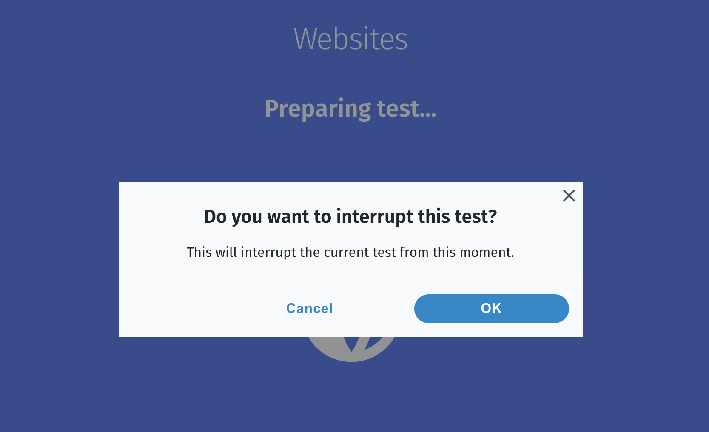
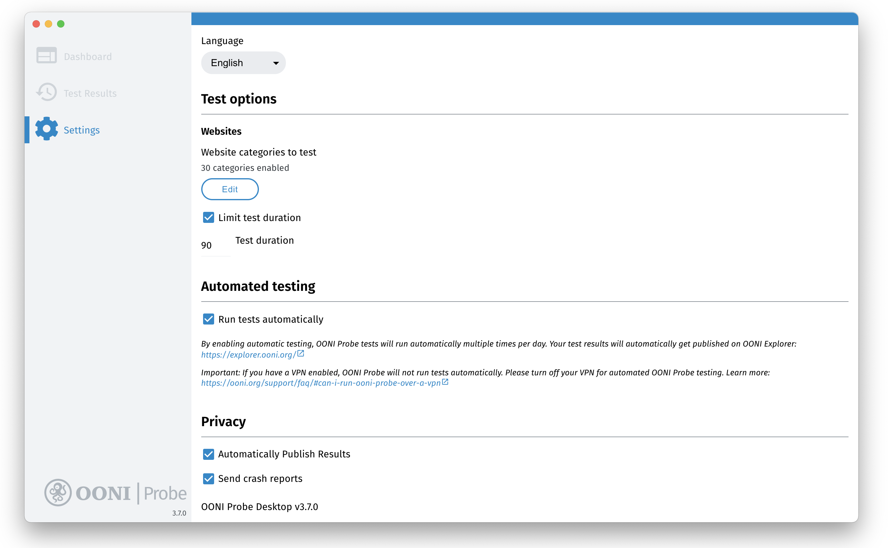
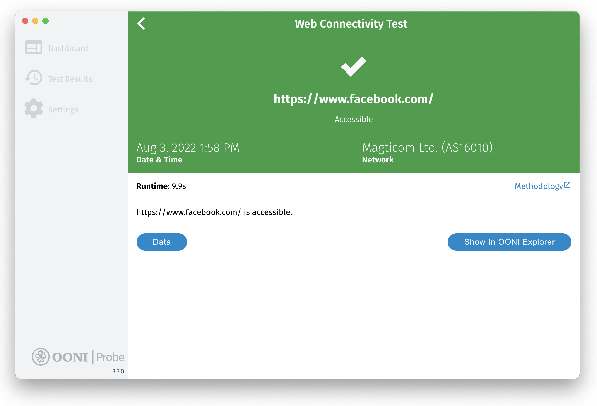
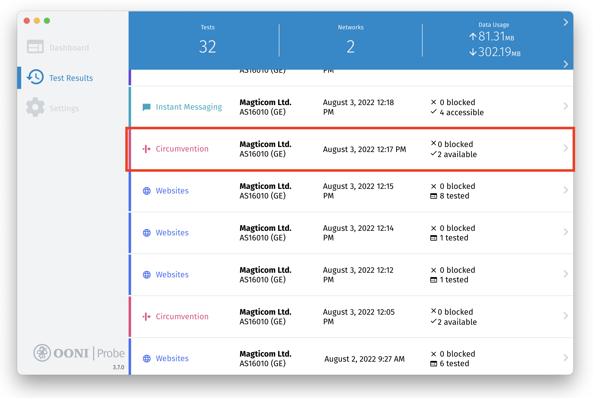
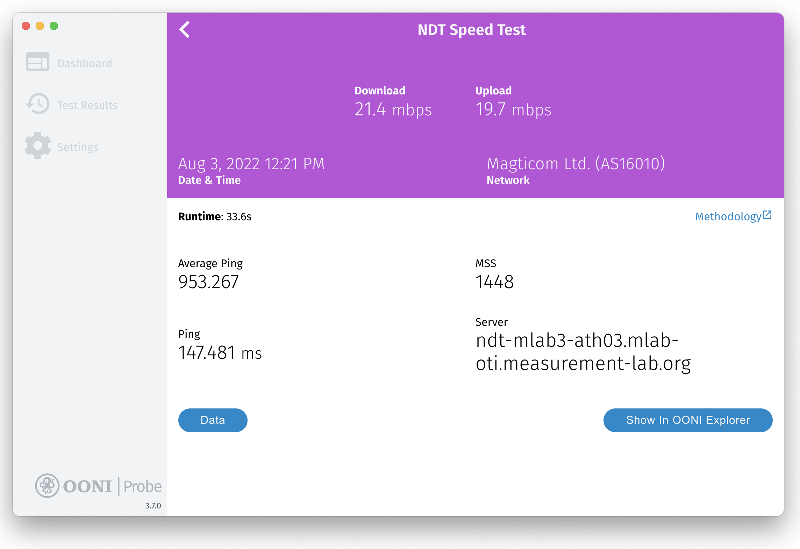
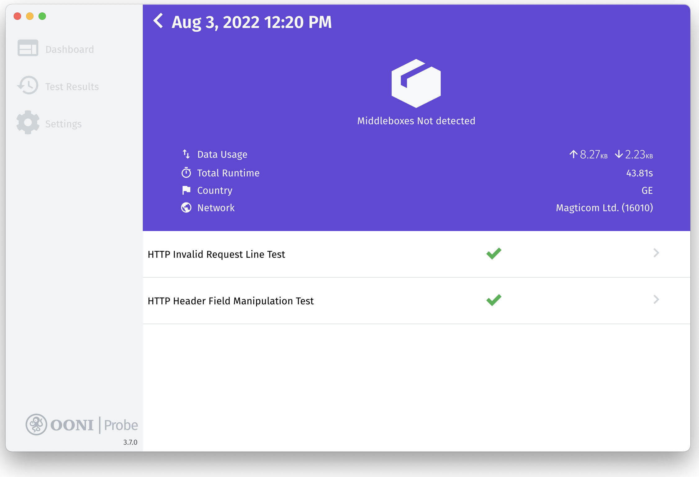

**آخرین به‌روز‌رسانی: ** 18 سپتامبر 2022

**نسخه دسکتاپ OONI Probe:** 3.7.0

{{}}

OONI Probe یک [برنامه رایگان و منبع‌باز](https://github.com/ooni/probe) است که می‌توانید از آن برای اندازه‌گیری سانسور اینترنت و سایر انواع تداخل در شبکه استفاده کنید. این راهنمای کاربری، **دستورالعمل‌های گام به گام** در مورد نحوه نصب، اجرا و تنظیمات استفاده از [برنامه دسکتاپ OONI Probe](https://ooni.org/install/desktop) را ارائه می‌دهد.

**آنچه در این راهنما کسب خواهید کرد:**

* با نحوه اجرای دسکتاپ OONI Probe آشنا شوید:

  * تست مسدودیت وبسایت‌ها
  * تست مسدودیت پیام‌رسان‌ها
  * مسدودیت ابزارهای دور زدن سانسور را تست کنید
  * سرعت و عملکرد شبکه خود را اندازه‌گیری کنید
* تست OONI Probe خود را برای وب‌سایت‌های مورد نظر خود سفارشی کنید
* نحوه دسترسی و به اشتراک‌گذاری نتایج تست OONI Probe خود را بیاموزید
* تنظیمات برنامه OONI Probe خود را پیکربندی کنید

با خواندن این راهنما، امیدواریم احساس کنید که توانایی اشتراک دانش و مهارت های OONI Probe خود را با دیگران دارید!

فهرست مطالب زیر می‌تواند به پیمایش راهنما کمک کند.



## مقدمه ای بر OONI Probe

OONI Probe یک [نرم‌افزار رایگان و منبع باز](https://github.com/ooni/probe) است که برای اندازه‌گیری سانسور اینترنت و سایر مشکلات تداخل در شبکه طراحی شده است. از سال 2012، این نرم‌افزار توسط [رصدخانه آزاد تداخل شبکه (OONI)](https://ooni.org/)، یک پروژه غیرانتفاعی که در ابتدا از [پروژه Tor](https://www.torproject.org/) متولد شد، توسعه یافته است.

با برنامه OONI Probe (در دسترس برای هر دو پلتفرم [موبایل](https://ooni.org/install/mobile) و [دسکتاپ](https://ooni.org/install/desktop))، می‌توانید [تست‌های اندازه‌گیری شبکه](https://ooni.org/nettest/) را برای بررسی موارد زیر اجرا کنید:

* مسدودیت [وب‌سایت‌ها](https://ooni.org/nettest/web-connectivity/);
* مسدودیت پیام‌رسان‌ها ([WhatsApp](https://ooni.org/nettest/whatsapp/), [Facebook Messenger](https://ooni.org/nettest/facebook-messenger/), [Telegram](https://ooni.org/nettest/telegram/), [Signal](https://ooni.org/nettest/signal))؛
* مسدودیت ابزارهای دور زدن سانسور ([Tor](https://ooni.org/nettest/tor/), [Tor Snowflake](https://ooni.org/nettest/tor-snowflake/), [Psiphon](https://ooni.org/nettest/psiphon/))؛
* وجود سیستم‌هایی ([middleboxes](https://ooni.org/nettest/http-header-field-manipulation/)) در شبکه شما که ممکن است مسئول سانسور و یا نظارت باشند.
* [سرعت و عملکرد](https://ooni.org/nettest/ndt/) شبکه شما و [عملکرد پخش ویدیوی شما](https://ooni.org/nettest/dash/).

به محض اجرای OONI Probe، نتایج تست شما به‌طور خودکار به سرورهای OONI ارسال، [پردازش](https://github.com/ooni/pipeline) و [به‌ طور عمومی](https://ooni.org/data/) در همان لحظه منتشر می‌شود (مگر این‌که خود شما از انتشار نتایج آزمایش خود انصراف دهید).

OONI به طور عمومی نتایج تست OONI Probe جمع‌آوری شده از سراسر جهان در موارد زیر را [منتشر می‌کند](https://ooni.org/data/):

* **شفافیت سانسور اینترنت** در سراسر جهان را افزایش می‌دهد؛
* **شواهد سانسور اینترنت** و سایر اشکال تداخل شبکه را به اشتراک می‌گذارد.
* امکان **تایید مستقل** یافته‌های سانسور OONI را فراهم می‌سازد؛
* از **تحقیق تکرارپذیر** پشتیبانی می‌کند؛
* از **تلاش‌های تحقیقاتی، سیاست‌گذاری، حقوقی و حمایتی** در سراسر جهان حمایت می‌کند؛
* از **بحث عمومی** در مورد کنترل اطلاعات حمایت می‌کند.

برای فعال کردن دسترسی عمومی به نتایج تست OONI Probe (که بیشتر “اندازه‌گیری” نامیده می‌شود)، تیم OONI آن‌ها را در [OONI Explorer](https://explorer.ooni.org/) منتشر می‌کند: یک پلت‌فرم وب که نمودارهایی را بر اساس پوشش اندازه‌گیری به همراه یک ابزار جستجو برای کاوش در اندازه‌گیری‌ها ارائه می دهد.

از آن‌جایی که [OONI Explorer](https://explorer.ooni.org/) میزبان بیش از 850 میلیون نتیجه اندازه‌گیری شبکه است که از 24500 شبکه در 241 کشور و منطقه از سال 2012 جمع آوری شده، احتمالا **بزرگترین منبع داده باز جهانی در مورد سانسور اینترنت ** تا به امروز محسوب می‌شود.

با اجرای OONI Probe، شما:

* خواهید آموخت که آیا و چگونه ارائه‌دهنده خدمات اینترنت (ISP) شما دسترسی به وب‌سایت‌ها و برنامه‌های خاص را سانسور می‌کند.
* در اندازه‌گیری‌هایی مشارکت خواهید داشت که به صورت عمومی بایگانی می‌شوند و جامعه جهانی آزادی اینترنت را قادر می‌سازد تا سانسور اینترنت را نظارت، شناسایی و با آن مبارزه کند.

هدف این راهنما این است که شما را در خصوص استفاده از [برنامه دسکتاپ OONI Probe](https://ooni.org/install/desktop) راهنمایی کند تا بتوانید به جامعه جهانی سانسور اینترنتی بپیوندید.

### بیانیهٔ رفع مسئولیت

از آنجایی که OONI Probe برای اندازه‌گیری سانسور اینترنت طراحی شده است، اجرای آن ممکن است برای برخی افراد در برخی کشورها [خطرناک](https://ooni.org/about/risks/) باشد.

برخی موارد را باید در نظر گرفت:

* **OONI Probe یک ابزار حفظ حریم خصوصی نیست.** هرکسی که فعالیت اینترنتی شما را تحت نظر دارد (به عنوان مثال دولت، ISP، کارفرما) ممکن است متوجه شود که شما OONI Probe را اجرا می کنید (دقیقا همانطور که احتمالا بتواند همه نرم‌افزارهای دیگری که اجرا می کنید را مشاهده کند).
* ** OONI Probe یک ابزار تحقیقی است.** برخی از تست‌های OONI Probe به صراحت برای کشف سانسور اینترنت طراحی شده‌اند.
* **[مدل تهدید شما](https://www.eff.org/keeping-your-site-alive/evaluating-your-threat-model).** برای مثال، یک فعال برجسته که قبلا تحت نظارت شدید قرار گرفته است، ممکن است هنگام اجرای OONI Probe توجه بیشتری را به خود جلب کند.
* **قوانین و مقررات کشوری که OONI Probe را در آن اجرا می‌کنید.** بهتر است با وکلای بومی مشورت کنید.
* **نوع وب‌سایت‌هایی که تیت می‌کنید.** ممکن است با استفاده از OONI Probe [وب‌سایت‌های](https://ooni.org/support/faq/#which-websites-will-i-test-for-censorship-with-ooni-probe) ممنوعه (در برخی کشورها)، وب‌سایت‌های تحریک‌آمیز یا اعتراضی را آزمایش کنید.
* **نوع تست‌های OONI Probe که شما اجرا می‌کنید.** همه [تست‌های OONI Probe](https://ooni.org/nettest/) از نظر خطر بالقوه وزن یکسانی ندارند. برای مثال، OONI Probe شامل [تست NDT](https://ooni.org/nettest/ndt/) است (که برای اندازه‌گیری سرعت و عملکرد شبکه طراحی شده است) که ممکن است در مقایسه با سایر تست‌هایی که برای اندازه‌گیری مسدودیت وب‌سایت‌ها یا برنامه‌ها طراحی شده‌اند، کمتر سیاسی یا بحث‌برانگیز تلقی شود.
* **این‌که اندازه‌گیری‌های خود را منتشر کنید یا نه.** OONI [به صورت عمومی](https://ooni.org/data/) اندازه گیری‌های جمع آوری شده از کاربران OONI Probe را منتشر می‌کند تا شفافیت سانسور اینترنت را در سراسر جهان افزایش دهد. ما تمام تلاش خود را می‌کنیم تا آدرس IP شما یا سایر اطلاعات بالقوه قابل شناسایی شخصی را منتشر نکنیم. در این مورد در [خط مشی داده](https://ooni.org/about/data-policy) ما بیشتر بیاموزید.

برای کسب اطلاعات بیشتر در مورد خطرات احتمالی مرتبط با استفاده از OONI Probe، لطفا به [مستندات](https://ooni.org/about/risks/) مربوطه مراجعه کنید.

## نصب OONI Probe دسکتاپ

برنامه دسکتاپ OONI Probe برای [Windows و macOS](https://ooni.org/install/desktop) در دسترس است. اگر از لینوکس استفاده می‌کنید، لطفا [رابط خط فرمان OONI Probe (CLI)](https://ooni.org/install/cli/ubuntu-debian) را نصب کنید.

می‌توانید برنامه دسکتاپ OONI Probe (در ویندوز و macOS) را از طریق مراحل زیر نصب کنید:

**مرحله 1.** از صفحه نصب OONI Probe Desktop (در وب‌سایت OONI) دیدن کنید: <https://ooni.org/install/desktop>

{{}}

**مرحله 2.** برای دانلود OONI Probe روی دکمه **دانلود** کلیک کنید. این صفحه یک نسخه OONI Probe را پیشنهاد می‌کند که با سیستم عامل شما (به عنوان مثال macOS) مرتبط باشد. اگر می‌خواهید نسخه‌ای را برای سیستم‌عامل دیگری انتخاب کنید، لطفا روی دکمه **سایر پلتفرم‌ها** کلیک کنید.

{{}}

{{}}

**مرحله 3.** پس از دانلود OONI Probe، برای **نصب** OONI Probe روی فایل دانلود شده دوبار کلیک کنید.

در **macOS**، آیکون OONI Probe را بکشید و در پوشه Application رها کنید.

{{}}

و سپس روی **Open** کلیک کنید تا برنامه OONI Probe در macOS نصب شود.

{{}}

در **Windows** (Windows 10)، روی **اطلاعات بیشتر** در صفحه زیر کلیک کنید:

{{}}

و سپس روی **Run anyway** کلیک کنید تا برنامه OONI Probe روی ویندوز نصب شود.

{{}}

**مرحله 4.** برنامه دسکتاپ OONI Probe خود را باز کنید. در **macOS**، می‌توانید برنامه OONI Probe خود را از پوشه Application باز کنید. در **ویندوز**، OONI Probe را از میانبر دسکتاپ راه اندازی کنید.

### ورود: رضایت آگاهانه

اکنون که برنامه دسکتاپ OONI Probe خود را نصب و باز کردید، برخی از اطلاعات اولیه درباره OONI Probe به عنوان بخشی از فرآیند نصب به شما ارائه می‌شود.

همچنین با [خطرات احتمالی](https://ooni.org/about/risks/) مرتبط با اجرای OONI Probe آشنا خواهید شد. برای اطمینان از درک این خطرات احتمالی، ما یک آزمون کوتاه برای کسب رضایت شما در نظر گرفته‌ایم. برای استفاده از OONI Probe، پاسخ صحیح به سوالات آزمون الزامی است.

در مرحله نهایی فرآیند ورود، انواع داده‌هایی را که به‌طور پیش‌فرض هنگام اجرای OONI Probe جمع‌آوری می‌شوند به اشتراک می‌گذاریم (برای اطلاعات بیشتر شما را به [خط مشی داده](https://ooni.org/about/data-policy) خود ارجاع می‌دهیم). برای کمک به ما در بهبود OONI Probe می‌توانید در اشتراک‌گذاری گزارش‌های خرابی و معیارهای استفاده از برنامه شرکت کنید.

در زیر شما را از طریق فرآیند ورود به سیستم راهنمایی می‌کنیم.

**مرحله 1.** هنگامی که اطلاعات اولیه درباره OONI Probe را خواندید، روی **فهمیدم** کلیک کنید.

{{}}

**مرحله 2.** صفحه بعدی خلاصه‌ای از خطرات احتمالی مرتبط با اجرای OONI Probe را به اشتراک می‌گذارد. برای خواندن [مستندات](https://ooni.org/about/risks/) ما که خطرات احتمالی را توضیح می‌دهد، روی **بیشتر بیاموزید** کلیک کنید.

{{}}

**مرحله 3.** هنگامی که در مورد خطرات بالقوه مرتبط با اجرای OONI Probe آشنا شدید، روی **متوجه شدم** کلیک کنید.

{{}}

**مرحله 4.** آزمون مربوطه بر اساس اطلاعاتی است که در صفحه قبلی خواندید. روی **درست** کلیک کنید تا درک خود را از عبارت نشان دهید.

{{}}

خواهید دید که **درست** پاسخ صحیحی است یا خیر. اگر روی غلط کلیک کنید، توضیحی در مورد دلیل اشتباه بودن پاسخ دریافت خواهید کرد.

{{}}

**مرحله 5.** برای نشان دادن درک خود از عبارت (در قسمت دوم آزمون) روی **درست** کلیک کنید.

{{}}

خواهید دید که **درست** پاسخ صحیحی است یا خیر. اگر روی غلط کلیک کنید، توضیحی در مورد دلیل اشتباه بودن پاسخ دریافت خواهید کرد.

{{}}

**مرحله 6.** صفحه زیر از شما می‌خواهد [گزارش‌های خرابی](https://ooni.org/about/data-policy#data-we-collect) را به اشتراک بگذارید که می‌تواند به ما در شناسایی و رفع اشکالات OONI Probe کمک کند. لطفا روی **بله** کلیک کنید تا گزارش‌های خرابی را به اشتراک بگذارید و به ما در بهبود OONI Probe کمک کنید.

{{}}

**مرحله 7.** صفحه زیر اطلاعات مربوط به انواع داده‌هایی که OONI به طور پیش‌فرض (هر بار که OONI Probe را اجرا می‌کنید) جمع آوری و منتشر می‌کند را به اشتراک می‌گذارد. با کلیک بر روی **[خط مشی داده OONI](https://ooni.org/about/data-policy)** در صفحه می‌توانید اطلاعات بیشتری کسب کنید.

{{}}

**مرحله 8.** اگر آماده به اشتراک گذاشتن داده‌های مربوط به اندازه‌گیری‌های خود با ما هستید، روی **بزن بریم** کلیک کنید.

شما اکنون فرآیند نصب را تکمیل کرده‌اید و آماده به شروع استفاده از OONI Probe هستید!

{{}}

**مرحله اختیاری 9.** اگر می‌خواهید تنظیمات خود را به **عدم** اشتراک گزارش‌های خرابی با ما تغییر دهید، روی **تنظیمات** کلیک کنید. این کار شما را به صفحه تنظیمات OONI Probe هدایت می‌کند، جایی که می‌توانید تمام تنظیمات پیش‌فرض را بررسی کرده و تغییر دهید. ارسال گزارش‌های خرابی به‌طور پیش‌فرض غیرفعال است و تنها در صورتی فعال می‌شود که روی دکمه **بزن بریم** کلیک کنید (مرحله 7 در بالا)، یا اگر تنظیمات مربوطه را به صورت دستی فعال کنید.

{{}}

اطلاعات دقیق در مورد تنظیمات OONI Probe را می‌توانید در بخش [پیکربندی تنظیمات OONI Probe خود](https://ooni.org/support/ooni-probe-desktop#configuring-your-ooni-probe-settings) در این راهنما پیدا کنید.

## اجرای OONI Probe دسکتاپ

اکنون که فرآیند نصب را کامل کرده‌اید، می‌توانید OONI Probe را برای اندازه‌گیری سانسور اینترنت اجرا کنید!

**داشبورد** برنامه دسکتاپ OONI Probe شامل 5 کارت است که هر کدام شامل تست‌های OONI Probe است:

* **کارت وب‌سایت.** شامل [تست اتصال وب](https://ooni.org/nettest/web-connectivity/) OONI است که [مسدودیت وب‌سایت‌ها](https://ooni.org/support/faq/#which-websites-will-i-test-for-censorship-with-ooni-probe) را اندازه‌گیری می‌کند.
* **کارت پیام‌رسان.** شامل تست‌های [WhatsApp](https://ooni.org/nettest/whatsapp/)، [Facebook Messenger](https://ooni.org/nettest/facebook-messenger/)، [Telegram](https://ooni.org/nettest/telegram/) و [Signal](https://ooni.org/nettest/signal) OONI است که بررسی می‌کنند آیا این برنامه‌ها مسدود شده‌اند یا خیر.
* **کارت دور زدن سانسور.** شامل [Tor](https://ooni.org/nettest/tor/) و [Psiphon](https://ooni.org/nettest/psiphon/) OONI است که بررسی می‌کنند آیا این ابزارهای دور زدن سانسور مسدود شده‌اند.
* **کارت عملکرد.** شامل [تست سرعت NDT](https://ooni.org/nettest/ndt/)، [تست عملکرد پخش ویدئو استریم DASH](https://ooni.org/nettest/dash/)، و تست‌های [Middlebox](https://ooni.org/support/glossary/#middlebox) OONI (تست [دستکاری فیلد هدر HTTP](https://ooni.org/nettest/http-header-field-manipulation/) و تست [خط درخواست نامعتبر HTTP](https://ooni.org/nettest/http-invalid-request-line/)).
* **کارت آزمایشی.** شامل چندین تست آزمایشی جدید است که توسط تیم OONI ایجاد شده است. این تست‌ها ممکن است در طول زمان تغییر کنند. این تست‌ها را می‌توانید در [اینجا](https://github.com/ooni/spec/tree/master/nettests) مشاهده کنید.

**مرحله 1.** روی **اجرا** کلیک کنید تا اولین آزمایشات OONI Probe خود را اجرا کنید.

{{}}

این کار **همه** تست‌های OONI Probe (در همه کارت‌ها) را یکباره اجرا می‌کند!

{{}}

{{}}

{{}}

{{}}

{{}}

OONI Probe باید همه تست‌ها را ظرف چند دقیقه اجرا کند (اگرچه این به عملکرد شبکه‌ای که به آن متصل هستید بستگی دارد و ممکن است در برخی موارد بیشتر طول بکشد). اگر عملکرد شبکه شما به اندازه کافی خوب نیست و آزمایش‌ها بیش از حد طول می‌کشد، می‌توانید با کلیک روی دکمه **ضربدر** در گوشه بالا سمت راست، **آزمایش در حال انجام را متوقف کنید**.

{{}}

برای توقف تست، روی دکمه **باشه** کلیک کنید.

{{}}

نتایج آزمایش OONI Probe شما به طور خودکار در [OONI Explorer](https://explorer.ooni.org/) و [OONI API](https://api.ooni.io/) منتشر می‌شود.

آیا ترجیح می‌دهید تست خود را به یک نوع آزمون (کارت) خاص محدود کنید؟ در بخش‌های بعدی، دستورالعمل‌هایی را درباره نحوه انجام این کار به اشتراک می‌گذاریم.

### اندازه‌گیری مسدودیت وب‌سایت‌ها

اگر فقط می‌خواهید مسدودیت وب‌سایت‌ها را اندازه‌گیری کنید، می‌توانید این کار را از طریق مراحل زیر انجام دهید:

**مرحله 1.** روی کارت **وب‌سایت‌ها** در داشبورد برنامه دسکتاپ OONI Probe خود کلیک کنید.

{{}}

**مرحله 2.** روی **اجرا** در کارت وب‌سایت‌ها کلیک کنید.

{{}}

اکنون [تست اتصال وب](https://ooni.org/nettest/web-connectivity/) OONI را برای اندازه‌گیری مسدودیت وب‌سایت‌ها اجرا می‌کنید.

{{}}

نتایج آزمایش OONI Probe شما به‌طور خودکار در [OONI Explorer](https://explorer.ooni.org/) و [OONI API](https://api.ooni.io/) منتشر می‌شود.

**کدام وب‌سایت‌ها تست می‌شوند؟**

به طور پیش‌فرض، وب‌سایت‌های موجود در 2 لیست زیر را آزمایش خواهید کرد:

* **[لیست تست جهانی](https://github.com/citizenlab/test-lists/blob/master/lists/global.csv)**. شامل وب‌سایت‌های مرتبط بین المللی (مانند facebook.com).
* **[لیست تست مخصوص کشور](https://github.com/citizenlab/test-lists/tree/master/lists)**. شامل وب‌سایت‌هایی می‌شود که فقط مربوط به کشوری است که OONI Probe را در آن اجرا می‌کنید.

مهم نیست که از کدام کشور OONI Probe را اجرا می‌کنید، وب‌سایت‌ها از [لیست تست جهانی](https://github.com/citizenlab/test-lists/blob/master/lists/global.csv) را *همیشه* آزمایش خواهید کرد.

OONI Probe به طور خودکار تعیین می‌کند که کدام کشور را برای تست [بر اساس کشوری](https://github.com/citizenlab/test-lists/tree/master/lists) که OONI Probe را از آن اجرا می کنید انتخاب کند. برای مثال، اگر OONI Probe را در برزیل اجرا می‌کنید، وب‌سایت‌ها را از لیست تست جهانی و از لیست تست برزیل آزمایش خواهید کرد. اگر به آلمان سفر می‌کنید و OONI Probe را اجرا می‌کنید، وب‌سایت‌ها را از لیست‌های تست جهانی و آلمانی تست می‌کند. اما اگر OONI Probe را از کشوری اجرا می‌کنید که هنوز لیست تست خاص کشور ندارد (به دلیل اینکه ایجاد نشده است)، فقط وب‌سایت‌ها از فهرست جهانی را تست خواهید کرد.

اگر می‌خواهید در [لیست تست Citizen Lab](https://github.com/citizenlab/test-lists/tree/master/lists) (که شامل وب‌سایت‌های پیش‌فرض تست‌شده توسط کاربران OONI Probe در سراسر جهان است)، مشارکت کنید، لطفا به [مستندات](https://ooni.org/get-involved/contribute-test-lists) مربوطه ما مراجعه کنید.

**توجه:** OONI Probe **با کلیک روی “اجرا” (از داشبورد یا از کارت وب‌سایت‌ها) **فقط تعدادی از وب‌سایت‌هایی که می‌تواند در عرض 90 ثانیه تست کند را آزمایش می‌کند**. این وب‌سایت‌ها (که در عرض 90 ثانیه آزمایش می‌شوند) به‌طور تصادفی از فهرست‌های تست [جهانی](https://github.com/citizenlab/test-lists/blob/master/lists/global.csv) و (مربوط) [مخصوص کشور](https://github.com/citizenlab/test-lists/tree/master/lists) انتخاب می‌شوند. هر بار که روی “اجرا” کلیک می‌کنید، انتخاب تصادفی از وب‌سایت‌ها (از فهرست‌های تست جهانی و مخصوص کشور) را در عرض 90 ثانیه تست خواهد کرد. بنابراین، هر چه تعداد دفعات بیشتری روی “اجرا” کلیک کنید، وب‌سایت‌های بیشتری را تست خواهید کرد.

اگر می‌خواهید تعداد بیشتری از وب‌سایت‌ها و یا وب‌سایت‌های متفاوتی را تست کنید، لطفا به بخش [سفارشی‌سازی تست وب‌سایت](https://ooni.org/support/ooni-probe-desktop#customizing-your-website-testing) این راهنما مراجعه کنید.

### اندازه‌یری مسدودیت پیام‌رسان‌ها

اگر فقط می‌خواهید میزان مسدودیت پیام‌رسان‌ها را اندازه‌گیری کنید، می‌توانید این کار را از طریق مراحل زیر انجام دهید:

**مرحله 1.** روی کارت **پیام‌رسان** در داشبورد برنامه دسکتاپ OONI Probe خود کلیک کنید.

{{}}

**مرحله 2.** روی **اجرا** در کارت پیام‌رسان کلیک کنید.

{{}}

اکنون تست‌های [WhatsApp](https://ooni.org/nettest/whatsapp/)، [Facebook Messenger](https://ooni.org/nettest/facebook-messenger/)، [Telegram](https://ooni.org/nettest/telegram/) و [Signal](https://ooni.org/nettest/signal) OONI را برای اندازه‌گیری مسدودیت این برنامه‌ها انجام می‌دهید.

{{}}

نتایج آزمایش OONI Probe شما به‌طور خودکار در [OONI Explorer](https://explorer.ooni.org/) و [OONI API](https://api.ooni.io/) منتشر می‌شود.

### اندازه گیری مسدودیت ابزارهای دور زدن سانسور

اگر فقط می‌خواهید مسدودیت ابزارهای دور زدن سانسور را اندازه‌گیری کنید، می‌توانید این کار را از طریق مراحل زیر انجام دهید:

**مرحله 1.** روی کارت **دور زدن سانسور** در داشبورد برنامه دسکتاپ OONI Probe خود کلیک کنید.

{{}}

**مرحله 2.** روی **اجرا** در کارت دور زدن سانسور کلیک کنید.

{{}}

اکنون در حال اجرای تست‌های [Tor](https://ooni.org/nettest/tor/) و [Psiphon](https://ooni.org/nettest/psiphon/) OONI هستید تا میزان دسترسی به این ابزارها را اندازه‌گیری کنید.

{{}}

نتایج تست OONI Probe شما به‌طور خودکار در [OONI Explorer](https://explorer.ooni.org/) و [OONI API](https://api.ooni.io/) منتشر می‌شود.

### اندازه گیری عملکرد شبکه

اگر فقط می‌خواهید عملکرد شبکه را اندازه‌گیری کنید، می‌توانید این کار را از طریق مراحل زیر انجام دهید:

**مرحله 1.** روی کارت **عملکرد** در داشبورد برنامه دسکتاپ OONI Probe خود کلیک کنید.

{{}}

**مرحله 2.** روی **اجرا** در کارت عملکرد کلیک کنید.

{{}}

اکنون در حال اجرای [تست سرعت NDT](https://ooni.org/nettest/ndt/) و [تست عملکرد استریم ویدئو DASH](https://ooni.org/nettest/dash/) هستید.

{{}}

نتایج تست شما به طور خودکار در [OONI Explorer](https://explorer.ooni.org/) و [OONI API](https://api.ooni.io/) منتشر می‌شود.

**سلب مسئولیت:** تست‌های [NDT](https://ooni.org/nettest/ndt/) و [DASH](https://ooni.org/nettest/dash/) بر روی سرورهای شخص ثالث ارائه شده توسط [Measurement Lab (M-Lab)](https://www.measurementlab.net/) انجام می‌شود. اگر این تست‌ها را اجرا کنید، M-Lab بدون در نظر گرفتن تنظیمات OONI Probe، آدرس IP شما را برای اهداف تحقیقاتی جمع‌آوری و منتشر می‌کند. از طریق [بیانیه حریم خصوصی](https://www.measurementlab.net/privacy/) M-Lab درباره حاکمیت داده‌ها بیشتر بیاموزید.

### اندازه گیری وجود Middleboxها

اگر می‌خواهید شبکه‌ها را فقط برای تشخیص وجود [Middlebox](https://ooni.org/support/glossary/#middlebox) (و نشانه‌های احتمالی دستکاری شبکه) اندازه‌گیری کنید، می‌توانید این کار را از طریق مراحل زیر انجام دهید:

**مرحله 1.** روی کارت **Middleboxها** در داشبورد برنامه دسکتاپ OONI Probe خود کلیک کنید.

{{}}

**مرحله 2.** روی **اجرا** در کارت Middleboxها کلیک کنید.

{{}}

اکنون تست‌های [Middlebox](https://ooni.org/support/glossary/#middlebox) (تست [دستکاری فیلد هدر HTTP](https://ooni.org/nettest/http-header-field-manipulation/) و تست [خط درخواست نامعتبر HTTP](https://ooni.org/nettest/http-invalid-request-line/)) OONI را اجرا می‌کنید.

{{}}

نتایج تست OONI Probe شما به‌طور خودکار در [OONI Explorer](https://explorer.ooni.org/) و [OONI API](https://api.ooni.io/) منتشر می‌شود.

### اجرای تست‌های آزمایشی

اگر فقط می‌خواهید تست‌های آزمایشی جدیدی را که توسط تیم OONI توسعه یافته است اجرا کنید، می‌توانید این کار را از طریق مراحل زیر انجام دهید:

**مرحله 1.** روی کارت **آزمایشی** در داشبورد برنامه دسکتاپ OONI Probe خود کلیک کنید.

{{}}

**مرحله 2.** روی **اجرا** در کارت آزمایشی کلیک کنید.

{{}}

اکنون در حال اجرای [تست‌های آزمایشی](https://github.com/ooni/spec/tree/master/nettests) توسعه‌یافته توسط تیم OONI هستید.

{{}}

## تست خودکار OONI Probe

به جای اینکه به یاد داشته باشید که تست‌ها را به صورت دستی اجرا کنید، می‌توانید **تست خودکار** را در تنظیمات برنامه دسکتاپ OONI Probe خود فعال کنید و OONI Probe به طور خودکار تست‌ها را برای شما اجرا می‌کند!

با فعال کردن تست خودکار، OONI Probe **همه تست‌ها را چندین بار در روز در پس‌زمینه اجرا می‌کند** (به استثنای تست‌های عملکردی با پهنای‌باند بالا). هر بار مجموعه متفاوتی از وب‌سایت‌ها (از [لیست‌های تست Citizen Lab](https://github.com/citizenlab/test-lists/tree/master/lists)) را آزمایش می‌شود. برای جلوگیری از بهم ریختگی بخش نتایج آزمایش برنامه خود، این نتایج آزمایش به طور خودکار در [OONI Explorer](https://explorer.ooni.org/) در همان لحظه منتشر می‌شوند (و از طریق بخش نتایج تست قابل مشاهده نیستند).

با تست خودکار OONI Probe، می‌توانید **به‌طور منظم در اندازه‌گیری‌های سانسور مشارکت کنید** (بدون نیاز به انجام کار بیشتری) به جامعه آزادی اینترنت این امکان را می‌دهید که رویدادهای سانسور را در کشور شما در طول زمان نظارت و شناسایی کند.

می‌توانید تست خودکار OONI Probe را از طریق مراحل زیر فعال کنید:

**مرحله 1.** روی **تنظیمات** در نوار کناری برنامه دسکتاپ OONI Probe خود کلیک کنید.

{{}}

در بخش **تست خودکار** تنظیمات، خواهید دید که تست خودکار OONI Probe به طور پیش‌فرض غیرفعال است.

**مرحله 2.** گزینه **اجرای خودکار تست** را در تنظیمات فعال کنید.

{{}}

اکنون تست خودکار OONI Probe را فعال کرده‌اید! OONI Probe به طور خودکار چندین بار در روز (بدون دخالت کاربر) تست‌ها را اجرا می‌کند و نتایج تست به طور خودکار در [OONI Explorer](https://explorer.ooni.org/) منتشر می‌شود.

به طور کلی، اگر تست خودکار را فعال نکرده باشید، هر از چند گاهی پنجره پاپ آپ زیر را مشاهده می‌کنید که از شما می‌پرسد که آیا می‌خواهید تست خودکار را فعال کنید.

{{}}

برای فعال کردن تست خودکار، می‌توانید روی **عالی به نظر می‌رسد** کلیک کنید. اگر می‌خواهید یادآوری برای فعال کردن آزمایش خودکار در مرحله بعد دریافت کنید، روی **بعدا به من یادآوری کن** کلیک کنید.

## سفارشی کردن تست وب‌سایت شما

به‌طور پیش‌فرض، هنگام آزمایش وب‌سایت‌ها با OONI Probe، آدرس‌های موجود در [لیست‌های تست Citizen Lab](https://github.com/citizenlab/test-lists/tree/master/lists) را اندازه‌گیری می‌کنید. به عبارت دیگر، اگر فقط روی “اجرا” (در داشبورد یا کارت وب‌سایت‌های برنامه OONI Probe) کلیک کنید، مجموعه‌ای تصادفی از وب‌سایت‌ها را که از [لیست‌های تست Citizen Lab](https://github.com/citizenlab/test-lists/tree/master/lists) گرفته شده‌اند، آزمایش خواهید کرد. این فهرست‌ها از طریق همکاری با محققان و کارشناسان داخلی ایجاد شده است. از آن‌جایی که آن‌ها [به طور عمومی در GitHub](https://github.com/citizenlab/test-lists/tree/master/lists) در دسترس هستند، هر کسی به طور بالقوه می‌تواند آن‌ها را بررسی کند، در لیست آدرس‌ها [مشارکت کند](https://ooni.org/get-involved/contribute-test-lists) و حذف آدرس‌های خاصی را پیشنهاد دهد. تداوم [بررسی و به‌روزرسانی](https://ooni.org/get-involved/contribute-test-lists) این فهرست‌ها مهم است، زیرا حاوی وب‌سایت‌هایی هستند که توسط اکثر کاربران OONI Probe به طور منظم در سراسر جهان تست می‌شوند.

اما اگر ترجیح می‌دهید تست را به وب‌سایت‌های انتخابی خود محدود کنید، می‌توانید این کار را از طریق برنامه دسکتاپ OONI Probe انجام دهید.

می توانید تست وب‌سایت خود را به روش‌های زیر سفارشی کنید:

* آزمایش خود را به [دسته‌بندی‌های وب‌سایت خاص](https://ooni.org/support/ooni-probe-desktop#testing-specific-website-categories) (مانند رسانه‌های خبری و حقوق بشری) محدود کنید.
* فقط [وب‌سایت‌هایی که به آن‌ها اهمیت می‌دهید](https://ooni.org/support/ooni-probe-desktop#testing-websites-of-your-choice) را تست کنید.
* [*همه* آدرس‌ها](https://ooni.org/support/ooni-probe-desktop#testing-all-websites-from-the-citizen-lab-test-lists) در [لیست‌های آزمایشی Citizen Lab](https://github.com/citizenlab/test-lists/tree/master/lists) ([مرتبط](https://ooni.org/support/faq/#which-websites-will-i-test-for-censorship-with-ooni-probe)) را (به جای تست تصادفی وب‌سایت‌ها در 90 ثانیه) تست کنید.

بخش‌های زیر توضیح می‌دهند که چگونه می‌توانید هر یک از موارد فوق را انجام دهید.

### تست دسته‌بندی خاص وب‌سایت‌ها

وقتی روی “اجرا” در برنامه OONI Probe کلیک می‌کنید، وب‌سایت‌ها را از لیست‌های تست Citizen Lab [جهانی](https://github.com/citizenlab/test-lists/blob/master/lists/global.csv) و (مرتبط) [مخصوص کشور](https://github.com/citizenlab/test-lists/tree/master/lists) آزمایش می‌کنید.

این وب‌سایت‌ها بر اساس [30 دسته‌بندی استاندارد](https://github.com/citizenlab/test-lists/blob/master/lists/00-LEGEND-new_category_codes.csv) طبقه‌بندی شده‌اند. این دسته‌بندی‌ها از رسانه‌های خبری، فرهنگ و موضوعات حقوق‌بشر گرفته تا مقوله‌های تحریک آمیزتر یا اعتراض‌آمیزتر، مانند پورنوگرافی را شامل می‌شوند (این دسته‌بندی‌ها به این دلیل گنجانده شده‌اند که احتمال مسدودیت آن‌ها بیشتر است و امکان شناسایی تکنیک‌های سانسور اتخاذ شده توسط ISP‌ها را فراهم می‌کنند).

به‌طور پیش‌فرض، همه 30 دسته در برنامه دسکتاپ OONI Probe فعال هستند تا تست وب‌سایت‌های متنوع‌تر را فراهم کنند و امکان کشف انواع بیشتری از سانسور وب‌سایت را افزایش دهند.

اما اگر با آزمایش تمام 30 دسته وب‌سایت راحت نیستید (مخصوصا اگر حاوی محتوای غیرقانونی، تحریک‌آمیز یا قابل اعتراض در کشور شما باشد)، یا فقط علاقه‌مند به آزمایش انواع خاصی از محتوا هستید (مانند رسانه‌های خبری)، می‌توانید تست OONI Probe خود را به دسته‌های وب‌سایت مورد نظر خود محدود کنید.

**مرحله 1.** روی **تنظیمات** در برنامه دسکتاپ OONI Probe خود کلیک کنید.

{{}}

در قسمت **گزینه های تست** در تنظیمات، می‌بینید که [30 دسته از وب‌سایت](https://github.com/citizenlab/test-lists/blob/master/lists/00-LEGEND-new_category_codes.csv) به طور پیش‌فرض فعال هستند.

**مرحله 2.** روی دکمه **ویرایش** کلیک کنید (در زیر “دسته‌های وب‌سایت برای آزمایش”).

{{}}

اکنون [30 دسته](https://github.com/citizenlab/test-lists/blob/master/lists/00-LEGEND-new_category_codes.csv) از وب‌سایت‌هایی که OONI Probe به طور پیش‌فرض تست می‌کند را مشاهده خواهید کرد. همه این دسته‌ها فعال هستند.

{{}}

**مرحله 3.** دسته‌های وب‌سایتی که **نمی‌خواهید** تست کنید را **غیرفعال** کنید.

{{}}

در مثال بالا، ما 2 دسته (“پورنوگرافی” و “لباس تحریک‌آمیز”) را غیرفعال کرده‌ایم.

**مرحله 4.** روی **ذخیره** کلیک کنید.

وقتی به عقب برگردید، می‌بینید که اکنون فقط 28 دسته فعال هستند (چون 2 دسته غیرفعال شده‌اند).

{{}}

برای فعال یا غیرفعال کردن دسته‌های وب‌سایت مورد نظرتان، هر زمان که بخواهید می‌توانید دوباره به این تنظیمات مراجعه کنید.

### تست وب‌سایت‌های انتخابی شما

از طریق مراحل زیر می‌توانید وب‌سایت‌های مورد علاقه خود را به طور مستقیم آزمایش کنید:

**مرحله 1.** روی کارت **وب‌سایت‌ها** در برنامه دسکتاپ OONI Probe خود کلیک کنید.

{{}}

**مرحله 2.** روی دکمه **انتخاب وب‌سایت** در داخل کارت وب‌سایت‌ها کلیک کنید.

{{}}

اکنون صفحه‌ای را مشاهده می‌کنید که می‌توانید وب‌سایت‌هایی را که می‌خواهید تست کنید، اضافه کنید.

{{}}

**مرحله 3.** **آدرس اینترنتی** وب‌سایتی را که می‌خواهید تست کنید تایپ کنید. در مثال زیر `https://www.facebook.com/` را تایپ کرده‌ایم.

{{}}

**مهم:** لطفا مطمئن شوید که [آدرس](https://ooni.org/support/glossary/#url) به درستی تایپ شده است. اگر اشتباه تایپ شود، OONI Probe وب‌سایت مورد نظر تست *نمی*‌شود و این موضوع منجر به نتایج تست نادرست می‌شود.

چند نکته را باید در نظر داشت:

* آیا وب‌سایت روی **HTTP** یا **HTTPS** است؟ اگر مورد دوم است، لطفا یک `s` اضافی بعد از `http` اضافه کنید.
* آیا [دامنه](https://ooni.org/support/glossary/#domain-name) شامل `www` است؟ اگر چنین است، لطفا آن را درج کنید.

برای اطمینان از اینکه [آدرس](https://ooni.org/support/glossary/#url) به طور دقیق تایپ شده است، **لطفا بررسی کنید که هنگام دسترسی از مرورگر معمولی چگونه نمایش داده می‌شود**.

**مرحله 4.** روی **افزودن وب‌سایت** کلیک کنید تا یک خط جدید برای افزودن وب‌سایت دیگری برای تست ایجاد کنید.

**مرحله 5.** ** آدرس دیگری را تایپ کنید** که می‌خواهید تست کنید. در مثال زیر، `https://twitter.com/` را اضافه کرده‌ایم.

{{}}

اگر نظرتان عوض شد و می‌خواهید هر یک از آدرس‌هایی که اضافه کرده‌اید را حذف کنید، می‌توانید با کلیک بر روی نماد قرمز رنگ کنار هر آدرس این کار را انجام دهید.

می‌توانید هر تعداد آدرس که می‌خواهید اضافه کنید. در مثال زیر، `https://www.gutenberg.org/` را اضافه کرده‌ایم.

{{}}

**مرحله 6.** روی **اجرا** کلیک کنید تا همه وب‌سایت‌هایی را که اضافه کرده‌اید تست کنید.

اکنون خواهید دید که OONI Probe وب‌سایت‌های انتخابی شما را تست می‌کند!

{{}}

نتایج آزمایش OONI Probe شما به‌طور خودکار در [OONI Explorer](https://explorer.ooni.org/) و [OONI API](https://api.ooni.io/) منتشر می‌شود.

### تست تمام وب‌سایت‌ها از لیست‌های تست Citizen Lab

برنامه دسکتاپ OONI Probe فقط تعدادی وب‌سایت‌هایی که می‌تواند در عرض 90 ثانیه (بر اساس تنظیمات پیش‌فرض) بررسی کند را آزمایش می‌کند.

اگر به Wi-Fi متصل هستید و می‌خواهید **همه وب‌سایت‌ها** را از [لیست‌های تست Citizen Lab](https://github.com/citizenlab/test-lists/tree/master/lists) ([مرتبط](https://ooni.org/support/faq/#which-websites-will-i-test-for-censorship-with-ooni-probe)) یکباره آزمایش کنید، می‌توانید این کار را از طریق مراحل زیر انجام دهید:

**مرحله 1.** روی **تنظیمات** در نوار کناری برنامه دسکتاپ OONI Probe خود کلیک کنید.

{{}}

در قسمت **گزینه‌های تست** در تنظیمات، خواهید دید که گزینه **محدود کردن مدت زمان تست** (که تست وب‌سایت را به مدت زمان خاصی محدود می‌کند) به طور پیش‌فرض فعال است.

**مرحله 2.**  **محدود کردن مدت زمان تست** را غیرفعال کنید.

{{}}

در حال حاضر هیچ محدودیت زمانی در تست وب‌سایت شما وجود ندارد. این بدان معناست که OONI Probe می‌تواند تمام وب‌سایت‌های موجود در [لیست‌های تست Citizen Lab مربوطه](https://ooni.org/support/faq/#which-websites-will-i-test-for-censorship-with-ooni-probe) را هر بار که روی ”اجرا” کلیک می‌کنید، آزمایش کند.

{{}}

**همچنین**: اگر می‌خواهید وب‌سایت‌های بیشتری را در مدت زمان طولانی‌تری آزمایش کنید (بدون اینکه الزاما محدودیت زمانی را غیرفعال کنید و همه وب‌سایت‌ها را آزمایش کنید)، می‌توانید این کار را از طریق مراحل زیر انجام دهید:

**مرحله 1.** به **مدت زمان تست** در قسمت گزینه‌های تست تنظیمات بروید.

{{}}

به طور پیش‌فرض، مدت زمان تست وب‌سایت روی **90 ثانیه** تنظیم شده است. این بدان معنی است که OONI Probe فقط تعدادی وب‌سایت (از [لیست‌های تست Citizen Lab مربوطه](https://ooni.org/support/faq/#which-websites-will-i-test-for-censorship-with-ooni-probe)) که بتواند در عرض 90 ثانیه بررسی کند را آزمایش می‌کند.

**مرحله 2.** برای تغییر مدت زمان تست، **ثانیه**هایی که می‌خواهید OONI Probe وب‌سایت‌ها طی آن آزمایش شوند را تایپ کنید. در مثال زیر، `360` را تایپ کرده‌ایم که OONI Probe وب‌سایت‌ها را به مدت 6 دقیقه تست کند.

{{}}

اکنون مدت زمان تست وب‌سایت برنامه دسکتاپ OONI Probe خود را تغییر داده‌اید.

## دسترسی به نتایج تست OONI Probe

به محض اجرای یک تست OONI Probe، می‌توانید بلافاصله به نتایج آزمایش به طور مستقیم در برنامه دسکتاپ OONI Probe خود دسترسی پیدا کنید.

**مرحله 1.** روی **نتایج آزمایش** در نوار کناری برنامه دسکتاپ OONI Probe خود کلیک کنید.

{{}}

اکنون یک نمای کلی از تمام نتایج تست OONI Probe خود را خواهید دید که به ترتیب زمانی ارائه می‌شوند و آخرین تست‌ها در ابتدا فهرست شده‌اند. در این بررسی اجمالی، نتایج تست بر اساس 5 کارت موضوعی برنامه (“وب‌سایت‌ها”، “پیام‌رسان‌ها”، “دور زدن سانسور”، “عملکرد”، “Middleboxها”) گروه‌بندی می‌شوند.

در هر کارت نتیجه تست موضوعی، شما یک نمای کلی از موارد زیر دارید:

* **شبکه** (به عنوان مثال `AS16010` - Magticom Ltd.) که تست روی آن اجرا شده؛
* **تاریخ و زمان** تست  (به عنوان مثال 3 آگوست 2022 ساعت 13:58 به وقت محلی)؛
* **خلاصه یافته‌های مرتبط** (مثلا 3 وب‌سایت در دسترس بودند، در حالی که هیچ یک مسدود نشده بودند).

این بررسی اجمالی (در صورتی تست‌ها را روی شبکه‌های مختلف انجام داده‌اید) می‌تواند به مقایسه نتایج در بین شبکه‌ها کمک کند و دید کلی از یافته‌ها ارائه دهد.

در هدر بالای صفحه نتایج تست، یک نمای کلی از موارد زیر را به اشتراک می‌گذاریم:

* **تعداد تست‌های OONI Probe** که تاکنون اجرا کرده‌اید.
* **تعداد شبکه**هایی که تاکنون OONI Probe را روی آن‌ها اجرا کرده‌اید.
* **مصرف داده** OONI Probe شما.

{{}}

در حالی که صفحه نتایج تست یک نمای کلی اولیه از نتایج را ارائه می‌دهد، می‌توانید همانطور که در بخش‌های زیر توضیح داده شده است، عمیق‌تر به داده‌های مربوط به هر تست دسترسی پیدا کنید.

### وب‌سایت

می‌توانید از طریق مراحل زیر به نتایج OONI Probe خود از تست وب‌سایت‌ها دسترسی پیدا کنید:

**مرحله 1.** روی **وب‌سایت‌ها** در صفحه نتایج تست برنامه دسکتاپ OONI Probe خود کلیک کنید.

{{}}

اکنون لیستی از تمام وب‌سایت‌هایی که در یک نشست تست خاص آزمایش کرده‌اید را مشاهده خواهید کرد.

{{}}

در سربرگ بالا، یک نمای کلی از نتایج تست وب‌سایت شما را به اشتراک می‌گذاریم. در کنار هر آدرس تست شده، یا یک تیک سبز (نشان دهنده دسترسی به وب‌سایت) یا یک ضربدر قرمز (نشان دهنده مسدودیت احتمالی وب‌سایت) وجود خواهد داشت.

**مرحله 2.** روی **ردیف یک وب‌سایت تست شده** کلیک کنید (برای دسترسی به داده‌های تست آن وب‌سایت).

{{}}

اکنون به داده‌های مربوط به تست یک وب‌سایت خاص دسترسی دارید.

صفحه اندازه‌گیری بالا مربوط به تست `https://www.facebook.com/` است. از طریق این صفحه اندازه‌گیری، می‌توانیم ببینیم که `https://www.facebook.com/` هنگام اسادر Magticom Ltd. (AS16010) در 3 آگوست 2022 در ساعت 13:58 به وقت محلی در دسترس بوده است.

اگر وب‌سایتی (به طور بالقوه) مسدود شده بود، صفحه اندازه‌گیری آن شامل یک سربرگ نارنجی با علامت تعجب است، همانطور که در زیر نشان داده شده است.

{{}}

در این مورد، می‌توانیم ببینیم که `https://www.gutenberg.org` هنگام آزمایش در Vodafone Italia (AS30722) در 30 مارس 2021 در ساعت 15:13 به وقت محلی، نشانه‌هایی از مسدودیت ("[ناهنجاری](https://ooni.org/support/glossary/#network-anomaly)") را ارائه کرد. به طور خاص، می‌توانیم ببینیم که نشانه‌هایی از [دستکاری DNS](https://ooni.org/support/glossary/#dns-tampering) (بر اساس یافته‌های [تست اتصال وب OONI](https://ooni.org/nettest/web-connectivity/)) را ارائه می‌دهد. این بدان معناست که Vodafone Italia ممکن است دسترسی به `https://www.gutenberg.org` (در 30 مارس 2021) را از طریق DNS مسدود کرده باشد.

از آنجایی که ممکن است نتیجه [مثبت کاذب](https://ooni.org/support/glossary/#false-positive) رخ دهد، ما نتایج تستی را که نتوانسته‌اند تمام معیارهای [تست اتصال وب](https://ooni.org/nettest/web-connectivity/) را برآورده کنند، به عنوان “[ناهنجاری](https://ooni.org/support/faq/#how-can-i-interpret-ooni-data)” (به جای “مسدودیت تایید شده”) ثبت می‌کنیم. با این کار نشان می‌دهیم که وب‌سایت تست شده *ممکن است* مسدود باشد.

در ارزیابی مسدودیت یک وب‌سایت، بررسی اندازه‌گیری‌های مرتبط (از تست یک وب‌سایت خاص در همان شبکه در طول زمان) به صورت **مجموعه** مفید است. این کار را می‌توانید از طریق [OONI Explorer](https://explorer.ooni.org/) (جایی که همه تست‌ها را منتشر می‌کنیم) انجام دهید. OONI Explorer همچنین [نتیجه اندازه‌گیری‌ها را برای همه موارد “مسدودیت تایید شده” نشان می‌دهد](https://explorer.ooni.org/search?since=2021-02-24&only=confirmed) که در آن ما به طور خودکار مسدودیت وب‌سایت‌ها را بر اساس [صفحات مسدود](https://ooni.org/support/glossary/#block-page) تایید می‌کنیم.

### پیام‌رسان

شما می‌توانید از طریق مراحل زیر به نتایج OONI Probe خود از تست برنامه‌های پیام‌رسان دسترسی پیدا کنید:

**مرحله 1. ** در صفحه نمایش نتایج تست برنامه دسکتاپ OONI Probe روی **پیام‌رسان** کلیک کنید.

{{}}

اکنون لیستی ازپیام‌رسان‌ها (WhatsApp, Facebook Messenger, Telegram, Signal) را که در یک نشست تست خاص آزمایش کرده‌اید، مشاهده خواهید کرد.

{{}}

در سربرگ بالا، نمای کلی از نتایج تست پیام‌رسان شما را به اشتراک می‌گذاریم. در کنار هر برنامه تست شده، یک تیک سبز رنگ (نشان دهنده قابلیت دسترسی به برنامه) یا یک ضربدر قرمز (نشان دهنده مسدودیت احتمالی برنامه) وجود دارد.

**مرحله 2.** (برای دسترسی به داده‌های تست آن برنامه) روی ** ردیف یک برنامه تست شده** کلیک کنید.

{{}}

صفحه اندازه‌گیری بالا مربوط به تست WhatsApp است. می‌توانیم ببینیم که WhatsApp هنگام تست در Magticom Ltd. (AS16010) در 3 آگوست 2022 در ساعت 12:19 به وقت محلی قابل دسترسی است. این نتیجه به این دلیل حاصل می‌شود که [تست WhatsApp OONI](https://ooni.org/nettest/whatsapp/) توانست با موفقیت به نقاط پایانی WhatsApp، سرویس ثبت‌نام و رابط وب (`web.whatsapp.com`) متصل شود.

اگر WhatsApp (به طور بالقوه) مسدود شده بود، این صفحه اندازه‌گیری اطلاعات مربوط به آن را (بر اساس یافته‌های [تست WhatsApp OONI](https://ooni.org/nettest/whatsapp/)) نشان می‌داد.

به همین ترتیب، می‌توانید از طریق پیام‌رسان در برنامه OONI Probe به نتایج تست Telegram دسترسی پیدا کنید.

{{}}

در این مورد، می‌توانیم ببینیم که Telegram هنگام تست در Magticom Ltd. (AS16010) در 3 آگوست 2022 در ساعت 12:19 به وقت محلی قابل دسترسی است. این نتیجه به این دلیل است که [تست Telegram OONI](https://ooni.org/nettest/telegram/) توانست با موفقیت به نقاط پایانی و رابط وب Telegram (`web.telegram.org`) متصل شود.

اگر Telegram (به طور بالقوه) مسدود شده بود، این صفحه اندازه‌گیری اطلاعات مربوط به آن را (بر اساس یافته‌های [تست Telegram OONI](https://ooni.org/nettest/telegram/)) نشان می‌داد.

همچنین می‌توانید از طریق نتایج پیام‌رسان در برنامه OONI Probe به نتایج تست Facebook Messenger دسترسی پیدا کنید.

{{}}

در این مورد، می‌توانیم ببینیم که Facebook Messenger هنگام تست در Magticom Ltd. (AS16010) در 3 آگوست 2022 در ساعت 13:58 به وقت محلی قابل دسترسی است. این نتیجه به این دلیل است که [تست Facebook Messenger OONI](https://ooni.org/nettest/facebook-messenger/) توانست با موفقیت به نقاط پایانی Facebook متصل شود و آدرس های IP Facebook را حل کند.

اگر Facebook Messenger (به طور بالقوه) مسدود شده بود، این صفحه اندازه‌گیری اطلاعات مربوط به آن را (بر اساس یافته‌های [تست Facebook Messenger OONI](https://ooni.org/nettest/facebook-messenger/)) نشان می‌داد.

همچنین می‌توانید از طریق نتایج پیام‌رسان در برنامه OONI Probe به نتایج تست Signal دسترسی پیدا کنید.

{{}}

در این مورد، می‌توانیم ببینیم که Signal هنگام تست در Magticom Ltd. (AS16010) در 3 آگوست 2022 در ساعت 12:19 به وقت محلی قابل دسترسی است. این نتیجه به این دلیل است که [تست Signal OONI](https://ooni.org/nettest/signal) توانست با موفقیت به نقاط انتهایی Signal متصل شود.

اگر Signal (به طور بالقوه) مسدود شده بود، این صفحه اندازه‌گیری اطلاعات مربوط به آن را (بر اساس یافته‌های [تست Signal OONI](https://ooni.org/nettest/signal)) نشان می‌داد.

در همه موارد، توصیه می‌کنیم به اندازه‌گیری‌های OONI منتشر شده در [OONI Explorer](https://explorer.ooni.org/) مراجعه کنید، جایی که می‌توانید نتایج را با هم بررسی کنید (که می‌تواند به رد کردن موارد [مثبت کاذب](https://ooni.org/support/glossary/#false-positive) و تایید مسدودیت کمک کند).

### دور زدن سانسور

می‌توانید از طریق مراحل زیر به نتایج OONI Probe خود از تست ابزارهای دور زدن سانسور دسترسی پیدا کنید:

**مرحله 1.** روی **دور زدن سانسور** در صفحه نتایج تست برنامه دسکتاپ OONI Probe خود کلیک کنید.

{{}}

اکنون فهرستی از ابزارهای دور زدن سانسور (Psiphon، Tor) را خواهید دید که به عنوان بخشی از یک نشست تست خاص آزمایش کرده‌اید.

{{}}

در سربرگ بالا، یک نمای کلی از نتایج تست ابزار دور زدن سانسور شما را به اشتراک می‌گذاریم. در کنار هر ابزار تست شده، یا یک تیک سبز (نشان دهنده قابلیت دسترسی) یا یک ضربدر قرمز (نشان دهنده مسدود شدن بالقوه) وجود خواهد داشت.

**مرحله 2.** (برای دسترسی به داده‌های تست آن) روی **ردیف ابزار تست شده** کلیک کنید.

{{}}

صفحه اندازه‌گیری بالا مربوط به تست [Psiphon](https://psiphon.ca/) است. می‌توانیم ببینیم که Psiphon هنگام آزمایش در Magticom Ltd. (AS16010) در 3 آگوست 2022 در ساعت 12:17 به وقت محلی قابل دسترسی بود. این نتیجه به این دلیل است که [تست Psiphon OONI](https://ooni.org/nettest/psiphon/) توانست با موفقیت یک اتصال Psiphon برقرار کند.

اگر Psiphon (به طور بالقوه) مسدود شده بود، این صفحه اندازه‌گیری اطلاعات مربوط به آن را (بر اساس یافته‌های [تست Psiphon OONI](https://ooni.org/nettest/psiphon/)) نشان می‌داد.

به طور مشابه، می‌توانید از طریق نتایج دور زدن سانسور در برنامه OONI Probe خود به نتایج تست [Tor](https://www.torproject.org/) دسترسی داشته باشید.

{{}}

در این مورد، می‌توانیم ببینیم که Tor هنگام تست در Magticom Ltd. (AS16010) در 3 آگوست 2022 در ساعت 12:17 به وقت محلی قابل دسترسی بود. این نتیجه به این دلیل است که [تست Tor OONI](https://ooni.org/nettest/tor/) توانست با موفقیت به بسیاری از پل‌های پیش‌فرض Tor و به تمام مقامات دایرکتوری Tor متصل شود.

اگر Tor (به طور بالقوه) مسدود شده بود، این صفحه اندازه‌گیری اطلاعات مربوط به آن را (بر اساس یافته‌های [تست Tor OONI](https://ooni.org/nettest/tor/)) نشان می‌داد.

در همه موارد توصیه می‌کنیم به اندازه‌گیری‌های OONI منتشر شده در [OONI Explorer](https://explorer.ooni.org/) مراجعه کنید، جایی که می‌توانید نتایج را به صورت کلی بررسی کنید (که می‌تواند به رد کردن موارد [مثبت کاذب](https://ooni.org/support/glossary/#false-positive) و تایید مسدودیت کمک کند).

### کارایی

از طریق مراحل زیر می‌توانید به نتایج OONI Probe خود از تست عملکرد شبکه خود دسترسی پیدا کنید:

**مرحله 1.** روی **عملکرد** در صفحه نتایج تست برنامه دسکتاپ OONI Probe خود کلیک کنید.

{{}}

اکنون لیستی از تست‌های عملکردی را که در یک جلسه تست خاص اجرا کرده‌اید مشاهده خواهید کرد.

{{}}

در سربرگ بالا، یک نمای کلی از نتایج به همراه تاریخ و زمان تست و کشور و شبکه‌ای که این تست‌ها در آن اجرا شده است را به اشتراک می‌گذاریم. یافته‌های اصلی عملکرد نیز در کنار نتیجه هر تست ذکر شده است.

**مرحله 2.** (برای دسترسی به داده‌های مربوطه) روی **ردیف نتیجه یک تست** کلیک کنید.

{{}}

صفحه اندازه‌گیری بالا مربوط به [تست سرعت NDT](https://ooni.org/nettest/ndt/) است. می‌بینیم که وقتی این [تست سرعت NDT](https://ooni.org/nettest/ndt/) انجام شد، سرعت دانلود 21.4 مگابیت بر ثانیه و سرعت آپلود 19.7 مگابیت بر ثانیه بوده. همچنین 147.481 میلی ثانیه طول کشید تا اتصال به سرور [M-Lab](https://www.measurementlab.net/) برقرار شود. با توجه به اینکه میانگین پینگ (به این سرور M-Lab) 953.267 میلی ثانیه بوده، این نشان‌دهنده سرعت اینترنت خوب است.

می‌توانید نتایج تست NDT خود را با آن‌چه در طرح اینترنت ارائه شده توسط ارائه دهنده خدمات اینترنت (ISP) ادعا شده است، مقایسه کنید.

می‌توانید از طریق نتایج عملکرد در برنامه OONI Probe به نتایج [DASH](https://ooni.org/nettest/dash/) دسترسی پیدا کنید.

{{}}

در این مورد، می‌توانیم ببینیم که [تست پخش ویدیو استریم DASH](https://ooni.org/nettest/dash/) در Magticom Ltd. (AS16010) در 3 آگوست 2022 در ساعت 12:21 به وقت محلی اجرا شد. هنگامی که تست انجام شد، امکان پخش ویدیو با میانگین بیت‌ریت 3.6 مگابیت بر ثانیه تا 480p بدون بافر وجود داشت. این نشان می‌دهد که کاربر تنها در صورتی می‌تواند ویدئوهای با کیفیت پایین را در آن شبکه پخش کند که سرور استریم با سرور اندازه‌گیری هم‌محل باشد.

می‌توانید نتایج تست DASH خود را با آن‌چه در طرح اینترنت ارائه شده توسط ارائه دهنده خدمات اینترنت (ISP) ادعا شده است، مقایسه کنید.

### جعبه میانی

Middlebox یک دستگاه شبکه کامپیوتری است که ترافیک را برای مقاصدی غیر از ارسال بسته تغییر می‌دهد، بازرسی می‌کند، فیلتر می‌کند یا به شکل دیگری دستکاری می‌کند. بسیاری از ارائه‌دهندگان خدمات اینترنتی (ISP) در سراسر جهان از Middlebox برای بهبود عملکرد شبکه، دسترسی سریع‌تر کاربران به وب‌سایت‌ها و اهداف دیگر در شبکه استفاده می‌کنند. گاهی اوقات، Middlebox برای اجرای سانسور و یا نظارت اینترنتی استفاده می‌شود.

از طریق مراحل زیر می‌توانید به نتایج OONI Probe خود از آزمایش دستکاری شبکه (با هدف شناسایی وجود [Middleboxeها](https://ooni.org/support/glossary/#middlebox)) دسترسی پیدا کنید:

**مرحله 1.** روی **Middleboxeها** در صفحه نتایج تست برنامه دسکتاپ OONI Probe خود کلیک کنید.

{{}}

اکنون لیستی از تست‌های Middlebox ([تست خط درخواست نامعتبر HTTP](https://ooni.org/nettest/http-invalid-request-line/) و [تست دستکاری فیلد هدر HTTP](https://ooni.org/nettest/http-header-field-manipulation/)) را که در یک نشست تست خاص اجرا کرده‌اید، مشاهده خواهید کرد.

{{}}

در سربرگ بالا، یک نمای کلی از نتایج به اشتراک می‌گذاریم (در این مورد Middlebox شناسایی نشد)، همراه با تاریخ و زمان تست، و کشور و شبکه‌ای که این تست‌ها در آن اجرا شده‌اند.

**مرحله 2.** (برای دسترسی به داده‌های مربوطه) روی **ردیف نتیجه تست** کلیک کنید.

{{}}

در مورد فوق، می‌بینیم که تست [خط درخواست نامعتبر HTTP](https://ooni.org/nettest/http-invalid-request-line/) در Magticom Ltd. (AS16010) در 3 آگوست 2022 ساعت 12:20 به وقت محلی اجرا شد. هنگامی که این تست انجام شد، یک خط درخواست HTTP نامعتبر (شامل شماره نسخه HTTP نامعتبر، تعداد فیلدهای نامعتبر و متد درخواست سنگین) به یک سرویس echo در حال گوش دادن به درگاه استاندارد HTTP ارسال کرد. سرویس echo (ابزار اشکال‌زدایی و اندازه‌گیری که به سادگی هر داده‌ای را که دریافت می‌کند پس می‌فرستد) خط درخواست HTTP نامعتبر را دقیقا همانطور که آن را دریافت کرده بود برای ما ارسال کرد. این نشان می‌دهد که در شبکه تست شده هیچ Middlebox یا دستکاری ترافیک قابل مشاهده‌ای وجود ندارد.

با این حال، اگر Middlebox در شبکه تست شده وجود داشت، خط درخواست HTTP نامعتبر توسط Middlebox رهگیری می‌شد و احتمالا خطایی را ایجاد می‌کرد که توسط سرویس echo برای ما ارسال می‌شد. چنین خطاهایی نشان می‌دهند که احتمالا نرم‌افزاری برای دستکاری ترافیک در شبکه تست شده مورد استفاده قرار گرفته است، اگرچه همیشه واضح نیست که آن نرم‌افزار چیست.

به طور مشابه، می‌توانید از طریق نتایج Middlebox در برنامه OONI Probe به نتایج آزمایش [دستکاری هدر HTTP](https://ooni.org/nettest/http-header-field-manipulation/) OONI دسترسی پیدا کنید.

{{}}

در مورد فوق، می‌بینیم که تست [دستکاری فیلد هدر HTTP](https://ooni.org/nettest/http-header-field-manipulation/) در Magticom Ltd. (AS16010) در 3 آگوست 2022 ساعت 12:20 به وقت محلی اجرا شد. هنگامی که این تست انجام شد، یک [درخواست HTTP](https://ooni.org/support/glossary/#http-request) را به سمت یک سرور بک‌اند کنترل (که هر داده‌ای که دریافت می‌کند را برمی‌گرداند) شبیه‌سازی کرد، اما [هدرهای HTTP](https://ooni.org/support/glossary/#http-header) را با تغییرات بزرگ (به عنوان مثال هدرهای HTTP غیر متعارف) ارسال کرد. از آن‌جایی که ما هدرهای HTTP را دقیقا همانطور که آن‌ها را ارسال کرده بودیم دریافت کردیم، هیچ Middlebox یا دستکاری ترافیکی در شبکه تست شده وجود ندارد.

با این حال اگر یک Middlebox در شبکه تست شده وجود داشت، ممکن است هدرهای نامعتبری را که ما ارسال کرده بودیم به هدرهای عادی تغییر داده باشد یا هدرهای اضافی افزوده باشد. بسته به اینکه آیا هدرهای HTTP که از یک سرور بک‌اند کنترل ارسال و دریافت می‌کنیم یکسان هستند یا خیر، می‌توانیم ارزیابی کنیم که آیا یک Middlebox در شبکه تست شده وجود دارد یا خیر.

## نتایج تست OONI Probe خود را به اشتراک بگذارید

از طریق هر نتیجه تست OONI Probe، می‌توانید به ویژگی‌هایی دسترسی داشته باشید که به شما امکان می‌دهند:

* به **داده‌های اندازه‌گیری خام** (مربوط به آن نتیجه تست)دسترسی داشته باشید، کپی کنید و به اشتراک بگذارید؛
* **به اندازه‌گیری در [OONI Explorer](https://explorer.ooni.org/) (که به طور خودکار منتشر می‌شود) دسترسی داشته باشید** و آن را با مخاطبین خود به اشتراک بگذارید.

**مرحله 1.** به هر نتیجه تست OONI Probe دسترسی پیدا کنید (برای جزئیات در مورد نحوه یافتن نتایج تست OONI Probe، لطفا به بخش قبلی این راهنما مراجعه کنید).

{{}}

در بخش‌های بعدی به بررسی هر یک از ویژگی‌ها می‌پردازیم.

### داده‌های خام

هر نتیجه تست OONI Probe یک نمای کلی از یافته‌ها ارائه می‌دهد. داده‌های واقعی (یعنی داده‌های اندازه‌گیری خام) برای هر نتیجه تست، از طریق دکمه **داده** در صفحه نمایش نتایج هر تست در دسترس است.

به عبارت دیگر، اگر `https://www.facebook.com` را تست کرده باشید، صفحه نتیجه تست یک نمای کلی از یافته‌ها را ارائه می‌دهد (به عنوان مثال: قابل دسترس)، اما داده‌های اندازه‌گیری شبکه جزئیات تست را ارائه می‌دهد. به عنوان مثال، اگر وب‌سایت قابل دسترس نبود، نشان می‌دهد که چگونه و چرا سایت ممکن است مسدود شده باشد.

دسترسی به داده‌های اندازه‌گیری خام مفید است زیرا:

* این داده‌ها جزئیات فنی را ارائه می‌دهند که به طور بالقوه می‌تواند به عنوان **شواهد** مسدودیت باشد.
* این می‌تواند به تعیین این‌که آیا یک وب‌سایت در واقع مسدود شده است یا این‌که آیا تست آن به دلایل دیگر و غیر از سانسور دچار [ناهنجاری](https://ooni.org/support/glossary/#network-anomaly) شده (یعنی رد کردن موارد [مثبت کاذب](https://ooni.org/support/glossary/#false-positive)) کمک می‌کند.

از طریق مراحل زیر می‌توانید به داده‌های اندازه‌گیری خام دسترسی پیدا کرده و به اشتراک بگذارید:

**مرحله 1.** روی دکمه **داده** در صفحه نتیجه تست OONI Probe کلیک کنید.

{{}}

اکنون به داده‌های اندازه‌گیری خام مربوط به نتیجه تست OONI Probe که انتخاب کرده‌اید دسترسی دارید.

{{}}

می‌توانید روی فلش‌ها (مانند فلش کنار `test_keys`) کلیک کنید تا نمای داده‌ها را گسترش دهید.

**مرحله 2.** برای کپی و به اشتراک‌گذاری داده‌های خام (به عنوان مثال، با اهالی تکنولوژی که می‌توانند به تفسیر آن کمک کنند)، روی **آیکون کپی** در ابتدای داده‌ها (در ردیف `root`، همانطور که در زیر نشان داده شده است) کلیک کنید .

{{}}

اکنون داده‌های خام را کپی کرده‌اید و می‌توانید آن را با مخاطبین خود به اشتراک بگذارید.

### دسترسی به اندازه‌گیری خود در OONI Explorer

شاید شما علاقه‌مند به مشاهده نتیجه تست OONI Probe خود در [OONI Explorer](https://explorer.ooni.org/) یا دسترسی به یک لینک اندازه‌گیری باشید که بتوانید بعدا (مثلا در یک گزارش تحقیق یا توییت) با مخاطبین خود به اشتراک بگذارید یا به آن لینک دهید.

**مرحله 1.** روی دکمه **نمایش در OONI Explorer** در صفحه نتیجه تست OONI Probe کلیک کنید.

{{}}

با این کار نتیجه تست OONI Probe مربوطه در مرورگر وب شما، مستقیم در  [OONI Explorer](https://explorer.ooni.org/) باز می‌شود. به عنوان مثال، برای اندازه‌گیری facebook که در بالا ذکر شد، این [صفحه](https://explorer.ooni.org/measurement/20220803T095857Z_webconnectivity_GE_16010_n1_vTthHQGwVlhSDc19?input=https://www.facebook.com/) نتیجه خواهد بود.

{{}}

اکنون به اندازه‌گیری OONI Probe خود در [OONI Explorer](https://explorer.ooni.org/) دسترسی دارید. اگر در آن صفحه اندازه‌گیری به پایین اسکرول کنید، داده‌های اندازه‌گیری خام را نیز مشاهده خواهید کرد. اکنون می‌توانید با اشتراک‌گذاری آدرس آن صفحه، به آن اندازه‌گیری لینک دهید یا به اشتراک بگذارید.

## حال پیکربندی تنظیمات OONI Probe

می‌توانید از طریق تنظیمات استفاده از OONI Probe را سفارشی کنید.

**مرحله 1.** روی **تنظیمات** در نوار کناری برنامه OONI Probe خود کلیک کنید.

{{}}

اکنون می‌توانید تمام تنظیمات برنامه دسکتاپ OONI Probe را ببینید.

در بخش‌های بعدی، شما را در مورد هر تنظیمات راهنمایی می‌کنیم.

### زبان

به لطف پشتیبانی جامعه [Localization Lab](https://www.localizationlab.org/)، برنامه‌های OONI Probe به چندین زبان در دسترس هستند.

می‌توانید زبان برنامه دسکتاپ OONI Probe خود را از طریق مراحل زیر تغییر دهید:

**مرحله 1.** روی منوی کشویی زیر **زبان** در تنظیمات کلیک کنید.

{{}}

**مرحله 2.** یک زبان را از منوی کشویی انتخاب کنید.

برنامه دسکتاپ OONI Probe شما اکنون به زبانی که انتخاب کرده‌اید تغییر کرده است.

اگر می‌خواهید ترجمه OONI Probe را مرور کنید و یا در آن مشارکت کنید، [به ما در Transifex بپیوندید](https://www.transifex.com/otf/ooniprobe/).

### گزینه‌های آزمون

تنظیمات تست وب‌سایت در بخش‌های قبلی این راهنما پوشش داده شده است. لطفا به بخش ”[سفارشی کردن تست وب‌سایت خود](https://ooni.org/support/ooni-probe-desktop#customizing-your-website-testing)” مراجعه کنید.

### آزمایش خودکار

تنظیمات تست خودکار OONI Probe در بخش های قبلی این راهنما پوشش داده شده است. لطفا به بخش “[تست خودکار OONI Probe](https://ooni.org/support/ooni-probe-desktop#automated-ooni-probe-testing)” مراجعه کنید.

### حریم خصوصی

بخش حریم خصوصی تنظیمات OONI Probe مربوط به انتشار نتایج تست OONI Probe و ارسال [گزارش‌های خرابی](https://ooni.org/about/data-policy) است.

{{}}

به طور پیش‌فرض، انتشار خودکار نتایج تست OONI Probe شما فعال و ارسال گزارش‌های خرابی غیرفعال است (مگر اینکه در حین راه‌اندازی فعال کرده باشید).

ما شما را به **انتشار نتایج تست OONI Probe** تشویق می‌کنیم زیرا می‌توانند به افزایش شفافیت سانسور اینترنت کمک کنند و از تلاش‌های تحقیقاتی و جامعه آزادی اینترنت حمایت کنند.

اگر نتایج تست OONI Probe خود را منتشر کنید، شامل داده‌های زیر می‌شود:

* تاریخ و زمان اندازه‌گیری؛
* کد کشور (به عنوان مثال `GE` برای گرجستان)؛
* اطلاعات شبکه: [ASN](https://ooni.org/support/glossary/#asn) (به عنوان مثال `AS16010` برای Magticom Ltd.)؛
* داده‌های اندازه‌گیری شبکه (که به [تست OONI Probe](https://ooni.org/nettest/) بستگی دارد).

اطلاعات بیشتر از طریق [خط مشی داده](https://ooni.org/about/data-policy) ما در دسترس است.

اگر اشتراک‌گذاری گزارش‌های خرابی را انتخاب کنید، اطلاعاتی را به اشتراک می‌گذارید که برای شناسایی اشکالات و بهبود عملکرد برنامه OONI Probe ضروری است. این گزارش‌های خرابی شامل نسخه نرم‌افزار OONI Probe و اطلاعاتی در مورد چرایی و چگونگی عملکرد یک ویژگی خاص OONI Probe می‌شود.

می‌توانید با غیرفعال کردن تنظیمات مربوطه، از انتشار نتایج تست OONI Probe خود و یا اشتراک‌گذاری گزارش‌های خرابی انصراف دهید.

{{}}

از شما برای خواندن این راهنما و اجرای OONI Probe متشکریم!
