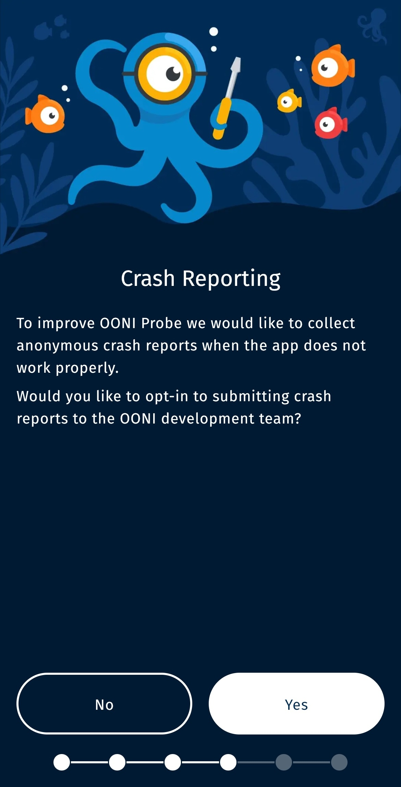
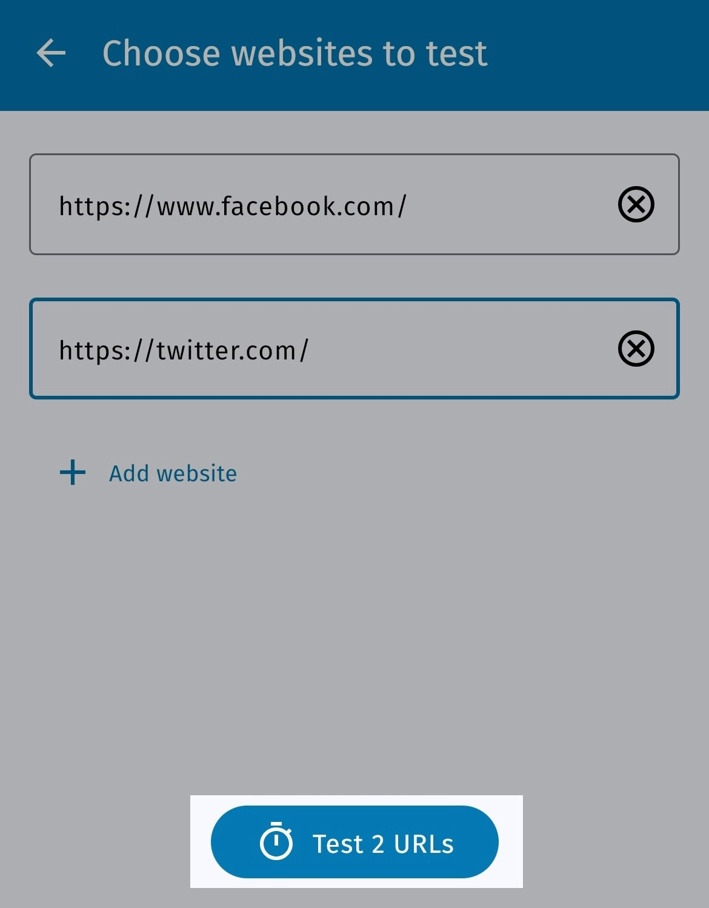
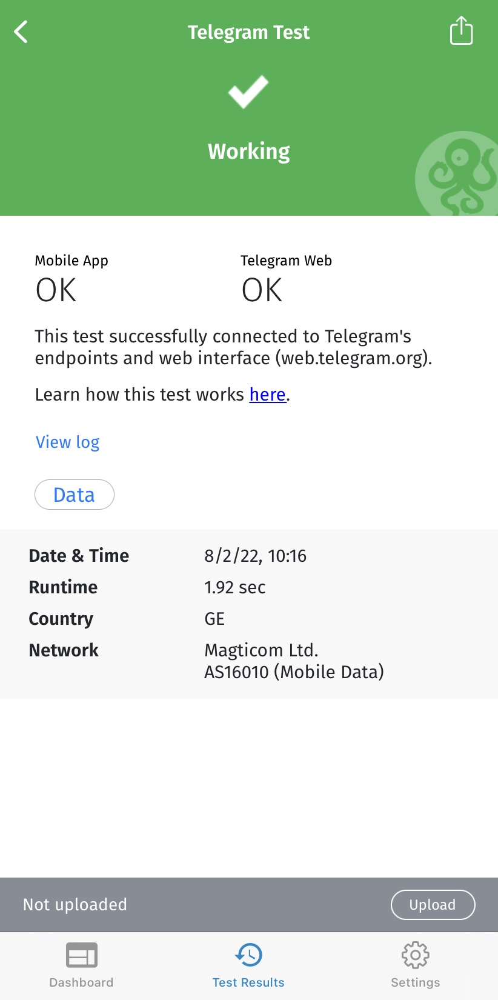
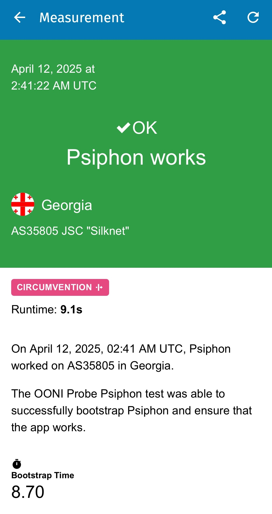
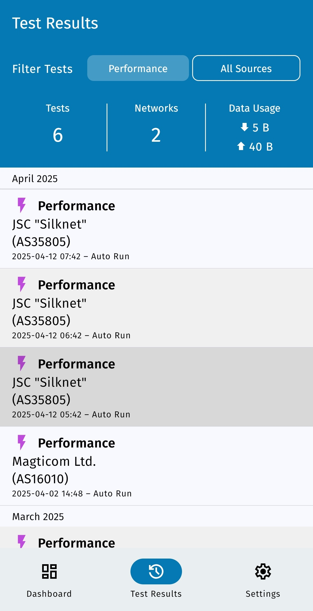
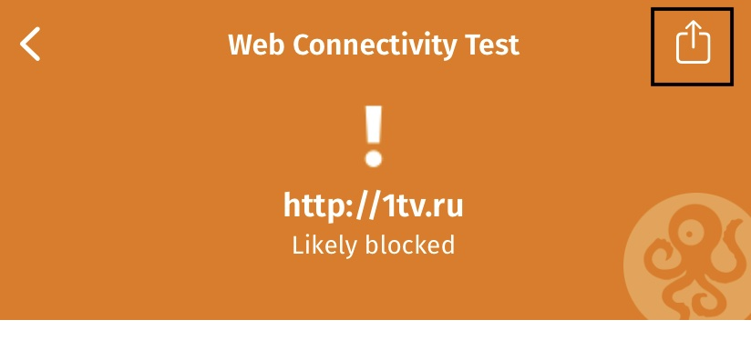
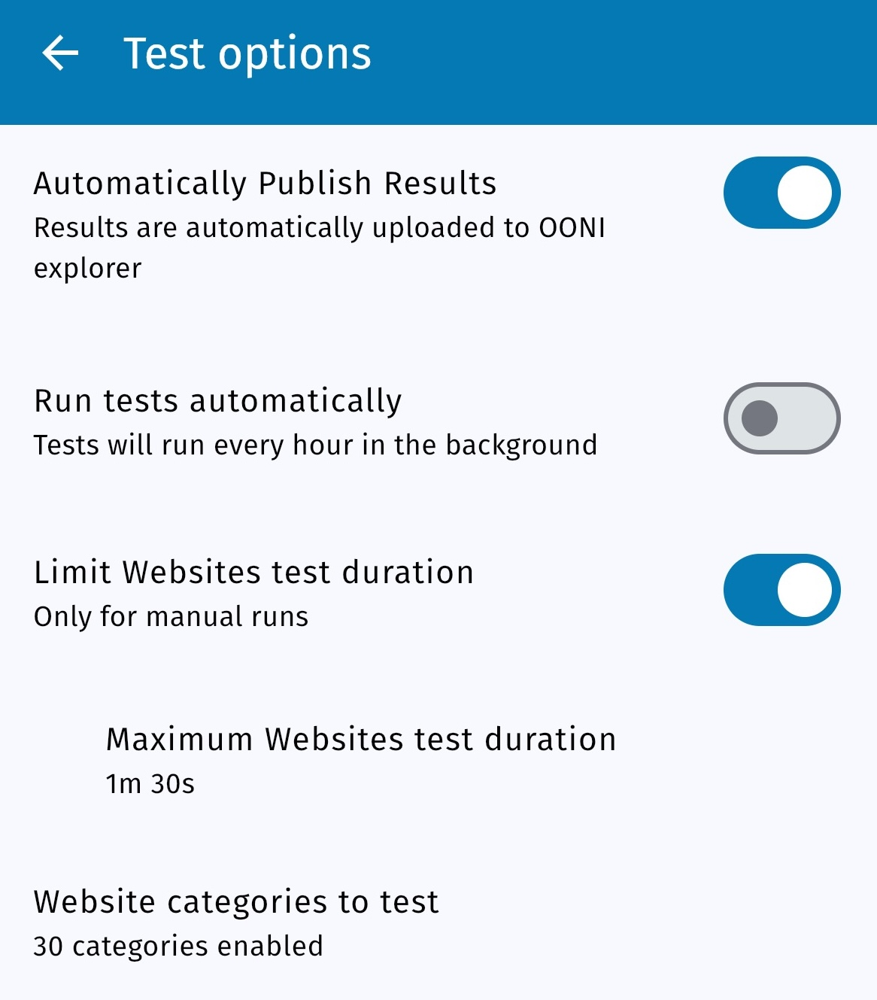
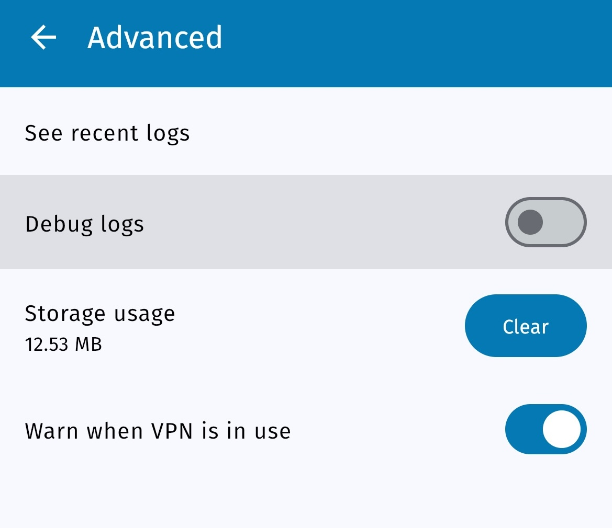
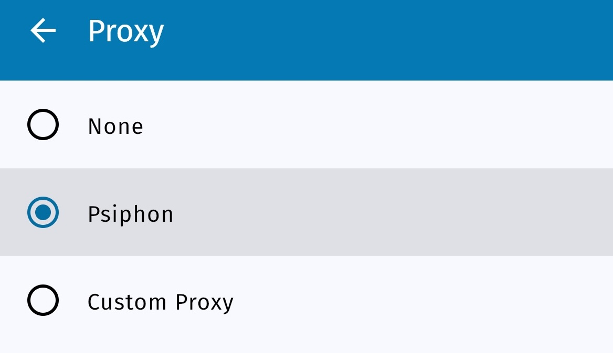

**Zuletzt aktualisiert:** 6 September 2022

**OONI Probe Mobile Version:** 3.7.1

Wir sind Curtis Baltimore sehr dankbar für die Übersetzung dieses Dokuments.

{{}}

OONI Probe ist eine [kostenlose und quelloffene](https://github.com/ooni/probe) App, mit der du Internet-Zensur und andere Formen von Netzwerkstörungen messen kannst. Dieses Benutzerhandbuch enthält **Schritt-für-Schritt-Anweisungen** zur Installation, Ausführung und Anpassung der [OONI Probe Mobile App](https://ooni.org/install/mobile).

**Was dir dieses Handbuch bietet:**

* Erfahre, wie du OONI Probe Mobile verwenden kannst, um:
  * die Blockierung von Webseiten zu testen
  * die Blockierung von Instant Messaging-Apps zu testen
  * die Blockierung von Umgehungstools zu testen
  * die Geschwindigkeit und Performance deines Netzwerks zu testen
* deine OONI-Probe-Tests an Websites deiner Wahl anzupassen
* Erfahre, wie du auf deine OONI-Probe-Testergebnisse zugreifen und sie weitergeben kannst
* Konfiguriere die Einstellungen deiner OONI Probe App

Wir hoffen, dass du dich nach der Lektüre dieses Leitfadens motiviert fühlst, dein Wissen und deine Fähigkeiten über OONI Probe mit anderen zu teilen!

Das folgende Inhaltsverzeichnis soll dir bei der Navigation durch das Handbuch helfen.



## Einführung zu OONI Probe

OONI Probe ist [freie und quelloffene Software](https://github.com/ooni/probe), die zur Messung von Internetzensur und anderen Formen der Netzstörung entwickelt wurde. Seit 2012 wird diese Software vom [Open Observatory of Network Interference (OONI)](https://ooni.org/) entwickelt, einem gemeinnützigen Projekt, das ursprünglich aus dem [Tor-Projekt](https://www.torproject.org/) hervorgegangen ist.

Mit der OONI Probe App (verfügbar für die Plattformen [Mobile](https://ooni.org/install/mobile) und [Desktop](https://ooni.org/install/desktop)) kannst du [Netzwerkmessungstests](https://ooni.org/nettest/) durchführen, um Folgendes zu überprüfen:

* Blockierung von [Websites](https://ooni.org/nettest/web-connectivity/);
* Blockierung von Instant Messaging Apps ([WhatsApp](https://ooni.org/nettest/whatsapp/), [Facebook Messenger](https://ooni.org/nettest/facebook-messenger/), [Telegram](https://ooni.org/nettest/telegram/), [Signal](https://ooni.org/nettest/signal));
* Blockierung von Umgehungstools ([Tor](https://ooni.org/nettest/tor/), [Tor Snowflake](https://ooni.org/nettest/tor-snowflake/), [Psiphon](https://ooni.org/nettest/psiphon/));
* Vorhandensein von Systemen mit ([Middleboxen](https://ooni.org/nettest/http-header-field-manipulation/)) in deinem Netzwerk, die für Zensur und/oder Überwachung verantwortlich sein könnten;
* [Geschwindigkeit und Leistung](https://ooni.org/nettest/ndt/) deines Netzwerks und [Leistung deines Video-Streamings](https://ooni.org/nettest/dash/).

Sobald du OONI Probe ausführst, werden deine Testergebnisse automatisch an die OONI-Server gesendet, [verarbeitet](https://github.com/ooni/pipeline) und [veröffentlicht](https://ooni.org/data/), und zwar fast in Echtzeit (es sei denn, du hast die Veröffentlichung deiner Testergebnisse abgelehnt).

OONI [veröffentlicht die Ergebnisse der OONI-Probe-Tests](https://ooni.org/data/), die aus der ganzen Welt zusammengetragen wurden, um:

* die **Transparenz der Internet-Zensur** weltweit zu erhöhen;
* **Beweise für Internet-Zensur** und andere Formen der Netzbeeinflussung zu teilen;
* die **unabhängige Überprüfung** von OONI-Zensurergebnissen zu ermöglichen;
* **reproduzierbare Forschung** zu unterstützen;
* **Forschung, Politik, Recht und Interessenvertretung** in der ganzen Welt zu unterstützen;
* die **öffentliche Debatte** über die Informationskontrolle zu unterstützen.

Um der öffentlichen Zugang zu den Testergebnissen von OONI-Probe (allgemein als “Messungen” bezeichnet) zu ermöglichen, stellt das OONI-Team diese auf [OONI Explorer](https://explorer.ooni.org/) zur Verfügung: eine Webplattform, die Diagramme auf der Grundlage der Messabdeckung und ein Suchwerkzeug zur Erkundung der Messungen bietet.

Der [OONI Explorer](https://explorer.ooni.org/) beherbergt mehr als 850 Millionen Netzwerkmessungen, die seit 2012 von 24'500 Netzwerken in 241 Ländern und Territorien gesammelt wurden, und ist damit wahrscheinlich die **größte globale, offene Datenquelle zu Internetzensur**.

Wenn du OONI Probe ausführst, wirst du:

* erfahren, ob und wie dein Internetdienstanbieter (ISP) den Zugriff auf bestimmte Websites und Anwendungen zensiert;
* Messungen beitragen, die öffentlich archiviert werden und es der weltweiten Commnity für Internetfreiheit ermöglichen, Internet-Zensur zu überwachen, zu erkennen und zu bekämpfen.

Dieser Leitfaden soll dich durch die Benutzung der [OONI Probe Mobile App](https://ooni.org/install/mobile) führen, damit du dich einer globalen Gemeinschaft anschließen kannst, die die Internetzensur misst.

### Haftungsausschluss

Da OONI Probe zur Messung der Internetzensur entwickelt wurde, kann die Ausführung für manche Menschen in manchen Ländern [riskant](https://ooni.org/about/risks/) sein.

Einige Dinge sollten berücksichtigt werden:

* **OONI Probe ist kein Werkzeug zum Schutz der Privatsphäre.** Jeder, der deine Internet-Aktivitäten überwacht (z.B. Regierung, Internetdienstanbieter, Arbeitgeber), kann sehen, dass du OONI Probe verwendest (genauso wie sie wahrscheinlich jede andere Software sehen können, die du verwendest).
* **OONI Probe ist ein Ermittlungsinstrument.** Einige OONI Probe-Tests sind ausdrücklich dazu gedacht, Internet-Zensur aufzudecken.
* **[Dein Bedrohungsmodell](https://www.eff.org/keeping-your-site-alive/evaluating-your-threat-model).** Ein profilierter Aktivist, der bereits stark überwacht wird, könnte beispielsweise mehr Aufmerksamkeit auf sich ziehen, wenn er OONI Probe laufen lässt.
* **Die Gesetze und Vorschriften des Landes, von dem aus du OONI Probe betreibst.** Am besten konsultierst du einen Anwalt vor Ort.
* **Die Arten von Websites, die du testest.** Du kannst mit OONI Probe (in einigen Ländern) gesetzlich verbotene, provokative oder anstößige [Websites](https://ooni.org/support/faq/#which-websites-will-i-test-for-censorship-with-ooni-probe) testen.
* **Die Arten von OONI-Probe-Tests, die du durchführst.** Nicht alle [OONI-Probe-Tests](https://ooni.org/nettest/) haben das gleiche Gewicht in Bezug auf das potenzielle Risiko. OONI Probe enthält zum Beispiel den [NDT-Test](https://ooni.org/nettest/ndt/) (zur Messung der Geschwindigkeit und Leistung eines Netzwerks), der im Vergleich zu anderen Tests zur Messung der Sperrung von Websites oder Apps als weniger politisch oder kontrovers angesehen werden kann.
* **Ob du deine Messungen veröffentlichst oder nicht.** OONI [veröffentlicht die Messungen offen](https://ooni.org/data/), die von OONI Probe-Benutzern gesammelt wurden, um die Transparenz der Internetzensur auf der ganzen Welt zu erhöhen. Wir tun unser Bestes, um deine IP-Adresse oder andere potentiell persönlich identifizierbare Informationen nicht zu veröffentlichen. Erfahre mehr in unserer [Datenrichtlinie](https://ooni.org/about/data-policy).

Um mehr über mögliche Risiken im Zusammenhang mit der Verwendung von OONI Probe zu erfahren, lies bitte unsere entsprechende [Dokumentation](https://ooni.org/about/risks/).

## Installiere OONI Probe Mobile

Die OONI Probe Mobile App ist verfügbar für [Android](https://play.google.com/store/apps/details?id=org.openobservatory.ooniprobe), [F-Droid](https://f-droid.org/repository/browse/?fdid=org.openobservatory.ooniprobe), und [iOS](https://apps.apple.com/us/app/ooni-probe/id1199566366).

Du kannst die OONI Probe Mobile App durch die folgenden Schritte installieren:

**Schritt 1.** Besuche die OONI Probe Mobile Installationsseite (auf der OONI Website): <https://ooni.org/install/mobile>

{{}}

**Schritt 2.** Tippe je nach Betriebssystem (Android, iOS, F-Droid) auf die entsprechende App Store-Schaltfläche.

{{}}

**Schritt 3.** Installiere die OONI Probe Mobile App (aus deinem App Store).

{{}}

**Schritt 4.** Öffne deine OONI Probe Mobile App.

{{}}

### Einführung: Informierte Zustimmung

Nachdem du deine OONI Probe Desktop-App nun installiert und geöffnet hast, werden dir im Rahmen des Einführungsprozesses einige grundlegende Informationen über OONI Probe angezeigt. 

Du wirst auch über [potenzielle Risiken](https://ooni.org/about/risks/) im Zusammenhang mit dem Betrieb von OONI Probe informiert. Um sicherzustellen, dass du diese potenziellen Risiken verstehst, haben wir ein kurzes Quiz beigefügt, um deine korrekte Zustimmung zu erhalten. Die richtige Beantwortung der Quizfragen ist eine Voraussetzung für die Nutzung von OONI Probe.

Im letzten Schritt des Einführungsprozesses teilen wir mit dir die Arten von Daten, die standardmäßig bei der Ausführung von OONI Probe gesammelt werden (für weitere Informationen verweisen wir auf unsere [Daten-Richtlinie](https://ooni.org/about/data-policy)). Du kannst dich für die Freigabe von Absturzberichten entscheiden, um uns bei der Verbesserung von OONI Probe zu helfen.

Im Folgenden führen wir dich durch den Einführungsprozess.

**Schritt 1.** Sobald du die grundlegenden Informationen über OONI Probe gelesen hast, tippe auf **Verstanden**.

{{}}

**Schritt 2.** Der nächste Bildschirm zeigt eine Zusammenfassung der potenziellen Risiken, die mit der Ausführung von OONI Probe verbunden sind. Klicke auf **Mehr erfahren**, um unsere [Dokumentation](https://ooni.org/about/risks/) zu lesen, in der mögliche Risiken erläutert werden.

{{}}

**Schritt 3.** Wenn du dich über die potentiellen Risiken im Zusammenhang mit dem Betrieb von OONI Probe informiert hast, klicke auf **Ich verstehe**.

{{}}

**Schritt 4.** Das folgende Quiz basiert auf den Informationen, die du gerade im vorherigen Bildschirm gelesen hast. Tippe auf **Wahr**, um zu zeigen, dass du die Aussage verstanden hast.

{{}}

Du wirst sehen, dass **Wahr** die richtige Antwort ist. Wenn du auf Falsch klickst, erhältst du eine Erklärung, warum die Antwort falsch ist.

{{}}

**Schritt 5.** Klicke auf **Wahr**, um zu zeigen, dass du die Aussage verstanden hast (im zweiten Teil des Quiz).

{{}}

Du wirst sehen, dass **True** die richtige Antwort ist. Wenn du auf Falsch klickst, erhältst du eine Erklärung, warum die Antwort falsch ist.

{{}}

**Schritt 6.** Wenn du möchtest, dass die App die Messungen automatisch erfasst, tippe auf die Schaltfläche **Klingt toll**.

{{}}

**Schritt 7.** Wenn du [Absturzberichte](https://ooni.org/about/data-policy#data-we-collect) teilen möchtest, um uns bei der Verbesserung von OONI Probe zu helfen, tippe auf **Ja**.

{{}}

**Schritt 8.** Der folgende Bildschirm enthält Informationen über die Datentypen, die OONI (jedes Mal, wenn du OONI Probe ausführst) standardmäßig sammelt und veröffentlicht. Du kannst mehr erfahren, indem du auf **[OONI's Datenrichtlinie](https://ooni.org/about/data-policy)** auf dem Bildschirm tippst.

{{}}

**Schritt 9.** Tippe **OK**.

Du hast nun den Einführungsprozess abgeschlossen und bist bereit, OONI Probe zu nutzen!

## OONI Probe Mobile ausführen

Nun, da du den Einführungsprozess abgeschlossen hast, kannst du mit OONI Probe beginnen, um die Internetzensur zu messen!

Das **Dashboard** der OONI Probe Mobile App enthält 5 Karten, von denen jede OONI Probe Tests beinhaltet:

* **Websites-Karte** Enthält den [Web-Konnektivitätstest](https://ooni.org/nettest/web-connectivity/) von OONI, der die [Sperrung von Websites](https://ooni.org/support/faq/#which-websites-will-i-test-for-censorship-with-ooni-probe) misst.
* **Instant Messaging card.** Beinhaltet OONI's [WhatsApp](https://ooni.org/nettest/whatsapp/), [Facebook Messenger](https://ooni.org/nettest/facebook-messenger/), [Telegram](https://ooni.org/nettest/telegram/), und [Signal](https://ooni.org/nettest/signal) Tests, die überprüfen, ob diese Apps blockiert sind.
* **Umgehungskarte** Enthält OONI's [Tor](https://ooni.org/nettest/tor/) und [Psiphon](https://ooni.org/nettest/psiphon/) Tests, die prüfen, ob diese Zensurumgehungstools blockiert sind.
* **Leistungskarte** Enthält den [NDT-Geschwindigkeitstest](https://ooni.org/nettest/ndt/), den [DASH-Videostreaming-Leistungstest](https://ooni.org/nettest/dash/) und OONIs [Middlebox](https://ooni.org/support/glossary/#middlebox) Tests, sowie die ([HTTP Header Field Manipulation](https://ooni.org/nettest/http-header-field-manipulation/) und [HTTP Invalid Request Line](https://ooni.org/nettest/http-invalid-request-line/) Tests).
* **Experimental Karte.** Enthält mehrere neue experimentelle Tests, die vom OONI-Team entwickelt wurden. Diese Tests können sich im Laufe der Zeit ändern. Du kannst diese Tests [hier](https://github.com/ooni/spec/tree/master/nettests) sehen.

**Schritt 1.** Tippe **Ausführen** um deine ersten OONI Probe Tests auszuführen.

{{}}

Sobald du "Ausführen" tippst, werden **alle** OONI Probe-Tests (auf allen Karten enthalten) in einem Durchgang ausgeführt!

{{}}

Wenn du auf die **Laufende Zeile** tippst, öffnet sich das Vollbildfenster mit **Laufende Tests**:

{{}}

{{}}

{{}}

{{}}

{{}}

OONI Probe sollte alle Tests innerhalb weniger Minuten durchgeführt haben (dies hängt jedoch von der Leistung des Netzwerks ab, mit dem du verbunden bist, und kann in einigen Fällen länger dauern). Wenn die Leistung deines Netzwerks nicht gut genug ist und die Tests zu lange dauern, kannst du **den laufenden Test anhalten**, indem du auf die Schaltfläche **Test stoppen** in der oberen rechten Ecke klickst.

{{}}

Sobald die Tests beendet sind, werden deine OONI Probe Testergebnisse automatisch auf [OONI Explorer](https://explorer.ooni.org/) und auf der [OONI API](https://api.ooni.io/) veröffentlicht.

Möchtest du deine Tests lieber auf einen bestimmten Testtyp (Karte) beschränken? In den folgenden Abschnitten findest du Anleitungen, wie du das machen kannst.

### Messe die Blockierung von Webseiten

Wenn du nur die Sperrung von Websites messen willst, kannst du dies mit den folgenden Schritten tun:

**Schritt 1.** Tippe auf die Karte **Websites** im Dashboard deiner OONI Probe Mobile App.

{{}}

**Schritt 2.** Tippe auf **Ausführen** auf der Website-Karte.

{{}}

Du führst jetzt den [Web-Konnektivitätstest](https://ooni.org/nettest/web-connectivity/) von OONI aus, um die Blockierung von Websites zu messen.

{{}}

Deine OONI Probe Testergebnisse werden automatisch auf [OONI Explorer](https://explorer.ooni.org/) und auf der [OONI API](https://api.ooni.io/) veröffentlicht.

**Welche Websites werden getestet?**

Standardmäßig wirst du Websites testen, die in den folgenden 2 Listen enthalten sind:

* **[Globale Testliste](https://github.com/citizenlab/test-lists/blob/master/lists/global.csv)**. Enthält international relevante Websites (z. B. facebook.com).
* **[Länderspezifische Testliste](https://github.com/citizenlab/test-lists/tree/master/lists)**. Enthält Websites, die nur für das Land relevant sind, in dem du OONI Probe ausführst.

Unabhängig davon, von welchem Land aus du OONI Probe ausführst, testest du *immer* Websites aus der [globalen Testliste](https://github.com/citizenlab/test-lists/blob/master/lists/global.csv).

OONI Probe bestimmt automatisch, welche [länderspezifische Liste](https://github.com/citizenlab/test-lists/tree/master/lists) für den Test ausgewählt wird, basierend auf dem Land, in dem du OONI Probe ausführst. Wenn du zum Beispiel OONI Probe in Brasilien ausführst, wirst du Webseiten aus der globalen Testliste und aus der brasilianischen Testliste testen. Wenn du nach Deutschland reist und OONI Probe ausführst, werden die Webseiten aus der globalen und der deutschen Testliste getestet. Wenn du OONI Probe jedoch von einem Land aus startest, das noch keine länderspezifische Testliste hat (weil sie noch nicht erstellt wurde), wirst du nur Websites aus der globalen Liste testen.

Wenn du zu den [Citizen Lab Testlisten](https://github.com/citizenlab/test-lists/tree/master/lists) (welche die von OONI Probe-Benutzern weltweit getesteten Standard-Websites enthalten) beitragen möchtest, lies bitte unsere entsprechende [Dokumentation](https://ooni.org/get-involved/contribute-test-lists) oder benutze unseren [Testlisten-Editor](https://test-lists.ooni.org/).

**Hinweis:** Damit du nicht dein gesamtes mobiles Datenvolumen verbrauchst, testet OONI Probe **nur so viele Websites, wie es innerhalb von 90 Sekunden** testen kann, wenn du auf “Ausführen” klickst (entweder vom Dashboard oder von der Websites-Karte). Diese Websites (die innerhalb von 90 Sekunden getestet werden) werden nach dem Zufallsprinzip aus den [globalen](https://github.com/citizenlab/test-lists/blob/master/lists/global.csv) und (relevanten) [länderspezifischen](https://github.com/citizenlab/test-lists/tree/master/lists) Testlisten ausgewählt. Jedes Mal, wenn du auf “Ausführen” klickst, testest du innerhalb von 90 Sekunden eine andere, zufällige Auswahl von Websites (aus der globalen und der länderspezifischen Testliste). Je öfter du also auf “Ausführen” klickst, desto mehr Websites wirst du testen.

Wenn du eine größere Auswahl an Websites testen möchtest oder ganz andere Websites testen willst, lies bitte den Abschnitt **Anpassen von Website-Tests** in diesem Leitfaden.

### Messe das Blockieren von Instant Messaging-Apps

Wenn du nur die Sperrung von Instant-Messaging-Apps messen willst, kannst du dies mit den folgenden Schritten tun:

**Schritt 1.** Tippe auf die Karte **Instant Messaging** im Dashboard deiner OONI Probe Mobile App.

{{}}

**Schritt 2.** Tippe auf **Ausführen** in der Instant Messaging-Karte.

{{}}

Du führst jetzt die OONI-Tests [WhatsApp](https://ooni.org/nettest/whatsapp/), [Facebook Messenger](https://ooni.org/nettest/facebook-messenger/), [Telegram](https://ooni.org/nettest/telegram/) und [Signal](https://ooni.org/nettest/signal) durch, um die Blockierung dieser Apps zu messen.

{{}}

Deine OONI Probe Testergebnisse werden automatisch auf [OONI Explorer](https://explorer.ooni.org/) und auf der [OONI API](https://api.ooni.io/) veröffentlicht.

Wenn du deine Tests nur auf WhatsApp, Facebook Messenger, Telegram oder Signal beschränken möchtest, lies bitte den Abschnitt **Konfiguration deiner OONI Probe-Einstellungen** in diesem Handbuch.

### Messung der Blockierung von Umgehungstools

Wenn du nur die Sperrung von Tools zur Umgehung der Zensur messen willst, kannst du dies mit den folgenden Schritten tun:

**Schritt 1.** Tippe auf die Karte **Umgehung** im Dashboard deiner OONI Probe Mobile-App.

{{}}

**Schritt 2.** Tippe auf **Ausführen** auf der Umgehungskarte.

{{}}

Du führst jetzt OONIs [Tor](https://ooni.org/nettest/tor/) und [Psiphon](https://ooni.org/nettest/psiphon/) Tests durch, um die Erreichbarkeit dieser Tools zu messen.

{{}}

Deine OONI Probe Testergebnisse werden automatisch auf [OONI Explorer](https://explorer.ooni.org/) und auf der [OONI API](https://api.ooni.io/) veröffentlicht.

Wenn du deine Tests nur auf Tor oder Psiphon beschränken möchtest, lies bitte den Abschnitt **Konfiguration der OONI-Probe-Einstellungen** in dieser Anleitung.

### Messung der Netzwerkleistung

Wenn du nur die Leistung des Netzwerks messen willst, kannst du dies mit den folgenden Schritten tun:

**Schritt 1.** Tippe auf die Karte **Leistung** im Dashboard deiner OONI Probe Mobile-App.

{{}}

**Schritt 2.** Tippe auf **Ausführen** in der Leistungskarte.

{{}}

Du führst jetzt den [NDT-Geschwindigkeitstest](https://ooni.org/nettest/ndt/), den [DASH-Videostreaming-Leistungstest](https://ooni.org/nettest/dash/) und OONIs [Middlebox](https://ooni.org/support/glossary/#middlebox) Tests sowie die ([HTTP Header Field Manipulation](https://ooni.org/nettest/http-header-field-manipulation/) und [HTTP Invalid Request Line](https://ooni.org/nettest/http-invalid-request-line/) Tests) durch.

{{}}

Deine OONI Probe-Testergebnisse werden automatisch auf [OONI Explorer](https://explorer.ooni.org/) und auf der [OONI API](https://api.ooni.io/) veröffentlicht.

**Haftungsausschluss:** Die Tests [NDT](https://ooni.org/nettest/ndt/) und [DASH](https://ooni.org/nettest/dash/) werden gegen Server Dritter durchgeführt, die von [Measurement Lab (M-Lab)](https://www.measurementlab.net/) bereitgestellt werden. Wenn du diese Tests durchführst, wird M-Lab deine IP-Adresse zu Forschungszwecken erfassen und veröffentlichen, unabhängig von deinen OONI-Probe-Einstellungen. Erfahre mehr über die Datenschutzbestimmungen von M-Lab in der [Datenschutzerklärung](https://www.measurementlab.net/privacy/). 

Wenn du deine Tests auf einen (oder einige wenige) der auf der Leistungskarte enthaltenen Tests beschränken möchtest, lies bitte den Abschnitt **Konfigurieren deiner Einstellungen der OONI-Probe** in diesem Handbuch.

## Anpassen der Tests deiner Website

Wenn du Websites mit OONI Probe testest, misst du standardmäßig die URLs, die in den [Citizen Lab Testlisten](https://github.com/citizenlab/test-lists/tree/master/lists) enthalten sind. Mit anderen Worten, wenn du einfach auf “Ausführen” tippst (in der Dashboard- oder Websites-Karte der OONI Probe-App), testest du eine zufällige Auswahl von Websites aus den [Citizen Lab Testlisten](https://github.com/citizenlab/test-lists/tree/master/lists). Diese Listen wurden in Zusammenarbeit mit Forschern und Experten in den jeweiligen Ländern erstellt. Da sie [auf GitHub](https://github.com/citizenlab/test-lists/tree/master/lists) offen zugänglich sind, kann jeder sie überprüfen, URLs [beitragen](https://ooni.org/get-involved/contribute-test-lists) und die Entfernung bestimmter URLs vorschlagen. Und es ist wichtig, dass wir diese Listen weiterhin [überprüfen und aktualisieren](https://ooni.org/get-involved/contribute-test-lists), da sie die Websites enthalten, die von den meisten OONI-Probe-Nutzern auf der ganzen Welt regelmäßig getestet werden.

Wenn du deine Tests jedoch lieber auf Websites deiner Wahl beschränken möchtest, kannst du dies über die OONI Probe Mobile App tun.

Du kannst deine Website-Tests auf die folgenden Arten anpassen:

* Beschränke deine Tests auf **bestimmte Website-Kategorien** (z. B. Nachrichtenmedien und Menschenrechtsinhalte);
* Teste nur **Websites, die dir wichtig sind**;
* Teste **deine eigene Liste**;
* Teste *alle* URLs in den ([relevanten](https://ooni.org/support/faq/#which-websites-will-i-test-for-censorship-with-ooni-probe)) [Citizen Lab Testlisten](https://github.com/citizenlab/test-lists/tree/master/lists) (anstatt eine zufällige Auswahl von Websites in 90 Sekunden zu testen); 

In den folgenden Abschnitten wird erläutert, wie du jede der oben genannten Aktionen durchführen kannst.

### Testen bestimmter Website-Kategorien

Wenn du in der OONI Probe App auf “Ausführen” tippst, testest du Websites aus den [globalen](https://github.com/citizenlab/test-lists/blob/master/lists/global.csv) und ([relevanten](https://ooni.org/support/faq/#which-websites-will-i-test-for-censorship-with-ooni-probe)) [länderspezifischen Citizen Lab Testlisten](https://github.com/citizenlab/test-lists/tree/master/lists).

Diese Websites wurden anhand von [30 standardisierten Kategorien](https://ooni.org/get-involved/contribute-test-lists/#what-are-test-lists) kategorisiert. Diese Kategorien reichen von Nachrichtenmedien, Kultur und Menschenrechtsthemen bis hin zu eher provokativen oder anstößigen Kategorien wie Pornografie (letztere werden einbezogen, weil sie mit größerer Wahrscheinlichkeit blockiert werden, was die Aufdeckung von Zensurtechniken der Internetanbieter ermöglicht).

Standardmäßig sind alle 30 Kategorien in der OONI Probe Mobile App aktiviert, um das Testen von mehr verschiedenen Websites zu fördern und die Möglichkeit zu erhöhen, mehr Formen der Website-Zensur zu entdecken.

Wenn du dich jedoch nicht wohl dabei fühlst, alle 30 Kategorien von Websites zu testen (insbesondere, wenn sie Inhalte enthalten, die in deinem Land illegal, provokativ oder anstößig sind), oder wenn du nur daran interessiert bist, bestimmte Arten von Inhalten zu testen (z. B. Nachrichtenmedien), kannst du deine OONI Probe-Tests auf die Website-Kategorien deiner Wahl beschränken.

**Schritt 1.** Tippe auf **Einstellungen** in der unteren Navigationsleiste deiner OONI Probe Mobile App.

{{}}

**Schritt 2.** Tippe in den Einstellungen auf **Testoptionen**.

{{}}

**Schritt 3.** Tippe auf **Websites** (in der Einstellung “Testoptionen”).

{{}}

**Schritt 4.** Tippe auf **zu testende Website-Kategorien** (im Abschnitt “Websites” der Einstellung “Testoptionen”).

{{}}

Du siehst nun die [30 Kategorien](https://github.com/citizenlab/test-lists/blob/master/lists/00-LEGEND-new_category_codes.csv) von Websites, die OONI Probe standardmäßig testet. Alle diese Kategorien sind aktiviert.

{{}}

**Schritt 5.** **Deaktiviere** die Website-Kategorien, die du **nicht** testen möchtest.

{{}}

Im obigen Beispiel haben wir 5 Kategorien deaktiviert ("LGBTQI", "Politische Kritik", "Pornografie", “Provokative Bekleidung”, "Religion").

Wenn du zurückgehst, kannst du sehen, dass nur noch 25 Kategorien aktiviert sind (da 5 deaktiviert wurden).

{{}}

Du kannst diese Einstellung jederzeit wieder aufrufen, um die Website-Kategorien deiner Wahl zu aktivieren oder zu deaktivieren.

### Testen von Websites deiner Wahl

Du kannst die Websites, die dich interessieren, direkt mit den folgenden Schritten testen:

**Schritt 1.** Tippe auf die Karte **Websites** in deiner OONI Probe Mobile App.

{{}}

**Schritt 2.** Tippe auf die Schaltfläche **Websites auswählen** auf der Karte Websites.

{{}}

Du siehst nun einen Bildschirm, auf dem du die Website(s), die du testen möchtest, hinzufügen kannst.

{{}}

**Schritt 3.** **Tippe die URL** der Website, die du testen möchtest. Im folgenden Beispiel haben wir `https://www.facebook.com` eingegeben.

{{}}

**Wichtig:** Bitte stelle sicher, dass die [URL](https://ooni.org/support/glossary/#url) korrekt eingegeben wird. Wenn sie falsch eingegeben wird, testet OONI Probe *nicht* die beabsichtigte Website und dies führt möglicherweise zu fehlerhaften Testergebnissen.

Ein paar Dinge sind zu beachten:

* Läuft die Website über **HTTP** oder **HTTPS**? Wenn letzteres, füge bitte ein zusätzliches `s` nach `http` ein.
* Enthält die [Domain](https://ooni.org/support/glossary/#domain-name) `www`? Wenn ja, füge es bitte ein.

Um sicherzustellen, dass eine [URL](https://ooni.org/support/glossary/#url) korrekt eingegeben wird, **prüfe bitte, wie sie bei einem Zugriff über einen normalen Browser** erscheint.

**Schritt 4.** Tippe auf das Pluszeichen, um eine neue Zeile für das Hinzufügen einer weiteren Website zum Testen zu erstellen.

**Schritt 5.** **Gib eine andere URL** ein, die du testen möchtest. Im folgenden Beispiel haben wir `https://twitter.com` hinzugefügt.

{{}}

Wenn du deine Meinung änderst und eine der von dir hinzugefügten URLs entfernen möchtest, kannst du dies tun, indem du auf das rote Symbol neben jeder URL tippst.

Du kannst so viele URLs hinzufügen, wie du willst. Im folgenden Beispiel haben wir `https://www.gutenberg.org` hinzugefügt.

{{}}

**Schritt 6.** Tippe auf **Ausführen**, um alle von dir hinzugefügten Websites zu testen.

Du wirst nun sehen, wie OONI Probe die Webseiten deiner Wahl testet!

{{}}

Deine OONI Probe Testergebnisse werden automatisch auf [OONI Explorer](https://explorer.ooni.org/) und auf der [OONI API](https://api.ooni.io/) veröffentlicht.

### Testen einer benutzerdefinierten Liste von Websites

Das manuelle Hinzufügen von URLs, eine nach der anderen (über die Schaltfläche “Websites auswählen” der mobilen OONI Mobile Probe-App), kann potenziell mühsam sein -- insbesondere, wenn es um mehr als ein Dutzend URLs geht. Forscher sind oft daran interessiert, ihre eigene Liste von Websites zu testen, die Hunderte von URLs umfassen kann.

Du kannst deine eigene Liste von Websites mit den folgenden Schritten testen:

**Schritt 1.** Stelle deine Liste von Websites in einem Texteditor zusammen, wobei jede URL in einer eigenen Zeile steht. Nachfolgend findest du ein Beispiel.

{{}}

**Wichtig:** Bitte stelle sicher, dass jede [URL](https://ooni.org/support/glossary/#url) korrekt eingegeben wird. Wenn sie falsch eingegeben wird, testet OONI Probe die beabsichtigte Website *nicht*, und dies führt möglicherweise zu ungenauen Testergebnissen.

Ein paar Dinge sind zu beachten:

* Läuft die Website über **HTTP** oder **HTTPS**? Wenn letzteres, füge bitte ein zusätzliches `s` nach `http` ein.
* Enthält die [Domain](https://ooni.org/support/glossary/#domain-name) `www`? Wenn ja, füge es bitte ein.
* Wenn die Website über HTTPS läuft (z. B. `https://www.hrw.org/`), musst du wahrscheinlich keine Webseite angeben (z. B. `https://www.hrw.org/publications`), da Internetanbieter die Sperrung normalerweise nicht auf eine bestimmte Webseite beschränken können, wenn diese über HTTPS gehostet wird. Vielmehr müssten sie den Zugriff auf die gesamte Website sperren.

Um sicherzustellen, dass jede [URL](https://ooni.org/support/glossary/#url) korrekt eingegeben wird, **kopiere sie bitte mit Copy-Paste aus einem Browser ein.**

**Schritt 2.** **Kopiere** deine Liste der URLs (aus deinem Texteditor).

**Schritt 3.** Besuche die **OONI Run** Website: https://run.ooni.org/

{{}}

**Schritt 4** **Wähle** `http://` im ersten URL-Slot der OONI Run Seite (um ein doppeltes `http` in der Formatierung deiner ersten URL zu vermeiden).

{{}}

**Schritt 5.** **Einfügen** deiner Liste von URLs in den ersten URL Slot der OONI Run Seite.

Du solltest nun sehen, dass alle deine URLs jede URL-Zeile auf der Seite [OONI Run](https://run.ooni.org/) ausgefüllt haben.

{{}}

Wenn du leere Zeilen (oder anderweitig falsch formatierte URLs) bemerkst, lösche sie bitte, indem du auf das **Löschsymbol** klickst.

{{}}

**Schritt 6.** Klicke am Ende der Liste auf die Schaltfläche **Erstellen**.

{{}}

Es erscheint nun das folgende Pop-up-Fenster.

{{}}

Du hast einen **OONI Run mobile deep link** für das Testen deiner Liste von Websites erstellt.

**Schritt 7.** **Kopiere** den erzeugten Link entweder durch:

* Klicken auf den Link unter “**Teile diese URL mit deinen Freunden**”, Drücken von Strg+A, um den gesamten Link auszuwählen, und anschließend Drücken von Strg+C, um ihn zu kopieren; oder
* Klicken mit der rechten Maustaste auf die **Schaltfläche Link** und Auswahl von “Linkadresse kopieren”.

{{}}

**Schritt 8.** Da du all diese Schritte wahrscheinlich von deinem Desktop aus durchführst, **teilst du den kopierten Link** **mit deinem Mobiltelefon** (so dass du den Link anschließend mit deiner OONI Probe Mobile App öffnen kannst). Du kannst diesen Link auch mit anderen OONI Probe-Benutzern teilen, wenn du möchtest, dass sie deine Liste von Websites ebenfalls testen.

**Schritt 9.** **Tippe** auf den Link OONI Run von deinem mobilen Gerät aus.

{{}}

**Schritt 10.** **Öffne** den Link mit deiner **OONI Probe Mobile App** (nicht mit einem Webbrowser).

{{}}

Du solltest nun deine Liste von Websites in deiner OONI Probe Mobile App sehen.

{{}}

**Schritt 11.** Tippe auf **Ausführen**, um deine Liste von Websites zu testen.

{{}}

Deine OONI Probe Testergebnisse werden automatisch auf [OONI Explorer](https://explorer.ooni.org/) und auf der [OONI API](https://api.ooni.io/) veröffentlicht.

### Testen aller Websites aus den Testlisten des Citizen Labs

Aufgrund von Bandbreitenbeschränkungen testet die mobile OONI Probe-App nur so viele Websites, wie sie innerhalb von 90 Sekunden erreichen kann (basierend auf den Standardeinstellungen).

Wenn du eine WiFi-Verbindung hast und alle Websites aus den ([relevanten](https://ooni.org/support/faq/#which-websites-will-i-test-for-censorship-with-ooni-probe)) [Citizen Lab Testlisten](https://github.com/citizenlab/test-lists/tree/master/lists) in einem Durchgang testen möchtest, kannst du dies mit den folgenden Schritten tun:

**Schritt 1.** Tippe auf **Einstellungen** in der unteren Navigationsleiste deiner OONI Probe Mobile App.

{{}}

**Schritt 2.** Tippe in den Einstellungen auf **Testoptionen**.

{{}}

**Schritt 3.** Tippe auf **Websites** (in der Einstellung “Testoptionen”).

{{}}

Du siehst nun die Einstellungen der OONI Probe Website.

{{}}

**Schritt 4.** Deaktiviere **Testdauer begrenzen** (im Abschnitt “Websites” der Einstellung “Testoptionen”).

{{}}

Es gibt jetzt kein Zeitlimit mehr für deine Website-Tests. Das bedeutet, dass OONI Probe jedes Mal, wenn du auf “Ausführen” tippst, alle Websites testen kann, die in den [relevanten Citizen Lab Testlisten](https://ooni.org/support/faq/#which-websites-will-i-test-for-censorship-with-ooni-probe) enthalten sind.

**Alternativ**: Wenn du mehr Websites innerhalb eines längeren Zeitraums testen möchtest (ohne jedoch unbedingt das Zeitlimit zu deaktivieren und alle Websites zu testen), kannst du dies mit den folgenden Schritten tun:

**Schritt 1.** Tippe auf **Testdauer** (im Abschnitt “Websites” der Einstellung “Testoptionen”).

{{}}

Standardmäßig ist die Testdauer für Websites auf **90 Sekunden** eingestellt. Das bedeutet, dass OONI Probe nur so viele Websites (aus den [relevanten Citizen Lab Testlisten](https://ooni.org/support/faq/#which-websites-will-i-test-for-censorship-with-ooni-probe)) testet, wie es innerhalb von 90 Sekunden erreichen kann.

**Schritt 2.** Um die Testdauer zu ändern, **tippe die Anzahl der Sekunden ein**, die OONI Probe die Webseiten testen soll. Im folgenden Beispiel haben wir `360` eingegeben, womit OONI Probe Websites 6 Minuten lang testen würde.

{{}}

## Zugriff auf deine OONI-Probe-Testergebnisse

Sobald du einen OONI Probe-Test durchführst, kannst du sofort auf die Testergebnisse direkt in deiner OONI Probe Mobile App zugreifen.

**Schritt 1.** Tippe auf **Testergebnisse** in der unteren Navigationsleiste deiner OONI Probe Mobile App.

{{}}

Du bekommst nun einen Überblick über alle deine OONI Probe Testergebnisse.

In dieser Übersicht sind die Testergebnisse nach den 4 thematischen Karten der App gruppiert (“Websites”, “Instant Messaging”, “Umgehung”, “Leistung”).

In jeder thematischen Testergebniskarte hast du einen Überblick über:

* Das **Netzwerk** (z. B. `AS16010` - Magticom Ltd.), in dem jeder Test durchgeführt wurde;
* Das **Datum und die Uhrzeit** der Prüfung (z. B. 22. August 2022 um 12:01 Uhr Ortszeit);
* **Zusammenfassung der relevanten Ergebnisse** (z. B. wurde festgestellt, dass 3 Instant-Messaging-Apps zugänglich waren, während keine blockiert wurde).

Diese Übersicht kann beim Vergleich der Ergebnisse in verschiedenen Netzen hilfreich sein (wenn du Tests in vielen verschiedenen Netzen durchführst) und bietet einen Überblick über die Ergebnisse aus der Vogelperspektive.

Um tiefer in die Materie einzudringen (und auf die entsprechenden Messdaten zuzugreifen), musst du auf die einzelnen Testergebnisse tippen, was wir in den folgenden Abschnitten erklären.

**Löschen von Testergebnissen**

Im oberen Menü (des Bildschirms mit den Testergebnissen) findest du eine Übersicht über:

* Die **Anzahl der OONI-Probe-Tests**, die du bisher durchgeführt hast;
* Die **Anzahl der Netzwerke**, in denen du OONI Probe bisher ausgeführt hast;
* Deine OONI-Probe **Datennutzung**.

{{}}

**Schritt 1.** Wenn du deine OONI Probe Testergebnisse löschen möchtest (zum Beispiel um Speicherplatz zu sparen), **tippe auf das Löschsymbol** in der oberen rechten Ecke.

Mach dir keine Sorgen, dass deine Testergebnisse verloren gehen; sobald du einen OONI-Probe-Test durchführst, werden deine Ergebnisse automatisch auf [OONI Explorer](https://explorer.ooni.org/) und auf der [OONI API](https://api.ooni.io/) in nahezu Echtzeit veröffentlicht. Wenn du die Veröffentlichung deiner Testergebnisse ablehnen möchtest, lies bitte den Abschnitt “Konfigurieren deiner OONI Probe Einstellungen: Datenschutz” in diesem Leitfaden.

Wenn du auf das Löschsymbol tippst, wird das folgende Pop-up-Fenster angezeigt:

{{}}

**Schritt 2** Tippe auf **Löschen**, wenn du alle deine OONI Probe-Testergebnisse löschen möchtest. Andernfalls tippe auf **Abbrechen**.

**Filtern der Testergebnisse**

Auf dem Bildschirm "Testergebnisse" deiner OONI Probe Mobile App werden die Ergebnisse chronologisch dargestellt, wobei die letzten Tests zuerst aufgeführt werden.

{{}}

**Schritt 1.** Wenn du deine Ergebnisse nach einer bestimmten Testkategorie (“Websites”, “Instant Messaging”, “Umgehung”, “Leistung”) filtern möchtest, tippe auf **Alle Tests** (oder “Filter Tests” oder den Pfeil in dieser Zeile).

{{}}

Du erhältst nun ein Dropdown-Menü, in dem alle thematischen Testkategorien aufgelistet sind.

**Schritt 2.** Tippe auf die Kategorie, nach der du die Ergebnisse filtern möchtest. Im folgenden Beispiel haben wir auf “Websites” getippt.

{{}}

{{}}

Du hast nun die Ergebnisse nach der Kategorie “Websites” gefiltert, was einen Überblick über die Ergebnisse der Website-Tests ermöglicht. Im obigen Beispiel können wir sehen, dass von 3 getesteten Websites auf Magticom Ltd. (am 2. August 2022 um 12:01 Uhr Ortszeit), 0 dieser Websites Anzeichen für eine Sperrung aufwiesen. 

Während der Bildschirm der Testergebnisse einen ersten Überblick über die Ergebnisse bietet, kannst du tiefer einsteigen und auf die Daten zu jedem Test zugreifen, wie in den folgenden Abschnitten erläutert.

### Webseiten

Du kannst auf deine OONI-Probe-Ergebnisse aus dem Testen von Websites durch die folgenden Schritte zugreifen:

**Schritt 1.** Tippe auf **Websites** im Bildschirm der Testergebnisse deiner OONI Probe Mobile App.

{{}}

Du siehst nun eine Liste mit allen Websites, die du bisher getestet hast.

In der Kopfzeile findst du einen Überblick über die Ergebnisse deiner Website-Tests. Neben jeder getesteten URL befindet sich entweder ein grünes Häkchen (das die Zugänglichkeit der Website anzeigt) oder ein orangefarbenes Ausrufezeichen (das auf eine mögliche Sperrung der Website hinweist).

**Schritt 2.** Tippe auf die **Zeile einer getesteten Website** (um auf die Daten aus dem Test der betreffenden Website zuzugreifen).

{{}}

{{}}

Du hast nun Zugang zu den Daten, die sich auf den Test einer bestimmten Website beziehen. Die folgende Messseite bezieht sich auf den Test von `https://telegram.org/`.

{{}}

Auf dieser Messseite erhält man einen Überblick über das Testergebnis. In diesem Fall können wir sehen, dass `https://telegram.org/` als erreichbar befunden wurde, als es auf Magticom Ltd. (AS16010) am 2. August 2022 um 11:10 Uhr Ortszeit getestet wurde.

Wurde eine Website als (möglicherweise) blockiert eingestuft, wird sie in den Website-Testergebnissen mit einem orangefarbenen Ausrufezeichen angezeigt, wie unten dargestellt.

{{}}

Du kannst die Messungsseite für die oben genannte (potenziell) gesperrte Website aufrufen, indem du auf die Zeile mit der getesteten Website tippst.

{{}}

In diesem Fall kann man sehen, dass `http://1tv.ru` Anzeichen für eine Blockierung (“[Anomalie](https://ooni.org/support/glossary/#network-anomaly)”) aufweist, als es am 2. August 2022 um 10:16 Uhr Ortszeit auf Magticom Ltd (AS16010) getestet wurde. Insbesondere ist zu erkennen, dass es Anzeichen für [DNS-Manipulation](https://ooni.org/support/glossary/#dns-tampering) gibt (basierend auf der Heuristik des [OONI Web Connectivity test](https://ooni.org/nettest/web-connectivity/)). Dies bedeutet, dass Magticom Ltd. den Zugang zu `http://1tv.ru` (am 2. August 2022) durch TCP/IP-Blockierung blockiert haben könnte.

Da es zu [falsch positiven Ergebnissen](https://ooni.org/support/glossary/#false-positive) kommen kann, vermerken wir Testergebnisse, die nicht alle Kriterien unseres [Web-Konnektivitäts-Tests](https://ooni.org/nettest/web-connectivity/) erfüllen, als “[Anomalien](https://ooni.org/support/faq/#how-can-i-interpret-ooni-data)” (und nicht als “bestätigt blockiert”), was darauf hinweist, dass die getestete Website *möglicherweise* blockiert ist.

Bei der Bewertung der Sperrung einer Website ist es nützlich, relevante Messungen (aus dem Test einer bestimmten Website im selben Netzwerk im Laufe der Zeit) in ihrer **Gesamtheit** zu untersuchen, was du über [OONI Explorer](https://explorer.ooni.org/) tun kannst (wo wir alle Testergebnisse veröffentlichen). OONI Explorer zeigt auch [Messungen für alle “bestätigt gesperrten”](https://explorer.ooni.org/search?since=2021-02-24&only=confirmed) Fälle an, in denen wir automatisch die Sperrung von Websites auf der Grundlage von [gesperrten Seiten](https://ooni.org/support/glossary/#block-page) bestätigen.

Wenn beim Testen einer Website eine [Anomalie](https://ooni.org/support/faq/#how-can-i-interpret-ooni-data) auftritt, ist es besonders wichtig, sie (im selben Netzwerk) so oft wie möglich erneut zu testen, da dies dabei helfen kann, [Falsch-Positive](https://ooni.org/support/glossary/#false-positive) auszuschließen (wenn wir beispielsweise feststellen, dass eine Website bei jedem Test auf dieselbe Weise durchfällt). Eine anomale Messung allein reicht oft nicht aus, um eine Sperrung zu bewerten (zumal Tests aus verschiedenen Netzwerkgründen fehlschlagen können, die nichts mit Zensur zu tun haben).

**Schritt 3.** Um eine getestete URL erneut zu testen, tippe auf das Symbol **Wiederholen** in der oberen rechten Ecke der Website-Testergebnisseite in deiner OONI Probe App.

{{}}

Daraufhin wird das folgende Pop-up-Fenster angezeigt, in dem du gefragt wirst, ob du alle Websites (die du bereits getestet hast) erneut testen möchtest.

{{}}

**Schritt 4.** Tippe auf **Ausführen**, um die Websites erneut zu testen.

### Instant Messaging

Du kannst auf deine OONI-Probe-Ergebnisse aus dem Test von Instant Messaging-Apps durch die folgenden Schritte zugreifen:

**Schritt 1.** Tippe auf **Sofortnachrichten** in der Anzeige der Testergebnisse in deiner OONI Probe Mobile App.

{{}}

{{}}

Du siehst nun eine Liste der Instant-Messaging-Apps (WhatsApp, Facebook Messenger, Telegram), die du bisher getestet hast.

In der oberen Kopfzeile geben wir einen Überblick über die Testergebnisse deiner Instant-Messaging-App. Neben jeder getesteten App befindet sich entweder ein grünes Häkchen (das die Erreichbarkeit der App anzeigt) oder ein orangefarbenes Ausrufezeichen (das eine mögliche Blockierung der App anzeigt).

**Schritt 2.** Tippe auf die **Zeile einer getesteten Anwendung** (um auf die Daten aus den Tests dieser Anwendung zuzugreifen).

{{}}

Die folgende Seite zu den Messungen bezieht sich auf den Test von WhatsApp.

{{}}

Auf dieser Messseite erhältst du einen Überblick über das Ergebnis des WhatsApp-Tests. In diesem Fall können wir sehen, dass WhatsApp zugänglich war, als es auf Magticom Ltd. (AS16010) am 2. August 2022 um 10:16 Uhr Ortszeit getestet wurde. Diese Schlussfolgerung ergibt sich daraus, dass [OONIs WhatsApp-Test](https://ooni.org/nettest/whatsapp/) in der Lage war, erfolgreich eine Verbindung zu den WhatsApp-Endpunkten, dem Registrierungsdienst und dem Web-Interface (`web.whatsapp.com`) herzustellen.

Wenn WhatsApp (möglicherweise) blockiert wurde, zeigt dieses Testergebnis ein orangefarbenes Ausrufezeichen und Informationen darüber, warum es möglicherweise blockiert ist (basierend auf der Heuristik von [OONI's WhatsApp-Test](https://ooni.org/nettest/whatsapp/)).

In ähnlicher Weise kannst du auf Telegram-Testergebnisse über die Instant-Messaging-Ergebnisse in deiner OONI Probe-App zugreifen.

{{}}

In diesem Fall können wir sehen, dass Telegram beim Test auf Magticom Ltd. (AS16010) am 2. August 2022 um 10:16 Uhr Ortszeit getestet wurde. Diese Schlussfolgerung wird erreicht, weil [OONI's Telegram test](https://ooni.org/nettest/telegram/) in der Lage war, sich erfolgreich mit Telegrams Endpunkten und dem Webinterface (`web.telegram.org`) zu verbinden.

Wenn Telegram (potenziell) blockiert wurde, zeigt dieses Testergebnis ein orangefarbenes Ausrufezeichen und Informationen darüber, warum es potenziell blockiert ist (basierend auf der Heuristik von [OONI's Telegram-Test](https://ooni.org/nettest/telegram/)).

Wie du sehen kannst, gibt es eine graue Linie am unteren Rand des Bildschirms, die besagt, dass die Messung nicht zu [OONI Explorer](https://explorer.ooni.org/) und der [OONI API](https://api.ooni.io/) hochgeladen wurde. Dies kann durch eine schlechte Netzwerkverbindung verursacht worden sein. Um das Hochladen der Messungen erneut zu versuchen, tippe auf **Hochladen**.

Du kannst auf die Signal-Testergebnisse über die Sofortnachrichtenergebnisse in deiner OONI Probe App zugreifen.

{{}}

In diesem Fall können wir feststellen, dass Signal bei einem Test auf Magticom Ltd. (AS16010) am 2. August 2022 um 10:18 Uhr Ortszeit getestet wurde. Diese Schlussfolgerung wird erreicht, weil [OONI's Signal test](https://ooni.org/nettest/signal) in der Lage war, sich erfolgreich mit den Endpunkten von Signal zu verbinden.

Wenn Signal als (potenziell) blockiert erkannt wird, zeigt dieses Testergebnis ein orangefarbenes Ausrufezeichen und Informationen darüber, warum es potenziell blockiert ist (basierend auf der Heuristik von [OONI's Signal-Test](https://ooni.org/nettest/signal)).

In allen Fällen empfehlen wir, sich auf die OONI-Messungen zu beziehen, die auf [OONI Explorer](https://explorer.ooni.org/) veröffentlicht sind, wo du die Ergebnisse in ihrer Gesamtheit betrachten kannst (was dabei helfen kann, [Falsch-Positive](https://ooni.org/support/glossary/#false-positive) auszuschließen und die Sperrung zu bestätigen).

### Umgehung

Du kannst auf die Ergebnisse der OONI-Probe aus den Tests der Umgehungstools zugreifen, indem du die folgenden Schritte ausführst:

**Schritt 1.** Tippe auf **Umgehung** in der Anzeige der Testergebnisse in deiner OONI Probe Mobile App.

{{}}

{{}}

{{}}

Du siehst nun eine Liste der Tools zur Umgehung der Zensur (Psiphon, Tor), die du bisher getestet hast.

In der Kopfzeile geben wir einen Überblick über die Ergebnisse der Umgehungstools. Neben jedem getesteten Tool befindet sich entweder ein grünes Häkchen (das die Erreichbarkeit anzeigt) oder ein orangefarbenes Ausrufezeichen (das eine mögliche Blockierung anzeigt).

**Schritt 2.** Tippe auf die **Zeile eines getesteten Tools** (um auf die Daten aus dessen Test zuzugreifen).

{{}}

Die folgende Messseite bezieht sich auf die Prüfung von [Psiphon](https://psiphon.ca/).

{{}}

Auf dieser Messseite erhältst du einen Überblick über das Ergebnis des Psiphon-Tests. In diesem Fall können wir sehen, dass Psiphon erreichbar war, als es auf Magticom Ltd. (AS16010) am 2. August 2022 um 13:11 Uhr Ortszeit getestet wurde. Diese Schlussfolgerung ergibt sich daraus, dass [OONIs Psiphon-Test](https://ooni.org/nettest/psiphon/) in der Lage war, eine Psiphon-Verbindung erfolgreich zu starten.

Wenn Psiphon als (potentiell) blockiert eingestuft wird, zeigt dieses Testergebnis ein orangefarbenes Ausrufezeichen und Informationen darüber, warum es potentiell blockiert ist (basierend auf der Heuristik von [OONI's Psiphon-Test](https://ooni.org/nettest/psiphon/)).

In ähnlicher Weise kannst du die [Tor](https://www.torproject.org/)-Testergebnisse über die Umgehungsergebnisse in deiner OONI Probe App aufrufen.

{{}}

In diesem Fall können wir sehen, dass Tor erreichbar war, als es auf Magticom Ltd. (AS16010) am 2. August 2022 um 13:11 Uhr Ortszeit getestet wurde. Diese Schlussfolgerung ergibt sich aus der Tatsache, dass [OONI's Tor-Test](https://ooni.org/nettest/tor/) in der Lage war, sich erfolgreich mit den meisten Standard-Tor-Brücken und mit allen Tor-Verzeichnisbehörden zu verbinden.

Wenn Tor (potentiell) blockiert wurde, zeigt das Testergebnis ein orangefarbenes Ausrufezeichen und Informationen darüber, warum es potentiell blockiert ist (basierend auf der Heuristik von [OONI's Tor-Test](https://ooni.org/nettest/tor/)).

### Leistung

Mit den folgenden Schritten kannst du auf die Ergebnisse deiner OONI-Probe zugreifen, um die Leistung deines Netzwerks zu testen:

**Schritt 1.** Tippe auf **Leistung** im Bildschirm Testergebnisse deiner OONI Probe Mobile App.

{{}}

{{}}

Du siehst nun eine Liste mit den Leistungstests, die du bisher durchgeführt hast. In der oberen Kopfzeile findest du einen Überblick über die Ergebnisse, wobei die wichtigsten Erkenntnisse neben den einzelnen Testergebnissen aufgeführt sind.

**Schritt 2.** Tippe auf die **Zeile eines Testergebnisses** (um auf die entsprechenden Daten zuzugreifen).

{{}}

Die folgende Messseite stammt von einer [NDT-Geschwindigkeitsprüfung](https://ooni.org/nettest/ndt/).

{{}}

In diesem Fall können wir sehen, dass ein [NDT-Geschwindigkeitstest](https://ooni.org/nettest/ndt/) auf Magticom Ltd. (AS16010) am 2. August 2022 um 13:26 Uhr Ortszeit durchgeführt wurde. Als der Test durchgeführt wurde, betrug die Download-Geschwindigkeit 9,44 Megabit pro Sekunde, die Upload-Geschwindigkeit 11,5 Megabit pro Sekunde, und es dauerte 151,6 Millisekunden, um eine Verbindung zu einem [M-Lab](https://www.measurementlab.net/)-Server (`mil03-IT`) herzustellen. Dies deutet auf eine durchschnittliche Internetgeschwindigkeit hin, wenn man bedenkt, dass der durchschnittliche Ping (zu diesem M-Lab-Server) 453,3 Millisekunden beträgt.

Du kannst deine NDT-Testergebnisse mit dem Angebot deines Internetdienstanbieters (ISP) vergleichen.

Du kannst auf die [DASH](https://ooni.org/nettest/dash/) Ergebnisse über die Leistungsergebnisse in deiner OONI Probe App zugreifen.

{{}}

In diesem Fall können wir sehen, dass ein [DASH-Video-Streaming-Test](https://ooni.org/nettest/dash/) auf Magticom Ltd. (AS16010) am 2. August 2022 um 13:35 Uhr Ortszeit durchgeführt wurde. Bei der Durchführung des Tests war es möglich, Videos mit bis zu 1080p (Full HD) ohne Pufferung zu streamen, wobei die mittlere Bitrate 6,07 Megabit pro Sekunde betrug. Dies zeigt, dass der Nutzer hochauflösende Videos über dieses Netz streamen kann, wenn der Streaming-Server mit dem Messserver zusammen aufgestellt ist.

Du kannst deine DASH-Testergebnisse mit dem Internetangebot deines Internetanbieters (ISP) vergleichen.

Mit der Leistungskarte kannst du auch zwei OONI-Tests durchführen, um das Vorhandensein von [Middleboxen](https://ooni.org/support/glossary/#middlebox) in den getesteten Netzwerken zu messen:

* [Test einer ungültigen HTTP-Anfragezeile](https://ooni.org/nettest/http-invalid-request-line/)
* [HTTP-Header-Feldmanipulationstest](https://ooni.org/nettest/http-header-field-manipulation/)

Eine Middlebox ist ein Computernetzwerkgerät, das den Datenverkehr zu anderen Zwecken verändert, prüft, filtert oder anderweitig manipuliert, als der Weiterleitung von Paketen. Viele Internetdienstanbieter (ISP) auf der ganzen Welt setzen Middleboxen ein, um die Netzwerkleistung zu verbessern, den Nutzern einen schnelleren Zugang zu Websites zu ermöglichen und für eine Reihe anderer Netzwerkzwecke. Manchmal werden Middleboxen aber auch zur Internet-Zensur und/oder Überwachung eingesetzt.

Du kannst auf die Testergebnisse von OONI einer [ungültigen HTTP-Anfragezeile](https://ooni.org/nettest/http-invalid-request-line/) über die Leistungsergebnisse in deiner OONI Probe App zugreifen.

{{}}

In diesem Fall können wir sehen, dass der Test einer [ungültigen HTTP-Anfragezeile](https://ooni.org/nettest/http-invalid-request-line/) Test auf Magticom Ltd. (AS16010) am 2. August 2022 um 13:36 Uhr Ortszeit durchgeführt wurde. Bei der Durchführung dieses Tests wurde eine ungültige HTTP-Anfragezeile (mit einer ungültigen HTTP-Versionsnummer, einer ungültigen Feldanzahl und einer riesigen Anfragemethode) an einen Echo-Dienst gesendet, der auf dem Standard-HTTP-Port lauscht. Der Echo-Dienst (ein Debugging- und Messwerkzeug, das einfach alle empfangenen Daten zurücksendet) schickte die ungültige HTTP-Anfragezeile genau so an uns zurück, wie er sie empfangen hatte. Dies deutet darauf hin, dass es im getesteten Netz keine sichtbare Middlebox oder Datenverkehrsmanipulation gibt.

Wenn jedoch eine Middlebox im getesteten Netzwerk vorhanden war, wäre die ungültige HTTP-Anfragezeile von der Middlebox abgefangen worden und hätte möglicherweise einen Fehler ausgelöst, der vom Echo-Dienst an uns zurückgeschickt worden wäre. Solche Fehler deuten darauf hin, dass sich im getesteten Netzwerk wahrscheinlich Software zur Manipulation des Datenverkehrs befindet, obwohl nicht immer klar ist, um welche Software es sich dabei handelt.

In ähnlicher Weise kannst du auf OONIs Testergebnisse [der HTTP Header Feldmanipulation](https://ooni.org/nettest/http-header-field-manipulation/) über die Leistungsergebnisse in deiner OONI Probe App zugreifen.

{{}}

In diesem Fall können wir sehen, dass der [HTTP Header Feldmanipulations](https://ooni.org/nettest/http-header-field-manipulation/)-Test auf Magticom Ltd. (AS16010) am 2. August 2022 um 13:35 Uhr Ortszeit durchgeführt wurde. Bei der Durchführung dieses Tests wurde eine [HTTP-Anfrage](https://ooni.org/support/glossary/#http-request) an einen Backend-Kontrollserver emuliert (der alle empfangenen Daten zurücksendet), wobei jedoch [HTTP-Header](https://ooni.org/support/glossary/#http-header) mit abweichender Großschreibung (d. h. nicht kanonische HTTP-Header) gesendet wurden. Da wir die HTTP-Header genau so erhalten haben, wie wir sie gesendet haben, gibt es keine sichtbare Middlebox oder Datenverkehrsmanipulation in dem getesteten Netzwerk.

Wenn jedoch eine Middlebox im getesteten Netz vorhanden war, hat sie möglicherweise die ungültigen Header, die wir gesendet haben, normalisiert oder zusätzliche Header hinzugefügt. Je nachdem, ob die von einem Backend-Kontrollserver gesendeten und empfangenen HTTP-Header gleich sind oder nicht, können wir feststellen, ob eine Middlebox im getesteten Netzwerk vorhanden ist.

## Teilen deiner OONI-Probe-Testergebnisse

Für jedes Testergebnis von OONI-Probe ist Folgendes möglich:

* **Zugriff auf und Austausch von Messdaten**, veröffentlicht auf [OONI Explorer](https://explorer.ooni.org/);
* **Teilung der Messung** mit deinen Kontakten;
* **Zugang zu den Rohdaten** deiner Messung;
* **Zugriff auf das Protokoll** deiner Messung.

### Zugriff auf deine Messung im OONI Explorer

**Schritt 1.** Greife auf ein beliebiges Testergebnis von OONI Probe zu (Einzelheiten zum Auffinden von Testergebnissen von OONI Probe findest du im vorherigen Abschnitt dieses Handbuchs).

{{}}

**Schritt 2.** Tippe auf die Schaltfläche **Im OONI Explorer anzeigen** auf einem OONI-Probe-Testergebnis.

Die App leitet dich zu der **OONI Explorer** Seite weiter, die für deine Messung relevant ist. Für das Beispiel `1tv` wäre das die folgende Seite: https://explorer.ooni.io/measurement/20220802T082305Z_webconnectivity_GE_16010_n1_mqcSN23znJTURgOm?input=http://1tv.ru

### Teile deine Messung

Vielleicht bist du daran interessiert, deine Testergebnisse mit anderen zu teilen, insbesondere wenn du auf Fälle von potenziellen Sperrungen stößt. Obwohl deine OONI Probe Ergebnisse automatisch auf [OONI Explorer](https://explorer.ooni.org/) veröffentlicht werden (es sei denn, du hast dich dagegen entschieden, wie im Abschnitt “Konfigurieren deiner OONI Probe Einstellungen Datenschutz” dieses Handbuchs beschrieben), bist du vielleicht trotzdem daran interessiert, deine Testergebnisse direkt mit deinen Kontakten zu teilen.

Du kannst deine OONI Probe Messungen durch die folgenden Schritte teilen:

**Schritt 1.** Tippe auf die Schaltfläche **Teilen** in einem Testergebnis von OONI-Probe. 

{{}}

Dadurch wird die Funktion **Teile mit** deines Telefons geöffnet, mit der du die ausgewählte Messung direkt mit einem deiner Kontakte teilen kannst (z. B. über Anwendungen wie WhatsApp, Signal oder Slack).

**Schritt 2.** Tippe auf den Kontakt, für den du die Messung freigeben möchtest.

**Schritt 3.** Tippe auf **Senden**, um die Messung mit deinen Kontakten zu teilen. Diese erhalten die entsprechende [OONI Explorer](https://explorer.ooni.org/) Messung, die zu deinem Testergebnis gehört.

### Rohdaten

Jedes Testergebnis von OONI Probe bietet einen Überblick über die Ergebnisse. Die tatsächlichen Daten (d. h. die Rohmessdaten), auf denen jedes Testergebnis basiert, sind über die Schaltfläche **Daten** jedes Testergebnisses verfügbar.

Der Zugriff auf die Rohmessdaten ist nützlich, weil:

* es technische Details enthält, die möglicherweise als **Beweis** für eine Sperrung dienen können;
* es dabei helfen kann, festzustellen, ob eine Website tatsächlich gesperrt ist oder ob ihre Prüfung eine [Anomalie](https://ooni.org/support/glossary/#network-anomaly) aus anderen, nicht zensurbezogenen Gründen ausgelöst hat (d. h. Ausschluss von [falsch positiven Ergebnissen](https://ooni.org/support/glossary/#false-positive)).

Um auf die OONI-Rohdaten eines Testergebnisses zuzugreifen:

**Schritt 1.** Tippe auf die Schaltfläche **Daten** auf einem Testergebnis von OONI Probe.

{{}}

**Schritt 2.** Du kannst die Daten kopieren und weitergeben, indem du in der oberen rechten Ecke auf **In Zwischenablage kopieren** tippst.

{{}}

### Log

Ein Log ist eine Datei, die aufzeichnet, wie eine bestimmte Software gelaufen ist. Im Zusammenhang mit OONI Probe wird für jedes Testergebnis ein Log erstellt, in dem aufgezeichnet wird, wie der jeweilige Test in einem bestimmten Netzwerk ausgeführt wurde. Diese Daten sind nur sichtbar, wenn du die Option **Debug-Logs** aktiviert hast. Um zu überprüfen, ob diese Option aktiviert ist, gehe bitte zum Menü **Erweitert** in **Einstellungen**.

Es kann unter Umständen nützlich sein, auf das Log eines OONI-Probe-Testergebnisses zuzugreifen, wenn es einen Fehler aufweist oder anderweitig nicht wie erwartet ausgeführt werden konnte. In diesen Fällen kannst du das entsprechende Log mit dem [OONI-Team](https://ooni.org/about/#contact) teilen, um uns bei der **Fehlersuche** zu helfen.

## Konfigurieren der OONI-Probe-Einstellungen

Du kannst die Verwendung von OONI Probe über die Einstellungen anpassen.

**Schritt 1.** Tippe auf **Einstellungen** in der unteren Navigationsleiste deiner OONI Probe App.

{{}}

Du kannst nun alle Einstellungen der OONI Probe App sehen.

In den folgenden Abschnitten werden die einzelnen Einstellungen erläutert.

### Benachrichtigungen

Wenn du OONI Probe auf **Android** verwendest, kannst du **Push-Benachrichtigungen** aktivieren, um Nachrichten vom [OONI-Team](https://ooni.org/about/#contact) zu erhalten.

Wir versenden hauptsächlich Benachrichtigungen, wenn wir von Zensur in einem bestimmten Land erfahren, um OONI Probe-Nutzer in diesem Land zu ermutigen, die Dienste zu testen, die angeblich blockiert sind (oder die nach [OONI-Messungen](https://explorer.ooni.org/) blockiert erscheinen). Wir senden im Allgemeinen nicht allzu oft Push-Benachrichtigungen.

Du kannst deine Push-Benachrichtigungseinstellungen mit den folgenden Schritten konfigurieren:

**Schritt 1.** Tippe in den Einstellungen deiner OONI Probe-App auf **Benachrichtigungen**.

{{}}

Du wirst sehen, dass Push-Benachrichtigungen standardmäßig deaktiviert sind.

{{}}

**Schritt 2.** Aktiviere die Option **Aktiviert**, um Push-Benachrichtigungen zu erhalten.

{{}}

Wenn du Push-Benachrichtigungen aktivierst, kannst du eine Nachricht von uns erhalten, wenn wir von einem Fall von Internetzensur in deinem Land erfahren. In unserer Nachricht können wir einen [OONI Run](https://run.ooni.io/) Link zum Testen der spezifischen Dienste, die angeblich oder scheinbar blockiert werden, bereitstellen.

### Automatisches Testen

Anstatt sich an die manuelle Durchführung von Tests erinnern zu müssen, kannst du **automatisierte Tests** in den Einstellungen deiner OONI Probe App aktivieren und OONI Probe führt automatisch Tests für dich durch!

Wenn du automatisierte Tests aktivierst, wird OONI Probe **alle Tests mehrmals täglich im Hintergrund ausführen** (mit Ausnahme der bandbreitenintensiven Leistungstests), wobei jedes Mal eine andere Gruppe von Websites (aus den [Citizen Lab Testlisten](https://github.com/citizenlab/test-lists/tree/master/lists)) getestet wird. Um den Abschnitt Testergebnisse deiner App nicht zu überfüllen, werden diese Testergebnisse automatisch und nahezu in Echtzeit auf [OONI Explorer](https://explorer.ooni.org/) veröffentlicht (sind aber nicht über den Abschnitt Testergebnisse sichtbar).

Mit den automatisierten OONI-Probe-Tests kannst du **regelmäßig Zensurmessungen** beisteuern (ohne etwas tun zu müssen), was es der Gemeinschaft für Internetfreiheit ermöglicht, Zensurereignisse in deinem Land im Laufe der Zeit zu überwachen und zu erkennen.

Du kannst automatische OONI-Probe-Tests durch die folgenden Schritte aktivieren:

**Schritt 1.** Tippe auf **Einstellungen** in der unteren Navigationsleiste deiner OONI Probe App und dann auf die Schaltfläche **Automatisierte Tests**.

{{}}

Du wirst sehen, dass die Option **Tests automatisch ausführen** in den Einstellungen standardmäßig deaktiviert ist.

{{}}

**Schritt 2.** Aktiviere die Option **Tests automatisch ausführen** in den Einstellungen.

{{}}

Du hast jetzt die automatischen OONI Probe-Tests aktiviert! OONI Probe führt automatisch mehrmals am Tag Tests durch (ohne Benutzereingriff), sobald dein Gerät mit WiFi verbunden ist und geladen wird. Alle Testergebnisse werden automatisch auf [OONI Explorer](https://explorer.ooni.org/) veröffentlicht.

Wenn du keine Beschränkungen hinsichtlich des Datenverkehrs oder der Batterienutzung hast, kannst du automatische Messungen ohne WiFi-Verbindung oder Ladegerät durchführen. Deaktiviere dazu bitte die Einstellungen **Nur bei WiFi** und **Nur beim Laden**.

{{}}

**Wichtig:** Wenn du ein VPN aktiviert hast, wird OONI Probe *nicht* automatisch Tests durchführen. Bitte, für automatische OONI Probe-Tests, **schalte dein VPN aus.**

### Testoptionen

Du kannst deine Tests auf der Grundlage der verschiedenen Testoptionen jeder thematischen Karte (“Websites”, “Instant Messaging”, “Umgehung”, “Leistung”) anpassen.

**Schritt 1.** Tippe in den Einstellungen deiner OONI Probe App auf **Testoptionen**.

{{}}

Du wirst nun sehen, dass die nachfolgenden Einstellungen unter jeder thematischen Testkarte gruppiert sind.

{{}}

In den folgenden Abschnitten werden die Einstellungen der einzelnen Gruppen erläutert.

#### Webseiten

Die Einstellungen für die Website-Tests wurden bereits in früheren Abschnitten dieses Leitfadens behandelt. Bitte lies den Abschnitt “**Anpassen der Website-Tests**”.

#### Instant Messaging

Du kannst deine Tests von Instant-Messaging-Apps individuell anpassen.

**Schritt 1.** Tippe im Abschnitt “Testoptionen” der Einstellungen auf **Sofortnachrichten**.

{{}}

Du wirst nun die 4 Tests (für [WhatsApp](https://ooni.org/nettest/whatsapp/), [Telegram](https://ooni.org/nettest/telegram/), [Facebook Messenger](https://ooni.org/nettest/facebook-messenger/) und [Signal](https://ooni.org/nettest/signal)) sehen, die in der Instant Messaging Karte des OONI Probe Dashboards enthalten sind. Alle 4 Tests sind standardmäßig aktiviert.

{{}}

Wenn du deine Tests auf einige (oder keinen) dieser Tests beschränken möchtest, kannst du dies tun, indem du die entsprechenden Tests in diesen Einstellungen deaktivierst.

**Hinweis:** Wir werden häufig gefragt, ob Benutzer die Instant Messaging-App, die sie testen möchten, hinzufügen können (für benutzerdefinierte App-Tests mit OONI Probe). Leider ist dies nicht so einfach wie bei benutzerdefinierten Website-Tests (wo man eine beliebige URL zum Testen hinzufügen kann). App-Tests erfordern die Identifizierung aller Endpunkte der betreffenden Anwendung und die Bestimmung der besten Methode zur Messung der Erreichbarkeit dieser spezifischen Anwendung. Dies ist von Anwendung zu Anwendung unterschiedlich, und in die Erstellung jedes OONI Probe Instant Messaging-App-Tests fließt eine ganze Menge Entwicklungsarbeit ein. Aus diesem Grund haben wir derzeit nur einige wenige Tests für Instant Messaging-Anwendungen, und die [Methodik](https://ooni.org/nettest/) der einzelnen Tests variiert. Wir haben der Entwicklung von Tests für Instant Messaging-Apps Priorität eingeräumt, die (a) weltweit häufig blockiert werden und (b) viele Anfragen aus der Community erhalten haben. Wenn es andere Instant-Messaging-Anwendungen gibt, für die wir deiner Meinung nach vorrangig Tests durchführen sollten, lass es uns bitte [wissen](https://ooni.org/about/#contact).

#### Umgehung

Du kannst deine Tests der Zensurumgehungstools individuell gestalten.

**Schritt 1.** Tippe im Abschnitt “Testoptionen” der Einstellungen auf **Umgehung**.

{{}}

Du wirst nun die 2 Tests (für [Psiphon](https://ooni.org/nettest/psiphon/) und [Tor](https://ooni.org/nettest/tor/)) sehen, die in der Umgehungskarte des OONI Probe Dashboards enthalten sind. Beide Tests sind standardmäßig aktiviert.

{{}}

Wenn du deine Tests auf einen (oder keinen) dieser Tests beschränken möchtest, kannst du das tun, indem du die entsprechenden Tests in diesen Einstellungen deaktivierst.

**Hinweis:** Wir werden manchmal gefragt, ob Benutzer das Umgehungstool, das sie testen möchten, hinzufügen können (für kundenspezifische VPN-Tests mit OONI Probe). Leider ist dies nicht so einfach wie bei benutzerdefinierten Website-Tests (wo du jede URL zum Testen hinzufügen kannst). App-Tests erfordern die Identifizierung aller Endpunkte der betreffenden Anwendung und die Bestimmung der besten Methode zur Messung der Erreichbarkeit dieser spezifischen Anwendung. Dies ist von Anwendung zu Anwendung unterschiedlich, und in die Erstellung jedes OONI Probe-Umgehungstests fließt eine Menge Entwicklungsarbeit ein. Aus diesem Grund gibt es derzeit nur wenige Umgehungstests, und die [Methodik](https://ooni.org/nettest/) der einzelnen Tests ist unterschiedlich. Wir haben der Entwicklung von Tests Priorität eingeräumt, wenn es möglich ist, mit Entwicklern von Umgehungstools zusammenzuarbeiten. Wenn es andere Umgehungstools gibt, für die wir deiner Meinung nach vorrangig Tests entwickeln sollten, lass es uns bitte [wissen](https://ooni.org/about/#contact).

#### Leistung

Du kannst deine Netzleistungstests individuell gestalten.

**Schritt 1.** Tippe im Abschnitt “Testoptionen” der Einstellungen auf **Leistung**.

{{}}

Du siehst nun die 4 Tests ([NDT](https://ooni.org/nettest/ndt/), [DASH](https://ooni.org/nettest/dash/), [HTTP Invalid Request Line](https://ooni.org/nettest/http-invalid-request-line/), [HTTP Header Field Manipulation](https://ooni.org/nettest/http-header-field-manipulation/)), die in der Leistungs-Karte des OONI Probe Dashboards enthalten sind. Alle 4 Tests sind standardmäßig aktiviert.

{{}}

Wenn du deine Tests auf einige (oder keinen) dieser Tests beschränken möchtest, kannst du dies tun, indem du die entsprechenden Tests in diesen Einstellungen deaktivierst.

### Privatsphäre

Die Registerkarte "Datenschutz" der OONI-Probe-Einstellungen bezieht sich auf die Veröffentlichung von OONI-Probe-Testergebnissen und die Übermittlung von Absturzberichten.

**Schritt 1.** Tippe in den Einstellungen der OONI Probe-App auf **Datenschutz**.

{{}}

Standardmäßig ist die automatische Veröffentlichung deiner OONI-Probe-Testergebnisse aktiviert, während die Übermittlung von Absturzberichten deaktiviert ist (es sei denn, du hast dich während des Onboardings dafür entschieden).

{{}}

Wir befürworten die Veröffentlichung der Testergebnisse von OONI Probe, da sie dazu beitragen können, die Transparenz der Internetzensur zu erhöhen und die Forschungs- und Lobbyarbeit der Gemeinschaft für Internetfreiheit zu unterstützen.

Wenn du deine OONI-Probe-Testergebnisse veröffentlichst, beinhaltet dies die folgenden Daten:

* Datum und Uhrzeit der Messung;
* Ländercode (z. B. `GE` für Georgien);
* Netzinformationen: [ASN](https://ooni.org/support/glossary/#asn) (z. B. AS16010 für Magticom Ltd.) und ob ein Test über WiFi oder mit mobilen Daten durchgeführt wurde;
* Netzwerkmessdaten (abhängig des [OONI Probe-Tests](https://ooni.org/nettest/)).

Weitere Informationen findest du in unserer [Datenrichtlinie](https://ooni.org/about/data-policy).

Wenn du dich dafür entscheidest, Absturzberichte mit uns zu teilen, teilst du Informationen, die für die Identifizierung von Fehlern und die Verbesserung der Leistung der OONI Probe App wichtig sind. Diese Absturzberichte enthalten Informationen darüber, warum und wie eine bestimmte OONI Probe-Funktion nicht wie erwartet funktioniert hat.

Du kannst die Veröffentlichung deiner OONI Probe Testergebnisse und/oder die Weitergabe von Absturzberichten an uns ablehnen, indem du die entsprechenden Einstellungen deaktivierst.

{{}}

### Erweitert

Die erweiterten Einstellungen der OONI Probe App beinhalten Einstellungen für:

* Ändern der **Sprache** deiner OONI Probe App;
* Teilen von **Logs** zu Debugging-Zwecken;
* Löschen des OONI Probe **Speichers**;
* Erhalten einer Warnung, wenn dein **VPN in Betrieb ist**.

Du kannst mit den folgenden Schritten auf die erweiterten Einstellungen zugreifen:

**Schritt 1.** Tippe in den Einstellungen deiner OONI Probe App auf **Erweitert**.

{{}}

Du hast nun Zugriff auf die erweiterten Einstellungen deiner OONI Probe App, wo **Debug-Protokolle** standardmäßig deaktiviert sind und die **VPN-Warnung** standardmäßig für alle OONI Probe Benutzer aktiviert ist.

{{}}

**Schritt 2** Aktiviere die **Debug-Protokolle**, um Informationen (z.B. OONI Probe Software Version) zu teilen, die uns helfen können, Fehler in OONI Probe zu identifizieren und zu beheben.

**Schritt 3.** Ändere die Sprache deiner OONI Probe App durch Tippen auf **Spracheinstellung**.

{{}}

**Schritt 4.** Es ist wichtig, dass dein **VPN ausgeschaltet ist**, wenn du OONI Probe ausführst, um genauere Testergebnisse zu erhalten. Bitte **aktiviere die VPN-Warnung**, wenn du benachrichtigt werden möchtest, wenn dein VPN eingeschaltet ist.

{{}}

**Schritt 5.** Tippe auf die Schaltfläche **Löschen**, wenn du deine OONI Probe Tests löschen möchtest, um Speicherplatz zu sparen.

Daraufhin wird das folgende Pop-up-Fenster angezeigt, in dem du gefragt wirst, ob du alle deine OONI-Probe-Testergebnisse löschen möchtest. Alle deine OONI Probe Testergebnisse wurden bereits im [OONI Explorer](https://explorer.ooni.org/) veröffentlicht (es sei denn, du hast die Veröffentlichung der Ergebnisse auf der Registerkarte "Datenschutz" in den Einstellungen abgelehnt).

{{}}

**Schritt 6.** Tippe auf **LÖSCHEN**, um alle deine OONI Probe Testergebnisse zu löschen (und Speicherplatz zu sparen).

{{}}

Alle deine OONI Probe Testergebnisse wurden aus deiner App gelöscht.

### OONI Backend Proxy

Diese Option ist nur notwendig, wenn die OONI Probe App in deinem Land **nicht funktioniert**. Wenn deine App "Fehler – alle verfügbaren Probe-Dienste fehlgeschlagen" anzeigt, bedeutet dies, dass OONI Probe versucht hat, alle öffentlichen OONI API Endpunkte (die wir “Probe-Dienste” nennen) zu kontaktieren, aber sie waren nicht erreichbar.

{{}}

Durch Tippen auf die Einstellung **OONI Backend Proxy** kannst du auswählen, welchen Proxy du verwenden möchtest, um eine mögliche (absichtliche oder versehentliche) OONI Probe-Sperrung zu umgehen.

{{}}

Standardmäßig sind alle Proxys deaktiviert.

{{}}

Wenn du **Psiphon** auswählst, verwendet OONI Probe [Psiphon](https://psiphon.ca/), wenn du mit den Probe-Diensten sprichst.

{{}}

Wenn du **Benutzerdefinierter Proxy** wählst, kannst du den Hostnamen und den Port eines SOCKS5-Proxys festlegen. Zum Beispiel können Hostname und Port mit 127.0.0.1 und 9050 verwendet werden, wenn du eine Orbot-Instanz auf deinem Gerät laufen hast (oder Tor in Termux).

{{}}

Durch die Aktivierung eines OONI-Backend-Proxys würde OONI Probe *nicht* über ein VPN laufen. Stattdessen würde OONI Probe [Psiphon](https://psiphon.ca/) oder einen benutzerdefinierten Proxy (je nachdem, was du ausgewählt hast) verwenden, um mögliche Sperrungen von OONI-Backend-Diensten zu umgehen.

### E-Mail an den Support senden

Wenn du Probleme mit OONI Probe hast und Unterstützung benötigst, empfehlen wir dir, dich an uns zu wenden. Du kannst dies über die folgenden Schritte tun:

**Schritt 1.** Tippe in den Einstellungen der OONI Probe App auf **E-Mail an den Support senden**.

{{}}

Daraufhin wirst du aufgefordert, eine E-Mail über einen deiner E-Mail-Clients auf deinem Telefon zu senden.

{{}}

**Schritt 2** Schreibe eine E-Mail und beschreibe die Probleme, die du mit OONI Probe hast. Je nach Problem kann es sinnvoll sein, das Protokoll und/oder die Rohmessdaten mit uns zu teilen (wie im Abschnitt “Teile deine OONI Probe Testergebnisse” in diesem Leitfaden erklärt).

**Schritt 3.** Sende deine E-Mail an [contact@openobservatory.org](mailto:contact@openobservatory.org).

Wenn du dringend Hilfe vom OONI-Team benötigst, empfehlen wir dir, uns im [OONI-Slack-Kanal](https://slack.ooni.org/) zu kontaktieren, wo wir in Echtzeit chatten können.

### Über OONI

Die abschließende “Über OONI”-Einstellung der OONI Probe-App gibt Informationen [über OONI](https://ooni.org/about/) und über die **OONI Probe-Softwareversion**, die du gerade verwendest.

**Schritt 1.** Tippe auf **Über OONI** in den Einstellungen deiner OONI Probe App.

{{}}

Daraufhin wird ein Bildschirm mit einer Zusammenfassung der Informationen über OONI sowie der derzeit verwendeten OONI Probe-Softwareversion geöffnet. In der Kopfzeile des folgenden Beispiels sehen wir, dass es sich um **OONI Probe 3.7.0** handelt.

{{}}

**Schritt 2.** Tippe auf die Schaltfläche **Mehr erfahren**, um die [OONI-Website](https://ooni.org/) aufzurufen und mehr über unser Projekt zu erfahren.

**Schritt 3.** Tippe auf **Blog**, um auf den [OONI-Blog](https://ooni.org/blog/) zuzugreifen und unsere Ankündigungen zu überprüfen.

**Schritt 4.** Tippe auf **Berichte**, um unsere [Forschungsberichte](https://ooni.org/reports/) über Internetzensur in der ganzen Welt zu lesen (basierend auf OONI-Daten).

**Schritt 5.** Tippe auf **OONI-Datenrichtlinie**, um unsere [Datenrichtlinie](https://ooni.org/about/data-policy) zu lesen.

Vielen Dank für die Lektüre dieses Leitfadens und danke, dass du OONI Probe verwendest!
