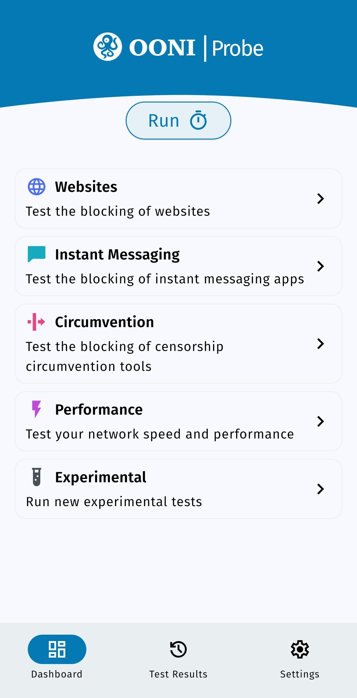
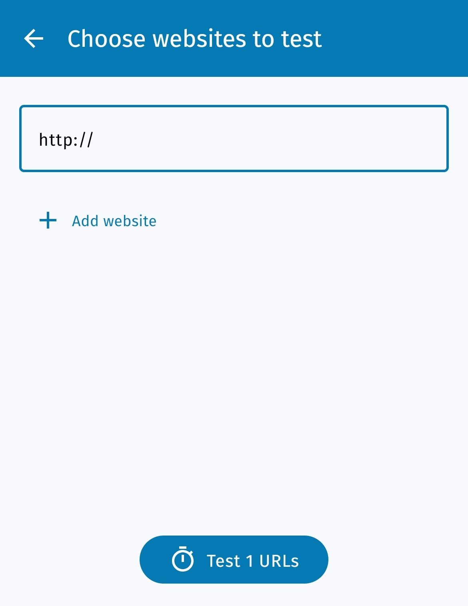
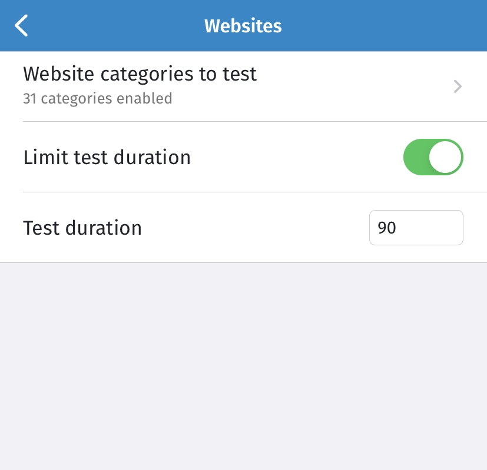
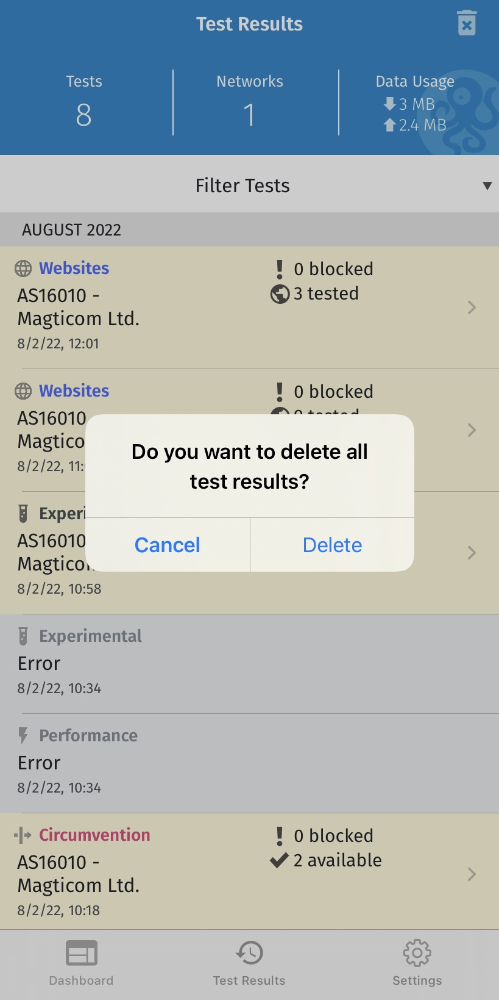
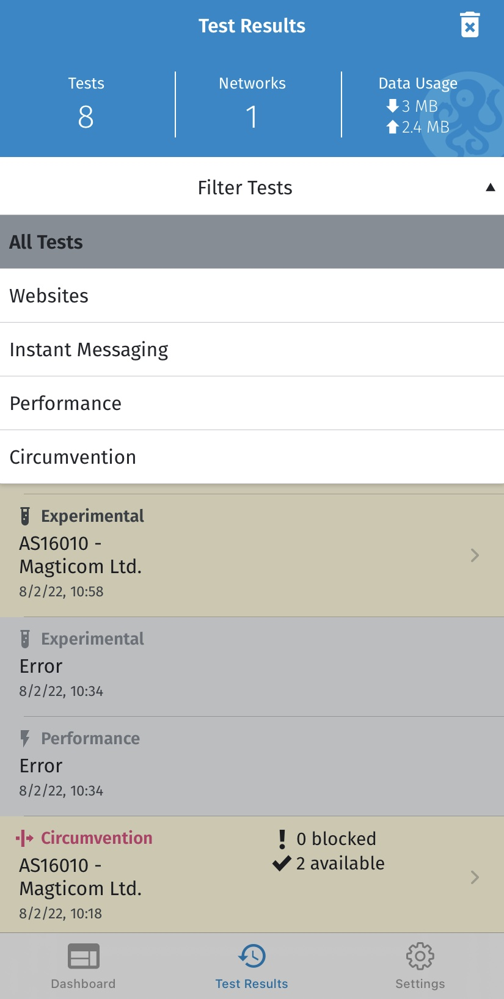
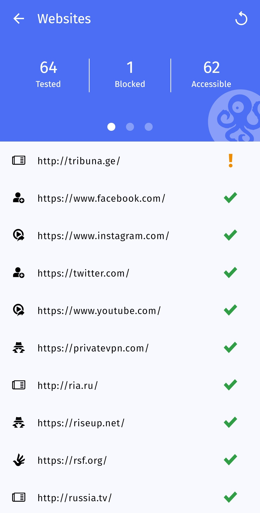
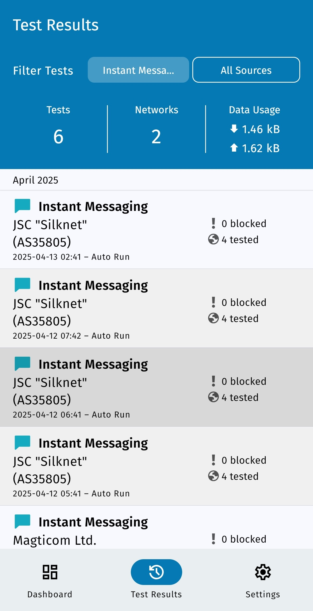
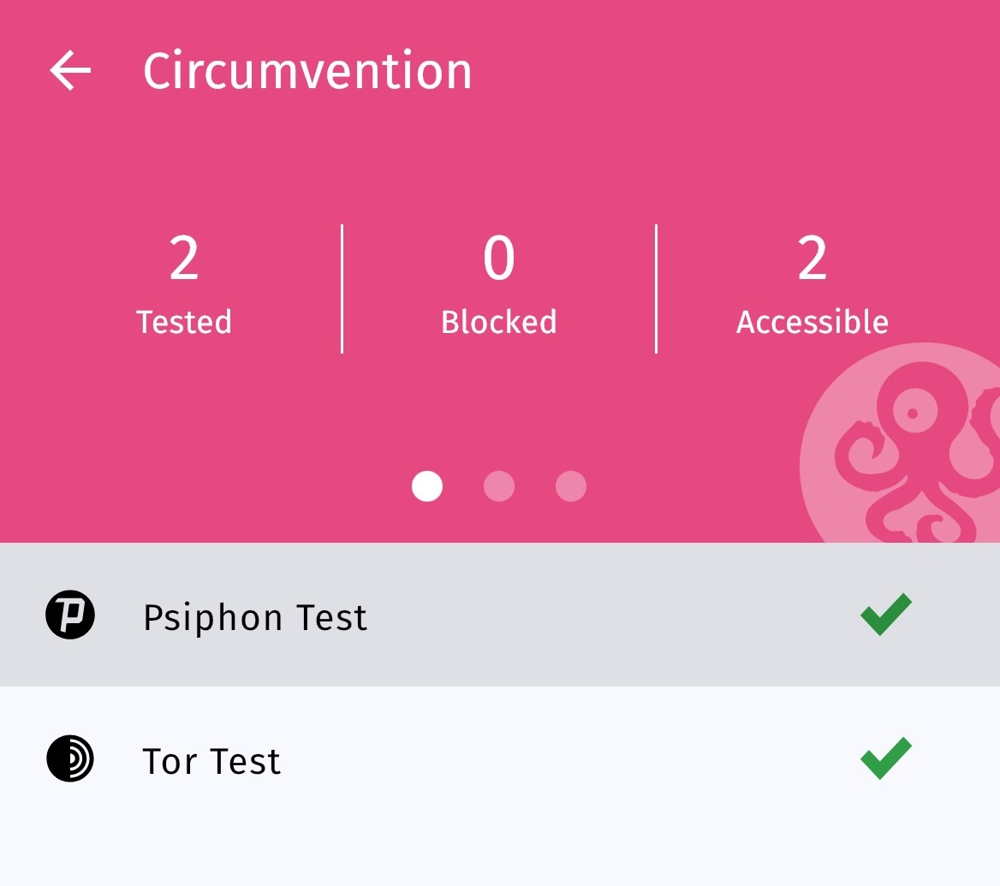
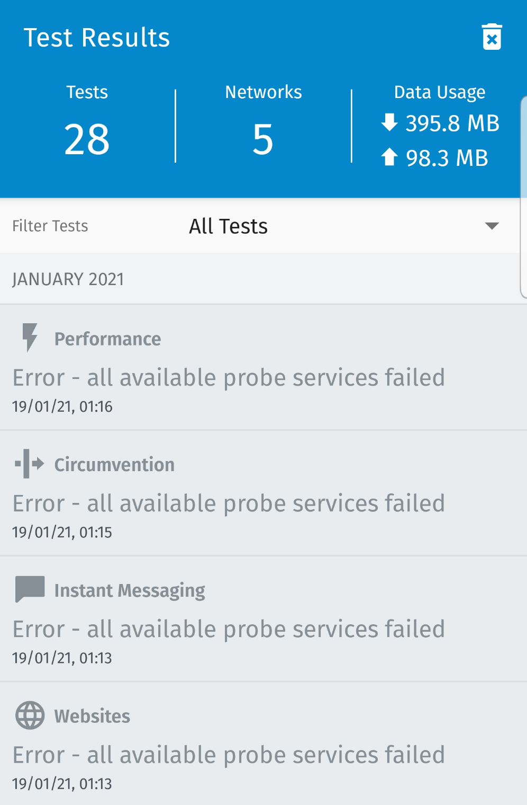
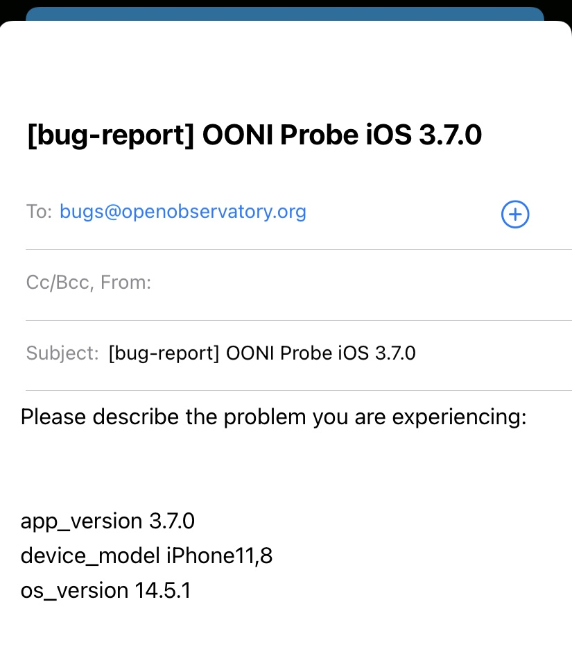

**آخرین به‌روز‌رسانی: ** 19 اکتبر 2022
**نسخه موبایل OONI Probe:** 3.7.1

{{}}

OONI Probe یک [برنامه رایگان و منبع باز](https://github.com/ooni/probe) است که می‌توانید از آن برای اندازه‌گیری سانسور اینترنت و سایر انواع تداخل در شبکه استفاده کنید. این راهنمای کاربری **دستورالعمل‌های گام به گام** در مورد نحوه نصب، اجرا و تنظیمات [برنامه موبایل OONI Probe](https://ooni.org/install/mobile) را ارائه می‌دهد.

**آنچه از این راهنما خواهید آموخت:**

* یاد می‌گیرید که چگونه OONI Probe موبایل را اجرا کنید:
  * تست مسدودیت وبسایت‌ها
  * تست مسدودیت پیام‌رسان‌ها
  * ابزارهای دور زدن سانسور را تست کنید
  * سرعت و عملکرد شبکه خود را اندازه‌گیری کنید
* تست OONI Probe را برای وب‌سایت‌های مورد نظر خود سفارشی‌سازی کنید
* نحوه دسترسی و به اشتراک‌گذاری نتایج تست OONI Probe خود را یاد می‌گیرید
* تنظیمات برنامه OONI Probe خود را پیکربندی کنید

با خواندن این راهنما امیدواریم احساس توانمندی در به اشتراک‌گذاری دانش و مهارت‌های OONI Probe خود با دیگران را کسب کنید!

فهرست مطالب زیر می‌تواند به پیمایش راهنما کمک کند.



## مقدمه‌ای بر OONI Probe

OONI Probe یک [نرم‌افزار رایگان و متن‌باز](https://github.com/ooni/probe) است که برای اندازه‌گیری سانسور اینترنت و سایر انواع تداخل در شبکه طراحی شده است. این نرم افزار از سال 2012 توسط [رصدخانه باز تداخل شبکه (OONI)](https://ooni.org/)، یک پروژه غیرانتفاعی که در ابتدا از [پروژه Tor](https://www.torproject.org/) متولد شده، توسعه یافته است.

با برنامه OONI Probe (در دسترس برای [موبایل](https://ooni.org/install/mobile) و [دسکتاپ](https://ooni.org/install/desktop))، می‌توانید [آزمایشات اندازه‌گیری شبکه](https://ooni.org/nettest/) را برای بررسی موارد زیر اجرا کنید:

* مسدودیت [وب‌سایت‌ها](https://ooni.org/nettest/web-connectivity/)؛
* مسدودیت پیام‌رسان‌ها ([WhatsApp](https://ooni.org/nettest/whatsapp/), [Facebook Messenger](https://ooni.org/nettest/facebook-messenger/), [Telegram](https://ooni.org/nettest/telegram/), [Signal](https://ooni.org/nettest/signal))؛
* مسدود کردن ابزارهای دور زدن ([Tor](https://ooni.org/nettest/tor/), [Tor Snowflake](https://ooni.org/nettest/tor-snowflake/), [Psiphon](https://ooni.org/nettest/psiphon/))؛
* وجود سیستم‌هایی ([Middleboxes](https://ooni.org/nettest/http-header-field-manipulation/)) در شبکه شما که ممکن است مسئول سانسور و یا نظارت باشند.
* [سرعت و عملکرد](https://ooni.org/nettest/ndt/) شبکه شما و [عملکرد پخش استریم ویدیوی شما](https://ooni.org/nettest/dash/).

به محض اجرای OONI Probe، نتایج تست شما به‌طور خودکار به سرورهای OONI ارسال، [پردازش](https://github.com/ooni/pipeline) و به‌طور عمومی در لحظه [منتشر می‌شود](https://ooni.org/data/)  (مگر اینکه از انتشار نتایج تست خود انصراف دهید).

OONI به طور عمومی نتایج تست OONI Probe جمع‌آوری شده از سراسر جهان را [منتشر می‌کند](https://ooni.org/data/) برای:

* افزایش **شفافیت سانسور اینترنت** در سراسر جهان؛
* به اشتراک گذاشتن **شواهد سانسور اینترنت** و سایر انواع تداخل در شبکه؛
* فعال کردن **تایید مستقل** یافته‌های سانسور OONI؛
* حمایت از **تحقیقات تکرارپذیر**؛
* حمایت از **تلاش‌های تحقیقاتی، سیاسی، حقوقی و حمایتی** در سراسر جهان؛
* برای حمایت از **گفتگوی عمومی ** در مورد کنترل اطلاعات.

برای فعال کردن دسترسی عمومی به نتایج تست OONI Probe (که بیشتر به عنوان “اندازه‌گیری” شناخته می‌شود)، تیم OONI آن‌ها را در [OONI Explorer](https://explorer.ooni.org/) در دسترس قرار می‌دهد: یک پلتفرم وب که نمودارهایی را بر اساس پوشش اندازه‌گیری و یک ابزار جستجو برای کاوش در اندازه‌گیری‌ها ارائه می‌کند.

از آن‌جایی که [OONI Explorer](https://explorer.ooni.org/) میزبان بیش از 850 میلیون اندازه‌گیری شبکه است که از 24500 شبکه در 241 کشور و منطقه از سال 2012 جمع‌آوری شده است، احتمالا **بزرگترین منبع داده باز جهانی در مورد سانسور اینترنت ** تا به امروز است.

با اجرای OONI Probe شما:

* خواهید آموخت که آیا و چگونه ارائه دهنده خدمات اینترنت شما (ISP) دسترسی به وب‌سایت‌ها و برنامه‌های خاص را سانسور می‌کند یا خیر؛
* در اندازه‌گیری‌هایی مشارکت خواهید داشت که به صورت عمومی بایگانی می‌شوند و جامعه جهانی آزاد اینترنت را قادر می‌سازد تا سانسور اینترنت را نظارت، شناسایی و با آن مبارزه کند.

هدف این راهنما این است که شما را برای استفاده از [برنامه موبایل OONI Probe](https://ooni.org/install/mobile) راهنمایی کند تا بتوانید به یک جامعه جهانی که سانسور اینترنت را اندازه گیری می‌کند بپیوندید.

### بیانیهٔ رفع مسئولیت

از آن‌جایی که OONI Probe برای اندازه‌گیری سانسور اینترنت طراحی شده است، اجرای آن ممکن است برای برخی افراد در برخی کشورها [خطرناک](https://ooni.org/about/risks/) باشد.

برخی موارد را باید در نظر گرفت:

* **OONI Probe یک ابزار حفظ حریم خصوصی نیست.** هرکسی که فعالیت اینترنتی شما را تحت نظر دارد (به عنوان مثال دولت، ISP، کارفرما) ممکن است متوجه شود که شما OONI Probe را اجرا می‌کنید (همانطور که آن‌ها احتمالا بتوانند همه نرم‌افزارهای دیگری که اجرا می‌کنید را ببینند).
* ** OONI Probe یک ابزار تحقیقاتی است.** برخی از تست‌های OONI Probe به صراحت برای کشف سانسور اینترنت طراحی شده‌اند.
* **[مدل تهدید شما](https://www.eff.org/keeping-your-site-alive/evaluating-your-threat-model).** برای مثال یک فعال برجسته که قبلا تحت نظارت شدید قرار گرفته، ممکن است هنگام اجرای OONI Probe توجه بیشتری را به خود جلب کند.
* **قوانین و مقررات کشوری که OONI Probe را از آن اجرا می‌کنید.** بهتر است با وکلای محلی مشورت کنید.
* **انواع وب‌سایت‌هایی که آزمایش می‌کنید.** ممکن است با استفاده از OONI Probe وب‌سایت‌های ممنوعه قانونی (در برخی کشورها)، [وب‌سایت‌های](https://ooni.org/support/faq/#which-websites-will-i-test-for-censorship-with-ooni-probe) تحریک‌آمیز یا اعتراض‌آمیز را تست کنید.
* **نوع تست‌های OONI Probe که اجرا می‌کنید.** همه [تست‌های OONI Probe](https://ooni.org/nettest/) بالقوه به یک اندازه خطرناک نیستند. برای مثال OONI Probe شامل [تست NDT](https://ooni.org/nettest/ndt/) (طراحی شده برای اندازه‌گیری سرعت و عملکرد یک شبکه) است که ممکن است در مقایسه با سایر تست‌هایی که برای اندازه‌گیری مسدودیت وب‌سایت‌ها یا برنامه‌ها طراحی شده‌اند، کمتر سیاسی یا بحث‌برانگیز تلقی شود.
* **اینکه اندازه‌گیری‌های خود را منتشر می‌کنید یا نه.** OONI به طور عمومی اندازه‌گیری‌های جمع‌آوری شده از کاربران OONI Probe را [منتشر می‌کند](https://ooni.org/data/) تا شفافیت سانسور اینترنت را در سراسر جهان افزایش دهد. ما تمام تلاش خود را می‌کنیم تا آدرس IP شما یا سایر اطلاعات بالقوه قابل شناسایی شخصی را منتشر نکنیم. در [خط مشی داده](https://ooni.org/about/data-policy) ما بیشتر بیاموزید.

برای کسب اطلاعات بیشتر در مورد خطرات احتمالی مرتبط با استفاده از OONI Probe، لطفا به [مستندات](https://ooni.org/about/risks/) مربوطه ما مراجعه کنید.

## نصب OONI Probe موبایل

برنامه موبایل OONI Probe برای [Android](https://play.google.com/store/apps/details?id=org.openobservatory.ooniprobe)، [F-Droid](https://f-droid.org/repository/browse/?fdid=org.openobservatory.ooniprobe) و [iOS](https://apps.apple.com/us/app/ooni-probe/id1199566366) در دسترس است.

می‌توانید برنامه موبایل OONI Probe را از طریق مراحل زیر نصب کنید:

**مرحله 1.** از صفحه نصب OONI Probe موبایل (در وب‌سایت OONI) دیدن کنید: <https://ooni.org/install/mobile>

{{}}

**مرحله 2.** بسته به سیستم عامل خود (Android، iOS، F-Droid)، روی دکمه App store مربوطه ضربه بزنید.

{{}}

**مرحله 3.** برنامه موبایل OONI Probe (از App store برنامه خود) را نصب کنید.

{{}}

**مرحله 4.** برنامه موبایل OONI Probe خود را باز کنید.

{{}}

### ورود: رضایت آگاهانه

اکنون که برنامه موبایل OONI Probe خود را نصب و باز کردید، به عنوان بخشی از فرآیند ورود اطلاعات اولیه در مورد OONI Probe به شما ارائه می‌شود.

همچنین با [خطرات احتمالی](https://ooni.org/about/risks/) مرتبط با اجرای OONI Probe آشنا خواهید شد. برای اطمینان از درک این خطرات احتمالی، ما یک آزمون کوتاه برای کسب رضایت شما در نظر گرفته‌ایم. برای استفاده از OONI Probe، پاسخ صحیح به سوالات مسابقه الزامی است.

در مرحله نهایی فرآیند ورود، انواع داده‌هایی را که به‌طور پیش‌فرض هنگام اجرای OONI Probe جمع‌آوری می‌شوند به اشتراک می‌گذاریم (برای اطلاعات بیشتر به [خط‌مشی داده](https://ooni.org/about/data-policy) ما مراجعه کنید). برای کمک به ما در بهبود OONI Probe، می‌توانید اشتراک‌گذاری گزارش‌های خرابی را انتخاب کنید.

در زیر شما را با طریق فرآیند ورود به سیستم راهنمایی می‌کنیم.

**مرحله 1.** هنگامی که اطلاعات اولیه درباره OONI Probe را خواندید، روی **متوجه شدم** ضربه بزنید.

{{}}

**مرحله 2.** صفحه بعدی خلاصه‌ای از خطرات احتمالی مرتبط با اجرای OONI Probe را به اشتراک می‌گذارد. برای خواندن [مستندات](https://ooni.org/about/risks/) ما که خطرات احتمالی را توضیح می‌دهد، روی **بیشتر بیاموزید** بزنید.

{{}}

**مرحله 3.** هنگامی که در مورد خطرات احتمالی مرتبط با اجرای OONI Probe آشنا شدید، روی **متوجه شدم** بزنید.

{{}}

**مرحله 4.** مسابقه زیر بر اساس اطلاعاتی است که در صفحه قبلی خواندید. برای نشان دادن برداشت خود از موضوع، روی **درست** ضربه بزنید.

{{}}

خواهید دید که **درست** پاسخ صحیح است. اگر روی پاسخ غلط ضربه بزنید، توضیحی در مورد دلیل اشتباه بودن پاسخ دریافت خواهید کرد.

{{}}

**مرحله 5.** روی **درست** ضربه بزنید تا برداشت خود از عبارت (در قسمت دوم آزمون) را نشان دهید.

{{}}

خواهید دید که **درست** پاسخ صحیح است. اگر روی گزینه اشتباه ضربه بزنید، توضیحی در مورد دلیل اشتباه بودن پاسخ دریافت خواهید کرد.

{{}}

**مرحله 6.** اگر می‌خواهید برنامه، اندازه‌گیری‌ها را به‌طور خودکار جمع‌آوری کند، روی دکمه **عالیه** ضربه بزنید.

{{}}

**مرحله 7.** اگر می‌خواهید [گزارش‌های خرابی](https://ooni.org/about/data-policy#data-we-collect) را برای کمک به ما در بهبود OONI Probe به اشتراک بگذارید، روی **بله** ضربه بزنید.

{{}}

**مرحله 8.** صفحه زیر اطلاعاتی را در مورد انواع داده‌هایی که OONI جمع‌آوری و منتشر می‌کند (هر بار که OONI Probe را اجرا می‌کنید) به اشتراک می‌گذارد. با ضربه زدن روی **[خط مشی داده OONI](https://ooni.org/about/data-policy)** می‌توانید اطلاعات بیشتری کسب کنید.

{{}}

**مرحله 9.** روی **باشه** بزنید.

شما اکنون فرآیند نصب را تکمیل کرده و آماده شروع استفاده از OONI Probe هستید!

## اجرای OONI Probe موبایل

اکنون که فرآیند نصب را کامل کرده‌اید، می‌توانید OONI Probe را برای اندازه‌گیری سانسور اینترنت اجرا کنید!

**داشبورد** برنامه OONI Probe موبایل شامل 5 کارت است که هر کدام شامل تست‌های OONI Probe است:

* **کارت وب‌سایت.** شامل [تست اتصال وب](https://ooni.org/nettest/web-connectivity/) OONI است که [مسدودیت وب‌سایت‌ها](https://ooni.org/support/faq/#which-websites-will-i-test-for-censorship-with-ooni-probe) را اندازه‌گیری می‌کند.
* **کارت پیام‌رسان.** شامل تست‌های [WhatsApp](https://ooni.org/nettest/whatsapp/), [Facebook Messenger](https://ooni.org/nettest/facebook-messenger/), [Telegram](https://ooni.org/nettest/telegram/) و [Signal](https://ooni.org/nettest/signal) OONI است که بررسی می‌کنند آیا این برنامه‌ها مسدود شده‌اند یا خیر.
* **کارت دور زدن سانسور.** شامل [Tor](https://ooni.org/nettest/tor/) و [Psiphon](https://ooni.org/nettest/psiphon/) OONI است که بررسی می‌کنند آیا این ابزارهای دور زدن سانسور مسدود شده‌اند.
* **کارت عملکرد.** شامل [تست سرعت NDT](https://ooni.org/nettest/ndt/)، [تست عملکرد پخش ویدئو استریم DASH](https://ooni.org/nettest/dash/) و تست‌های [Middlebox](https://ooni.org/support/glossary/#middlebox) OONI (تست [دستکاری فیلد هدر HTTP](https://ooni.org/nettest/http-header-field-manipulation/) و تست [خط درخواست نامعتبر HTTP](https://ooni.org/nettest/http-invalid-request-line/)).
* **کارت آزمایشی.** شامل چندین تست آزمایشی جدید است که توسط تیم OONI ایجاد شده است. این تست‌ها ممکن است در طول زمان تغییر کنند. این تست‌ها را می توانید در [اینجا](https://github.com/ooni/spec/tree/master/nettests) مشاهده کنید.

**مرحله 1.** روی **اجرا** ضربه بزنید تا اولین تست OONI Probe خود را اجرا کنید.

{{}}

پس از ضربه زدن روی "اجرا" OONI Probe **همه تست‌های موجود** (در همه کارت‌ها) یکباره راه‌اندازی می‌شوند!

{{}}

اگر روی **خط در حال اجرا** بزنید، پنجره **تست‌های در حال انجام** باز می‌شود:

{{}}

{{}}

{{}}

{{}}

{{}}

OONI Probe باید همه تست‌ها را ظرف چند دقیقه اجرا کند (اگرچه این به عملکرد شبکه‌ای که به آن متصل هستید بستگی دارد و ممکن است در برخی موارد بیشتر طول بکشد). اگر عملکرد شبکه شما به اندازه کافی خوب نیست و تست‌ها بیش از حد طول می‌کشد، می‌توانید با زدن روی دکمه **توقف تست**، **تست در حال انجام را متوقف کنید**.

{{}}

پس از پایان تست‌ها، نتایج تست OONI Probe شما به‌طور خودکار در [OONI Explorer](https://explorer.ooni.org/) و [OONI API](https://api.ooni.io/) منتشر می‌شود.

آیا ترجیح می‌دهید تست خود را به یک نوع تست (کارت) خاص محدود کنید؟ در بخش‌های بعدی، دستورالعمل‌هایی را درباره نحوه انجام این کار به اشتراک می‌گذاریم.

### اندازه‌گیری مسدودیت وب‌سایت‌ها

اگر فقط می‌خواهید میزان مسدودیت وب‌سایت‌ها را اندازه‌گیری کنید، می‌توانید این کار را از طریق مراحل زیر انجام دهید:

**مرحله 1.** روی کارت **وب‌سایت‌ها** در داشبورد برنامه موبایل OONI Probe خود بزنید.

{{}}

**مرحله 2.** روی **اجرا** در کارت وب‌سایت‌ها بزنید.

{{}}

اکنون [تست اتصال وب](https://ooni.org/nettest/web-connectivity/) OONI را برای اندازه‌گیری مسدودیت وب‌سایت‌ها اجرا می‌کنید.

{{}}

نتایج آزمایش OONI Probe شما به‌طور خودکار در [OONI Explorer](https://explorer.ooni.org/) و [OONI API](https://api.ooni.io/) منتشر می‌شود.

**کدام وب‌سایت‌ها تست می‌شوند؟**

به طور پیش‌فرض، وب‌سایت‌های موجود در 2 لیست زیر را تست خواهید کرد:

* **[لیست آزمون جهانی](https://github.com/citizenlab/test-lists/blob/master/lists/global.csv)**. شامل وب‌سایت‌های مرتبط بین المللی (مانند facebook.com).
* **[لیست تست مخصوص کشور](https://github.com/citizenlab/test-lists/tree/master/lists)**. شامل وب‌سایت‌هایی می‌شود که فقط مربوط به کشوری است که OONI Probe تست را در آن اجرا می‌کنید.

مهم نیست که از کدام کشور OONI Probe را اجرا می‌کنید، وب‌سایت‌ها از [لیست تست جهانی](https://github.com/citizenlab/test-lists/blob/master/lists/global.csv) را *همیشه* آزمایش خواهید کرد.

OONI Probe به طور خودکار تعیین می‌کند که کدام [لیست مخصوص کشور](https://github.com/citizenlab/test-lists/tree/master/lists) را برای تست بر اساس کشوری که OONI Probe را از آن اجرا می‌کنید انتخاب کند. برای مثال، اگر OONI Probe را در برزیل اجرا می‌کنید، وب‌سایت‌ها را از لیست تست جهانی و از لیست تست برزیل آزمایش خواهید کرد. اگر به آلمان سفر می‌کنید و OONI Probe را اجرا می‌کنید، وب‌سایت‌ها را از لیست‌های تست جهانی و آلمان آزمایش می‌کند. اما اگر OONI Probe را از کشوری اجرا می‌کنید که هنوز فهرست آزمایشی خاص کشور ندارد (به دلیل اینکه ایجاد نشده است)، فقط وب‌سایت‌هایی را از لیست جهانی تست خواهید کرد.

اگر می‌خواهید در [لیست‌های تست Citizen Lab](https://github.com/citizenlab/test-lists/tree/master/lists) (که شامل وب‌سایت‌های پیش‌فرض تست‌شده توسط کاربران OONI Probe در سراسر جهان است)، مشارکت کنید، لطفا به [مستندات](https://ooni.org/get-involved/contribute-test-lists) ما مراجعه کنید یا از [ویرایشگر لیست‌های تست](https://test-lists.ooni.org/) ما استفاده کنید.

**توجه:** با زدن روی “اجرا” (از داشبورد یا از کارت وب‌سایت‌ها)، **برای جلوگیری از مصرف تمام داده‌های تلفن همراه شما**، OONI Probe تنها تعدادی وب‌سایت که می‌‌تواند در عرض 90 ثانیه تست کند را آزمایش می‌کند. این وب‌سایت‌ها (که در عرض 90 ثانیه تست می‌شوند) به‌طور تصادفی از لیست‌های تست [جهانی](https://github.com/citizenlab/test-lists/blob/master/lists/global.csv) و [مخصوص کشور](https://github.com/citizenlab/test-lists/tree/master/lists) (مربوط) انتخاب می‌شوند. هر بار که روی “اجرا” می‌زنید، یک انتخاب تصادفی متفاوت از وب‌سایت‌ها (از لیست‌های تست جهانی و مخصوص کشور) را در عرض 90 ثانیه تست خواهید کرد. بنابراین، هر چه تعداد دفعات بیشتری روی “اجرا” بزنید، وب‌سایت‌های بیشتری را تست خواهید کرد.

اگر می‌خواهید تعداد بیشتری از وب‌سایت‌ها و یا وب‌سایت‌های متفاوتی را تست کنید، لطفا به بخش **سفارشی‌سازی تست وب‌سایت** این راهنما مراجعه کنید.

### اندازه‌گیری مسدودیت پیام‌رسان‌ها

اگر فقط می‌خواهید مسدودیت پیام‌رسان‌ها را اندازه‌گیری کنید، می‌توانید این کار را از طریق مراحل زیر انجام دهید:

**مرحله 1.** روی کارت **پیام‌رسان** در داشبورد برنامه موبایل OONI Probe خود بزنید.

{{}}

**مرحله 2.** روی **اجرا** در کارت پیام‌رسان بزنید.

{{}}

اکنون در حال اجرای تست‌های [WhatsApp](https://ooni.org/nettest/whatsapp/), [Facebook Messenger](https://ooni.org/nettest/facebook-messenger/), [Telegram](https://ooni.org/nettest/telegram/) و [Signal](https://ooni.org/nettest/signal) OONI هستید تا میزان مسدودیت این برنامه‌ها را اندازه‌گیری کنید.

{{}}

نتایج تست OONI Probe شما به‌طور خودکار در [OONI Explorer](https://explorer.ooni.org/) و [OONI API](https://api.ooni.io/) منتشر می‌شود.

اگر می‌خواهید تست خود را فقط به یکی از WhatsApp، Facebook Messenger، Telegram یا Signal محدود کنید، لطفا به بخش **پیکربندی تنظیمات OONI Probe** خود در این راهنما مراجعه کنید.

### اندازه گیری مسدودیت ابزارهای دور زدن سانسور

اگر فقط می‌خواهید مسدودیت ابزارهای دور زدن سانسور را اندازه‌گیری کنید، می‌توانید این کار را از طریق مراحل زیر انجام دهید:

**مرحله 1.** روی کارت **دور زدن سانسور** در داشبورد برنامه موبایل OONI Probe خود ضربه بزنید.

{{}}

**مرحله 2.** روی **اجرا** در کارت دور زدن سانسور بزنید.

{{}}

اکنون در حال اجرای تست‌های [Tor](https://ooni.org/nettest/tor/) و [Psiphon](https://ooni.org/nettest/psiphon/) OONI هستید تا میزان دسترسی به این ابزارها را اندازه‌گیری کنید.

{{}}

نتایج تست OONI Probe شما به‌طور خودکار در [OONI Explorer](https://explorer.ooni.org/) و [OONI API](https://api.ooni.io/) منتشر می‌شود.

اگر می‌خواهید تست خود را فقط به Tor یا Psiphon محدود کنید، لطفا به بخش **پیکربندی تنظیمات OONI Probe** خود در این راهنما مراجعه کنید.

### اندازه گیری عملکرد شبکه

اگر فقط می‌خواهید عملکرد شبکه را اندازه‌گیری کنید، می‌توانید این کار را از طریق مراحل زیر انجام دهید:

**مرحله 1.** روی کارت **عملکرد** در داشبورد برنامه موبایل OONI Probe خود بزنید.

{{}}

**مرحله 2.** روی **اجرا** در کارت عملکرد بزنید.

{{}}

اکنون [تست سرعت NDT](https://ooni.org/nettest/ndt/)، [تست عملکرد پخش ویدئو استریم DASH](https://ooni.org/nettest/dash/) و تست‌های [Middlebox](https://ooni.org/support/glossary/#middlebox) OONI (تست [دستکاری فیلد هدر HTTP](https://ooni.org/nettest/http-header-field-manipulation/) و تست [خط درخواست نامعتبر HTTP](https://ooni.org/nettest/http-invalid-request-line/)) را اجرا می‌کنید.

{{}}

نتایج تست OONI Probe شما به‌طور خودکار در [OONI Explorer](https://explorer.ooni.org/) و [OONI API](https://api.ooni.io/) منتشر می‌شود.

**سلب مسئولیت:** تست‌های [NDT](https://ooni.org/nettest/ndt/) و  [DASH](https://ooni.org/nettest/dash/) بر روی سرورهای ارائه شده توسط [Measurement Lab (M-Lab)](https://www.measurementlab.net/) انجام می‌شود. اگر این تست‌ها را اجرا کنید، M-Lab بدون در نظر گرفتن تنظیمات OONI Probe، آدرس IP شما را برای اهداف تحقیقاتی جمع‌آوری و منتشر می‌کند. از طریق [بیانیه حریم خصوصی](https://www.measurementlab.net/privacy/) M-Lab درباره حاکمیت داده‌ها بیشتر بیاموزید.

اگر می‌خواهید تست خود را فقط به یک (یا چند مورد) از تست‌های موجود در کارت عملکرد محدود کنید، لطفا به بخش **پیکربندی تنظیمات OONI Probe خود** در این راهنما مراجعه کنید.

## سفارشی‌سازی تست وب‌سایت شما

به‌طور پیش‌فرض، هنگام تست وب‌سایت‌ها با OONI Probe، آدرس‌های موجود در [لیست‌های تست Citizen Lab](https://github.com/citizenlab/test-lists/tree/master/lists) را آزمایش می‌کنید. به عبارت دیگر اگر فقط روی “اجرا” (در داشبورد یا کارت وب‌سایت‌های برنامه OONI Probe) بزنید، مجموعه‌ای تصادفی از وب‌سایت‌ها را که از [لیست‌های تست Citizen Lab](https://github.com/citizenlab/test-lists/tree/master/lists) گرفته شده‌اند، تست خواهید کرد. این لیست‌ها از طریق همکاری با محققان و کارشناسان داخلی ایجاد شده است. از آن‌جایی که لیست‌ها [به طور عمومی در GitHub](https://github.com/citizenlab/test-lists/tree/master/lists) در دسترس هستند، هر کسی می‌تواند در آن [مشارکت](https://ooni.org/get-involved/contribute-test-lists) کند و یا پیشنهاد [تغییر و یا حذف](https://ooni.org/get-involved/contribute-test-lists) دهد. بررسی و به‌روزرسانی این فهرست‌هامهم است زیرا حاوی وب‌سایت‌هایی هستند که توسط اکثر کاربران OONI Probe به طور منظم در سراسر جهان تست می‌شوند.

اما اگر ترجیح می دهید تست خود را به وب‌سایت‌های انتخابی خود محدود کنید، می‌توانید این کار را از طریق برنامه موبایل OONI Probe انجام دهید.

می‌توانید تست وب‌سایت خود را به روش‌های زیر سفارشی کنید:

* تست خود را به **دسته‌های وب‌سایت خاص** (مانند رسانه‌های خبری و محتوای حقوق بشر) محدود کنید.
* فقط **وب‌سایت‌هایی که به آن‌ها اهمیت می‌دهید** را تست کنید.
* **لیست خودتان** را تست کنید.
* (به جای تست انتخاب تصادفی وب‌سایت‌ها در 90 ثانیه) *همه* آدرس‌ها را در [لیست‌های تست Citizen Lab](https://github.com/citizenlab/test-lists/tree/master/lists) ([مرتبط](https://ooni.org/support/faq/#which-websites-will-i-test-for-censorship-with-ooni-probe)) آزمایش کنید.

بخش‌های زیر توضیح می‌دهند که چگونه می‌توانید هر یک از موارد فوق را انجام دهید.

### تست دسته‌بندی خاصی از وب‌سایت‌ها

وقتی در برنامه OONI Probe روی “اجرا” می‌زنید، وب‌سایت‌ها را از لیست‌های تست Citizen Lab [جهانی](https://github.com/citizenlab/test-lists/blob/master/lists/global.csv) و ([مرتبط](https://ooni.org/support/faq/#which-websites-will-i-test-for-censorship-with-ooni-probe)) [مخصوص کشور](https://github.com/citizenlab/test-lists/tree/master/lists) آزمایش می‌کنید.

این وب‌سایت‌ها بر اساس [30 دسته‌بندی استاندارد](https://ooni.org/get-involved/contribute-test-lists/#what-are-test-lists) طبقه‌بندی شده‌اند. این دسته‌بندی‌ها از رسانه‌های خبری، فرهنگی و موضوعات حقوق بشری گرفته تا دسته‌های تحریک آمیزتر یا اعتراض آمیزتر، مانند پورنوگرافی را شامل می‌شوند (این دسته‌بندی‌ها به این دلیل گنجانده شده‌اند که احتمال مسدود شدن آن‌ها بیشتر است و امکان شناسایی تکنیک‌های سانسور اتخاذ شده توسط ISP‌ها را فراهم می‌کند).

به‌طور پیش‌فرض، همه 30 دسته‌بندی در برنامه موبایل OONI Probe فعال هستند تا تست، وب‌سایت‌های متنوع‌تری را شامل شود و امکان کشف انواع بیشتری از سانسور وب‌سایت را فراهم سازد.

اما اگر از تست همه 30 دسته وب‌سایت راحت نیستید (مخصوصا اگر حاوی محتوای غیرقانونی، تحریک‌آمیز یا قابل اعتراض در کشور شما باشد)، یا فقط علاقه‌مند به تست انواع خاصی از محتوا هستید (مانند رسانه‌های خبری) می‌توانید تست OONI Probe خود را به دسته‌های وب‌سایت مورد نظر خود محدود کنید.

**مرحله 1.** روی **تنظیمات** در نوار پیمایش پایین برنامه موبایل OONI Probe ضربه بزنید.

{{}}

**مرحله 2.** روی **گزینه‌های تست** در تنظیمات بزنید.

{{}}

**مرحله 3.** روی **وب‌سایت‌ها** (در تنظیمات “گزینه‌های تست”) بزنید.

{{}}

**مرحله 4.** روی **دسته‌های وب‌سایت برای تست** ضربه بزنید (در بخش “وب‌سایت‌ها” تنظیمات “گزینه‌های تست”).

{{}}

اکنون [30 دسته](https://github.com/citizenlab/test-lists/blob/master/lists/00-LEGEND-new_category_codes.csv) از وب‌سایت‌هایی که OONI Probe به طور پیش‌فرض تست می‌کند را مشاهده خواهید کرد. همه این دسته‌ها فعال هستند.

{{}}

**مرحله 5.** دسته‌های وب‌سایتی که **نمی‌خواهید** تست کنید را **غیرفعال** کنید.

{{}}

در مثال بالا، ما 5 دسته ("LGBTQI"، "نقد سیاسی"، "پورنوگرافی"، "لباس تحریک‌آمیز”، "مذهب") را غیرفعال کرده‌ایم.

وقتی به عقب برگردید (از آنجایی که 5 دسته غیرفعال شده‌اند) خواهید دید که فقط 25 دسته فعال هستند.

{{}}

برای فعال یا غیرفعال کردن دسته‌های وب‌سایت مورد نظرتان، می‌توانید هر زمان که بخواهید دوباره به این تنظیم مراجعه کنید.

### تست وب‌سایت‌های انتخابی شما

از طریق مراحل زیر می‌توانید وب‌سایت‌های مورد علاقه خود را به طور مستقیم تست کنید:

**مرحله 1.** روی کارت **وب‌سایت‌ها** در برنامه موبایل OONI Probe بزنید.

{{}}

**مرحله 2.** روی دکمه **انتخاب وب‌سایت** در کارت وب‌سایت‌ها ضربه بزنید.

{{}}

اکنون صفحه‌ای را مشاهده می‌کنید که می‌توانید وب‌سایت‌هایی که می‌خواهید تست کنید را اضافه کنید.

{{}}

**مرحله 3.** **آدرس اینترنتی** وب‌سایتی که می‌خواهید تست کنید را تایپ کنید. در مثال زیر `https://www.facebook.com` را تایپ کرده‌ایم.

{{}}

**مهم:** لطفا مطمئن شوید که [آدرس](https://ooni.org/support/glossary/#url) به درستی تایپ شده است. اگر اشتباه تایپ شود، OONI Probe وب‌سایت مورد نظر را آزمایش *نخواهد* کرد و این به طور بالقوه منجر به نتایج تست نادرست می‌شود.

چند نکته را باید در نظر داشت:

* آیا وب‌سایت روی **HTTP** یا **HTTPS** است؟ اگر مورد دوم است، لطفا یک `s` اضافی بعد از `http` اضافه کنید.
* آیا [دامنه](https://ooni.org/support/glossary/#domain-name) شامل `www` است؟ اگر چنین است، لطفا آن را درج کنید.

برای اطمینان از این‌که یک [آدرس](https://ooni.org/support/glossary/#url) به طور دقیق تایپ شده باشد، **لطفا بررسی کنید که هنگام دسترسی از مرورگر معمولی چگونه نمایش داده می‌شود**.

**مرحله 4.** روی علامت مثبت ضربه بزنید تا یک خط جدید برای افزودن وب‌سایت دیگری برای تست ایجاد کنید.

**مرحله 5.** ** آدرس دیگری را تایپ کنید** که می‌خواهید تست کنید. در مثال زیر، `https://twitter.com` را اضافه کرده‌ایم.

{{}}

اگر نظر خود را تغییر دادید و می‌خواهید هر یک از آدرس‌هایی را که اضافه کرده‌اید حذف کنید، می‌توانید با زدن روی نماد قرمز رنگ کنار هر آدرس این کار را انجام دهید.

می‌توانید هر تعداد آدرس که دوست دارید اضافه کنید. در مثال زیر، `https://www.gutenberg.org` را اضافه کرده‌ایم.

{{}}

**مرحله 6.** روی **اجرا** بزنید تا همه وب‌سایت‌هایی که اضافه کرده‌اید را تست کنید.

اکنون خواهید دید که OONI Probe وب‌سایت‌های انتخابی شما را تست می‌کند!

{{}}

نتایج تست OONI Probe شما به‌طور خودکار در [OONI Explorer](https://explorer.ooni.org/) و [OONI API](https://api.ooni.io/) منتشر می‌شود.

### تست لیست سفارشی از وب‌سایت‌ها

افزودن دستی آدرس‌ها به صورت یک به یک (از طریق دکمه “انتخاب وب‌سایت‌ها” برنامه موبایل OONI Probe) می‌تواند خسته کننده باشد - به خصوص اگر شامل بیش از ده‌ها آدرس اینترنتی باشد. محققان اغلب علاقه‌مند به تست لیست وب‌سایت‌های خود هستند که ممکن است شامل صدها آدرس باشد.

شما می توانید لیست وب‌سایت‌های خود را از طریق مراحل زیر تست کنید:

**مرحله 1.** لیست وب‌سایت‌های خود را در یک ویرایشگر متن بنویسید، به صورتی که هر آدرس در یک خط جداگانه قرار دارد. در زیر نمونه‌ای را به اشتراک می‌گذاریم.

{{}}

**مهم:** لطفا مطمئن شوید که هر [آدرس](https://ooni.org/support/glossary/#url) به درستی تایپ شده است. اگر اشتباه تایپ شود، OONI Probe وب‌سایت مورد نظر را آزمایش *نخواهد* کرد و این به طور بالقوه منجر به نتایج تست نادرست می‌شود.

چند نکته را باید در نظر داشت:

* آیا وب سایت روی **HTTP** یا **HTTPS** است؟ اگر مورد دوم است، لطفا یک `s` بعد از `http` اضافه کنید.
* آیا [دامنه](https://ooni.org/support/glossary/#domain-name) شامل `www` است؟ اگر چنین است، لطفا آن را درج کنید.
* اگر وب‌سایت بر روی HTTPS است (به عنوان مثال `https://www.hrw.org/`)، نیازی به تعیین یک صفحه وب (مثلا `https://www.hrw.org/publications`) ندارید، زیرا ISP‌ها زمانی که وب‌سایت در HTTPS میزبانی می‌شود، معمولا نمی‌توانند مسدودیت را به یک صفحه خاص محدود کنند. در عوض باید دسترسی به کل وب‌سایت را مسدود کنند.

برای اطمینان از اینکه هر [آدرس](https://ooni.org/support/glossary/#url) به طور دقیق تایپ شده است، **لطفا آن را از مرورگر کپی کنید.**

**مرحله 2.** لیست آدرس‌های خود را (از ویرایشگر متن) **کپی کنید**.

**مرحله 3.** از وب‌سایت **OONI Run** دیدن کنید: https://run.ooni.org/

{{}}

**مرحله 4.** (برای جلوگیری از دو بار نوشتن `http` در اولین آدرس خود) `http://` را در اولین فیلد آدرس صفحه در OONI Run **انتخاب کنید**.

{{}}

**مرحله 5.** لیست آدرس‌های خود را در اولین فیلد آدرس صفحه OONI Run **پیست کنید**.

اکنون باید ببینید که همه آدرس‌های شما هر ردیف آدرس را در صفحه [OONI Run](https://run.ooni.org/) پر کرده‌اند.

{{}}

اگر متوجه ردیف خالی (یا آدرس با فرمت اشتباه) شدید، لطفا با کلیک بر روی **آیکون حذف** آن‌ها را حذف کنید.

{{}}

**مرحله 6.** روی دکمه **ایجاد** در انتهای لیست خود کلیک کنید.

{{}}

اکنون پنجره پاپ آپ زیر را مشاهده خواهید کرد.

{{}}

شما یک لیسنک عمیق **OONI Run موبایل** برای تست لیست وب‌سایت‌‌های خود ایجاد کرده‌اید.

**مرحله 7.** لینک تولید شده را **کپی کنید**:

* یا با کلیک کردن روی لینک زیر “**اشتراک گذاری این آدرس با دوستان خود**”، زدن کلیدهای Control+A برای انتخاب کل لینک، و سپس Control + C برای کپی کردن آن. یا
* کلیک راست روی **دکمه لینک** و انتخاب “کپی آدرس لینک”.

{{}}

**مرحله 8.** همانطور که همه این مراحل را از روی دسکتاپ خود انجام می‌دهید، لینک کپی شده را **با تلفن همراه خود** **به اشتراک بگذارید** (تا بتوانید بعدا لینک را با برنامه موبایل OONI Probe خود باز کنید). همچنین اگر می‌خواهید دیگران لیست وب‌سایت‌های شما را تست کنند، می‌توانید این لینک را با آن‌ها OONI Probe به اشتراک بگذارید.

**مرحله 9. ** روی لینک OONI Run از موبایل خود **بزنید**.

{{}}

**مرحله 10.** لینک را با **برنامه موبایل OONI Probe** خود **باز کنید** (نه با مرورگر وب).

{{}}

اکنون باید لیست وب‌سایت‌های خود را در برنامه موبایل OONI Probe خود مشاهده کنید.

{{}}

**مرحله 11.** روی **اجرا** بزنید تا لیست وب‌سایت‌های خود را تست کنید.

{{}}

نتایج تست OONI Probe شما به‌طور خودکار در [OONI Explorer](https://explorer.ooni.org/) و [OONI API](https://api.ooni.io/) منتشر می‌شود.

### تست همه وب‌سایت‌ها از لیست‌های تست Citizen Lab

به دلیل محدودیت‌های پهنای باند، برنامه موبایل OONI Probe فقط تعدادی وب‌سایت که بتواند در عرض 90 ثانیه (بر اساس تنظیمات پیش‌فرض) متصل شود را تست می‌کند.

اگر به WiFi متصل هستید و می‌خواهید همه وب‌سایت‌ها را از [لیست‌های تست Citizen Lab](https://github.com/citizenlab/test-lists/tree/master/lists) ([مربوط](https://ooni.org/support/faq/#which-websites-will-i-test-for-censorship-with-ooni-probe)) یکباره آزمایش کنید، می‌توانید این کار را از طریق مراحل زیر انجام دهید:

**مرحله 1.** روی **تنظیمات** در نوار پیمایش پایین برنامه موبایل OONI Probe ضربه بزنید.

{{}}

**مرحله 2.** روی **گزینه‌های تست** در تنظیمات ضربه بزنید.

{{}}

**مرحله 3.** روی **وب‌سایت‌ها** (در تنظیمات “گزینه‌های تست”) بزنید.

{{}}

اکنون تنظیمات وب‌سایت OONI Probe را مشاهده می‌کنید.

{{}}

**مرحله 4.** (در بخش “وب‌سایت‌ها” تنظیمات “گزینه‌های تست”) **محدود کردن مدت زمان تست** را غیرفعال کنید.

{{}}

در حال حاضر هیچ محدودیت زمانی در تست وب‌سایت شما وجود ندارد. این بدان معناست که OONI Probe می‌تواند همه وب‌سایت‌های موجود در [لیست‌های تست Citizen Lab مربوطه](https://ooni.org/support/faq/#which-websites-will-i-test-for-censorship-with-ooni-probe) را هر بار که روی “اجرا” ضربه می‌زنید، تست کند.

**و یا**: اگر می‌خواهید وب‌سایت‌های بیشتری را در مدت زمان طولانی‌تری تست کنید (بدون اینکه الزاما محدودیت زمانی را غیرفعال کنید و همه وب‌سایت‌ها را تست کنید)، می‌توانید این کار را از طریق مراحل زیر انجام دهید:

**مرحله 1.** روی **مدت زمان تست** (در بخش “وب‌سایت‌ها” تنظیمات “گزینه‌های تست”) بزنید.

{{}}

به طور پیش‌فرض، مدت زمان تست وب‌سایت روی **90 ثانیه** تنظیم شده است. این بدان معنی است که OONI Probe فقط تعدادی وب‌سایت (از [لیست‌های تست Citizen Lab مربوطه](https://ooni.org/support/faq/#which-websites-will-i-test-for-censorship-with-ooni-probe)) که بتواند در عرض 90 ثانیه به آن‌ها متصل شود را تست می‌کند.

**مرحله 2.** برای تغییر مدت زمان تست، **مقدار ثانیه**هایی را که می‌خواهید OONI Probe وب‌سایت‌ها را تست کند تایپ کنید. در مثال زیر، `360` را تایپ کرده‌ایم که تست وب‌سایت OONI Probe به مدت 6 دقیقه را می‌سازد.

{{}}

## دسترسی به نتایج تست OONI Probe

به محض اجرای تست OONI Probe می‌توانید بلافاصله به نتایج تست در برنامه موبایل OONI Probe خود دسترسی پیدا کنید.

**مرحله 1.** روی **نتایج تست** در نوار پیمایش پایین برنامه موبایل OONI Probe بزنید.

{{}}

اکنون با یک نمای کلی از تمام نتایج تست OONI Probe خود مواجه می‌شوید.

در این بررسی اجمالی، نتایج تست بر اساس 4 کارت موضوعی برنامه (“وب‌سایت‌ها”، “پیام‌رسان”، “دور زدن سانسور”، “عملکرد”) گروه‌بندی می‌شوند.

در هر کارت نتیجه آزمون موضوعی، شما یک نمای کلی از موارد زیر دارید:

* **شبکه**‌ای (به عنوان مثال `AS16010` - Magticom Ltd.) که تست روی آن اجرا شد؛
* **تاریخ و زمان** تست (به عنوان مثال 22 آگوست 2022 ساعت 12:01 به وقت محلی)؛
* **خلاصه یافته‌های مرتبط** (به عنوان مثال، 3 پیام‌رسان در دسترس بودند، در حالی که هیچ کدام مسدود نبودند).

(اگر تست‌هایی را روی شبکه‌های مختلف انجام داده‌اید) این بررسی اجمالی به طور بالقوه می‌تواند به مقایسه نتایج در بین شبکه‌ها کمک کند و دید جامعی از یافته‌ها ارائه دهد.

برای بررسی عمیق‌تر (و دسترسی به داده‌های اندازه‌گیری مربوطه)، باید روی هر یک از نتایج تست بزنید، که در بخش‌های بعدی توضیح می‌دهیم.

**حذف نتایج تست**

در منوی بالا (صفحه نمایش نتایج تست)، یک نمای کلی از موارد زیر را به اشتراک می‌گذاریم:

* **تعداد تست‌های OONI Probe** که تاکنون اجرا کرده‌اید.
* **تعداد شبکه**هایی که تاکنون OONI Probe را روی آن‌ها اجرا کرده‌اید.
* **مصرف داده** OONI Probe شما.

{{}}

**مرحله 1.** اگر می‌خواهید نتایج تست OONI Probe خود را (به طور مثال برای صرفه‌جویی در فضای ذخیره سازی) حذف کنید، **روی آیکون حذف** در گوشه بالا سمت راست بزنید.

نگران گم شدن نتایج تست خود نباشید. به محض اجرای تست OONI Probe، نتایج شما به طور خودکار در [OONI Explorer](https://explorer.ooni.org/) و [OONI API](https://api.ooni.io/) در زمان واقعی منتشر می‌شود. اگر می‌خواهید از انتشار نتایج تست خود انصراف دهید، لطفا به بخش “پیکربندی تنظیمات OONI Probe: حریم خصوصی” این راهنما مراجعه کنید.

با زدن بر روی آیکون حذف، پاپ آپ زیر را مشاهده خواهید کرد:

{{}}

**مرحله 2.** اگر می‌خواهید همه نتایج تست OONI Probe خود را حذف کنید، روی **حذف** بزنید. در غیر این صورت، روی **لغو** بزنید.

**فیلتر کردن نتایج تست**

در صفحه نتایج تست برنامه موبایل OONI Probe شما، نتایج به ترتیب زمانی ارائه می‌شوند و آخرین تست‌ها در ابتدای فهرست نمایش داده می‌شوند.

{{}}

**مرحله 1.** اگر می‌خواهید نتایج خود را بر اساس یک دسته تست  خاص ("وب‌سایت‌ها"، "پیام‌رسان"، "دور زدن سانسور"، "عملکرد") فیلتر کنید، روی **همه تست‌ها** (یا “فیلتر کردن تست‌ها” یا فلش موجود در آن ردیف) بزنید.

{{}}

اکنون با یک منوی کشویی روبرو می‌شوید که تمام دسته‌بندی‌های تست موضوعی را فهرست می‌کند.

**مرحله 2.** روی دسته‌ای که می‌خواهید نتایج را بر اساس آن فیلتر کنید بزنید. در مثال زیر روی “وب‌سایت” زده‌ایم.

{{}}

{{}}

اکنون نتایج را بر اساس دسته “وب‌سایت‌ها” فیلتر کرده‌اید و یک نمای کلی از نتایج تست وب‌سایت نمایش داده می‌شود. در مثال بالا، می بینیم که از 3 وب‌سایت تست شده در Magticom Ltd. (در 2 آگوست 2022 ساعت 12:01 به وقت محلی)، 0 تا از آن وب‌سایت‌ها نشانه‌های مسدودیت را نشان داده‌اند.

در حالی که صفحه نتایج تست یک نمای کلی اولیه از نتایج را ارائه می‌دهد، می‌توانید همانطور که در بخش‌های زیر توضیح داده شده است، داده‌های هر تست را عمیق‌تر بررسی کنید.

### وب‌سایت

از طریق مراحل زیر می‌توانید به نتایج OONI Probe خود از تست وب‌سایت‌ها دسترسی پیدا کنید:

**مرحله 1.** روی **وب‌سایت‌ها** در صفحه نتایج تست برنامه موبایل OONI Probe خود بزنید.

{{}}

اکنون لیستی از همه وب‌سایت‌هایی که تاکنون تست کرده‌اید را مشاهده خواهید کرد.

در سربرگ بالا، یک نمای کلی از نتایج تست وب‌سایت شما را به اشتراک می‌گذاریم. در کنار هر آدرس تست شده، یک تیک سبز رنگ (نشان دهنده دسترسی به وب‌سایت) یا یک علامت تعجب نارنجی (نشان دهنده مسدودیت احتمالی وب‌سایت) وجود خواهد داشت.

**مرحله 2.** (برای دسترسی به داده‌های تست هر وب‌سایت) روی **ردیف یک وب‌سایت تست شده** بزنید.

{{}}

{{}}

اکنون به داده‌های مربوط به تست یک وب‌سایت خاص دسترسی دارید. صفحه اندازه‌گیری زیر مربوط به تست `https://telegram.org/` است.

{{}}

از طریق این صفحه اندازه گیری، یک نمای کلی از نتیجه تست به شما ارائه می شود. در این مورد می‌ببینیم که «`https://telegram.org/` هنگام تست در Magticom Ltd. (AS16010) در 2 آگوست 2022 ساعت 11:10 به وقت محلی در دسترس است.

اگر وب‌سایتی (به طور بالقوه) مسدود شده باشد، در نتایج تست وب‌سایت با علامت تعجب نارنجی، مانند زیر، نمایش داده می‌شود.

{{}}

شما می‌توانید با زدن روی ردیف سایت تست شده، به صفحه اندازه‌گیری مربوط به سایت (بالقوه) مسدود شده دسترسی پیدا کنید.

{{}}

در این مورد، می‌توانیم ببینیم که `http://1tv.ru` هنگام تست در Magticom Ltd (AS16010) در 2 آگوست 2022 در ساعت 10:16 به وقت محلی، نشانه‌هایی از مسدودیت (“[ناهنجاری](https://ooni.org/support/glossary/#network-anomaly)”) را نشان داده. به طور خاص، می‌توانیم ببینیم که نشانه‌هایی از [دستکاری DNS](https://ooni.org/support/glossary/#dns-tampering) (بر اساس یافته‌های [تست اتصال وب OONI](https://ooni.org/nettest/web-connectivity/)) را ارائه می‌دهد. این بدان معنی است که Magticom Ltd. ممکن است دسترسی به `http://1tv.ru` (در 2 آگوست 2022) را از طریق مسدودیت TCP/IP بسته باشد.

از آنجایی که ممکن است [مثبت کاذب](https://ooni.org/support/glossary/#false-positive) رخ دهد، ما نتایج تستی را که نتوانسته تمام معیارهای [تست اتصال وب](https://ooni.org/nettest/web-connectivity/) ما را برآورده کنند، (به جای “مسدودیت تایید شده”) به عنوان “[ناهنجاری](https://ooni.org/support/faq/#how-can-i-interpret-ooni-data)” گزارش می‌کنیم، که نشان می‌دهد وب‌سایت تست شده *ممکن است* مسدود باشد.

بررسی اندازه‌گیری‌های مرتبط (از تست یک وب‌سایت خاص در همان شبکه در طول زمان) به صورت **مجموعه** در ارزیابی مسدودیت یک وب‌سایت مفید است. این کار را می‌توانید از طریق [OONI Explorer](https://explorer.ooni.org/) (جایی که همه تست‌ها را منتشر می‌کنیم) انجام دهید. OONI Explorer همچنین [اندازه‌گیری‌های همه موارد “مسدودیت تایید شده” را نشان می‌دهد](https://explorer.ooni.org/search?since=2021-02-24&only=confirmed)، که در آن ما به طور خودکار مسدودیت وب‌سایت‌ها را بر اساس [صفحات مسدود شده](https://ooni.org/support/glossary/#block-page) تایید می‌کنیم.

هنگامی که تست یک وب‌سایت یک [ناهنجاری](https://ooni.org/support/faq/#how-can-i-interpret-ooni-data) را نشان می‌دهد، بسیار مهم است که آن را (در همان شبکه) تا آن‌جا که ممکن است مجددا تست کنید، زیرا این امر می‌تواند به رد کردن موارد [مثبت کاذب](https://ooni.org/support/glossary/#false-positive) کمک کند (برای مثال اگر سایتی هر بار با یک روش شکست می‌خورد). (از آنجایی که تست ممکن است به دلیل چندین دلیل شبکه‌ای با شکست مواجه شود که ممکن است هیچ ارتباطی با سانسور نداشته باشد) یک اندازه‌گیری غیرعادی به تنهایی برای ارزیابی مسدودیت کافی نیست.

**مرحله 3.** برای آزمایش مجدد یک آدرس تست شده، روی نماد **امتحان مجدد** در گوشه سمت راست بالای صفحه نتایج تست وب‌سایت در برنامه OONI Probe خود بزنید.

{{}}

سپس پنجره پاپ آپ زیر را مشاهده خواهید کرد که از شما می‌پرسد آیا می‌خواهید همه وب‌سایت‌ها را (که قبلا آزمایش کرده اید) دوباره تست کنید.

{{}}

**مرحله 4.** روی **اجرا** بزنید تا وب‌سایت‌ها را دوباره تست کنید.

### پیام‌رسان

می‌توانید از طریق مراحل زیر به نتایج OONI Probe خود از تست پیام‌رسان‌ها دسترسی پیدا کنید:

**مرحله 1.** روی **پیام‌رسان** در صفحه نتایج تست برنامه موبایل OONI Probe بزنید.

{{}}

{{}}

اکنون لیستی از پیام‌رسان‌ها (WhatsApp, Facebook Messenger, Telegram) را که تاکنون تست کرده‌اید مشاهده خواهید کرد.

در سربرگ بالا، نمای کلی از نتایج تست پیام‌رسان شما را به اشتراک می‌گذاریم. در کنار هر برنامه تست شده، یک تیک سبز رنگ (نشان دهنده دسترسی به برنامه) یا یک علامت تعجب نارنجی (نشان دهنده مسدودیت احتمالی برنامه) وجود خواهد داشت.

**مرحله 2.** (برای دسترسی به داده‌های تست برنامه) روی **ردیف یک برنامه تست شده** بزنید.

{{}}

صفحه اندازه‌گیری زیر مربوط به تست WhatsApp است.

{{}}

از طریق این صفحه اندازه‌گیری، یک نمای کلی از نتیجه تست WhatsApp به شما ارائه می‌شود. در این مورد می‌ببینیم که WhatsApp هنگام تست در Magticom Ltd. (AS16010) در 2 آگوست 2022 در ساعت 10:16 به وقت محلی در دسترس است. این نتیجه به این دلیل است که [تست WhatsApp OONI](https://ooni.org/nettest/whatsapp/) توانست با موفقیت به نقاط پایانی WhatsApp، سرویس ثبت نام و رابط وب (`web.whatsapp.com`) متصل شود.

اگر WhatsApp (به طور بالقوه) مسدود شده بود، این نتیجه تست یک علامت تعجب نارنجی و (بر اساس یافته‌های [تست WhatsApp OONI](https://ooni.org/nettest/whatsapp/)) اطلاعاتی در مورد دلیل مسدودیت احتمالی آن نشان می‌داد.

به همین ترتیب می‌توانید از طریق پیام‌رسان در برنامه OONI Probe به نتایج تست Telegram دسترسی پیدا کنید.

{{}}

در این مورد می‌ببینیم که Telegram هنگام تست در Magticom Ltd. (AS16010) در 2 آگوست 2022 در ساعت 10:16 به وقت محلی قابل دسترسی است. این نتیجه به این دلیل است که [تست Telegram OONI](https://ooni.org/nettest/telegram/) توانست با موفقیت به نقاط پایانی Telegram و رابط وب (`web.telegram.org`) متصل شود.

اگر Telegram (به طور بالقوه) مسدود شده بود، این نتیجه تست یک علامت تعجب نارنجی و (براساس یافته‌های [تست Telegram OONI](https://ooni.org/nettest/telegram/)) اطلاعاتی در مورد دلیل مسدودیت احتمالی آن نشان می‌داد.

همانطور که می‌بینید، یک خط خاکستری در پایین صفحه وجود دارد که می‌گوید اندازه گیری در [OONI Explorer](https://explorer.ooni.org/) و [OONI API](https://api.ooni.io/) آپلود نشده است. این ممکن است به دلیل اتصال ضعیف شبکه رخ داده باشد. برای بارگذاری دوباره اندازه‌گیری‌ها، روی **آپلود** بزنید.

می‌توانید از طریق نتایج پیام‌رسان در برنامه OONI Probe به نتایج تست Signal دسترسی پیدا کنید.

{{}}

در این مورد، می‌توانیم ببینیم که Signal هنگام تست در Magticom Ltd. (AS16010) در 2 آگوست 2022 در ساعت 10:18 به وقت محلی در دسترسی بوده. این نتیجه به این دلیل است که [تست Signal OONI](https://ooni.org/nettest/signal) توانست با موفقیت به نقاط پایانی Signal متصل شود.

اگر Signal (به طور بالقوه) مسدود شده بود، این نتیجه تست یک علامت تعجب نارنجی و اطلاعاتی در مورد دلیل مسدودیت احتمالی آن (بر اساس یافته‌های [تست Signal OONI](https://ooni.org/nettest/signal)) نشان می‌داد.

در همه موارد، توصیه می‌کنیم به اندازه‌گیری‌های OONI منتشر شده در [OONI Explorer](https://explorer.ooni.org/) مراجعه کنید، جایی که می‌توانید نتایج را به صورت کلی بررسی کنید (که می‌تواند به رد کردن موارد [مثبت کاذب](https://ooni.org/support/glossary/#false-positive) و تایید مسدودیت کمک کند).

### دور زدن سانسور

می‌توانید از طریق مراحل زیر به نتایج OONI Probe خود از تست ابزارهای دور زدن سانسور دسترسی پیدا کنید:

**مرحله 1.** روی **دور زدن سانسور** در صفحه نتایج تست برنامه موبایل OONI Probe خود بزنید.

{{}}

{{}}

{{}}

اکنون فهرستی از ابزارهای دور زدن سانسور (Psiphon، Tor) که تاکنون تست کرده‌اید را مشاهده خواهید کرد.

در سربرگ بالا، یک نمای کلی از نتایج تست ابزار دور زدن سانسور شما را به اشتراک می‌گذاریم. در کنار هر ابزار تست شده، یک تیک سبز رنگ (نشان دهنده در دسترس) یا یک علامت تعجب نارنجی (نشان دهنده مسدودیت احتمالی) وجود خواهد داشت.

**مرحله 2.** (برای دسترسی به داده‌های تست) روی **ردیف ابزار تست شده** بزنید.

{{}}

صفحه اندازه‌گیری زیر مربوط به تست [Psiphon](https://psiphon.ca/) است.

{{}}

از طریق این صفحه اندازه‌گیری، یک نمای کلی از نتیجه تست Psiphon به شما ارائه می‌شود. در این مورد، می‌ببینیم که Psiphon هنگام تست در Magticom Ltd. (AS16010) در 2 آگوست 2022 در ساعت 13:11 به وقت محلی قابل دسترس بوده. این نتیجه به این دلیل است که [تست Psiphon OONI](https://ooni.org/nettest/psiphon/) توانست با موفقیت یک اتصال Psiphon را بوت کند.

اگر Psiphon (به طور بالقوه) مسدود بود، این نتیجه تست یک علامت تعجب نارنجی و (بر اساس یافته‌های [تست Psiphon OONI](https://ooni.org/nettest/psiphon/)) اطلاعاتی در مورد دلیل مسدودیت احتمالی نشان می‌داد.

به طور مشابه می‌توانید از طریق نتایج دور زدن سانسور در برنامه OONI Probe خود به نتایج تست [Tor](https://www.torproject.org/) دسترسی داشته باشید.

{{}}

در این مورد می‌ببینیم که Tor هنگام تست در Magticom Ltd. (AS16010) در 2 آگوست 2022 در ساعت 13:11 به وقت محلی قابل دسترس بود. این نتیجه به این دلیل است که [تست Tor OONI](https://ooni.org/nettest/tor/) توانست با موفقیت به بسیاری از پل‌های پیش‌فرض Tor و به تمام مقامات دایرکتوری Tor متصل شود.

اگر Tor (به طور بالقوه) مسدود بود، این نتیجه تست یک علامت تعجب نارنجی و (بر اساس یافته‌های [تست Tor OONI](https://ooni.org/nettest/tor/)) اطلاعاتی در مورد دلیل مسدودیت احتمالی نشان می‌داد.

### کارایی

از طریق مراحل زیر می‌توانید به نتایج OONI Probe خود از تست عملکرد شبکه خود دسترسی پیدا کنید:

**مرحله 1.** روی **عملکرد** در صفحه نتایج تست برنامه موبایل OONI Probe خود بزنید.

{{}}

{{}}

اکنون لیستی از تست‌های عملکردی که تاکنون اجرا کرده‌اید را مشاهده خواهید کرد. در سربرگ بالا، یک نمای کلی از نتایج را به اشتراک می‌گذاریم که یافته‌های اصلی در کنار هر نتیجه تست ذکر شده است.

**مرحله 2.** (برای دسترسی به داده‌های مربوطه) روی **ردیف نتیجه تست** بزنید.

{{}}

صفحه اندازه‌گیری زیر مربوط به [تست سرعت NDT](https://ooni.org/nettest/ndt/) است.

{{}}

در این مورد می‌بینیم که یک [تست سرعت NDT](https://ooni.org/nettest/ndt/) در Magticom Ltd. (AS16010) در 2 آگوست 2022 در ساعت 13:26 به وقت محلی اجرا شد. هنگامی که تست انجام شد، سرعت دانلود 9.44 مگابیت بر ثانیه، سرعت آپلود 11.5 مگابیت بر ثانیه بود و 151.6 میلی ثانیه طول کشید تا اتصال به یک سرور [M-Lab](https://www.measurementlab.net/) (`mil03-IT`) برقرار شود. با توجه به اینکه میانگین پینگ (به این سرور M-Lab) 453.3 میلی ثانیه است، این نتیجه نشان دهنده سرعت متوسط اینترنت است.

می‌توانید نتایج تست NDT خود را با آن‌چه در طرح اینترنت ارائه شده توسط ارائه دهنده خدمات اینترنت (ISP) ادعا شده است، مقایسه کنید.

می‌توانید از طریق نتایج عملکرد در برنامه OONI Probe به نتایج [DASH](https://ooni.org/nettest/dash/) دسترسی پیدا کنید.

{{}}

در این مورد می‌ببینیم که [تست پخش ویدیو استریم DASH](https://ooni.org/nettest/dash/) در Magticom Ltd. (AS16010) در 2 آگوست 2022 در ساعت 13:35 به وقت محلی اجرا شد. هنگامی که تست انجام شد، امکان پخش ویدئو با نرخ بیت متوسط 6.07 مگابیت بر ثانیه تا 1080p (full HD) بدون بافر وجود داشت. این نشان می‌دهد که اگر سرور استریم در کنار سرور اندازه‌گیری می‌بود، کاربر می‌توانست ویدیوهای استریم کیفیت بالا مشاهده کند.

می توانید نتایج تست DASH خود را با آن‌چه در طرح اینترنت ارائه شده توسط ارائه دهنده خدمات اینترنتی (ISP) ادعا شده است، مقایسه کنید.

از طریق کارت عملکرد، می‌توانید دو تست OONI را نیز اجرا کنید که برای اندازه‌گیری حضور [middleboxeها](https://ooni.org/support/glossary/#middlebox) در شبکه‌های تست شده طراحی شده‌اند:

* [تست خط درخواست نامعتبر HTTP](https://ooni.org/nettest/http-invalid-request-line/)
* [تست دستکاری فیلد هدر HTTP](https://ooni.org/nettest/http-header-field-manipulation/)

Middlebox یک دستگاه شبکه کامپیوتری است که ترافیک را برای مقاصدی ،غیر از مقصد ارسالی بسته، تغییر می‌دهد، بررسی، مسدود و یا به شکل دیگری دستکاری می‌کند. بسیاری از ارائه دهندگان خدمات اینترنتی (ISP) در سراسر جهان از Middleboxeها برای بهبود عملکرد شبکه، دسترسی سریعتر کاربران به وب‌سایت‌ها و از اهداف شبکه دیگری استفاده می‌کنند. با این حال، گاهی اوقات از Middleboxeها برای اجرای سانسور و یا نظارت اینترنتی استفاده می‌شود.

می‌توانید از طریق نتایج عملکرد در برنامه OONI Probe به نتایج تست [خط درخواست نامعتبر HTTP](https://ooni.org/nettest/http-invalid-request-line/) دسترسی پیدا کنید.

{{}}

در این مورد می‌ببینیم که تست [خط درخواست نامعتبر HTTP](https://ooni.org/nettest/http-invalid-request-line/) در Magticom Ltd. (AS16010) در 2 آگوست 2022 در ساعت 13:36 به وقت محلی اجرا شد. هنگامی که این تست انجام شد، یک خط درخواست HTTP نامعتبر (شامل شماره نسخه HTTP نامعتبر، تعداد فیلدهای نامعتبر و روش درخواست بزرگ) به یک سرویس echo در حال گوش دادن به درگاه استاندارد HTTP ارسال کرد. سرویس rcho (ابزار اشکال‌زدایی و اندازه‌گیری که هر داده‌ای که دریافت می‌کند را پس می‌فرستد) خط درخواست HTTP نامعتبر را دقیقا همانطور که دریافت کرده، برای ما ارسال کرد. این نشان می‌دهد که هیچ Middlebox قابل مشاهده یا دستکاری ترافیک در شبکه تست شده وجود ندارد.

با این حال، اگر Middlebox در شبکه تست شده وجود داشت، خط درخواست HTTP نامعتبر توسط Middlebox رهگیری می‌شد و احتمالا خطایی را ایجاد می‌کرد که توسط سرویس echo برای ما ارسال می‌شد. چنین خطاهایی نشان می‌دهند که نرم‌افزاری برای دستکاری ترافیک در شبکه تست شده قرار گرفته است، اگرچه مشخص نیست که آن نرم‌افزار چیست.

به طور مشابه، می‌توانید از طریق نتایج عملکرد در برنامه OONI Probe خود به نتایج تست [دستکاری فیلد هدر HTTP](https://ooni.org/nettest/http-header-field-manipulation/) OONI دسترسی پیدا کنید.

{{}}

در این مورد می‌ببینیم که تست [دستکاری فیلد هدر HTTP](https://ooni.org/nettest/http-header-field-manipulation/) در Magticom Ltd. (AS16010) در 2 آگوست 2022 ساعت 13:35 به وقت محلی اجرا شد. هنگامی که این تست انجام شد، یک [درخواست HTTP](https://ooni.org/support/glossary/#http-request) را به سمت یک سرور کنترل بک‌اند (که هر داده‌ای که دریافت می‌کند را ارسال می‌کند) شبیه‌سازی کرد، اما [هدرهای HTTP](https://ooni.org/support/glossary/#http-header) را با تغییرات بزرگ (به عنوان مثال سرصفحه‌های HTTP غیر متعارف) ارسال کرد. از آن‌جایی که ما هدرهای HTTP را دقیقا همانطور که ارسال کرده بودیم دریافت کردیم، هیچ Middlebox یا دستکاری ترافیک قابل مشاهده در شبکه تست شده وجود ندارد.

با این حال، اگر یک Middlebox در شبکه تست شده وجود داشته باشد، ممکن است هدرهای نامعتبری را که ما ارسال کرده ایم معتبر کرده باشد یا هدرهای اضافی اضافه کرده است. بسته به اینکه آیا هدرهای HTTP که از یک سرور کنترل بک‌اند ارسال و دریافت می‌کنیم یکسان هستند یا خیر، می‌توانیم ارزیابی کنیم که آیا Middlebox در شبکه تست شده وجود دارد یا خیر.

## اشتراک نتایج تست‌های OONI Probe شما

از طریق هر نتیجه تست OONI Probe می‌توانید:

* به اندازه‌گیری منتشر شده در [OONI Explorer](https://explorer.ooni.org/) **دسترسی پیدا کرده و به اشتراک بگذارید**؛
* اندازه‌گیری را با مخاطبین خود **به اشتراک بگذارید**.
* به **داده‌های خام** اندازه‌گیری خود دسترسی داشته باشید.
* به **گزارش** اندازه‌گیری خود دسترسی پیدا کنید.

### دسترسی به اندازه‌گیری خود در OONI Explorer

**مرحله 1.** به هر نتیجه تست OONI Probe دسترسی پیدا کنید (برای جزئیات در مورد نحوه یافتن نتایج تست OONI Probe، لطفا به بخش قبلی این راهنما مراجعه کنید).

{{}}

**مرحله 2.** روی دکمه **نمایش در OONI Explorer** در نتیجه تست OONI Probe بزنید.

برنامه شما را به صفحه **OONI Explorer** مربوط به اندازه‌گیری شما هدایت می‌کند. برای مثال `1tv` که صفحه زیر خواهد بود: https://explorer.ooni.io/measurement/20220802T082305Z_webconnectivity_GE_16010_n1_mqcSN23znJTURgOm?input=http://1tv.ru

### اندازه‌گیری خود را به اشتراک بگذارید

ممکن است وقتی که با مسدودیت احتمالی مواجهید، علاقه‌مند به اشتراک‌گذاری نتایج تست خود باشید. در حالی که نتایج OONI Probe شما به‌طور خودکار در [OONI Explorer](https://explorer.ooni.org/) منتشر می‌شوند (همانطور که در بخش “پیکربندی تنظیمات پروب OONI شما: حریم خصوصی” این راهنما توضیح داده شده است، انصراف داده باشید)، ممکن است همچنان علاقه‌مند به اشتراک‌گذاری نتایج تست خود با مخاطبین خود باشید.

می‌توانید اندازه گیری‌های OONI Probe خود را از طریق مراحل زیر به اشتراک بگذارید:

**مرحله 1.** روی **دکمه اشتراک گذاری** در نتیجه تست OONI Probe بزنید.

{{}}

با این کار عملکرد **اشتراک گذاری با** تلفن شما باز می‌شود و به شما امکان می‌دهد اندازه‌گیری انتخاب شده را به طور مستقیم با هر یک از مخاطبین خود (از طریق برنامه‌هایی مانند WhatsApp، Signal یا Slack) به اشتراک بگذارید.

**مرحله 2.** روی مخاطبی که می‌خواهید اندازه‌گیری را با آن به اشتراک بگذارید بزنید.

**مرحله 3.** روی **ارسال** بزنید تا اندازه‌گیری را با مخاطب خود به اشتراک بگذارید. آن‌ها اندازه‌گیری مربوط به [OONI Explorer](https://explorer.ooni.org/) مربوط به نتیجه تست شما را دریافت خواهند کرد.

### داده‌های خام

هر نتیجه تست OONI Probe یک نمای کلی از یافته‌ها را ارائه می‌دهد. داده‌های واقعی (یعنی داده‌های اندازه‌گیری خام) که هر نتیجه تستبر اساس آن است، از طریق دکمه **داده** هر نتیجه تست در دسترس است.

دسترسی به داده‌های اندازه‌گیری خام مفید است زیرا:

* جزئیات فنی را ارائه می‌دهد که می‌تواند **شواهدی** بر مسدودیت باشند.
* این می‌تواند به تعیین اینکه آیا یک وب‌سایت در واقع مسدود شده است یا اینکه تست آن به دلایل دیگر (یعنی رد کردن موارد [مثبت کاذب](https://ooni.org/support/glossary/#false-positive)) باعث ایجاد [ناهنجاری](https://ooni.org/support/glossary/#network-anomaly) شده است، کمک کند.

برای دسترسی به داده‌های خام OONI نتیجه تست:

**مرحله 1.** روی دکمه **داده** در نتیجه تست OONI Probe بزنید.

{{}}

**مرحله 2.** می‌توانید داده‌ها را با زدن روی **کپی در کلیپ‌بورد** در گوشه بالا سمت راست کپی و به اشتراک بگذارید.

{{}}

### ورود

گزارش فایلی است که نحوه اجرای نرم‌افزار خاصی را ثبت می‌کند. در زمینه OONI Probe، هر نتیجه تست با یک گزارش همراه است که نحوه اجرای آن تست خاص در یک شبکه خاص را ثبت می‌کند. این داده‌ها تنها در صورتی قابل مشاهده هستند که گزینه **گزارش اشکال‌زدایی** را روشن کرده باشید. برای بررسی فعال بودن این گزینه، لطفا به منوی **پیشرفته** در **تنظیمات** بروید.

دسترسی به گزارش یک نتیجه تست OONI Probe در صورتی که خطابی ارائه دهد یا مطابق انتظار اجرا نشود، می‌تواند مفید باشد. در این موارد، می‌توانید گزارش مربوطه را با [تیم OONI](https://ooni.org/about/#contact) به اشتراک بگذارید تا به ما در **اشکال‌زدایی** مشکل کمک کند.

## پیکربندی تنظیمات OONI Probe شما

می‌توانید از طریق تنظیمات استفاده از OONI Probe را سفارشی کنید.

**مرحله 1.** روی **تنظیمات** در نوار پیمایش پایین برنامه OONI Probe بزنید.

{{}}

اکنون می‌توانید تمام تنظیمات برنامه OONI Probe را ببینید.

در بخش‌های بعدی، شما را در مورد هر تنظیمات راهنمایی می‌کنیم.

### آگاه‌سازی‌ها

اگر از OONI Probe در **Android** استفاده می‌کنید، می‌توانید **اعلان‌ها** را برای دریافت پیام‌های [تیم OONI](https://ooni.org/about/#contact) فعال کنید.

ما هنگامی که در مورد سانسور در یک کشور خاص می‌شنویم اعلان‌هایی ارسال می‌کنیم و کاربران OONI Probe را در آن کشور تشویق می‌کنیم تا سرویس‌هایی که طبق گزارش مسدود شده‌اند (یا بر اساس [اندازه‌گیری‌های OONI](https://explorer.ooni.org/) مسدود شده به نظر می‌رسند) را تست کنند. ما معمولا اعلان‌های زیادی ارسال نمی‌کنیم.

می توانید تنظیمات اعلان خود را از طریق مراحل زیر پیکربندی کنید:

**مرحله 1.** روی **اعلان‌ها** از طریق تنظیمات برنامه OONI Probe بزنید.

{{}}

خواهید دید که اعلان‌ها به طور پیش‌فرض غیرفعال هستند.

{{}}

**مرحله 2.** گزینه **فعال شده** را برای دریافت اعلان‌ها فعال کنید.

{{}}

با فعال کردن اعلان‌ها، ممکن است در صورت شنیدن موردی از سانسور اینترنت در کشورتان، پیامی از ما دریافت کنید. در پیام خود، ممکن است پیوند [OONI Run](https://run.ooni.io/) را برای تست سرویس‌های خاصی که به نظر مسدود شده‌اند را ارائه دهیم.

### آزمایش خودکار

به جای اینکه به یاد بسپارید که تست‌ها را به صورت دستی اجرا کنید، می‌توانید **تست خودکار** را در تنظیمات برنامه OONI Probe خود فعال کنید و OONI Probe به طور خودکار تست‌ها را برای شما اجرا می‌کند!

با فعال کردن تست خودکار، OONI Probe **همه تست‌ها را در پس‌زمینه و چندین بار در روز اجرا می‌کند** (به استثنای تست‌های عملکردی با پهنای باند فشرده)، و هر بار مجموعه متفاوتی از وب‌سایت‌ها (از [لیست‌های تست Citizen Lab](https://github.com/citizenlab/test-lists/tree/master/lists)) را تست می‌کند. برای جلوگیری از بهم ریختگی بخش نتایج تست، این نتایج تست به طور خودکار در [OONI Explorer](https://explorer.ooni.org/) در همان لحظه منتشر می‌شوند (اما از طریق بخش نتایج تست قابل مشاهده نیستند).

با تست خودکار OONI Probe، می‌توانید **به طور منظم در اندازه‌گیری‌های سانسور مشارکت کنید** (بدون نیاز به انجام کاری)، به جامعه آزادی اینترنت اجازه می‌دهید رویدادهای سانسور را در کشور شما در طول زمان نظارت و شناسایی کند.

می‌توانید تست خودکار OONI Probe را از طریق مراحل زیر فعال کنید:

**مرحله 1.** روی **تنظیمات** در نوار پیمایش پایین برنامه OONI Probe بزنید و روی دکمه **تست خودکار** بزنید.

{{}}

خواهید دید که گزینه **اجرای خودکار تست‌ها** تنظیمات به صورت پیش‌فرض غیرفعال است.

{{}}

**مرحله 2.** گزینه **اجرای خودکار تست‌ها** را در تنظیمات فعال کنید.

{{}}

اکنون تست خودکار OONI Probe را فعال کرده‌اید! هنگامی که دستگاه شما به WiFi وصل شده و شارژ می‌شود، OONI Probe به طور خودکار چندین بار در روز (بدون دخالت کاربر) تست‌ها را اجرا می‌کند. تمام نتایج تست به طور خودکار در [OONI Explorer](https://explorer.ooni.org/) منتشر می‌شود.

اگر محدودیتی در ترافیک یا استفاده از باتری ندارید، می‌توانید اندازه‌گیری‌های خودکار را بدون اتصال WiFi یا شارژر انجام دهید. برای انجام این کار، لطفا تنظیمات **فقط بر روی WiFi** و **فقط هنگام شارژ** را غیرفعال کنید.

{{}}

**مهم:** اگر VPN را فعال کرده باشید، OONI Probe به صورت خودکار تست‌ها را اجرا *نمی‌کند*. لطفا برای تست خودکار OONI Probe **VPN خود را خاموش کنید**.

### گزینه‌های آزمون

می توانید تست خود را بر اساس گزینه‌های مختلف تست هر کارت موضوعی (“وب‌سایت‌ها”، “پیام‌رسان‌ها”، “دور زدن سانسور”، “عملکرد”) سفارشی کنید.

**مرحله 1.** روی **گزینه‌های تست** از طریق تنظیمات برنامه OONI Probe بزنید.

{{}}

اکنون خواهید دید که تنظیمات بعدی در زیر هر کارت تست موضوعی گروه‌بندی شده‌اند.

{{}}

در بخش‌های بعدی، تنظیمات هر گروه را به شما آموزش می‌دهیم.

#### وب‌سایت

تنظیمات تست وب‌سایت بخش‌های قبلی این راهنما پوشش داده شده است. لطفا به بخش “**سفارشی کردن تست وب‌سایت خود **” مراجعه کنید.

#### پیام‌رسان

می‌توانید تست پیام‌رسان‌های خود را سفارشی کنید.

**مرحله 1.** از طریق بخش “گزینه‌های تست” تنظیمات، روی **پیام‌رسان** بزنید.

{{}}

اکنون 4 تست (برای [WhatsApp](https://ooni.org/nettest/whatsapp/), [Telegram](https://ooni.org/nettest/telegram/), [Facebook Messenger](https://ooni.org/nettest/facebook-messenger/) و [Signal](https://ooni.org/nettest/signal)) را خواهید دید که در کارت پیام‌رسان داشبورد OONI Probe گنجانده شده است. هر 4 تست به صورت پیش‌فرض فعال هستند.

{{}}

اگر می‌خواهید تست خود را به چند (یا هیچ‌کدام) از این تست‌ها محدود کنید، می‌توانید با غیرفعال کردن تست‌های مربوطه در این تنظیمات این کار را انجام دهید.

**توجه:** اغلب از ما سوال می‌شود که آیا کاربران می‌توانند پیام‌رسان‌هایی که می‌خواهند تست کنند (برای آزمایش برنامه سفارشی شده با OONI Probe) را اضافه کنند. متاسفانه این به سادگی تست وب‌سایت سفارشی (که می‌توانید هر آدرس را برای تست اضافه کنید) نیست. تست برنامه مستلزم شناسایی تمام نقاط پایانی برنامه مربوطه و تعیین بهترین راه برای اندازه‌گیری دسترسی به آن برنامه خاص است. این کار از یک برنامه به برنامه دیگر متفاوت است و مقدار زیادی از کار توسعه برای ایجاد هر تست پیام‌رسان OONI Probe انجام می‌شود. به همین دلیل است که ما در حال حاضر فقط چند تست پیام‌رسان داریم و [روش‌شناسی](https://ooni.org/nettest/) هر تست متفاوت است. ما تست‌های توسعه پیام‌رسان‌هایی را در اولویت قرار داده‌ایم که (الف) اغلب در سراسر جهان مسدود شده‌اند، و (ب) درخواست‌های بسیاری از انجمن را دریافت کرده‌اند. اگر پیام‌رسان‌های دیگری وجود دارد که فکر می‌کنید باید تست‌ها را برای آن‌ها در اولویت قرار دهیم، لطفا [به ما اطلاع دهید](https://ooni.org/about/#contact).

#### دور زدن سانسور

می‌توانید تست ابزارهای دور زدن سانسور را سفارشی کنید.

**مرحله 1.** روی **دور زدن سانسور** از طریق بخش “گزینه‌های تست” تنظیمات بزنید.

{{}}

اکنون 2 تست (برای [Psiphon](https://ooni.org/nettest/psiphon/) و [Tor](https://ooni.org/nettest/tor/)) را خواهید دید که در کارت دور زدن سانسور داشبورد OONI Probe گنجانده شده است. هر دو تست به صورت پیش‌فرض فعال هستند.

{{}}

اگر می‌خواهید تست خود را به یکی (یا هیچ کدام) از این تست‌ها محدود کنید، می‌توانید با غیرفعال کردن تست‌های مربوطه در این تنظیمات این کار را انجام دهید.

**توجه:** گاهی از ما سوال می‌شود که آیا کاربران می‌توانند ابزار دور زدن سانسوری را که می‌خواهند تست کنند (برای آزمایش VPN سفارشی با OONI Probe) اضافه کنند. متاسفانه این به سادگی تست وب‌سایت سفارشی نیست (که بتوانید هر آدرسی را برای تست اضافه کنید). تست برنامه مستلزم شناسایی تمام نقاط پایانی برنامه مربوطه و تعیین بهترین راه برای اندازه‌گیری دسترسی به آن برنامه خاص است. این از برنامه‌ای به برنامه دیگر متفاوت است و کارهای زیادی در توسعه هر تست ابزار دور زدن سانسور OONI Probe انجام می‌شود. به همین دلیل است که ما در حال حاضر فقط چند تست ابزار دور زدن داریم و [روش‌شناسی](https://ooni.org/nettest/) هر تست متفاوت است. زمانی که امکان همکاری با توسعه‌دهندگان ابزار دور زدن سانسور وجود داشته باشد، ما تست‌های توسعه را اولویت‌بندی کرده‌ایم. اگر ابزارهای دور زدن سانسور دیگری وجود دارد که فکر می‌کنید باید تست‌ها را در اولویت قرار دهیم، لطفا [به ما اطلاع دهید](https://ooni.org/about/#contact).

#### کارایی

می‌توانید تست عملکرد شبکه خود را سفارشی کنید.

**مرحله 1.** روی **عملکرد** از طریق بخش “گزینه‌های تست” تنظیمات بزنید.

{{}}

اکنون 4 آزمایش ([NDT](https://ooni.org/nettest/ndt/)، [DASH](https://ooni.org/nettest/dash/)، [خط درخواست نامعتبر HTTP](https://ooni.org/nettest/http-invalid-request-line/)، [دستکاری فیلد هدر HTTP](https://ooni.org/nettest/http-header-field-manipulation/)) را خواهید دید که در کارت عملکرد داشبورد OONI Probe گنجانده شده است. هر 4 تست به صورت پیش‌فرض فعال هستند.

{{}}

اگر می‌خواهید تست خود را به چند (یا هیچ‌کدام) از این تست‌ها محدود کنید، می‌توانید با غیرفعال کردن تست‌های مربوطه در این تنظیمات این کار را انجام دهید.

### حریم خصوصی

برگه حریم خصوصی تنظیمات OONI Probe مربوط به انتشار نتایج تست OONI Probe و ارسال گزارش‌های خرابی است.

**مرحله 1.** روی **حریم خصوصی** از طریق تنظیمات برنامه OONI Probe بزنید.

{{}}

به طور پیش‌فرض، انتشار خودکار نتایج تست OONI Probe شما فعال است، در حالی که ارسال گزارش‌های خرابی غیرفعال است (مگر اینکه در حین ورود اجازه داده باشید).

{{}}

ما شما را به انتشار نتایج تست OONI Probe تشویق می‌کنیم، زیرا می‌توانند به افزایش شفافیت سانسور اینترنتی کمک کنند و از تلاش‌های تحقیقاتی و حمایتی جامعه آزادی اینترنت حمایت کنند.

اگر نتایج تست OONI Probe خود را منتشر کنید، شامل داده‌های زیر می‌شود:

* تاریخ و زمان اندازه‌گیری؛
* کد کشور (به عنوان مثال `GE` برای گرجستان)؛
* اطلاعات شبکه: [ASN](https://ooni.org/support/glossary/#asn) (به عنوان مثال، AS16010 برای `Magticom Ltd.) و اینکه آیا تستی روی WiFi یا با استفاده از داده موبایل اجرا شده است.
* داده‌های اندازه‌گیری شبکه (که به [تست OONI Probe](https://ooni.org/nettest/) بستگی دارد).

اطلاعات بیشتر از طریق [خط مشی داده](https://ooni.org/about/data-policy) ما در دسترس است.

اگر اشتراک‌گذاری گزارش‌های خرابی را با ما انتخاب کنید، اطلاعاتی را به اشتراک می‌گذارید که برای شناسایی اشکالات و بهبود عملکرد برنامه OONI Probe ضروری است. این گزارش‌های خرابی شامل اطلاعاتی در مورد چرایی و چگونگی عملکرد یک عملکرد OONI Probe خاص آن‌طور که انتظار می‌رفت، می‌شود.

می‌توانید با غیرفعال کردن تنظیمات مربوطه، از انتشار نتایج تست OONI Probe خود و یا به اشتراک‌گذاری گزارش‌های خرابی با ما انصراف دهید.

{{}}

### پیشرفته 

تنظیمات پیشرفته برنامه OONI Probe شامل تنظیمات زیر است:

* تغییر **زبان** برنامه OONI Probe.
* به اشتراک‌گذاری **گزارش‌ها** برای اشکال‌زدایی؛
* پاک کردن **فضای ذخیره** OONI Probe؛
* دریافت اخطار زمانی که **VPN شما در حال استفاده است**.

از طریق مراحل زیر می توانید به تنظیمات پیشرفته دسترسی پیدا کنید:

**مرحله 1.** روی **پیشرفته** از طریق تنظیمات برنامه OONI Probe بزنید.

{{}}

اکنون به تنظیمات پیشرفته برنامه OONI Probe خود دسترسی دارید، جایی که **گزارش‌های اشکال‌زدایی** به طور پیش‌فرض غیرفعال هستند و **اخطار VPN** به طور پیش‌فرض برای همه کاربران OONI Probe فعال است.

{{}}

**مرحله 2. ** **گزارش‌های اشکال‌زدایی** را فعال کنید تا اطلاعاتی (مانند نسخه نرم‌افزار OONI Probe) که می تواند به ما در شناسایی و رفع اشکالات OONI Probe کمک کند را به اشتراک بگذارید.

**مرحله 3.** زبان برنامه OONI Probe خود را با زدن روی **تنظیمات زبان** تغییر دهید.

{{}}

**مرحله 4.** مهم است که هنگام اجرای OONI Probe، **VPN خود را خاموش کنید** تا از نتایج دقیق‌تر تست اطمینان حاصل کنید. لطفا اگر می‌خواهید وقتی VPN شما روشن است اخطار دریافت کنید، **اخطار VPN را فعال کنید**.

{{}}

**مرحله 5.** اگر می‌خواهید تست‌های OONI Probe خود را حذف کنید تا در فضای ذخیره‌سازی صرفه‌جویی کنید، روی دکمه **پاک کردن** بزنید.

با این کار پنجره پاپ آپ زیر ظاهر می‌شود و از شما می‌پرسد که آیا می‌خواهید همه نتایج تست OONI Probe خود را حذف کنید. همه نتایج تست OONI Probe شما قبلا در [OONI Explorer](https://explorer.ooni.org/) منتشر شده است (مگر اینکه از انتشار نتایج در برگه حریم خصوصی تنظیمات انصراف داده باشید).

{{}}

**مرحله 6.** روی **حذف** بزنید تا همه نتایج تست OONI Probe خود را حذف کنید (و در فضای ذخیره‌سازی صرفه‌جویی کنید).

{{}}

همه نتایج تست OONI Probe شما از برنامه شما حذف شده است.

### پروکسی بک اند OONI

این گزینه فقط در صورتی ضروری است که برنامه OONI Probe **در کشور شما کار نکند**. اگر برنامه شما "خطا – همه سرویس‌های کاوشگر موجود ناموفق" را نشان می‌دهد، به این معنی است که OONI Probe تلاش کرده است با تمام نقاط پایانی عمومی OONI API (که ما آن‌ها را “سرویس‌های کاوشگر” می‌نامیم) ارتباط بگیرد، اما به آن‌ها دسترسی پیدا نکرد.

{{}}

با زدن روی تنظیم **پروکسی بک‌اند OONI**، می‌توانید انتخاب کنید که از کدام پروکسی برای دور زدن مسدودیت احتمالی (عمدی یا تصادفی) OONI Probe استفاده شود.

{{}}

به طور پیش‌فرض، همه پروکسی‌ها غیرفعال هستند.

{{}}

اگر **Psiphon** را انتخاب کنید، OONI Probe هنگام ارتباط با سرویس‌های پروب از [Psiphon](https://psiphon.ca/) استفاده خواهد کرد.

{{}}

اگر **پروکسی سفارشی** را انتخاب کنید، می‌توانید نام میزبان و پورت یک پروکسی SOCKS5 را تنظیم کنید. به عنوان مثال، نام میزبان و پورت با 127.0.0.1 و 9050 را می‌توان در صورتی که یک نمونه Orbot در دستگاه خود اجرا می‌کند (یا Tor در داخل Termux) استفاده کنید.

{{}}

با فعال کردن یک پروکسی بک‌اند OONI، OONI Probe روی VPN اجرا *نمی‌شود*. در عوض، OONI Probe از [Psiphon](https://psiphon.ca/) یا یک پروکسی سفارشی (بسته به انتخاب شما) برای دور زدن مسدودیت سرویس‌های بک‌اند OONI استفاده می‌کند.

### ارسال ایمیل به پشتیبانی

اگر با مشکلی در OONI Probe مواجه هستید و نیاز به پشتیبانی دارید، توصیه می‌کنیم با ما تماس بگیرید. از طریق مراحل زیر می‌توانید این کار را انجام دهید:

**مرحله 1.** روی **ارسال ایمیل به پشتیبانی** از طریق تنظیمات برنامه OONI Probe بزنید.

{{}}

این از شما می‌خواهد که از طریق یکی از سرویس‌گیرندگان ایمیل خود در موبایلتان یک ایمیل ارسال کنید.

{{}}

**مرحله 2.** ایمیلی بنویسید و مشکلاتی که در OONI Probe با آن مواجه هستید را شرح دهید. ممکن است مفید باشد که گزارش و یا داده‌های اندازه‌گیری خام را با ما به اشتراک بگذارید (همانطور که در بخش “اشتراک‌گذاری نتایج آزمایش OONI Probe شما” این راهنما توضیح داده شده است).

**مرحله 3.** ایمیل خود را به [contact@openobservatory.org](mailto:contact@openobservatory.org) ارسال کنید.

اگر به کمک فوری از تیم OONI نیاز دارید، ما شما را تشویق می‌کنیم که در [کانال OONI Slack](https://slack.ooni.org/) با ما تماس بگیرید، جایی که می‌توانیم در همان لحظه چت کنیم.

### درباره‌ی اونی

تنظیمات نهایی “درباره OONI” برنامه OONI Probe اطلاعاتی [درباره OONI](https://ooni.org/about/) و نسخه نرم‌افزار **OONI Probe** که در حال حاضر استفاده می‌کنید را به اشتراک می‌گذارد.

**مرحله 1.** روی **درباره OONI** از طریق تنظیمات برنامه OONI Probe بزنید.

{{}}

با این کار صفحه‌ای باز می‌شود که اطلاعات خلاصه‌ای درباره OONI و همچنین نسخه نرم‌افزار OONI Probe که در حال حاضر استفاده می‌کنید را ارائه می‌دهد. در سربرگ مثال زیر می‌بینیم که نسخه **OONI Probe 3.7.0** است.

{{}}

**مرحله 2.** روی **بیشتر بیاموزید** بزنید تا به [وب‌سایت OONI](https://ooni.org/) دسترسی پیدا کنید و درباره پروژه ما بیشتر بدانید.

**مرحله 3.** روی **وبلاگ** بزنید تا به [وبلاگ OONI](https://ooni.org/blog/) دسترسی داشته باشید و اطلاعیه‌های ما را بررسی کنید.

**مرحله 4.** روی **گزارش‌ها** بزنید تا [گزارش‌های تحقیقاتی](https://ooni.org/reports/) ما در مورد سانسور اینترنت در سراسر جهان را (بر اساس داده‌های OONI) بخوانید.

**مرحله 5.** روی **خط مشی داده OONI** بزنید تا [خط مشی داده](https://ooni.org/about/data-policy) ما را بخوانید.

از شما برای خواندن این راهنما و اجرای OONI Probe متشکریم!
