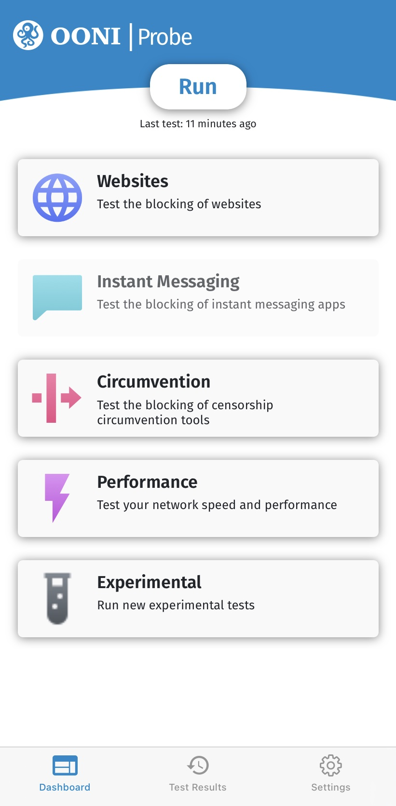
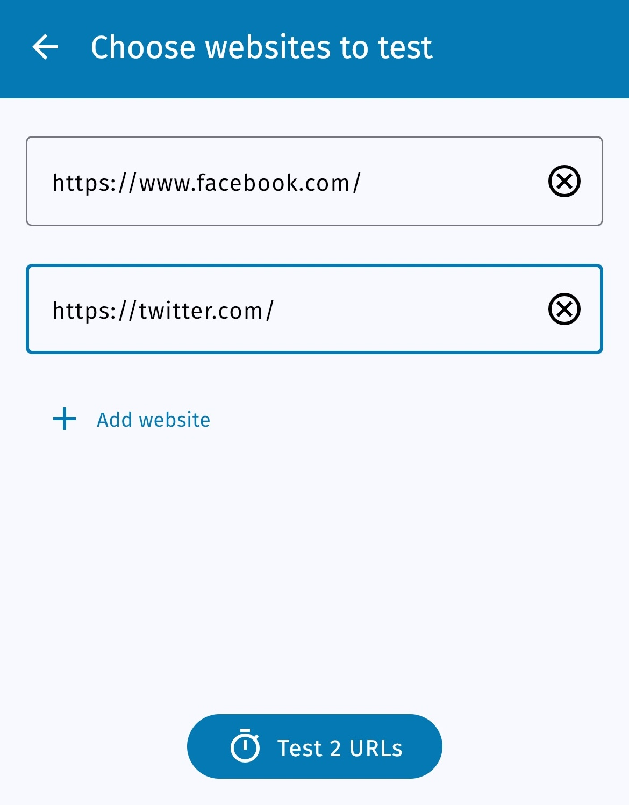
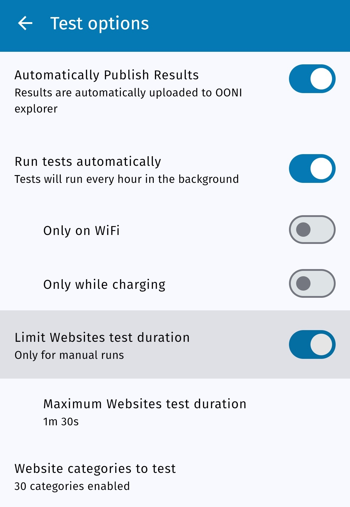
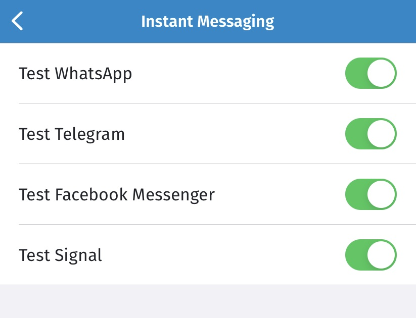
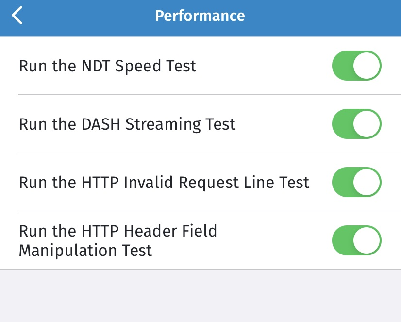
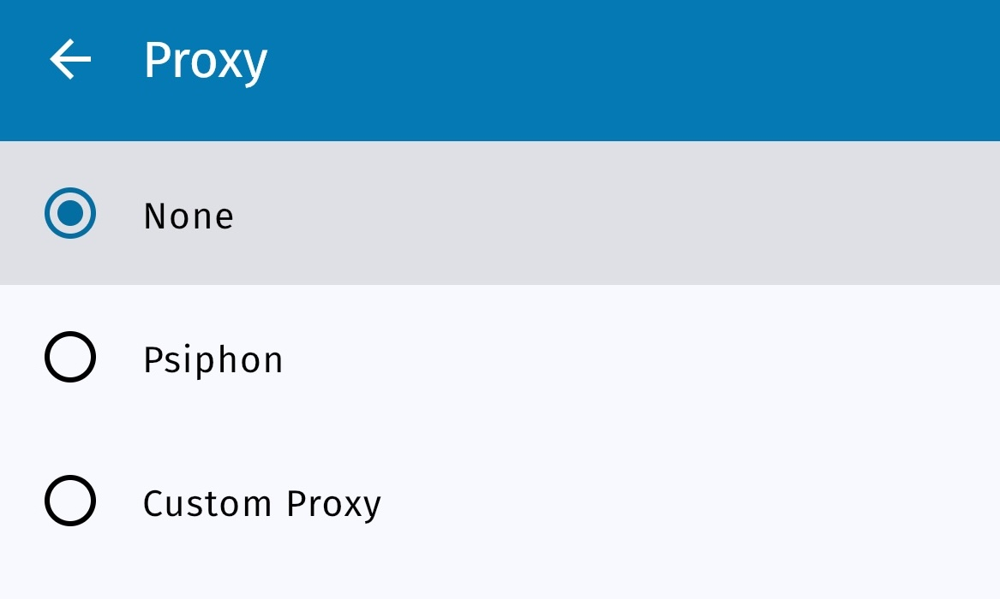
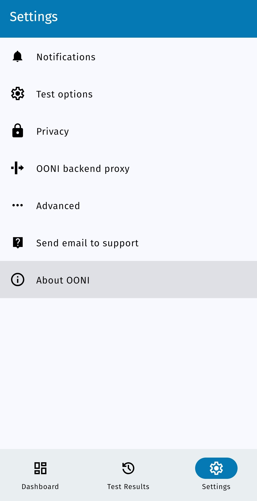

**Last updated:** 18th November 2024

**OONI Probe Mobile version:** 3.7.1, 4.0.0 (for OONI Run section only)

**Access the user guide in other languages:** [فارسی](/fa/support/ooni-probe-mobile), [Русский](/ru/support/ooni-probe-mobile), [Deutsch](https://ooni.org/de/support/ooni-probe-mobile), [Türkçe](/tr/support/ooni-probe-mobile), [Tiếng Việt](/vi/support/ooni-probe-mobile), [မြန်မာ](/my/support/ooni-probe-mobile)

{{}}

OONI Probe is a [free and open source](https://github.com/ooni/probe) app that you can use to measure internet censorship and other forms of network interference. This user guide provides **step-by-step instructions** on how to install, run, and customize your use of the [OONI Probe mobile app](https://ooni.org/install/mobile).

**What you will get from this guide:**

* Learn how to run OONI Probe Mobile to:
  * Test the blocking of websites
  * Test the blocking of instant messaging apps
  * Test the blocking of circumvention tools
  * Measure your network speed and performance
* Customize your OONI Probe testing to websites of your choice
* Learn how to access and share your OONI Probe test results
* Configure your OONI Probe app settings

Upon reading this guide, we hope you will feel empowered to share your OONI Probe knowledge and skills with others!

The following table of contents should help with navigating the guide.



## Introduction to OONI Probe

OONI Probe is [free and open source software](https://github.com/ooni/probe) designed to measure internet censorship and other forms of network interference. Since 2012, this software has been developed by the [Open Observatory of Network Interference (OONI)](https://ooni.org/), a non-profit project that was originally born out of the [Tor Project](https://www.torproject.org/).

With the OONI Probe app (available for both [mobile](https://ooni.org/install/mobile) and [desktop](https://ooni.org/install/desktop) platforms), you can run [network measurement tests](https://ooni.org/nettest/) to check the following:

* Blocking of [websites](https://ooni.org/nettest/web-connectivity/);
* Blocking of instant messaging apps ([WhatsApp](https://ooni.org/nettest/whatsapp/), [Facebook Messenger](https://ooni.org/nettest/facebook-messenger/), [Telegram](https://ooni.org/nettest/telegram/), [Signal](https://ooni.org/nettest/signal));
* Blocking of circumvention tools ([Tor](https://ooni.org/nettest/tor/), [Tor Snowflake](https://ooni.org/nettest/tor-snowflake/), [Psiphon](https://ooni.org/nettest/psiphon/));
* Presence of systems ([middleboxes](https://ooni.org/nettest/http-header-field-manipulation/)) on your network that might be responsible for censorship and/or surveillance;
* [Speed and performance](https://ooni.org/nettest/ndt/) of your network and [performance of your video streaming](https://ooni.org/nettest/dash/).

As soon as you run OONI Probe, your test results are automatically sent to OONI servers, [processed](https://github.com/ooni/pipeline), and [openly published](https://ooni.org/data/) in near real-time (unless you opt-out of the publication of your test results).

OONI [openly publishes OONI Probe test results](https://ooni.org/data/) gathered from around the world to:

* Increase **transparency of internet censorship** worldwide;
* Share **evidence of internet censorship** and other forms of network interference;
* Enable the **independent verification** of OONI censorship findings;
* Support **reproducible research**;
* Support **research, policy, legal, and advocacy efforts** around the world;
* Support **public debate** on information controls.

To enable public access to OONI Probe test results (more commonly referred to as “measurements”), the OONI team makes them available on [OONI Explorer](https://explorer.ooni.org/): a web platform that provides charts based on measurement coverage and a search tool for exploring the measurements.

As [OONI Explorer](https://explorer.ooni.org/) hosts more than 2 billion network measurements collected from 28,000 networks in 242 countries and territories since 2012, it is likely the **largest global open data resource on internet censorship** to date.

By running OONI Probe, you will:

* Learn whether and how your Internet Service Provider (ISP) is censoring access to specific websites and apps;
* Contribute measurements that will be publicly archived, enabling the global internet freedom community to monitor, detect, and fight against internet censorship.

This guide aims to walk you through using the [OONI Probe mobile app](https://ooni.org/install/mobile) so that you can join a global community measuring internet censorship.

### Disclaimer

As OONI Probe is designed to measure internet censorship, running it may be [risky](https://ooni.org/about/risks/) for some people in some countries.

Some things to take into account:

* **OONI Probe is not a privacy tool.** Anyone monitoring your internet activity (e.g. government, ISP, employer) may see that you are running OONI Probe (just the way they can probably see all other software you run).
* **OONI Probe is an investigatory tool.** Some OONI Probe tests are explicitly designed to uncover internet censorship.
* **[Your threat model](https://www.eff.org/keeping-your-site-alive/evaluating-your-threat-model).** A high-profile activist already under heavy surveillance, for example, might attract more attention when running OONI Probe.
* **The laws and regulations of the country you’re running OONI Probe from.** Best to consult with local lawyers.
* **The types of websites you test.** You might test legally banned (in some countries), provocative or objectionable [websites](https://ooni.org/support/faq/#which-websites-will-i-test-for-censorship-with-ooni-probe) through the use of OONI Probe.
* **The types of OONI Probe tests you run.** Not all [OONI Probe tests](https://ooni.org/nettest/) carry the same weight in terms of potential risk. OONI Probe, for example, includes the [NDT test](https://ooni.org/nettest/ndt/) (designed to measure the speed and performance of a network) which may be viewed as less political or controversial in comparison to other tests designed to measure the blocking of websites or apps.
* **Whether you publish your measurements or not.** OONI [openly publishes measurements](https://ooni.org/data/) collected from OONI Probe users to increase transparency of internet censorship around the world. We do our best not to publish your IP address or any other potentially personally-identifiable information. Learn more in our [Data Policy](https://ooni.org/about/data-policy).

To learn more about potential risks associated with the use of OONI Probe, please refer to our relevant [documentation](https://ooni.org/about/risks/).

## Installing OONI Probe Mobile

The OONI Probe mobile app is available for [Android](https://play.google.com/store/apps/details?id=org.openobservatory.ooniprobe), [F-Droid](https://f-droid.org/repository/browse/?fdid=org.openobservatory.ooniprobe), and [iOS](https://apps.apple.com/us/app/ooni-probe/id1199566366).

You can install the OONI Probe mobile app through the following steps:

**Step 1.** Visit the OONI Probe Mobile installation page (on the OONI website): <https://ooni.org/install/mobile>

{{}}

**Step 2.** Depending on your operating system (Android, iOS, F-Droid), tap the relevant app store button.

{{}}

**Step 3.** Install the OONI Probe mobile app (from your app store).

{{}}

**Step 4.** Open your OONI Probe mobile app.

{{}}

### Onboarding: Informed Consent

Now that you have installed and opened your OONI Probe mobile app, you will be presented with some basic information about OONI Probe as part of the onboarding process.

You will also learn about [potential risks](https://ooni.org/about/risks/) associated with running OONI Probe. To ensure that you understand these potential risks, we have included a short quiz to practically acquire your consent. Answering the quiz questions correctly is a requirement for using OONI Probe.

In the final step of the onboarding process, we share the types of data that are collected by default when running OONI Probe (linking to our [Data Policy](https://ooni.org/about/data-policy) for further information). You can opt-in to sharing crash reports to help us improve OONI Probe.

Below we walk you through the onboarding process.

**Step 1.** Once you have read basic information about OONI Probe, tap **Got It**.

{{}}

**Step 2.** The next screen shares a summary of potential risks associated with running OONI Probe. Tap **Learn more** to read our [documentation](https://ooni.org/about/risks/) explaining potential risks.

{{}}

**Step 3.** Once you have learned about potential risks associated with running OONI Probe, tap **I understand**.

{{}}

**Step 4.** The following quiz is based on the information you just read in the previous screen. Tap **True** to demonstrate your understanding of the statement.

{{}}

You will see that **True** is the correct answer. If you tap False, you will receive an explanation on why the answer is wrong.

{{}}

**Step 5.** Tap **True** to demonstrate your understanding of the statement (in the second part of the quiz).

{{}}

You will see that **True** is the correct answer. If you tap False, you will receive an explanation on why the answer is wrong.

{{}}

**Step 6.** If you would like the app to collect the measurements automatically, tap the **Sounds great** button. 

{{}}

**Step 7.** If you would like to share [crash reports](https://ooni.org/about/data-policy#data-we-collect) to help us improve OONI Probe, tap **Yes**.

{{}}

**Step 8.** The following screen shares information about the types of data that OONI collects and publishes by default (every time you run OONI Probe). You can learn more by tapping on **[OONI’s Data Policy](https://ooni.org/about/data-policy)** on the screen.

{{}}

**Step 9.** Tap **OK**.

You have now completed the onboarding process and are ready to start using OONI Probe!

## Running OONI Probe Mobile

Now that you have completed the onboarding process, you can start running OONI Probe to measure internet censorship!

The **Dashboard** of the OONI Probe mobile app includes 5 cards, each of which entails OONI Probe tests:

* **Websites card.** Includes OONI’s [Web Connectivity test](https://ooni.org/nettest/web-connectivity/) which measures the [blocking of websites](https://ooni.org/support/faq/#which-websites-will-i-test-for-censorship-with-ooni-probe).
* **Instant Messaging card.** Includes OONI’s [WhatsApp](https://ooni.org/nettest/whatsapp/), [Facebook Messenger](https://ooni.org/nettest/facebook-messenger/), [Telegram](https://ooni.org/nettest/telegram/), and [Signal](https://ooni.org/nettest/signal) tests which check if these apps are blocked.
* **Circumvention card.** Includes OONI’s [Tor](https://ooni.org/nettest/tor/) and [Psiphon](https://ooni.org/nettest/psiphon/) which check if these censorship circumvention tools are blocked.
* **Performance card.** Includes the [NDT speed test](https://ooni.org/nettest/ndt/), the [DASH video streaming performance test](https://ooni.org/nettest/dash/), and OONI’s [middlebox](https://ooni.org/support/glossary/#middlebox) tests ([HTTP Header Field Manipulation](https://ooni.org/nettest/http-header-field-manipulation/) test and [HTTP Invalid Request Line](https://ooni.org/nettest/http-invalid-request-line/) test).
* **Experimental card.** Includes multiple new experimental tests developed by the OONI team. These tests might change over time. You can view these tests [here](https://github.com/ooni/spec/tree/master/nettests).
* **Installed OONI Run links.** Beneath all the cards you will see a section with the OONI Run links you have installed on your app. You can read more about OONI Run links [here](https://ooni.org/support/ooni-run/).

**Step 1.** Tap **Run** to run your first OONI Probe tests.

{{}}

Once you tap "Run" OONI Probe will launch **all tests available** (included in all cards) in one go! 

{{}}

If you tap the **Running line** the fullscale window with **ongoing tests** will open: 

{{}}

{{}}

{{}}

{{}}

{{}}

OONI Probe should have run all tests within a few minutes (though this depends on the performance of the network you’re connected to, and may take longer in some cases). If the performance of your network is not good enough and the tests take too long, you can **stop the ongoing test** by tapping the **Stop test** button. 

{{}}

Once the tests have ended, your OONI Probe test results will automatically get published on [OONI Explorer](https://explorer.ooni.org/) and on the [OONI API](https://api.ooni.io/).

Would you rather limit your testing to a specific test type (card)? In the following sections, we share instructions on how to do that.

### Measuring the blocking of websites

If you only want to measure the blocking of websites, you can do so through the following steps:

**Step 1.** Tap the **Websites** card in the Dashboard of your OONI Probe mobile app.

{{}}

**Step 2.** Tap **Run** in the Websites card.

{{}}

You are now running OONI’s [Web Connectivity test](https://ooni.org/nettest/web-connectivity/) to measure the blocking of websites.

{{}}

Your OONI Probe test results will automatically get published on [OONI Explorer](https://explorer.ooni.org/) and on the [OONI API](https://api.ooni.io/).

**Which websites are tested?**

By default, you will test websites included in the following 2 lists:

* **[Global test list](https://github.com/citizenlab/test-lists/blob/master/lists/global.csv)**. Includes internationally relevant websites (such as facebook.com).
* **[Country-specific test list](https://github.com/citizenlab/test-lists/tree/master/lists)**. Includes websites that are only relevant to the country you’re running OONI Probe from.

No matter which country you’re running OONI Probe from, you will *always* test websites from the [global test list](https://github.com/citizenlab/test-lists/blob/master/lists/global.csv).

OONI Probe will automatically determine which [country-specific list](https://github.com/citizenlab/test-lists/tree/master/lists) to pick for testing based on the country you’re running OONI Probe from. For example, if you run OONI Probe in Brazil, you will test websites from the global test list and from the Brazilian test list. If you travel to Germany and run OONI Probe, it will test the websites from the global and German test lists. But if you’re running OONI Probe from a country which doesn’t have a country-specific test list yet (because it hasn’t been created), you will only test websites from the global list.

If you would like to contribute to the [Citizen Lab test lists](https://github.com/citizenlab/test-lists/tree/master/lists) (which include the default websites tested by OONI Probe users worldwide), please refer to our relevant [documentation](https://ooni.org/get-involved/contribute-test-lists) or use our [Test Lists Editor](https://test-lists.ooni.org/).

**Note:** To avoid consuming all your mobile data, **OONI Probe will only test as many websites as it’s able to test within 90 seconds** when you tap “Run” (either from the Dashboard or from the Websites card). These websites (which are tested within 90 seconds) are randomly selected from the [global](https://github.com/citizenlab/test-lists/blob/master/lists/global.csv) and (relevant) [country-specific](https://github.com/citizenlab/test-lists/tree/master/lists) test lists. Every time you tap “Run”, you will test a different, random selection of websites (from the global and country-specific test lists) within 90 seconds. Therefore, the more times you tap “Run”, the more websites you will test.

If you would like to test a larger selection of websites, or test entirely different websites, please refer to the **Customizing website testing** section of this guide.

### Measuring the blocking of instant messaging apps

If you only want to measure the blocking of instant messaging apps, you can do so through the following steps:

**Step 1.** Tap the **Instant Messaging** card in the Dashboard of your OONI Probe mobile app.

{{}}

**Step 2.** Tap **Run** in the Instant Messaging card.

{{}}

You are now running OONI’s [WhatsApp](https://ooni.org/nettest/whatsapp/), [Facebook Messenger](https://ooni.org/nettest/facebook-messenger/), [Telegram](https://ooni.org/nettest/telegram/), and [Signal](https://ooni.org/nettest/signal) tests to measure the blocking of these apps.

{{}}

Your OONI Probe test results will automatically get published on [OONI Explorer](https://explorer.ooni.org/) and on the [OONI API](https://api.ooni.io/).

If you would like to limit your testing to only WhatsApp, Facebook Messenger, Telegram, or Signal, please refer to the **Configuring your OONI Probe settings** section of this guide.

### Measuring the blocking of circumvention tools

If you only want to measure the blocking of censorship circumvention tools, you can do so through the following steps:

**Step 1.** Tap the **Circumvention** card in the Dashboard of your OONI Probe mobile app.

{{}}

**Step 2.** Tap **Run** in the Circumvention card.

{{}}

You are now running OONI’s [Tor](https://ooni.org/nettest/tor/) and [Psiphon](https://ooni.org/nettest/psiphon/) tests to measure the reachability of these tools.

{{}}

Your OONI Probe test results will automatically get published on [OONI Explorer](https://explorer.ooni.org/) and on the [OONI API](https://api.ooni.io/).

If you would like to limit your testing to only Tor or Psiphon, please refer to the **Configuring your OONI Probe settings** section of this guide.

### Measuring network performance

If you only want to measure network performance, you can do so through the following steps:

**Step 1.** Tap the **Performance** card in the Dashboard of your OONI Probe mobile app.

{{}}

**Step 2.** Tap **Run** in the Performance card.

{{}}

You are now running the [NDT speed test](https://ooni.org/nettest/ndt/), the [DASH video streaming performance test](https://ooni.org/nettest/dash/), and OONI’s [middlebox](https://ooni.org/support/glossary/#middlebox) tests ([HTTP Header Field Manipulation](https://ooni.org/nettest/http-header-field-manipulation/) test and [HTTP Invalid Request Line](https://ooni.org/nettest/http-invalid-request-line/) test).

{{}}

Your OONI Probe test results will automatically get published on [OONI Explorer](https://explorer.ooni.org/) and on the [OONI API](https://api.ooni.io/).

**Disclaimer:** The [NDT](https://ooni.org/nettest/ndt/) and [DASH](https://ooni.org/nettest/dash/) tests are conducted against third-party servers provided by [Measurement Lab (M-Lab)](https://www.measurementlab.net/). If you run these tests, M-Lab will collect and publish your IP address for research purposes, irrespective of your OONI Probe settings. Learn more about M-Lab’s data governance through its [privacy statement](https://www.measurementlab.net/privacy/).

If you would like to limit your testing to only one (or a few) of the tests included in the Performance card, please refer to the **Configuring your OONI Probe settings** section of this guide.

## Customizing your website testing

By default, when testing websites with OONI Probe, you measure the URLs included in the [Citizen Lab test lists](https://github.com/citizenlab/test-lists/tree/master/lists). In other words, if you just tap “Run” (in the Dashboard or Websites card of the OONI Probe app), you will test a random selection of websites taken from the [Citizen Lab test lists](https://github.com/citizenlab/test-lists/tree/master/lists). These lists have been created through collaboration with in-country researchers and experts. As they are [openly available on GitHub](https://github.com/citizenlab/test-lists/tree/master/lists), anyone can potentially review them, [contribute](https://ooni.org/get-involved/contribute-test-lists) URLs, and propose the removal of certain URLs. And it is important that we continue [reviewing and updating](https://ooni.org/get-involved/contribute-test-lists) these lists, since they contain the websites that are tested by most OONI Probe users regularly around the world.

But if you would rather limit your testing to websites of your choice, you can do so through the OONI Probe mobile app.

You can customize your website testing in the following ways:

* Limit your testing to **specific website categories** (such as news media and human rights content);
* Only test **websites you care about**;
* Test **your own list**;
* Test *all* URLs in the ([relevant](https://ooni.org/support/faq/#which-websites-will-i-test-for-censorship-with-ooni-probe)) [Citizen Lab test lists](https://github.com/citizenlab/test-lists/tree/master/lists) (rather than testing a random selection of websites in 90 seconds); 

The following sections explain how you can do each of the above.

### Testing specific website categories

When you tap “Run” in the OONI Probe app, you test websites from the [global](https://github.com/citizenlab/test-lists/blob/master/lists/global.csv) and ([relevant](https://ooni.org/support/faq/#which-websites-will-i-test-for-censorship-with-ooni-probe)) [country-specific Citizen Lab test lists](https://github.com/citizenlab/test-lists/tree/master/lists).

These websites have been categorized based on [30 standardized categories](https://ooni.org/get-involved/contribute-test-lists/#what-are-test-lists). These categories range from news media, culture, and human rights issues to more provocative or objectionable categories, like pornography (the latter are included because they are more likely to be blocked, enabling the detection of censorship techniques adopted by ISPs).

By default, all 30 categories are enabled in the OONI Probe mobile app to encourage the testing of more diverse websites, enhancing the possibility of discovering more forms of website censorship.

But if you don’t feel comfortable testing all 30 categories of websites (particularly if they include content that is illegal, provocative, or objectionable in your country), or are only interested in testing certain types of content (such as news media), you can limit your OONI Probe testing to the website categories of your choice. The same categories will be tested during the background tests if you enable **Automated testing** option.

**Step 1.** Tap **Settings** in the bottom navigation bar of your OONI Probe mobile app.

{{}}

**Step 2.** Tap **Test options** in the settings.

{{}}

**Step 3.** Tap **Websites** (in the “Test options” setting).

{{}}

**Step 4.** Tap **Website categories to test** (in the “Websites” section of the “Test options” setting).

{{}}

You will now see the [30 categories](https://github.com/citizenlab/test-lists/blob/master/lists/00-LEGEND-new_category_codes.csv) of websites that OONI Probe tests by default. All of these categories are enabled.

{{}}

**Step 5.** **Disable** the website categories that you do **not** want to test.

{{}}

In the above example, we have disabled 5 categories ("LGBTQI", "Political Criticism", "Pornography", “Provocative Attire”, "Religion").

When you go back, you can see that only 25 categories are now enabled (since 5 have been disabled).

{{}}

You can revisit this setting anytime to enable or disable the website categories of your choice.

### Testing websites of your choice

You can test the websites you care about directly through the following steps:

**Step 1.** Tap the **Websites** card in your OONI Probe mobile app.

{{}}

**Step 2.** Tap the **Choose websites** button in the Websites card.

{{}}

You will now see a screen where you can add the website(s) you want to test.

{{}}

**Step 3.** **Type the URL** of the website you want to test. In the following example, we have typed `https://www.facebook.com`.

{{}}

**Important:** Please ensure that the [URL](https://ooni.org/support/glossary/#url) is typed correctly. If it is mis-typed, OONI Probe will *not* test the intended website and this will potentially lead to inaccurate test results.

A few things to keep in mind:

* Is the website on **HTTP** or **HTTPS**? If the latter, please add an extra `s` after `http`.
* Does the [domain](https://ooni.org/support/glossary/#domain-name) include `www`? If so, please include it.

To ensure that a [URL](https://ooni.org/support/glossary/#url) is typed accurately, **please check how it appears when accessed from a normal browser**.

**Step 4.** Tap the plus sign to create a new line for adding another website for testing.

**Step 5.** **Type another URL** that you would like to test. In the following example, we have added `https://twitter.com`.

{{}}

If you change your mind and would like to remove any of the URLs you have added, you can do so by tapping on the red icon next to each URL.

You can continue to add as many URLs as you like. In the following example, we have added `https://www.gutenberg.org`.

{{}}

**Step 6.** Tap **Run** to test all of the websites you have added.

You will now see OONI Probe testing the websites of your choice!

{{}}

Your OONI Probe test results will automatically get published on [OONI Explorer](https://explorer.ooni.org/) and on the [OONI API](https://api.ooni.io/).

### Testing a custom list of websites

Manually adding URLs one by one (through the “Choose websites” button of the OONI Probe mobile app) can potentially be tedious -- particularly if it involves more than a dozen URLs. Researchers are often interested in testing their own list of websites, which can include hundreds of URLs.

You can create a customized list of websites for testing with [**OONI Run**](https://run.ooni.org/). With OONI Run, you can test your own list of websites through the following steps:

**Step 1. Create an account on OONI Run platform.** 

Click “**Log In To Create OONI Run Link**” button and add your **email address** in the Email slot.

{{}}

**Note:** We do not store email addresses when you log in, but only when you create an OONI Run link. We store your email address so that when OONI Probe users receive an OONI Run link from you, they can trust it based on your email address (which is displayed in the OONI Run link you create). This can help reduce the risk of running malicious links.

Once you have added your email address, click the “**Send me the Link**” button. Click the link (“Please login here”) sent to your email to log into the OONI Run platform.

**Step 2. Create your OONI Run link.** 

You have now logged into the OONI Run platform and can start creating OONI Run links. Here you can customise the title, description, timeframe and a list of URLs for testing. To do this, please use the following instructions: 

First of all, add a **title** for your OONI Run link. Optionally, you can add translations for your title.

**Note:** This title will appear in the OONI Run link card that testers will install in their [OONI Probe mobile app](https://ooni.org/install/mobile). We recommend using a short title which clearly communicates the type of testing performed. In the above example, we have added “Test social media” as a title because we aim to include social media websites for testing in our OONI Run link.

Next add a **short description** and a **longer description** for your OONI Run link. Optionally, you can add translations. This is an opportunity to communicate details about the testing, and why it’s important.

Finally, set an **expiration date** for your OONI Run link and click “Add URL” to **start adding URLs** to your OONI Run link.

**Step 3.** To add a **list of URLs**, compile your list of websites in a text editor, where each URL is in a separate line. Below we share an example.

{{}}

**Important:** Please ensure that each [URL](https://ooni.org/support/glossary/#url) is typed correctly. If it is mis-typed, OONI Probe will *not* test the intended website and this will potentially lead to inaccurate test results.

A few things to keep in mind:

* Is the website on **HTTP** or **HTTPS**? If the latter, please add an extra `s` after `http`.
* Does the [domain](https://ooni.org/support/glossary/#domain-name) include `www`? If so, please include it.
* If the website is on HTTPS (e.g. `https://www.hrw.org/`), you probably don’t need to specify a webpage (e.g. `https://www.hrw.org/publications`), since ISPs usually cannot limit blocking to a specific webpage when it’s hosted on HTTPS. Rather, they would have to block access to the entire website.

To ensure that each [URL](https://ooni.org/support/glossary/#url) is typed accurately, **please copy-paste it from a browser.**

Once your list is ready, **copy** your list of URLs (from your text editor) and **paste** your list of URLs into the first URL slot of the OONI Run page.

You should now see that all of your URLs have populated each URL row in the [OONI Run](https://run.ooni.org/) page.

{{}}

If you notice any empty rows (or otherwise misformatted URLs), please delete them by clicking on the **deletion icon**.

{{}}

**Step 4.** Click the **Create Link** button to create your OONI Run link.

You will now see your OONI Run link page which includes the title and description that you added, the expiration date of the link, as well as the list of URLs that you added for testing.

**Step 5.** To **share** your OONI Run link, click the **copy icon** next to your OONI Run link in the “Share this link” section. Then share the copied link with [OONI Probe Mobile](https://ooni.org/install/mobile) users who you would like to perform testing.

**Step 6.** **Open** the link with your **OONI Probe mobile app** (not with a web browser).

{{}}

You should now be able to install the shared link in your OONI Probe mobile app if you are using Android device, or see the list of websites for testing if you are using iOS.

**Step 7.** **Install the link**, or tap **Run** to test your list of websites.

{{}}

**Step 8.** **Find measurements** collected by those who ran your OONI Run link. 

Once you run some tests, your OONI Probe test results will automatically get published on [OONI Explorer](https://explorer.ooni.org/) and on the [OONI API](https://api.ooni.io/). You can find and aggregate measurements from your specific OONI Run v2 link through OONI Explorer based on the ID of your OONI Run v2 link (“**OONI Run Link ID**”).

The ID of your OONI Run link are the **last digits** displayed in the link. In the following example, the OONI Run link ID is `10015`.

{{}}

Paste these digits to the **'OONI Run Link ID'** field of OONI Explorer [MAT](https://explorer.ooni.org/chart/mat) or [Search](https://explorer.ooni.org/search/) interfaces to **find measurements** collected by all those who ran your OONI Run link through the following steps.

**Step 9.** **Edit the link**

If you would like to edit your OONI Run link, click the **Edit** button in the top right corner.

Alternatively, click the **Update Now** button next to the link expiration date. Both actions will enable you to edit the data in your OONI Run link.

Once the OONI Run link is updated, it will be automatically updated for all users who have it installed in their OONI Probe application if they have “Install updates automatically” option enabled. Alternatively, they will be able to update the OONI Run link manually. 

**Note:** If you want to learn more about OONI Run, please check out our [user guide for OONI Run](https://ooni.org/support/ooni-run/). 

### Testing all websites from the Citizen Lab test lists

Due to bandwidth constraints, the OONI Probe mobile app only tests as many websites as it can connect to within 90 seconds (based on the default settings).

If you’re connected to WiFi and would like to test all websites from the ([relevant](https://ooni.org/support/faq/#which-websites-will-i-test-for-censorship-with-ooni-probe)) [Citizen Lab test lists](https://github.com/citizenlab/test-lists/tree/master/lists) in one go, you can do so through the following steps:

**Step 1.** Tap **Settings** in the bottom navigation bar of your OONI Probe mobile app.

{{}}

**Step 2.** Tap **Test options** in the settings.

{{}}

**Step 3.** Tap **Websites** (in the “Test options” setting).

{{}}

You now see the OONI Probe website settings.

{{}}

**Step 4.** Disable **Limit test duration** (in the “Websites” section of the “Test options” setting).

{{}}

There is now no time limit in your website testing. This means that OONI Probe can test all websites included in the [relevant Citizen Lab test lists](https://ooni.org/support/faq/#which-websites-will-i-test-for-censorship-with-ooni-probe) every time you tap “Run”.

**Alternatively**: If you would like to test more websites within a longer time duration (but without necessarily disabling the time limit and testing all websites), you can do so through the following steps:

**Step 1.** Tap **Test duration** (in the “Websites” section of the “Test options” setting).

{{}}

By default, the website testing duration is set to **90 seconds**. This means that OONI Probe will only test as many websites (from the [relevant Citizen Lab test lists](https://ooni.org/support/faq/#which-websites-will-i-test-for-censorship-with-ooni-probe)) as it can connect to within 90 seconds.

**Step 2.** To change the test duration, **type the number of seconds** that you would like OONI Probe to test websites for. In the following example, we have typed `360` which would make OONI Probe test websites for 6 minutes.

{{}}

## Accessing your OONI Probe test results

As soon as you run an OONI Probe test, you can immediately access the test results directly in your OONI Probe mobile app.

**Step 1.** Tap **Test Results** in the bottom navigation bar of your OONI Probe mobile app.

{{}}

You are now presented with an overview of all your OONI Probe test results.

In this overview, the test results are grouped based on the 4 thematic cards of the app (“Websites”, “Instant Messaging”, “Circumvention”, “Performance”).

In each thematic test result card, you have an overview of:

* The **network** (e.g. `AS16010` - Magticom Ltd.) on which each test was run;
* The **date and time** of testing (e.g. 22nd August 2022 at 12:01 local time);
* **Summary of relevant findings** (e.g. 3 instant messaging apps were found accessible, while none blocked).

This overview can potentially help with comparing results across networks (if you run tests on many different networks), and provides a bird’s-eye view of the findings.

To dig deeper (and access the relevant measurement data), you would need to tap on each test result, which we explain in the following sections.

**Deleting test results**

In the top menu (of the Test Results screen), we share an overview of:

* The **number of OONI Probe tests** you have run so far;
* The **number of networks** on which you have run OONI Probe so far;
* Your OONI Probe **data usage**.

{{}}

**Step 1.** If you would like to delete your OONI Probe test results (for example, to save up on storage), **tap on the deletion icon** in the top right corner.

Don’t worry about your test results getting lost; as soon as you run an OONI Probe test, your results are automatically published on [OONI Explorer](https://explorer.ooni.org/) and on the [OONI API](https://api.ooni.io/) in near real-time. If you would like to opt out of the publication of your test results, please refer to the “Configuring your OONI Probe settings: Privacy” section of this guide.

Upon tapping on the deletion icon, you will see the following pop-up:

{{}}

**Step 2.** Tap **Delete** if you would like to delete all of your OONI Probe test results. Otherwise, tap **Cancel**.

**Filtering test results**

In the Test Results screen of your OONI Probe mobile app, the results are presented chronologically, with the latest tests listed first.

{{}}

**Step 1.** If you would like to filter your results based on a specific testing category (“Websites”, “Instant Messaging”, “Circumvention”, “Performance”), tap **All Tests** (or “Filter Tests”, or the arrow in that row).

{{}}

You are now presented with a drop-down menu which lists all the thematic testing categories.

**Step 2.** Tap on the category based on which you would like to filter the results. In the following example, we have tapped on “Websites”.

{{}}

{{}}

You have now filtered the results based on the “Websites” category, enabling an overview of the website testing results. In the above example, we can see that out of 3 websites tested on Magticom Ltd. (on 2nd August 2022 at 12:01 local time), 0 of those websites presented signs of blocking. 

While the Test Results screen provides an initial overview of results, you can dig deeper and access the data pertaining to each test, as explained in the following sections.

### Websites

You can access your OONI Probe results from the testing of websites through the following steps:

**Step 1.** Tap **Websites** in the Test Results screen of your OONI Probe mobile app.

{{}}

You will now see a list of all the websites that you have tested so far.

In the top header, we share an overview of your website testing results. Next to each tested URL, there will either be a green tick (indicating website accessibility), or an orange exclamation mark (indicating potential website blocking).

**Step 2.** Tap on the **row of a tested website** (to access the data from the testing of that website).

{{}}

{{}}

You now have access to the data pertaining to the testing of a specific website. The following measurement page pertains to the testing of `https://telegram.org/`.

{{}}

Through this measurement page, you are presented with an overview of the test result. In this case, we can see that `https://telegram.org/` was found accessible when tested on Magticom Ltd. (AS16010) on 2nd August 2022 at 11:10 local time.

If a website was found (potentially) blocked, it would be presented in the website test results with an orange exclamation mark, as illustrated below.

{{}}

You can access the measurement page pertaining to the above (potentially) blocked site by tapping on the row with the tested site.

{{}}

In this case, we can see that `http://1tv.ru` presented signs of blocking (“[anomaly](https://ooni.org/support/glossary/#network-anomaly)”) when tested on Magticom Ltd (AS16010) on 2nd August 2022 at 10:16 local time. In particular, we can see that it presented signs of [DNS tampering](https://ooni.org/support/glossary/#dns-tampering) (based on the heuristics of the [OONI Web Connectivity test](https://ooni.org/nettest/web-connectivity/)). This means that Magticom Ltd. may have blocked access to `http://1tv.ru` (on 2nd August 2022) by means of TCP/IP blocking.

As [false positives](https://ooni.org/support/glossary/#false-positive) can occur, we annotate test results that failed to meet all of the criteria of our [Web Connectivity test](https://ooni.org/nettest/web-connectivity/) as “[anomalies](https://ooni.org/support/faq/#how-can-i-interpret-ooni-data)” (rather than “confirmed blocked”), indicating that the tested website *might* be blocked.

In evaluating the blocking of a website, it is useful to examine relevant measurements (from the testing of a specific website on the same network over time) in **aggregate**, which you can do through [OONI Explorer](https://explorer.ooni.org/) (where we publish all test results). OONI Explorer also [displays measurements for all “confirmed blocked”](https://explorer.ooni.org/search?since=2021-02-24&only=confirmed) cases, where we automatically confirm the blocking of websites based on [block pages](https://ooni.org/support/glossary/#block-page).

When the testing of a website presents an [anomaly](https://ooni.org/support/faq/#how-can-i-interpret-ooni-data), it is particularly important to re-test it (on the same network) as many times as possible, as this can help with ruling out [false positives](https://ooni.org/support/glossary/#false-positive) (if, for example, we see a site failing in the same ways every time it is tested). One anomalous measurement alone is often not enough to evaluate blocking (particularly since testing can fail due to several networking reasons, which may have nothing to do with censorship).

**Step 3.** To retest a tested URL, tap the **retry icon** on the top right corner of the website test results page in your OONI Probe app.

{{}}

You will then see the following pop-up window, asking if you would like to retest all of the websites (that you have already tested).

{{}}

**Step 4.** Tap **Run** to retest the websites.

### Instant Messaging

You can access your OONI Probe results from the testing of instant messaging apps through the following steps:

**Step 1.** Tap **Instant Messaging** in the Test Results screen of your OONI Probe mobile app.

{{}}

{{}}

You will now see a list of the instant messaging apps (WhatsApp, Facebook Messenger, Telegram) that you have tested so far.

In the top header, we share an overview of your instant messaging app testing results. Next to each tested app, there will either be a green tick (indicating app reachability), or an orange exclamation mark (indicating potential app blocking).

**Step 2.** Tap on the **row of a tested app** (to access the data from the testing of that app).

{{}}

The following measurement page pertains to the testing of WhatsApp.

{{}}

Through this measurement page, you are presented with an overview of the WhatsApp test result. In this case, we can see that WhatsApp was found accessible when tested on Magticom Ltd. (AS16010) on 2nd August 2022 at 10:16 local time. This conclusion is reached because [OONI’s WhatsApp test](https://ooni.org/nettest/whatsapp/) was able to successfully connect to WhatsApp’s endpoints, registration service, and web interface (`web.whatsapp.com`).

If WhatsApp was found (potentially) blocked, this test result would show an orange exclamation mark and information about why it’s potentially blocked (based on the heuristics of [OONI’s WhatsApp test](https://ooni.org/nettest/whatsapp/)).

Similarly, you can access Telegram test results through the instant messaging results in your OONI Probe app.

{{}}

In this case, we can see that Telegram was found accessible when tested on Magticom Ltd. (AS16010) on 2nd August 2022 at 10:16 local time. This conclusion is reached because [OONI’s Telegram test](https://ooni.org/nettest/telegram/) was able to successfully connect to Telegram’s endpoints and web interface (`web.telegram.org`).

If Telegram was found (potentially) blocked, this test result would show an orange exclamation mark and information about why it’s potentially blocked (based on the heuristics of [OONI’s Telegram test](https://ooni.org/nettest/telegram/)).

As you can see, there is a grey line at the bottom of the screen saying that the measurement was not uploaded to [OONI Explorer](https://explorer.ooni.org/) and the [OONI API](https://api.ooni.io/). This may have occurred due to poor network connectivity. To re-try uploading the measurements, tap **Upload**. 

You can access Signal test results through the instant messaging results in your OONI Probe app.

{{}}

In this case, we can see that Signal was found accessible when tested on Magticom Ltd. (AS16010) on 2nd August 2022 at 10:18 local time. This conclusion is reached because [OONI’s Signal test](https://ooni.org/nettest/signal) was able to successfully connect to Signal’s endpoints.

If Signal was found (potentially) blocked, this test result would show an orange exclamation mark and information about why it’s potentially blocked (based on the heuristics of [OONI’s Signal test](https://ooni.org/nettest/signal)).

In all cases, we recommend referring to OONI measurements published on [OONI Explorer](https://explorer.ooni.org/), where you can examine results in aggregate (which can help with ruling out [false positives](https://ooni.org/support/glossary/#false-positive) and confirming blocking).

### Circumvention

You can access your OONI Probe results from the testing of circumvention tools through the following steps:

**Step 1.** Tap **Circumvention** in the Test Results screen of your OONI Probe mobile app.

{{}}

{{}}

{{}}

You will now see a list of the censorship circumvention tools (Psiphon, Tor) that you have tested so far.

In the top header, we share an overview of your circumvention tool testing results. Next to each tested tool, there will either be a green tick (indicating reachability), or an orange exclamation mark (indicating potential blocking).

**Step 2.** Tap on the **row of a tested tool** (to access the data from its testing).

{{}}

The following measurement page pertains to the testing of [Psiphon](https://psiphon.ca/).

{{}}

Through this measurement page, you are presented with an overview of the Psiphon test result. In this case, we can see that Psiphon was reachable when tested on Magticom Ltd. (AS16010) on 2nd August 2022 at 13:11 local time. This conclusion is reached because [OONI’s Psiphon test](https://ooni.org/nettest/psiphon/) was able to successfully bootstrap a Psiphon connection.

If Psiphon was found (potentially) blocked, this test result would show an orange exclamation mark and information about why it’s potentially blocked (based on the heuristics of [OONI’s Psiphon test](https://ooni.org/nettest/psiphon/)).

Similarly, you can access [Tor](https://www.torproject.org/) test results through the circumvention results in your OONI Probe app.

{{}}

In this case, we can see that Tor was reachable when tested on Magticom Ltd. (AS16010) on 2nd August 2022 at 13:11 local time. This conclusion is reached because [OONI’s Tor test](https://ooni.org/nettest/tor/) was able to successfully connect to most of the default Tor bridges and to all Tor directory authorities.

If Tor was found (potentially) blocked, this test result would show an orange exclamation mark and information about why it’s potentially blocked (based on the heuristics of [OONI’s Tor test](https://ooni.org/nettest/tor/)).

### Performance

You can access your OONI Probe results from the testing of your network’s performance through the following steps:

**Step 1.** Tap **Performance** in the Test Results screen of your OONI Probe mobile app.

{{}}

{{}}

You will now see a list of the performance tests that you have run so far. In the top header, we share an overview of the results, with the main findings listed next to each test result.

**Step 2.** Tap on the **row of a test result** (to access relevant data).

{{}}

The following measurement page is from an [NDT speed test](https://ooni.org/nettest/ndt/).

{{}}

In this case, we can see that an [NDT speed test](https://ooni.org/nettest/ndt/) was run on Magticom Ltd. (AS16010) on 2nd August 2022 at 13:26 local time. When the test was performed, the download speed was 9.44 megabits per second, the upload speed was 11.5 megabits per second, and it took 151.6 milliseconds to establish a connection to an [M-Lab](https://www.measurementlab.net/) server (`mil03-IT`). This indicates average internet speed, given that the average ping (to this M-Lab server) is 453.3 milliseconds.

You can compare your NDT test results with what is offered in your internet plan provided by your Internet Service Provider (ISP).

You can access [DASH](https://ooni.org/nettest/dash/) results through the performance results in your OONI Probe app.

{{}}

In this case, we can see that a [DASH video streaming test](https://ooni.org/nettest/dash/) was run on Magticom Ltd. (AS16010) on 2nd August 2022 at 13:35 local time. When the test was performed, it was possible to stream up to 1080p (full HD) video without buffering, with the median bitrate being 6.07 megabits per second. This indicates that the user could stream high definition videos on that network if the streaming server was co-located with the measurement server.

You can compare your DASH test results with what is offered in your internet plan provided by your Internet Service Provider (ISP).

Through the performance card, you can also run two of OONI’s tests designed to measure the presence of [middleboxes](https://ooni.org/support/glossary/#middlebox) on tested networks:

* [HTTP Invalid Request Line test](https://ooni.org/nettest/http-invalid-request-line/)
* [HTTP Header Field Manipulation test](https://ooni.org/nettest/http-header-field-manipulation/)

A middlebox is a computer networking device that transforms, inspects, filters, or otherwise manipulates traffic for purposes other than packet forwarding. Many Internet Service Providers (ISPs) around the world use middleboxes to improve network performance, provide users with faster access to websites, and for a number of other networking purposes. Sometimes though, middleboxes are also used to implement internet censorship and/or surveillance.

You can access OONI’s [HTTP Invalid Request Line](https://ooni.org/nettest/http-invalid-request-line/) test results through the performance results in your OONI Probe app.

{{}}

In this case, we can see that the [HTTP Invalid Request Line](https://ooni.org/nettest/http-invalid-request-line/) test was run on Magticom Ltd. (AS16010) on 2nd August 2022 at 13:36 local time. When this test was performed, it sent an invalid HTTP request line (containing an invalid HTTP version number, an invalid field count and a huge request method) to an echo service listening on the standard HTTP port. The echo service (a debugging and measurement tool which simply sends back any data it receives) sent the invalid HTTP request line back to us, exactly as it received it. This indicates that there is no visible middlebox or traffic manipulation on the tested network.

If, however, a middlebox was present on the tested network, the invalid HTTP request line would have been intercepted by the middlebox, potentially triggering an error that would have been sent back to us by the echo service. Such errors indicate that software for traffic manipulation is likely placed on the tested network, though it’s not always clear what that software is.

Similarly, you can access OONI’s [HTTP Header Field Manipulation](https://ooni.org/nettest/http-header-field-manipulation/) test results through the performance results in your OONI Probe app.

{{}}

In this case, we can see that the [HTTP Header Field Manipulation](https://ooni.org/nettest/http-header-field-manipulation/) test was run on Magticom Ltd. (AS16010) on 2nd August 2022 at 13:35 local time. When this test was performed, it emulated an [HTTP request](https://ooni.org/support/glossary/#http-request) towards a backend control server (which sends back any data it receives), but sent [HTTP headers](https://ooni.org/support/glossary/#http-header) with variations in capitalization (i.e. non-canonical HTTP headers). Since we received the HTTP headers exactly as we sent them, there is no visible middlebox or traffic manipulation on the tested network.

If, however, a middlebox was present on the tested network, it may have normalized the invalid headers that we sent or added extra headers. Depending on whether the HTTP headers that we send and receive from a backend control server are the same or not, we are able to evaluate whether a middlebox is present on the tested network.

## Sharing your OONI Probe test results

Through each OONI Probe test result, you can:

* **Access and share your measurement** published on [OONI Explorer](https://explorer.ooni.org/);
* **Share the measurement** with your contacts;
* **Access the raw data** of your measurement;
* **Access the log** of your measurement.

### Accessing your measurement on OONI Explorer

**Step 1.** Access any OONI Probe test result (for details on how to find OONI Probe test results, please refer to the previous section of this guide).

{{}}

**Step 2.** Tap the **Show in OONI Explorer** button on an OONI Probe test result. 

The app will redirect you to the **OONI Explorer** page relevant to your measurement. For the `1tv` example that would be the following page: https://explorer.ooni.io/measurement/20220802T082305Z_webconnectivity_GE_16010_n1_mqcSN23znJTURgOm?input=http://1tv.ru 

### Sharing your measurement

You may be interested in sharing your test results, particularly if and when you come across cases of potential blocking. While your OONI Probe results are automatically published on [OONI Explorer](https://explorer.ooni.org/) (unless if you opt-out, as discussed in the “Configuring your OONI Probe settings: Privacy” section of this guide), you may still be interested in sharing your test result(s) directly with your contacts.

You can share your OONI Probe measurements through the following steps:

**Step 1.** Tap the **Share button** in an OONI Probe test result. 

{{}}

This will open the **Share with** function of your phone, enabling you to share the selected measurement directly with any of your contacts (for example, through applications like WhatsApp, Signal, or Slack).

**Step 2.** Tap on the contact you would like to share the measurement with.

**Step 3.** Tap **Send** to share the measurement with your contact. They will receive the relevant [OONI Explorer](https://explorer.ooni.org/) measurement pertaining to your test result.

### Raw data

Every OONI Probe test result provides an overview of the findings. The actual data (i.e. the raw measurement data) that each test result is based on is available through the **Data** button of each test result.

It is useful to access the raw measurement data because:

* It provides technical details that can potentially serve as **evidence** of blocking;
* It can help with determining if a website is in fact blocked, or if its testing triggered an [anomaly](https://ooni.org/support/glossary/#network-anomaly) due to other, non-censorship related reasons (i.e. ruling out [false positives](https://ooni.org/support/glossary/#false-positive)).

To access the raw OONI data of a test result:

**Step 1.** Tap the **Data** button on an OONI Probe test result.

{{}}

**Step 2.** You can copy and share the data by tapping **Copy to clipboard** on the top right corner.

{{}}

### Log

A log is a file that records how specific software ran. In the context of OONI Probe, each test result comes with a log, which records how that specific test ran on a specific network. This data is only visible if you have the **Debug logs** option turned on. To check if this option is enabled, please proceed to the **Advanced** menu in **Settings**. 

It can potentially be useful to access the log of an OONI Probe test result if it presented an error or otherwise failed to run as expected. In these cases, you can share the relevant log with the [OONI team](https://ooni.org/about/#contact) to help us **debug** the issue.

## Configuring your OONI Probe settings

You can customize your use of OONI Probe through the settings.

**Step 1.** Tap **Settings** in the bottom navigation bar of your OONI Probe app.

{{}}

You can now see all of the OONI Probe app settings.

In the following sections, we walk you through each setting.

### Notifications

If you are using OONI Probe on **Android**, you can enable **push notifications** to receive messages from the [OONI team](https://ooni.org/about/#contact).

We primarily send out notifications when we hear of censorship in a particular country, encouraging OONI Probe users in that country to test the services that are reportedly blocked (or which appear blocked based on [OONI measurements](https://explorer.ooni.org/)). We generally don’t send push notifications too often.

You can configure your push notification settings through the following steps:

**Step 1.** Tap **Notifications** through the settings of your OONI Probe app.

{{}}

You will see that push notifications are disabled by default.

{{}}

**Step 2.** Enable the **Enabled** option to receive push notifications.

{{}}

By enabling push notifications, you may receive a message from us when and if we hear of a case of internet censorship in your country. In our message, we may provide an [OONI Run](https://run.ooni.org/) link for the testing of the specific services which are reportedly or seemingly blocked.

### Automated testing

Instead of having to remember to manually run tests, you can **enable automated testing** in the settings of your OONI Probe app and OONI Probe will run tests automatically for you! 

By enabling automated testing, OONI Probe will **run all tests in the background multiple times per day** (excluding the bandwidth-intensive performance tests), testing a different set of websites (from the [Citizen Lab test lists](https://github.com/citizenlab/test-lists/tree/master/lists)) each time. To avoid cluttering the Test Results section of your app, these test results are automatically published on [OONI Explorer](https://explorer.ooni.org/) in near real-time (but are not visible through the Test Results section). 

With automated OONI Probe testing, you can **regularly contribute censorship measurements** (without having to do anything), enabling the internet freedom community to monitor and detect censorship events in your country over time. If you are concerned about traffic consumption or risks connected with regular testing of specific websites categories, you can limit the types of tests to be ran or list of categories to be tested through **Test options** section of OONI Probe settings. 

You can enable automated OONI Probe testing through the following steps:

**Step 1.** Tap **Settings** in the bottom navigation bar of your OONI Probe app and tap the **Automated testing** button.

{{}}

You will see that the **Run tests automatically** option of the settings is disabled by default. 

{{}}

**Step 2.** Enable the **Run tests automatically** option in the settings.

{{}}

You have now enabled automated OONI Probe testing! OONI Probe will run tests automatically multiple times per day (without user intervention) once your device is connected to WiFi and charging. All test results will automatically get published on [OONI Explorer](https://explorer.ooni.org/).

If you do not have any restrictions on traffic or battery usage, you can run automated measurements without WiFi connection or charger. To do that, please disable the **Only on WiFi** and **Only while charging** settings. 

{{}}

**Important:** If you have a VPN enabled, OONI Probe will *not* run tests automatically. Please **turn-off your VPN** for automated OONI Probe testing.

### Test options

You can customize your testing based on the various test options of each thematic card (“Websites”, “Instant Messaging”, “Circumvention”, “Performance”). The settings you choose will be applied both to manual and automated testing. The **Performance** testing is disabled during **Automated testing** by default due to the bandwith constraints. 

**Step 1.** Tap **Test options** through the settings of your OONI Probe app.

{{}}

You will now see that the subsequent settings are grouped under each thematic testing card.

{{}}

In the following sections, we walk you through the settings of each group.

#### Websites

The website testing settings have already been covered in previous sections of this guide. Please refer to the “**Customizing your website testing**” section.

#### Instant Messaging

You can customize your testing of instant messaging apps.

**Step 1.** Tap **Instant Messaging** through the “Test options” section of the settings.

{{}}

You will now see the 4 tests (for [WhatsApp](https://ooni.org/nettest/whatsapp/), [Telegram](https://ooni.org/nettest/telegram/), [Facebook Messenger](https://ooni.org/nettest/facebook-messenger/), and [Signal](https://ooni.org/nettest/signal)) that are included in the Instant Messaging card of the OONI Probe dashboard. All 4 tests are enabled by default.

{{}}

If you would like to limit your testing to a few (or none) of these tests, you can do so by disabling the relevant tests in these settings.

**Note:** We are frequently asked if users can add the instant messaging app that they would like to test (for customized app testing with OONI Probe). Unfortunately, this is not as simple as customized website testing (where you can add any URL for testing). App testing requires identifying all of the endpoints of the relevant application, and determining the best way to measure the reachability of that specific application. This varies from app to app, and a fair amount of development work goes into the creation of each OONI Probe instant messaging app test. This is why we currently only have a few instant messaging app tests, and the [methodology](https://ooni.org/nettest/) of each test varies. We have prioritized developing tests for instant messaging apps that (a) are frequently blocked around the world, and (b) have received many community requests. If there are other instant messaging apps that you think we should prioritize tests for, please [let us know](https://ooni.org/about/#contact).

#### Circumvention

You can customize your testing of censorship circumvention tools.

**Step 1.** Tap **Circumvention** through the “Test options” section of the settings.

{{}}

You will now see the 2 tests (for [Psiphon](https://ooni.org/nettest/psiphon/) and [Tor](https://ooni.org/nettest/tor/)) that are included in the Circumvention card of the OONI Probe dashboard. Both tests are enabled by default.

{{}}

If you would like to limit your testing to one (or none) of these tests, you can do so by disabling the relevant tests in these settings.

**Note:** We are sometimes asked if users can add the circumvention tool that they would like to test (for customized VPN testing with OONI Probe). Unfortunately, this is not as simple as customized website testing (where you can add any URL for testing). App testing requires identifying all of the endpoints of the relevant application, and determining the best way to measure the reachability of that specific application. This varies from app to app, and a fair amount of development work goes into the creation of each OONI Probe circumvention tool test. This is why we currently only have a few circumvention tool tests, and the [methodology](https://ooni.org/nettest/) of each test varies. We have prioritized developing tests when it is possible to collaborate with circumvention tool developers. If there are other circumvention tools that you think we should prioritize tests for, please [let us know](https://ooni.org/about/#contact).

#### Performance

You can customize your network performance testing.

**Step 1.** Tap **Performance** through the “Test options” section of the settings.

{{}}

You will now see the 4 tests ([NDT](https://ooni.org/nettest/ndt/), [DASH](https://ooni.org/nettest/dash/), [HTTP Invalid Request Line](https://ooni.org/nettest/http-invalid-request-line/), [HTTP Header Field Manipulation](https://ooni.org/nettest/http-header-field-manipulation/)) that are included in the Performance card of the OONI Probe dashboard. All 4 tests are enabled by default.

{{}}

If you would like to limit your testing to a few (or none) of these tests, you can do so by disabling the relevant tests in these settings.

### Privacy

The Privacy tab of the OONI Probe settings pertains to the publication of OONI Probe test results and the submission of crash reports.

**Step 1.** Tap **Privacy** through the settings of the OONI Probe app.

{{}}

By default, the automatic publication of your OONI Probe test results is enabled, while the submission of crash reports is disabled (unless you opted-in during the onboarding).

{{}}

We encourage the publication of OONI Probe test results because they can help increase transparency of internet censorship and support the research and advocacy efforts of the internet freedom community.

If you publish your OONI Probe test results, that will involve the following data:

* Date and time of measurement;
* Country code (e.g. `GE` for Georgia);
* Network information: [ASN](https://ooni.org/support/glossary/#asn) (e.g., AS16010 for `Magticom Ltd.) and whether a test was run on WiFi or using mobile data;
* Network measurement data (which depends on the [OONI Probe test](https://ooni.org/nettest/)).

Further information is available through our [Data Policy](https://ooni.org/about/data-policy).

If you opt in to sharing crash reports with us, you will share information that is essential for identifying bugs and improving the performance of the OONI Probe app. These crash reports include information about why and how a specific OONI Probe function failed to work as expected.

You can opt out of publishing your OONI Probe test results and/or sharing crash reports with us by disabling the relevant settings.

{{}}

### Advanced

The advanced settings of the OONI Probe app include settings for:

* Changing the **language** of your OONI Probe app;
* Sharing **logs** for debugging purposes;
* Clearing your OONI Probe **storage**;
* Receiving a warning when your **VPN is in use**.

You can access the advanced settings through the following steps:

**Step 1.** Tap **Advanced** through the settings of your OONI Probe app.

{{}}

You now have access to the advanced settings of your OONI Probe app, where **Debug logs** are disabled by default and the **VPN warning** is enabled by default for all OONI Probe users.

{{}}

**Step 2.** Enable the **Debug logs** to share information (e.g. OONI Probe software version) that can help us identify and fix OONI Probe bugs.

**Step 3.** Change the language of your OONI Probe app by tapping **Language Setting**.

{{}}

**Step 4.** It's important to have your **VPN turned off** when running OONI Probe to help ensure more accurate test results. Please **enable the VPN warning** if you would like to be notified when your VPN is turned on.

{{}}

**Step 5.** Tap the **CLEAR** button if you would like to delete your OONI Probe tests to save up on storage space.

This will prompt the following pop-up window, asking if you would like to delete all of your OONI Probe test results. All of your OONI Probe test results have already been published on [OONI Explorer](https://explorer.ooni.org/) (unless you opted-out of the publication of results in the Privacy tab of the settings).

{{}}

**Step 6.** Tap **DELETE** to delete all of your OONI Probe test results (and save up on storage).

{{}}

All of your OONI Probe test results have been deleted from your app.

### OONI backend proxy

This option is only necessary if the OONI Probe app **does not work in your country**. If your app shows "Error – all available probe services failed", this means that OONI Probe attempted to contact all the public OONI API endpoints (which we call “probe services”) but they were not available to reach them.

{{}}

By tapping the **OONI backend proxy** setting, you will be able to choose which proxy you want to use to circumvent potential (deliberate or accidental) OONI Probe blocking.

{{}}

By default, all proxies are disabled. 

{{}}

If you select **Psiphon**, OONI Probe will use [Psiphon](https://psiphon.ca/) when speaking to the probe services.

{{}}

If you select **Custom Proxy**, you can set the hostname and port of a SOCKS5 proxy. For example, the hostname and port with 127.0.0.1 and 9050 can be used if you have an Orbot instance running on your device (or Tor inside Termux).

{{}}

By enabling an OONI backend proxy, OONI Probe would *not* be running over a VPN. Instead, OONI Probe would use [Psiphon](https://psiphon.ca/) or a custom proxy (depending on what you chose) to circumvent potential blocking of OONI backend services.

### Send email to support

If you are encountering issues with OONI Probe and need support, we encourage you to reach out to us. You can do so through the following steps:

**Step 1.** Tap **Send email to support** through the settings of the OONI Probe app.

{{}}

This will prompt you to send an email through one of your email clients on your phone.

{{}}

**Step 2.** Write an email, describing the issues you’re experiencing with OONI Probe. It might be useful to share the log and/or raw measurement data with us (as explained in the “Sharing your OONI Probe test results” section of this guide), depending on the problem.

**Step 3.** Send your email to [contact@openobservatory.org](mailto:contact@openobservatory.org).

If you need urgent assistance from the OONI team, we encourage you to reach out to us on the [OONI Slack channel](https://slack.ooni.org/), where we can chat in real-time.

### About OONI

The final “About OONI” setting of the OONI Probe app shares information [about OONI](https://ooni.org/about/) and about the **OONI Probe software version** you’re currently using.

**Step 1.** Tap **About OONI** through the settings of your OONI Probe app.

{{}}

This will open a screen that provides summary information about OONI, as well as the OONI Probe software version that you’re currently using. In the header of the following example, we can see that it’s **OONI Probe 3.7.0**.

{{}}

**Step 2.** Tap the **Learn more** button to access the [OONI website](https://ooni.org/) and learn more about our project.

**Step 3.** Tap **Blog** to access the [OONI blog](https://ooni.org/blog/) and check our announcements.

**Step 4.** Tap **Reports** to read our [research reports](https://ooni.org/reports/) on internet censorship around the world (based on OONI data).

**Step 5.** Tap **OONI Data Policy** to read our [Data Policy](https://ooni.org/about/data-policy).

Thank you for reading this guide, and thank you for running OONI Probe!
