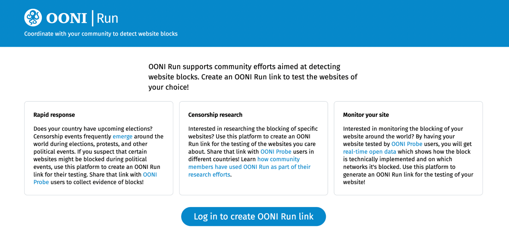
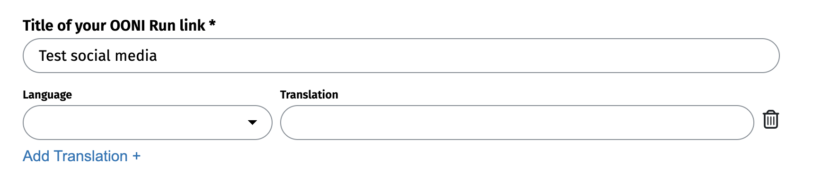
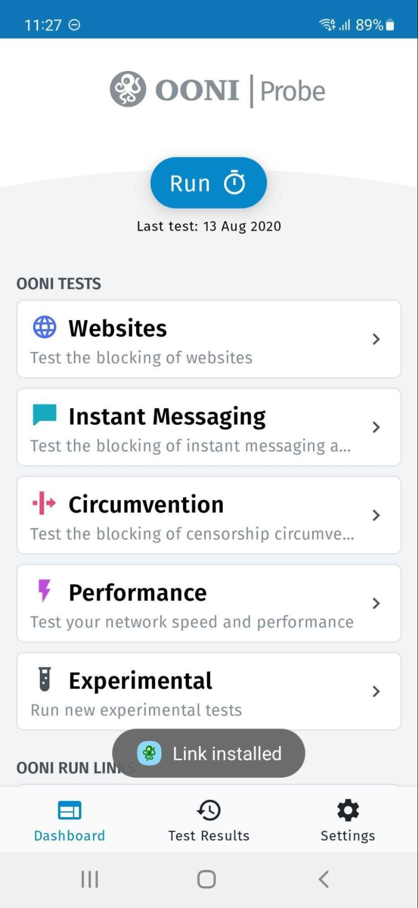

# User Guide: OONI Run

**Last updated:** 18th November 2024

{{}}

[OONI Run](https://run.ooni.org/) is a web platform that you can use to generate links to coordinate [OONI Probe](https://ooni.org/install/mobile) website testing. Specifically, you can use OONI Run to create links for:
* Testing websites (of your choice) for censorship;
* Coordinating website censorship testing with other [OONI Probe](https://ooni.org/install/mobile) users.

**OONI Run links only work with the [OONI Probe mobile app](https://ooni.org/install/mobile).** To learn how to use OONI Probe, please refer to our [OONI Probe mobile app user guide](https://ooni.org/support/ooni-probe-mobile).

This user guide provides **step-by-step instructions** on how to use the [OONI Run](https://run.ooni.org/) platform for custom OONI Probe website testing.

**What you will get from this guide:**

* Learn how to **create OONI Run links** for testing websites (of your choice) for censorship;

* Learn how to **use OONI Run links** with the [OONI Probe mobile app](https://ooni.org/install/mobile);

* Learn how to **share OONI Run links** with other [OONI Probe mobile app](https://ooni.org/install/mobile) users;

Upon reading this guide, we hope you will feel empowered to share your OONI Run knowledge and skills with others! We also hope this guide helps with coordinating OONI Probe website testing around the world.

The following table of contents should help with navigating the guide.



## Joining the platform

[OONI Run](https://run.ooni.org/) enables you to generate a link to test websites (of your choice) for censorship. You can also share this link with other [OONI Probe mobile app](https://ooni.org/install/mobile) users so that they can test those websites. The first step is to **create an account** on OONI Run platform:

**Step 1.** Click the “**Log In To Create OONI Run Link**” button.

**Step 2.** Add your **email address** in the Email slot.

{{}}

**Note:** We do not store email addresses when you log in, but only when you create an OONI Run link. We store your email address so that when OONI Probe users receive an OONI Run link from you, they can trust it based on your email address (which is displayed in the OONI Run link you create). This can help reduce the risk of running malicious links.

**Step 3.** Click the “**Send me the Link**” button. This will send a link to your email address.

{{}}

**Step 4.** Click the link (“Please login here”) sent to your email to log into the OONI Run v2 platform.

## Creating OONI Run links

You have now logged into the OONI Run platform and can start creating OONI Run links. Here you can customise the title, description, timeframe and a list of URLs for testing. To do this, please use the following instructions: 

**Step 1.** Add a **title** for your OONI Run link. Optionally, you can add translations for your title.

{{}}

**Note:** This title will appear in the OONI Run link card that testers will install in their [OONI Probe mobile app](https://ooni.org/install/mobile). We recommend using a short title which clearly communicates the type of testing performed. In the above example, we have added “Test social media” as a title because we aim to include social media websites for testing in our OONI Run link.

**Step 2.** Add a **short description** for your OONI Run link. Optionally, you can add translations.

{{}}

**Note:** In the above example, we have specified the social media platforms that we plan to add to our OONI Run link, and which we’re asking [OONI Probe mobile app](https://ooni.org/install/mobile) users to test. We recommend specifying the tested platforms or adding other useful context that can help encourage testing.

**Step 3.** Add a (longer) **description** for your OONI Run link. This is an opportunity to communicate details about the testing, and why it’s important. Optionally, you can add translations.

{{}}

**Step 4.** Add an **expiration date** for your OONI Run link.

{{}}

**Note:** Determine the expiration date based on how long you would like OONI Probe users to have the ability to run your OONI Run link.

**Step 5.** Click “Add URL” to start adding URLs to your OONI Run link.

{{}}

### Adding URLs to the list 

The next step is to determine *which* websites you want to test. While thinking about the list of websites you want to share with other OONI Probe users, please consider the following: 

* **Number of URLs you are including**: There is no limit for the number of URLs to include in the OONI Run link. However, the length of the list affects the time and amount of traffic it will take for OONI Probe to run the test. Depending on your goals and context, you may want to limit the list of URLs to a few links to allow users to run tests faster and limit the amount of data they would need to spend for testing.
* **URL formatting**: To ensure that each URL is typed accurately, **please copy-paste it from a browser**. Important things to keep in mind while adding URLs to the list: 
  * Is the website on **HTTP** or **HTTPS**? If the latter, please add an extra `s` after `http`.
  * Does the [domain](https://ooni.org/support/glossary/#domain-name) include `www`? If so, please include it.
  * If the   website is on HTTPS (e.g. https://www.hrw.org/), you don’t need to specify a webpage (e.g., `https://www.hrw.org/publications`), since ISPs usually cannot limit blocking to a specific webpage when it’s hosted on HTTPS. Rather, they would have to block access to the entire website. 

We recommend **creating a list of websites in a text editor**, where each URL is in a separate line. You do not need to separate URLs by commas or in any other way. Please see an example below.

{{}}

Once you've created the list, add it to the platform. 

**Step 1.** Add the URLs that you would like to include in your OONI Run link for testing.

{{}}

**Note:** You can copy and paste your list of URLs into the first URL slot, and each URL will populate each URL row (if copied based on the above text editor formatting).

**Step 2.** Click the **Create Link** button to create your OONI Run link.

You will now see your OONI Run link page which includes the title and description that you added, the expiration date of the link, as well as the list of URLs that you added for testing.

{{}}

## Editing the existing OONI Run link

If you would like to edit your OONI Run link, click the **Edit** button in the top right corner.

{{}}

Alternatively, click the **Update Now** button next to the link expiration date. Both actions will enable you to edit the data in your OONI Run link.

Once the OONI Run link is updated, it will be automatically updated for all users who have it installed in their OONI Probe application if they have “**Install updates automatically**” option enabled. Alternatively, they will be able to update the OONI Run link manually. 

## Updating old OONI Run links

If you have **old OONI Run v1 links** (created through the use of the previous OONI Run platform) that you have embedded as widgets into your website or which you are sharing for testing, **please update them** to use OONI Run v2.

You can update old OONI Run v1 links through the following steps.

**Step 1.** Scroll down towards the end of the page to the “URLs” section.

{{}}

**Step 2.** Click on “**Do you have old OONI Run v1 links? Click here to add URLs from such links**”.

You will now see a pop-up window for adding your old OONI Run v2 link.

{{}}

**Step 3.** Add your old OONI Run v1 link in the “OONI Run Link” field.

{{}}

**Step 4.** Click **Add URLs**.

{{}}

**Step 5.** Click **Create Link** to create a new OONI Run v2 link based on the URLs of your old OONI Run v1 link.

**Note:** Through the data fields of the “Create OONI Run Link” page, you will also need to add a title, description, and expiration date for your new OONI Run v2 link before creating it. 

## Sharing OONI Run links

To **share** your OONI Run link, click the **copy icon** next to your OONI Run link in the “Share this link” section. Then share the copied link with [OONI Probe](https://ooni.org/install/mobile) users who you would like to perform testing.

{{}}

You can also **share your link directly on Twitter/X** by clicking on the “Tweet” button.

Community members often share OONI Run links on Twitter/X when they want to encourage more widespread testing.

{{}}

**Image:** Tweet by Thai Netizen Network sharing an OONI Run link for the testing of Change.org in Thailand.

## Using OONI Run links for website testing

An OONI Run link can only be used with the **OONI Probe mobile app**.

**OONI Run v2 is currently only supported on Android.** We aim to release support for OONI Run v2 on OONI Probe iOS in subsequent versions.

**Step 1.** Please [install the OONI Probe mobile app](https://ooni.org/install/mobile) on [Android](https://play.google.com/store/apps/details?id=org.openobservatory.ooniprobe). If you already have OONI Probe Android installed, **please update to the latest version (4.0.0)** for OONI Run v2 support.

**Step 2.** Tap on the OONI Run link that you received, and **open it with your OONI Probe mobile app** (not with a web browser). This will open a screen in your OONI Probe app, displaying information from the OONI Run link (as illustrated below).

{{}}

As you can see from the above example, we have opened an OONI Run link for the testing of social media in our OONI Probe Android app. This shows information about the requested testing, as well as the list of websites that we are being asked to test.

The **Test Settings of the OONI Run link** include support for:

*   **Automated testing of OONI Run link websites.** By keeping the “Run tests automatically” option enabled, the websites included in the OONI Run link will get tested automatically on an ongoing basis. That way, you don’t need to remember to re-test those websites once you have installed the OONI Run link – the OONI Probe app will do that automatically for you! We recommend keeping this option enabled to help ensure ongoing testing, greater measurement coverage, and enhanced ability to confirm potential blocks.
*   **Automated updates to the OONI Run link.** The person who created the OONI Run link may need to update the link on an ongoing basis to add more websites for testing. Instead of receiving new links each time (when there’s the need to test more websites), you can instead receive updates to your OONI Run link automatically by keeping the “Install updates automatically” option enabled.

**Step 3.** To test the websites included in the OONI Run link, tap **Install Link** in the bottom right corner of the screen. This will **install the OONI Run link in your OONI Probe mobile app**, enabling you to change your OONI Run link settings and to uninstall the OONI Run link at any time.

{{}}

Once installed, you can find your **OONI Run link as a card in the Dashboard** of your OONI Probe mobile app (listed under the “OONI Run Links” section).

{{}}

Now that your OONI Run link has been installed (while being configured to run automatically), you don’t need to do anything else. Your OONI Probe app will automatically test the websites in the OONI Run link on an ongoing basis!

You can find the test results through the **Test Results** tab of your OONI Probe app.

{{}}

By tapping on each of the tested websites displayed, you will find further information, including links to relevant OONI measurements that are **published on [OONI Explorer](https://explorer.ooni.org/) in real-time**.

{{}}

In the above example, we can see that TikTok was found accessible on the tested network. The “Data” button provides access to the raw OONI network measurement data, while the “Show in OONI Explorer” button provides a link to the published measurement. You can share the measurement through the use of the **share button** on the top right corner.

If at any moment you would like to **change your OONI Run link settings**, or **uninstall the OONI Run link** entirely, you can do so through the OONI Run link card installed in your OONI Probe mobile app.

{{}}

Through your installed OONI Run link card, you can change the settings by:
*   Disabling the “Install updates automatically” option if you do not want to receive updates to OONI Run links (including additional or different websites for censorship testing) automatically;
*   Disabling the “Run tests automatically” option if you do not want OONI Probe to test the websites in your OONI Run link on an ongoing basis automatically.

If you would like to remove the OONI Run link card from your OONI Probe app, tap the “Uninstall Link” button.

In the event that you have **disabled automated OONI Run link testing** and would like to **manually test websites** included in your OONI Run link, you can do so by tapping the main “Run” button in the OONI Probe Dashboard, tapping the “Deselect all tests” button (to deselect all other OONI Probe tests), and by **only enabling the OONI Run link test**.

{{}}

### Finding your OONI Run v2 measurements on OONI Explorer

By default, all OONI Probe measurements from OONI Run v2 links are automatically published on [OONI Explorer](https://explorer.ooni.org/) as open data in real-time. But given that OONI Explorer hosts a wealth of data – more than 2 billion measurements collected from 242 countries and territories since 2012 – finding the specific measurements from your OONI Run link was previously quite challenging.

We are excited to share that you can now easily find and aggregate measurements from your specific OONI Run v2 link through OONI Explorer! Specifically, you can **filter measurements** in both the OONI Explorer [Search Tool](https://explorer.ooni.org/search) and [Measurement Aggregation Toolkit (MAT)](https://explorer.ooni.org/chart/mat) based on the ID of your OONI Run v2 link (“**OONI Run Link ID**”).

The ID of your OONI Run link are the **last digits** displayed in the link. In the following example, the OONI Run link ID is `10015`.

{{}}

You can find measurements collected by all those who ran your OONI Run link through the following steps.

**Step 1.** Access the OONI Explorer Search Tool: [https://explorer.ooni.org/search](https://explorer.ooni.org/search)

{{}}

**Step 2.** Add the last digits of your OONI Run link in the “OONI Run Link ID” field on the left. Below we have added `10015` based on the previous OONI Run link example.

{{}}

**Step 3.** Click the **Filter Results** button. 

{{}}

You have now filtered OONI Explorer measurements to only view those collected based on your OONI Run v2 link.

{{}}

Similarly, you can use the ID of your OONI Run link to aggregate measurements from your specific OONI Run v2 link through the OONI Explorer [Measurement Aggregation Toolkit (MAT)](https://explorer.ooni.org/chart/mat). By adding the ID digits in the “**OONI Run Link ID**” field of the MAT and clicking **Show Chart**, you will generate charts that are limited to the measurements collected through your OONI Run link.

{{}}

## Optional, but encouraged: Adding your websites to test lists

If some of the websites that you used for OONI Run links are relevant for country-wide or worldwide testing, please **propose them for the lists of websites ("[test lists](https://ooni.org/get-involved/contribute-test-lists)") tested by all OONI Probe users.** You can do so through our [Test Lists Editor](https://test-lists.ooni.org/).

{{}}

Please refer to [our guide](https://ooni.org/support/test-lists-editor) to learn **how to update test lists using the Test Lists Editor**.
