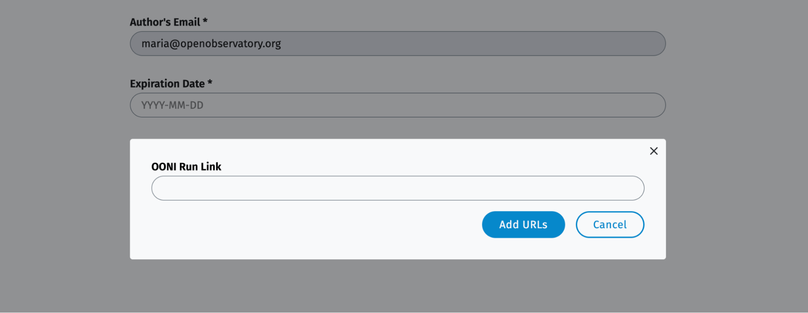

# User Guide: OONI Run

**Last updated:** 13th December 2022

{{}}

[OONI Run](https://run.ooni.io/) is a web platform that you can use to generate mobile deep links and widget code to coordinate [OONI Probe](https://ooni.org/install/mobile) website testing. Specifically, you can use OONI Run to create links or widget code for:

* Testing websites (of your choice) for censorship;
* Coordinating website censorship testing with other [OONI Probe](https://ooni.org/install/mobile) users.

**OONI Run links only work with the [OONI Probe mobile app](https://ooni.org/install/mobile).** To learn how to
use OONI Probe, please refer to our [OONI Probe mobile app user guide](https://ooni.org/support/ooni-probe-mobile).

This user guide provides **step-by-step instructions** on how to use the [OONI Run](https://run.ooni.io/) platform for custom OONI Probe website testing.

**What you will get from this guide:**

* Learn how to **create OONI Run links** for testing websites (of your choice) for censorship;

* Learn how to **use OONI Run links** with the [OONI Probe mobile app](https://ooni.org/install/mobile);

* Learn how to **share OONI Run links** with other [OONI Probe mobile app](https://ooni.org/install/mobile) users;

* Learn how to **generate OONI Run widget code**.

Upon reading this guide, we hope you will feel empowered to share your OONI Run knowledge and skills with others! We also hope this guide helps with coordinating OONI Probe website testing around the world.

The following table of contents should help with navigating the guide.

* [Creating OONI Run links](#creating-ooni-run-links)

* [Using and sharing OONI Run links for website testing](#using-and-sharing-ooni-run-links-for-website-testing)

* [Creating OONI Run widget code for website testing](#creating-ooni-run-widget-code-for-website-testing)

* [Optional, but encouraged: Adding your websites to test lists](#optional-but-encouraged-adding-your-websites-to-test-lists)

## Creating OONI Run links

[OONI Run](https://run.ooni.io/) enables you to generate a link to test websites (of your choice) for censorship. You can also share this link with other [OONI Probe mobile [app](https://ooni.org/install/mobile) users so that they can test those websites. The first step is to determine *which* websites you want to test.

**Step 1.** Create a list of websites in a text editor, where each URL is in a separate line. You do not need to separate URLs by commas or in any other way. Please see an example below.

{{}}

**Important:** Please ensure that each
[URL](https://ooni.org/support/glossary/#url) is typed correctly. If it is mis-typed, [OONI Probe](https://ooni.org/install/mobile) will *not* test the intended website and this will potentially lead to inaccurate test results.

A few things to keep in mind:

* Is the website on **HTTP** or **HTTPS**? If the latter, please add an extra `s` after `http`.

* Does the [domain](https://ooni.org/support/glossary/#domain-name) include `www`? If so, please include it.

* If the website is on HTTPS (e.g. `https://www.hrw.org/`), you don't need to specify a webpage (e.g., `https://www.hrw.org/publications`), since ISPs usually cannot limit blocking to a specific webpage when it's hosted on HTTPS. Rather, they would have to block access to the entire website.

To ensure that each [URL](https://ooni.org/support/glossary/#url) is typed accurately, **please copy-paste it from a browser.**

If you don't have specific websites in mind, you can refer to the [public lists](https://github.com/citizenlab/test-lists/tree/master/lists) ("[test lists](https://ooni.org/get-involved/contribute-test-lists)") that [OONI Probe](https://ooni.org/install/) uses for testing. These lists include a wide range of websites, all of which are [thematically categorized](https://github.com/citizenlab/test-lists/blob/master/lists/00-LEGEND-new_category_codes.csv) (e.g. news media, human rights).

**Step 2.** **Copy** your list of URLs (from your text editor).

**Step 3.** Visit the **OONI Run** website: [https://run.ooni.io/](https://run.ooni.io/)

{{}}

**Step 4.** **Paste** your list of URLs into the first URL slot of the OONI Run page.

You should now see that all of your URLs have populated each URL row in the [OONI Run](https://run.ooni.io/) page.

{{}}

If you notice any empty rows (or otherwise misformatted URLs), please delete them by clicking on the **deletion icon** or edit them by clicking on the URL field.

**Step 5.** Click the **Generate** button at the end of your list.

{{}}

You will now see the following pop-up window.

{{}}

You have generated an **OONI Run mobile deep link** for the testing of your list of websites.

## Using and sharing OONI Run links for website testing

**Step 1.** An OONI Run link can only be used with the **OONI Probe mobile app**. Please **[install the OONI Probe mobile app](https://ooni.org/install/mobile)**. It's available for [Android](https://play.google.com/store/apps/details?id=org.openobservatory.ooniprobe), [F-Droid](https://f-droid.org/repository/browse/?fdid=org.openobservatory.ooniprobe) and [iOS](https://itunes.apple.com/us/app/id1199566366).

{{}}

**Step 2.** Copy the link generated in the previous section either by:

* Clicking the link under "**Share this link with OONI Probe mobile app users**", pressing Control+A to select the whole link, and subsequently pressing Control + C to copy it; or

* Right-clicking the **Link button** and selecting "Copy link address".

{{}}

**Step 3.** As you're probably doing all these steps from your desktop, **share the copied link with your mobile phone** (so that you can subsequently open the link with your [OONI Probe mobile app](https://ooni.org/install/mobile)). Unfortunately, it's not currently possible to use OONI Run links with the OONI Probe Desktop app.

You can also **share this link with other [OONI Probe mobile app](https://ooni.org/install/mobile) users**, if you
would like them to test your list of websites as well.

**Step 4.** **Tap** on the OONI Run link **from your mobile device**.

{{}}

**Step 5.** **Open** the link with your **OONI Probe mobile app** (not
with a web browser).

{{}}

You should now see your list of websites in your OONI Probe mobile app.

{{}}

**Step 6.** Tap **Run** to test your list of websites. Depending on the length of your list and the performance of the network you're connected to, the test runtime may vary. If the test takes too long and you would like to terminate it, you can **stop the ongoing test by tapping the cross button** at the top of the screen.

{{}}

Once you complete the testing based on an OONI Run link, your OONI Probe test results will automatically get published on [OONI Explorer](https://explorer.ooni.org/) and on the [OONI API](https://api.ooni.io/) in near real-time. You will also have immediate [access to your test results through the OONI Probe mobile app](https://ooni.org/support/ooni-probe-mobile#websites).

To learn more about accessing and sharing OONI Probe test results,
please refer to our [OONI Probe mobile app user guide](https://ooni.org/support/ooni-probe-mobile).

## Creating OONI Run widget code for website testing

Instead of sharing OONI Run links, you can **generate OONI Run widget code**, which you can **embed into your website to encourage (long-term) OONI Probe testing of websites** that you care about.

For example, we have [embedded several OONI Run widgets into our website](https://ooni.org/get-involved/run) to enable
community members to more easily test specific websites (such as social media, news media, and VPN websites). This is often easier than sharing OONI Run links every time.

{{}}

Below we share an example of how our partner, [Sinar Project](https://ooni.org/partners/sinar-project/),
embedded OONI Run widgets into their website to [encourage the testing of specific websites](https://sinarproject.org/digital-rights/measuring-and-detecting-network-interference/ge15) during Malaysia's 2022 general election.

{{}}

To create your own OONI Run widget:

**Step 1.** When generating an OONI Run link (see section on "Creating OONI Run links"), the pop-up window will **also generate widget code** for the testing of the websites that you added to the OONI Run platform. This widget code is highlighted in the image below.

{{}}

**Step 2.** You can embed an OONI Run widget into your website as **a simple button** or as **a tall banner**.

**If you would like to add an OONI run button on your website**, you can copy and paste the widget code from the pop-up window. For a simple button use the `<a href` under the `/* For a simple button */` section, or if you would prefer to add a banner, use the code after the `/* For a tall banner */` section.

You will also have to include the widget script code, generally in the base layout of your website:

```
/* If you have not already included the OONI widget code */
<script src='https://cdn.jsdelivr.net/npm/ooni-run/dist/widgets.js'></script>
```

By default, the button will say “Run OONI!” but you can change this text by editing `Run OONI!` in the code. The banner will say “Fight Censorship” but you can change that by editing `Fight Censorship` in the code.

## Optional, but encouraged: Adding your websites to test lists

If some of the websites that you used for OONI Run links or widget code are relevant for country-wide or worldwide testing, please **propose them for the lists of websites ("[test lists](https://ooni.org/get-involved/contribute-test-lists)") tested by all OONI Probe users.** You can do so through our [Test Lists Editor](https://test-lists.ooni.org/).

{{}}

Please refer to [our guide](https://ooni.org/support/test-lists-editor) to learn **how to update test lists using the Test Lists Editor**.
